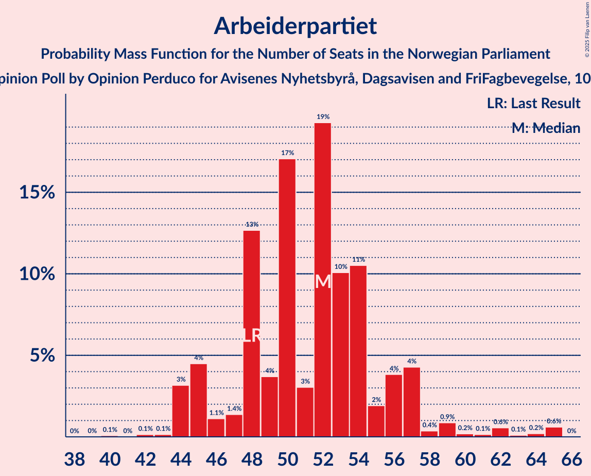
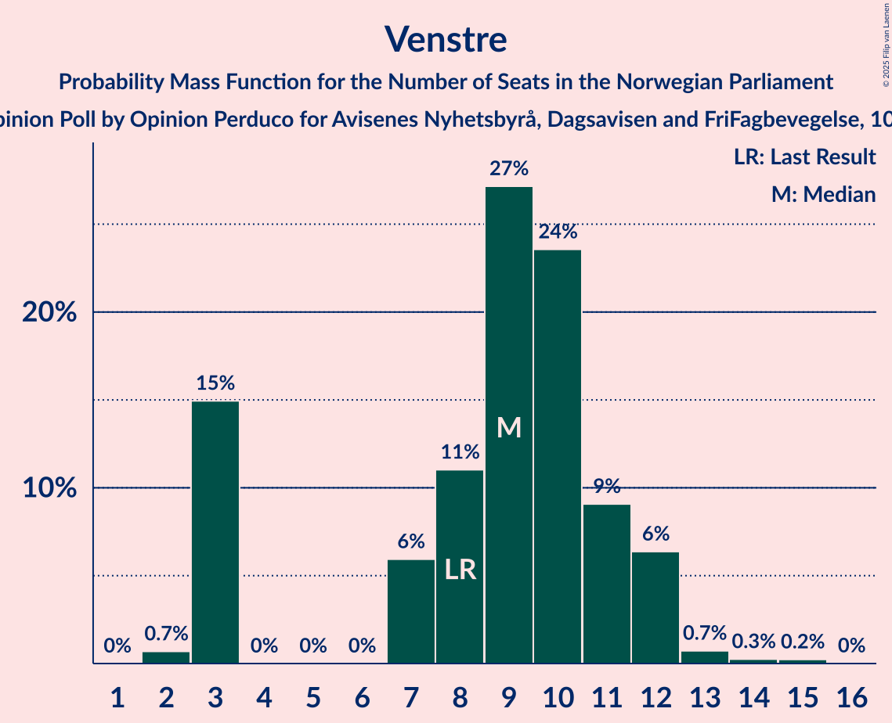
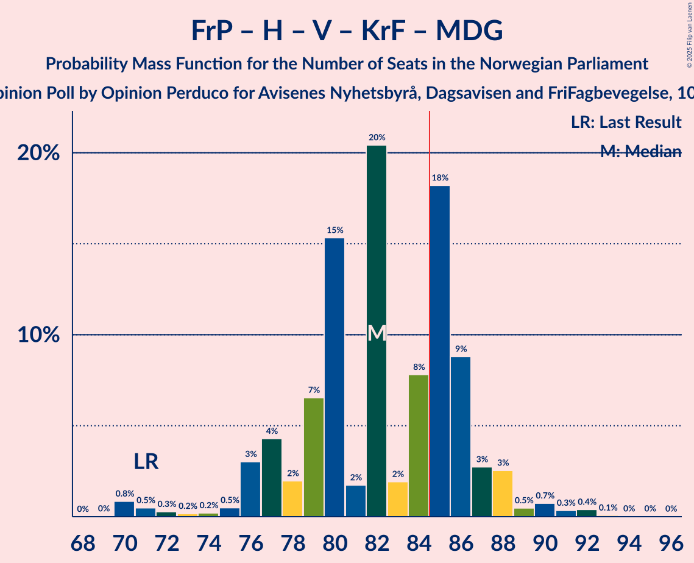
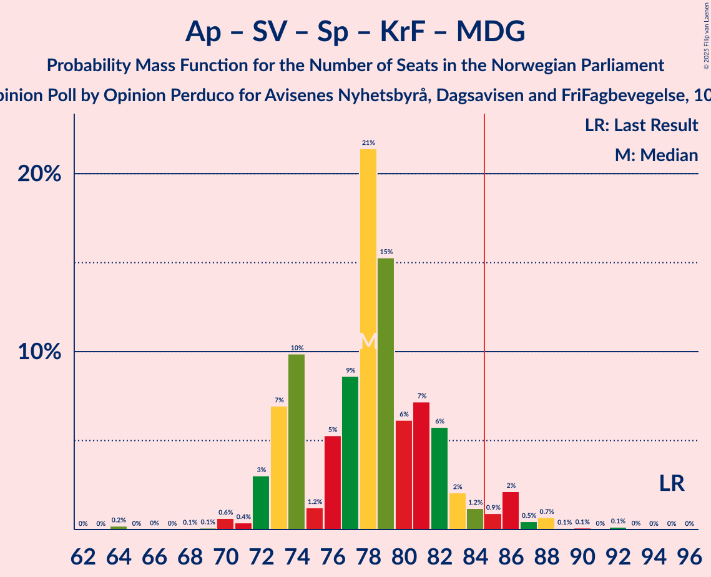
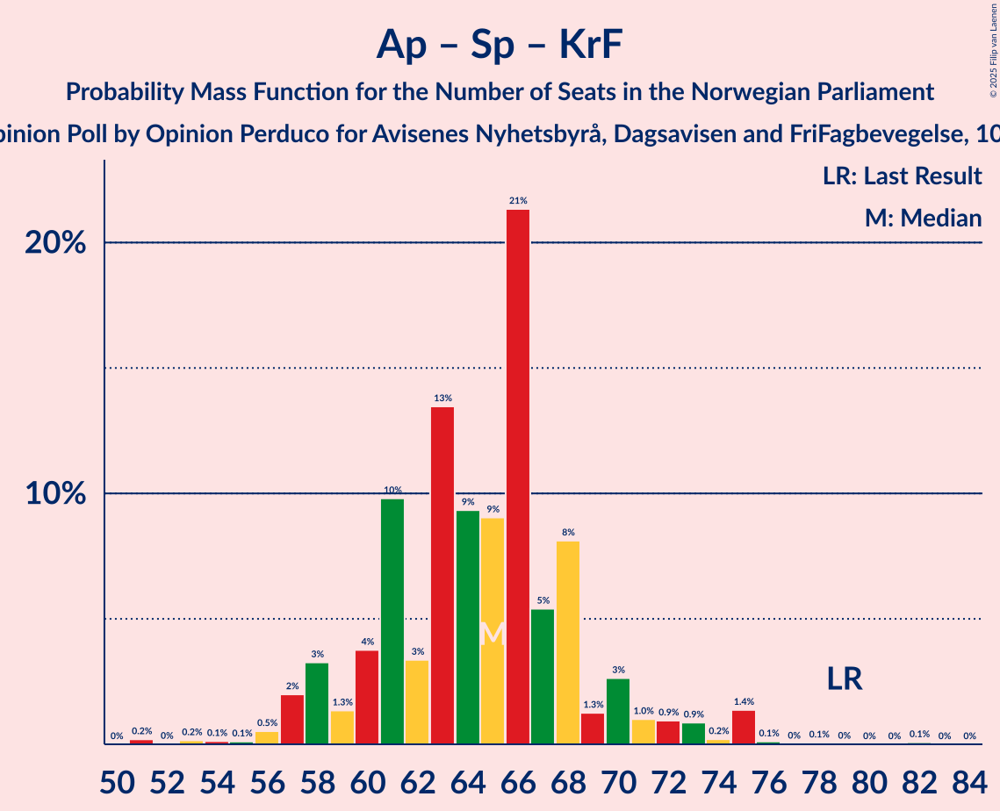

# Opinion Poll by Opinion Perduco for Avisenes Nyhetsbyrå, Dagsavisen and FriFagbevegelse, 10–16 June 2025

<a href="#voting-intentions">Voting Intentions</a> | <a href="#seats">Seats</a> | <a href="#coalitions">Coalitions</a> | <a href="#technical-information">Technical Information</a>

## Voting Intentions

### Confidence Intervals

| Party | Last Result | Poll Result | 80% Confidence Interval | 90% Confidence Interval | 95% Confidence Interval | 99% Confidence Interval |
|:-----:|:-----------:|:-----------:|:-----------------------:|:-----------------------:|:-----------------------:|:-----------------------:|
| Arbeiderpartiet | 26.2% | 26.8% | 24.8–29.0% |24.2–29.6% |23.7–30.2% |22.7–31.2% |
| Fremskrittspartiet | 11.6% | 22.8% | 20.9–24.9% |20.3–25.5% |19.9–26.0% |19.0–27.0% |
| Høyre | 20.4% | 14.2% | 12.6–16.0% |12.2–16.5% |11.8–16.9% |11.1–17.8% |
| Rødt | 4.7% | 7.4% | 6.2–8.8% |5.9–9.2% |5.7–9.5% |5.2–10.2% |
| Sosialistisk Venstreparti | 7.6% | 6.9% | 5.9–8.3% |5.6–8.7% |5.3–9.1% |4.8–9.7% |
| Senterpartiet | 13.5% | 5.4% | 4.5–6.7% |4.2–7.0% |4.0–7.3% |3.6–8.0% |
| Venstre | 4.6% | 5.1% | 4.2–6.4% |4.0–6.7% |3.7–7.0% |3.4–7.6% |
| Kristelig Folkeparti | 3.8% | 3.3% | 2.6–4.4% |2.4–4.7% |2.3–4.9% |2.0–5.5% |
| Miljøpartiet De Grønne | 3.9% | 2.4% | 1.8–3.3% |1.6–3.5% |1.5–3.7% |1.2–4.2% |
| Konservativt | 0.4% | 1.7% | 1.2–2.5% |1.1–2.7% |1.0–2.9% |0.8–3.3% |
| Norgesdemokratene | 1.1% | 1.2% | 0.9–2.0% |0.7–2.2% |0.7–2.4% |0.5–2.8% |
| Industri- og Næringspartiet | 0.3% | 0.8% | 0.5–1.5% |0.4–1.6% |0.4–1.8% |0.3–2.2% |
| Pensjonistpartiet | 0.6% | 0.6% | 0.3–1.1% |0.3–1.3% |0.2–1.4% |0.1–1.7% |

*Note:* The poll result column reflects the actual value used in the calculations. Published results may vary slightly, and in addition be rounded to fewer digits.

## Seats

### Confidence Intervals

| Party | Last Result | Median | 80% Confidence Interval | 90% Confidence Interval | 95% Confidence Interval | 99% Confidence Interval |
|:-----:|:-----------:|:------:|:-----------------------:|:-----------------------:|:-----------------------:|:-----------------------:|
| <a href="#arbeiderpartiet">Arbeiderpartiet</a> | 48 | 52 | 47–56 |45–57 |44–59 |44–65 |
| <a href="#fremskrittspartiet">Fremskrittspartiet</a> | 21 | 44 | 40–47 |38–48 |38–49 |37–52 |
| <a href="#høyre">Høyre</a> | 36 | 26 | 20–30 |20–30 |19–31 |19–33 |
| <a href="#rødt">Rødt</a> | 8 | 13 | 11–17 |10–17 |10–17 |9–18 |
| <a href="#sosialistisk-venstreparti">Sosialistisk Venstreparti</a> | 13 | 12 | 10–15 |10–15 |10–16 |9–18 |
| <a href="#senterpartiet">Senterpartiet</a> | 28 | 11 | 7–12 |6–13 |6–13 |0–14 |
| <a href="#venstre">Venstre</a> | 8 | 9 | 3–11 |3–12 |3–12 |2–13 |
| <a href="#kristelig-folkeparti">Kristelig Folkeparti</a> | 3 | 3 | 2–7 |1–7 |1–8 |0–9 |
| <a href="#miljøpartiet-de-grønne">Miljøpartiet De Grønne</a> | 3 | 1 | 1–2 |1–3 |0–3 |0–7 |
| <a href="#konservativt">Konservativt</a> | 0 | 0 | 0 |0 |0–1 |0–2 |
| <a href="#norgesdemokratene">Norgesdemokratene</a> | 0 | 0 | 0 |0 |0 |0 |
| <a href="#industri--og-næringspartiet">Industri- og Næringspartiet</a> | 0 | 0 | 0 |0 |0 |0 |
| <a href="#pensjonistpartiet">Pensjonistpartiet</a> | 0 | 0 | 0 |0 |0 |0 |

### Arbeiderpartiet

*For a full overview of the results for this party, see the [Arbeiderpartiet](party-arbeiderpartiet.html) page.*

| Number of Seats | Probability | Accumulated | Special Marks |
|:---------------:|:-----------:|:-----------:|:-------------:|
| 40 | 0.1% | 100% |  |
| 41 | 0% | 99.9% |  |
| 42 | 0.1% | 99.9% |  |
| 43 | 0.1% | 99.8% |  |
| 44 | 3% | 99.6% |  |
| 45 | 4% | 96% |  |
| 46 | 1.1% | 92% |  |
| 47 | 1.4% | 91% |  |
| 48 | 13% | 89% | Last Result |
| 49 | 4% | 77% |  |
| 50 | 17% | 73% |  |
| 51 | 3% | 56% |  |
| 52 | 19% | 53% | Median |
| 53 | 10% | 34% |  |
| 54 | 11% | 24% |  |
| 55 | 2% | 13% |  |
| 56 | 4% | 11% |  |
| 57 | 4% | 7% |  |
| 58 | 0.4% | 3% |  |
| 59 | 0.9% | 3% |  |
| 60 | 0.2% | 2% |  |
| 61 | 0.1% | 2% |  |
| 62 | 0.6% | 2% |  |
| 63 | 0.1% | 0.9% |  |
| 64 | 0.2% | 0.8% |  |
| 65 | 0.6% | 0.6% |  |
| 66 | 0% | 0% |  |

### Fremskrittspartiet

*For a full overview of the results for this party, see the [Fremskrittspartiet](party-fremskrittspartiet.html) page.*

| Number of Seats | Probability | Accumulated | Special Marks |
|:---------------:|:-----------:|:-----------:|:-------------:|
| 21 | 0% | 100% | Last Result |
| 22 | 0% | 100% |  |
| 23 | 0% | 100% |  |
| 24 | 0% | 100% |  |
| 25 | 0% | 100% |  |
| 26 | 0% | 100% |  |
| 27 | 0% | 100% |  |
| 28 | 0% | 100% |  |
| 29 | 0% | 100% |  |
| 30 | 0% | 100% |  |
| 31 | 0% | 100% |  |
| 32 | 0% | 100% |  |
| 33 | 0% | 100% |  |
| 34 | 0% | 100% |  |
| 35 | 0.1% | 100% |  |
| 36 | 0.2% | 99.9% |  |
| 37 | 0.4% | 99.7% |  |
| 38 | 5% | 99.3% |  |
| 39 | 4% | 94% |  |
| 40 | 7% | 90% |  |
| 41 | 4% | 83% |  |
| 42 | 15% | 80% |  |
| 43 | 11% | 65% |  |
| 44 | 22% | 55% | Median |
| 45 | 14% | 33% |  |
| 46 | 5% | 19% |  |
| 47 | 5% | 14% |  |
| 48 | 5% | 9% |  |
| 49 | 2% | 3% |  |
| 50 | 0.8% | 2% |  |
| 51 | 0.3% | 0.8% |  |
| 52 | 0.3% | 0.5% |  |
| 53 | 0% | 0.2% |  |
| 54 | 0.1% | 0.2% |  |
| 55 | 0.1% | 0.1% |  |
| 56 | 0% | 0% |  |

### Høyre

*For a full overview of the results for this party, see the [Høyre](party-høyre.html) page.*

| Number of Seats | Probability | Accumulated | Special Marks |
|:---------------:|:-----------:|:-----------:|:-------------:|
| 17 | 0.1% | 100% |  |
| 18 | 0.3% | 99.9% |  |
| 19 | 3% | 99.6% |  |
| 20 | 9% | 97% |  |
| 21 | 3% | 88% |  |
| 22 | 3% | 84% |  |
| 23 | 5% | 81% |  |
| 24 | 19% | 76% |  |
| 25 | 5% | 56% |  |
| 26 | 11% | 51% | Median |
| 27 | 11% | 41% |  |
| 28 | 6% | 29% |  |
| 29 | 6% | 24% |  |
| 30 | 14% | 18% |  |
| 31 | 2% | 4% |  |
| 32 | 1.4% | 2% |  |
| 33 | 0.5% | 0.6% |  |
| 34 | 0% | 0.1% |  |
| 35 | 0% | 0% |  |
| 36 | 0% | 0% | Last Result |

### Rødt

*For a full overview of the results for this party, see the [Rødt](party-rødt.html) page.*

| Number of Seats | Probability | Accumulated | Special Marks |
|:---------------:|:-----------:|:-----------:|:-------------:|
| 8 | 0.2% | 100% | Last Result |
| 9 | 0.7% | 99.8% |  |
| 10 | 7% | 99.1% |  |
| 11 | 10% | 92% |  |
| 12 | 10% | 82% |  |
| 13 | 34% | 72% | Median |
| 14 | 13% | 38% |  |
| 15 | 5% | 25% |  |
| 16 | 6% | 19% |  |
| 17 | 13% | 14% |  |
| 18 | 0.4% | 0.8% |  |
| 19 | 0.2% | 0.4% |  |
| 20 | 0.2% | 0.2% |  |
| 21 | 0% | 0% |  |

### Sosialistisk Venstreparti

*For a full overview of the results for this party, see the [Sosialistisk Venstreparti](party-sosialistiskvenstreparti.html) page.*

| Number of Seats | Probability | Accumulated | Special Marks |
|:---------------:|:-----------:|:-----------:|:-------------:|
| 3 | 0.1% | 100% |  |
| 4 | 0% | 99.9% |  |
| 5 | 0% | 99.9% |  |
| 6 | 0% | 99.9% |  |
| 7 | 0% | 99.9% |  |
| 8 | 0.4% | 99.9% |  |
| 9 | 2% | 99.6% |  |
| 10 | 14% | 98% |  |
| 11 | 28% | 84% |  |
| 12 | 22% | 55% | Median |
| 13 | 20% | 33% | Last Result |
| 14 | 2% | 13% |  |
| 15 | 6% | 11% |  |
| 16 | 4% | 5% |  |
| 17 | 0.4% | 0.9% |  |
| 18 | 0.5% | 0.5% |  |
| 19 | 0% | 0.1% |  |
| 20 | 0% | 0% |  |

### Senterpartiet

*For a full overview of the results for this party, see the [Senterpartiet](party-senterpartiet.html) page.*

| Number of Seats | Probability | Accumulated | Special Marks |
|:---------------:|:-----------:|:-----------:|:-------------:|
| 0 | 0.8% | 100% |  |
| 1 | 1.2% | 99.2% |  |
| 2 | 0.2% | 98% |  |
| 3 | 0% | 98% |  |
| 4 | 0% | 98% |  |
| 5 | 0% | 98% |  |
| 6 | 7% | 98% |  |
| 7 | 4% | 91% |  |
| 8 | 11% | 87% |  |
| 9 | 17% | 76% |  |
| 10 | 8% | 58% |  |
| 11 | 22% | 50% | Median |
| 12 | 20% | 28% |  |
| 13 | 6% | 8% |  |
| 14 | 2% | 2% |  |
| 15 | 0.2% | 0.2% |  |
| 16 | 0% | 0% |  |
| 17 | 0% | 0% |  |
| 18 | 0% | 0% |  |
| 19 | 0% | 0% |  |
| 20 | 0% | 0% |  |
| 21 | 0% | 0% |  |
| 22 | 0% | 0% |  |
| 23 | 0% | 0% |  |
| 24 | 0% | 0% |  |
| 25 | 0% | 0% |  |
| 26 | 0% | 0% |  |
| 27 | 0% | 0% |  |
| 28 | 0% | 0% | Last Result |

### Venstre

*For a full overview of the results for this party, see the [Venstre](party-venstre.html) page.*

| Number of Seats | Probability | Accumulated | Special Marks |
|:---------------:|:-----------:|:-----------:|:-------------:|
| 2 | 0.7% | 100% |  |
| 3 | 15% | 99.3% |  |
| 4 | 0% | 84% |  |
| 5 | 0% | 84% |  |
| 6 | 0% | 84% |  |
| 7 | 6% | 84% |  |
| 8 | 11% | 78% | Last Result |
| 9 | 27% | 67% | Median |
| 10 | 24% | 40% |  |
| 11 | 9% | 17% |  |
| 12 | 6% | 8% |  |
| 13 | 0.7% | 1.2% |  |
| 14 | 0.3% | 0.5% |  |
| 15 | 0.2% | 0.2% |  |
| 16 | 0% | 0% |  |

### Kristelig Folkeparti

*For a full overview of the results for this party, see the [Kristelig Folkeparti](party-kristeligfolkeparti.html) page.*

| Number of Seats | Probability | Accumulated | Special Marks |
|:---------------:|:-----------:|:-----------:|:-------------:|
| 0 | 1.0% | 100% |  |
| 1 | 7% | 99.0% |  |
| 2 | 38% | 92% |  |
| 3 | 32% | 54% | Last Result, Median |
| 4 | 0% | 22% |  |
| 5 | 0% | 22% |  |
| 6 | 7% | 22% |  |
| 7 | 10% | 15% |  |
| 8 | 3% | 5% |  |
| 9 | 1.5% | 2% |  |
| 10 | 0.2% | 0.4% |  |
| 11 | 0.2% | 0.2% |  |
| 12 | 0% | 0% |  |

### Miljøpartiet De Grønne

*For a full overview of the results for this party, see the [Miljøpartiet De Grønne](party-miljøpartietdegrønne.html) page.*

| Number of Seats | Probability | Accumulated | Special Marks |
|:---------------:|:-----------:|:-----------:|:-------------:|
| 0 | 4% | 100% |  |
| 1 | 56% | 96% | Median |
| 2 | 31% | 41% |  |
| 3 | 9% | 10% | Last Result |
| 4 | 0% | 0.9% |  |
| 5 | 0% | 0.9% |  |
| 6 | 0% | 0.9% |  |
| 7 | 0.7% | 0.8% |  |
| 8 | 0.1% | 0.2% |  |
| 9 | 0% | 0.1% |  |
| 10 | 0% | 0% |  |

### Konservativt

*For a full overview of the results for this party, see the [Konservativt](party-konservativt.html) page.*

| Number of Seats | Probability | Accumulated | Special Marks |
|:---------------:|:-----------:|:-----------:|:-------------:|
| 0 | 97% | 100% | Last Result, Median |
| 1 | 1.4% | 3% |  |
| 2 | 2% | 2% |  |
| 3 | 0% | 0% |  |

### Norgesdemokratene

*For a full overview of the results for this party, see the [Norgesdemokratene](party-norgesdemokratene.html) page.*

| Number of Seats | Probability | Accumulated | Special Marks |
|:---------------:|:-----------:|:-----------:|:-------------:|
| 0 | 100% | 100% | Last Result, Median |

### Industri- og Næringspartiet

*For a full overview of the results for this party, see the [Industri- og Næringspartiet](party-industri-ognæringspartiet.html) page.*

| Number of Seats | Probability | Accumulated | Special Marks |
|:---------------:|:-----------:|:-----------:|:-------------:|
| 0 | 99.9% | 100% | Last Result, Median |
| 1 | 0% | 0.1% |  |
| 2 | 0.1% | 0.1% |  |
| 3 | 0% | 0% |  |

### Pensjonistpartiet

*For a full overview of the results for this party, see the [Pensjonistpartiet](party-pensjonistpartiet.html) page.*

| Number of Seats | Probability | Accumulated | Special Marks |
|:---------------:|:-----------:|:-----------:|:-------------:|
| 0 | 100% | 100% | Last Result, Median |

## Coalitions

### Confidence Intervals

| Coalition | Last Result | Median | Majority? | 80% Confidence Interval | 90% Confidence Interval | 95% Confidence Interval | 99% Confidence Interval |
|:---------:|:-----------:|:------:|:---------:|:-----------------------:|:-----------------------:|:-----------------------:|:-----------------------:|
| Fremskrittspartiet – Høyre – Senterpartiet – Venstre – Kristelig Folkeparti | 96 | 91 | 96% | 87–95 | 85–95 | 83–97 | 78–98 |
| Arbeiderpartiet – Rødt – Sosialistisk Venstreparti – Senterpartiet – Miljøpartiet De Grønne | 100 | 89 | 83% | 84–93 | 83–94 | 82–95 | 79–100 |
| Arbeiderpartiet – Rødt – Sosialistisk Venstreparti – Senterpartiet | 97 | 87 | 64% | 82–91 | 81–93 | 81–93 | 77–99 |
| Fremskrittspartiet – Høyre – Venstre – Kristelig Folkeparti – Miljøpartiet De Grønne | 71 | 82 | 34% | 78–86 | 76–87 | 75–88 | 70–92 |
| Fremskrittspartiet – Høyre – Venstre – Kristelig Folkeparti | 68 | 80 | 12% | 76–85 | 75–86 | 74–87 | 69–90 |
| Arbeiderpartiet – Sosialistisk Venstreparti – Senterpartiet – Kristelig Folkeparti – Miljøpartiet De Grønne | 95 | 78 | 5% | 73–82 | 73–84 | 72–86 | 70–88 |
| Arbeiderpartiet – Rødt – Sosialistisk Venstreparti – Miljøpartiet De Grønne | 72 | 78 | 4% | 74–82 | 73–84 | 72–86 | 71–91 |
| Arbeiderpartiet – Sosialistisk Venstreparti – Senterpartiet – Miljøpartiet De Grønne | 92 | 75 | 1.2% | 70–79 | 69–81 | 69–83 | 67–85 |
| Fremskrittspartiet – Høyre – Venstre | 65 | 78 | 1.2% | 74–82 | 72–82 | 69–83 | 68–86 |
| Arbeiderpartiet – Sosialistisk Venstreparti – Senterpartiet | 89 | 73 | 0.2% | 68–77 | 68–79 | 66–81 | 65–84 |
| Fremskrittspartiet – Høyre | 57 | 69 | 0% | 64–74 | 63–74 | 62–74 | 60–77 |
| Arbeiderpartiet – Senterpartiet – Kristelig Folkeparti – Miljøpartiet De Grønne | 82 | 66 | 0% | 61–70 | 60–72 | 60–74 | 56–76 |
| Arbeiderpartiet – Senterpartiet – Kristelig Folkeparti | 79 | 65 | 0% | 60–68 | 58–70 | 57–73 | 54–75 |
| Arbeiderpartiet – Sosialistisk Venstreparti | 61 | 64 | 0% | 59–68 | 57–69 | 57–71 | 56–75 |
| Arbeiderpartiet – Senterpartiet | 76 | 61 | 0% | 57–65 | 55–67 | 54–67 | 52–74 |
| Høyre – Venstre – Kristelig Folkeparti | 47 | 37 | 0% | 33–43 | 31–44 | 29–45 | 28–47 |
| Senterpartiet – Venstre – Kristelig Folkeparti | 39 | 23 | 0% | 17–26 | 17–27 | 16–28 | 12–32 |

### Fremskrittspartiet – Høyre – Senterpartiet – Venstre – Kristelig Folkeparti

| Number of Seats | Probability | Accumulated | Special Marks |
|:---------------:|:-----------:|:-----------:|:-------------:|
| 77 | 0% | 100% |  |
| 78 | 0.6% | 99.9% |  |
| 79 | 0.6% | 99.3% |  |
| 80 | 0.1% | 98.7% |  |
| 81 | 0.2% | 98.5% |  |
| 82 | 0.5% | 98% |  |
| 83 | 0.8% | 98% |  |
| 84 | 1.3% | 97% |  |
| 85 | 2% | 96% | Majority |
| 86 | 3% | 94% |  |
| 87 | 4% | 90% |  |
| 88 | 11% | 86% |  |
| 89 | 1.2% | 75% |  |
| 90 | 14% | 74% |  |
| 91 | 26% | 61% |  |
| 92 | 10% | 34% |  |
| 93 | 6% | 24% | Median |
| 94 | 2% | 18% |  |
| 95 | 12% | 16% |  |
| 96 | 1.3% | 4% | Last Result |
| 97 | 1.1% | 3% |  |
| 98 | 2% | 2% |  |
| 99 | 0.2% | 0.4% |  |
| 100 | 0.1% | 0.2% |  |
| 101 | 0% | 0.1% |  |
| 102 | 0.1% | 0.1% |  |
| 103 | 0% | 0% |  |

### Arbeiderpartiet – Rødt – Sosialistisk Venstreparti – Senterpartiet – Miljøpartiet De Grønne

| Number of Seats | Probability | Accumulated | Special Marks |
|:---------------:|:-----------:|:-----------:|:-------------:|
| 76 | 0.1% | 100% |  |
| 77 | 0% | 99.9% |  |
| 78 | 0.1% | 99.9% |  |
| 79 | 0.6% | 99.7% |  |
| 80 | 0.5% | 99.2% |  |
| 81 | 1.0% | 98.7% |  |
| 82 | 2% | 98% |  |
| 83 | 1.5% | 95% |  |
| 84 | 11% | 94% |  |
| 85 | 14% | 83% | Majority |
| 86 | 7% | 69% |  |
| 87 | 4% | 61% |  |
| 88 | 5% | 58% |  |
| 89 | 14% | 53% | Median |
| 90 | 21% | 39% |  |
| 91 | 4% | 18% |  |
| 92 | 4% | 14% |  |
| 93 | 3% | 11% |  |
| 94 | 4% | 7% |  |
| 95 | 1.1% | 3% |  |
| 96 | 0.4% | 2% |  |
| 97 | 0.3% | 2% |  |
| 98 | 0.2% | 2% |  |
| 99 | 0.5% | 1.4% |  |
| 100 | 0.9% | 0.9% | Last Result |
| 101 | 0% | 0% |  |

### Arbeiderpartiet – Rødt – Sosialistisk Venstreparti – Senterpartiet

| Number of Seats | Probability | Accumulated | Special Marks |
|:---------------:|:-----------:|:-----------:|:-------------:|
| 73 | 0% | 100% |  |
| 74 | 0% | 99.9% |  |
| 75 | 0.1% | 99.9% |  |
| 76 | 0.1% | 99.9% |  |
| 77 | 0.4% | 99.8% |  |
| 78 | 0.4% | 99.4% |  |
| 79 | 0.7% | 99.0% |  |
| 80 | 0.6% | 98% |  |
| 81 | 3% | 98% |  |
| 82 | 8% | 95% |  |
| 83 | 5% | 87% |  |
| 84 | 18% | 82% |  |
| 85 | 6% | 64% | Majority |
| 86 | 2% | 58% |  |
| 87 | 21% | 56% |  |
| 88 | 2% | 35% | Median |
| 89 | 16% | 33% |  |
| 90 | 5% | 17% |  |
| 91 | 2% | 12% |  |
| 92 | 4% | 10% |  |
| 93 | 3% | 6% |  |
| 94 | 0.5% | 2% |  |
| 95 | 0.2% | 2% |  |
| 96 | 0.2% | 2% |  |
| 97 | 0.3% | 2% | Last Result |
| 98 | 0.5% | 1.4% |  |
| 99 | 0.8% | 0.9% |  |
| 100 | 0% | 0% |  |

### Fremskrittspartiet – Høyre – Venstre – Kristelig Folkeparti – Miljøpartiet De Grønne

| Number of Seats | Probability | Accumulated | Special Marks |
|:---------------:|:-----------:|:-----------:|:-------------:|
| 70 | 0.8% | 100% |  |
| 71 | 0.5% | 99.1% | Last Result |
| 72 | 0.3% | 98.6% |  |
| 73 | 0.2% | 98% |  |
| 74 | 0.2% | 98% |  |
| 75 | 0.5% | 98% |  |
| 76 | 3% | 97% |  |
| 77 | 4% | 94% |  |
| 78 | 2% | 90% |  |
| 79 | 7% | 88% |  |
| 80 | 15% | 82% |  |
| 81 | 2% | 66% |  |
| 82 | 20% | 65% |  |
| 83 | 2% | 44% | Median |
| 84 | 8% | 42% |  |
| 85 | 18% | 34% | Majority |
| 86 | 9% | 16% |  |
| 87 | 3% | 7% |  |
| 88 | 3% | 5% |  |
| 89 | 0.5% | 2% |  |
| 90 | 0.7% | 2% |  |
| 91 | 0.3% | 0.9% |  |
| 92 | 0.4% | 0.6% |  |
| 93 | 0.1% | 0.2% |  |
| 94 | 0% | 0.1% |  |
| 95 | 0% | 0.1% |  |
| 96 | 0% | 0% |  |

### Fremskrittspartiet – Høyre – Venstre – Kristelig Folkeparti

| Number of Seats | Probability | Accumulated | Special Marks |
|:---------------:|:-----------:|:-----------:|:-------------:|
| 68 | 0% | 100% | Last Result |
| 69 | 0.9% | 100% |  |
| 70 | 0.5% | 99.1% |  |
| 71 | 0.2% | 98.6% |  |
| 72 | 0.3% | 98% |  |
| 73 | 0.4% | 98% |  |
| 74 | 1.1% | 98% |  |
| 75 | 4% | 96% |  |
| 76 | 3% | 93% |  |
| 77 | 4% | 89% |  |
| 78 | 5% | 86% |  |
| 79 | 20% | 81% |  |
| 80 | 14% | 61% |  |
| 81 | 4% | 47% |  |
| 82 | 4% | 42% | Median |
| 83 | 11% | 39% |  |
| 84 | 16% | 28% |  |
| 85 | 6% | 12% | Majority |
| 86 | 2% | 6% |  |
| 87 | 2% | 4% |  |
| 88 | 1.0% | 2% |  |
| 89 | 0.5% | 1.3% |  |
| 90 | 0.5% | 0.7% |  |
| 91 | 0.1% | 0.2% |  |
| 92 | 0% | 0.1% |  |
| 93 | 0% | 0.1% |  |
| 94 | 0% | 0% |  |

### Arbeiderpartiet – Sosialistisk Venstreparti – Senterpartiet – Kristelig Folkeparti – Miljøpartiet De Grønne

| Number of Seats | Probability | Accumulated | Special Marks |
|:---------------:|:-----------:|:-----------:|:-------------:|
| 64 | 0.2% | 100% |  |
| 65 | 0% | 99.8% |  |
| 66 | 0% | 99.8% |  |
| 67 | 0% | 99.8% |  |
| 68 | 0.1% | 99.7% |  |
| 69 | 0.1% | 99.7% |  |
| 70 | 0.6% | 99.6% |  |
| 71 | 0.4% | 98.9% |  |
| 72 | 3% | 98.6% |  |
| 73 | 7% | 96% |  |
| 74 | 10% | 89% |  |
| 75 | 1.2% | 79% |  |
| 76 | 5% | 77% |  |
| 77 | 9% | 72% |  |
| 78 | 21% | 64% |  |
| 79 | 15% | 42% | Median |
| 80 | 6% | 27% |  |
| 81 | 7% | 21% |  |
| 82 | 6% | 14% |  |
| 83 | 2% | 8% |  |
| 84 | 1.2% | 6% |  |
| 85 | 0.9% | 5% | Majority |
| 86 | 2% | 4% |  |
| 87 | 0.5% | 1.5% |  |
| 88 | 0.7% | 1.0% |  |
| 89 | 0.1% | 0.4% |  |
| 90 | 0.1% | 0.3% |  |
| 91 | 0% | 0.2% |  |
| 92 | 0.1% | 0.2% |  |
| 93 | 0% | 0% |  |
| 94 | 0% | 0% |  |
| 95 | 0% | 0% | Last Result |

### Arbeiderpartiet – Rødt – Sosialistisk Venstreparti – Miljøpartiet De Grønne

| Number of Seats | Probability | Accumulated | Special Marks |
|:---------------:|:-----------:|:-----------:|:-------------:|
| 66 | 0% | 100% |  |
| 67 | 0.1% | 99.9% |  |
| 68 | 0% | 99.9% |  |
| 69 | 0.1% | 99.8% |  |
| 70 | 0.1% | 99.7% |  |
| 71 | 2% | 99.6% |  |
| 72 | 2% | 98% | Last Result |
| 73 | 4% | 96% |  |
| 74 | 8% | 92% |  |
| 75 | 2% | 84% |  |
| 76 | 9% | 82% |  |
| 77 | 9% | 73% |  |
| 78 | 25% | 64% | Median |
| 79 | 13% | 39% |  |
| 80 | 1.2% | 26% |  |
| 81 | 11% | 25% |  |
| 82 | 5% | 14% |  |
| 83 | 2% | 8% |  |
| 84 | 2% | 6% |  |
| 85 | 1.4% | 4% | Majority |
| 86 | 0.7% | 3% |  |
| 87 | 0.4% | 2% |  |
| 88 | 0.2% | 2% |  |
| 89 | 0.1% | 1.5% |  |
| 90 | 0.6% | 1.3% |  |
| 91 | 0.6% | 0.7% |  |
| 92 | 0% | 0.1% |  |
| 93 | 0% | 0% |  |

### Arbeiderpartiet – Sosialistisk Venstreparti – Senterpartiet – Miljøpartiet De Grønne

| Number of Seats | Probability | Accumulated | Special Marks |
|:---------------:|:-----------:|:-----------:|:-------------:|
| 61 | 0.2% | 100% |  |
| 62 | 0% | 99.8% |  |
| 63 | 0% | 99.8% |  |
| 64 | 0% | 99.7% |  |
| 65 | 0% | 99.7% |  |
| 66 | 0.1% | 99.7% |  |
| 67 | 0.4% | 99.5% |  |
| 68 | 1.3% | 99.1% |  |
| 69 | 4% | 98% |  |
| 70 | 8% | 94% |  |
| 71 | 2% | 85% |  |
| 72 | 19% | 83% |  |
| 73 | 5% | 64% |  |
| 74 | 4% | 60% |  |
| 75 | 15% | 56% |  |
| 76 | 6% | 41% | Median |
| 77 | 16% | 35% |  |
| 78 | 6% | 19% |  |
| 79 | 6% | 13% |  |
| 80 | 2% | 8% |  |
| 81 | 2% | 6% |  |
| 82 | 0.9% | 4% |  |
| 83 | 1.1% | 3% |  |
| 84 | 0.6% | 2% |  |
| 85 | 1.0% | 1.2% | Majority |
| 86 | 0.1% | 0.3% |  |
| 87 | 0.1% | 0.2% |  |
| 88 | 0% | 0% |  |
| 89 | 0% | 0% |  |
| 90 | 0% | 0% |  |
| 91 | 0% | 0% |  |
| 92 | 0% | 0% | Last Result |

### Fremskrittspartiet – Høyre – Venstre

| Number of Seats | Probability | Accumulated | Special Marks |
|:---------------:|:-----------:|:-----------:|:-------------:|
| 64 | 0.1% | 100% |  |
| 65 | 0% | 99.9% | Last Result |
| 66 | 0.1% | 99.9% |  |
| 67 | 0.1% | 99.8% |  |
| 68 | 1.0% | 99.7% |  |
| 69 | 2% | 98.7% |  |
| 70 | 0.6% | 97% |  |
| 71 | 1.2% | 96% |  |
| 72 | 3% | 95% |  |
| 73 | 0.5% | 92% |  |
| 74 | 8% | 91% |  |
| 75 | 5% | 83% |  |
| 76 | 9% | 78% |  |
| 77 | 17% | 70% |  |
| 78 | 23% | 53% |  |
| 79 | 4% | 30% | Median |
| 80 | 9% | 26% |  |
| 81 | 6% | 18% |  |
| 82 | 8% | 11% |  |
| 83 | 0.9% | 3% |  |
| 84 | 1.0% | 2% |  |
| 85 | 0.3% | 1.2% | Majority |
| 86 | 0.4% | 0.8% |  |
| 87 | 0.3% | 0.4% |  |
| 88 | 0% | 0.1% |  |
| 89 | 0% | 0% |  |

### Arbeiderpartiet – Sosialistisk Venstreparti – Senterpartiet

| Number of Seats | Probability | Accumulated | Special Marks |
|:---------------:|:-----------:|:-----------:|:-------------:|
| 60 | 0.2% | 100% |  |
| 61 | 0.1% | 99.8% |  |
| 62 | 0.1% | 99.7% |  |
| 63 | 0% | 99.7% |  |
| 64 | 0.1% | 99.7% |  |
| 65 | 0.4% | 99.6% |  |
| 66 | 2% | 99.2% |  |
| 67 | 1.1% | 97% |  |
| 68 | 6% | 96% |  |
| 69 | 5% | 90% |  |
| 70 | 11% | 84% |  |
| 71 | 9% | 73% |  |
| 72 | 9% | 65% |  |
| 73 | 8% | 55% |  |
| 74 | 8% | 47% |  |
| 75 | 7% | 39% | Median |
| 76 | 17% | 32% |  |
| 77 | 7% | 15% |  |
| 78 | 1.3% | 8% |  |
| 79 | 3% | 7% |  |
| 80 | 1.1% | 4% |  |
| 81 | 0.9% | 3% |  |
| 82 | 0.2% | 2% |  |
| 83 | 0.6% | 2% |  |
| 84 | 1.0% | 1.1% |  |
| 85 | 0% | 0.2% | Majority |
| 86 | 0.1% | 0.1% |  |
| 87 | 0% | 0% |  |
| 88 | 0% | 0% |  |
| 89 | 0% | 0% | Last Result |

### Fremskrittspartiet – Høyre

| Number of Seats | Probability | Accumulated | Special Marks |
|:---------------:|:-----------:|:-----------:|:-------------:|
| 57 | 0% | 100% | Last Result |
| 58 | 0.2% | 99.9% |  |
| 59 | 0.2% | 99.8% |  |
| 60 | 1.3% | 99.5% |  |
| 61 | 0.4% | 98% |  |
| 62 | 3% | 98% |  |
| 63 | 1.3% | 95% |  |
| 64 | 4% | 94% |  |
| 65 | 6% | 90% |  |
| 66 | 5% | 84% |  |
| 67 | 8% | 80% |  |
| 68 | 18% | 71% |  |
| 69 | 11% | 54% |  |
| 70 | 8% | 43% | Median |
| 71 | 9% | 34% |  |
| 72 | 10% | 25% |  |
| 73 | 2% | 15% |  |
| 74 | 11% | 13% |  |
| 75 | 0.9% | 2% |  |
| 76 | 0.6% | 1.2% |  |
| 77 | 0.2% | 0.6% |  |
| 78 | 0.3% | 0.4% |  |
| 79 | 0% | 0.1% |  |
| 80 | 0% | 0.1% |  |
| 81 | 0% | 0% |  |

### Arbeiderpartiet – Senterpartiet – Kristelig Folkeparti – Miljøpartiet De Grønne

| Number of Seats | Probability | Accumulated | Special Marks |
|:---------------:|:-----------:|:-----------:|:-------------:|
| 52 | 0.2% | 100% |  |
| 53 | 0% | 99.8% |  |
| 54 | 0.1% | 99.8% |  |
| 55 | 0.1% | 99.7% |  |
| 56 | 0.1% | 99.6% |  |
| 57 | 0.4% | 99.5% |  |
| 58 | 0.3% | 99.0% |  |
| 59 | 0.2% | 98.7% |  |
| 60 | 5% | 98.5% |  |
| 61 | 3% | 93% |  |
| 62 | 2% | 90% |  |
| 63 | 11% | 88% |  |
| 64 | 10% | 77% |  |
| 65 | 11% | 67% |  |
| 66 | 6% | 55% |  |
| 67 | 26% | 49% | Median |
| 68 | 4% | 23% |  |
| 69 | 3% | 19% |  |
| 70 | 6% | 16% |  |
| 71 | 2% | 10% |  |
| 72 | 3% | 7% |  |
| 73 | 1.2% | 4% |  |
| 74 | 1.2% | 3% |  |
| 75 | 0.2% | 2% |  |
| 76 | 1.4% | 2% |  |
| 77 | 0.1% | 0.4% |  |
| 78 | 0.1% | 0.2% |  |
| 79 | 0.1% | 0.2% |  |
| 80 | 0% | 0.1% |  |
| 81 | 0% | 0.1% |  |
| 82 | 0% | 0.1% | Last Result |
| 83 | 0.1% | 0.1% |  |
| 84 | 0% | 0% |  |

### Arbeiderpartiet – Senterpartiet – Kristelig Folkeparti

| Number of Seats | Probability | Accumulated | Special Marks |
|:---------------:|:-----------:|:-----------:|:-------------:|
| 51 | 0.2% | 100% |  |
| 52 | 0% | 99.8% |  |
| 53 | 0.2% | 99.8% |  |
| 54 | 0.1% | 99.6% |  |
| 55 | 0.1% | 99.5% |  |
| 56 | 0.5% | 99.4% |  |
| 57 | 2% | 98.9% |  |
| 58 | 3% | 97% |  |
| 59 | 1.3% | 94% |  |
| 60 | 4% | 92% |  |
| 61 | 10% | 88% |  |
| 62 | 3% | 79% |  |
| 63 | 13% | 75% |  |
| 64 | 9% | 62% |  |
| 65 | 9% | 53% |  |
| 66 | 21% | 43% | Median |
| 67 | 5% | 22% |  |
| 68 | 8% | 17% |  |
| 69 | 1.3% | 9% |  |
| 70 | 3% | 7% |  |
| 71 | 1.0% | 5% |  |
| 72 | 0.9% | 4% |  |
| 73 | 0.9% | 3% |  |
| 74 | 0.2% | 2% |  |
| 75 | 1.4% | 2% |  |
| 76 | 0.1% | 0.3% |  |
| 77 | 0% | 0.2% |  |
| 78 | 0.1% | 0.2% |  |
| 79 | 0% | 0.1% | Last Result |
| 80 | 0% | 0.1% |  |
| 81 | 0% | 0.1% |  |
| 82 | 0.1% | 0.1% |  |
| 83 | 0% | 0% |  |

### Arbeiderpartiet – Sosialistisk Venstreparti

| Number of Seats | Probability | Accumulated | Special Marks |
|:---------------:|:-----------:|:-----------:|:-------------:|
| 52 | 0% | 100% |  |
| 53 | 0% | 99.9% |  |
| 54 | 0.1% | 99.9% |  |
| 55 | 0.2% | 99.9% |  |
| 56 | 2% | 99.7% |  |
| 57 | 5% | 98% |  |
| 58 | 2% | 93% |  |
| 59 | 11% | 91% |  |
| 60 | 5% | 80% |  |
| 61 | 2% | 75% | Last Result |
| 62 | 4% | 72% |  |
| 63 | 15% | 68% |  |
| 64 | 22% | 53% | Median |
| 65 | 10% | 31% |  |
| 66 | 4% | 20% |  |
| 67 | 6% | 17% |  |
| 68 | 3% | 10% |  |
| 69 | 3% | 8% |  |
| 70 | 1.4% | 5% |  |
| 71 | 1.1% | 3% |  |
| 72 | 0.4% | 2% |  |
| 73 | 0.1% | 2% |  |
| 74 | 0.7% | 2% |  |
| 75 | 0.7% | 0.8% |  |
| 76 | 0% | 0.1% |  |
| 77 | 0% | 0.1% |  |
| 78 | 0% | 0.1% |  |
| 79 | 0% | 0% |  |

### Arbeiderpartiet – Senterpartiet

| Number of Seats | Probability | Accumulated | Special Marks |
|:---------------:|:-----------:|:-----------:|:-------------:|
| 48 | 0.2% | 100% |  |
| 49 | 0% | 99.8% |  |
| 50 | 0.1% | 99.8% |  |
| 51 | 0.1% | 99.6% |  |
| 52 | 0.1% | 99.5% |  |
| 53 | 0.3% | 99.4% |  |
| 54 | 2% | 99.1% |  |
| 55 | 4% | 97% |  |
| 56 | 0.5% | 93% |  |
| 57 | 6% | 92% |  |
| 58 | 3% | 86% |  |
| 59 | 11% | 83% |  |
| 60 | 16% | 72% |  |
| 61 | 13% | 56% |  |
| 62 | 11% | 43% |  |
| 63 | 4% | 32% | Median |
| 64 | 15% | 28% |  |
| 65 | 5% | 14% |  |
| 66 | 3% | 8% |  |
| 67 | 3% | 5% |  |
| 68 | 0.2% | 2% |  |
| 69 | 0.3% | 2% |  |
| 70 | 0.4% | 2% |  |
| 71 | 0.6% | 2% |  |
| 72 | 0.1% | 1.1% |  |
| 73 | 0.1% | 1.0% |  |
| 74 | 0.9% | 0.9% |  |
| 75 | 0% | 0% |  |
| 76 | 0% | 0% | Last Result |

### Høyre – Venstre – Kristelig Folkeparti

| Number of Seats | Probability | Accumulated | Special Marks |
|:---------------:|:-----------:|:-----------:|:-------------:|
| 27 | 0% | 100% |  |
| 28 | 2% | 99.9% |  |
| 29 | 2% | 98% |  |
| 30 | 0.3% | 97% |  |
| 31 | 4% | 96% |  |
| 32 | 1.5% | 93% |  |
| 33 | 4% | 91% |  |
| 34 | 6% | 87% |  |
| 35 | 14% | 81% |  |
| 36 | 17% | 67% |  |
| 37 | 8% | 50% |  |
| 38 | 5% | 42% | Median |
| 39 | 9% | 37% |  |
| 40 | 5% | 28% |  |
| 41 | 4% | 23% |  |
| 42 | 8% | 19% |  |
| 43 | 5% | 11% |  |
| 44 | 2% | 6% |  |
| 45 | 2% | 4% |  |
| 46 | 0.7% | 1.2% |  |
| 47 | 0.1% | 0.5% | Last Result |
| 48 | 0.3% | 0.5% |  |
| 49 | 0.2% | 0.2% |  |
| 50 | 0% | 0% |  |

### Senterpartiet – Venstre – Kristelig Folkeparti

| Number of Seats | Probability | Accumulated | Special Marks |
|:---------------:|:-----------:|:-----------:|:-------------:|
| 7 | 0.2% | 100% |  |
| 8 | 0% | 99.8% |  |
| 9 | 0% | 99.8% |  |
| 10 | 0% | 99.8% |  |
| 11 | 0.1% | 99.8% |  |
| 12 | 0.9% | 99.6% |  |
| 13 | 0.2% | 98.7% |  |
| 14 | 0.4% | 98% |  |
| 15 | 0.3% | 98% |  |
| 16 | 0.5% | 98% |  |
| 17 | 14% | 97% |  |
| 18 | 3% | 84% |  |
| 19 | 7% | 81% |  |
| 20 | 7% | 74% |  |
| 21 | 10% | 67% |  |
| 22 | 5% | 57% |  |
| 23 | 28% | 52% | Median |
| 24 | 9% | 23% |  |
| 25 | 3% | 14% |  |
| 26 | 4% | 11% |  |
| 27 | 3% | 8% |  |
| 28 | 3% | 5% |  |
| 29 | 0.3% | 2% |  |
| 30 | 1.0% | 2% |  |
| 31 | 0.2% | 0.7% |  |
| 32 | 0.5% | 0.5% |  |
| 33 | 0% | 0% |  |
| 34 | 0% | 0% |  |
| 35 | 0% | 0% |  |
| 36 | 0% | 0% |  |
| 37 | 0% | 0% |  |
| 38 | 0% | 0% |  |
| 39 | 0% | 0% | Last Result |

## Technical Information

### Opinion Poll

+ **Polling firm:** Opinion Perduco
+ **Commissioner(s):** Avisenes Nyhetsbyrå, Dagsavisen and FriFagbevegelse
+ **Fieldwork period:** 10–16 June 2025

### Calculations

+ **Sample size:** 720
+ **Simulations done:** 2,097,152
+ **Error estimate:** 3.29%

