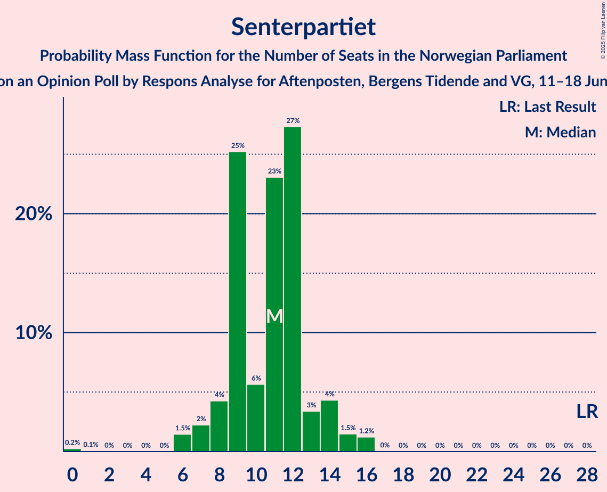
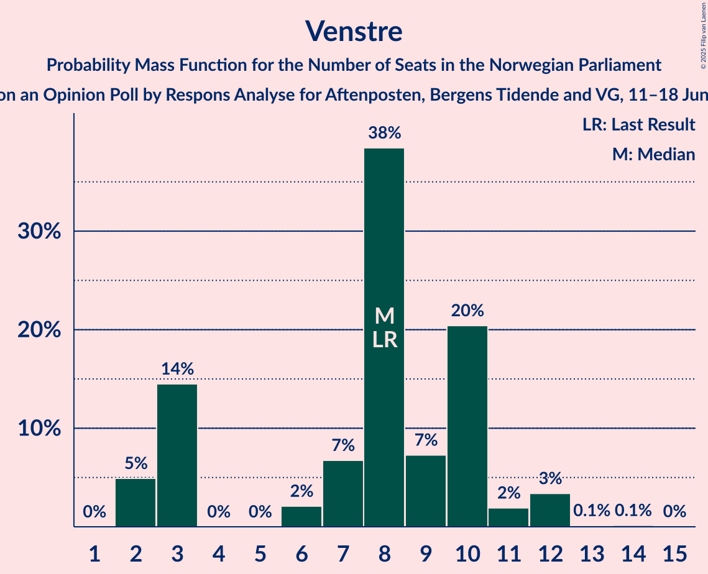
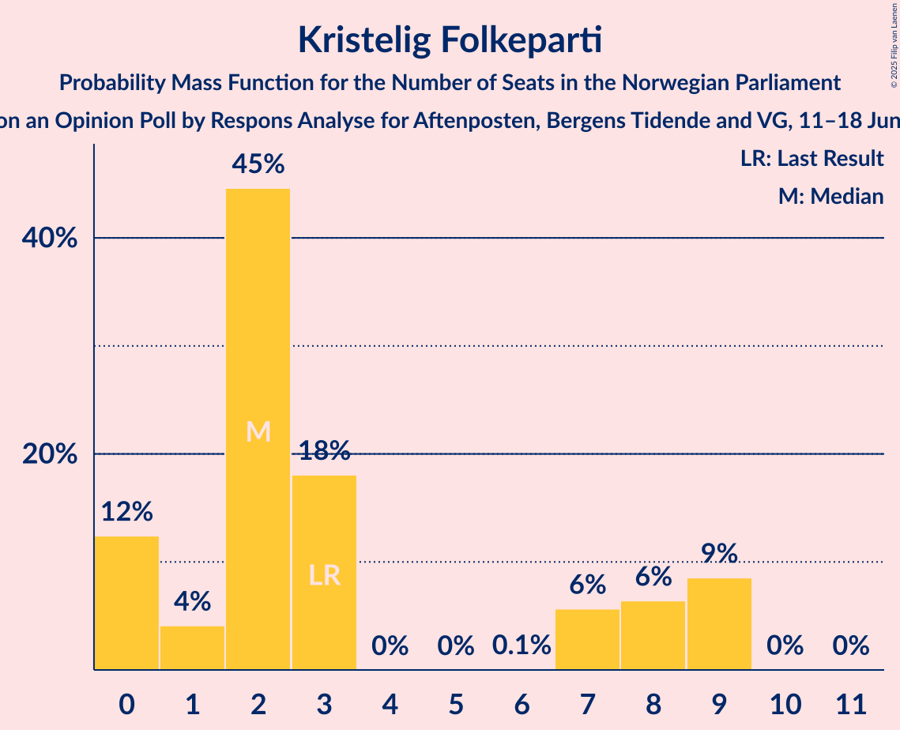
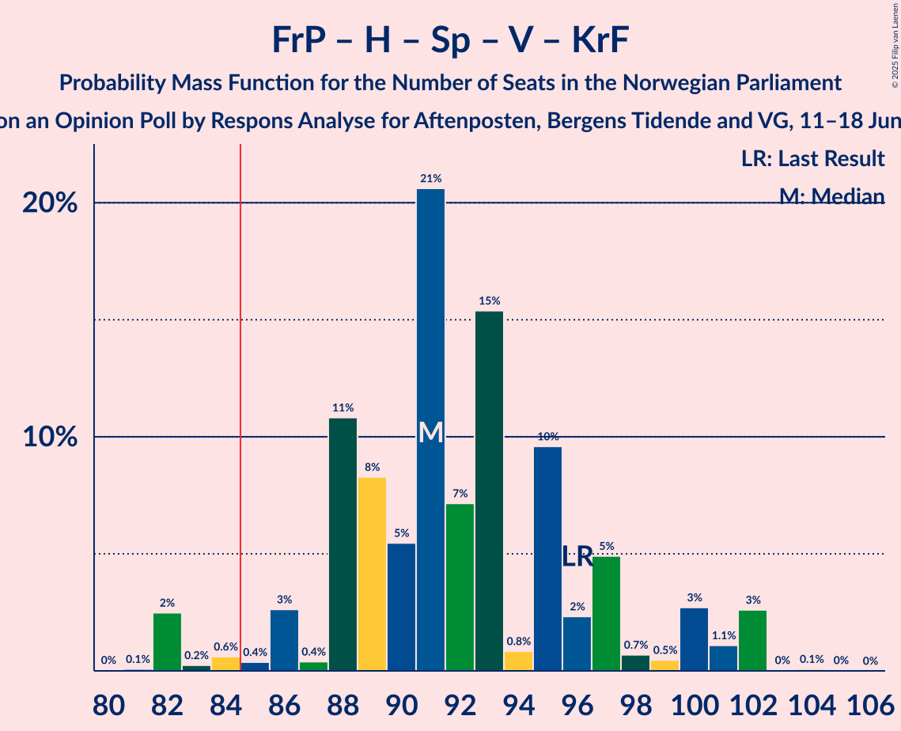
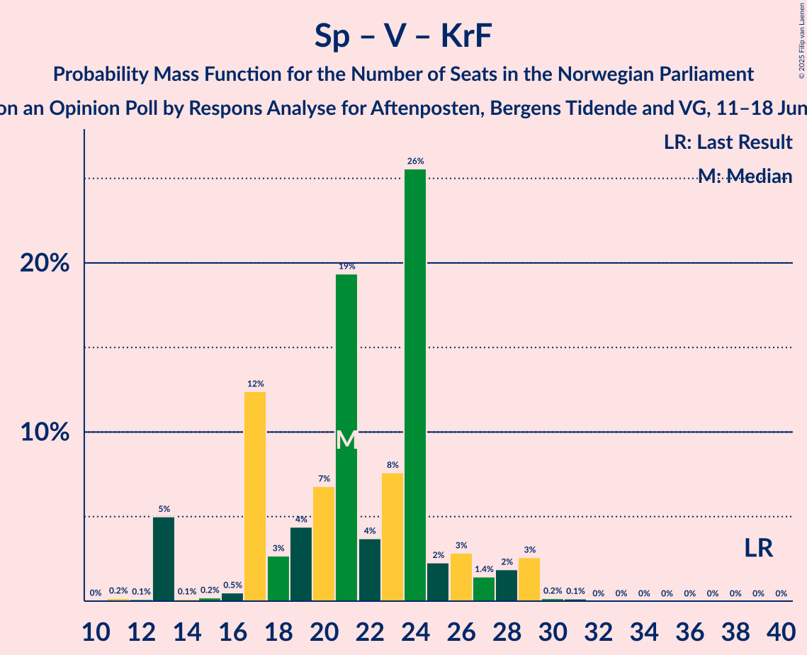

# Opinion Poll by Respons Analyse for Aftenposten, Bergens Tidende and VG, 11–18 June 2025

<a href="#voting-intentions">Voting Intentions</a> | <a href="#seats">Seats</a> | <a href="#coalitions">Coalitions</a> | <a href="#technical-information">Technical Information</a>

## Voting Intentions

### Confidence Intervals

| Party | Last Result | Poll Result | 80% Confidence Interval | 90% Confidence Interval | 95% Confidence Interval | 99% Confidence Interval |
|:-----:|:-----------:|:-----------:|:-----------------------:|:-----------------------:|:-----------------------:|:-----------------------:|
| Arbeiderpartiet | 26.2% | 25.1% | 23.1–27.1% |22.6–27.7% |22.1–28.3% |21.2–29.3% |
| Fremskrittspartiet | 11.6% | 21.9% | 20.1–24.0% |19.6–24.5% |19.2–25.0% |18.3–26.0% |
| Høyre | 20.4% | 16.9% | 15.3–18.7% |14.8–19.3% |14.4–19.7% |13.7–20.6% |
| Sosialistisk Venstreparti | 7.6% | 8.8% | 7.6–10.3% |7.3–10.7% |7.0–11.1% |6.5–11.8% |
| Rødt | 4.7% | 6.0% | 5.0–7.2% |4.7–7.6% |4.5–7.9% |4.1–8.5% |
| Senterpartiet | 13.5% | 5.8% | 4.9–7.1% |4.6–7.4% |4.4–7.7% |4.0–8.4% |
| Venstre | 4.6% | 4.8% | 3.9–5.9% |3.7–6.3% |3.5–6.6% |3.1–7.1% |
| Miljøpartiet De Grønne | 3.9% | 3.4% | 2.7–4.4% |2.5–4.6% |2.3–4.9% |2.0–5.4% |
| Kristelig Folkeparti | 3.8% | 3.2% | 2.6–4.2% |2.4–4.5% |2.2–4.8% |1.9–5.3% |
| Konservativt | 0.4% | 0.9% | 0.6–1.5% |0.5–1.7% |0.4–1.9% |0.3–2.2% |
| Industri- og Næringspartiet | 0.3% | 0.6% | 0.4–1.2% |0.3–1.4% |0.3–1.5% |0.2–1.8% |
| Pensjonistpartiet | 0.6% | 0.5% | 0.3–1.0% |0.2–1.2% |0.2–1.3% |0.1–1.6% |
| Norgesdemokratene | 1.1% | 0.3% | 0.1–0.7% |0.1–0.8% |0.1–0.9% |0.0–1.2% |
| Liberalistene | 0.2% | 0.1% | 0.1–0.5% |0.0–0.6% |0.0–0.7% |0.0–1.0% |

*Note:* The poll result column reflects the actual value used in the calculations. Published results may vary slightly, and in addition be rounded to fewer digits.

## Seats

### Confidence Intervals

| Party | Last Result | Median | 80% Confidence Interval | 90% Confidence Interval | 95% Confidence Interval | 99% Confidence Interval |
|:-----:|:-----------:|:------:|:-----------------------:|:-----------------------:|:-----------------------:|:-----------------------:|
| <a href="#arbeiderpartiet">Arbeiderpartiet</a> | 48 | 48 | 42–54 |42–54 |42–54 |38–56 |
| <a href="#fremskrittspartiet">Fremskrittspartiet</a> | 21 | 39 | 37–45 |36–45 |36–45 |33–47 |
| <a href="#høyre">Høyre</a> | 36 | 31 | 25–33 |25–34 |24–36 |22–37 |
| <a href="#sosialistisk-venstreparti">Sosialistisk Venstreparti</a> | 13 | 17 | 14–21 |13–21 |12–21 |11–21 |
| <a href="#rødt">Rødt</a> | 8 | 9 | 8–12 |8–12 |8–13 |7–15 |
| <a href="#senterpartiet">Senterpartiet</a> | 28 | 9 | 8–14 |6–14 |6–15 |0–15 |
| <a href="#venstre">Venstre</a> | 8 | 8 | 3–10 |2–12 |2–12 |2–12 |
| <a href="#miljøpartiet-de-grønne">Miljøpartiet De Grønne</a> | 3 | 2 | 1–7 |1–8 |1–8 |1–9 |
| <a href="#kristelig-folkeparti">Kristelig Folkeparti</a> | 3 | 2 | 0–7 |0–8 |0–9 |0–9 |
| <a href="#konservativt">Konservativt</a> | 0 | 0 | 0 |0 |0 |0 |
| <a href="#industri--og-næringspartiet">Industri- og Næringspartiet</a> | 0 | 0 | 0 |0 |0 |0 |
| <a href="#pensjonistpartiet">Pensjonistpartiet</a> | 0 | 0 | 0 |0 |0 |0 |
| <a href="#norgesdemokratene">Norgesdemokratene</a> | 0 | 0 | 0 |0 |0 |0 |
| <a href="#liberalistene">Liberalistene</a> | 0 | 0 | 0 |0 |0 |0 |

### Arbeiderpartiet

*For a full overview of the results for this party, see the [Arbeiderpartiet](party-arbeiderpartiet.html) page.*

| Number of Seats | Probability | Accumulated | Special Marks |
|:---------------:|:-----------:|:-----------:|:-------------:|
| 37 | 0.1% | 100% |  |
| 38 | 0.5% | 99.9% |  |
| 39 | 0.2% | 99.4% |  |
| 40 | 0.3% | 99.1% |  |
| 41 | 1.3% | 98.8% |  |
| 42 | 12% | 98% |  |
| 43 | 1.0% | 85% |  |
| 44 | 9% | 84% |  |
| 45 | 9% | 75% |  |
| 46 | 9% | 66% |  |
| 47 | 3% | 58% |  |
| 48 | 5% | 54% | Last Result, Median |
| 49 | 2% | 49% |  |
| 50 | 0.4% | 47% |  |
| 51 | 5% | 47% |  |
| 52 | 1.1% | 42% |  |
| 53 | 3% | 41% |  |
| 54 | 37% | 38% |  |
| 55 | 0.1% | 1.5% |  |
| 56 | 1.3% | 1.4% |  |
| 57 | 0% | 0.1% |  |
| 58 | 0% | 0% |  |

### Fremskrittspartiet

*For a full overview of the results for this party, see the [Fremskrittspartiet](party-fremskrittspartiet.html) page.*

| Number of Seats | Probability | Accumulated | Special Marks |
|:---------------:|:-----------:|:-----------:|:-------------:|
| 21 | 0% | 100% | Last Result |
| 22 | 0% | 100% |  |
| 23 | 0% | 100% |  |
| 24 | 0% | 100% |  |
| 25 | 0% | 100% |  |
| 26 | 0% | 100% |  |
| 27 | 0% | 100% |  |
| 28 | 0% | 100% |  |
| 29 | 0% | 100% |  |
| 30 | 0% | 100% |  |
| 31 | 0% | 100% |  |
| 32 | 0% | 100% |  |
| 33 | 0.6% | 100% |  |
| 34 | 0.1% | 99.4% |  |
| 35 | 0.2% | 99.3% |  |
| 36 | 7% | 99.1% |  |
| 37 | 3% | 93% |  |
| 38 | 33% | 90% |  |
| 39 | 8% | 57% | Median |
| 40 | 4% | 49% |  |
| 41 | 1.5% | 46% |  |
| 42 | 9% | 44% |  |
| 43 | 9% | 36% |  |
| 44 | 12% | 26% |  |
| 45 | 13% | 14% |  |
| 46 | 0.5% | 2% |  |
| 47 | 0.6% | 1.0% |  |
| 48 | 0.2% | 0.5% |  |
| 49 | 0.1% | 0.3% |  |
| 50 | 0.2% | 0.2% |  |
| 51 | 0% | 0% |  |

### Høyre

*For a full overview of the results for this party, see the [Høyre](party-høyre.html) page.*

| Number of Seats | Probability | Accumulated | Special Marks |
|:---------------:|:-----------:|:-----------:|:-------------:|
| 20 | 0.1% | 100% |  |
| 21 | 0% | 99.9% |  |
| 22 | 2% | 99.9% |  |
| 23 | 0.4% | 98% |  |
| 24 | 0.5% | 98% |  |
| 25 | 9% | 97% |  |
| 26 | 6% | 88% |  |
| 27 | 12% | 82% |  |
| 28 | 8% | 70% |  |
| 29 | 7% | 62% |  |
| 30 | 2% | 54% |  |
| 31 | 6% | 53% | Median |
| 32 | 10% | 47% |  |
| 33 | 30% | 37% |  |
| 34 | 2% | 7% |  |
| 35 | 0.7% | 5% |  |
| 36 | 3% | 4% | Last Result |
| 37 | 0.8% | 1.1% |  |
| 38 | 0.2% | 0.3% |  |
| 39 | 0.1% | 0.1% |  |
| 40 | 0% | 0% |  |

### Sosialistisk Venstreparti

*For a full overview of the results for this party, see the [Sosialistisk Venstreparti](party-sosialistiskvenstreparti.html) page.*

| Number of Seats | Probability | Accumulated | Special Marks |
|:---------------:|:-----------:|:-----------:|:-------------:|
| 10 | 0.5% | 100% |  |
| 11 | 2% | 99.5% |  |
| 12 | 1.4% | 98% |  |
| 13 | 3% | 96% | Last Result |
| 14 | 4% | 93% |  |
| 15 | 22% | 89% |  |
| 16 | 5% | 67% |  |
| 17 | 35% | 62% | Median |
| 18 | 9% | 27% |  |
| 19 | 4% | 17% |  |
| 20 | 0.4% | 13% |  |
| 21 | 12% | 13% |  |
| 22 | 0.2% | 0.3% |  |
| 23 | 0.1% | 0.1% |  |
| 24 | 0% | 0% |  |

### Rødt

*For a full overview of the results for this party, see the [Rødt](party-rødt.html) page.*

| Number of Seats | Probability | Accumulated | Special Marks |
|:---------------:|:-----------:|:-----------:|:-------------:|
| 2 | 0% | 100% |  |
| 3 | 0% | 99.9% |  |
| 4 | 0% | 99.9% |  |
| 5 | 0% | 99.9% |  |
| 6 | 0% | 99.9% |  |
| 7 | 1.0% | 99.9% |  |
| 8 | 34% | 98.9% | Last Result |
| 9 | 22% | 65% | Median |
| 10 | 10% | 43% |  |
| 11 | 16% | 33% |  |
| 12 | 15% | 17% |  |
| 13 | 0.7% | 3% |  |
| 14 | 0.5% | 2% |  |
| 15 | 1.0% | 1.3% |  |
| 16 | 0.3% | 0.3% |  |
| 17 | 0% | 0% |  |

### Senterpartiet

*For a full overview of the results for this party, see the [Senterpartiet](party-senterpartiet.html) page.*

| Number of Seats | Probability | Accumulated | Special Marks |
|:---------------:|:-----------:|:-----------:|:-------------:|
| 0 | 0.7% | 100% |  |
| 1 | 0.2% | 99.3% |  |
| 2 | 0% | 99.1% |  |
| 3 | 0% | 99.1% |  |
| 4 | 0% | 99.1% |  |
| 5 | 0% | 99.1% |  |
| 6 | 5% | 99.1% |  |
| 7 | 4% | 95% |  |
| 8 | 3% | 91% |  |
| 9 | 45% | 88% | Median |
| 10 | 2% | 43% |  |
| 11 | 10% | 41% |  |
| 12 | 8% | 32% |  |
| 13 | 8% | 24% |  |
| 14 | 11% | 16% |  |
| 15 | 4% | 4% |  |
| 16 | 0.4% | 0.4% |  |
| 17 | 0% | 0% |  |
| 18 | 0% | 0% |  |
| 19 | 0% | 0% |  |
| 20 | 0% | 0% |  |
| 21 | 0% | 0% |  |
| 22 | 0% | 0% |  |
| 23 | 0% | 0% |  |
| 24 | 0% | 0% |  |
| 25 | 0% | 0% |  |
| 26 | 0% | 0% |  |
| 27 | 0% | 0% |  |
| 28 | 0% | 0% | Last Result |

### Venstre

*For a full overview of the results for this party, see the [Venstre](party-venstre.html) page.*

| Number of Seats | Probability | Accumulated | Special Marks |
|:---------------:|:-----------:|:-----------:|:-------------:|
| 2 | 6% | 100% |  |
| 3 | 14% | 94% |  |
| 4 | 0% | 79% |  |
| 5 | 0% | 79% |  |
| 6 | 5% | 79% |  |
| 7 | 4% | 75% |  |
| 8 | 49% | 71% | Last Result, Median |
| 9 | 10% | 22% |  |
| 10 | 4% | 12% |  |
| 11 | 1.4% | 8% |  |
| 12 | 6% | 6% |  |
| 13 | 0.2% | 0.4% |  |
| 14 | 0.1% | 0.1% |  |
| 15 | 0% | 0% |  |

### Miljøpartiet De Grønne

*For a full overview of the results for this party, see the [Miljøpartiet De Grønne](party-miljøpartietdegrønne.html) page.*

| Number of Seats | Probability | Accumulated | Special Marks |
|:---------------:|:-----------:|:-----------:|:-------------:|
| 0 | 0.1% | 100% |  |
| 1 | 15% | 99.9% |  |
| 2 | 59% | 85% | Median |
| 3 | 9% | 27% | Last Result |
| 4 | 0% | 18% |  |
| 5 | 0% | 18% |  |
| 6 | 0% | 18% |  |
| 7 | 8% | 18% |  |
| 8 | 8% | 10% |  |
| 9 | 0.8% | 1.1% |  |
| 10 | 0.3% | 0.3% |  |
| 11 | 0% | 0% |  |

### Kristelig Folkeparti

*For a full overview of the results for this party, see the [Kristelig Folkeparti](party-kristeligfolkeparti.html) page.*

| Number of Seats | Probability | Accumulated | Special Marks |
|:---------------:|:-----------:|:-----------:|:-------------:|
| 0 | 34% | 100% |  |
| 1 | 3% | 66% |  |
| 2 | 23% | 63% | Median |
| 3 | 22% | 41% | Last Result |
| 4 | 0% | 18% |  |
| 5 | 0% | 18% |  |
| 6 | 0% | 18% |  |
| 7 | 13% | 18% |  |
| 8 | 3% | 6% |  |
| 9 | 3% | 3% |  |
| 10 | 0.1% | 0.1% |  |
| 11 | 0% | 0% |  |

### Konservativt

*For a full overview of the results for this party, see the [Konservativt](party-konservativt.html) page.*

| Number of Seats | Probability | Accumulated | Special Marks |
|:---------------:|:-----------:|:-----------:|:-------------:|
| 0 | 100% | 100% | Last Result, Median |

### Industri- og Næringspartiet

*For a full overview of the results for this party, see the [Industri- og Næringspartiet](party-industri-ognæringspartiet.html) page.*

| Number of Seats | Probability | Accumulated | Special Marks |
|:---------------:|:-----------:|:-----------:|:-------------:|
| 0 | 100% | 100% | Last Result, Median |

### Pensjonistpartiet

*For a full overview of the results for this party, see the [Pensjonistpartiet](party-pensjonistpartiet.html) page.*

| Number of Seats | Probability | Accumulated | Special Marks |
|:---------------:|:-----------:|:-----------:|:-------------:|
| 0 | 99.8% | 100% | Last Result, Median |
| 1 | 0.2% | 0.2% |  |
| 2 | 0% | 0% |  |

### Norgesdemokratene

*For a full overview of the results for this party, see the [Norgesdemokratene](party-norgesdemokratene.html) page.*

| Number of Seats | Probability | Accumulated | Special Marks |
|:---------------:|:-----------:|:-----------:|:-------------:|
| 0 | 100% | 100% | Last Result, Median |

### Liberalistene

*For a full overview of the results for this party, see the [Liberalistene](party-liberalistene.html) page.*

| Number of Seats | Probability | Accumulated | Special Marks |
|:---------------:|:-----------:|:-----------:|:-------------:|
| 0 | 100% | 100% | Last Result, Median |

## Coalitions

### Confidence Intervals

| Coalition | Last Result | Median | Majority? | 80% Confidence Interval | 90% Confidence Interval | 95% Confidence Interval | 99% Confidence Interval |
|:---------:|:-----------:|:------:|:---------:|:-----------------------:|:-----------------------:|:-----------------------:|:-----------------------:|
| Fremskrittspartiet – Høyre – Senterpartiet – Venstre – Kristelig Folkeparti | 96 | 91 | 98% | 88–96 | 86–97 | 85–98 | 82–101 |
| Arbeiderpartiet – Sosialistisk Venstreparti – Rødt – Senterpartiet – Miljøpartiet De Grønne | 100 | 90 | 82% | 84–94 | 83–94 | 81–95 | 78–100 |
| Arbeiderpartiet – Sosialistisk Venstreparti – Rødt – Senterpartiet | 97 | 86 | 62% | 81–88 | 79–92 | 77–92 | 75–92 |
| Fremskrittspartiet – Høyre – Venstre – Miljøpartiet De Grønne – Kristelig Folkeparti | 71 | 83 | 38% | 81–88 | 77–89 | 77–92 | 77–94 |
| Arbeiderpartiet – Sosialistisk Venstreparti – Senterpartiet – Miljøpartiet De Grønne – Kristelig Folkeparti | 95 | 82 | 23% | 77–86 | 76–89 | 73–91 | 68–91 |
| Fremskrittspartiet – Høyre – Venstre – Kristelig Folkeparti | 68 | 79 | 17% | 75–85 | 75–86 | 74–87 | 69–90 |
| Fremskrittspartiet – Høyre – Venstre | 65 | 79 | 3% | 72–82 | 71–83 | 69–85 | 67–87 |
| Arbeiderpartiet – Sosialistisk Venstreparti – Rødt – Miljøpartiet De Grønne | 72 | 78 | 2% | 73–81 | 72–83 | 71–84 | 68–87 |
| Arbeiderpartiet – Sosialistisk Venstreparti – Senterpartiet – Miljøpartiet De Grønne | 92 | 80 | 2% | 74–83 | 73–84 | 71–84 | 67–88 |
| Arbeiderpartiet – Sosialistisk Venstreparti – Senterpartiet | 89 | 76 | 0% | 72–80 | 69–80 | 66–80 | 65–83 |
| Fremskrittspartiet – Høyre | 57 | 71 | 0% | 66–75 | 63–75 | 62–77 | 59–80 |
| Arbeiderpartiet – Senterpartiet – Miljøpartiet De Grønne – Kristelig Folkeparti | 82 | 65 | 0% | 56–70 | 56–74 | 56–76 | 52–76 |
| Arbeiderpartiet – Sosialistisk Venstreparti | 61 | 64 | 0% | 61–71 | 59–71 | 58–71 | 54–71 |
| Arbeiderpartiet – Senterpartiet – Kristelig Folkeparti | 79 | 63 | 0% | 54–68 | 54–68 | 54–69 | 50–69 |
| Arbeiderpartiet – Senterpartiet | 76 | 60 | 0% | 51–63 | 51–65 | 51–65 | 49–66 |
| Høyre – Venstre – Kristelig Folkeparti | 47 | 41 | 0% | 36–44 | 31–45 | 31–47 | 31–49 |
| Senterpartiet – Venstre – Kristelig Folkeparti | 39 | 19 | 0% | 17–26 | 17–28 | 16–29 | 11–30 |

### Fremskrittspartiet – Høyre – Senterpartiet – Venstre – Kristelig Folkeparti

| Number of Seats | Probability | Accumulated | Special Marks |
|:---------------:|:-----------:|:-----------:|:-------------:|
| 78 | 0% | 100% |  |
| 79 | 0% | 99.9% |  |
| 80 | 0% | 99.9% |  |
| 81 | 0.1% | 99.9% |  |
| 82 | 0.6% | 99.8% |  |
| 83 | 0.5% | 99.1% |  |
| 84 | 0.1% | 98.6% |  |
| 85 | 1.1% | 98% | Majority |
| 86 | 7% | 97% |  |
| 87 | 0.2% | 90% |  |
| 88 | 32% | 90% |  |
| 89 | 3% | 58% | Median |
| 90 | 4% | 55% |  |
| 91 | 11% | 51% |  |
| 92 | 12% | 39% |  |
| 93 | 9% | 27% |  |
| 94 | 1.0% | 18% |  |
| 95 | 6% | 17% |  |
| 96 | 2% | 11% | Last Result |
| 97 | 6% | 9% |  |
| 98 | 1.2% | 3% |  |
| 99 | 0.3% | 2% |  |
| 100 | 0.3% | 1.4% |  |
| 101 | 0.9% | 1.1% |  |
| 102 | 0% | 0.2% |  |
| 103 | 0.1% | 0.2% |  |
| 104 | 0.1% | 0.1% |  |
| 105 | 0% | 0% |  |

### Arbeiderpartiet – Sosialistisk Venstreparti – Rødt – Senterpartiet – Miljøpartiet De Grønne

| Number of Seats | Probability | Accumulated | Special Marks |
|:---------------:|:-----------:|:-----------:|:-------------:|
| 72 | 0.1% | 100% |  |
| 73 | 0% | 99.9% |  |
| 74 | 0% | 99.9% |  |
| 75 | 0% | 99.9% |  |
| 76 | 0.1% | 99.9% |  |
| 77 | 0.2% | 99.8% |  |
| 78 | 0.2% | 99.6% |  |
| 79 | 0.2% | 99.4% |  |
| 80 | 0.4% | 99.3% |  |
| 81 | 1.4% | 98.9% |  |
| 82 | 2% | 97% |  |
| 83 | 1.3% | 95% |  |
| 84 | 12% | 94% |  |
| 85 | 13% | 82% | Median, Majority |
| 86 | 4% | 69% |  |
| 87 | 4% | 64% |  |
| 88 | 3% | 61% |  |
| 89 | 2% | 57% |  |
| 90 | 35% | 56% |  |
| 91 | 4% | 20% |  |
| 92 | 0.1% | 17% |  |
| 93 | 5% | 17% |  |
| 94 | 9% | 11% |  |
| 95 | 1.1% | 3% |  |
| 96 | 0.7% | 1.4% |  |
| 97 | 0.1% | 0.7% |  |
| 98 | 0% | 0.6% |  |
| 99 | 0% | 0.6% |  |
| 100 | 0.5% | 0.5% | Last Result |
| 101 | 0% | 0% |  |

### Arbeiderpartiet – Sosialistisk Venstreparti – Rødt – Senterpartiet

| Number of Seats | Probability | Accumulated | Special Marks |
|:---------------:|:-----------:|:-----------:|:-------------:|
| 71 | 0.1% | 100% |  |
| 72 | 0.1% | 99.9% |  |
| 73 | 0.1% | 99.8% |  |
| 74 | 0.1% | 99.7% |  |
| 75 | 1.2% | 99.6% |  |
| 76 | 0.3% | 98% |  |
| 77 | 0.9% | 98% |  |
| 78 | 2% | 97% |  |
| 79 | 0.9% | 95% |  |
| 80 | 2% | 95% |  |
| 81 | 6% | 92% |  |
| 82 | 3% | 86% |  |
| 83 | 18% | 83% | Median |
| 84 | 3% | 65% |  |
| 85 | 7% | 62% | Majority |
| 86 | 10% | 55% |  |
| 87 | 1.3% | 45% |  |
| 88 | 34% | 44% |  |
| 89 | 1.5% | 9% |  |
| 90 | 0.1% | 8% |  |
| 91 | 0.2% | 8% |  |
| 92 | 7% | 8% |  |
| 93 | 0% | 0.2% |  |
| 94 | 0.1% | 0.2% |  |
| 95 | 0% | 0.1% |  |
| 96 | 0% | 0.1% |  |
| 97 | 0% | 0% | Last Result |

### Fremskrittspartiet – Høyre – Venstre – Miljøpartiet De Grønne – Kristelig Folkeparti

| Number of Seats | Probability | Accumulated | Special Marks |
|:---------------:|:-----------:|:-----------:|:-------------:|
| 71 | 0% | 100% | Last Result |
| 72 | 0% | 100% |  |
| 73 | 0% | 100% |  |
| 74 | 0% | 99.9% |  |
| 75 | 0.1% | 99.9% |  |
| 76 | 0% | 99.8% |  |
| 77 | 7% | 99.8% |  |
| 78 | 0.2% | 92% |  |
| 79 | 0.1% | 92% |  |
| 80 | 2% | 92% |  |
| 81 | 34% | 90% |  |
| 82 | 2% | 56% | Median |
| 83 | 10% | 55% |  |
| 84 | 7% | 45% |  |
| 85 | 15% | 38% | Majority |
| 86 | 7% | 23% |  |
| 87 | 3% | 16% |  |
| 88 | 6% | 13% |  |
| 89 | 2% | 7% |  |
| 90 | 0.4% | 5% |  |
| 91 | 2% | 4% |  |
| 92 | 0.9% | 3% |  |
| 93 | 1.0% | 2% |  |
| 94 | 0.4% | 0.7% |  |
| 95 | 0% | 0.3% |  |
| 96 | 0.1% | 0.2% |  |
| 97 | 0.1% | 0.1% |  |
| 98 | 0% | 0% |  |

### Arbeiderpartiet – Sosialistisk Venstreparti – Senterpartiet – Miljøpartiet De Grønne – Kristelig Folkeparti

| Number of Seats | Probability | Accumulated | Special Marks |
|:---------------:|:-----------:|:-----------:|:-------------:|
| 64 | 0% | 100% |  |
| 65 | 0% | 99.9% |  |
| 66 | 0% | 99.9% |  |
| 67 | 0% | 99.9% |  |
| 68 | 0.5% | 99.9% |  |
| 69 | 0.1% | 99.4% |  |
| 70 | 0.1% | 99.2% |  |
| 71 | 0.4% | 99.1% |  |
| 72 | 0.3% | 98.8% |  |
| 73 | 1.0% | 98% |  |
| 74 | 0.3% | 97% |  |
| 75 | 2% | 97% |  |
| 76 | 2% | 95% |  |
| 77 | 18% | 94% |  |
| 78 | 2% | 75% | Median |
| 79 | 3% | 74% |  |
| 80 | 8% | 70% |  |
| 81 | 0.6% | 62% |  |
| 82 | 35% | 61% |  |
| 83 | 2% | 26% |  |
| 84 | 0.8% | 24% |  |
| 85 | 13% | 23% | Majority |
| 86 | 1.3% | 10% |  |
| 87 | 1.1% | 9% |  |
| 88 | 1.0% | 8% |  |
| 89 | 3% | 7% |  |
| 90 | 0.6% | 4% |  |
| 91 | 3% | 3% |  |
| 92 | 0.2% | 0.2% |  |
| 93 | 0% | 0% |  |
| 94 | 0% | 0% |  |
| 95 | 0% | 0% | Last Result |

### Fremskrittspartiet – Høyre – Venstre – Kristelig Folkeparti

| Number of Seats | Probability | Accumulated | Special Marks |
|:---------------:|:-----------:|:-----------:|:-------------:|
| 68 | 0% | 100% | Last Result |
| 69 | 0.5% | 100% |  |
| 70 | 0% | 99.5% |  |
| 71 | 0% | 99.4% |  |
| 72 | 0.1% | 99.4% |  |
| 73 | 0.7% | 99.3% |  |
| 74 | 1.3% | 98.6% |  |
| 75 | 9% | 97% |  |
| 76 | 5% | 89% |  |
| 77 | 0.2% | 83% |  |
| 78 | 4% | 83% |  |
| 79 | 35% | 79% |  |
| 80 | 2% | 44% | Median |
| 81 | 4% | 42% |  |
| 82 | 3% | 39% |  |
| 83 | 16% | 35% |  |
| 84 | 2% | 20% |  |
| 85 | 12% | 17% | Majority |
| 86 | 2% | 5% |  |
| 87 | 1.4% | 4% |  |
| 88 | 1.5% | 2% |  |
| 89 | 0.3% | 0.9% |  |
| 90 | 0.2% | 0.6% |  |
| 91 | 0.1% | 0.4% |  |
| 92 | 0.2% | 0.3% |  |
| 93 | 0% | 0.1% |  |
| 94 | 0% | 0.1% |  |
| 95 | 0% | 0.1% |  |
| 96 | 0.1% | 0.1% |  |
| 97 | 0% | 0% |  |

### Fremskrittspartiet – Høyre – Venstre

| Number of Seats | Probability | Accumulated | Special Marks |
|:---------------:|:-----------:|:-----------:|:-------------:|
| 65 | 0% | 100% | Last Result |
| 66 | 0% | 100% |  |
| 67 | 0.6% | 100% |  |
| 68 | 0.1% | 99.4% |  |
| 69 | 3% | 99.3% |  |
| 70 | 0% | 96% |  |
| 71 | 3% | 96% |  |
| 72 | 7% | 93% |  |
| 73 | 5% | 86% |  |
| 74 | 3% | 81% |  |
| 75 | 1.5% | 78% |  |
| 76 | 1.2% | 77% |  |
| 77 | 8% | 75% |  |
| 78 | 7% | 68% | Median |
| 79 | 31% | 61% |  |
| 80 | 15% | 31% |  |
| 81 | 3% | 15% |  |
| 82 | 2% | 12% |  |
| 83 | 5% | 9% |  |
| 84 | 0.6% | 4% |  |
| 85 | 1.4% | 3% | Majority |
| 86 | 1.4% | 2% |  |
| 87 | 0.2% | 0.6% |  |
| 88 | 0.1% | 0.4% |  |
| 89 | 0.2% | 0.4% |  |
| 90 | 0.1% | 0.2% |  |
| 91 | 0% | 0.1% |  |
| 92 | 0% | 0.1% |  |
| 93 | 0% | 0.1% |  |
| 94 | 0% | 0% |  |

### Arbeiderpartiet – Sosialistisk Venstreparti – Rødt – Miljøpartiet De Grønne

| Number of Seats | Probability | Accumulated | Special Marks |
|:---------------:|:-----------:|:-----------:|:-------------:|
| 64 | 0.1% | 100% |  |
| 65 | 0.1% | 99.9% |  |
| 66 | 0% | 99.8% |  |
| 67 | 0.1% | 99.8% |  |
| 68 | 1.1% | 99.7% |  |
| 69 | 0.2% | 98.6% |  |
| 70 | 0.2% | 98% |  |
| 71 | 2% | 98% |  |
| 72 | 6% | 96% | Last Result |
| 73 | 1.5% | 90% |  |
| 74 | 6% | 89% |  |
| 75 | 0.9% | 82% |  |
| 76 | 20% | 81% | Median |
| 77 | 0.9% | 61% |  |
| 78 | 11% | 60% |  |
| 79 | 4% | 49% |  |
| 80 | 3% | 45% |  |
| 81 | 32% | 41% |  |
| 82 | 0.4% | 10% |  |
| 83 | 7% | 9% |  |
| 84 | 1.1% | 3% |  |
| 85 | 0.1% | 2% | Majority |
| 86 | 0.5% | 1.4% |  |
| 87 | 0.6% | 0.9% |  |
| 88 | 0.1% | 0.2% |  |
| 89 | 0% | 0.1% |  |
| 90 | 0% | 0.1% |  |
| 91 | 0% | 0.1% |  |
| 92 | 0% | 0% |  |

### Arbeiderpartiet – Sosialistisk Venstreparti – Senterpartiet – Miljøpartiet De Grønne

| Number of Seats | Probability | Accumulated | Special Marks |
|:---------------:|:-----------:|:-----------:|:-------------:|
| 61 | 0.1% | 100% |  |
| 62 | 0% | 99.9% |  |
| 63 | 0% | 99.9% |  |
| 64 | 0.1% | 99.9% |  |
| 65 | 0% | 99.8% |  |
| 66 | 0.1% | 99.8% |  |
| 67 | 0.4% | 99.7% |  |
| 68 | 0.4% | 99.3% |  |
| 69 | 0.8% | 99.0% |  |
| 70 | 0.4% | 98% |  |
| 71 | 0.5% | 98% |  |
| 72 | 1.2% | 97% |  |
| 73 | 3% | 96% |  |
| 74 | 14% | 93% |  |
| 75 | 12% | 79% |  |
| 76 | 4% | 68% | Median |
| 77 | 3% | 64% |  |
| 78 | 6% | 61% |  |
| 79 | 0.7% | 55% |  |
| 80 | 4% | 54% |  |
| 81 | 2% | 50% |  |
| 82 | 38% | 48% |  |
| 83 | 3% | 10% |  |
| 84 | 4% | 7% |  |
| 85 | 0.3% | 2% | Majority |
| 86 | 1.1% | 2% |  |
| 87 | 0% | 0.9% |  |
| 88 | 0.9% | 0.9% |  |
| 89 | 0% | 0% |  |
| 90 | 0% | 0% |  |
| 91 | 0% | 0% |  |
| 92 | 0% | 0% | Last Result |

### Arbeiderpartiet – Sosialistisk Venstreparti – Senterpartiet

| Number of Seats | Probability | Accumulated | Special Marks |
|:---------------:|:-----------:|:-----------:|:-------------:|
| 59 | 0.1% | 100% |  |
| 60 | 0.1% | 99.9% |  |
| 61 | 0% | 99.8% |  |
| 62 | 0.1% | 99.8% |  |
| 63 | 0.1% | 99.7% |  |
| 64 | 0.1% | 99.7% |  |
| 65 | 1.0% | 99.6% |  |
| 66 | 1.5% | 98.5% |  |
| 67 | 0.9% | 97% |  |
| 68 | 1.0% | 96% |  |
| 69 | 1.0% | 95% |  |
| 70 | 1.3% | 94% |  |
| 71 | 3% | 93% |  |
| 72 | 18% | 90% |  |
| 73 | 2% | 72% |  |
| 74 | 6% | 70% | Median |
| 75 | 8% | 63% |  |
| 76 | 12% | 56% |  |
| 77 | 1.4% | 44% |  |
| 78 | 4% | 42% |  |
| 79 | 1.4% | 39% |  |
| 80 | 36% | 37% |  |
| 81 | 0.1% | 0.8% |  |
| 82 | 0.1% | 0.7% |  |
| 83 | 0.5% | 0.6% |  |
| 84 | 0.1% | 0.1% |  |
| 85 | 0% | 0% | Majority |
| 86 | 0% | 0% |  |
| 87 | 0% | 0% |  |
| 88 | 0% | 0% |  |
| 89 | 0% | 0% | Last Result |

### Fremskrittspartiet – Høyre

| Number of Seats | Probability | Accumulated | Special Marks |
|:---------------:|:-----------:|:-----------:|:-------------:|
| 57 | 0% | 100% | Last Result |
| 58 | 0% | 100% |  |
| 59 | 0.8% | 100% |  |
| 60 | 0.1% | 99.2% |  |
| 61 | 0.2% | 99.2% |  |
| 62 | 3% | 99.0% |  |
| 63 | 3% | 96% |  |
| 64 | 0.7% | 93% |  |
| 65 | 1.1% | 92% |  |
| 66 | 1.4% | 91% |  |
| 67 | 2% | 90% |  |
| 68 | 3% | 88% |  |
| 69 | 8% | 86% |  |
| 70 | 5% | 77% | Median |
| 71 | 39% | 72% |  |
| 72 | 20% | 33% |  |
| 73 | 2% | 13% |  |
| 74 | 2% | 12% |  |
| 75 | 6% | 10% |  |
| 76 | 1.4% | 4% |  |
| 77 | 1.5% | 3% |  |
| 78 | 0.3% | 1.1% |  |
| 79 | 0.3% | 0.8% |  |
| 80 | 0.2% | 0.5% |  |
| 81 | 0% | 0.3% |  |
| 82 | 0.1% | 0.2% |  |
| 83 | 0.1% | 0.1% |  |
| 84 | 0% | 0% |  |

### Arbeiderpartiet – Senterpartiet – Miljøpartiet De Grønne – Kristelig Folkeparti

| Number of Seats | Probability | Accumulated | Special Marks |
|:---------------:|:-----------:|:-----------:|:-------------:|
| 48 | 0% | 100% |  |
| 49 | 0% | 99.9% |  |
| 50 | 0% | 99.9% |  |
| 51 | 0.1% | 99.9% |  |
| 52 | 0.4% | 99.8% |  |
| 53 | 0.1% | 99.4% |  |
| 54 | 0.3% | 99.4% |  |
| 55 | 0.4% | 99.0% |  |
| 56 | 12% | 98.6% |  |
| 57 | 0.3% | 87% |  |
| 58 | 0.4% | 86% |  |
| 59 | 0.9% | 86% |  |
| 60 | 9% | 85% |  |
| 61 | 1.0% | 76% | Median |
| 62 | 9% | 75% |  |
| 63 | 1.3% | 66% |  |
| 64 | 2% | 65% |  |
| 65 | 30% | 63% |  |
| 66 | 0.7% | 33% |  |
| 67 | 7% | 32% |  |
| 68 | 1.2% | 25% |  |
| 69 | 4% | 24% |  |
| 70 | 10% | 20% |  |
| 71 | 0.9% | 10% |  |
| 72 | 0.9% | 9% |  |
| 73 | 1.1% | 8% |  |
| 74 | 3% | 7% |  |
| 75 | 0% | 3% |  |
| 76 | 3% | 3% |  |
| 77 | 0% | 0% |  |
| 78 | 0% | 0% |  |
| 79 | 0% | 0% |  |
| 80 | 0% | 0% |  |
| 81 | 0% | 0% |  |
| 82 | 0% | 0% | Last Result |

### Arbeiderpartiet – Sosialistisk Venstreparti

| Number of Seats | Probability | Accumulated | Special Marks |
|:---------------:|:-----------:|:-----------:|:-------------:|
| 51 | 0% | 100% |  |
| 52 | 0% | 99.9% |  |
| 53 | 0.1% | 99.9% |  |
| 54 | 0.6% | 99.8% |  |
| 55 | 0.8% | 99.1% |  |
| 56 | 0.3% | 98% |  |
| 57 | 0.4% | 98% |  |
| 58 | 2% | 98% |  |
| 59 | 3% | 96% |  |
| 60 | 2% | 94% |  |
| 61 | 7% | 91% | Last Result |
| 62 | 14% | 84% |  |
| 63 | 15% | 69% |  |
| 64 | 5% | 55% |  |
| 65 | 2% | 50% | Median |
| 66 | 6% | 48% |  |
| 67 | 1.2% | 41% |  |
| 68 | 3% | 40% |  |
| 69 | 7% | 38% |  |
| 70 | 0.7% | 31% |  |
| 71 | 30% | 30% |  |
| 72 | 0.1% | 0.2% |  |
| 73 | 0% | 0.1% |  |
| 74 | 0% | 0.1% |  |
| 75 | 0% | 0.1% |  |
| 76 | 0% | 0% |  |

### Arbeiderpartiet – Senterpartiet – Kristelig Folkeparti

| Number of Seats | Probability | Accumulated | Special Marks |
|:---------------:|:-----------:|:-----------:|:-------------:|
| 43 | 0.1% | 100% |  |
| 44 | 0% | 99.9% |  |
| 45 | 0% | 99.9% |  |
| 46 | 0% | 99.9% |  |
| 47 | 0.1% | 99.9% |  |
| 48 | 0% | 99.8% |  |
| 49 | 0.1% | 99.8% |  |
| 50 | 0.4% | 99.7% |  |
| 51 | 0.1% | 99.3% |  |
| 52 | 0.4% | 99.2% |  |
| 53 | 0.9% | 98.8% |  |
| 54 | 12% | 98% |  |
| 55 | 0.2% | 86% |  |
| 56 | 2% | 86% |  |
| 57 | 0.6% | 84% |  |
| 58 | 1.3% | 83% |  |
| 59 | 9% | 82% | Median |
| 60 | 10% | 73% |  |
| 61 | 6% | 63% |  |
| 62 | 2% | 58% |  |
| 63 | 29% | 56% |  |
| 64 | 7% | 26% |  |
| 65 | 1.3% | 20% |  |
| 66 | 0.8% | 18% |  |
| 67 | 4% | 18% |  |
| 68 | 10% | 14% |  |
| 69 | 3% | 4% |  |
| 70 | 0.1% | 0.4% |  |
| 71 | 0% | 0.3% |  |
| 72 | 0.2% | 0.3% |  |
| 73 | 0% | 0% |  |
| 74 | 0% | 0% |  |
| 75 | 0% | 0% |  |
| 76 | 0% | 0% |  |
| 77 | 0% | 0% |  |
| 78 | 0% | 0% |  |
| 79 | 0% | 0% | Last Result |

### Arbeiderpartiet – Senterpartiet

| Number of Seats | Probability | Accumulated | Special Marks |
|:---------------:|:-----------:|:-----------:|:-------------:|
| 42 | 0.1% | 100% |  |
| 43 | 0% | 99.9% |  |
| 44 | 0% | 99.9% |  |
| 45 | 0.1% | 99.9% |  |
| 46 | 0% | 99.8% |  |
| 47 | 0.1% | 99.8% |  |
| 48 | 0.1% | 99.7% |  |
| 49 | 0.4% | 99.6% |  |
| 50 | 0.9% | 99.2% |  |
| 51 | 13% | 98% |  |
| 52 | 0.5% | 85% |  |
| 53 | 1.1% | 85% |  |
| 54 | 0.8% | 84% |  |
| 55 | 2% | 83% |  |
| 56 | 2% | 81% |  |
| 57 | 14% | 79% | Median |
| 58 | 6% | 65% |  |
| 59 | 5% | 59% |  |
| 60 | 9% | 54% |  |
| 61 | 4% | 44% |  |
| 62 | 2% | 40% |  |
| 63 | 29% | 38% |  |
| 64 | 0.8% | 9% |  |
| 65 | 7% | 8% |  |
| 66 | 1.0% | 1.1% |  |
| 67 | 0% | 0.1% |  |
| 68 | 0.1% | 0.1% |  |
| 69 | 0% | 0% |  |
| 70 | 0% | 0% |  |
| 71 | 0% | 0% |  |
| 72 | 0% | 0% |  |
| 73 | 0% | 0% |  |
| 74 | 0% | 0% |  |
| 75 | 0% | 0% |  |
| 76 | 0% | 0% | Last Result |

### Høyre – Venstre – Kristelig Folkeparti

| Number of Seats | Probability | Accumulated | Special Marks |
|:---------------:|:-----------:|:-----------:|:-------------:|
| 29 | 0% | 100% |  |
| 30 | 0% | 99.9% |  |
| 31 | 7% | 99.9% |  |
| 32 | 0.6% | 93% |  |
| 33 | 0.4% | 92% |  |
| 34 | 0.2% | 92% |  |
| 35 | 0.5% | 91% |  |
| 36 | 9% | 91% |  |
| 37 | 2% | 82% |  |
| 38 | 12% | 80% |  |
| 39 | 4% | 68% |  |
| 40 | 7% | 64% |  |
| 41 | 34% | 57% | Median |
| 42 | 3% | 23% |  |
| 43 | 7% | 20% |  |
| 44 | 4% | 13% |  |
| 45 | 5% | 8% |  |
| 46 | 0.5% | 3% |  |
| 47 | 1.1% | 3% | Last Result |
| 48 | 1.0% | 2% |  |
| 49 | 0.3% | 0.6% |  |
| 50 | 0% | 0.3% |  |
| 51 | 0.1% | 0.2% |  |
| 52 | 0.1% | 0.1% |  |
| 53 | 0% | 0.1% |  |
| 54 | 0% | 0% |  |

### Senterpartiet – Venstre – Kristelig Folkeparti

| Number of Seats | Probability | Accumulated | Special Marks |
|:---------------:|:-----------:|:-----------:|:-------------:|
| 10 | 0.1% | 100% |  |
| 11 | 0.5% | 99.9% |  |
| 12 | 0.2% | 99.3% |  |
| 13 | 0.6% | 99.1% |  |
| 14 | 0.1% | 98.5% |  |
| 15 | 0.3% | 98% |  |
| 16 | 0.8% | 98% |  |
| 17 | 36% | 97% |  |
| 18 | 6% | 62% |  |
| 19 | 11% | 55% | Median |
| 20 | 14% | 44% |  |
| 21 | 3% | 30% |  |
| 22 | 2% | 27% |  |
| 23 | 3% | 24% |  |
| 24 | 4% | 21% |  |
| 25 | 2% | 17% |  |
| 26 | 6% | 15% |  |
| 27 | 0.9% | 8% |  |
| 28 | 3% | 7% |  |
| 29 | 3% | 4% |  |
| 30 | 0.5% | 0.8% |  |
| 31 | 0.3% | 0.3% |  |
| 32 | 0% | 0% |  |
| 33 | 0% | 0% |  |
| 34 | 0% | 0% |  |
| 35 | 0% | 0% |  |
| 36 | 0% | 0% |  |
| 37 | 0% | 0% |  |
| 38 | 0% | 0% |  |
| 39 | 0% | 0% | Last Result |

## Technical Information

### Opinion Poll

+ **Polling firm:** Respons Analyse
+ **Commissioner(s):** Aftenposten, Bergens Tidende and VG
+ **Fieldwork period:** 11–18 June 2025

### Calculations

+ **Sample size:** 770
+ **Simulations done:** 1,048,576
+ **Error estimate:** 5.29%

