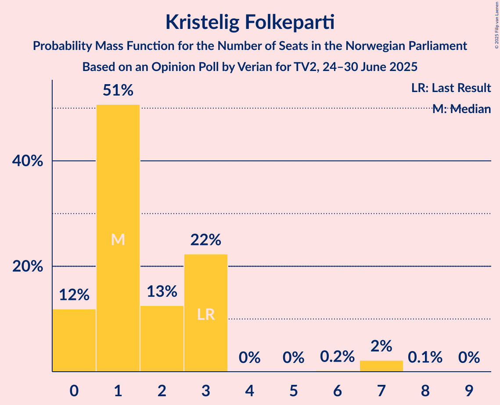

# Opinion Poll by Verian for TV2, 24–30 June 2025

<a href="#voting-intentions">Voting Intentions</a> | <a href="#seats">Seats</a> | <a href="#coalitions">Coalitions</a> | <a href="#technical-information">Technical Information</a>

## Voting Intentions

### Confidence Intervals

| Party | Last Result | Poll Result | 80% Confidence Interval | 90% Confidence Interval | 95% Confidence Interval | 99% Confidence Interval |
|:-----:|:-----------:|:-----------:|:-----------------------:|:-----------------------:|:-----------------------:|:-----------------------:|
| Arbeiderpartiet | 26.2% | 30.8% | 29.0–32.8% |28.5–33.3% |28.0–33.8% |27.2–34.7% |
| Fremskrittspartiet | 11.6% | 21.5% | 19.9–23.3% |19.4–23.7% |19.0–24.2% |18.3–25.0% |
| Høyre | 20.4% | 14.0% | 12.7–15.5% |12.3–15.9% |12.0–16.3% |11.4–17.1% |
| Sosialistisk Venstreparti | 7.6% | 7.8% | 6.8–9.0% |6.5–9.4% |6.3–9.7% |5.8–10.3% |
| Senterpartiet | 13.5% | 6.0% | 5.1–7.1% |4.9–7.4% |4.7–7.7% |4.3–8.2% |
| Rødt | 4.7% | 5.1% | 4.3–6.1% |4.1–6.4% |3.9–6.6% |3.5–7.1% |
| Venstre | 4.6% | 4.8% | 4.0–5.8% |3.8–6.0% |3.6–6.3% |3.3–6.8% |
| Miljøpartiet De Grønne | 3.9% | 3.3% | 2.7–4.2% |2.5–4.5% |2.4–4.7% |2.1–5.1% |
| Kristelig Folkeparti | 3.8% | 2.6% | 2.1–3.4% |1.9–3.6% |1.8–3.8% |1.6–4.3% |
| Industri- og Næringspartiet | 0.3% | 1.3% | 1.0–1.9% |0.9–2.1% |0.8–2.3% |0.6–2.6% |
| Norgesdemokratene | 1.1% | 0.9% | 0.6–1.4% |0.5–1.6% |0.5–1.7% |0.4–2.0% |
| Konservativt | 0.4% | 0.4% | 0.2–0.8% |0.2–0.9% |0.2–1.0% |0.1–1.3% |
| Pensjonistpartiet | 0.6% | 0.1% | 0.0–0.4% |0.0–0.5% |0.0–0.6% |0.0–0.8% |

*Note:* The poll result column reflects the actual value used in the calculations. Published results may vary slightly, and in addition be rounded to fewer digits.

## Seats

### Confidence Intervals

| Party | Last Result | Median | 80% Confidence Interval | 90% Confidence Interval | 95% Confidence Interval | 99% Confidence Interval |
|:-----:|:-----------:|:------:|:-----------------------:|:-----------------------:|:-----------------------:|:-----------------------:|
| <a href="#arbeiderpartiet">Arbeiderpartiet</a> | 48 | 59 | 53–64 |52–64 |50–66 |50–68 |
| <a href="#fremskrittspartiet">Fremskrittspartiet</a> | 21 | 41 | 35–43 |35–44 |35–49 |34–49 |
| <a href="#høyre">Høyre</a> | 36 | 24 | 22–28 |21–28 |20–30 |19–32 |
| <a href="#sosialistisk-venstreparti">Sosialistisk Venstreparti</a> | 13 | 13 | 11–16 |11–17 |11–18 |10–19 |
| <a href="#senterpartiet">Senterpartiet</a> | 28 | 11 | 8–13 |8–14 |8–14 |7–16 |
| <a href="#rødt">Rødt</a> | 8 | 8 | 7–11 |1–11 |1–12 |1–12 |
| <a href="#venstre">Venstre</a> | 8 | 9 | 3–10 |3–11 |3–12 |2–12 |
| <a href="#miljøpartiet-de-grønne">Miljøpartiet De Grønne</a> | 3 | 3 | 1–7 |1–8 |1–9 |1–9 |
| <a href="#kristelig-folkeparti">Kristelig Folkeparti</a> | 3 | 1 | 0–3 |0–3 |0–3 |0–7 |
| <a href="#industri--og-næringspartiet">Industri- og Næringspartiet</a> | 0 | 0 | 0 |0 |0–1 |0–2 |
| <a href="#norgesdemokratene">Norgesdemokratene</a> | 0 | 0 | 0 |0 |0 |0 |
| <a href="#konservativt">Konservativt</a> | 0 | 0 | 0 |0 |0 |0 |
| <a href="#pensjonistpartiet">Pensjonistpartiet</a> | 0 | 0 | 0 |0 |0 |0 |

### Arbeiderpartiet

*For a full overview of the results for this party, see the [Arbeiderpartiet](party-arbeiderpartiet.html) page.*

| Number of Seats | Probability | Accumulated | Special Marks |
|:---------------:|:-----------:|:-----------:|:-------------:|
| 48 | 0.1% | 100% | Last Result |
| 49 | 0.1% | 99.9% |  |
| 50 | 5% | 99.9% |  |
| 51 | 0.2% | 95% |  |
| 52 | 0.8% | 95% |  |
| 53 | 6% | 94% |  |
| 54 | 1.5% | 89% |  |
| 55 | 6% | 87% |  |
| 56 | 7% | 82% |  |
| 57 | 10% | 74% |  |
| 58 | 12% | 64% |  |
| 59 | 8% | 53% | Median |
| 60 | 6% | 45% |  |
| 61 | 22% | 39% |  |
| 62 | 2% | 17% |  |
| 63 | 4% | 15% |  |
| 64 | 7% | 11% |  |
| 65 | 0.3% | 4% |  |
| 66 | 1.2% | 3% |  |
| 67 | 2% | 2% |  |
| 68 | 0.4% | 0.6% |  |
| 69 | 0.1% | 0.2% |  |
| 70 | 0% | 0% |  |

### Fremskrittspartiet

*For a full overview of the results for this party, see the [Fremskrittspartiet](party-fremskrittspartiet.html) page.*

| Number of Seats | Probability | Accumulated | Special Marks |
|:---------------:|:-----------:|:-----------:|:-------------:|
| 21 | 0% | 100% | Last Result |
| 22 | 0% | 100% |  |
| 23 | 0% | 100% |  |
| 24 | 0% | 100% |  |
| 25 | 0% | 100% |  |
| 26 | 0% | 100% |  |
| 27 | 0% | 100% |  |
| 28 | 0% | 100% |  |
| 29 | 0% | 100% |  |
| 30 | 0% | 100% |  |
| 31 | 0% | 100% |  |
| 32 | 0.1% | 100% |  |
| 33 | 0.4% | 99.9% |  |
| 34 | 0.4% | 99.5% |  |
| 35 | 10% | 99.2% |  |
| 36 | 2% | 89% |  |
| 37 | 6% | 87% |  |
| 38 | 7% | 81% |  |
| 39 | 12% | 74% |  |
| 40 | 6% | 62% |  |
| 41 | 12% | 56% | Median |
| 42 | 27% | 44% |  |
| 43 | 12% | 17% |  |
| 44 | 1.2% | 6% |  |
| 45 | 0.6% | 5% |  |
| 46 | 0.5% | 4% |  |
| 47 | 0.1% | 3% |  |
| 48 | 0.1% | 3% |  |
| 49 | 3% | 3% |  |
| 50 | 0% | 0.1% |  |
| 51 | 0% | 0% |  |

### Høyre

*For a full overview of the results for this party, see the [Høyre](party-høyre.html) page.*

| Number of Seats | Probability | Accumulated | Special Marks |
|:---------------:|:-----------:|:-----------:|:-------------:|
| 18 | 0.1% | 100% |  |
| 19 | 2% | 99.9% |  |
| 20 | 3% | 98% |  |
| 21 | 2% | 95% |  |
| 22 | 17% | 93% |  |
| 23 | 17% | 76% |  |
| 24 | 12% | 59% | Median |
| 25 | 15% | 47% |  |
| 26 | 8% | 32% |  |
| 27 | 10% | 23% |  |
| 28 | 9% | 13% |  |
| 29 | 2% | 4% |  |
| 30 | 0.7% | 3% |  |
| 31 | 0.5% | 2% |  |
| 32 | 1.4% | 1.4% |  |
| 33 | 0% | 0% |  |
| 34 | 0% | 0% |  |
| 35 | 0% | 0% |  |
| 36 | 0% | 0% | Last Result |

### Sosialistisk Venstreparti

*For a full overview of the results for this party, see the [Sosialistisk Venstreparti](party-sosialistiskvenstreparti.html) page.*

| Number of Seats | Probability | Accumulated | Special Marks |
|:---------------:|:-----------:|:-----------:|:-------------:|
| 9 | 0.1% | 100% |  |
| 10 | 2% | 99.9% |  |
| 11 | 15% | 98% |  |
| 12 | 18% | 83% |  |
| 13 | 17% | 65% | Last Result, Median |
| 14 | 11% | 48% |  |
| 15 | 15% | 37% |  |
| 16 | 16% | 22% |  |
| 17 | 2% | 6% |  |
| 18 | 3% | 3% |  |
| 19 | 0.3% | 0.5% |  |
| 20 | 0.2% | 0.2% |  |
| 21 | 0% | 0% |  |

### Senterpartiet

*For a full overview of the results for this party, see the [Senterpartiet](party-senterpartiet.html) page.*

| Number of Seats | Probability | Accumulated | Special Marks |
|:---------------:|:-----------:|:-----------:|:-------------:|
| 1 | 0.2% | 100% |  |
| 2 | 0% | 99.8% |  |
| 3 | 0% | 99.8% |  |
| 4 | 0% | 99.8% |  |
| 5 | 0% | 99.8% |  |
| 6 | 0% | 99.8% |  |
| 7 | 0.7% | 99.7% |  |
| 8 | 16% | 99.0% |  |
| 9 | 19% | 83% |  |
| 10 | 11% | 64% |  |
| 11 | 15% | 53% | Median |
| 12 | 14% | 37% |  |
| 13 | 18% | 23% |  |
| 14 | 4% | 6% |  |
| 15 | 0.2% | 1.4% |  |
| 16 | 1.2% | 1.3% |  |
| 17 | 0% | 0% |  |
| 18 | 0% | 0% |  |
| 19 | 0% | 0% |  |
| 20 | 0% | 0% |  |
| 21 | 0% | 0% |  |
| 22 | 0% | 0% |  |
| 23 | 0% | 0% |  |
| 24 | 0% | 0% |  |
| 25 | 0% | 0% |  |
| 26 | 0% | 0% |  |
| 27 | 0% | 0% |  |
| 28 | 0% | 0% | Last Result |

### Rødt

*For a full overview of the results for this party, see the [Rødt](party-rødt.html) page.*

| Number of Seats | Probability | Accumulated | Special Marks |
|:---------------:|:-----------:|:-----------:|:-------------:|
| 1 | 9% | 100% |  |
| 2 | 0.6% | 91% |  |
| 3 | 0% | 91% |  |
| 4 | 0% | 91% |  |
| 5 | 0% | 91% |  |
| 6 | 0.1% | 91% |  |
| 7 | 13% | 91% |  |
| 8 | 30% | 77% | Last Result, Median |
| 9 | 15% | 48% |  |
| 10 | 15% | 32% |  |
| 11 | 15% | 18% |  |
| 12 | 2% | 3% |  |
| 13 | 0.2% | 0.4% |  |
| 14 | 0.2% | 0.2% |  |
| 15 | 0% | 0% |  |

### Venstre

*For a full overview of the results for this party, see the [Venstre](party-venstre.html) page.*

| Number of Seats | Probability | Accumulated | Special Marks |
|:---------------:|:-----------:|:-----------:|:-------------:|
| 2 | 0.5% | 100% |  |
| 3 | 12% | 99.5% |  |
| 4 | 0% | 87% |  |
| 5 | 0% | 87% |  |
| 6 | 0.1% | 87% |  |
| 7 | 8% | 87% |  |
| 8 | 24% | 79% | Last Result |
| 9 | 36% | 55% | Median |
| 10 | 13% | 19% |  |
| 11 | 2% | 6% |  |
| 12 | 4% | 4% |  |
| 13 | 0.2% | 0.2% |  |
| 14 | 0% | 0% |  |

### Miljøpartiet De Grønne

*For a full overview of the results for this party, see the [Miljøpartiet De Grønne](party-miljøpartietdegrønne.html) page.*

| Number of Seats | Probability | Accumulated | Special Marks |
|:---------------:|:-----------:|:-----------:|:-------------:|
| 1 | 22% | 100% |  |
| 2 | 28% | 78% |  |
| 3 | 28% | 50% | Last Result, Median |
| 4 | 0% | 22% |  |
| 5 | 0% | 22% |  |
| 6 | 0.1% | 22% |  |
| 7 | 16% | 22% |  |
| 8 | 2% | 6% |  |
| 9 | 4% | 4% |  |
| 10 | 0% | 0.1% |  |
| 11 | 0% | 0% |  |

### Kristelig Folkeparti

*For a full overview of the results for this party, see the [Kristelig Folkeparti](party-kristeligfolkeparti.html) page.*

| Number of Seats | Probability | Accumulated | Special Marks |
|:---------------:|:-----------:|:-----------:|:-------------:|
| 0 | 12% | 100% |  |
| 1 | 51% | 88% | Median |
| 2 | 13% | 37% |  |
| 3 | 22% | 25% | Last Result |
| 4 | 0% | 2% |  |
| 5 | 0% | 2% |  |
| 6 | 0.2% | 2% |  |
| 7 | 2% | 2% |  |
| 8 | 0.1% | 0.1% |  |
| 9 | 0% | 0% |  |

### Industri- og Næringspartiet

*For a full overview of the results for this party, see the [Industri- og Næringspartiet](party-industri-ognæringspartiet.html) page.*

| Number of Seats | Probability | Accumulated | Special Marks |
|:---------------:|:-----------:|:-----------:|:-------------:|
| 0 | 97% | 100% | Last Result, Median |
| 1 | 2% | 3% |  |
| 2 | 0.8% | 0.8% |  |
| 3 | 0% | 0% |  |

### Norgesdemokratene

*For a full overview of the results for this party, see the [Norgesdemokratene](party-norgesdemokratene.html) page.*

| Number of Seats | Probability | Accumulated | Special Marks |
|:---------------:|:-----------:|:-----------:|:-------------:|
| 0 | 100% | 100% | Last Result, Median |

### Konservativt

*For a full overview of the results for this party, see the [Konservativt](party-konservativt.html) page.*

| Number of Seats | Probability | Accumulated | Special Marks |
|:---------------:|:-----------:|:-----------:|:-------------:|
| 0 | 100% | 100% | Last Result, Median |

### Pensjonistpartiet

*For a full overview of the results for this party, see the [Pensjonistpartiet](party-pensjonistpartiet.html) page.*

| Number of Seats | Probability | Accumulated | Special Marks |
|:---------------:|:-----------:|:-----------:|:-------------:|
| 0 | 100% | 100% | Last Result, Median |

## Coalitions

### Confidence Intervals

| Coalition | Last Result | Median | Majority? | 80% Confidence Interval | 90% Confidence Interval | 95% Confidence Interval | 99% Confidence Interval |
|:---------:|:-----------:|:------:|:---------:|:-----------------------:|:-----------------------:|:-----------------------:|:-----------------------:|
| Arbeiderpartiet – Sosialistisk Venstreparti – Senterpartiet – Rødt – Miljøpartiet De Grønne | 100 | 94 | 99.8% | 89–98 | 89–101 | 87–101 | 85–104 |
| Arbeiderpartiet – Sosialistisk Venstreparti – Senterpartiet – Rødt | 97 | 91 | 97% | 87–96 | 85–98 | 84–99 | 83–101 |
| Arbeiderpartiet – Sosialistisk Venstreparti – Senterpartiet – Miljøpartiet De Grønne – Kristelig Folkeparti | 95 | 88 | 85% | 84–91 | 83–93 | 82–95 | 79–97 |
| Arbeiderpartiet – Sosialistisk Venstreparti – Senterpartiet – Miljøpartiet De Grønne | 92 | 87 | 70% | 82–90 | 80–92 | 79–93 | 77–95 |
| Fremskrittspartiet – Høyre – Senterpartiet – Venstre – Kristelig Folkeparti | 96 | 84 | 50% | 81–89 | 79–92 | 78–93 | 76–94 |
| Arbeiderpartiet – Sosialistisk Venstreparti – Rødt – Miljøpartiet De Grønne | 72 | 84 | 50% | 80–88 | 77–90 | 76–91 | 75–93 |
| Arbeiderpartiet – Sosialistisk Venstreparti – Senterpartiet | 89 | 83 | 35% | 78–87 | 77–89 | 75–89 | 74–93 |
| Fremskrittspartiet – Høyre – Venstre – Miljøpartiet De Grønne – Kristelig Folkeparti | 71 | 78 | 2% | 73–82 | 71–84 | 70–84 | 68–86 |
| Fremskrittspartiet – Høyre – Venstre – Kristelig Folkeparti | 68 | 75 | 0.2% | 71–80 | 68–80 | 68–82 | 65–84 |
| Arbeiderpartiet – Senterpartiet – Miljøpartiet De Grønne – Kristelig Folkeparti | 82 | 74 | 0.5% | 70–78 | 68–79 | 66–81 | 66–85 |
| Arbeiderpartiet – Sosialistisk Venstreparti | 61 | 72 | 0% | 67–77 | 65–78 | 64–80 | 64–81 |
| Fremskrittspartiet – Høyre – Venstre | 65 | 73 | 0.1% | 68–77 | 67–79 | 67–79 | 63–82 |
| Arbeiderpartiet – Senterpartiet – Kristelig Folkeparti | 79 | 71 | 0% | 67–75 | 65–76 | 65–77 | 63–80 |
| Arbeiderpartiet – Senterpartiet | 76 | 69 | 0% | 65–74 | 63–75 | 62–76 | 61–78 |
| Fremskrittspartiet – Høyre | 57 | 65 | 0% | 61–70 | 60–71 | 59–73 | 57–74 |
| Høyre – Venstre – Kristelig Folkeparti | 47 | 34 | 0% | 30–38 | 28–39 | 27–41 | 27–44 |
| Senterpartiet – Venstre – Kristelig Folkeparti | 39 | 21 | 0% | 16–24 | 15–25 | 13–27 | 11–28 |

### Arbeiderpartiet – Sosialistisk Venstreparti – Senterpartiet – Rødt – Miljøpartiet De Grønne

| Number of Seats | Probability | Accumulated | Special Marks |
|:---------------:|:-----------:|:-----------:|:-------------:|
| 83 | 0% | 100% |  |
| 84 | 0.1% | 99.9% |  |
| 85 | 0.4% | 99.8% | Majority |
| 86 | 0.4% | 99.4% |  |
| 87 | 2% | 99.1% |  |
| 88 | 1.2% | 97% |  |
| 89 | 6% | 96% |  |
| 90 | 5% | 89% |  |
| 91 | 4% | 85% |  |
| 92 | 14% | 81% |  |
| 93 | 4% | 67% |  |
| 94 | 14% | 63% | Median |
| 95 | 10% | 49% |  |
| 96 | 7% | 39% |  |
| 97 | 7% | 32% |  |
| 98 | 15% | 25% |  |
| 99 | 3% | 10% |  |
| 100 | 2% | 7% | Last Result |
| 101 | 4% | 5% |  |
| 102 | 0.5% | 1.5% |  |
| 103 | 0.5% | 1.0% |  |
| 104 | 0.2% | 0.5% |  |
| 105 | 0.3% | 0.3% |  |
| 106 | 0% | 0% |  |

### Arbeiderpartiet – Sosialistisk Venstreparti – Senterpartiet – Rødt

| Number of Seats | Probability | Accumulated | Special Marks |
|:---------------:|:-----------:|:-----------:|:-------------:|
| 80 | 0.1% | 100% |  |
| 81 | 0.2% | 99.9% |  |
| 82 | 0.1% | 99.7% |  |
| 83 | 0.8% | 99.6% |  |
| 84 | 1.3% | 98.8% |  |
| 85 | 5% | 97% | Majority |
| 86 | 1.3% | 93% |  |
| 87 | 16% | 92% |  |
| 88 | 6% | 75% |  |
| 89 | 8% | 69% |  |
| 90 | 10% | 62% |  |
| 91 | 6% | 52% | Median |
| 92 | 6% | 47% |  |
| 93 | 10% | 41% |  |
| 94 | 5% | 31% |  |
| 95 | 8% | 26% |  |
| 96 | 8% | 18% |  |
| 97 | 4% | 10% | Last Result |
| 98 | 3% | 5% |  |
| 99 | 2% | 3% |  |
| 100 | 0.5% | 1.1% |  |
| 101 | 0.4% | 0.6% |  |
| 102 | 0.2% | 0.3% |  |
| 103 | 0.1% | 0.1% |  |
| 104 | 0% | 0% |  |

### Arbeiderpartiet – Sosialistisk Venstreparti – Senterpartiet – Miljøpartiet De Grønne – Kristelig Folkeparti

| Number of Seats | Probability | Accumulated | Special Marks |
|:---------------:|:-----------:|:-----------:|:-------------:|
| 76 | 0.1% | 100% |  |
| 77 | 0.1% | 99.9% |  |
| 78 | 0.2% | 99.8% |  |
| 79 | 0.3% | 99.6% |  |
| 80 | 0.3% | 99.3% |  |
| 81 | 0.4% | 99.0% |  |
| 82 | 3% | 98.6% |  |
| 83 | 3% | 95% |  |
| 84 | 7% | 92% |  |
| 85 | 8% | 85% | Majority |
| 86 | 4% | 76% |  |
| 87 | 12% | 72% | Median |
| 88 | 20% | 60% |  |
| 89 | 14% | 39% |  |
| 90 | 8% | 25% |  |
| 91 | 8% | 17% |  |
| 92 | 2% | 9% |  |
| 93 | 3% | 7% |  |
| 94 | 2% | 4% |  |
| 95 | 2% | 3% | Last Result |
| 96 | 0.2% | 1.0% |  |
| 97 | 0.5% | 0.8% |  |
| 98 | 0.2% | 0.3% |  |
| 99 | 0% | 0.1% |  |
| 100 | 0% | 0.1% |  |
| 101 | 0% | 0% |  |

### Arbeiderpartiet – Sosialistisk Venstreparti – Senterpartiet – Miljøpartiet De Grønne

| Number of Seats | Probability | Accumulated | Special Marks |
|:---------------:|:-----------:|:-----------:|:-------------:|
| 75 | 0.1% | 100% |  |
| 76 | 0.3% | 99.9% |  |
| 77 | 2% | 99.6% |  |
| 78 | 0.2% | 98% |  |
| 79 | 0.7% | 98% |  |
| 80 | 4% | 97% |  |
| 81 | 0.6% | 93% |  |
| 82 | 4% | 93% |  |
| 83 | 9% | 89% |  |
| 84 | 11% | 81% |  |
| 85 | 9% | 70% | Majority |
| 86 | 4% | 61% | Median |
| 87 | 25% | 57% |  |
| 88 | 13% | 31% |  |
| 89 | 3% | 19% |  |
| 90 | 6% | 16% |  |
| 91 | 2% | 9% |  |
| 92 | 4% | 7% | Last Result |
| 93 | 2% | 3% |  |
| 94 | 0.9% | 1.5% |  |
| 95 | 0.2% | 0.6% |  |
| 96 | 0.2% | 0.3% |  |
| 97 | 0% | 0.1% |  |
| 98 | 0% | 0.1% |  |
| 99 | 0% | 0.1% |  |
| 100 | 0% | 0% |  |

### Fremskrittspartiet – Høyre – Senterpartiet – Venstre – Kristelig Folkeparti

| Number of Seats | Probability | Accumulated | Special Marks |
|:---------------:|:-----------:|:-----------:|:-------------:|
| 74 | 0% | 100% |  |
| 75 | 0.1% | 99.9% |  |
| 76 | 2% | 99.8% |  |
| 77 | 0.4% | 98% |  |
| 78 | 1.3% | 98% |  |
| 79 | 3% | 96% |  |
| 80 | 0.9% | 93% |  |
| 81 | 3% | 92% |  |
| 82 | 6% | 89% |  |
| 83 | 19% | 83% |  |
| 84 | 14% | 64% |  |
| 85 | 4% | 50% | Majority |
| 86 | 12% | 46% | Median |
| 87 | 8% | 34% |  |
| 88 | 7% | 26% |  |
| 89 | 9% | 18% |  |
| 90 | 2% | 10% |  |
| 91 | 1.0% | 8% |  |
| 92 | 3% | 7% |  |
| 93 | 3% | 4% |  |
| 94 | 0.5% | 1.0% |  |
| 95 | 0.4% | 0.5% |  |
| 96 | 0.1% | 0.1% | Last Result |
| 97 | 0% | 0% |  |

### Arbeiderpartiet – Sosialistisk Venstreparti – Rødt – Miljøpartiet De Grønne

| Number of Seats | Probability | Accumulated | Special Marks |
|:---------------:|:-----------:|:-----------:|:-------------:|
| 72 | 0% | 100% | Last Result |
| 73 | 0.4% | 100% |  |
| 74 | 0.1% | 99.6% |  |
| 75 | 0.5% | 99.5% |  |
| 76 | 3% | 99.0% |  |
| 77 | 3% | 96% |  |
| 78 | 1.0% | 93% |  |
| 79 | 2% | 92% |  |
| 80 | 9% | 90% |  |
| 81 | 7% | 82% |  |
| 82 | 8% | 74% |  |
| 83 | 14% | 66% | Median |
| 84 | 3% | 53% |  |
| 85 | 14% | 50% | Majority |
| 86 | 19% | 36% |  |
| 87 | 6% | 17% |  |
| 88 | 3% | 11% |  |
| 89 | 1.0% | 8% |  |
| 90 | 3% | 7% |  |
| 91 | 1.3% | 4% |  |
| 92 | 0.4% | 2% |  |
| 93 | 2% | 2% |  |
| 94 | 0.1% | 0.2% |  |
| 95 | 0% | 0.1% |  |
| 96 | 0% | 0% |  |

### Arbeiderpartiet – Sosialistisk Venstreparti – Senterpartiet

| Number of Seats | Probability | Accumulated | Special Marks |
|:---------------:|:-----------:|:-----------:|:-------------:|
| 72 | 0% | 100% |  |
| 73 | 0.1% | 99.9% |  |
| 74 | 0.5% | 99.8% |  |
| 75 | 2% | 99.2% |  |
| 76 | 0.6% | 97% |  |
| 77 | 3% | 97% |  |
| 78 | 5% | 94% |  |
| 79 | 4% | 89% |  |
| 80 | 11% | 85% |  |
| 81 | 8% | 75% |  |
| 82 | 16% | 67% |  |
| 83 | 3% | 50% | Median |
| 84 | 12% | 48% |  |
| 85 | 13% | 35% | Majority |
| 86 | 6% | 22% |  |
| 87 | 6% | 16% |  |
| 88 | 2% | 10% |  |
| 89 | 6% | 8% | Last Result |
| 90 | 1.0% | 2% |  |
| 91 | 0.2% | 1.2% |  |
| 92 | 0.4% | 1.1% |  |
| 93 | 0.6% | 0.7% |  |
| 94 | 0.1% | 0.1% |  |
| 95 | 0% | 0% |  |

### Fremskrittspartiet – Høyre – Venstre – Miljøpartiet De Grønne – Kristelig Folkeparti

| Number of Seats | Probability | Accumulated | Special Marks |
|:---------------:|:-----------:|:-----------:|:-------------:|
| 66 | 0.1% | 100% |  |
| 67 | 0.2% | 99.9% |  |
| 68 | 0.4% | 99.7% |  |
| 69 | 0.5% | 99.4% |  |
| 70 | 2% | 98.9% |  |
| 71 | 3% | 97% | Last Result |
| 72 | 4% | 95% |  |
| 73 | 8% | 90% |  |
| 74 | 8% | 82% |  |
| 75 | 5% | 74% |  |
| 76 | 11% | 69% |  |
| 77 | 7% | 58% |  |
| 78 | 4% | 52% | Median |
| 79 | 9% | 47% |  |
| 80 | 8% | 38% |  |
| 81 | 6% | 31% |  |
| 82 | 16% | 24% |  |
| 83 | 1.3% | 8% |  |
| 84 | 5% | 7% |  |
| 85 | 1.0% | 2% | Majority |
| 86 | 0.8% | 1.2% |  |
| 87 | 0.1% | 0.4% |  |
| 88 | 0.2% | 0.3% |  |
| 89 | 0.1% | 0.1% |  |
| 90 | 0% | 0% |  |

### Fremskrittspartiet – Høyre – Venstre – Kristelig Folkeparti

| Number of Seats | Probability | Accumulated | Special Marks |
|:---------------:|:-----------:|:-----------:|:-------------:|
| 64 | 0.3% | 100% |  |
| 65 | 0.2% | 99.7% |  |
| 66 | 0.5% | 99.5% |  |
| 67 | 0.5% | 99.0% |  |
| 68 | 4% | 98% | Last Result |
| 69 | 2% | 95% |  |
| 70 | 3% | 93% |  |
| 71 | 15% | 90% |  |
| 72 | 7% | 75% |  |
| 73 | 7% | 68% |  |
| 74 | 11% | 61% |  |
| 75 | 15% | 50% | Median |
| 76 | 2% | 35% |  |
| 77 | 14% | 33% |  |
| 78 | 4% | 19% |  |
| 79 | 5% | 15% |  |
| 80 | 6% | 10% |  |
| 81 | 1.5% | 4% |  |
| 82 | 2% | 3% |  |
| 83 | 0.4% | 0.9% |  |
| 84 | 0.4% | 0.5% |  |
| 85 | 0.1% | 0.2% | Majority |
| 86 | 0% | 0.1% |  |
| 87 | 0% | 0% |  |

### Arbeiderpartiet – Senterpartiet – Miljøpartiet De Grønne – Kristelig Folkeparti

| Number of Seats | Probability | Accumulated | Special Marks |
|:---------------:|:-----------:|:-----------:|:-------------:|
| 61 | 0.1% | 100% |  |
| 62 | 0% | 99.9% |  |
| 63 | 0.1% | 99.9% |  |
| 64 | 0% | 99.8% |  |
| 65 | 0.1% | 99.8% |  |
| 66 | 4% | 99.6% |  |
| 67 | 0.5% | 96% |  |
| 68 | 1.1% | 95% |  |
| 69 | 2% | 94% |  |
| 70 | 5% | 92% |  |
| 71 | 5% | 87% |  |
| 72 | 7% | 82% |  |
| 73 | 17% | 75% |  |
| 74 | 9% | 59% | Median |
| 75 | 17% | 49% |  |
| 76 | 7% | 33% |  |
| 77 | 11% | 26% |  |
| 78 | 7% | 15% |  |
| 79 | 4% | 7% |  |
| 80 | 0.9% | 4% |  |
| 81 | 1.0% | 3% |  |
| 82 | 1.0% | 2% | Last Result |
| 83 | 0.2% | 1.0% |  |
| 84 | 0.4% | 0.9% |  |
| 85 | 0.4% | 0.5% | Majority |
| 86 | 0% | 0.1% |  |
| 87 | 0% | 0.1% |  |
| 88 | 0% | 0% |  |

### Arbeiderpartiet – Sosialistisk Venstreparti

| Number of Seats | Probability | Accumulated | Special Marks |
|:---------------:|:-----------:|:-----------:|:-------------:|
| 61 | 0% | 100% | Last Result |
| 62 | 0.1% | 100% |  |
| 63 | 0.1% | 99.9% |  |
| 64 | 4% | 99.7% |  |
| 65 | 0.6% | 95% |  |
| 66 | 3% | 95% |  |
| 67 | 2% | 91% |  |
| 68 | 5% | 90% |  |
| 69 | 4% | 85% |  |
| 70 | 4% | 81% |  |
| 71 | 17% | 76% |  |
| 72 | 14% | 59% | Median |
| 73 | 15% | 45% |  |
| 74 | 4% | 30% |  |
| 75 | 2% | 26% |  |
| 76 | 6% | 24% |  |
| 77 | 11% | 19% |  |
| 78 | 5% | 8% |  |
| 79 | 0.4% | 3% |  |
| 80 | 0.5% | 3% |  |
| 81 | 2% | 2% |  |
| 82 | 0.1% | 0.3% |  |
| 83 | 0% | 0.1% |  |
| 84 | 0.1% | 0.1% |  |
| 85 | 0% | 0% | Majority |

### Fremskrittspartiet – Høyre – Venstre

| Number of Seats | Probability | Accumulated | Special Marks |
|:---------------:|:-----------:|:-----------:|:-------------:|
| 62 | 0.2% | 100% |  |
| 63 | 0.6% | 99.7% |  |
| 64 | 0.4% | 99.2% |  |
| 65 | 0.3% | 98.8% | Last Result |
| 66 | 0.4% | 98.5% |  |
| 67 | 4% | 98% |  |
| 68 | 6% | 95% |  |
| 69 | 3% | 88% |  |
| 70 | 12% | 85% |  |
| 71 | 9% | 74% |  |
| 72 | 5% | 64% |  |
| 73 | 13% | 60% |  |
| 74 | 20% | 46% | Median |
| 75 | 4% | 26% |  |
| 76 | 7% | 22% |  |
| 77 | 5% | 15% |  |
| 78 | 3% | 10% |  |
| 79 | 6% | 7% |  |
| 80 | 0.2% | 1.3% |  |
| 81 | 0.2% | 1.0% |  |
| 82 | 0.6% | 0.8% |  |
| 83 | 0.2% | 0.2% |  |
| 84 | 0% | 0.1% |  |
| 85 | 0% | 0.1% | Majority |
| 86 | 0% | 0% |  |

### Arbeiderpartiet – Senterpartiet – Kristelig Folkeparti

| Number of Seats | Probability | Accumulated | Special Marks |
|:---------------:|:-----------:|:-----------:|:-------------:|
| 59 | 0.1% | 100% |  |
| 60 | 0% | 99.9% |  |
| 61 | 0.3% | 99.9% |  |
| 62 | 0.1% | 99.6% |  |
| 63 | 0.1% | 99.5% |  |
| 64 | 0.9% | 99.4% |  |
| 65 | 6% | 98.5% |  |
| 66 | 2% | 93% |  |
| 67 | 5% | 91% |  |
| 68 | 9% | 86% |  |
| 69 | 2% | 77% |  |
| 70 | 22% | 75% |  |
| 71 | 10% | 53% | Median |
| 72 | 12% | 43% |  |
| 73 | 13% | 31% |  |
| 74 | 2% | 18% |  |
| 75 | 9% | 16% |  |
| 76 | 2% | 7% |  |
| 77 | 3% | 5% |  |
| 78 | 0.8% | 2% |  |
| 79 | 0.7% | 1.3% | Last Result |
| 80 | 0.1% | 0.6% |  |
| 81 | 0.1% | 0.5% |  |
| 82 | 0% | 0.4% |  |
| 83 | 0.3% | 0.3% |  |
| 84 | 0% | 0% |  |

### Arbeiderpartiet – Senterpartiet

| Number of Seats | Probability | Accumulated | Special Marks |
|:---------------:|:-----------:|:-----------:|:-------------:|
| 59 | 0.2% | 100% |  |
| 60 | 0.3% | 99.8% |  |
| 61 | 2% | 99.5% |  |
| 62 | 2% | 98% |  |
| 63 | 3% | 96% |  |
| 64 | 1.4% | 92% |  |
| 65 | 3% | 91% |  |
| 66 | 3% | 88% |  |
| 67 | 8% | 84% |  |
| 68 | 5% | 77% |  |
| 69 | 23% | 72% |  |
| 70 | 19% | 49% | Median |
| 71 | 8% | 30% |  |
| 72 | 9% | 23% |  |
| 73 | 2% | 14% |  |
| 74 | 3% | 12% |  |
| 75 | 6% | 8% |  |
| 76 | 2% | 3% | Last Result |
| 77 | 0.2% | 0.7% |  |
| 78 | 0% | 0.5% |  |
| 79 | 0.1% | 0.5% |  |
| 80 | 0.3% | 0.4% |  |
| 81 | 0% | 0% |  |

### Fremskrittspartiet – Høyre

| Number of Seats | Probability | Accumulated | Special Marks |
|:---------------:|:-----------:|:-----------:|:-------------:|
| 56 | 0.2% | 100% |  |
| 57 | 0.3% | 99.7% | Last Result |
| 58 | 0.7% | 99.4% |  |
| 59 | 3% | 98.7% |  |
| 60 | 6% | 96% |  |
| 61 | 4% | 90% |  |
| 62 | 15% | 86% |  |
| 63 | 4% | 70% |  |
| 64 | 9% | 66% |  |
| 65 | 25% | 58% | Median |
| 66 | 10% | 33% |  |
| 67 | 6% | 23% |  |
| 68 | 2% | 17% |  |
| 69 | 2% | 15% |  |
| 70 | 6% | 13% |  |
| 71 | 2% | 6% |  |
| 72 | 0.7% | 5% |  |
| 73 | 3% | 4% |  |
| 74 | 0.4% | 0.5% |  |
| 75 | 0% | 0.1% |  |
| 76 | 0.1% | 0.1% |  |
| 77 | 0% | 0% |  |

### Høyre – Venstre – Kristelig Folkeparti

| Number of Seats | Probability | Accumulated | Special Marks |
|:---------------:|:-----------:|:-----------:|:-------------:|
| 25 | 0.1% | 100% |  |
| 26 | 0.3% | 99.9% |  |
| 27 | 2% | 99.6% |  |
| 28 | 4% | 97% |  |
| 29 | 1.2% | 93% |  |
| 30 | 3% | 92% |  |
| 31 | 5% | 88% |  |
| 32 | 11% | 83% |  |
| 33 | 21% | 72% |  |
| 34 | 14% | 51% | Median |
| 35 | 4% | 38% |  |
| 36 | 9% | 34% |  |
| 37 | 3% | 25% |  |
| 38 | 14% | 22% |  |
| 39 | 3% | 8% |  |
| 40 | 2% | 5% |  |
| 41 | 0.4% | 3% |  |
| 42 | 0.3% | 2% |  |
| 43 | 0.4% | 2% |  |
| 44 | 2% | 2% |  |
| 45 | 0% | 0% |  |
| 46 | 0% | 0% |  |
| 47 | 0% | 0% | Last Result |

### Senterpartiet – Venstre – Kristelig Folkeparti

| Number of Seats | Probability | Accumulated | Special Marks |
|:---------------:|:-----------:|:-----------:|:-------------:|
| 11 | 2% | 100% |  |
| 12 | 0.3% | 98% |  |
| 13 | 0.8% | 98% |  |
| 14 | 1.5% | 97% |  |
| 15 | 5% | 96% |  |
| 16 | 3% | 91% |  |
| 17 | 4% | 88% |  |
| 18 | 10% | 84% |  |
| 19 | 8% | 74% |  |
| 20 | 11% | 65% |  |
| 21 | 16% | 55% | Median |
| 22 | 14% | 39% |  |
| 23 | 14% | 24% |  |
| 24 | 2% | 10% |  |
| 25 | 4% | 9% |  |
| 26 | 2% | 4% |  |
| 27 | 1.0% | 3% |  |
| 28 | 2% | 2% |  |
| 29 | 0% | 0.1% |  |
| 30 | 0.1% | 0.1% |  |
| 31 | 0% | 0% |  |
| 32 | 0% | 0% |  |
| 33 | 0% | 0% |  |
| 34 | 0% | 0% |  |
| 35 | 0% | 0% |  |
| 36 | 0% | 0% |  |
| 37 | 0% | 0% |  |
| 38 | 0% | 0% |  |
| 39 | 0% | 0% | Last Result |

## Technical Information

### Opinion Poll

+ **Polling firm:** Verian
+ **Commissioner(s):** TV2
+ **Fieldwork period:** 24–30 June 2025

### Calculations

+ **Sample size:** 986
+ **Simulations done:** 2,097,152
+ **Error estimate:** 2.27%

