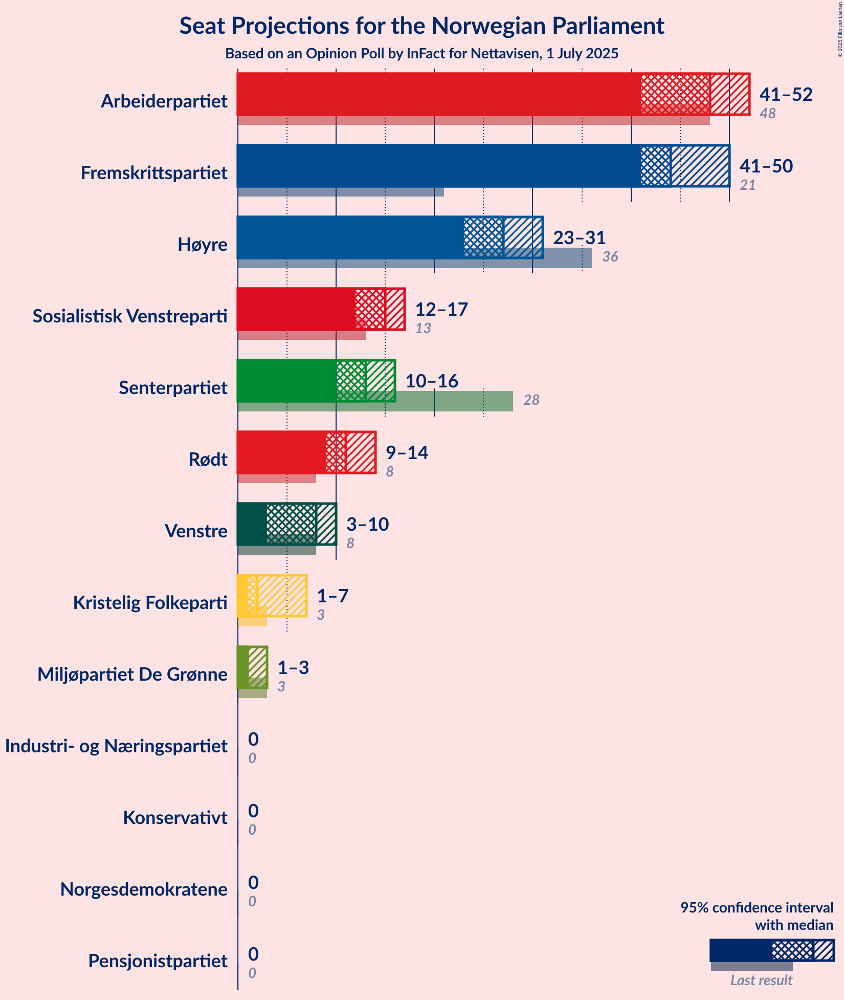
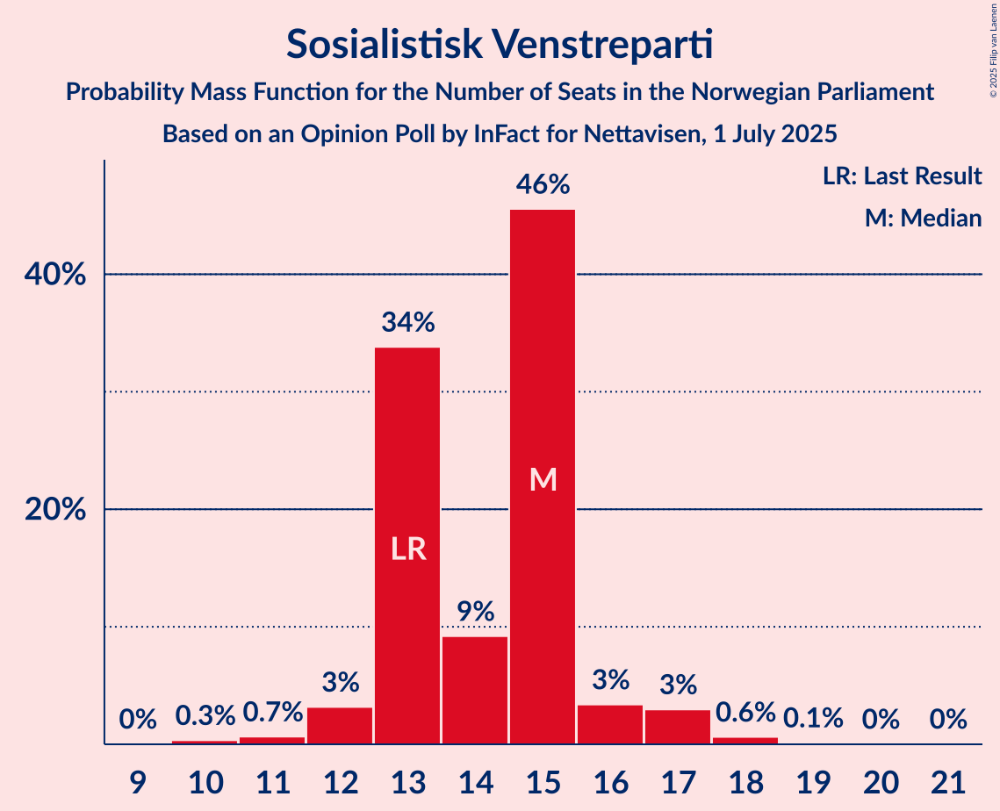
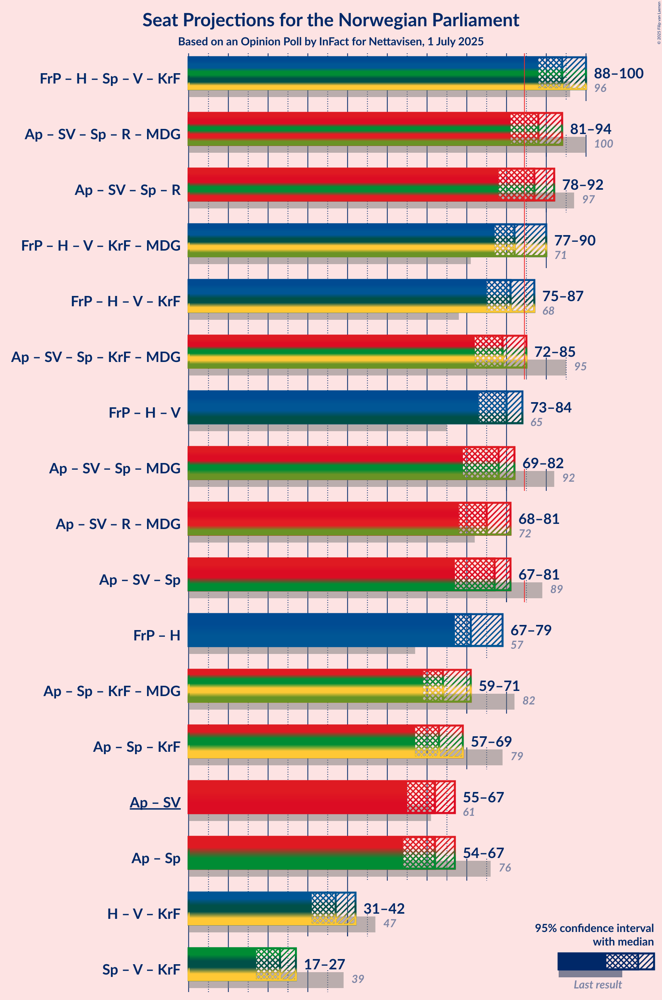

# Opinion Poll by InFact for Nettavisen, 1 July 2025

<a href="#voting-intentions">Voting Intentions</a> | <a href="#seats">Seats</a> | <a href="#coalitions">Coalitions</a> | <a href="#technical-information">Technical Information</a>

## Voting Intentions

### Confidence Intervals

| Party | Last Result | Poll Result | 80% Confidence Interval | 90% Confidence Interval | 95% Confidence Interval | 99% Confidence Interval |
|:-----:|:-----------:|:-----------:|:-----------------------:|:-----------------------:|:-----------------------:|:-----------------------:|
| Arbeiderpartiet | 26.2% | 25.2% | 23.6–26.9% |23.1–27.4% |22.7–27.8% |22.0–28.7% |
| Fremskrittspartiet | 11.6% | 23.9% | 22.3–25.6% |21.8–26.0% |21.4–26.5% |20.7–27.3% |
| Høyre | 20.4% | 14.8% | 13.5–16.2% |13.1–16.7% |12.8–17.0% |12.2–17.7% |
| Sosialistisk Venstreparti | 7.6% | 7.9% | 6.9–9.0% |6.7–9.3% |6.4–9.6% |6.0–10.2% |
| Senterpartiet | 13.5% | 7.2% | 6.3–8.3% |6.0–8.6% |5.8–8.9% |5.4–9.4% |
| Rødt | 4.7% | 6.1% | 5.3–7.1% |5.0–7.4% |4.8–7.7% |4.5–8.2% |
| Venstre | 4.6% | 4.4% | 3.7–5.3% |3.5–5.5% |3.3–5.8% |3.0–6.2% |
| Kristelig Folkeparti | 3.8% | 3.2% | 2.6–4.0% |2.5–4.3% |2.3–4.5% |2.1–4.8% |
| Miljøpartiet De Grønne | 3.9% | 2.8% | 2.2–3.5% |2.1–3.7% |2.0–3.9% |1.7–4.3% |
| Konservativt | 0.4% | 0.9% | 0.6–1.4% |0.5–1.5% |0.5–1.6% |0.4–1.9% |
| Industri- og Næringspartiet | 0.3% | 0.8% | 0.5–1.3% |0.5–1.4% |0.4–1.5% |0.3–1.8% |
| Norgesdemokratene | 1.1% | 0.4% | 0.2–0.7% |0.2–0.8% |0.1–0.9% |0.1–1.1% |
| Pensjonistpartiet | 0.6% | 0.2% | 0.1–0.5% |0.1–0.6% |0.0–0.7% |0.0–0.8% |

*Note:* The poll result column reflects the actual value used in the calculations. Published results may vary slightly, and in addition be rounded to fewer digits.

## Seats

### Confidence Intervals

| Party | Last Result | Median | 80% Confidence Interval | 90% Confidence Interval | 95% Confidence Interval | 99% Confidence Interval |
|:-----:|:-----------:|:------:|:-----------------------:|:-----------------------:|:-----------------------:|:-----------------------:|
| <a href="#arbeiderpartiet">Arbeiderpartiet</a> | 48 | 48 | 46–52 |44–52 |41–52 |41–54 |
| <a href="#fremskrittspartiet">Fremskrittspartiet</a> | 21 | 44 | 42–47 |41–48 |41–50 |39–50 |
| <a href="#høyre">Høyre</a> | 36 | 27 | 24–30 |23–31 |23–31 |21–32 |
| <a href="#sosialistisk-venstreparti">Sosialistisk Venstreparti</a> | 13 | 15 | 13–15 |13–16 |12–17 |11–18 |
| <a href="#senterpartiet">Senterpartiet</a> | 28 | 13 | 10–16 |10–16 |10–16 |9–17 |
| <a href="#rødt">Rødt</a> | 8 | 11 | 10–12 |10–13 |9–14 |8–14 |
| <a href="#venstre">Venstre</a> | 8 | 8 | 3–9 |3–10 |3–10 |2–11 |
| <a href="#kristelig-folkeparti">Kristelig Folkeparti</a> | 3 | 2 | 1–3 |1–3 |1–7 |0–8 |
| <a href="#miljøpartiet-de-grønne">Miljøpartiet De Grønne</a> | 3 | 1 | 1–3 |1–3 |1–3 |1–8 |
| <a href="#konservativt">Konservativt</a> | 0 | 0 | 0 |0 |0 |0 |
| <a href="#industri--og-næringspartiet">Industri- og Næringspartiet</a> | 0 | 0 | 0 |0 |0 |0 |
| <a href="#norgesdemokratene">Norgesdemokratene</a> | 0 | 0 | 0 |0 |0 |0 |
| <a href="#pensjonistpartiet">Pensjonistpartiet</a> | 0 | 0 | 0 |0 |0 |0 |

### Arbeiderpartiet

*For a full overview of the results for this party, see the [Arbeiderpartiet](party-arbeiderpartiet.html) page.*

| Number of Seats | Probability | Accumulated | Special Marks |
|:---------------:|:-----------:|:-----------:|:-------------:|
| 39 | 0.1% | 100% |  |
| 40 | 0.2% | 99.8% |  |
| 41 | 2% | 99.6% |  |
| 42 | 0.8% | 97% |  |
| 43 | 0.8% | 96% |  |
| 44 | 1.3% | 96% |  |
| 45 | 3% | 94% |  |
| 46 | 13% | 92% |  |
| 47 | 15% | 78% |  |
| 48 | 27% | 64% | Last Result, Median |
| 49 | 3% | 36% |  |
| 50 | 5% | 34% |  |
| 51 | 7% | 28% |  |
| 52 | 20% | 22% |  |
| 53 | 1.4% | 2% |  |
| 54 | 0.5% | 0.8% |  |
| 55 | 0.1% | 0.3% |  |
| 56 | 0.1% | 0.2% |  |
| 57 | 0.1% | 0.1% |  |
| 58 | 0% | 0% |  |

### Fremskrittspartiet

*For a full overview of the results for this party, see the [Fremskrittspartiet](party-fremskrittspartiet.html) page.*

| Number of Seats | Probability | Accumulated | Special Marks |
|:---------------:|:-----------:|:-----------:|:-------------:|
| 21 | 0% | 100% | Last Result |
| 22 | 0% | 100% |  |
| 23 | 0% | 100% |  |
| 24 | 0% | 100% |  |
| 25 | 0% | 100% |  |
| 26 | 0% | 100% |  |
| 27 | 0% | 100% |  |
| 28 | 0% | 100% |  |
| 29 | 0% | 100% |  |
| 30 | 0% | 100% |  |
| 31 | 0% | 100% |  |
| 32 | 0% | 100% |  |
| 33 | 0% | 100% |  |
| 34 | 0% | 100% |  |
| 35 | 0% | 100% |  |
| 36 | 0% | 100% |  |
| 37 | 0% | 100% |  |
| 38 | 0.2% | 100% |  |
| 39 | 0.8% | 99.8% |  |
| 40 | 0.5% | 99.0% |  |
| 41 | 5% | 98.5% |  |
| 42 | 28% | 94% |  |
| 43 | 10% | 66% |  |
| 44 | 25% | 55% | Median |
| 45 | 4% | 30% |  |
| 46 | 6% | 27% |  |
| 47 | 12% | 21% |  |
| 48 | 5% | 9% |  |
| 49 | 1.3% | 4% |  |
| 50 | 3% | 3% |  |
| 51 | 0.1% | 0.2% |  |
| 52 | 0% | 0.1% |  |
| 53 | 0.1% | 0.1% |  |
| 54 | 0% | 0% |  |

### Høyre

*For a full overview of the results for this party, see the [Høyre](party-høyre.html) page.*

| Number of Seats | Probability | Accumulated | Special Marks |
|:---------------:|:-----------:|:-----------:|:-------------:|
| 19 | 0.1% | 100% |  |
| 20 | 0.1% | 99.9% |  |
| 21 | 0.6% | 99.9% |  |
| 22 | 1.3% | 99.3% |  |
| 23 | 4% | 98% |  |
| 24 | 9% | 94% |  |
| 25 | 8% | 86% |  |
| 26 | 8% | 78% |  |
| 27 | 22% | 70% | Median |
| 28 | 33% | 48% |  |
| 29 | 3% | 15% |  |
| 30 | 6% | 12% |  |
| 31 | 5% | 6% |  |
| 32 | 0.3% | 0.7% |  |
| 33 | 0.3% | 0.4% |  |
| 34 | 0.1% | 0.1% |  |
| 35 | 0% | 0% |  |
| 36 | 0% | 0% | Last Result |

### Sosialistisk Venstreparti

*For a full overview of the results for this party, see the [Sosialistisk Venstreparti](party-sosialistiskvenstreparti.html) page.*

| Number of Seats | Probability | Accumulated | Special Marks |
|:---------------:|:-----------:|:-----------:|:-------------:|
| 10 | 0.3% | 100% |  |
| 11 | 0.7% | 99.6% |  |
| 12 | 3% | 99.0% |  |
| 13 | 34% | 96% | Last Result |
| 14 | 9% | 62% |  |
| 15 | 46% | 53% | Median |
| 16 | 3% | 7% |  |
| 17 | 3% | 4% |  |
| 18 | 0.6% | 0.8% |  |
| 19 | 0.1% | 0.2% |  |
| 20 | 0% | 0.1% |  |
| 21 | 0% | 0% |  |

### Senterpartiet

*For a full overview of the results for this party, see the [Senterpartiet](party-senterpartiet.html) page.*

| Number of Seats | Probability | Accumulated | Special Marks |
|:---------------:|:-----------:|:-----------:|:-------------:|
| 8 | 0.1% | 100% |  |
| 9 | 0.8% | 99.9% |  |
| 10 | 27% | 99.2% |  |
| 11 | 9% | 72% |  |
| 12 | 6% | 63% |  |
| 13 | 24% | 57% | Median |
| 14 | 8% | 33% |  |
| 15 | 2% | 25% |  |
| 16 | 22% | 22% |  |
| 17 | 0.5% | 0.6% |  |
| 18 | 0.1% | 0.1% |  |
| 19 | 0% | 0% |  |
| 20 | 0% | 0% |  |
| 21 | 0% | 0% |  |
| 22 | 0% | 0% |  |
| 23 | 0% | 0% |  |
| 24 | 0% | 0% |  |
| 25 | 0% | 0% |  |
| 26 | 0% | 0% |  |
| 27 | 0% | 0% |  |
| 28 | 0% | 0% | Last Result |

### Rødt

*For a full overview of the results for this party, see the [Rødt](party-rødt.html) page.*

| Number of Seats | Probability | Accumulated | Special Marks |
|:---------------:|:-----------:|:-----------:|:-------------:|
| 8 | 0.5% | 100% | Last Result |
| 9 | 3% | 99.5% |  |
| 10 | 31% | 97% |  |
| 11 | 27% | 65% | Median |
| 12 | 30% | 38% |  |
| 13 | 3% | 8% |  |
| 14 | 4% | 5% |  |
| 15 | 0.3% | 0.5% |  |
| 16 | 0.1% | 0.1% |  |
| 17 | 0% | 0% |  |

### Venstre

*For a full overview of the results for this party, see the [Venstre](party-venstre.html) page.*

| Number of Seats | Probability | Accumulated | Special Marks |
|:---------------:|:-----------:|:-----------:|:-------------:|
| 2 | 2% | 100% |  |
| 3 | 13% | 98% |  |
| 4 | 0% | 86% |  |
| 5 | 0% | 86% |  |
| 6 | 0% | 86% |  |
| 7 | 3% | 86% |  |
| 8 | 49% | 83% | Last Result, Median |
| 9 | 27% | 34% |  |
| 10 | 6% | 7% |  |
| 11 | 0.6% | 0.8% |  |
| 12 | 0.2% | 0.2% |  |
| 13 | 0% | 0% |  |

### Kristelig Folkeparti

*For a full overview of the results for this party, see the [Kristelig Folkeparti](party-kristeligfolkeparti.html) page.*

| Number of Seats | Probability | Accumulated | Special Marks |
|:---------------:|:-----------:|:-----------:|:-------------:|
| 0 | 1.0% | 100% |  |
| 1 | 21% | 99.0% |  |
| 2 | 45% | 78% | Median |
| 3 | 29% | 33% | Last Result |
| 4 | 0% | 4% |  |
| 5 | 0% | 4% |  |
| 6 | 0% | 4% |  |
| 7 | 1.4% | 4% |  |
| 8 | 2% | 2% |  |
| 9 | 0.1% | 0.2% |  |
| 10 | 0.1% | 0.1% |  |
| 11 | 0% | 0% |  |

### Miljøpartiet De Grønne

*For a full overview of the results for this party, see the [Miljøpartiet De Grønne](party-miljøpartietdegrønne.html) page.*

| Number of Seats | Probability | Accumulated | Special Marks |
|:---------------:|:-----------:|:-----------:|:-------------:|
| 0 | 0.1% | 100% |  |
| 1 | 74% | 99.9% | Median |
| 2 | 11% | 26% |  |
| 3 | 15% | 16% | Last Result |
| 4 | 0% | 1.2% |  |
| 5 | 0% | 1.2% |  |
| 6 | 0.1% | 1.2% |  |
| 7 | 0.6% | 1.1% |  |
| 8 | 0.5% | 0.5% |  |
| 9 | 0.1% | 0.1% |  |
| 10 | 0% | 0% |  |

### Konservativt

*For a full overview of the results for this party, see the [Konservativt](party-konservativt.html) page.*

| Number of Seats | Probability | Accumulated | Special Marks |
|:---------------:|:-----------:|:-----------:|:-------------:|
| 0 | 100% | 100% | Last Result, Median |

### Industri- og Næringspartiet

*For a full overview of the results for this party, see the [Industri- og Næringspartiet](party-industri-ognæringspartiet.html) page.*

| Number of Seats | Probability | Accumulated | Special Marks |
|:---------------:|:-----------:|:-----------:|:-------------:|
| 0 | 100% | 100% | Last Result, Median |

### Norgesdemokratene

*For a full overview of the results for this party, see the [Norgesdemokratene](party-norgesdemokratene.html) page.*

| Number of Seats | Probability | Accumulated | Special Marks |
|:---------------:|:-----------:|:-----------:|:-------------:|
| 0 | 100% | 100% | Last Result, Median |

### Pensjonistpartiet

*For a full overview of the results for this party, see the [Pensjonistpartiet](party-pensjonistpartiet.html) page.*

| Number of Seats | Probability | Accumulated | Special Marks |
|:---------------:|:-----------:|:-----------:|:-------------:|
| 0 | 100% | 100% | Last Result, Median |

## Coalitions

### Confidence Intervals

| Coalition | Last Result | Median | Majority? | 80% Confidence Interval | 90% Confidence Interval | 95% Confidence Interval | 99% Confidence Interval |
|:---------:|:-----------:|:------:|:---------:|:-----------------------:|:-----------------------:|:-----------------------:|:-----------------------:|
| Fremskrittspartiet – Høyre – Senterpartiet – Venstre – Kristelig Folkeparti | 96 | 94 | 100% | 91–97 | 90–99 | 88–100 | 87–100 |
| Arbeiderpartiet – Sosialistisk Venstreparti – Senterpartiet – Rødt – Miljøpartiet De Grønne | 100 | 88 | 89% | 84–91 | 83–93 | 81–94 | 77–97 |
| Arbeiderpartiet – Sosialistisk Venstreparti – Senterpartiet – Rødt | 97 | 87 | 71% | 83–89 | 82–91 | 78–92 | 75–96 |
| Fremskrittspartiet – Høyre – Venstre – Kristelig Folkeparti – Miljøpartiet De Grønne | 71 | 82 | 28% | 80–86 | 78–87 | 77–90 | 73–93 |
| Fremskrittspartiet – Høyre – Venstre – Kristelig Folkeparti | 68 | 81 | 10% | 78–85 | 76–86 | 75–87 | 72–91 |
| Arbeiderpartiet – Sosialistisk Venstreparti – Senterpartiet – Kristelig Folkeparti – Miljøpartiet De Grønne | 95 | 79 | 3% | 76–83 | 74–83 | 72–85 | 72–88 |
| Fremskrittspartiet – Høyre – Venstre | 65 | 80 | 0.3% | 76–82 | 74–83 | 73–84 | 69–84 |
| Arbeiderpartiet – Sosialistisk Venstreparti – Senterpartiet – Miljøpartiet De Grønne | 92 | 78 | 1.0% | 73–80 | 70–81 | 69–82 | 66–85 |
| Arbeiderpartiet – Sosialistisk Venstreparti – Rødt – Miljøpartiet De Grønne | 72 | 75 | 0% | 72–78 | 70–79 | 68–81 | 68–82 |
| Arbeiderpartiet – Sosialistisk Venstreparti – Senterpartiet | 89 | 77 | 0% | 72–78 | 69–79 | 67–81 | 64–84 |
| Fremskrittspartiet – Høyre | 57 | 71 | 0% | 67–74 | 67–77 | 67–79 | 64–79 |
| Arbeiderpartiet – Senterpartiet – Kristelig Folkeparti – Miljøpartiet De Grønne | 82 | 64 | 0% | 62–67 | 60–69 | 59–71 | 59–74 |
| Arbeiderpartiet – Senterpartiet – Kristelig Folkeparti | 79 | 63 | 0% | 60–66 | 58–67 | 57–69 | 57–73 |
| Arbeiderpartiet – Sosialistisk Venstreparti | 61 | 62 | 0% | 59–67 | 58–67 | 55–67 | 53–69 |
| Arbeiderpartiet – Senterpartiet | 76 | 62 | 0% | 57–64 | 56–64 | 54–67 | 51–68 |
| Høyre – Venstre – Kristelig Folkeparti | 47 | 37 | 0% | 34–40 | 32–41 | 31–42 | 29–45 |
| Senterpartiet – Venstre – Kristelig Folkeparti | 39 | 23 | 0% | 19–26 | 18–26 | 17–27 | 15–28 |

### Fremskrittspartiet – Høyre – Senterpartiet – Venstre – Kristelig Folkeparti

| Number of Seats | Probability | Accumulated | Special Marks |
|:---------------:|:-----------:|:-----------:|:-------------:|
| 85 | 0.1% | 100% | Majority |
| 86 | 0.1% | 99.8% |  |
| 87 | 0.6% | 99.7% |  |
| 88 | 2% | 99.1% |  |
| 89 | 1.3% | 97% |  |
| 90 | 2% | 96% |  |
| 91 | 25% | 94% |  |
| 92 | 6% | 69% |  |
| 93 | 12% | 63% |  |
| 94 | 3% | 51% | Median |
| 95 | 23% | 48% |  |
| 96 | 9% | 25% | Last Result |
| 97 | 10% | 17% |  |
| 98 | 0.9% | 7% |  |
| 99 | 3% | 6% |  |
| 100 | 3% | 3% |  |
| 101 | 0.2% | 0.4% |  |
| 102 | 0.1% | 0.2% |  |
| 103 | 0% | 0.1% |  |
| 104 | 0.1% | 0.1% |  |
| 105 | 0% | 0% |  |

### Arbeiderpartiet – Sosialistisk Venstreparti – Senterpartiet – Rødt – Miljøpartiet De Grønne

| Number of Seats | Probability | Accumulated | Special Marks |
|:---------------:|:-----------:|:-----------:|:-------------:|
| 77 | 0.6% | 100% |  |
| 78 | 0% | 99.4% |  |
| 79 | 0% | 99.3% |  |
| 80 | 0.3% | 99.3% |  |
| 81 | 2% | 99.0% |  |
| 82 | 1.0% | 97% |  |
| 83 | 2% | 96% |  |
| 84 | 4% | 94% |  |
| 85 | 8% | 89% | Majority |
| 86 | 15% | 81% |  |
| 87 | 5% | 67% |  |
| 88 | 21% | 62% | Median |
| 89 | 4% | 41% |  |
| 90 | 24% | 37% |  |
| 91 | 7% | 13% |  |
| 92 | 1.2% | 7% |  |
| 93 | 3% | 5% |  |
| 94 | 1.4% | 3% |  |
| 95 | 0.5% | 1.3% |  |
| 96 | 0.2% | 0.8% |  |
| 97 | 0.5% | 0.6% |  |
| 98 | 0.1% | 0.1% |  |
| 99 | 0% | 0% |  |
| 100 | 0% | 0% | Last Result |

### Arbeiderpartiet – Sosialistisk Venstreparti – Senterpartiet – Rødt

| Number of Seats | Probability | Accumulated | Special Marks |
|:---------------:|:-----------:|:-----------:|:-------------:|
| 71 | 0.1% | 100% |  |
| 72 | 0% | 99.9% |  |
| 73 | 0% | 99.9% |  |
| 74 | 0% | 99.9% |  |
| 75 | 0.6% | 99.9% |  |
| 76 | 0% | 99.4% |  |
| 77 | 0% | 99.3% |  |
| 78 | 2% | 99.3% |  |
| 79 | 0.4% | 97% |  |
| 80 | 1.0% | 97% |  |
| 81 | 0.3% | 96% |  |
| 82 | 3% | 96% |  |
| 83 | 12% | 93% |  |
| 84 | 10% | 81% |  |
| 85 | 9% | 71% | Majority |
| 86 | 3% | 63% |  |
| 87 | 20% | 60% | Median |
| 88 | 8% | 39% |  |
| 89 | 22% | 32% |  |
| 90 | 4% | 9% |  |
| 91 | 1.1% | 5% |  |
| 92 | 3% | 4% |  |
| 93 | 0.4% | 1.2% |  |
| 94 | 0.2% | 0.8% |  |
| 95 | 0.1% | 0.6% |  |
| 96 | 0.5% | 0.5% |  |
| 97 | 0% | 0% | Last Result |

### Fremskrittspartiet – Høyre – Venstre – Kristelig Folkeparti – Miljøpartiet De Grønne

| Number of Seats | Probability | Accumulated | Special Marks |
|:---------------:|:-----------:|:-----------:|:-------------:|
| 71 | 0% | 100% | Last Result |
| 72 | 0% | 100% |  |
| 73 | 0.5% | 100% |  |
| 74 | 0.1% | 99.5% |  |
| 75 | 0.2% | 99.3% |  |
| 76 | 0.4% | 99.2% |  |
| 77 | 3% | 98.7% |  |
| 78 | 1.1% | 96% |  |
| 79 | 4% | 95% |  |
| 80 | 22% | 91% |  |
| 81 | 8% | 68% |  |
| 82 | 20% | 61% | Median |
| 83 | 3% | 40% |  |
| 84 | 9% | 37% |  |
| 85 | 10% | 28% | Majority |
| 86 | 12% | 19% |  |
| 87 | 2% | 7% |  |
| 88 | 0.8% | 4% |  |
| 89 | 0.5% | 3% |  |
| 90 | 2% | 3% |  |
| 91 | 0% | 0.7% |  |
| 92 | 0% | 0.7% |  |
| 93 | 0.6% | 0.6% |  |
| 94 | 0% | 0.1% |  |
| 95 | 0% | 0.1% |  |
| 96 | 0% | 0.1% |  |
| 97 | 0.1% | 0.1% |  |
| 98 | 0% | 0% |  |

### Fremskrittspartiet – Høyre – Venstre – Kristelig Folkeparti

| Number of Seats | Probability | Accumulated | Special Marks |
|:---------------:|:-----------:|:-----------:|:-------------:|
| 68 | 0% | 100% | Last Result |
| 69 | 0% | 100% |  |
| 70 | 0% | 100% |  |
| 71 | 0.1% | 100% |  |
| 72 | 0.5% | 99.9% |  |
| 73 | 0.2% | 99.4% |  |
| 74 | 0.5% | 99.2% |  |
| 75 | 1.5% | 98.7% |  |
| 76 | 3% | 97% |  |
| 77 | 1.2% | 95% |  |
| 78 | 7% | 93% |  |
| 79 | 24% | 87% |  |
| 80 | 4% | 63% |  |
| 81 | 21% | 59% | Median |
| 82 | 5% | 38% |  |
| 83 | 15% | 33% |  |
| 84 | 8% | 18% |  |
| 85 | 4% | 10% | Majority |
| 86 | 3% | 6% |  |
| 87 | 2% | 3% |  |
| 88 | 0.2% | 1.1% |  |
| 89 | 0.2% | 0.9% |  |
| 90 | 0% | 0.7% |  |
| 91 | 0.6% | 0.6% |  |
| 92 | 0% | 0% |  |

### Arbeiderpartiet – Sosialistisk Venstreparti – Senterpartiet – Kristelig Folkeparti – Miljøpartiet De Grønne

| Number of Seats | Probability | Accumulated | Special Marks |
|:---------------:|:-----------:|:-----------:|:-------------:|
| 70 | 0% | 100% |  |
| 71 | 0% | 99.9% |  |
| 72 | 4% | 99.9% |  |
| 73 | 0.3% | 96% |  |
| 74 | 0.7% | 95% |  |
| 75 | 1.3% | 95% |  |
| 76 | 4% | 93% |  |
| 77 | 9% | 89% |  |
| 78 | 20% | 80% |  |
| 79 | 19% | 60% | Median |
| 80 | 21% | 40% |  |
| 81 | 3% | 19% |  |
| 82 | 5% | 15% |  |
| 83 | 6% | 10% |  |
| 84 | 1.3% | 5% |  |
| 85 | 1.2% | 3% | Majority |
| 86 | 0.4% | 2% |  |
| 87 | 0.8% | 2% |  |
| 88 | 1.0% | 1.1% |  |
| 89 | 0% | 0.1% |  |
| 90 | 0% | 0.1% |  |
| 91 | 0% | 0% |  |
| 92 | 0% | 0% |  |
| 93 | 0% | 0% |  |
| 94 | 0% | 0% |  |
| 95 | 0% | 0% | Last Result |

### Fremskrittspartiet – Høyre – Venstre

| Number of Seats | Probability | Accumulated | Special Marks |
|:---------------:|:-----------:|:-----------:|:-------------:|
| 65 | 0% | 100% | Last Result |
| 66 | 0% | 100% |  |
| 67 | 0% | 100% |  |
| 68 | 0% | 100% |  |
| 69 | 0.5% | 100% |  |
| 70 | 0.2% | 99.5% |  |
| 71 | 0.7% | 99.3% |  |
| 72 | 1.1% | 98.6% |  |
| 73 | 1.4% | 98% |  |
| 74 | 2% | 96% |  |
| 75 | 2% | 94% |  |
| 76 | 7% | 92% |  |
| 77 | 26% | 85% |  |
| 78 | 3% | 59% |  |
| 79 | 2% | 56% | Median |
| 80 | 35% | 55% |  |
| 81 | 5% | 20% |  |
| 82 | 7% | 14% |  |
| 83 | 5% | 8% |  |
| 84 | 2% | 3% |  |
| 85 | 0.1% | 0.3% | Majority |
| 86 | 0.1% | 0.2% |  |
| 87 | 0.1% | 0.1% |  |
| 88 | 0.1% | 0.1% |  |
| 89 | 0% | 0% |  |

### Arbeiderpartiet – Sosialistisk Venstreparti – Senterpartiet – Miljøpartiet De Grønne

| Number of Seats | Probability | Accumulated | Special Marks |
|:---------------:|:-----------:|:-----------:|:-------------:|
| 66 | 0.6% | 100% |  |
| 67 | 0% | 99.4% |  |
| 68 | 0% | 99.4% |  |
| 69 | 2% | 99.4% |  |
| 70 | 2% | 97% |  |
| 71 | 0.3% | 95% |  |
| 72 | 0.7% | 95% |  |
| 73 | 6% | 94% |  |
| 74 | 3% | 88% |  |
| 75 | 23% | 85% |  |
| 76 | 3% | 62% |  |
| 77 | 2% | 59% | Median |
| 78 | 39% | 57% |  |
| 79 | 4% | 18% |  |
| 80 | 7% | 15% |  |
| 81 | 3% | 7% |  |
| 82 | 2% | 5% |  |
| 83 | 0.9% | 2% |  |
| 84 | 0.3% | 1.3% |  |
| 85 | 0.9% | 1.0% | Majority |
| 86 | 0% | 0.1% |  |
| 87 | 0% | 0% |  |
| 88 | 0% | 0% |  |
| 89 | 0% | 0% |  |
| 90 | 0% | 0% |  |
| 91 | 0% | 0% |  |
| 92 | 0% | 0% | Last Result |

### Arbeiderpartiet – Sosialistisk Venstreparti – Rødt – Miljøpartiet De Grønne

| Number of Seats | Probability | Accumulated | Special Marks |
|:---------------:|:-----------:|:-----------:|:-------------:|
| 64 | 0.1% | 100% |  |
| 65 | 0% | 99.9% |  |
| 66 | 0% | 99.9% |  |
| 67 | 0.2% | 99.9% |  |
| 68 | 2% | 99.7% |  |
| 69 | 1.2% | 97% |  |
| 70 | 2% | 96% |  |
| 71 | 0.8% | 94% |  |
| 72 | 10% | 93% | Last Result |
| 73 | 9% | 83% |  |
| 74 | 22% | 74% |  |
| 75 | 3% | 52% | Median |
| 76 | 12% | 49% |  |
| 77 | 6% | 37% |  |
| 78 | 25% | 31% |  |
| 79 | 2% | 6% |  |
| 80 | 1.3% | 4% |  |
| 81 | 2% | 3% |  |
| 82 | 0.6% | 0.9% |  |
| 83 | 0.1% | 0.2% |  |
| 84 | 0.1% | 0.2% |  |
| 85 | 0% | 0% | Majority |

### Arbeiderpartiet – Sosialistisk Venstreparti – Senterpartiet

| Number of Seats | Probability | Accumulated | Special Marks |
|:---------------:|:-----------:|:-----------:|:-------------:|
| 63 | 0.1% | 100% |  |
| 64 | 0.6% | 99.9% |  |
| 65 | 0% | 99.4% |  |
| 66 | 2% | 99.3% |  |
| 67 | 0.6% | 98% |  |
| 68 | 0.2% | 97% |  |
| 69 | 2% | 97% |  |
| 70 | 0.6% | 95% |  |
| 71 | 1.4% | 94% |  |
| 72 | 15% | 93% |  |
| 73 | 4% | 78% |  |
| 74 | 12% | 74% |  |
| 75 | 4% | 62% |  |
| 76 | 3% | 58% | Median |
| 77 | 40% | 55% |  |
| 78 | 6% | 15% |  |
| 79 | 5% | 10% |  |
| 80 | 0.5% | 4% |  |
| 81 | 2% | 4% |  |
| 82 | 0.2% | 1.2% |  |
| 83 | 0.4% | 1.0% |  |
| 84 | 0.5% | 0.6% |  |
| 85 | 0% | 0% | Majority |
| 86 | 0% | 0% |  |
| 87 | 0% | 0% |  |
| 88 | 0% | 0% |  |
| 89 | 0% | 0% | Last Result |

### Fremskrittspartiet – Høyre

| Number of Seats | Probability | Accumulated | Special Marks |
|:---------------:|:-----------:|:-----------:|:-------------:|
| 57 | 0% | 100% | Last Result |
| 58 | 0% | 100% |  |
| 59 | 0% | 100% |  |
| 60 | 0% | 100% |  |
| 61 | 0% | 100% |  |
| 62 | 0.1% | 100% |  |
| 63 | 0% | 99.9% |  |
| 64 | 0.6% | 99.9% |  |
| 65 | 0.5% | 99.3% |  |
| 66 | 1.0% | 98.8% |  |
| 67 | 8% | 98% |  |
| 68 | 2% | 90% |  |
| 69 | 23% | 88% |  |
| 70 | 7% | 66% |  |
| 71 | 15% | 58% | Median |
| 72 | 23% | 44% |  |
| 73 | 3% | 20% |  |
| 74 | 8% | 18% |  |
| 75 | 2% | 10% |  |
| 76 | 2% | 8% |  |
| 77 | 0.6% | 5% |  |
| 78 | 1.4% | 5% |  |
| 79 | 3% | 3% |  |
| 80 | 0% | 0.1% |  |
| 81 | 0% | 0% |  |

### Arbeiderpartiet – Senterpartiet – Kristelig Folkeparti – Miljøpartiet De Grønne

| Number of Seats | Probability | Accumulated | Special Marks |
|:---------------:|:-----------:|:-----------:|:-------------:|
| 56 | 0.1% | 100% |  |
| 57 | 0.1% | 99.8% |  |
| 58 | 0.2% | 99.8% |  |
| 59 | 3% | 99.6% |  |
| 60 | 3% | 97% |  |
| 61 | 1.0% | 94% |  |
| 62 | 7% | 93% |  |
| 63 | 17% | 86% |  |
| 64 | 26% | 69% | Median |
| 65 | 4% | 43% |  |
| 66 | 2% | 39% |  |
| 67 | 27% | 37% |  |
| 68 | 4% | 10% |  |
| 69 | 2% | 6% |  |
| 70 | 0.8% | 4% |  |
| 71 | 2% | 3% |  |
| 72 | 0.3% | 2% |  |
| 73 | 0.3% | 2% |  |
| 74 | 1.0% | 1.2% |  |
| 75 | 0.1% | 0.2% |  |
| 76 | 0% | 0.1% |  |
| 77 | 0% | 0% |  |
| 78 | 0% | 0% |  |
| 79 | 0% | 0% |  |
| 80 | 0% | 0% |  |
| 81 | 0% | 0% |  |
| 82 | 0% | 0% | Last Result |

### Arbeiderpartiet – Senterpartiet – Kristelig Folkeparti

| Number of Seats | Probability | Accumulated | Special Marks |
|:---------------:|:-----------:|:-----------:|:-------------:|
| 55 | 0.2% | 100% |  |
| 56 | 0.2% | 99.8% |  |
| 57 | 3% | 99.6% |  |
| 58 | 3% | 97% |  |
| 59 | 0.9% | 94% |  |
| 60 | 7% | 94% |  |
| 61 | 11% | 87% |  |
| 62 | 10% | 75% |  |
| 63 | 25% | 65% | Median |
| 64 | 4% | 40% |  |
| 65 | 4% | 36% |  |
| 66 | 26% | 32% |  |
| 67 | 2% | 6% |  |
| 68 | 2% | 5% |  |
| 69 | 0.5% | 3% |  |
| 70 | 0.8% | 2% |  |
| 71 | 0.6% | 1.4% |  |
| 72 | 0.1% | 0.8% |  |
| 73 | 0.5% | 0.6% |  |
| 74 | 0.1% | 0.1% |  |
| 75 | 0% | 0% |  |
| 76 | 0% | 0% |  |
| 77 | 0% | 0% |  |
| 78 | 0% | 0% |  |
| 79 | 0% | 0% | Last Result |

### Arbeiderpartiet – Sosialistisk Venstreparti

| Number of Seats | Probability | Accumulated | Special Marks |
|:---------------:|:-----------:|:-----------:|:-------------:|
| 50 | 0.1% | 100% |  |
| 51 | 0% | 99.9% |  |
| 52 | 0% | 99.9% |  |
| 53 | 2% | 99.9% |  |
| 54 | 0.6% | 98% |  |
| 55 | 0.7% | 98% |  |
| 56 | 0.2% | 97% |  |
| 57 | 0.4% | 97% |  |
| 58 | 3% | 96% |  |
| 59 | 3% | 93% |  |
| 60 | 4% | 90% |  |
| 61 | 35% | 86% | Last Result |
| 62 | 13% | 50% |  |
| 63 | 1.2% | 38% | Median |
| 64 | 5% | 36% |  |
| 65 | 6% | 32% |  |
| 66 | 4% | 26% |  |
| 67 | 19% | 22% |  |
| 68 | 0.4% | 2% |  |
| 69 | 2% | 2% |  |
| 70 | 0.1% | 0.1% |  |
| 71 | 0.1% | 0.1% |  |
| 72 | 0% | 0% |  |

### Arbeiderpartiet – Senterpartiet

| Number of Seats | Probability | Accumulated | Special Marks |
|:---------------:|:-----------:|:-----------:|:-------------:|
| 51 | 0.6% | 100% |  |
| 52 | 0.1% | 99.4% |  |
| 53 | 0.2% | 99.3% |  |
| 54 | 2% | 99.1% |  |
| 55 | 0.7% | 97% |  |
| 56 | 2% | 96% |  |
| 57 | 7% | 94% |  |
| 58 | 4% | 86% |  |
| 59 | 18% | 82% |  |
| 60 | 3% | 64% |  |
| 61 | 4% | 61% | Median |
| 62 | 22% | 57% |  |
| 63 | 5% | 35% |  |
| 64 | 26% | 31% |  |
| 65 | 1.4% | 5% |  |
| 66 | 0.4% | 3% |  |
| 67 | 2% | 3% |  |
| 68 | 0.5% | 0.7% |  |
| 69 | 0.2% | 0.2% |  |
| 70 | 0% | 0% |  |
| 71 | 0% | 0% |  |
| 72 | 0% | 0% |  |
| 73 | 0% | 0% |  |
| 74 | 0% | 0% |  |
| 75 | 0% | 0% |  |
| 76 | 0% | 0% | Last Result |

### Høyre – Venstre – Kristelig Folkeparti

| Number of Seats | Probability | Accumulated | Special Marks |
|:---------------:|:-----------:|:-----------:|:-------------:|
| 28 | 0.4% | 100% |  |
| 29 | 0.2% | 99.6% |  |
| 30 | 1.3% | 99.4% |  |
| 31 | 2% | 98% |  |
| 32 | 2% | 96% |  |
| 33 | 4% | 94% |  |
| 34 | 2% | 90% |  |
| 35 | 4% | 88% |  |
| 36 | 17% | 84% |  |
| 37 | 42% | 67% | Median |
| 38 | 2% | 25% |  |
| 39 | 5% | 23% |  |
| 40 | 12% | 19% |  |
| 41 | 3% | 7% |  |
| 42 | 2% | 4% |  |
| 43 | 0.2% | 1.2% |  |
| 44 | 0.2% | 1.1% |  |
| 45 | 0.7% | 0.9% |  |
| 46 | 0.2% | 0.2% |  |
| 47 | 0% | 0% | Last Result |

### Senterpartiet – Venstre – Kristelig Folkeparti

| Number of Seats | Probability | Accumulated | Special Marks |
|:---------------:|:-----------:|:-----------:|:-------------:|
| 15 | 1.1% | 100% |  |
| 16 | 0.7% | 98.9% |  |
| 17 | 2% | 98% |  |
| 18 | 6% | 96% |  |
| 19 | 19% | 91% |  |
| 20 | 0.7% | 72% |  |
| 21 | 5% | 71% |  |
| 22 | 10% | 66% |  |
| 23 | 10% | 56% | Median |
| 24 | 8% | 46% |  |
| 25 | 14% | 38% |  |
| 26 | 22% | 25% |  |
| 27 | 2% | 3% |  |
| 28 | 0.6% | 1.0% |  |
| 29 | 0.2% | 0.5% |  |
| 30 | 0.2% | 0.3% |  |
| 31 | 0% | 0.1% |  |
| 32 | 0% | 0.1% |  |
| 33 | 0% | 0% |  |
| 34 | 0% | 0% |  |
| 35 | 0% | 0% |  |
| 36 | 0% | 0% |  |
| 37 | 0% | 0% |  |
| 38 | 0% | 0% |  |
| 39 | 0% | 0% | Last Result |

## Technical Information

### Opinion Poll

+ **Polling firm:** InFact
+ **Commissioner(s):** Nettavisen
+ **Fieldwork period:** 1 July 2025

### Calculations

+ **Sample size:** 1115
+ **Simulations done:** 2,097,152
+ **Error estimate:** 3.15%

