# Opinion Poll by Norfakta for Klassekampen and Nationen, 1–2 July 2025

<a href="#voting-intentions">Voting Intentions</a> | <a href="#seats">Seats</a> | <a href="#coalitions">Coalitions</a> | <a href="#technical-information">Technical Information</a>

## Voting Intentions

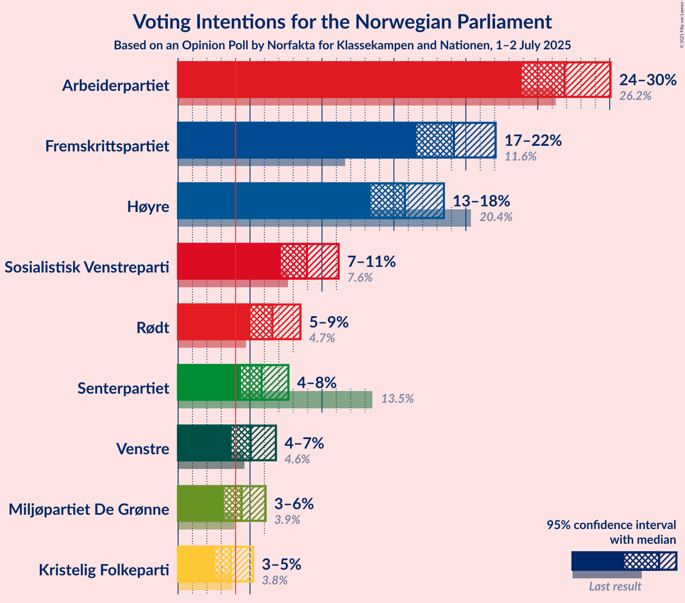

### Confidence Intervals

| Party | Last Result | Poll Result | 80% Confidence Interval | 90% Confidence Interval | 95% Confidence Interval | 99% Confidence Interval |
|:-----:|:-----------:|:-----------:|:-----------------------:|:-----------------------:|:-----------------------:|:-----------------------:|
| Arbeiderpartiet | 26.2% | 26.9% | 24.9–29.0% |24.4–29.5% |23.9–30.1% |23.0–31.1% |
| Fremskrittspartiet | 11.6% | 19.2% | 17.5–21.1% |17.0–21.6% |16.6–22.1% |15.8–23.0% |
| Høyre | 20.4% | 15.8% | 14.2–17.5% |13.8–18.0% |13.4–18.5% |12.7–19.3% |
| Sosialistisk Venstreparti | 7.6% | 9.0% | 7.8–10.4% |7.4–10.8% |7.1–11.2% |6.6–11.9% |
| Rødt | 4.7% | 6.6% | 5.5–7.8% |5.3–8.2% |5.0–8.5% |4.6–9.2% |
| Senterpartiet | 13.5% | 5.8% | 4.9–7.0% |4.6–7.4% |4.4–7.7% |4.0–8.3% |
| Venstre | 4.6% | 5.0% | 4.2–6.2% |3.9–6.5% |3.7–6.8% |3.3–7.4% |
| Miljøpartiet De Grønne | 3.9% | 4.4% | 3.6–5.5% |3.4–5.8% |3.2–6.1% |2.8–6.6% |
| Kristelig Folkeparti | 3.8% | 3.7% | 2.9–4.7% |2.7–5.0% |2.6–5.2% |2.2–5.7% |

*Note:* The poll result column reflects the actual value used in the calculations. Published results may vary slightly, and in addition be rounded to fewer digits.

## Seats

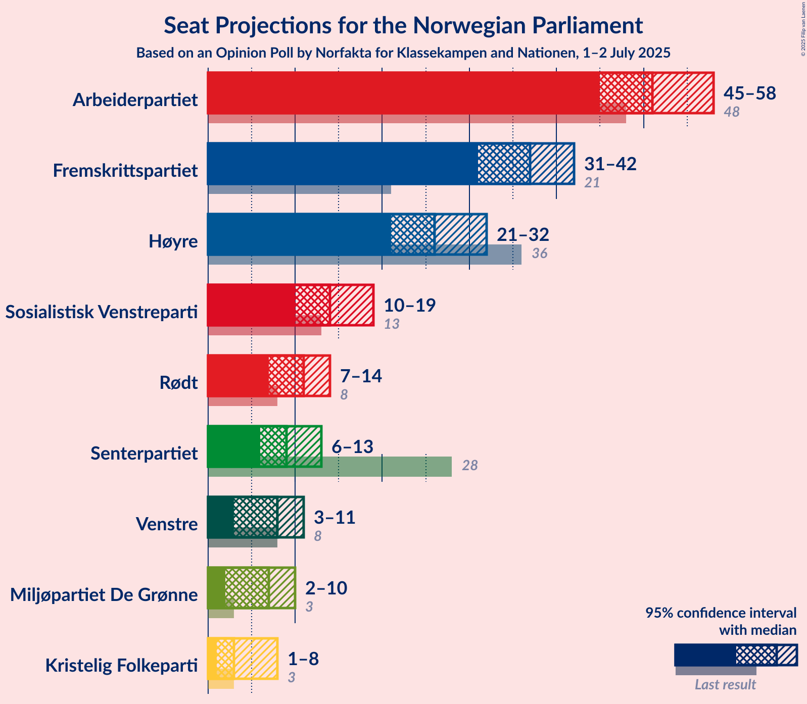

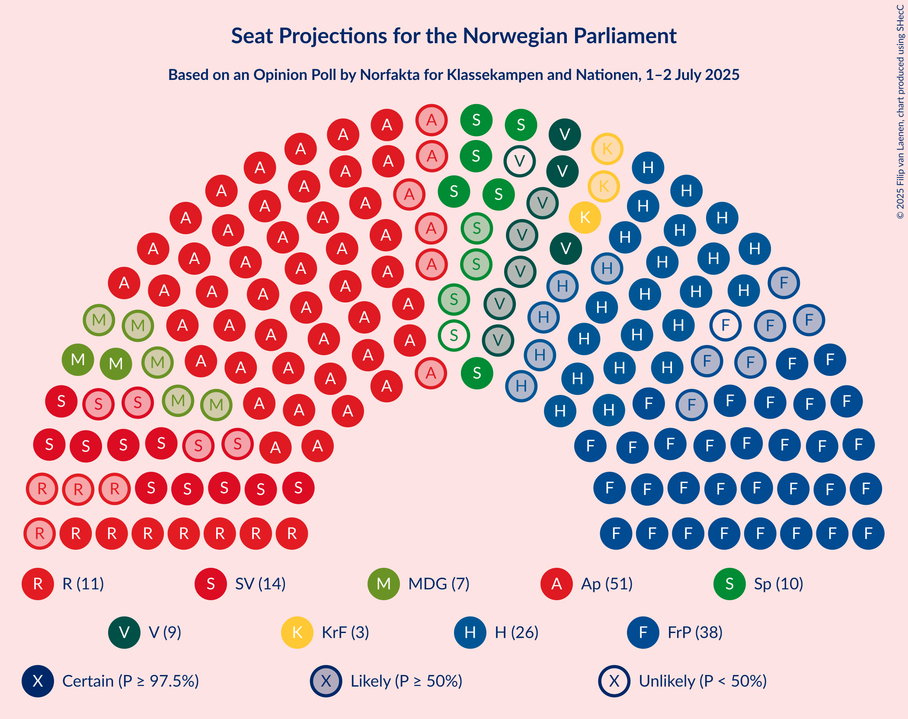

### Confidence Intervals

| Party | Last Result | Median | 80% Confidence Interval | 90% Confidence Interval | 95% Confidence Interval | 99% Confidence Interval |
|:-----:|:-----------:|:------:|:-----------------------:|:-----------------------:|:-----------------------:|:-----------------------:|
| <a href="#arbeiderpartiet">Arbeiderpartiet</a> | 48 | 51 | 47–55 |46–58 |45–58 |42–59 |
| <a href="#fremskrittspartiet">Fremskrittspartiet</a> | 21 | 37 | 33–40 |32–41 |31–42 |29–42 |
| <a href="#høyre">Høyre</a> | 36 | 26 | 23–31 |22–32 |21–32 |20–34 |
| <a href="#sosialistisk-venstreparti">Sosialistisk Venstreparti</a> | 13 | 14 | 12–17 |11–18 |10–19 |9–20 |
| <a href="#rødt">Rødt</a> | 8 | 11 | 8–13 |8–13 |7–14 |7–15 |
| <a href="#senterpartiet">Senterpartiet</a> | 28 | 9 | 7–12 |7–12 |6–13 |1–15 |
| <a href="#venstre">Venstre</a> | 8 | 8 | 6–10 |3–11 |3–11 |2–12 |
| <a href="#miljøpartiet-de-grønne">Miljøpartiet De Grønne</a> | 3 | 7 | 2–9 |2–9 |2–10 |1–11 |
| <a href="#kristelig-folkeparti">Kristelig Folkeparti</a> | 3 | 3 | 2–7 |2–8 |1–8 |0–9 |

### Arbeiderpartiet

*For a full overview of the results for this party, see the [Arbeiderpartiet](party-arbeiderpartiet.html) page.*

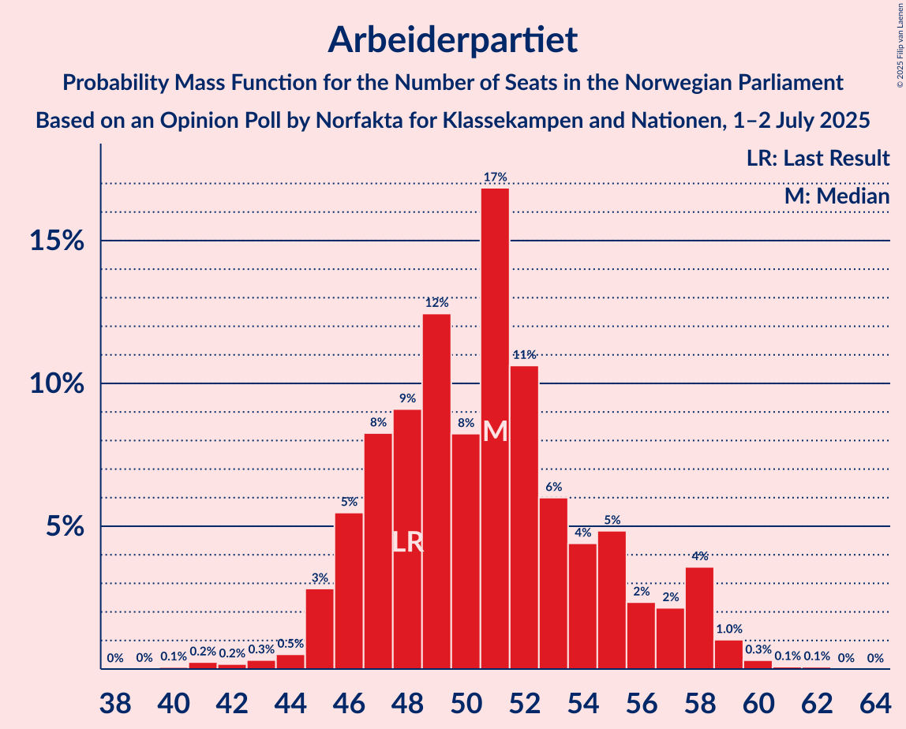

| Number of Seats | Probability | Accumulated | Special Marks |
|:---------------:|:-----------:|:-----------:|:-------------:|
| 40 | 0.1% | 100% |  |
| 41 | 0.2% | 99.9% |  |
| 42 | 0.2% | 99.7% |  |
| 43 | 0.3% | 99.5% |  |
| 44 | 0.5% | 99.2% |  |
| 45 | 3% | 98.6% |  |
| 46 | 5% | 96% |  |
| 47 | 8% | 90% |  |
| 48 | 9% | 82% | Last Result |
| 49 | 12% | 73% |  |
| 50 | 8% | 61% |  |
| 51 | 17% | 52% | Median |
| 52 | 11% | 35% |  |
| 53 | 6% | 25% |  |
| 54 | 4% | 19% |  |
| 55 | 5% | 14% |  |
| 56 | 2% | 10% |  |
| 57 | 2% | 7% |  |
| 58 | 4% | 5% |  |
| 59 | 1.0% | 2% |  |
| 60 | 0.3% | 0.5% |  |
| 61 | 0.1% | 0.2% |  |
| 62 | 0.1% | 0.1% |  |
| 63 | 0% | 0% |  |

### Fremskrittspartiet

*For a full overview of the results for this party, see the [Fremskrittspartiet](party-fremskrittspartiet.html) page.*

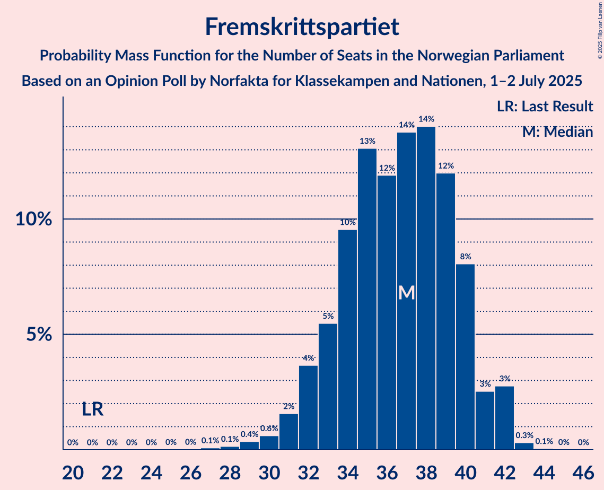

| Number of Seats | Probability | Accumulated | Special Marks |
|:---------------:|:-----------:|:-----------:|:-------------:|
| 21 | 0% | 100% | Last Result |
| 22 | 0% | 100% |  |
| 23 | 0% | 100% |  |
| 24 | 0% | 100% |  |
| 25 | 0% | 100% |  |
| 26 | 0% | 100% |  |
| 27 | 0.1% | 100% |  |
| 28 | 0.1% | 99.9% |  |
| 29 | 0.4% | 99.7% |  |
| 30 | 0.6% | 99.4% |  |
| 31 | 2% | 98.8% |  |
| 32 | 4% | 97% |  |
| 33 | 5% | 94% |  |
| 34 | 10% | 88% |  |
| 35 | 13% | 78% |  |
| 36 | 12% | 65% |  |
| 37 | 14% | 54% | Median |
| 38 | 14% | 40% |  |
| 39 | 12% | 26% |  |
| 40 | 8% | 14% |  |
| 41 | 3% | 6% |  |
| 42 | 3% | 3% |  |
| 43 | 0.3% | 0.4% |  |
| 44 | 0.1% | 0.1% |  |
| 45 | 0% | 0% |  |

### Høyre

*For a full overview of the results for this party, see the [Høyre](party-høyre.html) page.*

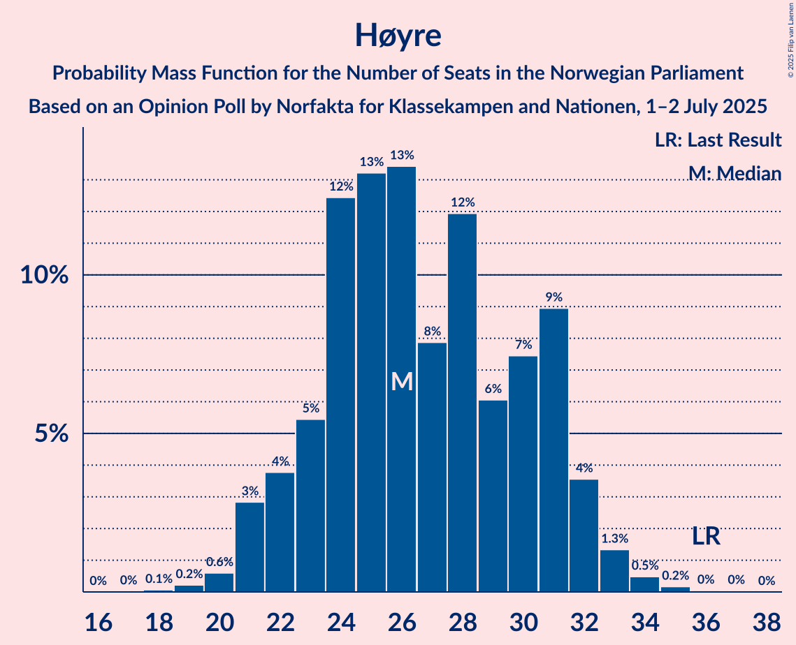

| Number of Seats | Probability | Accumulated | Special Marks |
|:---------------:|:-----------:|:-----------:|:-------------:|
| 18 | 0.1% | 100% |  |
| 19 | 0.2% | 99.9% |  |
| 20 | 0.6% | 99.7% |  |
| 21 | 3% | 99.1% |  |
| 22 | 4% | 96% |  |
| 23 | 5% | 92% |  |
| 24 | 12% | 87% |  |
| 25 | 13% | 75% |  |
| 26 | 13% | 61% | Median |
| 27 | 8% | 48% |  |
| 28 | 12% | 40% |  |
| 29 | 6% | 28% |  |
| 30 | 7% | 22% |  |
| 31 | 9% | 15% |  |
| 32 | 4% | 6% |  |
| 33 | 1.3% | 2% |  |
| 34 | 0.5% | 0.7% |  |
| 35 | 0.2% | 0.3% |  |
| 36 | 0% | 0.1% | Last Result |
| 37 | 0% | 0% |  |

### Sosialistisk Venstreparti

*For a full overview of the results for this party, see the [Sosialistisk Venstreparti](party-sosialistiskvenstreparti.html) page.*

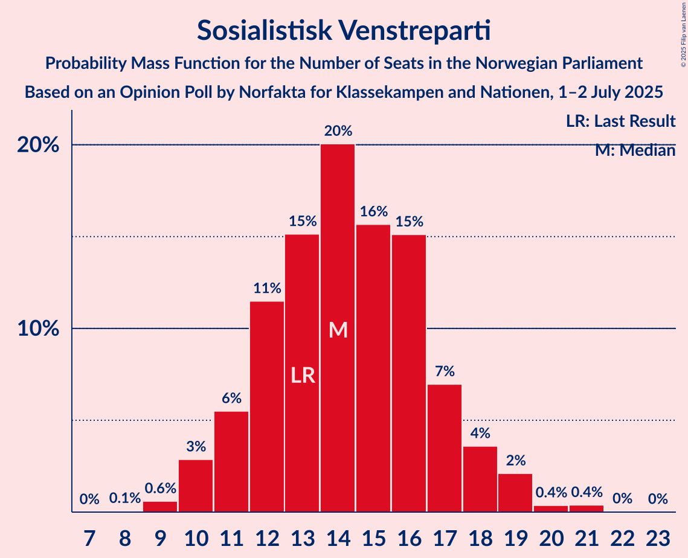

| Number of Seats | Probability | Accumulated | Special Marks |
|:---------------:|:-----------:|:-----------:|:-------------:|
| 8 | 0.1% | 100% |  |
| 9 | 0.6% | 99.9% |  |
| 10 | 3% | 99.3% |  |
| 11 | 6% | 96% |  |
| 12 | 11% | 91% |  |
| 13 | 15% | 79% | Last Result |
| 14 | 20% | 64% | Median |
| 15 | 16% | 44% |  |
| 16 | 15% | 29% |  |
| 17 | 7% | 13% |  |
| 18 | 4% | 7% |  |
| 19 | 2% | 3% |  |
| 20 | 0.4% | 0.8% |  |
| 21 | 0.4% | 0.4% |  |
| 22 | 0% | 0.1% |  |
| 23 | 0% | 0% |  |

### Rødt

*For a full overview of the results for this party, see the [Rødt](party-rødt.html) page.*

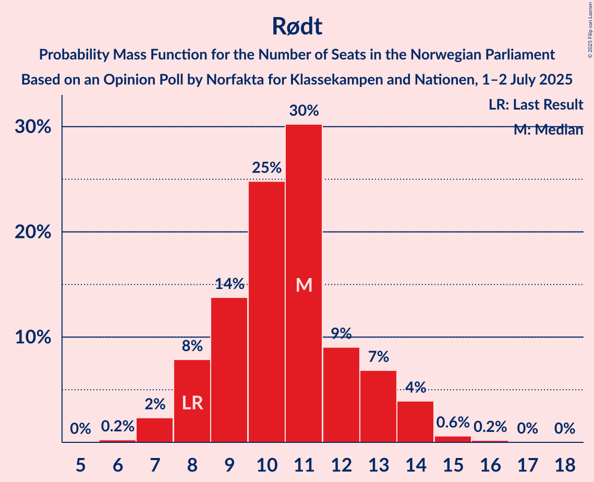

| Number of Seats | Probability | Accumulated | Special Marks |
|:---------------:|:-----------:|:-----------:|:-------------:|
| 6 | 0.2% | 100% |  |
| 7 | 2% | 99.7% |  |
| 8 | 8% | 97% | Last Result |
| 9 | 14% | 89% |  |
| 10 | 25% | 76% |  |
| 11 | 30% | 51% | Median |
| 12 | 9% | 21% |  |
| 13 | 7% | 12% |  |
| 14 | 4% | 5% |  |
| 15 | 0.6% | 0.9% |  |
| 16 | 0.2% | 0.3% |  |
| 17 | 0% | 0.1% |  |
| 18 | 0% | 0% |  |

### Senterpartiet

*For a full overview of the results for this party, see the [Senterpartiet](party-senterpartiet.html) page.*

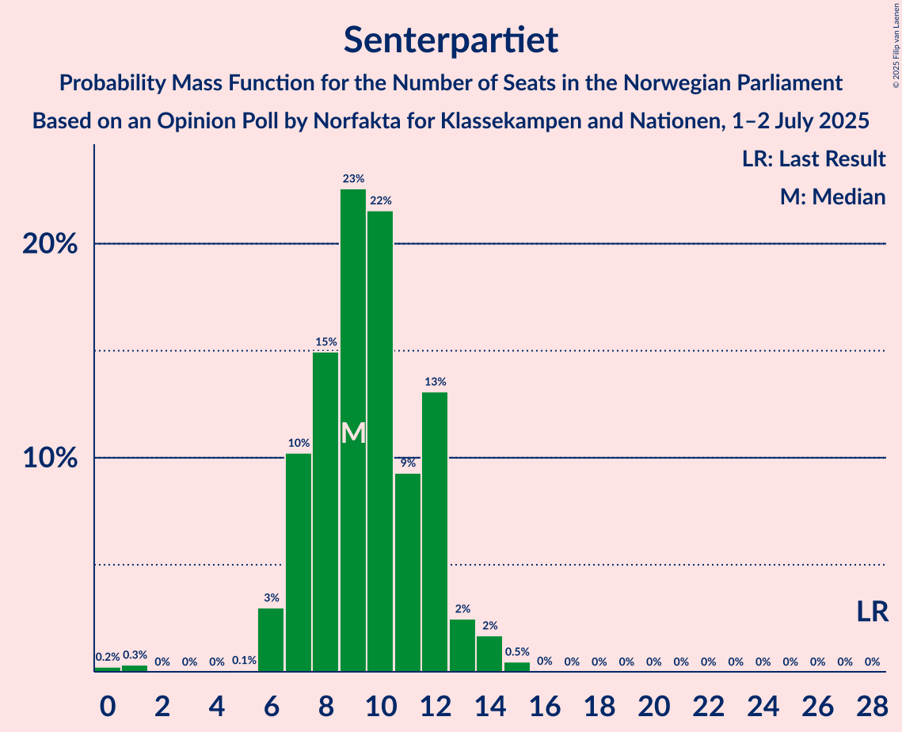

| Number of Seats | Probability | Accumulated | Special Marks |
|:---------------:|:-----------:|:-----------:|:-------------:|
| 0 | 0.2% | 100% |  |
| 1 | 0.3% | 99.8% |  |
| 2 | 0% | 99.4% |  |
| 3 | 0% | 99.4% |  |
| 4 | 0% | 99.4% |  |
| 5 | 0.1% | 99.4% |  |
| 6 | 3% | 99.4% |  |
| 7 | 10% | 96% |  |
| 8 | 15% | 86% |  |
| 9 | 23% | 71% | Median |
| 10 | 22% | 49% |  |
| 11 | 9% | 27% |  |
| 12 | 13% | 18% |  |
| 13 | 2% | 5% |  |
| 14 | 2% | 2% |  |
| 15 | 0.5% | 0.5% |  |
| 16 | 0% | 0% |  |
| 17 | 0% | 0% |  |
| 18 | 0% | 0% |  |
| 19 | 0% | 0% |  |
| 20 | 0% | 0% |  |
| 21 | 0% | 0% |  |
| 22 | 0% | 0% |  |
| 23 | 0% | 0% |  |
| 24 | 0% | 0% |  |
| 25 | 0% | 0% |  |
| 26 | 0% | 0% |  |
| 27 | 0% | 0% |  |
| 28 | 0% | 0% | Last Result |

### Venstre

*For a full overview of the results for this party, see the [Venstre](party-venstre.html) page.*

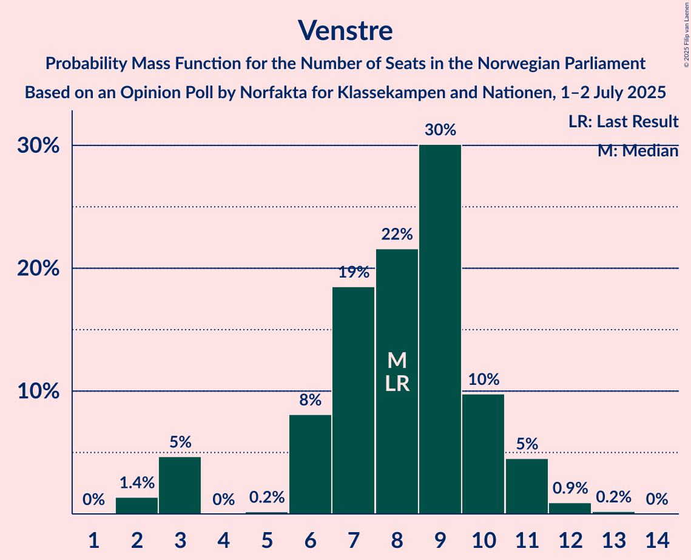

| Number of Seats | Probability | Accumulated | Special Marks |
|:---------------:|:-----------:|:-----------:|:-------------:|
| 2 | 1.4% | 100% |  |
| 3 | 5% | 98.6% |  |
| 4 | 0% | 94% |  |
| 5 | 0.2% | 94% |  |
| 6 | 8% | 94% |  |
| 7 | 19% | 86% |  |
| 8 | 22% | 67% | Last Result, Median |
| 9 | 30% | 46% |  |
| 10 | 10% | 15% |  |
| 11 | 5% | 6% |  |
| 12 | 0.9% | 1.2% |  |
| 13 | 0.2% | 0.2% |  |
| 14 | 0% | 0% |  |

### Miljøpartiet De Grønne

*For a full overview of the results for this party, see the [Miljøpartiet De Grønne](party-miljøpartietdegrønne.html) page.*

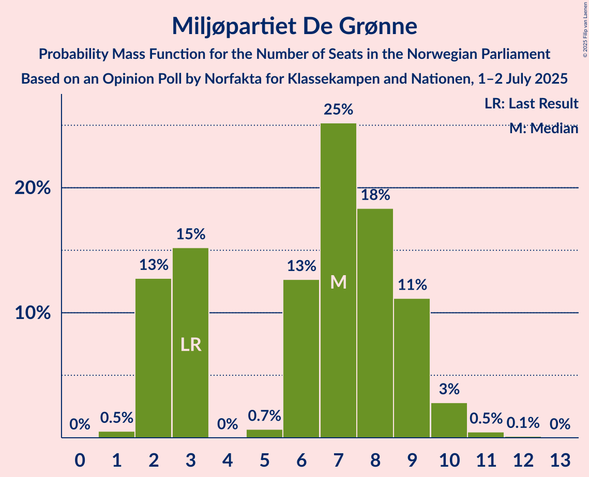

| Number of Seats | Probability | Accumulated | Special Marks |
|:---------------:|:-----------:|:-----------:|:-------------:|
| 1 | 0.5% | 100% |  |
| 2 | 13% | 99.5% |  |
| 3 | 15% | 87% | Last Result |
| 4 | 0% | 71% |  |
| 5 | 0.7% | 71% |  |
| 6 | 13% | 71% |  |
| 7 | 25% | 58% | Median |
| 8 | 18% | 33% |  |
| 9 | 11% | 15% |  |
| 10 | 3% | 3% |  |
| 11 | 0.5% | 0.6% |  |
| 12 | 0.1% | 0.1% |  |
| 13 | 0% | 0% |  |

### Kristelig Folkeparti

*For a full overview of the results for this party, see the [Kristelig Folkeparti](party-kristeligfolkeparti.html) page.*

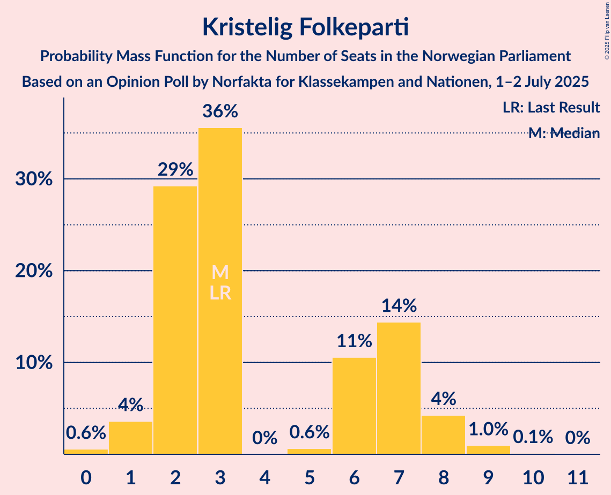

| Number of Seats | Probability | Accumulated | Special Marks |
|:---------------:|:-----------:|:-----------:|:-------------:|
| 0 | 0.6% | 100% |  |
| 1 | 4% | 99.4% |  |
| 2 | 29% | 96% |  |
| 3 | 36% | 67% | Last Result, Median |
| 4 | 0% | 31% |  |
| 5 | 0.6% | 31% |  |
| 6 | 11% | 30% |  |
| 7 | 14% | 20% |  |
| 8 | 4% | 5% |  |
| 9 | 1.0% | 1.1% |  |
| 10 | 0.1% | 0.1% |  |
| 11 | 0% | 0% |  |

## Coalitions

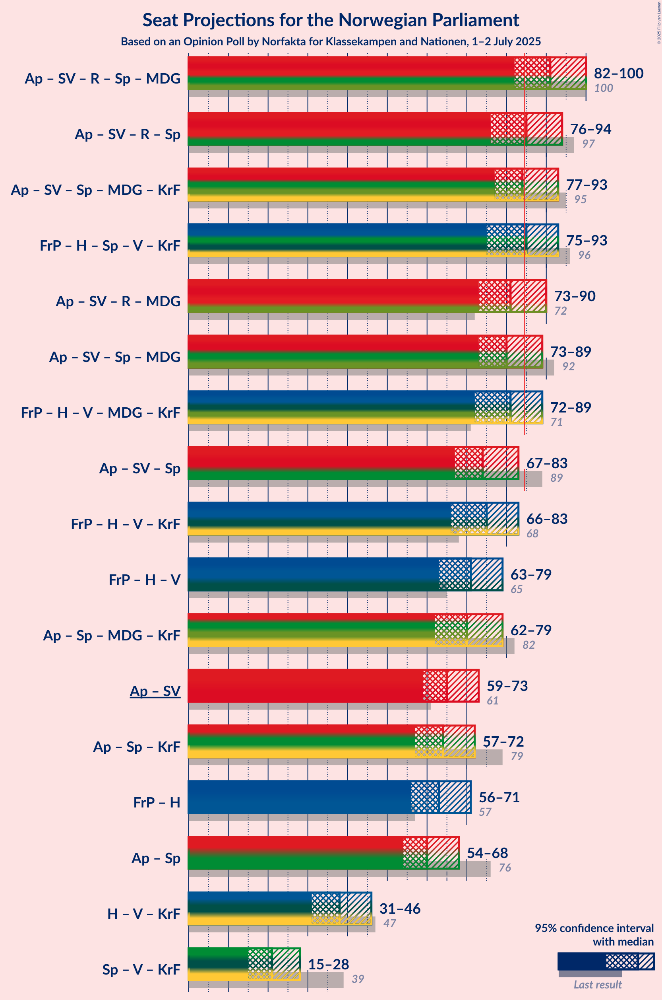

### Confidence Intervals

| Coalition | Last Result | Median | Majority? | 80% Confidence Interval | 90% Confidence Interval | 95% Confidence Interval | 99% Confidence Interval |
|:---------:|:-----------:|:------:|:---------:|:-----------------------:|:-----------------------:|:-----------------------:|:-----------------------:|
| Arbeiderpartiet – Sosialistisk Venstreparti – Rødt – Senterpartiet – Miljøpartiet De Grønne | 100 | 91 | 94% | 86–97 | 84–98 | 82–100 | 80–103 |
| Arbeiderpartiet – Sosialistisk Venstreparti – Rødt – Senterpartiet | 97 | 85 | 52% | 80–91 | 78–93 | 76–94 | 74–97 |
| Arbeiderpartiet – Sosialistisk Venstreparti – Senterpartiet – Miljøpartiet De Grønne – Kristelig Folkeparti | 95 | 84 | 47% | 79–90 | 78–92 | 77–93 | 74–96 |
| Fremskrittspartiet – Høyre – Senterpartiet – Venstre – Kristelig Folkeparti | 96 | 85 | 51% | 79–90 | 78–91 | 75–93 | 74–95 |
| Arbeiderpartiet – Sosialistisk Venstreparti – Rødt – Miljøpartiet De Grønne | 72 | 81 | 23% | 76–88 | 75–89 | 73–90 | 71–93 |
| Arbeiderpartiet – Sosialistisk Venstreparti – Senterpartiet – Miljøpartiet De Grønne | 92 | 80 | 19% | 75–86 | 74–88 | 73–89 | 70–91 |
| Fremskrittspartiet – Høyre – Venstre – Miljøpartiet De Grønne – Kristelig Folkeparti | 71 | 81 | 27% | 76–87 | 74–88 | 72–89 | 70–91 |
| Arbeiderpartiet – Sosialistisk Venstreparti – Senterpartiet | 89 | 74 | 0.5% | 70–79 | 68–81 | 67–83 | 65–85 |
| Fremskrittspartiet – Høyre – Venstre – Kristelig Folkeparti | 68 | 75 | 1.1% | 70–81 | 68–82 | 66–83 | 64–86 |
| Fremskrittspartiet – Høyre – Venstre | 65 | 71 | 0% | 66–76 | 64–77 | 63–79 | 61–81 |
| Arbeiderpartiet – Senterpartiet – Miljøpartiet De Grønne – Kristelig Folkeparti | 82 | 70 | 0% | 65–76 | 64–78 | 62–79 | 60–82 |
| Arbeiderpartiet – Sosialistisk Venstreparti | 61 | 65 | 0% | 60–70 | 59–71 | 59–73 | 57–75 |
| Arbeiderpartiet – Senterpartiet – Kristelig Folkeparti | 79 | 64 | 0% | 60–69 | 58–71 | 57–72 | 55–75 |
| Fremskrittspartiet – Høyre | 57 | 63 | 0% | 59–68 | 57–69 | 56–71 | 54–72 |
| Arbeiderpartiet – Senterpartiet | 76 | 60 | 0% | 56–65 | 55–66 | 54–68 | 51–70 |
| Høyre – Venstre – Kristelig Folkeparti | 47 | 38 | 0% | 34–43 | 32–45 | 31–46 | 29–48 |
| Senterpartiet – Venstre – Kristelig Folkeparti | 39 | 21 | 0% | 18–25 | 16–27 | 15–28 | 13–30 |

### Arbeiderpartiet – Sosialistisk Venstreparti – Rødt – Senterpartiet – Miljøpartiet De Grønne

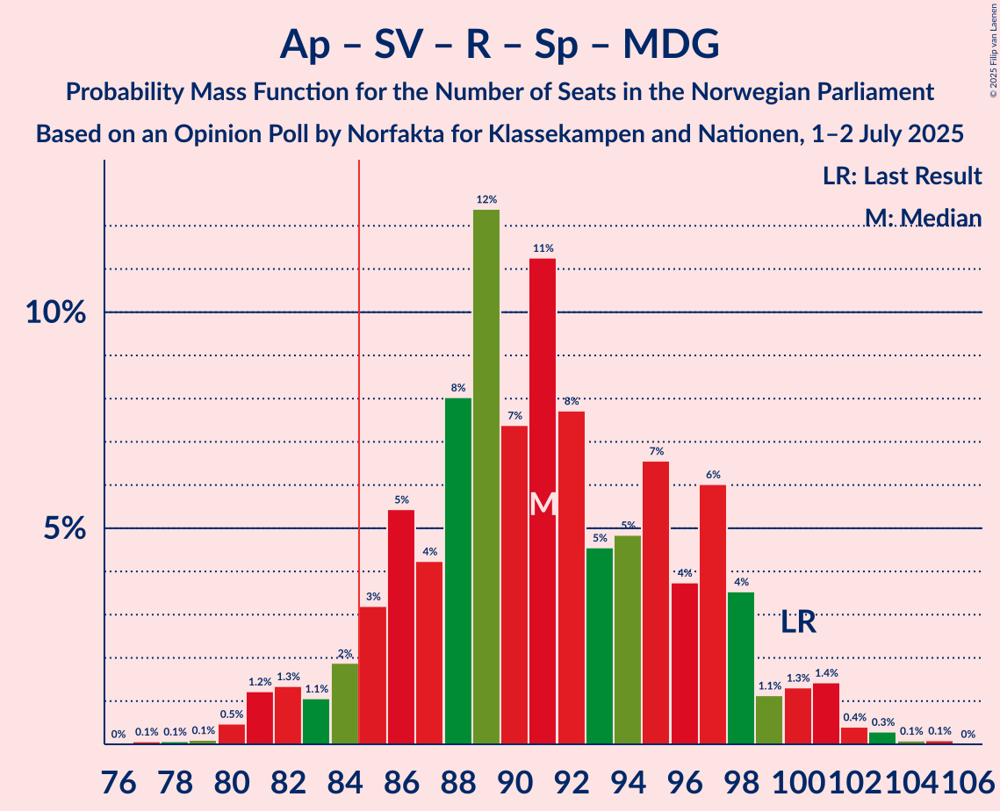

| Number of Seats | Probability | Accumulated | Special Marks |
|:---------------:|:-----------:|:-----------:|:-------------:|
| 77 | 0.1% | 100% |  |
| 78 | 0.1% | 99.9% |  |
| 79 | 0.1% | 99.8% |  |
| 80 | 0.5% | 99.7% |  |
| 81 | 1.2% | 99.3% |  |
| 82 | 1.3% | 98% |  |
| 83 | 1.1% | 97% |  |
| 84 | 2% | 96% |  |
| 85 | 3% | 94% | Majority |
| 86 | 5% | 91% |  |
| 87 | 4% | 85% |  |
| 88 | 8% | 81% |  |
| 89 | 12% | 73% |  |
| 90 | 7% | 60% |  |
| 91 | 11% | 53% |  |
| 92 | 8% | 42% | Median |
| 93 | 5% | 34% |  |
| 94 | 5% | 30% |  |
| 95 | 7% | 25% |  |
| 96 | 4% | 18% |  |
| 97 | 6% | 14% |  |
| 98 | 4% | 8% |  |
| 99 | 1.1% | 5% |  |
| 100 | 1.3% | 4% | Last Result |
| 101 | 1.4% | 2% |  |
| 102 | 0.4% | 0.9% |  |
| 103 | 0.3% | 0.5% |  |
| 104 | 0.1% | 0.2% |  |
| 105 | 0.1% | 0.1% |  |
| 106 | 0% | 0% |  |

### Arbeiderpartiet – Sosialistisk Venstreparti – Rødt – Senterpartiet

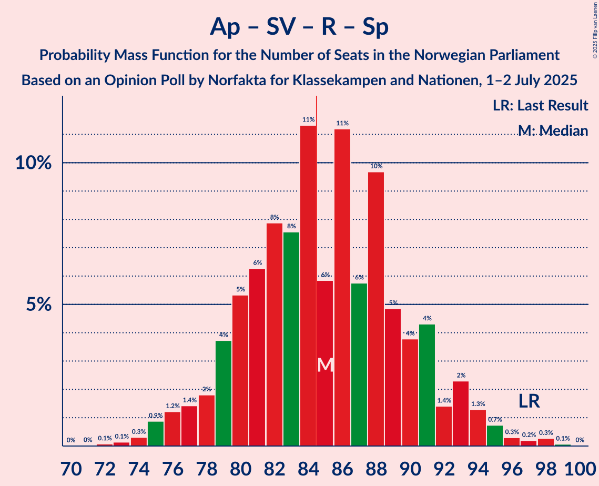

| Number of Seats | Probability | Accumulated | Special Marks |
|:---------------:|:-----------:|:-----------:|:-------------:|
| 72 | 0.1% | 100% |  |
| 73 | 0.1% | 99.9% |  |
| 74 | 0.3% | 99.8% |  |
| 75 | 0.9% | 99.4% |  |
| 76 | 1.2% | 98.6% |  |
| 77 | 1.4% | 97% |  |
| 78 | 2% | 96% |  |
| 79 | 4% | 94% |  |
| 80 | 5% | 90% |  |
| 81 | 6% | 85% |  |
| 82 | 8% | 79% |  |
| 83 | 8% | 71% |  |
| 84 | 11% | 63% |  |
| 85 | 6% | 52% | Median, Majority |
| 86 | 11% | 46% |  |
| 87 | 6% | 35% |  |
| 88 | 10% | 29% |  |
| 89 | 5% | 20% |  |
| 90 | 4% | 15% |  |
| 91 | 4% | 11% |  |
| 92 | 1.4% | 7% |  |
| 93 | 2% | 5% |  |
| 94 | 1.3% | 3% |  |
| 95 | 0.7% | 2% |  |
| 96 | 0.3% | 0.9% |  |
| 97 | 0.2% | 0.6% | Last Result |
| 98 | 0.3% | 0.4% |  |
| 99 | 0.1% | 0.1% |  |
| 100 | 0% | 0% |  |

### Arbeiderpartiet – Sosialistisk Venstreparti – Senterpartiet – Miljøpartiet De Grønne – Kristelig Folkeparti

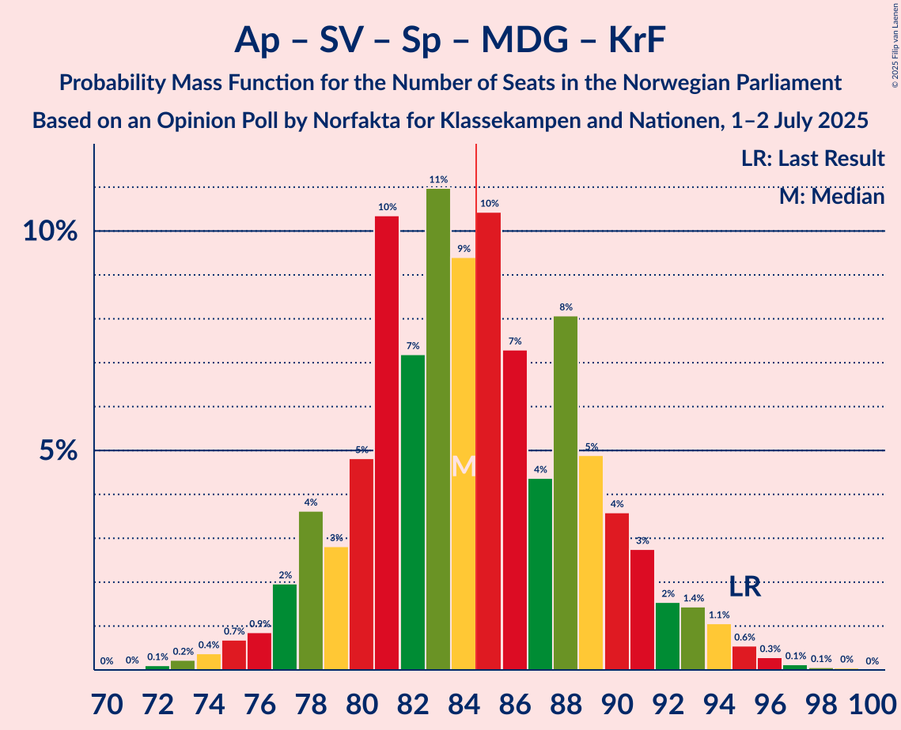

| Number of Seats | Probability | Accumulated | Special Marks |
|:---------------:|:-----------:|:-----------:|:-------------:|
| 72 | 0.1% | 100% |  |
| 73 | 0.2% | 99.8% |  |
| 74 | 0.4% | 99.6% |  |
| 75 | 0.7% | 99.2% |  |
| 76 | 0.9% | 98.6% |  |
| 77 | 2% | 98% |  |
| 78 | 4% | 96% |  |
| 79 | 3% | 92% |  |
| 80 | 5% | 89% |  |
| 81 | 10% | 84% |  |
| 82 | 7% | 74% |  |
| 83 | 11% | 67% |  |
| 84 | 9% | 56% | Median |
| 85 | 10% | 47% | Majority |
| 86 | 7% | 36% |  |
| 87 | 4% | 29% |  |
| 88 | 8% | 24% |  |
| 89 | 5% | 16% |  |
| 90 | 4% | 11% |  |
| 91 | 3% | 8% |  |
| 92 | 2% | 5% |  |
| 93 | 1.4% | 4% |  |
| 94 | 1.1% | 2% |  |
| 95 | 0.6% | 1.1% | Last Result |
| 96 | 0.3% | 0.5% |  |
| 97 | 0.1% | 0.2% |  |
| 98 | 0.1% | 0.1% |  |
| 99 | 0% | 0.1% |  |
| 100 | 0% | 0% |  |

### Fremskrittspartiet – Høyre – Senterpartiet – Venstre – Kristelig Folkeparti

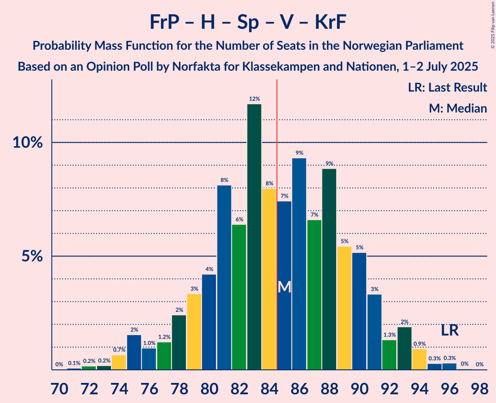

| Number of Seats | Probability | Accumulated | Special Marks |
|:---------------:|:-----------:|:-----------:|:-------------:|
| 71 | 0.1% | 100% |  |
| 72 | 0.2% | 99.9% |  |
| 73 | 0.2% | 99.7% |  |
| 74 | 0.7% | 99.5% |  |
| 75 | 2% | 98.9% |  |
| 76 | 1.0% | 97% |  |
| 77 | 1.2% | 96% |  |
| 78 | 2% | 95% |  |
| 79 | 3% | 93% |  |
| 80 | 4% | 89% |  |
| 81 | 8% | 85% |  |
| 82 | 6% | 77% |  |
| 83 | 12% | 71% | Median |
| 84 | 8% | 59% |  |
| 85 | 7% | 51% | Majority |
| 86 | 9% | 44% |  |
| 87 | 7% | 34% |  |
| 88 | 9% | 28% |  |
| 89 | 5% | 19% |  |
| 90 | 5% | 13% |  |
| 91 | 3% | 8% |  |
| 92 | 1.3% | 5% |  |
| 93 | 2% | 3% |  |
| 94 | 0.9% | 2% |  |
| 95 | 0.3% | 0.7% |  |
| 96 | 0.3% | 0.4% | Last Result |
| 97 | 0% | 0.1% |  |
| 98 | 0% | 0% |  |

### Arbeiderpartiet – Sosialistisk Venstreparti – Rødt – Miljøpartiet De Grønne

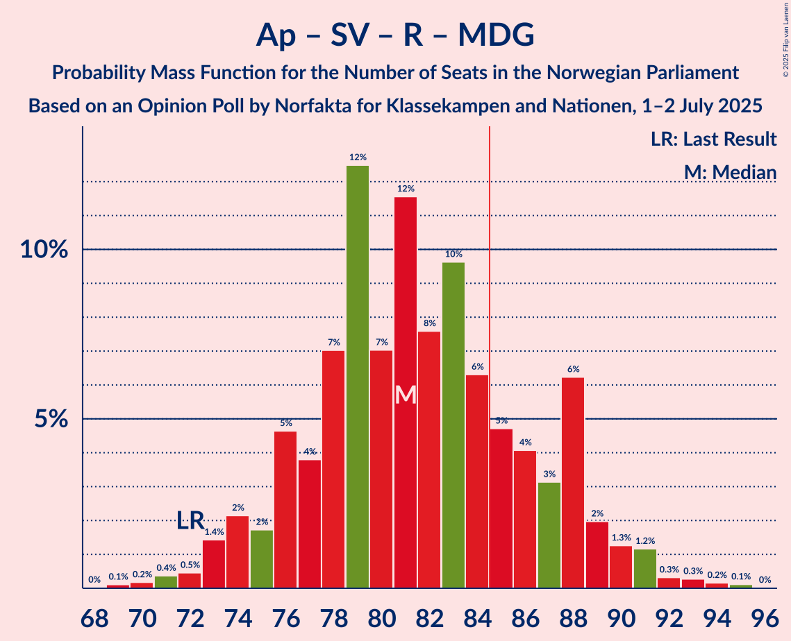

| Number of Seats | Probability | Accumulated | Special Marks |
|:---------------:|:-----------:|:-----------:|:-------------:|
| 69 | 0.1% | 100% |  |
| 70 | 0.2% | 99.9% |  |
| 71 | 0.4% | 99.7% |  |
| 72 | 0.5% | 99.3% | Last Result |
| 73 | 1.4% | 98.8% |  |
| 74 | 2% | 97% |  |
| 75 | 2% | 95% |  |
| 76 | 5% | 94% |  |
| 77 | 4% | 89% |  |
| 78 | 7% | 85% |  |
| 79 | 12% | 78% |  |
| 80 | 7% | 66% |  |
| 81 | 12% | 59% |  |
| 82 | 8% | 47% |  |
| 83 | 10% | 39% | Median |
| 84 | 6% | 30% |  |
| 85 | 5% | 23% | Majority |
| 86 | 4% | 19% |  |
| 87 | 3% | 15% |  |
| 88 | 6% | 12% |  |
| 89 | 2% | 5% |  |
| 90 | 1.3% | 3% |  |
| 91 | 1.2% | 2% |  |
| 92 | 0.3% | 0.9% |  |
| 93 | 0.3% | 0.6% |  |
| 94 | 0.2% | 0.3% |  |
| 95 | 0.1% | 0.1% |  |
| 96 | 0% | 0% |  |

### Arbeiderpartiet – Sosialistisk Venstreparti – Senterpartiet – Miljøpartiet De Grønne

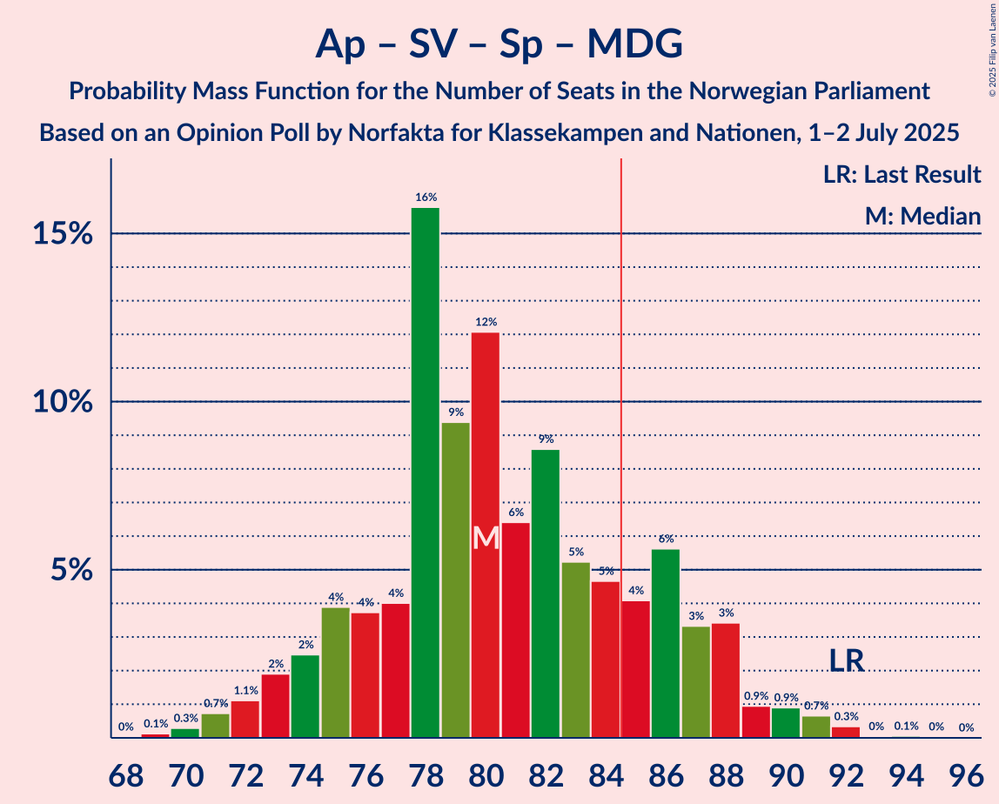

| Number of Seats | Probability | Accumulated | Special Marks |
|:---------------:|:-----------:|:-----------:|:-------------:|
| 68 | 0% | 100% |  |
| 69 | 0.1% | 99.9% |  |
| 70 | 0.3% | 99.8% |  |
| 71 | 0.7% | 99.5% |  |
| 72 | 1.1% | 98.8% |  |
| 73 | 2% | 98% |  |
| 74 | 2% | 96% |  |
| 75 | 4% | 93% |  |
| 76 | 4% | 89% |  |
| 77 | 4% | 86% |  |
| 78 | 16% | 82% |  |
| 79 | 9% | 66% |  |
| 80 | 12% | 56% |  |
| 81 | 6% | 44% | Median |
| 82 | 9% | 38% |  |
| 83 | 5% | 29% |  |
| 84 | 5% | 24% |  |
| 85 | 4% | 19% | Majority |
| 86 | 6% | 15% |  |
| 87 | 3% | 10% |  |
| 88 | 3% | 6% |  |
| 89 | 0.9% | 3% |  |
| 90 | 0.9% | 2% |  |
| 91 | 0.7% | 1.2% |  |
| 92 | 0.3% | 0.5% | Last Result |
| 93 | 0% | 0.2% |  |
| 94 | 0.1% | 0.1% |  |
| 95 | 0% | 0.1% |  |
| 96 | 0% | 0% |  |

### Fremskrittspartiet – Høyre – Venstre – Miljøpartiet De Grønne – Kristelig Folkeparti

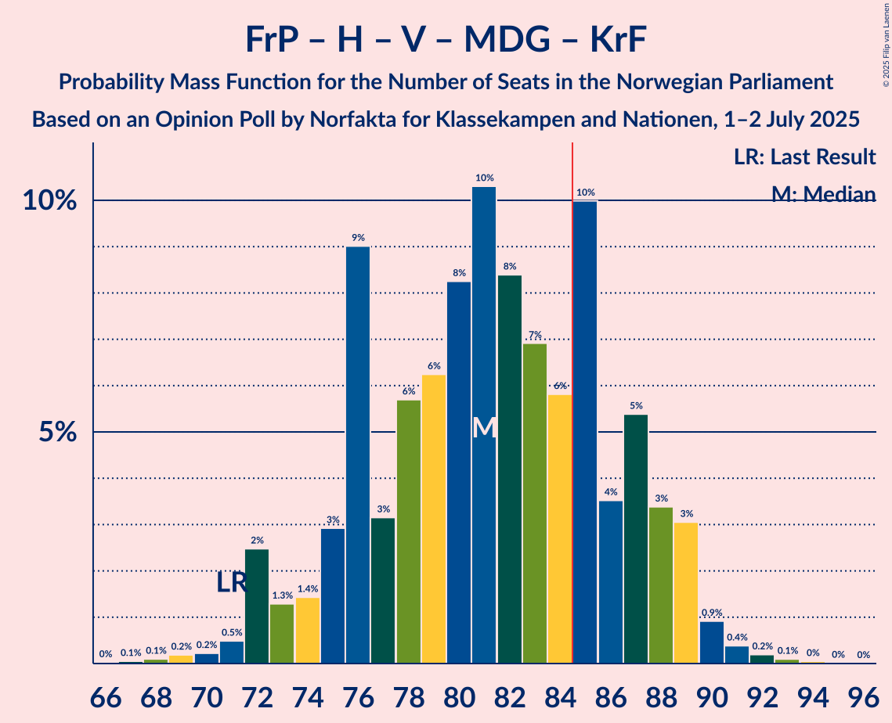

| Number of Seats | Probability | Accumulated | Special Marks |
|:---------------:|:-----------:|:-----------:|:-------------:|
| 67 | 0.1% | 100% |  |
| 68 | 0.1% | 99.9% |  |
| 69 | 0.2% | 99.8% |  |
| 70 | 0.2% | 99.6% |  |
| 71 | 0.5% | 99.4% | Last Result |
| 72 | 2% | 98.9% |  |
| 73 | 1.3% | 96% |  |
| 74 | 1.4% | 95% |  |
| 75 | 3% | 94% |  |
| 76 | 9% | 91% |  |
| 77 | 3% | 82% |  |
| 78 | 6% | 79% |  |
| 79 | 6% | 73% |  |
| 80 | 8% | 67% |  |
| 81 | 10% | 58% | Median |
| 82 | 8% | 48% |  |
| 83 | 7% | 40% |  |
| 84 | 6% | 33% |  |
| 85 | 10% | 27% | Majority |
| 86 | 4% | 17% |  |
| 87 | 5% | 13% |  |
| 88 | 3% | 8% |  |
| 89 | 3% | 5% |  |
| 90 | 0.9% | 2% |  |
| 91 | 0.4% | 0.7% |  |
| 92 | 0.2% | 0.4% |  |
| 93 | 0.1% | 0.2% |  |
| 94 | 0% | 0.1% |  |
| 95 | 0% | 0% |  |

### Arbeiderpartiet – Sosialistisk Venstreparti – Senterpartiet

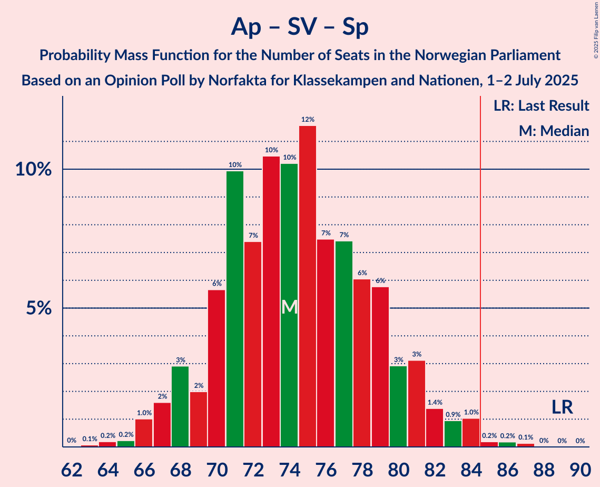

| Number of Seats | Probability | Accumulated | Special Marks |
|:---------------:|:-----------:|:-----------:|:-------------:|
| 63 | 0.1% | 100% |  |
| 64 | 0.2% | 99.9% |  |
| 65 | 0.2% | 99.7% |  |
| 66 | 1.0% | 99.5% |  |
| 67 | 2% | 98% |  |
| 68 | 3% | 97% |  |
| 69 | 2% | 94% |  |
| 70 | 6% | 92% |  |
| 71 | 10% | 86% |  |
| 72 | 7% | 76% |  |
| 73 | 10% | 69% |  |
| 74 | 10% | 58% | Median |
| 75 | 12% | 48% |  |
| 76 | 7% | 37% |  |
| 77 | 7% | 29% |  |
| 78 | 6% | 22% |  |
| 79 | 6% | 16% |  |
| 80 | 3% | 10% |  |
| 81 | 3% | 7% |  |
| 82 | 1.4% | 4% |  |
| 83 | 0.9% | 3% |  |
| 84 | 1.0% | 2% |  |
| 85 | 0.2% | 0.5% | Majority |
| 86 | 0.2% | 0.3% |  |
| 87 | 0.1% | 0.2% |  |
| 88 | 0% | 0% |  |
| 89 | 0% | 0% | Last Result |

### Fremskrittspartiet – Høyre – Venstre – Kristelig Folkeparti

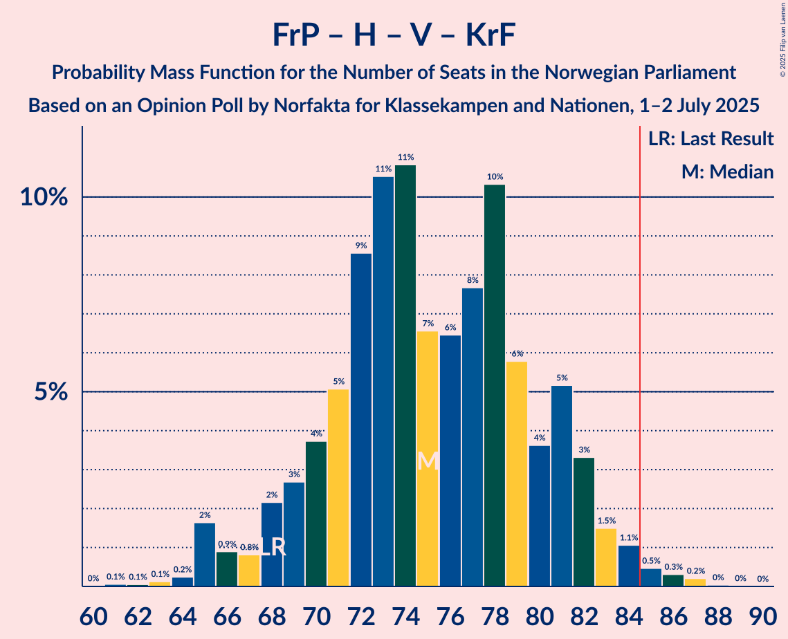

| Number of Seats | Probability | Accumulated | Special Marks |
|:---------------:|:-----------:|:-----------:|:-------------:|
| 61 | 0.1% | 100% |  |
| 62 | 0.1% | 99.9% |  |
| 63 | 0.1% | 99.9% |  |
| 64 | 0.2% | 99.7% |  |
| 65 | 2% | 99.5% |  |
| 66 | 0.9% | 98% |  |
| 67 | 0.8% | 97% |  |
| 68 | 2% | 96% | Last Result |
| 69 | 3% | 94% |  |
| 70 | 4% | 91% |  |
| 71 | 5% | 88% |  |
| 72 | 9% | 82% |  |
| 73 | 11% | 74% |  |
| 74 | 11% | 63% | Median |
| 75 | 7% | 53% |  |
| 76 | 6% | 46% |  |
| 77 | 8% | 40% |  |
| 78 | 10% | 32% |  |
| 79 | 6% | 22% |  |
| 80 | 4% | 16% |  |
| 81 | 5% | 12% |  |
| 82 | 3% | 7% |  |
| 83 | 1.5% | 4% |  |
| 84 | 1.1% | 2% |  |
| 85 | 0.5% | 1.1% | Majority |
| 86 | 0.3% | 0.6% |  |
| 87 | 0.2% | 0.3% |  |
| 88 | 0% | 0.1% |  |
| 89 | 0% | 0% |  |

### Fremskrittspartiet – Høyre – Venstre

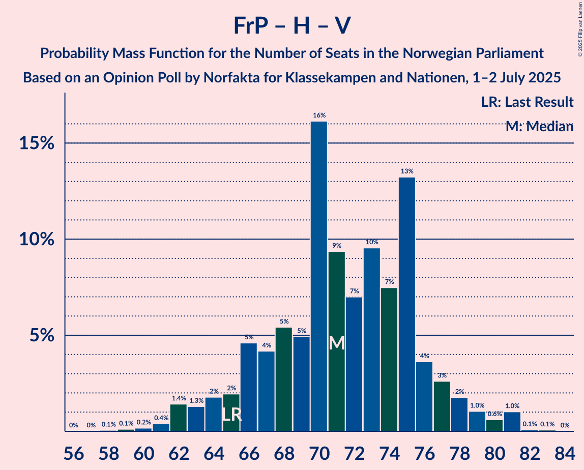

| Number of Seats | Probability | Accumulated | Special Marks |
|:---------------:|:-----------:|:-----------:|:-------------:|
| 58 | 0.1% | 100% |  |
| 59 | 0.1% | 99.9% |  |
| 60 | 0.2% | 99.8% |  |
| 61 | 0.4% | 99.6% |  |
| 62 | 1.4% | 99.2% |  |
| 63 | 1.3% | 98% |  |
| 64 | 2% | 96% |  |
| 65 | 2% | 95% | Last Result |
| 66 | 5% | 93% |  |
| 67 | 4% | 88% |  |
| 68 | 5% | 84% |  |
| 69 | 5% | 79% |  |
| 70 | 16% | 74% |  |
| 71 | 9% | 57% | Median |
| 72 | 7% | 48% |  |
| 73 | 10% | 41% |  |
| 74 | 7% | 32% |  |
| 75 | 13% | 24% |  |
| 76 | 4% | 11% |  |
| 77 | 3% | 7% |  |
| 78 | 2% | 5% |  |
| 79 | 1.0% | 3% |  |
| 80 | 0.6% | 2% |  |
| 81 | 1.0% | 1.2% |  |
| 82 | 0.1% | 0.2% |  |
| 83 | 0.1% | 0.1% |  |
| 84 | 0% | 0% |  |

### Arbeiderpartiet – Senterpartiet – Miljøpartiet De Grønne – Kristelig Folkeparti

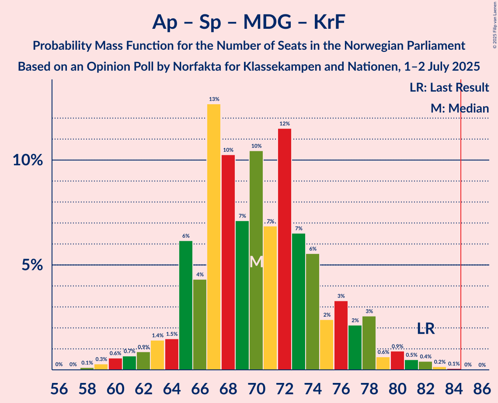

| Number of Seats | Probability | Accumulated | Special Marks |
|:---------------:|:-----------:|:-----------:|:-------------:|
| 56 | 0% | 100% |  |
| 57 | 0% | 99.9% |  |
| 58 | 0.1% | 99.9% |  |
| 59 | 0.3% | 99.8% |  |
| 60 | 0.6% | 99.5% |  |
| 61 | 0.7% | 98.9% |  |
| 62 | 0.9% | 98% |  |
| 63 | 1.4% | 97% |  |
| 64 | 1.5% | 96% |  |
| 65 | 6% | 95% |  |
| 66 | 4% | 88% |  |
| 67 | 13% | 84% |  |
| 68 | 10% | 71% |  |
| 69 | 7% | 61% |  |
| 70 | 10% | 54% | Median |
| 71 | 7% | 44% |  |
| 72 | 12% | 37% |  |
| 73 | 7% | 25% |  |
| 74 | 6% | 19% |  |
| 75 | 2% | 13% |  |
| 76 | 3% | 11% |  |
| 77 | 2% | 7% |  |
| 78 | 3% | 5% |  |
| 79 | 0.6% | 3% |  |
| 80 | 0.9% | 2% |  |
| 81 | 0.5% | 1.2% |  |
| 82 | 0.4% | 0.7% | Last Result |
| 83 | 0.2% | 0.3% |  |
| 84 | 0.1% | 0.1% |  |
| 85 | 0% | 0% | Majority |

### Arbeiderpartiet – Sosialistisk Venstreparti

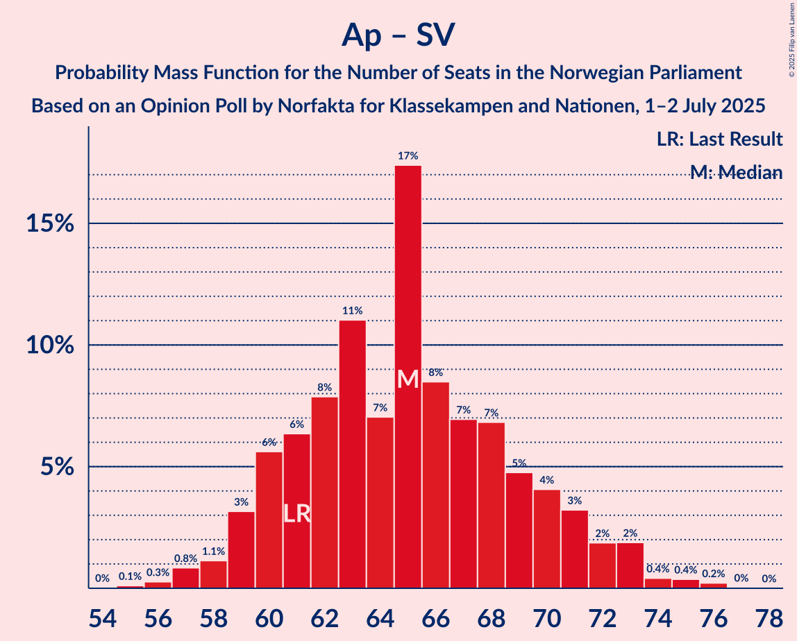

| Number of Seats | Probability | Accumulated | Special Marks |
|:---------------:|:-----------:|:-----------:|:-------------:|
| 54 | 0% | 100% |  |
| 55 | 0.1% | 99.9% |  |
| 56 | 0.3% | 99.8% |  |
| 57 | 0.8% | 99.6% |  |
| 58 | 1.1% | 98.7% |  |
| 59 | 3% | 98% |  |
| 60 | 6% | 94% |  |
| 61 | 6% | 89% | Last Result |
| 62 | 8% | 82% |  |
| 63 | 11% | 75% |  |
| 64 | 7% | 64% |  |
| 65 | 17% | 57% | Median |
| 66 | 8% | 39% |  |
| 67 | 7% | 31% |  |
| 68 | 7% | 24% |  |
| 69 | 5% | 17% |  |
| 70 | 4% | 12% |  |
| 71 | 3% | 8% |  |
| 72 | 2% | 5% |  |
| 73 | 2% | 3% |  |
| 74 | 0.4% | 1.1% |  |
| 75 | 0.4% | 0.6% |  |
| 76 | 0.2% | 0.3% |  |
| 77 | 0% | 0.1% |  |
| 78 | 0% | 0% |  |

### Arbeiderpartiet – Senterpartiet – Kristelig Folkeparti

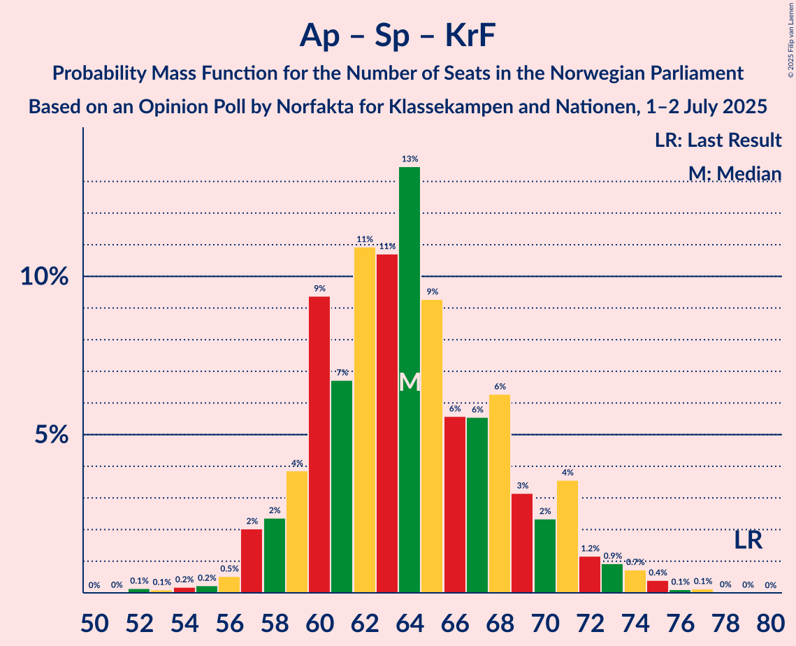

| Number of Seats | Probability | Accumulated | Special Marks |
|:---------------:|:-----------:|:-----------:|:-------------:|
| 52 | 0.1% | 100% |  |
| 53 | 0.1% | 99.8% |  |
| 54 | 0.2% | 99.7% |  |
| 55 | 0.2% | 99.5% |  |
| 56 | 0.5% | 99.3% |  |
| 57 | 2% | 98.8% |  |
| 58 | 2% | 97% |  |
| 59 | 4% | 94% |  |
| 60 | 9% | 91% |  |
| 61 | 7% | 81% |  |
| 62 | 11% | 74% |  |
| 63 | 11% | 63% | Median |
| 64 | 13% | 53% |  |
| 65 | 9% | 39% |  |
| 66 | 6% | 30% |  |
| 67 | 6% | 24% |  |
| 68 | 6% | 19% |  |
| 69 | 3% | 13% |  |
| 70 | 2% | 9% |  |
| 71 | 4% | 7% |  |
| 72 | 1.2% | 4% |  |
| 73 | 0.9% | 2% |  |
| 74 | 0.7% | 1.4% |  |
| 75 | 0.4% | 0.7% |  |
| 76 | 0.1% | 0.3% |  |
| 77 | 0.1% | 0.2% |  |
| 78 | 0% | 0% |  |
| 79 | 0% | 0% | Last Result |

### Fremskrittspartiet – Høyre

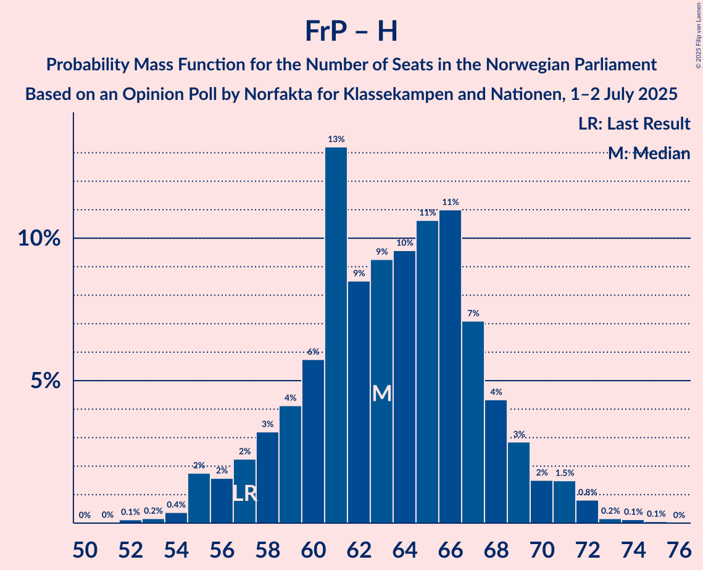

| Number of Seats | Probability | Accumulated | Special Marks |
|:---------------:|:-----------:|:-----------:|:-------------:|
| 52 | 0.1% | 100% |  |
| 53 | 0.2% | 99.8% |  |
| 54 | 0.4% | 99.7% |  |
| 55 | 2% | 99.3% |  |
| 56 | 2% | 98% |  |
| 57 | 2% | 96% | Last Result |
| 58 | 3% | 94% |  |
| 59 | 4% | 90% |  |
| 60 | 6% | 86% |  |
| 61 | 13% | 81% |  |
| 62 | 9% | 67% |  |
| 63 | 9% | 59% | Median |
| 64 | 10% | 50% |  |
| 65 | 11% | 40% |  |
| 66 | 11% | 29% |  |
| 67 | 7% | 18% |  |
| 68 | 4% | 11% |  |
| 69 | 3% | 7% |  |
| 70 | 2% | 4% |  |
| 71 | 1.5% | 3% |  |
| 72 | 0.8% | 1.2% |  |
| 73 | 0.2% | 0.4% |  |
| 74 | 0.1% | 0.2% |  |
| 75 | 0.1% | 0.1% |  |
| 76 | 0% | 0% |  |

### Arbeiderpartiet – Senterpartiet

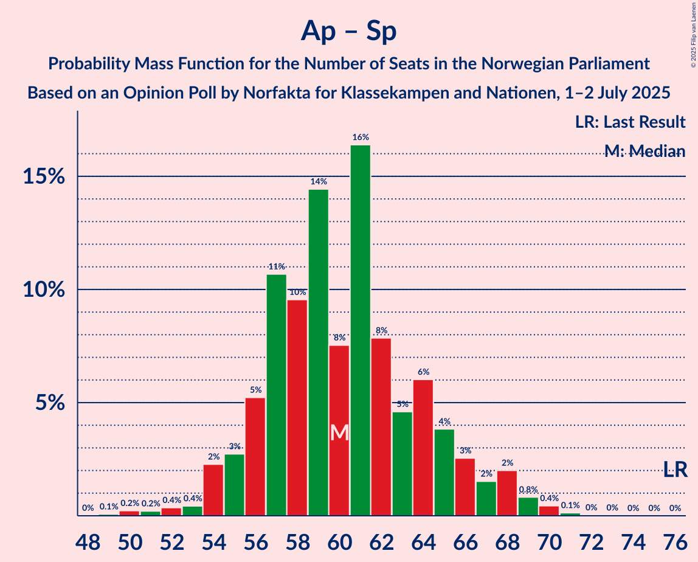

| Number of Seats | Probability | Accumulated | Special Marks |
|:---------------:|:-----------:|:-----------:|:-------------:|
| 49 | 0.1% | 100% |  |
| 50 | 0.2% | 99.9% |  |
| 51 | 0.2% | 99.7% |  |
| 52 | 0.4% | 99.5% |  |
| 53 | 0.4% | 99.1% |  |
| 54 | 2% | 98.7% |  |
| 55 | 3% | 96% |  |
| 56 | 5% | 94% |  |
| 57 | 11% | 88% |  |
| 58 | 10% | 78% |  |
| 59 | 14% | 68% |  |
| 60 | 8% | 54% | Median |
| 61 | 16% | 46% |  |
| 62 | 8% | 30% |  |
| 63 | 5% | 22% |  |
| 64 | 6% | 17% |  |
| 65 | 4% | 11% |  |
| 66 | 3% | 8% |  |
| 67 | 2% | 5% |  |
| 68 | 2% | 3% |  |
| 69 | 0.8% | 1.5% |  |
| 70 | 0.4% | 0.6% |  |
| 71 | 0.1% | 0.2% |  |
| 72 | 0% | 0.1% |  |
| 73 | 0% | 0% |  |
| 74 | 0% | 0% |  |
| 75 | 0% | 0% |  |
| 76 | 0% | 0% | Last Result |

### Høyre – Venstre – Kristelig Folkeparti

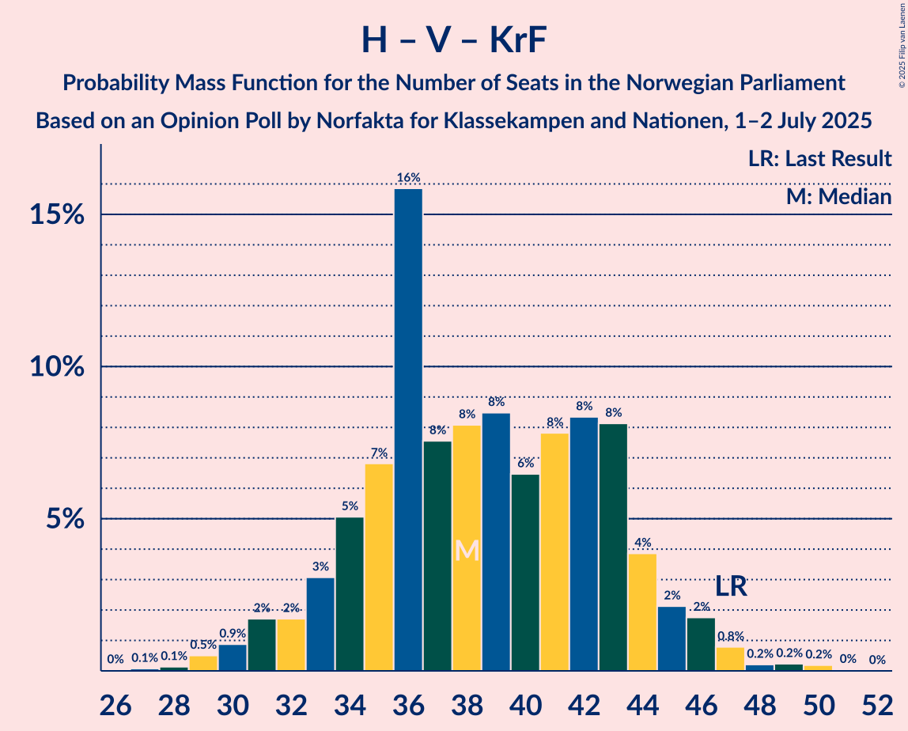

| Number of Seats | Probability | Accumulated | Special Marks |
|:---------------:|:-----------:|:-----------:|:-------------:|
| 27 | 0.1% | 100% |  |
| 28 | 0.1% | 99.9% |  |
| 29 | 0.5% | 99.7% |  |
| 30 | 0.9% | 99.2% |  |
| 31 | 2% | 98% |  |
| 32 | 2% | 97% |  |
| 33 | 3% | 95% |  |
| 34 | 5% | 92% |  |
| 35 | 7% | 87% |  |
| 36 | 16% | 80% |  |
| 37 | 8% | 64% | Median |
| 38 | 8% | 57% |  |
| 39 | 8% | 48% |  |
| 40 | 6% | 40% |  |
| 41 | 8% | 34% |  |
| 42 | 8% | 26% |  |
| 43 | 8% | 17% |  |
| 44 | 4% | 9% |  |
| 45 | 2% | 5% |  |
| 46 | 2% | 3% |  |
| 47 | 0.8% | 1.5% | Last Result |
| 48 | 0.2% | 0.7% |  |
| 49 | 0.2% | 0.5% |  |
| 50 | 0.2% | 0.2% |  |
| 51 | 0% | 0.1% |  |
| 52 | 0% | 0% |  |

### Senterpartiet – Venstre – Kristelig Folkeparti

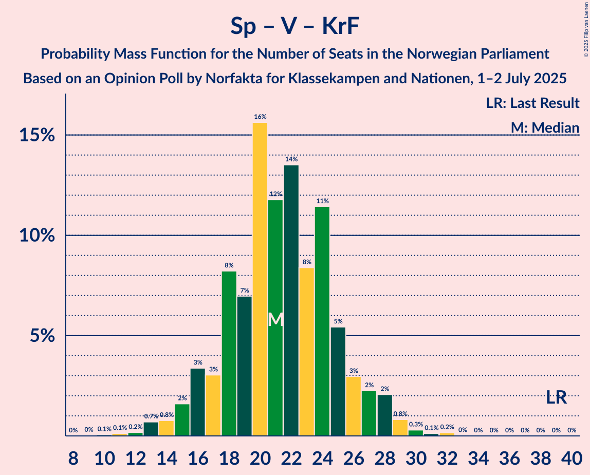

| Number of Seats | Probability | Accumulated | Special Marks |
|:---------------:|:-----------:|:-----------:|:-------------:|
| 9 | 0% | 100% |  |
| 10 | 0.1% | 99.9% |  |
| 11 | 0.1% | 99.9% |  |
| 12 | 0.2% | 99.7% |  |
| 13 | 0.7% | 99.6% |  |
| 14 | 0.8% | 98.9% |  |
| 15 | 2% | 98% |  |
| 16 | 3% | 96% |  |
| 17 | 3% | 93% |  |
| 18 | 8% | 90% |  |
| 19 | 7% | 82% |  |
| 20 | 16% | 75% | Median |
| 21 | 12% | 59% |  |
| 22 | 14% | 47% |  |
| 23 | 8% | 34% |  |
| 24 | 11% | 26% |  |
| 25 | 5% | 14% |  |
| 26 | 3% | 9% |  |
| 27 | 2% | 6% |  |
| 28 | 2% | 3% |  |
| 29 | 0.8% | 1.4% |  |
| 30 | 0.3% | 0.6% |  |
| 31 | 0.1% | 0.3% |  |
| 32 | 0.2% | 0.2% |  |
| 33 | 0% | 0% |  |
| 34 | 0% | 0% |  |
| 35 | 0% | 0% |  |
| 36 | 0% | 0% |  |
| 37 | 0% | 0% |  |
| 38 | 0% | 0% |  |
| 39 | 0% | 0% | Last Result |

## Technical Information

### Opinion Poll

+ **Polling firm:** Norfakta
+ **Commissioner(s):** Klassekampen and Nationen
+ **Fieldwork period:** 1–2 July 2025

### Calculations

+ **Sample size:** 793
+ **Simulations done:** 2,097,152
+ **Error estimate:** 1.65%

