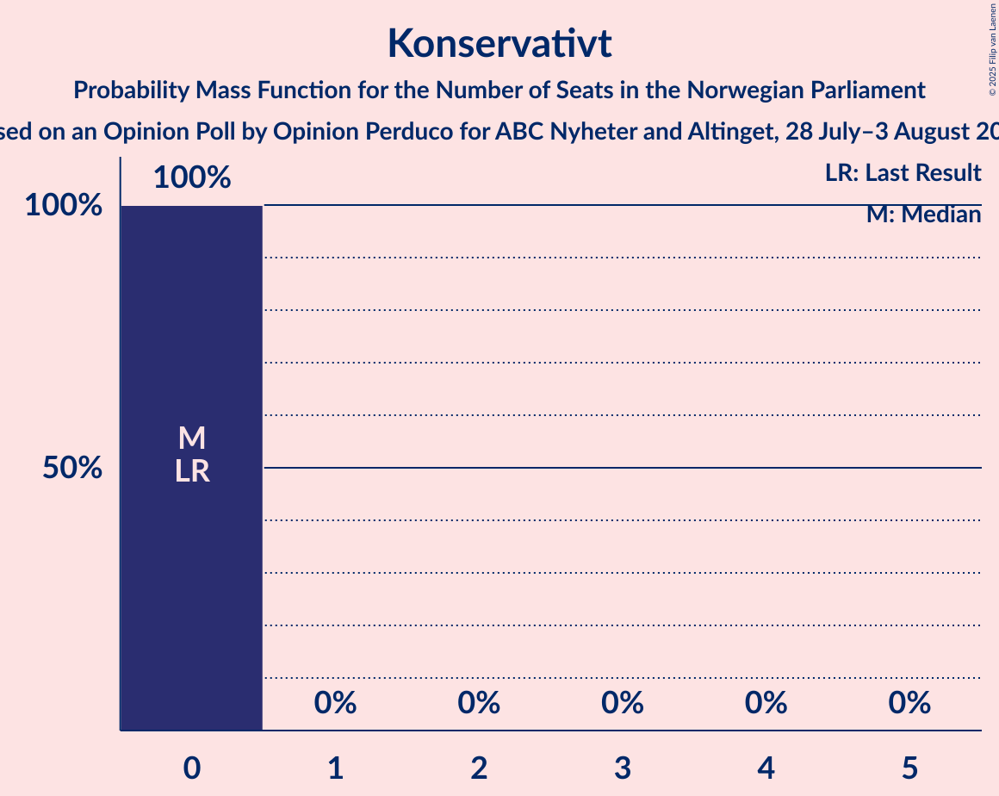

# Opinion Poll by Opinion Perduco for ABC Nyheter and Altinget, 28 July–3 August 2025

<a href="#voting-intentions">Voting Intentions</a> | <a href="#seats">Seats</a> | <a href="#coalitions">Coalitions</a> | <a href="#technical-information">Technical Information</a>

## Voting Intentions

### Confidence Intervals

| Party | Last Result | Poll Result | 80% Confidence Interval | 90% Confidence Interval | 95% Confidence Interval | 99% Confidence Interval |
|:-----:|:-----------:|:-----------:|:-----------------------:|:-----------------------:|:-----------------------:|:-----------------------:|
| Arbeiderpartiet | 26.2% | 26.7% | 25.0–28.6% |24.5–29.1% |24.1–29.5% |23.2–30.4% |
| Fremskrittspartiet | 11.6% | 23.6% | 21.9–25.4% |21.5–25.9% |21.1–26.3% |20.3–27.2% |
| Høyre | 20.4% | 15.8% | 14.4–17.4% |14.0–17.8% |13.7–18.2% |13.0–19.0% |
| Sosialistisk Venstreparti | 7.6% | 6.7% | 5.8–7.8% |5.5–8.2% |5.3–8.4% |4.9–9.0% |
| Senterpartiet | 13.5% | 6.2% | 5.3–7.3% |5.1–7.6% |4.9–7.9% |4.5–8.4% |
| Rødt | 4.7% | 5.8% | 5.0–6.9% |4.7–7.2% |4.5–7.4% |4.1–8.0% |
| Venstre | 4.6% | 3.3% | 2.7–4.1% |2.5–4.4% |2.4–4.6% |2.1–5.0% |
| Miljøpartiet De Grønne | 3.9% | 3.2% | 2.6–4.0% |2.4–4.3% |2.3–4.5% |2.0–4.9% |
| Kristelig Folkeparti | 3.8% | 3.1% | 2.5–3.9% |2.3–4.2% |2.2–4.4% |1.9–4.8% |
| Norgesdemokratene | 1.1% | 1.1% | 0.8–1.7% |0.7–1.8% |0.6–2.0% |0.5–2.3% |
| Industri- og Næringspartiet | 0.3% | 1.1% | 0.8–1.7% |0.7–1.8% |0.6–2.0% |0.5–2.3% |
| Konservativt | 0.4% | 0.7% | 0.5–1.2% |0.4–1.3% |0.3–1.4% |0.2–1.7% |
| Pensjonistpartiet | 0.6% | 0.4% | 0.2–0.8% |0.2–0.9% |0.2–1.0% |0.1–1.3% |

*Note:* The poll result column reflects the actual value used in the calculations. Published results may vary slightly, and in addition be rounded to fewer digits.

## Seats

### Confidence Intervals

| Party | Last Result | Median | 80% Confidence Interval | 90% Confidence Interval | 95% Confidence Interval | 99% Confidence Interval |
|:-----:|:-----------:|:------:|:-----------------------:|:-----------------------:|:-----------------------:|:-----------------------:|
| <a href="#arbeiderpartiet">Arbeiderpartiet</a> | 48 | 52 | 48–55 |47–56 |45–57 |45–57 |
| <a href="#fremskrittspartiet">Fremskrittspartiet</a> | 21 | 44 | 42–47 |41–48 |40–49 |39–51 |
| <a href="#høyre">Høyre</a> | 36 | 30 | 26–31 |26–32 |23–34 |23–34 |
| <a href="#sosialistisk-venstreparti">Sosialistisk Venstreparti</a> | 13 | 13 | 11–15 |10–15 |10–16 |9–17 |
| <a href="#senterpartiet">Senterpartiet</a> | 28 | 12 | 10–14 |9–14 |8–15 |8–17 |
| <a href="#rødt">Rødt</a> | 8 | 11 | 10–12 |9–12 |9–13 |8–15 |
| <a href="#venstre">Venstre</a> | 8 | 3 | 2–3 |2–8 |2–8 |1–9 |
| <a href="#miljøpartiet-de-grønne">Miljøpartiet De Grønne</a> | 3 | 2 | 1–3 |1–8 |1–8 |1–9 |
| <a href="#kristelig-folkeparti">Kristelig Folkeparti</a> | 3 | 2 | 1–3 |1–7 |1–8 |0–9 |
| <a href="#norgesdemokratene">Norgesdemokratene</a> | 0 | 0 | 0 |0 |0 |0 |
| <a href="#industri--og-næringspartiet">Industri- og Næringspartiet</a> | 0 | 0 | 0 |0 |0 |0 |
| <a href="#konservativt">Konservativt</a> | 0 | 0 | 0 |0 |0 |0 |
| <a href="#pensjonistpartiet">Pensjonistpartiet</a> | 0 | 0 | 0 |0 |0 |0 |

### Arbeiderpartiet

*For a full overview of the results for this party, see the [Arbeiderpartiet](party-arbeiderpartiet.html) page.*

| Number of Seats | Probability | Accumulated | Special Marks |
|:---------------:|:-----------:|:-----------:|:-------------:|
| 42 | 0.1% | 100% |  |
| 43 | 0.1% | 99.9% |  |
| 44 | 0% | 99.8% |  |
| 45 | 3% | 99.8% |  |
| 46 | 0.9% | 97% |  |
| 47 | 5% | 96% |  |
| 48 | 3% | 91% | Last Result |
| 49 | 3% | 88% |  |
| 50 | 16% | 85% |  |
| 51 | 4% | 69% |  |
| 52 | 36% | 65% | Median |
| 53 | 17% | 29% |  |
| 54 | 1.2% | 11% |  |
| 55 | 2% | 10% |  |
| 56 | 4% | 8% |  |
| 57 | 4% | 4% |  |
| 58 | 0.1% | 0.2% |  |
| 59 | 0% | 0.1% |  |
| 60 | 0% | 0.1% |  |
| 61 | 0% | 0.1% |  |
| 62 | 0% | 0% |  |

### Fremskrittspartiet

*For a full overview of the results for this party, see the [Fremskrittspartiet](party-fremskrittspartiet.html) page.*

| Number of Seats | Probability | Accumulated | Special Marks |
|:---------------:|:-----------:|:-----------:|:-------------:|
| 21 | 0% | 100% | Last Result |
| 22 | 0% | 100% |  |
| 23 | 0% | 100% |  |
| 24 | 0% | 100% |  |
| 25 | 0% | 100% |  |
| 26 | 0% | 100% |  |
| 27 | 0% | 100% |  |
| 28 | 0% | 100% |  |
| 29 | 0% | 100% |  |
| 30 | 0% | 100% |  |
| 31 | 0% | 100% |  |
| 32 | 0% | 100% |  |
| 33 | 0% | 100% |  |
| 34 | 0% | 100% |  |
| 35 | 0% | 100% |  |
| 36 | 0% | 100% |  |
| 37 | 0.1% | 100% |  |
| 38 | 0.1% | 99.9% |  |
| 39 | 1.1% | 99.9% |  |
| 40 | 2% | 98.8% |  |
| 41 | 3% | 97% |  |
| 42 | 12% | 94% |  |
| 43 | 11% | 82% |  |
| 44 | 34% | 72% | Median |
| 45 | 10% | 37% |  |
| 46 | 11% | 27% |  |
| 47 | 10% | 16% |  |
| 48 | 3% | 6% |  |
| 49 | 2% | 3% |  |
| 50 | 0.3% | 1.3% |  |
| 51 | 0.9% | 1.0% |  |
| 52 | 0% | 0.1% |  |
| 53 | 0% | 0% |  |

### Høyre

*For a full overview of the results for this party, see the [Høyre](party-høyre.html) page.*

| Number of Seats | Probability | Accumulated | Special Marks |
|:---------------:|:-----------:|:-----------:|:-------------:|
| 21 | 0.1% | 100% |  |
| 22 | 0.1% | 99.9% |  |
| 23 | 3% | 99.9% |  |
| 24 | 0.8% | 97% |  |
| 25 | 0.6% | 96% |  |
| 26 | 6% | 95% |  |
| 27 | 6% | 90% |  |
| 28 | 12% | 84% |  |
| 29 | 5% | 72% |  |
| 30 | 37% | 67% | Median |
| 31 | 22% | 30% |  |
| 32 | 5% | 8% |  |
| 33 | 0.7% | 3% |  |
| 34 | 2% | 3% |  |
| 35 | 0.2% | 0.4% |  |
| 36 | 0.1% | 0.1% | Last Result |
| 37 | 0.1% | 0.1% |  |
| 38 | 0% | 0% |  |

### Sosialistisk Venstreparti

*For a full overview of the results for this party, see the [Sosialistisk Venstreparti](party-sosialistiskvenstreparti.html) page.*

| Number of Seats | Probability | Accumulated | Special Marks |
|:---------------:|:-----------:|:-----------:|:-------------:|
| 8 | 0.1% | 100% |  |
| 9 | 0.6% | 99.9% |  |
| 10 | 8% | 99.3% |  |
| 11 | 13% | 91% |  |
| 12 | 12% | 79% |  |
| 13 | 42% | 66% | Last Result, Median |
| 14 | 8% | 24% |  |
| 15 | 13% | 16% |  |
| 16 | 3% | 3% |  |
| 17 | 0.2% | 0.5% |  |
| 18 | 0.3% | 0.4% |  |
| 19 | 0% | 0% |  |

### Senterpartiet

*For a full overview of the results for this party, see the [Senterpartiet](party-senterpartiet.html) page.*

| Number of Seats | Probability | Accumulated | Special Marks |
|:---------------:|:-----------:|:-----------:|:-------------:|
| 7 | 0.4% | 100% |  |
| 8 | 3% | 99.6% |  |
| 9 | 5% | 97% |  |
| 10 | 5% | 92% |  |
| 11 | 17% | 87% |  |
| 12 | 40% | 70% | Median |
| 13 | 16% | 30% |  |
| 14 | 10% | 14% |  |
| 15 | 3% | 4% |  |
| 16 | 0.2% | 0.8% |  |
| 17 | 0.6% | 0.7% |  |
| 18 | 0% | 0% |  |
| 19 | 0% | 0% |  |
| 20 | 0% | 0% |  |
| 21 | 0% | 0% |  |
| 22 | 0% | 0% |  |
| 23 | 0% | 0% |  |
| 24 | 0% | 0% |  |
| 25 | 0% | 0% |  |
| 26 | 0% | 0% |  |
| 27 | 0% | 0% |  |
| 28 | 0% | 0% | Last Result |

### Rødt

*For a full overview of the results for this party, see the [Rødt](party-rødt.html) page.*

| Number of Seats | Probability | Accumulated | Special Marks |
|:---------------:|:-----------:|:-----------:|:-------------:|
| 1 | 0.1% | 100% |  |
| 2 | 0% | 99.9% |  |
| 3 | 0% | 99.9% |  |
| 4 | 0% | 99.9% |  |
| 5 | 0% | 99.9% |  |
| 6 | 0% | 99.9% |  |
| 7 | 0.1% | 99.9% |  |
| 8 | 2% | 99.8% | Last Result |
| 9 | 8% | 98% |  |
| 10 | 25% | 90% |  |
| 11 | 23% | 65% | Median |
| 12 | 37% | 42% |  |
| 13 | 3% | 5% |  |
| 14 | 0.5% | 1.2% |  |
| 15 | 0.3% | 0.7% |  |
| 16 | 0.1% | 0.4% |  |
| 17 | 0.3% | 0.3% |  |
| 18 | 0% | 0% |  |

### Venstre

*For a full overview of the results for this party, see the [Venstre](party-venstre.html) page.*

| Number of Seats | Probability | Accumulated | Special Marks |
|:---------------:|:-----------:|:-----------:|:-------------:|
| 1 | 0.8% | 100% |  |
| 2 | 32% | 99.2% |  |
| 3 | 60% | 67% | Median |
| 4 | 0% | 8% |  |
| 5 | 0% | 8% |  |
| 6 | 0% | 8% |  |
| 7 | 2% | 8% |  |
| 8 | 5% | 5% | Last Result |
| 9 | 0.5% | 0.7% |  |
| 10 | 0.1% | 0.1% |  |
| 11 | 0% | 0% |  |

### Miljøpartiet De Grønne

*For a full overview of the results for this party, see the [Miljøpartiet De Grønne](party-miljøpartietdegrønne.html) page.*

| Number of Seats | Probability | Accumulated | Special Marks |
|:---------------:|:-----------:|:-----------:|:-------------:|
| 1 | 16% | 100% |  |
| 2 | 57% | 84% | Median |
| 3 | 17% | 26% | Last Result |
| 4 | 0.1% | 9% |  |
| 5 | 0% | 9% |  |
| 6 | 0.3% | 9% |  |
| 7 | 4% | 9% |  |
| 8 | 4% | 5% |  |
| 9 | 2% | 2% |  |
| 10 | 0.1% | 0.1% |  |
| 11 | 0% | 0% |  |

### Kristelig Folkeparti

*For a full overview of the results for this party, see the [Kristelig Folkeparti](party-kristeligfolkeparti.html) page.*

| Number of Seats | Probability | Accumulated | Special Marks |
|:---------------:|:-----------:|:-----------:|:-------------:|
| 0 | 2% | 100% |  |
| 1 | 41% | 98% |  |
| 2 | 17% | 57% | Median |
| 3 | 31% | 40% | Last Result |
| 4 | 0% | 8% |  |
| 5 | 0% | 8% |  |
| 6 | 0% | 8% |  |
| 7 | 5% | 8% |  |
| 8 | 2% | 3% |  |
| 9 | 0.7% | 0.8% |  |
| 10 | 0.1% | 0.1% |  |
| 11 | 0% | 0% |  |

### Norgesdemokratene

*For a full overview of the results for this party, see the [Norgesdemokratene](party-norgesdemokratene.html) page.*

| Number of Seats | Probability | Accumulated | Special Marks |
|:---------------:|:-----------:|:-----------:|:-------------:|
| 0 | 100% | 100% | Last Result, Median |

### Industri- og Næringspartiet

*For a full overview of the results for this party, see the [Industri- og Næringspartiet](party-industri-ognæringspartiet.html) page.*

| Number of Seats | Probability | Accumulated | Special Marks |
|:---------------:|:-----------:|:-----------:|:-------------:|
| 0 | 99.8% | 100% | Last Result, Median |
| 1 | 0.2% | 0.2% |  |
| 2 | 0% | 0% |  |

### Konservativt

*For a full overview of the results for this party, see the [Konservativt](party-konservativt.html) page.*

| Number of Seats | Probability | Accumulated | Special Marks |
|:---------------:|:-----------:|:-----------:|:-------------:|
| 0 | 100% | 100% | Last Result, Median |

### Pensjonistpartiet

*For a full overview of the results for this party, see the [Pensjonistpartiet](party-pensjonistpartiet.html) page.*

| Number of Seats | Probability | Accumulated | Special Marks |
|:---------------:|:-----------:|:-----------:|:-------------:|
| 0 | 100% | 100% | Last Result, Median |

## Coalitions

### Confidence Intervals

| Coalition | Last Result | Median | Majority? | 80% Confidence Interval | 90% Confidence Interval | 95% Confidence Interval | 99% Confidence Interval |
|:---------:|:-----------:|:------:|:---------:|:-----------------------:|:-----------------------:|:-----------------------:|:-----------------------:|
| Fremskrittspartiet – Høyre – Senterpartiet – Venstre – Kristelig Folkeparti | 96 | 90 | 98.9% | 89–94 | 88–98 | 85–98 | 83–102 |
| Arbeiderpartiet – Sosialistisk Venstreparti – Senterpartiet – Rødt – Miljøpartiet De Grønne | 100 | 91 | 94% | 86–94 | 84–94 | 83–95 | 80–97 |
| Arbeiderpartiet – Sosialistisk Venstreparti – Senterpartiet – Rødt | 97 | 88 | 79% | 83–91 | 81–93 | 80–93 | 79–94 |
| Fremskrittspartiet – Høyre – Venstre – Miljøpartiet De Grønne – Kristelig Folkeparti | 71 | 81 | 21% | 78–86 | 76–88 | 76–89 | 75–90 |
| Arbeiderpartiet – Sosialistisk Venstreparti – Senterpartiet – Miljøpartiet De Grønne – Kristelig Folkeparti | 95 | 80 | 17% | 78–86 | 76–86 | 75–87 | 74–90 |
| Fremskrittspartiet – Høyre – Venstre – Kristelig Folkeparti | 68 | 78 | 6% | 75–83 | 75–85 | 74–86 | 72–89 |
| Arbeiderpartiet – Sosialistisk Venstreparti – Senterpartiet – Miljøpartiet De Grønne | 92 | 79 | 3% | 75–83 | 74–83 | 73–85 | 72–87 |
| Fremskrittspartiet – Høyre – Venstre | 65 | 77 | 0.2% | 72–80 | 72–82 | 72–84 | 69–84 |
| Arbeiderpartiet – Sosialistisk Venstreparti – Rødt – Miljøpartiet De Grønne | 72 | 79 | 1.0% | 75–80 | 71–81 | 71–84 | 67–86 |
| Arbeiderpartiet – Sosialistisk Venstreparti – Senterpartiet | 89 | 77 | 0% | 72–80 | 71–82 | 70–82 | 69–82 |
| Fremskrittspartiet – Høyre | 57 | 74 | 0% | 70–77 | 69–79 | 69–81 | 67–81 |
| Arbeiderpartiet – Senterpartiet – Miljøpartiet De Grønne – Kristelig Folkeparti | 82 | 67 | 0% | 66–72 | 64–74 | 63–75 | 61–77 |
| Arbeiderpartiet – Senterpartiet – Kristelig Folkeparti | 79 | 65 | 0% | 63–70 | 61–71 | 60–73 | 59–73 |
| Arbeiderpartiet – Sosialistisk Venstreparti | 61 | 65 | 0% | 60–68 | 59–68 | 58–69 | 57–70 |
| Arbeiderpartiet – Senterpartiet | 76 | 64 | 0% | 60–67 | 59–67 | 57–67 | 56–69 |
| Høyre – Venstre – Kristelig Folkeparti | 47 | 34 | 0% | 32–38 | 31–39 | 31–41 | 29–43 |
| Senterpartiet – Venstre – Kristelig Folkeparti | 39 | 17 | 0% | 16–20 | 15–22 | 14–23 | 12–25 |

### Fremskrittspartiet – Høyre – Senterpartiet – Venstre – Kristelig Folkeparti

| Number of Seats | Probability | Accumulated | Special Marks |
|:---------------:|:-----------:|:-----------:|:-------------:|
| 81 | 0% | 100% |  |
| 82 | 0.1% | 99.9% |  |
| 83 | 0.5% | 99.9% |  |
| 84 | 0.5% | 99.4% |  |
| 85 | 2% | 98.9% | Majority |
| 86 | 1.2% | 97% |  |
| 87 | 0.7% | 96% |  |
| 88 | 4% | 95% |  |
| 89 | 16% | 91% |  |
| 90 | 35% | 75% |  |
| 91 | 2% | 41% | Median |
| 92 | 10% | 38% |  |
| 93 | 11% | 29% |  |
| 94 | 8% | 18% |  |
| 95 | 2% | 9% |  |
| 96 | 0.4% | 8% | Last Result |
| 97 | 1.1% | 7% |  |
| 98 | 4% | 6% |  |
| 99 | 2% | 2% |  |
| 100 | 0.2% | 0.8% |  |
| 101 | 0% | 0.6% |  |
| 102 | 0.6% | 0.6% |  |
| 103 | 0% | 0% |  |

### Arbeiderpartiet – Sosialistisk Venstreparti – Senterpartiet – Rødt – Miljøpartiet De Grønne

| Number of Seats | Probability | Accumulated | Special Marks |
|:---------------:|:-----------:|:-----------:|:-------------:|
| 78 | 0% | 100% |  |
| 79 | 0% | 99.9% |  |
| 80 | 0.6% | 99.9% |  |
| 81 | 0.2% | 99.4% |  |
| 82 | 1.2% | 99.2% |  |
| 83 | 3% | 98% |  |
| 84 | 0.9% | 95% |  |
| 85 | 3% | 94% | Majority |
| 86 | 8% | 92% |  |
| 87 | 4% | 83% |  |
| 88 | 2% | 79% |  |
| 89 | 14% | 77% |  |
| 90 | 12% | 64% | Median |
| 91 | 36% | 51% |  |
| 92 | 2% | 15% |  |
| 93 | 2% | 14% |  |
| 94 | 9% | 12% |  |
| 95 | 2% | 3% |  |
| 96 | 0.5% | 2% |  |
| 97 | 0.6% | 1.0% |  |
| 98 | 0.1% | 0.4% |  |
| 99 | 0.3% | 0.3% |  |
| 100 | 0.1% | 0.1% | Last Result |
| 101 | 0% | 0% |  |

### Arbeiderpartiet – Sosialistisk Venstreparti – Senterpartiet – Rødt

| Number of Seats | Probability | Accumulated | Special Marks |
|:---------------:|:-----------:|:-----------:|:-------------:|
| 75 | 0% | 100% |  |
| 76 | 0% | 99.9% |  |
| 77 | 0.2% | 99.9% |  |
| 78 | 0.1% | 99.8% |  |
| 79 | 1.0% | 99.7% |  |
| 80 | 2% | 98.7% |  |
| 81 | 4% | 97% |  |
| 82 | 2% | 93% |  |
| 83 | 4% | 91% |  |
| 84 | 8% | 86% |  |
| 85 | 3% | 79% | Majority |
| 86 | 9% | 76% |  |
| 87 | 12% | 66% |  |
| 88 | 7% | 54% | Median |
| 89 | 34% | 47% |  |
| 90 | 1.5% | 12% |  |
| 91 | 2% | 11% |  |
| 92 | 1.2% | 9% |  |
| 93 | 7% | 8% |  |
| 94 | 0.1% | 0.5% |  |
| 95 | 0.4% | 0.4% |  |
| 96 | 0% | 0% |  |
| 97 | 0% | 0% | Last Result |

### Fremskrittspartiet – Høyre – Venstre – Miljøpartiet De Grønne – Kristelig Folkeparti

| Number of Seats | Probability | Accumulated | Special Marks |
|:---------------:|:-----------:|:-----------:|:-------------:|
| 71 | 0% | 100% | Last Result |
| 72 | 0% | 100% |  |
| 73 | 0% | 100% |  |
| 74 | 0.4% | 99.9% |  |
| 75 | 0.1% | 99.6% |  |
| 76 | 7% | 99.4% |  |
| 77 | 1.2% | 92% |  |
| 78 | 2% | 91% |  |
| 79 | 1.5% | 89% |  |
| 80 | 34% | 88% |  |
| 81 | 7% | 53% | Median |
| 82 | 13% | 46% |  |
| 83 | 9% | 34% |  |
| 84 | 3% | 24% |  |
| 85 | 8% | 21% | Majority |
| 86 | 4% | 13% |  |
| 87 | 2% | 9% |  |
| 88 | 4% | 7% |  |
| 89 | 2% | 3% |  |
| 90 | 1.0% | 1.3% |  |
| 91 | 0.1% | 0.3% |  |
| 92 | 0.1% | 0.2% |  |
| 93 | 0% | 0.1% |  |
| 94 | 0% | 0% |  |

### Arbeiderpartiet – Sosialistisk Venstreparti – Senterpartiet – Miljøpartiet De Grønne – Kristelig Folkeparti

| Number of Seats | Probability | Accumulated | Special Marks |
|:---------------:|:-----------:|:-----------:|:-------------:|
| 72 | 0.1% | 100% |  |
| 73 | 0.1% | 99.9% |  |
| 74 | 0.3% | 99.7% |  |
| 75 | 4% | 99.5% |  |
| 76 | 1.4% | 96% |  |
| 77 | 2% | 94% |  |
| 78 | 7% | 92% |  |
| 79 | 4% | 85% |  |
| 80 | 40% | 82% |  |
| 81 | 7% | 42% | Median |
| 82 | 7% | 35% |  |
| 83 | 8% | 27% |  |
| 84 | 2% | 19% |  |
| 85 | 0.9% | 17% | Majority |
| 86 | 13% | 16% |  |
| 87 | 2% | 4% |  |
| 88 | 0.5% | 1.4% |  |
| 89 | 0.3% | 0.9% |  |
| 90 | 0.3% | 0.6% |  |
| 91 | 0.3% | 0.3% |  |
| 92 | 0% | 0% |  |
| 93 | 0% | 0% |  |
| 94 | 0% | 0% |  |
| 95 | 0% | 0% | Last Result |

### Fremskrittspartiet – Høyre – Venstre – Kristelig Folkeparti

| Number of Seats | Probability | Accumulated | Special Marks |
|:---------------:|:-----------:|:-----------:|:-------------:|
| 68 | 0% | 100% | Last Result |
| 69 | 0.1% | 100% |  |
| 70 | 0.3% | 99.9% |  |
| 71 | 0.1% | 99.7% |  |
| 72 | 0.6% | 99.6% |  |
| 73 | 0.5% | 98.9% |  |
| 74 | 2% | 98% |  |
| 75 | 9% | 97% |  |
| 76 | 2% | 88% |  |
| 77 | 2% | 86% |  |
| 78 | 36% | 85% |  |
| 79 | 13% | 48% | Median |
| 80 | 13% | 36% |  |
| 81 | 2% | 22% |  |
| 82 | 4% | 20% |  |
| 83 | 8% | 16% |  |
| 84 | 2% | 8% |  |
| 85 | 0.9% | 6% | Majority |
| 86 | 3% | 5% |  |
| 87 | 1.2% | 2% |  |
| 88 | 0.1% | 0.8% |  |
| 89 | 0.6% | 0.6% |  |
| 90 | 0% | 0% |  |

### Arbeiderpartiet – Sosialistisk Venstreparti – Senterpartiet – Miljøpartiet De Grønne

| Number of Seats | Probability | Accumulated | Special Marks |
|:---------------:|:-----------:|:-----------:|:-------------:|
| 69 | 0.1% | 100% |  |
| 70 | 0.1% | 99.9% |  |
| 71 | 0.3% | 99.8% |  |
| 72 | 2% | 99.5% |  |
| 73 | 3% | 98% |  |
| 74 | 2% | 95% |  |
| 75 | 9% | 94% |  |
| 76 | 5% | 85% |  |
| 77 | 2% | 80% |  |
| 78 | 4% | 78% |  |
| 79 | 50% | 75% | Median |
| 80 | 9% | 24% |  |
| 81 | 2% | 15% |  |
| 82 | 1.1% | 13% |  |
| 83 | 8% | 12% |  |
| 84 | 1.2% | 4% |  |
| 85 | 2% | 3% | Majority |
| 86 | 0.9% | 1.5% |  |
| 87 | 0.1% | 0.6% |  |
| 88 | 0.2% | 0.5% |  |
| 89 | 0.3% | 0.3% |  |
| 90 | 0% | 0% |  |
| 91 | 0% | 0% |  |
| 92 | 0% | 0% | Last Result |

### Fremskrittspartiet – Høyre – Venstre

| Number of Seats | Probability | Accumulated | Special Marks |
|:---------------:|:-----------:|:-----------:|:-------------:|
| 65 | 0% | 100% | Last Result |
| 66 | 0% | 100% |  |
| 67 | 0% | 100% |  |
| 68 | 0.4% | 99.9% |  |
| 69 | 0.1% | 99.6% |  |
| 70 | 0.4% | 99.5% |  |
| 71 | 1.3% | 99.0% |  |
| 72 | 10% | 98% |  |
| 73 | 4% | 88% |  |
| 74 | 3% | 84% |  |
| 75 | 7% | 81% |  |
| 76 | 7% | 74% |  |
| 77 | 35% | 67% | Median |
| 78 | 6% | 32% |  |
| 79 | 9% | 25% |  |
| 80 | 8% | 16% |  |
| 81 | 2% | 8% |  |
| 82 | 1.2% | 6% |  |
| 83 | 1.3% | 5% |  |
| 84 | 3% | 3% |  |
| 85 | 0.1% | 0.2% | Majority |
| 86 | 0% | 0.1% |  |
| 87 | 0% | 0.1% |  |
| 88 | 0% | 0% |  |

### Arbeiderpartiet – Sosialistisk Venstreparti – Rødt – Miljøpartiet De Grønne

| Number of Seats | Probability | Accumulated | Special Marks |
|:---------------:|:-----------:|:-----------:|:-------------:|
| 67 | 0.6% | 100% |  |
| 68 | 0% | 99.4% |  |
| 69 | 0.2% | 99.4% |  |
| 70 | 2% | 99.2% |  |
| 71 | 4% | 98% |  |
| 72 | 1.2% | 94% | Last Result |
| 73 | 0.6% | 93% |  |
| 74 | 2% | 92% |  |
| 75 | 8% | 90% |  |
| 76 | 11% | 82% |  |
| 77 | 10% | 71% |  |
| 78 | 2% | 61% | Median |
| 79 | 35% | 59% |  |
| 80 | 16% | 24% |  |
| 81 | 4% | 9% |  |
| 82 | 0.7% | 5% |  |
| 83 | 1.2% | 4% |  |
| 84 | 2% | 3% |  |
| 85 | 0.5% | 1.0% | Majority |
| 86 | 0.5% | 0.6% |  |
| 87 | 0.1% | 0.1% |  |
| 88 | 0% | 0% |  |

### Arbeiderpartiet – Sosialistisk Venstreparti – Senterpartiet

| Number of Seats | Probability | Accumulated | Special Marks |
|:---------------:|:-----------:|:-----------:|:-------------:|
| 65 | 0% | 100% |  |
| 66 | 0% | 99.9% |  |
| 67 | 0.1% | 99.9% |  |
| 68 | 0.1% | 99.8% |  |
| 69 | 0.6% | 99.7% |  |
| 70 | 2% | 99.1% |  |
| 71 | 6% | 97% |  |
| 72 | 1.4% | 91% |  |
| 73 | 9% | 90% |  |
| 74 | 6% | 81% |  |
| 75 | 4% | 76% |  |
| 76 | 9% | 72% |  |
| 77 | 46% | 62% | Median |
| 78 | 5% | 17% |  |
| 79 | 1.4% | 12% |  |
| 80 | 1.2% | 11% |  |
| 81 | 0.8% | 9% |  |
| 82 | 8% | 9% |  |
| 83 | 0.1% | 0.4% |  |
| 84 | 0.3% | 0.3% |  |
| 85 | 0% | 0% | Majority |
| 86 | 0% | 0% |  |
| 87 | 0% | 0% |  |
| 88 | 0% | 0% |  |
| 89 | 0% | 0% | Last Result |

### Fremskrittspartiet – Høyre

| Number of Seats | Probability | Accumulated | Special Marks |
|:---------------:|:-----------:|:-----------:|:-------------:|
| 57 | 0% | 100% | Last Result |
| 58 | 0% | 100% |  |
| 59 | 0% | 100% |  |
| 60 | 0% | 100% |  |
| 61 | 0% | 100% |  |
| 62 | 0% | 100% |  |
| 63 | 0% | 100% |  |
| 64 | 0% | 100% |  |
| 65 | 0.1% | 99.9% |  |
| 66 | 0.1% | 99.8% |  |
| 67 | 0.7% | 99.7% |  |
| 68 | 0.8% | 99.0% |  |
| 69 | 3% | 98% |  |
| 70 | 13% | 95% |  |
| 71 | 4% | 81% |  |
| 72 | 3% | 77% |  |
| 73 | 6% | 74% |  |
| 74 | 39% | 68% | Median |
| 75 | 6% | 29% |  |
| 76 | 8% | 23% |  |
| 77 | 8% | 16% |  |
| 78 | 2% | 7% |  |
| 79 | 2% | 6% |  |
| 80 | 0.4% | 4% |  |
| 81 | 4% | 4% |  |
| 82 | 0% | 0.1% |  |
| 83 | 0% | 0.1% |  |
| 84 | 0% | 0.1% |  |
| 85 | 0% | 0% | Majority |

### Arbeiderpartiet – Senterpartiet – Miljøpartiet De Grønne – Kristelig Folkeparti

| Number of Seats | Probability | Accumulated | Special Marks |
|:---------------:|:-----------:|:-----------:|:-------------:|
| 59 | 0.1% | 100% |  |
| 60 | 0.1% | 99.9% |  |
| 61 | 1.1% | 99.9% |  |
| 62 | 0.3% | 98.7% |  |
| 63 | 3% | 98% |  |
| 64 | 2% | 96% |  |
| 65 | 3% | 94% |  |
| 66 | 9% | 91% |  |
| 67 | 42% | 82% |  |
| 68 | 5% | 40% | Median |
| 69 | 2% | 35% |  |
| 70 | 4% | 33% |  |
| 71 | 14% | 29% |  |
| 72 | 7% | 15% |  |
| 73 | 3% | 8% |  |
| 74 | 0.5% | 5% |  |
| 75 | 4% | 5% |  |
| 76 | 0.1% | 0.7% |  |
| 77 | 0.4% | 0.6% |  |
| 78 | 0% | 0.3% |  |
| 79 | 0% | 0.2% |  |
| 80 | 0.2% | 0.2% |  |
| 81 | 0% | 0% |  |
| 82 | 0% | 0% | Last Result |

### Arbeiderpartiet – Senterpartiet – Kristelig Folkeparti

| Number of Seats | Probability | Accumulated | Special Marks |
|:---------------:|:-----------:|:-----------:|:-------------:|
| 56 | 0% | 100% |  |
| 57 | 0.1% | 99.9% |  |
| 58 | 0.1% | 99.8% |  |
| 59 | 2% | 99.7% |  |
| 60 | 1.4% | 98% |  |
| 61 | 3% | 97% |  |
| 62 | 2% | 93% |  |
| 63 | 7% | 91% |  |
| 64 | 15% | 85% |  |
| 65 | 34% | 70% |  |
| 66 | 8% | 36% | Median |
| 67 | 1.3% | 29% |  |
| 68 | 2% | 27% |  |
| 69 | 12% | 26% |  |
| 70 | 9% | 14% |  |
| 71 | 1.3% | 5% |  |
| 72 | 0.5% | 4% |  |
| 73 | 3% | 3% |  |
| 74 | 0% | 0.1% |  |
| 75 | 0% | 0.1% |  |
| 76 | 0% | 0% |  |
| 77 | 0% | 0% |  |
| 78 | 0% | 0% |  |
| 79 | 0% | 0% | Last Result |

### Arbeiderpartiet – Sosialistisk Venstreparti

| Number of Seats | Probability | Accumulated | Special Marks |
|:---------------:|:-----------:|:-----------:|:-------------:|
| 54 | 0% | 100% |  |
| 55 | 0.1% | 99.9% |  |
| 56 | 0.2% | 99.9% |  |
| 57 | 0.2% | 99.6% |  |
| 58 | 2% | 99.5% |  |
| 59 | 4% | 97% |  |
| 60 | 4% | 93% |  |
| 61 | 4% | 90% | Last Result |
| 62 | 8% | 86% |  |
| 63 | 8% | 77% |  |
| 64 | 9% | 70% |  |
| 65 | 36% | 60% | Median |
| 66 | 7% | 24% |  |
| 67 | 4% | 17% |  |
| 68 | 10% | 13% |  |
| 69 | 1.3% | 3% |  |
| 70 | 1.1% | 1.5% |  |
| 71 | 0.3% | 0.4% |  |
| 72 | 0% | 0.1% |  |
| 73 | 0% | 0.1% |  |
| 74 | 0% | 0% |  |

### Arbeiderpartiet – Senterpartiet

| Number of Seats | Probability | Accumulated | Special Marks |
|:---------------:|:-----------:|:-----------:|:-------------:|
| 54 | 0.1% | 100% |  |
| 55 | 0.2% | 99.9% |  |
| 56 | 2% | 99.7% |  |
| 57 | 1.3% | 98% |  |
| 58 | 0.6% | 97% |  |
| 59 | 4% | 96% |  |
| 60 | 3% | 93% |  |
| 61 | 13% | 89% |  |
| 62 | 5% | 76% |  |
| 63 | 12% | 72% |  |
| 64 | 35% | 60% | Median |
| 65 | 2% | 25% |  |
| 66 | 10% | 23% |  |
| 67 | 11% | 13% |  |
| 68 | 0.9% | 2% |  |
| 69 | 1.2% | 1.4% |  |
| 70 | 0.1% | 0.2% |  |
| 71 | 0% | 0.1% |  |
| 72 | 0% | 0.1% |  |
| 73 | 0% | 0% |  |
| 74 | 0% | 0% |  |
| 75 | 0% | 0% |  |
| 76 | 0% | 0% | Last Result |

### Høyre – Venstre – Kristelig Folkeparti

| Number of Seats | Probability | Accumulated | Special Marks |
|:---------------:|:-----------:|:-----------:|:-------------:|
| 27 | 0.1% | 100% |  |
| 28 | 0% | 99.9% |  |
| 29 | 0.8% | 99.8% |  |
| 30 | 0.8% | 99.0% |  |
| 31 | 4% | 98% |  |
| 32 | 6% | 94% |  |
| 33 | 13% | 88% |  |
| 34 | 31% | 75% |  |
| 35 | 13% | 44% | Median |
| 36 | 7% | 31% |  |
| 37 | 10% | 24% |  |
| 38 | 6% | 13% |  |
| 39 | 3% | 7% |  |
| 40 | 1.2% | 4% |  |
| 41 | 1.2% | 3% |  |
| 42 | 0.3% | 1.4% |  |
| 43 | 0.8% | 1.1% |  |
| 44 | 0.2% | 0.4% |  |
| 45 | 0.1% | 0.1% |  |
| 46 | 0% | 0.1% |  |
| 47 | 0% | 0% | Last Result |

### Senterpartiet – Venstre – Kristelig Folkeparti

| Number of Seats | Probability | Accumulated | Special Marks |
|:---------------:|:-----------:|:-----------:|:-------------:|
| 11 | 0.1% | 100% |  |
| 12 | 0.9% | 99.9% |  |
| 13 | 2% | 99.1% |  |
| 14 | 1.4% | 98% |  |
| 15 | 4% | 96% |  |
| 16 | 39% | 92% |  |
| 17 | 17% | 52% | Median |
| 18 | 10% | 36% |  |
| 19 | 15% | 26% |  |
| 20 | 2% | 11% |  |
| 21 | 4% | 9% |  |
| 22 | 2% | 5% |  |
| 23 | 2% | 3% |  |
| 24 | 0.9% | 2% |  |
| 25 | 0.5% | 0.9% |  |
| 26 | 0.2% | 0.4% |  |
| 27 | 0% | 0.1% |  |
| 28 | 0.1% | 0.1% |  |
| 29 | 0% | 0% |  |
| 30 | 0% | 0% |  |
| 31 | 0% | 0% |  |
| 32 | 0% | 0% |  |
| 33 | 0% | 0% |  |
| 34 | 0% | 0% |  |
| 35 | 0% | 0% |  |
| 36 | 0% | 0% |  |
| 37 | 0% | 0% |  |
| 38 | 0% | 0% |  |
| 39 | 0% | 0% | Last Result |

## Technical Information

### Opinion Poll

+ **Polling firm:** Opinion Perduco
+ **Commissioner(s):** ABC Nyheter and Altinget
+ **Fieldwork period:** 28 July–3 August 2025

### Calculations

+ **Sample size:** 1000
+ **Simulations done:** 2,097,152
+ **Error estimate:** 1.49%

