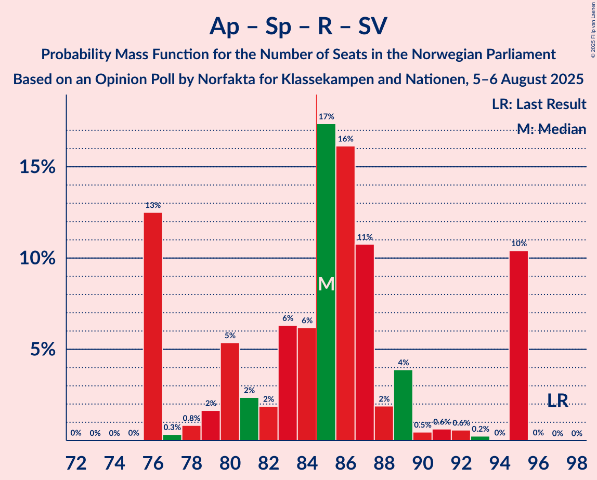

# Opinion Poll by Norfakta for Klassekampen and Nationen, 5–6 August 2025

<a href="#voting-intentions">Voting Intentions</a> | <a href="#seats">Seats</a> | <a href="#coalitions">Coalitions</a> | <a href="#technical-information">Technical Information</a>

## Voting Intentions

### Confidence Intervals

| Party | Last Result | Poll Result | 80% Confidence Interval | 90% Confidence Interval | 95% Confidence Interval | 99% Confidence Interval |
|:-----:|:-----------:|:-----------:|:-----------------------:|:-----------------------:|:-----------------------:|:-----------------------:|
| Arbeiderpartiet | 26.2% | 26.8% | 25.0–28.6% |24.6–29.2% |24.1–29.6% |23.3–30.5% |
| Fremskrittspartiet | 11.6% | 20.8% | 19.3–22.5% |18.8–23.0% |18.4–23.5% |17.7–24.3% |
| Høyre | 20.4% | 14.4% | 13.0–15.9% |12.7–16.3% |12.3–16.7% |11.7–17.4% |
| Senterpartiet | 13.5% | 6.6% | 5.7–7.8% |5.5–8.1% |5.3–8.4% |4.9–8.9% |
| Rødt | 4.7% | 6.2% | 5.4–7.3% |5.1–7.7% |4.9–7.9% |4.5–8.5% |
| Sosialistisk Venstreparti | 7.6% | 6.2% | 5.3–7.2% |5.0–7.5% |4.8–7.8% |4.4–8.4% |
| Venstre | 4.6% | 5.6% | 4.7–6.6% |4.5–6.9% |4.3–7.1% |3.9–7.7% |
| Miljøpartiet De Grønne | 3.9% | 4.2% | 3.5–5.1% |3.3–5.4% |3.1–5.6% |2.8–6.1% |
| Kristelig Folkeparti | 3.8% | 3.8% | 3.1–4.7% |2.9–4.9% |2.8–5.1% |2.5–5.6% |
| Industri- og Næringspartiet | 0.3% | 1.5% | 1.1–2.1% |1.0–2.3% |0.9–2.5% |0.7–2.8% |
| Konservativt | 0.4% | 1.2% | 0.9–1.8% |0.8–1.9% |0.7–2.1% |0.5–2.4% |
| Norgesdemokratene | 1.1% | 0.9% | 0.6–1.4% |0.5–1.6% |0.5–1.7% |0.4–2.0% |
| Pensjonistpartiet | 0.6% | 0.5% | 0.3–0.9% |0.3–1.1% |0.2–1.2% |0.2–1.4% |

*Note:* The poll result column reflects the actual value used in the calculations. Published results may vary slightly, and in addition be rounded to fewer digits.

## Seats

### Confidence Intervals

| Party | Last Result | Median | 80% Confidence Interval | 90% Confidence Interval | 95% Confidence Interval | 99% Confidence Interval |
|:-----:|:-----------:|:------:|:-----------------------:|:-----------------------:|:-----------------------:|:-----------------------:|
| <a href="#arbeiderpartiet">Arbeiderpartiet</a> | 48 | 51 | 49–56 |48–56 |47–56 |45–59 |
| <a href="#fremskrittspartiet">Fremskrittspartiet</a> | 21 | 40 | 34–42 |34–43 |34–44 |34–45 |
| <a href="#høyre">Høyre</a> | 36 | 26 | 22–31 |21–31 |21–31 |19–31 |
| <a href="#senterpartiet">Senterpartiet</a> | 28 | 13 | 8–15 |8–15 |8–15 |8–16 |
| <a href="#rødt">Rødt</a> | 8 | 11 | 9–13 |9–13 |9–13 |7–14 |
| <a href="#sosialistisk-venstreparti">Sosialistisk Venstreparti</a> | 13 | 10 | 9–13 |9–13 |8–13 |7–15 |
| <a href="#venstre">Venstre</a> | 8 | 9 | 7–11 |3–11 |3–12 |3–13 |
| <a href="#miljøpartiet-de-grønne">Miljøpartiet De Grønne</a> | 3 | 6 | 2–9 |2–9 |2–10 |2–11 |
| <a href="#kristelig-folkeparti">Kristelig Folkeparti</a> | 3 | 3 | 3–7 |2–8 |2–9 |1–9 |
| <a href="#industri--og-næringspartiet">Industri- og Næringspartiet</a> | 0 | 0 | 0 |0 |0 |0–1 |
| <a href="#konservativt">Konservativt</a> | 0 | 0 | 0 |0 |0 |0 |
| <a href="#norgesdemokratene">Norgesdemokratene</a> | 0 | 0 | 0 |0 |0 |0 |
| <a href="#pensjonistpartiet">Pensjonistpartiet</a> | 0 | 0 | 0 |0 |0 |0 |

### Arbeiderpartiet

*For a full overview of the results for this party, see the [Arbeiderpartiet](party-arbeiderpartiet.html) page.*

| Number of Seats | Probability | Accumulated | Special Marks |
|:---------------:|:-----------:|:-----------:|:-------------:|
| 42 | 0.1% | 100% |  |
| 43 | 0.2% | 99.9% |  |
| 44 | 0.1% | 99.8% |  |
| 45 | 0.8% | 99.7% |  |
| 46 | 1.0% | 98.9% |  |
| 47 | 1.4% | 98% |  |
| 48 | 3% | 96% | Last Result |
| 49 | 9% | 94% |  |
| 50 | 30% | 84% |  |
| 51 | 10% | 55% | Median |
| 52 | 11% | 44% |  |
| 53 | 4% | 33% |  |
| 54 | 1.2% | 29% |  |
| 55 | 1.0% | 28% |  |
| 56 | 25% | 27% |  |
| 57 | 0.4% | 1.4% |  |
| 58 | 0.4% | 1.0% |  |
| 59 | 0.2% | 0.6% |  |
| 60 | 0.2% | 0.4% |  |
| 61 | 0% | 0.1% |  |
| 62 | 0% | 0.1% |  |
| 63 | 0.1% | 0.1% |  |
| 64 | 0% | 0% |  |

### Fremskrittspartiet

*For a full overview of the results for this party, see the [Fremskrittspartiet](party-fremskrittspartiet.html) page.*

| Number of Seats | Probability | Accumulated | Special Marks |
|:---------------:|:-----------:|:-----------:|:-------------:|
| 21 | 0% | 100% | Last Result |
| 22 | 0% | 100% |  |
| 23 | 0% | 100% |  |
| 24 | 0% | 100% |  |
| 25 | 0% | 100% |  |
| 26 | 0% | 100% |  |
| 27 | 0% | 100% |  |
| 28 | 0% | 100% |  |
| 29 | 0% | 100% |  |
| 30 | 0% | 100% |  |
| 31 | 0% | 100% |  |
| 32 | 0% | 100% |  |
| 33 | 0.3% | 100% |  |
| 34 | 11% | 99.7% |  |
| 35 | 0.6% | 89% |  |
| 36 | 4% | 88% |  |
| 37 | 0.7% | 84% |  |
| 38 | 24% | 83% |  |
| 39 | 6% | 60% |  |
| 40 | 7% | 53% | Median |
| 41 | 9% | 46% |  |
| 42 | 26% | 36% |  |
| 43 | 5% | 10% |  |
| 44 | 4% | 5% |  |
| 45 | 0.9% | 1.1% |  |
| 46 | 0.1% | 0.2% |  |
| 47 | 0.1% | 0.1% |  |
| 48 | 0% | 0% |  |

### Høyre

*For a full overview of the results for this party, see the [Høyre](party-høyre.html) page.*

| Number of Seats | Probability | Accumulated | Special Marks |
|:---------------:|:-----------:|:-----------:|:-------------:|
| 18 | 0.1% | 100% |  |
| 19 | 0.4% | 99.9% |  |
| 20 | 1.2% | 99.5% |  |
| 21 | 5% | 98% |  |
| 22 | 5% | 93% |  |
| 23 | 8% | 88% |  |
| 24 | 16% | 80% |  |
| 25 | 7% | 64% |  |
| 26 | 21% | 57% | Median |
| 27 | 1.2% | 36% |  |
| 28 | 21% | 35% |  |
| 29 | 2% | 14% |  |
| 30 | 0.5% | 13% |  |
| 31 | 12% | 12% |  |
| 32 | 0.2% | 0.2% |  |
| 33 | 0% | 0% |  |
| 34 | 0% | 0% |  |
| 35 | 0% | 0% |  |
| 36 | 0% | 0% | Last Result |

### Senterpartiet

*For a full overview of the results for this party, see the [Senterpartiet](party-senterpartiet.html) page.*

| Number of Seats | Probability | Accumulated | Special Marks |
|:---------------:|:-----------:|:-----------:|:-------------:|
| 7 | 0.2% | 100% |  |
| 8 | 28% | 99.8% |  |
| 9 | 3% | 71% |  |
| 10 | 11% | 68% |  |
| 11 | 2% | 57% |  |
| 12 | 4% | 56% |  |
| 13 | 13% | 52% | Median |
| 14 | 26% | 39% |  |
| 15 | 12% | 13% |  |
| 16 | 0.7% | 0.8% |  |
| 17 | 0% | 0.1% |  |
| 18 | 0.1% | 0.1% |  |
| 19 | 0% | 0% |  |
| 20 | 0% | 0% |  |
| 21 | 0% | 0% |  |
| 22 | 0% | 0% |  |
| 23 | 0% | 0% |  |
| 24 | 0% | 0% |  |
| 25 | 0% | 0% |  |
| 26 | 0% | 0% |  |
| 27 | 0% | 0% |  |
| 28 | 0% | 0% | Last Result |

### Rødt

*For a full overview of the results for this party, see the [Rødt](party-rødt.html) page.*

| Number of Seats | Probability | Accumulated | Special Marks |
|:---------------:|:-----------:|:-----------:|:-------------:|
| 7 | 0.6% | 100% |  |
| 8 | 0.8% | 99.4% | Last Result |
| 9 | 26% | 98.6% |  |
| 10 | 15% | 73% |  |
| 11 | 13% | 57% | Median |
| 12 | 33% | 44% |  |
| 13 | 8% | 10% |  |
| 14 | 2% | 2% |  |
| 15 | 0.1% | 0.1% |  |
| 16 | 0% | 0% |  |

### Sosialistisk Venstreparti

*For a full overview of the results for this party, see the [Sosialistisk Venstreparti](party-sosialistiskvenstreparti.html) page.*

| Number of Seats | Probability | Accumulated | Special Marks |
|:---------------:|:-----------:|:-----------:|:-------------:|
| 7 | 2% | 100% |  |
| 8 | 2% | 98% |  |
| 9 | 40% | 96% |  |
| 10 | 9% | 56% | Median |
| 11 | 9% | 47% |  |
| 12 | 24% | 39% |  |
| 13 | 14% | 15% | Last Result |
| 14 | 0.4% | 1.0% |  |
| 15 | 0.5% | 0.5% |  |
| 16 | 0.1% | 0.1% |  |
| 17 | 0% | 0% |  |

### Venstre

*For a full overview of the results for this party, see the [Venstre](party-venstre.html) page.*

| Number of Seats | Probability | Accumulated | Special Marks |
|:---------------:|:-----------:|:-----------:|:-------------:|
| 3 | 7% | 100% |  |
| 4 | 0% | 93% |  |
| 5 | 0% | 93% |  |
| 6 | 0% | 93% |  |
| 7 | 15% | 93% |  |
| 8 | 15% | 78% | Last Result |
| 9 | 20% | 62% | Median |
| 10 | 21% | 42% |  |
| 11 | 18% | 21% |  |
| 12 | 2% | 3% |  |
| 13 | 1.0% | 1.1% |  |
| 14 | 0.1% | 0.2% |  |
| 15 | 0% | 0% |  |

### Miljøpartiet De Grønne

*For a full overview of the results for this party, see the [Miljøpartiet De Grønne](party-miljøpartietdegrønne.html) page.*

| Number of Seats | Probability | Accumulated | Special Marks |
|:---------------:|:-----------:|:-----------:|:-------------:|
| 1 | 0.2% | 100% |  |
| 2 | 19% | 99.8% |  |
| 3 | 18% | 81% | Last Result |
| 4 | 0% | 63% |  |
| 5 | 0% | 63% |  |
| 6 | 26% | 63% | Median |
| 7 | 11% | 37% |  |
| 8 | 12% | 26% |  |
| 9 | 11% | 13% |  |
| 10 | 0.4% | 3% |  |
| 11 | 2% | 2% |  |
| 12 | 0% | 0% |  |

### Kristelig Folkeparti

*For a full overview of the results for this party, see the [Kristelig Folkeparti](party-kristeligfolkeparti.html) page.*

| Number of Seats | Probability | Accumulated | Special Marks |
|:---------------:|:-----------:|:-----------:|:-------------:|
| 1 | 2% | 100% |  |
| 2 | 7% | 98% |  |
| 3 | 52% | 91% | Last Result, Median |
| 4 | 0% | 39% |  |
| 5 | 0% | 39% |  |
| 6 | 12% | 39% |  |
| 7 | 19% | 26% |  |
| 8 | 4% | 7% |  |
| 9 | 3% | 3% |  |
| 10 | 0.1% | 0.2% |  |
| 11 | 0% | 0% |  |

### Industri- og Næringspartiet

*For a full overview of the results for this party, see the [Industri- og Næringspartiet](party-industri-ognæringspartiet.html) page.*

| Number of Seats | Probability | Accumulated | Special Marks |
|:---------------:|:-----------:|:-----------:|:-------------:|
| 0 | 99.4% | 100% | Last Result, Median |
| 1 | 0.3% | 0.6% |  |
| 2 | 0.3% | 0.3% |  |
| 3 | 0% | 0% |  |

### Konservativt

*For a full overview of the results for this party, see the [Konservativt](party-konservativt.html) page.*

| Number of Seats | Probability | Accumulated | Special Marks |
|:---------------:|:-----------:|:-----------:|:-------------:|
| 0 | 100% | 100% | Last Result, Median |

### Norgesdemokratene

*For a full overview of the results for this party, see the [Norgesdemokratene](party-norgesdemokratene.html) page.*

| Number of Seats | Probability | Accumulated | Special Marks |
|:---------------:|:-----------:|:-----------:|:-------------:|
| 0 | 100% | 100% | Last Result, Median |

### Pensjonistpartiet

*For a full overview of the results for this party, see the [Pensjonistpartiet](party-pensjonistpartiet.html) page.*

| Number of Seats | Probability | Accumulated | Special Marks |
|:---------------:|:-----------:|:-----------:|:-------------:|
| 0 | 100% | 100% | Last Result, Median |

## Coalitions

### Confidence Intervals

| Coalition | Last Result | Median | Majority? | 80% Confidence Interval | 90% Confidence Interval | 95% Confidence Interval | 99% Confidence Interval |
|:---------:|:-----------:|:------:|:---------:|:-----------------------:|:-----------------------:|:-----------------------:|:-----------------------:|
| Arbeiderpartiet – Senterpartiet – Rødt – Sosialistisk Venstreparti – Miljøpartiet De Grønne | 100 | 90 | 86% | 82–98 | 82–98 | 82–98 | 82–99 |
| Fremskrittspartiet – Høyre – Senterpartiet – Venstre – Kristelig Folkeparti | 96 | 90 | 98% | 86–95 | 86–95 | 86–96 | 83–98 |
| Arbeiderpartiet – Senterpartiet – Rødt – Sosialistisk Venstreparti | 97 | 85 | 62% | 76–95 | 76–95 | 76–95 | 76–95 |
| Fremskrittspartiet – Høyre – Venstre – Miljøpartiet De Grønne – Kristelig Folkeparti | 71 | 84 | 37% | 74–93 | 74–93 | 74–93 | 74–93 |
| Arbeiderpartiet – Senterpartiet – Sosialistisk Venstreparti – Miljøpartiet De Grønne – Kristelig Folkeparti | 95 | 85 | 52% | 79–89 | 79–89 | 78–90 | 75–93 |
| Fremskrittspartiet – Høyre – Venstre – Kristelig Folkeparti | 68 | 79 | 14% | 71–87 | 71–87 | 71–87 | 70–87 |
| Arbeiderpartiet – Senterpartiet – Sosialistisk Venstreparti – Miljøpartiet De Grønne | 92 | 79 | 15% | 73–86 | 73–86 | 73–86 | 72–89 |
| Arbeiderpartiet – Rødt – Sosialistisk Venstreparti – Miljøpartiet De Grønne | 72 | 79 | 2% | 74–83 | 74–83 | 73–83 | 71–86 |
| Arbeiderpartiet – Senterpartiet – Sosialistisk Venstreparti | 89 | 73 | 0% | 67–83 | 67–83 | 67–83 | 67–83 |
| Fremskrittspartiet – Høyre – Venstre | 65 | 74 | 0.1% | 68–81 | 68–81 | 68–81 | 67–83 |
| Arbeiderpartiet – Senterpartiet – Miljøpartiet De Grønne – Kristelig Folkeparti | 82 | 74 | 0.3% | 67–77 | 67–80 | 67–81 | 65–83 |
| Arbeiderpartiet – Senterpartiet – Kristelig Folkeparti | 79 | 67 | 0% | 64–74 | 62–74 | 62–74 | 59–80 |
| Fremskrittspartiet – Høyre | 57 | 66 | 0% | 58–73 | 58–73 | 58–73 | 57–73 |
| Arbeiderpartiet – Senterpartiet | 76 | 64 | 0% | 58–71 | 58–71 | 58–71 | 57–71 |
| Arbeiderpartiet – Sosialistisk Venstreparti | 61 | 63 | 0% | 59–68 | 58–68 | 57–68 | 55–70 |
| Høyre – Venstre – Kristelig Folkeparti | 47 | 40 | 0% | 33–45 | 32–45 | 32–45 | 31–45 |
| Senterpartiet – Venstre – Kristelig Folkeparti | 39 | 24 | 0% | 20–30 | 20–30 | 20–31 | 19–33 |

### Arbeiderpartiet – Senterpartiet – Rødt – Sosialistisk Venstreparti – Miljøpartiet De Grønne

| Number of Seats | Probability | Accumulated | Special Marks |
|:---------------:|:-----------:|:-----------:|:-------------:|
| 80 | 0% | 100% |  |
| 81 | 0.1% | 99.9% |  |
| 82 | 12% | 99.9% |  |
| 83 | 0.4% | 88% |  |
| 84 | 2% | 87% |  |
| 85 | 1.4% | 86% | Majority |
| 86 | 0.8% | 84% |  |
| 87 | 2% | 84% |  |
| 88 | 14% | 81% |  |
| 89 | 16% | 67% |  |
| 90 | 2% | 51% |  |
| 91 | 12% | 49% | Median |
| 92 | 7% | 37% |  |
| 93 | 3% | 30% |  |
| 94 | 1.1% | 26% |  |
| 95 | 10% | 25% |  |
| 96 | 3% | 15% |  |
| 97 | 0.3% | 12% |  |
| 98 | 11% | 11% |  |
| 99 | 0.5% | 0.7% |  |
| 100 | 0.2% | 0.2% | Last Result |
| 101 | 0% | 0% |  |

### Fremskrittspartiet – Høyre – Senterpartiet – Venstre – Kristelig Folkeparti

| Number of Seats | Probability | Accumulated | Special Marks |
|:---------------:|:-----------:|:-----------:|:-------------:|
| 80 | 0% | 100% |  |
| 81 | 0.1% | 99.9% |  |
| 82 | 0.3% | 99.9% |  |
| 83 | 1.0% | 99.6% |  |
| 84 | 0.1% | 98.6% |  |
| 85 | 0.9% | 98% | Majority |
| 86 | 21% | 98% |  |
| 87 | 7% | 77% |  |
| 88 | 12% | 70% |  |
| 89 | 3% | 58% |  |
| 90 | 6% | 54% |  |
| 91 | 13% | 48% | Median |
| 92 | 2% | 35% |  |
| 93 | 4% | 33% |  |
| 94 | 10% | 29% |  |
| 95 | 16% | 19% |  |
| 96 | 2% | 3% | Last Result |
| 97 | 0.3% | 1.1% |  |
| 98 | 0.6% | 0.8% |  |
| 99 | 0.1% | 0.2% |  |
| 100 | 0% | 0.1% |  |
| 101 | 0% | 0% |  |

### Arbeiderpartiet – Senterpartiet – Rødt – Sosialistisk Venstreparti

| Number of Seats | Probability | Accumulated | Special Marks |
|:---------------:|:-----------:|:-----------:|:-------------:|
| 73 | 0% | 100% |  |
| 74 | 0% | 99.9% |  |
| 75 | 0% | 99.9% |  |
| 76 | 13% | 99.9% |  |
| 77 | 0.3% | 87% |  |
| 78 | 0.8% | 87% |  |
| 79 | 2% | 86% |  |
| 80 | 5% | 85% |  |
| 81 | 2% | 79% |  |
| 82 | 2% | 77% |  |
| 83 | 6% | 75% |  |
| 84 | 6% | 69% |  |
| 85 | 17% | 62% | Median, Majority |
| 86 | 16% | 45% |  |
| 87 | 11% | 29% |  |
| 88 | 2% | 18% |  |
| 89 | 4% | 16% |  |
| 90 | 0.5% | 12% |  |
| 91 | 0.6% | 12% |  |
| 92 | 0.6% | 11% |  |
| 93 | 0.2% | 11% |  |
| 94 | 0% | 10% |  |
| 95 | 10% | 10% |  |
| 96 | 0% | 0% |  |
| 97 | 0% | 0% | Last Result |

### Fremskrittspartiet – Høyre – Venstre – Miljøpartiet De Grønne – Kristelig Folkeparti

| Number of Seats | Probability | Accumulated | Special Marks |
|:---------------:|:-----------:|:-----------:|:-------------:|
| 71 | 0% | 100% | Last Result |
| 72 | 0% | 100% |  |
| 73 | 0% | 100% |  |
| 74 | 10% | 99.9% |  |
| 75 | 0% | 90% |  |
| 76 | 0.2% | 89% |  |
| 77 | 0.6% | 89% |  |
| 78 | 0.6% | 89% |  |
| 79 | 0.5% | 88% |  |
| 80 | 4% | 88% |  |
| 81 | 2% | 84% |  |
| 82 | 11% | 82% |  |
| 83 | 16% | 71% |  |
| 84 | 17% | 55% | Median |
| 85 | 6% | 37% | Majority |
| 86 | 6% | 31% |  |
| 87 | 2% | 25% |  |
| 88 | 2% | 23% |  |
| 89 | 5% | 21% |  |
| 90 | 2% | 15% |  |
| 91 | 0.9% | 14% |  |
| 92 | 0.1% | 13% |  |
| 93 | 12% | 13% |  |
| 94 | 0% | 0.1% |  |
| 95 | 0% | 0.1% |  |
| 96 | 0% | 0% |  |

### Arbeiderpartiet – Senterpartiet – Sosialistisk Venstreparti – Miljøpartiet De Grønne – Kristelig Folkeparti

| Number of Seats | Probability | Accumulated | Special Marks |
|:---------------:|:-----------:|:-----------:|:-------------:|
| 74 | 0.1% | 100% |  |
| 75 | 0.4% | 99.8% |  |
| 76 | 0.2% | 99.5% |  |
| 77 | 1.1% | 99.3% |  |
| 78 | 2% | 98% |  |
| 79 | 20% | 96% |  |
| 80 | 1.2% | 76% |  |
| 81 | 2% | 75% |  |
| 82 | 14% | 72% |  |
| 83 | 5% | 58% | Median |
| 84 | 2% | 53% |  |
| 85 | 11% | 52% | Majority |
| 86 | 15% | 40% |  |
| 87 | 5% | 25% |  |
| 88 | 4% | 20% |  |
| 89 | 11% | 16% |  |
| 90 | 3% | 5% |  |
| 91 | 0.4% | 2% |  |
| 92 | 0.8% | 1.4% |  |
| 93 | 0.4% | 0.7% |  |
| 94 | 0% | 0.3% |  |
| 95 | 0.1% | 0.3% | Last Result |
| 96 | 0% | 0.2% |  |
| 97 | 0% | 0.2% |  |
| 98 | 0.2% | 0.2% |  |
| 99 | 0% | 0% |  |

### Fremskrittspartiet – Høyre – Venstre – Kristelig Folkeparti

| Number of Seats | Probability | Accumulated | Special Marks |
|:---------------:|:-----------:|:-----------:|:-------------:|
| 68 | 0% | 100% | Last Result |
| 69 | 0.2% | 100% |  |
| 70 | 0.5% | 99.8% |  |
| 71 | 11% | 99.3% |  |
| 72 | 0.3% | 89% |  |
| 73 | 3% | 88% |  |
| 74 | 10% | 85% |  |
| 75 | 1.2% | 75% |  |
| 76 | 3% | 74% |  |
| 77 | 7% | 70% |  |
| 78 | 12% | 63% | Median |
| 79 | 2% | 51% |  |
| 80 | 16% | 49% |  |
| 81 | 14% | 32% |  |
| 82 | 2% | 18% |  |
| 83 | 1.2% | 16% |  |
| 84 | 1.0% | 15% |  |
| 85 | 2% | 14% | Majority |
| 86 | 0.4% | 13% |  |
| 87 | 12% | 12% |  |
| 88 | 0.1% | 0.1% |  |
| 89 | 0% | 0.1% |  |
| 90 | 0% | 0% |  |

### Arbeiderpartiet – Senterpartiet – Sosialistisk Venstreparti – Miljøpartiet De Grønne

| Number of Seats | Probability | Accumulated | Special Marks |
|:---------------:|:-----------:|:-----------:|:-------------:|
| 71 | 0.2% | 100% |  |
| 72 | 0.6% | 99.8% |  |
| 73 | 12% | 99.1% |  |
| 74 | 2% | 87% |  |
| 75 | 2% | 85% |  |
| 76 | 9% | 83% |  |
| 77 | 2% | 74% |  |
| 78 | 3% | 72% |  |
| 79 | 25% | 69% |  |
| 80 | 9% | 45% | Median |
| 81 | 3% | 35% |  |
| 82 | 13% | 33% |  |
| 83 | 2% | 20% |  |
| 84 | 4% | 18% |  |
| 85 | 3% | 15% | Majority |
| 86 | 11% | 11% |  |
| 87 | 0.3% | 1.0% |  |
| 88 | 0.2% | 0.7% |  |
| 89 | 0% | 0.5% |  |
| 90 | 0.3% | 0.5% |  |
| 91 | 0.1% | 0.2% |  |
| 92 | 0% | 0% | Last Result |

### Arbeiderpartiet – Rødt – Sosialistisk Venstreparti – Miljøpartiet De Grønne

| Number of Seats | Probability | Accumulated | Special Marks |
|:---------------:|:-----------:|:-----------:|:-------------:|
| 69 | 0% | 100% |  |
| 70 | 0.1% | 99.9% |  |
| 71 | 0.7% | 99.8% |  |
| 72 | 0.4% | 99.1% | Last Result |
| 73 | 2% | 98.6% |  |
| 74 | 16% | 97% |  |
| 75 | 10% | 81% |  |
| 76 | 4% | 71% |  |
| 77 | 2% | 66% |  |
| 78 | 13% | 65% | Median |
| 79 | 6% | 52% |  |
| 80 | 3% | 46% |  |
| 81 | 12% | 42% |  |
| 82 | 7% | 30% |  |
| 83 | 21% | 23% |  |
| 84 | 0.9% | 2% |  |
| 85 | 0.1% | 2% | Majority |
| 86 | 1.0% | 1.4% |  |
| 87 | 0.3% | 0.4% |  |
| 88 | 0.1% | 0.1% |  |
| 89 | 0% | 0.1% |  |
| 90 | 0% | 0% |  |

### Arbeiderpartiet – Senterpartiet – Sosialistisk Venstreparti

| Number of Seats | Probability | Accumulated | Special Marks |
|:---------------:|:-----------:|:-----------:|:-------------:|
| 64 | 0.1% | 100% |  |
| 65 | 0.1% | 99.9% |  |
| 66 | 0.2% | 99.8% |  |
| 67 | 13% | 99.6% |  |
| 68 | 0.3% | 86% |  |
| 69 | 2% | 86% |  |
| 70 | 2% | 84% |  |
| 71 | 6% | 83% |  |
| 72 | 6% | 76% |  |
| 73 | 21% | 71% |  |
| 74 | 17% | 49% | Median |
| 75 | 3% | 33% |  |
| 76 | 3% | 30% |  |
| 77 | 10% | 27% |  |
| 78 | 4% | 16% |  |
| 79 | 0.6% | 13% |  |
| 80 | 0.8% | 12% |  |
| 81 | 0.3% | 11% |  |
| 82 | 0.2% | 11% |  |
| 83 | 11% | 11% |  |
| 84 | 0.2% | 0.2% |  |
| 85 | 0% | 0% | Majority |
| 86 | 0% | 0% |  |
| 87 | 0% | 0% |  |
| 88 | 0% | 0% |  |
| 89 | 0% | 0% | Last Result |

### Fremskrittspartiet – Høyre – Venstre

| Number of Seats | Probability | Accumulated | Special Marks |
|:---------------:|:-----------:|:-----------:|:-------------:|
| 62 | 0.2% | 100% |  |
| 63 | 0% | 99.8% |  |
| 64 | 0% | 99.8% |  |
| 65 | 0% | 99.7% | Last Result |
| 66 | 0.2% | 99.7% |  |
| 67 | 0.6% | 99.5% |  |
| 68 | 11% | 99.0% |  |
| 69 | 3% | 87% |  |
| 70 | 6% | 84% |  |
| 71 | 19% | 79% |  |
| 72 | 4% | 60% |  |
| 73 | 5% | 56% |  |
| 74 | 1.4% | 51% |  |
| 75 | 3% | 49% | Median |
| 76 | 5% | 46% |  |
| 77 | 15% | 42% |  |
| 78 | 13% | 27% |  |
| 79 | 0.2% | 14% |  |
| 80 | 0.6% | 14% |  |
| 81 | 12% | 14% |  |
| 82 | 0.8% | 1.4% |  |
| 83 | 0.6% | 0.7% |  |
| 84 | 0% | 0.1% |  |
| 85 | 0.1% | 0.1% | Majority |
| 86 | 0% | 0% |  |

### Arbeiderpartiet – Senterpartiet – Miljøpartiet De Grønne – Kristelig Folkeparti

| Number of Seats | Probability | Accumulated | Special Marks |
|:---------------:|:-----------:|:-----------:|:-------------:|
| 62 | 0% | 100% |  |
| 63 | 0.2% | 99.9% |  |
| 64 | 0.1% | 99.8% |  |
| 65 | 0.3% | 99.7% |  |
| 66 | 0.6% | 99.4% |  |
| 67 | 10% | 98.8% |  |
| 68 | 0.7% | 89% |  |
| 69 | 11% | 88% |  |
| 70 | 16% | 77% |  |
| 71 | 1.0% | 61% |  |
| 72 | 3% | 61% |  |
| 73 | 5% | 57% | Median |
| 74 | 4% | 53% |  |
| 75 | 7% | 49% |  |
| 76 | 10% | 42% |  |
| 77 | 22% | 32% |  |
| 78 | 3% | 10% |  |
| 79 | 0.3% | 7% |  |
| 80 | 2% | 6% |  |
| 81 | 3% | 4% |  |
| 82 | 0.2% | 2% | Last Result |
| 83 | 0.8% | 1.3% |  |
| 84 | 0.2% | 0.5% |  |
| 85 | 0.3% | 0.3% | Majority |
| 86 | 0% | 0% |  |

### Arbeiderpartiet – Senterpartiet – Kristelig Folkeparti

| Number of Seats | Probability | Accumulated | Special Marks |
|:---------------:|:-----------:|:-----------:|:-------------:|
| 56 | 0.1% | 100% |  |
| 57 | 0% | 99.9% |  |
| 58 | 0% | 99.9% |  |
| 59 | 0.9% | 99.8% |  |
| 60 | 0.2% | 99.0% |  |
| 61 | 0.9% | 98.8% |  |
| 62 | 4% | 98% |  |
| 63 | 2% | 94% |  |
| 64 | 16% | 93% |  |
| 65 | 9% | 77% |  |
| 66 | 4% | 68% |  |
| 67 | 21% | 64% | Median |
| 68 | 6% | 42% |  |
| 69 | 1.1% | 36% |  |
| 70 | 5% | 35% |  |
| 71 | 13% | 30% |  |
| 72 | 1.2% | 17% |  |
| 73 | 0.9% | 16% |  |
| 74 | 13% | 15% |  |
| 75 | 0.3% | 2% |  |
| 76 | 0.3% | 1.4% |  |
| 77 | 0.1% | 1.1% |  |
| 78 | 0.4% | 1.0% |  |
| 79 | 0% | 0.6% | Last Result |
| 80 | 0.5% | 0.5% |  |
| 81 | 0% | 0% |  |

### Fremskrittspartiet – Høyre

| Number of Seats | Probability | Accumulated | Special Marks |
|:---------------:|:-----------:|:-----------:|:-------------:|
| 54 | 0.1% | 100% |  |
| 55 | 0.3% | 99.9% |  |
| 56 | 0.1% | 99.6% |  |
| 57 | 0.3% | 99.6% | Last Result |
| 58 | 11% | 99.3% |  |
| 59 | 3% | 89% |  |
| 60 | 1.0% | 85% |  |
| 61 | 4% | 84% |  |
| 62 | 5% | 81% |  |
| 63 | 4% | 76% |  |
| 64 | 15% | 72% |  |
| 65 | 4% | 57% |  |
| 66 | 16% | 53% | Median |
| 67 | 3% | 37% |  |
| 68 | 9% | 34% |  |
| 69 | 11% | 25% |  |
| 70 | 0.5% | 14% |  |
| 71 | 0.5% | 14% |  |
| 72 | 1.1% | 13% |  |
| 73 | 12% | 12% |  |
| 74 | 0.1% | 0.1% |  |
| 75 | 0% | 0% |  |

### Arbeiderpartiet – Senterpartiet

| Number of Seats | Probability | Accumulated | Special Marks |
|:---------------:|:-----------:|:-----------:|:-------------:|
| 53 | 0.1% | 100% |  |
| 54 | 0% | 99.9% |  |
| 55 | 0% | 99.9% |  |
| 56 | 0.1% | 99.8% |  |
| 57 | 1.2% | 99.7% |  |
| 58 | 13% | 98.5% |  |
| 59 | 3% | 85% |  |
| 60 | 1.3% | 82% |  |
| 61 | 4% | 81% |  |
| 62 | 13% | 76% |  |
| 63 | 7% | 63% |  |
| 64 | 34% | 57% | Median |
| 65 | 6% | 23% |  |
| 66 | 3% | 17% |  |
| 67 | 2% | 14% |  |
| 68 | 0.3% | 13% |  |
| 69 | 0.4% | 12% |  |
| 70 | 0.5% | 12% |  |
| 71 | 11% | 12% |  |
| 72 | 0.1% | 0.4% |  |
| 73 | 0.2% | 0.3% |  |
| 74 | 0% | 0.1% |  |
| 75 | 0.1% | 0.1% |  |
| 76 | 0% | 0% | Last Result |

### Arbeiderpartiet – Sosialistisk Venstreparti

| Number of Seats | Probability | Accumulated | Special Marks |
|:---------------:|:-----------:|:-----------:|:-------------:|
| 53 | 0.2% | 100% |  |
| 54 | 0.3% | 99.8% |  |
| 55 | 0.4% | 99.5% |  |
| 56 | 0.6% | 99.1% |  |
| 57 | 3% | 98% |  |
| 58 | 5% | 95% |  |
| 59 | 21% | 90% |  |
| 60 | 6% | 70% |  |
| 61 | 3% | 64% | Last Result, Median |
| 62 | 6% | 60% |  |
| 63 | 13% | 54% |  |
| 64 | 13% | 41% |  |
| 65 | 12% | 28% |  |
| 66 | 4% | 16% |  |
| 67 | 1.0% | 13% |  |
| 68 | 11% | 12% |  |
| 69 | 0.3% | 0.9% |  |
| 70 | 0.2% | 0.6% |  |
| 71 | 0.3% | 0.4% |  |
| 72 | 0.1% | 0.2% |  |
| 73 | 0% | 0.1% |  |
| 74 | 0% | 0% |  |

### Høyre – Venstre – Kristelig Folkeparti

| Number of Seats | Probability | Accumulated | Special Marks |
|:---------------:|:-----------:|:-----------:|:-------------:|
| 30 | 0.4% | 100% |  |
| 31 | 0.1% | 99.5% |  |
| 32 | 7% | 99.4% |  |
| 33 | 3% | 92% |  |
| 34 | 2% | 89% |  |
| 35 | 0.7% | 87% |  |
| 36 | 4% | 86% |  |
| 37 | 16% | 82% |  |
| 38 | 9% | 65% | Median |
| 39 | 5% | 57% |  |
| 40 | 22% | 52% |  |
| 41 | 2% | 30% |  |
| 42 | 12% | 28% |  |
| 43 | 2% | 16% |  |
| 44 | 0.3% | 13% |  |
| 45 | 13% | 13% |  |
| 46 | 0.2% | 0.4% |  |
| 47 | 0.1% | 0.3% | Last Result |
| 48 | 0.1% | 0.1% |  |
| 49 | 0% | 0% |  |

### Senterpartiet – Venstre – Kristelig Folkeparti

| Number of Seats | Probability | Accumulated | Special Marks |
|:---------------:|:-----------:|:-----------:|:-------------:|
| 16 | 0.1% | 100% |  |
| 17 | 0.1% | 99.9% |  |
| 18 | 0% | 99.8% |  |
| 19 | 0.9% | 99.8% |  |
| 20 | 10% | 98.9% |  |
| 21 | 2% | 89% |  |
| 22 | 34% | 87% |  |
| 23 | 3% | 53% |  |
| 24 | 5% | 51% |  |
| 25 | 4% | 46% | Median |
| 26 | 2% | 42% |  |
| 27 | 2% | 40% |  |
| 28 | 23% | 38% |  |
| 29 | 4% | 14% |  |
| 30 | 6% | 10% |  |
| 31 | 3% | 4% |  |
| 32 | 0.5% | 1.1% |  |
| 33 | 0.5% | 0.7% |  |
| 34 | 0.1% | 0.1% |  |
| 35 | 0% | 0% |  |
| 36 | 0% | 0% |  |
| 37 | 0% | 0% |  |
| 38 | 0% | 0% |  |
| 39 | 0% | 0% | Last Result |

## Technical Information

### Opinion Poll

+ **Polling firm:** Norfakta
+ **Commissioner(s):** Klassekampen and Nationen
+ **Fieldwork period:** 5–6 August 2025

### Calculations

+ **Sample size:** 1008
+ **Simulations done:** 2,097,152
+ **Error estimate:** 2.74%

