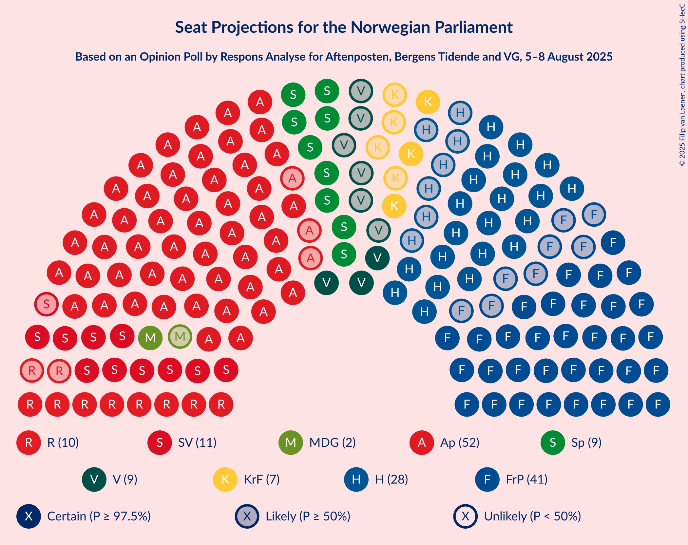

# Opinion Poll by Respons Analyse for Aftenposten, Bergens Tidende and VG, 5–8 August 2025

<a href="#voting-intentions">Voting Intentions</a> | <a href="#seats">Seats</a> | <a href="#coalitions">Coalitions</a> | <a href="#technical-information">Technical Information</a>

## Voting Intentions

### Confidence Intervals

| Party | Last Result | Poll Result | 80% Confidence Interval | 90% Confidence Interval | 95% Confidence Interval | 99% Confidence Interval |
|:-----:|:-----------:|:-----------:|:-----------------------:|:-----------------------:|:-----------------------:|:-----------------------:|
| Arbeiderpartiet | 26.2% | 28.0% | 26.2–29.9% |25.7–30.4% |25.3–30.9% |24.5–31.8% |
| Fremskrittspartiet | 11.6% | 20.7% | 19.1–22.4% |18.7–22.9% |18.3–23.3% |17.6–24.2% |
| Høyre | 20.4% | 15.2% | 13.8–16.8% |13.4–17.2% |13.1–17.6% |12.5–18.3% |
| Sosialistisk Venstreparti | 7.6% | 7.1% | 6.2–8.3% |5.9–8.6% |5.7–8.9% |5.2–9.4% |
| Senterpartiet | 13.5% | 7.0% | 6.1–8.2% |5.8–8.5% |5.6–8.8% |5.2–9.3% |
| Rødt | 4.7% | 5.8% | 5.0–6.9% |4.7–7.2% |4.5–7.4% |4.1–8.0% |
| Venstre | 4.6% | 5.1% | 4.3–6.1% |4.1–6.4% |3.9–6.6% |3.6–7.2% |
| Kristelig Folkeparti | 3.8% | 4.6% | 3.9–5.6% |3.6–5.9% |3.5–6.1% |3.1–6.6% |
| Miljøpartiet De Grønne | 3.9% | 2.8% | 2.2–3.6% |2.1–3.8% |1.9–4.0% |1.7–4.4% |
| Konservativt | 0.4% | 1.1% | 0.8–1.7% |0.7–1.8% |0.6–2.0% |0.5–2.3% |
| Norgesdemokratene | 1.1% | 0.8% | 0.5–1.3% |0.5–1.4% |0.4–1.6% |0.3–1.9% |
| Industri- og Næringspartiet | 0.3% | 0.7% | 0.5–1.2% |0.4–1.3% |0.3–1.4% |0.2–1.7% |
| Pensjonistpartiet | 0.6% | 0.6% | 0.4–1.1% |0.3–1.2% |0.3–1.3% |0.2–1.6% |

*Note:* The poll result column reflects the actual value used in the calculations. Published results may vary slightly, and in addition be rounded to fewer digits.

## Seats

### Confidence Intervals

| Party | Last Result | Median | 80% Confidence Interval | 90% Confidence Interval | 95% Confidence Interval | 99% Confidence Interval |
|:-----:|:-----------:|:------:|:-----------------------:|:-----------------------:|:-----------------------:|:-----------------------:|
| <a href="#arbeiderpartiet">Arbeiderpartiet</a> | 48 | 52 | 49–55 |49–56 |49–57 |46–59 |
| <a href="#fremskrittspartiet">Fremskrittspartiet</a> | 21 | 41 | 35–42 |33–42 |33–42 |33–43 |
| <a href="#høyre">Høyre</a> | 36 | 28 | 21–30 |21–30 |21–30 |21–32 |
| <a href="#sosialistisk-venstreparti">Sosialistisk Venstreparti</a> | 13 | 12 | 11–14 |11–15 |10–15 |9–16 |
| <a href="#senterpartiet">Senterpartiet</a> | 28 | 12 | 9–14 |9–15 |9–15 |9–16 |
| <a href="#rødt">Rødt</a> | 8 | 10 | 9–11 |9–12 |8–12 |8–13 |
| <a href="#venstre">Venstre</a> | 8 | 9 | 7–11 |7–11 |3–11 |3–12 |
| <a href="#kristelig-folkeparti">Kristelig Folkeparti</a> | 3 | 7 | 3–9 |3–9 |3–9 |2–11 |
| <a href="#miljøpartiet-de-grønne">Miljøpartiet De Grønne</a> | 3 | 2 | 1–2 |1–3 |1–3 |1–7 |
| <a href="#konservativt">Konservativt</a> | 0 | 0 | 0 |0 |0 |0 |
| <a href="#norgesdemokratene">Norgesdemokratene</a> | 0 | 0 | 0 |0 |0 |0 |
| <a href="#industri--og-næringspartiet">Industri- og Næringspartiet</a> | 0 | 0 | 0 |0 |0 |0 |
| <a href="#pensjonistpartiet">Pensjonistpartiet</a> | 0 | 0 | 0 |0 |0 |0 |

### Arbeiderpartiet

*For a full overview of the results for this party, see the [Arbeiderpartiet](party-arbeiderpartiet.html) page.*

| Number of Seats | Probability | Accumulated | Special Marks |
|:---------------:|:-----------:|:-----------:|:-------------:|
| 46 | 0.6% | 100% |  |
| 47 | 0.5% | 99.4% |  |
| 48 | 0.9% | 98.9% | Last Result |
| 49 | 21% | 98% |  |
| 50 | 13% | 77% |  |
| 51 | 2% | 64% |  |
| 52 | 45% | 62% | Median |
| 53 | 1.0% | 17% |  |
| 54 | 1.5% | 16% |  |
| 55 | 9% | 15% |  |
| 56 | 3% | 6% |  |
| 57 | 0.9% | 3% |  |
| 58 | 1.3% | 2% |  |
| 59 | 0.3% | 0.8% |  |
| 60 | 0.3% | 0.5% |  |
| 61 | 0.1% | 0.1% |  |
| 62 | 0% | 0% |  |

### Fremskrittspartiet

*For a full overview of the results for this party, see the [Fremskrittspartiet](party-fremskrittspartiet.html) page.*

| Number of Seats | Probability | Accumulated | Special Marks |
|:---------------:|:-----------:|:-----------:|:-------------:|
| 21 | 0% | 100% | Last Result |
| 22 | 0% | 100% |  |
| 23 | 0% | 100% |  |
| 24 | 0% | 100% |  |
| 25 | 0% | 100% |  |
| 26 | 0% | 100% |  |
| 27 | 0% | 100% |  |
| 28 | 0% | 100% |  |
| 29 | 0% | 100% |  |
| 30 | 0% | 100% |  |
| 31 | 0% | 100% |  |
| 32 | 0.1% | 100% |  |
| 33 | 8% | 99.9% |  |
| 34 | 2% | 92% |  |
| 35 | 0.7% | 91% |  |
| 36 | 0.7% | 90% |  |
| 37 | 5% | 89% |  |
| 38 | 27% | 84% |  |
| 39 | 4% | 57% |  |
| 40 | 3% | 53% |  |
| 41 | 33% | 51% | Median |
| 42 | 17% | 17% |  |
| 43 | 0.4% | 0.8% |  |
| 44 | 0.2% | 0.4% |  |
| 45 | 0.2% | 0.2% |  |
| 46 | 0% | 0% |  |

### Høyre

*For a full overview of the results for this party, see the [Høyre](party-høyre.html) page.*

| Number of Seats | Probability | Accumulated | Special Marks |
|:---------------:|:-----------:|:-----------:|:-------------:|
| 20 | 0.1% | 100% |  |
| 21 | 11% | 99.9% |  |
| 22 | 0.6% | 89% |  |
| 23 | 2% | 88% |  |
| 24 | 3% | 86% |  |
| 25 | 19% | 83% |  |
| 26 | 3% | 64% |  |
| 27 | 1.5% | 61% |  |
| 28 | 34% | 59% | Median |
| 29 | 2% | 25% |  |
| 30 | 22% | 23% |  |
| 31 | 0.4% | 2% |  |
| 32 | 1.1% | 1.2% |  |
| 33 | 0% | 0.1% |  |
| 34 | 0% | 0% |  |
| 35 | 0% | 0% |  |
| 36 | 0% | 0% | Last Result |

### Sosialistisk Venstreparti

*For a full overview of the results for this party, see the [Sosialistisk Venstreparti](party-sosialistiskvenstreparti.html) page.*

| Number of Seats | Probability | Accumulated | Special Marks |
|:---------------:|:-----------:|:-----------:|:-------------:|
| 8 | 0.1% | 100% |  |
| 9 | 0.9% | 99.9% |  |
| 10 | 2% | 99.0% |  |
| 11 | 34% | 97% |  |
| 12 | 24% | 64% | Median |
| 13 | 8% | 40% | Last Result |
| 14 | 23% | 31% |  |
| 15 | 7% | 9% |  |
| 16 | 2% | 2% |  |
| 17 | 0.1% | 0.1% |  |
| 18 | 0% | 0% |  |

### Senterpartiet

*For a full overview of the results for this party, see the [Senterpartiet](party-senterpartiet.html) page.*

| Number of Seats | Probability | Accumulated | Special Marks |
|:---------------:|:-----------:|:-----------:|:-------------:|
| 8 | 0.1% | 100% |  |
| 9 | 33% | 99.9% |  |
| 10 | 4% | 67% |  |
| 11 | 9% | 63% |  |
| 12 | 18% | 53% | Median |
| 13 | 23% | 35% |  |
| 14 | 3% | 13% |  |
| 15 | 8% | 9% |  |
| 16 | 0.8% | 0.8% |  |
| 17 | 0% | 0% |  |
| 18 | 0% | 0% |  |
| 19 | 0% | 0% |  |
| 20 | 0% | 0% |  |
| 21 | 0% | 0% |  |
| 22 | 0% | 0% |  |
| 23 | 0% | 0% |  |
| 24 | 0% | 0% |  |
| 25 | 0% | 0% |  |
| 26 | 0% | 0% |  |
| 27 | 0% | 0% |  |
| 28 | 0% | 0% | Last Result |

### Rødt

*For a full overview of the results for this party, see the [Rødt](party-rødt.html) page.*

| Number of Seats | Probability | Accumulated | Special Marks |
|:---------------:|:-----------:|:-----------:|:-------------:|
| 2 | 0% | 100% |  |
| 3 | 0% | 99.9% |  |
| 4 | 0% | 99.9% |  |
| 5 | 0% | 99.9% |  |
| 6 | 0% | 99.9% |  |
| 7 | 0.4% | 99.9% |  |
| 8 | 4% | 99.5% | Last Result |
| 9 | 9% | 96% |  |
| 10 | 47% | 87% | Median |
| 11 | 31% | 40% |  |
| 12 | 9% | 9% |  |
| 13 | 0.6% | 0.9% |  |
| 14 | 0.2% | 0.3% |  |
| 15 | 0.1% | 0.1% |  |
| 16 | 0% | 0% |  |

### Venstre

*For a full overview of the results for this party, see the [Venstre](party-venstre.html) page.*

| Number of Seats | Probability | Accumulated | Special Marks |
|:---------------:|:-----------:|:-----------:|:-------------:|
| 2 | 0.1% | 100% |  |
| 3 | 3% | 99.9% |  |
| 4 | 0% | 97% |  |
| 5 | 0% | 97% |  |
| 6 | 0% | 97% |  |
| 7 | 34% | 97% |  |
| 8 | 11% | 63% | Last Result |
| 9 | 16% | 52% | Median |
| 10 | 23% | 36% |  |
| 11 | 12% | 14% |  |
| 12 | 2% | 2% |  |
| 13 | 0% | 0% |  |

### Kristelig Folkeparti

*For a full overview of the results for this party, see the [Kristelig Folkeparti](party-kristeligfolkeparti.html) page.*

| Number of Seats | Probability | Accumulated | Special Marks |
|:---------------:|:-----------:|:-----------:|:-------------:|
| 2 | 1.5% | 100% |  |
| 3 | 23% | 98.5% | Last Result |
| 4 | 0% | 75% |  |
| 5 | 0% | 75% |  |
| 6 | 0% | 75% |  |
| 7 | 26% | 75% | Median |
| 8 | 12% | 49% |  |
| 9 | 35% | 37% |  |
| 10 | 1.4% | 2% |  |
| 11 | 0.9% | 1.0% |  |
| 12 | 0.1% | 0.1% |  |
| 13 | 0% | 0% |  |

### Miljøpartiet De Grønne

*For a full overview of the results for this party, see the [Miljøpartiet De Grønne](party-miljøpartietdegrønne.html) page.*

| Number of Seats | Probability | Accumulated | Special Marks |
|:---------------:|:-----------:|:-----------:|:-------------:|
| 0 | 0.1% | 100% |  |
| 1 | 37% | 99.9% |  |
| 2 | 55% | 63% | Median |
| 3 | 7% | 8% | Last Result |
| 4 | 0% | 1.0% |  |
| 5 | 0% | 1.0% |  |
| 6 | 0.1% | 1.0% |  |
| 7 | 0.9% | 1.0% |  |
| 8 | 0% | 0% |  |

### Konservativt

*For a full overview of the results for this party, see the [Konservativt](party-konservativt.html) page.*

| Number of Seats | Probability | Accumulated | Special Marks |
|:---------------:|:-----------:|:-----------:|:-------------:|
| 0 | 100% | 100% | Last Result, Median |

### Norgesdemokratene

*For a full overview of the results for this party, see the [Norgesdemokratene](party-norgesdemokratene.html) page.*

| Number of Seats | Probability | Accumulated | Special Marks |
|:---------------:|:-----------:|:-----------:|:-------------:|
| 0 | 100% | 100% | Last Result, Median |

### Industri- og Næringspartiet

*For a full overview of the results for this party, see the [Industri- og Næringspartiet](party-industri-ognæringspartiet.html) page.*

| Number of Seats | Probability | Accumulated | Special Marks |
|:---------------:|:-----------:|:-----------:|:-------------:|
| 0 | 100% | 100% | Last Result, Median |

### Pensjonistpartiet

*For a full overview of the results for this party, see the [Pensjonistpartiet](party-pensjonistpartiet.html) page.*

| Number of Seats | Probability | Accumulated | Special Marks |
|:---------------:|:-----------:|:-----------:|:-------------:|
| 0 | 100% | 100% | Last Result, Median |

## Coalitions

### Confidence Intervals

| Coalition | Last Result | Median | Majority? | 80% Confidence Interval | 90% Confidence Interval | 95% Confidence Interval | 99% Confidence Interval |
|:---------:|:-----------:|:------:|:---------:|:-----------------------:|:-----------------------:|:-----------------------:|:-----------------------:|
| Fremskrittspartiet – Høyre – Senterpartiet – Venstre – Kristelig Folkeparti | 96 | 94 | 99.8% | 89–94 | 89–94 | 87–95 | 87–100 |
| Arbeiderpartiet – Sosialistisk Venstreparti – Senterpartiet – Rødt – Miljøpartiet De Grønne | 100 | 88 | 67% | 84–93 | 84–95 | 84–95 | 82–96 |
| Arbeiderpartiet – Sosialistisk Venstreparti – Senterpartiet – Rødt | 97 | 86 | 59% | 82–91 | 82–93 | 82–93 | 80–94 |
| Arbeiderpartiet – Sosialistisk Venstreparti – Senterpartiet – Kristelig Folkeparti – Miljøpartiet De Grønne | 95 | 83 | 37% | 80–90 | 80–92 | 80–92 | 79–92 |
| Fremskrittspartiet – Høyre – Venstre – Kristelig Folkeparti – Miljøpartiet De Grønne | 71 | 83 | 41% | 78–87 | 76–87 | 76–87 | 75–89 |
| Fremskrittspartiet – Høyre – Venstre – Kristelig Folkeparti | 68 | 81 | 33% | 76–85 | 74–85 | 74–85 | 73–87 |
| Arbeiderpartiet – Sosialistisk Venstreparti – Senterpartiet – Miljøpartiet De Grønne | 92 | 77 | 1.4% | 74–83 | 74–84 | 74–84 | 72–86 |
| Arbeiderpartiet – Sosialistisk Venstreparti – Rødt – Miljøpartiet De Grønne | 72 | 75 | 0.2% | 75–80 | 75–80 | 74–82 | 69–82 |
| Arbeiderpartiet – Sosialistisk Venstreparti – Senterpartiet | 89 | 76 | 0.2% | 72–81 | 72–82 | 72–82 | 70–84 |
| Arbeiderpartiet – Senterpartiet – Kristelig Folkeparti – Miljøpartiet De Grønne | 82 | 72 | 0% | 66–77 | 66–80 | 66–80 | 66–82 |
| Fremskrittspartiet – Høyre – Venstre | 65 | 76 | 0% | 69–78 | 66–78 | 66–78 | 65–80 |
| Arbeiderpartiet – Senterpartiet – Kristelig Folkeparti | 79 | 70 | 0% | 65–76 | 65–78 | 65–78 | 65–80 |
| Arbeiderpartiet – Senterpartiet | 76 | 62 | 0% | 61–68 | 61–70 | 61–70 | 58–72 |
| Arbeiderpartiet – Sosialistisk Venstreparti | 61 | 63 | 0% | 63–67 | 63–68 | 61–69 | 58–71 |
| Fremskrittspartiet – Høyre | 57 | 68 | 0% | 61–69 | 58–69 | 58–69 | 58–70 |
| Høyre – Venstre – Kristelig Folkeparti | 47 | 43 | 0% | 39–44 | 39–44 | 37–47 | 34–48 |
| Senterpartiet – Venstre – Kristelig Folkeparti | 39 | 26 | 0% | 25–31 | 25–31 | 23–31 | 17–33 |

### Fremskrittspartiet – Høyre – Senterpartiet – Venstre – Kristelig Folkeparti

| Number of Seats | Probability | Accumulated | Special Marks |
|:---------------:|:-----------:|:-----------:|:-------------:|
| 79 | 0.1% | 100% |  |
| 80 | 0% | 99.9% |  |
| 81 | 0% | 99.9% |  |
| 82 | 0% | 99.9% |  |
| 83 | 0% | 99.9% |  |
| 84 | 0% | 99.9% |  |
| 85 | 0.1% | 99.8% | Majority |
| 86 | 0.3% | 99.8% |  |
| 87 | 2% | 99.5% |  |
| 88 | 0.7% | 97% |  |
| 89 | 8% | 97% |  |
| 90 | 3% | 89% |  |
| 91 | 9% | 86% |  |
| 92 | 2% | 77% |  |
| 93 | 12% | 75% |  |
| 94 | 59% | 62% |  |
| 95 | 2% | 4% |  |
| 96 | 0.1% | 2% | Last Result |
| 97 | 0.3% | 1.4% | Median |
| 98 | 0.4% | 1.1% |  |
| 99 | 0.2% | 0.7% |  |
| 100 | 0.1% | 0.5% |  |
| 101 | 0% | 0.4% |  |
| 102 | 0.3% | 0.4% |  |
| 103 | 0% | 0% |  |

### Arbeiderpartiet – Sosialistisk Venstreparti – Senterpartiet – Rødt – Miljøpartiet De Grønne

| Number of Seats | Probability | Accumulated | Special Marks |
|:---------------:|:-----------:|:-----------:|:-------------:|
| 78 | 0% | 100% |  |
| 79 | 0.3% | 99.9% |  |
| 80 | 0% | 99.7% |  |
| 81 | 0.1% | 99.6% |  |
| 82 | 0.2% | 99.5% |  |
| 83 | 0.2% | 99.4% |  |
| 84 | 32% | 99.2% |  |
| 85 | 1.3% | 67% | Majority |
| 86 | 7% | 66% |  |
| 87 | 0.4% | 59% |  |
| 88 | 36% | 59% | Median |
| 89 | 1.3% | 23% |  |
| 90 | 8% | 22% |  |
| 91 | 2% | 14% |  |
| 92 | 2% | 12% |  |
| 93 | 1.5% | 11% |  |
| 94 | 0.6% | 9% |  |
| 95 | 8% | 9% |  |
| 96 | 0.6% | 0.7% |  |
| 97 | 0.1% | 0.2% |  |
| 98 | 0% | 0.1% |  |
| 99 | 0% | 0.1% |  |
| 100 | 0% | 0.1% | Last Result |
| 101 | 0% | 0.1% |  |
| 102 | 0% | 0.1% |  |
| 103 | 0.1% | 0.1% |  |
| 104 | 0% | 0% |  |

### Arbeiderpartiet – Sosialistisk Venstreparti – Senterpartiet – Rødt

| Number of Seats | Probability | Accumulated | Special Marks |
|:---------------:|:-----------:|:-----------:|:-------------:|
| 77 | 0% | 100% |  |
| 78 | 0.4% | 99.9% |  |
| 79 | 0% | 99.6% |  |
| 80 | 0.1% | 99.5% |  |
| 81 | 0.8% | 99.4% |  |
| 82 | 32% | 98.6% |  |
| 83 | 6% | 67% |  |
| 84 | 2% | 61% |  |
| 85 | 1.4% | 59% | Majority |
| 86 | 11% | 58% | Median |
| 87 | 23% | 46% |  |
| 88 | 2% | 23% |  |
| 89 | 8% | 20% |  |
| 90 | 1.0% | 13% |  |
| 91 | 2% | 12% |  |
| 92 | 1.1% | 10% |  |
| 93 | 8% | 9% |  |
| 94 | 0.5% | 0.6% |  |
| 95 | 0% | 0.1% |  |
| 96 | 0.1% | 0.1% |  |
| 97 | 0% | 0.1% | Last Result |
| 98 | 0% | 0% |  |

### Arbeiderpartiet – Sosialistisk Venstreparti – Senterpartiet – Kristelig Folkeparti – Miljøpartiet De Grønne

| Number of Seats | Probability | Accumulated | Special Marks |
|:---------------:|:-----------:|:-----------:|:-------------:|
| 76 | 0.1% | 100% |  |
| 77 | 0.3% | 99.9% |  |
| 78 | 0% | 99.6% |  |
| 79 | 0.1% | 99.5% |  |
| 80 | 22% | 99.4% |  |
| 81 | 0.8% | 78% |  |
| 82 | 0.2% | 77% |  |
| 83 | 33% | 77% |  |
| 84 | 7% | 43% |  |
| 85 | 17% | 37% | Median, Majority |
| 86 | 1.3% | 19% |  |
| 87 | 2% | 18% |  |
| 88 | 3% | 16% |  |
| 89 | 2% | 13% |  |
| 90 | 1.0% | 11% |  |
| 91 | 0.6% | 10% |  |
| 92 | 9% | 9% |  |
| 93 | 0.1% | 0.5% |  |
| 94 | 0.1% | 0.3% |  |
| 95 | 0.1% | 0.2% | Last Result |
| 96 | 0% | 0.1% |  |
| 97 | 0.1% | 0.1% |  |
| 98 | 0% | 0% |  |

### Fremskrittspartiet – Høyre – Venstre – Kristelig Folkeparti – Miljøpartiet De Grønne

| Number of Seats | Probability | Accumulated | Special Marks |
|:---------------:|:-----------:|:-----------:|:-------------:|
| 71 | 0% | 100% | Last Result |
| 72 | 0% | 100% |  |
| 73 | 0.1% | 99.9% |  |
| 74 | 0% | 99.9% |  |
| 75 | 0.5% | 99.9% |  |
| 76 | 8% | 99.4% |  |
| 77 | 1.1% | 91% |  |
| 78 | 2% | 90% |  |
| 79 | 1.0% | 88% |  |
| 80 | 8% | 87% |  |
| 81 | 2% | 80% |  |
| 82 | 23% | 77% |  |
| 83 | 11% | 54% |  |
| 84 | 1.4% | 42% |  |
| 85 | 2% | 41% | Majority |
| 86 | 6% | 39% |  |
| 87 | 32% | 33% | Median |
| 88 | 0.8% | 1.4% |  |
| 89 | 0.1% | 0.6% |  |
| 90 | 0% | 0.5% |  |
| 91 | 0.4% | 0.4% |  |
| 92 | 0% | 0.1% |  |
| 93 | 0% | 0% |  |

### Fremskrittspartiet – Høyre – Venstre – Kristelig Folkeparti

| Number of Seats | Probability | Accumulated | Special Marks |
|:---------------:|:-----------:|:-----------:|:-------------:|
| 66 | 0.1% | 100% |  |
| 67 | 0% | 99.9% |  |
| 68 | 0% | 99.9% | Last Result |
| 69 | 0% | 99.9% |  |
| 70 | 0% | 99.9% |  |
| 71 | 0% | 99.9% |  |
| 72 | 0.1% | 99.9% |  |
| 73 | 0.6% | 99.8% |  |
| 74 | 8% | 99.3% |  |
| 75 | 0.6% | 91% |  |
| 76 | 1.5% | 91% |  |
| 77 | 2% | 89% |  |
| 78 | 2% | 88% |  |
| 79 | 8% | 86% |  |
| 80 | 1.3% | 78% |  |
| 81 | 36% | 77% |  |
| 82 | 0.4% | 41% |  |
| 83 | 7% | 41% |  |
| 84 | 1.3% | 34% |  |
| 85 | 32% | 33% | Median, Majority |
| 86 | 0.2% | 0.8% |  |
| 87 | 0.2% | 0.6% |  |
| 88 | 0.1% | 0.5% |  |
| 89 | 0% | 0.4% |  |
| 90 | 0.3% | 0.3% |  |
| 91 | 0% | 0% |  |

### Arbeiderpartiet – Sosialistisk Venstreparti – Senterpartiet – Miljøpartiet De Grønne

| Number of Seats | Probability | Accumulated | Special Marks |
|:---------------:|:-----------:|:-----------:|:-------------:|
| 69 | 0% | 100% |  |
| 70 | 0% | 99.9% |  |
| 71 | 0.3% | 99.9% |  |
| 72 | 0.2% | 99.6% |  |
| 73 | 0.4% | 99.4% |  |
| 74 | 32% | 99.1% |  |
| 75 | 0.9% | 67% |  |
| 76 | 2% | 66% |  |
| 77 | 27% | 64% |  |
| 78 | 19% | 38% | Median |
| 79 | 3% | 19% |  |
| 80 | 3% | 16% |  |
| 81 | 0.8% | 13% |  |
| 82 | 2% | 12% |  |
| 83 | 1.1% | 10% |  |
| 84 | 8% | 9% |  |
| 85 | 0.5% | 1.4% | Majority |
| 86 | 0.5% | 0.8% |  |
| 87 | 0.2% | 0.4% |  |
| 88 | 0.1% | 0.1% |  |
| 89 | 0% | 0.1% |  |
| 90 | 0% | 0.1% |  |
| 91 | 0% | 0.1% |  |
| 92 | 0% | 0.1% | Last Result |
| 93 | 0% | 0.1% |  |
| 94 | 0.1% | 0.1% |  |
| 95 | 0% | 0% |  |

### Arbeiderpartiet – Sosialistisk Venstreparti – Rødt – Miljøpartiet De Grønne

| Number of Seats | Probability | Accumulated | Special Marks |
|:---------------:|:-----------:|:-----------:|:-------------:|
| 67 | 0.4% | 100% |  |
| 68 | 0% | 99.6% |  |
| 69 | 0.1% | 99.6% |  |
| 70 | 0.2% | 99.5% |  |
| 71 | 0.4% | 99.3% |  |
| 72 | 0.3% | 98.9% | Last Result |
| 73 | 0.1% | 98.6% |  |
| 74 | 2% | 98% |  |
| 75 | 59% | 96% |  |
| 76 | 12% | 38% | Median |
| 77 | 2% | 25% |  |
| 78 | 9% | 23% |  |
| 79 | 3% | 14% |  |
| 80 | 8% | 11% |  |
| 81 | 0.7% | 3% |  |
| 82 | 2% | 3% |  |
| 83 | 0.3% | 0.5% |  |
| 84 | 0.1% | 0.2% |  |
| 85 | 0% | 0.2% | Majority |
| 86 | 0% | 0.1% |  |
| 87 | 0% | 0.1% |  |
| 88 | 0% | 0.1% |  |
| 89 | 0% | 0.1% |  |
| 90 | 0.1% | 0.1% |  |
| 91 | 0% | 0% |  |

### Arbeiderpartiet – Sosialistisk Venstreparti – Senterpartiet

| Number of Seats | Probability | Accumulated | Special Marks |
|:---------------:|:-----------:|:-----------:|:-------------:|
| 67 | 0.1% | 100% |  |
| 68 | 0% | 99.9% |  |
| 69 | 0% | 99.9% |  |
| 70 | 0.5% | 99.9% |  |
| 71 | 0.2% | 99.4% |  |
| 72 | 33% | 99.2% |  |
| 73 | 1.3% | 67% |  |
| 74 | 6% | 65% |  |
| 75 | 1.5% | 59% |  |
| 76 | 32% | 58% | Median |
| 77 | 9% | 26% |  |
| 78 | 2% | 17% |  |
| 79 | 2% | 15% |  |
| 80 | 0.4% | 12% |  |
| 81 | 2% | 12% |  |
| 82 | 8% | 10% |  |
| 83 | 0.3% | 1.2% |  |
| 84 | 0.7% | 0.9% |  |
| 85 | 0.1% | 0.2% | Majority |
| 86 | 0% | 0.1% |  |
| 87 | 0.1% | 0.1% |  |
| 88 | 0% | 0% |  |
| 89 | 0% | 0% | Last Result |

### Arbeiderpartiet – Senterpartiet – Kristelig Folkeparti – Miljøpartiet De Grønne

| Number of Seats | Probability | Accumulated | Special Marks |
|:---------------:|:-----------:|:-----------:|:-------------:|
| 63 | 0.1% | 100% |  |
| 64 | 0.1% | 99.8% |  |
| 65 | 0.1% | 99.8% |  |
| 66 | 21% | 99.7% |  |
| 67 | 0.4% | 79% |  |
| 68 | 1.3% | 79% |  |
| 69 | 1.5% | 77% |  |
| 70 | 6% | 76% |  |
| 71 | 6% | 70% |  |
| 72 | 33% | 64% |  |
| 73 | 13% | 31% | Median |
| 74 | 2% | 18% |  |
| 75 | 3% | 17% |  |
| 76 | 2% | 14% |  |
| 77 | 2% | 11% |  |
| 78 | 0.8% | 9% |  |
| 79 | 0.2% | 9% |  |
| 80 | 7% | 8% |  |
| 81 | 0.3% | 1.0% |  |
| 82 | 0.3% | 0.7% | Last Result |
| 83 | 0.1% | 0.4% |  |
| 84 | 0.2% | 0.3% |  |
| 85 | 0% | 0% | Majority |

### Fremskrittspartiet – Høyre – Venstre

| Number of Seats | Probability | Accumulated | Special Marks |
|:---------------:|:-----------:|:-----------:|:-------------:|
| 63 | 0.1% | 100% |  |
| 64 | 0% | 99.9% |  |
| 65 | 0.4% | 99.9% | Last Result |
| 66 | 7% | 99.4% |  |
| 67 | 0.5% | 92% |  |
| 68 | 0.4% | 92% |  |
| 69 | 2% | 91% |  |
| 70 | 2% | 90% |  |
| 71 | 1.1% | 88% |  |
| 72 | 9% | 86% |  |
| 73 | 4% | 78% |  |
| 74 | 12% | 74% |  |
| 75 | 0.5% | 62% |  |
| 76 | 38% | 62% |  |
| 77 | 2% | 24% |  |
| 78 | 21% | 22% | Median |
| 79 | 0.2% | 0.9% |  |
| 80 | 0.5% | 0.8% |  |
| 81 | 0.1% | 0.3% |  |
| 82 | 0.1% | 0.2% |  |
| 83 | 0.1% | 0.1% |  |
| 84 | 0% | 0% |  |

### Arbeiderpartiet – Senterpartiet – Kristelig Folkeparti

| Number of Seats | Probability | Accumulated | Special Marks |
|:---------------:|:-----------:|:-----------:|:-------------:|
| 61 | 0.1% | 100% |  |
| 62 | 0.1% | 99.9% |  |
| 63 | 0% | 99.8% |  |
| 64 | 0.1% | 99.8% |  |
| 65 | 21% | 99.7% |  |
| 66 | 0.5% | 79% |  |
| 67 | 1.4% | 79% |  |
| 68 | 7% | 77% |  |
| 69 | 6% | 70% |  |
| 70 | 33% | 64% |  |
| 71 | 11% | 31% | Median |
| 72 | 3% | 20% |  |
| 73 | 0.7% | 16% |  |
| 74 | 4% | 15% |  |
| 75 | 0.7% | 11% |  |
| 76 | 2% | 11% |  |
| 77 | 0.4% | 9% |  |
| 78 | 7% | 8% |  |
| 79 | 0.1% | 0.8% | Last Result |
| 80 | 0.6% | 0.7% |  |
| 81 | 0.1% | 0.1% |  |
| 82 | 0% | 0% |  |

### Arbeiderpartiet – Senterpartiet

| Number of Seats | Probability | Accumulated | Special Marks |
|:---------------:|:-----------:|:-----------:|:-------------:|
| 57 | 0.1% | 100% |  |
| 58 | 0.6% | 99.9% |  |
| 59 | 0.6% | 99.3% |  |
| 60 | 0.2% | 98.8% |  |
| 61 | 39% | 98.6% |  |
| 62 | 27% | 59% |  |
| 63 | 1.4% | 33% |  |
| 64 | 12% | 32% | Median |
| 65 | 4% | 19% |  |
| 66 | 3% | 15% |  |
| 67 | 2% | 13% |  |
| 68 | 0.8% | 10% |  |
| 69 | 0.4% | 10% |  |
| 70 | 8% | 9% |  |
| 71 | 0.6% | 1.4% |  |
| 72 | 0.5% | 0.8% |  |
| 73 | 0.1% | 0.3% |  |
| 74 | 0.1% | 0.2% |  |
| 75 | 0% | 0% |  |
| 76 | 0% | 0% | Last Result |

### Arbeiderpartiet – Sosialistisk Venstreparti

| Number of Seats | Probability | Accumulated | Special Marks |
|:---------------:|:-----------:|:-----------:|:-------------:|
| 57 | 0.1% | 100% |  |
| 58 | 0.6% | 99.8% |  |
| 59 | 0.9% | 99.2% |  |
| 60 | 0.5% | 98% |  |
| 61 | 0.8% | 98% | Last Result |
| 62 | 0.3% | 97% |  |
| 63 | 59% | 97% |  |
| 64 | 13% | 37% | Median |
| 65 | 7% | 25% |  |
| 66 | 2% | 18% |  |
| 67 | 9% | 16% |  |
| 68 | 2% | 7% |  |
| 69 | 2% | 5% |  |
| 70 | 0.4% | 2% |  |
| 71 | 2% | 2% |  |
| 72 | 0.2% | 0.3% |  |
| 73 | 0% | 0.1% |  |
| 74 | 0.1% | 0.1% |  |
| 75 | 0% | 0% |  |

### Fremskrittspartiet – Høyre

| Number of Seats | Probability | Accumulated | Special Marks |
|:---------------:|:-----------:|:-----------:|:-------------:|
| 55 | 0.1% | 100% |  |
| 56 | 0% | 99.9% |  |
| 57 | 0% | 99.9% | Last Result |
| 58 | 7% | 99.8% |  |
| 59 | 0.2% | 92% |  |
| 60 | 0.5% | 92% |  |
| 61 | 3% | 92% |  |
| 62 | 2% | 89% |  |
| 63 | 20% | 87% |  |
| 64 | 2% | 67% |  |
| 65 | 1.0% | 65% |  |
| 66 | 1.3% | 64% |  |
| 67 | 7% | 63% |  |
| 68 | 22% | 57% |  |
| 69 | 33% | 34% | Median |
| 70 | 1.1% | 1.5% |  |
| 71 | 0.1% | 0.4% |  |
| 72 | 0.1% | 0.3% |  |
| 73 | 0.1% | 0.2% |  |
| 74 | 0% | 0.1% |  |
| 75 | 0.1% | 0.1% |  |
| 76 | 0% | 0% |  |

### Høyre – Venstre – Kristelig Folkeparti

| Number of Seats | Probability | Accumulated | Special Marks |
|:---------------:|:-----------:|:-----------:|:-------------:|
| 32 | 0.1% | 100% |  |
| 33 | 0.2% | 99.9% |  |
| 34 | 0.5% | 99.8% |  |
| 35 | 0.2% | 99.3% |  |
| 36 | 0.9% | 99.1% |  |
| 37 | 0.7% | 98% |  |
| 38 | 1.2% | 97% |  |
| 39 | 13% | 96% |  |
| 40 | 3% | 83% |  |
| 41 | 20% | 80% |  |
| 42 | 0.8% | 60% |  |
| 43 | 21% | 59% |  |
| 44 | 34% | 38% | Median |
| 45 | 0.2% | 4% |  |
| 46 | 0.6% | 4% |  |
| 47 | 2% | 3% | Last Result |
| 48 | 0.6% | 1.0% |  |
| 49 | 0.1% | 0.4% |  |
| 50 | 0.1% | 0.3% |  |
| 51 | 0.3% | 0.3% |  |
| 52 | 0% | 0% |  |

### Senterpartiet – Venstre – Kristelig Folkeparti

| Number of Seats | Probability | Accumulated | Special Marks |
|:---------------:|:-----------:|:-----------:|:-------------:|
| 17 | 0.6% | 100% |  |
| 18 | 0% | 99.4% |  |
| 19 | 0% | 99.4% |  |
| 20 | 0% | 99.4% |  |
| 21 | 0.1% | 99.4% |  |
| 22 | 1.2% | 99.3% |  |
| 23 | 0.6% | 98% |  |
| 24 | 2% | 97% |  |
| 25 | 33% | 96% |  |
| 26 | 22% | 62% |  |
| 27 | 8% | 40% |  |
| 28 | 6% | 32% | Median |
| 29 | 2% | 26% |  |
| 30 | 13% | 23% |  |
| 31 | 8% | 10% |  |
| 32 | 1.4% | 2% |  |
| 33 | 0.6% | 0.7% |  |
| 34 | 0.1% | 0.1% |  |
| 35 | 0% | 0.1% |  |
| 36 | 0% | 0% |  |
| 37 | 0% | 0% |  |
| 38 | 0% | 0% |  |
| 39 | 0% | 0% | Last Result |

## Technical Information

### Opinion Poll

+ **Polling firm:** Respons Analyse
+ **Commissioner(s):** Aftenposten, Bergens Tidende and VG
+ **Fieldwork period:** 5–8 August 2025

### Calculations

+ **Sample size:** 1000
+ **Simulations done:** 2,097,152
+ **Error estimate:** 2.94%

