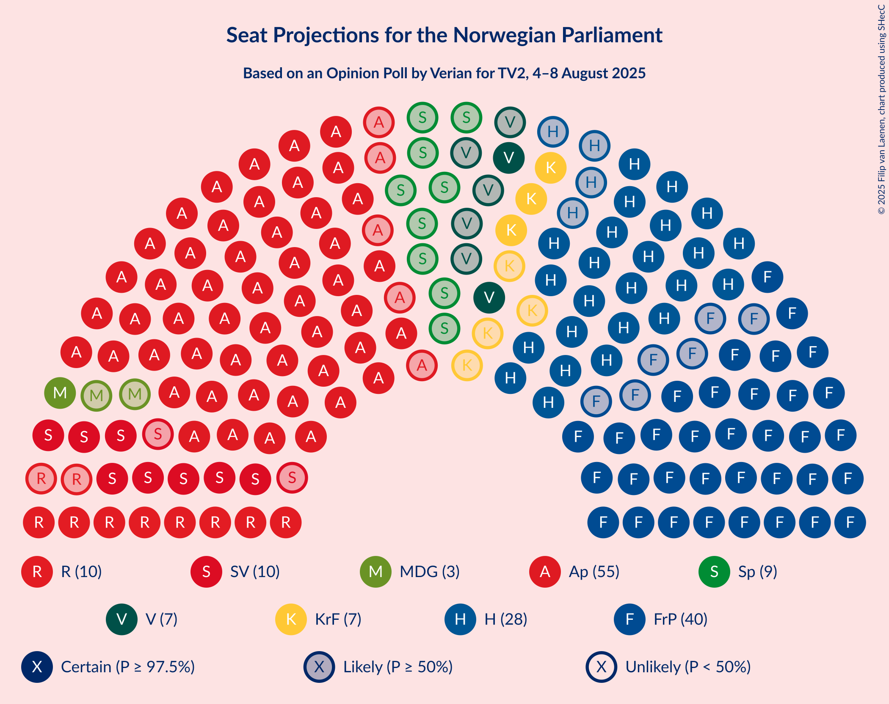
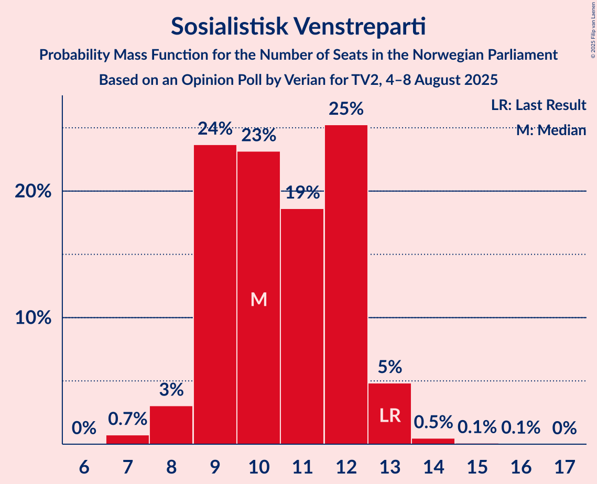
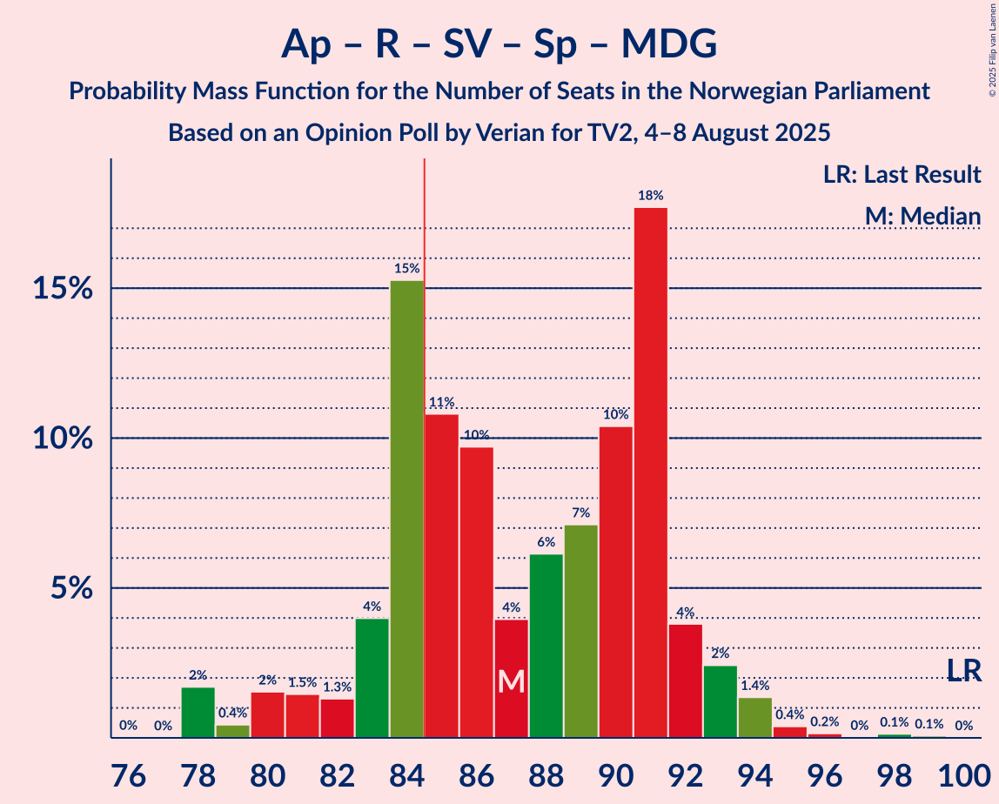
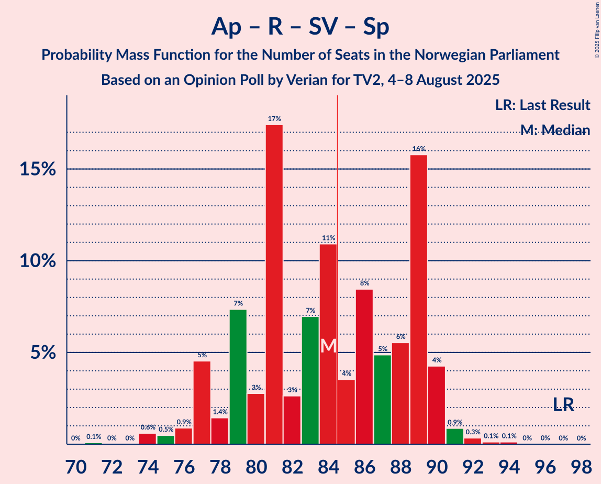
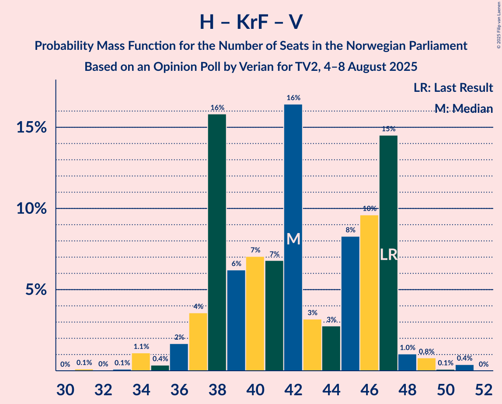

# Opinion Poll by Verian for TV2, 4–8 August 2025

<a href="#voting-intentions">Voting Intentions</a> | <a href="#seats">Seats</a> | <a href="#coalitions">Coalitions</a> | <a href="#technical-information">Technical Information</a>

## Voting Intentions

### Confidence Intervals

| Party | Last Result | Poll Result | 80% Confidence Interval | 90% Confidence Interval | 95% Confidence Interval | 99% Confidence Interval |
|:-----:|:-----------:|:-----------:|:-----------------------:|:-----------------------:|:-----------------------:|:-----------------------:|
| Arbeiderpartiet | 26.2% | 28.8% | 27.2–30.6% |26.7–31.0% |26.3–31.5% |25.6–32.3% |
| Fremskrittspartiet | 11.6% | 20.7% | 19.3–22.3% |18.8–22.7% |18.5–23.1% |17.8–23.9% |
| Høyre | 20.4% | 16.2% | 14.9–17.6% |14.5–18.0% |14.2–18.4% |13.6–19.1% |
| Rødt | 4.7% | 6.3% | 5.5–7.3% |5.2–7.6% |5.0–7.8% |4.7–8.3% |
| Sosialistisk Venstreparti | 7.6% | 6.2% | 5.4–7.2% |5.2–7.5% |5.0–7.7% |4.6–8.2% |
| Senterpartiet | 13.5% | 4.9% | 4.1–5.8% |3.9–6.0% |3.8–6.2% |3.5–6.7% |
| Kristelig Folkeparti | 3.8% | 4.6% | 3.9–5.5% |3.7–5.7% |3.6–6.0% |3.2–6.4% |
| Venstre | 4.6% | 4.4% | 3.7–5.2% |3.5–5.5% |3.3–5.7% |3.0–6.1% |
| Miljøpartiet De Grønne | 3.9% | 3.5% | 2.9–4.3% |2.8–4.5% |2.6–4.7% |2.3–5.1% |
| Konservativt | 0.4% | 1.0% | 0.7–1.5% |0.6–1.6% |0.6–1.8% |0.5–2.0% |
| Norgesdemokratene | 1.1% | 0.9% | 0.7–1.4% |0.6–1.5% |0.5–1.6% |0.4–1.9% |
| Industri- og Næringspartiet | 0.3% | 0.3% | 0.2–0.7% |0.2–0.8% |0.1–0.9% |0.1–1.1% |

*Note:* The poll result column reflects the actual value used in the calculations. Published results may vary slightly, and in addition be rounded to fewer digits.

## Seats

### Confidence Intervals

| Party | Last Result | Median | 80% Confidence Interval | 90% Confidence Interval | 95% Confidence Interval | 99% Confidence Interval |
|:-----:|:-----------:|:------:|:-----------------------:|:-----------------------:|:-----------------------:|:-----------------------:|
| <a href="#arbeiderpartiet">Arbeiderpartiet</a> | 48 | 55 | 52–58 |51–59 |50–60 |49–63 |
| <a href="#fremskrittspartiet">Fremskrittspartiet</a> | 21 | 40 | 38–42 |35–43 |34–44 |34–45 |
| <a href="#høyre">Høyre</a> | 36 | 29 | 26–32 |25–32 |24–33 |22–34 |
| <a href="#rødt">Rødt</a> | 8 | 11 | 8–12 |8–12 |8–13 |7–14 |
| <a href="#sosialistisk-venstreparti">Sosialistisk Venstreparti</a> | 13 | 10 | 9–12 |9–13 |8–13 |7–14 |
| <a href="#senterpartiet">Senterpartiet</a> | 28 | 9 | 1–10 |1–10 |0–11 |0–12 |
| <a href="#kristelig-folkeparti">Kristelig Folkeparti</a> | 3 | 7 | 3–9 |3–9 |3–10 |2–11 |
| <a href="#venstre">Venstre</a> | 8 | 7 | 3–8 |3–9 |2–9 |2–10 |
| <a href="#miljøpartiet-de-grønne">Miljøpartiet De Grønne</a> | 3 | 3 | 2–7 |2–7 |1–7 |1–8 |
| <a href="#konservativt">Konservativt</a> | 0 | 0 | 0 |0 |0 |0 |
| <a href="#norgesdemokratene">Norgesdemokratene</a> | 0 | 0 | 0 |0 |0 |0 |
| <a href="#industri--og-næringspartiet">Industri- og Næringspartiet</a> | 0 | 0 | 0 |0 |0 |0 |

### Arbeiderpartiet

*For a full overview of the results for this party, see the [Arbeiderpartiet](party-arbeiderpartiet.html) page.*

| Number of Seats | Probability | Accumulated | Special Marks |
|:---------------:|:-----------:|:-----------:|:-------------:|
| 48 | 0.2% | 100% | Last Result |
| 49 | 0.8% | 99.8% |  |
| 50 | 2% | 99.0% |  |
| 51 | 2% | 97% |  |
| 52 | 14% | 95% |  |
| 53 | 10% | 81% |  |
| 54 | 8% | 71% |  |
| 55 | 22% | 63% | Median |
| 56 | 9% | 41% |  |
| 57 | 11% | 32% |  |
| 58 | 13% | 21% |  |
| 59 | 3% | 8% |  |
| 60 | 3% | 5% |  |
| 61 | 0.6% | 2% |  |
| 62 | 0.4% | 1.1% |  |
| 63 | 0.2% | 0.6% |  |
| 64 | 0.2% | 0.4% |  |
| 65 | 0.1% | 0.2% |  |
| 66 | 0% | 0.1% |  |
| 67 | 0% | 0% |  |

### Fremskrittspartiet

*For a full overview of the results for this party, see the [Fremskrittspartiet](party-fremskrittspartiet.html) page.*

| Number of Seats | Probability | Accumulated | Special Marks |
|:---------------:|:-----------:|:-----------:|:-------------:|
| 21 | 0% | 100% | Last Result |
| 22 | 0% | 100% |  |
| 23 | 0% | 100% |  |
| 24 | 0% | 100% |  |
| 25 | 0% | 100% |  |
| 26 | 0% | 100% |  |
| 27 | 0% | 100% |  |
| 28 | 0% | 100% |  |
| 29 | 0% | 100% |  |
| 30 | 0% | 100% |  |
| 31 | 0% | 100% |  |
| 32 | 0.1% | 100% |  |
| 33 | 0.2% | 99.9% |  |
| 34 | 3% | 99.8% |  |
| 35 | 3% | 96% |  |
| 36 | 1.1% | 93% |  |
| 37 | 1.2% | 92% |  |
| 38 | 19% | 91% |  |
| 39 | 17% | 72% |  |
| 40 | 30% | 55% | Median |
| 41 | 11% | 24% |  |
| 42 | 7% | 14% |  |
| 43 | 3% | 7% |  |
| 44 | 2% | 4% |  |
| 45 | 2% | 2% |  |
| 46 | 0.3% | 0.4% |  |
| 47 | 0.1% | 0.1% |  |
| 48 | 0% | 0% |  |

### Høyre

*For a full overview of the results for this party, see the [Høyre](party-høyre.html) page.*

| Number of Seats | Probability | Accumulated | Special Marks |
|:---------------:|:-----------:|:-----------:|:-------------:|
| 21 | 0.1% | 100% |  |
| 22 | 0.6% | 99.8% |  |
| 23 | 1.2% | 99.2% |  |
| 24 | 3% | 98% |  |
| 25 | 4% | 95% |  |
| 26 | 16% | 91% |  |
| 27 | 9% | 75% |  |
| 28 | 13% | 66% |  |
| 29 | 8% | 53% | Median |
| 30 | 16% | 45% |  |
| 31 | 10% | 29% |  |
| 32 | 16% | 19% |  |
| 33 | 2% | 3% |  |
| 34 | 0.2% | 0.7% |  |
| 35 | 0.3% | 0.4% |  |
| 36 | 0.1% | 0.2% | Last Result |
| 37 | 0% | 0% |  |

### Rødt

*For a full overview of the results for this party, see the [Rødt](party-rødt.html) page.*

| Number of Seats | Probability | Accumulated | Special Marks |
|:---------------:|:-----------:|:-----------:|:-------------:|
| 7 | 2% | 100% |  |
| 8 | 8% | 98% | Last Result |
| 9 | 9% | 89% |  |
| 10 | 30% | 81% |  |
| 11 | 13% | 51% | Median |
| 12 | 33% | 38% |  |
| 13 | 2% | 4% |  |
| 14 | 2% | 2% |  |
| 15 | 0.2% | 0.3% |  |
| 16 | 0% | 0% |  |

### Sosialistisk Venstreparti

*For a full overview of the results for this party, see the [Sosialistisk Venstreparti](party-sosialistiskvenstreparti.html) page.*

| Number of Seats | Probability | Accumulated | Special Marks |
|:---------------:|:-----------:|:-----------:|:-------------:|
| 7 | 0.7% | 100% |  |
| 8 | 3% | 99.2% |  |
| 9 | 24% | 96% |  |
| 10 | 23% | 73% | Median |
| 11 | 19% | 49% |  |
| 12 | 25% | 31% |  |
| 13 | 5% | 5% | Last Result |
| 14 | 0.5% | 0.6% |  |
| 15 | 0.1% | 0.2% |  |
| 16 | 0.1% | 0.1% |  |
| 17 | 0% | 0% |  |

### Senterpartiet

*For a full overview of the results for this party, see the [Senterpartiet](party-senterpartiet.html) page.*

| Number of Seats | Probability | Accumulated | Special Marks |
|:---------------:|:-----------:|:-----------:|:-------------:|
| 0 | 3% | 100% |  |
| 1 | 12% | 97% |  |
| 2 | 0% | 85% |  |
| 3 | 0% | 85% |  |
| 4 | 0% | 85% |  |
| 5 | 0% | 85% |  |
| 6 | 2% | 85% |  |
| 7 | 10% | 83% |  |
| 8 | 22% | 73% |  |
| 9 | 15% | 51% | Median |
| 10 | 33% | 36% |  |
| 11 | 2% | 3% |  |
| 12 | 0.7% | 0.9% |  |
| 13 | 0.1% | 0.1% |  |
| 14 | 0% | 0% |  |
| 15 | 0% | 0% |  |
| 16 | 0% | 0% |  |
| 17 | 0% | 0% |  |
| 18 | 0% | 0% |  |
| 19 | 0% | 0% |  |
| 20 | 0% | 0% |  |
| 21 | 0% | 0% |  |
| 22 | 0% | 0% |  |
| 23 | 0% | 0% |  |
| 24 | 0% | 0% |  |
| 25 | 0% | 0% |  |
| 26 | 0% | 0% |  |
| 27 | 0% | 0% |  |
| 28 | 0% | 0% | Last Result |

### Kristelig Folkeparti

*For a full overview of the results for this party, see the [Kristelig Folkeparti](party-kristeligfolkeparti.html) page.*

| Number of Seats | Probability | Accumulated | Special Marks |
|:---------------:|:-----------:|:-----------:|:-------------:|
| 1 | 0.1% | 100% |  |
| 2 | 0.6% | 99.9% |  |
| 3 | 16% | 99.3% | Last Result |
| 4 | 0% | 83% |  |
| 5 | 0% | 83% |  |
| 6 | 4% | 83% |  |
| 7 | 31% | 79% | Median |
| 8 | 17% | 48% |  |
| 9 | 27% | 30% |  |
| 10 | 2% | 3% |  |
| 11 | 0.8% | 0.9% |  |
| 12 | 0.1% | 0.1% |  |
| 13 | 0% | 0% |  |

### Venstre

*For a full overview of the results for this party, see the [Venstre](party-venstre.html) page.*

| Number of Seats | Probability | Accumulated | Special Marks |
|:---------------:|:-----------:|:-----------:|:-------------:|
| 2 | 3% | 100% |  |
| 3 | 25% | 97% |  |
| 4 | 0% | 72% |  |
| 5 | 0% | 72% |  |
| 6 | 5% | 72% |  |
| 7 | 28% | 67% | Median |
| 8 | 30% | 39% | Last Result |
| 9 | 8% | 9% |  |
| 10 | 1.4% | 2% |  |
| 11 | 0.1% | 0.2% |  |
| 12 | 0.1% | 0.1% |  |
| 13 | 0% | 0% |  |

### Miljøpartiet De Grønne

*For a full overview of the results for this party, see the [Miljøpartiet De Grønne](party-miljøpartietdegrønne.html) page.*

| Number of Seats | Probability | Accumulated | Special Marks |
|:---------------:|:-----------:|:-----------:|:-------------:|
| 1 | 5% | 100% |  |
| 2 | 37% | 95% |  |
| 3 | 36% | 58% | Last Result, Median |
| 4 | 0.3% | 22% |  |
| 5 | 0% | 22% |  |
| 6 | 9% | 22% |  |
| 7 | 10% | 12% |  |
| 8 | 2% | 2% |  |
| 9 | 0.1% | 0.2% |  |
| 10 | 0% | 0% |  |

### Konservativt

*For a full overview of the results for this party, see the [Konservativt](party-konservativt.html) page.*

| Number of Seats | Probability | Accumulated | Special Marks |
|:---------------:|:-----------:|:-----------:|:-------------:|
| 0 | 100% | 100% | Last Result, Median |

### Norgesdemokratene

*For a full overview of the results for this party, see the [Norgesdemokratene](party-norgesdemokratene.html) page.*

| Number of Seats | Probability | Accumulated | Special Marks |
|:---------------:|:-----------:|:-----------:|:-------------:|
| 0 | 100% | 100% | Last Result, Median |

### Industri- og Næringspartiet

*For a full overview of the results for this party, see the [Industri- og Næringspartiet](party-industri-ognæringspartiet.html) page.*

| Number of Seats | Probability | Accumulated | Special Marks |
|:---------------:|:-----------:|:-----------:|:-------------:|
| 0 | 100% | 100% | Last Result, Median |

## Coalitions

### Confidence Intervals

| Coalition | Last Result | Median | Majority? | 80% Confidence Interval | 90% Confidence Interval | 95% Confidence Interval | 99% Confidence Interval |
|:---------:|:-----------:|:------:|:---------:|:-----------------------:|:-----------------------:|:-----------------------:|:-----------------------:|
| Fremskrittspartiet – Høyre – Senterpartiet – Kristelig Folkeparti – Venstre | 96 | 88 | 93% | 85–95 | 84–95 | 82–97 | 81–98 |
| Arbeiderpartiet – Rødt – Sosialistisk Venstreparti – Senterpartiet – Miljøpartiet De Grønne | 100 | 87 | 74% | 83–91 | 81–92 | 80–93 | 78–95 |
| Fremskrittspartiet – Høyre – Kristelig Folkeparti – Venstre – Miljøpartiet De Grønne | 71 | 85 | 56% | 80–90 | 79–92 | 79–92 | 77–95 |
| Arbeiderpartiet – Sosialistisk Venstreparti – Senterpartiet – Kristelig Folkeparti – Miljøpartiet De Grønne | 95 | 83 | 38% | 80–88 | 78–90 | 78–90 | 76–93 |
| Arbeiderpartiet – Rødt – Sosialistisk Venstreparti – Senterpartiet | 97 | 84 | 44% | 79–89 | 77–90 | 77–90 | 74–92 |
| Fremskrittspartiet – Høyre – Kristelig Folkeparti – Venstre | 68 | 82 | 26% | 78–86 | 77–88 | 76–89 | 74–91 |
| Arbeiderpartiet – Rødt – Sosialistisk Venstreparti – Miljøpartiet De Grønne | 72 | 81 | 7% | 74–84 | 74–85 | 72–87 | 71–88 |
| Arbeiderpartiet – Sosialistisk Venstreparti – Senterpartiet – Miljøpartiet De Grønne | 92 | 77 | 1.4% | 72–81 | 72–82 | 70–82 | 68–86 |
| Fremskrittspartiet – Høyre – Venstre | 65 | 75 | 0% | 69–78 | 69–80 | 68–81 | 67–83 |
| Arbeiderpartiet – Senterpartiet – Kristelig Folkeparti – Miljøpartiet De Grønne | 82 | 72 | 0.1% | 69–78 | 68–80 | 68–80 | 65–83 |
| Arbeiderpartiet – Sosialistisk Venstreparti – Senterpartiet | 89 | 74 | 0% | 69–77 | 67–79 | 66–79 | 64–81 |
| Arbeiderpartiet – Senterpartiet – Kristelig Folkeparti | 79 | 69 | 0% | 66–75 | 65–75 | 64–78 | 61–78 |
| Fremskrittspartiet – Høyre | 57 | 69 | 0% | 65–72 | 63–73 | 60–74 | 60–76 |
| Arbeiderpartiet – Sosialistisk Venstreparti | 61 | 67 | 0% | 61–69 | 61–69 | 59–70 | 59–74 |
| Arbeiderpartiet – Senterpartiet | 76 | 63 | 0% | 58–67 | 58–68 | 56–69 | 54–70 |
| Høyre – Kristelig Folkeparti – Venstre | 47 | 42 | 0% | 38–47 | 37–47 | 36–47 | 34–50 |
| Senterpartiet – Kristelig Folkeparti – Venstre | 39 | 22 | 0% | 17–25 | 14–25 | 11–27 | 11–28 |

### Fremskrittspartiet – Høyre – Senterpartiet – Kristelig Folkeparti – Venstre

| Number of Seats | Probability | Accumulated | Special Marks |
|:---------------:|:-----------:|:-----------:|:-------------:|
| 76 | 0% | 100% |  |
| 77 | 0% | 99.9% |  |
| 78 | 0.1% | 99.9% |  |
| 79 | 0.1% | 99.9% |  |
| 80 | 0.3% | 99.8% |  |
| 81 | 0.2% | 99.5% |  |
| 82 | 3% | 99.3% |  |
| 83 | 0.8% | 96% |  |
| 84 | 2% | 96% |  |
| 85 | 9% | 93% | Majority |
| 86 | 1.1% | 84% |  |
| 87 | 10% | 83% |  |
| 88 | 27% | 73% |  |
| 89 | 5% | 46% |  |
| 90 | 5% | 41% |  |
| 91 | 12% | 36% |  |
| 92 | 3% | 24% | Median |
| 93 | 3% | 21% |  |
| 94 | 2% | 18% |  |
| 95 | 13% | 16% |  |
| 96 | 0.5% | 3% | Last Result |
| 97 | 0.9% | 3% |  |
| 98 | 2% | 2% |  |
| 99 | 0% | 0.1% |  |
| 100 | 0% | 0% |  |

### Arbeiderpartiet – Rødt – Sosialistisk Venstreparti – Senterpartiet – Miljøpartiet De Grønne

| Number of Seats | Probability | Accumulated | Special Marks |
|:---------------:|:-----------:|:-----------:|:-------------:|
| 78 | 2% | 100% |  |
| 79 | 0.4% | 98% |  |
| 80 | 2% | 98% |  |
| 81 | 1.5% | 96% |  |
| 82 | 1.3% | 95% |  |
| 83 | 4% | 93% |  |
| 84 | 15% | 90% |  |
| 85 | 11% | 74% | Majority |
| 86 | 10% | 63% |  |
| 87 | 4% | 54% |  |
| 88 | 6% | 50% | Median |
| 89 | 7% | 44% |  |
| 90 | 10% | 36% |  |
| 91 | 18% | 26% |  |
| 92 | 4% | 8% |  |
| 93 | 2% | 5% |  |
| 94 | 1.4% | 2% |  |
| 95 | 0.4% | 0.8% |  |
| 96 | 0.2% | 0.4% |  |
| 97 | 0% | 0.3% |  |
| 98 | 0.1% | 0.2% |  |
| 99 | 0.1% | 0.1% |  |
| 100 | 0% | 0% | Last Result |

### Fremskrittspartiet – Høyre – Kristelig Folkeparti – Venstre – Miljøpartiet De Grønne

| Number of Seats | Probability | Accumulated | Special Marks |
|:---------------:|:-----------:|:-----------:|:-------------:|
| 71 | 0% | 100% | Last Result |
| 72 | 0% | 100% |  |
| 73 | 0% | 100% |  |
| 74 | 0% | 100% |  |
| 75 | 0.1% | 100% |  |
| 76 | 0.1% | 99.8% |  |
| 77 | 0.3% | 99.7% |  |
| 78 | 0.9% | 99.4% |  |
| 79 | 4% | 98.5% |  |
| 80 | 16% | 94% |  |
| 81 | 6% | 78% |  |
| 82 | 5% | 73% |  |
| 83 | 8% | 68% |  |
| 84 | 4% | 60% |  |
| 85 | 11% | 56% | Majority |
| 86 | 7% | 45% | Median |
| 87 | 3% | 38% |  |
| 88 | 17% | 36% |  |
| 89 | 3% | 18% |  |
| 90 | 7% | 15% |  |
| 91 | 1.4% | 8% |  |
| 92 | 5% | 7% |  |
| 93 | 0.9% | 2% |  |
| 94 | 0.5% | 1.2% |  |
| 95 | 0.6% | 0.7% |  |
| 96 | 0% | 0.1% |  |
| 97 | 0% | 0.1% |  |
| 98 | 0.1% | 0.1% |  |
| 99 | 0% | 0% |  |

### Arbeiderpartiet – Sosialistisk Venstreparti – Senterpartiet – Kristelig Folkeparti – Miljøpartiet De Grønne

| Number of Seats | Probability | Accumulated | Special Marks |
|:---------------:|:-----------:|:-----------:|:-------------:|
| 74 | 0.2% | 100% |  |
| 75 | 0.1% | 99.8% |  |
| 76 | 0.4% | 99.6% |  |
| 77 | 0.7% | 99.2% |  |
| 78 | 4% | 98.5% |  |
| 79 | 1.3% | 95% |  |
| 80 | 7% | 93% |  |
| 81 | 23% | 86% |  |
| 82 | 10% | 63% |  |
| 83 | 6% | 53% |  |
| 84 | 9% | 47% | Median |
| 85 | 4% | 38% | Majority |
| 86 | 4% | 34% |  |
| 87 | 2% | 30% |  |
| 88 | 22% | 28% |  |
| 89 | 1.0% | 6% |  |
| 90 | 3% | 5% |  |
| 91 | 0.3% | 2% |  |
| 92 | 0.5% | 2% |  |
| 93 | 1.0% | 1.2% |  |
| 94 | 0.1% | 0.2% |  |
| 95 | 0% | 0% | Last Result |

### Arbeiderpartiet – Rødt – Sosialistisk Venstreparti – Senterpartiet

| Number of Seats | Probability | Accumulated | Special Marks |
|:---------------:|:-----------:|:-----------:|:-------------:|
| 71 | 0.1% | 100% |  |
| 72 | 0% | 99.9% |  |
| 73 | 0% | 99.9% |  |
| 74 | 0.6% | 99.9% |  |
| 75 | 0.5% | 99.3% |  |
| 76 | 0.9% | 98.8% |  |
| 77 | 5% | 98% |  |
| 78 | 1.4% | 93% |  |
| 79 | 7% | 92% |  |
| 80 | 3% | 85% |  |
| 81 | 17% | 82% |  |
| 82 | 3% | 64% |  |
| 83 | 7% | 62% |  |
| 84 | 11% | 55% |  |
| 85 | 4% | 44% | Median, Majority |
| 86 | 8% | 40% |  |
| 87 | 5% | 32% |  |
| 88 | 6% | 27% |  |
| 89 | 16% | 22% |  |
| 90 | 4% | 6% |  |
| 91 | 0.9% | 1.5% |  |
| 92 | 0.3% | 0.6% |  |
| 93 | 0.1% | 0.3% |  |
| 94 | 0.1% | 0.2% |  |
| 95 | 0% | 0% |  |
| 96 | 0% | 0% |  |
| 97 | 0% | 0% | Last Result |

### Fremskrittspartiet – Høyre – Kristelig Folkeparti – Venstre

| Number of Seats | Probability | Accumulated | Special Marks |
|:---------------:|:-----------:|:-----------:|:-------------:|
| 68 | 0% | 100% | Last Result |
| 69 | 0% | 100% |  |
| 70 | 0.1% | 100% |  |
| 71 | 0.1% | 99.9% |  |
| 72 | 0% | 99.8% |  |
| 73 | 0.2% | 99.7% |  |
| 74 | 0.4% | 99.6% |  |
| 75 | 1.4% | 99.2% |  |
| 76 | 2% | 98% |  |
| 77 | 4% | 95% |  |
| 78 | 18% | 92% |  |
| 79 | 10% | 74% |  |
| 80 | 7% | 64% |  |
| 81 | 6% | 56% |  |
| 82 | 4% | 50% |  |
| 83 | 10% | 46% | Median |
| 84 | 11% | 37% |  |
| 85 | 15% | 26% | Majority |
| 86 | 4% | 10% |  |
| 87 | 1.3% | 6% |  |
| 88 | 1.5% | 5% |  |
| 89 | 2% | 4% |  |
| 90 | 0.4% | 2% |  |
| 91 | 2% | 2% |  |
| 92 | 0% | 0% |  |

### Arbeiderpartiet – Rødt – Sosialistisk Venstreparti – Miljøpartiet De Grønne

| Number of Seats | Probability | Accumulated | Special Marks |
|:---------------:|:-----------:|:-----------:|:-------------:|
| 70 | 0% | 100% |  |
| 71 | 2% | 99.9% |  |
| 72 | 0.9% | 98% | Last Result |
| 73 | 0.6% | 97% |  |
| 74 | 13% | 97% |  |
| 75 | 2% | 84% |  |
| 76 | 3% | 82% |  |
| 77 | 3% | 79% |  |
| 78 | 12% | 76% |  |
| 79 | 5% | 64% | Median |
| 80 | 5% | 59% |  |
| 81 | 27% | 54% |  |
| 82 | 10% | 27% |  |
| 83 | 1.1% | 17% |  |
| 84 | 9% | 16% |  |
| 85 | 2% | 7% | Majority |
| 86 | 0.8% | 4% |  |
| 87 | 3% | 4% |  |
| 88 | 0.2% | 0.7% |  |
| 89 | 0.3% | 0.5% |  |
| 90 | 0.1% | 0.2% |  |
| 91 | 0.1% | 0.1% |  |
| 92 | 0% | 0.1% |  |
| 93 | 0% | 0.1% |  |
| 94 | 0% | 0% |  |

### Arbeiderpartiet – Sosialistisk Venstreparti – Senterpartiet – Miljøpartiet De Grønne

| Number of Seats | Probability | Accumulated | Special Marks |
|:---------------:|:-----------:|:-----------:|:-------------:|
| 65 | 0% | 100% |  |
| 66 | 0% | 99.9% |  |
| 67 | 0.3% | 99.9% |  |
| 68 | 0.3% | 99.6% |  |
| 69 | 0.4% | 99.3% |  |
| 70 | 2% | 98.9% |  |
| 71 | 2% | 97% |  |
| 72 | 6% | 95% |  |
| 73 | 3% | 89% |  |
| 74 | 18% | 86% |  |
| 75 | 11% | 68% |  |
| 76 | 4% | 57% |  |
| 77 | 5% | 53% | Median |
| 78 | 9% | 48% |  |
| 79 | 24% | 39% |  |
| 80 | 4% | 15% |  |
| 81 | 4% | 11% |  |
| 82 | 5% | 7% |  |
| 83 | 0.8% | 2% |  |
| 84 | 0.1% | 2% |  |
| 85 | 0.2% | 1.4% | Majority |
| 86 | 1.1% | 1.2% |  |
| 87 | 0% | 0.1% |  |
| 88 | 0% | 0.1% |  |
| 89 | 0.1% | 0.1% |  |
| 90 | 0% | 0% |  |
| 91 | 0% | 0% |  |
| 92 | 0% | 0% | Last Result |

### Fremskrittspartiet – Høyre – Venstre

| Number of Seats | Probability | Accumulated | Special Marks |
|:---------------:|:-----------:|:-----------:|:-------------:|
| 65 | 0.1% | 100% | Last Result |
| 66 | 0.2% | 99.9% |  |
| 67 | 0.8% | 99.6% |  |
| 68 | 4% | 98.9% |  |
| 69 | 16% | 95% |  |
| 70 | 1.0% | 79% |  |
| 71 | 3% | 78% |  |
| 72 | 3% | 75% |  |
| 73 | 6% | 72% |  |
| 74 | 5% | 66% |  |
| 75 | 12% | 61% |  |
| 76 | 15% | 49% | Median |
| 77 | 10% | 34% |  |
| 78 | 14% | 24% |  |
| 79 | 4% | 9% |  |
| 80 | 2% | 6% |  |
| 81 | 1.5% | 4% |  |
| 82 | 0.7% | 2% |  |
| 83 | 1.2% | 2% |  |
| 84 | 0.3% | 0.3% |  |
| 85 | 0% | 0% | Majority |

### Arbeiderpartiet – Senterpartiet – Kristelig Folkeparti – Miljøpartiet De Grønne

| Number of Seats | Probability | Accumulated | Special Marks |
|:---------------:|:-----------:|:-----------:|:-------------:|
| 62 | 0% | 100% |  |
| 63 | 0% | 99.9% |  |
| 64 | 0.4% | 99.9% |  |
| 65 | 0.2% | 99.5% |  |
| 66 | 0.4% | 99.3% |  |
| 67 | 0.7% | 98.9% |  |
| 68 | 5% | 98% |  |
| 69 | 5% | 93% |  |
| 70 | 17% | 87% |  |
| 71 | 4% | 70% |  |
| 72 | 17% | 66% |  |
| 73 | 3% | 49% |  |
| 74 | 9% | 46% | Median |
| 75 | 2% | 36% |  |
| 76 | 17% | 34% |  |
| 77 | 4% | 17% |  |
| 78 | 4% | 13% |  |
| 79 | 4% | 9% |  |
| 80 | 3% | 5% |  |
| 81 | 0.5% | 2% |  |
| 82 | 0.5% | 2% | Last Result |
| 83 | 1.1% | 1.2% |  |
| 84 | 0.1% | 0.1% |  |
| 85 | 0% | 0.1% | Majority |
| 86 | 0% | 0% |  |

### Arbeiderpartiet – Sosialistisk Venstreparti – Senterpartiet

| Number of Seats | Probability | Accumulated | Special Marks |
|:---------------:|:-----------:|:-----------:|:-------------:|
| 62 | 0.1% | 100% |  |
| 63 | 0% | 99.9% |  |
| 64 | 0.5% | 99.9% |  |
| 65 | 0.3% | 99.4% |  |
| 66 | 4% | 99.1% |  |
| 67 | 0.4% | 95% |  |
| 68 | 1.2% | 95% |  |
| 69 | 14% | 94% |  |
| 70 | 3% | 80% |  |
| 71 | 13% | 77% |  |
| 72 | 9% | 65% |  |
| 73 | 4% | 55% |  |
| 74 | 4% | 51% | Median |
| 75 | 8% | 47% |  |
| 76 | 13% | 39% |  |
| 77 | 18% | 26% |  |
| 78 | 1.4% | 7% |  |
| 79 | 5% | 6% |  |
| 80 | 0.6% | 1.1% |  |
| 81 | 0.2% | 0.6% |  |
| 82 | 0.1% | 0.3% |  |
| 83 | 0.1% | 0.2% |  |
| 84 | 0.1% | 0.1% |  |
| 85 | 0% | 0% | Majority |
| 86 | 0% | 0% |  |
| 87 | 0% | 0% |  |
| 88 | 0% | 0% |  |
| 89 | 0% | 0% | Last Result |

### Arbeiderpartiet – Senterpartiet – Kristelig Folkeparti

| Number of Seats | Probability | Accumulated | Special Marks |
|:---------------:|:-----------:|:-----------:|:-------------:|
| 58 | 0% | 100% |  |
| 59 | 0% | 99.9% |  |
| 60 | 0.1% | 99.9% |  |
| 61 | 0.3% | 99.8% |  |
| 62 | 0.4% | 99.5% |  |
| 63 | 1.3% | 99.1% |  |
| 64 | 2% | 98% |  |
| 65 | 5% | 95% |  |
| 66 | 9% | 91% |  |
| 67 | 10% | 82% |  |
| 68 | 14% | 72% |  |
| 69 | 15% | 59% |  |
| 70 | 5% | 43% |  |
| 71 | 3% | 39% | Median |
| 72 | 6% | 36% |  |
| 73 | 2% | 30% |  |
| 74 | 18% | 28% |  |
| 75 | 5% | 10% |  |
| 76 | 1.2% | 5% |  |
| 77 | 0.4% | 4% |  |
| 78 | 3% | 3% |  |
| 79 | 0.2% | 0.5% | Last Result |
| 80 | 0.2% | 0.3% |  |
| 81 | 0.1% | 0.1% |  |
| 82 | 0% | 0% |  |

### Fremskrittspartiet – Høyre

| Number of Seats | Probability | Accumulated | Special Marks |
|:---------------:|:-----------:|:-----------:|:-------------:|
| 57 | 0% | 100% | Last Result |
| 58 | 0.1% | 100% |  |
| 59 | 0.1% | 99.9% |  |
| 60 | 3% | 99.9% |  |
| 61 | 0.5% | 97% |  |
| 62 | 0.8% | 97% |  |
| 63 | 2% | 96% |  |
| 64 | 3% | 94% |  |
| 65 | 3% | 91% |  |
| 66 | 19% | 88% |  |
| 67 | 7% | 70% |  |
| 68 | 11% | 63% |  |
| 69 | 20% | 52% | Median |
| 70 | 17% | 33% |  |
| 71 | 4% | 16% |  |
| 72 | 3% | 11% |  |
| 73 | 5% | 8% |  |
| 74 | 2% | 4% |  |
| 75 | 1.3% | 2% |  |
| 76 | 0.2% | 0.7% |  |
| 77 | 0.5% | 0.5% |  |
| 78 | 0% | 0% |  |

### Arbeiderpartiet – Sosialistisk Venstreparti

| Number of Seats | Probability | Accumulated | Special Marks |
|:---------------:|:-----------:|:-----------:|:-------------:|
| 57 | 0.1% | 100% |  |
| 58 | 0.4% | 99.9% |  |
| 59 | 2% | 99.5% |  |
| 60 | 0.8% | 97% |  |
| 61 | 12% | 97% | Last Result |
| 62 | 5% | 85% |  |
| 63 | 4% | 80% |  |
| 64 | 10% | 76% |  |
| 65 | 4% | 67% | Median |
| 66 | 4% | 62% |  |
| 67 | 30% | 58% |  |
| 68 | 15% | 28% |  |
| 69 | 8% | 12% |  |
| 70 | 2% | 4% |  |
| 71 | 0.5% | 2% |  |
| 72 | 0.2% | 1.0% |  |
| 73 | 0.3% | 0.8% |  |
| 74 | 0.1% | 0.5% |  |
| 75 | 0.2% | 0.4% |  |
| 76 | 0.2% | 0.2% |  |
| 77 | 0% | 0% |  |

### Arbeiderpartiet – Senterpartiet

| Number of Seats | Probability | Accumulated | Special Marks |
|:---------------:|:-----------:|:-----------:|:-------------:|
| 52 | 0.1% | 100% |  |
| 53 | 0.1% | 99.8% |  |
| 54 | 0.6% | 99.7% |  |
| 55 | 0.2% | 99.2% |  |
| 56 | 2% | 99.0% |  |
| 57 | 0.9% | 97% |  |
| 58 | 7% | 96% |  |
| 59 | 9% | 89% |  |
| 60 | 2% | 80% |  |
| 61 | 9% | 78% |  |
| 62 | 16% | 69% |  |
| 63 | 7% | 53% |  |
| 64 | 9% | 46% | Median |
| 65 | 17% | 37% |  |
| 66 | 9% | 19% |  |
| 67 | 4% | 11% |  |
| 68 | 2% | 6% |  |
| 69 | 4% | 5% |  |
| 70 | 0.3% | 0.8% |  |
| 71 | 0.2% | 0.4% |  |
| 72 | 0.2% | 0.3% |  |
| 73 | 0% | 0.1% |  |
| 74 | 0.1% | 0.1% |  |
| 75 | 0% | 0% |  |
| 76 | 0% | 0% | Last Result |

### Høyre – Kristelig Folkeparti – Venstre

| Number of Seats | Probability | Accumulated | Special Marks |
|:---------------:|:-----------:|:-----------:|:-------------:|
| 31 | 0.1% | 100% |  |
| 32 | 0% | 99.9% |  |
| 33 | 0.1% | 99.8% |  |
| 34 | 1.1% | 99.7% |  |
| 35 | 0.4% | 98.6% |  |
| 36 | 2% | 98% |  |
| 37 | 4% | 97% |  |
| 38 | 16% | 93% |  |
| 39 | 6% | 77% |  |
| 40 | 7% | 71% |  |
| 41 | 7% | 64% |  |
| 42 | 16% | 57% |  |
| 43 | 3% | 41% | Median |
| 44 | 3% | 38% |  |
| 45 | 8% | 35% |  |
| 46 | 10% | 26% |  |
| 47 | 15% | 17% | Last Result |
| 48 | 1.0% | 2% |  |
| 49 | 0.8% | 1.3% |  |
| 50 | 0.1% | 0.5% |  |
| 51 | 0.4% | 0.4% |  |
| 52 | 0% | 0% |  |

### Senterpartiet – Kristelig Folkeparti – Venstre

| Number of Seats | Probability | Accumulated | Special Marks |
|:---------------:|:-----------:|:-----------:|:-------------:|
| 7 | 0% | 100% |  |
| 8 | 0% | 99.9% |  |
| 9 | 0% | 99.9% |  |
| 10 | 0% | 99.9% |  |
| 11 | 3% | 99.9% |  |
| 12 | 0.4% | 97% |  |
| 13 | 0.5% | 97% |  |
| 14 | 2% | 96% |  |
| 15 | 0.7% | 95% |  |
| 16 | 3% | 94% |  |
| 17 | 6% | 91% |  |
| 18 | 3% | 84% |  |
| 19 | 9% | 81% |  |
| 20 | 5% | 72% |  |
| 21 | 12% | 67% |  |
| 22 | 26% | 55% |  |
| 23 | 5% | 29% | Median |
| 24 | 4% | 24% |  |
| 25 | 16% | 20% |  |
| 26 | 0.6% | 4% |  |
| 27 | 3% | 4% |  |
| 28 | 0.4% | 0.6% |  |
| 29 | 0.1% | 0.2% |  |
| 30 | 0.1% | 0.1% |  |
| 31 | 0% | 0% |  |
| 32 | 0% | 0% |  |
| 33 | 0% | 0% |  |
| 34 | 0% | 0% |  |
| 35 | 0% | 0% |  |
| 36 | 0% | 0% |  |
| 37 | 0% | 0% |  |
| 38 | 0% | 0% |  |
| 39 | 0% | 0% | Last Result |

## Technical Information

### Opinion Poll

+ **Polling firm:** Verian
+ **Commissioner(s):** TV2
+ **Fieldwork period:** 4–8 August 2025

### Calculations

+ **Sample size:** 1193
+ **Simulations done:** 2,097,152
+ **Error estimate:** 3.26%

