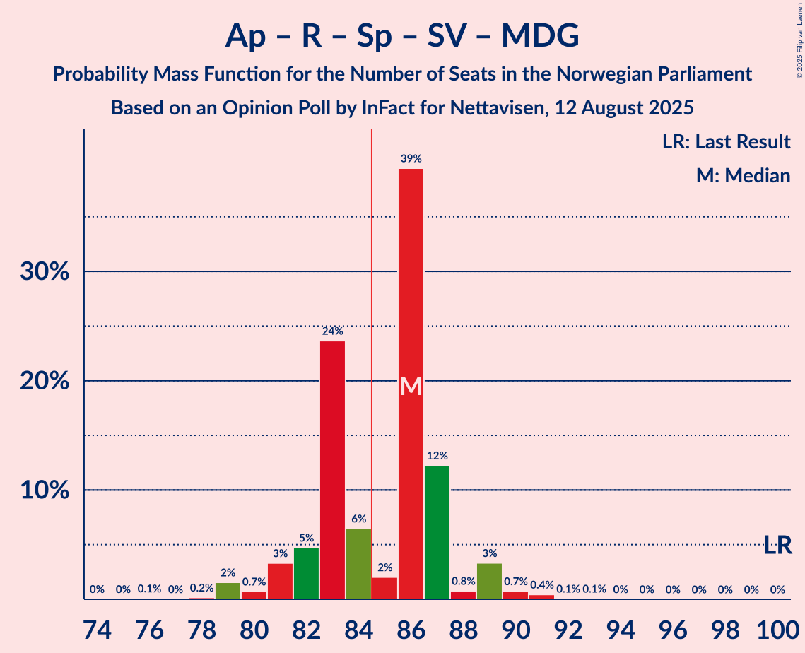
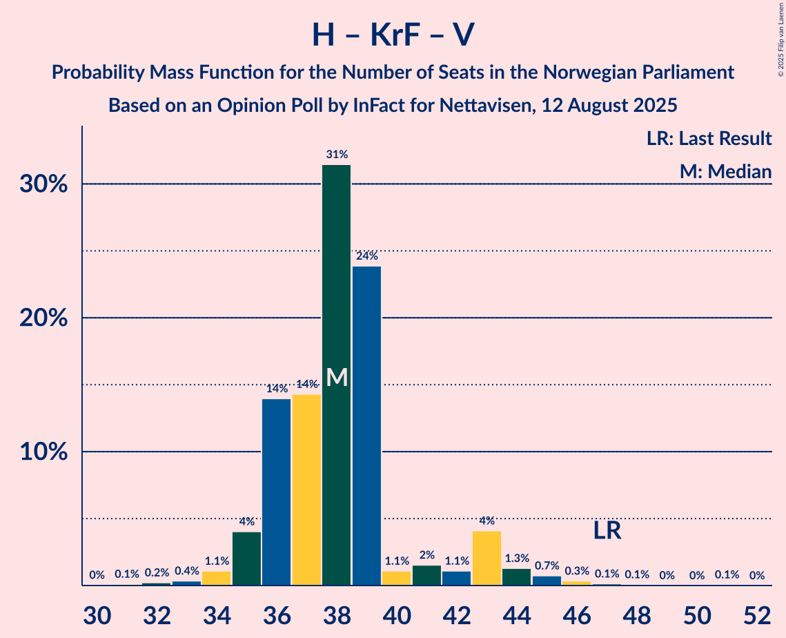

# Opinion Poll by InFact for Nettavisen, 12 August 2025

<a href="#voting-intentions">Voting Intentions</a> | <a href="#seats">Seats</a> | <a href="#coalitions">Coalitions</a> | <a href="#technical-information">Technical Information</a>

## Voting Intentions

### Confidence Intervals

| Party | Last Result | Poll Result | 80% Confidence Interval | 90% Confidence Interval | 95% Confidence Interval | 99% Confidence Interval |
|:-----:|:-----------:|:-----------:|:-----------------------:|:-----------------------:|:-----------------------:|:-----------------------:|
| Arbeiderpartiet | 26.2% | 26.9% | 25.2–28.6% |24.8–29.1% |24.4–29.5% |23.6–30.4% |
| Fremskrittspartiet | 11.6% | 23.8% | 22.3–25.5% |21.8–26.0% |21.4–26.4% |20.7–27.2% |
| Høyre | 20.4% | 13.1% | 11.9–14.5% |11.6–14.9% |11.3–15.2% |10.7–15.9% |
| Rødt | 4.7% | 5.7% | 4.9–6.7% |4.7–7.0% |4.5–7.2% |4.1–7.7% |
| Kristelig Folkeparti | 3.8% | 5.6% | 4.8–6.6% |4.6–6.9% |4.4–7.1% |4.1–7.6% |
| Senterpartiet | 13.5% | 5.6% | 4.8–6.6% |4.6–6.9% |4.4–7.1% |4.1–7.6% |
| Sosialistisk Venstreparti | 7.6% | 5.5% | 4.7–6.5% |4.5–6.8% |4.3–7.0% |4.0–7.5% |
| Venstre | 4.6% | 5.1% | 4.3–6.0% |4.1–6.3% |3.9–6.5% |3.6–7.0% |
| Miljøpartiet De Grønne | 3.9% | 3.7% | 3.0–4.5% |2.9–4.7% |2.7–4.9% |2.5–5.4% |
| Norgesdemokratene | 1.1% | 1.4% | 1.0–2.0% |0.9–2.1% |0.9–2.3% |0.7–2.6% |
| Konservativt | 0.4% | 0.8% | 0.5–1.2% |0.5–1.4% |0.4–1.5% |0.3–1.8% |
| Industri- og Næringspartiet | 0.3% | 0.8% | 0.5–1.2% |0.5–1.4% |0.4–1.5% |0.3–1.8% |
| Pensjonistpartiet | 0.6% | 0.6% | 0.4–1.0% |0.3–1.2% |0.3–1.3% |0.2–1.5% |

*Note:* The poll result column reflects the actual value used in the calculations. Published results may vary slightly, and in addition be rounded to fewer digits.

## Seats

### Confidence Intervals

| Party | Last Result | Median | 80% Confidence Interval | 90% Confidence Interval | 95% Confidence Interval | 99% Confidence Interval |
|:-----:|:-----------:|:------:|:-----------------------:|:-----------------------:|:-----------------------:|:-----------------------:|
| <a href="#arbeiderpartiet">Arbeiderpartiet</a> | 48 | 53 | 51–56 |50–58 |49–59 |46–59 |
| <a href="#fremskrittspartiet">Fremskrittspartiet</a> | 21 | 45 | 45–48 |44–49 |43–50 |41–52 |
| <a href="#høyre">Høyre</a> | 36 | 20 | 18–22 |18–24 |18–24 |18–27 |
| <a href="#rødt">Rødt</a> | 8 | 10 | 7–11 |7–11 |7–11 |7–12 |
| <a href="#kristelig-folkeparti">Kristelig Folkeparti</a> | 3 | 10 | 9–11 |8–11 |8–11 |3–13 |
| <a href="#senterpartiet">Senterpartiet</a> | 28 | 9 | 8–11 |6–12 |6–12 |1–13 |
| <a href="#sosialistisk-venstreparti">Sosialistisk Venstreparti</a> | 13 | 10 | 8–10 |8–10 |7–11 |2–12 |
| <a href="#venstre">Venstre</a> | 8 | 8 | 7–9 |7–9 |7–10 |6–11 |
| <a href="#miljøpartiet-de-grønne">Miljøpartiet De Grønne</a> | 3 | 3 | 2–6 |2–7 |2–7 |1–8 |
| <a href="#norgesdemokratene">Norgesdemokratene</a> | 0 | 0 | 0 |0 |0 |0 |
| <a href="#konservativt">Konservativt</a> | 0 | 0 | 0 |0 |0 |0 |
| <a href="#industri--og-næringspartiet">Industri- og Næringspartiet</a> | 0 | 0 | 0 |0 |0 |0 |
| <a href="#pensjonistpartiet">Pensjonistpartiet</a> | 0 | 0 | 0 |0 |0 |0 |

### Arbeiderpartiet

*For a full overview of the results for this party, see the [Arbeiderpartiet](party-arbeiderpartiet.html) page.*

| Number of Seats | Probability | Accumulated | Special Marks |
|:---------------:|:-----------:|:-----------:|:-------------:|
| 44 | 0% | 100% |  |
| 45 | 0.1% | 99.9% |  |
| 46 | 0.6% | 99.9% |  |
| 47 | 0.1% | 99.3% |  |
| 48 | 0.5% | 99.2% | Last Result |
| 49 | 2% | 98.7% |  |
| 50 | 3% | 97% |  |
| 51 | 31% | 94% |  |
| 52 | 7% | 63% |  |
| 53 | 7% | 56% | Median |
| 54 | 30% | 49% |  |
| 55 | 1.0% | 19% |  |
| 56 | 11% | 18% |  |
| 57 | 0.5% | 7% |  |
| 58 | 3% | 7% |  |
| 59 | 4% | 4% |  |
| 60 | 0% | 0.3% |  |
| 61 | 0% | 0.3% |  |
| 62 | 0.2% | 0.2% |  |
| 63 | 0% | 0.1% |  |
| 64 | 0% | 0% |  |

### Fremskrittspartiet

*For a full overview of the results for this party, see the [Fremskrittspartiet](party-fremskrittspartiet.html) page.*

| Number of Seats | Probability | Accumulated | Special Marks |
|:---------------:|:-----------:|:-----------:|:-------------:|
| 21 | 0% | 100% | Last Result |
| 22 | 0% | 100% |  |
| 23 | 0% | 100% |  |
| 24 | 0% | 100% |  |
| 25 | 0% | 100% |  |
| 26 | 0% | 100% |  |
| 27 | 0% | 100% |  |
| 28 | 0% | 100% |  |
| 29 | 0% | 100% |  |
| 30 | 0% | 100% |  |
| 31 | 0% | 100% |  |
| 32 | 0% | 100% |  |
| 33 | 0% | 100% |  |
| 34 | 0% | 100% |  |
| 35 | 0% | 100% |  |
| 36 | 0% | 100% |  |
| 37 | 0% | 100% |  |
| 38 | 0.1% | 100% |  |
| 39 | 0.1% | 99.8% |  |
| 40 | 0.1% | 99.8% |  |
| 41 | 0.4% | 99.6% |  |
| 42 | 1.1% | 99.2% |  |
| 43 | 2% | 98% |  |
| 44 | 6% | 96% |  |
| 45 | 43% | 90% | Median |
| 46 | 4% | 48% |  |
| 47 | 34% | 44% |  |
| 48 | 5% | 10% |  |
| 49 | 0.6% | 5% |  |
| 50 | 3% | 5% |  |
| 51 | 0.1% | 2% |  |
| 52 | 1.5% | 2% |  |
| 53 | 0.1% | 0.2% |  |
| 54 | 0% | 0% |  |

### Høyre

*For a full overview of the results for this party, see the [Høyre](party-høyre.html) page.*

| Number of Seats | Probability | Accumulated | Special Marks |
|:---------------:|:-----------:|:-----------:|:-------------:|
| 16 | 0.1% | 100% |  |
| 17 | 0.4% | 99.9% |  |
| 18 | 12% | 99.6% |  |
| 19 | 11% | 87% |  |
| 20 | 37% | 76% | Median |
| 21 | 28% | 39% |  |
| 22 | 3% | 11% |  |
| 23 | 3% | 9% |  |
| 24 | 5% | 6% |  |
| 25 | 0.1% | 1.2% |  |
| 26 | 0.3% | 1.1% |  |
| 27 | 0.5% | 0.9% |  |
| 28 | 0.2% | 0.3% |  |
| 29 | 0% | 0.1% |  |
| 30 | 0% | 0.1% |  |
| 31 | 0% | 0% |  |
| 32 | 0% | 0% |  |
| 33 | 0% | 0% |  |
| 34 | 0% | 0% |  |
| 35 | 0% | 0% |  |
| 36 | 0% | 0% | Last Result |

### Rødt

*For a full overview of the results for this party, see the [Rødt](party-rødt.html) page.*

| Number of Seats | Probability | Accumulated | Special Marks |
|:---------------:|:-----------:|:-----------:|:-------------:|
| 1 | 0.1% | 100% |  |
| 2 | 0% | 99.9% |  |
| 3 | 0% | 99.9% |  |
| 4 | 0% | 99.9% |  |
| 5 | 0% | 99.9% |  |
| 6 | 0.3% | 99.9% |  |
| 7 | 11% | 99.6% |  |
| 8 | 6% | 89% | Last Result |
| 9 | 15% | 83% |  |
| 10 | 36% | 69% | Median |
| 11 | 32% | 33% |  |
| 12 | 0.8% | 1.0% |  |
| 13 | 0.2% | 0.2% |  |
| 14 | 0% | 0% |  |

### Kristelig Folkeparti

*For a full overview of the results for this party, see the [Kristelig Folkeparti](party-kristeligfolkeparti.html) page.*

| Number of Seats | Probability | Accumulated | Special Marks |
|:---------------:|:-----------:|:-----------:|:-------------:|
| 3 | 0.5% | 100% | Last Result |
| 4 | 0% | 99.5% |  |
| 5 | 0% | 99.5% |  |
| 6 | 0% | 99.5% |  |
| 7 | 0.6% | 99.4% |  |
| 8 | 7% | 98.8% |  |
| 9 | 35% | 92% |  |
| 10 | 46% | 57% | Median |
| 11 | 9% | 11% |  |
| 12 | 0.8% | 2% |  |
| 13 | 1.0% | 1.2% |  |
| 14 | 0.2% | 0.2% |  |
| 15 | 0% | 0% |  |

### Senterpartiet

*For a full overview of the results for this party, see the [Senterpartiet](party-senterpartiet.html) page.*

| Number of Seats | Probability | Accumulated | Special Marks |
|:---------------:|:-----------:|:-----------:|:-------------:|
| 1 | 0.8% | 100% |  |
| 2 | 0.1% | 99.2% |  |
| 3 | 0% | 99.1% |  |
| 4 | 0% | 99.1% |  |
| 5 | 0% | 99.1% |  |
| 6 | 4% | 99.1% |  |
| 7 | 2% | 95% |  |
| 8 | 15% | 93% |  |
| 9 | 44% | 78% | Median |
| 10 | 2% | 34% |  |
| 11 | 24% | 32% |  |
| 12 | 6% | 7% |  |
| 13 | 0.5% | 0.8% |  |
| 14 | 0.2% | 0.2% |  |
| 15 | 0% | 0% |  |
| 16 | 0% | 0% |  |
| 17 | 0% | 0% |  |
| 18 | 0% | 0% |  |
| 19 | 0% | 0% |  |
| 20 | 0% | 0% |  |
| 21 | 0% | 0% |  |
| 22 | 0% | 0% |  |
| 23 | 0% | 0% |  |
| 24 | 0% | 0% |  |
| 25 | 0% | 0% |  |
| 26 | 0% | 0% |  |
| 27 | 0% | 0% |  |
| 28 | 0% | 0% | Last Result |

### Sosialistisk Venstreparti

*For a full overview of the results for this party, see the [Sosialistisk Venstreparti](party-sosialistiskvenstreparti.html) page.*

| Number of Seats | Probability | Accumulated | Special Marks |
|:---------------:|:-----------:|:-----------:|:-------------:|
| 2 | 0.5% | 100% |  |
| 3 | 0.1% | 99.5% |  |
| 4 | 0% | 99.3% |  |
| 5 | 0% | 99.3% |  |
| 6 | 0.5% | 99.3% |  |
| 7 | 2% | 98.8% |  |
| 8 | 35% | 97% |  |
| 9 | 6% | 62% |  |
| 10 | 52% | 55% | Median |
| 11 | 3% | 3% |  |
| 12 | 0.4% | 0.6% |  |
| 13 | 0.2% | 0.2% | Last Result |
| 14 | 0% | 0% |  |

### Venstre

*For a full overview of the results for this party, see the [Venstre](party-venstre.html) page.*

| Number of Seats | Probability | Accumulated | Special Marks |
|:---------------:|:-----------:|:-----------:|:-------------:|
| 3 | 0.5% | 100% |  |
| 4 | 0% | 99.5% |  |
| 5 | 0% | 99.5% |  |
| 6 | 0.8% | 99.5% |  |
| 7 | 16% | 98.7% |  |
| 8 | 48% | 83% | Last Result, Median |
| 9 | 30% | 34% |  |
| 10 | 3% | 5% |  |
| 11 | 1.3% | 1.4% |  |
| 12 | 0.1% | 0.1% |  |
| 13 | 0% | 0% |  |

### Miljøpartiet De Grønne

*For a full overview of the results for this party, see the [Miljøpartiet De Grønne](party-miljøpartietdegrønne.html) page.*

| Number of Seats | Probability | Accumulated | Special Marks |
|:---------------:|:-----------:|:-----------:|:-------------:|
| 1 | 0.8% | 100% |  |
| 2 | 38% | 99.2% |  |
| 3 | 32% | 61% | Last Result, Median |
| 4 | 0% | 29% |  |
| 5 | 0% | 29% |  |
| 6 | 21% | 29% |  |
| 7 | 7% | 8% |  |
| 8 | 0.7% | 0.7% |  |
| 9 | 0.1% | 0.1% |  |
| 10 | 0% | 0% |  |

### Norgesdemokratene

*For a full overview of the results for this party, see the [Norgesdemokratene](party-norgesdemokratene.html) page.*

| Number of Seats | Probability | Accumulated | Special Marks |
|:---------------:|:-----------:|:-----------:|:-------------:|
| 0 | 100% | 100% | Last Result, Median |

### Konservativt

*For a full overview of the results for this party, see the [Konservativt](party-konservativt.html) page.*

| Number of Seats | Probability | Accumulated | Special Marks |
|:---------------:|:-----------:|:-----------:|:-------------:|
| 0 | 100% | 100% | Last Result, Median |

### Industri- og Næringspartiet

*For a full overview of the results for this party, see the [Industri- og Næringspartiet](party-industri-ognæringspartiet.html) page.*

| Number of Seats | Probability | Accumulated | Special Marks |
|:---------------:|:-----------:|:-----------:|:-------------:|
| 0 | 100% | 100% | Last Result, Median |

### Pensjonistpartiet

*For a full overview of the results for this party, see the [Pensjonistpartiet](party-pensjonistpartiet.html) page.*

| Number of Seats | Probability | Accumulated | Special Marks |
|:---------------:|:-----------:|:-----------:|:-------------:|
| 0 | 100% | 100% | Last Result, Median |

## Coalitions

### Confidence Intervals

| Coalition | Last Result | Median | Majority? | 80% Confidence Interval | 90% Confidence Interval | 95% Confidence Interval | 99% Confidence Interval |
|:---------:|:-----------:|:------:|:---------:|:-----------------------:|:-----------------------:|:-----------------------:|:-----------------------:|
| Fremskrittspartiet – Høyre – Kristelig Folkeparti – Senterpartiet – Venstre | 96 | 92 | 100% | 90–97 | 90–97 | 90–99 | 88–99 |
| Fremskrittspartiet – Høyre – Kristelig Folkeparti – Venstre – Miljøpartiet De Grønne | 71 | 88 | 97% | 85–90 | 85–91 | 84–93 | 83–97 |
| Arbeiderpartiet – Kristelig Folkeparti – Senterpartiet – Sosialistisk Venstreparti – Miljøpartiet De Grønne | 95 | 85 | 59% | 82–90 | 82–90 | 80–90 | 78–91 |
| Arbeiderpartiet – Rødt – Senterpartiet – Sosialistisk Venstreparti – Miljøpartiet De Grønne | 100 | 86 | 59% | 82–87 | 81–88 | 80–89 | 79–91 |
| Fremskrittspartiet – Høyre – Kristelig Folkeparti – Venstre | 68 | 83 | 41% | 82–87 | 81–88 | 80–89 | 78–90 |
| Arbeiderpartiet – Rødt – Senterpartiet – Sosialistisk Venstreparti | 97 | 81 | 3% | 79–84 | 78–84 | 76–85 | 72–86 |
| Arbeiderpartiet – Kristelig Folkeparti – Senterpartiet – Miljøpartiet De Grønne | 82 | 75 | 0.2% | 74–80 | 72–80 | 71–80 | 69–82 |
| Arbeiderpartiet – Senterpartiet – Sosialistisk Venstreparti – Miljøpartiet De Grønne | 92 | 75 | 0.2% | 73–80 | 72–80 | 71–80 | 68–82 |
| Fremskrittspartiet – Høyre – Venstre | 65 | 73 | 0% | 72–77 | 72–78 | 71–80 | 69–81 |
| Arbeiderpartiet – Rødt – Sosialistisk Venstreparti – Miljøpartiet De Grønne | 72 | 77 | 0% | 72–79 | 72–79 | 70–79 | 70–81 |
| Arbeiderpartiet – Kristelig Folkeparti – Senterpartiet | 79 | 73 | 0% | 71–74 | 69–74 | 67–75 | 63–77 |
| Arbeiderpartiet – Senterpartiet – Sosialistisk Venstreparti | 89 | 73 | 0% | 70–74 | 69–74 | 66–75 | 61–77 |
| Fremskrittspartiet – Høyre | 57 | 65 | 0% | 64–69 | 63–70 | 63–72 | 61–72 |
| Arbeiderpartiet – Senterpartiet | 76 | 63 | 0% | 60–65 | 60–65 | 58–67 | 54–67 |
| Arbeiderpartiet – Sosialistisk Venstreparti | 61 | 63 | 0% | 59–66 | 58–66 | 58–67 | 53–68 |
| Høyre – Kristelig Folkeparti – Venstre | 47 | 38 | 0% | 36–40 | 35–43 | 35–44 | 33–46 |
| Kristelig Folkeparti – Senterpartiet – Venstre | 39 | 27 | 0% | 25–29 | 22–29 | 22–30 | 17–34 |

### Fremskrittspartiet – Høyre – Kristelig Folkeparti – Senterpartiet – Venstre

| Number of Seats | Probability | Accumulated | Special Marks |
|:---------------:|:-----------:|:-----------:|:-------------:|
| 85 | 0.1% | 100% | Majority |
| 86 | 0.2% | 99.9% |  |
| 87 | 0.1% | 99.7% |  |
| 88 | 0.4% | 99.6% |  |
| 89 | 1.0% | 99.2% |  |
| 90 | 10% | 98% |  |
| 91 | 8% | 88% |  |
| 92 | 41% | 81% | Median |
| 93 | 2% | 39% |  |
| 94 | 1.2% | 37% |  |
| 95 | 4% | 36% |  |
| 96 | 5% | 32% | Last Result |
| 97 | 23% | 27% |  |
| 98 | 0.9% | 4% |  |
| 99 | 2% | 3% |  |
| 100 | 0.1% | 0.4% |  |
| 101 | 0.2% | 0.3% |  |
| 102 | 0% | 0.1% |  |
| 103 | 0% | 0.1% |  |
| 104 | 0% | 0.1% |  |
| 105 | 0% | 0% |  |

### Fremskrittspartiet – Høyre – Kristelig Folkeparti – Venstre – Miljøpartiet De Grønne

| Number of Seats | Probability | Accumulated | Special Marks |
|:---------------:|:-----------:|:-----------:|:-------------:|
| 71 | 0% | 100% | Last Result |
| 72 | 0% | 100% |  |
| 73 | 0% | 100% |  |
| 74 | 0% | 100% |  |
| 75 | 0% | 100% |  |
| 76 | 0% | 100% |  |
| 77 | 0% | 100% |  |
| 78 | 0% | 100% |  |
| 79 | 0% | 100% |  |
| 80 | 0.1% | 99.9% |  |
| 81 | 0.1% | 99.9% |  |
| 82 | 0.1% | 99.8% |  |
| 83 | 0.3% | 99.7% |  |
| 84 | 2% | 99.4% |  |
| 85 | 30% | 97% | Majority |
| 86 | 4% | 67% | Median |
| 87 | 5% | 63% |  |
| 88 | 11% | 58% |  |
| 89 | 32% | 47% |  |
| 90 | 7% | 15% |  |
| 91 | 4% | 8% |  |
| 92 | 1.3% | 4% |  |
| 93 | 0.8% | 3% |  |
| 94 | 0.5% | 2% |  |
| 95 | 1.0% | 2% |  |
| 96 | 0.1% | 0.7% |  |
| 97 | 0.6% | 0.6% |  |
| 98 | 0% | 0% |  |

### Arbeiderpartiet – Kristelig Folkeparti – Senterpartiet – Sosialistisk Venstreparti – Miljøpartiet De Grønne

| Number of Seats | Probability | Accumulated | Special Marks |
|:---------------:|:-----------:|:-----------:|:-------------:|
| 75 | 0.1% | 100% |  |
| 76 | 0% | 99.9% |  |
| 77 | 0.1% | 99.9% |  |
| 78 | 0.9% | 99.8% |  |
| 79 | 1.0% | 98.9% |  |
| 80 | 1.2% | 98% |  |
| 81 | 2% | 97% |  |
| 82 | 26% | 95% |  |
| 83 | 1.2% | 69% |  |
| 84 | 9% | 68% |  |
| 85 | 32% | 59% | Median, Majority |
| 86 | 3% | 27% |  |
| 87 | 9% | 24% |  |
| 88 | 0.3% | 14% |  |
| 89 | 4% | 14% |  |
| 90 | 10% | 10% |  |
| 91 | 0.2% | 0.6% |  |
| 92 | 0.1% | 0.5% |  |
| 93 | 0.3% | 0.4% |  |
| 94 | 0% | 0.1% |  |
| 95 | 0% | 0% | Last Result |

### Arbeiderpartiet – Rødt – Senterpartiet – Sosialistisk Venstreparti – Miljøpartiet De Grønne

| Number of Seats | Probability | Accumulated | Special Marks |
|:---------------:|:-----------:|:-----------:|:-------------:|
| 75 | 0% | 100% |  |
| 76 | 0.1% | 99.9% |  |
| 77 | 0% | 99.8% |  |
| 78 | 0.2% | 99.8% |  |
| 79 | 2% | 99.7% |  |
| 80 | 0.7% | 98% |  |
| 81 | 3% | 97% |  |
| 82 | 5% | 94% |  |
| 83 | 24% | 89% |  |
| 84 | 6% | 66% |  |
| 85 | 2% | 59% | Median, Majority |
| 86 | 39% | 57% |  |
| 87 | 12% | 18% |  |
| 88 | 0.8% | 5% |  |
| 89 | 3% | 5% |  |
| 90 | 0.7% | 1.4% |  |
| 91 | 0.4% | 0.6% |  |
| 92 | 0.1% | 0.2% |  |
| 93 | 0.1% | 0.1% |  |
| 94 | 0% | 0% |  |
| 95 | 0% | 0% |  |
| 96 | 0% | 0% |  |
| 97 | 0% | 0% |  |
| 98 | 0% | 0% |  |
| 99 | 0% | 0% |  |
| 100 | 0% | 0% | Last Result |

### Fremskrittspartiet – Høyre – Kristelig Folkeparti – Venstre

| Number of Seats | Probability | Accumulated | Special Marks |
|:---------------:|:-----------:|:-----------:|:-------------:|
| 68 | 0% | 100% | Last Result |
| 69 | 0% | 100% |  |
| 70 | 0% | 100% |  |
| 71 | 0% | 100% |  |
| 72 | 0% | 100% |  |
| 73 | 0% | 100% |  |
| 74 | 0% | 100% |  |
| 75 | 0% | 100% |  |
| 76 | 0.1% | 100% |  |
| 77 | 0.1% | 99.9% |  |
| 78 | 0.4% | 99.8% |  |
| 79 | 0.7% | 99.4% |  |
| 80 | 3% | 98.6% |  |
| 81 | 0.8% | 95% |  |
| 82 | 12% | 95% |  |
| 83 | 39% | 82% | Median |
| 84 | 2% | 43% |  |
| 85 | 6% | 41% | Majority |
| 86 | 24% | 34% |  |
| 87 | 5% | 11% |  |
| 88 | 3% | 6% |  |
| 89 | 0.7% | 3% |  |
| 90 | 2% | 2% |  |
| 91 | 0.2% | 0.3% |  |
| 92 | 0% | 0.2% |  |
| 93 | 0.1% | 0.2% |  |
| 94 | 0% | 0.1% |  |
| 95 | 0% | 0% |  |

### Arbeiderpartiet – Rødt – Senterpartiet – Sosialistisk Venstreparti

| Number of Seats | Probability | Accumulated | Special Marks |
|:---------------:|:-----------:|:-----------:|:-------------:|
| 72 | 0.6% | 100% |  |
| 73 | 0.1% | 99.4% |  |
| 74 | 1.0% | 99.3% |  |
| 75 | 0.5% | 98% |  |
| 76 | 0.9% | 98% |  |
| 77 | 1.3% | 97% |  |
| 78 | 4% | 96% |  |
| 79 | 7% | 92% |  |
| 80 | 32% | 85% |  |
| 81 | 11% | 53% |  |
| 82 | 5% | 42% | Median |
| 83 | 4% | 37% |  |
| 84 | 30% | 33% |  |
| 85 | 2% | 3% | Majority |
| 86 | 0.3% | 0.6% |  |
| 87 | 0.1% | 0.3% |  |
| 88 | 0.1% | 0.2% |  |
| 89 | 0.1% | 0.1% |  |
| 90 | 0% | 0.1% |  |
| 91 | 0% | 0% |  |
| 92 | 0% | 0% |  |
| 93 | 0% | 0% |  |
| 94 | 0% | 0% |  |
| 95 | 0% | 0% |  |
| 96 | 0% | 0% |  |
| 97 | 0% | 0% | Last Result |

### Arbeiderpartiet – Kristelig Folkeparti – Senterpartiet – Miljøpartiet De Grønne

| Number of Seats | Probability | Accumulated | Special Marks |
|:---------------:|:-----------:|:-----------:|:-------------:|
| 66 | 0% | 100% |  |
| 67 | 0.1% | 99.9% |  |
| 68 | 0.3% | 99.9% |  |
| 69 | 0.3% | 99.5% |  |
| 70 | 0.9% | 99.3% |  |
| 71 | 3% | 98% |  |
| 72 | 1.1% | 96% |  |
| 73 | 2% | 95% |  |
| 74 | 28% | 92% |  |
| 75 | 30% | 65% | Median |
| 76 | 6% | 35% |  |
| 77 | 11% | 30% |  |
| 78 | 3% | 18% |  |
| 79 | 1.2% | 15% |  |
| 80 | 13% | 14% |  |
| 81 | 0.2% | 1.4% |  |
| 82 | 0.7% | 1.2% | Last Result |
| 83 | 0.2% | 0.4% |  |
| 84 | 0.1% | 0.3% |  |
| 85 | 0.1% | 0.2% | Majority |
| 86 | 0% | 0% |  |

### Arbeiderpartiet – Senterpartiet – Sosialistisk Venstreparti – Miljøpartiet De Grønne

| Number of Seats | Probability | Accumulated | Special Marks |
|:---------------:|:-----------:|:-----------:|:-------------:|
| 65 | 0% | 100% |  |
| 66 | 0.1% | 99.9% |  |
| 67 | 0.1% | 99.9% |  |
| 68 | 1.1% | 99.8% |  |
| 69 | 0.2% | 98.6% |  |
| 70 | 0.9% | 98% |  |
| 71 | 0.7% | 98% |  |
| 72 | 3% | 97% |  |
| 73 | 25% | 93% |  |
| 74 | 4% | 69% |  |
| 75 | 33% | 64% | Median |
| 76 | 10% | 31% |  |
| 77 | 6% | 21% |  |
| 78 | 0.9% | 15% |  |
| 79 | 0.6% | 15% |  |
| 80 | 13% | 14% |  |
| 81 | 0.3% | 0.9% |  |
| 82 | 0.2% | 0.6% |  |
| 83 | 0.1% | 0.4% |  |
| 84 | 0.2% | 0.4% |  |
| 85 | 0.2% | 0.2% | Majority |
| 86 | 0% | 0% |  |
| 87 | 0% | 0% |  |
| 88 | 0% | 0% |  |
| 89 | 0% | 0% |  |
| 90 | 0% | 0% |  |
| 91 | 0% | 0% |  |
| 92 | 0% | 0% | Last Result |

### Fremskrittspartiet – Høyre – Venstre

| Number of Seats | Probability | Accumulated | Special Marks |
|:---------------:|:-----------:|:-----------:|:-------------:|
| 65 | 0% | 100% | Last Result |
| 66 | 0% | 100% |  |
| 67 | 0% | 99.9% |  |
| 68 | 0.1% | 99.9% |  |
| 69 | 0.3% | 99.8% |  |
| 70 | 0.8% | 99.4% |  |
| 71 | 3% | 98.6% |  |
| 72 | 18% | 95% |  |
| 73 | 29% | 77% | Median |
| 74 | 5% | 48% |  |
| 75 | 0.9% | 42% |  |
| 76 | 8% | 42% |  |
| 77 | 28% | 34% |  |
| 78 | 2% | 6% |  |
| 79 | 0.7% | 4% |  |
| 80 | 2% | 3% |  |
| 81 | 0.8% | 1.2% |  |
| 82 | 0.2% | 0.4% |  |
| 83 | 0.1% | 0.2% |  |
| 84 | 0.1% | 0.1% |  |
| 85 | 0% | 0% | Majority |

### Arbeiderpartiet – Rødt – Sosialistisk Venstreparti – Miljøpartiet De Grønne

| Number of Seats | Probability | Accumulated | Special Marks |
|:---------------:|:-----------:|:-----------:|:-------------:|
| 65 | 0% | 100% |  |
| 66 | 0% | 99.9% |  |
| 67 | 0% | 99.9% |  |
| 68 | 0.2% | 99.9% |  |
| 69 | 0.1% | 99.7% |  |
| 70 | 2% | 99.6% |  |
| 71 | 0.9% | 97% |  |
| 72 | 23% | 96% | Last Result |
| 73 | 5% | 73% |  |
| 74 | 4% | 68% |  |
| 75 | 1.2% | 64% |  |
| 76 | 2% | 63% | Median |
| 77 | 41% | 61% |  |
| 78 | 8% | 19% |  |
| 79 | 10% | 12% |  |
| 80 | 1.0% | 2% |  |
| 81 | 0.4% | 0.8% |  |
| 82 | 0.1% | 0.4% |  |
| 83 | 0.2% | 0.3% |  |
| 84 | 0.1% | 0.1% |  |
| 85 | 0% | 0% | Majority |

### Arbeiderpartiet – Kristelig Folkeparti – Senterpartiet

| Number of Seats | Probability | Accumulated | Special Marks |
|:---------------:|:-----------:|:-----------:|:-------------:|
| 63 | 0.7% | 100% |  |
| 64 | 0.5% | 99.2% |  |
| 65 | 0.4% | 98.7% |  |
| 66 | 0.5% | 98% |  |
| 67 | 0.6% | 98% |  |
| 68 | 1.4% | 97% |  |
| 69 | 3% | 96% |  |
| 70 | 2% | 93% |  |
| 71 | 37% | 91% |  |
| 72 | 2% | 53% | Median |
| 73 | 30% | 51% |  |
| 74 | 17% | 22% |  |
| 75 | 3% | 5% |  |
| 76 | 1.1% | 2% |  |
| 77 | 0.2% | 0.6% |  |
| 78 | 0.3% | 0.5% |  |
| 79 | 0.1% | 0.2% | Last Result |
| 80 | 0% | 0.1% |  |
| 81 | 0% | 0.1% |  |
| 82 | 0% | 0% |  |

### Arbeiderpartiet – Senterpartiet – Sosialistisk Venstreparti

| Number of Seats | Probability | Accumulated | Special Marks |
|:---------------:|:-----------:|:-----------:|:-------------:|
| 61 | 0.5% | 100% |  |
| 62 | 0% | 99.5% |  |
| 63 | 0.1% | 99.5% |  |
| 64 | 0.2% | 99.4% |  |
| 65 | 1.3% | 99.2% |  |
| 66 | 0.5% | 98% |  |
| 67 | 1.2% | 97% |  |
| 68 | 0.6% | 96% |  |
| 69 | 3% | 96% |  |
| 70 | 35% | 92% |  |
| 71 | 5% | 57% |  |
| 72 | 1.1% | 52% | Median |
| 73 | 34% | 51% |  |
| 74 | 13% | 17% |  |
| 75 | 3% | 4% |  |
| 76 | 0.1% | 0.8% |  |
| 77 | 0.2% | 0.7% |  |
| 78 | 0.3% | 0.4% |  |
| 79 | 0.1% | 0.2% |  |
| 80 | 0% | 0.1% |  |
| 81 | 0% | 0.1% |  |
| 82 | 0% | 0.1% |  |
| 83 | 0% | 0% |  |
| 84 | 0% | 0% |  |
| 85 | 0% | 0% | Majority |
| 86 | 0% | 0% |  |
| 87 | 0% | 0% |  |
| 88 | 0% | 0% |  |
| 89 | 0% | 0% | Last Result |

### Fremskrittspartiet – Høyre

| Number of Seats | Probability | Accumulated | Special Marks |
|:---------------:|:-----------:|:-----------:|:-------------:|
| 57 | 0% | 100% | Last Result |
| 58 | 0% | 100% |  |
| 59 | 0.1% | 100% |  |
| 60 | 0.1% | 99.9% |  |
| 61 | 0.6% | 99.8% |  |
| 62 | 0.7% | 99.2% |  |
| 63 | 4% | 98.5% |  |
| 64 | 10% | 95% |  |
| 65 | 38% | 85% | Median |
| 66 | 4% | 47% |  |
| 67 | 4% | 43% |  |
| 68 | 28% | 39% |  |
| 69 | 5% | 11% |  |
| 70 | 3% | 6% |  |
| 71 | 0.5% | 3% |  |
| 72 | 2% | 3% |  |
| 73 | 0.2% | 0.4% |  |
| 74 | 0.2% | 0.2% |  |
| 75 | 0.1% | 0.1% |  |
| 76 | 0% | 0% |  |

### Arbeiderpartiet – Senterpartiet

| Number of Seats | Probability | Accumulated | Special Marks |
|:---------------:|:-----------:|:-----------:|:-------------:|
| 54 | 0.5% | 100% |  |
| 55 | 0.8% | 99.4% |  |
| 56 | 0.5% | 98.7% |  |
| 57 | 0.5% | 98% |  |
| 58 | 0.3% | 98% |  |
| 59 | 1.2% | 97% |  |
| 60 | 11% | 96% |  |
| 61 | 6% | 85% |  |
| 62 | 26% | 79% | Median |
| 63 | 30% | 52% |  |
| 64 | 11% | 22% |  |
| 65 | 8% | 12% |  |
| 66 | 0.8% | 4% |  |
| 67 | 2% | 3% |  |
| 68 | 0.1% | 0.4% |  |
| 69 | 0% | 0.4% |  |
| 70 | 0.2% | 0.3% |  |
| 71 | 0.1% | 0.2% |  |
| 72 | 0% | 0.1% |  |
| 73 | 0% | 0% |  |
| 74 | 0% | 0% |  |
| 75 | 0% | 0% |  |
| 76 | 0% | 0% | Last Result |

### Arbeiderpartiet – Sosialistisk Venstreparti

| Number of Seats | Probability | Accumulated | Special Marks |
|:---------------:|:-----------:|:-----------:|:-------------:|
| 53 | 0.6% | 100% |  |
| 54 | 0% | 99.4% |  |
| 55 | 0.6% | 99.3% |  |
| 56 | 0.2% | 98.7% |  |
| 57 | 0.3% | 98% |  |
| 58 | 4% | 98% |  |
| 59 | 23% | 94% |  |
| 60 | 2% | 71% |  |
| 61 | 11% | 69% | Last Result |
| 62 | 7% | 58% |  |
| 63 | 3% | 50% | Median |
| 64 | 30% | 47% |  |
| 65 | 1.0% | 18% |  |
| 66 | 12% | 17% |  |
| 67 | 4% | 5% |  |
| 68 | 0.2% | 0.6% |  |
| 69 | 0.1% | 0.4% |  |
| 70 | 0.2% | 0.3% |  |
| 71 | 0% | 0.1% |  |
| 72 | 0% | 0.1% |  |
| 73 | 0% | 0% |  |

### Høyre – Kristelig Folkeparti – Venstre

| Number of Seats | Probability | Accumulated | Special Marks |
|:---------------:|:-----------:|:-----------:|:-------------:|
| 31 | 0.1% | 100% |  |
| 32 | 0.2% | 99.8% |  |
| 33 | 0.4% | 99.6% |  |
| 34 | 1.1% | 99.3% |  |
| 35 | 4% | 98% |  |
| 36 | 14% | 94% |  |
| 37 | 14% | 80% |  |
| 38 | 31% | 66% | Median |
| 39 | 24% | 34% |  |
| 40 | 1.1% | 11% |  |
| 41 | 2% | 9% |  |
| 42 | 1.1% | 8% |  |
| 43 | 4% | 7% |  |
| 44 | 1.3% | 3% |  |
| 45 | 0.7% | 1.4% |  |
| 46 | 0.3% | 0.7% |  |
| 47 | 0.1% | 0.3% | Last Result |
| 48 | 0.1% | 0.2% |  |
| 49 | 0% | 0.1% |  |
| 50 | 0% | 0.1% |  |
| 51 | 0.1% | 0.1% |  |
| 52 | 0% | 0% |  |

### Kristelig Folkeparti – Senterpartiet – Venstre

| Number of Seats | Probability | Accumulated | Special Marks |
|:---------------:|:-----------:|:-----------:|:-------------:|
| 17 | 0.7% | 100% |  |
| 18 | 0% | 99.3% |  |
| 19 | 0.2% | 99.3% |  |
| 20 | 0.4% | 99.1% |  |
| 21 | 0.1% | 98.7% |  |
| 22 | 4% | 98.6% |  |
| 23 | 1.4% | 94% |  |
| 24 | 1.2% | 93% |  |
| 25 | 5% | 92% |  |
| 26 | 11% | 87% |  |
| 27 | 38% | 76% | Median |
| 28 | 6% | 38% |  |
| 29 | 28% | 32% |  |
| 30 | 2% | 4% |  |
| 31 | 0.5% | 2% |  |
| 32 | 0.7% | 2% |  |
| 33 | 0.4% | 1.0% |  |
| 34 | 0.6% | 0.6% |  |
| 35 | 0% | 0% |  |
| 36 | 0% | 0% |  |
| 37 | 0% | 0% |  |
| 38 | 0% | 0% |  |
| 39 | 0% | 0% | Last Result |

## Technical Information

### Opinion Poll

+ **Polling firm:** InFact
+ **Commissioner(s):** Nettavisen
+ **Fieldwork period:** 12 August 2025

### Calculations

+ **Sample size:** 1142
+ **Simulations done:** 2,097,152
+ **Error estimate:** 1.59%

