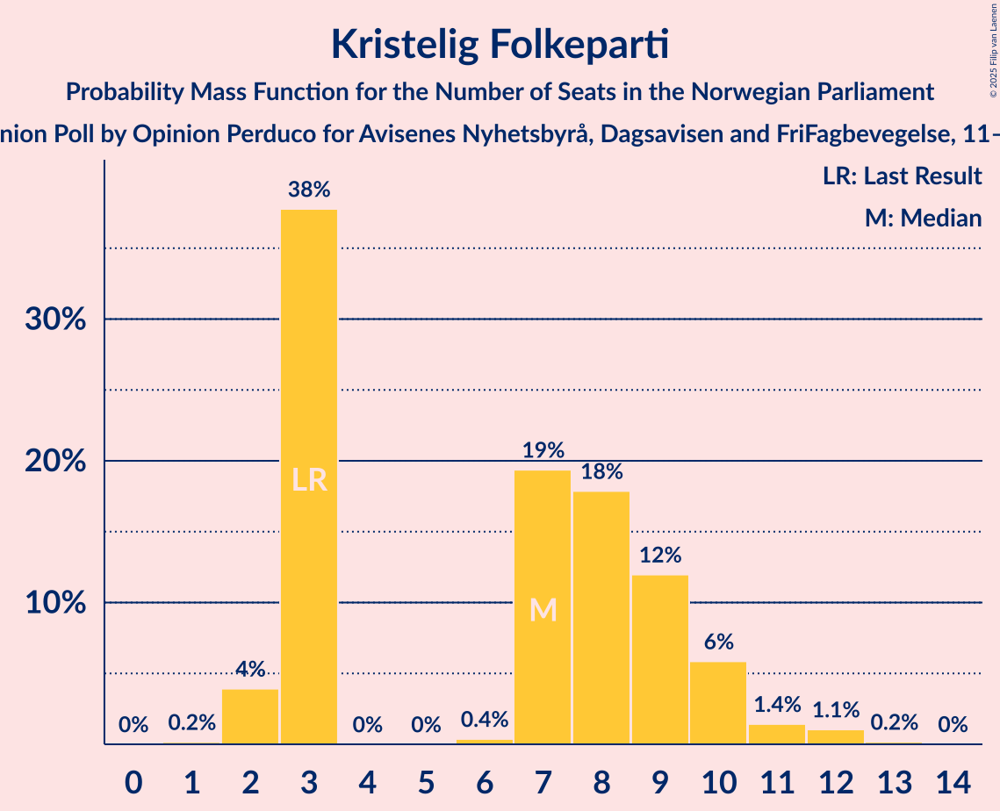
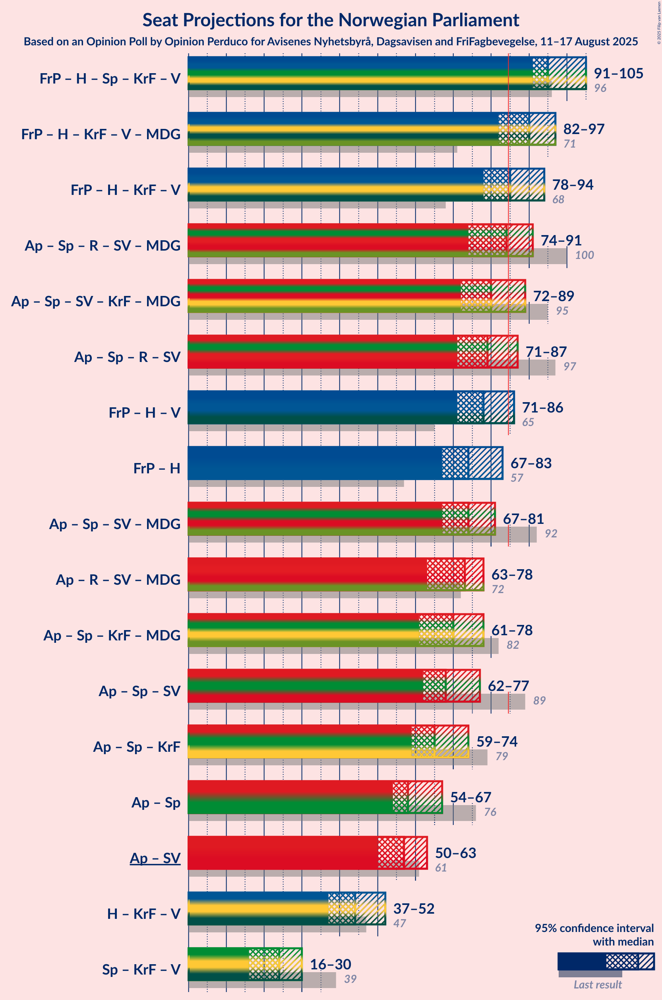
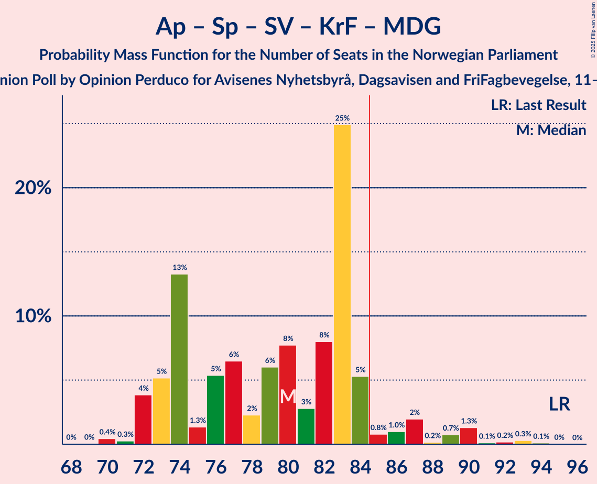
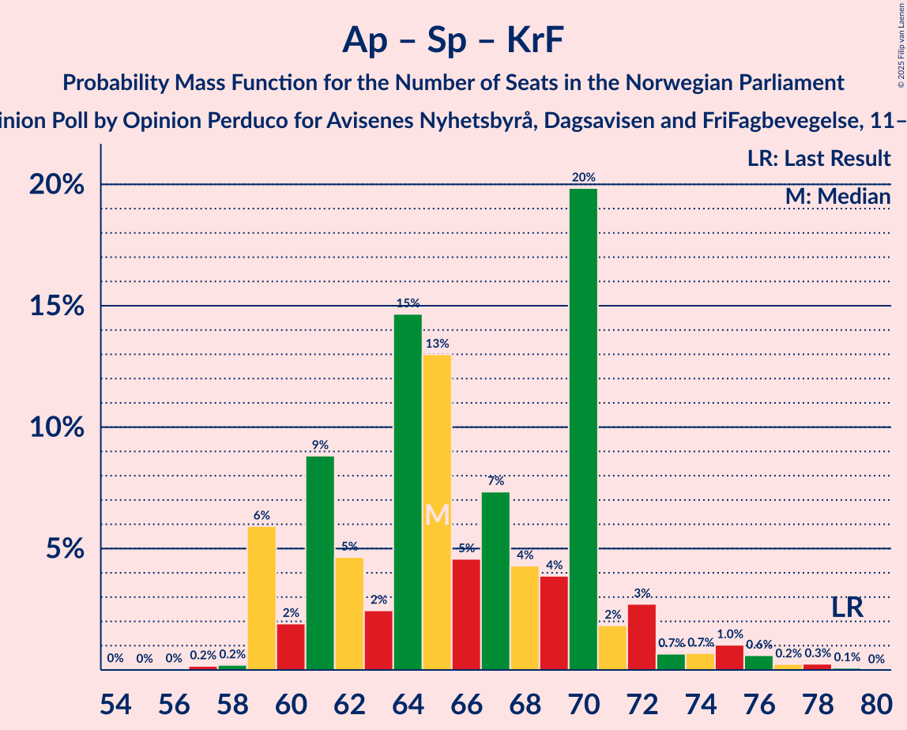
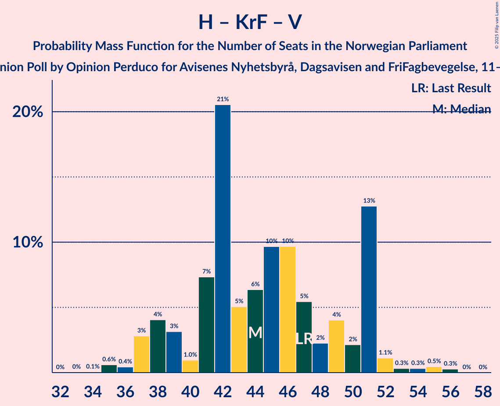

# Opinion Poll by Opinion Perduco for Avisenes Nyhetsbyrå, Dagsavisen and FriFagbevegelse, 11–17 August 2025

<a href="#voting-intentions">Voting Intentions</a> | <a href="#seats">Seats</a> | <a href="#coalitions">Coalitions</a> | <a href="#technical-information">Technical Information</a>

## Voting Intentions

### Confidence Intervals

| Party | Last Result | Poll Result | 80% Confidence Interval | 90% Confidence Interval | 95% Confidence Interval | 99% Confidence Interval |
|:-----:|:-----------:|:-----------:|:-----------------------:|:-----------------------:|:-----------------------:|:-----------------------:|
| Arbeiderpartiet | 26.2% | 24.8% | 22.9–26.8% |22.4–27.4% |22.0–27.9% |21.1–28.9% |
| Fremskrittspartiet | 11.6% | 21.5% | 19.7–23.4% |19.2–24.0% |18.8–24.4% |18.0–25.4% |
| Høyre | 20.4% | 17.9% | 16.3–19.7% |15.8–20.2% |15.4–20.7% |14.7–21.6% |
| Senterpartiet | 13.5% | 6.8% | 5.8–8.1% |5.5–8.4% |5.2–8.7% |4.8–9.4% |
| Sosialistisk Venstreparti | 7.6% | 5.6% | 4.6–6.7% |4.4–7.1% |4.2–7.4% |3.8–8.0% |
| Rødt | 4.7% | 5.6% | 4.6–6.7% |4.4–7.1% |4.2–7.4% |3.8–8.0% |
| Kristelig Folkeparti | 3.8% | 4.4% | 3.6–5.5% |3.4–5.8% |3.2–6.1% |2.9–6.7% |
| Venstre | 4.6% | 4.0% | 3.2–5.0% |3.0–5.3% |2.8–5.5% |2.5–6.1% |
| Miljøpartiet De Grønne | 3.9% | 3.6% | 2.9–4.6% |2.7–4.8% |2.5–5.1% |2.2–5.6% |
| Industri- og Næringspartiet | 0.3% | 1.2% | 0.9–1.9% |0.8–2.1% |0.7–2.3% |0.5–2.6% |
| Konservativt | 0.4% | 0.9% | 0.6–1.4% |0.5–1.6% |0.4–1.8% |0.3–2.1% |
| Pensjonistpartiet | 0.6% | 0.9% | 0.6–1.4% |0.5–1.6% |0.4–1.8% |0.3–2.1% |
| Norgesdemokratene | 1.1% | 0.6% | 0.4–1.1% |0.3–1.3% |0.3–1.4% |0.2–1.7% |

*Note:* The poll result column reflects the actual value used in the calculations. Published results may vary slightly, and in addition be rounded to fewer digits.

## Seats

### Confidence Intervals

| Party | Last Result | Median | 80% Confidence Interval | 90% Confidence Interval | 95% Confidence Interval | 99% Confidence Interval |
|:-----:|:-----------:|:------:|:-----------------------:|:-----------------------:|:-----------------------:|:-----------------------:|
| <a href="#arbeiderpartiet">Arbeiderpartiet</a> | 48 | 49 | 44–51 |43–51 |41–52 |40–55 |
| <a href="#fremskrittspartiet">Fremskrittspartiet</a> | 21 | 42 | 37–44 |37–45 |35–45 |34–47 |
| <a href="#høyre">Høyre</a> | 36 | 32 | 30–35 |29–37 |28–38 |25–39 |
| <a href="#senterpartiet">Senterpartiet</a> | 28 | 12 | 8–16 |8–16 |8–16 |7–17 |
| <a href="#sosialistisk-venstreparti">Sosialistisk Venstreparti</a> | 13 | 10 | 8–12 |8–13 |7–13 |3–14 |
| <a href="#rødt">Rødt</a> | 8 | 10 | 8–13 |8–15 |6–15 |1–15 |
| <a href="#kristelig-folkeparti">Kristelig Folkeparti</a> | 3 | 7 | 3–9 |3–10 |2–11 |2–12 |
| <a href="#venstre">Venstre</a> | 8 | 8 | 2–9 |2–9 |2–10 |2–11 |
| <a href="#miljøpartiet-de-grønne">Miljøpartiet De Grønne</a> | 3 | 3 | 2–8 |1–8 |1–8 |1–9 |
| <a href="#industri--og-næringspartiet">Industri- og Næringspartiet</a> | 0 | 0 | 0 |0 |0 |0–2 |
| <a href="#konservativt">Konservativt</a> | 0 | 0 | 0 |0 |0 |0 |
| <a href="#pensjonistpartiet">Pensjonistpartiet</a> | 0 | 0 | 0 |0 |0 |0 |
| <a href="#norgesdemokratene">Norgesdemokratene</a> | 0 | 0 | 0 |0 |0 |0 |

### Arbeiderpartiet

*For a full overview of the results for this party, see the [Arbeiderpartiet](party-arbeiderpartiet.html) page.*

| Number of Seats | Probability | Accumulated | Special Marks |
|:---------------:|:-----------:|:-----------:|:-------------:|
| 38 | 0.1% | 100% |  |
| 39 | 0.3% | 99.9% |  |
| 40 | 0.3% | 99.6% |  |
| 41 | 2% | 99.3% |  |
| 42 | 1.4% | 97% |  |
| 43 | 1.1% | 96% |  |
| 44 | 8% | 95% |  |
| 45 | 6% | 87% |  |
| 46 | 12% | 81% |  |
| 47 | 4% | 69% |  |
| 48 | 12% | 65% | Last Result |
| 49 | 26% | 53% | Median |
| 50 | 2% | 27% |  |
| 51 | 21% | 25% |  |
| 52 | 2% | 4% |  |
| 53 | 0.9% | 2% |  |
| 54 | 0.4% | 1.5% |  |
| 55 | 0.7% | 1.1% |  |
| 56 | 0.2% | 0.3% |  |
| 57 | 0% | 0.1% |  |
| 58 | 0.1% | 0.1% |  |
| 59 | 0% | 0% |  |

### Fremskrittspartiet

*For a full overview of the results for this party, see the [Fremskrittspartiet](party-fremskrittspartiet.html) page.*

| Number of Seats | Probability | Accumulated | Special Marks |
|:---------------:|:-----------:|:-----------:|:-------------:|
| 21 | 0% | 100% | Last Result |
| 22 | 0% | 100% |  |
| 23 | 0% | 100% |  |
| 24 | 0% | 100% |  |
| 25 | 0% | 100% |  |
| 26 | 0% | 100% |  |
| 27 | 0% | 100% |  |
| 28 | 0% | 100% |  |
| 29 | 0% | 100% |  |
| 30 | 0% | 100% |  |
| 31 | 0% | 100% |  |
| 32 | 0% | 100% |  |
| 33 | 0.2% | 100% |  |
| 34 | 1.4% | 99.8% |  |
| 35 | 1.4% | 98% |  |
| 36 | 1.3% | 97% |  |
| 37 | 22% | 96% |  |
| 38 | 3% | 74% |  |
| 39 | 11% | 71% |  |
| 40 | 3% | 60% |  |
| 41 | 6% | 57% |  |
| 42 | 27% | 51% | Median |
| 43 | 8% | 24% |  |
| 44 | 10% | 17% |  |
| 45 | 4% | 6% |  |
| 46 | 0.7% | 2% |  |
| 47 | 1.1% | 1.3% |  |
| 48 | 0.1% | 0.3% |  |
| 49 | 0.1% | 0.1% |  |
| 50 | 0.1% | 0.1% |  |
| 51 | 0% | 0% |  |

### Høyre

*For a full overview of the results for this party, see the [Høyre](party-høyre.html) page.*

| Number of Seats | Probability | Accumulated | Special Marks |
|:---------------:|:-----------:|:-----------:|:-------------:|
| 23 | 0% | 100% |  |
| 24 | 0% | 99.9% |  |
| 25 | 0.7% | 99.9% |  |
| 26 | 0.3% | 99.2% |  |
| 27 | 1.3% | 98.9% |  |
| 28 | 1.3% | 98% |  |
| 29 | 5% | 96% |  |
| 30 | 5% | 91% |  |
| 31 | 32% | 86% |  |
| 32 | 9% | 55% | Median |
| 33 | 9% | 46% |  |
| 34 | 9% | 37% |  |
| 35 | 20% | 28% |  |
| 36 | 0.9% | 8% | Last Result |
| 37 | 2% | 7% |  |
| 38 | 4% | 4% |  |
| 39 | 0.6% | 0.9% |  |
| 40 | 0.2% | 0.4% |  |
| 41 | 0% | 0.2% |  |
| 42 | 0.2% | 0.2% |  |
| 43 | 0% | 0% |  |

### Senterpartiet

*For a full overview of the results for this party, see the [Senterpartiet](party-senterpartiet.html) page.*

| Number of Seats | Probability | Accumulated | Special Marks |
|:---------------:|:-----------:|:-----------:|:-------------:|
| 7 | 0.8% | 100% |  |
| 8 | 17% | 99.2% |  |
| 9 | 8% | 82% |  |
| 10 | 6% | 74% |  |
| 11 | 12% | 68% |  |
| 12 | 16% | 56% | Median |
| 13 | 10% | 39% |  |
| 14 | 5% | 29% |  |
| 15 | 5% | 25% |  |
| 16 | 19% | 20% |  |
| 17 | 0.4% | 0.6% |  |
| 18 | 0.2% | 0.3% |  |
| 19 | 0.1% | 0.1% |  |
| 20 | 0% | 0% |  |
| 21 | 0% | 0% |  |
| 22 | 0% | 0% |  |
| 23 | 0% | 0% |  |
| 24 | 0% | 0% |  |
| 25 | 0% | 0% |  |
| 26 | 0% | 0% |  |
| 27 | 0% | 0% |  |
| 28 | 0% | 0% | Last Result |

### Sosialistisk Venstreparti

*For a full overview of the results for this party, see the [Sosialistisk Venstreparti](party-sosialistiskvenstreparti.html) page.*

| Number of Seats | Probability | Accumulated | Special Marks |
|:---------------:|:-----------:|:-----------:|:-------------:|
| 1 | 0.4% | 100% |  |
| 2 | 0.1% | 99.6% |  |
| 3 | 0.4% | 99.5% |  |
| 4 | 0.3% | 99.1% |  |
| 5 | 0% | 98.8% |  |
| 6 | 0% | 98.8% |  |
| 7 | 1.4% | 98.7% |  |
| 8 | 30% | 97% |  |
| 9 | 11% | 68% |  |
| 10 | 33% | 57% | Median |
| 11 | 9% | 24% |  |
| 12 | 8% | 15% |  |
| 13 | 6% | 7% | Last Result |
| 14 | 1.0% | 1.2% |  |
| 15 | 0.1% | 0.2% |  |
| 16 | 0% | 0.2% |  |
| 17 | 0.1% | 0.1% |  |
| 18 | 0% | 0% |  |

### Rødt

*For a full overview of the results for this party, see the [Rødt](party-rødt.html) page.*

| Number of Seats | Probability | Accumulated | Special Marks |
|:---------------:|:-----------:|:-----------:|:-------------:|
| 1 | 0.9% | 100% |  |
| 2 | 1.4% | 99.1% |  |
| 3 | 0.1% | 98% |  |
| 4 | 0.1% | 98% |  |
| 5 | 0% | 98% |  |
| 6 | 0.1% | 98% |  |
| 7 | 2% | 97% |  |
| 8 | 9% | 96% | Last Result |
| 9 | 21% | 87% |  |
| 10 | 32% | 65% | Median |
| 11 | 16% | 33% |  |
| 12 | 6% | 18% |  |
| 13 | 6% | 11% |  |
| 14 | 0.5% | 6% |  |
| 15 | 5% | 5% |  |
| 16 | 0% | 0% |  |

### Kristelig Folkeparti

*For a full overview of the results for this party, see the [Kristelig Folkeparti](party-kristeligfolkeparti.html) page.*

| Number of Seats | Probability | Accumulated | Special Marks |
|:---------------:|:-----------:|:-----------:|:-------------:|
| 1 | 0.2% | 100% |  |
| 2 | 4% | 99.8% |  |
| 3 | 38% | 96% | Last Result |
| 4 | 0% | 58% |  |
| 5 | 0% | 58% |  |
| 6 | 0.4% | 58% |  |
| 7 | 19% | 58% | Median |
| 8 | 18% | 38% |  |
| 9 | 12% | 21% |  |
| 10 | 6% | 9% |  |
| 11 | 1.4% | 3% |  |
| 12 | 1.1% | 1.2% |  |
| 13 | 0.2% | 0.2% |  |
| 14 | 0% | 0% |  |

### Venstre

*For a full overview of the results for this party, see the [Venstre](party-venstre.html) page.*

| Number of Seats | Probability | Accumulated | Special Marks |
|:---------------:|:-----------:|:-----------:|:-------------:|
| 2 | 11% | 100% |  |
| 3 | 29% | 89% |  |
| 4 | 0% | 60% |  |
| 5 | 0% | 60% |  |
| 6 | 0.2% | 60% |  |
| 7 | 7% | 60% |  |
| 8 | 34% | 53% | Last Result, Median |
| 9 | 16% | 19% |  |
| 10 | 1.4% | 3% |  |
| 11 | 1.0% | 1.2% |  |
| 12 | 0.1% | 0.1% |  |
| 13 | 0% | 0% |  |

### Miljøpartiet De Grønne

*For a full overview of the results for this party, see the [Miljøpartiet De Grønne](party-miljøpartietdegrønne.html) page.*

| Number of Seats | Probability | Accumulated | Special Marks |
|:---------------:|:-----------:|:-----------:|:-------------:|
| 1 | 6% | 100% |  |
| 2 | 22% | 94% |  |
| 3 | 45% | 72% | Last Result, Median |
| 4 | 0% | 27% |  |
| 5 | 0% | 27% |  |
| 6 | 0.9% | 27% |  |
| 7 | 6% | 26% |  |
| 8 | 18% | 20% |  |
| 9 | 2% | 2% |  |
| 10 | 0.3% | 0.4% |  |
| 11 | 0.1% | 0.2% |  |
| 12 | 0% | 0% |  |

### Industri- og Næringspartiet

*For a full overview of the results for this party, see the [Industri- og Næringspartiet](party-industri-ognæringspartiet.html) page.*

| Number of Seats | Probability | Accumulated | Special Marks |
|:---------------:|:-----------:|:-----------:|:-------------:|
| 0 | 98.7% | 100% | Last Result, Median |
| 1 | 0.5% | 1.3% |  |
| 2 | 0.8% | 0.8% |  |
| 3 | 0% | 0% |  |

### Konservativt

*For a full overview of the results for this party, see the [Konservativt](party-konservativt.html) page.*

| Number of Seats | Probability | Accumulated | Special Marks |
|:---------------:|:-----------:|:-----------:|:-------------:|
| 0 | 100% | 100% | Last Result, Median |

### Pensjonistpartiet

*For a full overview of the results for this party, see the [Pensjonistpartiet](party-pensjonistpartiet.html) page.*

| Number of Seats | Probability | Accumulated | Special Marks |
|:---------------:|:-----------:|:-----------:|:-------------:|
| 0 | 99.8% | 100% | Last Result, Median |
| 1 | 0.2% | 0.2% |  |
| 2 | 0% | 0% |  |

### Norgesdemokratene

*For a full overview of the results for this party, see the [Norgesdemokratene](party-norgesdemokratene.html) page.*

| Number of Seats | Probability | Accumulated | Special Marks |
|:---------------:|:-----------:|:-----------:|:-------------:|
| 0 | 100% | 100% | Last Result, Median |

## Coalitions

### Confidence Intervals

| Coalition | Last Result | Median | Majority? | 80% Confidence Interval | 90% Confidence Interval | 95% Confidence Interval | 99% Confidence Interval |
|:---------:|:-----------:|:------:|:---------:|:-----------------------:|:-----------------------:|:-----------------------:|:-----------------------:|
| Fremskrittspartiet – Høyre – Senterpartiet – Kristelig Folkeparti – Venstre | 96 | 95 | 100% | 93–101 | 92–103 | 91–105 | 89–107 |
| Fremskrittspartiet – Høyre – Kristelig Folkeparti – Venstre – Miljøpartiet De Grønne | 71 | 90 | 75% | 82–95 | 82–96 | 82–97 | 80–99 |
| Fremskrittspartiet – Høyre – Kristelig Folkeparti – Venstre | 68 | 85 | 52% | 79–93 | 79–93 | 78–94 | 76–96 |
| Arbeiderpartiet – Senterpartiet – Rødt – Sosialistisk Venstreparti – Miljøpartiet De Grønne | 100 | 84 | 47% | 76–90 | 76–90 | 74–91 | 72–93 |
| Arbeiderpartiet – Senterpartiet – Sosialistisk Venstreparti – Kristelig Folkeparti – Miljøpartiet De Grønne | 95 | 80 | 7% | 74–84 | 73–86 | 72–89 | 70–92 |
| Arbeiderpartiet – Senterpartiet – Rødt – Sosialistisk Venstreparti | 97 | 79 | 24% | 74–87 | 73–87 | 71–87 | 69–89 |
| Fremskrittspartiet – Høyre – Venstre | 65 | 78 | 19% | 76–86 | 74–86 | 71–86 | 70–87 |
| Fremskrittspartiet – Høyre | 57 | 74 | 0.1% | 68–77 | 68–79 | 67–83 | 65–83 |
| Arbeiderpartiet – Senterpartiet – Sosialistisk Venstreparti – Miljøpartiet De Grønne | 92 | 74 | 0.1% | 67–80 | 67–80 | 67–81 | 63–83 |
| Arbeiderpartiet – Rødt – Sosialistisk Venstreparti – Miljøpartiet De Grønne | 72 | 73 | 0% | 68–76 | 66–77 | 63–78 | 61–80 |
| Arbeiderpartiet – Senterpartiet – Kristelig Folkeparti – Miljøpartiet De Grønne | 82 | 70 | 0% | 64–75 | 61–76 | 61–78 | 61–81 |
| Arbeiderpartiet – Senterpartiet – Sosialistisk Venstreparti | 89 | 68 | 0% | 65–77 | 64–77 | 62–77 | 60–79 |
| Arbeiderpartiet – Senterpartiet – Kristelig Folkeparti | 79 | 65 | 0% | 61–70 | 59–72 | 59–74 | 59–77 |
| Arbeiderpartiet – Senterpartiet | 76 | 58 | 0% | 56–67 | 55–67 | 54–67 | 52–69 |
| Arbeiderpartiet – Sosialistisk Venstreparti | 61 | 57 | 0% | 54–61 | 53–61 | 50–63 | 48–65 |
| Høyre – Kristelig Folkeparti – Venstre | 47 | 44 | 0% | 39–51 | 38–51 | 37–52 | 35–55 |
| Senterpartiet – Kristelig Folkeparti – Venstre | 39 | 24 | 0% | 18–28 | 18–30 | 16–30 | 16–33 |

### Fremskrittspartiet – Høyre – Senterpartiet – Kristelig Folkeparti – Venstre

| Number of Seats | Probability | Accumulated | Special Marks |
|:---------------:|:-----------:|:-----------:|:-------------:|
| 86 | 0% | 100% |  |
| 87 | 0.1% | 99.9% |  |
| 88 | 0.1% | 99.9% |  |
| 89 | 0.3% | 99.8% |  |
| 90 | 0.7% | 99.5% |  |
| 91 | 2% | 98.8% |  |
| 92 | 4% | 97% |  |
| 93 | 4% | 93% |  |
| 94 | 6% | 89% |  |
| 95 | 33% | 82% |  |
| 96 | 4% | 49% | Last Result |
| 97 | 3% | 45% |  |
| 98 | 7% | 42% |  |
| 99 | 6% | 34% |  |
| 100 | 2% | 29% |  |
| 101 | 20% | 26% | Median |
| 102 | 1.2% | 6% |  |
| 103 | 1.5% | 5% |  |
| 104 | 0.4% | 4% |  |
| 105 | 1.1% | 3% |  |
| 106 | 0.6% | 2% |  |
| 107 | 1.2% | 2% |  |
| 108 | 0.3% | 0.4% |  |
| 109 | 0% | 0.2% |  |
| 110 | 0.1% | 0.1% |  |
| 111 | 0% | 0.1% |  |
| 112 | 0% | 0% |  |

### Fremskrittspartiet – Høyre – Kristelig Folkeparti – Venstre – Miljøpartiet De Grønne

| Number of Seats | Probability | Accumulated | Special Marks |
|:---------------:|:-----------:|:-----------:|:-------------:|
| 71 | 0% | 100% | Last Result |
| 72 | 0% | 100% |  |
| 73 | 0% | 100% |  |
| 74 | 0% | 100% |  |
| 75 | 0% | 100% |  |
| 76 | 0% | 100% |  |
| 77 | 0% | 100% |  |
| 78 | 0.1% | 99.9% |  |
| 79 | 0.2% | 99.8% |  |
| 80 | 0.6% | 99.7% |  |
| 81 | 0.3% | 99.1% |  |
| 82 | 19% | 98.8% |  |
| 83 | 3% | 80% |  |
| 84 | 0.8% | 76% |  |
| 85 | 8% | 75% | Majority |
| 86 | 2% | 67% |  |
| 87 | 3% | 65% |  |
| 88 | 2% | 63% |  |
| 89 | 4% | 60% |  |
| 90 | 14% | 56% |  |
| 91 | 2% | 42% |  |
| 92 | 6% | 39% | Median |
| 93 | 8% | 33% |  |
| 94 | 7% | 25% |  |
| 95 | 14% | 19% |  |
| 96 | 0.6% | 5% |  |
| 97 | 3% | 4% |  |
| 98 | 1.2% | 2% |  |
| 99 | 0.2% | 0.7% |  |
| 100 | 0.2% | 0.5% |  |
| 101 | 0.2% | 0.2% |  |
| 102 | 0% | 0.1% |  |
| 103 | 0% | 0% |  |

### Fremskrittspartiet – Høyre – Kristelig Folkeparti – Venstre

| Number of Seats | Probability | Accumulated | Special Marks |
|:---------------:|:-----------:|:-----------:|:-------------:|
| 68 | 0% | 100% | Last Result |
| 69 | 0% | 100% |  |
| 70 | 0% | 100% |  |
| 71 | 0% | 100% |  |
| 72 | 0% | 100% |  |
| 73 | 0.1% | 100% |  |
| 74 | 0% | 99.9% |  |
| 75 | 0.1% | 99.9% |  |
| 76 | 0.4% | 99.8% |  |
| 77 | 1.0% | 99.4% |  |
| 78 | 1.0% | 98% |  |
| 79 | 19% | 97% |  |
| 80 | 3% | 78% |  |
| 81 | 3% | 75% |  |
| 82 | 7% | 71% |  |
| 83 | 9% | 64% |  |
| 84 | 3% | 55% |  |
| 85 | 8% | 52% | Majority |
| 86 | 6% | 44% |  |
| 87 | 7% | 39% |  |
| 88 | 2% | 31% |  |
| 89 | 7% | 30% | Median |
| 90 | 2% | 22% |  |
| 91 | 5% | 21% |  |
| 92 | 0.3% | 16% |  |
| 93 | 13% | 16% |  |
| 94 | 1.2% | 3% |  |
| 95 | 1.2% | 2% |  |
| 96 | 0.5% | 0.6% |  |
| 97 | 0.1% | 0.1% |  |
| 98 | 0% | 0% |  |

### Arbeiderpartiet – Senterpartiet – Rødt – Sosialistisk Venstreparti – Miljøpartiet De Grønne

| Number of Seats | Probability | Accumulated | Special Marks |
|:---------------:|:-----------:|:-----------:|:-------------:|
| 71 | 0.1% | 100% |  |
| 72 | 0.4% | 99.9% |  |
| 73 | 0.4% | 99.4% |  |
| 74 | 2% | 99.1% |  |
| 75 | 0.3% | 97% |  |
| 76 | 13% | 97% |  |
| 77 | 0.7% | 84% |  |
| 78 | 6% | 84% |  |
| 79 | 2% | 78% |  |
| 80 | 6% | 76% |  |
| 81 | 2% | 69% |  |
| 82 | 8% | 67% |  |
| 83 | 6% | 59% |  |
| 84 | 6% | 53% | Median |
| 85 | 7% | 47% | Majority |
| 86 | 4% | 39% |  |
| 87 | 7% | 35% |  |
| 88 | 3% | 28% |  |
| 89 | 3% | 25% |  |
| 90 | 19% | 22% |  |
| 91 | 1.1% | 3% |  |
| 92 | 0.9% | 1.4% |  |
| 93 | 0.3% | 0.6% |  |
| 94 | 0.1% | 0.2% |  |
| 95 | 0% | 0.1% |  |
| 96 | 0.1% | 0.1% |  |
| 97 | 0% | 0% |  |
| 98 | 0% | 0% |  |
| 99 | 0% | 0% |  |
| 100 | 0% | 0% | Last Result |

### Arbeiderpartiet – Senterpartiet – Sosialistisk Venstreparti – Kristelig Folkeparti – Miljøpartiet De Grønne

| Number of Seats | Probability | Accumulated | Special Marks |
|:---------------:|:-----------:|:-----------:|:-------------:|
| 68 | 0% | 100% |  |
| 69 | 0% | 99.9% |  |
| 70 | 0.4% | 99.9% |  |
| 71 | 0.3% | 99.5% |  |
| 72 | 4% | 99.2% |  |
| 73 | 5% | 95% |  |
| 74 | 13% | 90% |  |
| 75 | 1.3% | 77% |  |
| 76 | 5% | 76% |  |
| 77 | 6% | 70% |  |
| 78 | 2% | 64% |  |
| 79 | 6% | 61% |  |
| 80 | 8% | 55% |  |
| 81 | 3% | 48% | Median |
| 82 | 8% | 45% |  |
| 83 | 25% | 37% |  |
| 84 | 5% | 12% |  |
| 85 | 0.8% | 7% | Majority |
| 86 | 1.0% | 6% |  |
| 87 | 2% | 5% |  |
| 88 | 0.2% | 3% |  |
| 89 | 0.7% | 3% |  |
| 90 | 1.3% | 2% |  |
| 91 | 0.1% | 0.7% |  |
| 92 | 0.2% | 0.6% |  |
| 93 | 0.3% | 0.4% |  |
| 94 | 0.1% | 0.1% |  |
| 95 | 0% | 0% | Last Result |

### Arbeiderpartiet – Senterpartiet – Rødt – Sosialistisk Venstreparti

| Number of Seats | Probability | Accumulated | Special Marks |
|:---------------:|:-----------:|:-----------:|:-------------:|
| 66 | 0% | 100% |  |
| 67 | 0.2% | 99.9% |  |
| 68 | 0.1% | 99.8% |  |
| 69 | 0.4% | 99.7% |  |
| 70 | 0.3% | 99.3% |  |
| 71 | 3% | 99.0% |  |
| 72 | 0.8% | 96% |  |
| 73 | 1.3% | 95% |  |
| 74 | 13% | 94% |  |
| 75 | 9% | 81% |  |
| 76 | 6% | 72% |  |
| 77 | 6% | 66% |  |
| 78 | 3% | 60% |  |
| 79 | 13% | 57% |  |
| 80 | 4% | 43% |  |
| 81 | 2% | 39% | Median |
| 82 | 3% | 37% |  |
| 83 | 6% | 33% |  |
| 84 | 3% | 27% |  |
| 85 | 0.8% | 24% | Majority |
| 86 | 3% | 23% |  |
| 87 | 19% | 20% |  |
| 88 | 0.2% | 1.1% |  |
| 89 | 0.5% | 0.9% |  |
| 90 | 0.2% | 0.3% |  |
| 91 | 0.1% | 0.1% |  |
| 92 | 0% | 0.1% |  |
| 93 | 0% | 0% |  |
| 94 | 0% | 0% |  |
| 95 | 0% | 0% |  |
| 96 | 0% | 0% |  |
| 97 | 0% | 0% | Last Result |

### Fremskrittspartiet – Høyre – Venstre

| Number of Seats | Probability | Accumulated | Special Marks |
|:---------------:|:-----------:|:-----------:|:-------------:|
| 65 | 0.1% | 100% | Last Result |
| 66 | 0% | 99.9% |  |
| 67 | 0.1% | 99.9% |  |
| 68 | 0.1% | 99.8% |  |
| 69 | 0.2% | 99.7% |  |
| 70 | 2% | 99.5% |  |
| 71 | 0.5% | 98% |  |
| 72 | 0.9% | 97% |  |
| 73 | 0.9% | 96% |  |
| 74 | 3% | 95% |  |
| 75 | 1.2% | 93% |  |
| 76 | 30% | 91% |  |
| 77 | 5% | 61% |  |
| 78 | 7% | 56% |  |
| 79 | 10% | 49% |  |
| 80 | 10% | 39% |  |
| 81 | 2% | 30% |  |
| 82 | 2% | 27% | Median |
| 83 | 6% | 25% |  |
| 84 | 0.9% | 20% |  |
| 85 | 1.4% | 19% | Majority |
| 86 | 16% | 17% |  |
| 87 | 0.6% | 0.9% |  |
| 88 | 0.1% | 0.3% |  |
| 89 | 0% | 0.2% |  |
| 90 | 0.1% | 0.2% |  |
| 91 | 0% | 0.1% |  |
| 92 | 0% | 0% |  |

### Fremskrittspartiet – Høyre

| Number of Seats | Probability | Accumulated | Special Marks |
|:---------------:|:-----------:|:-----------:|:-------------:|
| 57 | 0% | 100% | Last Result |
| 58 | 0% | 100% |  |
| 59 | 0% | 100% |  |
| 60 | 0% | 100% |  |
| 61 | 0% | 100% |  |
| 62 | 0% | 100% |  |
| 63 | 0.1% | 99.9% |  |
| 64 | 0.1% | 99.9% |  |
| 65 | 0.4% | 99.7% |  |
| 66 | 0.7% | 99.3% |  |
| 67 | 2% | 98.7% |  |
| 68 | 20% | 97% |  |
| 69 | 5% | 77% |  |
| 70 | 2% | 71% |  |
| 71 | 9% | 69% |  |
| 72 | 3% | 60% |  |
| 73 | 7% | 57% |  |
| 74 | 9% | 50% | Median |
| 75 | 6% | 42% |  |
| 76 | 8% | 36% |  |
| 77 | 20% | 28% |  |
| 78 | 2% | 8% |  |
| 79 | 2% | 5% |  |
| 80 | 0.4% | 4% |  |
| 81 | 0.2% | 3% |  |
| 82 | 0.1% | 3% |  |
| 83 | 3% | 3% |  |
| 84 | 0.2% | 0.3% |  |
| 85 | 0% | 0.1% | Majority |
| 86 | 0% | 0% |  |

### Arbeiderpartiet – Senterpartiet – Sosialistisk Venstreparti – Miljøpartiet De Grønne

| Number of Seats | Probability | Accumulated | Special Marks |
|:---------------:|:-----------:|:-----------:|:-------------:|
| 61 | 0.2% | 100% |  |
| 62 | 0.1% | 99.8% |  |
| 63 | 0.9% | 99.7% |  |
| 64 | 0.1% | 98.8% |  |
| 65 | 0.2% | 98.7% |  |
| 66 | 0.7% | 98% |  |
| 67 | 13% | 98% |  |
| 68 | 5% | 85% |  |
| 69 | 10% | 80% |  |
| 70 | 7% | 70% |  |
| 71 | 4% | 63% |  |
| 72 | 4% | 58% |  |
| 73 | 2% | 54% |  |
| 74 | 8% | 52% | Median |
| 75 | 6% | 44% |  |
| 76 | 1.4% | 38% |  |
| 77 | 8% | 37% |  |
| 78 | 2% | 29% |  |
| 79 | 5% | 26% |  |
| 80 | 19% | 22% |  |
| 81 | 0.7% | 3% |  |
| 82 | 2% | 2% |  |
| 83 | 0.5% | 0.7% |  |
| 84 | 0.1% | 0.2% |  |
| 85 | 0% | 0.1% | Majority |
| 86 | 0.1% | 0.1% |  |
| 87 | 0% | 0% |  |
| 88 | 0% | 0% |  |
| 89 | 0% | 0% |  |
| 90 | 0% | 0% |  |
| 91 | 0% | 0% |  |
| 92 | 0% | 0% | Last Result |

### Arbeiderpartiet – Rødt – Sosialistisk Venstreparti – Miljøpartiet De Grønne

| Number of Seats | Probability | Accumulated | Special Marks |
|:---------------:|:-----------:|:-----------:|:-------------:|
| 57 | 0% | 100% |  |
| 58 | 0.1% | 99.9% |  |
| 59 | 0.1% | 99.9% |  |
| 60 | 0.2% | 99.8% |  |
| 61 | 0.4% | 99.6% |  |
| 62 | 1.1% | 99.2% |  |
| 63 | 1.3% | 98% |  |
| 64 | 0.5% | 97% |  |
| 65 | 1.2% | 96% |  |
| 66 | 1.0% | 95% |  |
| 67 | 3% | 94% |  |
| 68 | 18% | 92% |  |
| 69 | 3% | 73% |  |
| 70 | 8% | 71% |  |
| 71 | 6% | 63% |  |
| 72 | 4% | 57% | Last Result, Median |
| 73 | 8% | 54% |  |
| 74 | 28% | 45% |  |
| 75 | 6% | 17% |  |
| 76 | 4% | 11% |  |
| 77 | 4% | 7% |  |
| 78 | 2% | 3% |  |
| 79 | 0.4% | 0.9% |  |
| 80 | 0.3% | 0.5% |  |
| 81 | 0.1% | 0.2% |  |
| 82 | 0% | 0.1% |  |
| 83 | 0% | 0.1% |  |
| 84 | 0% | 0% |  |

### Arbeiderpartiet – Senterpartiet – Kristelig Folkeparti – Miljøpartiet De Grønne

| Number of Seats | Probability | Accumulated | Special Marks |
|:---------------:|:-----------:|:-----------:|:-------------:|
| 58 | 0% | 100% |  |
| 59 | 0% | 99.9% |  |
| 60 | 0.2% | 99.9% |  |
| 61 | 5% | 99.7% |  |
| 62 | 0.4% | 95% |  |
| 63 | 0.2% | 94% |  |
| 64 | 5% | 94% |  |
| 65 | 1.4% | 89% |  |
| 66 | 14% | 88% |  |
| 67 | 2% | 74% |  |
| 68 | 11% | 72% |  |
| 69 | 9% | 61% |  |
| 70 | 7% | 51% |  |
| 71 | 2% | 45% | Median |
| 72 | 6% | 43% |  |
| 73 | 21% | 37% |  |
| 74 | 2% | 15% |  |
| 75 | 6% | 14% |  |
| 76 | 3% | 8% |  |
| 77 | 0.8% | 5% |  |
| 78 | 1.5% | 4% |  |
| 79 | 0.9% | 2% |  |
| 80 | 0.8% | 1.5% |  |
| 81 | 0.4% | 0.7% |  |
| 82 | 0.1% | 0.3% | Last Result |
| 83 | 0.1% | 0.2% |  |
| 84 | 0% | 0.1% |  |
| 85 | 0% | 0% | Majority |

### Arbeiderpartiet – Senterpartiet – Sosialistisk Venstreparti

| Number of Seats | Probability | Accumulated | Special Marks |
|:---------------:|:-----------:|:-----------:|:-------------:|
| 57 | 0% | 100% |  |
| 58 | 0.2% | 99.9% |  |
| 59 | 0.1% | 99.8% |  |
| 60 | 2% | 99.6% |  |
| 61 | 0.2% | 98% |  |
| 62 | 0.4% | 98% |  |
| 63 | 0.4% | 97% |  |
| 64 | 3% | 97% |  |
| 65 | 17% | 94% |  |
| 66 | 16% | 77% |  |
| 67 | 2% | 60% |  |
| 68 | 10% | 58% |  |
| 69 | 8% | 48% |  |
| 70 | 4% | 40% |  |
| 71 | 5% | 36% | Median |
| 72 | 2% | 31% |  |
| 73 | 2% | 30% |  |
| 74 | 4% | 28% |  |
| 75 | 1.4% | 23% |  |
| 76 | 2% | 22% |  |
| 77 | 19% | 20% |  |
| 78 | 0.2% | 1.3% |  |
| 79 | 0.7% | 1.1% |  |
| 80 | 0.2% | 0.3% |  |
| 81 | 0.1% | 0.1% |  |
| 82 | 0% | 0% |  |
| 83 | 0% | 0% |  |
| 84 | 0% | 0% |  |
| 85 | 0% | 0% | Majority |
| 86 | 0% | 0% |  |
| 87 | 0% | 0% |  |
| 88 | 0% | 0% |  |
| 89 | 0% | 0% | Last Result |

### Arbeiderpartiet – Senterpartiet – Kristelig Folkeparti

| Number of Seats | Probability | Accumulated | Special Marks |
|:---------------:|:-----------:|:-----------:|:-------------:|
| 54 | 0% | 100% |  |
| 55 | 0% | 99.9% |  |
| 56 | 0% | 99.9% |  |
| 57 | 0.2% | 99.9% |  |
| 58 | 0.2% | 99.7% |  |
| 59 | 6% | 99.5% |  |
| 60 | 2% | 94% |  |
| 61 | 9% | 92% |  |
| 62 | 5% | 83% |  |
| 63 | 2% | 78% |  |
| 64 | 15% | 76% |  |
| 65 | 13% | 61% |  |
| 66 | 5% | 48% |  |
| 67 | 7% | 44% |  |
| 68 | 4% | 36% | Median |
| 69 | 4% | 32% |  |
| 70 | 20% | 28% |  |
| 71 | 2% | 8% |  |
| 72 | 3% | 6% |  |
| 73 | 0.7% | 4% |  |
| 74 | 0.7% | 3% |  |
| 75 | 1.0% | 2% |  |
| 76 | 0.6% | 1.2% |  |
| 77 | 0.2% | 0.6% |  |
| 78 | 0.3% | 0.4% |  |
| 79 | 0.1% | 0.1% | Last Result |
| 80 | 0% | 0% |  |

### Arbeiderpartiet – Senterpartiet

| Number of Seats | Probability | Accumulated | Special Marks |
|:---------------:|:-----------:|:-----------:|:-------------:|
| 51 | 0.2% | 100% |  |
| 52 | 0.8% | 99.7% |  |
| 53 | 1.4% | 98.9% |  |
| 54 | 2% | 98% |  |
| 55 | 3% | 96% |  |
| 56 | 7% | 93% |  |
| 57 | 24% | 86% |  |
| 58 | 18% | 62% |  |
| 59 | 8% | 44% |  |
| 60 | 3% | 36% |  |
| 61 | 2% | 32% | Median |
| 62 | 2% | 30% |  |
| 63 | 4% | 29% |  |
| 64 | 2% | 25% |  |
| 65 | 0.6% | 23% |  |
| 66 | 1.0% | 22% |  |
| 67 | 20% | 21% |  |
| 68 | 0.2% | 0.8% |  |
| 69 | 0.3% | 0.6% |  |
| 70 | 0.3% | 0.3% |  |
| 71 | 0% | 0% |  |
| 72 | 0% | 0% |  |
| 73 | 0% | 0% |  |
| 74 | 0% | 0% |  |
| 75 | 0% | 0% |  |
| 76 | 0% | 0% | Last Result |

### Arbeiderpartiet – Sosialistisk Venstreparti

| Number of Seats | Probability | Accumulated | Special Marks |
|:---------------:|:-----------:|:-----------:|:-------------:|
| 45 | 0% | 100% |  |
| 46 | 0.2% | 99.9% |  |
| 47 | 0.1% | 99.7% |  |
| 48 | 1.1% | 99.6% |  |
| 49 | 1.0% | 98.6% |  |
| 50 | 0.3% | 98% |  |
| 51 | 0.4% | 97% |  |
| 52 | 0.4% | 97% |  |
| 53 | 2% | 96% |  |
| 54 | 6% | 94% |  |
| 55 | 6% | 88% |  |
| 56 | 8% | 82% |  |
| 57 | 29% | 74% |  |
| 58 | 11% | 45% |  |
| 59 | 5% | 34% | Median |
| 60 | 3% | 29% |  |
| 61 | 21% | 25% | Last Result |
| 62 | 2% | 5% |  |
| 63 | 2% | 3% |  |
| 64 | 0.6% | 2% |  |
| 65 | 0.8% | 1.1% |  |
| 66 | 0.2% | 0.4% |  |
| 67 | 0% | 0.2% |  |
| 68 | 0% | 0.2% |  |
| 69 | 0.1% | 0.1% |  |
| 70 | 0% | 0% |  |

### Høyre – Kristelig Folkeparti – Venstre

| Number of Seats | Probability | Accumulated | Special Marks |
|:---------------:|:-----------:|:-----------:|:-------------:|
| 34 | 0.1% | 100% |  |
| 35 | 0.6% | 99.9% |  |
| 36 | 0.4% | 99.3% |  |
| 37 | 3% | 98.9% |  |
| 38 | 4% | 96% |  |
| 39 | 3% | 92% |  |
| 40 | 1.0% | 89% |  |
| 41 | 7% | 88% |  |
| 42 | 21% | 81% |  |
| 43 | 5% | 60% |  |
| 44 | 6% | 55% |  |
| 45 | 10% | 49% |  |
| 46 | 10% | 39% |  |
| 47 | 5% | 29% | Last Result, Median |
| 48 | 2% | 24% |  |
| 49 | 4% | 21% |  |
| 50 | 2% | 17% |  |
| 51 | 13% | 15% |  |
| 52 | 1.1% | 3% |  |
| 53 | 0.3% | 1.4% |  |
| 54 | 0.3% | 1.1% |  |
| 55 | 0.5% | 0.8% |  |
| 56 | 0.3% | 0.3% |  |
| 57 | 0% | 0% |  |

### Senterpartiet – Kristelig Folkeparti – Venstre

| Number of Seats | Probability | Accumulated | Special Marks |
|:---------------:|:-----------:|:-----------:|:-------------:|
| 14 | 0.1% | 100% |  |
| 15 | 0.2% | 99.8% |  |
| 16 | 3% | 99.7% |  |
| 17 | 0.5% | 97% |  |
| 18 | 9% | 96% |  |
| 19 | 4% | 87% |  |
| 20 | 1.1% | 83% |  |
| 21 | 11% | 82% |  |
| 22 | 2% | 72% |  |
| 23 | 4% | 69% |  |
| 24 | 24% | 65% |  |
| 25 | 4% | 42% |  |
| 26 | 2% | 37% |  |
| 27 | 24% | 35% | Median |
| 28 | 1.2% | 11% |  |
| 29 | 4% | 9% |  |
| 30 | 3% | 6% |  |
| 31 | 0.9% | 2% |  |
| 32 | 0.7% | 1.5% |  |
| 33 | 0.3% | 0.7% |  |
| 34 | 0.3% | 0.5% |  |
| 35 | 0% | 0.1% |  |
| 36 | 0.1% | 0.1% |  |
| 37 | 0% | 0% |  |
| 38 | 0% | 0% |  |
| 39 | 0% | 0% | Last Result |

## Technical Information

### Opinion Poll

+ **Polling firm:** Opinion Perduco
+ **Commissioner(s):** Avisenes Nyhetsbyrå, Dagsavisen and FriFagbevegelse
+ **Fieldwork period:** 11–17 August 2025

### Calculations

+ **Sample size:** 810
+ **Simulations done:** 2,097,152
+ **Error estimate:** 4.80%

