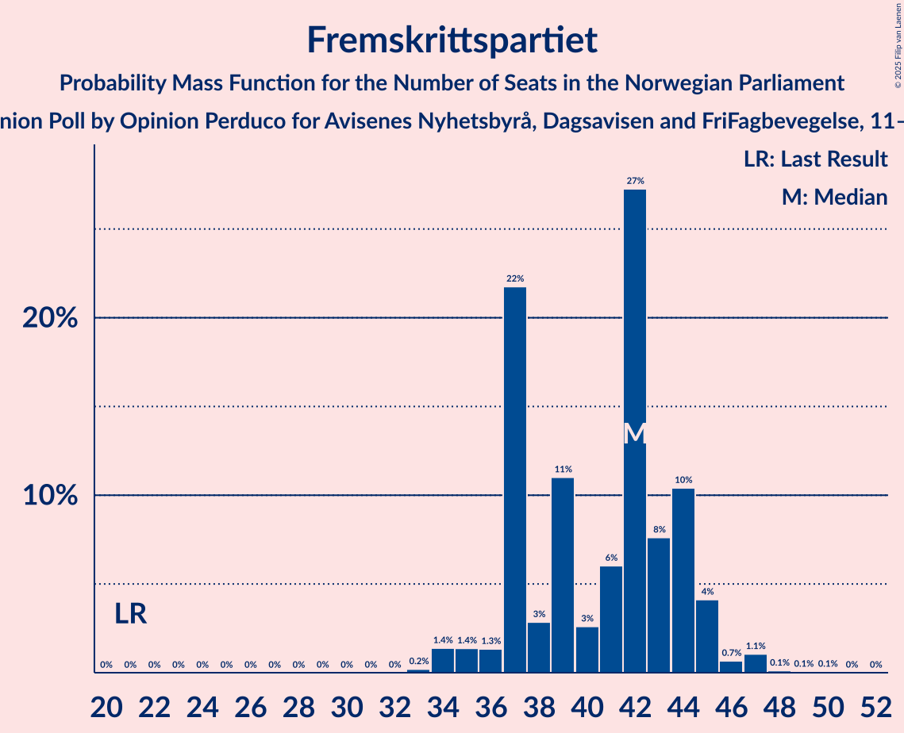
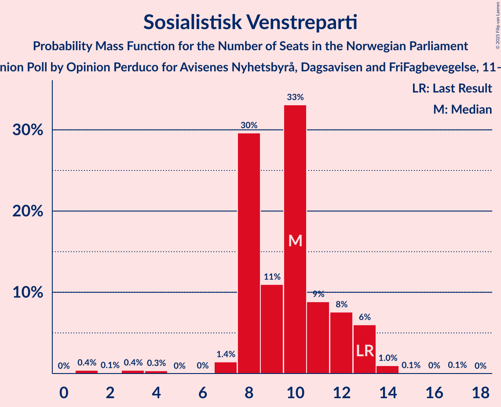
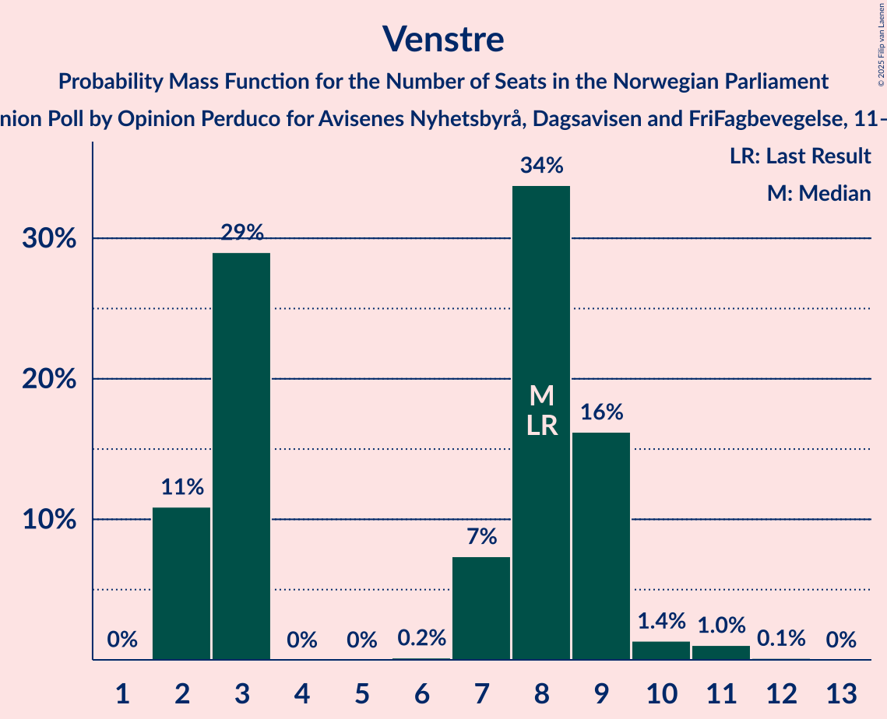
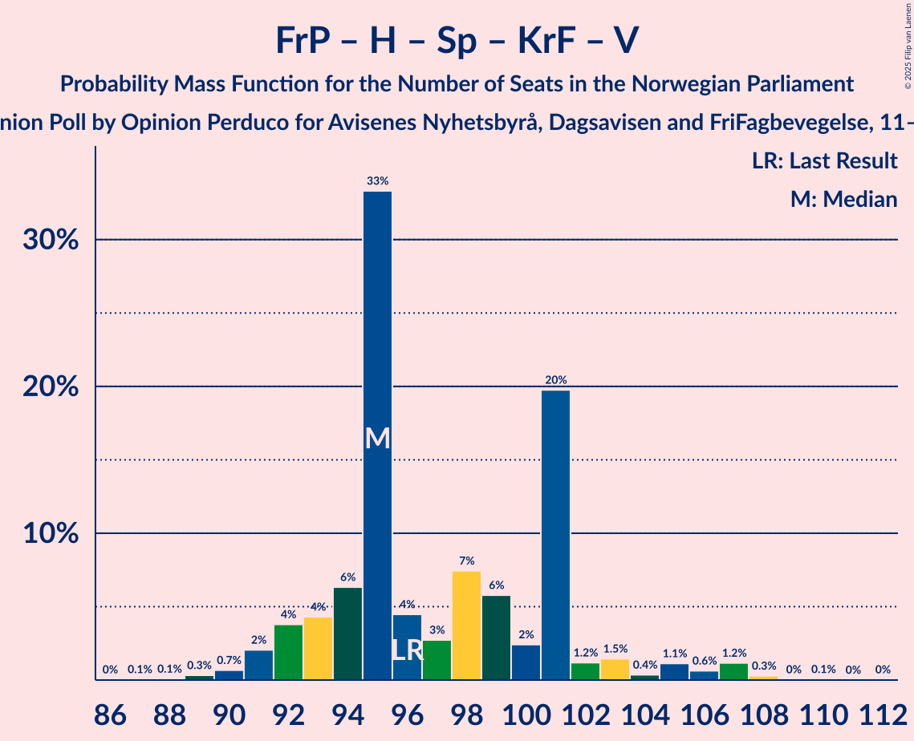
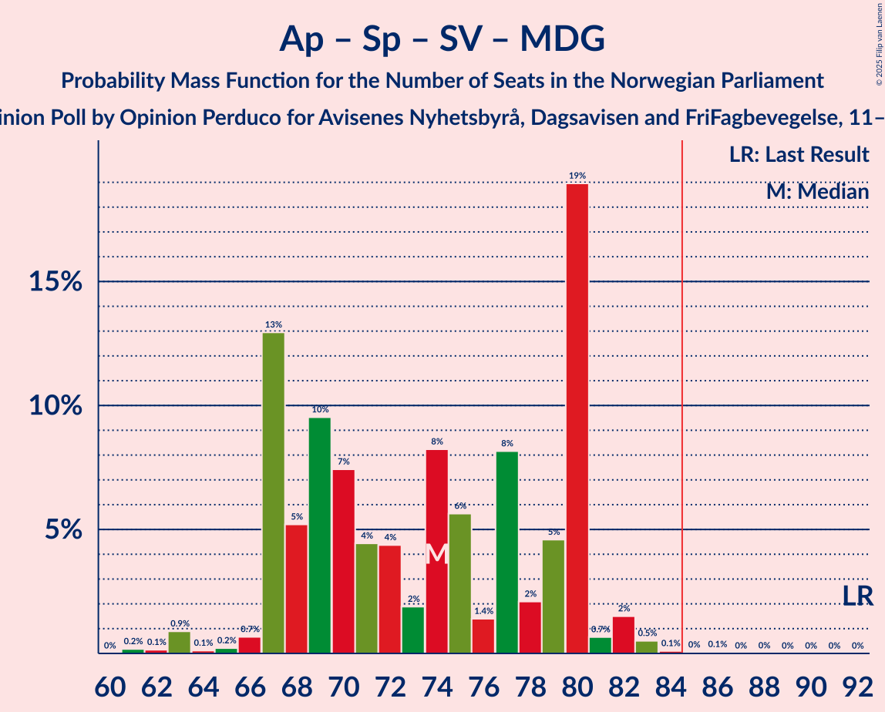
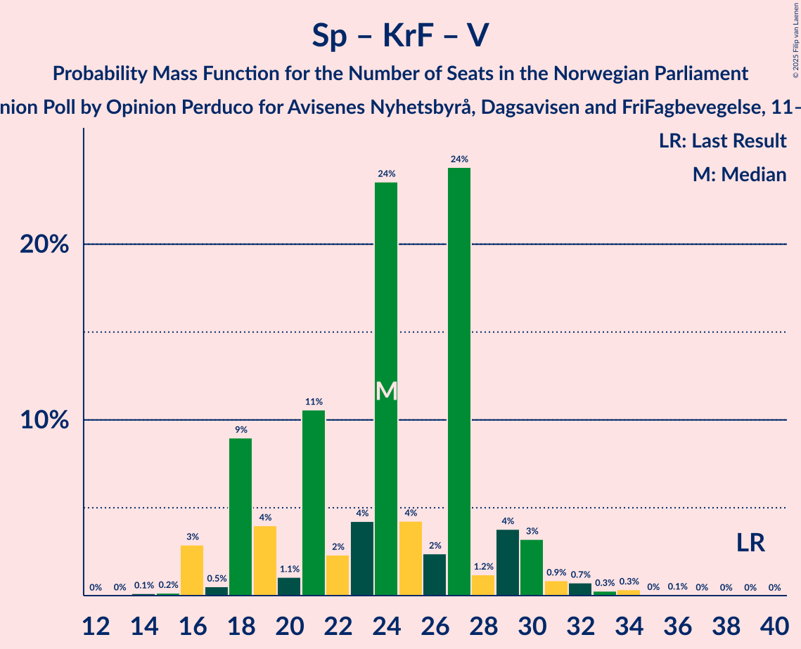

# Opinion Poll by Opinion Perduco for Avisenes Nyhetsbyrå, Dagsavisen and FriFagbevegelse, 11–17 August 2025

<a href="#voting-intentions">Voting Intentions</a> | <a href="#seats">Seats</a> | <a href="#coalitions">Coalitions</a> | <a href="#technical-information">Technical Information</a>

## Voting Intentions

### Confidence Intervals

| Party | Last Result | Poll Result | 80% Confidence Interval | 90% Confidence Interval | 95% Confidence Interval | 99% Confidence Interval |
|:-----:|:-----------:|:-----------:|:-----------------------:|:-----------------------:|:-----------------------:|:-----------------------:|
| Arbeiderpartiet | 26.2% | 24.8% | 22.9–26.8% |22.4–27.4% |22.0–27.9% |21.1–28.9% |
| Fremskrittspartiet | 11.6% | 21.5% | 19.7–23.4% |19.2–24.0% |18.8–24.4% |18.0–25.4% |
| Høyre | 20.4% | 17.9% | 16.3–19.7% |15.8–20.2% |15.4–20.7% |14.7–21.6% |
| Senterpartiet | 13.5% | 6.8% | 5.8–8.1% |5.5–8.4% |5.2–8.7% |4.8–9.4% |
| Sosialistisk Venstreparti | 7.6% | 5.6% | 4.6–6.7% |4.4–7.1% |4.2–7.4% |3.8–8.0% |
| Rødt | 4.7% | 5.6% | 4.6–6.7% |4.4–7.1% |4.2–7.4% |3.8–8.0% |
| Kristelig Folkeparti | 3.8% | 4.4% | 3.6–5.5% |3.4–5.8% |3.2–6.1% |2.9–6.7% |
| Venstre | 4.6% | 4.0% | 3.2–5.0% |3.0–5.3% |2.8–5.5% |2.5–6.1% |
| Miljøpartiet De Grønne | 3.9% | 3.6% | 2.9–4.6% |2.7–4.8% |2.5–5.1% |2.2–5.6% |
| Industri- og Næringspartiet | 0.3% | 1.2% | 0.9–1.9% |0.8–2.1% |0.7–2.3% |0.5–2.6% |
| Konservativt | 0.4% | 0.9% | 0.6–1.4% |0.5–1.6% |0.4–1.8% |0.3–2.1% |
| Pensjonistpartiet | 0.6% | 0.9% | 0.6–1.4% |0.5–1.6% |0.4–1.8% |0.3–2.1% |
| Norgesdemokratene | 1.1% | 0.6% | 0.4–1.1% |0.3–1.3% |0.3–1.4% |0.2–1.7% |

*Note:* The poll result column reflects the actual value used in the calculations. Published results may vary slightly, and in addition be rounded to fewer digits.

## Seats

### Confidence Intervals

| Party | Last Result | Median | 80% Confidence Interval | 90% Confidence Interval | 95% Confidence Interval | 99% Confidence Interval |
|:-----:|:-----------:|:------:|:-----------------------:|:-----------------------:|:-----------------------:|:-----------------------:|
| <a href="#arbeiderpartiet">Arbeiderpartiet</a> | 48 | 49 | 45–51 |44–51 |42–51 |41–54 |
| <a href="#fremskrittspartiet">Fremskrittspartiet</a> | 21 | 41 | 37–44 |37–44 |35–45 |34–47 |
| <a href="#høyre">Høyre</a> | 36 | 32 | 31–35 |30–35 |28–37 |27–39 |
| <a href="#senterpartiet">Senterpartiet</a> | 28 | 12 | 8–16 |8–16 |8–16 |8–16 |
| <a href="#sosialistisk-venstreparti">Sosialistisk Venstreparti</a> | 13 | 10 | 8–12 |8–13 |7–13 |4–14 |
| <a href="#rødt">Rødt</a> | 8 | 10 | 8–11 |8–12 |7–12 |1–13 |
| <a href="#kristelig-folkeparti">Kristelig Folkeparti</a> | 3 | 7 | 3–9 |3–10 |3–10 |2–11 |
| <a href="#venstre">Venstre</a> | 8 | 8 | 2–9 |2–9 |2–9 |2–11 |
| <a href="#miljøpartiet-de-grønne">Miljøpartiet De Grønne</a> | 3 | 3 | 2–8 |1–8 |1–8 |1–9 |
| <a href="#industri--og-næringspartiet">Industri- og Næringspartiet</a> | 0 | 0 | 0 |0 |0 |0–2 |
| <a href="#konservativt">Konservativt</a> | 0 | 0 | 0 |0 |0 |0 |
| <a href="#pensjonistpartiet">Pensjonistpartiet</a> | 0 | 0 | 0 |0 |0 |0 |
| <a href="#norgesdemokratene">Norgesdemokratene</a> | 0 | 0 | 0 |0 |0 |0 |

### Arbeiderpartiet

*For a full overview of the results for this party, see the [Arbeiderpartiet](party-arbeiderpartiet.html) page.*

| Number of Seats | Probability | Accumulated | Special Marks |
|:---------------:|:-----------:|:-----------:|:-------------:|
| 38 | 0.1% | 100% |  |
| 39 | 0.1% | 99.9% |  |
| 40 | 0.2% | 99.8% |  |
| 41 | 2% | 99.6% |  |
| 42 | 0.8% | 98% |  |
| 43 | 1.3% | 97% |  |
| 44 | 3% | 96% |  |
| 45 | 8% | 93% |  |
| 46 | 4% | 85% |  |
| 47 | 4% | 81% |  |
| 48 | 7% | 77% | Last Result |
| 49 | 37% | 70% | Median |
| 50 | 2% | 33% |  |
| 51 | 29% | 31% |  |
| 52 | 1.3% | 2% |  |
| 53 | 0.2% | 0.9% |  |
| 54 | 0.4% | 0.7% |  |
| 55 | 0.1% | 0.3% |  |
| 56 | 0% | 0.2% |  |
| 57 | 0% | 0.1% |  |
| 58 | 0.1% | 0.1% |  |
| 59 | 0% | 0% |  |

### Fremskrittspartiet

*For a full overview of the results for this party, see the [Fremskrittspartiet](party-fremskrittspartiet.html) page.*

| Number of Seats | Probability | Accumulated | Special Marks |
|:---------------:|:-----------:|:-----------:|:-------------:|
| 21 | 0% | 100% | Last Result |
| 22 | 0% | 100% |  |
| 23 | 0% | 100% |  |
| 24 | 0% | 100% |  |
| 25 | 0% | 100% |  |
| 26 | 0% | 100% |  |
| 27 | 0% | 100% |  |
| 28 | 0% | 100% |  |
| 29 | 0% | 100% |  |
| 30 | 0% | 100% |  |
| 31 | 0% | 100% |  |
| 32 | 0% | 100% |  |
| 33 | 0.1% | 100% |  |
| 34 | 2% | 99.9% |  |
| 35 | 1.2% | 98% |  |
| 36 | 0.2% | 97% |  |
| 37 | 28% | 97% |  |
| 38 | 3% | 69% |  |
| 39 | 11% | 66% |  |
| 40 | 2% | 55% |  |
| 41 | 5% | 53% | Median |
| 42 | 26% | 48% |  |
| 43 | 6% | 22% |  |
| 44 | 13% | 16% |  |
| 45 | 0.8% | 3% |  |
| 46 | 0.3% | 2% |  |
| 47 | 1.4% | 2% |  |
| 48 | 0.1% | 0.2% |  |
| 49 | 0% | 0.1% |  |
| 50 | 0.1% | 0.1% |  |
| 51 | 0% | 0% |  |

### Høyre

*For a full overview of the results for this party, see the [Høyre](party-høyre.html) page.*

| Number of Seats | Probability | Accumulated | Special Marks |
|:---------------:|:-----------:|:-----------:|:-------------:|
| 23 | 0% | 100% |  |
| 24 | 0% | 99.9% |  |
| 25 | 0.2% | 99.9% |  |
| 26 | 0.2% | 99.7% |  |
| 27 | 0.8% | 99.5% |  |
| 28 | 1.3% | 98.7% |  |
| 29 | 1.2% | 97% |  |
| 30 | 4% | 96% |  |
| 31 | 41% | 92% |  |
| 32 | 6% | 52% | Median |
| 33 | 8% | 45% |  |
| 34 | 12% | 37% |  |
| 35 | 21% | 26% |  |
| 36 | 0.6% | 4% | Last Result |
| 37 | 3% | 4% |  |
| 38 | 0.2% | 1.0% |  |
| 39 | 0.4% | 0.8% |  |
| 40 | 0.1% | 0.4% |  |
| 41 | 0% | 0.3% |  |
| 42 | 0.2% | 0.2% |  |
| 43 | 0% | 0% |  |

### Senterpartiet

*For a full overview of the results for this party, see the [Senterpartiet](party-senterpartiet.html) page.*

| Number of Seats | Probability | Accumulated | Special Marks |
|:---------------:|:-----------:|:-----------:|:-------------:|
| 7 | 0.1% | 100% |  |
| 8 | 25% | 99.8% |  |
| 9 | 12% | 75% |  |
| 10 | 3% | 63% |  |
| 11 | 7% | 60% |  |
| 12 | 9% | 53% | Median |
| 13 | 10% | 44% |  |
| 14 | 3% | 34% |  |
| 15 | 2% | 31% |  |
| 16 | 28% | 29% |  |
| 17 | 0.1% | 0.3% |  |
| 18 | 0.2% | 0.2% |  |
| 19 | 0% | 0.1% |  |
| 20 | 0% | 0% |  |
| 21 | 0% | 0% |  |
| 22 | 0% | 0% |  |
| 23 | 0% | 0% |  |
| 24 | 0% | 0% |  |
| 25 | 0% | 0% |  |
| 26 | 0% | 0% |  |
| 27 | 0% | 0% |  |
| 28 | 0% | 0% | Last Result |

### Sosialistisk Venstreparti

*For a full overview of the results for this party, see the [Sosialistisk Venstreparti](party-sosialistiskvenstreparti.html) page.*

| Number of Seats | Probability | Accumulated | Special Marks |
|:---------------:|:-----------:|:-----------:|:-------------:|
| 1 | 0.1% | 100% |  |
| 2 | 0% | 99.9% |  |
| 3 | 0.3% | 99.9% |  |
| 4 | 0.5% | 99.6% |  |
| 5 | 0% | 99.1% |  |
| 6 | 0% | 99.1% |  |
| 7 | 2% | 99.1% |  |
| 8 | 37% | 97% |  |
| 9 | 8% | 61% |  |
| 10 | 38% | 52% | Median |
| 11 | 4% | 14% |  |
| 12 | 2% | 11% |  |
| 13 | 8% | 9% | Last Result |
| 14 | 1.0% | 1.2% |  |
| 15 | 0% | 0.2% |  |
| 16 | 0% | 0.2% |  |
| 17 | 0.2% | 0.2% |  |
| 18 | 0% | 0% |  |

### Rødt

*For a full overview of the results for this party, see the [Rødt](party-rødt.html) page.*

| Number of Seats | Probability | Accumulated | Special Marks |
|:---------------:|:-----------:|:-----------:|:-------------:|
| 1 | 0.5% | 100% |  |
| 2 | 2% | 99.5% |  |
| 3 | 0% | 98% |  |
| 4 | 0% | 98% |  |
| 5 | 0% | 98% |  |
| 6 | 0% | 98% |  |
| 7 | 0.5% | 98% |  |
| 8 | 11% | 97% | Last Result |
| 9 | 26% | 86% |  |
| 10 | 42% | 60% | Median |
| 11 | 12% | 18% |  |
| 12 | 4% | 6% |  |
| 13 | 1.3% | 2% |  |
| 14 | 0.3% | 0.3% |  |
| 15 | 0.1% | 0.1% |  |
| 16 | 0% | 0% |  |

### Kristelig Folkeparti

*For a full overview of the results for this party, see the [Kristelig Folkeparti](party-kristeligfolkeparti.html) page.*

| Number of Seats | Probability | Accumulated | Special Marks |
|:---------------:|:-----------:|:-----------:|:-------------:|
| 2 | 2% | 100% |  |
| 3 | 38% | 98% | Last Result |
| 4 | 0% | 60% |  |
| 5 | 0% | 60% |  |
| 6 | 0.1% | 60% |  |
| 7 | 22% | 60% | Median |
| 8 | 16% | 38% |  |
| 9 | 12% | 22% |  |
| 10 | 7% | 10% |  |
| 11 | 2% | 2% |  |
| 12 | 0% | 0.2% |  |
| 13 | 0.2% | 0.2% |  |
| 14 | 0% | 0% |  |

### Venstre

*For a full overview of the results for this party, see the [Venstre](party-venstre.html) page.*

| Number of Seats | Probability | Accumulated | Special Marks |
|:---------------:|:-----------:|:-----------:|:-------------:|
| 2 | 13% | 100% |  |
| 3 | 21% | 87% |  |
| 4 | 0% | 66% |  |
| 5 | 0% | 66% |  |
| 6 | 0% | 66% |  |
| 7 | 4% | 66% |  |
| 8 | 40% | 63% | Last Result, Median |
| 9 | 20% | 22% |  |
| 10 | 1.2% | 2% |  |
| 11 | 1.0% | 1.1% |  |
| 12 | 0.1% | 0.1% |  |
| 13 | 0% | 0% |  |

### Miljøpartiet De Grønne

*For a full overview of the results for this party, see the [Miljøpartiet De Grønne](party-miljøpartietdegrønne.html) page.*

| Number of Seats | Probability | Accumulated | Special Marks |
|:---------------:|:-----------:|:-----------:|:-------------:|
| 1 | 5% | 100% |  |
| 2 | 21% | 95% |  |
| 3 | 46% | 74% | Last Result, Median |
| 4 | 0% | 28% |  |
| 5 | 0% | 28% |  |
| 6 | 1.2% | 28% |  |
| 7 | 3% | 27% |  |
| 8 | 22% | 24% |  |
| 9 | 1.5% | 2% |  |
| 10 | 0.1% | 0.3% |  |
| 11 | 0.2% | 0.2% |  |
| 12 | 0% | 0% |  |

### Industri- og Næringspartiet

*For a full overview of the results for this party, see the [Industri- og Næringspartiet](party-industri-ognæringspartiet.html) page.*

| Number of Seats | Probability | Accumulated | Special Marks |
|:---------------:|:-----------:|:-----------:|:-------------:|
| 0 | 98.6% | 100% | Last Result, Median |
| 1 | 0.7% | 1.4% |  |
| 2 | 0.7% | 0.7% |  |
| 3 | 0% | 0% |  |

### Konservativt

*For a full overview of the results for this party, see the [Konservativt](party-konservativt.html) page.*

| Number of Seats | Probability | Accumulated | Special Marks |
|:---------------:|:-----------:|:-----------:|:-------------:|
| 0 | 100% | 100% | Last Result, Median |

### Pensjonistpartiet

*For a full overview of the results for this party, see the [Pensjonistpartiet](party-pensjonistpartiet.html) page.*

| Number of Seats | Probability | Accumulated | Special Marks |
|:---------------:|:-----------:|:-----------:|:-------------:|
| 0 | 99.9% | 100% | Last Result, Median |
| 1 | 0.1% | 0.1% |  |
| 2 | 0% | 0% |  |

### Norgesdemokratene

*For a full overview of the results for this party, see the [Norgesdemokratene](party-norgesdemokratene.html) page.*

| Number of Seats | Probability | Accumulated | Special Marks |
|:---------------:|:-----------:|:-----------:|:-------------:|
| 0 | 100% | 100% | Last Result, Median |

## Coalitions

### Confidence Intervals

| Coalition | Last Result | Median | Majority? | 80% Confidence Interval | 90% Confidence Interval | 95% Confidence Interval | 99% Confidence Interval |
|:---------:|:-----------:|:------:|:---------:|:-----------------------:|:-----------------------:|:-----------------------:|:-----------------------:|
| Fremskrittspartiet – Høyre – Senterpartiet – Kristelig Folkeparti – Venstre | 96 | 95 | 100% | 94–101 | 92–101 | 92–106 | 90–107 |
| Fremskrittspartiet – Høyre – Kristelig Folkeparti – Venstre – Miljøpartiet De Grønne | 71 | 90 | 69% | 82–95 | 82–96 | 82–97 | 81–99 |
| Fremskrittspartiet – Høyre – Kristelig Folkeparti – Venstre | 68 | 85 | 55% | 79–93 | 79–93 | 79–94 | 77–95 |
| Arbeiderpartiet – Senterpartiet – Rødt – Sosialistisk Venstreparti – Miljøpartiet De Grønne | 100 | 84 | 44% | 76–90 | 76–90 | 75–90 | 72–92 |
| Arbeiderpartiet – Senterpartiet – Sosialistisk Venstreparti – Kristelig Folkeparti – Miljøpartiet De Grønne | 95 | 82 | 5% | 74–84 | 74–84 | 74–87 | 72–90 |
| Arbeiderpartiet – Senterpartiet – Rødt – Sosialistisk Venstreparti | 97 | 78 | 30% | 74–87 | 73–87 | 71–87 | 69–88 |
| Fremskrittspartiet – Høyre – Venstre | 65 | 78 | 21% | 76–86 | 74–86 | 73–86 | 71–87 |
| Arbeiderpartiet – Senterpartiet – Sosialistisk Venstreparti – Miljøpartiet De Grønne | 92 | 74 | 0.1% | 67–80 | 67–80 | 67–80 | 63–82 |
| Fremskrittspartiet – Høyre | 57 | 74 | 0.1% | 68–77 | 68–77 | 68–78 | 66–80 |
| Arbeiderpartiet – Senterpartiet – Kristelig Folkeparti – Miljøpartiet De Grønne | 82 | 72 | 0.1% | 66–75 | 66–76 | 66–77 | 63–80 |
| Arbeiderpartiet – Rødt – Sosialistisk Venstreparti – Miljøpartiet De Grønne | 72 | 74 | 0% | 68–75 | 67–77 | 63–77 | 61–78 |
| Arbeiderpartiet – Senterpartiet – Sosialistisk Venstreparti | 89 | 69 | 0% | 65–77 | 64–77 | 62–77 | 60–78 |
| Arbeiderpartiet – Senterpartiet – Kristelig Folkeparti | 79 | 67 | 0% | 62–70 | 61–71 | 60–73 | 59–76 |
| Arbeiderpartiet – Senterpartiet | 76 | 58 | 0% | 57–67 | 55–67 | 54–67 | 53–67 |
| Arbeiderpartiet – Sosialistisk Venstreparti | 61 | 57 | 0% | 55–61 | 53–61 | 51–62 | 48–64 |
| Høyre – Kristelig Folkeparti – Venstre | 47 | 44 | 0% | 39–51 | 38–51 | 38–52 | 36–55 |
| Senterpartiet – Kristelig Folkeparti – Venstre | 39 | 24 | 0% | 19–27 | 19–30 | 16–30 | 16–33 |

### Fremskrittspartiet – Høyre – Senterpartiet – Kristelig Folkeparti – Venstre

| Number of Seats | Probability | Accumulated | Special Marks |
|:---------------:|:-----------:|:-----------:|:-------------:|
| 87 | 0.1% | 100% |  |
| 88 | 0% | 99.9% |  |
| 89 | 0.2% | 99.9% |  |
| 90 | 0.2% | 99.7% |  |
| 91 | 1.0% | 99.5% |  |
| 92 | 5% | 98% |  |
| 93 | 0.6% | 94% |  |
| 94 | 8% | 93% |  |
| 95 | 36% | 85% |  |
| 96 | 4% | 49% | Last Result |
| 97 | 3% | 45% |  |
| 98 | 4% | 41% |  |
| 99 | 7% | 37% |  |
| 100 | 2% | 31% | Median |
| 101 | 24% | 28% |  |
| 102 | 1.1% | 5% |  |
| 103 | 0.5% | 3% |  |
| 104 | 0.2% | 3% |  |
| 105 | 0.1% | 3% |  |
| 106 | 0.7% | 3% |  |
| 107 | 2% | 2% |  |
| 108 | 0.3% | 0.3% |  |
| 109 | 0% | 0% |  |

### Fremskrittspartiet – Høyre – Kristelig Folkeparti – Venstre – Miljøpartiet De Grønne

| Number of Seats | Probability | Accumulated | Special Marks |
|:---------------:|:-----------:|:-----------:|:-------------:|
| 71 | 0% | 100% | Last Result |
| 72 | 0% | 100% |  |
| 73 | 0% | 100% |  |
| 74 | 0% | 100% |  |
| 75 | 0% | 100% |  |
| 76 | 0% | 100% |  |
| 77 | 0.1% | 100% |  |
| 78 | 0% | 99.9% |  |
| 79 | 0.1% | 99.9% |  |
| 80 | 0.1% | 99.8% |  |
| 81 | 0.3% | 99.7% |  |
| 82 | 28% | 99.4% |  |
| 83 | 1.1% | 71% |  |
| 84 | 0.7% | 70% |  |
| 85 | 2% | 69% | Majority |
| 86 | 2% | 67% |  |
| 87 | 2% | 65% |  |
| 88 | 2% | 63% |  |
| 89 | 5% | 61% |  |
| 90 | 7% | 56% |  |
| 91 | 2% | 49% | Median |
| 92 | 3% | 48% |  |
| 93 | 10% | 44% |  |
| 94 | 9% | 35% |  |
| 95 | 20% | 25% |  |
| 96 | 0.6% | 5% |  |
| 97 | 3% | 5% |  |
| 98 | 1.4% | 2% |  |
| 99 | 0.3% | 0.6% |  |
| 100 | 0% | 0.3% |  |
| 101 | 0.3% | 0.3% |  |
| 102 | 0% | 0% |  |

### Fremskrittspartiet – Høyre – Kristelig Folkeparti – Venstre

| Number of Seats | Probability | Accumulated | Special Marks |
|:---------------:|:-----------:|:-----------:|:-------------:|
| 68 | 0% | 100% | Last Result |
| 69 | 0% | 100% |  |
| 70 | 0% | 100% |  |
| 71 | 0% | 100% |  |
| 72 | 0% | 100% |  |
| 73 | 0% | 100% |  |
| 74 | 0% | 100% |  |
| 75 | 0.1% | 99.9% |  |
| 76 | 0.1% | 99.9% |  |
| 77 | 0.4% | 99.7% |  |
| 78 | 0.3% | 99.3% |  |
| 79 | 29% | 99.1% |  |
| 80 | 0.9% | 70% |  |
| 81 | 4% | 70% |  |
| 82 | 7% | 65% |  |
| 83 | 0.7% | 58% |  |
| 84 | 2% | 58% |  |
| 85 | 11% | 55% | Majority |
| 86 | 7% | 45% |  |
| 87 | 2% | 38% |  |
| 88 | 2% | 36% | Median |
| 89 | 5% | 34% |  |
| 90 | 1.2% | 29% |  |
| 91 | 6% | 28% |  |
| 92 | 0.2% | 21% |  |
| 93 | 19% | 21% |  |
| 94 | 0.5% | 3% |  |
| 95 | 2% | 2% |  |
| 96 | 0.5% | 0.5% |  |
| 97 | 0% | 0% |  |

### Arbeiderpartiet – Senterpartiet – Rødt – Sosialistisk Venstreparti – Miljøpartiet De Grønne

| Number of Seats | Probability | Accumulated | Special Marks |
|:---------------:|:-----------:|:-----------:|:-------------:|
| 72 | 0.5% | 100% |  |
| 73 | 0.3% | 99.5% |  |
| 74 | 1.4% | 99.2% |  |
| 75 | 0.4% | 98% |  |
| 76 | 19% | 97% |  |
| 77 | 0.3% | 79% |  |
| 78 | 7% | 78% |  |
| 79 | 3% | 71% |  |
| 80 | 4% | 69% |  |
| 81 | 2% | 65% |  |
| 82 | 3% | 63% |  |
| 83 | 8% | 60% |  |
| 84 | 8% | 52% | Median |
| 85 | 2% | 44% | Majority |
| 86 | 1.1% | 42% |  |
| 87 | 6% | 41% |  |
| 88 | 4% | 35% |  |
| 89 | 1.0% | 30% |  |
| 90 | 28% | 29% |  |
| 91 | 0.2% | 0.8% |  |
| 92 | 0.4% | 0.6% |  |
| 93 | 0.1% | 0.3% |  |
| 94 | 0% | 0.1% |  |
| 95 | 0% | 0.1% |  |
| 96 | 0% | 0% |  |
| 97 | 0% | 0% |  |
| 98 | 0% | 0% |  |
| 99 | 0% | 0% |  |
| 100 | 0% | 0% | Last Result |

### Arbeiderpartiet – Senterpartiet – Sosialistisk Venstreparti – Kristelig Folkeparti – Miljøpartiet De Grønne

| Number of Seats | Probability | Accumulated | Special Marks |
|:---------------:|:-----------:|:-----------:|:-------------:|
| 68 | 0% | 100% |  |
| 69 | 0% | 99.9% |  |
| 70 | 0.3% | 99.9% |  |
| 71 | 0% | 99.6% |  |
| 72 | 0.4% | 99.6% |  |
| 73 | 0.1% | 99.2% |  |
| 74 | 19% | 99.1% |  |
| 75 | 2% | 81% |  |
| 76 | 6% | 79% |  |
| 77 | 3% | 73% |  |
| 78 | 2% | 69% |  |
| 79 | 5% | 67% |  |
| 80 | 6% | 62% |  |
| 81 | 3% | 56% | Median |
| 82 | 8% | 53% |  |
| 83 | 35% | 45% |  |
| 84 | 5% | 10% |  |
| 85 | 0.5% | 5% | Majority |
| 86 | 0.6% | 4% |  |
| 87 | 3% | 4% |  |
| 88 | 0.2% | 1.1% |  |
| 89 | 0.1% | 0.9% |  |
| 90 | 0.4% | 0.9% |  |
| 91 | 0% | 0.4% |  |
| 92 | 0% | 0.4% |  |
| 93 | 0.3% | 0.4% |  |
| 94 | 0% | 0.1% |  |
| 95 | 0% | 0% | Last Result |

### Arbeiderpartiet – Senterpartiet – Rødt – Sosialistisk Venstreparti

| Number of Seats | Probability | Accumulated | Special Marks |
|:---------------:|:-----------:|:-----------:|:-------------:|
| 67 | 0.2% | 100% |  |
| 68 | 0% | 99.8% |  |
| 69 | 0.3% | 99.7% |  |
| 70 | 0.2% | 99.4% |  |
| 71 | 3% | 99.3% |  |
| 72 | 1.0% | 96% |  |
| 73 | 2% | 95% |  |
| 74 | 19% | 94% |  |
| 75 | 12% | 75% |  |
| 76 | 8% | 63% |  |
| 77 | 3% | 55% |  |
| 78 | 2% | 51% |  |
| 79 | 6% | 49% |  |
| 80 | 5% | 43% |  |
| 81 | 2% | 38% | Median |
| 82 | 3% | 37% |  |
| 83 | 0.8% | 33% |  |
| 84 | 2% | 32% |  |
| 85 | 0.6% | 30% | Majority |
| 86 | 1.0% | 30% |  |
| 87 | 28% | 29% |  |
| 88 | 0.3% | 0.6% |  |
| 89 | 0.1% | 0.3% |  |
| 90 | 0.1% | 0.2% |  |
| 91 | 0% | 0.1% |  |
| 92 | 0.1% | 0.1% |  |
| 93 | 0% | 0% |  |
| 94 | 0% | 0% |  |
| 95 | 0% | 0% |  |
| 96 | 0% | 0% |  |
| 97 | 0% | 0% | Last Result |

### Fremskrittspartiet – Høyre – Venstre

| Number of Seats | Probability | Accumulated | Special Marks |
|:---------------:|:-----------:|:-----------:|:-------------:|
| 65 | 0% | 100% | Last Result |
| 66 | 0% | 99.9% |  |
| 67 | 0% | 99.9% |  |
| 68 | 0% | 99.9% |  |
| 69 | 0% | 99.9% |  |
| 70 | 0.1% | 99.8% |  |
| 71 | 0.5% | 99.8% |  |
| 72 | 1.1% | 99.2% |  |
| 73 | 1.1% | 98% |  |
| 74 | 2% | 97% |  |
| 75 | 0.7% | 95% |  |
| 76 | 40% | 94% |  |
| 77 | 3% | 54% |  |
| 78 | 8% | 50% |  |
| 79 | 7% | 42% |  |
| 80 | 3% | 35% |  |
| 81 | 0.8% | 32% | Median |
| 82 | 2% | 31% |  |
| 83 | 7% | 29% |  |
| 84 | 1.0% | 22% |  |
| 85 | 0.3% | 21% | Majority |
| 86 | 20% | 21% |  |
| 87 | 0.5% | 0.6% |  |
| 88 | 0.1% | 0.1% |  |
| 89 | 0% | 0.1% |  |
| 90 | 0% | 0% |  |

### Arbeiderpartiet – Senterpartiet – Sosialistisk Venstreparti – Miljøpartiet De Grønne

| Number of Seats | Probability | Accumulated | Special Marks |
|:---------------:|:-----------:|:-----------:|:-------------:|
| 61 | 0.2% | 100% |  |
| 62 | 0.1% | 99.7% |  |
| 63 | 0.3% | 99.7% |  |
| 64 | 0% | 99.4% |  |
| 65 | 0.1% | 99.4% |  |
| 66 | 0.3% | 99.2% |  |
| 67 | 19% | 98.9% |  |
| 68 | 8% | 80% |  |
| 69 | 2% | 72% |  |
| 70 | 2% | 70% |  |
| 71 | 5% | 68% |  |
| 72 | 5% | 63% |  |
| 73 | 2% | 58% |  |
| 74 | 12% | 56% | Median |
| 75 | 2% | 45% |  |
| 76 | 0.7% | 43% |  |
| 77 | 6% | 42% |  |
| 78 | 1.2% | 37% |  |
| 79 | 6% | 36% |  |
| 80 | 28% | 29% |  |
| 81 | 0.4% | 1.4% |  |
| 82 | 0.5% | 1.0% |  |
| 83 | 0.3% | 0.5% |  |
| 84 | 0% | 0.1% |  |
| 85 | 0% | 0.1% | Majority |
| 86 | 0% | 0.1% |  |
| 87 | 0% | 0% |  |
| 88 | 0% | 0% |  |
| 89 | 0% | 0% |  |
| 90 | 0% | 0% |  |
| 91 | 0% | 0% |  |
| 92 | 0% | 0% | Last Result |

### Fremskrittspartiet – Høyre

| Number of Seats | Probability | Accumulated | Special Marks |
|:---------------:|:-----------:|:-----------:|:-------------:|
| 57 | 0% | 100% | Last Result |
| 58 | 0% | 100% |  |
| 59 | 0% | 100% |  |
| 60 | 0% | 100% |  |
| 61 | 0% | 100% |  |
| 62 | 0% | 100% |  |
| 63 | 0% | 100% |  |
| 64 | 0.1% | 99.9% |  |
| 65 | 0.2% | 99.8% |  |
| 66 | 0.7% | 99.6% |  |
| 67 | 1.1% | 98.9% |  |
| 68 | 28% | 98% |  |
| 69 | 3% | 70% |  |
| 70 | 3% | 67% |  |
| 71 | 4% | 64% |  |
| 72 | 1.3% | 60% |  |
| 73 | 8% | 59% | Median |
| 74 | 7% | 51% |  |
| 75 | 8% | 43% |  |
| 76 | 9% | 35% |  |
| 77 | 22% | 26% |  |
| 78 | 2% | 4% |  |
| 79 | 2% | 2% |  |
| 80 | 0.1% | 0.6% |  |
| 81 | 0.1% | 0.5% |  |
| 82 | 0.1% | 0.4% |  |
| 83 | 0% | 0.3% |  |
| 84 | 0.3% | 0.3% |  |
| 85 | 0.1% | 0.1% | Majority |
| 86 | 0% | 0% |  |

### Arbeiderpartiet – Senterpartiet – Kristelig Folkeparti – Miljøpartiet De Grønne

| Number of Seats | Probability | Accumulated | Special Marks |
|:---------------:|:-----------:|:-----------:|:-------------:|
| 59 | 0% | 100% |  |
| 60 | 0% | 99.9% |  |
| 61 | 0.1% | 99.9% |  |
| 62 | 0.2% | 99.8% |  |
| 63 | 0.1% | 99.6% |  |
| 64 | 1.2% | 99.5% |  |
| 65 | 0.3% | 98% |  |
| 66 | 21% | 98% |  |
| 67 | 2% | 77% |  |
| 68 | 9% | 75% |  |
| 69 | 7% | 66% |  |
| 70 | 8% | 59% |  |
| 71 | 1.3% | 51% | Median |
| 72 | 4% | 50% |  |
| 73 | 29% | 46% |  |
| 74 | 2% | 17% |  |
| 75 | 8% | 15% |  |
| 76 | 4% | 7% |  |
| 77 | 0.4% | 3% |  |
| 78 | 2% | 2% |  |
| 79 | 0.4% | 0.9% |  |
| 80 | 0% | 0.5% |  |
| 81 | 0.3% | 0.5% |  |
| 82 | 0.1% | 0.2% | Last Result |
| 83 | 0% | 0.1% |  |
| 84 | 0% | 0.1% |  |
| 85 | 0% | 0.1% | Majority |
| 86 | 0% | 0% |  |

### Arbeiderpartiet – Rødt – Sosialistisk Venstreparti – Miljøpartiet De Grønne

| Number of Seats | Probability | Accumulated | Special Marks |
|:---------------:|:-----------:|:-----------:|:-------------:|
| 59 | 0% | 100% |  |
| 60 | 0.3% | 99.9% |  |
| 61 | 0.3% | 99.7% |  |
| 62 | 2% | 99.4% |  |
| 63 | 0.5% | 98% |  |
| 64 | 0.2% | 97% |  |
| 65 | 0.1% | 97% |  |
| 66 | 1.1% | 97% |  |
| 67 | 3% | 96% |  |
| 68 | 21% | 93% |  |
| 69 | 2% | 71% |  |
| 70 | 10% | 69% |  |
| 71 | 1.2% | 59% |  |
| 72 | 4% | 58% | Last Result, Median |
| 73 | 3% | 53% |  |
| 74 | 36% | 51% |  |
| 75 | 8% | 15% |  |
| 76 | 0.4% | 6% |  |
| 77 | 5% | 6% |  |
| 78 | 1.0% | 1.4% |  |
| 79 | 0.1% | 0.4% |  |
| 80 | 0.2% | 0.3% |  |
| 81 | 0% | 0.1% |  |
| 82 | 0.1% | 0.1% |  |
| 83 | 0% | 0% |  |

### Arbeiderpartiet – Senterpartiet – Sosialistisk Venstreparti

| Number of Seats | Probability | Accumulated | Special Marks |
|:---------------:|:-----------:|:-----------:|:-------------:|
| 58 | 0.3% | 100% |  |
| 59 | 0% | 99.7% |  |
| 60 | 2% | 99.7% |  |
| 61 | 0.2% | 98% |  |
| 62 | 0.4% | 98% |  |
| 63 | 0.2% | 97% |  |
| 64 | 4% | 97% |  |
| 65 | 24% | 93% |  |
| 66 | 12% | 69% |  |
| 67 | 1.3% | 56% |  |
| 68 | 2% | 55% |  |
| 69 | 8% | 53% |  |
| 70 | 3% | 45% |  |
| 71 | 6% | 41% | Median |
| 72 | 1.4% | 35% |  |
| 73 | 1.0% | 34% |  |
| 74 | 2% | 33% |  |
| 75 | 1.0% | 31% |  |
| 76 | 2% | 30% |  |
| 77 | 28% | 28% |  |
| 78 | 0.2% | 0.7% |  |
| 79 | 0.3% | 0.5% |  |
| 80 | 0.1% | 0.2% |  |
| 81 | 0.1% | 0.1% |  |
| 82 | 0% | 0% |  |
| 83 | 0% | 0% |  |
| 84 | 0% | 0% |  |
| 85 | 0% | 0% | Majority |
| 86 | 0% | 0% |  |
| 87 | 0% | 0% |  |
| 88 | 0% | 0% |  |
| 89 | 0% | 0% | Last Result |

### Arbeiderpartiet – Senterpartiet – Kristelig Folkeparti

| Number of Seats | Probability | Accumulated | Special Marks |
|:---------------:|:-----------:|:-----------:|:-------------:|
| 56 | 0% | 100% |  |
| 57 | 0.2% | 99.9% |  |
| 58 | 0.1% | 99.7% |  |
| 59 | 0.6% | 99.7% |  |
| 60 | 2% | 99.1% |  |
| 61 | 5% | 97% |  |
| 62 | 6% | 92% |  |
| 63 | 3% | 86% |  |
| 64 | 20% | 84% |  |
| 65 | 8% | 63% |  |
| 66 | 3% | 55% |  |
| 67 | 9% | 52% |  |
| 68 | 5% | 43% | Median |
| 69 | 4% | 38% |  |
| 70 | 28% | 33% |  |
| 71 | 1.1% | 5% |  |
| 72 | 2% | 4% |  |
| 73 | 0.5% | 3% |  |
| 74 | 0.1% | 2% |  |
| 75 | 1.5% | 2% |  |
| 76 | 0.2% | 0.6% |  |
| 77 | 0.1% | 0.4% |  |
| 78 | 0.3% | 0.3% |  |
| 79 | 0% | 0% | Last Result |

### Arbeiderpartiet – Senterpartiet

| Number of Seats | Probability | Accumulated | Special Marks |
|:---------------:|:-----------:|:-----------:|:-------------:|
| 51 | 0.1% | 100% |  |
| 52 | 0% | 99.9% |  |
| 53 | 2% | 99.8% |  |
| 54 | 2% | 98% |  |
| 55 | 3% | 96% |  |
| 56 | 1.0% | 93% |  |
| 57 | 28% | 92% |  |
| 58 | 17% | 64% |  |
| 59 | 9% | 47% |  |
| 60 | 2% | 38% |  |
| 61 | 1.2% | 36% | Median |
| 62 | 1.3% | 34% |  |
| 63 | 2% | 33% |  |
| 64 | 1.2% | 31% |  |
| 65 | 0.3% | 30% |  |
| 66 | 0.3% | 30% |  |
| 67 | 29% | 29% |  |
| 68 | 0.1% | 0.5% |  |
| 69 | 0% | 0.4% |  |
| 70 | 0.4% | 0.4% |  |
| 71 | 0% | 0% |  |
| 72 | 0% | 0% |  |
| 73 | 0% | 0% |  |
| 74 | 0% | 0% |  |
| 75 | 0% | 0% |  |
| 76 | 0% | 0% | Last Result |

### Arbeiderpartiet – Sosialistisk Venstreparti

| Number of Seats | Probability | Accumulated | Special Marks |
|:---------------:|:-----------:|:-----------:|:-------------:|
| 45 | 0.1% | 100% |  |
| 46 | 0.3% | 99.9% |  |
| 47 | 0% | 99.7% |  |
| 48 | 1.4% | 99.6% |  |
| 49 | 0.3% | 98% |  |
| 50 | 0.2% | 98% |  |
| 51 | 0.4% | 98% |  |
| 52 | 0.4% | 97% |  |
| 53 | 2% | 97% |  |
| 54 | 4% | 95% |  |
| 55 | 1.4% | 91% |  |
| 56 | 2% | 89% |  |
| 57 | 41% | 88% |  |
| 58 | 10% | 46% |  |
| 59 | 2% | 36% | Median |
| 60 | 2% | 35% |  |
| 61 | 30% | 33% | Last Result |
| 62 | 0.5% | 3% |  |
| 63 | 1.1% | 2% |  |
| 64 | 0.6% | 1.0% |  |
| 65 | 0.1% | 0.4% |  |
| 66 | 0% | 0.2% |  |
| 67 | 0% | 0.2% |  |
| 68 | 0.1% | 0.2% |  |
| 69 | 0.1% | 0.1% |  |
| 70 | 0% | 0% |  |

### Høyre – Kristelig Folkeparti – Venstre

| Number of Seats | Probability | Accumulated | Special Marks |
|:---------------:|:-----------:|:-----------:|:-------------:|
| 34 | 0.1% | 100% |  |
| 35 | 0.1% | 99.9% |  |
| 36 | 0.4% | 99.8% |  |
| 37 | 0.2% | 99.4% |  |
| 38 | 5% | 99.3% |  |
| 39 | 4% | 94% |  |
| 40 | 1.0% | 90% |  |
| 41 | 2% | 89% |  |
| 42 | 30% | 87% |  |
| 43 | 4% | 57% |  |
| 44 | 4% | 53% |  |
| 45 | 6% | 49% |  |
| 46 | 8% | 43% |  |
| 47 | 7% | 35% | Last Result, Median |
| 48 | 2% | 29% |  |
| 49 | 2% | 26% |  |
| 50 | 2% | 24% |  |
| 51 | 18% | 22% |  |
| 52 | 2% | 3% |  |
| 53 | 0.2% | 2% |  |
| 54 | 0.5% | 1.4% |  |
| 55 | 0.6% | 1.0% |  |
| 56 | 0.3% | 0.4% |  |
| 57 | 0% | 0% |  |

### Senterpartiet – Kristelig Folkeparti – Venstre

| Number of Seats | Probability | Accumulated | Special Marks |
|:---------------:|:-----------:|:-----------:|:-------------:|
| 15 | 0.2% | 100% |  |
| 16 | 4% | 99.7% |  |
| 17 | 0.7% | 96% |  |
| 18 | 0.4% | 96% |  |
| 19 | 5% | 95% |  |
| 20 | 0.8% | 90% |  |
| 21 | 12% | 89% |  |
| 22 | 2% | 77% |  |
| 23 | 0.9% | 75% |  |
| 24 | 30% | 74% |  |
| 25 | 5% | 44% |  |
| 26 | 2% | 39% |  |
| 27 | 28% | 37% | Median |
| 28 | 1.2% | 9% |  |
| 29 | 2% | 8% |  |
| 30 | 3% | 5% |  |
| 31 | 0.8% | 2% |  |
| 32 | 0.9% | 1.5% |  |
| 33 | 0.4% | 0.6% |  |
| 34 | 0.2% | 0.3% |  |
| 35 | 0% | 0% |  |
| 36 | 0% | 0% |  |
| 37 | 0% | 0% |  |
| 38 | 0% | 0% |  |
| 39 | 0% | 0% | Last Result |

## Technical Information

### Opinion Poll

+ **Polling firm:** Opinion Perduco
+ **Commissioner(s):** Avisenes Nyhetsbyrå, Dagsavisen and FriFagbevegelse
+ **Fieldwork period:** 11–17 August 2025

### Calculations

+ **Sample size:** 810
+ **Simulations done:** 1,048,576
+ **Error estimate:** 2.87%

