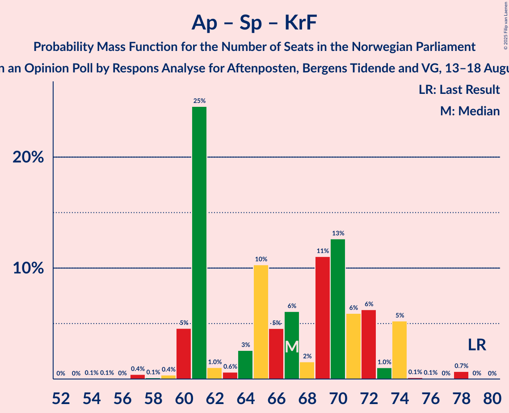

# Opinion Poll by Respons Analyse for Aftenposten, Bergens Tidende and VG, 13–18 August 2025

<a href="#voting-intentions">Voting Intentions</a> | <a href="#seats">Seats</a> | <a href="#coalitions">Coalitions</a> | <a href="#technical-information">Technical Information</a>

## Voting Intentions

### Confidence Intervals

| Party | Last Result | Poll Result | 80% Confidence Interval | 90% Confidence Interval | 95% Confidence Interval | 99% Confidence Interval |
|:-----:|:-----------:|:-----------:|:-----------------------:|:-----------------------:|:-----------------------:|:-----------------------:|
| Arbeiderpartiet | 26.2% | 24.8% | 23.0–26.8% |22.4–27.4% |22.0–27.9% |21.1–28.9% |
| Fremskrittspartiet | 11.6% | 21.9% | 20.1–23.8% |19.6–24.4% |19.2–24.9% |18.4–25.8% |
| Høyre | 20.4% | 14.4% | 13.0–16.1% |12.5–16.6% |12.2–17.0% |11.5–17.8% |
| Senterpartiet | 13.5% | 7.0% | 5.9–8.2% |5.7–8.6% |5.4–8.9% |5.0–9.6% |
| Rødt | 4.7% | 6.4% | 5.4–7.6% |5.1–7.9% |4.9–8.2% |4.5–8.9% |
| Sosialistisk Venstreparti | 7.6% | 6.2% | 5.3–7.5% |5.0–7.8% |4.8–8.1% |4.3–8.7% |
| Venstre | 4.6% | 5.3% | 4.4–6.4% |4.1–6.7% |3.9–7.0% |3.5–7.6% |
| Miljøpartiet De Grønne | 3.9% | 4.4% | 3.6–5.5% |3.4–5.8% |3.2–6.0% |2.9–6.6% |
| Kristelig Folkeparti | 3.8% | 4.3% | 3.5–5.3% |3.3–5.6% |3.1–5.9% |2.8–6.4% |
| Norgesdemokratene | 1.1% | 1.2% | 0.9–1.9% |0.7–2.1% |0.7–2.2% |0.5–2.6% |
| Industri- og Næringspartiet | 0.3% | 0.7% | 0.5–1.3% |0.4–1.4% |0.3–1.6% |0.2–1.9% |
| Konservativt | 0.4% | 0.4% | 0.2–0.8% |0.2–0.9% |0.1–1.1% |0.1–1.3% |
| Pensjonistpartiet | 0.6% | 0.4% | 0.2–0.8% |0.2–0.9% |0.1–1.1% |0.1–1.3% |

*Note:* The poll result column reflects the actual value used in the calculations. Published results may vary slightly, and in addition be rounded to fewer digits.

## Seats

### Confidence Intervals

| Party | Last Result | Median | 80% Confidence Interval | 90% Confidence Interval | 95% Confidence Interval | 99% Confidence Interval |
|:-----:|:-----------:|:------:|:-----------------------:|:-----------------------:|:-----------------------:|:-----------------------:|
| <a href="#arbeiderpartiet">Arbeiderpartiet</a> | 48 | 47 | 44–51 |44–53 |42–54 |41–58 |
| <a href="#fremskrittspartiet">Fremskrittspartiet</a> | 21 | 40 | 38–44 |37–44 |37–46 |34–50 |
| <a href="#høyre">Høyre</a> | 36 | 26 | 21–28 |20–29 |20–33 |19–33 |
| <a href="#senterpartiet">Senterpartiet</a> | 28 | 12 | 10–14 |10–15 |9–15 |8–17 |
| <a href="#rødt">Rødt</a> | 8 | 10 | 9–12 |9–13 |8–13 |7–15 |
| <a href="#sosialistisk-venstreparti">Sosialistisk Venstreparti</a> | 13 | 10 | 8–12 |8–12 |8–13 |7–15 |
| <a href="#venstre">Venstre</a> | 8 | 9 | 7–11 |7–11 |7–11 |3–12 |
| <a href="#miljøpartiet-de-grønne">Miljøpartiet De Grønne</a> | 3 | 7 | 3–8 |3–9 |2–9 |2–11 |
| <a href="#kristelig-folkeparti">Kristelig Folkeparti</a> | 3 | 7 | 3–9 |3–9 |3–9 |2–9 |
| <a href="#norgesdemokratene">Norgesdemokratene</a> | 0 | 0 | 0 |0 |0 |0 |
| <a href="#industri--og-næringspartiet">Industri- og Næringspartiet</a> | 0 | 0 | 0 |0 |0 |0 |
| <a href="#konservativt">Konservativt</a> | 0 | 0 | 0 |0 |0 |0 |
| <a href="#pensjonistpartiet">Pensjonistpartiet</a> | 0 | 0 | 0 |0 |0 |0 |

### Arbeiderpartiet

*For a full overview of the results for this party, see the [Arbeiderpartiet](party-arbeiderpartiet.html) page.*

| Number of Seats | Probability | Accumulated | Special Marks |
|:---------------:|:-----------:|:-----------:|:-------------:|
| 38 | 0% | 100% |  |
| 39 | 0.1% | 99.9% |  |
| 40 | 0.1% | 99.8% |  |
| 41 | 1.2% | 99.7% |  |
| 42 | 1.2% | 98% |  |
| 43 | 0.8% | 97% |  |
| 44 | 8% | 96% |  |
| 45 | 12% | 89% |  |
| 46 | 19% | 77% |  |
| 47 | 14% | 58% | Median |
| 48 | 8% | 43% | Last Result |
| 49 | 10% | 35% |  |
| 50 | 9% | 25% |  |
| 51 | 7% | 16% |  |
| 52 | 3% | 9% |  |
| 53 | 4% | 6% |  |
| 54 | 0.8% | 3% |  |
| 55 | 0.1% | 2% |  |
| 56 | 0.1% | 2% |  |
| 57 | 0.8% | 2% |  |
| 58 | 0.7% | 0.8% |  |
| 59 | 0% | 0.1% |  |
| 60 | 0% | 0.1% |  |
| 61 | 0% | 0.1% |  |
| 62 | 0% | 0% |  |

### Fremskrittspartiet

*For a full overview of the results for this party, see the [Fremskrittspartiet](party-fremskrittspartiet.html) page.*

| Number of Seats | Probability | Accumulated | Special Marks |
|:---------------:|:-----------:|:-----------:|:-------------:|
| 21 | 0% | 100% | Last Result |
| 22 | 0% | 100% |  |
| 23 | 0% | 100% |  |
| 24 | 0% | 100% |  |
| 25 | 0% | 100% |  |
| 26 | 0% | 100% |  |
| 27 | 0% | 100% |  |
| 28 | 0% | 100% |  |
| 29 | 0% | 100% |  |
| 30 | 0% | 100% |  |
| 31 | 0% | 100% |  |
| 32 | 0% | 100% |  |
| 33 | 0% | 100% |  |
| 34 | 1.1% | 100% |  |
| 35 | 0.4% | 98.9% |  |
| 36 | 0.2% | 98% |  |
| 37 | 6% | 98% |  |
| 38 | 25% | 93% |  |
| 39 | 8% | 68% |  |
| 40 | 18% | 60% | Median |
| 41 | 3% | 42% |  |
| 42 | 17% | 39% |  |
| 43 | 9% | 22% |  |
| 44 | 9% | 13% |  |
| 45 | 1.1% | 4% |  |
| 46 | 1.1% | 3% |  |
| 47 | 0.7% | 2% |  |
| 48 | 0.4% | 1.2% |  |
| 49 | 0.2% | 0.8% |  |
| 50 | 0.5% | 0.6% |  |
| 51 | 0.1% | 0.1% |  |
| 52 | 0% | 0% |  |

### Høyre

*For a full overview of the results for this party, see the [Høyre](party-høyre.html) page.*

| Number of Seats | Probability | Accumulated | Special Marks |
|:---------------:|:-----------:|:-----------:|:-------------:|
| 18 | 0.2% | 100% |  |
| 19 | 0.3% | 99.8% |  |
| 20 | 6% | 99.5% |  |
| 21 | 12% | 93% |  |
| 22 | 8% | 81% |  |
| 23 | 4% | 73% |  |
| 24 | 2% | 70% |  |
| 25 | 2% | 67% |  |
| 26 | 17% | 65% | Median |
| 27 | 10% | 48% |  |
| 28 | 31% | 38% |  |
| 29 | 3% | 7% |  |
| 30 | 1.1% | 4% |  |
| 31 | 0.2% | 3% |  |
| 32 | 0.1% | 3% |  |
| 33 | 3% | 3% |  |
| 34 | 0% | 0% |  |
| 35 | 0% | 0% |  |
| 36 | 0% | 0% | Last Result |

### Senterpartiet

*For a full overview of the results for this party, see the [Senterpartiet](party-senterpartiet.html) page.*

| Number of Seats | Probability | Accumulated | Special Marks |
|:---------------:|:-----------:|:-----------:|:-------------:|
| 7 | 0.1% | 100% |  |
| 8 | 0.9% | 99.9% |  |
| 9 | 4% | 99.0% |  |
| 10 | 14% | 95% |  |
| 11 | 2% | 81% |  |
| 12 | 33% | 80% | Median |
| 13 | 18% | 47% |  |
| 14 | 19% | 28% |  |
| 15 | 7% | 9% |  |
| 16 | 1.2% | 2% |  |
| 17 | 0.7% | 0.8% |  |
| 18 | 0% | 0.1% |  |
| 19 | 0% | 0% |  |
| 20 | 0% | 0% |  |
| 21 | 0% | 0% |  |
| 22 | 0% | 0% |  |
| 23 | 0% | 0% |  |
| 24 | 0% | 0% |  |
| 25 | 0% | 0% |  |
| 26 | 0% | 0% |  |
| 27 | 0% | 0% |  |
| 28 | 0% | 0% | Last Result |

### Rødt

*For a full overview of the results for this party, see the [Rødt](party-rødt.html) page.*

| Number of Seats | Probability | Accumulated | Special Marks |
|:---------------:|:-----------:|:-----------:|:-------------:|
| 6 | 0.2% | 100% |  |
| 7 | 0.4% | 99.8% |  |
| 8 | 3% | 99.4% | Last Result |
| 9 | 26% | 97% |  |
| 10 | 27% | 70% | Median |
| 11 | 12% | 44% |  |
| 12 | 24% | 32% |  |
| 13 | 6% | 8% |  |
| 14 | 1.0% | 2% |  |
| 15 | 1.4% | 1.5% |  |
| 16 | 0% | 0% |  |

### Sosialistisk Venstreparti

*For a full overview of the results for this party, see the [Sosialistisk Venstreparti](party-sosialistiskvenstreparti.html) page.*

| Number of Seats | Probability | Accumulated | Special Marks |
|:---------------:|:-----------:|:-----------:|:-------------:|
| 6 | 0% | 100% |  |
| 7 | 2% | 99.9% |  |
| 8 | 21% | 98% |  |
| 9 | 8% | 77% |  |
| 10 | 25% | 69% | Median |
| 11 | 21% | 44% |  |
| 12 | 20% | 23% |  |
| 13 | 2% | 3% | Last Result |
| 14 | 0.5% | 2% |  |
| 15 | 0.9% | 1.1% |  |
| 16 | 0.1% | 0.2% |  |
| 17 | 0% | 0% |  |

### Venstre

*For a full overview of the results for this party, see the [Venstre](party-venstre.html) page.*

| Number of Seats | Probability | Accumulated | Special Marks |
|:---------------:|:-----------:|:-----------:|:-------------:|
| 3 | 0.9% | 100% |  |
| 4 | 0% | 99.1% |  |
| 5 | 0% | 99.1% |  |
| 6 | 0.1% | 99.1% |  |
| 7 | 9% | 99.0% |  |
| 8 | 29% | 90% | Last Result |
| 9 | 31% | 61% | Median |
| 10 | 14% | 30% |  |
| 11 | 15% | 16% |  |
| 12 | 0.8% | 1.0% |  |
| 13 | 0.2% | 0.2% |  |
| 14 | 0% | 0% |  |

### Miljøpartiet De Grønne

*For a full overview of the results for this party, see the [Miljøpartiet De Grønne](party-miljøpartietdegrønne.html) page.*

| Number of Seats | Probability | Accumulated | Special Marks |
|:---------------:|:-----------:|:-----------:|:-------------:|
| 1 | 0.1% | 100% |  |
| 2 | 4% | 99.9% |  |
| 3 | 12% | 95% | Last Result |
| 4 | 0% | 83% |  |
| 5 | 0% | 83% |  |
| 6 | 1.0% | 83% |  |
| 7 | 47% | 82% | Median |
| 8 | 30% | 36% |  |
| 9 | 4% | 5% |  |
| 10 | 0.8% | 1.5% |  |
| 11 | 0.5% | 0.7% |  |
| 12 | 0.2% | 0.2% |  |
| 13 | 0% | 0% |  |

### Kristelig Folkeparti

*For a full overview of the results for this party, see the [Kristelig Folkeparti](party-kristeligfolkeparti.html) page.*

| Number of Seats | Probability | Accumulated | Special Marks |
|:---------------:|:-----------:|:-----------:|:-------------:|
| 1 | 0.1% | 100% |  |
| 2 | 2% | 99.9% |  |
| 3 | 26% | 98% | Last Result |
| 4 | 0% | 72% |  |
| 5 | 0% | 72% |  |
| 6 | 9% | 72% |  |
| 7 | 21% | 62% | Median |
| 8 | 21% | 42% |  |
| 9 | 20% | 20% |  |
| 10 | 0.3% | 0.4% |  |
| 11 | 0.1% | 0.1% |  |
| 12 | 0% | 0% |  |

### Norgesdemokratene

*For a full overview of the results for this party, see the [Norgesdemokratene](party-norgesdemokratene.html) page.*

| Number of Seats | Probability | Accumulated | Special Marks |
|:---------------:|:-----------:|:-----------:|:-------------:|
| 0 | 100% | 100% | Last Result, Median |

### Industri- og Næringspartiet

*For a full overview of the results for this party, see the [Industri- og Næringspartiet](party-industri-ognæringspartiet.html) page.*

| Number of Seats | Probability | Accumulated | Special Marks |
|:---------------:|:-----------:|:-----------:|:-------------:|
| 0 | 100% | 100% | Last Result, Median |

### Konservativt

*For a full overview of the results for this party, see the [Konservativt](party-konservativt.html) page.*

| Number of Seats | Probability | Accumulated | Special Marks |
|:---------------:|:-----------:|:-----------:|:-------------:|
| 0 | 100% | 100% | Last Result, Median |

### Pensjonistpartiet

*For a full overview of the results for this party, see the [Pensjonistpartiet](party-pensjonistpartiet.html) page.*

| Number of Seats | Probability | Accumulated | Special Marks |
|:---------------:|:-----------:|:-----------:|:-------------:|
| 0 | 100% | 100% | Last Result, Median |

## Coalitions

### Confidence Intervals

| Coalition | Last Result | Median | Majority? | 80% Confidence Interval | 90% Confidence Interval | 95% Confidence Interval | 99% Confidence Interval |
|:---------:|:-----------:|:------:|:---------:|:-----------------------:|:-----------------------:|:-----------------------:|:-----------------------:|
| Fremskrittspartiet – Høyre – Senterpartiet – Venstre – Kristelig Folkeparti | 96 | 93 | 99.4% | 90–98 | 89–98 | 88–99 | 84–101 |
| Arbeiderpartiet – Senterpartiet – Rødt – Sosialistisk Venstreparti – Miljøpartiet De Grønne | 100 | 88 | 74% | 83–93 | 83–95 | 80–95 | 79–98 |
| Fremskrittspartiet – Høyre – Venstre – Miljøpartiet De Grønne – Kristelig Folkeparti | 71 | 88 | 85% | 83–94 | 81–94 | 80–94 | 77–96 |
| Arbeiderpartiet – Senterpartiet – Sosialistisk Venstreparti – Miljøpartiet De Grønne – Kristelig Folkeparti | 95 | 84 | 49% | 79–89 | 76–90 | 73–90 | 73–92 |
| Arbeiderpartiet – Senterpartiet – Rødt – Sosialistisk Venstreparti | 97 | 81 | 15% | 75–86 | 75–88 | 75–89 | 72–92 |
| Fremskrittspartiet – Høyre – Venstre – Kristelig Folkeparti | 68 | 81 | 23% | 76–86 | 74–86 | 74–86 | 71–89 |
| Arbeiderpartiet – Senterpartiet – Sosialistisk Venstreparti – Miljøpartiet De Grønne | 92 | 77 | 2% | 72–82 | 70–83 | 70–84 | 67–85 |
| Fremskrittspartiet – Høyre – Venstre | 65 | 75 | 0.1% | 70–80 | 67–81 | 67–83 | 67–83 |
| Arbeiderpartiet – Rødt – Sosialistisk Venstreparti – Miljøpartiet De Grønne | 72 | 76 | 0.6% | 70–79 | 70–80 | 69–81 | 67–85 |
| Arbeiderpartiet – Senterpartiet – Miljøpartiet De Grønne – Kristelig Folkeparti | 82 | 73 | 0% | 68–78 | 66–79 | 63–81 | 62–81 |
| Arbeiderpartiet – Senterpartiet – Sosialistisk Venstreparti | 89 | 70 | 0% | 65–76 | 65–76 | 65–76 | 63–82 |
| Arbeiderpartiet – Senterpartiet – Kristelig Folkeparti | 79 | 67 | 0% | 61–72 | 60–74 | 60–74 | 57–78 |
| Fremskrittspartiet – Høyre | 57 | 66 | 0% | 60–69 | 59–72 | 59–72 | 57–75 |
| Arbeiderpartiet – Senterpartiet | 76 | 60 | 0% | 55–65 | 55–66 | 55–66 | 53–70 |
| Arbeiderpartiet – Sosialistisk Venstreparti | 61 | 58 | 0% | 53–62 | 52–62 | 52–65 | 49–70 |
| Høyre – Venstre – Kristelig Folkeparti | 47 | 40 | 0% | 37–45 | 36–45 | 35–47 | 33–47 |
| Senterpartiet – Venstre – Kristelig Folkeparti | 39 | 28 | 0% | 24–31 | 24–31 | 23–33 | 18–33 |

### Fremskrittspartiet – Høyre – Senterpartiet – Venstre – Kristelig Folkeparti

| Number of Seats | Probability | Accumulated | Special Marks |
|:---------------:|:-----------:|:-----------:|:-------------:|
| 80 | 0.1% | 100% |  |
| 81 | 0.1% | 99.9% |  |
| 82 | 0% | 99.9% |  |
| 83 | 0.1% | 99.9% |  |
| 84 | 0.4% | 99.8% |  |
| 85 | 0.1% | 99.4% | Majority |
| 86 | 0.8% | 99.3% |  |
| 87 | 1.0% | 98% |  |
| 88 | 0.5% | 98% |  |
| 89 | 6% | 97% |  |
| 90 | 2% | 91% |  |
| 91 | 7% | 88% |  |
| 92 | 25% | 81% |  |
| 93 | 13% | 56% |  |
| 94 | 1.2% | 43% | Median |
| 95 | 5% | 42% |  |
| 96 | 10% | 36% | Last Result |
| 97 | 12% | 27% |  |
| 98 | 12% | 15% |  |
| 99 | 1.1% | 3% |  |
| 100 | 0.8% | 2% |  |
| 101 | 0.7% | 0.8% |  |
| 102 | 0% | 0.1% |  |
| 103 | 0.1% | 0.1% |  |
| 104 | 0% | 0% |  |

### Arbeiderpartiet – Senterpartiet – Rødt – Sosialistisk Venstreparti – Miljøpartiet De Grønne

| Number of Seats | Probability | Accumulated | Special Marks |
|:---------------:|:-----------:|:-----------:|:-------------:|
| 76 | 0% | 100% |  |
| 77 | 0.1% | 99.9% |  |
| 78 | 0.1% | 99.9% |  |
| 79 | 2% | 99.7% |  |
| 80 | 1.0% | 98% |  |
| 81 | 0.3% | 97% |  |
| 82 | 0.9% | 97% |  |
| 83 | 19% | 96% |  |
| 84 | 2% | 77% |  |
| 85 | 2% | 74% | Majority |
| 86 | 17% | 73% | Median |
| 87 | 5% | 56% |  |
| 88 | 9% | 51% |  |
| 89 | 18% | 42% |  |
| 90 | 3% | 23% |  |
| 91 | 9% | 21% |  |
| 92 | 1.4% | 12% |  |
| 93 | 2% | 10% |  |
| 94 | 1.1% | 8% |  |
| 95 | 5% | 7% |  |
| 96 | 0.6% | 1.4% |  |
| 97 | 0.1% | 0.8% |  |
| 98 | 0.5% | 0.7% |  |
| 99 | 0.1% | 0.2% |  |
| 100 | 0% | 0.1% | Last Result |
| 101 | 0.1% | 0.1% |  |
| 102 | 0% | 0% |  |

### Fremskrittspartiet – Høyre – Venstre – Miljøpartiet De Grønne – Kristelig Folkeparti

| Number of Seats | Probability | Accumulated | Special Marks |
|:---------------:|:-----------:|:-----------:|:-------------:|
| 71 | 0% | 100% | Last Result |
| 72 | 0% | 100% |  |
| 73 | 0% | 100% |  |
| 74 | 0.3% | 100% |  |
| 75 | 0% | 99.6% |  |
| 76 | 0.1% | 99.6% |  |
| 77 | 0.8% | 99.5% |  |
| 78 | 0.1% | 98.7% |  |
| 79 | 0.1% | 98.6% |  |
| 80 | 2% | 98.5% |  |
| 81 | 6% | 96% |  |
| 82 | 0.2% | 91% |  |
| 83 | 4% | 91% |  |
| 84 | 2% | 86% |  |
| 85 | 9% | 85% | Majority |
| 86 | 4% | 76% |  |
| 87 | 19% | 72% |  |
| 88 | 10% | 53% |  |
| 89 | 4% | 43% | Median |
| 90 | 5% | 39% |  |
| 91 | 15% | 34% |  |
| 92 | 8% | 19% |  |
| 93 | 1.0% | 11% |  |
| 94 | 9% | 10% |  |
| 95 | 0.2% | 0.8% |  |
| 96 | 0.3% | 0.6% |  |
| 97 | 0.1% | 0.3% |  |
| 98 | 0.1% | 0.2% |  |
| 99 | 0.1% | 0.1% |  |
| 100 | 0% | 0% |  |

### Arbeiderpartiet – Senterpartiet – Sosialistisk Venstreparti – Miljøpartiet De Grønne – Kristelig Folkeparti

| Number of Seats | Probability | Accumulated | Special Marks |
|:---------------:|:-----------:|:-----------:|:-------------:|
| 69 | 0% | 100% |  |
| 70 | 0% | 99.9% |  |
| 71 | 0% | 99.9% |  |
| 72 | 0.1% | 99.9% |  |
| 73 | 3% | 99.9% |  |
| 74 | 0.5% | 96% |  |
| 75 | 0.4% | 96% |  |
| 76 | 2% | 96% |  |
| 77 | 1.0% | 94% |  |
| 78 | 1.2% | 93% |  |
| 79 | 10% | 92% |  |
| 80 | 24% | 81% |  |
| 81 | 1.3% | 57% |  |
| 82 | 3% | 56% |  |
| 83 | 0.7% | 53% | Median |
| 84 | 4% | 53% |  |
| 85 | 3% | 49% | Majority |
| 86 | 27% | 46% |  |
| 87 | 1.3% | 19% |  |
| 88 | 2% | 18% |  |
| 89 | 7% | 16% |  |
| 90 | 7% | 9% |  |
| 91 | 0.2% | 1.4% |  |
| 92 | 0.9% | 1.2% |  |
| 93 | 0.1% | 0.3% |  |
| 94 | 0.1% | 0.2% |  |
| 95 | 0% | 0.1% | Last Result |
| 96 | 0% | 0% |  |

### Arbeiderpartiet – Senterpartiet – Rødt – Sosialistisk Venstreparti

| Number of Seats | Probability | Accumulated | Special Marks |
|:---------------:|:-----------:|:-----------:|:-------------:|
| 69 | 0% | 100% |  |
| 70 | 0.1% | 99.9% |  |
| 71 | 0.1% | 99.9% |  |
| 72 | 0.3% | 99.7% |  |
| 73 | 0.3% | 99.4% |  |
| 74 | 0.4% | 99.1% |  |
| 75 | 10% | 98.7% |  |
| 76 | 9% | 89% |  |
| 77 | 2% | 80% |  |
| 78 | 14% | 78% |  |
| 79 | 5% | 64% | Median |
| 80 | 4% | 59% |  |
| 81 | 10% | 55% |  |
| 82 | 17% | 45% |  |
| 83 | 4% | 27% |  |
| 84 | 9% | 24% |  |
| 85 | 2% | 15% | Majority |
| 86 | 4% | 13% |  |
| 87 | 0.1% | 9% |  |
| 88 | 6% | 9% |  |
| 89 | 2% | 3% |  |
| 90 | 0.1% | 1.4% |  |
| 91 | 0.1% | 1.3% |  |
| 92 | 0.8% | 1.2% |  |
| 93 | 0.1% | 0.4% |  |
| 94 | 0% | 0.4% |  |
| 95 | 0.3% | 0.3% |  |
| 96 | 0% | 0% |  |
| 97 | 0% | 0% | Last Result |

### Fremskrittspartiet – Høyre – Venstre – Kristelig Folkeparti

| Number of Seats | Probability | Accumulated | Special Marks |
|:---------------:|:-----------:|:-----------:|:-------------:|
| 68 | 0.1% | 100% | Last Result |
| 69 | 0% | 99.9% |  |
| 70 | 0.1% | 99.9% |  |
| 71 | 0.5% | 99.8% |  |
| 72 | 0.2% | 99.3% |  |
| 73 | 0.7% | 99.1% |  |
| 74 | 5% | 98% |  |
| 75 | 1.1% | 93% |  |
| 76 | 2% | 92% |  |
| 77 | 2% | 90% |  |
| 78 | 9% | 88% |  |
| 79 | 3% | 79% |  |
| 80 | 19% | 76% |  |
| 81 | 9% | 58% |  |
| 82 | 5% | 49% | Median |
| 83 | 17% | 43% |  |
| 84 | 4% | 26% |  |
| 85 | 9% | 23% | Majority |
| 86 | 12% | 14% |  |
| 87 | 0.2% | 2% |  |
| 88 | 0.6% | 2% |  |
| 89 | 0.8% | 1.1% |  |
| 90 | 0.1% | 0.3% |  |
| 91 | 0.1% | 0.1% |  |
| 92 | 0.1% | 0.1% |  |
| 93 | 0% | 0% |  |

### Arbeiderpartiet – Senterpartiet – Sosialistisk Venstreparti – Miljøpartiet De Grønne

| Number of Seats | Probability | Accumulated | Special Marks |
|:---------------:|:-----------:|:-----------:|:-------------:|
| 66 | 0.1% | 100% |  |
| 67 | 0.5% | 99.9% |  |
| 68 | 0.3% | 99.4% |  |
| 69 | 1.5% | 99.1% |  |
| 70 | 4% | 98% |  |
| 71 | 1.3% | 94% |  |
| 72 | 8% | 93% |  |
| 73 | 10% | 85% |  |
| 74 | 1.0% | 75% |  |
| 75 | 0.9% | 74% |  |
| 76 | 4% | 73% | Median |
| 77 | 35% | 69% |  |
| 78 | 10% | 34% |  |
| 79 | 2% | 24% |  |
| 80 | 2% | 22% |  |
| 81 | 2% | 20% |  |
| 82 | 9% | 17% |  |
| 83 | 5% | 8% |  |
| 84 | 1.4% | 3% |  |
| 85 | 1.1% | 2% | Majority |
| 86 | 0.2% | 0.4% |  |
| 87 | 0% | 0.2% |  |
| 88 | 0.1% | 0.2% |  |
| 89 | 0% | 0.1% |  |
| 90 | 0% | 0.1% |  |
| 91 | 0.1% | 0.1% |  |
| 92 | 0% | 0% | Last Result |

### Fremskrittspartiet – Høyre – Venstre

| Number of Seats | Probability | Accumulated | Special Marks |
|:---------------:|:-----------:|:-----------:|:-------------:|
| 63 | 0.1% | 100% |  |
| 64 | 0.1% | 99.9% |  |
| 65 | 0.2% | 99.9% | Last Result |
| 66 | 0.1% | 99.7% |  |
| 67 | 6% | 99.6% |  |
| 68 | 0.8% | 94% |  |
| 69 | 1.2% | 93% |  |
| 70 | 4% | 92% |  |
| 71 | 6% | 88% |  |
| 72 | 2% | 81% |  |
| 73 | 13% | 79% |  |
| 74 | 15% | 66% |  |
| 75 | 3% | 51% | Median |
| 76 | 3% | 48% |  |
| 77 | 27% | 45% |  |
| 78 | 2% | 18% |  |
| 79 | 1.3% | 16% |  |
| 80 | 9% | 15% |  |
| 81 | 2% | 5% |  |
| 82 | 0.6% | 4% |  |
| 83 | 3% | 3% |  |
| 84 | 0.1% | 0.2% |  |
| 85 | 0.1% | 0.1% | Majority |
| 86 | 0.1% | 0.1% |  |
| 87 | 0% | 0% |  |

### Arbeiderpartiet – Rødt – Sosialistisk Venstreparti – Miljøpartiet De Grønne

| Number of Seats | Probability | Accumulated | Special Marks |
|:---------------:|:-----------:|:-----------:|:-------------:|
| 65 | 0% | 100% |  |
| 66 | 0% | 99.9% |  |
| 67 | 0.7% | 99.9% |  |
| 68 | 1.0% | 99.2% |  |
| 69 | 0.8% | 98% |  |
| 70 | 10% | 97% |  |
| 71 | 4% | 88% |  |
| 72 | 12% | 84% | Last Result |
| 73 | 10% | 71% |  |
| 74 | 6% | 62% | Median |
| 75 | 0.9% | 56% |  |
| 76 | 12% | 55% |  |
| 77 | 25% | 43% |  |
| 78 | 7% | 18% |  |
| 79 | 2% | 11% |  |
| 80 | 6% | 9% |  |
| 81 | 0.6% | 3% |  |
| 82 | 0.8% | 2% |  |
| 83 | 0.8% | 1.5% |  |
| 84 | 0.1% | 0.6% |  |
| 85 | 0.4% | 0.6% | Majority |
| 86 | 0.1% | 0.2% |  |
| 87 | 0% | 0.1% |  |
| 88 | 0.1% | 0.1% |  |
| 89 | 0.1% | 0.1% |  |
| 90 | 0% | 0% |  |

### Arbeiderpartiet – Senterpartiet – Miljøpartiet De Grønne – Kristelig Folkeparti

| Number of Seats | Probability | Accumulated | Special Marks |
|:---------------:|:-----------:|:-----------:|:-------------:|
| 58 | 0% | 100% |  |
| 59 | 0% | 99.9% |  |
| 60 | 0% | 99.9% |  |
| 61 | 0.1% | 99.9% |  |
| 62 | 0.5% | 99.8% |  |
| 63 | 3% | 99.3% |  |
| 64 | 0.3% | 96% |  |
| 65 | 0.6% | 96% |  |
| 66 | 0.6% | 95% |  |
| 67 | 0.9% | 95% |  |
| 68 | 17% | 94% |  |
| 69 | 11% | 76% |  |
| 70 | 1.1% | 65% |  |
| 71 | 2% | 64% |  |
| 72 | 9% | 62% |  |
| 73 | 3% | 53% | Median |
| 74 | 2% | 49% |  |
| 75 | 5% | 47% |  |
| 76 | 10% | 42% |  |
| 77 | 4% | 32% |  |
| 78 | 19% | 28% |  |
| 79 | 5% | 9% |  |
| 80 | 1.3% | 4% |  |
| 81 | 2% | 3% |  |
| 82 | 0.2% | 0.4% | Last Result |
| 83 | 0.1% | 0.2% |  |
| 84 | 0.1% | 0.1% |  |
| 85 | 0% | 0% | Majority |

### Arbeiderpartiet – Senterpartiet – Sosialistisk Venstreparti

| Number of Seats | Probability | Accumulated | Special Marks |
|:---------------:|:-----------:|:-----------:|:-------------:|
| 59 | 0.1% | 100% |  |
| 60 | 0% | 99.9% |  |
| 61 | 0.1% | 99.9% |  |
| 62 | 0.1% | 99.8% |  |
| 63 | 0.6% | 99.7% |  |
| 64 | 0.6% | 99.1% |  |
| 65 | 17% | 98% |  |
| 66 | 2% | 81% |  |
| 67 | 4% | 79% |  |
| 68 | 0.4% | 75% |  |
| 69 | 18% | 74% | Median |
| 70 | 19% | 57% |  |
| 71 | 9% | 38% |  |
| 72 | 2% | 29% |  |
| 73 | 3% | 27% |  |
| 74 | 6% | 24% |  |
| 75 | 8% | 18% |  |
| 76 | 8% | 10% |  |
| 77 | 0.4% | 2% |  |
| 78 | 0.7% | 2% |  |
| 79 | 0.1% | 1.3% |  |
| 80 | 0.1% | 1.2% |  |
| 81 | 0% | 1.1% |  |
| 82 | 1.1% | 1.1% |  |
| 83 | 0.1% | 0.1% |  |
| 84 | 0% | 0% |  |
| 85 | 0% | 0% | Majority |
| 86 | 0% | 0% |  |
| 87 | 0% | 0% |  |
| 88 | 0% | 0% |  |
| 89 | 0% | 0% | Last Result |

### Arbeiderpartiet – Senterpartiet – Kristelig Folkeparti

| Number of Seats | Probability | Accumulated | Special Marks |
|:---------------:|:-----------:|:-----------:|:-------------:|
| 54 | 0.1% | 100% |  |
| 55 | 0.1% | 99.9% |  |
| 56 | 0% | 99.9% |  |
| 57 | 0.4% | 99.8% |  |
| 58 | 0.1% | 99.4% |  |
| 59 | 0.4% | 99.3% |  |
| 60 | 5% | 98.9% |  |
| 61 | 25% | 94% |  |
| 62 | 1.0% | 70% |  |
| 63 | 0.6% | 69% |  |
| 64 | 3% | 68% |  |
| 65 | 10% | 66% |  |
| 66 | 5% | 55% | Median |
| 67 | 6% | 51% |  |
| 68 | 2% | 45% |  |
| 69 | 11% | 43% |  |
| 70 | 13% | 32% |  |
| 71 | 6% | 19% |  |
| 72 | 6% | 13% |  |
| 73 | 1.0% | 7% |  |
| 74 | 5% | 6% |  |
| 75 | 0.1% | 0.9% |  |
| 76 | 0.1% | 0.8% |  |
| 77 | 0% | 0.7% |  |
| 78 | 0.7% | 0.7% |  |
| 79 | 0% | 0% | Last Result |

### Fremskrittspartiet – Høyre

| Number of Seats | Probability | Accumulated | Special Marks |
|:---------------:|:-----------:|:-----------:|:-------------:|
| 56 | 0% | 100% |  |
| 57 | 0.8% | 99.9% | Last Result |
| 58 | 0.8% | 99.1% |  |
| 59 | 7% | 98% |  |
| 60 | 2% | 91% |  |
| 61 | 1.2% | 90% |  |
| 62 | 2% | 88% |  |
| 63 | 6% | 87% |  |
| 64 | 10% | 81% |  |
| 65 | 10% | 71% |  |
| 66 | 13% | 61% | Median |
| 67 | 4% | 48% |  |
| 68 | 26% | 44% |  |
| 69 | 9% | 18% |  |
| 70 | 2% | 9% |  |
| 71 | 2% | 7% |  |
| 72 | 3% | 5% |  |
| 73 | 0.7% | 2% |  |
| 74 | 0.5% | 1.2% |  |
| 75 | 0.5% | 0.8% |  |
| 76 | 0.1% | 0.2% |  |
| 77 | 0.1% | 0.2% |  |
| 78 | 0.1% | 0.1% |  |
| 79 | 0% | 0% |  |

### Arbeiderpartiet – Senterpartiet

| Number of Seats | Probability | Accumulated | Special Marks |
|:---------------:|:-----------:|:-----------:|:-------------:|
| 49 | 0% | 100% |  |
| 50 | 0.1% | 99.9% |  |
| 51 | 0.1% | 99.8% |  |
| 52 | 0.1% | 99.7% |  |
| 53 | 0.9% | 99.7% |  |
| 54 | 0.6% | 98.7% |  |
| 55 | 10% | 98% |  |
| 56 | 0.4% | 89% |  |
| 57 | 12% | 88% |  |
| 58 | 22% | 76% |  |
| 59 | 4% | 54% | Median |
| 60 | 2% | 51% |  |
| 61 | 21% | 49% |  |
| 62 | 3% | 28% |  |
| 63 | 4% | 25% |  |
| 64 | 7% | 21% |  |
| 65 | 9% | 14% |  |
| 66 | 4% | 5% |  |
| 67 | 0.2% | 1.5% |  |
| 68 | 0% | 1.2% |  |
| 69 | 0.1% | 1.2% |  |
| 70 | 1.1% | 1.2% |  |
| 71 | 0% | 0.1% |  |
| 72 | 0% | 0.1% |  |
| 73 | 0% | 0.1% |  |
| 74 | 0% | 0% |  |
| 75 | 0% | 0% |  |
| 76 | 0% | 0% | Last Result |

### Arbeiderpartiet – Sosialistisk Venstreparti

| Number of Seats | Probability | Accumulated | Special Marks |
|:---------------:|:-----------:|:-----------:|:-------------:|
| 48 | 0.1% | 100% |  |
| 49 | 0.5% | 99.9% |  |
| 50 | 0.1% | 99.4% |  |
| 51 | 0.8% | 99.3% |  |
| 52 | 8% | 98% |  |
| 53 | 0.3% | 90% |  |
| 54 | 2% | 90% |  |
| 55 | 24% | 88% |  |
| 56 | 1.4% | 64% |  |
| 57 | 4% | 63% | Median |
| 58 | 19% | 59% |  |
| 59 | 14% | 41% |  |
| 60 | 3% | 27% |  |
| 61 | 9% | 24% | Last Result |
| 62 | 11% | 15% |  |
| 63 | 1.1% | 4% |  |
| 64 | 0.2% | 3% |  |
| 65 | 0.9% | 3% |  |
| 66 | 0.1% | 2% |  |
| 67 | 0.6% | 2% |  |
| 68 | 0% | 1.1% |  |
| 69 | 0.4% | 1.1% |  |
| 70 | 0.7% | 0.8% |  |
| 71 | 0.1% | 0.1% |  |
| 72 | 0% | 0% |  |

### Høyre – Venstre – Kristelig Folkeparti

| Number of Seats | Probability | Accumulated | Special Marks |
|:---------------:|:-----------:|:-----------:|:-------------:|
| 29 | 0.1% | 100% |  |
| 30 | 0.1% | 99.8% |  |
| 31 | 0% | 99.8% |  |
| 32 | 0.1% | 99.7% |  |
| 33 | 0.6% | 99.6% |  |
| 34 | 0.6% | 99.0% |  |
| 35 | 3% | 98% |  |
| 36 | 1.0% | 96% |  |
| 37 | 16% | 95% |  |
| 38 | 4% | 78% |  |
| 39 | 7% | 74% |  |
| 40 | 24% | 67% |  |
| 41 | 3% | 43% |  |
| 42 | 0.6% | 40% | Median |
| 43 | 8% | 39% |  |
| 44 | 11% | 31% |  |
| 45 | 15% | 20% |  |
| 46 | 1.0% | 4% |  |
| 47 | 3% | 3% | Last Result |
| 48 | 0.1% | 0.3% |  |
| 49 | 0.1% | 0.2% |  |
| 50 | 0% | 0% |  |

### Senterpartiet – Venstre – Kristelig Folkeparti

| Number of Seats | Probability | Accumulated | Special Marks |
|:---------------:|:-----------:|:-----------:|:-------------:|
| 18 | 0.8% | 100% |  |
| 19 | 0.2% | 99.1% |  |
| 20 | 0.2% | 99.0% |  |
| 21 | 0.1% | 98.8% |  |
| 22 | 0.5% | 98.6% |  |
| 23 | 1.4% | 98% |  |
| 24 | 17% | 97% |  |
| 25 | 4% | 80% |  |
| 26 | 5% | 76% |  |
| 27 | 19% | 70% |  |
| 28 | 8% | 51% | Median |
| 29 | 7% | 43% |  |
| 30 | 16% | 36% |  |
| 31 | 17% | 21% |  |
| 32 | 0.8% | 4% |  |
| 33 | 3% | 3% |  |
| 34 | 0.1% | 0.2% |  |
| 35 | 0.1% | 0.1% |  |
| 36 | 0% | 0% |  |
| 37 | 0% | 0% |  |
| 38 | 0% | 0% |  |
| 39 | 0% | 0% | Last Result |

## Technical Information

### Opinion Poll

+ **Polling firm:** Respons Analyse
+ **Commissioner(s):** Aftenposten, Bergens Tidende and VG
+ **Fieldwork period:** 13–18 August 2025

### Calculations

+ **Sample size:** 818
+ **Simulations done:** 2,097,152
+ **Error estimate:** 1.86%

