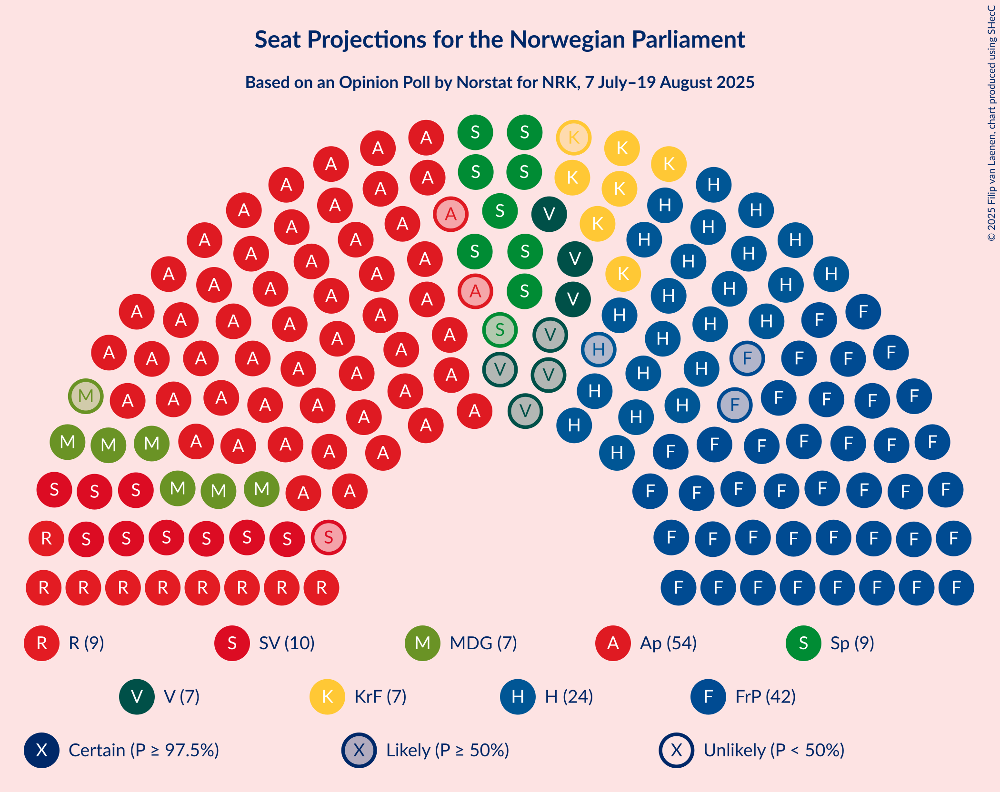
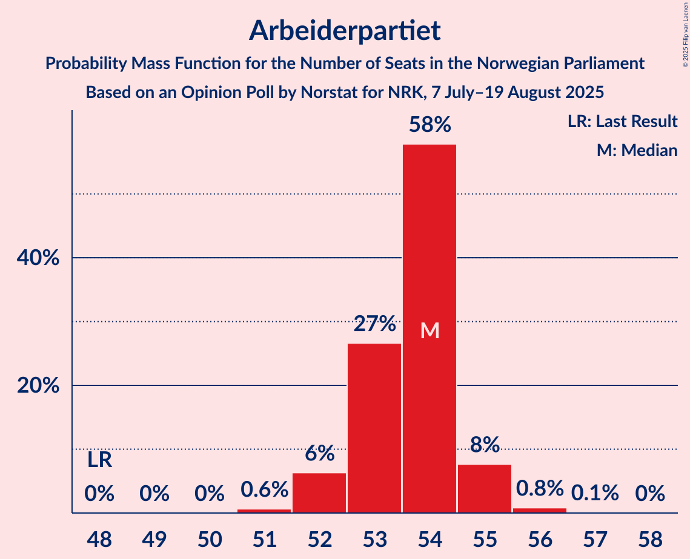
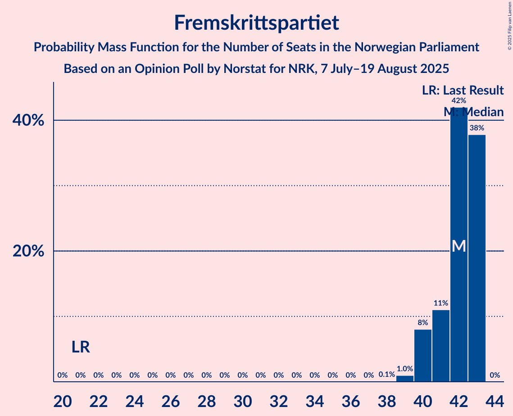
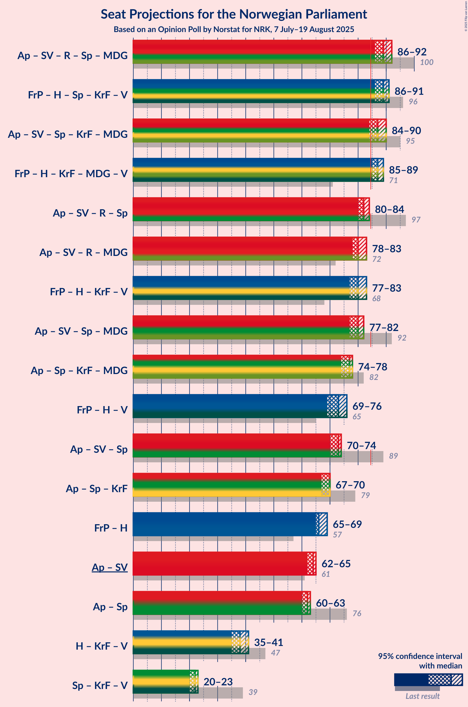
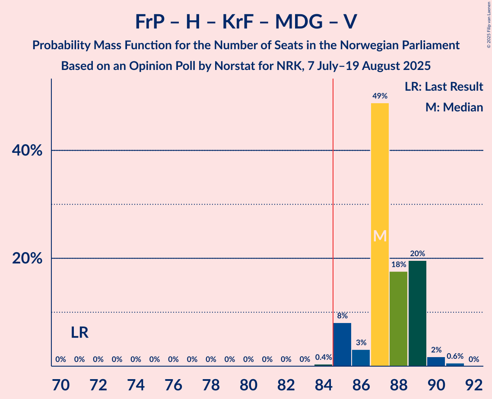
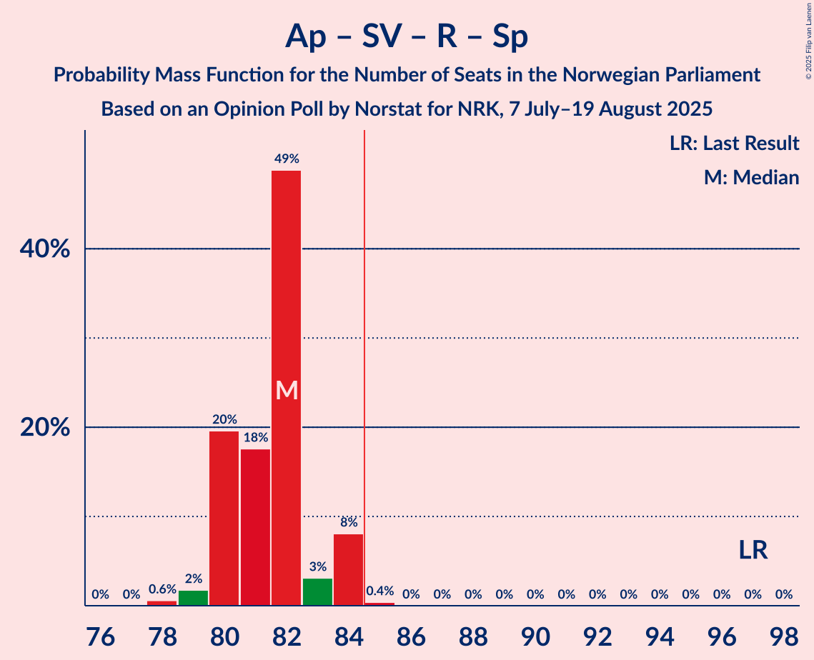
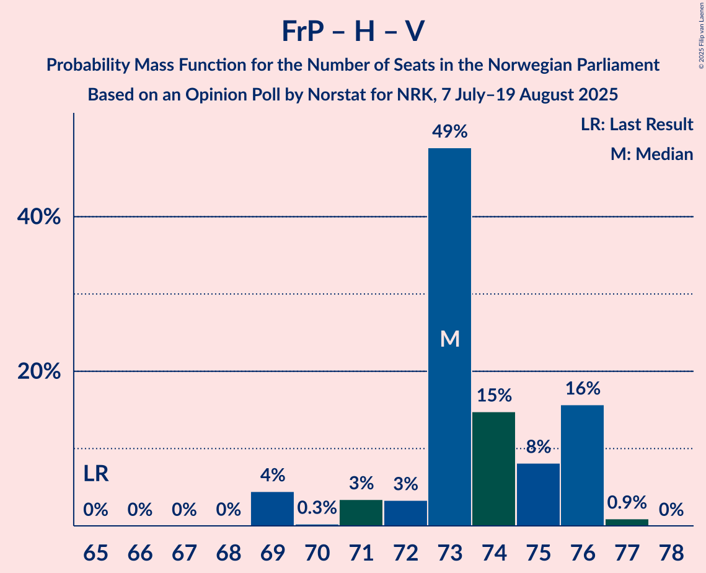
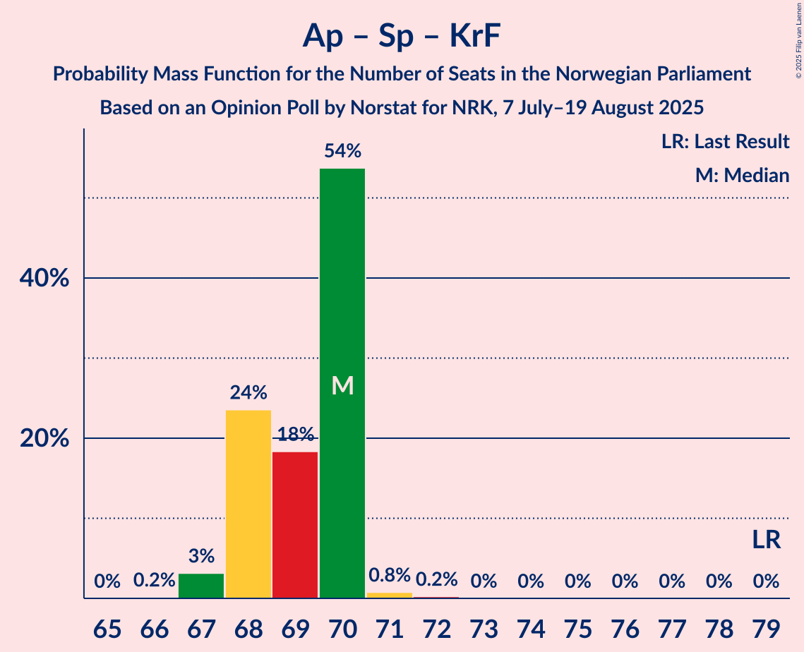
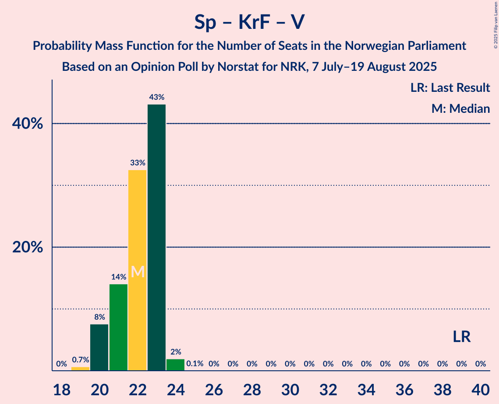

# Opinion Poll by Norstat for NRK, 7 July–19 August 2025

<a href="#voting-intentions">Voting Intentions</a> | <a href="#seats">Seats</a> | <a href="#coalitions">Coalitions</a> | <a href="#technical-information">Technical Information</a>

## Voting Intentions

### Confidence Intervals

| Party | Last Result | Poll Result | 80% Confidence Interval | 90% Confidence Interval | 95% Confidence Interval | 99% Confidence Interval |
|:-----:|:-----------:|:-----------:|:-----------------------:|:-----------------------:|:-----------------------:|:-----------------------:|
| Arbeiderpartiet | 26.2% | 27.6% | 27.1–28.1% |27.0–28.2% |26.9–28.3% |26.7–28.5% |
| Fremskrittspartiet | 11.6% | 21.2% | 20.8–21.6% |20.7–21.7% |20.5–21.9% |20.3–22.1% |
| Høyre | 20.4% | 14.6% | 14.2–15.0% |14.1–15.1% |14.0–15.2% |13.9–15.3% |
| Sosialistisk Venstreparti | 7.6% | 6.8% | 6.5–7.1% |6.5–7.1% |6.4–7.2% |6.3–7.3% |
| Rødt | 4.7% | 6.4% | 6.1–6.7% |6.1–6.7% |6.0–6.8% |5.9–6.9% |
| Senterpartiet | 13.5% | 5.6% | 5.4–5.9% |5.3–5.9% |5.2–6.0% |5.1–6.1% |
| Kristelig Folkeparti | 3.8% | 4.7% | 4.5–4.9% |4.4–5.0% |4.4–5.0% |4.3–5.2% |
| Miljøpartiet De Grønne | 3.9% | 4.6% | 4.4–4.8% |4.3–4.9% |4.3–5.0% |4.2–5.1% |
| Venstre | 4.6% | 4.4% | 4.2–4.6% |4.1–4.7% |4.1–4.7% |4.0–4.8% |
| Norgesdemokratene | 1.1% | 1.0% | 0.9–1.1% |0.9–1.1% |0.9–1.2% |0.8–1.2% |
| Konservativt | 0.4% | 0.7% | 0.6–0.8% |0.6–0.8% |0.6–0.9% |0.5–0.9% |
| Industri- og Næringspartiet | 0.3% | 0.6% | 0.5–0.7% |0.5–0.7% |0.5–0.7% |0.4–0.8% |
| Pensjonistpartiet | 0.6% | 0.4% | 0.3–0.5% |0.3–0.5% |0.3–0.5% |0.3–0.6% |

*Note:* The poll result column reflects the actual value used in the calculations. Published results may vary slightly, and in addition be rounded to fewer digits.

## Seats

### Confidence Intervals

| Party | Last Result | Median | 80% Confidence Interval | 90% Confidence Interval | 95% Confidence Interval | 99% Confidence Interval |
|:-----:|:-----------:|:------:|:-----------------------:|:-----------------------:|:-----------------------:|:-----------------------:|
| <a href="#arbeiderpartiet">Arbeiderpartiet</a> | 48 | 54 | 53–54 |52–55 |52–55 |51–56 |
| <a href="#fremskrittspartiet">Fremskrittspartiet</a> | 21 | 42 | 41–43 |40–43 |40–43 |39–43 |
| <a href="#høyre">Høyre</a> | 36 | 24 | 23–27 |23–28 |23–28 |23–28 |
| <a href="#sosialistisk-venstreparti">Sosialistisk Venstreparti</a> | 13 | 10 | 10–11 |9–11 |9–12 |9–12 |
| <a href="#rødt">Rødt</a> | 8 | 9 | 9–10 |9–10 |9–10 |8–10 |
| <a href="#senterpartiet">Senterpartiet</a> | 28 | 9 | 8–9 |8–9 |8–9 |7–9 |
| <a href="#kristelig-folkeparti">Kristelig Folkeparti</a> | 3 | 7 | 7 |7–8 |6–8 |6–8 |
| <a href="#miljøpartiet-de-grønne">Miljøpartiet De Grønne</a> | 3 | 7 | 6–7 |6–8 |6–8 |6–8 |
| <a href="#venstre">Venstre</a> | 8 | 7 | 6–7 |6–7 |3–7 |3–7 |
| <a href="#norgesdemokratene">Norgesdemokratene</a> | 0 | 0 | 0 |0 |0 |0 |
| <a href="#konservativt">Konservativt</a> | 0 | 0 | 0 |0 |0 |0 |
| <a href="#industri--og-næringspartiet">Industri- og Næringspartiet</a> | 0 | 0 | 0 |0 |0 |0 |
| <a href="#pensjonistpartiet">Pensjonistpartiet</a> | 0 | 0 | 0 |0 |0 |0 |

### Arbeiderpartiet

*For a full overview of the results for this party, see the [Arbeiderpartiet](party-arbeiderpartiet.html) page.*

| Number of Seats | Probability | Accumulated | Special Marks |
|:---------------:|:-----------:|:-----------:|:-------------:|
| 48 | 0% | 100% | Last Result |
| 49 | 0% | 100% |  |
| 50 | 0% | 100% |  |
| 51 | 0.6% | 100% |  |
| 52 | 6% | 99.4% |  |
| 53 | 27% | 93% |  |
| 54 | 58% | 66% | Median |
| 55 | 8% | 9% |  |
| 56 | 0.8% | 0.9% |  |
| 57 | 0.1% | 0.1% |  |
| 58 | 0% | 0% |  |

### Fremskrittspartiet

*For a full overview of the results for this party, see the [Fremskrittspartiet](party-fremskrittspartiet.html) page.*

| Number of Seats | Probability | Accumulated | Special Marks |
|:---------------:|:-----------:|:-----------:|:-------------:|
| 21 | 0% | 100% | Last Result |
| 22 | 0% | 100% |  |
| 23 | 0% | 100% |  |
| 24 | 0% | 100% |  |
| 25 | 0% | 100% |  |
| 26 | 0% | 100% |  |
| 27 | 0% | 100% |  |
| 28 | 0% | 100% |  |
| 29 | 0% | 100% |  |
| 30 | 0% | 100% |  |
| 31 | 0% | 100% |  |
| 32 | 0% | 100% |  |
| 33 | 0% | 100% |  |
| 34 | 0% | 100% |  |
| 35 | 0% | 100% |  |
| 36 | 0% | 100% |  |
| 37 | 0% | 100% |  |
| 38 | 0.1% | 100% |  |
| 39 | 1.0% | 99.9% |  |
| 40 | 8% | 98.9% |  |
| 41 | 11% | 91% |  |
| 42 | 42% | 80% | Median |
| 43 | 38% | 38% |  |
| 44 | 0% | 0% |  |

### Høyre

*For a full overview of the results for this party, see the [Høyre](party-høyre.html) page.*

| Number of Seats | Probability | Accumulated | Special Marks |
|:---------------:|:-----------:|:-----------:|:-------------:|
| 22 | 0.3% | 100% |  |
| 23 | 38% | 99.7% |  |
| 24 | 14% | 62% | Median |
| 25 | 7% | 48% |  |
| 26 | 10% | 41% |  |
| 27 | 25% | 31% |  |
| 28 | 6% | 6% |  |
| 29 | 0% | 0% |  |
| 30 | 0% | 0% |  |
| 31 | 0% | 0% |  |
| 32 | 0% | 0% |  |
| 33 | 0% | 0% |  |
| 34 | 0% | 0% |  |
| 35 | 0% | 0% |  |
| 36 | 0% | 0% | Last Result |

### Sosialistisk Venstreparti

*For a full overview of the results for this party, see the [Sosialistisk Venstreparti](party-sosialistiskvenstreparti.html) page.*

| Number of Seats | Probability | Accumulated | Special Marks |
|:---------------:|:-----------:|:-----------:|:-------------:|
| 9 | 9% | 100% |  |
| 10 | 78% | 91% | Median |
| 11 | 9% | 13% |  |
| 12 | 5% | 5% |  |
| 13 | 0% | 0% | Last Result |

### Rødt

*For a full overview of the results for this party, see the [Rødt](party-rødt.html) page.*

| Number of Seats | Probability | Accumulated | Special Marks |
|:---------------:|:-----------:|:-----------:|:-------------:|
| 8 | 0.6% | 100% | Last Result |
| 9 | 74% | 99.4% | Median |
| 10 | 24% | 25% |  |
| 11 | 0.5% | 0.5% |  |
| 12 | 0% | 0% |  |

### Senterpartiet

*For a full overview of the results for this party, see the [Senterpartiet](party-senterpartiet.html) page.*

| Number of Seats | Probability | Accumulated | Special Marks |
|:---------------:|:-----------:|:-----------:|:-------------:|
| 7 | 2% | 100% |  |
| 8 | 42% | 98% |  |
| 9 | 55% | 56% | Median |
| 10 | 0.2% | 0.2% |  |
| 11 | 0% | 0% |  |
| 12 | 0% | 0% |  |
| 13 | 0% | 0% |  |
| 14 | 0% | 0% |  |
| 15 | 0% | 0% |  |
| 16 | 0% | 0% |  |
| 17 | 0% | 0% |  |
| 18 | 0% | 0% |  |
| 19 | 0% | 0% |  |
| 20 | 0% | 0% |  |
| 21 | 0% | 0% |  |
| 22 | 0% | 0% |  |
| 23 | 0% | 0% |  |
| 24 | 0% | 0% |  |
| 25 | 0% | 0% |  |
| 26 | 0% | 0% |  |
| 27 | 0% | 0% |  |
| 28 | 0% | 0% | Last Result |

### Kristelig Folkeparti

*For a full overview of the results for this party, see the [Kristelig Folkeparti](party-kristeligfolkeparti.html) page.*

| Number of Seats | Probability | Accumulated | Special Marks |
|:---------------:|:-----------:|:-----------:|:-------------:|
| 3 | 0% | 100% | Last Result |
| 4 | 0% | 100% |  |
| 5 | 0% | 100% |  |
| 6 | 4% | 100% |  |
| 7 | 89% | 96% | Median |
| 8 | 7% | 7% |  |
| 9 | 0% | 0% |  |

### Miljøpartiet De Grønne

*For a full overview of the results for this party, see the [Miljøpartiet De Grønne](party-miljøpartietdegrønne.html) page.*

| Number of Seats | Probability | Accumulated | Special Marks |
|:---------------:|:-----------:|:-----------:|:-------------:|
| 3 | 0% | 100% | Last Result |
| 4 | 0% | 100% |  |
| 5 | 0% | 100% |  |
| 6 | 18% | 100% |  |
| 7 | 77% | 82% | Median |
| 8 | 5% | 5% |  |
| 9 | 0% | 0% |  |

### Venstre

*For a full overview of the results for this party, see the [Venstre](party-venstre.html) page.*

| Number of Seats | Probability | Accumulated | Special Marks |
|:---------------:|:-----------:|:-----------:|:-------------:|
| 3 | 5% | 100% |  |
| 4 | 0% | 95% |  |
| 5 | 0% | 95% |  |
| 6 | 21% | 95% |  |
| 7 | 74% | 74% | Median |
| 8 | 0.1% | 0.1% | Last Result |
| 9 | 0% | 0% |  |

### Norgesdemokratene

*For a full overview of the results for this party, see the [Norgesdemokratene](party-norgesdemokratene.html) page.*

| Number of Seats | Probability | Accumulated | Special Marks |
|:---------------:|:-----------:|:-----------:|:-------------:|
| 0 | 100% | 100% | Last Result, Median |

### Konservativt

*For a full overview of the results for this party, see the [Konservativt](party-konservativt.html) page.*

| Number of Seats | Probability | Accumulated | Special Marks |
|:---------------:|:-----------:|:-----------:|:-------------:|
| 0 | 100% | 100% | Last Result, Median |

### Industri- og Næringspartiet

*For a full overview of the results for this party, see the [Industri- og Næringspartiet](party-industri-ognæringspartiet.html) page.*

| Number of Seats | Probability | Accumulated | Special Marks |
|:---------------:|:-----------:|:-----------:|:-------------:|
| 0 | 100% | 100% | Last Result, Median |

### Pensjonistpartiet

*For a full overview of the results for this party, see the [Pensjonistpartiet](party-pensjonistpartiet.html) page.*

| Number of Seats | Probability | Accumulated | Special Marks |
|:---------------:|:-----------:|:-----------:|:-------------:|
| 0 | 100% | 100% | Last Result, Median |

## Coalitions

### Confidence Intervals

| Coalition | Last Result | Median | Majority? | 80% Confidence Interval | 90% Confidence Interval | 95% Confidence Interval | 99% Confidence Interval |
|:---------:|:-----------:|:------:|:---------:|:-----------------------:|:-----------------------:|:-----------------------:|:-----------------------:|
| Arbeiderpartiet – Sosialistisk Venstreparti – Rødt – Senterpartiet – Miljøpartiet De Grønne | 100 | 89 | 100% | 86–90 | 86–91 | 86–92 | 85–92 |
| Fremskrittspartiet – Høyre – Senterpartiet – Kristelig Folkeparti – Venstre | 96 | 89 | 100% | 88–91 | 86–91 | 86–91 | 86–92 |
| Arbeiderpartiet – Sosialistisk Venstreparti – Senterpartiet – Kristelig Folkeparti – Miljøpartiet De Grønne | 95 | 87 | 80% | 84–87 | 84–88 | 84–90 | 83–90 |
| Fremskrittspartiet – Høyre – Kristelig Folkeparti – Miljøpartiet De Grønne – Venstre | 71 | 87 | 99.6% | 86–89 | 85–89 | 85–89 | 85–91 |
| Arbeiderpartiet – Sosialistisk Venstreparti – Rødt – Senterpartiet | 97 | 82 | 0.4% | 80–83 | 80–84 | 80–84 | 78–84 |
| Arbeiderpartiet – Sosialistisk Venstreparti – Rødt – Miljøpartiet De Grønne | 72 | 80 | 0% | 78–81 | 78–83 | 78–83 | 77–83 |
| Fremskrittspartiet – Høyre – Kristelig Folkeparti – Venstre | 68 | 80 | 0% | 79–83 | 78–83 | 77–83 | 77–84 |
| Arbeiderpartiet – Sosialistisk Venstreparti – Senterpartiet – Miljøpartiet De Grønne | 92 | 80 | 0% | 77–80 | 77–81 | 77–82 | 76–82 |
| Arbeiderpartiet – Senterpartiet – Kristelig Folkeparti – Miljøpartiet De Grønne | 82 | 77 | 0% | 74–77 | 74–78 | 74–78 | 74–78 |
| Fremskrittspartiet – Høyre – Venstre | 65 | 73 | 0% | 72–76 | 71–76 | 69–76 | 69–77 |
| Arbeiderpartiet – Sosialistisk Venstreparti – Senterpartiet | 89 | 73 | 0% | 71–73 | 71–74 | 70–74 | 69–74 |
| Arbeiderpartiet – Senterpartiet – Kristelig Folkeparti | 79 | 70 | 0% | 68–70 | 68–70 | 67–70 | 67–71 |
| Fremskrittspartiet – Høyre | 57 | 66 | 0% | 66–69 | 65–69 | 65–69 | 64–70 |
| Arbeiderpartiet – Sosialistisk Venstreparti | 61 | 64 | 0% | 63–65 | 62–65 | 62–65 | 61–66 |
| Arbeiderpartiet – Senterpartiet | 76 | 62 | 0% | 61–63 | 61–63 | 60–63 | 60–64 |
| Høyre – Kristelig Folkeparti – Venstre | 47 | 38 | 0% | 37–41 | 37–41 | 35–41 | 35–42 |
| Senterpartiet – Kristelig Folkeparti – Venstre | 39 | 22 | 0% | 21–23 | 20–23 | 20–23 | 19–24 |

### Arbeiderpartiet – Sosialistisk Venstreparti – Rødt – Senterpartiet – Miljøpartiet De Grønne

| Number of Seats | Probability | Accumulated | Special Marks |
|:---------------:|:-----------:|:-----------:|:-------------:|
| 85 | 0.8% | 100% | Majority |
| 86 | 14% | 99.2% |  |
| 87 | 10% | 85% |  |
| 88 | 17% | 76% |  |
| 89 | 47% | 59% | Median |
| 90 | 4% | 12% |  |
| 91 | 3% | 8% |  |
| 92 | 5% | 5% |  |
| 93 | 0.2% | 0.2% |  |
| 94 | 0% | 0% |  |
| 95 | 0% | 0% |  |
| 96 | 0% | 0% |  |
| 97 | 0% | 0% |  |
| 98 | 0% | 0% |  |
| 99 | 0% | 0% |  |
| 100 | 0% | 0% | Last Result |

### Fremskrittspartiet – Høyre – Senterpartiet – Kristelig Folkeparti – Venstre

| Number of Seats | Probability | Accumulated | Special Marks |
|:---------------:|:-----------:|:-----------:|:-------------:|
| 85 | 0.3% | 100% | Majority |
| 86 | 6% | 99.7% |  |
| 87 | 4% | 94% |  |
| 88 | 11% | 90% |  |
| 89 | 52% | 79% | Median |
| 90 | 9% | 27% |  |
| 91 | 17% | 18% |  |
| 92 | 1.4% | 1.4% |  |
| 93 | 0% | 0% |  |
| 94 | 0% | 0% |  |
| 95 | 0% | 0% |  |
| 96 | 0% | 0% | Last Result |

### Arbeiderpartiet – Sosialistisk Venstreparti – Senterpartiet – Kristelig Folkeparti – Miljøpartiet De Grønne

| Number of Seats | Probability | Accumulated | Special Marks |
|:---------------:|:-----------:|:-----------:|:-------------:|
| 83 | 1.0% | 100% |  |
| 84 | 19% | 98.9% |  |
| 85 | 8% | 80% | Majority |
| 86 | 20% | 72% |  |
| 87 | 44% | 53% | Median |
| 88 | 4% | 9% |  |
| 89 | 0.3% | 5% |  |
| 90 | 4% | 4% |  |
| 91 | 0% | 0% |  |
| 92 | 0% | 0% |  |
| 93 | 0% | 0% |  |
| 94 | 0% | 0% |  |
| 95 | 0% | 0% | Last Result |

### Fremskrittspartiet – Høyre – Kristelig Folkeparti – Miljøpartiet De Grønne – Venstre

| Number of Seats | Probability | Accumulated | Special Marks |
|:---------------:|:-----------:|:-----------:|:-------------:|
| 71 | 0% | 100% | Last Result |
| 72 | 0% | 100% |  |
| 73 | 0% | 100% |  |
| 74 | 0% | 100% |  |
| 75 | 0% | 100% |  |
| 76 | 0% | 100% |  |
| 77 | 0% | 100% |  |
| 78 | 0% | 100% |  |
| 79 | 0% | 100% |  |
| 80 | 0% | 100% |  |
| 81 | 0% | 100% |  |
| 82 | 0% | 100% |  |
| 83 | 0% | 100% |  |
| 84 | 0.4% | 100% |  |
| 85 | 8% | 99.6% | Majority |
| 86 | 3% | 91% |  |
| 87 | 49% | 88% | Median |
| 88 | 18% | 40% |  |
| 89 | 20% | 22% |  |
| 90 | 2% | 2% |  |
| 91 | 0.6% | 0.6% |  |
| 92 | 0% | 0% |  |

### Arbeiderpartiet – Sosialistisk Venstreparti – Rødt – Senterpartiet

| Number of Seats | Probability | Accumulated | Special Marks |
|:---------------:|:-----------:|:-----------:|:-------------:|
| 78 | 0.6% | 100% |  |
| 79 | 2% | 99.4% |  |
| 80 | 20% | 98% |  |
| 81 | 18% | 78% |  |
| 82 | 49% | 60% | Median |
| 83 | 3% | 12% |  |
| 84 | 8% | 9% |  |
| 85 | 0.4% | 0.4% | Majority |
| 86 | 0% | 0% |  |
| 87 | 0% | 0% |  |
| 88 | 0% | 0% |  |
| 89 | 0% | 0% |  |
| 90 | 0% | 0% |  |
| 91 | 0% | 0% |  |
| 92 | 0% | 0% |  |
| 93 | 0% | 0% |  |
| 94 | 0% | 0% |  |
| 95 | 0% | 0% |  |
| 96 | 0% | 0% |  |
| 97 | 0% | 0% | Last Result |

### Arbeiderpartiet – Sosialistisk Venstreparti – Rødt – Miljøpartiet De Grønne

| Number of Seats | Probability | Accumulated | Special Marks |
|:---------------:|:-----------:|:-----------:|:-------------:|
| 72 | 0% | 100% | Last Result |
| 73 | 0% | 100% |  |
| 74 | 0% | 100% |  |
| 75 | 0% | 100% |  |
| 76 | 0% | 100% |  |
| 77 | 1.4% | 100% |  |
| 78 | 17% | 98.6% |  |
| 79 | 9% | 82% |  |
| 80 | 52% | 73% | Median |
| 81 | 11% | 21% |  |
| 82 | 4% | 10% |  |
| 83 | 6% | 6% |  |
| 84 | 0.3% | 0.3% |  |
| 85 | 0% | 0% | Majority |

### Fremskrittspartiet – Høyre – Kristelig Folkeparti – Venstre

| Number of Seats | Probability | Accumulated | Special Marks |
|:---------------:|:-----------:|:-----------:|:-------------:|
| 68 | 0% | 100% | Last Result |
| 69 | 0% | 100% |  |
| 70 | 0% | 100% |  |
| 71 | 0% | 100% |  |
| 72 | 0% | 100% |  |
| 73 | 0% | 100% |  |
| 74 | 0% | 100% |  |
| 75 | 0% | 100% |  |
| 76 | 0.2% | 100% |  |
| 77 | 5% | 99.8% |  |
| 78 | 3% | 95% |  |
| 79 | 4% | 92% |  |
| 80 | 47% | 88% | Median |
| 81 | 17% | 41% |  |
| 82 | 10% | 24% |  |
| 83 | 14% | 15% |  |
| 84 | 0.8% | 0.8% |  |
| 85 | 0% | 0% | Majority |

### Arbeiderpartiet – Sosialistisk Venstreparti – Senterpartiet – Miljøpartiet De Grønne

| Number of Seats | Probability | Accumulated | Special Marks |
|:---------------:|:-----------:|:-----------:|:-------------:|
| 76 | 0.9% | 100% |  |
| 77 | 17% | 99.1% |  |
| 78 | 10% | 82% |  |
| 79 | 22% | 73% |  |
| 80 | 42% | 51% | Median |
| 81 | 4% | 9% |  |
| 82 | 5% | 5% |  |
| 83 | 0.2% | 0.2% |  |
| 84 | 0% | 0% |  |
| 85 | 0% | 0% | Majority |
| 86 | 0% | 0% |  |
| 87 | 0% | 0% |  |
| 88 | 0% | 0% |  |
| 89 | 0% | 0% |  |
| 90 | 0% | 0% |  |
| 91 | 0% | 0% |  |
| 92 | 0% | 0% | Last Result |

### Arbeiderpartiet – Senterpartiet – Kristelig Folkeparti – Miljøpartiet De Grønne

| Number of Seats | Probability | Accumulated | Special Marks |
|:---------------:|:-----------:|:-----------:|:-------------:|
| 73 | 0.3% | 100% |  |
| 74 | 17% | 99.7% |  |
| 75 | 10% | 82% |  |
| 76 | 20% | 73% |  |
| 77 | 47% | 53% | Median |
| 78 | 5% | 5% |  |
| 79 | 0.3% | 0.3% |  |
| 80 | 0% | 0% |  |
| 81 | 0% | 0% |  |
| 82 | 0% | 0% | Last Result |

### Fremskrittspartiet – Høyre – Venstre

| Number of Seats | Probability | Accumulated | Special Marks |
|:---------------:|:-----------:|:-----------:|:-------------:|
| 65 | 0% | 100% | Last Result |
| 66 | 0% | 100% |  |
| 67 | 0% | 100% |  |
| 68 | 0% | 100% |  |
| 69 | 4% | 100% |  |
| 70 | 0.3% | 96% |  |
| 71 | 3% | 95% |  |
| 72 | 3% | 92% |  |
| 73 | 49% | 88% | Median |
| 74 | 15% | 40% |  |
| 75 | 8% | 25% |  |
| 76 | 16% | 17% |  |
| 77 | 0.9% | 0.9% |  |
| 78 | 0% | 0% |  |

### Arbeiderpartiet – Sosialistisk Venstreparti – Senterpartiet

| Number of Seats | Probability | Accumulated | Special Marks |
|:---------------:|:-----------:|:-----------:|:-------------:|
| 69 | 0.6% | 100% |  |
| 70 | 3% | 99.4% |  |
| 71 | 22% | 96% |  |
| 72 | 23% | 74% |  |
| 73 | 42% | 51% | Median |
| 74 | 9% | 9% |  |
| 75 | 0.4% | 0.5% |  |
| 76 | 0% | 0% |  |
| 77 | 0% | 0% |  |
| 78 | 0% | 0% |  |
| 79 | 0% | 0% |  |
| 80 | 0% | 0% |  |
| 81 | 0% | 0% |  |
| 82 | 0% | 0% |  |
| 83 | 0% | 0% |  |
| 84 | 0% | 0% |  |
| 85 | 0% | 0% | Majority |
| 86 | 0% | 0% |  |
| 87 | 0% | 0% |  |
| 88 | 0% | 0% |  |
| 89 | 0% | 0% | Last Result |

### Arbeiderpartiet – Senterpartiet – Kristelig Folkeparti

| Number of Seats | Probability | Accumulated | Special Marks |
|:---------------:|:-----------:|:-----------:|:-------------:|
| 66 | 0.2% | 100% |  |
| 67 | 3% | 99.8% |  |
| 68 | 24% | 97% |  |
| 69 | 18% | 73% |  |
| 70 | 54% | 55% | Median |
| 71 | 0.8% | 1.0% |  |
| 72 | 0.2% | 0.3% |  |
| 73 | 0% | 0% |  |
| 74 | 0% | 0% |  |
| 75 | 0% | 0% |  |
| 76 | 0% | 0% |  |
| 77 | 0% | 0% |  |
| 78 | 0% | 0% |  |
| 79 | 0% | 0% | Last Result |

### Fremskrittspartiet – Høyre

| Number of Seats | Probability | Accumulated | Special Marks |
|:---------------:|:-----------:|:-----------:|:-------------:|
| 57 | 0% | 100% | Last Result |
| 58 | 0% | 100% |  |
| 59 | 0% | 100% |  |
| 60 | 0% | 100% |  |
| 61 | 0% | 100% |  |
| 62 | 0% | 100% |  |
| 63 | 0.1% | 100% |  |
| 64 | 1.3% | 99.8% |  |
| 65 | 4% | 98.6% |  |
| 66 | 54% | 95% | Median |
| 67 | 5% | 41% |  |
| 68 | 14% | 36% |  |
| 69 | 20% | 22% |  |
| 70 | 2% | 2% |  |
| 71 | 0% | 0% |  |

### Arbeiderpartiet – Sosialistisk Venstreparti

| Number of Seats | Probability | Accumulated | Special Marks |
|:---------------:|:-----------:|:-----------:|:-------------:|
| 61 | 1.4% | 100% | Last Result |
| 62 | 5% | 98.6% |  |
| 63 | 23% | 93% |  |
| 64 | 56% | 70% | Median |
| 65 | 11% | 13% |  |
| 66 | 2% | 2% |  |
| 67 | 0.2% | 0.2% |  |
| 68 | 0% | 0% |  |

### Arbeiderpartiet – Senterpartiet

| Number of Seats | Probability | Accumulated | Special Marks |
|:---------------:|:-----------:|:-----------:|:-------------:|
| 60 | 3% | 100% |  |
| 61 | 22% | 97% |  |
| 62 | 27% | 75% |  |
| 63 | 48% | 49% | Median |
| 64 | 0.9% | 1.1% |  |
| 65 | 0.2% | 0.2% |  |
| 66 | 0% | 0% |  |
| 67 | 0% | 0% |  |
| 68 | 0% | 0% |  |
| 69 | 0% | 0% |  |
| 70 | 0% | 0% |  |
| 71 | 0% | 0% |  |
| 72 | 0% | 0% |  |
| 73 | 0% | 0% |  |
| 74 | 0% | 0% |  |
| 75 | 0% | 0% |  |
| 76 | 0% | 0% | Last Result |

### Høyre – Kristelig Folkeparti – Venstre

| Number of Seats | Probability | Accumulated | Special Marks |
|:---------------:|:-----------:|:-----------:|:-------------:|
| 35 | 5% | 100% |  |
| 36 | 0.2% | 95% |  |
| 37 | 40% | 95% |  |
| 38 | 10% | 56% | Median |
| 39 | 11% | 46% |  |
| 40 | 14% | 34% |  |
| 41 | 18% | 21% |  |
| 42 | 2% | 2% |  |
| 43 | 0% | 0% |  |
| 44 | 0% | 0% |  |
| 45 | 0% | 0% |  |
| 46 | 0% | 0% |  |
| 47 | 0% | 0% | Last Result |

### Senterpartiet – Kristelig Folkeparti – Venstre

| Number of Seats | Probability | Accumulated | Special Marks |
|:---------------:|:-----------:|:-----------:|:-------------:|
| 19 | 0.7% | 100% |  |
| 20 | 8% | 99.3% |  |
| 21 | 14% | 92% |  |
| 22 | 33% | 78% |  |
| 23 | 43% | 45% | Median |
| 24 | 2% | 2% |  |
| 25 | 0.1% | 0.1% |  |
| 26 | 0% | 0% |  |
| 27 | 0% | 0% |  |
| 28 | 0% | 0% |  |
| 29 | 0% | 0% |  |
| 30 | 0% | 0% |  |
| 31 | 0% | 0% |  |
| 32 | 0% | 0% |  |
| 33 | 0% | 0% |  |
| 34 | 0% | 0% |  |
| 35 | 0% | 0% |  |
| 36 | 0% | 0% |  |
| 37 | 0% | 0% |  |
| 38 | 0% | 0% |  |
| 39 | 0% | 0% | Last Result |

## Technical Information

### Opinion Poll

+ **Polling firm:** Norstat
+ **Commissioner(s):** NRK
+ **Fieldwork period:** 7 July–19 August 2025

### Calculations

+ **Sample size:** 15200
+ **Simulations done:** 2,097,152
+ **Error estimate:** 0.64%

