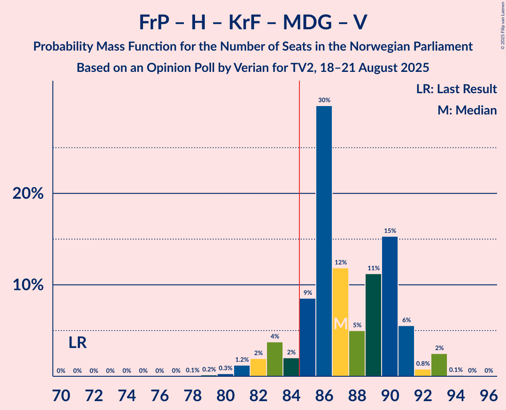
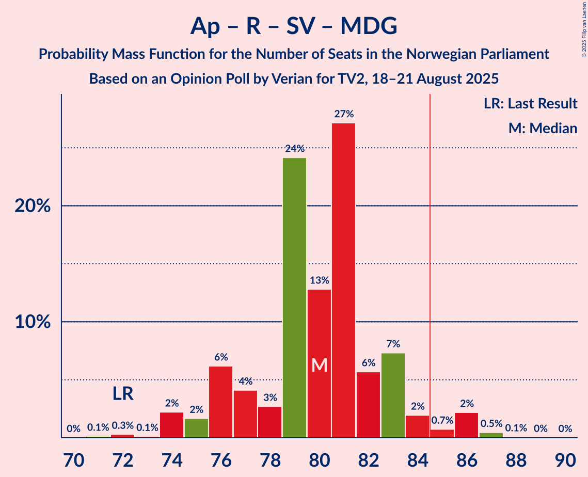

# Opinion Poll by Verian for TV2, 18–21 August 2025

<a href="#voting-intentions">Voting Intentions</a> | <a href="#seats">Seats</a> | <a href="#coalitions">Coalitions</a> | <a href="#technical-information">Technical Information</a>

## Voting Intentions

### Confidence Intervals

| Party | Last Result | Poll Result | 80% Confidence Interval | 90% Confidence Interval | 95% Confidence Interval | 99% Confidence Interval |
|:-----:|:-----------:|:-----------:|:-----------------------:|:-----------------------:|:-----------------------:|:-----------------------:|
| Arbeiderpartiet | 26.2% | 26.7% | 25.1–28.4% |24.6–28.8% |24.2–29.2% |23.5–30.1% |
| Fremskrittspartiet | 11.6% | 22.8% | 21.3–24.4% |20.9–24.9% |20.5–25.3% |19.8–26.1% |
| Høyre | 20.4% | 14.9% | 13.6–16.3% |13.3–16.7% |13.0–17.0% |12.4–17.7% |
| Rødt | 4.7% | 7.3% | 6.4–8.4% |6.2–8.7% |6.0–8.9% |5.6–9.5% |
| Senterpartiet | 13.5% | 6.0% | 5.2–7.0% |5.0–7.2% |4.8–7.5% |4.4–8.0% |
| Sosialistisk Venstreparti | 7.6% | 5.8% | 5.0–6.8% |4.8–7.0% |4.6–7.3% |4.3–7.8% |
| Kristelig Folkeparti | 3.8% | 5.2% | 4.5–6.1% |4.3–6.4% |4.1–6.6% |3.7–7.1% |
| Miljøpartiet De Grønne | 3.9% | 4.8% | 4.1–5.7% |3.9–5.9% |3.7–6.2% |3.4–6.6% |
| Venstre | 4.6% | 3.2% | 2.6–4.0% |2.5–4.2% |2.3–4.4% |2.1–4.8% |
| Konservativt | 0.4% | 0.8% | 0.6–1.3% |0.5–1.4% |0.5–1.6% |0.4–1.8% |
| Norgesdemokratene | 1.1% | 0.7% | 0.4–1.1% |0.4–1.2% |0.3–1.3% |0.3–1.6% |
| Pensjonistpartiet | 0.6% | 0.6% | 0.4–1.0% |0.3–1.1% |0.3–1.2% |0.2–1.4% |
| Industri- og Næringspartiet | 0.3% | 0.4% | 0.3–0.8% |0.2–0.9% |0.2–1.0% |0.1–1.2% |

*Note:* The poll result column reflects the actual value used in the calculations. Published results may vary slightly, and in addition be rounded to fewer digits.

## Seats

### Confidence Intervals

| Party | Last Result | Median | 80% Confidence Interval | 90% Confidence Interval | 95% Confidence Interval | 99% Confidence Interval |
|:-----:|:-----------:|:------:|:-----------------------:|:-----------------------:|:-----------------------:|:-----------------------:|
| <a href="#arbeiderpartiet">Arbeiderpartiet</a> | 48 | 51 | 48–53 |46–54 |46–55 |46–56 |
| <a href="#fremskrittspartiet">Fremskrittspartiet</a> | 21 | 43 | 39–45 |38–45 |38–46 |37–50 |
| <a href="#høyre">Høyre</a> | 36 | 25 | 22–30 |22–31 |21–31 |19–31 |
| <a href="#rødt">Rødt</a> | 8 | 13 | 10–13 |10–14 |10–15 |10–15 |
| <a href="#senterpartiet">Senterpartiet</a> | 28 | 9 | 8–11 |8–13 |8–13 |7–14 |
| <a href="#sosialistisk-venstreparti">Sosialistisk Venstreparti</a> | 13 | 9 | 8–11 |8–11 |7–11 |7–12 |
| <a href="#kristelig-folkeparti">Kristelig Folkeparti</a> | 3 | 8 | 8–10 |7–11 |6–11 |3–12 |
| <a href="#miljøpartiet-de-grønne">Miljøpartiet De Grønne</a> | 3 | 8 | 7–9 |7–9 |3–10 |3–11 |
| <a href="#venstre">Venstre</a> | 8 | 3 | 2–3 |2–6 |1–6 |1–8 |
| <a href="#konservativt">Konservativt</a> | 0 | 0 | 0 |0 |0 |0 |
| <a href="#norgesdemokratene">Norgesdemokratene</a> | 0 | 0 | 0 |0 |0 |0 |
| <a href="#pensjonistpartiet">Pensjonistpartiet</a> | 0 | 0 | 0 |0 |0 |0 |
| <a href="#industri--og-næringspartiet">Industri- og Næringspartiet</a> | 0 | 0 | 0 |0 |0 |0 |

### Arbeiderpartiet

*For a full overview of the results for this party, see the [Arbeiderpartiet](party-arbeiderpartiet.html) page.*

| Number of Seats | Probability | Accumulated | Special Marks |
|:---------------:|:-----------:|:-----------:|:-------------:|
| 44 | 0.1% | 100% |  |
| 45 | 0.3% | 99.9% |  |
| 46 | 7% | 99.6% |  |
| 47 | 1.4% | 92% |  |
| 48 | 8% | 91% | Last Result |
| 49 | 11% | 83% |  |
| 50 | 11% | 72% |  |
| 51 | 12% | 60% | Median |
| 52 | 28% | 48% |  |
| 53 | 14% | 21% |  |
| 54 | 3% | 6% |  |
| 55 | 2% | 4% |  |
| 56 | 2% | 2% |  |
| 57 | 0% | 0.2% |  |
| 58 | 0.1% | 0.2% |  |
| 59 | 0% | 0.1% |  |
| 60 | 0% | 0% |  |

### Fremskrittspartiet

*For a full overview of the results for this party, see the [Fremskrittspartiet](party-fremskrittspartiet.html) page.*

| Number of Seats | Probability | Accumulated | Special Marks |
|:---------------:|:-----------:|:-----------:|:-------------:|
| 21 | 0% | 100% | Last Result |
| 22 | 0% | 100% |  |
| 23 | 0% | 100% |  |
| 24 | 0% | 100% |  |
| 25 | 0% | 100% |  |
| 26 | 0% | 100% |  |
| 27 | 0% | 100% |  |
| 28 | 0% | 100% |  |
| 29 | 0% | 100% |  |
| 30 | 0% | 100% |  |
| 31 | 0% | 100% |  |
| 32 | 0% | 100% |  |
| 33 | 0% | 100% |  |
| 34 | 0% | 100% |  |
| 35 | 0% | 100% |  |
| 36 | 0.2% | 100% |  |
| 37 | 0.8% | 99.8% |  |
| 38 | 4% | 99.0% |  |
| 39 | 6% | 95% |  |
| 40 | 20% | 89% |  |
| 41 | 5% | 68% |  |
| 42 | 9% | 63% |  |
| 43 | 32% | 54% | Median |
| 44 | 5% | 22% |  |
| 45 | 13% | 16% |  |
| 46 | 2% | 3% |  |
| 47 | 0.2% | 0.9% |  |
| 48 | 0.1% | 0.7% |  |
| 49 | 0% | 0.5% |  |
| 50 | 0% | 0.5% |  |
| 51 | 0.4% | 0.5% |  |
| 52 | 0% | 0% |  |

### Høyre

*For a full overview of the results for this party, see the [Høyre](party-høyre.html) page.*

| Number of Seats | Probability | Accumulated | Special Marks |
|:---------------:|:-----------:|:-----------:|:-------------:|
| 18 | 0.1% | 100% |  |
| 19 | 1.0% | 99.9% |  |
| 20 | 0.5% | 98.9% |  |
| 21 | 1.3% | 98% |  |
| 22 | 8% | 97% |  |
| 23 | 2% | 90% |  |
| 24 | 8% | 88% |  |
| 25 | 37% | 80% | Median |
| 26 | 8% | 43% |  |
| 27 | 5% | 35% |  |
| 28 | 3% | 31% |  |
| 29 | 12% | 28% |  |
| 30 | 9% | 16% |  |
| 31 | 6% | 7% |  |
| 32 | 0.3% | 0.4% |  |
| 33 | 0.1% | 0.2% |  |
| 34 | 0% | 0% |  |
| 35 | 0% | 0% |  |
| 36 | 0% | 0% | Last Result |

### Rødt

*For a full overview of the results for this party, see the [Rødt](party-rødt.html) page.*

| Number of Seats | Probability | Accumulated | Special Marks |
|:---------------:|:-----------:|:-----------:|:-------------:|
| 8 | 0.2% | 100% | Last Result |
| 9 | 0.3% | 99.8% |  |
| 10 | 14% | 99.5% |  |
| 11 | 11% | 86% |  |
| 12 | 22% | 74% |  |
| 13 | 43% | 53% | Median |
| 14 | 7% | 9% |  |
| 15 | 2% | 3% |  |
| 16 | 0.2% | 0.3% |  |
| 17 | 0.1% | 0.1% |  |
| 18 | 0% | 0% |  |

### Senterpartiet

*For a full overview of the results for this party, see the [Senterpartiet](party-senterpartiet.html) page.*

| Number of Seats | Probability | Accumulated | Special Marks |
|:---------------:|:-----------:|:-----------:|:-------------:|
| 1 | 0.3% | 100% |  |
| 2 | 0% | 99.6% |  |
| 3 | 0% | 99.6% |  |
| 4 | 0% | 99.6% |  |
| 5 | 0% | 99.6% |  |
| 6 | 0.1% | 99.6% |  |
| 7 | 0.5% | 99.6% |  |
| 8 | 9% | 99.1% |  |
| 9 | 60% | 90% | Median |
| 10 | 17% | 30% |  |
| 11 | 4% | 12% |  |
| 12 | 2% | 8% |  |
| 13 | 5% | 6% |  |
| 14 | 0.7% | 0.7% |  |
| 15 | 0% | 0% |  |
| 16 | 0% | 0% |  |
| 17 | 0% | 0% |  |
| 18 | 0% | 0% |  |
| 19 | 0% | 0% |  |
| 20 | 0% | 0% |  |
| 21 | 0% | 0% |  |
| 22 | 0% | 0% |  |
| 23 | 0% | 0% |  |
| 24 | 0% | 0% |  |
| 25 | 0% | 0% |  |
| 26 | 0% | 0% |  |
| 27 | 0% | 0% |  |
| 28 | 0% | 0% | Last Result |

### Sosialistisk Venstreparti

*For a full overview of the results for this party, see the [Sosialistisk Venstreparti](party-sosialistiskvenstreparti.html) page.*

| Number of Seats | Probability | Accumulated | Special Marks |
|:---------------:|:-----------:|:-----------:|:-------------:|
| 2 | 0% | 100% |  |
| 3 | 0% | 99.9% |  |
| 4 | 0% | 99.9% |  |
| 5 | 0% | 99.9% |  |
| 6 | 0.1% | 99.9% |  |
| 7 | 4% | 99.8% |  |
| 8 | 18% | 96% |  |
| 9 | 46% | 78% | Median |
| 10 | 15% | 32% |  |
| 11 | 16% | 18% |  |
| 12 | 2% | 2% |  |
| 13 | 0.3% | 0.4% | Last Result |
| 14 | 0.1% | 0.1% |  |
| 15 | 0% | 0% |  |

### Kristelig Folkeparti

*For a full overview of the results for this party, see the [Kristelig Folkeparti](party-kristeligfolkeparti.html) page.*

| Number of Seats | Probability | Accumulated | Special Marks |
|:---------------:|:-----------:|:-----------:|:-------------:|
| 3 | 1.3% | 100% | Last Result |
| 4 | 0% | 98.7% |  |
| 5 | 0% | 98.7% |  |
| 6 | 3% | 98.7% |  |
| 7 | 6% | 96% |  |
| 8 | 47% | 90% | Median |
| 9 | 13% | 43% |  |
| 10 | 23% | 30% |  |
| 11 | 6% | 7% |  |
| 12 | 0.9% | 1.2% |  |
| 13 | 0.2% | 0.2% |  |
| 14 | 0% | 0% |  |

### Miljøpartiet De Grønne

*For a full overview of the results for this party, see the [Miljøpartiet De Grønne](party-miljøpartietdegrønne.html) page.*

| Number of Seats | Probability | Accumulated | Special Marks |
|:---------------:|:-----------:|:-----------:|:-------------:|
| 2 | 0.2% | 100% |  |
| 3 | 4% | 99.7% | Last Result |
| 4 | 0% | 96% |  |
| 5 | 0% | 96% |  |
| 6 | 0.1% | 96% |  |
| 7 | 44% | 95% |  |
| 8 | 24% | 52% | Median |
| 9 | 24% | 28% |  |
| 10 | 2% | 3% |  |
| 11 | 2% | 2% |  |
| 12 | 0.1% | 0.1% |  |
| 13 | 0% | 0% |  |

### Venstre

*For a full overview of the results for this party, see the [Venstre](party-venstre.html) page.*

| Number of Seats | Probability | Accumulated | Special Marks |
|:---------------:|:-----------:|:-----------:|:-------------:|
| 1 | 4% | 100% |  |
| 2 | 45% | 96% |  |
| 3 | 44% | 51% | Median |
| 4 | 0% | 7% |  |
| 5 | 0% | 7% |  |
| 6 | 5% | 7% |  |
| 7 | 2% | 2% |  |
| 8 | 0.4% | 0.5% | Last Result |
| 9 | 0.1% | 0.1% |  |
| 10 | 0% | 0% |  |

### Konservativt

*For a full overview of the results for this party, see the [Konservativt](party-konservativt.html) page.*

| Number of Seats | Probability | Accumulated | Special Marks |
|:---------------:|:-----------:|:-----------:|:-------------:|
| 0 | 100% | 100% | Last Result, Median |

### Norgesdemokratene

*For a full overview of the results for this party, see the [Norgesdemokratene](party-norgesdemokratene.html) page.*

| Number of Seats | Probability | Accumulated | Special Marks |
|:---------------:|:-----------:|:-----------:|:-------------:|
| 0 | 100% | 100% | Last Result, Median |

### Pensjonistpartiet

*For a full overview of the results for this party, see the [Pensjonistpartiet](party-pensjonistpartiet.html) page.*

| Number of Seats | Probability | Accumulated | Special Marks |
|:---------------:|:-----------:|:-----------:|:-------------:|
| 0 | 100% | 100% | Last Result, Median |

### Industri- og Næringspartiet

*For a full overview of the results for this party, see the [Industri- og Næringspartiet](party-industri-ognæringspartiet.html) page.*

| Number of Seats | Probability | Accumulated | Special Marks |
|:---------------:|:-----------:|:-----------:|:-------------:|
| 0 | 100% | 100% | Last Result, Median |

## Coalitions

### Confidence Intervals

| Coalition | Last Result | Median | Majority? | 80% Confidence Interval | 90% Confidence Interval | 95% Confidence Interval | 99% Confidence Interval |
|:---------:|:-----------:|:------:|:---------:|:-----------------------:|:-----------------------:|:-----------------------:|:-----------------------:|
| Arbeiderpartiet – Rødt – Senterpartiet – Sosialistisk Venstreparti – Miljøpartiet De Grønne | 100 | 90 | 97% | 86–93 | 86–94 | 84–95 | 83–97 |
| Fremskrittspartiet – Høyre – Senterpartiet – Kristelig Folkeparti – Venstre | 96 | 89 | 96% | 86–93 | 85–93 | 83–95 | 82–96 |
| Fremskrittspartiet – Høyre – Kristelig Folkeparti – Miljøpartiet De Grønne – Venstre | 71 | 87 | 91% | 85–90 | 83–91 | 82–93 | 80–93 |
| Arbeiderpartiet – Senterpartiet – Sosialistisk Venstreparti – Kristelig Folkeparti – Miljøpartiet De Grønne | 95 | 85 | 78% | 83–90 | 82–92 | 81–92 | 79–94 |
| Arbeiderpartiet – Rødt – Senterpartiet – Sosialistisk Venstreparti | 97 | 82 | 9% | 79–84 | 78–86 | 76–87 | 76–89 |
| Arbeiderpartiet – Rødt – Sosialistisk Venstreparti – Miljøpartiet De Grønne | 72 | 80 | 4% | 76–83 | 76–84 | 74–86 | 73–87 |
| Fremskrittspartiet – Høyre – Kristelig Folkeparti – Venstre | 68 | 79 | 3% | 76–83 | 75–83 | 74–85 | 72–86 |
| Arbeiderpartiet – Senterpartiet – Kristelig Folkeparti – Miljøpartiet De Grønne | 82 | 76 | 0.1% | 74–80 | 73–82 | 72–83 | 69–84 |
| Arbeiderpartiet – Senterpartiet – Sosialistisk Venstreparti – Miljøpartiet De Grønne | 92 | 77 | 0.8% | 73–81 | 72–81 | 72–83 | 70–86 |
| Fremskrittspartiet – Høyre – Venstre | 65 | 71 | 0% | 67–73 | 65–74 | 65–75 | 63–78 |
| Arbeiderpartiet – Senterpartiet – Kristelig Folkeparti | 79 | 69 | 0% | 66–72 | 65–74 | 64–74 | 62–75 |
| Arbeiderpartiet – Senterpartiet – Sosialistisk Venstreparti | 89 | 70 | 0% | 66–73 | 65–74 | 64–74 | 63–77 |
| Fremskrittspartiet – Høyre | 57 | 68 | 0% | 64–71 | 63–72 | 62–72 | 60–74 |
| Arbeiderpartiet – Senterpartiet | 76 | 61 | 0% | 57–63 | 56–64 | 56–65 | 55–66 |
| Arbeiderpartiet – Sosialistisk Venstreparti | 61 | 61 | 0% | 56–62 | 55–63 | 55–65 | 54–67 |
| Høyre – Kristelig Folkeparti – Venstre | 47 | 36 | 0% | 34–41 | 33–42 | 32–42 | 31–44 |
| Senterpartiet – Kristelig Folkeparti – Venstre | 39 | 20 | 0% | 19–24 | 18–25 | 17–25 | 15–28 |

### Arbeiderpartiet – Rødt – Senterpartiet – Sosialistisk Venstreparti – Miljøpartiet De Grønne

| Number of Seats | Probability | Accumulated | Special Marks |
|:---------------:|:-----------:|:-----------:|:-------------:|
| 80 | 0.1% | 100% |  |
| 81 | 0.1% | 99.9% |  |
| 82 | 0.3% | 99.9% |  |
| 83 | 0.2% | 99.6% |  |
| 84 | 2% | 99.3% |  |
| 85 | 1.3% | 97% | Majority |
| 86 | 8% | 96% |  |
| 87 | 3% | 88% |  |
| 88 | 21% | 85% |  |
| 89 | 12% | 64% |  |
| 90 | 29% | 51% | Median |
| 91 | 8% | 23% |  |
| 92 | 4% | 14% |  |
| 93 | 4% | 11% |  |
| 94 | 2% | 7% |  |
| 95 | 3% | 4% |  |
| 96 | 0.1% | 1.1% |  |
| 97 | 0.6% | 0.9% |  |
| 98 | 0.2% | 0.3% |  |
| 99 | 0.1% | 0.1% |  |
| 100 | 0% | 0.1% | Last Result |
| 101 | 0% | 0% |  |

### Fremskrittspartiet – Høyre – Senterpartiet – Kristelig Folkeparti – Venstre

| Number of Seats | Probability | Accumulated | Special Marks |
|:---------------:|:-----------:|:-----------:|:-------------:|
| 81 | 0.1% | 100% |  |
| 82 | 0.5% | 99.9% |  |
| 83 | 2% | 99.4% |  |
| 84 | 0.7% | 97% |  |
| 85 | 2% | 96% | Majority |
| 86 | 7% | 95% |  |
| 87 | 6% | 87% |  |
| 88 | 27% | 82% | Median |
| 89 | 13% | 54% |  |
| 90 | 24% | 42% |  |
| 91 | 3% | 17% |  |
| 92 | 4% | 15% |  |
| 93 | 6% | 11% |  |
| 94 | 2% | 4% |  |
| 95 | 2% | 3% |  |
| 96 | 0.1% | 0.5% | Last Result |
| 97 | 0.3% | 0.4% |  |
| 98 | 0.1% | 0.2% |  |
| 99 | 0% | 0% |  |

### Fremskrittspartiet – Høyre – Kristelig Folkeparti – Miljøpartiet De Grønne – Venstre

| Number of Seats | Probability | Accumulated | Special Marks |
|:---------------:|:-----------:|:-----------:|:-------------:|
| 71 | 0% | 100% | Last Result |
| 72 | 0% | 100% |  |
| 73 | 0% | 100% |  |
| 74 | 0% | 100% |  |
| 75 | 0% | 100% |  |
| 76 | 0% | 100% |  |
| 77 | 0% | 100% |  |
| 78 | 0.1% | 100% |  |
| 79 | 0.2% | 99.9% |  |
| 80 | 0.3% | 99.7% |  |
| 81 | 1.2% | 99.5% |  |
| 82 | 2% | 98% |  |
| 83 | 4% | 96% |  |
| 84 | 2% | 93% |  |
| 85 | 9% | 91% | Majority |
| 86 | 30% | 82% |  |
| 87 | 12% | 52% | Median |
| 88 | 5% | 41% |  |
| 89 | 11% | 36% |  |
| 90 | 15% | 24% |  |
| 91 | 6% | 9% |  |
| 92 | 0.8% | 3% |  |
| 93 | 2% | 3% |  |
| 94 | 0.1% | 0.2% |  |
| 95 | 0% | 0.1% |  |
| 96 | 0% | 0% |  |

### Arbeiderpartiet – Senterpartiet – Sosialistisk Venstreparti – Kristelig Folkeparti – Miljøpartiet De Grønne

| Number of Seats | Probability | Accumulated | Special Marks |
|:---------------:|:-----------:|:-----------:|:-------------:|
| 77 | 0.1% | 100% |  |
| 78 | 0.1% | 99.9% |  |
| 79 | 0.6% | 99.8% |  |
| 80 | 0.4% | 99.1% |  |
| 81 | 3% | 98.8% |  |
| 82 | 3% | 96% |  |
| 83 | 8% | 92% |  |
| 84 | 7% | 84% |  |
| 85 | 43% | 78% | Median, Majority |
| 86 | 3% | 35% |  |
| 87 | 3% | 31% |  |
| 88 | 16% | 29% |  |
| 89 | 1.5% | 12% |  |
| 90 | 3% | 11% |  |
| 91 | 3% | 8% |  |
| 92 | 4% | 5% |  |
| 93 | 0.1% | 0.8% |  |
| 94 | 0.2% | 0.7% |  |
| 95 | 0.4% | 0.4% | Last Result |
| 96 | 0.1% | 0.1% |  |
| 97 | 0% | 0% |  |

### Arbeiderpartiet – Rødt – Senterpartiet – Sosialistisk Venstreparti

| Number of Seats | Probability | Accumulated | Special Marks |
|:---------------:|:-----------:|:-----------:|:-------------:|
| 74 | 0.1% | 100% |  |
| 75 | 0.1% | 99.9% |  |
| 76 | 2% | 99.8% |  |
| 77 | 0.8% | 97% |  |
| 78 | 6% | 97% |  |
| 79 | 15% | 91% |  |
| 80 | 11% | 76% |  |
| 81 | 5% | 64% |  |
| 82 | 12% | 59% | Median |
| 83 | 30% | 48% |  |
| 84 | 9% | 18% |  |
| 85 | 2% | 9% | Majority |
| 86 | 4% | 7% |  |
| 87 | 2% | 4% |  |
| 88 | 1.2% | 2% |  |
| 89 | 0.3% | 0.5% |  |
| 90 | 0.2% | 0.3% |  |
| 91 | 0.1% | 0.1% |  |
| 92 | 0% | 0% |  |
| 93 | 0% | 0% |  |
| 94 | 0% | 0% |  |
| 95 | 0% | 0% |  |
| 96 | 0% | 0% |  |
| 97 | 0% | 0% | Last Result |

### Arbeiderpartiet – Rødt – Sosialistisk Venstreparti – Miljøpartiet De Grønne

| Number of Seats | Probability | Accumulated | Special Marks |
|:---------------:|:-----------:|:-----------:|:-------------:|
| 71 | 0.1% | 100% |  |
| 72 | 0.3% | 99.8% | Last Result |
| 73 | 0.1% | 99.5% |  |
| 74 | 2% | 99.4% |  |
| 75 | 2% | 97% |  |
| 76 | 6% | 96% |  |
| 77 | 4% | 89% |  |
| 78 | 3% | 85% |  |
| 79 | 24% | 83% |  |
| 80 | 13% | 58% |  |
| 81 | 27% | 46% | Median |
| 82 | 6% | 18% |  |
| 83 | 7% | 13% |  |
| 84 | 2% | 5% |  |
| 85 | 0.7% | 4% | Majority |
| 86 | 2% | 3% |  |
| 87 | 0.5% | 0.6% |  |
| 88 | 0.1% | 0.1% |  |
| 89 | 0% | 0% |  |

### Fremskrittspartiet – Høyre – Kristelig Folkeparti – Venstre

| Number of Seats | Probability | Accumulated | Special Marks |
|:---------------:|:-----------:|:-----------:|:-------------:|
| 68 | 0% | 100% | Last Result |
| 69 | 0% | 100% |  |
| 70 | 0.1% | 99.9% |  |
| 71 | 0.2% | 99.9% |  |
| 72 | 0.6% | 99.7% |  |
| 73 | 0.1% | 99.1% |  |
| 74 | 3% | 98.9% |  |
| 75 | 2% | 96% |  |
| 76 | 4% | 93% |  |
| 77 | 4% | 89% |  |
| 78 | 8% | 86% |  |
| 79 | 29% | 77% | Median |
| 80 | 12% | 49% |  |
| 81 | 21% | 36% |  |
| 82 | 3% | 15% |  |
| 83 | 8% | 12% |  |
| 84 | 1.3% | 4% |  |
| 85 | 2% | 3% | Majority |
| 86 | 0.2% | 0.6% |  |
| 87 | 0.3% | 0.4% |  |
| 88 | 0.1% | 0.1% |  |
| 89 | 0.1% | 0.1% |  |
| 90 | 0% | 0% |  |

### Arbeiderpartiet – Senterpartiet – Kristelig Folkeparti – Miljøpartiet De Grønne

| Number of Seats | Probability | Accumulated | Special Marks |
|:---------------:|:-----------:|:-----------:|:-------------:|
| 67 | 0% | 100% |  |
| 68 | 0.3% | 99.9% |  |
| 69 | 0.4% | 99.7% |  |
| 70 | 0.1% | 99.3% |  |
| 71 | 0.6% | 99.1% |  |
| 72 | 1.4% | 98% |  |
| 73 | 6% | 97% |  |
| 74 | 9% | 91% |  |
| 75 | 5% | 82% |  |
| 76 | 37% | 78% | Median |
| 77 | 21% | 41% |  |
| 78 | 4% | 20% |  |
| 79 | 3% | 16% |  |
| 80 | 4% | 13% |  |
| 81 | 3% | 9% |  |
| 82 | 1.1% | 6% | Last Result |
| 83 | 4% | 5% |  |
| 84 | 0.7% | 0.8% |  |
| 85 | 0% | 0.1% | Majority |
| 86 | 0% | 0.1% |  |
| 87 | 0% | 0.1% |  |
| 88 | 0% | 0% |  |

### Arbeiderpartiet – Senterpartiet – Sosialistisk Venstreparti – Miljøpartiet De Grønne

| Number of Seats | Probability | Accumulated | Special Marks |
|:---------------:|:-----------:|:-----------:|:-------------:|
| 68 | 0.1% | 100% |  |
| 69 | 0% | 99.9% |  |
| 70 | 0.7% | 99.9% |  |
| 71 | 0.9% | 99.2% |  |
| 72 | 4% | 98% |  |
| 73 | 5% | 94% |  |
| 74 | 1.5% | 89% |  |
| 75 | 8% | 88% |  |
| 76 | 4% | 80% |  |
| 77 | 42% | 76% | Median |
| 78 | 15% | 34% |  |
| 79 | 3% | 19% |  |
| 80 | 5% | 16% |  |
| 81 | 6% | 11% |  |
| 82 | 2% | 5% |  |
| 83 | 2% | 3% |  |
| 84 | 0.3% | 1.1% |  |
| 85 | 0.1% | 0.8% | Majority |
| 86 | 0.5% | 0.6% |  |
| 87 | 0% | 0.1% |  |
| 88 | 0.1% | 0.1% |  |
| 89 | 0% | 0% |  |
| 90 | 0% | 0% |  |
| 91 | 0% | 0% |  |
| 92 | 0% | 0% | Last Result |

### Fremskrittspartiet – Høyre – Venstre

| Number of Seats | Probability | Accumulated | Special Marks |
|:---------------:|:-----------:|:-----------:|:-------------:|
| 62 | 0.1% | 100% |  |
| 63 | 0.6% | 99.9% |  |
| 64 | 1.3% | 99.3% |  |
| 65 | 3% | 98% | Last Result |
| 66 | 3% | 95% |  |
| 67 | 2% | 91% |  |
| 68 | 3% | 90% |  |
| 69 | 4% | 87% |  |
| 70 | 8% | 83% |  |
| 71 | 39% | 75% | Median |
| 72 | 13% | 36% |  |
| 73 | 14% | 23% |  |
| 74 | 4% | 9% |  |
| 75 | 3% | 5% |  |
| 76 | 0.5% | 2% |  |
| 77 | 0.4% | 1.3% |  |
| 78 | 0.6% | 0.9% |  |
| 79 | 0.1% | 0.3% |  |
| 80 | 0.2% | 0.2% |  |
| 81 | 0% | 0% |  |

### Arbeiderpartiet – Senterpartiet – Kristelig Folkeparti

| Number of Seats | Probability | Accumulated | Special Marks |
|:---------------:|:-----------:|:-----------:|:-------------:|
| 60 | 0.1% | 100% |  |
| 61 | 0.3% | 99.9% |  |
| 62 | 0.1% | 99.6% |  |
| 63 | 0.4% | 99.5% |  |
| 64 | 3% | 99.1% |  |
| 65 | 1.3% | 96% |  |
| 66 | 10% | 94% |  |
| 67 | 3% | 84% |  |
| 68 | 24% | 81% | Median |
| 69 | 29% | 58% |  |
| 70 | 12% | 29% |  |
| 71 | 2% | 17% |  |
| 72 | 7% | 15% |  |
| 73 | 2% | 8% |  |
| 74 | 4% | 6% |  |
| 75 | 1.2% | 1.3% |  |
| 76 | 0.1% | 0.2% |  |
| 77 | 0% | 0.1% |  |
| 78 | 0% | 0.1% |  |
| 79 | 0% | 0.1% | Last Result |
| 80 | 0% | 0% |  |

### Arbeiderpartiet – Senterpartiet – Sosialistisk Venstreparti

| Number of Seats | Probability | Accumulated | Special Marks |
|:---------------:|:-----------:|:-----------:|:-------------:|
| 62 | 0.4% | 100% |  |
| 63 | 0.1% | 99.6% |  |
| 64 | 2% | 99.5% |  |
| 65 | 7% | 97% |  |
| 66 | 2% | 91% |  |
| 67 | 7% | 89% |  |
| 68 | 7% | 81% |  |
| 69 | 18% | 74% | Median |
| 70 | 36% | 57% |  |
| 71 | 3% | 20% |  |
| 72 | 5% | 17% |  |
| 73 | 6% | 12% |  |
| 74 | 4% | 6% |  |
| 75 | 1.2% | 2% |  |
| 76 | 0.5% | 1.1% |  |
| 77 | 0.5% | 0.6% |  |
| 78 | 0.1% | 0.1% |  |
| 79 | 0% | 0.1% |  |
| 80 | 0% | 0% |  |
| 81 | 0% | 0% |  |
| 82 | 0% | 0% |  |
| 83 | 0% | 0% |  |
| 84 | 0% | 0% |  |
| 85 | 0% | 0% | Majority |
| 86 | 0% | 0% |  |
| 87 | 0% | 0% |  |
| 88 | 0% | 0% |  |
| 89 | 0% | 0% | Last Result |

### Fremskrittspartiet – Høyre

| Number of Seats | Probability | Accumulated | Special Marks |
|:---------------:|:-----------:|:-----------:|:-------------:|
| 57 | 0% | 100% | Last Result |
| 58 | 0% | 100% |  |
| 59 | 0% | 100% |  |
| 60 | 0.7% | 100% |  |
| 61 | 1.2% | 99.2% |  |
| 62 | 0.8% | 98% |  |
| 63 | 3% | 97% |  |
| 64 | 5% | 94% |  |
| 65 | 3% | 89% |  |
| 66 | 2% | 86% |  |
| 67 | 6% | 84% |  |
| 68 | 32% | 78% | Median |
| 69 | 15% | 46% |  |
| 70 | 18% | 31% |  |
| 71 | 6% | 13% |  |
| 72 | 6% | 7% |  |
| 73 | 0.4% | 1.0% |  |
| 74 | 0.3% | 0.5% |  |
| 75 | 0.2% | 0.2% |  |
| 76 | 0% | 0.1% |  |
| 77 | 0% | 0% |  |

### Arbeiderpartiet – Senterpartiet

| Number of Seats | Probability | Accumulated | Special Marks |
|:---------------:|:-----------:|:-----------:|:-------------:|
| 52 | 0.3% | 100% |  |
| 53 | 0% | 99.7% |  |
| 54 | 0.1% | 99.6% |  |
| 55 | 0.2% | 99.5% |  |
| 56 | 7% | 99.3% |  |
| 57 | 4% | 92% |  |
| 58 | 16% | 88% |  |
| 59 | 7% | 72% |  |
| 60 | 10% | 65% | Median |
| 61 | 29% | 56% |  |
| 62 | 13% | 26% |  |
| 63 | 6% | 13% |  |
| 64 | 4% | 7% |  |
| 65 | 1.2% | 3% |  |
| 66 | 1.3% | 2% |  |
| 67 | 0.1% | 0.2% |  |
| 68 | 0.1% | 0.1% |  |
| 69 | 0% | 0.1% |  |
| 70 | 0% | 0% |  |
| 71 | 0% | 0% |  |
| 72 | 0% | 0% |  |
| 73 | 0% | 0% |  |
| 74 | 0% | 0% |  |
| 75 | 0% | 0% |  |
| 76 | 0% | 0% | Last Result |

### Arbeiderpartiet – Sosialistisk Venstreparti

| Number of Seats | Probability | Accumulated | Special Marks |
|:---------------:|:-----------:|:-----------:|:-------------:|
| 52 | 0% | 100% |  |
| 53 | 0.1% | 99.9% |  |
| 54 | 2% | 99.8% |  |
| 55 | 6% | 98% |  |
| 56 | 3% | 92% |  |
| 57 | 3% | 89% |  |
| 58 | 8% | 85% |  |
| 59 | 4% | 78% |  |
| 60 | 21% | 74% | Median |
| 61 | 35% | 53% | Last Result |
| 62 | 10% | 18% |  |
| 63 | 3% | 8% |  |
| 64 | 1.5% | 5% |  |
| 65 | 1.4% | 3% |  |
| 66 | 1.3% | 2% |  |
| 67 | 0.5% | 0.6% |  |
| 68 | 0.1% | 0.1% |  |
| 69 | 0% | 0% |  |

### Høyre – Kristelig Folkeparti – Venstre

| Number of Seats | Probability | Accumulated | Special Marks |
|:---------------:|:-----------:|:-----------:|:-------------:|
| 29 | 0.1% | 100% |  |
| 30 | 0.2% | 99.9% |  |
| 31 | 2% | 99.7% |  |
| 32 | 2% | 98% |  |
| 33 | 2% | 96% |  |
| 34 | 7% | 94% |  |
| 35 | 3% | 87% |  |
| 36 | 38% | 84% | Median |
| 37 | 4% | 47% |  |
| 38 | 8% | 43% |  |
| 39 | 4% | 35% |  |
| 40 | 9% | 31% |  |
| 41 | 12% | 21% |  |
| 42 | 7% | 9% |  |
| 43 | 0.8% | 2% |  |
| 44 | 0.6% | 1.0% |  |
| 45 | 0.2% | 0.4% |  |
| 46 | 0.1% | 0.3% |  |
| 47 | 0% | 0.2% | Last Result |
| 48 | 0% | 0.2% |  |
| 49 | 0.1% | 0.1% |  |
| 50 | 0% | 0% |  |

### Senterpartiet – Kristelig Folkeparti – Venstre

| Number of Seats | Probability | Accumulated | Special Marks |
|:---------------:|:-----------:|:-----------:|:-------------:|
| 13 | 0.3% | 100% |  |
| 14 | 0.1% | 99.6% |  |
| 15 | 0.9% | 99.6% |  |
| 16 | 0.1% | 98.6% |  |
| 17 | 2% | 98.6% |  |
| 18 | 2% | 97% |  |
| 19 | 10% | 95% |  |
| 20 | 42% | 85% | Median |
| 21 | 15% | 43% |  |
| 22 | 13% | 28% |  |
| 23 | 4% | 14% |  |
| 24 | 4% | 10% |  |
| 25 | 4% | 6% |  |
| 26 | 0.5% | 2% |  |
| 27 | 0.9% | 2% |  |
| 28 | 0.7% | 1.0% |  |
| 29 | 0.1% | 0.3% |  |
| 30 | 0.2% | 0.2% |  |
| 31 | 0% | 0% |  |
| 32 | 0% | 0% |  |
| 33 | 0% | 0% |  |
| 34 | 0% | 0% |  |
| 35 | 0% | 0% |  |
| 36 | 0% | 0% |  |
| 37 | 0% | 0% |  |
| 38 | 0% | 0% |  |
| 39 | 0% | 0% | Last Result |

## Technical Information

### Opinion Poll

+ **Polling firm:** Verian
+ **Commissioner(s):** TV2
+ **Fieldwork period:** 18–21 August 2025

### Calculations

+ **Sample size:** 1189
+ **Simulations done:** 2,097,152
+ **Error estimate:** 2.24%

