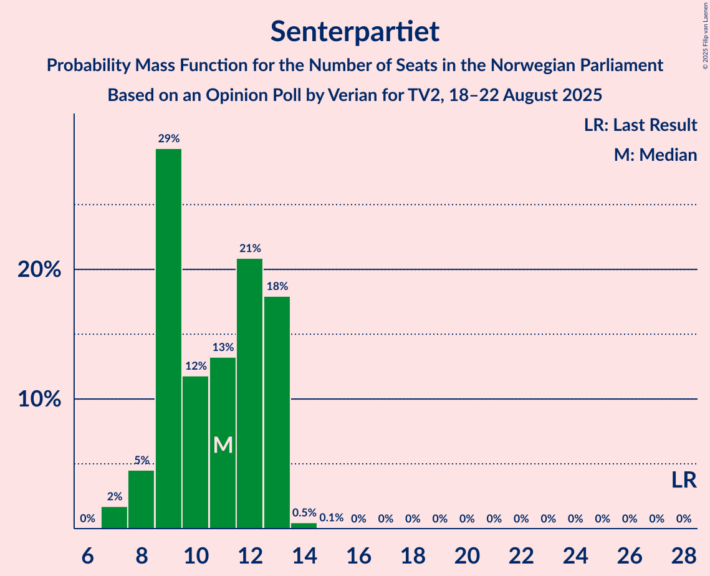
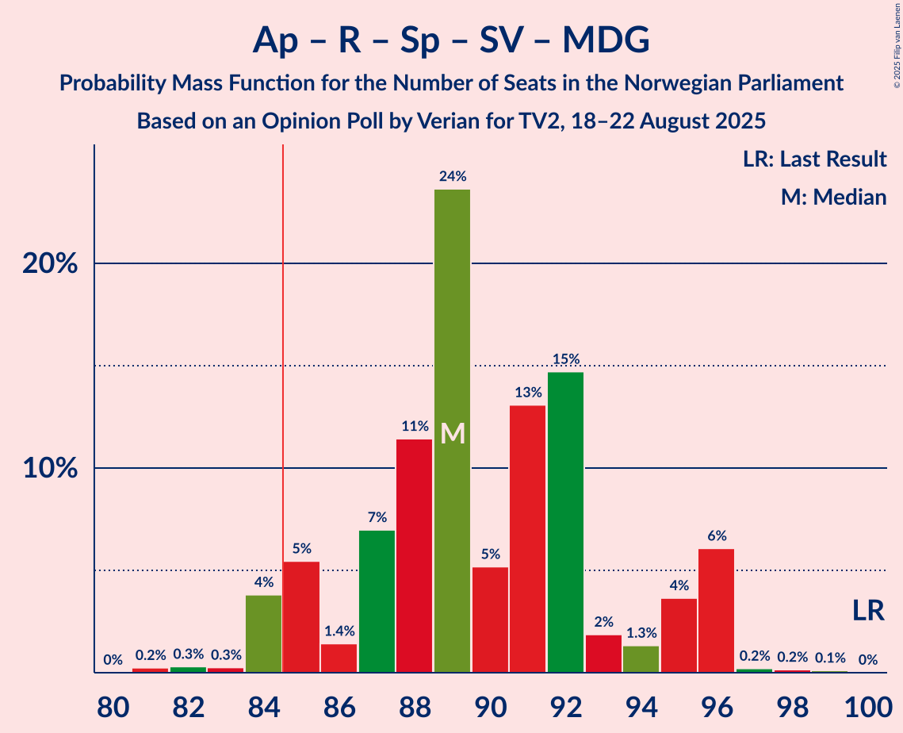
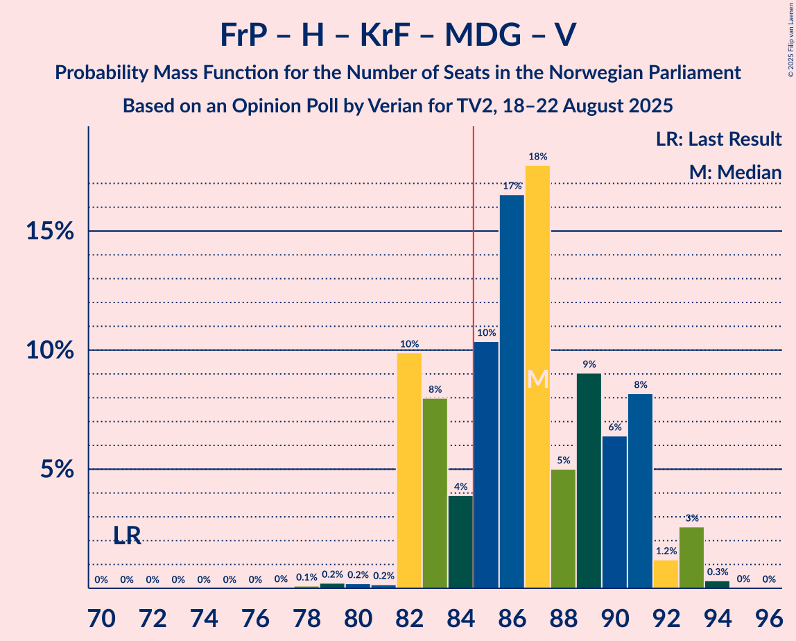
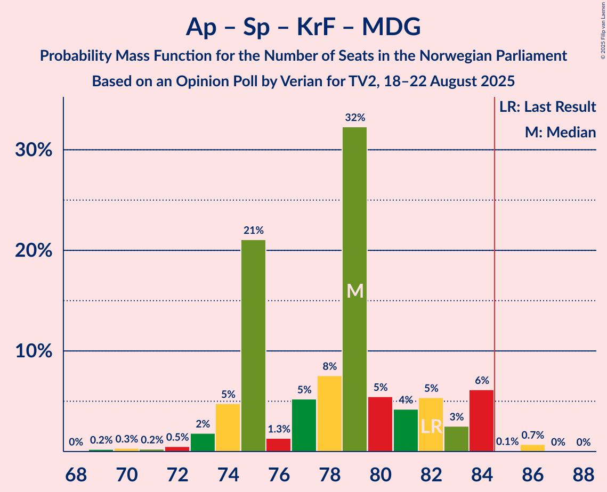

# Opinion Poll by Verian for TV2, 18–22 August 2025

<a href="#voting-intentions">Voting Intentions</a> | <a href="#seats">Seats</a> | <a href="#coalitions">Coalitions</a> | <a href="#technical-information">Technical Information</a>

## Voting Intentions

### Confidence Intervals

| Party | Last Result | Poll Result | 80% Confidence Interval | 90% Confidence Interval | 95% Confidence Interval | 99% Confidence Interval |
|:-----:|:-----------:|:-----------:|:-----------------------:|:-----------------------:|:-----------------------:|:-----------------------:|
| Arbeiderpartiet | 26.2% | 27.0% | 25.6–28.4% |25.2–28.9% |24.8–29.2% |24.2–29.9% |
| Fremskrittspartiet | 11.6% | 21.0% | 19.7–22.3% |19.3–22.7% |19.0–23.1% |18.4–23.7% |
| Høyre | 20.4% | 15.8% | 14.7–17.0% |14.3–17.4% |14.1–17.7% |13.5–18.3% |
| Rødt | 4.7% | 6.8% | 6.1–7.7% |5.9–8.0% |5.7–8.2% |5.3–8.6% |
| Senterpartiet | 13.5% | 6.3% | 5.6–7.2% |5.4–7.4% |5.2–7.6% |4.9–8.1% |
| Sosialistisk Venstreparti | 7.6% | 5.6% | 4.9–6.4% |4.8–6.7% |4.6–6.9% |4.3–7.3% |
| Kristelig Folkeparti | 3.8% | 5.4% | 4.7–6.2% |4.5–6.4% |4.4–6.6% |4.1–7.0% |
| Miljøpartiet De Grønne | 3.9% | 4.7% | 4.1–5.4% |3.9–5.7% |3.7–5.8% |3.5–6.2% |
| Venstre | 4.6% | 3.7% | 3.2–4.4% |3.0–4.6% |2.9–4.8% |2.7–5.1% |
| Norgesdemokratene | 1.1% | 0.9% | 0.6–1.3% |0.6–1.4% |0.5–1.5% |0.4–1.7% |
| Industri- og Næringspartiet | 0.3% | 0.6% | 0.4–0.9% |0.3–1.0% |0.3–1.1% |0.2–1.3% |
| Konservativt | 0.4% | 0.5% | 0.3–0.8% |0.3–0.9% |0.3–1.0% |0.2–1.2% |
| Pensjonistpartiet | 0.6% | 0.5% | 0.3–0.8% |0.3–0.9% |0.3–1.0% |0.2–1.2% |

*Note:* The poll result column reflects the actual value used in the calculations. Published results may vary slightly, and in addition be rounded to fewer digits.

## Seats

### Confidence Intervals

| Party | Last Result | Median | 80% Confidence Interval | 90% Confidence Interval | 95% Confidence Interval | 99% Confidence Interval |
|:-----:|:-----------:|:------:|:-----------------------:|:-----------------------:|:-----------------------:|:-----------------------:|
| <a href="#arbeiderpartiet">Arbeiderpartiet</a> | 48 | 51 | 48–53 |48–54 |47–56 |46–57 |
| <a href="#fremskrittspartiet">Fremskrittspartiet</a> | 21 | 40 | 38–43 |37–45 |37–45 |35–45 |
| <a href="#høyre">Høyre</a> | 36 | 28 | 24–31 |22–31 |22–31 |22–32 |
| <a href="#rødt">Rødt</a> | 8 | 11 | 10–13 |9–13 |9–14 |8–14 |
| <a href="#senterpartiet">Senterpartiet</a> | 28 | 11 | 9–13 |8–13 |8–13 |8–14 |
| <a href="#sosialistisk-venstreparti">Sosialistisk Venstreparti</a> | 13 | 9 | 8–10 |8–10 |7–11 |7–12 |
| <a href="#kristelig-folkeparti">Kristelig Folkeparti</a> | 3 | 9 | 8–10 |7–10 |7–11 |7–12 |
| <a href="#miljøpartiet-de-grønne">Miljøpartiet De Grønne</a> | 3 | 9 | 6–9 |6–9 |3–9 |3–10 |
| <a href="#venstre">Venstre</a> | 8 | 3 | 2–7 |2–7 |2–8 |2–8 |
| <a href="#norgesdemokratene">Norgesdemokratene</a> | 0 | 0 | 0 |0 |0 |0 |
| <a href="#industri--og-næringspartiet">Industri- og Næringspartiet</a> | 0 | 0 | 0 |0 |0 |0 |
| <a href="#konservativt">Konservativt</a> | 0 | 0 | 0 |0 |0 |0 |
| <a href="#pensjonistpartiet">Pensjonistpartiet</a> | 0 | 0 | 0 |0 |0 |0 |

### Arbeiderpartiet

*For a full overview of the results for this party, see the [Arbeiderpartiet](party-arbeiderpartiet.html) page.*

| Number of Seats | Probability | Accumulated | Special Marks |
|:---------------:|:-----------:|:-----------:|:-------------:|
| 45 | 0.3% | 100% |  |
| 46 | 2% | 99.6% |  |
| 47 | 2% | 98% |  |
| 48 | 17% | 96% | Last Result |
| 49 | 7% | 79% |  |
| 50 | 12% | 72% |  |
| 51 | 18% | 60% | Median |
| 52 | 15% | 42% |  |
| 53 | 18% | 28% |  |
| 54 | 6% | 9% |  |
| 55 | 0.1% | 3% |  |
| 56 | 2% | 3% |  |
| 57 | 1.4% | 2% |  |
| 58 | 0.2% | 0.3% |  |
| 59 | 0.1% | 0.1% |  |
| 60 | 0% | 0% |  |

### Fremskrittspartiet

*For a full overview of the results for this party, see the [Fremskrittspartiet](party-fremskrittspartiet.html) page.*

| Number of Seats | Probability | Accumulated | Special Marks |
|:---------------:|:-----------:|:-----------:|:-------------:|
| 21 | 0% | 100% | Last Result |
| 22 | 0% | 100% |  |
| 23 | 0% | 100% |  |
| 24 | 0% | 100% |  |
| 25 | 0% | 100% |  |
| 26 | 0% | 100% |  |
| 27 | 0% | 100% |  |
| 28 | 0% | 100% |  |
| 29 | 0% | 100% |  |
| 30 | 0% | 100% |  |
| 31 | 0% | 100% |  |
| 32 | 0% | 100% |  |
| 33 | 0% | 100% |  |
| 34 | 0.3% | 100% |  |
| 35 | 1.1% | 99.7% |  |
| 36 | 0.3% | 98.6% |  |
| 37 | 6% | 98% |  |
| 38 | 24% | 92% |  |
| 39 | 8% | 68% |  |
| 40 | 37% | 61% | Median |
| 41 | 8% | 23% |  |
| 42 | 6% | 16% |  |
| 43 | 0.4% | 10% |  |
| 44 | 2% | 10% |  |
| 45 | 7% | 7% |  |
| 46 | 0.1% | 0.1% |  |
| 47 | 0% | 0% |  |

### Høyre

*For a full overview of the results for this party, see the [Høyre](party-høyre.html) page.*

| Number of Seats | Probability | Accumulated | Special Marks |
|:---------------:|:-----------:|:-----------:|:-------------:|
| 21 | 0.1% | 100% |  |
| 22 | 8% | 99.9% |  |
| 23 | 0.4% | 92% |  |
| 24 | 16% | 92% |  |
| 25 | 6% | 75% |  |
| 26 | 3% | 70% |  |
| 27 | 13% | 67% |  |
| 28 | 25% | 53% | Median |
| 29 | 7% | 29% |  |
| 30 | 10% | 22% |  |
| 31 | 11% | 12% |  |
| 32 | 1.0% | 1.4% |  |
| 33 | 0.3% | 0.4% |  |
| 34 | 0% | 0.1% |  |
| 35 | 0% | 0.1% |  |
| 36 | 0% | 0% | Last Result |

### Rødt

*For a full overview of the results for this party, see the [Rødt](party-rødt.html) page.*

| Number of Seats | Probability | Accumulated | Special Marks |
|:---------------:|:-----------:|:-----------:|:-------------:|
| 8 | 0.6% | 100% | Last Result |
| 9 | 7% | 99.4% |  |
| 10 | 20% | 92% |  |
| 11 | 27% | 72% | Median |
| 12 | 32% | 45% |  |
| 13 | 10% | 13% |  |
| 14 | 3% | 3% |  |
| 15 | 0.2% | 0.2% |  |
| 16 | 0% | 0% |  |

### Senterpartiet

*For a full overview of the results for this party, see the [Senterpartiet](party-senterpartiet.html) page.*

| Number of Seats | Probability | Accumulated | Special Marks |
|:---------------:|:-----------:|:-----------:|:-------------:|
| 7 | 0.3% | 100% |  |
| 8 | 9% | 99.7% |  |
| 9 | 30% | 91% |  |
| 10 | 7% | 60% |  |
| 11 | 9% | 53% | Median |
| 12 | 24% | 45% |  |
| 13 | 20% | 21% |  |
| 14 | 0.8% | 0.8% |  |
| 15 | 0% | 0% |  |
| 16 | 0% | 0% |  |
| 17 | 0% | 0% |  |
| 18 | 0% | 0% |  |
| 19 | 0% | 0% |  |
| 20 | 0% | 0% |  |
| 21 | 0% | 0% |  |
| 22 | 0% | 0% |  |
| 23 | 0% | 0% |  |
| 24 | 0% | 0% |  |
| 25 | 0% | 0% |  |
| 26 | 0% | 0% |  |
| 27 | 0% | 0% |  |
| 28 | 0% | 0% | Last Result |

### Sosialistisk Venstreparti

*For a full overview of the results for this party, see the [Sosialistisk Venstreparti](party-sosialistiskvenstreparti.html) page.*

| Number of Seats | Probability | Accumulated | Special Marks |
|:---------------:|:-----------:|:-----------:|:-------------:|
| 6 | 0% | 100% |  |
| 7 | 3% | 99.9% |  |
| 8 | 37% | 97% |  |
| 9 | 29% | 60% | Median |
| 10 | 27% | 31% |  |
| 11 | 3% | 4% |  |
| 12 | 0.5% | 0.9% |  |
| 13 | 0.3% | 0.4% | Last Result |
| 14 | 0% | 0% |  |

### Kristelig Folkeparti

*For a full overview of the results for this party, see the [Kristelig Folkeparti](party-kristeligfolkeparti.html) page.*

| Number of Seats | Probability | Accumulated | Special Marks |
|:---------------:|:-----------:|:-----------:|:-------------:|
| 3 | 0.2% | 100% | Last Result |
| 4 | 0% | 99.8% |  |
| 5 | 0% | 99.8% |  |
| 6 | 0.1% | 99.8% |  |
| 7 | 7% | 99.7% |  |
| 8 | 33% | 93% |  |
| 9 | 43% | 60% | Median |
| 10 | 13% | 17% |  |
| 11 | 3% | 4% |  |
| 12 | 0.7% | 0.8% |  |
| 13 | 0.1% | 0.1% |  |
| 14 | 0% | 0% |  |

### Miljøpartiet De Grønne

*For a full overview of the results for this party, see the [Miljøpartiet De Grønne](party-miljøpartietdegrønne.html) page.*

| Number of Seats | Probability | Accumulated | Special Marks |
|:---------------:|:-----------:|:-----------:|:-------------:|
| 2 | 0.2% | 100% |  |
| 3 | 4% | 99.8% | Last Result |
| 4 | 0% | 96% |  |
| 5 | 0% | 96% |  |
| 6 | 6% | 96% |  |
| 7 | 19% | 89% |  |
| 8 | 20% | 70% |  |
| 9 | 49% | 50% | Median |
| 10 | 1.2% | 1.4% |  |
| 11 | 0.2% | 0.2% |  |
| 12 | 0% | 0% |  |

### Venstre

*For a full overview of the results for this party, see the [Venstre](party-venstre.html) page.*

| Number of Seats | Probability | Accumulated | Special Marks |
|:---------------:|:-----------:|:-----------:|:-------------:|
| 2 | 29% | 100% |  |
| 3 | 52% | 71% | Median |
| 4 | 0% | 20% |  |
| 5 | 0% | 20% |  |
| 6 | 5% | 20% |  |
| 7 | 11% | 15% |  |
| 8 | 4% | 4% | Last Result |
| 9 | 0.4% | 0.4% |  |
| 10 | 0% | 0% |  |

### Norgesdemokratene

*For a full overview of the results for this party, see the [Norgesdemokratene](party-norgesdemokratene.html) page.*

| Number of Seats | Probability | Accumulated | Special Marks |
|:---------------:|:-----------:|:-----------:|:-------------:|
| 0 | 100% | 100% | Last Result, Median |

### Industri- og Næringspartiet

*For a full overview of the results for this party, see the [Industri- og Næringspartiet](party-industri-ognæringspartiet.html) page.*

| Number of Seats | Probability | Accumulated | Special Marks |
|:---------------:|:-----------:|:-----------:|:-------------:|
| 0 | 100% | 100% | Last Result, Median |

### Konservativt

*For a full overview of the results for this party, see the [Konservativt](party-konservativt.html) page.*

| Number of Seats | Probability | Accumulated | Special Marks |
|:---------------:|:-----------:|:-----------:|:-------------:|
| 0 | 100% | 100% | Last Result, Median |

### Pensjonistpartiet

*For a full overview of the results for this party, see the [Pensjonistpartiet](party-pensjonistpartiet.html) page.*

| Number of Seats | Probability | Accumulated | Special Marks |
|:---------------:|:-----------:|:-----------:|:-------------:|
| 0 | 100% | 100% | Last Result, Median |

## Coalitions

### Confidence Intervals

| Coalition | Last Result | Median | Majority? | 80% Confidence Interval | 90% Confidence Interval | 95% Confidence Interval | 99% Confidence Interval |
|:---------:|:-----------:|:------:|:---------:|:-----------------------:|:-----------------------:|:-----------------------:|:-----------------------:|
| Fremskrittspartiet – Høyre – Senterpartiet – Kristelig Folkeparti – Venstre | 96 | 90 | 99.6% | 87–93 | 87–94 | 86–96 | 85–97 |
| Arbeiderpartiet – Rødt – Senterpartiet – Sosialistisk Venstreparti – Miljøpartiet De Grønne | 100 | 91 | 96% | 85–94 | 85–95 | 84–95 | 81–97 |
| Arbeiderpartiet – Senterpartiet – Sosialistisk Venstreparti – Kristelig Folkeparti – Miljøpartiet De Grønne | 95 | 87 | 80% | 84–91 | 83–91 | 83–92 | 79–93 |
| Fremskrittspartiet – Høyre – Kristelig Folkeparti – Miljøpartiet De Grønne – Venstre | 71 | 87 | 81% | 83–91 | 82–91 | 82–92 | 80–93 |
| Arbeiderpartiet – Rødt – Senterpartiet – Sosialistisk Venstreparti | 97 | 82 | 19% | 78–86 | 78–87 | 77–87 | 76–89 |
| Fremskrittspartiet – Høyre – Kristelig Folkeparti – Venstre | 68 | 78 | 4% | 75–84 | 74–84 | 74–85 | 72–88 |
| Arbeiderpartiet – Senterpartiet – Kristelig Folkeparti – Miljøpartiet De Grønne | 82 | 79 | 2% | 75–82 | 74–83 | 74–83 | 69–86 |
| Arbeiderpartiet – Senterpartiet – Sosialistisk Venstreparti – Miljøpartiet De Grønne | 92 | 79 | 0.7% | 75–82 | 75–82 | 74–83 | 69–85 |
| Arbeiderpartiet – Rødt – Sosialistisk Venstreparti – Miljøpartiet De Grønne | 72 | 79 | 0.4% | 76–82 | 75–82 | 73–83 | 72–84 |
| Fremskrittspartiet – Høyre – Venstre | 65 | 70 | 0% | 66–75 | 65–76 | 65–76 | 63–79 |
| Arbeiderpartiet – Senterpartiet – Sosialistisk Venstreparti | 89 | 70 | 0% | 68–74 | 67–74 | 67–75 | 64–77 |
| Arbeiderpartiet – Senterpartiet – Kristelig Folkeparti | 79 | 70 | 0% | 68–74 | 66–74 | 66–75 | 64–77 |
| Fremskrittspartiet – Høyre | 57 | 68 | 0% | 62–71 | 62–72 | 62–72 | 60–73 |
| Arbeiderpartiet – Senterpartiet | 76 | 62 | 0% | 59–65 | 58–65 | 57–66 | 56–68 |
| Arbeiderpartiet – Sosialistisk Venstreparti | 61 | 60 | 0% | 56–62 | 56–63 | 55–64 | 54–65 |
| Høyre – Kristelig Folkeparti – Venstre | 47 | 39 | 0% | 36–43 | 34–45 | 34–45 | 34–48 |
| Senterpartiet – Kristelig Folkeparti – Venstre | 39 | 23 | 0% | 19–28 | 19–29 | 19–29 | 19–30 |

### Fremskrittspartiet – Høyre – Senterpartiet – Kristelig Folkeparti – Venstre

| Number of Seats | Probability | Accumulated | Special Marks |
|:---------------:|:-----------:|:-----------:|:-------------:|
| 82 | 0.1% | 100% |  |
| 83 | 0% | 99.9% |  |
| 84 | 0.3% | 99.9% |  |
| 85 | 1.4% | 99.6% | Majority |
| 86 | 2% | 98% |  |
| 87 | 26% | 96% |  |
| 88 | 2% | 71% |  |
| 89 | 16% | 69% |  |
| 90 | 11% | 53% |  |
| 91 | 14% | 42% | Median |
| 92 | 9% | 28% |  |
| 93 | 10% | 19% |  |
| 94 | 6% | 9% |  |
| 95 | 0.5% | 3% |  |
| 96 | 1.0% | 3% | Last Result |
| 97 | 2% | 2% |  |
| 98 | 0% | 0.1% |  |
| 99 | 0% | 0% |  |

### Arbeiderpartiet – Rødt – Senterpartiet – Sosialistisk Venstreparti – Miljøpartiet De Grønne

| Number of Seats | Probability | Accumulated | Special Marks |
|:---------------:|:-----------:|:-----------:|:-------------:|
| 81 | 0.5% | 100% |  |
| 82 | 0.1% | 99.5% |  |
| 83 | 0.1% | 99.3% |  |
| 84 | 4% | 99.2% |  |
| 85 | 11% | 96% | Majority |
| 86 | 2% | 84% |  |
| 87 | 6% | 82% |  |
| 88 | 9% | 76% |  |
| 89 | 6% | 67% |  |
| 90 | 7% | 61% |  |
| 91 | 26% | 54% | Median |
| 92 | 14% | 28% |  |
| 93 | 3% | 14% |  |
| 94 | 2% | 11% |  |
| 95 | 8% | 9% |  |
| 96 | 0.1% | 0.8% |  |
| 97 | 0.3% | 0.7% |  |
| 98 | 0.3% | 0.4% |  |
| 99 | 0% | 0% |  |
| 100 | 0% | 0% | Last Result |

### Arbeiderpartiet – Senterpartiet – Sosialistisk Venstreparti – Kristelig Folkeparti – Miljøpartiet De Grønne

| Number of Seats | Probability | Accumulated | Special Marks |
|:---------------:|:-----------:|:-----------:|:-------------:|
| 78 | 0.5% | 100% |  |
| 79 | 0.1% | 99.5% |  |
| 80 | 0.2% | 99.4% |  |
| 81 | 0.8% | 99.2% |  |
| 82 | 0.5% | 98% |  |
| 83 | 3% | 98% |  |
| 84 | 15% | 95% |  |
| 85 | 6% | 80% | Majority |
| 86 | 10% | 74% |  |
| 87 | 30% | 64% |  |
| 88 | 0.9% | 33% |  |
| 89 | 6% | 33% | Median |
| 90 | 3% | 26% |  |
| 91 | 21% | 23% |  |
| 92 | 0.5% | 3% |  |
| 93 | 2% | 2% |  |
| 94 | 0.2% | 0.5% |  |
| 95 | 0.3% | 0.3% | Last Result |
| 96 | 0% | 0% |  |

### Fremskrittspartiet – Høyre – Kristelig Folkeparti – Miljøpartiet De Grønne – Venstre

| Number of Seats | Probability | Accumulated | Special Marks |
|:---------------:|:-----------:|:-----------:|:-------------:|
| 71 | 0% | 100% | Last Result |
| 72 | 0% | 100% |  |
| 73 | 0% | 100% |  |
| 74 | 0% | 100% |  |
| 75 | 0% | 100% |  |
| 76 | 0% | 100% |  |
| 77 | 0% | 100% |  |
| 78 | 0.1% | 100% |  |
| 79 | 0.4% | 99.9% |  |
| 80 | 0.3% | 99.5% |  |
| 81 | 0.2% | 99.2% |  |
| 82 | 9% | 99.1% |  |
| 83 | 2% | 90% |  |
| 84 | 7% | 88% |  |
| 85 | 2% | 81% | Majority |
| 86 | 18% | 80% |  |
| 87 | 24% | 62% |  |
| 88 | 6% | 38% |  |
| 89 | 3% | 32% | Median |
| 90 | 13% | 28% |  |
| 91 | 12% | 15% |  |
| 92 | 2% | 4% |  |
| 93 | 2% | 2% |  |
| 94 | 0.1% | 0.2% |  |
| 95 | 0.1% | 0.1% |  |
| 96 | 0% | 0% |  |

### Arbeiderpartiet – Rødt – Senterpartiet – Sosialistisk Venstreparti

| Number of Seats | Probability | Accumulated | Special Marks |
|:---------------:|:-----------:|:-----------:|:-------------:|
| 74 | 0.1% | 100% |  |
| 75 | 0.1% | 99.9% |  |
| 76 | 2% | 99.8% |  |
| 77 | 2% | 98% |  |
| 78 | 12% | 96% |  |
| 79 | 13% | 85% |  |
| 80 | 3% | 72% |  |
| 81 | 6% | 68% |  |
| 82 | 24% | 62% | Median |
| 83 | 18% | 38% |  |
| 84 | 2% | 20% |  |
| 85 | 7% | 19% | Majority |
| 86 | 2% | 12% |  |
| 87 | 9% | 10% |  |
| 88 | 0.2% | 0.9% |  |
| 89 | 0.3% | 0.8% |  |
| 90 | 0.4% | 0.5% |  |
| 91 | 0.1% | 0.1% |  |
| 92 | 0% | 0% |  |
| 93 | 0% | 0% |  |
| 94 | 0% | 0% |  |
| 95 | 0% | 0% |  |
| 96 | 0% | 0% |  |
| 97 | 0% | 0% | Last Result |

### Fremskrittspartiet – Høyre – Kristelig Folkeparti – Venstre

| Number of Seats | Probability | Accumulated | Special Marks |
|:---------------:|:-----------:|:-----------:|:-------------:|
| 68 | 0% | 100% | Last Result |
| 69 | 0% | 100% |  |
| 70 | 0% | 100% |  |
| 71 | 0.3% | 100% |  |
| 72 | 0.3% | 99.6% |  |
| 73 | 0.1% | 99.3% |  |
| 74 | 8% | 99.2% |  |
| 75 | 2% | 91% |  |
| 76 | 3% | 89% |  |
| 77 | 14% | 86% |  |
| 78 | 26% | 72% |  |
| 79 | 7% | 46% |  |
| 80 | 6% | 39% | Median |
| 81 | 9% | 33% |  |
| 82 | 6% | 24% |  |
| 83 | 2% | 18% |  |
| 84 | 11% | 16% |  |
| 85 | 4% | 4% | Majority |
| 86 | 0.1% | 0.8% |  |
| 87 | 0.1% | 0.7% |  |
| 88 | 0.5% | 0.5% |  |
| 89 | 0% | 0% |  |

### Arbeiderpartiet – Senterpartiet – Kristelig Folkeparti – Miljøpartiet De Grønne

| Number of Seats | Probability | Accumulated | Special Marks |
|:---------------:|:-----------:|:-----------:|:-------------:|
| 68 | 0.1% | 100% |  |
| 69 | 0.5% | 99.9% |  |
| 70 | 0.3% | 99.4% |  |
| 71 | 0.4% | 99.1% |  |
| 72 | 0.3% | 98.8% |  |
| 73 | 0.7% | 98.5% |  |
| 74 | 6% | 98% |  |
| 75 | 14% | 92% |  |
| 76 | 2% | 77% |  |
| 77 | 11% | 75% |  |
| 78 | 14% | 65% |  |
| 79 | 25% | 51% |  |
| 80 | 0.9% | 26% | Median |
| 81 | 8% | 25% |  |
| 82 | 10% | 17% | Last Result |
| 83 | 6% | 8% |  |
| 84 | 0.3% | 2% |  |
| 85 | 0.1% | 2% | Majority |
| 86 | 2% | 2% |  |
| 87 | 0% | 0% |  |

### Arbeiderpartiet – Senterpartiet – Sosialistisk Venstreparti – Miljøpartiet De Grønne

| Number of Seats | Probability | Accumulated | Special Marks |
|:---------------:|:-----------:|:-----------:|:-------------:|
| 69 | 0.5% | 100% |  |
| 70 | 0.1% | 99.5% |  |
| 71 | 0.3% | 99.4% |  |
| 72 | 0.1% | 99.1% |  |
| 73 | 1.2% | 99.0% |  |
| 74 | 2% | 98% |  |
| 75 | 13% | 96% |  |
| 76 | 7% | 83% |  |
| 77 | 13% | 76% |  |
| 78 | 4% | 63% |  |
| 79 | 23% | 58% |  |
| 80 | 9% | 35% | Median |
| 81 | 8% | 25% |  |
| 82 | 14% | 17% |  |
| 83 | 1.1% | 3% |  |
| 84 | 1.5% | 2% |  |
| 85 | 0.5% | 0.7% | Majority |
| 86 | 0.3% | 0.3% |  |
| 87 | 0% | 0% |  |
| 88 | 0% | 0% |  |
| 89 | 0% | 0% |  |
| 90 | 0% | 0% |  |
| 91 | 0% | 0% |  |
| 92 | 0% | 0% | Last Result |

### Arbeiderpartiet – Rødt – Sosialistisk Venstreparti – Miljøpartiet De Grønne

| Number of Seats | Probability | Accumulated | Special Marks |
|:---------------:|:-----------:|:-----------:|:-------------:|
| 71 | 0% | 100% |  |
| 72 | 2% | 99.9% | Last Result |
| 73 | 1.0% | 98% |  |
| 74 | 0.5% | 97% |  |
| 75 | 6% | 97% |  |
| 76 | 10% | 91% |  |
| 77 | 9% | 81% |  |
| 78 | 14% | 72% |  |
| 79 | 11% | 58% |  |
| 80 | 16% | 47% | Median |
| 81 | 2% | 31% |  |
| 82 | 26% | 29% |  |
| 83 | 2% | 4% |  |
| 84 | 1.4% | 2% |  |
| 85 | 0.3% | 0.4% | Majority |
| 86 | 0% | 0.1% |  |
| 87 | 0.1% | 0.1% |  |
| 88 | 0% | 0% |  |

### Fremskrittspartiet – Høyre – Venstre

| Number of Seats | Probability | Accumulated | Special Marks |
|:---------------:|:-----------:|:-----------:|:-------------:|
| 63 | 0.7% | 100% |  |
| 64 | 0.1% | 99.3% |  |
| 65 | 8% | 99.2% | Last Result |
| 66 | 3% | 91% |  |
| 67 | 8% | 88% |  |
| 68 | 7% | 80% |  |
| 69 | 5% | 73% |  |
| 70 | 26% | 68% |  |
| 71 | 3% | 41% | Median |
| 72 | 16% | 39% |  |
| 73 | 0.3% | 22% |  |
| 74 | 5% | 22% |  |
| 75 | 12% | 17% |  |
| 76 | 4% | 5% |  |
| 77 | 0.2% | 0.9% |  |
| 78 | 0.2% | 0.8% |  |
| 79 | 0.5% | 0.5% |  |
| 80 | 0% | 0% |  |

### Arbeiderpartiet – Senterpartiet – Sosialistisk Venstreparti

| Number of Seats | Probability | Accumulated | Special Marks |
|:---------------:|:-----------:|:-----------:|:-------------:|
| 64 | 0.6% | 100% |  |
| 65 | 0.3% | 99.4% |  |
| 66 | 1.4% | 99.1% |  |
| 67 | 4% | 98% |  |
| 68 | 21% | 94% |  |
| 69 | 8% | 73% |  |
| 70 | 24% | 65% |  |
| 71 | 5% | 41% | Median |
| 72 | 8% | 36% |  |
| 73 | 10% | 28% |  |
| 74 | 13% | 17% |  |
| 75 | 3% | 4% |  |
| 76 | 0.1% | 0.9% |  |
| 77 | 0.6% | 0.8% |  |
| 78 | 0% | 0.2% |  |
| 79 | 0.1% | 0.1% |  |
| 80 | 0.1% | 0.1% |  |
| 81 | 0% | 0% |  |
| 82 | 0% | 0% |  |
| 83 | 0% | 0% |  |
| 84 | 0% | 0% |  |
| 85 | 0% | 0% | Majority |
| 86 | 0% | 0% |  |
| 87 | 0% | 0% |  |
| 88 | 0% | 0% |  |
| 89 | 0% | 0% | Last Result |

### Arbeiderpartiet – Senterpartiet – Kristelig Folkeparti

| Number of Seats | Probability | Accumulated | Special Marks |
|:---------------:|:-----------:|:-----------:|:-------------:|
| 63 | 0.2% | 100% |  |
| 64 | 0.6% | 99.8% |  |
| 65 | 0.4% | 99.2% |  |
| 66 | 6% | 98.8% |  |
| 67 | 1.4% | 93% |  |
| 68 | 17% | 92% |  |
| 69 | 15% | 75% |  |
| 70 | 21% | 60% |  |
| 71 | 6% | 39% | Median |
| 72 | 11% | 33% |  |
| 73 | 5% | 22% |  |
| 74 | 13% | 17% |  |
| 75 | 2% | 4% |  |
| 76 | 0.4% | 2% |  |
| 77 | 2% | 2% |  |
| 78 | 0.1% | 0.1% |  |
| 79 | 0.1% | 0.1% | Last Result |
| 80 | 0% | 0% |  |

### Fremskrittspartiet – Høyre

| Number of Seats | Probability | Accumulated | Special Marks |
|:---------------:|:-----------:|:-----------:|:-------------:|
| 57 | 0% | 100% | Last Result |
| 58 | 0.1% | 100% |  |
| 59 | 0.1% | 99.9% |  |
| 60 | 0.5% | 99.8% |  |
| 61 | 1.1% | 99.3% |  |
| 62 | 16% | 98% |  |
| 63 | 1.3% | 82% |  |
| 64 | 10% | 81% |  |
| 65 | 3% | 71% |  |
| 66 | 1.1% | 68% |  |
| 67 | 8% | 67% |  |
| 68 | 27% | 59% | Median |
| 69 | 16% | 32% |  |
| 70 | 2% | 16% |  |
| 71 | 4% | 14% |  |
| 72 | 9% | 10% |  |
| 73 | 0.9% | 1.1% |  |
| 74 | 0% | 0.2% |  |
| 75 | 0.1% | 0.1% |  |
| 76 | 0.1% | 0.1% |  |
| 77 | 0% | 0% |  |

### Arbeiderpartiet – Senterpartiet

| Number of Seats | Probability | Accumulated | Special Marks |
|:---------------:|:-----------:|:-----------:|:-------------:|
| 56 | 0.9% | 100% |  |
| 57 | 2% | 99.1% |  |
| 58 | 6% | 97% |  |
| 59 | 14% | 92% |  |
| 60 | 19% | 78% |  |
| 61 | 3% | 59% |  |
| 62 | 24% | 56% | Median |
| 63 | 4% | 31% |  |
| 64 | 10% | 27% |  |
| 65 | 14% | 17% |  |
| 66 | 0.9% | 3% |  |
| 67 | 0.4% | 2% |  |
| 68 | 2% | 2% |  |
| 69 | 0.1% | 0.2% |  |
| 70 | 0% | 0.1% |  |
| 71 | 0.1% | 0.1% |  |
| 72 | 0% | 0% |  |
| 73 | 0% | 0% |  |
| 74 | 0% | 0% |  |
| 75 | 0% | 0% |  |
| 76 | 0% | 0% | Last Result |

### Arbeiderpartiet – Sosialistisk Venstreparti

| Number of Seats | Probability | Accumulated | Special Marks |
|:---------------:|:-----------:|:-----------:|:-------------:|
| 53 | 0.1% | 100% |  |
| 54 | 2% | 99.9% |  |
| 55 | 0.7% | 98% |  |
| 56 | 9% | 97% |  |
| 57 | 1.0% | 88% |  |
| 58 | 11% | 87% |  |
| 59 | 8% | 76% |  |
| 60 | 25% | 68% | Median |
| 61 | 30% | 43% | Last Result |
| 62 | 5% | 13% |  |
| 63 | 5% | 8% |  |
| 64 | 3% | 4% |  |
| 65 | 0.9% | 1.2% |  |
| 66 | 0.1% | 0.3% |  |
| 67 | 0.1% | 0.2% |  |
| 68 | 0% | 0.1% |  |
| 69 | 0% | 0% |  |

### Høyre – Kristelig Folkeparti – Venstre

| Number of Seats | Probability | Accumulated | Special Marks |
|:---------------:|:-----------:|:-----------:|:-------------:|
| 33 | 0% | 100% |  |
| 34 | 8% | 99.9% |  |
| 35 | 2% | 92% |  |
| 36 | 0.9% | 90% |  |
| 37 | 12% | 90% |  |
| 38 | 21% | 78% |  |
| 39 | 16% | 56% |  |
| 40 | 7% | 40% | Median |
| 41 | 10% | 33% |  |
| 42 | 4% | 22% |  |
| 43 | 11% | 18% |  |
| 44 | 1.0% | 7% |  |
| 45 | 5% | 6% |  |
| 46 | 0.4% | 2% |  |
| 47 | 0.2% | 1.1% | Last Result |
| 48 | 0.4% | 0.9% |  |
| 49 | 0.4% | 0.4% |  |
| 50 | 0% | 0% |  |

### Senterpartiet – Kristelig Folkeparti – Venstre

| Number of Seats | Probability | Accumulated | Special Marks |
|:---------------:|:-----------:|:-----------:|:-------------:|
| 13 | 0.1% | 100% |  |
| 14 | 0% | 99.9% |  |
| 15 | 0% | 99.9% |  |
| 16 | 0% | 99.9% |  |
| 17 | 0.1% | 99.9% |  |
| 18 | 0.1% | 99.8% |  |
| 19 | 17% | 99.7% |  |
| 20 | 17% | 82% |  |
| 21 | 4% | 66% |  |
| 22 | 4% | 62% |  |
| 23 | 11% | 58% | Median |
| 24 | 14% | 47% |  |
| 25 | 17% | 34% |  |
| 26 | 4% | 16% |  |
| 27 | 1.1% | 12% |  |
| 28 | 5% | 11% |  |
| 29 | 5% | 6% |  |
| 30 | 0.5% | 0.7% |  |
| 31 | 0% | 0.2% |  |
| 32 | 0.1% | 0.1% |  |
| 33 | 0% | 0% |  |
| 34 | 0% | 0% |  |
| 35 | 0% | 0% |  |
| 36 | 0% | 0% |  |
| 37 | 0% | 0% |  |
| 38 | 0% | 0% |  |
| 39 | 0% | 0% | Last Result |

## Technical Information

### Opinion Poll

+ **Polling firm:** Verian
+ **Commissioner(s):** TV2
+ **Fieldwork period:** 18–22 August 2025

### Calculations

+ **Sample size:** 1583
+ **Simulations done:** 1,048,576
+ **Error estimate:** 3.06%

