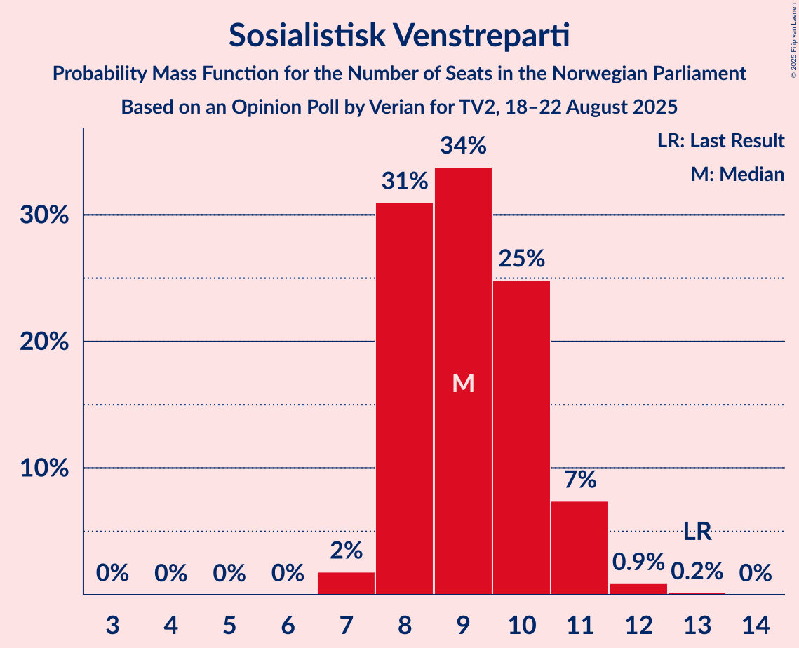
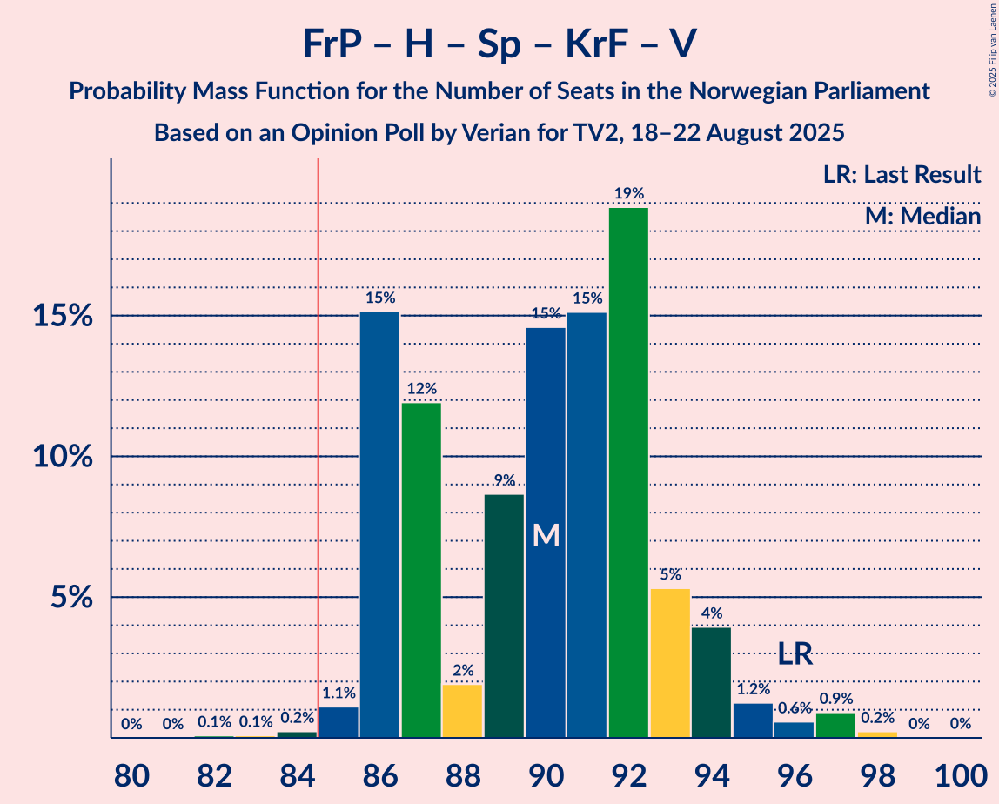
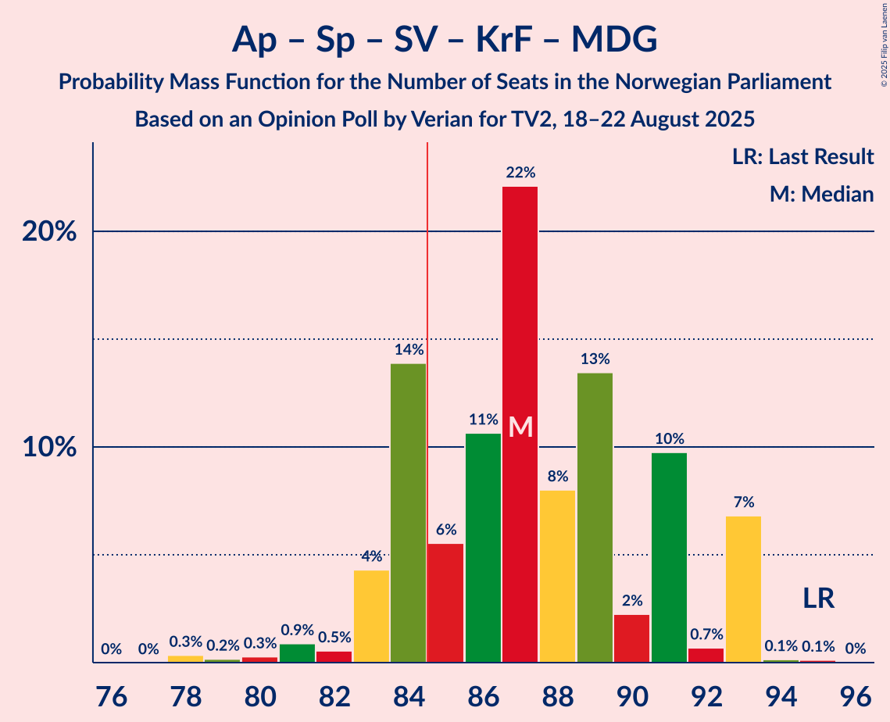
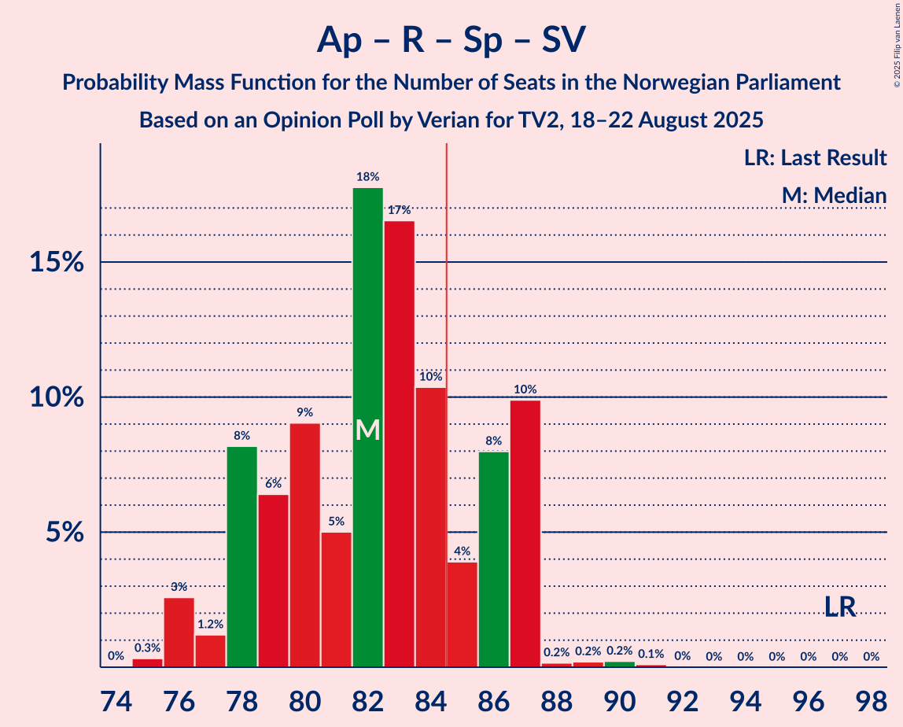
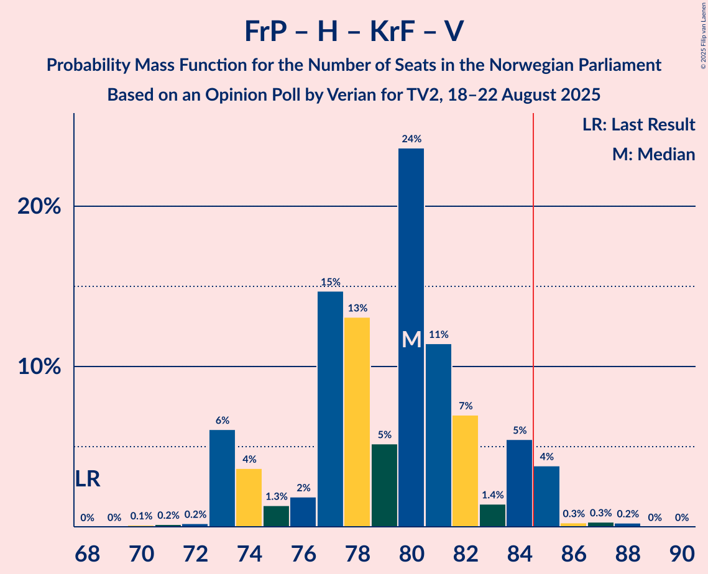
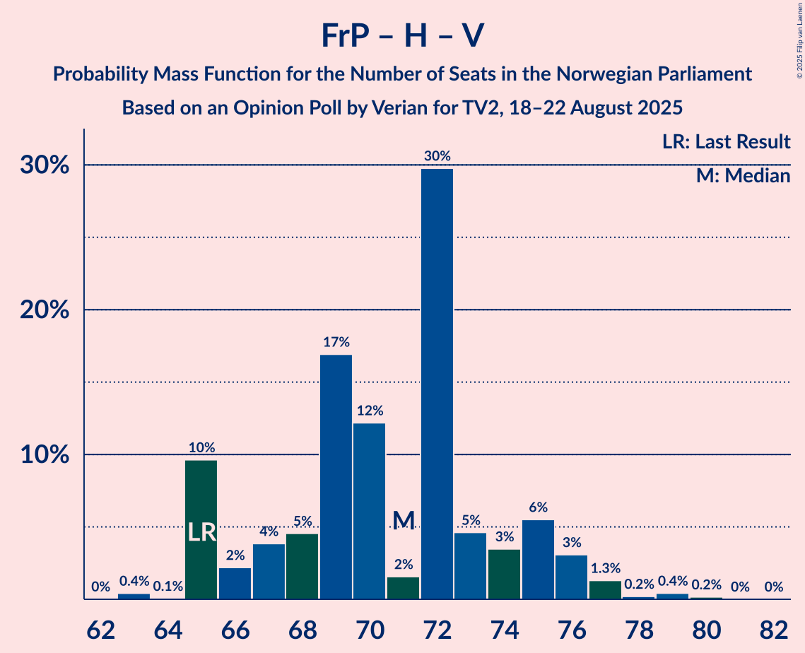
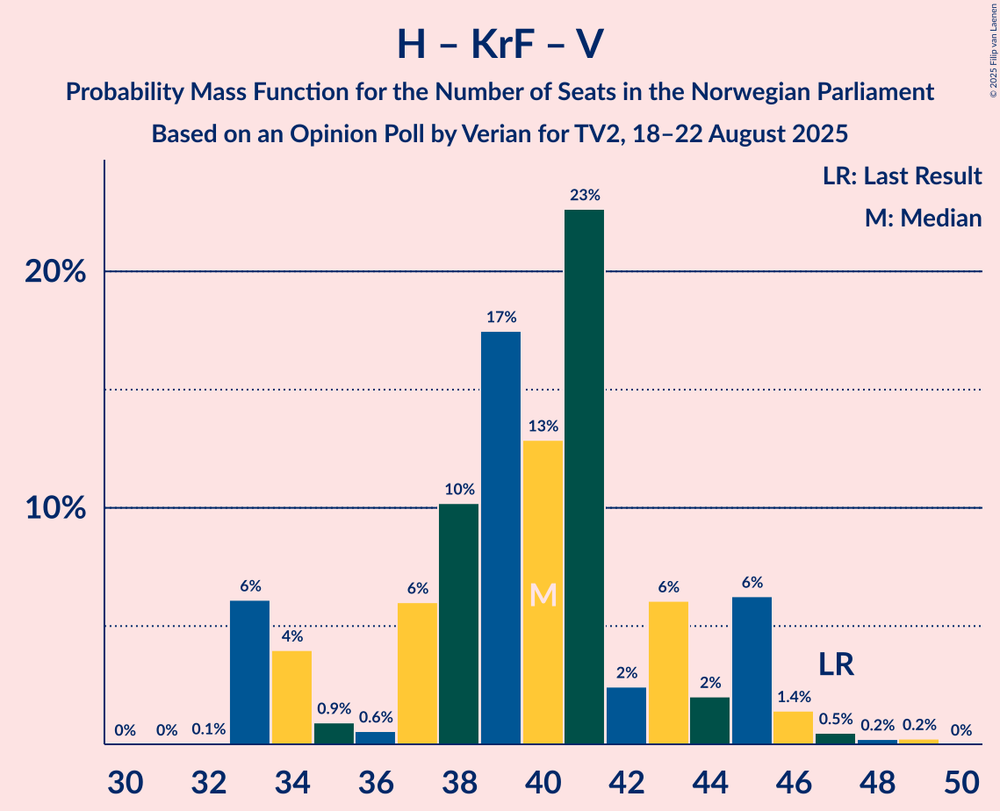

# Opinion Poll by Verian for TV2, 18–22 August 2025

<a href="#voting-intentions">Voting Intentions</a> | <a href="#seats">Seats</a> | <a href="#coalitions">Coalitions</a> | <a href="#technical-information">Technical Information</a>

## Voting Intentions

### Confidence Intervals

| Party | Last Result | Poll Result | 80% Confidence Interval | 90% Confidence Interval | 95% Confidence Interval | 99% Confidence Interval |
|:-----:|:-----------:|:-----------:|:-----------------------:|:-----------------------:|:-----------------------:|:-----------------------:|
| Arbeiderpartiet | 26.2% | 27.0% | 25.6–28.4% |25.2–28.9% |24.8–29.2% |24.2–29.9% |
| Fremskrittspartiet | 11.6% | 21.0% | 19.7–22.3% |19.3–22.7% |19.0–23.1% |18.4–23.7% |
| Høyre | 20.4% | 15.8% | 14.7–17.0% |14.3–17.4% |14.1–17.7% |13.5–18.3% |
| Rødt | 4.7% | 6.8% | 6.1–7.7% |5.9–8.0% |5.7–8.2% |5.3–8.6% |
| Senterpartiet | 13.5% | 6.3% | 5.6–7.2% |5.4–7.4% |5.2–7.6% |4.9–8.1% |
| Sosialistisk Venstreparti | 7.6% | 5.6% | 4.9–6.4% |4.8–6.7% |4.6–6.9% |4.3–7.3% |
| Kristelig Folkeparti | 3.8% | 5.4% | 4.7–6.2% |4.5–6.4% |4.4–6.6% |4.1–7.0% |
| Miljøpartiet De Grønne | 3.9% | 4.7% | 4.1–5.4% |3.9–5.7% |3.7–5.8% |3.5–6.2% |
| Venstre | 4.6% | 3.7% | 3.2–4.4% |3.0–4.6% |2.9–4.8% |2.7–5.1% |
| Norgesdemokratene | 1.1% | 0.9% | 0.6–1.3% |0.6–1.4% |0.5–1.5% |0.4–1.7% |
| Industri- og Næringspartiet | 0.3% | 0.6% | 0.4–0.9% |0.3–1.0% |0.3–1.1% |0.2–1.3% |
| Konservativt | 0.4% | 0.5% | 0.3–0.8% |0.3–0.9% |0.3–1.0% |0.2–1.2% |
| Pensjonistpartiet | 0.6% | 0.5% | 0.3–0.8% |0.3–0.9% |0.3–1.0% |0.2–1.2% |

*Note:* The poll result column reflects the actual value used in the calculations. Published results may vary slightly, and in addition be rounded to fewer digits.

## Seats

### Confidence Intervals

| Party | Last Result | Median | 80% Confidence Interval | 90% Confidence Interval | 95% Confidence Interval | 99% Confidence Interval |
|:-----:|:-----------:|:------:|:-----------------------:|:-----------------------:|:-----------------------:|:-----------------------:|
| <a href="#arbeiderpartiet">Arbeiderpartiet</a> | 48 | 52 | 48–54 |48–54 |47–55 |45–57 |
| <a href="#fremskrittspartiet">Fremskrittspartiet</a> | 21 | 40 | 38–42 |36–44 |36–45 |34–45 |
| <a href="#høyre">Høyre</a> | 36 | 28 | 23–30 |22–31 |22–31 |22–32 |
| <a href="#rødt">Rødt</a> | 8 | 11 | 10–13 |9–13 |8–13 |8–14 |
| <a href="#senterpartiet">Senterpartiet</a> | 28 | 11 | 9–13 |8–13 |8–13 |7–14 |
| <a href="#sosialistisk-venstreparti">Sosialistisk Venstreparti</a> | 13 | 9 | 8–10 |8–11 |8–11 |7–12 |
| <a href="#kristelig-folkeparti">Kristelig Folkeparti</a> | 3 | 8 | 8–10 |7–12 |7–12 |6–12 |
| <a href="#miljøpartiet-de-grønne">Miljøpartiet De Grønne</a> | 3 | 8 | 6–9 |3–9 |3–9 |3–10 |
| <a href="#venstre">Venstre</a> | 8 | 3 | 2–7 |2–7 |2–8 |2–8 |
| <a href="#norgesdemokratene">Norgesdemokratene</a> | 0 | 0 | 0 |0 |0 |0 |
| <a href="#industri--og-næringspartiet">Industri- og Næringspartiet</a> | 0 | 0 | 0 |0 |0 |0 |
| <a href="#konservativt">Konservativt</a> | 0 | 0 | 0 |0 |0 |0 |
| <a href="#pensjonistpartiet">Pensjonistpartiet</a> | 0 | 0 | 0 |0 |0 |0 |

### Arbeiderpartiet

*For a full overview of the results for this party, see the [Arbeiderpartiet](party-arbeiderpartiet.html) page.*

| Number of Seats | Probability | Accumulated | Special Marks |
|:---------------:|:-----------:|:-----------:|:-------------:|
| 45 | 0.5% | 100% |  |
| 46 | 1.3% | 99.5% |  |
| 47 | 1.1% | 98% |  |
| 48 | 13% | 97% | Last Result |
| 49 | 14% | 84% |  |
| 50 | 6% | 70% |  |
| 51 | 10% | 64% |  |
| 52 | 9% | 54% | Median |
| 53 | 20% | 46% |  |
| 54 | 23% | 26% |  |
| 55 | 1.0% | 3% |  |
| 56 | 1.3% | 2% |  |
| 57 | 0.6% | 0.9% |  |
| 58 | 0.1% | 0.2% |  |
| 59 | 0.1% | 0.1% |  |
| 60 | 0% | 0% |  |

### Fremskrittspartiet

*For a full overview of the results for this party, see the [Fremskrittspartiet](party-fremskrittspartiet.html) page.*

| Number of Seats | Probability | Accumulated | Special Marks |
|:---------------:|:-----------:|:-----------:|:-------------:|
| 21 | 0% | 100% | Last Result |
| 22 | 0% | 100% |  |
| 23 | 0% | 100% |  |
| 24 | 0% | 100% |  |
| 25 | 0% | 100% |  |
| 26 | 0% | 100% |  |
| 27 | 0% | 100% |  |
| 28 | 0% | 100% |  |
| 29 | 0% | 100% |  |
| 30 | 0% | 100% |  |
| 31 | 0% | 100% |  |
| 32 | 0% | 100% |  |
| 33 | 0% | 100% |  |
| 34 | 0.6% | 100% |  |
| 35 | 0.5% | 99.4% |  |
| 36 | 4% | 98.9% |  |
| 37 | 4% | 95% |  |
| 38 | 22% | 91% |  |
| 39 | 18% | 69% |  |
| 40 | 32% | 50% | Median |
| 41 | 6% | 18% |  |
| 42 | 6% | 12% |  |
| 43 | 0.7% | 6% |  |
| 44 | 2% | 5% |  |
| 45 | 3% | 3% |  |
| 46 | 0.1% | 0.1% |  |
| 47 | 0% | 0% |  |

### Høyre

*For a full overview of the results for this party, see the [Høyre](party-høyre.html) page.*

| Number of Seats | Probability | Accumulated | Special Marks |
|:---------------:|:-----------:|:-----------:|:-------------:|
| 21 | 0.1% | 100% |  |
| 22 | 10% | 99.9% |  |
| 23 | 1.0% | 90% |  |
| 24 | 8% | 89% |  |
| 25 | 3% | 81% |  |
| 26 | 10% | 78% |  |
| 27 | 8% | 68% |  |
| 28 | 23% | 60% | Median |
| 29 | 12% | 38% |  |
| 30 | 18% | 25% |  |
| 31 | 6% | 7% |  |
| 32 | 0.7% | 1.1% |  |
| 33 | 0.2% | 0.4% |  |
| 34 | 0.1% | 0.2% |  |
| 35 | 0% | 0% |  |
| 36 | 0% | 0% | Last Result |

### Rødt

*For a full overview of the results for this party, see the [Rødt](party-rødt.html) page.*

| Number of Seats | Probability | Accumulated | Special Marks |
|:---------------:|:-----------:|:-----------:|:-------------:|
| 8 | 4% | 100% | Last Result |
| 9 | 5% | 96% |  |
| 10 | 19% | 92% |  |
| 11 | 35% | 73% | Median |
| 12 | 24% | 38% |  |
| 13 | 12% | 14% |  |
| 14 | 2% | 2% |  |
| 15 | 0.2% | 0.2% |  |
| 16 | 0% | 0% |  |

### Senterpartiet

*For a full overview of the results for this party, see the [Senterpartiet](party-senterpartiet.html) page.*

| Number of Seats | Probability | Accumulated | Special Marks |
|:---------------:|:-----------:|:-----------:|:-------------:|
| 7 | 2% | 100% |  |
| 8 | 5% | 98% |  |
| 9 | 29% | 94% |  |
| 10 | 12% | 64% |  |
| 11 | 13% | 53% | Median |
| 12 | 21% | 39% |  |
| 13 | 18% | 19% |  |
| 14 | 0.5% | 0.6% |  |
| 15 | 0.1% | 0.1% |  |
| 16 | 0% | 0% |  |
| 17 | 0% | 0% |  |
| 18 | 0% | 0% |  |
| 19 | 0% | 0% |  |
| 20 | 0% | 0% |  |
| 21 | 0% | 0% |  |
| 22 | 0% | 0% |  |
| 23 | 0% | 0% |  |
| 24 | 0% | 0% |  |
| 25 | 0% | 0% |  |
| 26 | 0% | 0% |  |
| 27 | 0% | 0% |  |
| 28 | 0% | 0% | Last Result |

### Sosialistisk Venstreparti

*For a full overview of the results for this party, see the [Sosialistisk Venstreparti](party-sosialistiskvenstreparti.html) page.*

| Number of Seats | Probability | Accumulated | Special Marks |
|:---------------:|:-----------:|:-----------:|:-------------:|
| 3 | 0% | 100% |  |
| 4 | 0% | 99.9% |  |
| 5 | 0% | 99.9% |  |
| 6 | 0% | 99.9% |  |
| 7 | 2% | 99.9% |  |
| 8 | 31% | 98% |  |
| 9 | 34% | 67% | Median |
| 10 | 25% | 33% |  |
| 11 | 7% | 8% |  |
| 12 | 0.9% | 1.1% |  |
| 13 | 0.2% | 0.2% | Last Result |
| 14 | 0% | 0% |  |

### Kristelig Folkeparti

*For a full overview of the results for this party, see the [Kristelig Folkeparti](party-kristeligfolkeparti.html) page.*

| Number of Seats | Probability | Accumulated | Special Marks |
|:---------------:|:-----------:|:-----------:|:-------------:|
| 3 | 0.2% | 100% | Last Result |
| 4 | 0% | 99.8% |  |
| 5 | 0% | 99.8% |  |
| 6 | 1.2% | 99.8% |  |
| 7 | 4% | 98.6% |  |
| 8 | 50% | 94% | Median |
| 9 | 28% | 44% |  |
| 10 | 9% | 16% |  |
| 11 | 2% | 7% |  |
| 12 | 5% | 5% |  |
| 13 | 0.1% | 0.1% |  |
| 14 | 0% | 0% |  |

### Miljøpartiet De Grønne

*For a full overview of the results for this party, see the [Miljøpartiet De Grønne](party-miljøpartietdegrønne.html) page.*

| Number of Seats | Probability | Accumulated | Special Marks |
|:---------------:|:-----------:|:-----------:|:-------------:|
| 2 | 0.3% | 100% |  |
| 3 | 10% | 99.7% | Last Result |
| 4 | 0% | 90% |  |
| 5 | 0% | 90% |  |
| 6 | 11% | 90% |  |
| 7 | 16% | 79% |  |
| 8 | 31% | 63% | Median |
| 9 | 31% | 32% |  |
| 10 | 0.7% | 0.9% |  |
| 11 | 0.1% | 0.1% |  |
| 12 | 0% | 0% |  |

### Venstre

*For a full overview of the results for this party, see the [Venstre](party-venstre.html) page.*

| Number of Seats | Probability | Accumulated | Special Marks |
|:---------------:|:-----------:|:-----------:|:-------------:|
| 2 | 19% | 100% |  |
| 3 | 59% | 81% | Median |
| 4 | 0% | 22% |  |
| 5 | 0% | 22% |  |
| 6 | 5% | 22% |  |
| 7 | 15% | 17% |  |
| 8 | 2% | 3% | Last Result |
| 9 | 0.2% | 0.2% |  |
| 10 | 0% | 0% |  |

### Norgesdemokratene

*For a full overview of the results for this party, see the [Norgesdemokratene](party-norgesdemokratene.html) page.*

| Number of Seats | Probability | Accumulated | Special Marks |
|:---------------:|:-----------:|:-----------:|:-------------:|
| 0 | 100% | 100% | Last Result, Median |

### Industri- og Næringspartiet

*For a full overview of the results for this party, see the [Industri- og Næringspartiet](party-industri-ognæringspartiet.html) page.*

| Number of Seats | Probability | Accumulated | Special Marks |
|:---------------:|:-----------:|:-----------:|:-------------:|
| 0 | 100% | 100% | Last Result, Median |

### Konservativt

*For a full overview of the results for this party, see the [Konservativt](party-konservativt.html) page.*

| Number of Seats | Probability | Accumulated | Special Marks |
|:---------------:|:-----------:|:-----------:|:-------------:|
| 0 | 100% | 100% | Last Result, Median |

### Pensjonistpartiet

*For a full overview of the results for this party, see the [Pensjonistpartiet](party-pensjonistpartiet.html) page.*

| Number of Seats | Probability | Accumulated | Special Marks |
|:---------------:|:-----------:|:-----------:|:-------------:|
| 0 | 100% | 100% | Last Result, Median |

## Coalitions

### Confidence Intervals

| Coalition | Last Result | Median | Majority? | 80% Confidence Interval | 90% Confidence Interval | 95% Confidence Interval | 99% Confidence Interval |
|:---------:|:-----------:|:------:|:---------:|:-----------------------:|:-----------------------:|:-----------------------:|:-----------------------:|
| Arbeiderpartiet – Rødt – Senterpartiet – Sosialistisk Venstreparti – Miljøpartiet De Grønne | 100 | 89 | 95% | 85–95 | 85–96 | 84–96 | 82–96 |
| Fremskrittspartiet – Høyre – Senterpartiet – Kristelig Folkeparti – Venstre | 96 | 90 | 99.6% | 86–93 | 86–94 | 86–95 | 85–97 |
| Arbeiderpartiet – Senterpartiet – Sosialistisk Venstreparti – Kristelig Folkeparti – Miljøpartiet De Grønne | 95 | 87 | 80% | 84–91 | 83–93 | 83–93 | 79–93 |
| Fremskrittspartiet – Høyre – Kristelig Folkeparti – Miljøpartiet De Grønne – Venstre | 71 | 87 | 77% | 82–91 | 82–91 | 82–93 | 80–93 |
| Arbeiderpartiet – Rødt – Senterpartiet – Sosialistisk Venstreparti | 97 | 82 | 23% | 78–87 | 78–87 | 76–87 | 76–89 |
| Arbeiderpartiet – Senterpartiet – Sosialistisk Venstreparti – Miljøpartiet De Grønne | 92 | 79 | 6% | 75–82 | 75–85 | 74–85 | 71–85 |
| Fremskrittspartiet – Høyre – Kristelig Folkeparti – Venstre | 68 | 80 | 5% | 74–84 | 73–84 | 73–85 | 73–87 |
| Arbeiderpartiet – Senterpartiet – Kristelig Folkeparti – Miljøpartiet De Grønne | 82 | 79 | 0.8% | 75–82 | 74–84 | 73–84 | 70–86 |
| Arbeiderpartiet – Rødt – Sosialistisk Venstreparti – Miljøpartiet De Grønne | 72 | 79 | 0.4% | 76–83 | 75–83 | 74–83 | 72–84 |
| Arbeiderpartiet – Senterpartiet – Sosialistisk Venstreparti | 89 | 71 | 0% | 68–74 | 67–76 | 67–76 | 64–77 |
| Fremskrittspartiet – Høyre – Venstre | 65 | 71 | 0% | 65–75 | 65–76 | 65–76 | 64–79 |
| Arbeiderpartiet – Senterpartiet – Kristelig Folkeparti | 79 | 71 | 0% | 67–74 | 66–75 | 66–75 | 64–77 |
| Fremskrittspartiet – Høyre | 57 | 67 | 0% | 62–70 | 62–72 | 62–72 | 60–73 |
| Arbeiderpartiet – Senterpartiet | 76 | 62 | 0% | 59–65 | 58–67 | 58–67 | 56–68 |
| Arbeiderpartiet – Sosialistisk Venstreparti | 61 | 61 | 0% | 57–64 | 56–64 | 56–64 | 54–65 |
| Høyre – Kristelig Folkeparti – Venstre | 47 | 40 | 0% | 34–44 | 33–45 | 33–45 | 33–47 |
| Senterpartiet – Kristelig Folkeparti – Venstre | 39 | 23 | 0% | 20–27 | 19–28 | 19–29 | 18–29 |

### Arbeiderpartiet – Rødt – Senterpartiet – Sosialistisk Venstreparti – Miljøpartiet De Grønne

| Number of Seats | Probability | Accumulated | Special Marks |
|:---------------:|:-----------:|:-----------:|:-------------:|
| 81 | 0.2% | 100% |  |
| 82 | 0.3% | 99.7% |  |
| 83 | 0.3% | 99.4% |  |
| 84 | 4% | 99.2% |  |
| 85 | 5% | 95% | Majority |
| 86 | 1.4% | 90% |  |
| 87 | 7% | 88% |  |
| 88 | 11% | 81% |  |
| 89 | 24% | 70% |  |
| 90 | 5% | 46% |  |
| 91 | 13% | 41% | Median |
| 92 | 15% | 28% |  |
| 93 | 2% | 13% |  |
| 94 | 1.3% | 12% |  |
| 95 | 4% | 10% |  |
| 96 | 6% | 7% |  |
| 97 | 0.2% | 0.5% |  |
| 98 | 0.2% | 0.3% |  |
| 99 | 0.1% | 0.1% |  |
| 100 | 0% | 0% | Last Result |

### Fremskrittspartiet – Høyre – Senterpartiet – Kristelig Folkeparti – Venstre

| Number of Seats | Probability | Accumulated | Special Marks |
|:---------------:|:-----------:|:-----------:|:-------------:|
| 82 | 0.1% | 100% |  |
| 83 | 0.1% | 99.9% |  |
| 84 | 0.2% | 99.8% |  |
| 85 | 1.1% | 99.6% | Majority |
| 86 | 15% | 98% |  |
| 87 | 12% | 83% |  |
| 88 | 2% | 71% |  |
| 89 | 9% | 69% |  |
| 90 | 15% | 61% | Median |
| 91 | 15% | 46% |  |
| 92 | 19% | 31% |  |
| 93 | 5% | 12% |  |
| 94 | 4% | 7% |  |
| 95 | 1.2% | 3% |  |
| 96 | 0.6% | 2% | Last Result |
| 97 | 0.9% | 1.2% |  |
| 98 | 0.2% | 0.3% |  |
| 99 | 0% | 0% |  |

### Arbeiderpartiet – Senterpartiet – Sosialistisk Venstreparti – Kristelig Folkeparti – Miljøpartiet De Grønne

| Number of Seats | Probability | Accumulated | Special Marks |
|:---------------:|:-----------:|:-----------:|:-------------:|
| 78 | 0.3% | 100% |  |
| 79 | 0.2% | 99.6% |  |
| 80 | 0.3% | 99.5% |  |
| 81 | 0.9% | 99.2% |  |
| 82 | 0.5% | 98% |  |
| 83 | 4% | 98% |  |
| 84 | 14% | 93% |  |
| 85 | 6% | 80% | Majority |
| 86 | 11% | 74% |  |
| 87 | 22% | 63% |  |
| 88 | 8% | 41% | Median |
| 89 | 13% | 33% |  |
| 90 | 2% | 20% |  |
| 91 | 10% | 18% |  |
| 92 | 0.7% | 8% |  |
| 93 | 7% | 7% |  |
| 94 | 0.1% | 0.3% |  |
| 95 | 0.1% | 0.2% | Last Result |
| 96 | 0% | 0% |  |

### Fremskrittspartiet – Høyre – Kristelig Folkeparti – Miljøpartiet De Grønne – Venstre

| Number of Seats | Probability | Accumulated | Special Marks |
|:---------------:|:-----------:|:-----------:|:-------------:|
| 71 | 0% | 100% | Last Result |
| 72 | 0% | 100% |  |
| 73 | 0% | 100% |  |
| 74 | 0% | 100% |  |
| 75 | 0% | 100% |  |
| 76 | 0% | 100% |  |
| 77 | 0% | 100% |  |
| 78 | 0.1% | 100% |  |
| 79 | 0.2% | 99.9% |  |
| 80 | 0.2% | 99.6% |  |
| 81 | 0.2% | 99.4% |  |
| 82 | 10% | 99.3% |  |
| 83 | 8% | 89% |  |
| 84 | 4% | 81% |  |
| 85 | 10% | 77% | Majority |
| 86 | 17% | 67% |  |
| 87 | 18% | 51% | Median |
| 88 | 5% | 33% |  |
| 89 | 9% | 28% |  |
| 90 | 6% | 19% |  |
| 91 | 8% | 12% |  |
| 92 | 1.2% | 4% |  |
| 93 | 3% | 3% |  |
| 94 | 0.3% | 0.4% |  |
| 95 | 0% | 0.1% |  |
| 96 | 0% | 0% |  |

### Arbeiderpartiet – Rødt – Senterpartiet – Sosialistisk Venstreparti

| Number of Seats | Probability | Accumulated | Special Marks |
|:---------------:|:-----------:|:-----------:|:-------------:|
| 74 | 0% | 100% |  |
| 75 | 0.3% | 99.9% |  |
| 76 | 3% | 99.6% |  |
| 77 | 1.2% | 97% |  |
| 78 | 8% | 96% |  |
| 79 | 6% | 88% |  |
| 80 | 9% | 81% |  |
| 81 | 5% | 72% |  |
| 82 | 18% | 67% |  |
| 83 | 17% | 49% | Median |
| 84 | 10% | 33% |  |
| 85 | 4% | 23% | Majority |
| 86 | 8% | 19% |  |
| 87 | 10% | 11% |  |
| 88 | 0.2% | 0.7% |  |
| 89 | 0.2% | 0.6% |  |
| 90 | 0.2% | 0.4% |  |
| 91 | 0.1% | 0.1% |  |
| 92 | 0% | 0% |  |
| 93 | 0% | 0% |  |
| 94 | 0% | 0% |  |
| 95 | 0% | 0% |  |
| 96 | 0% | 0% |  |
| 97 | 0% | 0% | Last Result |

### Arbeiderpartiet – Senterpartiet – Sosialistisk Venstreparti – Miljøpartiet De Grønne

| Number of Seats | Probability | Accumulated | Special Marks |
|:---------------:|:-----------:|:-----------:|:-------------:|
| 69 | 0.3% | 100% |  |
| 70 | 0% | 99.7% |  |
| 71 | 0.3% | 99.7% |  |
| 72 | 0.7% | 99.4% |  |
| 73 | 0.7% | 98.7% |  |
| 74 | 2% | 98% |  |
| 75 | 8% | 96% |  |
| 76 | 16% | 88% |  |
| 77 | 8% | 72% |  |
| 78 | 8% | 64% |  |
| 79 | 23% | 56% |  |
| 80 | 5% | 32% | Median |
| 81 | 12% | 27% |  |
| 82 | 7% | 15% |  |
| 83 | 0.7% | 8% |  |
| 84 | 0.7% | 7% |  |
| 85 | 6% | 6% | Majority |
| 86 | 0.1% | 0.2% |  |
| 87 | 0% | 0.1% |  |
| 88 | 0% | 0% |  |
| 89 | 0% | 0% |  |
| 90 | 0% | 0% |  |
| 91 | 0% | 0% |  |
| 92 | 0% | 0% | Last Result |

### Fremskrittspartiet – Høyre – Kristelig Folkeparti – Venstre

| Number of Seats | Probability | Accumulated | Special Marks |
|:---------------:|:-----------:|:-----------:|:-------------:|
| 68 | 0% | 100% | Last Result |
| 69 | 0% | 100% |  |
| 70 | 0.1% | 100% |  |
| 71 | 0.2% | 99.9% |  |
| 72 | 0.2% | 99.7% |  |
| 73 | 6% | 99.5% |  |
| 74 | 4% | 93% |  |
| 75 | 1.3% | 90% |  |
| 76 | 2% | 88% |  |
| 77 | 15% | 87% |  |
| 78 | 13% | 72% |  |
| 79 | 5% | 59% | Median |
| 80 | 24% | 54% |  |
| 81 | 11% | 30% |  |
| 82 | 7% | 19% |  |
| 83 | 1.4% | 12% |  |
| 84 | 5% | 10% |  |
| 85 | 4% | 5% | Majority |
| 86 | 0.3% | 0.8% |  |
| 87 | 0.3% | 0.6% |  |
| 88 | 0.2% | 0.3% |  |
| 89 | 0% | 0% |  |

### Arbeiderpartiet – Senterpartiet – Kristelig Folkeparti – Miljøpartiet De Grønne

| Number of Seats | Probability | Accumulated | Special Marks |
|:---------------:|:-----------:|:-----------:|:-------------:|
| 68 | 0% | 100% |  |
| 69 | 0.2% | 99.9% |  |
| 70 | 0.3% | 99.7% |  |
| 71 | 0.2% | 99.4% |  |
| 72 | 0.5% | 99.1% |  |
| 73 | 2% | 98.6% |  |
| 74 | 5% | 97% |  |
| 75 | 21% | 92% |  |
| 76 | 1.3% | 71% |  |
| 77 | 5% | 70% |  |
| 78 | 8% | 64% |  |
| 79 | 32% | 57% | Median |
| 80 | 5% | 25% |  |
| 81 | 4% | 19% |  |
| 82 | 5% | 15% | Last Result |
| 83 | 3% | 10% |  |
| 84 | 6% | 7% |  |
| 85 | 0.1% | 0.8% | Majority |
| 86 | 0.7% | 0.8% |  |
| 87 | 0% | 0% |  |

### Arbeiderpartiet – Rødt – Sosialistisk Venstreparti – Miljøpartiet De Grønne

| Number of Seats | Probability | Accumulated | Special Marks |
|:---------------:|:-----------:|:-----------:|:-------------:|
| 71 | 0.2% | 100% |  |
| 72 | 0.9% | 99.7% | Last Result |
| 73 | 0.6% | 98.8% |  |
| 74 | 1.2% | 98% |  |
| 75 | 4% | 97% |  |
| 76 | 5% | 93% |  |
| 77 | 19% | 88% |  |
| 78 | 15% | 69% |  |
| 79 | 15% | 54% |  |
| 80 | 9% | 39% | Median |
| 81 | 2% | 31% |  |
| 82 | 12% | 29% |  |
| 83 | 15% | 17% |  |
| 84 | 1.1% | 2% |  |
| 85 | 0.2% | 0.4% | Majority |
| 86 | 0.1% | 0.2% |  |
| 87 | 0.1% | 0.1% |  |
| 88 | 0% | 0% |  |

### Arbeiderpartiet – Senterpartiet – Sosialistisk Venstreparti

| Number of Seats | Probability | Accumulated | Special Marks |
|:---------------:|:-----------:|:-----------:|:-------------:|
| 64 | 0.7% | 100% |  |
| 65 | 0.3% | 99.3% |  |
| 66 | 0.9% | 99.0% |  |
| 67 | 4% | 98% |  |
| 68 | 16% | 94% |  |
| 69 | 6% | 78% |  |
| 70 | 15% | 72% |  |
| 71 | 10% | 58% |  |
| 72 | 5% | 48% | Median |
| 73 | 27% | 43% |  |
| 74 | 7% | 16% |  |
| 75 | 2% | 9% |  |
| 76 | 6% | 7% |  |
| 77 | 0.4% | 0.6% |  |
| 78 | 0% | 0.1% |  |
| 79 | 0% | 0.1% |  |
| 80 | 0.1% | 0.1% |  |
| 81 | 0% | 0% |  |
| 82 | 0% | 0% |  |
| 83 | 0% | 0% |  |
| 84 | 0% | 0% |  |
| 85 | 0% | 0% | Majority |
| 86 | 0% | 0% |  |
| 87 | 0% | 0% |  |
| 88 | 0% | 0% |  |
| 89 | 0% | 0% | Last Result |

### Fremskrittspartiet – Høyre – Venstre

| Number of Seats | Probability | Accumulated | Special Marks |
|:---------------:|:-----------:|:-----------:|:-------------:|
| 63 | 0.4% | 100% |  |
| 64 | 0.1% | 99.5% |  |
| 65 | 10% | 99.5% | Last Result |
| 66 | 2% | 90% |  |
| 67 | 4% | 88% |  |
| 68 | 5% | 84% |  |
| 69 | 17% | 79% |  |
| 70 | 12% | 62% |  |
| 71 | 2% | 50% | Median |
| 72 | 30% | 49% |  |
| 73 | 5% | 19% |  |
| 74 | 3% | 14% |  |
| 75 | 6% | 11% |  |
| 76 | 3% | 5% |  |
| 77 | 1.3% | 2% |  |
| 78 | 0.2% | 0.8% |  |
| 79 | 0.4% | 0.6% |  |
| 80 | 0.2% | 0.2% |  |
| 81 | 0% | 0% |  |

### Arbeiderpartiet – Senterpartiet – Kristelig Folkeparti

| Number of Seats | Probability | Accumulated | Special Marks |
|:---------------:|:-----------:|:-----------:|:-------------:|
| 63 | 0.1% | 100% |  |
| 64 | 0.4% | 99.9% |  |
| 65 | 0.6% | 99.4% |  |
| 66 | 4% | 98.8% |  |
| 67 | 5% | 94% |  |
| 68 | 12% | 89% |  |
| 69 | 8% | 77% |  |
| 70 | 11% | 69% |  |
| 71 | 19% | 58% | Median |
| 72 | 13% | 40% |  |
| 73 | 11% | 26% |  |
| 74 | 7% | 15% |  |
| 75 | 7% | 9% |  |
| 76 | 0.3% | 1.2% |  |
| 77 | 0.7% | 0.9% |  |
| 78 | 0% | 0.1% |  |
| 79 | 0.1% | 0.1% | Last Result |
| 80 | 0% | 0% |  |

### Fremskrittspartiet – Høyre

| Number of Seats | Probability | Accumulated | Special Marks |
|:---------------:|:-----------:|:-----------:|:-------------:|
| 57 | 0% | 100% | Last Result |
| 58 | 0.1% | 100% |  |
| 59 | 0.1% | 99.9% |  |
| 60 | 0.5% | 99.9% |  |
| 61 | 0.6% | 99.4% |  |
| 62 | 13% | 98.8% |  |
| 63 | 1.2% | 85% |  |
| 64 | 5% | 84% |  |
| 65 | 11% | 79% |  |
| 66 | 13% | 69% |  |
| 67 | 6% | 55% |  |
| 68 | 14% | 49% | Median |
| 69 | 19% | 35% |  |
| 70 | 8% | 16% |  |
| 71 | 3% | 8% |  |
| 72 | 4% | 5% |  |
| 73 | 0.7% | 1.0% |  |
| 74 | 0.2% | 0.3% |  |
| 75 | 0% | 0.1% |  |
| 76 | 0% | 0% |  |

### Arbeiderpartiet – Senterpartiet

| Number of Seats | Probability | Accumulated | Special Marks |
|:---------------:|:-----------:|:-----------:|:-------------:|
| 56 | 0.8% | 100% |  |
| 57 | 1.3% | 99.1% |  |
| 58 | 6% | 98% |  |
| 59 | 12% | 92% |  |
| 60 | 15% | 80% |  |
| 61 | 3% | 65% |  |
| 62 | 17% | 62% |  |
| 63 | 11% | 45% | Median |
| 64 | 11% | 33% |  |
| 65 | 15% | 23% |  |
| 66 | 0.7% | 8% |  |
| 67 | 6% | 7% |  |
| 68 | 0.8% | 0.9% |  |
| 69 | 0.1% | 0.2% |  |
| 70 | 0% | 0.1% |  |
| 71 | 0% | 0% |  |
| 72 | 0% | 0% |  |
| 73 | 0% | 0% |  |
| 74 | 0% | 0% |  |
| 75 | 0% | 0% |  |
| 76 | 0% | 0% | Last Result |

### Arbeiderpartiet – Sosialistisk Venstreparti

| Number of Seats | Probability | Accumulated | Special Marks |
|:---------------:|:-----------:|:-----------:|:-------------:|
| 53 | 0.1% | 100% |  |
| 54 | 1.3% | 99.9% |  |
| 55 | 0.8% | 98.6% |  |
| 56 | 4% | 98% |  |
| 57 | 5% | 93% |  |
| 58 | 7% | 88% |  |
| 59 | 7% | 81% |  |
| 60 | 20% | 74% |  |
| 61 | 25% | 54% | Last Result, Median |
| 62 | 3% | 29% |  |
| 63 | 15% | 26% |  |
| 64 | 10% | 11% |  |
| 65 | 0.8% | 1.2% |  |
| 66 | 0.2% | 0.4% |  |
| 67 | 0.1% | 0.1% |  |
| 68 | 0% | 0.1% |  |
| 69 | 0% | 0% |  |

### Høyre – Kristelig Folkeparti – Venstre

| Number of Seats | Probability | Accumulated | Special Marks |
|:---------------:|:-----------:|:-----------:|:-------------:|
| 32 | 0.1% | 100% |  |
| 33 | 6% | 99.9% |  |
| 34 | 4% | 94% |  |
| 35 | 0.9% | 90% |  |
| 36 | 0.6% | 89% |  |
| 37 | 6% | 88% |  |
| 38 | 10% | 82% |  |
| 39 | 17% | 72% | Median |
| 40 | 13% | 55% |  |
| 41 | 23% | 42% |  |
| 42 | 2% | 19% |  |
| 43 | 6% | 17% |  |
| 44 | 2% | 11% |  |
| 45 | 6% | 9% |  |
| 46 | 1.4% | 2% |  |
| 47 | 0.5% | 1.0% | Last Result |
| 48 | 0.2% | 0.5% |  |
| 49 | 0.2% | 0.3% |  |
| 50 | 0% | 0% |  |

### Senterpartiet – Kristelig Folkeparti – Venstre

| Number of Seats | Probability | Accumulated | Special Marks |
|:---------------:|:-----------:|:-----------:|:-------------:|
| 16 | 0% | 100% |  |
| 17 | 0.4% | 99.9% |  |
| 18 | 0.3% | 99.5% |  |
| 19 | 8% | 99.2% |  |
| 20 | 18% | 91% |  |
| 21 | 13% | 73% |  |
| 22 | 8% | 60% | Median |
| 23 | 5% | 52% |  |
| 24 | 14% | 46% |  |
| 25 | 10% | 32% |  |
| 26 | 7% | 22% |  |
| 27 | 9% | 15% |  |
| 28 | 3% | 6% |  |
| 29 | 3% | 3% |  |
| 30 | 0.3% | 0.4% |  |
| 31 | 0% | 0.1% |  |
| 32 | 0.1% | 0.1% |  |
| 33 | 0% | 0% |  |
| 34 | 0% | 0% |  |
| 35 | 0% | 0% |  |
| 36 | 0% | 0% |  |
| 37 | 0% | 0% |  |
| 38 | 0% | 0% |  |
| 39 | 0% | 0% | Last Result |

## Technical Information

### Opinion Poll

+ **Polling firm:** Verian
+ **Commissioner(s):** TV2
+ **Fieldwork period:** 18–22 August 2025

### Calculations

+ **Sample size:** 1583
+ **Simulations done:** 2,097,152
+ **Error estimate:** 2.19%

