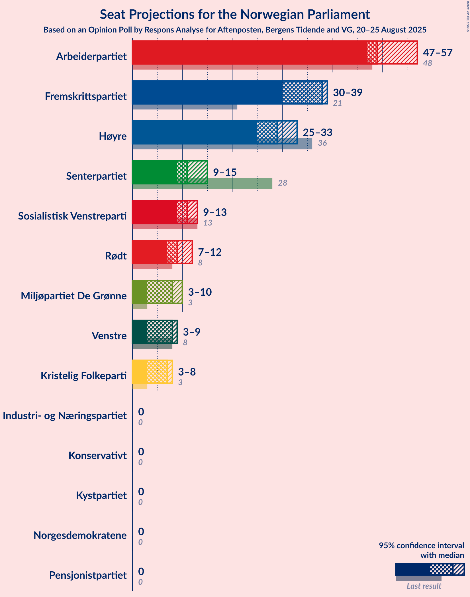
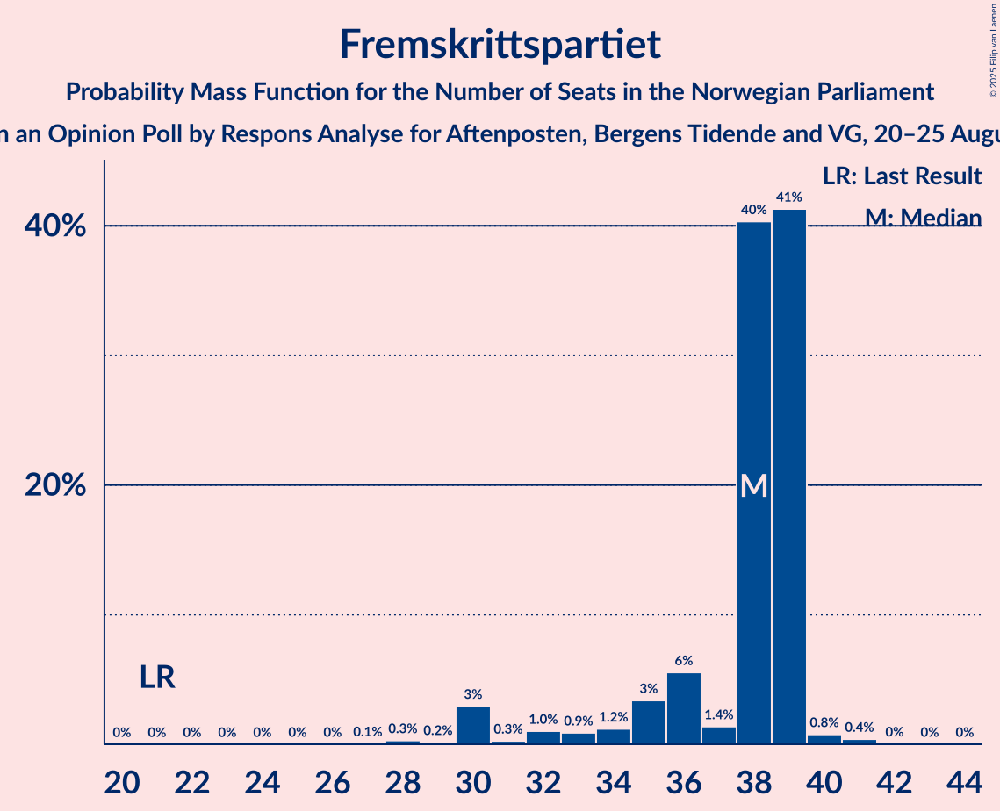
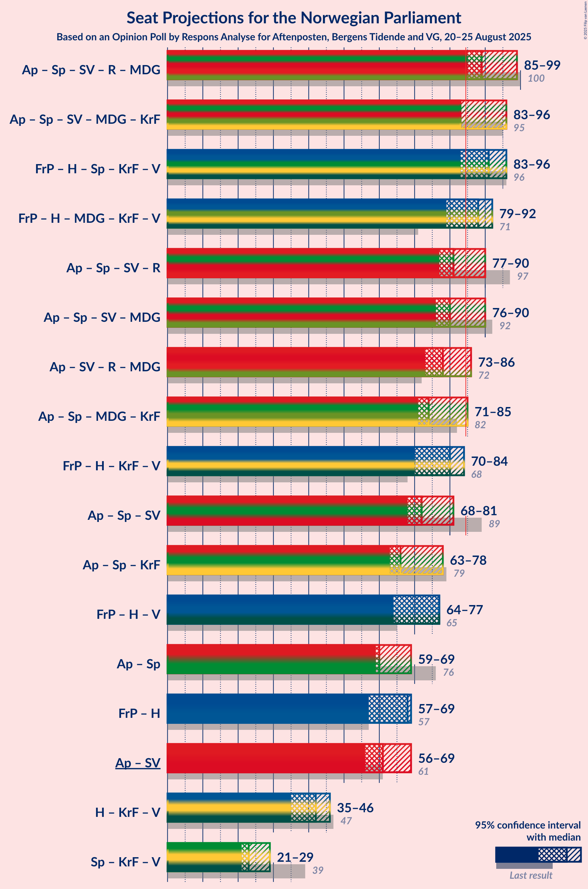
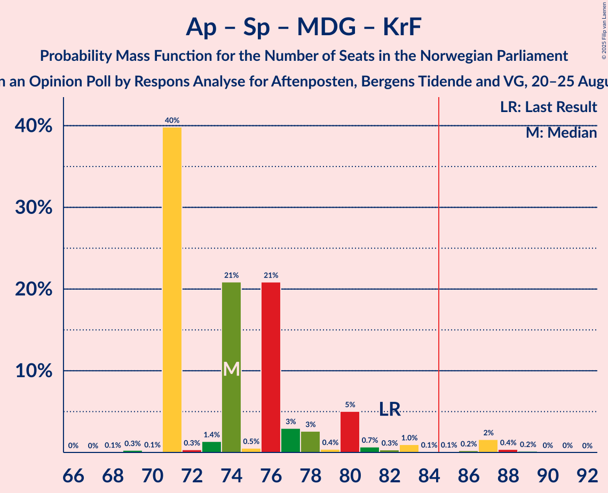

# Opinion Poll by Respons Analyse for Aftenposten, Bergens Tidende and VG, 20–25 August 2025

<a href="#voting-intentions">Voting Intentions</a> | <a href="#seats">Seats</a> | <a href="#coalitions">Coalitions</a> | <a href="#technical-information">Technical Information</a>

## Voting Intentions

### Confidence Intervals

| Party | Last Result | Poll Result | 80% Confidence Interval | 90% Confidence Interval | 95% Confidence Interval | 99% Confidence Interval |
|:-----:|:-----------:|:-----------:|:-----------------------:|:-----------------------:|:-----------------------:|:-----------------------:|
| Arbeiderpartiet | 26.2% | 28.0% | 26.0–30.0% |25.5–30.6% |25.0–31.1% |24.1–32.1% |
| Fremskrittspartiet | 11.6% | 18.5% | 16.8–20.3% |16.4–20.8% |16.0–21.3% |15.2–22.2% |
| Høyre | 20.4% | 16.8% | 15.2–18.6% |14.8–19.1% |14.4–19.5% |13.7–20.4% |
| Senterpartiet | 13.5% | 6.8% | 5.8–8.1% |5.5–8.5% |5.3–8.8% |4.9–9.4% |
| Sosialistisk Venstreparti | 7.6% | 6.6% | 5.6–7.8% |5.3–8.2% |5.1–8.5% |4.7–9.1% |
| Rødt | 4.7% | 5.8% | 4.8–6.9% |4.6–7.3% |4.4–7.6% |4.0–8.2% |
| Miljøpartiet De Grønne | 3.9% | 5.0% | 4.2–6.2% |3.9–6.5% |3.7–6.8% |3.4–7.3% |
| Venstre | 4.6% | 4.4% | 3.6–5.5% |3.4–5.8% |3.2–6.1% |2.9–6.6% |
| Kristelig Folkeparti | 3.8% | 4.4% | 3.6–5.5% |3.4–5.8% |3.2–6.1% |2.9–6.6% |
| Pensjonistpartiet | 0.6% | 0.8% | 0.5–1.4% |0.5–1.6% |0.4–1.7% |0.3–2.0% |
| Norgesdemokratene | 1.1% | 0.6% | 0.4–1.1% |0.3–1.3% |0.3–1.4% |0.2–1.7% |
| Industri- og Næringspartiet | 0.3% | 0.5% | 0.3–1.0% |0.2–1.1% |0.2–1.2% |0.1–1.5% |
| Konservativt | 0.4% | 0.4% | 0.2–0.8% |0.2–0.9% |0.1–1.1% |0.1–1.3% |
| Kystpartiet | 0.0% | 0.2% | 0.1–0.6% |0.1–0.8% |0.1–0.9% |0.0–1.1% |

*Note:* The poll result column reflects the actual value used in the calculations. Published results may vary slightly, and in addition be rounded to fewer digits.

## Seats

### Confidence Intervals

| Party | Last Result | Median | 80% Confidence Interval | 90% Confidence Interval | 95% Confidence Interval | 99% Confidence Interval |
|:-----:|:-----------:|:------:|:-----------------------:|:-----------------------:|:-----------------------:|:-----------------------:|
| <a href="#arbeiderpartiet">Arbeiderpartiet</a> | 48 | 49 | 47–49 |47–52 |47–53 |47–57 |
| <a href="#fremskrittspartiet">Fremskrittspartiet</a> | 21 | 38 | 36–39 |35–39 |33–39 |30–39 |
| <a href="#høyre">Høyre</a> | 36 | 31 | 29–31 |29–32 |25–33 |23–33 |
| <a href="#senterpartiet">Senterpartiet</a> | 28 | 11 | 11–12 |11–13 |11–13 |7–15 |
| <a href="#sosialistisk-venstreparti">Sosialistisk Venstreparti</a> | 13 | 12 | 9–12 |9–12 |9–13 |8–13 |
| <a href="#rødt">Rødt</a> | 8 | 9 | 9 |9–10 |7–11 |7–13 |
| <a href="#miljøpartiet-de-grønne">Miljøpartiet De Grønne</a> | 3 | 8 | 8 |8–10 |7–10 |2–11 |
| <a href="#venstre">Venstre</a> | 8 | 8 | 8–9 |3–9 |3–9 |3–9 |
| <a href="#kristelig-folkeparti">Kristelig Folkeparti</a> | 3 | 3 | 3–7 |3–7 |3–8 |2–10 |
| <a href="#pensjonistpartiet">Pensjonistpartiet</a> | 0 | 0 | 0 |0 |0 |0 |
| <a href="#norgesdemokratene">Norgesdemokratene</a> | 0 | 0 | 0 |0 |0 |0 |
| <a href="#industri--og-næringspartiet">Industri- og Næringspartiet</a> | 0 | 0 | 0 |0 |0 |0 |
| <a href="#konservativt">Konservativt</a> | 0 | 0 | 0 |0 |0 |0 |
| <a href="#kystpartiet">Kystpartiet</a> | 0 | 0 | 0 |0 |0 |0–1 |

### Arbeiderpartiet

*For a full overview of the results for this party, see the [Arbeiderpartiet](party-arbeiderpartiet.html) page.*

| Number of Seats | Probability | Accumulated | Special Marks |
|:---------------:|:-----------:|:-----------:|:-------------:|
| 44 | 0.1% | 100% |  |
| 45 | 0% | 99.9% |  |
| 46 | 0.3% | 99.9% |  |
| 47 | 29% | 99.6% |  |
| 48 | 5% | 70% | Last Result |
| 49 | 57% | 65% | Median |
| 50 | 2% | 8% |  |
| 51 | 0.7% | 6% |  |
| 52 | 2% | 5% |  |
| 53 | 1.3% | 3% |  |
| 54 | 0.1% | 2% |  |
| 55 | 0.3% | 1.4% |  |
| 56 | 0.1% | 1.1% |  |
| 57 | 0.7% | 1.1% |  |
| 58 | 0.1% | 0.4% |  |
| 59 | 0.2% | 0.3% |  |
| 60 | 0.1% | 0.1% |  |
| 61 | 0% | 0% |  |

### Fremskrittspartiet

*For a full overview of the results for this party, see the [Fremskrittspartiet](party-fremskrittspartiet.html) page.*

| Number of Seats | Probability | Accumulated | Special Marks |
|:---------------:|:-----------:|:-----------:|:-------------:|
| 21 | 0% | 100% | Last Result |
| 22 | 0% | 100% |  |
| 23 | 0% | 100% |  |
| 24 | 0% | 100% |  |
| 25 | 0% | 100% |  |
| 26 | 0% | 100% |  |
| 27 | 0% | 100% |  |
| 28 | 0.3% | 100% |  |
| 29 | 0% | 99.6% |  |
| 30 | 0.1% | 99.6% |  |
| 31 | 0.1% | 99.5% |  |
| 32 | 0.9% | 99.4% |  |
| 33 | 1.0% | 98% |  |
| 34 | 0.8% | 97% |  |
| 35 | 4% | 97% |  |
| 36 | 3% | 93% |  |
| 37 | 2% | 90% |  |
| 38 | 58% | 88% | Median |
| 39 | 30% | 30% |  |
| 40 | 0.1% | 0.5% |  |
| 41 | 0.4% | 0.4% |  |
| 42 | 0% | 0.1% |  |
| 43 | 0% | 0% |  |

### Høyre

*For a full overview of the results for this party, see the [Høyre](party-høyre.html) page.*

| Number of Seats | Probability | Accumulated | Special Marks |
|:---------------:|:-----------:|:-----------:|:-------------:|
| 21 | 0% | 100% |  |
| 22 | 0% | 99.9% |  |
| 23 | 1.0% | 99.9% |  |
| 24 | 0.5% | 99.0% |  |
| 25 | 2% | 98% |  |
| 26 | 0.2% | 97% |  |
| 27 | 0.2% | 96% |  |
| 28 | 1.1% | 96% |  |
| 29 | 30% | 95% |  |
| 30 | 0.5% | 65% |  |
| 31 | 59% | 65% | Median |
| 32 | 3% | 6% |  |
| 33 | 2% | 3% |  |
| 34 | 0.2% | 0.3% |  |
| 35 | 0.1% | 0.1% |  |
| 36 | 0% | 0% | Last Result |

### Senterpartiet

*For a full overview of the results for this party, see the [Senterpartiet](party-senterpartiet.html) page.*

| Number of Seats | Probability | Accumulated | Special Marks |
|:---------------:|:-----------:|:-----------:|:-------------:|
| 7 | 0.5% | 100% |  |
| 8 | 0.9% | 99.5% |  |
| 9 | 0.7% | 98.6% |  |
| 10 | 0.3% | 98% |  |
| 11 | 61% | 98% | Median |
| 12 | 32% | 37% |  |
| 13 | 3% | 5% |  |
| 14 | 0.8% | 2% |  |
| 15 | 1.3% | 1.4% |  |
| 16 | 0.1% | 0.1% |  |
| 17 | 0% | 0% |  |
| 18 | 0% | 0% |  |
| 19 | 0% | 0% |  |
| 20 | 0% | 0% |  |
| 21 | 0% | 0% |  |
| 22 | 0% | 0% |  |
| 23 | 0% | 0% |  |
| 24 | 0% | 0% |  |
| 25 | 0% | 0% |  |
| 26 | 0% | 0% |  |
| 27 | 0% | 0% |  |
| 28 | 0% | 0% | Last Result |

### Sosialistisk Venstreparti

*For a full overview of the results for this party, see the [Sosialistisk Venstreparti](party-sosialistiskvenstreparti.html) page.*

| Number of Seats | Probability | Accumulated | Special Marks |
|:---------------:|:-----------:|:-----------:|:-------------:|
| 7 | 0.1% | 100% |  |
| 8 | 0.5% | 99.9% |  |
| 9 | 30% | 99.4% |  |
| 10 | 2% | 70% |  |
| 11 | 5% | 68% |  |
| 12 | 60% | 63% | Median |
| 13 | 2% | 3% | Last Result |
| 14 | 0.1% | 0.4% |  |
| 15 | 0.2% | 0.3% |  |
| 16 | 0% | 0.1% |  |
| 17 | 0% | 0% |  |

### Rødt

*For a full overview of the results for this party, see the [Rødt](party-rødt.html) page.*

| Number of Seats | Probability | Accumulated | Special Marks |
|:---------------:|:-----------:|:-----------:|:-------------:|
| 6 | 0.1% | 100% |  |
| 7 | 3% | 99.9% |  |
| 8 | 0.4% | 97% | Last Result |
| 9 | 91% | 96% | Median |
| 10 | 1.1% | 5% |  |
| 11 | 2% | 4% |  |
| 12 | 1.1% | 2% |  |
| 13 | 0.8% | 0.8% |  |
| 14 | 0% | 0% |  |

### Miljøpartiet De Grønne

*For a full overview of the results for this party, see the [Miljøpartiet De Grønne](party-miljøpartietdegrønne.html) page.*

| Number of Seats | Probability | Accumulated | Special Marks |
|:---------------:|:-----------:|:-----------:|:-------------:|
| 2 | 1.3% | 100% |  |
| 3 | 0.3% | 98.7% | Last Result |
| 4 | 0% | 98% |  |
| 5 | 0% | 98% |  |
| 6 | 0% | 98% |  |
| 7 | 1.2% | 98% |  |
| 8 | 88% | 97% | Median |
| 9 | 4% | 10% |  |
| 10 | 4% | 6% |  |
| 11 | 1.4% | 2% |  |
| 12 | 0.1% | 0.2% |  |
| 13 | 0.1% | 0.1% |  |
| 14 | 0% | 0% |  |

### Venstre

*For a full overview of the results for this party, see the [Venstre](party-venstre.html) page.*

| Number of Seats | Probability | Accumulated | Special Marks |
|:---------------:|:-----------:|:-----------:|:-------------:|
| 2 | 0.3% | 100% |  |
| 3 | 6% | 99.7% |  |
| 4 | 0% | 94% |  |
| 5 | 0% | 94% |  |
| 6 | 0.2% | 94% |  |
| 7 | 2% | 94% |  |
| 8 | 62% | 92% | Last Result, Median |
| 9 | 30% | 30% |  |
| 10 | 0.1% | 0.2% |  |
| 11 | 0.1% | 0.1% |  |
| 12 | 0% | 0% |  |

### Kristelig Folkeparti

*For a full overview of the results for this party, see the [Kristelig Folkeparti](party-kristeligfolkeparti.html) page.*

| Number of Seats | Probability | Accumulated | Special Marks |
|:---------------:|:-----------:|:-----------:|:-------------:|
| 1 | 0.5% | 100% |  |
| 2 | 0.5% | 99.5% |  |
| 3 | 58% | 99.0% | Last Result, Median |
| 4 | 0% | 41% |  |
| 5 | 0% | 41% |  |
| 6 | 0% | 41% |  |
| 7 | 37% | 41% |  |
| 8 | 2% | 4% |  |
| 9 | 0.7% | 2% |  |
| 10 | 1.4% | 2% |  |
| 11 | 0.1% | 0.1% |  |
| 12 | 0% | 0% |  |

### Pensjonistpartiet

*For a full overview of the results for this party, see the [Pensjonistpartiet](party-pensjonistpartiet.html) page.*

| Number of Seats | Probability | Accumulated | Special Marks |
|:---------------:|:-----------:|:-----------:|:-------------:|
| 0 | 100% | 100% | Last Result, Median |

### Norgesdemokratene

*For a full overview of the results for this party, see the [Norgesdemokratene](party-norgesdemokratene.html) page.*

| Number of Seats | Probability | Accumulated | Special Marks |
|:---------------:|:-----------:|:-----------:|:-------------:|
| 0 | 100% | 100% | Last Result, Median |

### Industri- og Næringspartiet

*For a full overview of the results for this party, see the [Industri- og Næringspartiet](party-industri-ognæringspartiet.html) page.*

| Number of Seats | Probability | Accumulated | Special Marks |
|:---------------:|:-----------:|:-----------:|:-------------:|
| 0 | 100% | 100% | Last Result, Median |

### Konservativt

*For a full overview of the results for this party, see the [Konservativt](party-konservativt.html) page.*

| Number of Seats | Probability | Accumulated | Special Marks |
|:---------------:|:-----------:|:-----------:|:-------------:|
| 0 | 100% | 100% | Last Result, Median |

### Kystpartiet

*For a full overview of the results for this party, see the [Kystpartiet](party-kystpartiet.html) page.*

| Number of Seats | Probability | Accumulated | Special Marks |
|:---------------:|:-----------:|:-----------:|:-------------:|
| 0 | 98.8% | 100% | Last Result, Median |
| 1 | 1.1% | 1.2% |  |
| 2 | 0.1% | 0.1% |  |
| 3 | 0% | 0% |  |

## Coalitions

### Confidence Intervals

| Coalition | Last Result | Median | Majority? | 80% Confidence Interval | 90% Confidence Interval | 95% Confidence Interval | 99% Confidence Interval |
|:---------:|:-----------:|:------:|:---------:|:-----------------------:|:-----------------------:|:-----------------------:|:-----------------------:|
| Fremskrittspartiet – Høyre – Senterpartiet – Kristelig Folkeparti – Venstre | 96 | 91 | 99.1% | 91–96 | 88–96 | 87–96 | 83–96 |
| Arbeiderpartiet – Senterpartiet – Sosialistisk Venstreparti – Rødt – Miljøpartiet De Grønne | 100 | 89 | 99.9% | 85–90 | 85–92 | 85–95 | 85–98 |
| Arbeiderpartiet – Senterpartiet – Sosialistisk Venstreparti – Miljøpartiet De Grønne – Kristelig Folkeparti | 95 | 83 | 11% | 83–87 | 83–91 | 83–92 | 82–97 |
| Fremskrittspartiet – Høyre – Miljøpartiet De Grønne – Kristelig Folkeparti – Venstre | 71 | 88 | 96% | 87–92 | 86–92 | 83–92 | 80–92 |
| Arbeiderpartiet – Senterpartiet – Sosialistisk Venstreparti – Rødt | 97 | 81 | 4% | 77–81 | 77–83 | 77–86 | 77–89 |
| Arbeiderpartiet – Senterpartiet – Sosialistisk Venstreparti – Miljøpartiet De Grønne | 92 | 80 | 4% | 76–81 | 76–84 | 76–85 | 74–90 |
| Fremskrittspartiet – Høyre – Kristelig Folkeparti – Venstre | 68 | 80 | 0.1% | 79–84 | 77–84 | 74–84 | 71–84 |
| Arbeiderpartiet – Sosialistisk Venstreparti – Rødt – Miljøpartiet De Grønne | 72 | 78 | 0.8% | 73–78 | 73–81 | 73–82 | 73–86 |
| Arbeiderpartiet – Senterpartiet – Miljøpartiet De Grønne – Kristelig Folkeparti | 82 | 71 | 0.4% | 71–77 | 71–78 | 71–80 | 71–83 |
| Fremskrittspartiet – Høyre – Venstre | 65 | 77 | 0% | 72–77 | 70–77 | 67–77 | 64–77 |
| Arbeiderpartiet – Senterpartiet – Sosialistisk Venstreparti | 89 | 72 | 0% | 68–72 | 68–75 | 68–76 | 67–80 |
| Arbeiderpartiet – Senterpartiet – Kristelig Folkeparti | 79 | 63 | 0% | 63–67 | 63–70 | 63–72 | 63–76 |
| Fremskrittspartiet – Høyre | 57 | 69 | 0% | 68–69 | 64–69 | 61–69 | 57–69 |
| Arbeiderpartiet – Senterpartiet | 76 | 60 | 0% | 59–61 | 59–63 | 59–65 | 57–68 |
| Arbeiderpartiet – Sosialistisk Venstreparti | 61 | 61 | 0% | 56–61 | 56–63 | 56–64 | 56–69 |
| Høyre – Kristelig Folkeparti – Venstre | 47 | 42 | 0% | 42–45 | 41–45 | 40–45 | 37–49 |
| Senterpartiet – Kristelig Folkeparti – Venstre | 39 | 22 | 0% | 22–28 | 22–28 | 21–29 | 19–30 |

### Fremskrittspartiet – Høyre – Senterpartiet – Kristelig Folkeparti – Venstre

| Number of Seats | Probability | Accumulated | Special Marks |
|:---------------:|:-----------:|:-----------:|:-------------:|
| 78 | 0% | 100% |  |
| 79 | 0% | 99.9% |  |
| 80 | 0% | 99.9% |  |
| 81 | 0.2% | 99.9% |  |
| 82 | 0.1% | 99.6% |  |
| 83 | 0.3% | 99.5% |  |
| 84 | 0.1% | 99.2% |  |
| 85 | 0.8% | 99.1% | Majority |
| 86 | 0.6% | 98% |  |
| 87 | 0.8% | 98% |  |
| 88 | 3% | 97% |  |
| 89 | 3% | 94% |  |
| 90 | 0.5% | 91% |  |
| 91 | 57% | 91% | Median |
| 92 | 3% | 33% |  |
| 93 | 0.2% | 31% |  |
| 94 | 0.1% | 31% |  |
| 95 | 1.2% | 31% |  |
| 96 | 29% | 29% | Last Result |
| 97 | 0% | 0.1% |  |
| 98 | 0% | 0% |  |

### Arbeiderpartiet – Senterpartiet – Sosialistisk Venstreparti – Rødt – Miljøpartiet De Grønne

| Number of Seats | Probability | Accumulated | Special Marks |
|:---------------:|:-----------:|:-----------:|:-------------:|
| 83 | 0% | 100% |  |
| 84 | 0% | 99.9% |  |
| 85 | 30% | 99.9% | Majority |
| 86 | 0.1% | 69% |  |
| 87 | 0% | 69% |  |
| 88 | 0.5% | 69% |  |
| 89 | 58% | 69% | Median |
| 90 | 3% | 11% |  |
| 91 | 0.5% | 8% |  |
| 92 | 4% | 8% |  |
| 93 | 0.2% | 3% |  |
| 94 | 0.4% | 3% |  |
| 95 | 0.6% | 3% |  |
| 96 | 0.6% | 2% |  |
| 97 | 0.9% | 1.5% |  |
| 98 | 0.2% | 0.6% |  |
| 99 | 0.2% | 0.4% |  |
| 100 | 0.1% | 0.2% | Last Result |
| 101 | 0% | 0.1% |  |
| 102 | 0% | 0.1% |  |
| 103 | 0% | 0% |  |

### Arbeiderpartiet – Senterpartiet – Sosialistisk Venstreparti – Miljøpartiet De Grønne – Kristelig Folkeparti

| Number of Seats | Probability | Accumulated | Special Marks |
|:---------------:|:-----------:|:-----------:|:-------------:|
| 79 | 0.4% | 100% |  |
| 80 | 0% | 99.6% |  |
| 81 | 0% | 99.6% |  |
| 82 | 0.1% | 99.5% |  |
| 83 | 87% | 99.4% | Median |
| 84 | 1.3% | 13% |  |
| 85 | 0.1% | 11% | Majority |
| 86 | 1.1% | 11% |  |
| 87 | 0.7% | 10% |  |
| 88 | 2% | 10% |  |
| 89 | 0.3% | 7% |  |
| 90 | 1.5% | 7% |  |
| 91 | 0.6% | 5% |  |
| 92 | 3% | 5% |  |
| 93 | 1.1% | 2% |  |
| 94 | 0.1% | 0.8% |  |
| 95 | 0.1% | 0.7% | Last Result |
| 96 | 0.1% | 0.6% |  |
| 97 | 0% | 0.5% |  |
| 98 | 0.2% | 0.5% |  |
| 99 | 0% | 0.3% |  |
| 100 | 0.2% | 0.3% |  |
| 101 | 0% | 0.1% |  |
| 102 | 0% | 0% |  |

### Fremskrittspartiet – Høyre – Miljøpartiet De Grønne – Kristelig Folkeparti – Venstre

| Number of Seats | Probability | Accumulated | Special Marks |
|:---------------:|:-----------:|:-----------:|:-------------:|
| 71 | 0% | 100% | Last Result |
| 72 | 0% | 100% |  |
| 73 | 0% | 100% |  |
| 74 | 0% | 100% |  |
| 75 | 0% | 100% |  |
| 76 | 0.1% | 99.9% |  |
| 77 | 0% | 99.8% |  |
| 78 | 0% | 99.8% |  |
| 79 | 0.2% | 99.8% |  |
| 80 | 0.5% | 99.6% |  |
| 81 | 0.3% | 99.1% |  |
| 82 | 0.7% | 98.7% |  |
| 83 | 0.7% | 98% |  |
| 84 | 1.0% | 97% |  |
| 85 | 0.3% | 96% | Majority |
| 86 | 2% | 96% |  |
| 87 | 4% | 94% |  |
| 88 | 60% | 90% | Median |
| 89 | 0.1% | 30% |  |
| 90 | 0.8% | 30% |  |
| 91 | 0.1% | 29% |  |
| 92 | 29% | 29% |  |
| 93 | 0% | 0.1% |  |
| 94 | 0.1% | 0.1% |  |
| 95 | 0% | 0% |  |

### Arbeiderpartiet – Senterpartiet – Sosialistisk Venstreparti – Rødt

| Number of Seats | Probability | Accumulated | Special Marks |
|:---------------:|:-----------:|:-----------:|:-------------:|
| 74 | 0.1% | 100% |  |
| 75 | 0% | 99.9% |  |
| 76 | 0% | 99.9% |  |
| 77 | 29% | 99.9% |  |
| 78 | 0% | 71% |  |
| 79 | 0.8% | 71% |  |
| 80 | 0.1% | 70% |  |
| 81 | 60% | 70% | Median |
| 82 | 4% | 10% |  |
| 83 | 2% | 6% |  |
| 84 | 0.2% | 4% |  |
| 85 | 1.0% | 4% | Majority |
| 86 | 0.7% | 3% |  |
| 87 | 0.6% | 2% |  |
| 88 | 0.4% | 1.2% |  |
| 89 | 0.5% | 0.8% |  |
| 90 | 0.1% | 0.3% |  |
| 91 | 0% | 0.2% |  |
| 92 | 0% | 0.2% |  |
| 93 | 0.1% | 0.2% |  |
| 94 | 0.1% | 0.1% |  |
| 95 | 0% | 0% |  |
| 96 | 0% | 0% |  |
| 97 | 0% | 0% | Last Result |

### Arbeiderpartiet – Senterpartiet – Sosialistisk Venstreparti – Miljøpartiet De Grønne

| Number of Seats | Probability | Accumulated | Special Marks |
|:---------------:|:-----------:|:-----------:|:-------------:|
| 73 | 0.1% | 100% |  |
| 74 | 1.2% | 99.9% |  |
| 75 | 0% | 98.7% |  |
| 76 | 30% | 98.7% |  |
| 77 | 0.1% | 69% |  |
| 78 | 0.7% | 69% |  |
| 79 | 0.4% | 68% |  |
| 80 | 57% | 68% | Median |
| 81 | 2% | 11% |  |
| 82 | 0.7% | 8% |  |
| 83 | 2% | 8% |  |
| 84 | 0.9% | 5% |  |
| 85 | 3% | 4% | Majority |
| 86 | 0.6% | 1.4% |  |
| 87 | 0% | 0.8% |  |
| 88 | 0.2% | 0.8% |  |
| 89 | 0.1% | 0.6% |  |
| 90 | 0.3% | 0.6% |  |
| 91 | 0.2% | 0.3% |  |
| 92 | 0% | 0.1% | Last Result |
| 93 | 0.1% | 0.1% |  |
| 94 | 0% | 0% |  |

### Fremskrittspartiet – Høyre – Kristelig Folkeparti – Venstre

| Number of Seats | Probability | Accumulated | Special Marks |
|:---------------:|:-----------:|:-----------:|:-------------:|
| 67 | 0% | 100% |  |
| 68 | 0.1% | 99.9% | Last Result |
| 69 | 0% | 99.8% |  |
| 70 | 0.3% | 99.8% |  |
| 71 | 0.2% | 99.5% |  |
| 72 | 0.9% | 99.3% |  |
| 73 | 0.7% | 98% |  |
| 74 | 0.5% | 98% |  |
| 75 | 0.4% | 97% |  |
| 76 | 0.3% | 97% |  |
| 77 | 5% | 97% |  |
| 78 | 0.3% | 92% |  |
| 79 | 3% | 92% |  |
| 80 | 58% | 89% | Median |
| 81 | 0.5% | 31% |  |
| 82 | 0.1% | 31% |  |
| 83 | 0.1% | 31% |  |
| 84 | 30% | 30% |  |
| 85 | 0% | 0.1% | Majority |
| 86 | 0% | 0% |  |

### Arbeiderpartiet – Sosialistisk Venstreparti – Rødt – Miljøpartiet De Grønne

| Number of Seats | Probability | Accumulated | Special Marks |
|:---------------:|:-----------:|:-----------:|:-------------:|
| 72 | 0% | 100% | Last Result |
| 73 | 29% | 99.9% |  |
| 74 | 1.3% | 71% |  |
| 75 | 0.1% | 69% |  |
| 76 | 0.1% | 69% |  |
| 77 | 3% | 69% |  |
| 78 | 57% | 67% | Median |
| 79 | 0.7% | 9% |  |
| 80 | 3% | 9% |  |
| 81 | 3% | 6% |  |
| 82 | 0.8% | 3% |  |
| 83 | 0.6% | 2% |  |
| 84 | 0.8% | 2% |  |
| 85 | 0.1% | 0.8% | Majority |
| 86 | 0.3% | 0.7% |  |
| 87 | 0.2% | 0.4% |  |
| 88 | 0.1% | 0.2% |  |
| 89 | 0% | 0.1% |  |
| 90 | 0% | 0.1% |  |
| 91 | 0% | 0.1% |  |
| 92 | 0% | 0% |  |

### Arbeiderpartiet – Senterpartiet – Miljøpartiet De Grønne – Kristelig Folkeparti

| Number of Seats | Probability | Accumulated | Special Marks |
|:---------------:|:-----------:|:-----------:|:-------------:|
| 68 | 0.1% | 100% |  |
| 69 | 0.4% | 99.9% |  |
| 70 | 0% | 99.5% |  |
| 71 | 57% | 99.5% | Median |
| 72 | 0.2% | 42% |  |
| 73 | 2% | 42% |  |
| 74 | 30% | 41% |  |
| 75 | 0.5% | 11% |  |
| 76 | 0.4% | 10% |  |
| 77 | 4% | 10% |  |
| 78 | 1.1% | 6% |  |
| 79 | 0.1% | 5% |  |
| 80 | 3% | 5% |  |
| 81 | 0.1% | 2% |  |
| 82 | 0.3% | 2% | Last Result |
| 83 | 1.3% | 2% |  |
| 84 | 0% | 0.5% |  |
| 85 | 0% | 0.4% | Majority |
| 86 | 0.1% | 0.4% |  |
| 87 | 0% | 0.3% |  |
| 88 | 0% | 0.3% |  |
| 89 | 0.2% | 0.3% |  |
| 90 | 0% | 0% |  |

### Fremskrittspartiet – Høyre – Venstre

| Number of Seats | Probability | Accumulated | Special Marks |
|:---------------:|:-----------:|:-----------:|:-------------:|
| 60 | 0.2% | 100% |  |
| 61 | 0% | 99.7% |  |
| 62 | 0% | 99.7% |  |
| 63 | 0% | 99.7% |  |
| 64 | 0.2% | 99.7% |  |
| 65 | 0.8% | 99.5% | Last Result |
| 66 | 0.6% | 98.6% |  |
| 67 | 0.7% | 98% |  |
| 68 | 0.2% | 97% |  |
| 69 | 0.5% | 97% |  |
| 70 | 4% | 97% |  |
| 71 | 0.8% | 92% |  |
| 72 | 2% | 92% |  |
| 73 | 0.4% | 89% |  |
| 74 | 1.3% | 89% |  |
| 75 | 0.3% | 88% |  |
| 76 | 0.5% | 87% |  |
| 77 | 87% | 87% | Median |
| 78 | 0.1% | 0.2% |  |
| 79 | 0.1% | 0.1% |  |
| 80 | 0% | 0.1% |  |
| 81 | 0% | 0% |  |

### Arbeiderpartiet – Senterpartiet – Sosialistisk Venstreparti

| Number of Seats | Probability | Accumulated | Special Marks |
|:---------------:|:-----------:|:-----------:|:-------------:|
| 65 | 0.1% | 100% |  |
| 66 | 0.4% | 99.9% |  |
| 67 | 0% | 99.5% |  |
| 68 | 29% | 99.5% |  |
| 69 | 0.6% | 70% |  |
| 70 | 0.4% | 70% |  |
| 71 | 0.3% | 69% |  |
| 72 | 61% | 69% | Median |
| 73 | 2% | 8% |  |
| 74 | 0.1% | 6% |  |
| 75 | 3% | 6% |  |
| 76 | 0.7% | 3% |  |
| 77 | 0.2% | 2% |  |
| 78 | 0.7% | 2% |  |
| 79 | 0.2% | 1.0% |  |
| 80 | 0.3% | 0.7% |  |
| 81 | 0.1% | 0.4% |  |
| 82 | 0.2% | 0.3% |  |
| 83 | 0% | 0.1% |  |
| 84 | 0% | 0.1% |  |
| 85 | 0% | 0% | Majority |
| 86 | 0% | 0% |  |
| 87 | 0% | 0% |  |
| 88 | 0% | 0% |  |
| 89 | 0% | 0% | Last Result |

### Arbeiderpartiet – Senterpartiet – Kristelig Folkeparti

| Number of Seats | Probability | Accumulated | Special Marks |
|:---------------:|:-----------:|:-----------:|:-------------:|
| 59 | 0.4% | 100% |  |
| 60 | 0.1% | 99.6% |  |
| 61 | 0% | 99.6% |  |
| 62 | 0% | 99.5% |  |
| 63 | 57% | 99.5% | Median |
| 64 | 0.5% | 42% |  |
| 65 | 0.4% | 42% |  |
| 66 | 30% | 42% |  |
| 67 | 2% | 12% |  |
| 68 | 3% | 10% |  |
| 69 | 0.6% | 7% |  |
| 70 | 2% | 6% |  |
| 71 | 1.3% | 4% |  |
| 72 | 0.7% | 3% |  |
| 73 | 0.5% | 2% |  |
| 74 | 0.2% | 1.4% |  |
| 75 | 0.3% | 1.2% |  |
| 76 | 0.4% | 0.9% |  |
| 77 | 0% | 0.5% |  |
| 78 | 0.2% | 0.5% |  |
| 79 | 0% | 0.2% | Last Result |
| 80 | 0.1% | 0.2% |  |
| 81 | 0% | 0.1% |  |
| 82 | 0% | 0% |  |

### Fremskrittspartiet – Høyre

| Number of Seats | Probability | Accumulated | Special Marks |
|:---------------:|:-----------:|:-----------:|:-------------:|
| 51 | 0.2% | 100% |  |
| 52 | 0% | 99.8% |  |
| 53 | 0% | 99.8% |  |
| 54 | 0% | 99.8% |  |
| 55 | 0% | 99.8% |  |
| 56 | 0.1% | 99.7% |  |
| 57 | 0.6% | 99.6% | Last Result |
| 58 | 0.7% | 99.0% |  |
| 59 | 0.2% | 98% |  |
| 60 | 0.5% | 98% |  |
| 61 | 0.2% | 98% |  |
| 62 | 2% | 97% |  |
| 63 | 0.6% | 96% |  |
| 64 | 0.5% | 95% |  |
| 65 | 0.2% | 95% |  |
| 66 | 2% | 95% |  |
| 67 | 2% | 92% |  |
| 68 | 30% | 90% |  |
| 69 | 60% | 60% | Median |
| 70 | 0% | 0.1% |  |
| 71 | 0% | 0.1% |  |
| 72 | 0% | 0.1% |  |
| 73 | 0% | 0.1% |  |
| 74 | 0% | 0% |  |

### Arbeiderpartiet – Senterpartiet

| Number of Seats | Probability | Accumulated | Special Marks |
|:---------------:|:-----------:|:-----------:|:-------------:|
| 55 | 0.1% | 100% |  |
| 56 | 0.4% | 99.9% |  |
| 57 | 0.2% | 99.6% |  |
| 58 | 0.3% | 99.4% |  |
| 59 | 30% | 99.0% |  |
| 60 | 59% | 69% | Median |
| 61 | 4% | 11% |  |
| 62 | 0.4% | 6% |  |
| 63 | 3% | 6% |  |
| 64 | 0.6% | 3% |  |
| 65 | 0.6% | 3% |  |
| 66 | 0.3% | 2% |  |
| 67 | 0.3% | 2% |  |
| 68 | 1.0% | 1.3% |  |
| 69 | 0.1% | 0.4% |  |
| 70 | 0% | 0.3% |  |
| 71 | 0.1% | 0.3% |  |
| 72 | 0.1% | 0.2% |  |
| 73 | 0% | 0% |  |
| 74 | 0% | 0% |  |
| 75 | 0% | 0% |  |
| 76 | 0% | 0% | Last Result |

### Arbeiderpartiet – Sosialistisk Venstreparti

| Number of Seats | Probability | Accumulated | Special Marks |
|:---------------:|:-----------:|:-----------:|:-------------:|
| 54 | 0.1% | 100% |  |
| 55 | 0.1% | 99.9% |  |
| 56 | 29% | 99.8% |  |
| 57 | 0.3% | 71% |  |
| 58 | 0.6% | 70% |  |
| 59 | 2% | 70% |  |
| 60 | 0.6% | 67% |  |
| 61 | 61% | 67% | Last Result, Median |
| 62 | 0.2% | 5% |  |
| 63 | 0.8% | 5% |  |
| 64 | 2% | 4% |  |
| 65 | 0.2% | 2% |  |
| 66 | 0.4% | 2% |  |
| 67 | 0.2% | 1.2% |  |
| 68 | 0.2% | 1.0% |  |
| 69 | 0.6% | 0.8% |  |
| 70 | 0.1% | 0.2% |  |
| 71 | 0.1% | 0.1% |  |
| 72 | 0% | 0.1% |  |
| 73 | 0% | 0% |  |

### Høyre – Kristelig Folkeparti – Venstre

| Number of Seats | Probability | Accumulated | Special Marks |
|:---------------:|:-----------:|:-----------:|:-------------:|
| 32 | 0% | 100% |  |
| 33 | 0% | 99.9% |  |
| 34 | 0.1% | 99.9% |  |
| 35 | 0.1% | 99.8% |  |
| 36 | 0.1% | 99.7% |  |
| 37 | 0.5% | 99.7% |  |
| 38 | 0.6% | 99.1% |  |
| 39 | 0.9% | 98.5% |  |
| 40 | 2% | 98% |  |
| 41 | 0.9% | 95% |  |
| 42 | 60% | 94% | Median |
| 43 | 3% | 35% |  |
| 44 | 0.2% | 32% |  |
| 45 | 30% | 32% |  |
| 46 | 0.2% | 2% |  |
| 47 | 0.5% | 2% | Last Result |
| 48 | 0.1% | 1.4% |  |
| 49 | 1.3% | 1.4% |  |
| 50 | 0.1% | 0.1% |  |
| 51 | 0% | 0% |  |

### Senterpartiet – Kristelig Folkeparti – Venstre

| Number of Seats | Probability | Accumulated | Special Marks |
|:---------------:|:-----------:|:-----------:|:-------------:|
| 15 | 0.1% | 100% |  |
| 16 | 0% | 99.9% |  |
| 17 | 0.1% | 99.9% |  |
| 18 | 0% | 99.9% |  |
| 19 | 0.4% | 99.8% |  |
| 20 | 0.6% | 99.4% |  |
| 21 | 3% | 98.8% |  |
| 22 | 57% | 96% | Median |
| 23 | 4% | 39% |  |
| 24 | 0.5% | 35% |  |
| 25 | 0.2% | 35% |  |
| 26 | 0.3% | 35% |  |
| 27 | 2% | 34% |  |
| 28 | 29% | 32% |  |
| 29 | 2% | 3% |  |
| 30 | 0.9% | 1.3% |  |
| 31 | 0.1% | 0.4% |  |
| 32 | 0.2% | 0.3% |  |
| 33 | 0% | 0.1% |  |
| 34 | 0% | 0.1% |  |
| 35 | 0% | 0% |  |
| 36 | 0% | 0% |  |
| 37 | 0% | 0% |  |
| 38 | 0% | 0% |  |
| 39 | 0% | 0% | Last Result |

## Technical Information

### Opinion Poll

+ **Polling firm:** Respons Analyse
+ **Commissioner(s):** Aftenposten, Bergens Tidende and VG
+ **Fieldwork period:** 20–25 August 2025

### Calculations

+ **Sample size:** 833
+ **Simulations done:** 1,048,576
+ **Error estimate:** 1.34%

