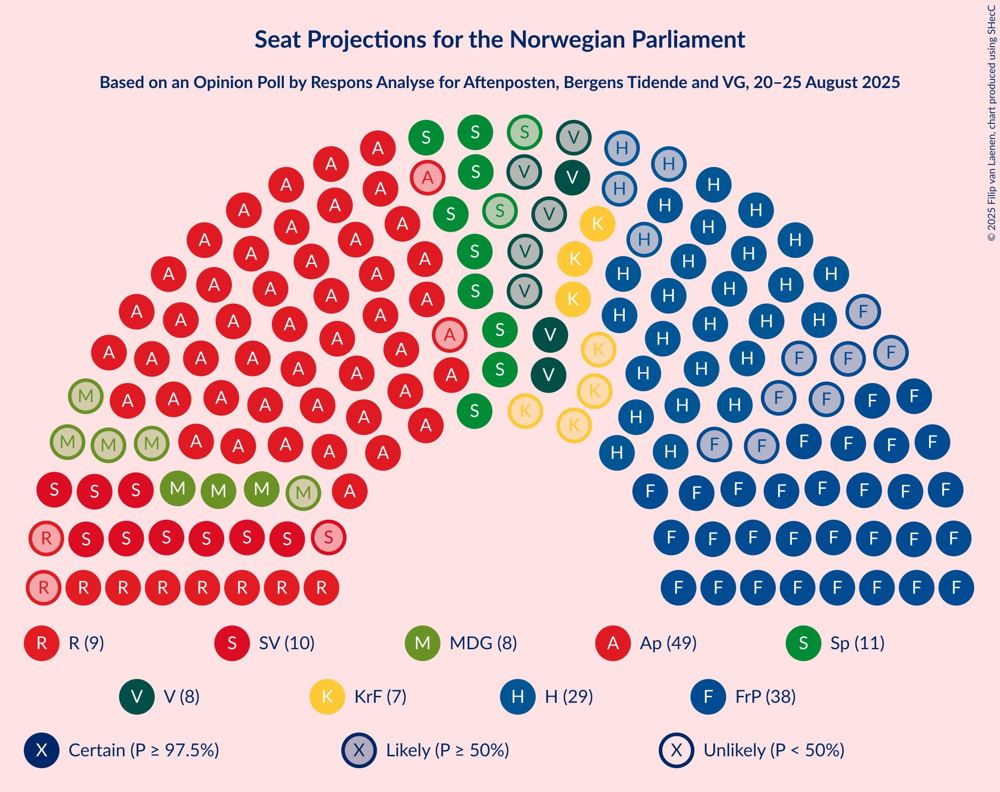
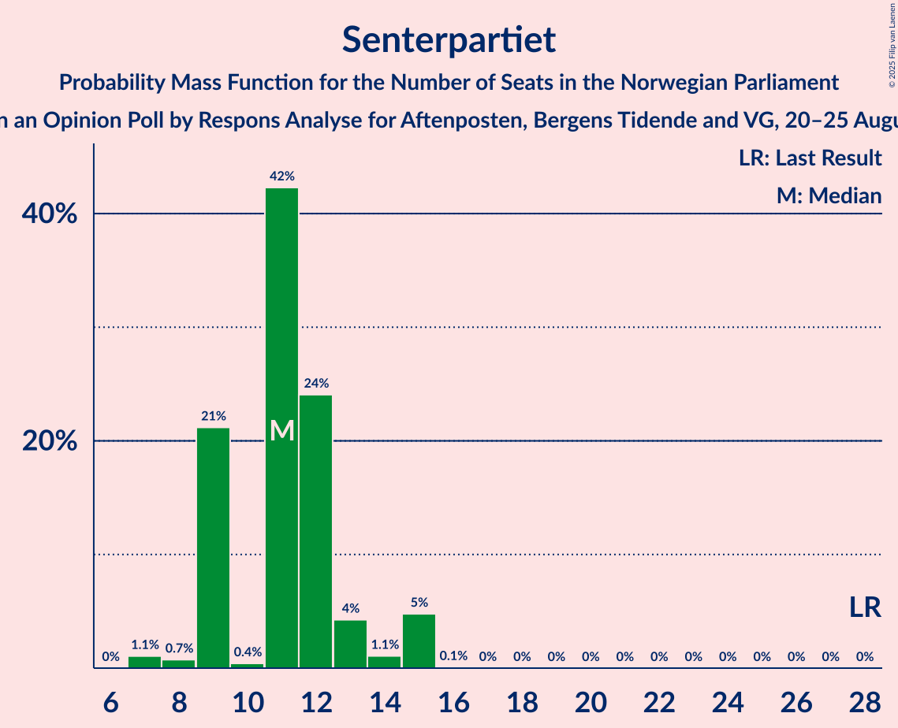
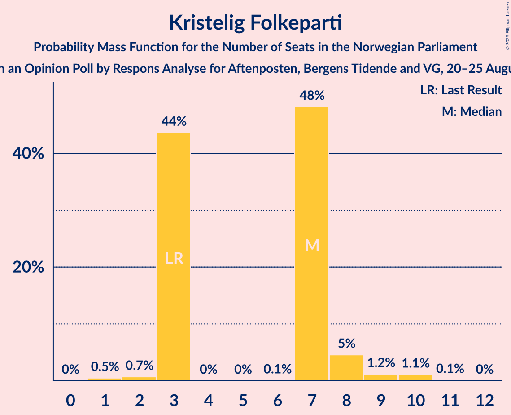
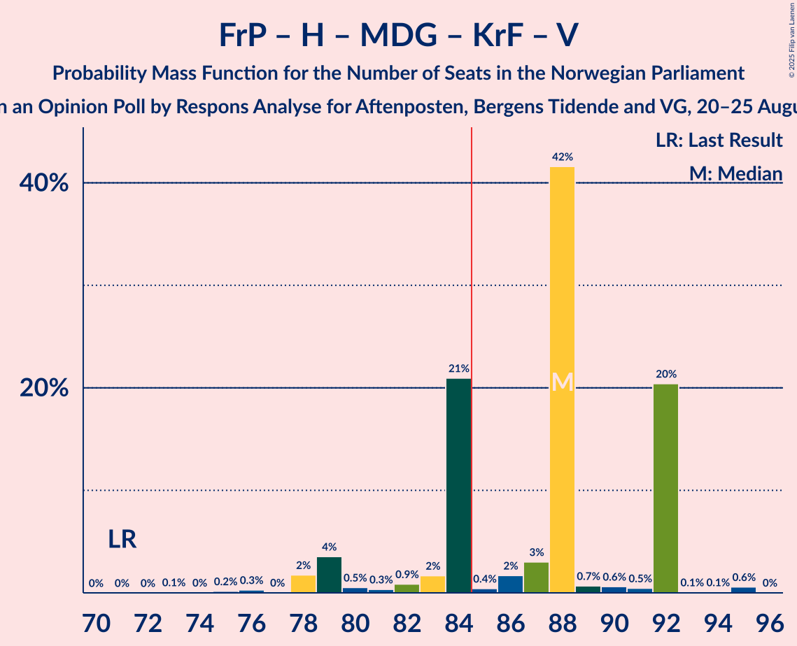

# Opinion Poll by Respons Analyse for Aftenposten, Bergens Tidende and VG, 20–25 August 2025

<a href="#voting-intentions">Voting Intentions</a> | <a href="#seats">Seats</a> | <a href="#coalitions">Coalitions</a> | <a href="#technical-information">Technical Information</a>

## Voting Intentions

### Confidence Intervals

| Party | Last Result | Poll Result | 80% Confidence Interval | 90% Confidence Interval | 95% Confidence Interval | 99% Confidence Interval |
|:-----:|:-----------:|:-----------:|:-----------------------:|:-----------------------:|:-----------------------:|:-----------------------:|
| Arbeiderpartiet | 26.2% | 28.0% | 26.0–30.0% |25.5–30.6% |25.0–31.1% |24.1–32.1% |
| Fremskrittspartiet | 11.6% | 18.5% | 16.8–20.3% |16.4–20.8% |16.0–21.3% |15.2–22.2% |
| Høyre | 20.4% | 16.8% | 15.2–18.6% |14.8–19.1% |14.4–19.5% |13.7–20.4% |
| Senterpartiet | 13.5% | 6.8% | 5.8–8.1% |5.5–8.5% |5.3–8.8% |4.9–9.4% |
| Sosialistisk Venstreparti | 7.6% | 6.6% | 5.6–7.8% |5.3–8.2% |5.1–8.5% |4.7–9.1% |
| Rødt | 4.7% | 5.8% | 4.8–6.9% |4.6–7.3% |4.4–7.6% |4.0–8.2% |
| Miljøpartiet De Grønne | 3.9% | 5.0% | 4.2–6.2% |3.9–6.5% |3.7–6.8% |3.4–7.3% |
| Venstre | 4.6% | 4.4% | 3.6–5.5% |3.4–5.8% |3.2–6.1% |2.9–6.6% |
| Kristelig Folkeparti | 3.8% | 4.4% | 3.6–5.5% |3.4–5.8% |3.2–6.1% |2.9–6.6% |
| Pensjonistpartiet | 0.6% | 0.8% | 0.5–1.4% |0.5–1.6% |0.4–1.7% |0.3–2.0% |
| Norgesdemokratene | 1.1% | 0.6% | 0.4–1.1% |0.3–1.3% |0.3–1.4% |0.2–1.7% |
| Industri- og Næringspartiet | 0.3% | 0.5% | 0.3–1.0% |0.2–1.1% |0.2–1.2% |0.1–1.5% |
| Konservativt | 0.4% | 0.4% | 0.2–0.8% |0.2–0.9% |0.1–1.1% |0.1–1.3% |
| Kystpartiet | 0.0% | 0.2% | 0.1–0.6% |0.1–0.8% |0.1–0.9% |0.0–1.1% |

*Note:* The poll result column reflects the actual value used in the calculations. Published results may vary slightly, and in addition be rounded to fewer digits.

## Seats

### Confidence Intervals

| Party | Last Result | Median | 80% Confidence Interval | 90% Confidence Interval | 95% Confidence Interval | 99% Confidence Interval |
|:-----:|:-----------:|:------:|:-----------------------:|:-----------------------:|:-----------------------:|:-----------------------:|
| <a href="#arbeiderpartiet">Arbeiderpartiet</a> | 48 | 49 | 47–57 |47–57 |47–57 |46–59 |
| <a href="#fremskrittspartiet">Fremskrittspartiet</a> | 21 | 38 | 35–39 |33–39 |30–39 |29–40 |
| <a href="#høyre">Høyre</a> | 36 | 29 | 28–31 |25–32 |25–33 |23–33 |
| <a href="#senterpartiet">Senterpartiet</a> | 28 | 11 | 9–13 |9–14 |9–15 |7–15 |
| <a href="#sosialistisk-venstreparti">Sosialistisk Venstreparti</a> | 13 | 11 | 9–12 |9–12 |9–13 |7–14 |
| <a href="#rødt">Rødt</a> | 8 | 9 | 9 |8–11 |7–12 |5–13 |
| <a href="#miljøpartiet-de-grønne">Miljøpartiet De Grønne</a> | 3 | 8 | 3–8 |3–10 |3–10 |2–11 |
| <a href="#venstre">Venstre</a> | 8 | 8 | 7–9 |3–9 |3–9 |3–9 |
| <a href="#kristelig-folkeparti">Kristelig Folkeparti</a> | 3 | 7 | 3–7 |3–8 |3–8 |2–10 |
| <a href="#pensjonistpartiet">Pensjonistpartiet</a> | 0 | 0 | 0 |0 |0 |0 |
| <a href="#norgesdemokratene">Norgesdemokratene</a> | 0 | 0 | 0 |0 |0 |0 |
| <a href="#industri--og-næringspartiet">Industri- og Næringspartiet</a> | 0 | 0 | 0 |0 |0 |0 |
| <a href="#konservativt">Konservativt</a> | 0 | 0 | 0 |0 |0 |0 |
| <a href="#kystpartiet">Kystpartiet</a> | 0 | 0 | 0 |0 |0 |0–1 |

### Arbeiderpartiet

*For a full overview of the results for this party, see the [Arbeiderpartiet](party-arbeiderpartiet.html) page.*

| Number of Seats | Probability | Accumulated | Special Marks |
|:---------------:|:-----------:|:-----------:|:-------------:|
| 45 | 0.1% | 100% |  |
| 46 | 0.9% | 99.9% |  |
| 47 | 21% | 99.0% |  |
| 48 | 4% | 78% | Last Result |
| 49 | 40% | 75% | Median |
| 50 | 2% | 34% |  |
| 51 | 0.6% | 33% |  |
| 52 | 3% | 32% |  |
| 53 | 1.2% | 29% |  |
| 54 | 3% | 28% |  |
| 55 | 1.1% | 24% |  |
| 56 | 0.4% | 23% |  |
| 57 | 21% | 23% |  |
| 58 | 2% | 2% |  |
| 59 | 0.2% | 0.5% |  |
| 60 | 0.2% | 0.4% |  |
| 61 | 0.1% | 0.2% |  |
| 62 | 0% | 0.1% |  |
| 63 | 0.1% | 0.1% |  |
| 64 | 0% | 0% |  |

### Fremskrittspartiet

*For a full overview of the results for this party, see the [Fremskrittspartiet](party-fremskrittspartiet.html) page.*

| Number of Seats | Probability | Accumulated | Special Marks |
|:---------------:|:-----------:|:-----------:|:-------------:|
| 21 | 0% | 100% | Last Result |
| 22 | 0% | 100% |  |
| 23 | 0% | 100% |  |
| 24 | 0% | 100% |  |
| 25 | 0% | 100% |  |
| 26 | 0% | 100% |  |
| 27 | 0.1% | 100% |  |
| 28 | 0.3% | 99.9% |  |
| 29 | 0.2% | 99.6% |  |
| 30 | 3% | 99.5% |  |
| 31 | 0.3% | 97% |  |
| 32 | 1.0% | 96% |  |
| 33 | 0.9% | 95% |  |
| 34 | 1.2% | 94% |  |
| 35 | 3% | 93% |  |
| 36 | 6% | 90% |  |
| 37 | 1.4% | 84% |  |
| 38 | 40% | 83% | Median |
| 39 | 41% | 43% |  |
| 40 | 0.8% | 1.2% |  |
| 41 | 0.4% | 0.5% |  |
| 42 | 0% | 0.1% |  |
| 43 | 0% | 0% |  |

### Høyre

*For a full overview of the results for this party, see the [Høyre](party-høyre.html) page.*

| Number of Seats | Probability | Accumulated | Special Marks |
|:---------------:|:-----------:|:-----------:|:-------------:|
| 20 | 0.1% | 100% |  |
| 21 | 0% | 99.9% |  |
| 22 | 0.1% | 99.8% |  |
| 23 | 1.1% | 99.8% |  |
| 24 | 0.4% | 98.7% |  |
| 25 | 6% | 98% |  |
| 26 | 0.2% | 92% |  |
| 27 | 0.3% | 92% |  |
| 28 | 21% | 91% |  |
| 29 | 21% | 70% | Median |
| 30 | 0.5% | 49% |  |
| 31 | 43% | 48% |  |
| 32 | 3% | 6% |  |
| 33 | 2% | 3% |  |
| 34 | 0.3% | 0.4% |  |
| 35 | 0.1% | 0.1% |  |
| 36 | 0% | 0.1% | Last Result |
| 37 | 0% | 0.1% |  |
| 38 | 0% | 0% |  |

### Senterpartiet

*For a full overview of the results for this party, see the [Senterpartiet](party-senterpartiet.html) page.*

| Number of Seats | Probability | Accumulated | Special Marks |
|:---------------:|:-----------:|:-----------:|:-------------:|
| 7 | 1.1% | 100% |  |
| 8 | 0.7% | 98.9% |  |
| 9 | 21% | 98% |  |
| 10 | 0.4% | 77% |  |
| 11 | 42% | 77% | Median |
| 12 | 24% | 34% |  |
| 13 | 4% | 10% |  |
| 14 | 1.1% | 6% |  |
| 15 | 5% | 5% |  |
| 16 | 0.1% | 0.1% |  |
| 17 | 0% | 0% |  |
| 18 | 0% | 0% |  |
| 19 | 0% | 0% |  |
| 20 | 0% | 0% |  |
| 21 | 0% | 0% |  |
| 22 | 0% | 0% |  |
| 23 | 0% | 0% |  |
| 24 | 0% | 0% |  |
| 25 | 0% | 0% |  |
| 26 | 0% | 0% |  |
| 27 | 0% | 0% |  |
| 28 | 0% | 0% | Last Result |

### Sosialistisk Venstreparti

*For a full overview of the results for this party, see the [Sosialistisk Venstreparti](party-sosialistiskvenstreparti.html) page.*

| Number of Seats | Probability | Accumulated | Special Marks |
|:---------------:|:-----------:|:-----------:|:-------------:|
| 7 | 0.6% | 100% |  |
| 8 | 0.9% | 99.4% |  |
| 9 | 21% | 98% |  |
| 10 | 24% | 77% |  |
| 11 | 4% | 53% | Median |
| 12 | 45% | 49% |  |
| 13 | 3% | 4% | Last Result |
| 14 | 0.6% | 0.9% |  |
| 15 | 0.3% | 0.3% |  |
| 16 | 0.1% | 0.1% |  |
| 17 | 0% | 0% |  |

### Rødt

*For a full overview of the results for this party, see the [Rødt](party-rødt.html) page.*

| Number of Seats | Probability | Accumulated | Special Marks |
|:---------------:|:-----------:|:-----------:|:-------------:|
| 1 | 0.1% | 100% |  |
| 2 | 0% | 99.9% |  |
| 3 | 0% | 99.9% |  |
| 4 | 0% | 99.9% |  |
| 5 | 0.6% | 99.9% |  |
| 6 | 0.1% | 99.3% |  |
| 7 | 4% | 99.3% |  |
| 8 | 0.9% | 95% | Last Result |
| 9 | 87% | 95% | Median |
| 10 | 1.2% | 7% |  |
| 11 | 3% | 6% |  |
| 12 | 2% | 3% |  |
| 13 | 0.8% | 0.9% |  |
| 14 | 0.1% | 0.1% |  |
| 15 | 0% | 0% |  |

### Miljøpartiet De Grønne

*For a full overview of the results for this party, see the [Miljøpartiet De Grønne](party-miljøpartietdegrønne.html) page.*

| Number of Seats | Probability | Accumulated | Special Marks |
|:---------------:|:-----------:|:-----------:|:-------------:|
| 2 | 1.1% | 100% |  |
| 3 | 21% | 98.9% | Last Result |
| 4 | 0% | 78% |  |
| 5 | 0% | 78% |  |
| 6 | 0.2% | 78% |  |
| 7 | 3% | 78% |  |
| 8 | 66% | 75% | Median |
| 9 | 4% | 9% |  |
| 10 | 4% | 5% |  |
| 11 | 1.2% | 1.4% |  |
| 12 | 0.1% | 0.2% |  |
| 13 | 0.1% | 0.1% |  |
| 14 | 0% | 0% |  |

### Venstre

*For a full overview of the results for this party, see the [Venstre](party-venstre.html) page.*

| Number of Seats | Probability | Accumulated | Special Marks |
|:---------------:|:-----------:|:-----------:|:-------------:|
| 2 | 0.4% | 100% |  |
| 3 | 5% | 99.6% |  |
| 4 | 0% | 95% |  |
| 5 | 0% | 95% |  |
| 6 | 0.8% | 95% |  |
| 7 | 27% | 94% |  |
| 8 | 45% | 66% | Last Result, Median |
| 9 | 22% | 22% |  |
| 10 | 0.2% | 0.3% |  |
| 11 | 0.1% | 0.1% |  |
| 12 | 0% | 0% |  |

### Kristelig Folkeparti

*For a full overview of the results for this party, see the [Kristelig Folkeparti](party-kristeligfolkeparti.html) page.*

| Number of Seats | Probability | Accumulated | Special Marks |
|:---------------:|:-----------:|:-----------:|:-------------:|
| 1 | 0.5% | 100% |  |
| 2 | 0.7% | 99.5% |  |
| 3 | 44% | 98.8% | Last Result |
| 4 | 0% | 55% |  |
| 5 | 0% | 55% |  |
| 6 | 0.1% | 55% |  |
| 7 | 48% | 55% | Median |
| 8 | 5% | 7% |  |
| 9 | 1.2% | 2% |  |
| 10 | 1.1% | 1.2% |  |
| 11 | 0.1% | 0.2% |  |
| 12 | 0% | 0% |  |

### Pensjonistpartiet

*For a full overview of the results for this party, see the [Pensjonistpartiet](party-pensjonistpartiet.html) page.*

| Number of Seats | Probability | Accumulated | Special Marks |
|:---------------:|:-----------:|:-----------:|:-------------:|
| 0 | 100% | 100% | Last Result, Median |

### Norgesdemokratene

*For a full overview of the results for this party, see the [Norgesdemokratene](party-norgesdemokratene.html) page.*

| Number of Seats | Probability | Accumulated | Special Marks |
|:---------------:|:-----------:|:-----------:|:-------------:|
| 0 | 100% | 100% | Last Result, Median |

### Industri- og Næringspartiet

*For a full overview of the results for this party, see the [Industri- og Næringspartiet](party-industri-ognæringspartiet.html) page.*

| Number of Seats | Probability | Accumulated | Special Marks |
|:---------------:|:-----------:|:-----------:|:-------------:|
| 0 | 100% | 100% | Last Result, Median |

### Konservativt

*For a full overview of the results for this party, see the [Konservativt](party-konservativt.html) page.*

| Number of Seats | Probability | Accumulated | Special Marks |
|:---------------:|:-----------:|:-----------:|:-------------:|
| 0 | 100% | 100% | Last Result, Median |

### Kystpartiet

*For a full overview of the results for this party, see the [Kystpartiet](party-kystpartiet.html) page.*

| Number of Seats | Probability | Accumulated | Special Marks |
|:---------------:|:-----------:|:-----------:|:-------------:|
| 0 | 98.9% | 100% | Last Result, Median |
| 1 | 1.1% | 1.1% |  |
| 2 | 0.1% | 0.1% |  |
| 3 | 0% | 0% |  |

## Coalitions

### Confidence Intervals

| Coalition | Last Result | Median | Majority? | 80% Confidence Interval | 90% Confidence Interval | 95% Confidence Interval | 99% Confidence Interval |
|:---------:|:-----------:|:------:|:---------:|:-----------------------:|:-----------------------:|:-----------------------:|:-----------------------:|
| Arbeiderpartiet – Senterpartiet – Sosialistisk Venstreparti – Rødt – Miljøpartiet De Grønne | 100 | 89 | 99.2% | 85–93 | 85–98 | 85–99 | 83–101 |
| Arbeiderpartiet – Senterpartiet – Sosialistisk Venstreparti – Miljøpartiet De Grønne – Kristelig Folkeparti | 95 | 83 | 38% | 83–90 | 83–92 | 83–96 | 82–100 |
| Fremskrittspartiet – Høyre – Senterpartiet – Kristelig Folkeparti – Venstre | 96 | 91 | 97% | 88–96 | 86–96 | 83–96 | 81–96 |
| Fremskrittspartiet – Høyre – Miljøpartiet De Grønne – Kristelig Folkeparti – Venstre | 71 | 88 | 70% | 84–92 | 79–92 | 79–92 | 76–95 |
| Arbeiderpartiet – Senterpartiet – Sosialistisk Venstreparti – Rødt | 97 | 81 | 30% | 77–85 | 77–90 | 77–90 | 74–93 |
| Arbeiderpartiet – Senterpartiet – Sosialistisk Venstreparti – Miljøpartiet De Grønne | 92 | 80 | 9% | 76–83 | 76–89 | 76–90 | 74–92 |
| Arbeiderpartiet – Sosialistisk Venstreparti – Rødt – Miljøpartiet De Grønne | 72 | 78 | 3% | 73–81 | 73–83 | 73–86 | 73–88 |
| Arbeiderpartiet – Senterpartiet – Miljøpartiet De Grønne – Kristelig Folkeparti | 82 | 74 | 3% | 71–79 | 71–80 | 71–85 | 70–88 |
| Fremskrittspartiet – Høyre – Kristelig Folkeparti – Venstre | 68 | 80 | 0.8% | 76–84 | 71–84 | 70–84 | 68–86 |
| Arbeiderpartiet – Senterpartiet – Sosialistisk Venstreparti | 89 | 72 | 0.1% | 68–76 | 68–81 | 68–81 | 68–84 |
| Arbeiderpartiet – Senterpartiet – Kristelig Folkeparti | 79 | 66 | 0% | 63–73 | 63–73 | 63–78 | 63–79 |
| Fremskrittspartiet – Høyre – Venstre | 65 | 77 | 0% | 70–77 | 67–77 | 64–77 | 62–79 |
| Arbeiderpartiet – Senterpartiet | 76 | 60 | 0% | 59–66 | 59–69 | 59–69 | 57–71 |
| Fremskrittspartiet – Høyre | 57 | 68 | 0% | 62–69 | 61–69 | 57–69 | 55–73 |
| Arbeiderpartiet – Sosialistisk Venstreparti | 61 | 61 | 0% | 56–67 | 56–67 | 56–69 | 56–71 |
| Høyre – Kristelig Folkeparti – Venstre | 47 | 42 | 0% | 41–45 | 38–45 | 35–46 | 34–49 |
| Senterpartiet – Kristelig Folkeparti – Venstre | 39 | 23 | 0% | 22–28 | 22–28 | 21–29 | 19–31 |

### Arbeiderpartiet – Senterpartiet – Sosialistisk Venstreparti – Rødt – Miljøpartiet De Grønne

| Number of Seats | Probability | Accumulated | Special Marks |
|:---------------:|:-----------:|:-----------:|:-------------:|
| 83 | 0.6% | 100% |  |
| 84 | 0.2% | 99.3% |  |
| 85 | 21% | 99.2% | Majority |
| 86 | 0.4% | 78% |  |
| 87 | 0.3% | 77% |  |
| 88 | 21% | 77% | Median |
| 89 | 41% | 57% |  |
| 90 | 2% | 16% |  |
| 91 | 0.4% | 14% |  |
| 92 | 3% | 13% |  |
| 93 | 2% | 10% |  |
| 94 | 0.6% | 8% |  |
| 95 | 0.6% | 8% |  |
| 96 | 0.6% | 7% |  |
| 97 | 0.9% | 7% |  |
| 98 | 3% | 6% |  |
| 99 | 2% | 3% |  |
| 100 | 0.2% | 0.8% | Last Result |
| 101 | 0% | 0.5% |  |
| 102 | 0% | 0.5% |  |
| 103 | 0.4% | 0.4% |  |
| 104 | 0.1% | 0.1% |  |
| 105 | 0% | 0% |  |

### Arbeiderpartiet – Senterpartiet – Sosialistisk Venstreparti – Miljøpartiet De Grønne – Kristelig Folkeparti

| Number of Seats | Probability | Accumulated | Special Marks |
|:---------------:|:-----------:|:-----------:|:-------------:|
| 78 | 0% | 100% |  |
| 79 | 0.3% | 99.9% |  |
| 80 | 0% | 99.7% |  |
| 81 | 0% | 99.6% |  |
| 82 | 0.3% | 99.6% |  |
| 83 | 60% | 99.3% |  |
| 84 | 1.2% | 39% |  |
| 85 | 1.1% | 38% | Majority |
| 86 | 21% | 37% | Median |
| 87 | 0.7% | 16% |  |
| 88 | 4% | 15% |  |
| 89 | 0.2% | 11% |  |
| 90 | 1.2% | 11% |  |
| 91 | 1.0% | 10% |  |
| 92 | 5% | 9% |  |
| 93 | 0.9% | 4% |  |
| 94 | 0.3% | 3% |  |
| 95 | 0.2% | 3% | Last Result |
| 96 | 0.4% | 3% |  |
| 97 | 0% | 2% |  |
| 98 | 0.2% | 2% |  |
| 99 | 0.1% | 2% |  |
| 100 | 2% | 2% |  |
| 101 | 0.1% | 0.1% |  |
| 102 | 0% | 0% |  |

### Fremskrittspartiet – Høyre – Senterpartiet – Kristelig Folkeparti – Venstre

| Number of Seats | Probability | Accumulated | Special Marks |
|:---------------:|:-----------:|:-----------:|:-------------:|
| 74 | 0.1% | 100% |  |
| 75 | 0% | 99.9% |  |
| 76 | 0% | 99.9% |  |
| 77 | 0% | 99.9% |  |
| 78 | 0% | 99.9% |  |
| 79 | 0.3% | 99.9% |  |
| 80 | 0.1% | 99.6% |  |
| 81 | 0.4% | 99.5% |  |
| 82 | 0.2% | 99.1% |  |
| 83 | 2% | 99.0% |  |
| 84 | 0.1% | 97% |  |
| 85 | 0.9% | 97% | Majority |
| 86 | 3% | 96% |  |
| 87 | 0.8% | 93% |  |
| 88 | 4% | 92% |  |
| 89 | 2% | 88% |  |
| 90 | 21% | 86% |  |
| 91 | 40% | 66% |  |
| 92 | 2% | 25% |  |
| 93 | 0.9% | 23% | Median |
| 94 | 0.1% | 22% |  |
| 95 | 0.9% | 22% |  |
| 96 | 21% | 21% | Last Result |
| 97 | 0.4% | 0.4% |  |
| 98 | 0% | 0.1% |  |
| 99 | 0% | 0% |  |

### Fremskrittspartiet – Høyre – Miljøpartiet De Grønne – Kristelig Folkeparti – Venstre

| Number of Seats | Probability | Accumulated | Special Marks |
|:---------------:|:-----------:|:-----------:|:-------------:|
| 71 | 0% | 100% | Last Result |
| 72 | 0% | 100% |  |
| 73 | 0.1% | 100% |  |
| 74 | 0% | 99.9% |  |
| 75 | 0.2% | 99.9% |  |
| 76 | 0.3% | 99.7% |  |
| 77 | 0% | 99.4% |  |
| 78 | 2% | 99.4% |  |
| 79 | 4% | 98% |  |
| 80 | 0.5% | 94% |  |
| 81 | 0.3% | 94% |  |
| 82 | 0.9% | 93% |  |
| 83 | 2% | 92% |  |
| 84 | 21% | 91% |  |
| 85 | 0.4% | 70% | Majority |
| 86 | 2% | 69% |  |
| 87 | 3% | 68% |  |
| 88 | 42% | 65% |  |
| 89 | 0.7% | 23% |  |
| 90 | 0.6% | 22% | Median |
| 91 | 0.5% | 22% |  |
| 92 | 20% | 21% |  |
| 93 | 0.1% | 0.8% |  |
| 94 | 0.1% | 0.7% |  |
| 95 | 0.6% | 0.6% |  |
| 96 | 0% | 0% |  |

### Arbeiderpartiet – Senterpartiet – Sosialistisk Venstreparti – Rødt

| Number of Seats | Probability | Accumulated | Special Marks |
|:---------------:|:-----------:|:-----------:|:-------------:|
| 74 | 0.6% | 100% |  |
| 75 | 0.1% | 99.3% |  |
| 76 | 0% | 99.2% |  |
| 77 | 20% | 99.2% |  |
| 78 | 0.5% | 79% |  |
| 79 | 0.6% | 78% |  |
| 80 | 0.7% | 78% | Median |
| 81 | 42% | 77% |  |
| 82 | 3% | 35% |  |
| 83 | 2% | 32% |  |
| 84 | 0.4% | 31% |  |
| 85 | 21% | 30% | Majority |
| 86 | 2% | 9% |  |
| 87 | 0.8% | 8% |  |
| 88 | 0.4% | 7% |  |
| 89 | 0.5% | 6% |  |
| 90 | 4% | 6% |  |
| 91 | 2% | 2% |  |
| 92 | 0% | 0.6% |  |
| 93 | 0.3% | 0.6% |  |
| 94 | 0.2% | 0.3% |  |
| 95 | 0% | 0.1% |  |
| 96 | 0.1% | 0.1% |  |
| 97 | 0% | 0% | Last Result |

### Arbeiderpartiet – Senterpartiet – Sosialistisk Venstreparti – Miljøpartiet De Grønne

| Number of Seats | Probability | Accumulated | Special Marks |
|:---------------:|:-----------:|:-----------:|:-------------:|
| 73 | 0.1% | 100% |  |
| 74 | 1.0% | 99.9% |  |
| 75 | 0.2% | 98.9% |  |
| 76 | 21% | 98.7% |  |
| 77 | 0.5% | 78% |  |
| 78 | 1.2% | 78% |  |
| 79 | 21% | 76% | Median |
| 80 | 40% | 56% |  |
| 81 | 3% | 16% |  |
| 82 | 0.9% | 12% |  |
| 83 | 2% | 11% |  |
| 84 | 0.7% | 10% |  |
| 85 | 2% | 9% | Majority |
| 86 | 0.5% | 7% |  |
| 87 | 0.1% | 6% |  |
| 88 | 0.5% | 6% |  |
| 89 | 3% | 6% |  |
| 90 | 0.2% | 3% |  |
| 91 | 0.4% | 2% |  |
| 92 | 2% | 2% | Last Result |
| 93 | 0.1% | 0.2% |  |
| 94 | 0% | 0% |  |

### Arbeiderpartiet – Sosialistisk Venstreparti – Rødt – Miljøpartiet De Grønne

| Number of Seats | Probability | Accumulated | Special Marks |
|:---------------:|:-----------:|:-----------:|:-------------:|
| 70 | 0% | 100% |  |
| 71 | 0% | 99.9% |  |
| 72 | 0.4% | 99.9% | Last Result |
| 73 | 21% | 99.5% |  |
| 74 | 1.0% | 79% |  |
| 75 | 0.1% | 78% |  |
| 76 | 1.0% | 78% |  |
| 77 | 2% | 77% | Median |
| 78 | 40% | 75% |  |
| 79 | 21% | 34% |  |
| 80 | 2% | 13% |  |
| 81 | 3% | 11% |  |
| 82 | 0.7% | 8% |  |
| 83 | 3% | 7% |  |
| 84 | 0.9% | 4% |  |
| 85 | 0.1% | 3% | Majority |
| 86 | 2% | 3% |  |
| 87 | 0.2% | 1.0% |  |
| 88 | 0.3% | 0.8% |  |
| 89 | 0% | 0.4% |  |
| 90 | 0.3% | 0.4% |  |
| 91 | 0% | 0.1% |  |
| 92 | 0% | 0.1% |  |
| 93 | 0% | 0.1% |  |
| 94 | 0% | 0.1% |  |
| 95 | 0.1% | 0.1% |  |
| 96 | 0% | 0% |  |

### Arbeiderpartiet – Senterpartiet – Miljøpartiet De Grønne – Kristelig Folkeparti

| Number of Seats | Probability | Accumulated | Special Marks |
|:---------------:|:-----------:|:-----------:|:-------------:|
| 68 | 0.1% | 100% |  |
| 69 | 0.3% | 99.9% |  |
| 70 | 0.1% | 99.6% |  |
| 71 | 40% | 99.5% |  |
| 72 | 0.3% | 60% |  |
| 73 | 1.4% | 59% |  |
| 74 | 21% | 58% |  |
| 75 | 0.5% | 37% | Median |
| 76 | 21% | 37% |  |
| 77 | 3% | 16% |  |
| 78 | 3% | 13% |  |
| 79 | 0.4% | 10% |  |
| 80 | 5% | 10% |  |
| 81 | 0.7% | 5% |  |
| 82 | 0.3% | 4% | Last Result |
| 83 | 1.0% | 4% |  |
| 84 | 0.1% | 3% |  |
| 85 | 0.1% | 3% | Majority |
| 86 | 0.2% | 2% |  |
| 87 | 2% | 2% |  |
| 88 | 0.4% | 0.6% |  |
| 89 | 0.2% | 0.3% |  |
| 90 | 0% | 0.1% |  |
| 91 | 0% | 0.1% |  |
| 92 | 0% | 0% |  |

### Fremskrittspartiet – Høyre – Kristelig Folkeparti – Venstre

| Number of Seats | Probability | Accumulated | Special Marks |
|:---------------:|:-----------:|:-----------:|:-------------:|
| 65 | 0.1% | 100% |  |
| 66 | 0.4% | 99.9% |  |
| 67 | 0% | 99.6% |  |
| 68 | 0.1% | 99.5% | Last Result |
| 69 | 0.2% | 99.5% |  |
| 70 | 2% | 99.2% |  |
| 71 | 3% | 97% |  |
| 72 | 0.9% | 94% |  |
| 73 | 0.6% | 93% |  |
| 74 | 0.5% | 93% |  |
| 75 | 0.6% | 92% |  |
| 76 | 2% | 92% |  |
| 77 | 3% | 90% |  |
| 78 | 0.3% | 87% |  |
| 79 | 2% | 86% |  |
| 80 | 40% | 84% |  |
| 81 | 21% | 43% |  |
| 82 | 0.3% | 23% | Median |
| 83 | 0.4% | 23% |  |
| 84 | 21% | 22% |  |
| 85 | 0.1% | 0.8% | Majority |
| 86 | 0.6% | 0.7% |  |
| 87 | 0% | 0% |  |

### Arbeiderpartiet – Senterpartiet – Sosialistisk Venstreparti

| Number of Seats | Probability | Accumulated | Special Marks |
|:---------------:|:-----------:|:-----------:|:-------------:|
| 65 | 0.1% | 100% |  |
| 66 | 0.3% | 99.9% |  |
| 67 | 0% | 99.5% |  |
| 68 | 20% | 99.5% |  |
| 69 | 2% | 79% |  |
| 70 | 0.4% | 78% |  |
| 71 | 0.3% | 77% | Median |
| 72 | 43% | 77% |  |
| 73 | 2% | 34% |  |
| 74 | 1.5% | 32% |  |
| 75 | 2% | 30% |  |
| 76 | 21% | 28% |  |
| 77 | 0.2% | 7% |  |
| 78 | 0.8% | 7% |  |
| 79 | 0.7% | 6% |  |
| 80 | 0.3% | 6% |  |
| 81 | 3% | 5% |  |
| 82 | 0.3% | 2% |  |
| 83 | 0.2% | 2% |  |
| 84 | 2% | 2% |  |
| 85 | 0.1% | 0.1% | Majority |
| 86 | 0% | 0% |  |
| 87 | 0% | 0% |  |
| 88 | 0% | 0% |  |
| 89 | 0% | 0% | Last Result |

### Arbeiderpartiet – Senterpartiet – Kristelig Folkeparti

| Number of Seats | Probability | Accumulated | Special Marks |
|:---------------:|:-----------:|:-----------:|:-------------:|
| 59 | 0.2% | 100% |  |
| 60 | 0.1% | 99.7% |  |
| 61 | 0% | 99.6% |  |
| 62 | 0.1% | 99.6% |  |
| 63 | 40% | 99.5% |  |
| 64 | 0.4% | 60% |  |
| 65 | 0.6% | 59% |  |
| 66 | 21% | 59% |  |
| 67 | 2% | 38% | Median |
| 68 | 2% | 36% |  |
| 69 | 1.4% | 34% |  |
| 70 | 2% | 32% |  |
| 71 | 2% | 31% |  |
| 72 | 3% | 28% |  |
| 73 | 21% | 25% |  |
| 74 | 0.3% | 4% |  |
| 75 | 0.3% | 4% |  |
| 76 | 0.5% | 3% |  |
| 77 | 0.1% | 3% |  |
| 78 | 0.7% | 3% |  |
| 79 | 2% | 2% | Last Result |
| 80 | 0.2% | 0.3% |  |
| 81 | 0.1% | 0.1% |  |
| 82 | 0% | 0% |  |

### Fremskrittspartiet – Høyre – Venstre

| Number of Seats | Probability | Accumulated | Special Marks |
|:---------------:|:-----------:|:-----------:|:-------------:|
| 57 | 0.1% | 100% |  |
| 58 | 0.1% | 99.9% |  |
| 59 | 0% | 99.8% |  |
| 60 | 0.2% | 99.8% |  |
| 61 | 0.1% | 99.6% |  |
| 62 | 2% | 99.5% |  |
| 63 | 0.2% | 98% |  |
| 64 | 0.4% | 98% |  |
| 65 | 0.7% | 97% | Last Result |
| 66 | 0.5% | 96% |  |
| 67 | 0.9% | 96% |  |
| 68 | 3% | 95% |  |
| 69 | 2% | 92% |  |
| 70 | 3% | 90% |  |
| 71 | 0.7% | 87% |  |
| 72 | 2% | 86% |  |
| 73 | 0.8% | 84% |  |
| 74 | 21% | 84% |  |
| 75 | 0.6% | 62% | Median |
| 76 | 0.5% | 62% |  |
| 77 | 60% | 61% |  |
| 78 | 0.1% | 0.8% |  |
| 79 | 0.6% | 0.7% |  |
| 80 | 0% | 0.1% |  |
| 81 | 0% | 0.1% |  |
| 82 | 0% | 0.1% |  |
| 83 | 0% | 0% |  |

### Arbeiderpartiet – Senterpartiet

| Number of Seats | Probability | Accumulated | Special Marks |
|:---------------:|:-----------:|:-----------:|:-------------:|
| 55 | 0.1% | 100% |  |
| 56 | 0.3% | 99.9% |  |
| 57 | 0.3% | 99.6% |  |
| 58 | 0.6% | 99.3% |  |
| 59 | 21% | 98.7% |  |
| 60 | 42% | 78% | Median |
| 61 | 3% | 37% |  |
| 62 | 1.1% | 33% |  |
| 63 | 2% | 32% |  |
| 64 | 2% | 30% |  |
| 65 | 0.7% | 28% |  |
| 66 | 20% | 28% |  |
| 67 | 0.3% | 7% |  |
| 68 | 1.1% | 7% |  |
| 69 | 3% | 6% |  |
| 70 | 0.1% | 2% |  |
| 71 | 2% | 2% |  |
| 72 | 0.2% | 0.3% |  |
| 73 | 0.1% | 0.1% |  |
| 74 | 0% | 0.1% |  |
| 75 | 0% | 0% |  |
| 76 | 0% | 0% | Last Result |

### Fremskrittspartiet – Høyre

| Number of Seats | Probability | Accumulated | Special Marks |
|:---------------:|:-----------:|:-----------:|:-------------:|
| 51 | 0.1% | 100% |  |
| 52 | 0% | 99.9% |  |
| 53 | 0% | 99.8% |  |
| 54 | 0% | 99.8% |  |
| 55 | 2% | 99.8% |  |
| 56 | 0.3% | 98% |  |
| 57 | 0.7% | 98% | Last Result |
| 58 | 0.6% | 97% |  |
| 59 | 0.3% | 96% |  |
| 60 | 0.8% | 96% |  |
| 61 | 4% | 95% |  |
| 62 | 1.2% | 91% |  |
| 63 | 0.6% | 90% |  |
| 64 | 0.4% | 89% |  |
| 65 | 0.4% | 89% |  |
| 66 | 2% | 88% |  |
| 67 | 22% | 86% | Median |
| 68 | 21% | 64% |  |
| 69 | 42% | 43% |  |
| 70 | 0.6% | 1.3% |  |
| 71 | 0% | 0.7% |  |
| 72 | 0% | 0.7% |  |
| 73 | 0.6% | 0.7% |  |
| 74 | 0% | 0.1% |  |
| 75 | 0% | 0% |  |

### Arbeiderpartiet – Sosialistisk Venstreparti

| Number of Seats | Probability | Accumulated | Special Marks |
|:---------------:|:-----------:|:-----------:|:-------------:|
| 54 | 0% | 100% |  |
| 55 | 0.3% | 99.9% |  |
| 56 | 21% | 99.6% |  |
| 57 | 0.3% | 79% |  |
| 58 | 0.7% | 79% |  |
| 59 | 2% | 78% |  |
| 60 | 0.9% | 76% | Median |
| 61 | 43% | 75% | Last Result |
| 62 | 2% | 32% |  |
| 63 | 0.7% | 30% |  |
| 64 | 2% | 30% |  |
| 65 | 0.4% | 27% |  |
| 66 | 4% | 27% |  |
| 67 | 20% | 23% |  |
| 68 | 0.2% | 3% |  |
| 69 | 0.5% | 3% |  |
| 70 | 0.2% | 2% |  |
| 71 | 2% | 2% |  |
| 72 | 0.1% | 0.2% |  |
| 73 | 0% | 0.1% |  |
| 74 | 0% | 0.1% |  |
| 75 | 0% | 0.1% |  |
| 76 | 0.1% | 0.1% |  |
| 77 | 0% | 0% |  |

### Høyre – Kristelig Folkeparti – Venstre

| Number of Seats | Probability | Accumulated | Special Marks |
|:---------------:|:-----------:|:-----------:|:-------------:|
| 31 | 0.1% | 100% |  |
| 32 | 0% | 99.9% |  |
| 33 | 0.2% | 99.9% |  |
| 34 | 0.2% | 99.7% |  |
| 35 | 3% | 99.5% |  |
| 36 | 0.1% | 96% |  |
| 37 | 0.4% | 96% |  |
| 38 | 0.7% | 96% |  |
| 39 | 0.9% | 95% |  |
| 40 | 4% | 94% |  |
| 41 | 1.4% | 91% |  |
| 42 | 62% | 89% |  |
| 43 | 2% | 27% |  |
| 44 | 0.3% | 25% | Median |
| 45 | 21% | 25% |  |
| 46 | 2% | 4% |  |
| 47 | 0.4% | 2% | Last Result |
| 48 | 0.2% | 2% |  |
| 49 | 1.4% | 2% |  |
| 50 | 0.1% | 0.2% |  |
| 51 | 0% | 0.1% |  |
| 52 | 0% | 0% |  |

### Senterpartiet – Kristelig Folkeparti – Venstre

| Number of Seats | Probability | Accumulated | Special Marks |
|:---------------:|:-----------:|:-----------:|:-------------:|
| 13 | 0.1% | 100% |  |
| 14 | 0.1% | 99.9% |  |
| 15 | 0% | 99.8% |  |
| 16 | 0% | 99.8% |  |
| 17 | 0.1% | 99.7% |  |
| 18 | 0% | 99.6% |  |
| 19 | 0.4% | 99.6% |  |
| 20 | 1.2% | 99.2% |  |
| 21 | 2% | 98% |  |
| 22 | 40% | 96% |  |
| 23 | 23% | 56% |  |
| 24 | 0.8% | 33% |  |
| 25 | 3% | 32% |  |
| 26 | 0.4% | 29% | Median |
| 27 | 3% | 28% |  |
| 28 | 22% | 26% |  |
| 29 | 1.3% | 3% |  |
| 30 | 0.9% | 2% |  |
| 31 | 0.8% | 1.1% |  |
| 32 | 0.2% | 0.2% |  |
| 33 | 0% | 0.1% |  |
| 34 | 0% | 0% |  |
| 35 | 0% | 0% |  |
| 36 | 0% | 0% |  |
| 37 | 0% | 0% |  |
| 38 | 0% | 0% |  |
| 39 | 0% | 0% | Last Result |

## Technical Information

### Opinion Poll

+ **Polling firm:** Respons Analyse
+ **Commissioner(s):** Aftenposten, Bergens Tidende and VG
+ **Fieldwork period:** 20–25 August 2025

### Calculations

+ **Sample size:** 833
+ **Simulations done:** 2,097,152
+ **Error estimate:** 2.87%

