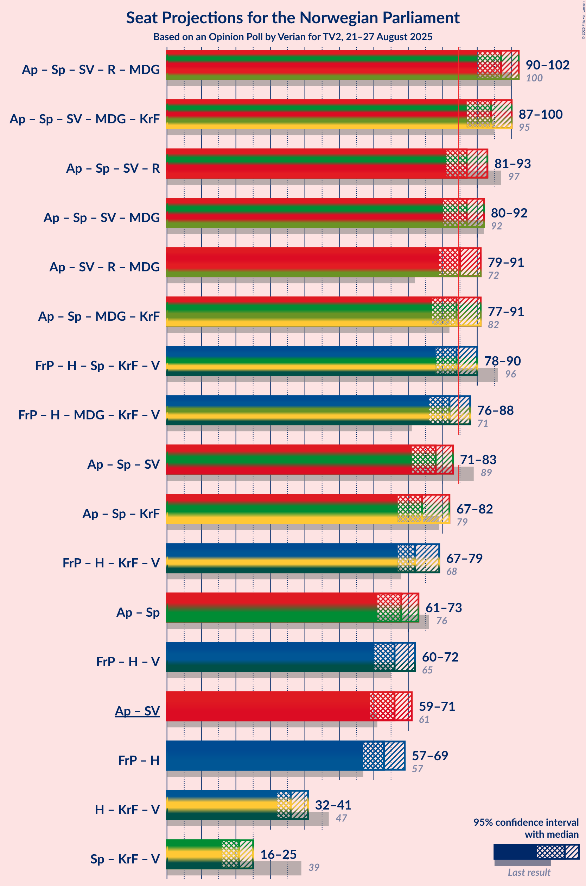
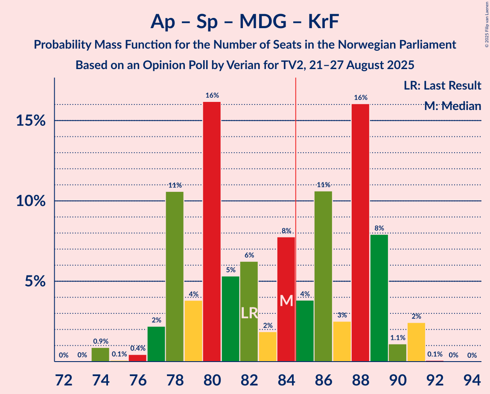
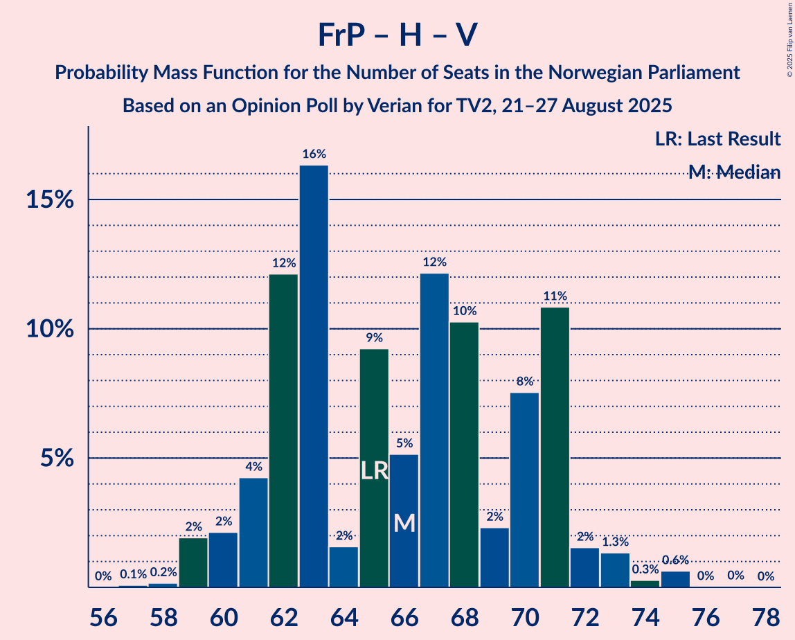

# Opinion Poll by Verian for TV2, 21–27 August 2025

<a href="#voting-intentions">Voting Intentions</a> | <a href="#seats">Seats</a> | <a href="#coalitions">Coalitions</a> | <a href="#technical-information">Technical Information</a>

## Voting Intentions

### Confidence Intervals

| Party | Last Result | Poll Result | 80% Confidence Interval | 90% Confidence Interval | 95% Confidence Interval | 99% Confidence Interval |
|:-----:|:-----------:|:-----------:|:-----------------------:|:-----------------------:|:-----------------------:|:-----------------------:|
| Arbeiderpartiet | 26.2% | 29.3% | 27.8–30.8% |27.4–31.2% |27.1–31.6% |26.4–32.3% |
| Fremskrittspartiet | 11.6% | 19.2% | 18.0–20.5% |17.6–20.9% |17.3–21.2% |16.8–21.9% |
| Høyre | 20.4% | 15.7% | 14.6–16.9% |14.3–17.3% |14.0–17.6% |13.5–18.2% |
| Senterpartiet | 13.5% | 6.4% | 5.7–7.3% |5.5–7.5% |5.3–7.7% |5.0–8.2% |
| Sosialistisk Venstreparti | 7.6% | 6.1% | 5.4–6.9% |5.2–7.2% |5.0–7.4% |4.7–7.8% |
| Rødt | 4.7% | 5.9% | 5.2–6.7% |5.0–7.0% |4.8–7.2% |4.5–7.6% |
| Miljøpartiet De Grønne | 3.9% | 5.6% | 4.9–6.4% |4.7–6.6% |4.5–6.8% |4.2–7.2% |
| Kristelig Folkeparti | 3.8% | 4.6% | 4.0–5.4% |3.8–5.6% |3.7–5.8% |3.4–6.2% |
| Venstre | 4.6% | 3.2% | 2.7–3.8% |2.5–4.0% |2.4–4.2% |2.2–4.5% |
| Konservativt | 0.4% | 0.9% | 0.6–1.3% |0.6–1.4% |0.5–1.5% |0.4–1.7% |
| Norgesdemokratene | 1.1% | 0.6% | 0.4–0.9% |0.3–1.0% |0.3–1.1% |0.2–1.3% |
| Pensjonistpartiet | 0.6% | 0.5% | 0.3–0.8% |0.3–0.9% |0.3–1.0% |0.2–1.2% |
| Industri- og Næringspartiet | 0.3% | 0.3% | 0.2–0.6% |0.2–0.7% |0.1–0.7% |0.1–0.9% |

*Note:* The poll result column reflects the actual value used in the calculations. Published results may vary slightly, and in addition be rounded to fewer digits.

## Seats

### Confidence Intervals

| Party | Last Result | Median | 80% Confidence Interval | 90% Confidence Interval | 95% Confidence Interval | 99% Confidence Interval |
|:-----:|:-----------:|:------:|:-----------------------:|:-----------------------:|:-----------------------:|:-----------------------:|
| <a href="#arbeiderpartiet">Arbeiderpartiet</a> | 48 | 57 | 50–60 |50–60 |50–62 |48–62 |
| <a href="#fremskrittspartiet">Fremskrittspartiet</a> | 21 | 36 | 34–40 |33–40 |33–41 |30–43 |
| <a href="#høyre">Høyre</a> | 36 | 27 | 24–30 |24–31 |23–31 |22–32 |
| <a href="#senterpartiet">Senterpartiet</a> | 28 | 11 | 8–13 |8–13 |8–13 |7–14 |
| <a href="#sosialistisk-venstreparti">Sosialistisk Venstreparti</a> | 13 | 10 | 9–11 |8–12 |8–12 |8–13 |
| <a href="#rødt">Rødt</a> | 8 | 9 | 8–11 |8–12 |8–12 |7–13 |
| <a href="#miljøpartiet-de-grønne">Miljøpartiet De Grønne</a> | 3 | 9 | 8–11 |8–12 |7–12 |7–12 |
| <a href="#kristelig-folkeparti">Kristelig Folkeparti</a> | 3 | 8 | 3–9 |3–9 |3–10 |2–10 |
| <a href="#venstre">Venstre</a> | 8 | 2 | 2–3 |2–3 |2–6 |1–7 |
| <a href="#konservativt">Konservativt</a> | 0 | 0 | 0 |0 |0 |0 |
| <a href="#norgesdemokratene">Norgesdemokratene</a> | 0 | 0 | 0 |0 |0 |0 |
| <a href="#pensjonistpartiet">Pensjonistpartiet</a> | 0 | 0 | 0 |0 |0 |0 |
| <a href="#industri--og-næringspartiet">Industri- og Næringspartiet</a> | 0 | 0 | 0 |0 |0 |0 |

### Arbeiderpartiet

*For a full overview of the results for this party, see the [Arbeiderpartiet](party-arbeiderpartiet.html) page.*

| Number of Seats | Probability | Accumulated | Special Marks |
|:---------------:|:-----------:|:-----------:|:-------------:|
| 47 | 0% | 100% |  |
| 48 | 0.5% | 99.9% | Last Result |
| 49 | 0.8% | 99.4% |  |
| 50 | 9% | 98.6% |  |
| 51 | 2% | 90% |  |
| 52 | 4% | 88% |  |
| 53 | 4% | 83% |  |
| 54 | 17% | 79% |  |
| 55 | 3% | 61% |  |
| 56 | 7% | 58% |  |
| 57 | 22% | 51% | Median |
| 58 | 8% | 29% |  |
| 59 | 2% | 22% |  |
| 60 | 15% | 20% |  |
| 61 | 2% | 5% |  |
| 62 | 2% | 3% |  |
| 63 | 0.3% | 0.4% |  |
| 64 | 0% | 0.1% |  |
| 65 | 0% | 0.1% |  |
| 66 | 0% | 0% |  |

### Fremskrittspartiet

*For a full overview of the results for this party, see the [Fremskrittspartiet](party-fremskrittspartiet.html) page.*

| Number of Seats | Probability | Accumulated | Special Marks |
|:---------------:|:-----------:|:-----------:|:-------------:|
| 21 | 0% | 100% | Last Result |
| 22 | 0% | 100% |  |
| 23 | 0% | 100% |  |
| 24 | 0% | 100% |  |
| 25 | 0% | 100% |  |
| 26 | 0% | 100% |  |
| 27 | 0% | 100% |  |
| 28 | 0% | 100% |  |
| 29 | 0.3% | 100% |  |
| 30 | 0.5% | 99.7% |  |
| 31 | 0.2% | 99.2% |  |
| 32 | 0.3% | 99.1% |  |
| 33 | 8% | 98.8% |  |
| 34 | 11% | 91% |  |
| 35 | 29% | 80% |  |
| 36 | 10% | 51% | Median |
| 37 | 12% | 41% |  |
| 38 | 13% | 29% |  |
| 39 | 3% | 16% |  |
| 40 | 9% | 13% |  |
| 41 | 3% | 4% |  |
| 42 | 0.4% | 1.4% |  |
| 43 | 1.0% | 1.0% |  |
| 44 | 0% | 0% |  |

### Høyre

*For a full overview of the results for this party, see the [Høyre](party-høyre.html) page.*

| Number of Seats | Probability | Accumulated | Special Marks |
|:---------------:|:-----------:|:-----------:|:-------------:|
| 20 | 0.1% | 100% |  |
| 21 | 0.2% | 99.9% |  |
| 22 | 1.1% | 99.8% |  |
| 23 | 2% | 98.6% |  |
| 24 | 7% | 97% |  |
| 25 | 12% | 90% |  |
| 26 | 18% | 78% |  |
| 27 | 13% | 59% | Median |
| 28 | 23% | 47% |  |
| 29 | 5% | 23% |  |
| 30 | 9% | 18% |  |
| 31 | 7% | 9% |  |
| 32 | 2% | 2% |  |
| 33 | 0.3% | 0.4% |  |
| 34 | 0.1% | 0.1% |  |
| 35 | 0% | 0% |  |
| 36 | 0% | 0% | Last Result |

### Senterpartiet

*For a full overview of the results for this party, see the [Senterpartiet](party-senterpartiet.html) page.*

| Number of Seats | Probability | Accumulated | Special Marks |
|:---------------:|:-----------:|:-----------:|:-------------:|
| 7 | 0.5% | 100% |  |
| 8 | 13% | 99.5% |  |
| 9 | 6% | 87% |  |
| 10 | 13% | 81% |  |
| 11 | 25% | 68% | Median |
| 12 | 27% | 43% |  |
| 13 | 15% | 16% |  |
| 14 | 1.0% | 1.5% |  |
| 15 | 0.4% | 0.5% |  |
| 16 | 0% | 0% |  |
| 17 | 0% | 0% |  |
| 18 | 0% | 0% |  |
| 19 | 0% | 0% |  |
| 20 | 0% | 0% |  |
| 21 | 0% | 0% |  |
| 22 | 0% | 0% |  |
| 23 | 0% | 0% |  |
| 24 | 0% | 0% |  |
| 25 | 0% | 0% |  |
| 26 | 0% | 0% |  |
| 27 | 0% | 0% |  |
| 28 | 0% | 0% | Last Result |

### Sosialistisk Venstreparti

*For a full overview of the results for this party, see the [Sosialistisk Venstreparti](party-sosialistiskvenstreparti.html) page.*

| Number of Seats | Probability | Accumulated | Special Marks |
|:---------------:|:-----------:|:-----------:|:-------------:|
| 3 | 0.1% | 100% |  |
| 4 | 0% | 99.9% |  |
| 5 | 0% | 99.9% |  |
| 6 | 0% | 99.9% |  |
| 7 | 0.1% | 99.9% |  |
| 8 | 9% | 99.8% |  |
| 9 | 22% | 91% |  |
| 10 | 38% | 69% | Median |
| 11 | 24% | 30% |  |
| 12 | 4% | 6% |  |
| 13 | 2% | 2% | Last Result |
| 14 | 0.3% | 0.4% |  |
| 15 | 0.1% | 0.1% |  |
| 16 | 0% | 0% |  |

### Rødt

*For a full overview of the results for this party, see the [Rødt](party-rødt.html) page.*

| Number of Seats | Probability | Accumulated | Special Marks |
|:---------------:|:-----------:|:-----------:|:-------------:|
| 7 | 0.5% | 100% |  |
| 8 | 21% | 99.4% | Last Result |
| 9 | 29% | 78% | Median |
| 10 | 28% | 49% |  |
| 11 | 16% | 22% |  |
| 12 | 4% | 6% |  |
| 13 | 1.1% | 1.4% |  |
| 14 | 0.3% | 0.3% |  |
| 15 | 0% | 0% |  |

### Miljøpartiet De Grønne

*For a full overview of the results for this party, see the [Miljøpartiet De Grønne](party-miljøpartietdegrønne.html) page.*

| Number of Seats | Probability | Accumulated | Special Marks |
|:---------------:|:-----------:|:-----------:|:-------------:|
| 3 | 0.2% | 100% | Last Result |
| 4 | 0% | 99.8% |  |
| 5 | 0% | 99.8% |  |
| 6 | 0% | 99.8% |  |
| 7 | 2% | 99.7% |  |
| 8 | 24% | 97% |  |
| 9 | 32% | 74% | Median |
| 10 | 20% | 42% |  |
| 11 | 17% | 22% |  |
| 12 | 5% | 5% |  |
| 13 | 0.1% | 0.1% |  |
| 14 | 0% | 0% |  |

### Kristelig Folkeparti

*For a full overview of the results for this party, see the [Kristelig Folkeparti](party-kristeligfolkeparti.html) page.*

| Number of Seats | Probability | Accumulated | Special Marks |
|:---------------:|:-----------:|:-----------:|:-------------:|
| 2 | 0.9% | 100% |  |
| 3 | 13% | 99.1% | Last Result |
| 4 | 0% | 86% |  |
| 5 | 0% | 86% |  |
| 6 | 1.1% | 86% |  |
| 7 | 20% | 85% |  |
| 8 | 45% | 65% | Median |
| 9 | 15% | 20% |  |
| 10 | 4% | 5% |  |
| 11 | 0.2% | 0.2% |  |
| 12 | 0.1% | 0.1% |  |
| 13 | 0% | 0% |  |

### Venstre

*For a full overview of the results for this party, see the [Venstre](party-venstre.html) page.*

| Number of Seats | Probability | Accumulated | Special Marks |
|:---------------:|:-----------:|:-----------:|:-------------:|
| 1 | 0.5% | 100% |  |
| 2 | 64% | 99.5% | Median |
| 3 | 32% | 35% |  |
| 4 | 0% | 3% |  |
| 5 | 0% | 3% |  |
| 6 | 2% | 3% |  |
| 7 | 2% | 2% |  |
| 8 | 0.1% | 0.1% | Last Result |
| 9 | 0% | 0% |  |

### Konservativt

*For a full overview of the results for this party, see the [Konservativt](party-konservativt.html) page.*

| Number of Seats | Probability | Accumulated | Special Marks |
|:---------------:|:-----------:|:-----------:|:-------------:|
| 0 | 100% | 100% | Last Result, Median |

### Norgesdemokratene

*For a full overview of the results for this party, see the [Norgesdemokratene](party-norgesdemokratene.html) page.*

| Number of Seats | Probability | Accumulated | Special Marks |
|:---------------:|:-----------:|:-----------:|:-------------:|
| 0 | 100% | 100% | Last Result, Median |

### Pensjonistpartiet

*For a full overview of the results for this party, see the [Pensjonistpartiet](party-pensjonistpartiet.html) page.*

| Number of Seats | Probability | Accumulated | Special Marks |
|:---------------:|:-----------:|:-----------:|:-------------:|
| 0 | 100% | 100% | Last Result, Median |

### Industri- og Næringspartiet

*For a full overview of the results for this party, see the [Industri- og Næringspartiet](party-industri-ognæringspartiet.html) page.*

| Number of Seats | Probability | Accumulated | Special Marks |
|:---------------:|:-----------:|:-----------:|:-------------:|
| 0 | 100% | 100% | Last Result, Median |

## Coalitions

### Confidence Intervals

| Coalition | Last Result | Median | Majority? | 80% Confidence Interval | 90% Confidence Interval | 95% Confidence Interval | 99% Confidence Interval |
|:---------:|:-----------:|:------:|:---------:|:-----------------------:|:-----------------------:|:-----------------------:|:-----------------------:|
| Arbeiderpartiet – Senterpartiet – Sosialistisk Venstreparti – Rødt – Miljøpartiet De Grønne | 100 | 97 | 100% | 90–100 | 90–101 | 90–102 | 88–103 |
| Arbeiderpartiet – Senterpartiet – Sosialistisk Venstreparti – Miljøpartiet De Grønne – Kristelig Folkeparti | 95 | 94 | 99.1% | 89–98 | 88–98 | 87–100 | 84–101 |
| Arbeiderpartiet – Senterpartiet – Sosialistisk Venstreparti – Rødt | 97 | 87 | 68% | 82–90 | 81–91 | 81–93 | 79–94 |
| Arbeiderpartiet – Senterpartiet – Sosialistisk Venstreparti – Miljøpartiet De Grønne | 92 | 87 | 66% | 81–90 | 81–91 | 80–92 | 79–93 |
| Arbeiderpartiet – Sosialistisk Venstreparti – Rødt – Miljøpartiet De Grønne | 72 | 85 | 53% | 81–88 | 79–90 | 79–91 | 78–92 |
| Arbeiderpartiet – Senterpartiet – Miljøpartiet De Grønne – Kristelig Folkeparti | 82 | 84 | 45% | 78–89 | 78–89 | 77–91 | 74–91 |
| Fremskrittspartiet – Høyre – Senterpartiet – Kristelig Folkeparti – Venstre | 96 | 84 | 47% | 81–88 | 79–90 | 78–90 | 77–91 |
| Fremskrittspartiet – Høyre – Miljøpartiet De Grønne – Kristelig Folkeparti – Venstre | 71 | 82 | 32% | 79–87 | 78–88 | 76–88 | 75–90 |
| Arbeiderpartiet – Senterpartiet – Sosialistisk Venstreparti | 89 | 78 | 2% | 72–81 | 71–81 | 71–83 | 69–85 |
| Arbeiderpartiet – Senterpartiet – Kristelig Folkeparti | 79 | 74 | 0% | 70–79 | 69–79 | 67–82 | 66–83 |
| Fremskrittspartiet – Høyre – Kristelig Folkeparti – Venstre | 68 | 72 | 0% | 69–79 | 68–79 | 67–79 | 66–81 |
| Arbeiderpartiet – Senterpartiet | 76 | 68 | 0% | 62–71 | 61–71 | 61–73 | 60–75 |
| Fremskrittspartiet – Høyre – Venstre | 65 | 66 | 0% | 62–71 | 61–71 | 60–72 | 59–75 |
| Arbeiderpartiet – Sosialistisk Venstreparti | 61 | 66 | 0% | 61–70 | 59–71 | 59–71 | 58–72 |
| Fremskrittspartiet – Høyre | 57 | 63 | 0% | 59–68 | 58–68 | 57–69 | 57–72 |
| Høyre – Kristelig Folkeparti – Venstre | 47 | 36 | 0% | 34–40 | 33–41 | 32–41 | 31–43 |
| Senterpartiet – Kristelig Folkeparti – Venstre | 39 | 21 | 0% | 18–23 | 16–24 | 16–25 | 15–26 |

### Arbeiderpartiet – Senterpartiet – Sosialistisk Venstreparti – Rødt – Miljøpartiet De Grønne

| Number of Seats | Probability | Accumulated | Special Marks |
|:---------------:|:-----------:|:-----------:|:-------------:|
| 85 | 0% | 100% | Majority |
| 86 | 0% | 99.9% |  |
| 87 | 0.1% | 99.9% |  |
| 88 | 0.7% | 99.8% |  |
| 89 | 0.7% | 99.1% |  |
| 90 | 10% | 98% |  |
| 91 | 10% | 88% |  |
| 92 | 2% | 78% |  |
| 93 | 9% | 76% |  |
| 94 | 3% | 67% |  |
| 95 | 5% | 64% |  |
| 96 | 4% | 59% | Median |
| 97 | 9% | 55% |  |
| 98 | 27% | 46% |  |
| 99 | 5% | 19% |  |
| 100 | 7% | 14% | Last Result |
| 101 | 3% | 7% |  |
| 102 | 2% | 4% |  |
| 103 | 2% | 2% |  |
| 104 | 0.2% | 0.3% |  |
| 105 | 0.1% | 0.1% |  |
| 106 | 0% | 0% |  |

### Arbeiderpartiet – Senterpartiet – Sosialistisk Venstreparti – Miljøpartiet De Grønne – Kristelig Folkeparti

| Number of Seats | Probability | Accumulated | Special Marks |
|:---------------:|:-----------:|:-----------:|:-------------:|
| 84 | 0.9% | 100% |  |
| 85 | 0.1% | 99.1% | Majority |
| 86 | 0.4% | 99.0% |  |
| 87 | 1.1% | 98.6% |  |
| 88 | 3% | 97% |  |
| 89 | 17% | 95% |  |
| 90 | 9% | 78% |  |
| 91 | 5% | 69% |  |
| 92 | 9% | 64% |  |
| 93 | 4% | 55% |  |
| 94 | 12% | 51% |  |
| 95 | 5% | 39% | Last Result, Median |
| 96 | 0.6% | 34% |  |
| 97 | 5% | 34% |  |
| 98 | 25% | 29% |  |
| 99 | 1.0% | 4% |  |
| 100 | 1.2% | 3% |  |
| 101 | 2% | 2% |  |
| 102 | 0.1% | 0.1% |  |
| 103 | 0% | 0% |  |

### Arbeiderpartiet – Senterpartiet – Sosialistisk Venstreparti – Rødt

| Number of Seats | Probability | Accumulated | Special Marks |
|:---------------:|:-----------:|:-----------:|:-------------:|
| 77 | 0.1% | 100% |  |
| 78 | 0.1% | 99.9% |  |
| 79 | 0.5% | 99.8% |  |
| 80 | 1.2% | 99.3% |  |
| 81 | 7% | 98% |  |
| 82 | 12% | 91% |  |
| 83 | 4% | 79% |  |
| 84 | 6% | 75% |  |
| 85 | 8% | 68% | Majority |
| 86 | 3% | 61% |  |
| 87 | 12% | 58% | Median |
| 88 | 14% | 46% |  |
| 89 | 21% | 32% |  |
| 90 | 3% | 12% |  |
| 91 | 5% | 9% |  |
| 92 | 2% | 4% |  |
| 93 | 0.4% | 3% |  |
| 94 | 2% | 2% |  |
| 95 | 0.3% | 0.4% |  |
| 96 | 0% | 0% |  |
| 97 | 0% | 0% | Last Result |

### Arbeiderpartiet – Senterpartiet – Sosialistisk Venstreparti – Miljøpartiet De Grønne

| Number of Seats | Probability | Accumulated | Special Marks |
|:---------------:|:-----------:|:-----------:|:-------------:|
| 76 | 0.1% | 100% |  |
| 77 | 0.3% | 99.9% |  |
| 78 | 0.2% | 99.7% |  |
| 79 | 2% | 99.5% |  |
| 80 | 2% | 98% |  |
| 81 | 15% | 96% |  |
| 82 | 8% | 80% |  |
| 83 | 4% | 73% |  |
| 84 | 4% | 69% |  |
| 85 | 5% | 66% | Majority |
| 86 | 4% | 60% |  |
| 87 | 11% | 57% | Median |
| 88 | 7% | 45% |  |
| 89 | 15% | 39% |  |
| 90 | 15% | 24% |  |
| 91 | 4% | 8% |  |
| 92 | 3% | 5% | Last Result |
| 93 | 2% | 2% |  |
| 94 | 0.2% | 0.3% |  |
| 95 | 0% | 0% |  |

### Arbeiderpartiet – Sosialistisk Venstreparti – Rødt – Miljøpartiet De Grønne

| Number of Seats | Probability | Accumulated | Special Marks |
|:---------------:|:-----------:|:-----------:|:-------------:|
| 72 | 0% | 100% | Last Result |
| 73 | 0% | 100% |  |
| 74 | 0% | 100% |  |
| 75 | 0% | 100% |  |
| 76 | 0% | 99.9% |  |
| 77 | 0.3% | 99.9% |  |
| 78 | 0.8% | 99.7% |  |
| 79 | 8% | 98.9% |  |
| 80 | 0.8% | 91% |  |
| 81 | 5% | 90% |  |
| 82 | 11% | 86% |  |
| 83 | 8% | 75% |  |
| 84 | 13% | 66% |  |
| 85 | 6% | 53% | Median, Majority |
| 86 | 10% | 47% |  |
| 87 | 21% | 37% |  |
| 88 | 6% | 16% |  |
| 89 | 4% | 10% |  |
| 90 | 2% | 6% |  |
| 91 | 2% | 3% |  |
| 92 | 0.9% | 1.0% |  |
| 93 | 0.1% | 0.1% |  |
| 94 | 0% | 0% |  |

### Arbeiderpartiet – Senterpartiet – Miljøpartiet De Grønne – Kristelig Folkeparti

| Number of Seats | Probability | Accumulated | Special Marks |
|:---------------:|:-----------:|:-----------:|:-------------:|
| 74 | 0.9% | 100% |  |
| 75 | 0.1% | 99.1% |  |
| 76 | 0.4% | 99.0% |  |
| 77 | 2% | 98.5% |  |
| 78 | 11% | 96% |  |
| 79 | 4% | 86% |  |
| 80 | 16% | 82% |  |
| 81 | 5% | 66% |  |
| 82 | 6% | 60% | Last Result |
| 83 | 2% | 54% |  |
| 84 | 8% | 52% |  |
| 85 | 4% | 45% | Median, Majority |
| 86 | 11% | 41% |  |
| 87 | 3% | 30% |  |
| 88 | 16% | 28% |  |
| 89 | 8% | 12% |  |
| 90 | 1.1% | 4% |  |
| 91 | 2% | 3% |  |
| 92 | 0.1% | 0.1% |  |
| 93 | 0% | 0% |  |

### Fremskrittspartiet – Høyre – Senterpartiet – Kristelig Folkeparti – Venstre

| Number of Seats | Probability | Accumulated | Special Marks |
|:---------------:|:-----------:|:-----------:|:-------------:|
| 76 | 0.1% | 100% |  |
| 77 | 0.9% | 99.9% |  |
| 78 | 2% | 99.0% |  |
| 79 | 2% | 97% |  |
| 80 | 4% | 94% |  |
| 81 | 6% | 90% |  |
| 82 | 21% | 84% |  |
| 83 | 10% | 63% |  |
| 84 | 6% | 53% | Median |
| 85 | 13% | 47% | Majority |
| 86 | 8% | 34% |  |
| 87 | 11% | 25% |  |
| 88 | 5% | 14% |  |
| 89 | 0.8% | 10% |  |
| 90 | 8% | 9% |  |
| 91 | 0.8% | 1.1% |  |
| 92 | 0.3% | 0.3% |  |
| 93 | 0% | 0.1% |  |
| 94 | 0% | 0.1% |  |
| 95 | 0% | 0% |  |
| 96 | 0% | 0% | Last Result |

### Fremskrittspartiet – Høyre – Miljøpartiet De Grønne – Kristelig Folkeparti – Venstre

| Number of Seats | Probability | Accumulated | Special Marks |
|:---------------:|:-----------:|:-----------:|:-------------:|
| 71 | 0% | 100% | Last Result |
| 72 | 0% | 100% |  |
| 73 | 0% | 100% |  |
| 74 | 0.3% | 100% |  |
| 75 | 2% | 99.6% |  |
| 76 | 0.4% | 98% |  |
| 77 | 2% | 97% |  |
| 78 | 5% | 96% |  |
| 79 | 3% | 91% |  |
| 80 | 21% | 88% |  |
| 81 | 14% | 68% |  |
| 82 | 12% | 54% | Median |
| 83 | 3% | 42% |  |
| 84 | 8% | 39% |  |
| 85 | 6% | 32% | Majority |
| 86 | 4% | 25% |  |
| 87 | 12% | 21% |  |
| 88 | 7% | 9% |  |
| 89 | 1.2% | 2% |  |
| 90 | 0.5% | 0.7% |  |
| 91 | 0.1% | 0.2% |  |
| 92 | 0.1% | 0.1% |  |
| 93 | 0% | 0% |  |

### Arbeiderpartiet – Senterpartiet – Sosialistisk Venstreparti

| Number of Seats | Probability | Accumulated | Special Marks |
|:---------------:|:-----------:|:-----------:|:-------------:|
| 68 | 0.3% | 100% |  |
| 69 | 0.2% | 99.7% |  |
| 70 | 1.4% | 99.5% |  |
| 71 | 7% | 98% |  |
| 72 | 4% | 91% |  |
| 73 | 11% | 87% |  |
| 74 | 10% | 77% |  |
| 75 | 5% | 67% |  |
| 76 | 3% | 62% |  |
| 77 | 7% | 59% |  |
| 78 | 18% | 52% | Median |
| 79 | 11% | 34% |  |
| 80 | 4% | 24% |  |
| 81 | 15% | 19% |  |
| 82 | 1.0% | 4% |  |
| 83 | 1.3% | 3% |  |
| 84 | 0.2% | 2% |  |
| 85 | 2% | 2% | Majority |
| 86 | 0% | 0% |  |
| 87 | 0% | 0% |  |
| 88 | 0% | 0% |  |
| 89 | 0% | 0% | Last Result |

### Arbeiderpartiet – Senterpartiet – Kristelig Folkeparti

| Number of Seats | Probability | Accumulated | Special Marks |
|:---------------:|:-----------:|:-----------:|:-------------:|
| 64 | 0% | 100% |  |
| 65 | 0.3% | 99.9% |  |
| 66 | 0.8% | 99.7% |  |
| 67 | 2% | 98.9% |  |
| 68 | 2% | 97% |  |
| 69 | 2% | 96% |  |
| 70 | 20% | 93% |  |
| 71 | 6% | 74% |  |
| 72 | 11% | 68% |  |
| 73 | 5% | 56% |  |
| 74 | 4% | 51% |  |
| 75 | 5% | 47% |  |
| 76 | 7% | 43% | Median |
| 77 | 8% | 35% |  |
| 78 | 9% | 27% |  |
| 79 | 15% | 18% | Last Result |
| 80 | 0.5% | 4% |  |
| 81 | 0.3% | 3% |  |
| 82 | 0.9% | 3% |  |
| 83 | 2% | 2% |  |
| 84 | 0% | 0% |  |

### Fremskrittspartiet – Høyre – Kristelig Folkeparti – Venstre

| Number of Seats | Probability | Accumulated | Special Marks |
|:---------------:|:-----------:|:-----------:|:-------------:|
| 64 | 0.1% | 100% |  |
| 65 | 0.2% | 99.9% |  |
| 66 | 2% | 99.7% |  |
| 67 | 2% | 98% |  |
| 68 | 3% | 96% | Last Result |
| 69 | 7% | 93% |  |
| 70 | 5% | 86% |  |
| 71 | 27% | 81% |  |
| 72 | 9% | 54% |  |
| 73 | 4% | 45% | Median |
| 74 | 5% | 41% |  |
| 75 | 3% | 36% |  |
| 76 | 9% | 33% |  |
| 77 | 2% | 24% |  |
| 78 | 10% | 22% |  |
| 79 | 10% | 12% |  |
| 80 | 0.7% | 2% |  |
| 81 | 0.7% | 0.9% |  |
| 82 | 0.1% | 0.2% |  |
| 83 | 0% | 0.1% |  |
| 84 | 0% | 0.1% |  |
| 85 | 0% | 0% | Majority |

### Arbeiderpartiet – Senterpartiet

| Number of Seats | Probability | Accumulated | Special Marks |
|:---------------:|:-----------:|:-----------:|:-------------:|
| 58 | 0.3% | 100% |  |
| 59 | 0.2% | 99.7% |  |
| 60 | 1.0% | 99.5% |  |
| 61 | 4% | 98.5% |  |
| 62 | 15% | 95% |  |
| 63 | 6% | 80% |  |
| 64 | 8% | 74% |  |
| 65 | 5% | 66% |  |
| 66 | 4% | 62% |  |
| 67 | 6% | 58% |  |
| 68 | 11% | 52% | Median |
| 69 | 14% | 42% |  |
| 70 | 10% | 28% |  |
| 71 | 15% | 18% |  |
| 72 | 0.9% | 4% |  |
| 73 | 0.5% | 3% |  |
| 74 | 0.6% | 2% |  |
| 75 | 2% | 2% |  |
| 76 | 0% | 0% | Last Result |

### Fremskrittspartiet – Høyre – Venstre

| Number of Seats | Probability | Accumulated | Special Marks |
|:---------------:|:-----------:|:-----------:|:-------------:|
| 57 | 0.1% | 100% |  |
| 58 | 0.2% | 99.9% |  |
| 59 | 2% | 99.7% |  |
| 60 | 2% | 98% |  |
| 61 | 4% | 96% |  |
| 62 | 12% | 91% |  |
| 63 | 16% | 79% |  |
| 64 | 2% | 63% |  |
| 65 | 9% | 61% | Last Result, Median |
| 66 | 5% | 52% |  |
| 67 | 12% | 47% |  |
| 68 | 10% | 35% |  |
| 69 | 2% | 25% |  |
| 70 | 8% | 22% |  |
| 71 | 11% | 15% |  |
| 72 | 2% | 4% |  |
| 73 | 1.3% | 2% |  |
| 74 | 0.3% | 1.0% |  |
| 75 | 0.6% | 0.7% |  |
| 76 | 0% | 0.1% |  |
| 77 | 0% | 0% |  |

### Arbeiderpartiet – Sosialistisk Venstreparti

| Number of Seats | Probability | Accumulated | Special Marks |
|:---------------:|:-----------:|:-----------:|:-------------:|
| 57 | 0.1% | 100% |  |
| 58 | 0.4% | 99.9% |  |
| 59 | 6% | 99.5% |  |
| 60 | 2% | 93% |  |
| 61 | 3% | 92% | Last Result |
| 62 | 2% | 89% |  |
| 63 | 7% | 87% |  |
| 64 | 7% | 80% |  |
| 65 | 22% | 73% |  |
| 66 | 12% | 50% |  |
| 67 | 7% | 38% | Median |
| 68 | 6% | 31% |  |
| 69 | 5% | 25% |  |
| 70 | 15% | 20% |  |
| 71 | 3% | 5% |  |
| 72 | 2% | 2% |  |
| 73 | 0.2% | 0.4% |  |
| 74 | 0.2% | 0.2% |  |
| 75 | 0% | 0% |  |

### Fremskrittspartiet – Høyre

| Number of Seats | Probability | Accumulated | Special Marks |
|:---------------:|:-----------:|:-----------:|:-------------:|
| 54 | 0.1% | 100% |  |
| 55 | 0.1% | 99.9% |  |
| 56 | 0.2% | 99.8% |  |
| 57 | 3% | 99.6% | Last Result |
| 58 | 2% | 97% |  |
| 59 | 7% | 95% |  |
| 60 | 10% | 88% |  |
| 61 | 16% | 78% |  |
| 62 | 3% | 62% |  |
| 63 | 10% | 59% | Median |
| 64 | 7% | 49% |  |
| 65 | 15% | 42% |  |
| 66 | 5% | 27% |  |
| 67 | 3% | 22% |  |
| 68 | 15% | 19% |  |
| 69 | 2% | 4% |  |
| 70 | 1.1% | 2% |  |
| 71 | 0.3% | 1.0% |  |
| 72 | 0.6% | 0.7% |  |
| 73 | 0% | 0.1% |  |
| 74 | 0% | 0% |  |

### Høyre – Kristelig Folkeparti – Venstre

| Number of Seats | Probability | Accumulated | Special Marks |
|:---------------:|:-----------:|:-----------:|:-------------:|
| 29 | 0.1% | 100% |  |
| 30 | 0.1% | 99.8% |  |
| 31 | 2% | 99.8% |  |
| 32 | 2% | 98% |  |
| 33 | 3% | 95% |  |
| 34 | 6% | 92% |  |
| 35 | 5% | 87% |  |
| 36 | 35% | 82% |  |
| 37 | 10% | 47% | Median |
| 38 | 3% | 37% |  |
| 39 | 16% | 35% |  |
| 40 | 12% | 18% |  |
| 41 | 4% | 6% |  |
| 42 | 0.8% | 2% |  |
| 43 | 1.1% | 1.4% |  |
| 44 | 0.2% | 0.3% |  |
| 45 | 0.1% | 0.1% |  |
| 46 | 0% | 0% |  |
| 47 | 0% | 0% | Last Result |

### Senterpartiet – Kristelig Folkeparti – Venstre

| Number of Seats | Probability | Accumulated | Special Marks |
|:---------------:|:-----------:|:-----------:|:-------------:|
| 14 | 0.2% | 100% |  |
| 15 | 2% | 99.8% |  |
| 16 | 4% | 98% |  |
| 17 | 4% | 94% |  |
| 18 | 6% | 91% |  |
| 19 | 13% | 85% |  |
| 20 | 8% | 72% |  |
| 21 | 25% | 65% | Median |
| 22 | 19% | 39% |  |
| 23 | 14% | 20% |  |
| 24 | 3% | 7% |  |
| 25 | 2% | 3% |  |
| 26 | 0.5% | 0.9% |  |
| 27 | 0.3% | 0.4% |  |
| 28 | 0.1% | 0.1% |  |
| 29 | 0% | 0% |  |
| 30 | 0% | 0% |  |
| 31 | 0% | 0% |  |
| 32 | 0% | 0% |  |
| 33 | 0% | 0% |  |
| 34 | 0% | 0% |  |
| 35 | 0% | 0% |  |
| 36 | 0% | 0% |  |
| 37 | 0% | 0% |  |
| 38 | 0% | 0% |  |
| 39 | 0% | 0% | Last Result |

## Technical Information

### Opinion Poll

+ **Polling firm:** Verian
+ **Commissioner(s):** TV2
+ **Fieldwork period:** 21–27 August 2025

### Calculations

+ **Sample size:** 1579
+ **Simulations done:** 2,097,152
+ **Error estimate:** 0.99%

