# Opinion Poll by Verian for TV2, 25–29 August 2025

<a href="#voting-intentions">Voting Intentions</a> | <a href="#seats">Seats</a> | <a href="#coalitions">Coalitions</a> | <a href="#technical-information">Technical Information</a>

## Voting Intentions

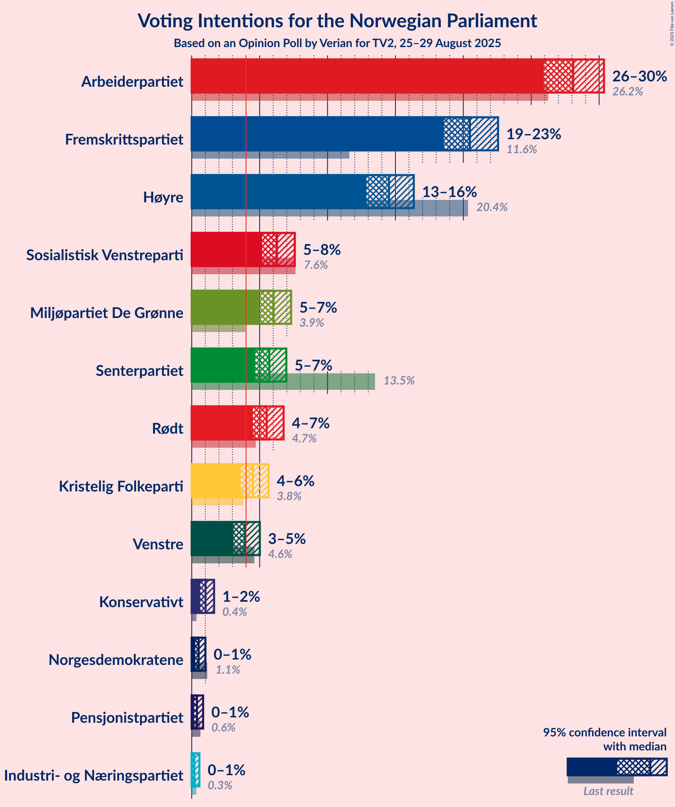

### Confidence Intervals

| Party | Last Result | Poll Result | 80% Confidence Interval | 90% Confidence Interval | 95% Confidence Interval | 99% Confidence Interval |
|:-----:|:-----------:|:-----------:|:-----------------------:|:-----------------------:|:-----------------------:|:-----------------------:|
| Arbeiderpartiet | 26.2% | 28.1% | 26.7–29.6% |26.3–30.0% |25.9–30.4% |25.3–31.1% |
| Fremskrittspartiet | 11.6% | 20.5% | 19.2–21.8% |18.9–22.2% |18.6–22.6% |18.0–23.2% |
| Høyre | 20.4% | 14.5% | 13.4–15.7% |13.1–16.1% |12.9–16.4% |12.4–16.9% |
| Sosialistisk Venstreparti | 7.6% | 6.3% | 5.5–7.1% |5.3–7.4% |5.2–7.6% |4.8–8.0% |
| Miljøpartiet De Grønne | 3.9% | 6.0% | 5.3–6.9% |5.1–7.1% |5.0–7.3% |4.6–7.7% |
| Senterpartiet | 13.5% | 5.7% | 5.0–6.5% |4.8–6.8% |4.7–7.0% |4.4–7.4% |
| Rødt | 4.7% | 5.5% | 4.8–6.3% |4.6–6.6% |4.5–6.8% |4.2–7.2% |
| Kristelig Folkeparti | 3.8% | 4.5% | 3.9–5.3% |3.7–5.5% |3.6–5.7% |3.3–6.0% |
| Venstre | 4.6% | 3.9% | 3.4–4.6% |3.2–4.8% |3.1–5.0% |2.8–5.4% |
| Konservativt | 0.4% | 1.0% | 0.7–1.4% |0.7–1.5% |0.6–1.6% |0.5–1.9% |
| Norgesdemokratene | 1.1% | 0.5% | 0.3–0.8% |0.3–0.9% |0.3–1.0% |0.2–1.2% |
| Pensjonistpartiet | 0.6% | 0.4% | 0.2–0.7% |0.2–0.8% |0.2–0.8% |0.1–1.0% |
| Industri- og Næringspartiet | 0.3% | 0.2% | 0.1–0.4% |0.1–0.5% |0.1–0.6% |0.0–0.7% |

*Note:* The poll result column reflects the actual value used in the calculations. Published results may vary slightly, and in addition be rounded to fewer digits.

## Seats

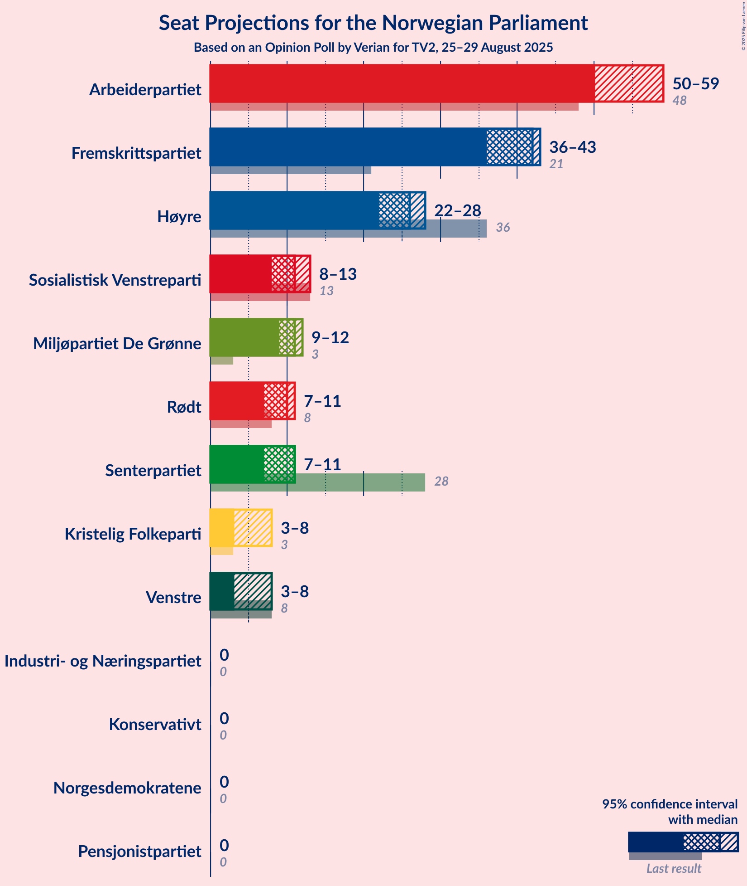

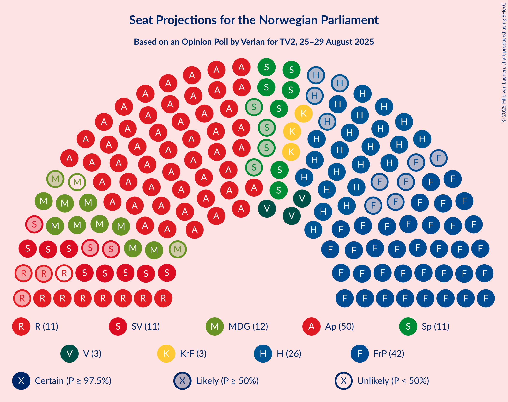

### Confidence Intervals

| Party | Last Result | Median | 80% Confidence Interval | 90% Confidence Interval | 95% Confidence Interval | 99% Confidence Interval |
|:-----:|:-----------:|:------:|:-----------------------:|:-----------------------:|:-----------------------:|:-----------------------:|
| <a href="#arbeiderpartiet">Arbeiderpartiet</a> | 48 | 50 | 50–58 |50–58 |50–59 |50–61 |
| <a href="#fremskrittspartiet">Fremskrittspartiet</a> | 21 | 42 | 37–43 |37–43 |36–43 |35–44 |
| <a href="#høyre">Høyre</a> | 36 | 26 | 23–27 |23–28 |22–28 |20–29 |
| <a href="#sosialistisk-venstreparti">Sosialistisk Venstreparti</a> | 13 | 11 | 9–11 |8–11 |8–13 |8–13 |
| <a href="#miljøpartiet-de-grønne">Miljøpartiet De Grønne</a> | 3 | 11 | 9–12 |9–12 |9–12 |8–13 |
| <a href="#senterpartiet">Senterpartiet</a> | 28 | 11 | 8–11 |8–11 |7–11 |6–13 |
| <a href="#rødt">Rødt</a> | 8 | 10 | 7–11 |7–11 |7–11 |7–11 |
| <a href="#kristelig-folkeparti">Kristelig Folkeparti</a> | 3 | 3 | 3–8 |3–8 |3–8 |3–9 |
| <a href="#venstre">Venstre</a> | 8 | 3 | 3–7 |3–7 |3–8 |2–8 |
| <a href="#konservativt">Konservativt</a> | 0 | 0 | 0 |0 |0 |0 |
| <a href="#norgesdemokratene">Norgesdemokratene</a> | 0 | 0 | 0 |0 |0 |0 |
| <a href="#pensjonistpartiet">Pensjonistpartiet</a> | 0 | 0 | 0 |0 |0 |0 |
| <a href="#industri--og-næringspartiet">Industri- og Næringspartiet</a> | 0 | 0 | 0 |0 |0 |0 |

### Arbeiderpartiet

*For a full overview of the results for this party, see the [Arbeiderpartiet](party-arbeiderpartiet.html) page.*

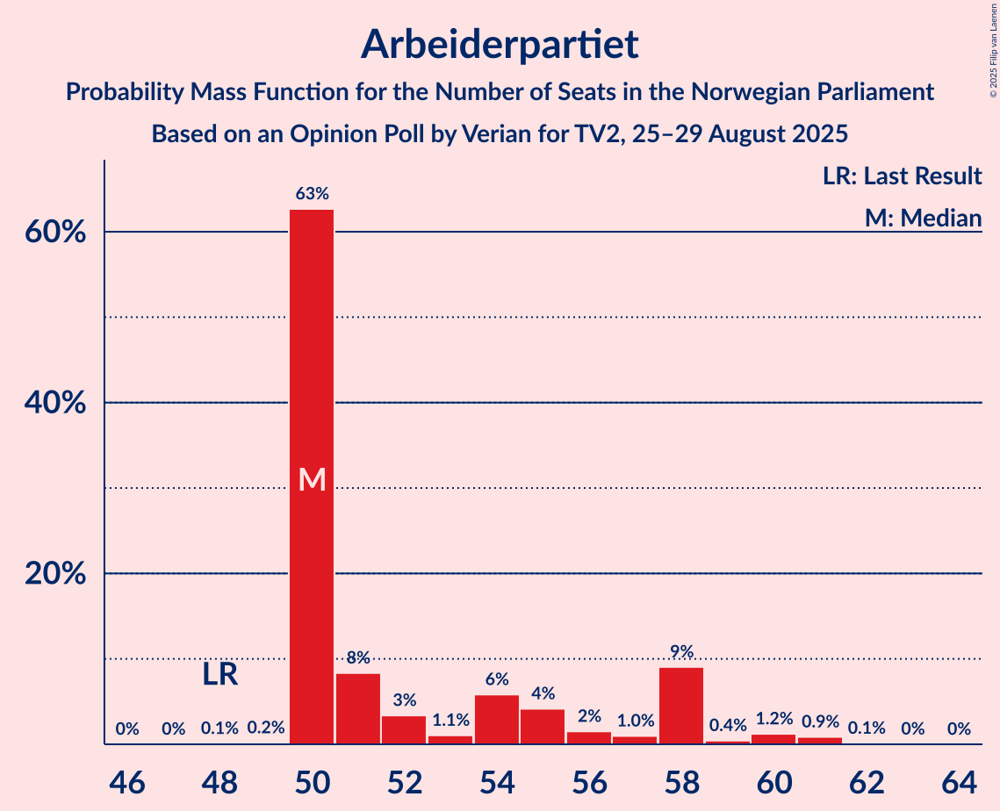

| Number of Seats | Probability | Accumulated | Special Marks |
|:---------------:|:-----------:|:-----------:|:-------------:|
| 48 | 0.1% | 100% | Last Result |
| 49 | 0.2% | 99.9% |  |
| 50 | 63% | 99.7% | Median |
| 51 | 8% | 37% |  |
| 52 | 3% | 29% |  |
| 53 | 1.1% | 25% |  |
| 54 | 6% | 24% |  |
| 55 | 4% | 18% |  |
| 56 | 2% | 14% |  |
| 57 | 1.0% | 13% |  |
| 58 | 9% | 12% |  |
| 59 | 0.4% | 3% |  |
| 60 | 1.2% | 2% |  |
| 61 | 0.9% | 1.0% |  |
| 62 | 0.1% | 0.2% |  |
| 63 | 0% | 0.1% |  |
| 64 | 0% | 0% |  |

### Fremskrittspartiet

*For a full overview of the results for this party, see the [Fremskrittspartiet](party-fremskrittspartiet.html) page.*

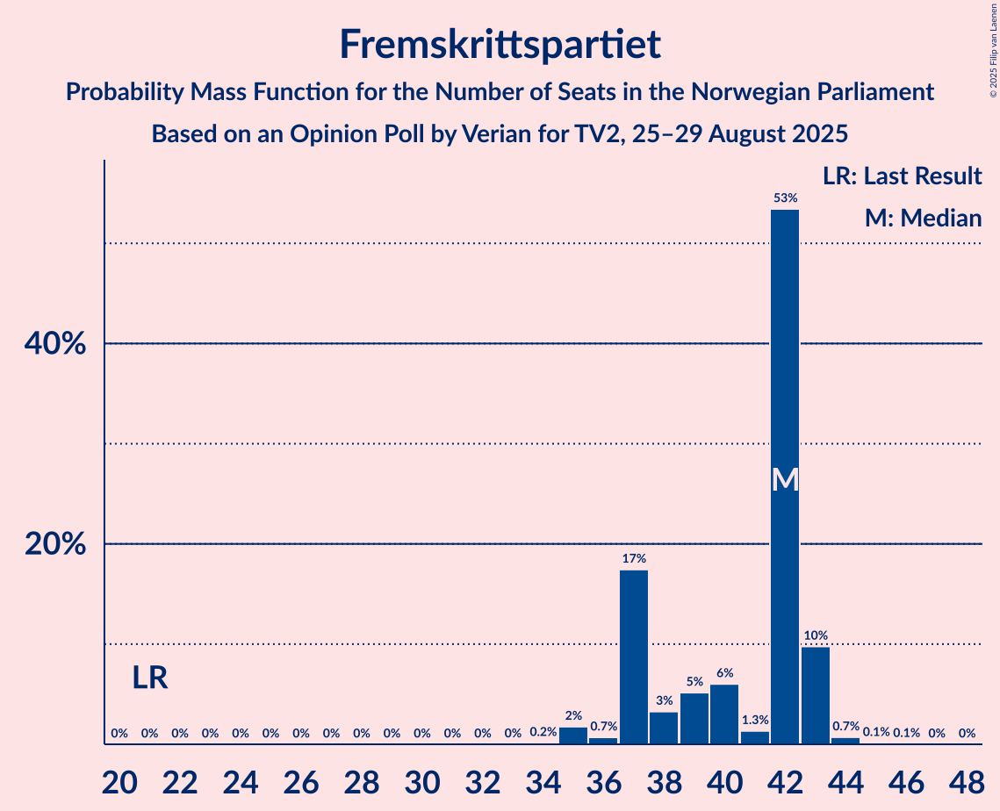

| Number of Seats | Probability | Accumulated | Special Marks |
|:---------------:|:-----------:|:-----------:|:-------------:|
| 21 | 0% | 100% | Last Result |
| 22 | 0% | 100% |  |
| 23 | 0% | 100% |  |
| 24 | 0% | 100% |  |
| 25 | 0% | 100% |  |
| 26 | 0% | 100% |  |
| 27 | 0% | 100% |  |
| 28 | 0% | 100% |  |
| 29 | 0% | 100% |  |
| 30 | 0% | 100% |  |
| 31 | 0% | 100% |  |
| 32 | 0% | 100% |  |
| 33 | 0% | 100% |  |
| 34 | 0.2% | 100% |  |
| 35 | 2% | 99.8% |  |
| 36 | 0.7% | 98% |  |
| 37 | 17% | 97% |  |
| 38 | 3% | 80% |  |
| 39 | 5% | 77% |  |
| 40 | 6% | 71% |  |
| 41 | 1.3% | 65% |  |
| 42 | 53% | 64% | Median |
| 43 | 10% | 11% |  |
| 44 | 0.7% | 0.9% |  |
| 45 | 0.1% | 0.2% |  |
| 46 | 0.1% | 0.1% |  |
| 47 | 0% | 0% |  |

### Høyre

*For a full overview of the results for this party, see the [Høyre](party-høyre.html) page.*

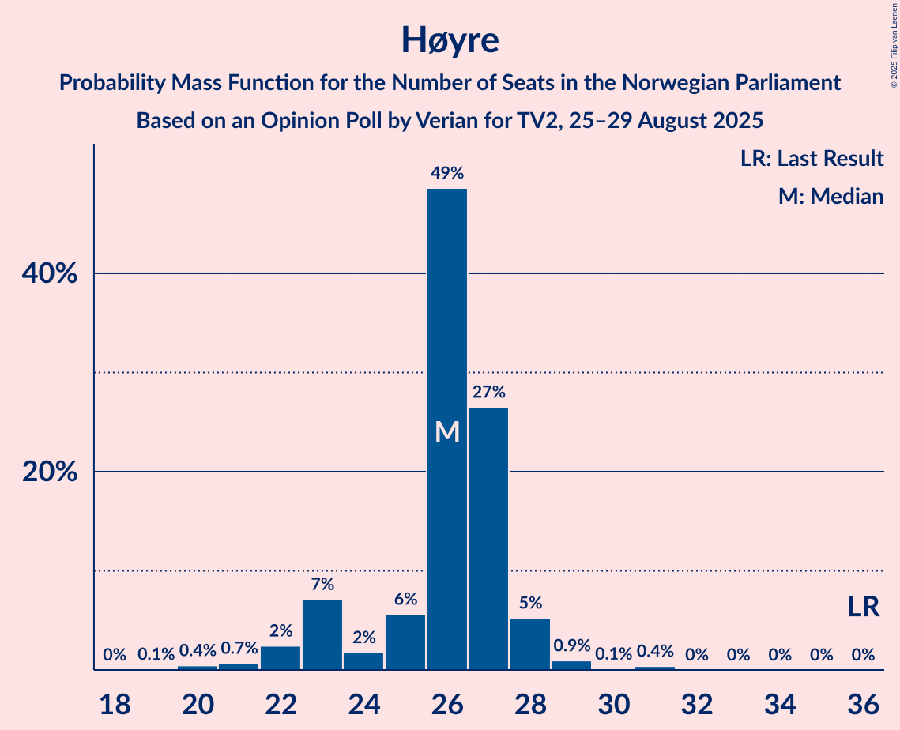

| Number of Seats | Probability | Accumulated | Special Marks |
|:---------------:|:-----------:|:-----------:|:-------------:|
| 19 | 0.1% | 100% |  |
| 20 | 0.4% | 99.9% |  |
| 21 | 0.7% | 99.4% |  |
| 22 | 2% | 98.8% |  |
| 23 | 7% | 96% |  |
| 24 | 2% | 89% |  |
| 25 | 6% | 87% |  |
| 26 | 49% | 82% | Median |
| 27 | 27% | 33% |  |
| 28 | 5% | 7% |  |
| 29 | 0.9% | 1.4% |  |
| 30 | 0.1% | 0.5% |  |
| 31 | 0.4% | 0.4% |  |
| 32 | 0% | 0% |  |
| 33 | 0% | 0% |  |
| 34 | 0% | 0% |  |
| 35 | 0% | 0% |  |
| 36 | 0% | 0% | Last Result |

### Sosialistisk Venstreparti

*For a full overview of the results for this party, see the [Sosialistisk Venstreparti](party-sosialistiskvenstreparti.html) page.*

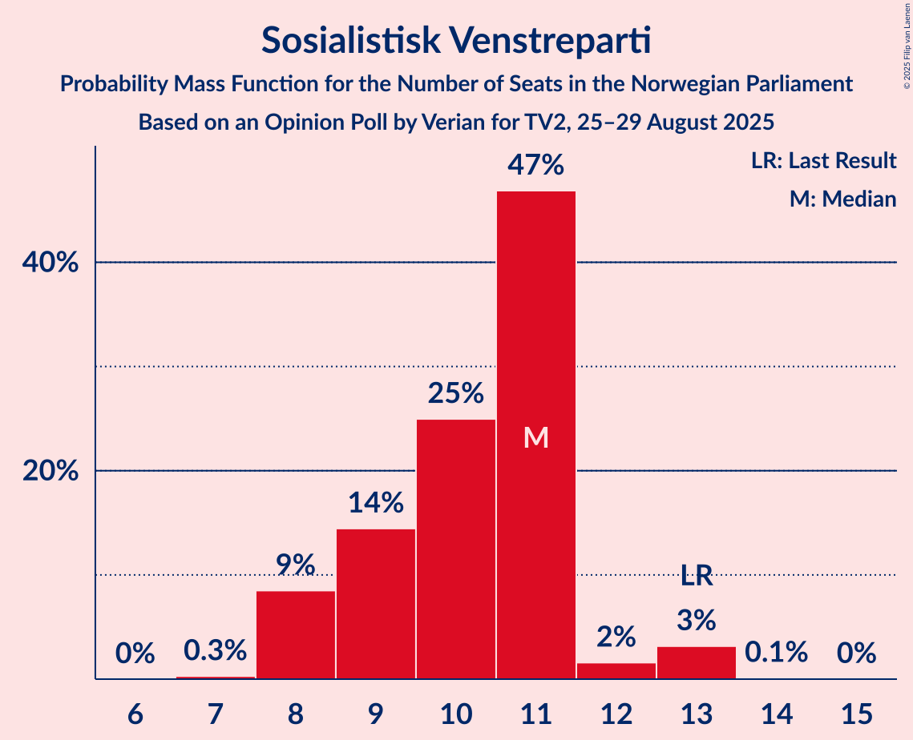

| Number of Seats | Probability | Accumulated | Special Marks |
|:---------------:|:-----------:|:-----------:|:-------------:|
| 7 | 0.3% | 100% |  |
| 8 | 9% | 99.7% |  |
| 9 | 14% | 91% |  |
| 10 | 25% | 77% |  |
| 11 | 47% | 52% | Median |
| 12 | 2% | 5% |  |
| 13 | 3% | 3% | Last Result |
| 14 | 0.1% | 0.1% |  |
| 15 | 0% | 0% |  |

### Miljøpartiet De Grønne

*For a full overview of the results for this party, see the [Miljøpartiet De Grønne](party-miljøpartietdegrønne.html) page.*

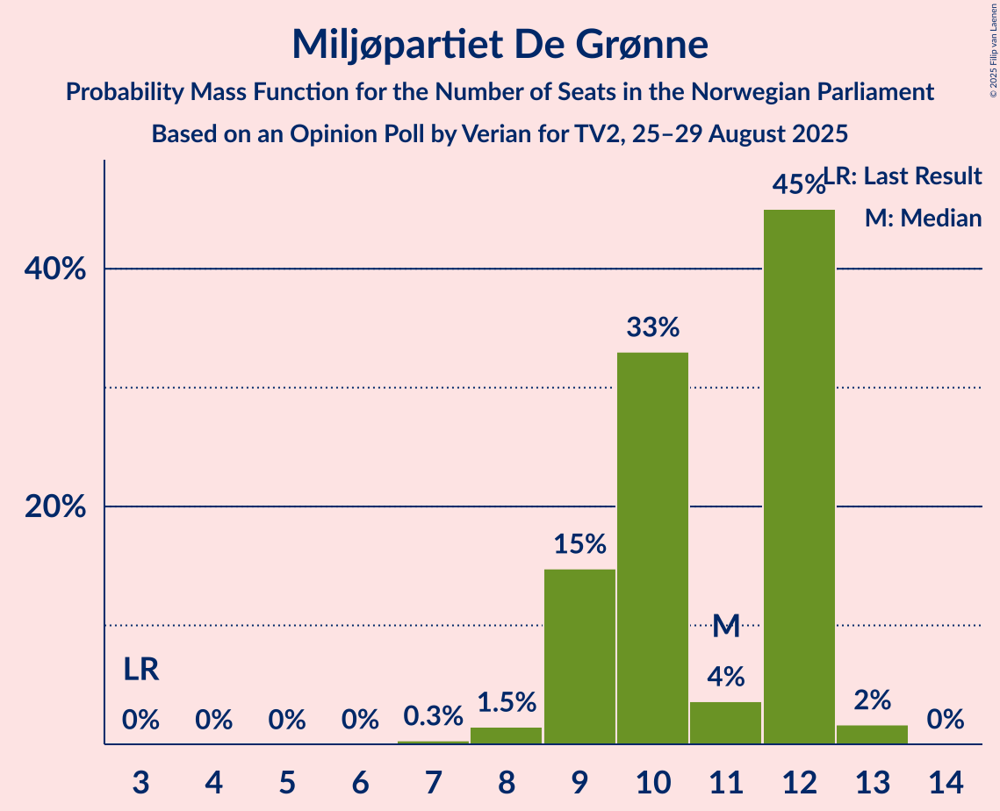

| Number of Seats | Probability | Accumulated | Special Marks |
|:---------------:|:-----------:|:-----------:|:-------------:|
| 3 | 0% | 100% | Last Result |
| 4 | 0% | 100% |  |
| 5 | 0% | 100% |  |
| 6 | 0% | 100% |  |
| 7 | 0.3% | 100% |  |
| 8 | 1.5% | 99.6% |  |
| 9 | 15% | 98% |  |
| 10 | 33% | 83% |  |
| 11 | 4% | 50% | Median |
| 12 | 45% | 47% |  |
| 13 | 2% | 2% |  |
| 14 | 0% | 0% |  |

### Senterpartiet

*For a full overview of the results for this party, see the [Senterpartiet](party-senterpartiet.html) page.*

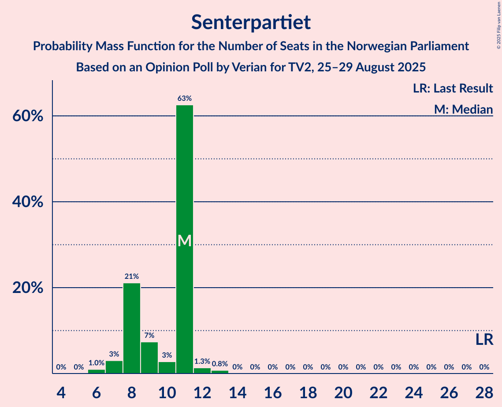

| Number of Seats | Probability | Accumulated | Special Marks |
|:---------------:|:-----------:|:-----------:|:-------------:|
| 6 | 1.0% | 100% |  |
| 7 | 3% | 99.0% |  |
| 8 | 21% | 96% |  |
| 9 | 7% | 75% |  |
| 10 | 3% | 67% |  |
| 11 | 63% | 65% | Median |
| 12 | 1.3% | 2% |  |
| 13 | 0.8% | 0.8% |  |
| 14 | 0% | 0% |  |
| 15 | 0% | 0% |  |
| 16 | 0% | 0% |  |
| 17 | 0% | 0% |  |
| 18 | 0% | 0% |  |
| 19 | 0% | 0% |  |
| 20 | 0% | 0% |  |
| 21 | 0% | 0% |  |
| 22 | 0% | 0% |  |
| 23 | 0% | 0% |  |
| 24 | 0% | 0% |  |
| 25 | 0% | 0% |  |
| 26 | 0% | 0% |  |
| 27 | 0% | 0% |  |
| 28 | 0% | 0% | Last Result |

### Rødt

*For a full overview of the results for this party, see the [Rødt](party-rødt.html) page.*

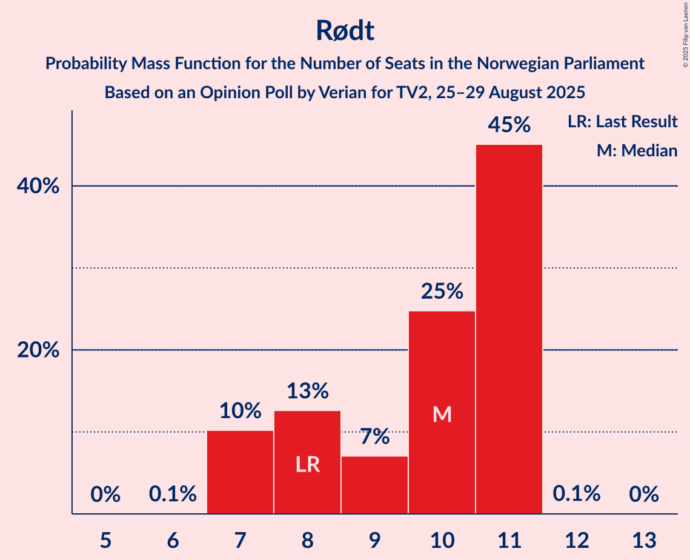

| Number of Seats | Probability | Accumulated | Special Marks |
|:---------------:|:-----------:|:-----------:|:-------------:|
| 6 | 0.1% | 100% |  |
| 7 | 10% | 99.9% |  |
| 8 | 13% | 90% | Last Result |
| 9 | 7% | 77% |  |
| 10 | 25% | 70% | Median |
| 11 | 45% | 45% |  |
| 12 | 0.1% | 0.1% |  |
| 13 | 0% | 0% |  |

### Kristelig Folkeparti

*For a full overview of the results for this party, see the [Kristelig Folkeparti](party-kristeligfolkeparti.html) page.*

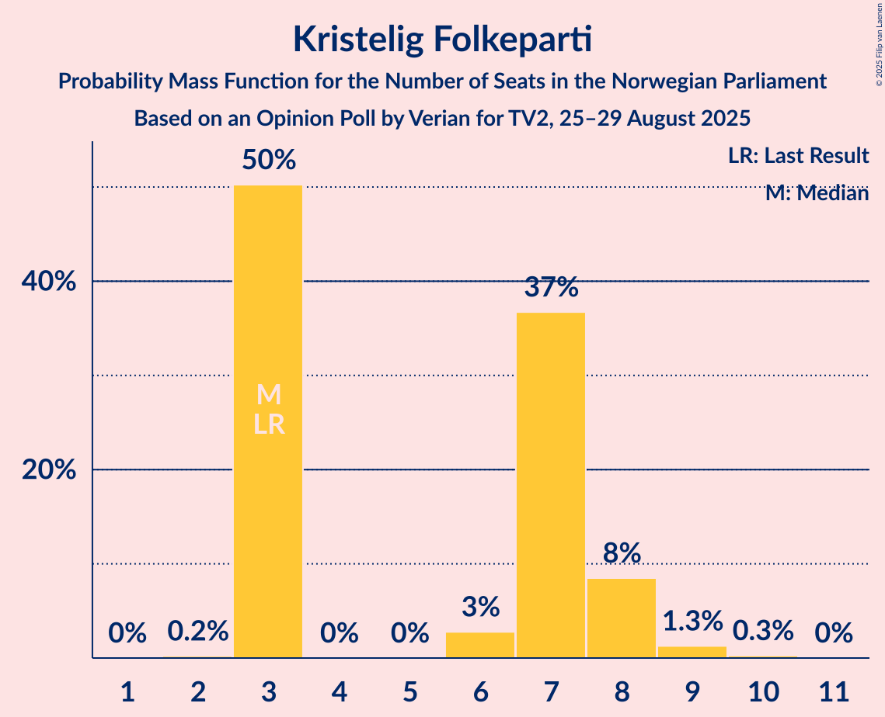

| Number of Seats | Probability | Accumulated | Special Marks |
|:---------------:|:-----------:|:-----------:|:-------------:|
| 2 | 0.2% | 100% |  |
| 3 | 50% | 99.8% | Last Result, Median |
| 4 | 0% | 50% |  |
| 5 | 0% | 50% |  |
| 6 | 3% | 50% |  |
| 7 | 37% | 47% |  |
| 8 | 8% | 10% |  |
| 9 | 1.3% | 2% |  |
| 10 | 0.3% | 0.3% |  |
| 11 | 0% | 0% |  |

### Venstre

*For a full overview of the results for this party, see the [Venstre](party-venstre.html) page.*

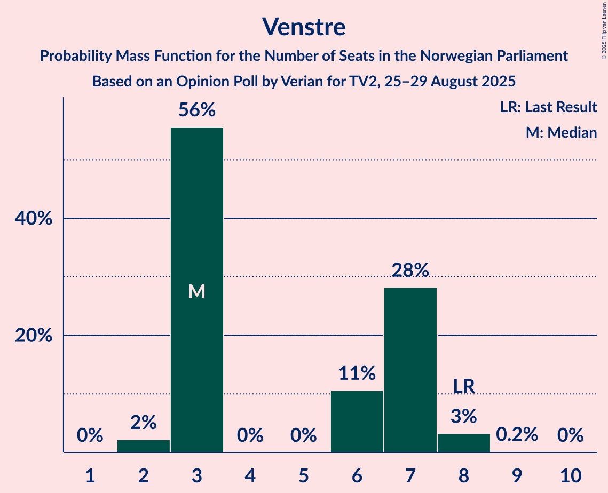

| Number of Seats | Probability | Accumulated | Special Marks |
|:---------------:|:-----------:|:-----------:|:-------------:|
| 2 | 2% | 100% |  |
| 3 | 56% | 98% | Median |
| 4 | 0% | 42% |  |
| 5 | 0% | 42% |  |
| 6 | 11% | 42% |  |
| 7 | 28% | 32% |  |
| 8 | 3% | 3% | Last Result |
| 9 | 0.2% | 0.2% |  |
| 10 | 0% | 0% |  |

### Konservativt

*For a full overview of the results for this party, see the [Konservativt](party-konservativt.html) page.*

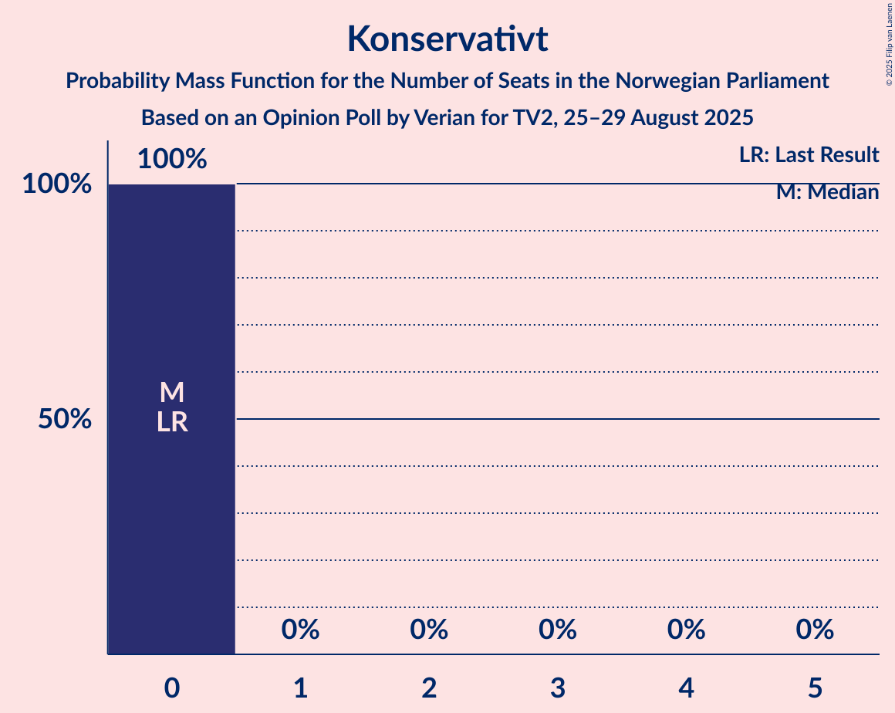

| Number of Seats | Probability | Accumulated | Special Marks |
|:---------------:|:-----------:|:-----------:|:-------------:|
| 0 | 100% | 100% | Last Result, Median |

### Norgesdemokratene

*For a full overview of the results for this party, see the [Norgesdemokratene](party-norgesdemokratene.html) page.*

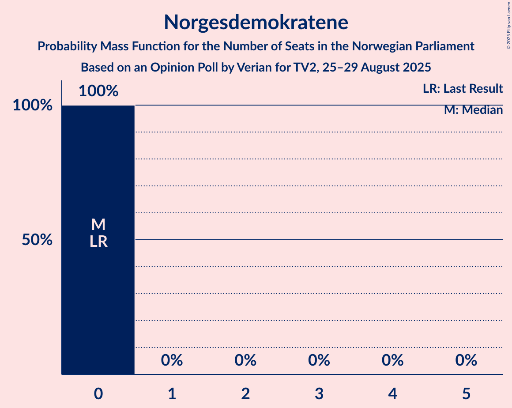

| Number of Seats | Probability | Accumulated | Special Marks |
|:---------------:|:-----------:|:-----------:|:-------------:|
| 0 | 100% | 100% | Last Result, Median |

### Pensjonistpartiet

*For a full overview of the results for this party, see the [Pensjonistpartiet](party-pensjonistpartiet.html) page.*

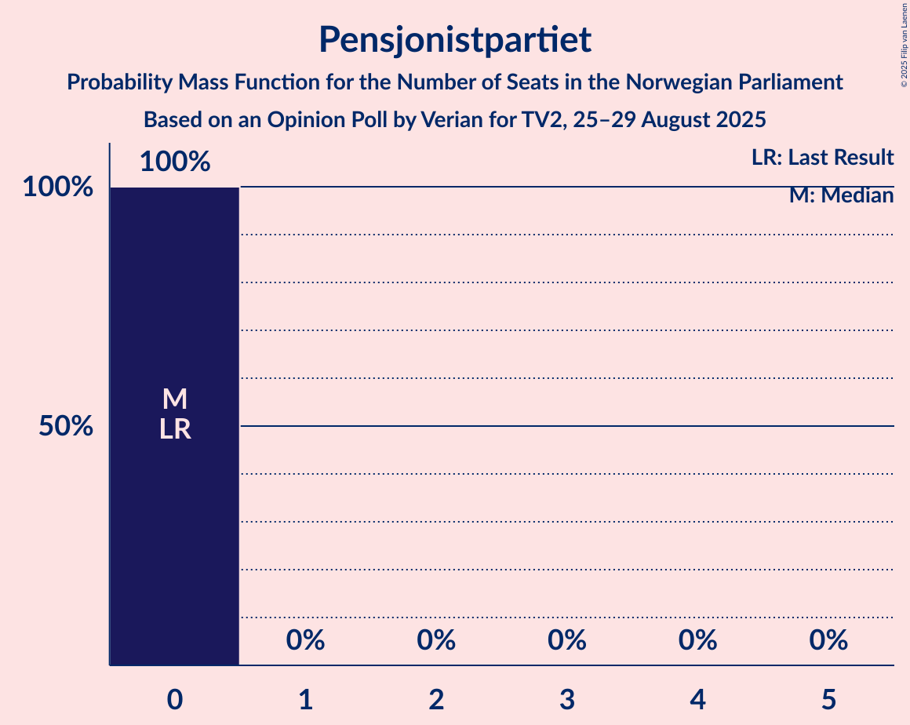

| Number of Seats | Probability | Accumulated | Special Marks |
|:---------------:|:-----------:|:-----------:|:-------------:|
| 0 | 100% | 100% | Last Result, Median |

### Industri- og Næringspartiet

*For a full overview of the results for this party, see the [Industri- og Næringspartiet](party-industri-ognæringspartiet.html) page.*

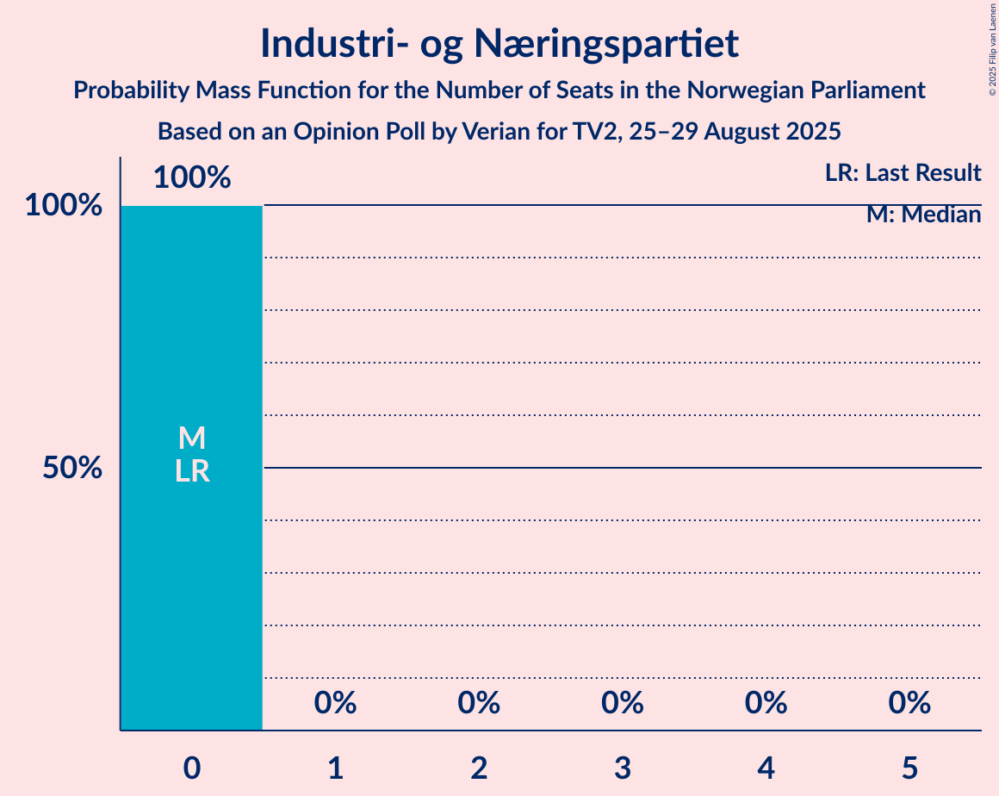

| Number of Seats | Probability | Accumulated | Special Marks |
|:---------------:|:-----------:|:-----------:|:-------------:|
| 0 | 100% | 100% | Last Result, Median |

## Coalitions

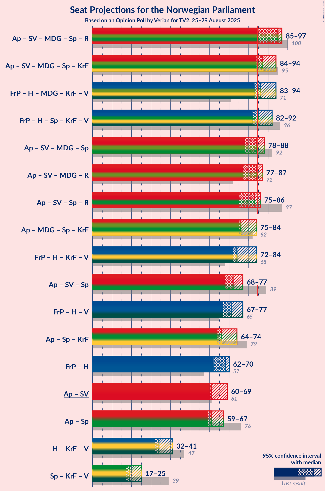

### Confidence Intervals

| Coalition | Last Result | Median | Majority? | 80% Confidence Interval | 90% Confidence Interval | 95% Confidence Interval | 99% Confidence Interval |
|:---------:|:-----------:|:------:|:---------:|:-----------------------:|:-----------------------:|:-----------------------:|:-----------------------:|
| Arbeiderpartiet – Sosialistisk Venstreparti – Miljøpartiet De Grønne – Senterpartiet – Rødt | 100 | 95 | 98.6% | 89–95 | 85–95 | 85–97 | 84–101 |
| Arbeiderpartiet – Sosialistisk Venstreparti – Miljøpartiet De Grønne – Senterpartiet – Kristelig Folkeparti | 95 | 87 | 96% | 85–91 | 85–92 | 84–94 | 83–96 |
| Fremskrittspartiet – Høyre – Miljøpartiet De Grønne – Kristelig Folkeparti – Venstre | 71 | 86 | 94% | 86–90 | 84–94 | 83–94 | 78–94 |
| Fremskrittspartiet – Høyre – Senterpartiet – Kristelig Folkeparti – Venstre | 96 | 85 | 90% | 84–90 | 82–92 | 82–92 | 77–93 |
| Arbeiderpartiet – Sosialistisk Venstreparti – Miljøpartiet De Grønne – Senterpartiet | 92 | 84 | 9% | 80–84 | 78–87 | 78–88 | 76–92 |
| Arbeiderpartiet – Sosialistisk Venstreparti – Miljøpartiet De Grønne – Rødt | 72 | 84 | 10% | 79–84 | 77–87 | 77–87 | 76–92 |
| Arbeiderpartiet – Sosialistisk Venstreparti – Senterpartiet – Rødt | 97 | 83 | 6% | 79–83 | 75–85 | 75–86 | 75–91 |
| Arbeiderpartiet – Miljøpartiet De Grønne – Senterpartiet – Kristelig Folkeparti | 82 | 76 | 2% | 76–82 | 76–83 | 75–84 | 74–86 |
| Fremskrittspartiet – Høyre – Kristelig Folkeparti – Venstre | 68 | 74 | 1.4% | 74–80 | 74–84 | 72–84 | 68–85 |
| Arbeiderpartiet – Sosialistisk Venstreparti – Senterpartiet | 89 | 72 | 0% | 70–74 | 68–76 | 68–77 | 67–82 |
| Fremskrittspartiet – Høyre – Venstre | 65 | 71 | 0% | 69–75 | 67–77 | 67–77 | 62–78 |
| Arbeiderpartiet – Senterpartiet – Kristelig Folkeparti | 79 | 66 | 0% | 64–73 | 64–73 | 64–74 | 64–75 |
| Fremskrittspartiet – Høyre | 57 | 68 | 0% | 64–69 | 63–70 | 62–70 | 59–71 |
| Arbeiderpartiet – Sosialistisk Venstreparti | 61 | 61 | 0% | 60–66 | 60–68 | 60–69 | 59–70 |
| Arbeiderpartiet – Senterpartiet | 76 | 61 | 0% | 60–66 | 59–66 | 59–67 | 58–72 |
| Høyre – Kristelig Folkeparti – Venstre | 47 | 34 | 0% | 32–41 | 32–41 | 32–41 | 30–42 |
| Senterpartiet – Kristelig Folkeparti – Venstre | 39 | 19 | 0% | 17–25 | 17–25 | 17–25 | 13–28 |

### Arbeiderpartiet – Sosialistisk Venstreparti – Miljøpartiet De Grønne – Senterpartiet – Rødt

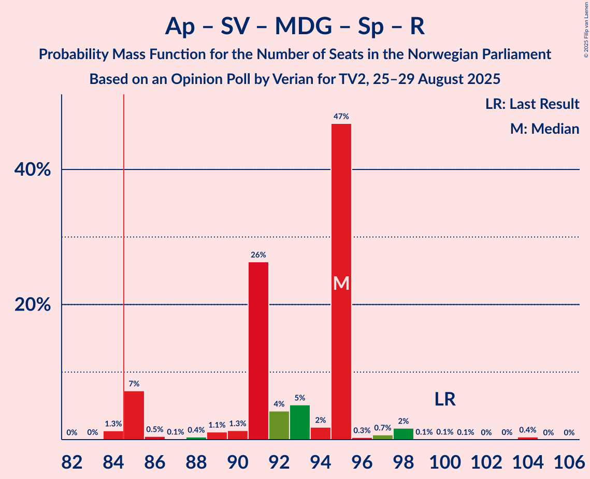

| Number of Seats | Probability | Accumulated | Special Marks |
|:---------------:|:-----------:|:-----------:|:-------------:|
| 83 | 0% | 100% |  |
| 84 | 1.3% | 99.9% |  |
| 85 | 7% | 98.6% | Majority |
| 86 | 0.5% | 91% |  |
| 87 | 0.1% | 91% |  |
| 88 | 0.4% | 91% |  |
| 89 | 1.1% | 90% |  |
| 90 | 1.3% | 89% |  |
| 91 | 26% | 88% |  |
| 92 | 4% | 62% |  |
| 93 | 5% | 57% | Median |
| 94 | 2% | 52% |  |
| 95 | 47% | 50% |  |
| 96 | 0.3% | 3% |  |
| 97 | 0.7% | 3% |  |
| 98 | 2% | 2% |  |
| 99 | 0.1% | 0.7% |  |
| 100 | 0.1% | 0.6% | Last Result |
| 101 | 0.1% | 0.5% |  |
| 102 | 0% | 0.5% |  |
| 103 | 0% | 0.5% |  |
| 104 | 0.4% | 0.4% |  |
| 105 | 0% | 0% |  |

### Arbeiderpartiet – Sosialistisk Venstreparti – Miljøpartiet De Grønne – Senterpartiet – Kristelig Folkeparti

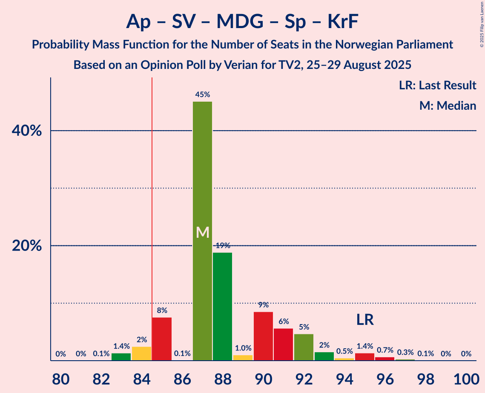

| Number of Seats | Probability | Accumulated | Special Marks |
|:---------------:|:-----------:|:-----------:|:-------------:|
| 82 | 0.1% | 100% |  |
| 83 | 1.4% | 99.9% |  |
| 84 | 2% | 98.5% |  |
| 85 | 8% | 96% | Majority |
| 86 | 0.1% | 88% | Median |
| 87 | 45% | 88% |  |
| 88 | 19% | 43% |  |
| 89 | 1.0% | 24% |  |
| 90 | 9% | 23% |  |
| 91 | 6% | 15% |  |
| 92 | 5% | 9% |  |
| 93 | 2% | 4% |  |
| 94 | 0.5% | 3% |  |
| 95 | 1.4% | 2% | Last Result |
| 96 | 0.7% | 1.1% |  |
| 97 | 0.3% | 0.4% |  |
| 98 | 0.1% | 0.1% |  |
| 99 | 0% | 0.1% |  |
| 100 | 0% | 0% |  |

### Fremskrittspartiet – Høyre – Miljøpartiet De Grønne – Kristelig Folkeparti – Venstre

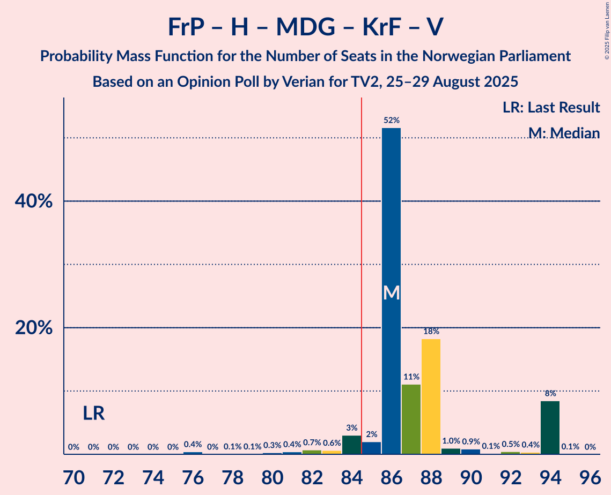

| Number of Seats | Probability | Accumulated | Special Marks |
|:---------------:|:-----------:|:-----------:|:-------------:|
| 71 | 0% | 100% | Last Result |
| 72 | 0% | 100% |  |
| 73 | 0% | 100% |  |
| 74 | 0% | 100% |  |
| 75 | 0% | 100% |  |
| 76 | 0.4% | 100% |  |
| 77 | 0% | 99.6% |  |
| 78 | 0.1% | 99.6% |  |
| 79 | 0.1% | 99.5% |  |
| 80 | 0.3% | 99.4% |  |
| 81 | 0.4% | 99.2% |  |
| 82 | 0.7% | 98.7% |  |
| 83 | 0.6% | 98% |  |
| 84 | 3% | 97% |  |
| 85 | 2% | 94% | Median, Majority |
| 86 | 52% | 92% |  |
| 87 | 11% | 41% |  |
| 88 | 18% | 30% |  |
| 89 | 1.0% | 11% |  |
| 90 | 0.9% | 10% |  |
| 91 | 0.1% | 10% |  |
| 92 | 0.5% | 9% |  |
| 93 | 0.4% | 9% |  |
| 94 | 8% | 9% |  |
| 95 | 0.1% | 0.1% |  |
| 96 | 0% | 0% |  |

### Fremskrittspartiet – Høyre – Senterpartiet – Kristelig Folkeparti – Venstre

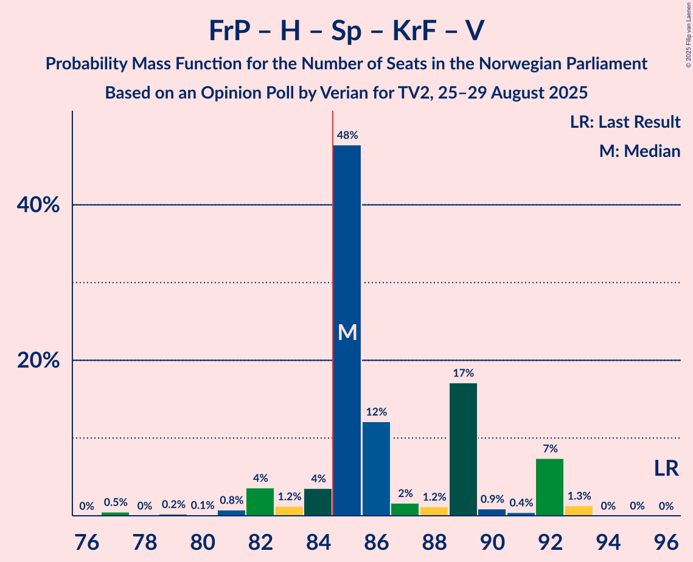

| Number of Seats | Probability | Accumulated | Special Marks |
|:---------------:|:-----------:|:-----------:|:-------------:|
| 77 | 0.5% | 100% |  |
| 78 | 0% | 99.5% |  |
| 79 | 0.2% | 99.4% |  |
| 80 | 0.1% | 99.2% |  |
| 81 | 0.8% | 99.1% |  |
| 82 | 4% | 98% |  |
| 83 | 1.2% | 95% |  |
| 84 | 4% | 93% |  |
| 85 | 48% | 90% | Median, Majority |
| 86 | 12% | 42% |  |
| 87 | 2% | 30% |  |
| 88 | 1.2% | 28% |  |
| 89 | 17% | 27% |  |
| 90 | 0.9% | 10% |  |
| 91 | 0.4% | 9% |  |
| 92 | 7% | 9% |  |
| 93 | 1.3% | 1.4% |  |
| 94 | 0% | 0.1% |  |
| 95 | 0% | 0.1% |  |
| 96 | 0% | 0% | Last Result |

### Arbeiderpartiet – Sosialistisk Venstreparti – Miljøpartiet De Grønne – Senterpartiet

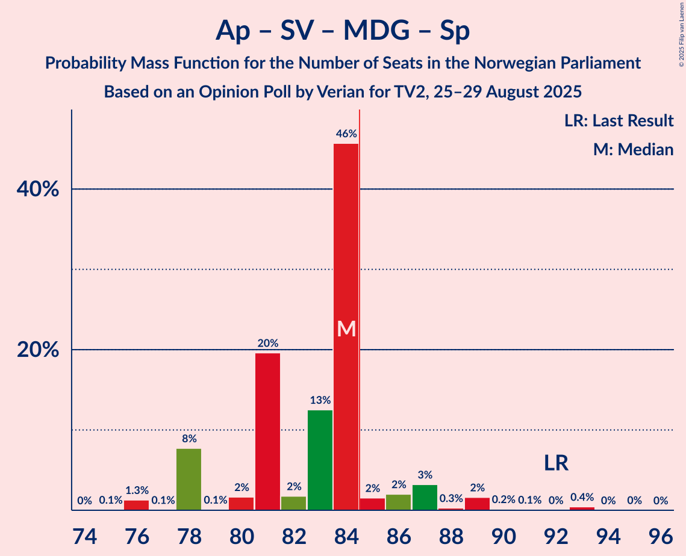

| Number of Seats | Probability | Accumulated | Special Marks |
|:---------------:|:-----------:|:-----------:|:-------------:|
| 75 | 0.1% | 100% |  |
| 76 | 1.3% | 99.9% |  |
| 77 | 0.1% | 98.6% |  |
| 78 | 8% | 98.6% |  |
| 79 | 0.1% | 91% |  |
| 80 | 2% | 91% |  |
| 81 | 20% | 89% |  |
| 82 | 2% | 69% |  |
| 83 | 13% | 68% | Median |
| 84 | 46% | 55% |  |
| 85 | 2% | 9% | Majority |
| 86 | 2% | 8% |  |
| 87 | 3% | 6% |  |
| 88 | 0.3% | 3% |  |
| 89 | 2% | 2% |  |
| 90 | 0.2% | 0.8% |  |
| 91 | 0.1% | 0.6% |  |
| 92 | 0% | 0.5% | Last Result |
| 93 | 0.4% | 0.5% |  |
| 94 | 0% | 0.1% |  |
| 95 | 0% | 0% |  |

### Arbeiderpartiet – Sosialistisk Venstreparti – Miljøpartiet De Grønne – Rødt

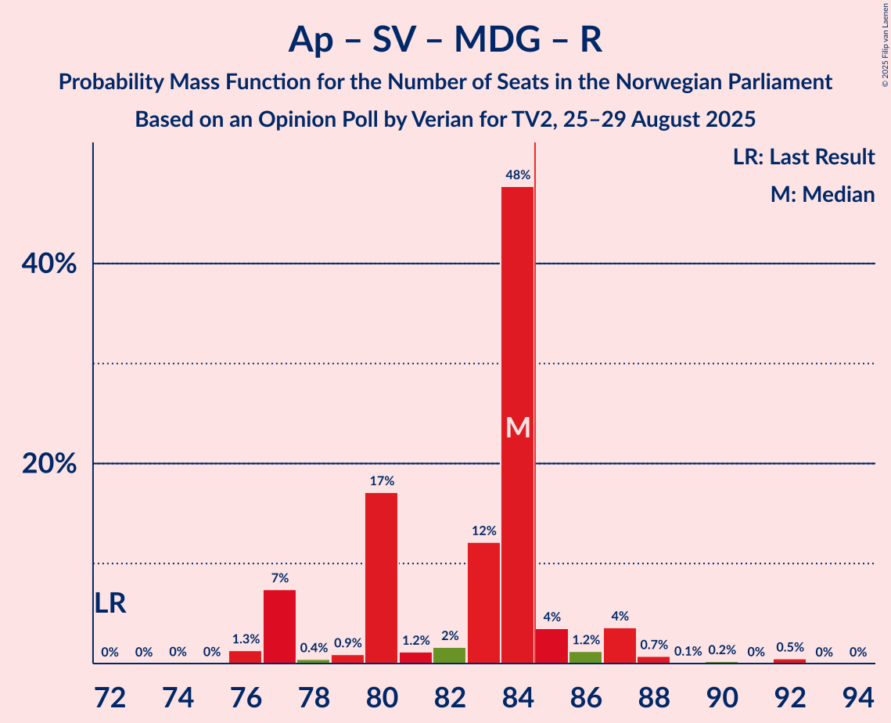

| Number of Seats | Probability | Accumulated | Special Marks |
|:---------------:|:-----------:|:-----------:|:-------------:|
| 72 | 0% | 100% | Last Result |
| 73 | 0% | 100% |  |
| 74 | 0% | 100% |  |
| 75 | 0% | 99.9% |  |
| 76 | 1.3% | 99.9% |  |
| 77 | 7% | 98.6% |  |
| 78 | 0.4% | 91% |  |
| 79 | 0.9% | 91% |  |
| 80 | 17% | 90% |  |
| 81 | 1.2% | 73% |  |
| 82 | 2% | 72% | Median |
| 83 | 12% | 70% |  |
| 84 | 48% | 58% |  |
| 85 | 4% | 10% | Majority |
| 86 | 1.2% | 6% |  |
| 87 | 4% | 5% |  |
| 88 | 0.7% | 2% |  |
| 89 | 0.1% | 0.9% |  |
| 90 | 0.2% | 0.8% |  |
| 91 | 0% | 0.5% |  |
| 92 | 0.5% | 0.5% |  |
| 93 | 0% | 0% |  |

### Arbeiderpartiet – Sosialistisk Venstreparti – Senterpartiet – Rødt

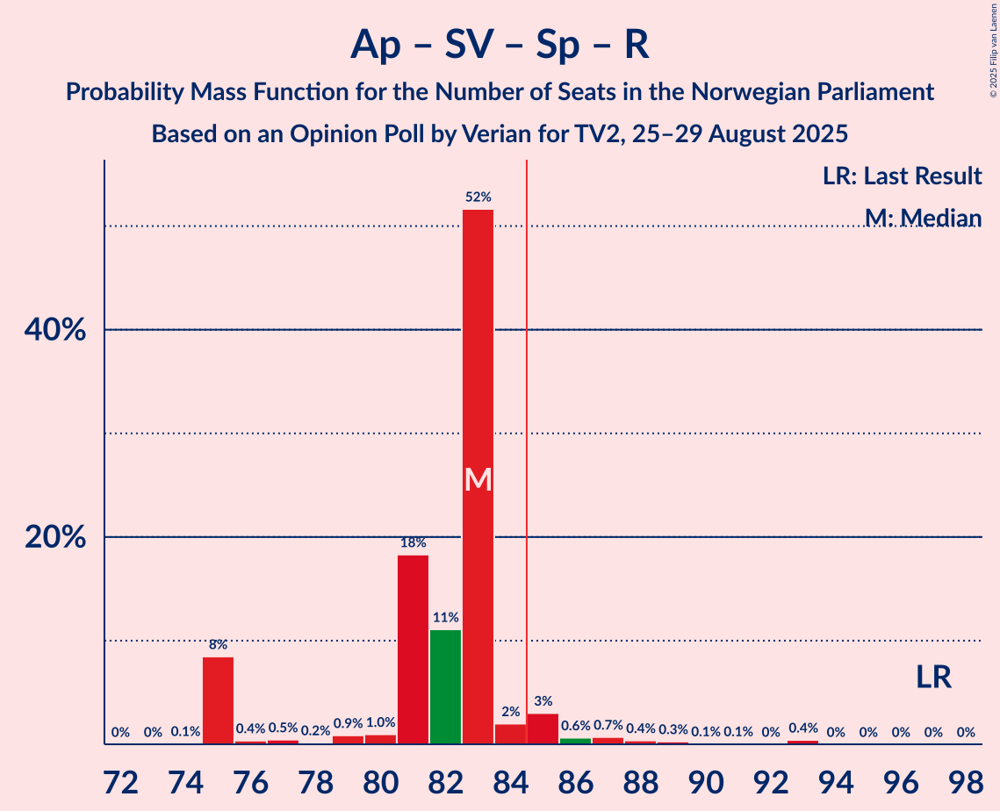

| Number of Seats | Probability | Accumulated | Special Marks |
|:---------------:|:-----------:|:-----------:|:-------------:|
| 74 | 0.1% | 100% |  |
| 75 | 8% | 99.9% |  |
| 76 | 0.4% | 91% |  |
| 77 | 0.5% | 91% |  |
| 78 | 0.2% | 91% |  |
| 79 | 0.9% | 90% |  |
| 80 | 1.0% | 90% |  |
| 81 | 18% | 89% |  |
| 82 | 11% | 70% | Median |
| 83 | 52% | 59% |  |
| 84 | 2% | 8% |  |
| 85 | 3% | 6% | Majority |
| 86 | 0.6% | 3% |  |
| 87 | 0.7% | 2% |  |
| 88 | 0.4% | 1.2% |  |
| 89 | 0.3% | 0.8% |  |
| 90 | 0.1% | 0.6% |  |
| 91 | 0.1% | 0.5% |  |
| 92 | 0% | 0.4% |  |
| 93 | 0.4% | 0.4% |  |
| 94 | 0% | 0% |  |
| 95 | 0% | 0% |  |
| 96 | 0% | 0% |  |
| 97 | 0% | 0% | Last Result |

### Arbeiderpartiet – Miljøpartiet De Grønne – Senterpartiet – Kristelig Folkeparti

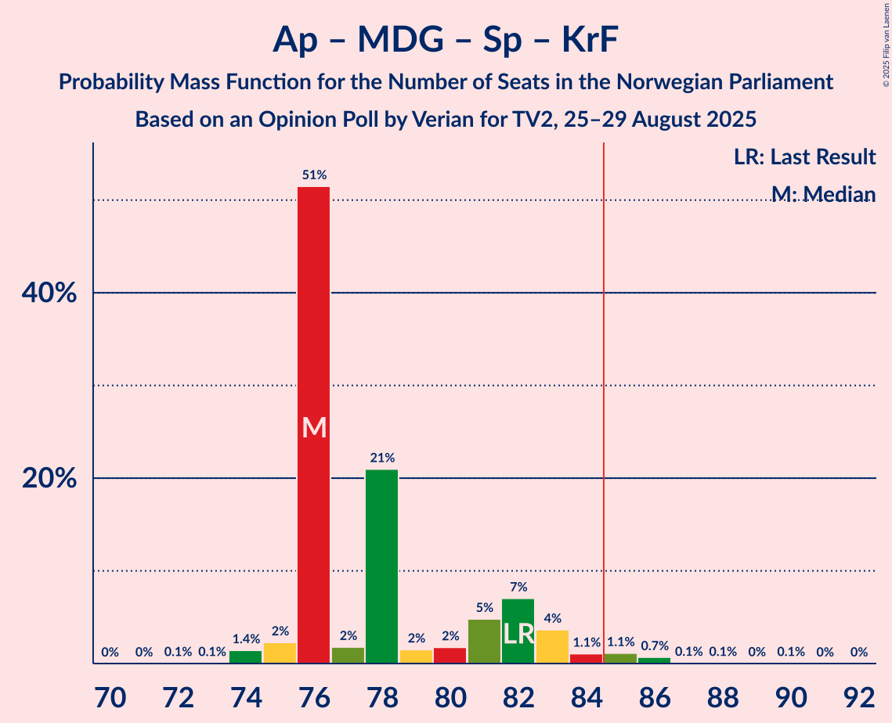

| Number of Seats | Probability | Accumulated | Special Marks |
|:---------------:|:-----------:|:-----------:|:-------------:|
| 72 | 0.1% | 100% |  |
| 73 | 0.1% | 99.9% |  |
| 74 | 1.4% | 99.9% |  |
| 75 | 2% | 98% | Median |
| 76 | 51% | 96% |  |
| 77 | 2% | 45% |  |
| 78 | 21% | 43% |  |
| 79 | 2% | 22% |  |
| 80 | 2% | 20% |  |
| 81 | 5% | 19% |  |
| 82 | 7% | 14% | Last Result |
| 83 | 4% | 7% |  |
| 84 | 1.1% | 3% |  |
| 85 | 1.1% | 2% | Majority |
| 86 | 0.7% | 0.9% |  |
| 87 | 0.1% | 0.2% |  |
| 88 | 0.1% | 0.2% |  |
| 89 | 0% | 0.1% |  |
| 90 | 0.1% | 0.1% |  |
| 91 | 0% | 0% |  |

### Fremskrittspartiet – Høyre – Kristelig Folkeparti – Venstre

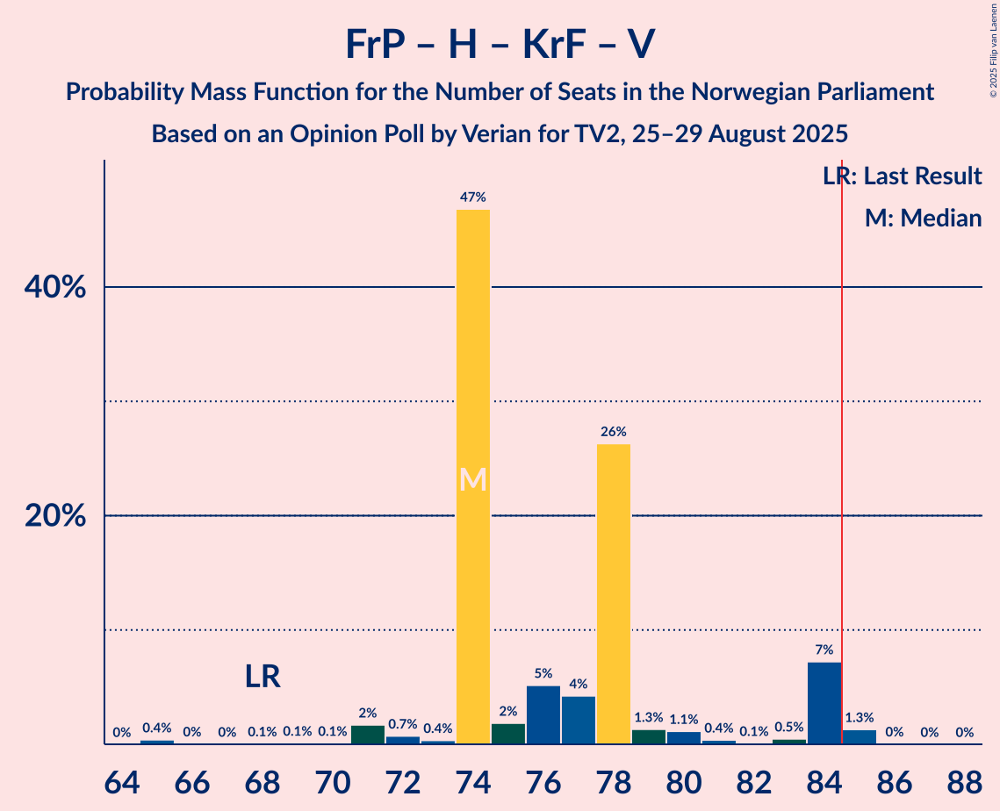

| Number of Seats | Probability | Accumulated | Special Marks |
|:---------------:|:-----------:|:-----------:|:-------------:|
| 65 | 0.4% | 100% |  |
| 66 | 0% | 99.6% |  |
| 67 | 0% | 99.5% |  |
| 68 | 0.1% | 99.5% | Last Result |
| 69 | 0.1% | 99.5% |  |
| 70 | 0.1% | 99.3% |  |
| 71 | 2% | 99.2% |  |
| 72 | 0.7% | 98% |  |
| 73 | 0.4% | 97% |  |
| 74 | 47% | 96% | Median |
| 75 | 2% | 50% |  |
| 76 | 5% | 48% |  |
| 77 | 4% | 43% |  |
| 78 | 26% | 38% |  |
| 79 | 1.3% | 12% |  |
| 80 | 1.1% | 11% |  |
| 81 | 0.4% | 10% |  |
| 82 | 0.1% | 9% |  |
| 83 | 0.5% | 9% |  |
| 84 | 7% | 9% |  |
| 85 | 1.3% | 1.4% | Majority |
| 86 | 0% | 0.1% |  |
| 87 | 0% | 0% |  |

### Arbeiderpartiet – Sosialistisk Venstreparti – Senterpartiet

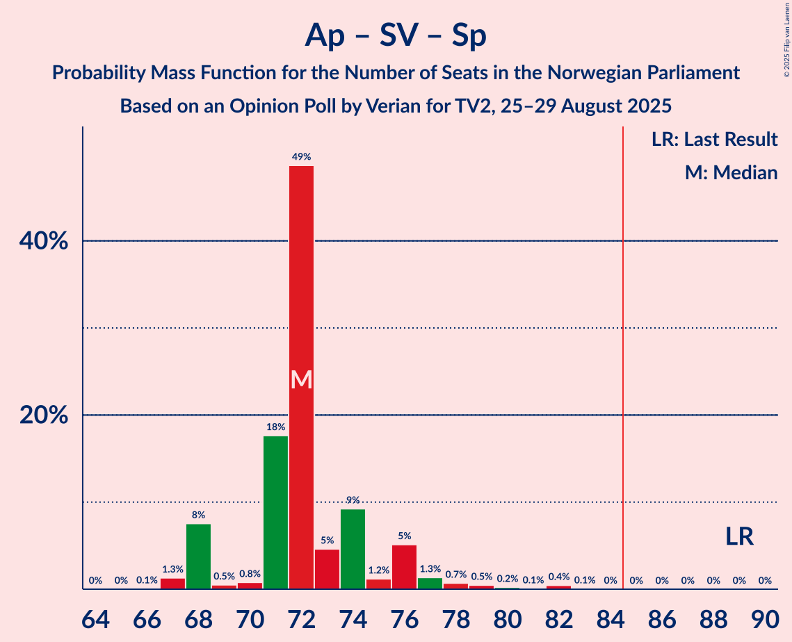

| Number of Seats | Probability | Accumulated | Special Marks |
|:---------------:|:-----------:|:-----------:|:-------------:|
| 66 | 0.1% | 100% |  |
| 67 | 1.3% | 99.9% |  |
| 68 | 8% | 98.6% |  |
| 69 | 0.5% | 91% |  |
| 70 | 0.8% | 91% |  |
| 71 | 18% | 90% |  |
| 72 | 49% | 72% | Median |
| 73 | 5% | 23% |  |
| 74 | 9% | 19% |  |
| 75 | 1.2% | 10% |  |
| 76 | 5% | 8% |  |
| 77 | 1.3% | 3% |  |
| 78 | 0.7% | 2% |  |
| 79 | 0.5% | 1.3% |  |
| 80 | 0.2% | 0.8% |  |
| 81 | 0.1% | 0.6% |  |
| 82 | 0.4% | 0.5% |  |
| 83 | 0.1% | 0.1% |  |
| 84 | 0% | 0% |  |
| 85 | 0% | 0% | Majority |
| 86 | 0% | 0% |  |
| 87 | 0% | 0% |  |
| 88 | 0% | 0% |  |
| 89 | 0% | 0% | Last Result |

### Fremskrittspartiet – Høyre – Venstre

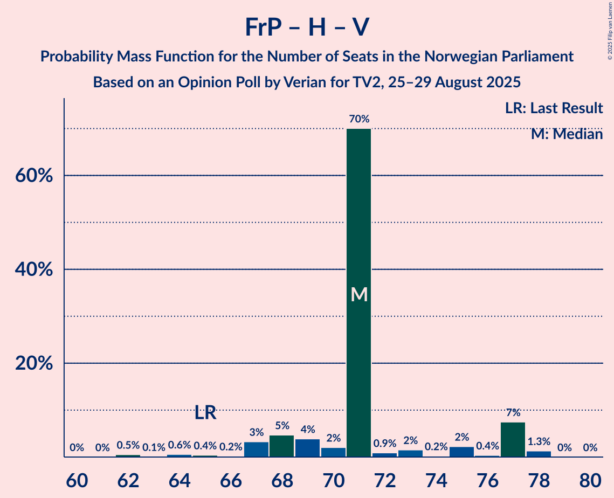

| Number of Seats | Probability | Accumulated | Special Marks |
|:---------------:|:-----------:|:-----------:|:-------------:|
| 61 | 0% | 100% |  |
| 62 | 0.5% | 99.9% |  |
| 63 | 0.1% | 99.4% |  |
| 64 | 0.6% | 99.3% |  |
| 65 | 0.4% | 98.8% | Last Result |
| 66 | 0.2% | 98% |  |
| 67 | 3% | 98% |  |
| 68 | 5% | 95% |  |
| 69 | 4% | 90% |  |
| 70 | 2% | 86% |  |
| 71 | 70% | 84% | Median |
| 72 | 0.9% | 14% |  |
| 73 | 2% | 13% |  |
| 74 | 0.2% | 12% |  |
| 75 | 2% | 11% |  |
| 76 | 0.4% | 9% |  |
| 77 | 7% | 9% |  |
| 78 | 1.3% | 1.4% |  |
| 79 | 0% | 0% |  |

### Arbeiderpartiet – Senterpartiet – Kristelig Folkeparti

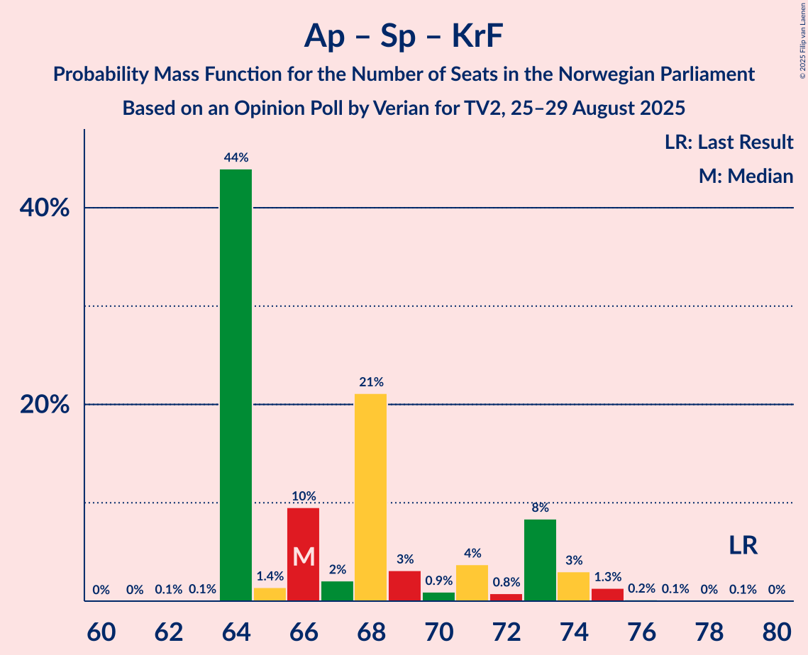

| Number of Seats | Probability | Accumulated | Special Marks |
|:---------------:|:-----------:|:-----------:|:-------------:|
| 62 | 0.1% | 100% |  |
| 63 | 0.1% | 99.9% |  |
| 64 | 44% | 99.8% | Median |
| 65 | 1.4% | 56% |  |
| 66 | 10% | 54% |  |
| 67 | 2% | 45% |  |
| 68 | 21% | 43% |  |
| 69 | 3% | 22% |  |
| 70 | 0.9% | 19% |  |
| 71 | 4% | 18% |  |
| 72 | 0.8% | 14% |  |
| 73 | 8% | 13% |  |
| 74 | 3% | 5% |  |
| 75 | 1.3% | 2% |  |
| 76 | 0.2% | 0.4% |  |
| 77 | 0.1% | 0.3% |  |
| 78 | 0% | 0.1% |  |
| 79 | 0.1% | 0.1% | Last Result |
| 80 | 0% | 0% |  |

### Fremskrittspartiet – Høyre

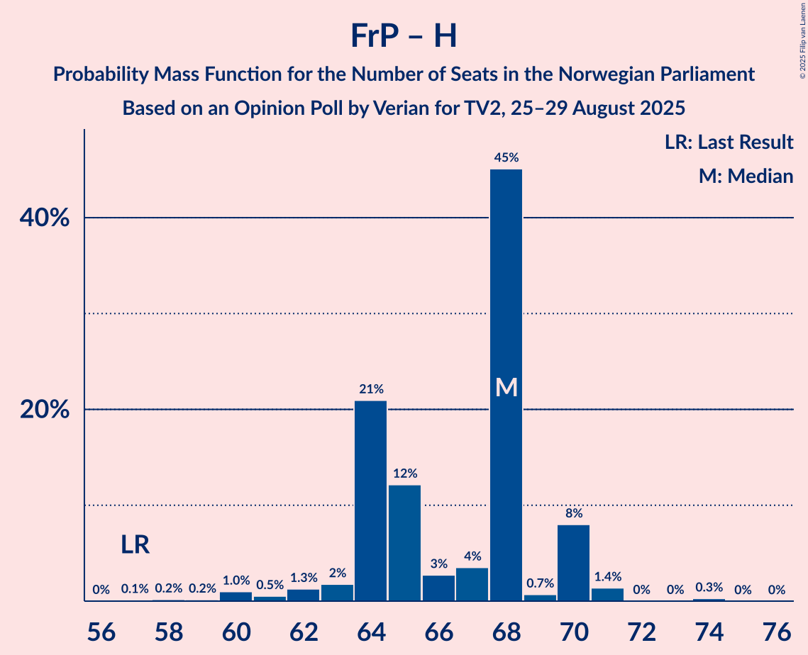

| Number of Seats | Probability | Accumulated | Special Marks |
|:---------------:|:-----------:|:-----------:|:-------------:|
| 56 | 0% | 100% |  |
| 57 | 0.1% | 99.9% | Last Result |
| 58 | 0.2% | 99.8% |  |
| 59 | 0.2% | 99.6% |  |
| 60 | 1.0% | 99.5% |  |
| 61 | 0.5% | 98% |  |
| 62 | 1.3% | 98% |  |
| 63 | 2% | 97% |  |
| 64 | 21% | 95% |  |
| 65 | 12% | 74% |  |
| 66 | 3% | 62% |  |
| 67 | 4% | 59% |  |
| 68 | 45% | 56% | Median |
| 69 | 0.7% | 10% |  |
| 70 | 8% | 10% |  |
| 71 | 1.4% | 2% |  |
| 72 | 0% | 0.3% |  |
| 73 | 0% | 0.3% |  |
| 74 | 0.3% | 0.3% |  |
| 75 | 0% | 0% |  |

### Arbeiderpartiet – Sosialistisk Venstreparti

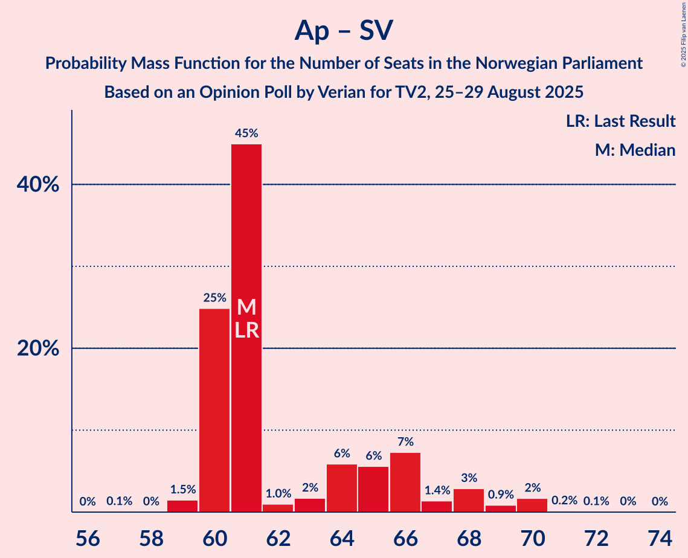

| Number of Seats | Probability | Accumulated | Special Marks |
|:---------------:|:-----------:|:-----------:|:-------------:|
| 57 | 0.1% | 100% |  |
| 58 | 0% | 99.9% |  |
| 59 | 1.5% | 99.9% |  |
| 60 | 25% | 98% |  |
| 61 | 45% | 74% | Last Result, Median |
| 62 | 1.0% | 29% |  |
| 63 | 2% | 28% |  |
| 64 | 6% | 26% |  |
| 65 | 6% | 20% |  |
| 66 | 7% | 14% |  |
| 67 | 1.4% | 7% |  |
| 68 | 3% | 6% |  |
| 69 | 0.9% | 3% |  |
| 70 | 2% | 2% |  |
| 71 | 0.2% | 0.3% |  |
| 72 | 0.1% | 0.1% |  |
| 73 | 0% | 0.1% |  |
| 74 | 0% | 0% |  |

### Arbeiderpartiet – Senterpartiet

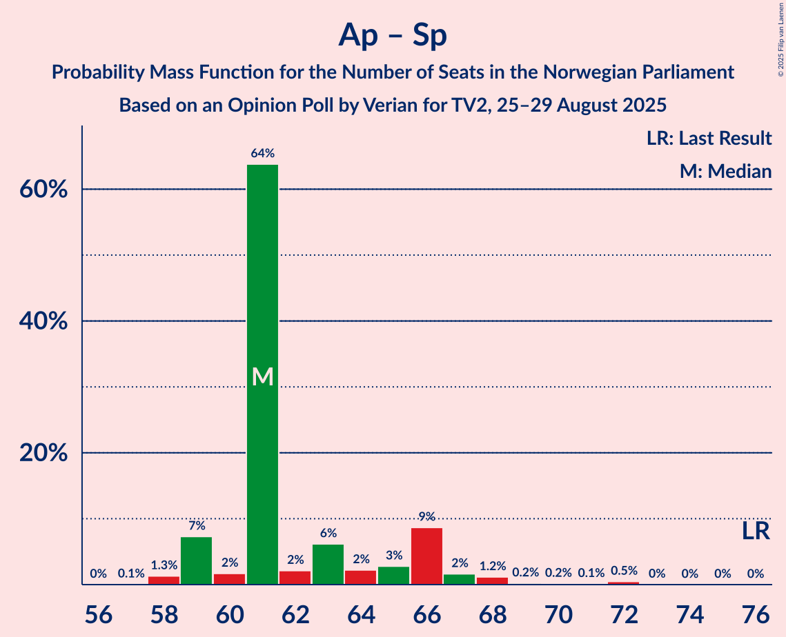

| Number of Seats | Probability | Accumulated | Special Marks |
|:---------------:|:-----------:|:-----------:|:-------------:|
| 57 | 0.1% | 100% |  |
| 58 | 1.3% | 99.9% |  |
| 59 | 7% | 98.6% |  |
| 60 | 2% | 91% |  |
| 61 | 64% | 90% | Median |
| 62 | 2% | 26% |  |
| 63 | 6% | 24% |  |
| 64 | 2% | 18% |  |
| 65 | 3% | 15% |  |
| 66 | 9% | 12% |  |
| 67 | 2% | 4% |  |
| 68 | 1.2% | 2% |  |
| 69 | 0.2% | 1.0% |  |
| 70 | 0.2% | 0.8% |  |
| 71 | 0.1% | 0.6% |  |
| 72 | 0.5% | 0.5% |  |
| 73 | 0% | 0% |  |
| 74 | 0% | 0% |  |
| 75 | 0% | 0% |  |
| 76 | 0% | 0% | Last Result |

### Høyre – Kristelig Folkeparti – Venstre

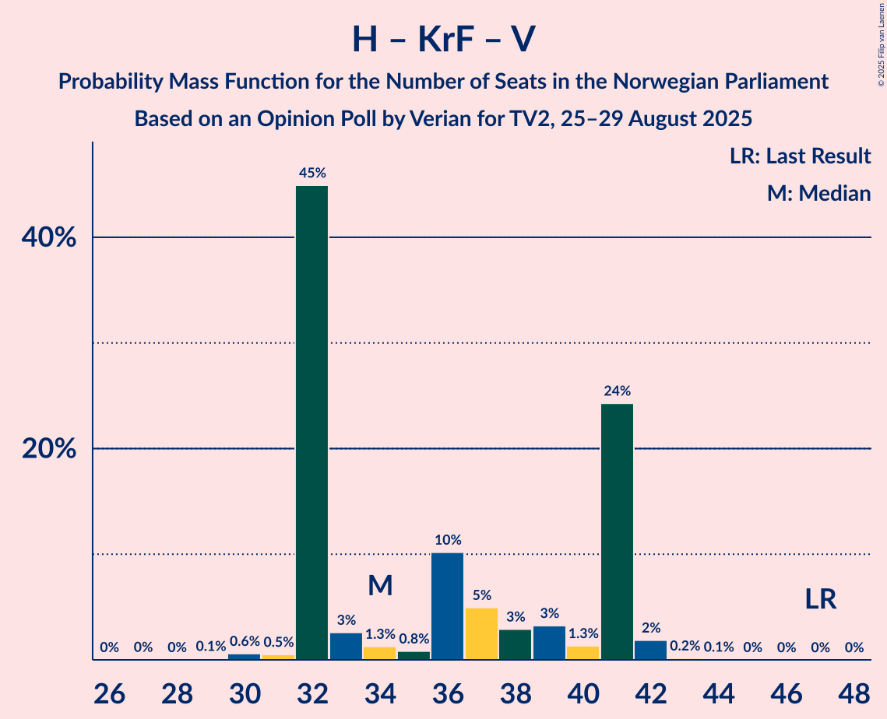

| Number of Seats | Probability | Accumulated | Special Marks |
|:---------------:|:-----------:|:-----------:|:-------------:|
| 27 | 0% | 100% |  |
| 28 | 0% | 99.9% |  |
| 29 | 0.1% | 99.9% |  |
| 30 | 0.6% | 99.8% |  |
| 31 | 0.5% | 99.2% |  |
| 32 | 45% | 98.7% | Median |
| 33 | 3% | 54% |  |
| 34 | 1.3% | 51% |  |
| 35 | 0.8% | 50% |  |
| 36 | 10% | 49% |  |
| 37 | 5% | 39% |  |
| 38 | 3% | 34% |  |
| 39 | 3% | 31% |  |
| 40 | 1.3% | 28% |  |
| 41 | 24% | 26% |  |
| 42 | 2% | 2% |  |
| 43 | 0.2% | 0.3% |  |
| 44 | 0.1% | 0.1% |  |
| 45 | 0% | 0% |  |
| 46 | 0% | 0% |  |
| 47 | 0% | 0% | Last Result |

### Senterpartiet – Kristelig Folkeparti – Venstre

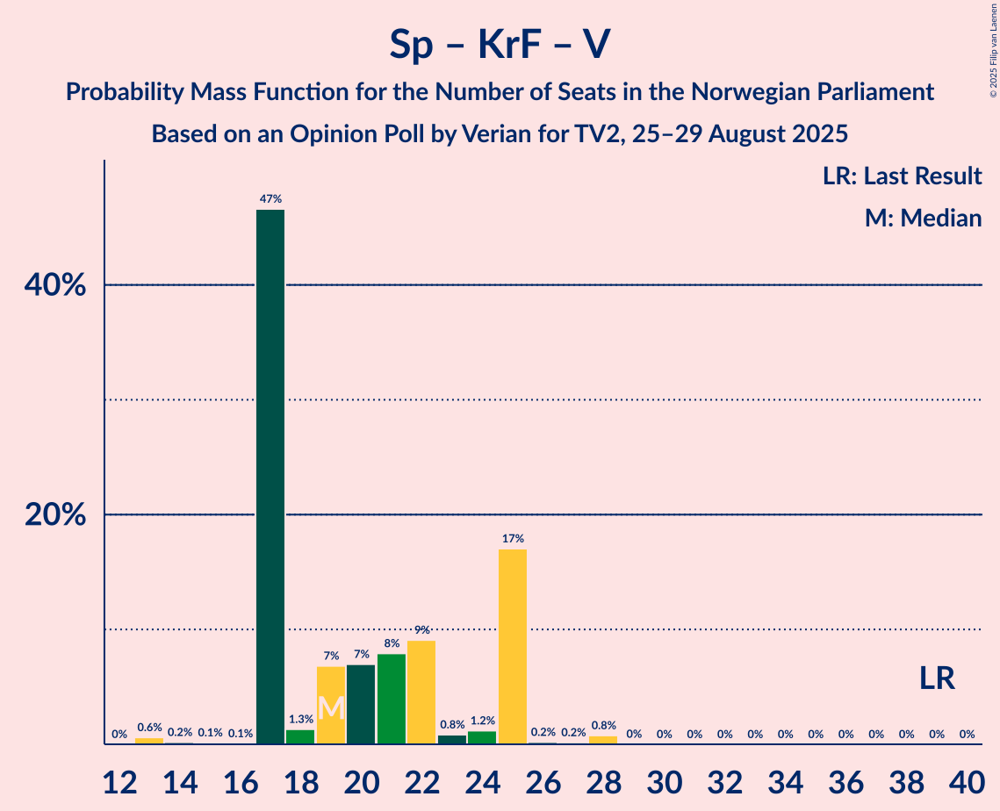

| Number of Seats | Probability | Accumulated | Special Marks |
|:---------------:|:-----------:|:-----------:|:-------------:|
| 13 | 0.6% | 100% |  |
| 14 | 0.2% | 99.4% |  |
| 15 | 0.1% | 99.2% |  |
| 16 | 0.1% | 99.1% |  |
| 17 | 47% | 99.0% | Median |
| 18 | 1.3% | 52% |  |
| 19 | 7% | 51% |  |
| 20 | 7% | 44% |  |
| 21 | 8% | 37% |  |
| 22 | 9% | 29% |  |
| 23 | 0.8% | 20% |  |
| 24 | 1.2% | 19% |  |
| 25 | 17% | 18% |  |
| 26 | 0.2% | 1.2% |  |
| 27 | 0.2% | 1.0% |  |
| 28 | 0.8% | 0.8% |  |
| 29 | 0% | 0% |  |
| 30 | 0% | 0% |  |
| 31 | 0% | 0% |  |
| 32 | 0% | 0% |  |
| 33 | 0% | 0% |  |
| 34 | 0% | 0% |  |
| 35 | 0% | 0% |  |
| 36 | 0% | 0% |  |
| 37 | 0% | 0% |  |
| 38 | 0% | 0% |  |
| 39 | 0% | 0% | Last Result |

## Technical Information

### Opinion Poll

+ **Polling firm:** Verian
+ **Commissioner(s):** TV2
+ **Fieldwork period:** 25–29 August 2025

### Calculations

+ **Sample size:** 1577
+ **Simulations done:** 2,097,152
+ **Error estimate:** 1.07%

