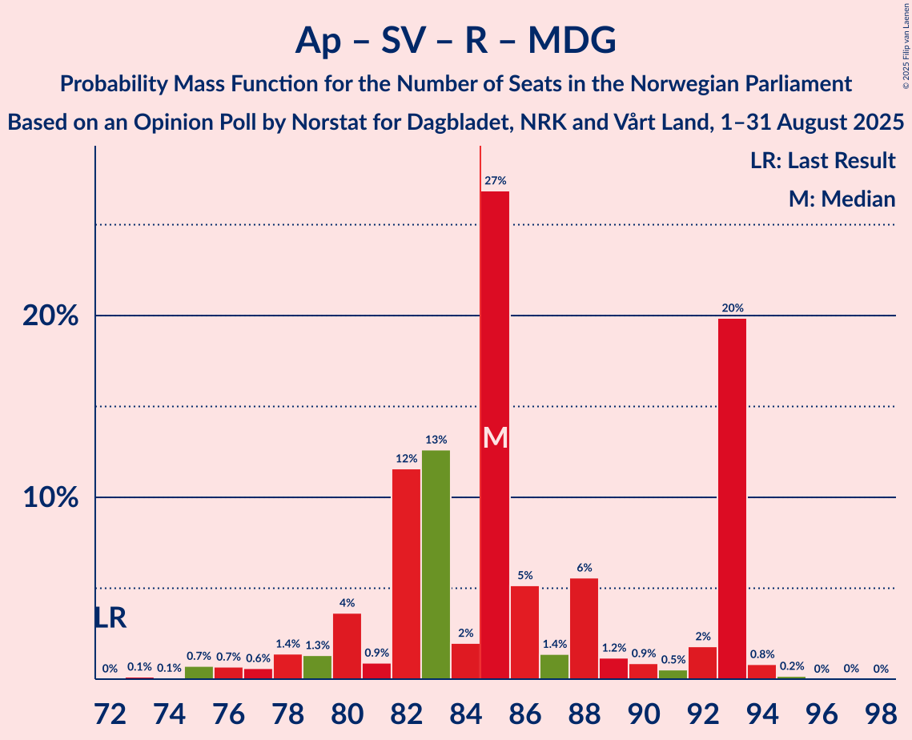
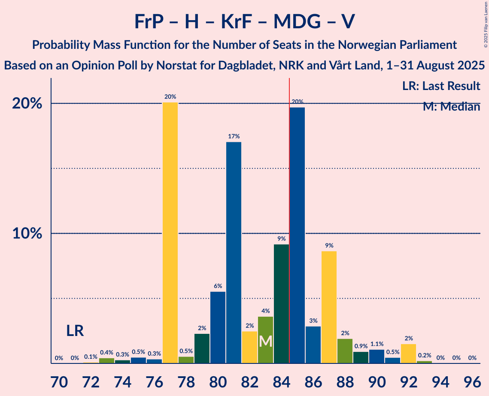

# Opinion Poll by Norstat for Dagbladet, NRK and Vårt Land, 1–31 August 2025

<a href="#voting-intentions">Voting Intentions</a> | <a href="#seats">Seats</a> | <a href="#coalitions">Coalitions</a> | <a href="#technical-information">Technical Information</a>

## Voting Intentions

### Confidence Intervals

| Party | Last Result | Poll Result | 80% Confidence Interval | 90% Confidence Interval | 95% Confidence Interval | 99% Confidence Interval |
|:-----:|:-----------:|:-----------:|:-----------------------:|:-----------------------:|:-----------------------:|:-----------------------:|
| Arbeiderpartiet | 26.2% | 28.2% | 26.4–30.1% |25.9–30.6% |25.5–31.1% |24.7–32.0% |
| Fremskrittspartiet | 11.6% | 20.5% | 18.9–22.2% |18.5–22.7% |18.1–23.1% |17.4–24.0% |
| Høyre | 20.4% | 14.6% | 13.3–16.2% |12.9–16.6% |12.6–17.0% |12.0–17.7% |
| Sosialistisk Venstreparti | 7.6% | 7.1% | 6.1–8.2% |5.9–8.6% |5.6–8.8% |5.2–9.4% |
| Rødt | 4.7% | 6.3% | 5.4–7.4% |5.1–7.7% |4.9–8.0% |4.5–8.5% |
| Senterpartiet | 13.5% | 5.3% | 4.5–6.3% |4.2–6.6% |4.1–6.8% |3.7–7.4% |
| Kristelig Folkeparti | 3.8% | 4.8% | 4.0–5.8% |3.8–6.0% |3.6–6.3% |3.3–6.8% |
| Miljøpartiet De Grønne | 3.9% | 4.7% | 3.9–5.7% |3.7–5.9% |3.5–6.2% |3.2–6.7% |
| Venstre | 4.6% | 3.8% | 3.1–4.7% |2.9–4.9% |2.8–5.2% |2.5–5.6% |
| Industri- og Næringspartiet | 0.3% | 0.9% | 0.6–1.4% |0.5–1.6% |0.5–1.7% |0.4–2.0% |
| Konservativt | 0.4% | 0.8% | 0.5–1.3% |0.5–1.4% |0.4–1.6% |0.3–1.8% |
| Norgesdemokratene | 1.1% | 0.7% | 0.5–1.2% |0.4–1.3% |0.3–1.4% |0.2–1.7% |
| Pensjonistpartiet | 0.6% | 0.3% | 0.2–0.7% |0.1–0.8% |0.1–0.9% |0.1–1.1% |

*Note:* The poll result column reflects the actual value used in the calculations. Published results may vary slightly, and in addition be rounded to fewer digits.

## Seats

### Confidence Intervals

| Party | Last Result | Median | 80% Confidence Interval | 90% Confidence Interval | 95% Confidence Interval | 99% Confidence Interval |
|:-----:|:-----------:|:------:|:-----------------------:|:-----------------------:|:-----------------------:|:-----------------------:|
| <a href="#arbeiderpartiet">Arbeiderpartiet</a> | 48 | 56 | 51–63 |51–63 |50–63 |47–63 |
| <a href="#fremskrittspartiet">Fremskrittspartiet</a> | 21 | 40 | 37–46 |36–46 |34–46 |34–46 |
| <a href="#høyre">Høyre</a> | 36 | 24 | 19–28 |19–30 |19–31 |19–32 |
| <a href="#sosialistisk-venstreparti">Sosialistisk Venstreparti</a> | 13 | 12 | 10–13 |9–14 |9–15 |8–16 |
| <a href="#rødt">Rødt</a> | 8 | 10 | 9–12 |9–13 |8–13 |7–14 |
| <a href="#senterpartiet">Senterpartiet</a> | 28 | 8 | 7–11 |7–11 |6–12 |1–13 |
| <a href="#kristelig-folkeparti">Kristelig Folkeparti</a> | 3 | 7 | 7–9 |3–10 |3–11 |3–11 |
| <a href="#miljøpartiet-de-grønne">Miljøpartiet De Grønne</a> | 3 | 8 | 6–9 |3–10 |3–11 |2–11 |
| <a href="#venstre">Venstre</a> | 8 | 3 | 2–7 |2–8 |2–8 |2–9 |
| <a href="#industri--og-næringspartiet">Industri- og Næringspartiet</a> | 0 | 0 | 0 |0 |0 |0 |
| <a href="#konservativt">Konservativt</a> | 0 | 0 | 0 |0 |0 |0 |
| <a href="#norgesdemokratene">Norgesdemokratene</a> | 0 | 0 | 0 |0 |0 |0 |
| <a href="#pensjonistpartiet">Pensjonistpartiet</a> | 0 | 0 | 0 |0 |0 |0 |

### Arbeiderpartiet

*For a full overview of the results for this party, see the [Arbeiderpartiet](party-arbeiderpartiet.html) page.*

| Number of Seats | Probability | Accumulated | Special Marks |
|:---------------:|:-----------:|:-----------:|:-------------:|
| 46 | 0.2% | 100% |  |
| 47 | 0.9% | 99.7% |  |
| 48 | 0.4% | 98.9% | Last Result |
| 49 | 0.2% | 98% |  |
| 50 | 1.4% | 98% |  |
| 51 | 12% | 97% |  |
| 52 | 9% | 84% |  |
| 53 | 6% | 76% |  |
| 54 | 3% | 69% |  |
| 55 | 5% | 66% |  |
| 56 | 21% | 61% | Median |
| 57 | 11% | 40% |  |
| 58 | 3% | 29% |  |
| 59 | 0.8% | 26% |  |
| 60 | 4% | 25% |  |
| 61 | 1.2% | 21% |  |
| 62 | 0.2% | 20% |  |
| 63 | 20% | 20% |  |
| 64 | 0% | 0.1% |  |
| 65 | 0% | 0.1% |  |
| 66 | 0% | 0.1% |  |
| 67 | 0% | 0.1% |  |
| 68 | 0% | 0% |  |

### Fremskrittspartiet

*For a full overview of the results for this party, see the [Fremskrittspartiet](party-fremskrittspartiet.html) page.*

| Number of Seats | Probability | Accumulated | Special Marks |
|:---------------:|:-----------:|:-----------:|:-------------:|
| 21 | 0% | 100% | Last Result |
| 22 | 0% | 100% |  |
| 23 | 0% | 100% |  |
| 24 | 0% | 100% |  |
| 25 | 0% | 100% |  |
| 26 | 0% | 100% |  |
| 27 | 0% | 100% |  |
| 28 | 0% | 100% |  |
| 29 | 0% | 100% |  |
| 30 | 0% | 100% |  |
| 31 | 0% | 100% |  |
| 32 | 0.1% | 99.9% |  |
| 33 | 0.2% | 99.8% |  |
| 34 | 3% | 99.6% |  |
| 35 | 2% | 97% |  |
| 36 | 3% | 95% |  |
| 37 | 4% | 92% |  |
| 38 | 16% | 88% |  |
| 39 | 20% | 72% |  |
| 40 | 24% | 52% | Median |
| 41 | 4% | 28% |  |
| 42 | 9% | 24% |  |
| 43 | 3% | 15% |  |
| 44 | 2% | 13% |  |
| 45 | 0.3% | 10% |  |
| 46 | 10% | 10% |  |
| 47 | 0.1% | 0.2% |  |
| 48 | 0% | 0% |  |

### Høyre

*For a full overview of the results for this party, see the [Høyre](party-høyre.html) page.*

| Number of Seats | Probability | Accumulated | Special Marks |
|:---------------:|:-----------:|:-----------:|:-------------:|
| 18 | 0.3% | 100% |  |
| 19 | 20% | 99.7% |  |
| 20 | 1.1% | 80% |  |
| 21 | 17% | 79% |  |
| 22 | 2% | 61% |  |
| 23 | 4% | 59% |  |
| 24 | 10% | 56% | Median |
| 25 | 7% | 46% |  |
| 26 | 17% | 39% |  |
| 27 | 3% | 22% |  |
| 28 | 10% | 19% |  |
| 29 | 3% | 8% |  |
| 30 | 2% | 5% |  |
| 31 | 2% | 3% |  |
| 32 | 0.4% | 0.6% |  |
| 33 | 0.2% | 0.2% |  |
| 34 | 0% | 0% |  |
| 35 | 0% | 0% |  |
| 36 | 0% | 0% | Last Result |

### Sosialistisk Venstreparti

*For a full overview of the results for this party, see the [Sosialistisk Venstreparti](party-sosialistiskvenstreparti.html) page.*

| Number of Seats | Probability | Accumulated | Special Marks |
|:---------------:|:-----------:|:-----------:|:-------------:|
| 7 | 0.1% | 100% |  |
| 8 | 1.1% | 99.9% |  |
| 9 | 4% | 98.7% |  |
| 10 | 18% | 94% |  |
| 11 | 8% | 76% |  |
| 12 | 33% | 68% | Median |
| 13 | 28% | 35% | Last Result |
| 14 | 3% | 7% |  |
| 15 | 3% | 4% |  |
| 16 | 1.3% | 1.4% |  |
| 17 | 0.1% | 0.1% |  |
| 18 | 0% | 0% |  |

### Rødt

*For a full overview of the results for this party, see the [Rødt](party-rødt.html) page.*

| Number of Seats | Probability | Accumulated | Special Marks |
|:---------------:|:-----------:|:-----------:|:-------------:|
| 7 | 1.0% | 100% |  |
| 8 | 3% | 98.9% | Last Result |
| 9 | 16% | 96% |  |
| 10 | 58% | 80% | Median |
| 11 | 11% | 22% |  |
| 12 | 6% | 11% |  |
| 13 | 5% | 5% |  |
| 14 | 0.6% | 0.8% |  |
| 15 | 0.2% | 0.2% |  |
| 16 | 0% | 0% |  |

### Senterpartiet

*For a full overview of the results for this party, see the [Senterpartiet](party-senterpartiet.html) page.*

| Number of Seats | Probability | Accumulated | Special Marks |
|:---------------:|:-----------:|:-----------:|:-------------:|
| 0 | 0.4% | 100% |  |
| 1 | 2% | 99.6% |  |
| 2 | 0% | 98% |  |
| 3 | 0% | 98% |  |
| 4 | 0% | 98% |  |
| 5 | 0% | 98% |  |
| 6 | 1.2% | 98% |  |
| 7 | 34% | 97% |  |
| 8 | 19% | 63% | Median |
| 9 | 22% | 44% |  |
| 10 | 7% | 22% |  |
| 11 | 12% | 15% |  |
| 12 | 3% | 4% |  |
| 13 | 0.6% | 0.8% |  |
| 14 | 0% | 0.2% |  |
| 15 | 0.2% | 0.2% |  |
| 16 | 0% | 0% |  |
| 17 | 0% | 0% |  |
| 18 | 0% | 0% |  |
| 19 | 0% | 0% |  |
| 20 | 0% | 0% |  |
| 21 | 0% | 0% |  |
| 22 | 0% | 0% |  |
| 23 | 0% | 0% |  |
| 24 | 0% | 0% |  |
| 25 | 0% | 0% |  |
| 26 | 0% | 0% |  |
| 27 | 0% | 0% |  |
| 28 | 0% | 0% | Last Result |

### Kristelig Folkeparti

*For a full overview of the results for this party, see the [Kristelig Folkeparti](party-kristeligfolkeparti.html) page.*

| Number of Seats | Probability | Accumulated | Special Marks |
|:---------------:|:-----------:|:-----------:|:-------------:|
| 2 | 0.4% | 100% |  |
| 3 | 8% | 99.6% | Last Result |
| 4 | 0% | 92% |  |
| 5 | 0% | 92% |  |
| 6 | 2% | 92% |  |
| 7 | 49% | 90% | Median |
| 8 | 17% | 41% |  |
| 9 | 15% | 24% |  |
| 10 | 5% | 9% |  |
| 11 | 3% | 4% |  |
| 12 | 0.3% | 0.4% |  |
| 13 | 0.1% | 0.1% |  |
| 14 | 0% | 0% |  |

### Miljøpartiet De Grønne

*For a full overview of the results for this party, see the [Miljøpartiet De Grønne](party-miljøpartietdegrønne.html) page.*

| Number of Seats | Probability | Accumulated | Special Marks |
|:---------------:|:-----------:|:-----------:|:-------------:|
| 2 | 1.4% | 100% |  |
| 3 | 4% | 98.6% | Last Result |
| 4 | 0.1% | 95% |  |
| 5 | 0% | 95% |  |
| 6 | 15% | 95% |  |
| 7 | 11% | 79% |  |
| 8 | 41% | 69% | Median |
| 9 | 23% | 28% |  |
| 10 | 3% | 5% |  |
| 11 | 3% | 3% |  |
| 12 | 0.1% | 0.1% |  |
| 13 | 0% | 0% |  |

### Venstre

*For a full overview of the results for this party, see the [Venstre](party-venstre.html) page.*

| Number of Seats | Probability | Accumulated | Special Marks |
|:---------------:|:-----------:|:-----------:|:-------------:|
| 1 | 0.1% | 100% |  |
| 2 | 19% | 99.9% |  |
| 3 | 63% | 81% | Median |
| 4 | 0% | 18% |  |
| 5 | 0% | 18% |  |
| 6 | 5% | 18% |  |
| 7 | 7% | 13% |  |
| 8 | 4% | 5% | Last Result |
| 9 | 0.9% | 1.1% |  |
| 10 | 0.2% | 0.2% |  |
| 11 | 0% | 0% |  |

### Industri- og Næringspartiet

*For a full overview of the results for this party, see the [Industri- og Næringspartiet](party-industri-ognæringspartiet.html) page.*

| Number of Seats | Probability | Accumulated | Special Marks |
|:---------------:|:-----------:|:-----------:|:-------------:|
| 0 | 100% | 100% | Last Result, Median |

### Konservativt

*For a full overview of the results for this party, see the [Konservativt](party-konservativt.html) page.*

| Number of Seats | Probability | Accumulated | Special Marks |
|:---------------:|:-----------:|:-----------:|:-------------:|
| 0 | 100% | 100% | Last Result, Median |

### Norgesdemokratene

*For a full overview of the results for this party, see the [Norgesdemokratene](party-norgesdemokratene.html) page.*

| Number of Seats | Probability | Accumulated | Special Marks |
|:---------------:|:-----------:|:-----------:|:-------------:|
| 0 | 100% | 100% | Last Result, Median |

### Pensjonistpartiet

*For a full overview of the results for this party, see the [Pensjonistpartiet](party-pensjonistpartiet.html) page.*

| Number of Seats | Probability | Accumulated | Special Marks |
|:---------------:|:-----------:|:-----------:|:-------------:|
| 0 | 100% | 100% | Last Result, Median |

## Coalitions

### Confidence Intervals

| Coalition | Last Result | Median | Majority? | 80% Confidence Interval | 90% Confidence Interval | 95% Confidence Interval | 99% Confidence Interval |
|:---------:|:-----------:|:------:|:---------:|:-----------------------:|:-----------------------:|:-----------------------:|:-----------------------:|
| Arbeiderpartiet – Sosialistisk Venstreparti – Rødt – Senterpartiet – Miljøpartiet De Grønne | 100 | 94 | 99.4% | 90–100 | 88–100 | 85–100 | 84–101 |
| Arbeiderpartiet – Sosialistisk Venstreparti – Senterpartiet – Kristelig Folkeparti – Miljøpartiet De Grønne | 95 | 91 | 95% | 86–97 | 85–97 | 83–97 | 80–98 |
| Arbeiderpartiet – Sosialistisk Venstreparti – Rødt – Miljøpartiet De Grønne | 72 | 85 | 64% | 82–93 | 80–93 | 78–93 | 75–94 |
| Arbeiderpartiet – Sosialistisk Venstreparti – Rødt – Senterpartiet | 97 | 86 | 63% | 82–92 | 81–92 | 79–92 | 77–96 |
| Fremskrittspartiet – Høyre – Senterpartiet – Kristelig Folkeparti – Venstre | 96 | 84 | 36% | 76–87 | 76–89 | 76–91 | 75–94 |
| Fremskrittspartiet – Høyre – Kristelig Folkeparti – Miljøpartiet De Grønne – Venstre | 71 | 83 | 37% | 77–87 | 77–88 | 77–90 | 73–92 |
| Arbeiderpartiet – Sosialistisk Venstreparti – Senterpartiet – Miljøpartiet De Grønne | 92 | 84 | 33% | 80–90 | 77–90 | 76–90 | 74–91 |
| Arbeiderpartiet – Senterpartiet – Kristelig Folkeparti – Miljøpartiet De Grønne | 82 | 79 | 23% | 75–85 | 73–85 | 72–85 | 69–86 |
| Fremskrittspartiet – Høyre – Kristelig Folkeparti – Venstre | 68 | 75 | 0.6% | 69–79 | 69–81 | 69–84 | 68–85 |
| Arbeiderpartiet – Sosialistisk Venstreparti – Senterpartiet | 89 | 76 | 0.5% | 73–82 | 70–82 | 69–82 | 68–84 |
| Arbeiderpartiet – Senterpartiet – Kristelig Folkeparti | 79 | 72 | 0% | 68–77 | 66–77 | 64–77 | 61–80 |
| Fremskrittspartiet – Høyre – Venstre | 65 | 68 | 0% | 62–73 | 62–74 | 61–76 | 60–79 |
| Arbeiderpartiet – Sosialistisk Venstreparti | 61 | 67 | 0% | 63–75 | 63–75 | 61–75 | 58–75 |
| Fremskrittspartiet – Høyre | 57 | 65 | 0% | 59–67 | 59–70 | 59–71 | 57–73 |
| Arbeiderpartiet – Senterpartiet | 76 | 64 | 0% | 60–70 | 59–70 | 58–70 | 55–71 |
| Høyre – Kristelig Folkeparti – Venstre | 47 | 36 | 0% | 29–40 | 29–41 | 29–43 | 29–46 |
| Senterpartiet – Kristelig Folkeparti – Venstre | 39 | 19 | 0% | 17–23 | 16–24 | 14–24 | 11–27 |

### Arbeiderpartiet – Sosialistisk Venstreparti – Rødt – Senterpartiet – Miljøpartiet De Grønne

| Number of Seats | Probability | Accumulated | Special Marks |
|:---------------:|:-----------:|:-----------:|:-------------:|
| 81 | 0% | 100% |  |
| 82 | 0.1% | 99.9% |  |
| 83 | 0.3% | 99.8% |  |
| 84 | 0.1% | 99.5% |  |
| 85 | 2% | 99.4% | Majority |
| 86 | 1.0% | 97% |  |
| 87 | 0.7% | 96% |  |
| 88 | 2% | 96% |  |
| 89 | 3% | 93% |  |
| 90 | 2% | 90% |  |
| 91 | 9% | 89% |  |
| 92 | 12% | 79% |  |
| 93 | 13% | 68% |  |
| 94 | 20% | 55% | Median |
| 95 | 2% | 35% |  |
| 96 | 4% | 33% |  |
| 97 | 4% | 29% |  |
| 98 | 0.4% | 25% |  |
| 99 | 3% | 24% |  |
| 100 | 20% | 21% | Last Result |
| 101 | 0.4% | 0.9% |  |
| 102 | 0.2% | 0.5% |  |
| 103 | 0.1% | 0.3% |  |
| 104 | 0.2% | 0.2% |  |
| 105 | 0% | 0% |  |

### Arbeiderpartiet – Sosialistisk Venstreparti – Senterpartiet – Kristelig Folkeparti – Miljøpartiet De Grønne

| Number of Seats | Probability | Accumulated | Special Marks |
|:---------------:|:-----------:|:-----------:|:-------------:|
| 77 | 0% | 100% |  |
| 78 | 0.1% | 99.9% |  |
| 79 | 0% | 99.8% |  |
| 80 | 0.6% | 99.8% |  |
| 81 | 0.2% | 99.2% |  |
| 82 | 0.5% | 99.0% |  |
| 83 | 1.3% | 98.6% |  |
| 84 | 2% | 97% |  |
| 85 | 1.5% | 95% | Majority |
| 86 | 5% | 94% |  |
| 87 | 2% | 89% |  |
| 88 | 3% | 87% |  |
| 89 | 10% | 84% |  |
| 90 | 5% | 74% |  |
| 91 | 33% | 70% | Median |
| 92 | 5% | 36% |  |
| 93 | 1.4% | 31% |  |
| 94 | 1.3% | 30% |  |
| 95 | 4% | 28% | Last Result |
| 96 | 2% | 24% |  |
| 97 | 22% | 22% |  |
| 98 | 0.2% | 0.7% |  |
| 99 | 0.3% | 0.5% |  |
| 100 | 0.2% | 0.2% |  |
| 101 | 0% | 0% |  |

### Arbeiderpartiet – Sosialistisk Venstreparti – Rødt – Miljøpartiet De Grønne

| Number of Seats | Probability | Accumulated | Special Marks |
|:---------------:|:-----------:|:-----------:|:-------------:|
| 72 | 0% | 100% | Last Result |
| 73 | 0.1% | 100% |  |
| 74 | 0.1% | 99.8% |  |
| 75 | 0.7% | 99.8% |  |
| 76 | 0.7% | 99.0% |  |
| 77 | 0.6% | 98% |  |
| 78 | 1.4% | 98% |  |
| 79 | 1.3% | 96% |  |
| 80 | 4% | 95% |  |
| 81 | 0.9% | 91% |  |
| 82 | 12% | 91% |  |
| 83 | 13% | 79% |  |
| 84 | 2% | 66% |  |
| 85 | 27% | 64% | Majority |
| 86 | 5% | 37% | Median |
| 87 | 1.4% | 32% |  |
| 88 | 6% | 31% |  |
| 89 | 1.2% | 25% |  |
| 90 | 0.9% | 24% |  |
| 91 | 0.5% | 23% |  |
| 92 | 2% | 23% |  |
| 93 | 20% | 21% |  |
| 94 | 0.8% | 1.1% |  |
| 95 | 0.2% | 0.2% |  |
| 96 | 0% | 0.1% |  |
| 97 | 0% | 0.1% |  |
| 98 | 0% | 0% |  |

### Arbeiderpartiet – Sosialistisk Venstreparti – Rødt – Senterpartiet

| Number of Seats | Probability | Accumulated | Special Marks |
|:---------------:|:-----------:|:-----------:|:-------------:|
| 75 | 0% | 100% |  |
| 76 | 0.2% | 99.9% |  |
| 77 | 2% | 99.7% |  |
| 78 | 0.5% | 98% |  |
| 79 | 1.1% | 98% |  |
| 80 | 0.9% | 97% |  |
| 81 | 2% | 96% |  |
| 82 | 9% | 94% |  |
| 83 | 3% | 85% |  |
| 84 | 20% | 82% |  |
| 85 | 9% | 63% | Majority |
| 86 | 4% | 53% | Median |
| 87 | 2% | 50% |  |
| 88 | 17% | 47% |  |
| 89 | 6% | 30% |  |
| 90 | 2% | 25% |  |
| 91 | 0.5% | 22% |  |
| 92 | 20% | 22% |  |
| 93 | 0.3% | 2% |  |
| 94 | 0.5% | 1.3% |  |
| 95 | 0.3% | 0.9% |  |
| 96 | 0.4% | 0.6% |  |
| 97 | 0.1% | 0.1% | Last Result |
| 98 | 0% | 0% |  |

### Fremskrittspartiet – Høyre – Senterpartiet – Kristelig Folkeparti – Venstre

| Number of Seats | Probability | Accumulated | Special Marks |
|:---------------:|:-----------:|:-----------:|:-------------:|
| 72 | 0% | 100% |  |
| 73 | 0% | 99.9% |  |
| 74 | 0.2% | 99.9% |  |
| 75 | 0.8% | 99.8% |  |
| 76 | 20% | 98.9% |  |
| 77 | 2% | 79% |  |
| 78 | 0.5% | 77% |  |
| 79 | 0.9% | 77% |  |
| 80 | 1.2% | 76% |  |
| 81 | 6% | 75% |  |
| 82 | 1.4% | 69% | Median |
| 83 | 5% | 68% |  |
| 84 | 27% | 63% |  |
| 85 | 2% | 36% | Majority |
| 86 | 13% | 34% |  |
| 87 | 12% | 21% |  |
| 88 | 0.9% | 9% |  |
| 89 | 4% | 9% |  |
| 90 | 1.3% | 5% |  |
| 91 | 1.4% | 4% |  |
| 92 | 0.6% | 2% |  |
| 93 | 0.7% | 2% |  |
| 94 | 0.7% | 1.0% |  |
| 95 | 0.1% | 0.2% |  |
| 96 | 0.1% | 0.2% | Last Result |
| 97 | 0% | 0% |  |

### Fremskrittspartiet – Høyre – Kristelig Folkeparti – Miljøpartiet De Grønne – Venstre

| Number of Seats | Probability | Accumulated | Special Marks |
|:---------------:|:-----------:|:-----------:|:-------------:|
| 71 | 0% | 100% | Last Result |
| 72 | 0.1% | 100% |  |
| 73 | 0.4% | 99.9% |  |
| 74 | 0.3% | 99.4% |  |
| 75 | 0.5% | 99.1% |  |
| 76 | 0.3% | 98.7% |  |
| 77 | 20% | 98% |  |
| 78 | 0.5% | 78% |  |
| 79 | 2% | 78% |  |
| 80 | 6% | 75% |  |
| 81 | 17% | 70% |  |
| 82 | 2% | 53% | Median |
| 83 | 4% | 50% |  |
| 84 | 9% | 47% |  |
| 85 | 20% | 37% | Majority |
| 86 | 3% | 18% |  |
| 87 | 9% | 15% |  |
| 88 | 2% | 6% |  |
| 89 | 0.9% | 4% |  |
| 90 | 1.1% | 3% |  |
| 91 | 0.5% | 2% |  |
| 92 | 2% | 2% |  |
| 93 | 0.2% | 0.3% |  |
| 94 | 0% | 0.1% |  |
| 95 | 0% | 0% |  |

### Arbeiderpartiet – Sosialistisk Venstreparti – Senterpartiet – Miljøpartiet De Grønne

| Number of Seats | Probability | Accumulated | Special Marks |
|:---------------:|:-----------:|:-----------:|:-------------:|
| 70 | 0% | 100% |  |
| 71 | 0% | 99.9% |  |
| 72 | 0.2% | 99.9% |  |
| 73 | 0.2% | 99.8% |  |
| 74 | 0.2% | 99.6% |  |
| 75 | 0.9% | 99.4% |  |
| 76 | 1.3% | 98% |  |
| 77 | 2% | 97% |  |
| 78 | 1.0% | 95% |  |
| 79 | 2% | 94% |  |
| 80 | 4% | 92% |  |
| 81 | 4% | 87% |  |
| 82 | 20% | 83% |  |
| 83 | 12% | 63% |  |
| 84 | 18% | 51% | Median |
| 85 | 6% | 33% | Majority |
| 86 | 0.6% | 28% |  |
| 87 | 2% | 27% |  |
| 88 | 3% | 25% |  |
| 89 | 1.4% | 22% |  |
| 90 | 20% | 21% |  |
| 91 | 0.4% | 0.7% |  |
| 92 | 0.2% | 0.3% | Last Result |
| 93 | 0% | 0.1% |  |
| 94 | 0.1% | 0.1% |  |
| 95 | 0% | 0% |  |

### Arbeiderpartiet – Senterpartiet – Kristelig Folkeparti – Miljøpartiet De Grønne

| Number of Seats | Probability | Accumulated | Special Marks |
|:---------------:|:-----------:|:-----------:|:-------------:|
| 64 | 0% | 100% |  |
| 65 | 0% | 99.9% |  |
| 66 | 0.1% | 99.9% |  |
| 67 | 0% | 99.8% |  |
| 68 | 0.3% | 99.8% |  |
| 69 | 0.7% | 99.6% |  |
| 70 | 0.9% | 98.9% |  |
| 71 | 0.4% | 98% |  |
| 72 | 0.6% | 98% |  |
| 73 | 2% | 97% |  |
| 74 | 3% | 95% |  |
| 75 | 3% | 91% |  |
| 76 | 3% | 89% |  |
| 77 | 5% | 86% |  |
| 78 | 24% | 81% |  |
| 79 | 17% | 57% | Median |
| 80 | 2% | 39% |  |
| 81 | 3% | 37% |  |
| 82 | 8% | 34% | Last Result |
| 83 | 2% | 26% |  |
| 84 | 1.1% | 24% |  |
| 85 | 22% | 23% | Majority |
| 86 | 0.8% | 1.1% |  |
| 87 | 0.2% | 0.3% |  |
| 88 | 0% | 0.1% |  |
| 89 | 0.1% | 0.1% |  |
| 90 | 0% | 0% |  |

### Fremskrittspartiet – Høyre – Kristelig Folkeparti – Venstre

| Number of Seats | Probability | Accumulated | Special Marks |
|:---------------:|:-----------:|:-----------:|:-------------:|
| 65 | 0.2% | 100% |  |
| 66 | 0.1% | 99.8% |  |
| 67 | 0.2% | 99.7% |  |
| 68 | 0.4% | 99.5% | Last Result |
| 69 | 20% | 99.1% |  |
| 70 | 3% | 79% |  |
| 71 | 0.4% | 76% |  |
| 72 | 4% | 75% |  |
| 73 | 4% | 71% |  |
| 74 | 2% | 67% | Median |
| 75 | 20% | 65% |  |
| 76 | 13% | 45% |  |
| 77 | 12% | 32% |  |
| 78 | 9% | 21% |  |
| 79 | 2% | 11% |  |
| 80 | 3% | 10% |  |
| 81 | 2% | 7% |  |
| 82 | 0.7% | 4% |  |
| 83 | 1.0% | 4% |  |
| 84 | 2% | 3% |  |
| 85 | 0.1% | 0.6% | Majority |
| 86 | 0.3% | 0.5% |  |
| 87 | 0.1% | 0.2% |  |
| 88 | 0% | 0.1% |  |
| 89 | 0% | 0% |  |

### Arbeiderpartiet – Sosialistisk Venstreparti – Senterpartiet

| Number of Seats | Probability | Accumulated | Special Marks |
|:---------------:|:-----------:|:-----------:|:-------------:|
| 65 | 0.1% | 100% |  |
| 66 | 0.2% | 99.9% |  |
| 67 | 0.2% | 99.8% |  |
| 68 | 1.0% | 99.5% |  |
| 69 | 1.3% | 98.5% |  |
| 70 | 2% | 97% |  |
| 71 | 1.3% | 95% |  |
| 72 | 2% | 94% |  |
| 73 | 12% | 92% |  |
| 74 | 24% | 80% |  |
| 75 | 3% | 56% |  |
| 76 | 6% | 53% | Median |
| 77 | 3% | 47% |  |
| 78 | 18% | 44% |  |
| 79 | 2% | 26% |  |
| 80 | 2% | 24% |  |
| 81 | 1.0% | 22% |  |
| 82 | 20% | 21% |  |
| 83 | 0.4% | 1.2% |  |
| 84 | 0.3% | 0.8% |  |
| 85 | 0.4% | 0.5% | Majority |
| 86 | 0% | 0.1% |  |
| 87 | 0.1% | 0.1% |  |
| 88 | 0% | 0% |  |
| 89 | 0% | 0% | Last Result |

### Arbeiderpartiet – Senterpartiet – Kristelig Folkeparti

| Number of Seats | Probability | Accumulated | Special Marks |
|:---------------:|:-----------:|:-----------:|:-------------:|
| 58 | 0.2% | 100% |  |
| 59 | 0% | 99.8% |  |
| 60 | 0.2% | 99.7% |  |
| 61 | 0.1% | 99.5% |  |
| 62 | 0.8% | 99.4% |  |
| 63 | 0.4% | 98.6% |  |
| 64 | 1.1% | 98% |  |
| 65 | 1.3% | 97% |  |
| 66 | 2% | 96% |  |
| 67 | 4% | 94% |  |
| 68 | 3% | 90% |  |
| 69 | 9% | 87% |  |
| 70 | 11% | 78% |  |
| 71 | 13% | 67% | Median |
| 72 | 18% | 55% |  |
| 73 | 3% | 37% |  |
| 74 | 7% | 34% |  |
| 75 | 4% | 27% |  |
| 76 | 1.1% | 23% |  |
| 77 | 20% | 22% |  |
| 78 | 0.5% | 2% |  |
| 79 | 0.5% | 1.1% | Last Result |
| 80 | 0.2% | 0.6% |  |
| 81 | 0.2% | 0.4% |  |
| 82 | 0.1% | 0.2% |  |
| 83 | 0% | 0.1% |  |
| 84 | 0% | 0% |  |

### Fremskrittspartiet – Høyre – Venstre

| Number of Seats | Probability | Accumulated | Special Marks |
|:---------------:|:-----------:|:-----------:|:-------------:|
| 59 | 0.1% | 100% |  |
| 60 | 0.5% | 99.9% |  |
| 61 | 2% | 99.4% |  |
| 62 | 20% | 97% |  |
| 63 | 2% | 77% |  |
| 64 | 0.8% | 75% |  |
| 65 | 6% | 74% | Last Result |
| 66 | 7% | 68% |  |
| 67 | 5% | 62% | Median |
| 68 | 22% | 57% |  |
| 69 | 9% | 35% |  |
| 70 | 11% | 25% |  |
| 71 | 2% | 14% |  |
| 72 | 2% | 13% |  |
| 73 | 3% | 11% |  |
| 74 | 5% | 8% |  |
| 75 | 0.6% | 4% |  |
| 76 | 2% | 3% |  |
| 77 | 0.2% | 1.3% |  |
| 78 | 0.5% | 1.1% |  |
| 79 | 0.4% | 0.6% |  |
| 80 | 0.1% | 0.2% |  |
| 81 | 0.1% | 0.1% |  |
| 82 | 0% | 0% |  |

### Arbeiderpartiet – Sosialistisk Venstreparti

| Number of Seats | Probability | Accumulated | Special Marks |
|:---------------:|:-----------:|:-----------:|:-------------:|
| 57 | 0% | 100% |  |
| 58 | 0.8% | 99.9% |  |
| 59 | 0.4% | 99.1% |  |
| 60 | 0.6% | 98.7% |  |
| 61 | 1.0% | 98% | Last Result |
| 62 | 2% | 97% |  |
| 63 | 9% | 95% |  |
| 64 | 7% | 86% |  |
| 65 | 10% | 79% |  |
| 66 | 10% | 70% |  |
| 67 | 11% | 60% |  |
| 68 | 2% | 49% | Median |
| 69 | 17% | 46% |  |
| 70 | 6% | 30% |  |
| 71 | 2% | 24% |  |
| 72 | 0.8% | 22% |  |
| 73 | 1.2% | 22% |  |
| 74 | 0.6% | 20% |  |
| 75 | 20% | 20% |  |
| 76 | 0.1% | 0.2% |  |
| 77 | 0% | 0.1% |  |
| 78 | 0% | 0.1% |  |
| 79 | 0% | 0% |  |

### Fremskrittspartiet – Høyre

| Number of Seats | Probability | Accumulated | Special Marks |
|:---------------:|:-----------:|:-----------:|:-------------:|
| 54 | 0.1% | 100% |  |
| 55 | 0.1% | 99.9% |  |
| 56 | 0.2% | 99.8% |  |
| 57 | 0.4% | 99.6% | Last Result |
| 58 | 1.4% | 99.3% |  |
| 59 | 22% | 98% |  |
| 60 | 6% | 76% |  |
| 61 | 3% | 70% |  |
| 62 | 6% | 67% |  |
| 63 | 3% | 61% |  |
| 64 | 3% | 58% | Median |
| 65 | 16% | 55% |  |
| 66 | 18% | 39% |  |
| 67 | 13% | 21% |  |
| 68 | 2% | 9% |  |
| 69 | 0.8% | 6% |  |
| 70 | 1.1% | 5% |  |
| 71 | 2% | 4% |  |
| 72 | 0.6% | 2% |  |
| 73 | 1.2% | 1.4% |  |
| 74 | 0.2% | 0.3% |  |
| 75 | 0.1% | 0.1% |  |
| 76 | 0% | 0% |  |

### Arbeiderpartiet – Senterpartiet

| Number of Seats | Probability | Accumulated | Special Marks |
|:---------------:|:-----------:|:-----------:|:-------------:|
| 54 | 0.1% | 100% |  |
| 55 | 0.5% | 99.9% |  |
| 56 | 0.9% | 99.4% |  |
| 57 | 0.9% | 98.5% |  |
| 58 | 2% | 98% |  |
| 59 | 2% | 96% |  |
| 60 | 10% | 94% |  |
| 61 | 1.1% | 83% |  |
| 62 | 11% | 82% |  |
| 63 | 6% | 71% |  |
| 64 | 17% | 65% | Median |
| 65 | 19% | 48% |  |
| 66 | 1.3% | 29% |  |
| 67 | 2% | 28% |  |
| 68 | 4% | 26% |  |
| 69 | 1.3% | 22% |  |
| 70 | 20% | 21% |  |
| 71 | 0.7% | 1.0% |  |
| 72 | 0% | 0.3% |  |
| 73 | 0.1% | 0.3% |  |
| 74 | 0.1% | 0.1% |  |
| 75 | 0.1% | 0.1% |  |
| 76 | 0% | 0% | Last Result |

### Høyre – Kristelig Folkeparti – Venstre

| Number of Seats | Probability | Accumulated | Special Marks |
|:---------------:|:-----------:|:-----------:|:-------------:|
| 26 | 0.2% | 100% |  |
| 27 | 0% | 99.8% |  |
| 28 | 0.1% | 99.8% |  |
| 29 | 21% | 99.7% |  |
| 30 | 0.8% | 79% |  |
| 31 | 9% | 78% |  |
| 32 | 4% | 69% |  |
| 33 | 1.3% | 65% |  |
| 34 | 6% | 64% | Median |
| 35 | 3% | 58% |  |
| 36 | 24% | 55% |  |
| 37 | 5% | 31% |  |
| 38 | 11% | 26% |  |
| 39 | 4% | 15% |  |
| 40 | 3% | 11% |  |
| 41 | 4% | 9% |  |
| 42 | 0.9% | 5% |  |
| 43 | 2% | 4% |  |
| 44 | 0.3% | 1.4% |  |
| 45 | 0.4% | 1.2% |  |
| 46 | 0.5% | 0.8% |  |
| 47 | 0.2% | 0.2% | Last Result |
| 48 | 0% | 0.1% |  |
| 49 | 0% | 0% |  |

### Senterpartiet – Kristelig Folkeparti – Venstre

| Number of Seats | Probability | Accumulated | Special Marks |
|:---------------:|:-----------:|:-----------:|:-------------:|
| 6 | 0.2% | 100% |  |
| 7 | 0% | 99.8% |  |
| 8 | 0% | 99.8% |  |
| 9 | 0% | 99.8% |  |
| 10 | 0% | 99.8% |  |
| 11 | 0.8% | 99.8% |  |
| 12 | 0.6% | 99.0% |  |
| 13 | 0.6% | 98% |  |
| 14 | 1.3% | 98% |  |
| 15 | 0.5% | 96% |  |
| 16 | 0.9% | 96% |  |
| 17 | 31% | 95% |  |
| 18 | 4% | 64% | Median |
| 19 | 16% | 60% |  |
| 20 | 10% | 44% |  |
| 21 | 13% | 34% |  |
| 22 | 7% | 21% |  |
| 23 | 5% | 13% |  |
| 24 | 6% | 8% |  |
| 25 | 0.4% | 2% |  |
| 26 | 1.0% | 2% |  |
| 27 | 0.7% | 1.1% |  |
| 28 | 0.2% | 0.4% |  |
| 29 | 0.1% | 0.1% |  |
| 30 | 0% | 0% |  |
| 31 | 0% | 0% |  |
| 32 | 0% | 0% |  |
| 33 | 0% | 0% |  |
| 34 | 0% | 0% |  |
| 35 | 0% | 0% |  |
| 36 | 0% | 0% |  |
| 37 | 0% | 0% |  |
| 38 | 0% | 0% |  |
| 39 | 0% | 0% | Last Result |

## Technical Information

### Opinion Poll

+ **Polling firm:** Norstat
+ **Commissioner(s):** Dagbladet, NRK and Vårt Land
+ **Fieldwork period:** 1–31 August 2025

### Calculations

+ **Sample size:** 1004
+ **Simulations done:** 2,097,152
+ **Error estimate:** 3.38%

