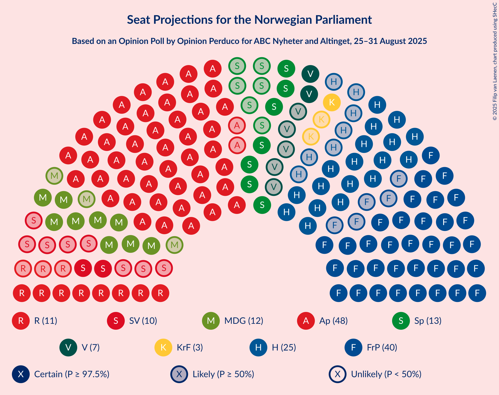
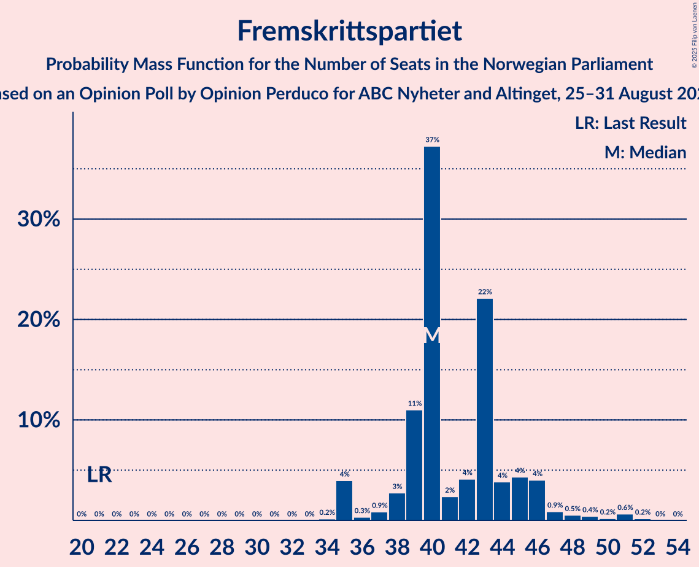
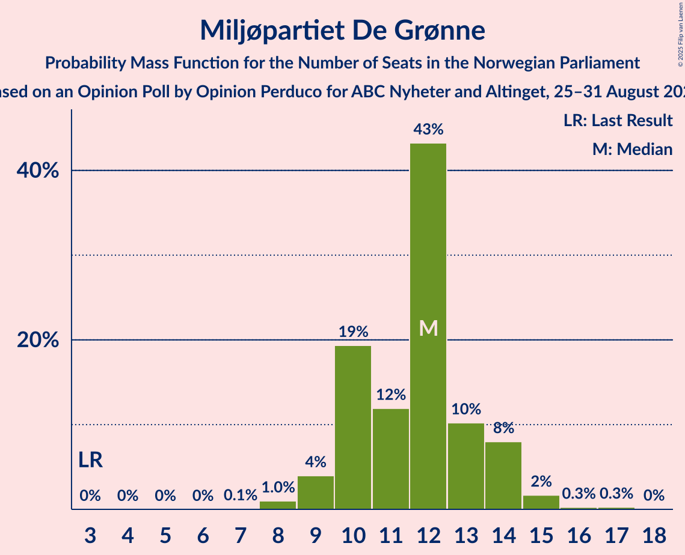
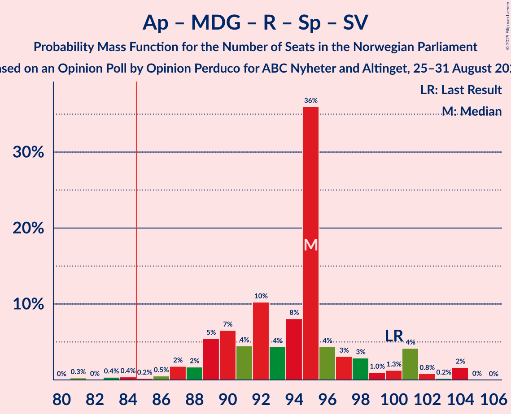
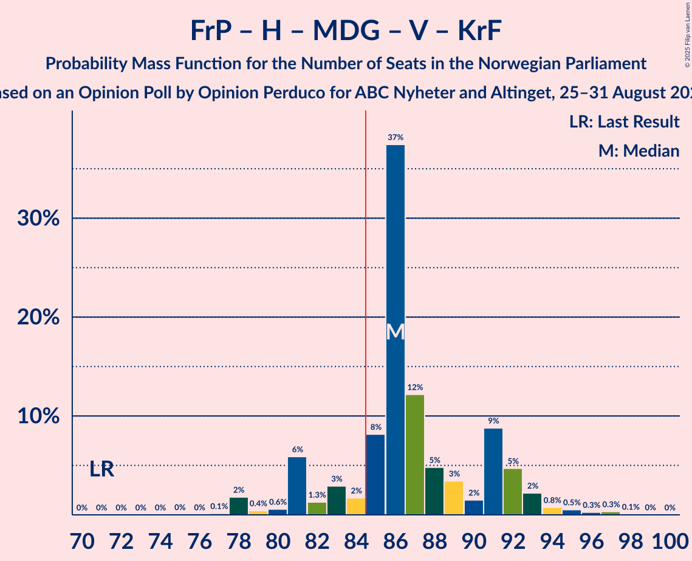
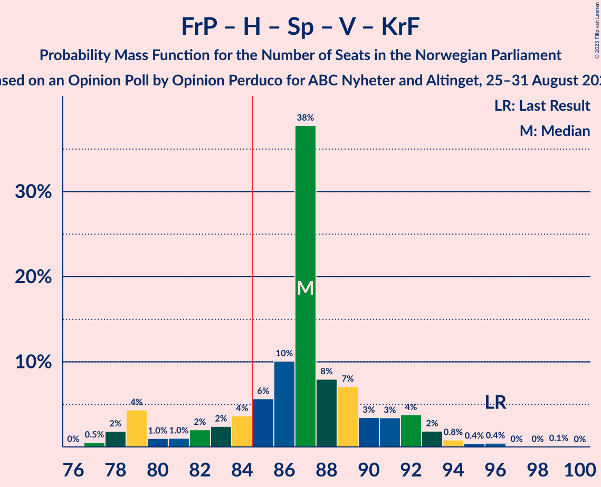
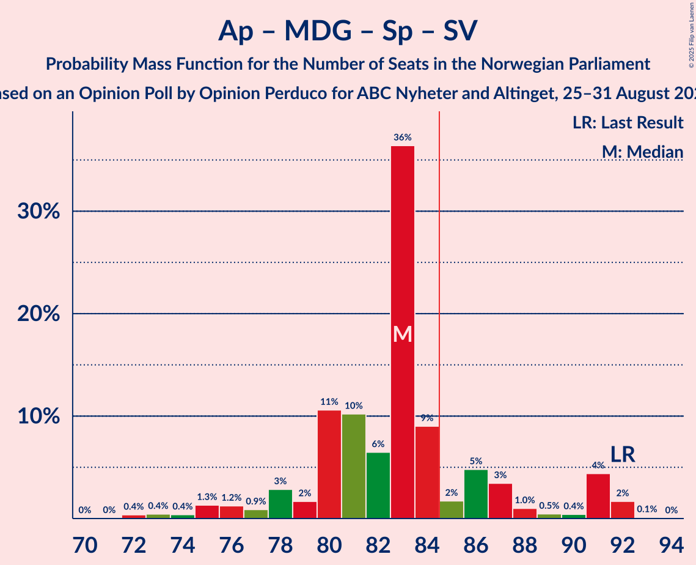
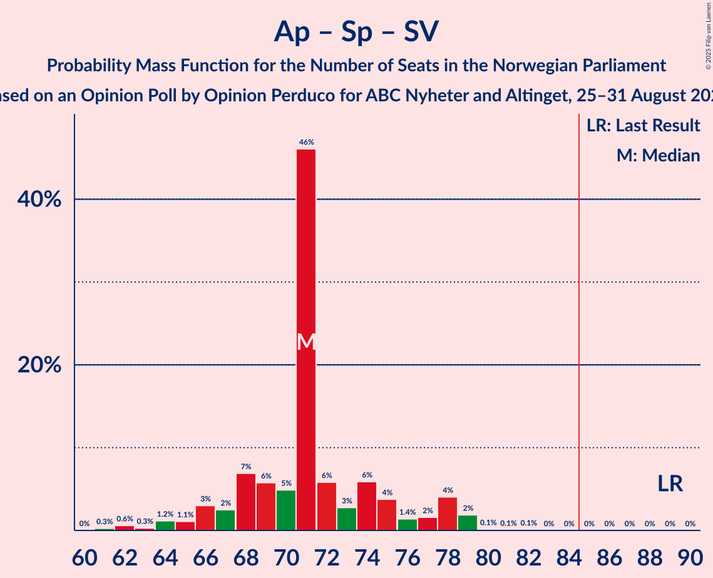
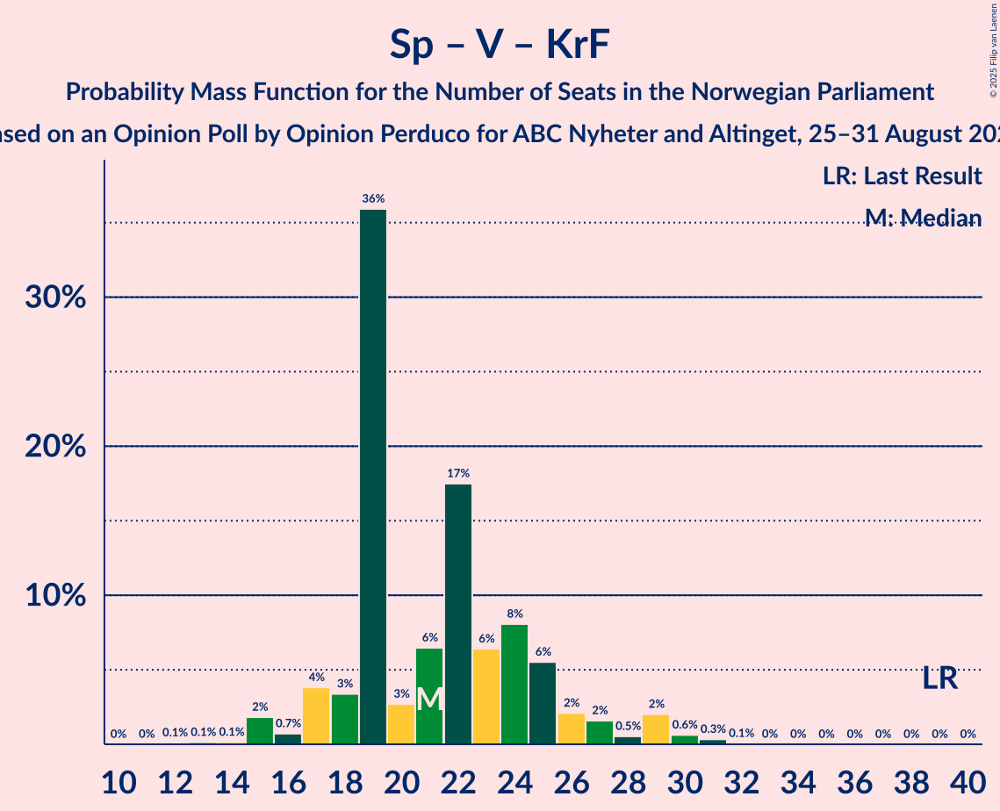

# Opinion Poll by Opinion Perduco for ABC Nyheter and Altinget, 25–31 August 2025

<a href="#voting-intentions">Voting Intentions</a> | <a href="#seats">Seats</a> | <a href="#coalitions">Coalitions</a> | <a href="#technical-information">Technical Information</a>

## Voting Intentions

### Confidence Intervals

| Party | Last Result | Poll Result | 80% Confidence Interval | 90% Confidence Interval | 95% Confidence Interval | 99% Confidence Interval |
|:-----:|:-----------:|:-----------:|:-----------------------:|:-----------------------:|:-----------------------:|:-----------------------:|
| Arbeiderpartiet | 26.2% | 26.6% | 24.7–28.6% |24.2–29.2% |23.7–29.7% |22.8–30.7% |
| Fremskrittspartiet | 11.6% | 22.4% | 20.6–24.3% |20.1–24.8% |19.7–25.3% |18.9–26.2% |
| Høyre | 20.4% | 13.4% | 12.0–15.0% |11.6–15.5% |11.3–15.9% |10.6–16.7% |
| Miljøpartiet De Grønne | 3.9% | 6.9% | 5.9–8.2% |5.7–8.6% |5.4–8.9% |5.0–9.5% |
| Rødt | 4.7% | 6.7% | 5.7–7.9% |5.4–8.3% |5.2–8.6% |4.8–9.2% |
| Senterpartiet | 13.5% | 6.5% | 5.5–7.7% |5.2–8.0% |5.0–8.3% |4.6–8.9% |
| Sosialistisk Venstreparti | 7.6% | 5.2% | 4.3–6.3% |4.1–6.6% |3.9–6.9% |3.5–7.5% |
| Venstre | 4.6% | 4.6% | 3.8–5.7% |3.6–5.9% |3.4–6.2% |3.0–6.8% |
| Kristelig Folkeparti | 3.8% | 3.6% | 2.9–4.6% |2.7–4.9% |2.6–5.1% |2.3–5.6% |
| Norgesdemokratene | 1.1% | 0.9% | 0.6–1.5% |0.5–1.7% |0.5–1.8% |0.4–2.2% |
| Konservativt | 0.4% | 0.5% | 0.3–0.9% |0.2–1.1% |0.2–1.2% |0.1–1.5% |
| Pensjonistpartiet | 0.6% | 0.5% | 0.3–0.9% |0.2–1.1% |0.2–1.2% |0.1–1.5% |
| Industri- og Næringspartiet | 0.3% | 0.5% | 0.3–0.9% |0.2–1.1% |0.2–1.2% |0.1–1.5% |

*Note:* The poll result column reflects the actual value used in the calculations. Published results may vary slightly, and in addition be rounded to fewer digits.

## Seats

### Confidence Intervals

| Party | Last Result | Median | 80% Confidence Interval | 90% Confidence Interval | 95% Confidence Interval | 99% Confidence Interval |
|:-----:|:-----------:|:------:|:-----------------------:|:-----------------------:|:-----------------------:|:-----------------------:|
| <a href="#arbeiderpartiet">Arbeiderpartiet</a> | 48 | 50 | 47–57 |47–59 |47–59 |45–61 |
| <a href="#fremskrittspartiet">Fremskrittspartiet</a> | 21 | 43 | 40–45 |39–46 |38–47 |36–51 |
| <a href="#høyre">Høyre</a> | 36 | 23 | 18–26 |17–27 |17–28 |17–30 |
| <a href="#miljøpartiet-de-grønne">Miljøpartiet De Grønne</a> | 3 | 12 | 9–13 |9–14 |9–14 |8–15 |
| <a href="#rødt">Rødt</a> | 8 | 10 | 8–12 |7–13 |7–14 |7–15 |
| <a href="#senterpartiet">Senterpartiet</a> | 28 | 10 | 7–13 |7–14 |7–14 |7–15 |
| <a href="#sosialistisk-venstreparti">Sosialistisk Venstreparti</a> | 13 | 8 | 7–10 |3–11 |2–11 |1–12 |
| <a href="#venstre">Venstre</a> | 8 | 7 | 3–9 |3–9 |2–10 |2–11 |
| <a href="#kristelig-folkeparti">Kristelig Folkeparti</a> | 3 | 6 | 2–7 |1–7 |1–8 |1–9 |
| <a href="#norgesdemokratene">Norgesdemokratene</a> | 0 | 0 | 0 |0 |0 |0 |
| <a href="#konservativt">Konservativt</a> | 0 | 0 | 0 |0 |0 |0 |
| <a href="#pensjonistpartiet">Pensjonistpartiet</a> | 0 | 0 | 0 |0 |0 |0 |
| <a href="#industri--og-næringspartiet">Industri- og Næringspartiet</a> | 0 | 0 | 0 |0 |0 |0 |

### Arbeiderpartiet

*For a full overview of the results for this party, see the [Arbeiderpartiet](party-arbeiderpartiet.html) page.*

| Number of Seats | Probability | Accumulated | Special Marks |
|:---------------:|:-----------:|:-----------:|:-------------:|
| 41 | 0% | 100% |  |
| 42 | 0% | 99.9% |  |
| 43 | 0.1% | 99.9% |  |
| 44 | 0.2% | 99.8% |  |
| 45 | 0.6% | 99.6% |  |
| 46 | 0.6% | 99.0% |  |
| 47 | 10% | 98% |  |
| 48 | 2% | 88% | Last Result |
| 49 | 10% | 87% |  |
| 50 | 34% | 77% | Median |
| 51 | 7% | 43% |  |
| 52 | 6% | 35% |  |
| 53 | 5% | 30% |  |
| 54 | 3% | 25% |  |
| 55 | 2% | 22% |  |
| 56 | 0.3% | 21% |  |
| 57 | 13% | 20% |  |
| 58 | 0.9% | 8% |  |
| 59 | 6% | 7% |  |
| 60 | 0.1% | 0.6% |  |
| 61 | 0.5% | 0.6% |  |
| 62 | 0% | 0% |  |

### Fremskrittspartiet

*For a full overview of the results for this party, see the [Fremskrittspartiet](party-fremskrittspartiet.html) page.*

| Number of Seats | Probability | Accumulated | Special Marks |
|:---------------:|:-----------:|:-----------:|:-------------:|
| 21 | 0% | 100% | Last Result |
| 22 | 0% | 100% |  |
| 23 | 0% | 100% |  |
| 24 | 0% | 100% |  |
| 25 | 0% | 100% |  |
| 26 | 0% | 100% |  |
| 27 | 0% | 100% |  |
| 28 | 0% | 100% |  |
| 29 | 0% | 100% |  |
| 30 | 0% | 100% |  |
| 31 | 0% | 100% |  |
| 32 | 0% | 100% |  |
| 33 | 0% | 100% |  |
| 34 | 0.3% | 100% |  |
| 35 | 0% | 99.7% |  |
| 36 | 0.2% | 99.7% |  |
| 37 | 1.0% | 99.4% |  |
| 38 | 3% | 98% |  |
| 39 | 1.1% | 95% |  |
| 40 | 7% | 94% |  |
| 41 | 1.2% | 87% |  |
| 42 | 10% | 86% |  |
| 43 | 47% | 76% | Median |
| 44 | 7% | 29% |  |
| 45 | 15% | 22% |  |
| 46 | 3% | 7% |  |
| 47 | 1.3% | 4% |  |
| 48 | 0.2% | 2% |  |
| 49 | 0.5% | 2% |  |
| 50 | 0.7% | 2% |  |
| 51 | 0.9% | 1.1% |  |
| 52 | 0.2% | 0.2% |  |
| 53 | 0% | 0% |  |

### Høyre

*For a full overview of the results for this party, see the [Høyre](party-høyre.html) page.*

| Number of Seats | Probability | Accumulated | Special Marks |
|:---------------:|:-----------:|:-----------:|:-------------:|
| 17 | 8% | 100% |  |
| 18 | 6% | 92% |  |
| 19 | 3% | 86% |  |
| 20 | 9% | 84% |  |
| 21 | 3% | 74% |  |
| 22 | 7% | 71% |  |
| 23 | 30% | 64% | Median |
| 24 | 5% | 34% |  |
| 25 | 11% | 29% |  |
| 26 | 12% | 18% |  |
| 27 | 3% | 6% |  |
| 28 | 2% | 3% |  |
| 29 | 0.6% | 1.2% |  |
| 30 | 0.4% | 0.5% |  |
| 31 | 0.1% | 0.1% |  |
| 32 | 0% | 0% |  |
| 33 | 0% | 0% |  |
| 34 | 0% | 0% |  |
| 35 | 0% | 0% |  |
| 36 | 0% | 0% | Last Result |

### Miljøpartiet De Grønne

*For a full overview of the results for this party, see the [Miljøpartiet De Grønne](party-miljøpartietdegrønne.html) page.*

| Number of Seats | Probability | Accumulated | Special Marks |
|:---------------:|:-----------:|:-----------:|:-------------:|
| 3 | 0% | 100% | Last Result |
| 4 | 0% | 100% |  |
| 5 | 0% | 100% |  |
| 6 | 0% | 100% |  |
| 7 | 0.1% | 100% |  |
| 8 | 0.9% | 99.9% |  |
| 9 | 9% | 98.9% |  |
| 10 | 12% | 90% |  |
| 11 | 22% | 78% |  |
| 12 | 36% | 56% | Median |
| 13 | 15% | 20% |  |
| 14 | 4% | 5% |  |
| 15 | 0.9% | 1.4% |  |
| 16 | 0.3% | 0.5% |  |
| 17 | 0.1% | 0.1% |  |
| 18 | 0% | 0% |  |

### Rødt

*For a full overview of the results for this party, see the [Rødt](party-rødt.html) page.*

| Number of Seats | Probability | Accumulated | Special Marks |
|:---------------:|:-----------:|:-----------:|:-------------:|
| 1 | 0.1% | 100% |  |
| 2 | 0% | 99.9% |  |
| 3 | 0% | 99.9% |  |
| 4 | 0% | 99.9% |  |
| 5 | 0% | 99.9% |  |
| 6 | 0.1% | 99.9% |  |
| 7 | 6% | 99.8% |  |
| 8 | 5% | 94% | Last Result |
| 9 | 5% | 89% |  |
| 10 | 45% | 83% | Median |
| 11 | 23% | 39% |  |
| 12 | 9% | 16% |  |
| 13 | 4% | 7% |  |
| 14 | 2% | 3% |  |
| 15 | 0.7% | 1.2% |  |
| 16 | 0.3% | 0.5% |  |
| 17 | 0.1% | 0.1% |  |
| 18 | 0% | 0% |  |

### Senterpartiet

*For a full overview of the results for this party, see the [Senterpartiet](party-senterpartiet.html) page.*

| Number of Seats | Probability | Accumulated | Special Marks |
|:---------------:|:-----------:|:-----------:|:-------------:|
| 6 | 0% | 100% |  |
| 7 | 11% | 99.9% |  |
| 8 | 9% | 89% |  |
| 9 | 9% | 80% |  |
| 10 | 34% | 71% | Median |
| 11 | 10% | 37% |  |
| 12 | 3% | 27% |  |
| 13 | 15% | 24% |  |
| 14 | 8% | 9% |  |
| 15 | 1.1% | 1.1% |  |
| 16 | 0.1% | 0.1% |  |
| 17 | 0% | 0% |  |
| 18 | 0% | 0% |  |
| 19 | 0% | 0% |  |
| 20 | 0% | 0% |  |
| 21 | 0% | 0% |  |
| 22 | 0% | 0% |  |
| 23 | 0% | 0% |  |
| 24 | 0% | 0% |  |
| 25 | 0% | 0% |  |
| 26 | 0% | 0% |  |
| 27 | 0% | 0% |  |
| 28 | 0% | 0% | Last Result |

### Sosialistisk Venstreparti

*For a full overview of the results for this party, see the [Sosialistisk Venstreparti](party-sosialistiskvenstreparti.html) page.*

| Number of Seats | Probability | Accumulated | Special Marks |
|:---------------:|:-----------:|:-----------:|:-------------:|
| 1 | 2% | 100% |  |
| 2 | 3% | 98% |  |
| 3 | 0.8% | 95% |  |
| 4 | 0% | 95% |  |
| 5 | 0% | 94% |  |
| 6 | 0% | 94% |  |
| 7 | 21% | 94% |  |
| 8 | 39% | 73% | Median |
| 9 | 18% | 34% |  |
| 10 | 10% | 16% |  |
| 11 | 5% | 6% |  |
| 12 | 0.5% | 0.5% |  |
| 13 | 0.1% | 0.1% | Last Result |
| 14 | 0% | 0% |  |

### Venstre

*For a full overview of the results for this party, see the [Venstre](party-venstre.html) page.*

| Number of Seats | Probability | Accumulated | Special Marks |
|:---------------:|:-----------:|:-----------:|:-------------:|
| 2 | 4% | 100% |  |
| 3 | 14% | 96% |  |
| 4 | 0% | 82% |  |
| 5 | 0% | 82% |  |
| 6 | 6% | 82% |  |
| 7 | 34% | 75% | Median |
| 8 | 20% | 41% | Last Result |
| 9 | 17% | 21% |  |
| 10 | 2% | 4% |  |
| 11 | 2% | 2% |  |
| 12 | 0.2% | 0.3% |  |
| 13 | 0.2% | 0.2% |  |
| 14 | 0% | 0% |  |

### Kristelig Folkeparti

*For a full overview of the results for this party, see the [Kristelig Folkeparti](party-kristeligfolkeparti.html) page.*

| Number of Seats | Probability | Accumulated | Special Marks |
|:---------------:|:-----------:|:-----------:|:-------------:|
| 0 | 0.2% | 100% |  |
| 1 | 5% | 99.8% |  |
| 2 | 20% | 95% |  |
| 3 | 20% | 75% | Last Result |
| 4 | 0% | 55% |  |
| 5 | 0% | 55% |  |
| 6 | 30% | 55% | Median |
| 7 | 21% | 25% |  |
| 8 | 2% | 4% |  |
| 9 | 2% | 2% |  |
| 10 | 0.2% | 0.2% |  |
| 11 | 0% | 0% |  |

### Norgesdemokratene

*For a full overview of the results for this party, see the [Norgesdemokratene](party-norgesdemokratene.html) page.*

| Number of Seats | Probability | Accumulated | Special Marks |
|:---------------:|:-----------:|:-----------:|:-------------:|
| 0 | 100% | 100% | Last Result, Median |

### Konservativt

*For a full overview of the results for this party, see the [Konservativt](party-konservativt.html) page.*

| Number of Seats | Probability | Accumulated | Special Marks |
|:---------------:|:-----------:|:-----------:|:-------------:|
| 0 | 100% | 100% | Last Result, Median |

### Pensjonistpartiet

*For a full overview of the results for this party, see the [Pensjonistpartiet](party-pensjonistpartiet.html) page.*

| Number of Seats | Probability | Accumulated | Special Marks |
|:---------------:|:-----------:|:-----------:|:-------------:|
| 0 | 100% | 100% | Last Result, Median |

### Industri- og Næringspartiet

*For a full overview of the results for this party, see the [Industri- og Næringspartiet](party-industri-ognæringspartiet.html) page.*

| Number of Seats | Probability | Accumulated | Special Marks |
|:---------------:|:-----------:|:-----------:|:-------------:|
| 0 | 100% | 100% | Last Result, Median |

## Coalitions

### Confidence Intervals

| Coalition | Last Result | Median | Majority? | 80% Confidence Interval | 90% Confidence Interval | 95% Confidence Interval | 99% Confidence Interval |
|:---------:|:-----------:|:------:|:---------:|:-----------------------:|:-----------------------:|:-----------------------:|:-----------------------:|
| Arbeiderpartiet – Miljøpartiet De Grønne – Rødt – Senterpartiet – Sosialistisk Venstreparti | 100 | 90 | 98% | 89–97 | 88–99 | 86–102 | 84–102 |
| Fremskrittspartiet – Høyre – Miljøpartiet De Grønne – Venstre – Kristelig Folkeparti | 71 | 89 | 88% | 83–93 | 81–93 | 81–94 | 80–96 |
| Arbeiderpartiet – Miljøpartiet De Grønne – Senterpartiet – Sosialistisk Venstreparti – Kristelig Folkeparti | 95 | 86 | 79% | 80–90 | 79–91 | 79–94 | 76–96 |
| Fremskrittspartiet – Høyre – Senterpartiet – Venstre – Kristelig Folkeparti | 96 | 89 | 76% | 82–92 | 80–93 | 77–94 | 77–96 |
| Arbeiderpartiet – Miljøpartiet De Grønne – Rødt – Sosialistisk Venstreparti | 72 | 80 | 24% | 77–87 | 76–89 | 75–92 | 73–92 |
| Arbeiderpartiet – Miljøpartiet De Grønne – Senterpartiet – Sosialistisk Venstreparti | 92 | 80 | 20% | 78–86 | 76–87 | 75–91 | 72–91 |
| Arbeiderpartiet – Rødt – Senterpartiet – Sosialistisk Venstreparti | 97 | 80 | 12% | 76–86 | 76–88 | 75–88 | 73–89 |
| Arbeiderpartiet – Miljøpartiet De Grønne – Senterpartiet – Kristelig Folkeparti | 82 | 78 | 4% | 71–82 | 71–83 | 69–86 | 69–88 |
| Fremskrittspartiet – Høyre – Venstre – Kristelig Folkeparti | 68 | 79 | 2% | 72–80 | 70–81 | 67–83 | 67–85 |
| Fremskrittspartiet – Høyre – Venstre | 65 | 73 | 0% | 69–78 | 66–78 | 64–78 | 64–81 |
| Arbeiderpartiet – Senterpartiet – Sosialistisk Venstreparti | 89 | 69 | 0% | 68–75 | 66–76 | 64–77 | 61–77 |
| Arbeiderpartiet – Senterpartiet – Kristelig Folkeparti | 79 | 66 | 0% | 62–71 | 60–72 | 59–73 | 59–75 |
| Fremskrittspartiet – Høyre | 57 | 66 | 0% | 62–69 | 62–70 | 60–71 | 56–73 |
| Arbeiderpartiet – Senterpartiet | 76 | 60 | 0% | 60–66 | 57–67 | 56–69 | 56–70 |
| Arbeiderpartiet – Sosialistisk Venstreparti | 61 | 58 | 0% | 56–64 | 56–66 | 54–67 | 51–69 |
| Høyre – Venstre – Kristelig Folkeparti | 47 | 35 | 0% | 29–38 | 26–38 | 25–40 | 25–42 |
| Senterpartiet – Venstre – Kristelig Folkeparti | 39 | 23 | 0% | 18–26 | 17–27 | 15–27 | 14–31 |

### Arbeiderpartiet – Miljøpartiet De Grønne – Rødt – Senterpartiet – Sosialistisk Venstreparti

| Number of Seats | Probability | Accumulated | Special Marks |
|:---------------:|:-----------:|:-----------:|:-------------:|
| 81 | 0% | 100% |  |
| 82 | 0% | 99.9% |  |
| 83 | 0.3% | 99.9% |  |
| 84 | 1.5% | 99.6% |  |
| 85 | 0.6% | 98% | Majority |
| 86 | 1.2% | 98% |  |
| 87 | 0.7% | 96% |  |
| 88 | 4% | 96% |  |
| 89 | 15% | 91% |  |
| 90 | 30% | 76% | Median |
| 91 | 3% | 46% |  |
| 92 | 10% | 43% |  |
| 93 | 6% | 33% |  |
| 94 | 8% | 28% |  |
| 95 | 1.4% | 20% |  |
| 96 | 6% | 18% |  |
| 97 | 3% | 12% |  |
| 98 | 3% | 9% |  |
| 99 | 2% | 6% |  |
| 100 | 0.5% | 4% | Last Result |
| 101 | 0.4% | 3% |  |
| 102 | 3% | 3% |  |
| 103 | 0.1% | 0.2% |  |
| 104 | 0% | 0% |  |

### Fremskrittspartiet – Høyre – Miljøpartiet De Grønne – Venstre – Kristelig Folkeparti

| Number of Seats | Probability | Accumulated | Special Marks |
|:---------------:|:-----------:|:-----------:|:-------------:|
| 71 | 0% | 100% | Last Result |
| 72 | 0% | 100% |  |
| 73 | 0% | 100% |  |
| 74 | 0% | 100% |  |
| 75 | 0% | 100% |  |
| 76 | 0% | 100% |  |
| 77 | 0% | 100% |  |
| 78 | 0% | 99.9% |  |
| 79 | 0.3% | 99.9% |  |
| 80 | 0.7% | 99.6% |  |
| 81 | 7% | 98.9% |  |
| 82 | 0.8% | 92% |  |
| 83 | 2% | 91% |  |
| 84 | 0.6% | 88% |  |
| 85 | 2% | 88% | Majority |
| 86 | 14% | 86% |  |
| 87 | 1.5% | 72% |  |
| 88 | 10% | 70% |  |
| 89 | 13% | 60% |  |
| 90 | 1.2% | 47% |  |
| 91 | 33% | 46% | Median |
| 92 | 2% | 13% |  |
| 93 | 7% | 11% |  |
| 94 | 2% | 3% |  |
| 95 | 0.7% | 2% |  |
| 96 | 0.7% | 1.1% |  |
| 97 | 0.1% | 0.4% |  |
| 98 | 0.3% | 0.4% |  |
| 99 | 0.1% | 0.1% |  |
| 100 | 0% | 0% |  |

### Arbeiderpartiet – Miljøpartiet De Grønne – Senterpartiet – Sosialistisk Venstreparti – Kristelig Folkeparti

| Number of Seats | Probability | Accumulated | Special Marks |
|:---------------:|:-----------:|:-----------:|:-------------:|
| 73 | 0.1% | 100% |  |
| 74 | 0.3% | 99.9% |  |
| 75 | 0% | 99.6% |  |
| 76 | 0.1% | 99.6% |  |
| 77 | 0.2% | 99.5% |  |
| 78 | 0.8% | 99.3% |  |
| 79 | 4% | 98% |  |
| 80 | 8% | 95% |  |
| 81 | 2% | 87% |  |
| 82 | 2% | 85% |  |
| 83 | 0.6% | 83% |  |
| 84 | 3% | 83% |  |
| 85 | 7% | 79% | Majority |
| 86 | 32% | 72% | Median |
| 87 | 6% | 40% |  |
| 88 | 2% | 34% |  |
| 89 | 21% | 32% |  |
| 90 | 5% | 11% |  |
| 91 | 1.4% | 5% |  |
| 92 | 0.2% | 4% |  |
| 93 | 0.4% | 4% |  |
| 94 | 3% | 3% |  |
| 95 | 0.4% | 0.9% | Last Result |
| 96 | 0.5% | 0.5% |  |
| 97 | 0% | 0% |  |

### Fremskrittspartiet – Høyre – Senterpartiet – Venstre – Kristelig Folkeparti

| Number of Seats | Probability | Accumulated | Special Marks |
|:---------------:|:-----------:|:-----------:|:-------------:|
| 76 | 0.1% | 100% |  |
| 77 | 3% | 99.9% |  |
| 78 | 0.5% | 97% |  |
| 79 | 0.1% | 97% |  |
| 80 | 4% | 97% |  |
| 81 | 3% | 93% |  |
| 82 | 0.6% | 90% |  |
| 83 | 6% | 90% |  |
| 84 | 8% | 84% |  |
| 85 | 6% | 76% | Majority |
| 86 | 2% | 70% |  |
| 87 | 4% | 69% |  |
| 88 | 5% | 65% |  |
| 89 | 34% | 59% | Median |
| 90 | 4% | 25% |  |
| 91 | 10% | 21% |  |
| 92 | 0.3% | 10% |  |
| 93 | 7% | 10% |  |
| 94 | 1.0% | 3% |  |
| 95 | 1.0% | 2% |  |
| 96 | 0.3% | 0.6% | Last Result |
| 97 | 0% | 0.3% |  |
| 98 | 0.1% | 0.2% |  |
| 99 | 0.1% | 0.2% |  |
| 100 | 0.1% | 0.1% |  |
| 101 | 0% | 0% |  |

### Arbeiderpartiet – Miljøpartiet De Grønne – Rødt – Sosialistisk Venstreparti

| Number of Seats | Probability | Accumulated | Special Marks |
|:---------------:|:-----------:|:-----------:|:-------------:|
| 69 | 0.1% | 100% |  |
| 70 | 0.1% | 99.9% |  |
| 71 | 0.1% | 99.8% |  |
| 72 | 0% | 99.7% | Last Result |
| 73 | 0.3% | 99.7% |  |
| 74 | 1.2% | 99.4% |  |
| 75 | 0.8% | 98% |  |
| 76 | 7% | 97% |  |
| 77 | 0.3% | 90% |  |
| 78 | 10% | 90% |  |
| 79 | 4% | 79% |  |
| 80 | 34% | 75% | Median |
| 81 | 5% | 41% |  |
| 82 | 4% | 35% |  |
| 83 | 2% | 31% |  |
| 84 | 6% | 30% |  |
| 85 | 8% | 24% | Majority |
| 86 | 6% | 16% |  |
| 87 | 0.6% | 10% |  |
| 88 | 3% | 10% |  |
| 89 | 4% | 7% |  |
| 90 | 0.1% | 3% |  |
| 91 | 0.5% | 3% |  |
| 92 | 3% | 3% |  |
| 93 | 0.1% | 0.1% |  |
| 94 | 0% | 0% |  |

### Arbeiderpartiet – Miljøpartiet De Grønne – Senterpartiet – Sosialistisk Venstreparti

| Number of Seats | Probability | Accumulated | Special Marks |
|:---------------:|:-----------:|:-----------:|:-------------:|
| 70 | 0.1% | 100% |  |
| 71 | 0% | 99.9% |  |
| 72 | 0.4% | 99.8% |  |
| 73 | 1.0% | 99.5% |  |
| 74 | 0.3% | 98.5% |  |
| 75 | 0.9% | 98% |  |
| 76 | 4% | 97% |  |
| 77 | 2% | 93% |  |
| 78 | 8% | 91% |  |
| 79 | 0.8% | 83% |  |
| 80 | 33% | 82% | Median |
| 81 | 1.2% | 49% |  |
| 82 | 16% | 47% |  |
| 83 | 9% | 31% |  |
| 84 | 3% | 23% |  |
| 85 | 1.1% | 20% | Majority |
| 86 | 12% | 19% |  |
| 87 | 3% | 7% |  |
| 88 | 0.5% | 4% |  |
| 89 | 0.1% | 3% |  |
| 90 | 0.6% | 3% |  |
| 91 | 2% | 3% |  |
| 92 | 0.1% | 0.1% | Last Result |
| 93 | 0% | 0.1% |  |
| 94 | 0% | 0% |  |

### Arbeiderpartiet – Rødt – Senterpartiet – Sosialistisk Venstreparti

| Number of Seats | Probability | Accumulated | Special Marks |
|:---------------:|:-----------:|:-----------:|:-------------:|
| 70 | 0.1% | 100% |  |
| 71 | 0.3% | 99.9% |  |
| 72 | 0.1% | 99.6% |  |
| 73 | 0.7% | 99.6% |  |
| 74 | 0.7% | 98.8% |  |
| 75 | 2% | 98% |  |
| 76 | 7% | 96% |  |
| 77 | 3% | 89% |  |
| 78 | 33% | 87% | Median |
| 79 | 1.2% | 54% |  |
| 80 | 13% | 53% |  |
| 81 | 10% | 40% |  |
| 82 | 1.5% | 30% |  |
| 83 | 14% | 28% |  |
| 84 | 2% | 14% |  |
| 85 | 0.6% | 12% | Majority |
| 86 | 2% | 12% |  |
| 87 | 0.8% | 9% |  |
| 88 | 7% | 8% |  |
| 89 | 0.7% | 1.1% |  |
| 90 | 0.3% | 0.4% |  |
| 91 | 0% | 0.1% |  |
| 92 | 0% | 0.1% |  |
| 93 | 0% | 0% |  |
| 94 | 0% | 0% |  |
| 95 | 0% | 0% |  |
| 96 | 0% | 0% |  |
| 97 | 0% | 0% | Last Result |

### Arbeiderpartiet – Miljøpartiet De Grønne – Senterpartiet – Kristelig Folkeparti

| Number of Seats | Probability | Accumulated | Special Marks |
|:---------------:|:-----------:|:-----------:|:-------------:|
| 67 | 0% | 100% |  |
| 68 | 0.2% | 99.9% |  |
| 69 | 4% | 99.7% |  |
| 70 | 0.4% | 96% |  |
| 71 | 7% | 96% |  |
| 72 | 1.1% | 88% |  |
| 73 | 2% | 87% |  |
| 74 | 0.9% | 85% |  |
| 75 | 2% | 84% |  |
| 76 | 3% | 82% |  |
| 77 | 5% | 80% |  |
| 78 | 38% | 75% | Median |
| 79 | 4% | 38% |  |
| 80 | 10% | 34% |  |
| 81 | 2% | 24% |  |
| 82 | 15% | 23% | Last Result |
| 83 | 3% | 8% |  |
| 84 | 0.7% | 5% |  |
| 85 | 0.6% | 4% | Majority |
| 86 | 3% | 3% |  |
| 87 | 0.1% | 0.8% |  |
| 88 | 0.5% | 0.7% |  |
| 89 | 0% | 0.2% |  |
| 90 | 0% | 0.2% |  |
| 91 | 0% | 0.2% |  |
| 92 | 0% | 0.2% |  |
| 93 | 0.2% | 0.2% |  |
| 94 | 0% | 0% |  |

### Fremskrittspartiet – Høyre – Venstre – Kristelig Folkeparti

| Number of Seats | Probability | Accumulated | Special Marks |
|:---------------:|:-----------:|:-----------:|:-------------:|
| 66 | 0.1% | 100% |  |
| 67 | 3% | 99.8% |  |
| 68 | 0.4% | 97% | Last Result |
| 69 | 0.5% | 97% |  |
| 70 | 2% | 96% |  |
| 71 | 3% | 94% |  |
| 72 | 3% | 91% |  |
| 73 | 6% | 88% |  |
| 74 | 1.4% | 82% |  |
| 75 | 8% | 80% |  |
| 76 | 6% | 72% |  |
| 77 | 10% | 66% |  |
| 78 | 3% | 57% |  |
| 79 | 30% | 54% | Median |
| 80 | 15% | 24% |  |
| 81 | 4% | 9% |  |
| 82 | 0.5% | 4% |  |
| 83 | 1.2% | 4% |  |
| 84 | 0.6% | 2% |  |
| 85 | 1.5% | 2% | Majority |
| 86 | 0.3% | 0.3% |  |
| 87 | 0% | 0.1% |  |
| 88 | 0% | 0% |  |

### Fremskrittspartiet – Høyre – Venstre

| Number of Seats | Probability | Accumulated | Special Marks |
|:---------------:|:-----------:|:-----------:|:-------------:|
| 61 | 0.2% | 100% |  |
| 62 | 0% | 99.8% |  |
| 63 | 0.1% | 99.7% |  |
| 64 | 3% | 99.7% |  |
| 65 | 0.6% | 96% | Last Result |
| 66 | 0.8% | 96% |  |
| 67 | 2% | 95% |  |
| 68 | 0.7% | 93% |  |
| 69 | 4% | 93% |  |
| 70 | 17% | 88% |  |
| 71 | 3% | 71% |  |
| 72 | 4% | 69% |  |
| 73 | 44% | 64% | Median |
| 74 | 3% | 20% |  |
| 75 | 0.9% | 17% |  |
| 76 | 0.8% | 16% |  |
| 77 | 2% | 15% |  |
| 78 | 11% | 14% |  |
| 79 | 0.6% | 2% |  |
| 80 | 0.3% | 2% |  |
| 81 | 1.1% | 1.4% |  |
| 82 | 0.2% | 0.3% |  |
| 83 | 0% | 0% |  |

### Arbeiderpartiet – Senterpartiet – Sosialistisk Venstreparti

| Number of Seats | Probability | Accumulated | Special Marks |
|:---------------:|:-----------:|:-----------:|:-------------:|
| 59 | 0.1% | 100% |  |
| 60 | 0% | 99.9% |  |
| 61 | 0.6% | 99.8% |  |
| 62 | 0.4% | 99.3% |  |
| 63 | 0.9% | 98.9% |  |
| 64 | 2% | 98% |  |
| 65 | 0.4% | 96% |  |
| 66 | 4% | 96% |  |
| 67 | 2% | 92% |  |
| 68 | 32% | 90% | Median |
| 69 | 17% | 58% |  |
| 70 | 3% | 40% |  |
| 71 | 8% | 37% |  |
| 72 | 8% | 29% |  |
| 73 | 6% | 22% |  |
| 74 | 2% | 15% |  |
| 75 | 4% | 14% |  |
| 76 | 5% | 9% |  |
| 77 | 4% | 4% |  |
| 78 | 0.2% | 0.4% |  |
| 79 | 0.1% | 0.2% |  |
| 80 | 0% | 0.1% |  |
| 81 | 0% | 0.1% |  |
| 82 | 0% | 0% |  |
| 83 | 0% | 0% |  |
| 84 | 0% | 0% |  |
| 85 | 0% | 0% | Majority |
| 86 | 0% | 0% |  |
| 87 | 0% | 0% |  |
| 88 | 0% | 0% |  |
| 89 | 0% | 0% | Last Result |

### Arbeiderpartiet – Senterpartiet – Kristelig Folkeparti

| Number of Seats | Probability | Accumulated | Special Marks |
|:---------------:|:-----------:|:-----------:|:-------------:|
| 56 | 0.1% | 100% |  |
| 57 | 0.2% | 99.9% |  |
| 58 | 0.1% | 99.7% |  |
| 59 | 3% | 99.6% |  |
| 60 | 1.5% | 96% |  |
| 61 | 0.8% | 95% |  |
| 62 | 9% | 94% |  |
| 63 | 2% | 85% |  |
| 64 | 3% | 84% |  |
| 65 | 1.0% | 80% |  |
| 66 | 30% | 79% | Median |
| 67 | 18% | 49% |  |
| 68 | 5% | 31% |  |
| 69 | 9% | 26% |  |
| 70 | 2% | 17% |  |
| 71 | 8% | 16% |  |
| 72 | 4% | 7% |  |
| 73 | 2% | 3% |  |
| 74 | 0.1% | 1.1% |  |
| 75 | 0.5% | 1.0% |  |
| 76 | 0% | 0.5% |  |
| 77 | 0.2% | 0.4% |  |
| 78 | 0.2% | 0.2% |  |
| 79 | 0% | 0% | Last Result |

### Fremskrittspartiet – Høyre

| Number of Seats | Probability | Accumulated | Special Marks |
|:---------------:|:-----------:|:-----------:|:-------------:|
| 54 | 0.1% | 100% |  |
| 55 | 0.4% | 99.9% |  |
| 56 | 0.6% | 99.5% |  |
| 57 | 0.1% | 98.9% | Last Result |
| 58 | 0.4% | 98.8% |  |
| 59 | 0.7% | 98% |  |
| 60 | 2% | 98% |  |
| 61 | 0.3% | 96% |  |
| 62 | 16% | 96% |  |
| 63 | 4% | 80% |  |
| 64 | 4% | 76% |  |
| 65 | 6% | 72% |  |
| 66 | 33% | 66% | Median |
| 67 | 12% | 33% |  |
| 68 | 1.3% | 21% |  |
| 69 | 13% | 20% |  |
| 70 | 2% | 7% |  |
| 71 | 3% | 5% |  |
| 72 | 1.0% | 1.5% |  |
| 73 | 0.4% | 0.5% |  |
| 74 | 0.1% | 0.1% |  |
| 75 | 0% | 0% |  |

### Arbeiderpartiet – Senterpartiet

| Number of Seats | Probability | Accumulated | Special Marks |
|:---------------:|:-----------:|:-----------:|:-------------:|
| 52 | 0% | 100% |  |
| 53 | 0% | 99.9% |  |
| 54 | 0.1% | 99.9% |  |
| 55 | 0.3% | 99.8% |  |
| 56 | 4% | 99.6% |  |
| 57 | 1.4% | 96% |  |
| 58 | 1.2% | 94% |  |
| 59 | 2% | 93% |  |
| 60 | 44% | 91% | Median |
| 61 | 5% | 48% |  |
| 62 | 3% | 43% |  |
| 63 | 2% | 39% |  |
| 64 | 12% | 37% |  |
| 65 | 8% | 26% |  |
| 66 | 11% | 18% |  |
| 67 | 3% | 7% |  |
| 68 | 0.4% | 4% |  |
| 69 | 3% | 3% |  |
| 70 | 0.5% | 0.6% |  |
| 71 | 0% | 0.1% |  |
| 72 | 0% | 0.1% |  |
| 73 | 0.1% | 0.1% |  |
| 74 | 0% | 0% |  |
| 75 | 0% | 0% |  |
| 76 | 0% | 0% | Last Result |

### Arbeiderpartiet – Sosialistisk Venstreparti

| Number of Seats | Probability | Accumulated | Special Marks |
|:---------------:|:-----------:|:-----------:|:-------------:|
| 46 | 0.1% | 100% |  |
| 47 | 0% | 99.9% |  |
| 48 | 0% | 99.9% |  |
| 49 | 0.1% | 99.9% |  |
| 50 | 0.3% | 99.8% |  |
| 51 | 0.6% | 99.5% |  |
| 52 | 0.5% | 99.0% |  |
| 53 | 0.9% | 98% |  |
| 54 | 2% | 98% |  |
| 55 | 0.3% | 95% |  |
| 56 | 10% | 95% |  |
| 57 | 4% | 86% |  |
| 58 | 40% | 81% | Median |
| 59 | 2% | 41% |  |
| 60 | 7% | 39% |  |
| 61 | 3% | 33% | Last Result |
| 62 | 8% | 30% |  |
| 63 | 0.6% | 22% |  |
| 64 | 14% | 22% |  |
| 65 | 0.1% | 8% |  |
| 66 | 4% | 8% |  |
| 67 | 3% | 4% |  |
| 68 | 0.4% | 1.1% |  |
| 69 | 0.6% | 0.7% |  |
| 70 | 0% | 0% |  |

### Høyre – Venstre – Kristelig Folkeparti

| Number of Seats | Probability | Accumulated | Special Marks |
|:---------------:|:-----------:|:-----------:|:-------------:|
| 23 | 0.2% | 100% |  |
| 24 | 0.3% | 99.8% |  |
| 25 | 3% | 99.6% |  |
| 26 | 2% | 97% |  |
| 27 | 2% | 95% |  |
| 28 | 0.8% | 93% |  |
| 29 | 8% | 93% |  |
| 30 | 1.3% | 85% |  |
| 31 | 2% | 84% |  |
| 32 | 15% | 82% |  |
| 33 | 3% | 67% |  |
| 34 | 1.4% | 64% |  |
| 35 | 13% | 63% |  |
| 36 | 30% | 50% | Median |
| 37 | 9% | 19% |  |
| 38 | 7% | 11% |  |
| 39 | 0.8% | 4% |  |
| 40 | 0.9% | 3% |  |
| 41 | 0.2% | 2% |  |
| 42 | 1.3% | 2% |  |
| 43 | 0.1% | 0.4% |  |
| 44 | 0.3% | 0.3% |  |
| 45 | 0% | 0.1% |  |
| 46 | 0% | 0% |  |
| 47 | 0% | 0% | Last Result |

### Senterpartiet – Venstre – Kristelig Folkeparti

| Number of Seats | Probability | Accumulated | Special Marks |
|:---------------:|:-----------:|:-----------:|:-------------:|
| 12 | 0.3% | 100% |  |
| 13 | 0.1% | 99.7% |  |
| 14 | 0.5% | 99.5% |  |
| 15 | 3% | 99.1% |  |
| 16 | 0.9% | 96% |  |
| 17 | 2% | 96% |  |
| 18 | 16% | 94% |  |
| 19 | 0.6% | 78% |  |
| 20 | 4% | 77% |  |
| 21 | 6% | 73% |  |
| 22 | 16% | 67% |  |
| 23 | 32% | 51% | Median |
| 24 | 4% | 19% |  |
| 25 | 3% | 15% |  |
| 26 | 7% | 12% |  |
| 27 | 3% | 5% |  |
| 28 | 0.2% | 2% |  |
| 29 | 1.0% | 2% |  |
| 30 | 0.5% | 1.1% |  |
| 31 | 0.5% | 0.6% |  |
| 32 | 0% | 0% |  |
| 33 | 0% | 0% |  |
| 34 | 0% | 0% |  |
| 35 | 0% | 0% |  |
| 36 | 0% | 0% |  |
| 37 | 0% | 0% |  |
| 38 | 0% | 0% |  |
| 39 | 0% | 0% | Last Result |

## Technical Information

### Opinion Poll

+ **Polling firm:** Opinion Perduco
+ **Commissioner(s):** ABC Nyheter and Altinget
+ **Fieldwork period:** 25–31 August 2025

### Calculations

+ **Sample size:** 850
+ **Simulations done:** 524,288
+ **Error estimate:** 2.15%

