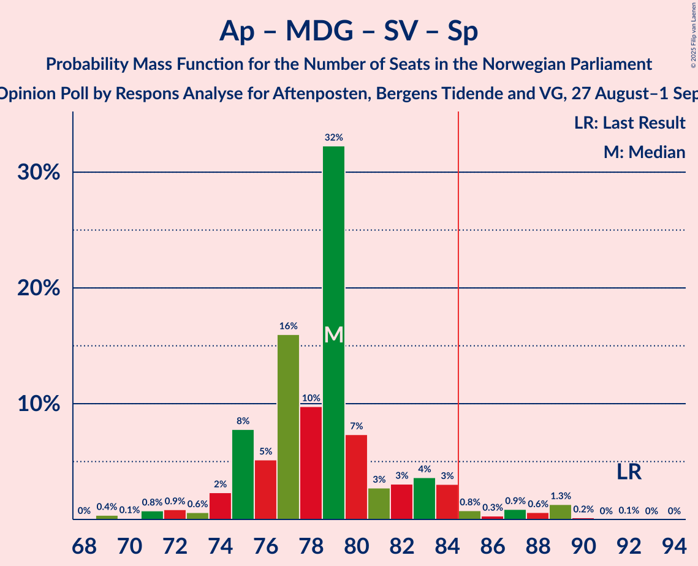

# Opinion Poll by Respons Analyse for Aftenposten, Bergens Tidende and VG, 27 August–1 September 2025

<a href="#voting-intentions">Voting Intentions</a> | <a href="#seats">Seats</a> | <a href="#coalitions">Coalitions</a> | <a href="#technical-information">Technical Information</a>

## Voting Intentions

### Confidence Intervals

| Party | Last Result | Poll Result | 80% Confidence Interval | 90% Confidence Interval | 95% Confidence Interval | 99% Confidence Interval |
|:-----:|:-----------:|:-----------:|:-----------------------:|:-----------------------:|:-----------------------:|:-----------------------:|
| Arbeiderpartiet | 26.2% | 26.6% | 24.7–28.6% |24.2–29.1% |23.7–29.6% |22.8–30.6% |
| Fremskrittspartiet | 11.6% | 20.3% | 18.6–22.1% |18.2–22.7% |17.7–23.1% |17.0–24.0% |
| Høyre | 20.4% | 14.7% | 13.3–16.4% |12.9–16.9% |12.5–17.3% |11.9–18.1% |
| Miljøpartiet De Grønne | 3.9% | 7.1% | 6.1–8.3% |5.8–8.7% |5.5–9.0% |5.1–9.6% |
| Rødt | 4.7% | 6.6% | 5.6–7.8% |5.4–8.2% |5.1–8.5% |4.7–9.1% |
| Sosialistisk Venstreparti | 7.6% | 6.1% | 5.2–7.3% |5.0–7.7% |4.7–8.0% |4.3–8.6% |
| Senterpartiet | 13.5% | 4.8% | 3.9–5.8% |3.7–6.1% |3.5–6.4% |3.2–7.0% |
| Venstre | 4.6% | 4.6% | 3.8–5.7% |3.6–6.0% |3.4–6.3% |3.1–6.8% |
| Kristelig Folkeparti | 3.8% | 4.6% | 3.8–5.7% |3.6–6.0% |3.4–6.3% |3.1–6.8% |
| Konservativt | 0.4% | 1.0% | 0.7–1.6% |0.6–1.8% |0.5–2.0% |0.4–2.3% |
| Pensjonistpartiet | 0.6% | 0.9% | 0.6–1.5% |0.5–1.7% |0.5–1.8% |0.4–2.1% |
| Industri- og Næringspartiet | 0.3% | 0.7% | 0.4–1.2% |0.4–1.4% |0.3–1.5% |0.2–1.8% |
| Norgesdemokratene | 1.1% | 0.3% | 0.2–0.8% |0.2–0.9% |0.1–1.0% |0.1–1.3% |

*Note:* The poll result column reflects the actual value used in the calculations. Published results may vary slightly, and in addition be rounded to fewer digits.

## Seats

### Confidence Intervals

| Party | Last Result | Median | 80% Confidence Interval | 90% Confidence Interval | 95% Confidence Interval | 99% Confidence Interval |
|:-----:|:-----------:|:------:|:-----------------------:|:-----------------------:|:-----------------------:|:-----------------------:|
| <a href="#arbeiderpartiet">Arbeiderpartiet</a> | 48 | 50 | 49–54 |49–56 |48–59 |46–61 |
| <a href="#fremskrittspartiet">Fremskrittspartiet</a> | 21 | 40 | 37–43 |37–43 |35–46 |34–47 |
| <a href="#høyre">Høyre</a> | 36 | 27 | 22–30 |21–30 |21–30 |19–33 |
| <a href="#miljøpartiet-de-grønne">Miljøpartiet De Grønne</a> | 3 | 11 | 9–12 |9–13 |9–14 |8–15 |
| <a href="#rødt">Rødt</a> | 8 | 10 | 9–12 |9–12 |8–14 |7–16 |
| <a href="#sosialistisk-venstreparti">Sosialistisk Venstreparti</a> | 13 | 10 | 9–11 |7–11 |7–11 |7–13 |
| <a href="#senterpartiet">Senterpartiet</a> | 28 | 7 | 6–9 |1–9 |1–12 |0–13 |
| <a href="#venstre">Venstre</a> | 8 | 7 | 3–8 |3–9 |3–9 |2–11 |
| <a href="#kristelig-folkeparti">Kristelig Folkeparti</a> | 3 | 7 | 3–8 |3–9 |3–9 |2–11 |
| <a href="#konservativt">Konservativt</a> | 0 | 0 | 0 |0 |0 |0 |
| <a href="#pensjonistpartiet">Pensjonistpartiet</a> | 0 | 0 | 0 |0 |0 |0 |
| <a href="#industri--og-næringspartiet">Industri- og Næringspartiet</a> | 0 | 0 | 0 |0 |0 |0 |
| <a href="#norgesdemokratene">Norgesdemokratene</a> | 0 | 0 | 0 |0 |0 |0 |

### Arbeiderpartiet

*For a full overview of the results for this party, see the [Arbeiderpartiet](party-arbeiderpartiet.html) page.*

| Number of Seats | Probability | Accumulated | Special Marks |
|:---------------:|:-----------:|:-----------:|:-------------:|
| 43 | 0.1% | 100% |  |
| 44 | 0% | 99.9% |  |
| 45 | 0.2% | 99.9% |  |
| 46 | 0.4% | 99.6% |  |
| 47 | 1.1% | 99.3% |  |
| 48 | 2% | 98% | Last Result |
| 49 | 11% | 97% |  |
| 50 | 45% | 86% | Median |
| 51 | 10% | 41% |  |
| 52 | 11% | 31% |  |
| 53 | 5% | 20% |  |
| 54 | 6% | 15% |  |
| 55 | 3% | 9% |  |
| 56 | 2% | 6% |  |
| 57 | 0.5% | 4% |  |
| 58 | 0.5% | 4% |  |
| 59 | 2% | 3% |  |
| 60 | 0.6% | 2% |  |
| 61 | 0.7% | 1.0% |  |
| 62 | 0% | 0.2% |  |
| 63 | 0.1% | 0.2% |  |
| 64 | 0.1% | 0.1% |  |
| 65 | 0% | 0% |  |

### Fremskrittspartiet

*For a full overview of the results for this party, see the [Fremskrittspartiet](party-fremskrittspartiet.html) page.*

| Number of Seats | Probability | Accumulated | Special Marks |
|:---------------:|:-----------:|:-----------:|:-------------:|
| 21 | 0% | 100% | Last Result |
| 22 | 0% | 100% |  |
| 23 | 0% | 100% |  |
| 24 | 0% | 100% |  |
| 25 | 0% | 100% |  |
| 26 | 0% | 100% |  |
| 27 | 0% | 100% |  |
| 28 | 0% | 100% |  |
| 29 | 0% | 100% |  |
| 30 | 0% | 100% |  |
| 31 | 0% | 100% |  |
| 32 | 0% | 100% |  |
| 33 | 0.3% | 99.9% |  |
| 34 | 1.5% | 99.7% |  |
| 35 | 0.8% | 98% |  |
| 36 | 1.3% | 97% |  |
| 37 | 10% | 96% |  |
| 38 | 3% | 86% |  |
| 39 | 16% | 83% |  |
| 40 | 50% | 67% | Median |
| 41 | 2% | 16% |  |
| 42 | 4% | 15% |  |
| 43 | 6% | 11% |  |
| 44 | 0.3% | 5% |  |
| 45 | 0.1% | 5% |  |
| 46 | 3% | 5% |  |
| 47 | 1.4% | 1.5% |  |
| 48 | 0% | 0% |  |

### Høyre

*For a full overview of the results for this party, see the [Høyre](party-høyre.html) page.*

| Number of Seats | Probability | Accumulated | Special Marks |
|:---------------:|:-----------:|:-----------:|:-------------:|
| 18 | 0.2% | 100% |  |
| 19 | 0.6% | 99.7% |  |
| 20 | 0.8% | 99.1% |  |
| 21 | 6% | 98% |  |
| 22 | 3% | 92% |  |
| 23 | 9% | 90% |  |
| 24 | 2% | 81% |  |
| 25 | 9% | 79% |  |
| 26 | 9% | 70% |  |
| 27 | 16% | 61% | Median |
| 28 | 2% | 45% |  |
| 29 | 3% | 43% |  |
| 30 | 38% | 41% |  |
| 31 | 1.0% | 2% |  |
| 32 | 0.7% | 1.2% |  |
| 33 | 0.3% | 0.5% |  |
| 34 | 0% | 0.3% |  |
| 35 | 0.2% | 0.2% |  |
| 36 | 0% | 0% | Last Result |

### Miljøpartiet De Grønne

*For a full overview of the results for this party, see the [Miljøpartiet De Grønne](party-miljøpartietdegrønne.html) page.*

| Number of Seats | Probability | Accumulated | Special Marks |
|:---------------:|:-----------:|:-----------:|:-------------:|
| 3 | 0% | 100% | Last Result |
| 4 | 0% | 100% |  |
| 5 | 0% | 100% |  |
| 6 | 0% | 100% |  |
| 7 | 0.1% | 100% |  |
| 8 | 2% | 99.9% |  |
| 9 | 20% | 98% |  |
| 10 | 23% | 78% |  |
| 11 | 34% | 56% | Median |
| 12 | 13% | 22% |  |
| 13 | 6% | 9% |  |
| 14 | 2% | 3% |  |
| 15 | 0.6% | 0.9% |  |
| 16 | 0.2% | 0.3% |  |
| 17 | 0% | 0.1% |  |
| 18 | 0% | 0% |  |

### Rødt

*For a full overview of the results for this party, see the [Rødt](party-rødt.html) page.*

| Number of Seats | Probability | Accumulated | Special Marks |
|:---------------:|:-----------:|:-----------:|:-------------:|
| 7 | 2% | 100% |  |
| 8 | 3% | 98% | Last Result |
| 9 | 21% | 95% |  |
| 10 | 32% | 75% | Median |
| 11 | 17% | 43% |  |
| 12 | 21% | 26% |  |
| 13 | 2% | 5% |  |
| 14 | 2% | 3% |  |
| 15 | 0.2% | 1.0% |  |
| 16 | 0.8% | 0.8% |  |
| 17 | 0% | 0% |  |

### Sosialistisk Venstreparti

*For a full overview of the results for this party, see the [Sosialistisk Venstreparti](party-sosialistiskvenstreparti.html) page.*

| Number of Seats | Probability | Accumulated | Special Marks |
|:---------------:|:-----------:|:-----------:|:-------------:|
| 6 | 0.1% | 100% |  |
| 7 | 5% | 99.9% |  |
| 8 | 4% | 95% |  |
| 9 | 27% | 91% |  |
| 10 | 24% | 63% | Median |
| 11 | 37% | 39% |  |
| 12 | 1.2% | 2% |  |
| 13 | 0.4% | 0.8% | Last Result |
| 14 | 0.3% | 0.4% |  |
| 15 | 0.1% | 0.1% |  |
| 16 | 0% | 0% |  |

### Senterpartiet

*For a full overview of the results for this party, see the [Senterpartiet](party-senterpartiet.html) page.*

| Number of Seats | Probability | Accumulated | Special Marks |
|:---------------:|:-----------:|:-----------:|:-------------:|
| 0 | 0.8% | 100% |  |
| 1 | 8% | 99.2% |  |
| 2 | 0.2% | 91% |  |
| 3 | 0.7% | 91% |  |
| 4 | 0% | 91% |  |
| 5 | 0% | 91% |  |
| 6 | 15% | 91% |  |
| 7 | 34% | 76% | Median |
| 8 | 30% | 42% |  |
| 9 | 8% | 12% |  |
| 10 | 0.3% | 4% |  |
| 11 | 0.6% | 3% |  |
| 12 | 0.8% | 3% |  |
| 13 | 2% | 2% |  |
| 14 | 0.1% | 0.1% |  |
| 15 | 0% | 0% |  |
| 16 | 0% | 0% |  |
| 17 | 0% | 0% |  |
| 18 | 0% | 0% |  |
| 19 | 0% | 0% |  |
| 20 | 0% | 0% |  |
| 21 | 0% | 0% |  |
| 22 | 0% | 0% |  |
| 23 | 0% | 0% |  |
| 24 | 0% | 0% |  |
| 25 | 0% | 0% |  |
| 26 | 0% | 0% |  |
| 27 | 0% | 0% |  |
| 28 | 0% | 0% | Last Result |

### Venstre

*For a full overview of the results for this party, see the [Venstre](party-venstre.html) page.*

| Number of Seats | Probability | Accumulated | Special Marks |
|:---------------:|:-----------:|:-----------:|:-------------:|
| 2 | 2% | 100% |  |
| 3 | 29% | 98% |  |
| 4 | 0% | 69% |  |
| 5 | 0% | 69% |  |
| 6 | 5% | 69% |  |
| 7 | 22% | 63% | Median |
| 8 | 32% | 41% | Last Result |
| 9 | 7% | 9% |  |
| 10 | 0.9% | 2% |  |
| 11 | 1.2% | 1.3% |  |
| 12 | 0.1% | 0.1% |  |
| 13 | 0% | 0% |  |

### Kristelig Folkeparti

*For a full overview of the results for this party, see the [Kristelig Folkeparti](party-kristeligfolkeparti.html) page.*

| Number of Seats | Probability | Accumulated | Special Marks |
|:---------------:|:-----------:|:-----------:|:-------------:|
| 2 | 0.9% | 100% |  |
| 3 | 11% | 99.0% | Last Result |
| 4 | 0% | 88% |  |
| 5 | 0% | 88% |  |
| 6 | 11% | 88% |  |
| 7 | 51% | 78% | Median |
| 8 | 19% | 27% |  |
| 9 | 6% | 8% |  |
| 10 | 1.3% | 2% |  |
| 11 | 0.5% | 0.7% |  |
| 12 | 0.3% | 0.3% |  |
| 13 | 0% | 0% |  |

### Konservativt

*For a full overview of the results for this party, see the [Konservativt](party-konservativt.html) page.*

| Number of Seats | Probability | Accumulated | Special Marks |
|:---------------:|:-----------:|:-----------:|:-------------:|
| 0 | 100% | 100% | Last Result, Median |

### Pensjonistpartiet

*For a full overview of the results for this party, see the [Pensjonistpartiet](party-pensjonistpartiet.html) page.*

| Number of Seats | Probability | Accumulated | Special Marks |
|:---------------:|:-----------:|:-----------:|:-------------:|
| 0 | 99.6% | 100% | Last Result, Median |
| 1 | 0.4% | 0.4% |  |
| 2 | 0% | 0% |  |

### Industri- og Næringspartiet

*For a full overview of the results for this party, see the [Industri- og Næringspartiet](party-industri-ognæringspartiet.html) page.*

| Number of Seats | Probability | Accumulated | Special Marks |
|:---------------:|:-----------:|:-----------:|:-------------:|
| 0 | 100% | 100% | Last Result, Median |

### Norgesdemokratene

*For a full overview of the results for this party, see the [Norgesdemokratene](party-norgesdemokratene.html) page.*

| Number of Seats | Probability | Accumulated | Special Marks |
|:---------------:|:-----------:|:-----------:|:-------------:|
| 0 | 100% | 100% | Last Result, Median |

## Coalitions

### Confidence Intervals

| Coalition | Last Result | Median | Majority? | 80% Confidence Interval | 90% Confidence Interval | 95% Confidence Interval | 99% Confidence Interval |
|:---------:|:-----------:|:------:|:---------:|:-----------------------:|:-----------------------:|:-----------------------:|:-----------------------:|
| Arbeiderpartiet – Miljøpartiet De Grønne – Rødt – Sosialistisk Venstreparti – Senterpartiet | 100 | 89 | 97% | 86–93 | 85–95 | 84–98 | 81–101 |
| Fremskrittspartiet – Høyre – Miljøpartiet De Grønne – Kristelig Folkeparti – Venstre | 71 | 91 | 96% | 87–93 | 85–95 | 83–97 | 80–99 |
| Arbeiderpartiet – Miljøpartiet De Grønne – Sosialistisk Venstreparti – Senterpartiet – Kristelig Folkeparti | 95 | 86 | 64% | 82–89 | 82–92 | 79–93 | 75–96 |
| Fremskrittspartiet – Høyre – Senterpartiet – Kristelig Folkeparti – Venstre | 96 | 87 | 82% | 83–91 | 82–91 | 79–91 | 76–94 |
| Arbeiderpartiet – Miljøpartiet De Grønne – Rødt – Sosialistisk Venstreparti | 72 | 82 | 18% | 78–86 | 78–87 | 78–90 | 75–93 |
| Arbeiderpartiet – Miljøpartiet De Grønne – Sosialistisk Venstreparti – Senterpartiet | 92 | 79 | 4% | 75–83 | 74–84 | 73–87 | 70–89 |
| Arbeiderpartiet – Rødt – Sosialistisk Venstreparti – Senterpartiet | 97 | 78 | 4% | 76–82 | 74–84 | 72–86 | 70–89 |
| Fremskrittspartiet – Høyre – Kristelig Folkeparti – Venstre | 68 | 80 | 3% | 76–83 | 74–84 | 71–85 | 68–88 |
| Arbeiderpartiet – Miljøpartiet De Grønne – Senterpartiet – Kristelig Folkeparti | 82 | 75 | 2% | 73–81 | 72–82 | 70–84 | 66–86 |
| Fremskrittspartiet – Høyre – Venstre | 65 | 73 | 0% | 70–77 | 67–77 | 64–78 | 61–81 |
| Arbeiderpartiet – Sosialistisk Venstreparti – Senterpartiet | 89 | 68 | 0% | 65–71 | 64–73 | 61–76 | 60–77 |
| Arbeiderpartiet – Senterpartiet – Kristelig Folkeparti | 79 | 64 | 0% | 62–69 | 61–72 | 59–73 | 54–74 |
| Fremskrittspartiet – Høyre | 57 | 67 | 0% | 62–70 | 61–70 | 60–72 | 57–73 |
| Arbeiderpartiet – Sosialistisk Venstreparti | 61 | 61 | 0% | 59–64 | 59–65 | 57–68 | 54–70 |
| Arbeiderpartiet – Senterpartiet | 76 | 57 | 0% | 55–62 | 54–63 | 52–66 | 50–67 |
| Høyre – Kristelig Folkeparti – Venstre | 47 | 40 | 0% | 36–43 | 35–43 | 34–44 | 30–47 |
| Senterpartiet – Kristelig Folkeparti – Venstre | 39 | 21 | 0% | 17–24 | 16–25 | 14–26 | 12–28 |

### Arbeiderpartiet – Miljøpartiet De Grønne – Rødt – Sosialistisk Venstreparti – Senterpartiet

| Number of Seats | Probability | Accumulated | Special Marks |
|:---------------:|:-----------:|:-----------:|:-------------:|
| 79 | 0.4% | 100% |  |
| 80 | 0% | 99.6% |  |
| 81 | 0.2% | 99.5% |  |
| 82 | 0.4% | 99.3% |  |
| 83 | 0.9% | 98.9% |  |
| 84 | 1.3% | 98% |  |
| 85 | 3% | 97% | Majority |
| 86 | 8% | 94% |  |
| 87 | 20% | 86% |  |
| 88 | 6% | 66% | Median |
| 89 | 31% | 60% |  |
| 90 | 9% | 29% |  |
| 91 | 0.7% | 20% |  |
| 92 | 8% | 20% |  |
| 93 | 2% | 12% |  |
| 94 | 1.3% | 9% |  |
| 95 | 3% | 8% |  |
| 96 | 0.4% | 4% |  |
| 97 | 0.2% | 4% |  |
| 98 | 2% | 4% |  |
| 99 | 0.9% | 2% |  |
| 100 | 0.5% | 1.0% | Last Result |
| 101 | 0.4% | 0.6% |  |
| 102 | 0.2% | 0.2% |  |
| 103 | 0% | 0% |  |

### Fremskrittspartiet – Høyre – Miljøpartiet De Grønne – Kristelig Folkeparti – Venstre

| Number of Seats | Probability | Accumulated | Special Marks |
|:---------------:|:-----------:|:-----------:|:-------------:|
| 71 | 0% | 100% | Last Result |
| 72 | 0% | 100% |  |
| 73 | 0% | 100% |  |
| 74 | 0% | 100% |  |
| 75 | 0% | 100% |  |
| 76 | 0% | 100% |  |
| 77 | 0% | 100% |  |
| 78 | 0% | 100% |  |
| 79 | 0.2% | 100% |  |
| 80 | 0.4% | 99.7% |  |
| 81 | 0% | 99.4% |  |
| 82 | 0.3% | 99.3% |  |
| 83 | 3% | 99.0% |  |
| 84 | 0.2% | 96% |  |
| 85 | 1.4% | 96% | Majority |
| 86 | 3% | 95% |  |
| 87 | 9% | 92% |  |
| 88 | 4% | 83% |  |
| 89 | 2% | 79% |  |
| 90 | 8% | 77% |  |
| 91 | 43% | 69% |  |
| 92 | 6% | 27% | Median |
| 93 | 13% | 20% |  |
| 94 | 2% | 7% |  |
| 95 | 1.1% | 5% |  |
| 96 | 0.8% | 4% |  |
| 97 | 2% | 3% |  |
| 98 | 0.2% | 0.7% |  |
| 99 | 0.1% | 0.5% |  |
| 100 | 0% | 0.4% |  |
| 101 | 0.4% | 0.4% |  |
| 102 | 0% | 0% |  |

### Arbeiderpartiet – Miljøpartiet De Grønne – Sosialistisk Venstreparti – Senterpartiet – Kristelig Folkeparti

| Number of Seats | Probability | Accumulated | Special Marks |
|:---------------:|:-----------:|:-----------:|:-------------:|
| 75 | 0.7% | 100% |  |
| 76 | 0.2% | 99.3% |  |
| 77 | 0.4% | 99.0% |  |
| 78 | 1.0% | 98.6% |  |
| 79 | 0.5% | 98% |  |
| 80 | 1.0% | 97% |  |
| 81 | 0.3% | 96% |  |
| 82 | 12% | 96% |  |
| 83 | 9% | 84% |  |
| 84 | 12% | 75% |  |
| 85 | 3% | 64% | Median, Majority |
| 86 | 37% | 60% |  |
| 87 | 8% | 23% |  |
| 88 | 3% | 15% |  |
| 89 | 4% | 12% |  |
| 90 | 2% | 8% |  |
| 91 | 0.8% | 6% |  |
| 92 | 3% | 5% |  |
| 93 | 0.4% | 3% |  |
| 94 | 0.7% | 2% |  |
| 95 | 1.0% | 2% | Last Result |
| 96 | 0.4% | 0.7% |  |
| 97 | 0.2% | 0.3% |  |
| 98 | 0% | 0.1% |  |
| 99 | 0% | 0.1% |  |
| 100 | 0% | 0% |  |

### Fremskrittspartiet – Høyre – Senterpartiet – Kristelig Folkeparti – Venstre

| Number of Seats | Probability | Accumulated | Special Marks |
|:---------------:|:-----------:|:-----------:|:-------------:|
| 71 | 0% | 100% |  |
| 72 | 0% | 99.9% |  |
| 73 | 0% | 99.9% |  |
| 74 | 0% | 99.9% |  |
| 75 | 0.1% | 99.9% |  |
| 76 | 1.3% | 99.8% |  |
| 77 | 0.3% | 98% |  |
| 78 | 0.6% | 98% |  |
| 79 | 0.3% | 98% |  |
| 80 | 0.9% | 97% |  |
| 81 | 0.5% | 96% |  |
| 82 | 6% | 96% |  |
| 83 | 4% | 90% |  |
| 84 | 4% | 86% |  |
| 85 | 3% | 82% | Majority |
| 86 | 9% | 79% |  |
| 87 | 40% | 70% |  |
| 88 | 8% | 30% | Median |
| 89 | 1.2% | 22% |  |
| 90 | 10% | 21% |  |
| 91 | 9% | 11% |  |
| 92 | 0.6% | 2% |  |
| 93 | 0.1% | 1.3% |  |
| 94 | 0.9% | 1.2% |  |
| 95 | 0% | 0.2% |  |
| 96 | 0.2% | 0.2% | Last Result |
| 97 | 0% | 0% |  |

### Arbeiderpartiet – Miljøpartiet De Grønne – Rødt – Sosialistisk Venstreparti

| Number of Seats | Probability | Accumulated | Special Marks |
|:---------------:|:-----------:|:-----------:|:-------------:|
| 72 | 0% | 100% | Last Result |
| 73 | 0.2% | 100% |  |
| 74 | 0.2% | 99.8% |  |
| 75 | 0.7% | 99.6% |  |
| 76 | 0.2% | 98.8% |  |
| 77 | 0.6% | 98.7% |  |
| 78 | 9% | 98% |  |
| 79 | 10% | 89% |  |
| 80 | 1.3% | 79% |  |
| 81 | 8% | 77% | Median |
| 82 | 40% | 70% |  |
| 83 | 9% | 30% |  |
| 84 | 3% | 21% |  |
| 85 | 4% | 18% | Majority |
| 86 | 5% | 14% |  |
| 87 | 5% | 9% |  |
| 88 | 0.5% | 4% |  |
| 89 | 0.9% | 4% |  |
| 90 | 0.3% | 3% |  |
| 91 | 0.6% | 2% |  |
| 92 | 0.3% | 2% |  |
| 93 | 1.3% | 2% |  |
| 94 | 0.1% | 0.2% |  |
| 95 | 0% | 0.1% |  |
| 96 | 0% | 0.1% |  |
| 97 | 0% | 0.1% |  |
| 98 | 0% | 0.1% |  |
| 99 | 0% | 0% |  |

### Arbeiderpartiet – Miljøpartiet De Grønne – Sosialistisk Venstreparti – Senterpartiet

| Number of Seats | Probability | Accumulated | Special Marks |
|:---------------:|:-----------:|:-----------:|:-------------:|
| 68 | 0% | 100% |  |
| 69 | 0.4% | 99.9% |  |
| 70 | 0.1% | 99.6% |  |
| 71 | 0.8% | 99.5% |  |
| 72 | 0.9% | 98.7% |  |
| 73 | 0.6% | 98% |  |
| 74 | 2% | 97% |  |
| 75 | 8% | 95% |  |
| 76 | 5% | 87% |  |
| 77 | 16% | 82% |  |
| 78 | 10% | 66% | Median |
| 79 | 32% | 56% |  |
| 80 | 7% | 24% |  |
| 81 | 3% | 17% |  |
| 82 | 3% | 14% |  |
| 83 | 4% | 11% |  |
| 84 | 3% | 7% |  |
| 85 | 0.8% | 4% | Majority |
| 86 | 0.3% | 3% |  |
| 87 | 0.9% | 3% |  |
| 88 | 0.6% | 2% |  |
| 89 | 1.3% | 2% |  |
| 90 | 0.2% | 0.2% |  |
| 91 | 0% | 0.1% |  |
| 92 | 0.1% | 0.1% | Last Result |
| 93 | 0% | 0% |  |

### Arbeiderpartiet – Rødt – Sosialistisk Venstreparti – Senterpartiet

| Number of Seats | Probability | Accumulated | Special Marks |
|:---------------:|:-----------:|:-----------:|:-------------:|
| 67 | 0.4% | 100% |  |
| 68 | 0% | 99.6% |  |
| 69 | 0% | 99.6% |  |
| 70 | 0.1% | 99.6% |  |
| 71 | 0.3% | 99.5% |  |
| 72 | 2% | 99.2% |  |
| 73 | 0.8% | 97% |  |
| 74 | 1.1% | 96% |  |
| 75 | 2% | 95% |  |
| 76 | 13% | 93% |  |
| 77 | 6% | 80% | Median |
| 78 | 43% | 73% |  |
| 79 | 8% | 31% |  |
| 80 | 2% | 23% |  |
| 81 | 4% | 21% |  |
| 82 | 9% | 17% |  |
| 83 | 3% | 8% |  |
| 84 | 1.4% | 5% |  |
| 85 | 0.2% | 4% | Majority |
| 86 | 3% | 4% |  |
| 87 | 0.3% | 1.0% |  |
| 88 | 0% | 0.7% |  |
| 89 | 0.4% | 0.6% |  |
| 90 | 0.2% | 0.3% |  |
| 91 | 0% | 0% |  |
| 92 | 0% | 0% |  |
| 93 | 0% | 0% |  |
| 94 | 0% | 0% |  |
| 95 | 0% | 0% |  |
| 96 | 0% | 0% |  |
| 97 | 0% | 0% | Last Result |

### Fremskrittspartiet – Høyre – Kristelig Folkeparti – Venstre

| Number of Seats | Probability | Accumulated | Special Marks |
|:---------------:|:-----------:|:-----------:|:-------------:|
| 67 | 0.2% | 100% |  |
| 68 | 0.4% | 99.8% | Last Result |
| 69 | 0.5% | 99.4% |  |
| 70 | 0.9% | 99.0% |  |
| 71 | 2% | 98% |  |
| 72 | 0.2% | 96% |  |
| 73 | 0.4% | 96% |  |
| 74 | 3% | 96% |  |
| 75 | 2% | 92% |  |
| 76 | 2% | 90% |  |
| 77 | 8% | 88% |  |
| 78 | 0.8% | 80% |  |
| 79 | 9% | 80% |  |
| 80 | 30% | 71% |  |
| 81 | 6% | 40% | Median |
| 82 | 20% | 34% |  |
| 83 | 8% | 14% |  |
| 84 | 3% | 6% |  |
| 85 | 1.5% | 3% | Majority |
| 86 | 0.9% | 2% |  |
| 87 | 0.3% | 1.0% |  |
| 88 | 0.2% | 0.7% |  |
| 89 | 0.4% | 0.5% |  |
| 90 | 0% | 0.1% |  |
| 91 | 0% | 0% |  |

### Arbeiderpartiet – Miljøpartiet De Grønne – Senterpartiet – Kristelig Folkeparti

| Number of Seats | Probability | Accumulated | Special Marks |
|:---------------:|:-----------:|:-----------:|:-------------:|
| 66 | 0.9% | 100% |  |
| 67 | 0% | 99.1% |  |
| 68 | 0.7% | 99.1% |  |
| 69 | 0.9% | 98% |  |
| 70 | 1.0% | 98% |  |
| 71 | 0.5% | 97% |  |
| 72 | 4% | 96% |  |
| 73 | 18% | 92% |  |
| 74 | 6% | 74% |  |
| 75 | 30% | 68% | Median |
| 76 | 12% | 38% |  |
| 77 | 10% | 26% |  |
| 78 | 0.9% | 15% |  |
| 79 | 3% | 14% |  |
| 80 | 1.1% | 12% |  |
| 81 | 5% | 11% |  |
| 82 | 2% | 6% | Last Result |
| 83 | 1.3% | 4% |  |
| 84 | 0.1% | 3% |  |
| 85 | 1.4% | 2% | Majority |
| 86 | 0.8% | 1.1% |  |
| 87 | 0.1% | 0.3% |  |
| 88 | 0.1% | 0.2% |  |
| 89 | 0% | 0.1% |  |
| 90 | 0% | 0% |  |

### Fremskrittspartiet – Høyre – Venstre

| Number of Seats | Probability | Accumulated | Special Marks |
|:---------------:|:-----------:|:-----------:|:-------------:|
| 60 | 0.1% | 100% |  |
| 61 | 0.4% | 99.9% |  |
| 62 | 0.1% | 99.5% |  |
| 63 | 2% | 99.4% |  |
| 64 | 0.9% | 98% |  |
| 65 | 0.4% | 97% | Last Result |
| 66 | 0.5% | 96% |  |
| 67 | 2% | 96% |  |
| 68 | 0.7% | 94% |  |
| 69 | 1.4% | 94% |  |
| 70 | 10% | 92% |  |
| 71 | 6% | 83% |  |
| 72 | 4% | 77% |  |
| 73 | 32% | 74% |  |
| 74 | 16% | 42% | Median |
| 75 | 8% | 26% |  |
| 76 | 6% | 18% |  |
| 77 | 8% | 13% |  |
| 78 | 2% | 5% |  |
| 79 | 1.0% | 2% |  |
| 80 | 0.3% | 1.2% |  |
| 81 | 0.4% | 0.9% |  |
| 82 | 0.2% | 0.4% |  |
| 83 | 0% | 0.2% |  |
| 84 | 0.2% | 0.2% |  |
| 85 | 0% | 0% | Majority |

### Arbeiderpartiet – Sosialistisk Venstreparti – Senterpartiet

| Number of Seats | Probability | Accumulated | Special Marks |
|:---------------:|:-----------:|:-----------:|:-------------:|
| 57 | 0.4% | 100% |  |
| 58 | 0% | 99.6% |  |
| 59 | 0% | 99.6% |  |
| 60 | 1.4% | 99.5% |  |
| 61 | 1.5% | 98% |  |
| 62 | 0.4% | 97% |  |
| 63 | 0.8% | 96% |  |
| 64 | 0.9% | 95% |  |
| 65 | 7% | 95% |  |
| 66 | 12% | 88% |  |
| 67 | 12% | 76% | Median |
| 68 | 32% | 64% |  |
| 69 | 10% | 32% |  |
| 70 | 10% | 22% |  |
| 71 | 5% | 12% |  |
| 72 | 3% | 8% |  |
| 73 | 0.7% | 5% |  |
| 74 | 0.9% | 4% |  |
| 75 | 0.9% | 4% |  |
| 76 | 2% | 3% |  |
| 77 | 0.6% | 0.9% |  |
| 78 | 0.2% | 0.3% |  |
| 79 | 0.1% | 0.2% |  |
| 80 | 0% | 0.1% |  |
| 81 | 0% | 0.1% |  |
| 82 | 0% | 0% |  |
| 83 | 0% | 0% |  |
| 84 | 0% | 0% |  |
| 85 | 0% | 0% | Majority |
| 86 | 0% | 0% |  |
| 87 | 0% | 0% |  |
| 88 | 0% | 0% |  |
| 89 | 0% | 0% | Last Result |

### Arbeiderpartiet – Senterpartiet – Kristelig Folkeparti

| Number of Seats | Probability | Accumulated | Special Marks |
|:---------------:|:-----------:|:-----------:|:-------------:|
| 54 | 0.8% | 100% |  |
| 55 | 0% | 99.2% |  |
| 56 | 0.4% | 99.1% |  |
| 57 | 0.1% | 98.7% |  |
| 58 | 1.0% | 98.6% |  |
| 59 | 0.5% | 98% |  |
| 60 | 0.5% | 97% |  |
| 61 | 6% | 97% |  |
| 62 | 1.4% | 90% |  |
| 63 | 15% | 89% |  |
| 64 | 40% | 74% | Median |
| 65 | 3% | 34% |  |
| 66 | 9% | 31% |  |
| 67 | 0.8% | 22% |  |
| 68 | 10% | 21% |  |
| 69 | 1.3% | 11% |  |
| 70 | 3% | 10% |  |
| 71 | 1.1% | 7% |  |
| 72 | 2% | 6% |  |
| 73 | 3% | 4% |  |
| 74 | 0.6% | 1.0% |  |
| 75 | 0.2% | 0.4% |  |
| 76 | 0.1% | 0.2% |  |
| 77 | 0.1% | 0.1% |  |
| 78 | 0% | 0% |  |
| 79 | 0% | 0% | Last Result |

### Fremskrittspartiet – Høyre

| Number of Seats | Probability | Accumulated | Special Marks |
|:---------------:|:-----------:|:-----------:|:-------------:|
| 54 | 0.1% | 100% |  |
| 55 | 0% | 99.9% |  |
| 56 | 0.1% | 99.9% |  |
| 57 | 0.9% | 99.8% | Last Result |
| 58 | 0.9% | 98.9% |  |
| 59 | 0.4% | 98% |  |
| 60 | 2% | 98% |  |
| 61 | 4% | 96% |  |
| 62 | 10% | 91% |  |
| 63 | 2% | 81% |  |
| 64 | 3% | 79% |  |
| 65 | 3% | 76% |  |
| 66 | 16% | 73% |  |
| 67 | 11% | 57% | Median |
| 68 | 3% | 46% |  |
| 69 | 4% | 43% |  |
| 70 | 36% | 40% |  |
| 71 | 0.6% | 4% |  |
| 72 | 2% | 3% |  |
| 73 | 0.4% | 0.9% |  |
| 74 | 0.2% | 0.4% |  |
| 75 | 0% | 0.2% |  |
| 76 | 0% | 0.2% |  |
| 77 | 0.2% | 0.2% |  |
| 78 | 0% | 0% |  |

### Arbeiderpartiet – Sosialistisk Venstreparti

| Number of Seats | Probability | Accumulated | Special Marks |
|:---------------:|:-----------:|:-----------:|:-------------:|
| 52 | 0.1% | 100% |  |
| 53 | 0.1% | 99.9% |  |
| 54 | 0.3% | 99.8% |  |
| 55 | 0.5% | 99.5% |  |
| 56 | 1.0% | 98.9% |  |
| 57 | 0.8% | 98% |  |
| 58 | 0.9% | 97% |  |
| 59 | 16% | 96% |  |
| 60 | 18% | 80% | Median |
| 61 | 42% | 62% | Last Result |
| 62 | 4% | 21% |  |
| 63 | 6% | 17% |  |
| 64 | 1.4% | 11% |  |
| 65 | 4% | 9% |  |
| 66 | 0.4% | 5% |  |
| 67 | 0.5% | 4% |  |
| 68 | 2% | 4% |  |
| 69 | 0.3% | 2% |  |
| 70 | 1.0% | 1.3% |  |
| 71 | 0.2% | 0.3% |  |
| 72 | 0% | 0.1% |  |
| 73 | 0% | 0.1% |  |
| 74 | 0% | 0% |  |

### Arbeiderpartiet – Senterpartiet

| Number of Seats | Probability | Accumulated | Special Marks |
|:---------------:|:-----------:|:-----------:|:-------------:|
| 48 | 0.4% | 100% |  |
| 49 | 0.1% | 99.6% |  |
| 50 | 0.1% | 99.6% |  |
| 51 | 1.4% | 99.5% |  |
| 52 | 0.6% | 98% |  |
| 53 | 2% | 97% |  |
| 54 | 1.0% | 96% |  |
| 55 | 5% | 95% |  |
| 56 | 5% | 90% |  |
| 57 | 45% | 84% | Median |
| 58 | 6% | 40% |  |
| 59 | 8% | 33% |  |
| 60 | 9% | 25% |  |
| 61 | 4% | 16% |  |
| 62 | 3% | 12% |  |
| 63 | 4% | 8% |  |
| 64 | 1.3% | 5% |  |
| 65 | 0.3% | 4% |  |
| 66 | 2% | 3% |  |
| 67 | 1.4% | 2% |  |
| 68 | 0.2% | 0.4% |  |
| 69 | 0.1% | 0.1% |  |
| 70 | 0% | 0.1% |  |
| 71 | 0% | 0% |  |
| 72 | 0% | 0% |  |
| 73 | 0% | 0% |  |
| 74 | 0% | 0% |  |
| 75 | 0% | 0% |  |
| 76 | 0% | 0% | Last Result |

### Høyre – Kristelig Folkeparti – Venstre

| Number of Seats | Probability | Accumulated | Special Marks |
|:---------------:|:-----------:|:-----------:|:-------------:|
| 26 | 0.1% | 100% |  |
| 27 | 0% | 99.9% |  |
| 28 | 0.2% | 99.9% |  |
| 29 | 0% | 99.7% |  |
| 30 | 0.2% | 99.7% |  |
| 31 | 0.5% | 99.4% |  |
| 32 | 0.4% | 98.9% |  |
| 33 | 0.6% | 98.5% |  |
| 34 | 2% | 98% |  |
| 35 | 4% | 96% |  |
| 36 | 6% | 92% |  |
| 37 | 4% | 86% |  |
| 38 | 2% | 82% |  |
| 39 | 2% | 79% |  |
| 40 | 36% | 78% |  |
| 41 | 7% | 41% | Median |
| 42 | 21% | 34% |  |
| 43 | 10% | 13% |  |
| 44 | 1.0% | 3% |  |
| 45 | 1.0% | 2% |  |
| 46 | 0.6% | 1.4% |  |
| 47 | 0.7% | 0.8% | Last Result |
| 48 | 0% | 0.1% |  |
| 49 | 0% | 0.1% |  |
| 50 | 0.1% | 0.1% |  |
| 51 | 0% | 0% |  |

### Senterpartiet – Kristelig Folkeparti – Venstre

| Number of Seats | Probability | Accumulated | Special Marks |
|:---------------:|:-----------:|:-----------:|:-------------:|
| 10 | 0% | 100% |  |
| 11 | 0.2% | 99.9% |  |
| 12 | 1.1% | 99.7% |  |
| 13 | 0.3% | 98.6% |  |
| 14 | 1.0% | 98% |  |
| 15 | 0.5% | 97% |  |
| 16 | 4% | 97% |  |
| 17 | 29% | 93% |  |
| 18 | 6% | 64% |  |
| 19 | 3% | 58% |  |
| 20 | 3% | 54% |  |
| 21 | 23% | 51% | Median |
| 22 | 5% | 28% |  |
| 23 | 2% | 23% |  |
| 24 | 16% | 21% |  |
| 25 | 1.1% | 5% |  |
| 26 | 3% | 4% |  |
| 27 | 0.6% | 1.1% |  |
| 28 | 0.1% | 0.5% |  |
| 29 | 0.1% | 0.4% |  |
| 30 | 0.1% | 0.3% |  |
| 31 | 0% | 0.2% |  |
| 32 | 0.2% | 0.2% |  |
| 33 | 0% | 0% |  |
| 34 | 0% | 0% |  |
| 35 | 0% | 0% |  |
| 36 | 0% | 0% |  |
| 37 | 0% | 0% |  |
| 38 | 0% | 0% |  |
| 39 | 0% | 0% | Last Result |

## Technical Information

### Opinion Poll

+ **Polling firm:** Respons Analyse
+ **Commissioner(s):** Aftenposten, Bergens Tidende and VG
+ **Fieldwork period:** 27 August–1 September 2025

### Calculations

+ **Sample size:** 862
+ **Simulations done:** 2,097,152
+ **Error estimate:** 2.56%

