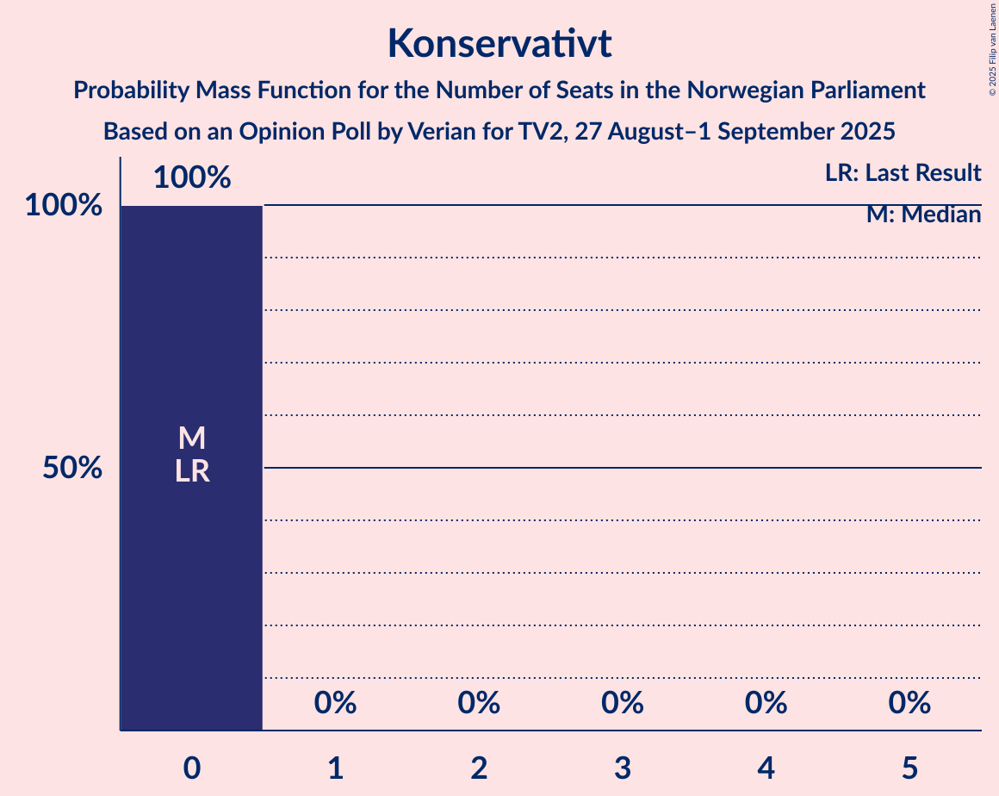
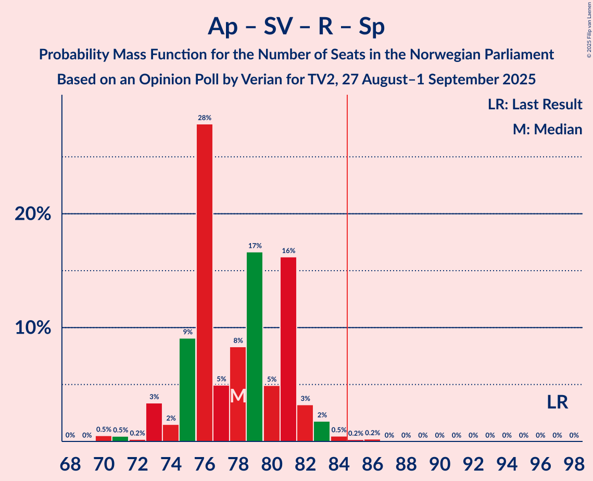
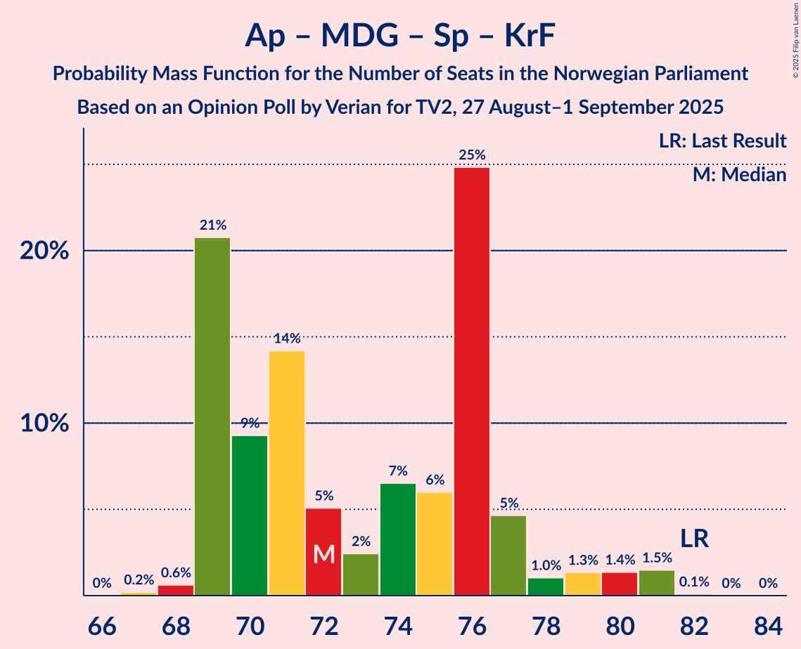

# Opinion Poll by Verian for TV2, 27 August–1 September 2025

<a href="#voting-intentions">Voting Intentions</a> | <a href="#seats">Seats</a> | <a href="#coalitions">Coalitions</a> | <a href="#technical-information">Technical Information</a>

## Voting Intentions

### Confidence Intervals

| Party | Last Result | Poll Result | 80% Confidence Interval | 90% Confidence Interval | 95% Confidence Interval | 99% Confidence Interval |
|:-----:|:-----------:|:-----------:|:-----------------------:|:-----------------------:|:-----------------------:|:-----------------------:|
| Arbeiderpartiet | 26.2% | 25.6% | 24.3–27.0% |23.9–27.4% |23.6–27.8% |23.0–28.5% |
| Fremskrittspartiet | 11.6% | 22.3% | 21.0–23.6% |20.7–24.0% |20.3–24.3% |19.7–25.0% |
| Høyre | 20.4% | 15.6% | 14.5–16.8% |14.2–17.2% |14.0–17.5% |13.5–18.0% |
| Sosialistisk Venstreparti | 7.6% | 6.5% | 5.8–7.4% |5.6–7.6% |5.4–7.8% |5.1–8.2% |
| Miljøpartiet De Grønne | 3.9% | 5.6% | 5.0–6.4% |4.8–6.6% |4.6–6.8% |4.3–7.2% |
| Rødt | 4.7% | 5.5% | 4.8–6.3% |4.7–6.5% |4.5–6.7% |4.2–7.1% |
| Senterpartiet | 13.5% | 5.3% | 4.7–6.1% |4.5–6.3% |4.3–6.5% |4.1–6.9% |
| Kristelig Folkeparti | 3.8% | 4.5% | 3.9–5.2% |3.7–5.4% |3.6–5.6% |3.3–6.0% |
| Venstre | 4.6% | 4.0% | 3.5–4.7% |3.3–4.9% |3.2–5.1% |2.9–5.4% |
| Konservativt | 0.4% | 1.2% | 0.9–1.6% |0.8–1.7% |0.8–1.8% |0.7–2.1% |
| Pensjonistpartiet | 0.6% | 0.6% | 0.4–0.9% |0.4–1.0% |0.3–1.1% |0.3–1.3% |
| Norgesdemokratene | 1.1% | 0.5% | 0.3–0.8% |0.3–0.9% |0.2–0.9% |0.2–1.1% |
| Industri- og Næringspartiet | 0.3% | 0.1% | 0.1–0.3% |0.0–0.4% |0.0–0.4% |0.0–0.6% |

*Note:* The poll result column reflects the actual value used in the calculations. Published results may vary slightly, and in addition be rounded to fewer digits.

## Seats

### Confidence Intervals

| Party | Last Result | Median | 80% Confidence Interval | 90% Confidence Interval | 95% Confidence Interval | 99% Confidence Interval |
|:-----:|:-----------:|:------:|:-----------------------:|:-----------------------:|:-----------------------:|:-----------------------:|
| <a href="#arbeiderpartiet">Arbeiderpartiet</a> | 48 | 50 | 48–54 |47–54 |47–54 |45–56 |
| <a href="#fremskrittspartiet">Fremskrittspartiet</a> | 21 | 43 | 40–46 |40–46 |39–46 |38–47 |
| <a href="#høyre">Høyre</a> | 36 | 29 | 25–30 |25–31 |23–31 |22–33 |
| <a href="#sosialistisk-venstreparti">Sosialistisk Venstreparti</a> | 13 | 10 | 9–11 |9–12 |8–13 |8–14 |
| <a href="#miljøpartiet-de-grønne">Miljøpartiet De Grønne</a> | 3 | 8 | 8–10 |8–11 |7–11 |7–12 |
| <a href="#rødt">Rødt</a> | 8 | 9 | 7–11 |7–11 |7–11 |6–12 |
| <a href="#senterpartiet">Senterpartiet</a> | 28 | 8 | 7–9 |7–11 |7–12 |1–13 |
| <a href="#kristelig-folkeparti">Kristelig Folkeparti</a> | 3 | 6 | 3–8 |3–8 |3–8 |2–9 |
| <a href="#venstre">Venstre</a> | 8 | 6 | 3–7 |2–7 |2–8 |2–8 |
| <a href="#konservativt">Konservativt</a> | 0 | 0 | 0 |0 |0 |0 |
| <a href="#pensjonistpartiet">Pensjonistpartiet</a> | 0 | 0 | 0 |0 |0 |0 |
| <a href="#norgesdemokratene">Norgesdemokratene</a> | 0 | 0 | 0 |0 |0 |0 |
| <a href="#industri--og-næringspartiet">Industri- og Næringspartiet</a> | 0 | 0 | 0 |0 |0 |0 |

### Arbeiderpartiet

*For a full overview of the results for this party, see the [Arbeiderpartiet](party-arbeiderpartiet.html) page.*

| Number of Seats | Probability | Accumulated | Special Marks |
|:---------------:|:-----------:|:-----------:|:-------------:|
| 43 | 0.1% | 100% |  |
| 44 | 0% | 99.9% |  |
| 45 | 0.6% | 99.9% |  |
| 46 | 2% | 99.3% |  |
| 47 | 3% | 98% |  |
| 48 | 11% | 94% | Last Result |
| 49 | 20% | 83% |  |
| 50 | 25% | 63% | Median |
| 51 | 7% | 38% |  |
| 52 | 19% | 31% |  |
| 53 | 2% | 12% |  |
| 54 | 8% | 10% |  |
| 55 | 1.3% | 2% |  |
| 56 | 0.4% | 0.5% |  |
| 57 | 0.2% | 0.2% |  |
| 58 | 0% | 0% |  |

### Fremskrittspartiet

*For a full overview of the results for this party, see the [Fremskrittspartiet](party-fremskrittspartiet.html) page.*

| Number of Seats | Probability | Accumulated | Special Marks |
|:---------------:|:-----------:|:-----------:|:-------------:|
| 21 | 0% | 100% | Last Result |
| 22 | 0% | 100% |  |
| 23 | 0% | 100% |  |
| 24 | 0% | 100% |  |
| 25 | 0% | 100% |  |
| 26 | 0% | 100% |  |
| 27 | 0% | 100% |  |
| 28 | 0% | 100% |  |
| 29 | 0% | 100% |  |
| 30 | 0% | 100% |  |
| 31 | 0% | 100% |  |
| 32 | 0% | 100% |  |
| 33 | 0% | 100% |  |
| 34 | 0% | 100% |  |
| 35 | 0% | 100% |  |
| 36 | 0% | 100% |  |
| 37 | 0% | 100% |  |
| 38 | 2% | 100% |  |
| 39 | 2% | 98% |  |
| 40 | 29% | 97% |  |
| 41 | 4% | 68% |  |
| 42 | 10% | 64% |  |
| 43 | 12% | 54% | Median |
| 44 | 11% | 42% |  |
| 45 | 8% | 31% |  |
| 46 | 22% | 23% |  |
| 47 | 0.5% | 0.6% |  |
| 48 | 0% | 0.1% |  |
| 49 | 0% | 0% |  |

### Høyre

*For a full overview of the results for this party, see the [Høyre](party-høyre.html) page.*

| Number of Seats | Probability | Accumulated | Special Marks |
|:---------------:|:-----------:|:-----------:|:-------------:|
| 21 | 0% | 100% |  |
| 22 | 0.7% | 99.9% |  |
| 23 | 2% | 99.2% |  |
| 24 | 2% | 97% |  |
| 25 | 6% | 95% |  |
| 26 | 17% | 89% |  |
| 27 | 3% | 72% |  |
| 28 | 7% | 69% |  |
| 29 | 19% | 62% | Median |
| 30 | 38% | 43% |  |
| 31 | 3% | 5% |  |
| 32 | 0.6% | 2% |  |
| 33 | 0.7% | 0.9% |  |
| 34 | 0% | 0.2% |  |
| 35 | 0% | 0.2% |  |
| 36 | 0.2% | 0.2% | Last Result |
| 37 | 0% | 0% |  |

### Sosialistisk Venstreparti

*For a full overview of the results for this party, see the [Sosialistisk Venstreparti](party-sosialistiskvenstreparti.html) page.*

| Number of Seats | Probability | Accumulated | Special Marks |
|:---------------:|:-----------:|:-----------:|:-------------:|
| 7 | 0.3% | 100% |  |
| 8 | 3% | 99.7% |  |
| 9 | 14% | 97% |  |
| 10 | 43% | 83% | Median |
| 11 | 34% | 40% |  |
| 12 | 3% | 6% |  |
| 13 | 2% | 3% | Last Result |
| 14 | 0.5% | 0.6% |  |
| 15 | 0% | 0% |  |

### Miljøpartiet De Grønne

*For a full overview of the results for this party, see the [Miljøpartiet De Grønne](party-miljøpartietdegrønne.html) page.*

| Number of Seats | Probability | Accumulated | Special Marks |
|:---------------:|:-----------:|:-----------:|:-------------:|
| 3 | 0% | 100% | Last Result |
| 4 | 0% | 100% |  |
| 5 | 0% | 100% |  |
| 6 | 0.4% | 100% |  |
| 7 | 2% | 99.6% |  |
| 8 | 55% | 97% | Median |
| 9 | 24% | 42% |  |
| 10 | 13% | 19% |  |
| 11 | 5% | 6% |  |
| 12 | 1.3% | 2% |  |
| 13 | 0.2% | 0.2% |  |
| 14 | 0% | 0% |  |

### Rødt

*For a full overview of the results for this party, see the [Rødt](party-rødt.html) page.*

| Number of Seats | Probability | Accumulated | Special Marks |
|:---------------:|:-----------:|:-----------:|:-------------:|
| 2 | 0.2% | 100% |  |
| 3 | 0% | 99.7% |  |
| 4 | 0% | 99.7% |  |
| 5 | 0% | 99.7% |  |
| 6 | 0.9% | 99.7% |  |
| 7 | 10% | 98.9% |  |
| 8 | 31% | 89% | Last Result |
| 9 | 19% | 58% | Median |
| 10 | 23% | 39% |  |
| 11 | 14% | 16% |  |
| 12 | 0.9% | 1.1% |  |
| 13 | 0.2% | 0.2% |  |
| 14 | 0% | 0% |  |

### Senterpartiet

*For a full overview of the results for this party, see the [Senterpartiet](party-senterpartiet.html) page.*

| Number of Seats | Probability | Accumulated | Special Marks |
|:---------------:|:-----------:|:-----------:|:-------------:|
| 1 | 0.6% | 100% |  |
| 2 | 0% | 99.4% |  |
| 3 | 0% | 99.4% |  |
| 4 | 0% | 99.4% |  |
| 5 | 0% | 99.4% |  |
| 6 | 0.9% | 99.4% |  |
| 7 | 10% | 98.6% |  |
| 8 | 70% | 89% | Median |
| 9 | 10% | 19% |  |
| 10 | 2% | 9% |  |
| 11 | 3% | 6% |  |
| 12 | 3% | 4% |  |
| 13 | 1.1% | 1.2% |  |
| 14 | 0% | 0% |  |
| 15 | 0% | 0% |  |
| 16 | 0% | 0% |  |
| 17 | 0% | 0% |  |
| 18 | 0% | 0% |  |
| 19 | 0% | 0% |  |
| 20 | 0% | 0% |  |
| 21 | 0% | 0% |  |
| 22 | 0% | 0% |  |
| 23 | 0% | 0% |  |
| 24 | 0% | 0% |  |
| 25 | 0% | 0% |  |
| 26 | 0% | 0% |  |
| 27 | 0% | 0% |  |
| 28 | 0% | 0% | Last Result |

### Kristelig Folkeparti

*For a full overview of the results for this party, see the [Kristelig Folkeparti](party-kristeligfolkeparti.html) page.*

| Number of Seats | Probability | Accumulated | Special Marks |
|:---------------:|:-----------:|:-----------:|:-------------:|
| 2 | 0.5% | 100% |  |
| 3 | 26% | 99.5% | Last Result |
| 4 | 0% | 73% |  |
| 5 | 0% | 73% |  |
| 6 | 29% | 73% | Median |
| 7 | 32% | 44% |  |
| 8 | 10% | 12% |  |
| 9 | 2% | 2% |  |
| 10 | 0.3% | 0.3% |  |
| 11 | 0% | 0% |  |

### Venstre

*For a full overview of the results for this party, see the [Venstre](party-venstre.html) page.*

| Number of Seats | Probability | Accumulated | Special Marks |
|:---------------:|:-----------:|:-----------:|:-------------:|
| 2 | 5% | 100% |  |
| 3 | 17% | 95% |  |
| 4 | 0% | 78% |  |
| 5 | 0% | 78% |  |
| 6 | 52% | 78% | Median |
| 7 | 21% | 26% |  |
| 8 | 4% | 5% | Last Result |
| 9 | 0.1% | 0.2% |  |
| 10 | 0% | 0% |  |

### Konservativt

*For a full overview of the results for this party, see the [Konservativt](party-konservativt.html) page.*

| Number of Seats | Probability | Accumulated | Special Marks |
|:---------------:|:-----------:|:-----------:|:-------------:|
| 0 | 100% | 100% | Last Result, Median |

### Pensjonistpartiet

*For a full overview of the results for this party, see the [Pensjonistpartiet](party-pensjonistpartiet.html) page.*

| Number of Seats | Probability | Accumulated | Special Marks |
|:---------------:|:-----------:|:-----------:|:-------------:|
| 0 | 100% | 100% | Last Result, Median |

### Norgesdemokratene

*For a full overview of the results for this party, see the [Norgesdemokratene](party-norgesdemokratene.html) page.*

| Number of Seats | Probability | Accumulated | Special Marks |
|:---------------:|:-----------:|:-----------:|:-------------:|
| 0 | 100% | 100% | Last Result, Median |

### Industri- og Næringspartiet

*For a full overview of the results for this party, see the [Industri- og Næringspartiet](party-industri-ognæringspartiet.html) page.*

| Number of Seats | Probability | Accumulated | Special Marks |
|:---------------:|:-----------:|:-----------:|:-------------:|
| 0 | 100% | 100% | Last Result, Median |

## Coalitions

### Confidence Intervals

| Coalition | Last Result | Median | Majority? | 80% Confidence Interval | 90% Confidence Interval | 95% Confidence Interval | 99% Confidence Interval |
|:---------:|:-----------:|:------:|:---------:|:-----------------------:|:-----------------------:|:-----------------------:|:-----------------------:|
| Fremskrittspartiet – Høyre – Miljøpartiet De Grønne – Kristelig Folkeparti – Venstre | 71 | 91 | 99.6% | 88–94 | 87–95 | 86–96 | 85–99 |
| Fremskrittspartiet – Høyre – Senterpartiet – Kristelig Folkeparti – Venstre | 96 | 91 | 99.3% | 87–94 | 87–94 | 86–95 | 84–98 |
| Arbeiderpartiet – Sosialistisk Venstreparti – Miljøpartiet De Grønne – Rødt – Senterpartiet | 100 | 86 | 61% | 83–90 | 83–91 | 83–93 | 79–94 |
| Arbeiderpartiet – Sosialistisk Venstreparti – Miljøpartiet De Grønne – Senterpartiet – Kristelig Folkeparti | 95 | 83 | 41% | 79–87 | 79–88 | 79–90 | 78–94 |
| Fremskrittspartiet – Høyre – Kristelig Folkeparti – Venstre | 68 | 83 | 38% | 79–86 | 78–86 | 76–86 | 75–90 |
| Arbeiderpartiet – Sosialistisk Venstreparti – Miljøpartiet De Grønne – Rødt | 72 | 78 | 0.7% | 75–82 | 75–82 | 74–83 | 71–85 |
| Arbeiderpartiet – Sosialistisk Venstreparti – Miljøpartiet De Grønne – Senterpartiet | 92 | 76 | 1.2% | 74–80 | 74–82 | 74–83 | 72–86 |
| Arbeiderpartiet – Sosialistisk Venstreparti – Rødt – Senterpartiet | 97 | 78 | 0.4% | 75–81 | 74–82 | 73–83 | 70–84 |
| Fremskrittspartiet – Høyre – Venstre | 65 | 76 | 0.2% | 72–82 | 71–82 | 69–82 | 67–84 |
| Arbeiderpartiet – Miljøpartiet De Grønne – Senterpartiet – Kristelig Folkeparti | 82 | 72 | 0% | 69–76 | 69–78 | 69–80 | 68–81 |
| Fremskrittspartiet – Høyre | 57 | 71 | 0% | 66–76 | 66–76 | 66–76 | 64–78 |
| Arbeiderpartiet – Sosialistisk Venstreparti – Senterpartiet | 89 | 68 | 0% | 66–71 | 66–72 | 65–73 | 63–75 |
| Arbeiderpartiet – Senterpartiet – Kristelig Folkeparti | 79 | 64 | 0% | 61–68 | 61–69 | 60–70 | 58–71 |
| Arbeiderpartiet – Sosialistisk Venstreparti | 61 | 60 | 0% | 58–63 | 57–63 | 57–64 | 55–66 |
| Arbeiderpartiet – Senterpartiet | 76 | 58 | 0% | 56–62 | 56–62 | 56–63 | 51–64 |
| Høyre – Kristelig Folkeparti – Venstre | 47 | 39 | 0% | 37–42 | 35–43 | 34–44 | 33–46 |
| Senterpartiet – Kristelig Folkeparti – Venstre | 39 | 20 | 0% | 17–21 | 17–23 | 16–24 | 14–26 |

### Fremskrittspartiet – Høyre – Miljøpartiet De Grønne – Kristelig Folkeparti – Venstre

| Number of Seats | Probability | Accumulated | Special Marks |
|:---------------:|:-----------:|:-----------:|:-------------:|
| 71 | 0% | 100% | Last Result |
| 72 | 0% | 100% |  |
| 73 | 0% | 100% |  |
| 74 | 0% | 100% |  |
| 75 | 0% | 100% |  |
| 76 | 0% | 100% |  |
| 77 | 0% | 100% |  |
| 78 | 0% | 100% |  |
| 79 | 0% | 100% |  |
| 80 | 0% | 100% |  |
| 81 | 0% | 100% |  |
| 82 | 0% | 100% |  |
| 83 | 0.2% | 100% |  |
| 84 | 0.2% | 99.8% |  |
| 85 | 0.5% | 99.6% | Majority |
| 86 | 2% | 99.1% |  |
| 87 | 3% | 97% |  |
| 88 | 16% | 94% |  |
| 89 | 5% | 78% |  |
| 90 | 17% | 73% |  |
| 91 | 8% | 56% |  |
| 92 | 5% | 48% | Median |
| 93 | 28% | 43% |  |
| 94 | 9% | 15% |  |
| 95 | 2% | 6% |  |
| 96 | 3% | 4% |  |
| 97 | 0.2% | 1.2% |  |
| 98 | 0.4% | 0.9% |  |
| 99 | 0.5% | 0.5% |  |
| 100 | 0% | 0% |  |

### Fremskrittspartiet – Høyre – Senterpartiet – Kristelig Folkeparti – Venstre

| Number of Seats | Probability | Accumulated | Special Marks |
|:---------------:|:-----------:|:-----------:|:-------------:|
| 82 | 0.1% | 100% |  |
| 83 | 0.2% | 99.9% |  |
| 84 | 0.4% | 99.7% |  |
| 85 | 0.3% | 99.3% | Majority |
| 86 | 2% | 99.0% |  |
| 87 | 17% | 97% |  |
| 88 | 3% | 80% |  |
| 89 | 7% | 77% |  |
| 90 | 18% | 70% |  |
| 91 | 9% | 52% |  |
| 92 | 5% | 43% | Median |
| 93 | 26% | 38% |  |
| 94 | 10% | 12% |  |
| 95 | 1.1% | 3% |  |
| 96 | 0.5% | 2% | Last Result |
| 97 | 0.6% | 1.1% |  |
| 98 | 0.5% | 0.5% |  |
| 99 | 0% | 0% |  |

### Arbeiderpartiet – Sosialistisk Venstreparti – Miljøpartiet De Grønne – Rødt – Senterpartiet

| Number of Seats | Probability | Accumulated | Special Marks |
|:---------------:|:-----------:|:-----------:|:-------------:|
| 78 | 0.3% | 100% |  |
| 79 | 0.7% | 99.7% |  |
| 80 | 0.1% | 99.0% |  |
| 81 | 0.2% | 98.9% |  |
| 82 | 0.9% | 98.7% |  |
| 83 | 10% | 98% |  |
| 84 | 26% | 87% |  |
| 85 | 2% | 61% | Median, Majority |
| 86 | 10% | 59% |  |
| 87 | 15% | 49% |  |
| 88 | 7% | 34% |  |
| 89 | 4% | 27% |  |
| 90 | 17% | 23% |  |
| 91 | 2% | 6% |  |
| 92 | 1.4% | 4% |  |
| 93 | 0.9% | 3% |  |
| 94 | 1.1% | 2% |  |
| 95 | 0.2% | 0.4% |  |
| 96 | 0.2% | 0.3% |  |
| 97 | 0% | 0.1% |  |
| 98 | 0.1% | 0.1% |  |
| 99 | 0% | 0% |  |
| 100 | 0% | 0% | Last Result |

### Arbeiderpartiet – Sosialistisk Venstreparti – Miljøpartiet De Grønne – Senterpartiet – Kristelig Folkeparti

| Number of Seats | Probability | Accumulated | Special Marks |
|:---------------:|:-----------:|:-----------:|:-------------:|
| 76 | 0.1% | 100% |  |
| 77 | 0.2% | 99.9% |  |
| 78 | 0.5% | 99.7% |  |
| 79 | 20% | 99.2% |  |
| 80 | 9% | 80% |  |
| 81 | 4% | 71% |  |
| 82 | 16% | 66% | Median |
| 83 | 5% | 51% |  |
| 84 | 5% | 46% |  |
| 85 | 11% | 41% | Majority |
| 86 | 7% | 30% |  |
| 87 | 16% | 23% |  |
| 88 | 2% | 7% |  |
| 89 | 0.7% | 5% |  |
| 90 | 2% | 4% |  |
| 91 | 1.1% | 2% |  |
| 92 | 0.2% | 1.2% |  |
| 93 | 0.1% | 1.0% |  |
| 94 | 0.9% | 0.9% |  |
| 95 | 0% | 0% | Last Result |

### Fremskrittspartiet – Høyre – Kristelig Folkeparti – Venstre

| Number of Seats | Probability | Accumulated | Special Marks |
|:---------------:|:-----------:|:-----------:|:-------------:|
| 68 | 0% | 100% | Last Result |
| 69 | 0% | 100% |  |
| 70 | 0% | 100% |  |
| 71 | 0.1% | 100% |  |
| 72 | 0% | 99.9% |  |
| 73 | 0.2% | 99.9% |  |
| 74 | 0.2% | 99.7% |  |
| 75 | 1.1% | 99.6% |  |
| 76 | 0.9% | 98% |  |
| 77 | 1.4% | 97% |  |
| 78 | 2% | 96% |  |
| 79 | 17% | 94% |  |
| 80 | 4% | 77% |  |
| 81 | 7% | 73% |  |
| 82 | 15% | 66% |  |
| 83 | 10% | 51% |  |
| 84 | 3% | 41% | Median |
| 85 | 26% | 38% | Majority |
| 86 | 10% | 12% |  |
| 87 | 0.8% | 2% |  |
| 88 | 0.2% | 1.2% |  |
| 89 | 0.1% | 1.0% |  |
| 90 | 0.7% | 0.9% |  |
| 91 | 0.2% | 0.3% |  |
| 92 | 0% | 0% |  |

### Arbeiderpartiet – Sosialistisk Venstreparti – Miljøpartiet De Grønne – Rødt

| Number of Seats | Probability | Accumulated | Special Marks |
|:---------------:|:-----------:|:-----------:|:-------------:|
| 70 | 0.1% | 100% |  |
| 71 | 0.5% | 99.9% |  |
| 72 | 0.6% | 99.4% | Last Result |
| 73 | 0.5% | 98.9% |  |
| 74 | 1.5% | 98% |  |
| 75 | 10% | 97% |  |
| 76 | 26% | 87% |  |
| 77 | 5% | 62% | Median |
| 78 | 9% | 57% |  |
| 79 | 18% | 48% |  |
| 80 | 7% | 30% |  |
| 81 | 3% | 23% |  |
| 82 | 17% | 20% |  |
| 83 | 2% | 3% |  |
| 84 | 0.3% | 1.0% |  |
| 85 | 0.4% | 0.7% | Majority |
| 86 | 0.2% | 0.3% |  |
| 87 | 0.1% | 0.1% |  |
| 88 | 0% | 0% |  |

### Arbeiderpartiet – Sosialistisk Venstreparti – Miljøpartiet De Grønne – Senterpartiet

| Number of Seats | Probability | Accumulated | Special Marks |
|:---------------:|:-----------:|:-----------:|:-------------:|
| 69 | 0% | 100% |  |
| 70 | 0% | 99.9% |  |
| 71 | 0.2% | 99.9% |  |
| 72 | 0.6% | 99.7% |  |
| 73 | 0.9% | 99.1% |  |
| 74 | 10% | 98% |  |
| 75 | 1.2% | 88% |  |
| 76 | 38% | 87% | Median |
| 77 | 3% | 49% |  |
| 78 | 10% | 46% |  |
| 79 | 10% | 36% |  |
| 80 | 17% | 25% |  |
| 81 | 3% | 9% |  |
| 82 | 2% | 5% |  |
| 83 | 1.2% | 3% |  |
| 84 | 0.6% | 2% |  |
| 85 | 0.2% | 1.2% | Majority |
| 86 | 1.0% | 1.0% |  |
| 87 | 0% | 0% |  |
| 88 | 0% | 0% |  |
| 89 | 0% | 0% |  |
| 90 | 0% | 0% |  |
| 91 | 0% | 0% |  |
| 92 | 0% | 0% | Last Result |

### Arbeiderpartiet – Sosialistisk Venstreparti – Rødt – Senterpartiet

| Number of Seats | Probability | Accumulated | Special Marks |
|:---------------:|:-----------:|:-----------:|:-------------:|
| 70 | 0.5% | 100% |  |
| 71 | 0.5% | 99.5% |  |
| 72 | 0.2% | 99.0% |  |
| 73 | 3% | 98.8% |  |
| 74 | 2% | 95% |  |
| 75 | 9% | 94% |  |
| 76 | 28% | 85% |  |
| 77 | 5% | 57% | Median |
| 78 | 8% | 52% |  |
| 79 | 17% | 44% |  |
| 80 | 5% | 27% |  |
| 81 | 16% | 22% |  |
| 82 | 3% | 6% |  |
| 83 | 2% | 3% |  |
| 84 | 0.5% | 0.9% |  |
| 85 | 0.2% | 0.4% | Majority |
| 86 | 0.2% | 0.2% |  |
| 87 | 0% | 0% |  |
| 88 | 0% | 0% |  |
| 89 | 0% | 0% |  |
| 90 | 0% | 0% |  |
| 91 | 0% | 0% |  |
| 92 | 0% | 0% |  |
| 93 | 0% | 0% |  |
| 94 | 0% | 0% |  |
| 95 | 0% | 0% |  |
| 96 | 0% | 0% |  |
| 97 | 0% | 0% | Last Result |

### Fremskrittspartiet – Høyre – Venstre

| Number of Seats | Probability | Accumulated | Special Marks |
|:---------------:|:-----------:|:-----------:|:-------------:|
| 65 | 0% | 100% | Last Result |
| 66 | 0.1% | 100% |  |
| 67 | 0.9% | 99.9% |  |
| 68 | 0.7% | 98.9% |  |
| 69 | 0.8% | 98% |  |
| 70 | 2% | 97% |  |
| 71 | 1.1% | 96% |  |
| 72 | 18% | 94% |  |
| 73 | 1.0% | 77% |  |
| 74 | 5% | 76% |  |
| 75 | 5% | 71% |  |
| 76 | 17% | 66% |  |
| 77 | 7% | 49% |  |
| 78 | 8% | 42% | Median |
| 79 | 4% | 34% |  |
| 80 | 9% | 30% |  |
| 81 | 0.4% | 21% |  |
| 82 | 20% | 20% |  |
| 83 | 0% | 0.8% |  |
| 84 | 0.5% | 0.7% |  |
| 85 | 0.2% | 0.2% | Majority |
| 86 | 0% | 0% |  |

### Arbeiderpartiet – Miljøpartiet De Grønne – Senterpartiet – Kristelig Folkeparti

| Number of Seats | Probability | Accumulated | Special Marks |
|:---------------:|:-----------:|:-----------:|:-------------:|
| 66 | 0% | 100% |  |
| 67 | 0.2% | 99.9% |  |
| 68 | 0.6% | 99.7% |  |
| 69 | 21% | 99.1% |  |
| 70 | 9% | 78% |  |
| 71 | 14% | 69% |  |
| 72 | 5% | 55% | Median |
| 73 | 2% | 50% |  |
| 74 | 7% | 47% |  |
| 75 | 6% | 41% |  |
| 76 | 25% | 35% |  |
| 77 | 5% | 10% |  |
| 78 | 1.0% | 5% |  |
| 79 | 1.3% | 4% |  |
| 80 | 1.4% | 3% |  |
| 81 | 1.5% | 2% |  |
| 82 | 0.1% | 0.1% | Last Result |
| 83 | 0% | 0% |  |

### Fremskrittspartiet – Høyre

| Number of Seats | Probability | Accumulated | Special Marks |
|:---------------:|:-----------:|:-----------:|:-------------:|
| 57 | 0% | 100% | Last Result |
| 58 | 0% | 100% |  |
| 59 | 0% | 100% |  |
| 60 | 0% | 100% |  |
| 61 | 0% | 100% |  |
| 62 | 0% | 100% |  |
| 63 | 0.2% | 100% |  |
| 64 | 1.1% | 99.8% |  |
| 65 | 0.2% | 98.7% |  |
| 66 | 16% | 98.5% |  |
| 67 | 2% | 82% |  |
| 68 | 3% | 80% |  |
| 69 | 2% | 77% |  |
| 70 | 21% | 75% |  |
| 71 | 11% | 54% |  |
| 72 | 7% | 43% | Median |
| 73 | 14% | 37% |  |
| 74 | 2% | 23% |  |
| 75 | 0.7% | 21% |  |
| 76 | 20% | 21% |  |
| 77 | 0.1% | 0.8% |  |
| 78 | 0.7% | 0.7% |  |
| 79 | 0% | 0% |  |

### Arbeiderpartiet – Sosialistisk Venstreparti – Senterpartiet

| Number of Seats | Probability | Accumulated | Special Marks |
|:---------------:|:-----------:|:-----------:|:-------------:|
| 61 | 0% | 100% |  |
| 62 | 0% | 99.9% |  |
| 63 | 1.1% | 99.9% |  |
| 64 | 0.8% | 98.9% |  |
| 65 | 3% | 98% |  |
| 66 | 11% | 95% |  |
| 67 | 2% | 84% |  |
| 68 | 42% | 82% | Median |
| 69 | 3% | 40% |  |
| 70 | 6% | 37% |  |
| 71 | 24% | 31% |  |
| 72 | 2% | 7% |  |
| 73 | 2% | 5% |  |
| 74 | 0.5% | 2% |  |
| 75 | 2% | 2% |  |
| 76 | 0.1% | 0.1% |  |
| 77 | 0% | 0% |  |
| 78 | 0% | 0% |  |
| 79 | 0% | 0% |  |
| 80 | 0% | 0% |  |
| 81 | 0% | 0% |  |
| 82 | 0% | 0% |  |
| 83 | 0% | 0% |  |
| 84 | 0% | 0% |  |
| 85 | 0% | 0% | Majority |
| 86 | 0% | 0% |  |
| 87 | 0% | 0% |  |
| 88 | 0% | 0% |  |
| 89 | 0% | 0% | Last Result |

### Arbeiderpartiet – Senterpartiet – Kristelig Folkeparti

| Number of Seats | Probability | Accumulated | Special Marks |
|:---------------:|:-----------:|:-----------:|:-------------:|
| 57 | 0% | 100% |  |
| 58 | 0.5% | 99.9% |  |
| 59 | 0.1% | 99.4% |  |
| 60 | 3% | 99.3% |  |
| 61 | 21% | 97% |  |
| 62 | 10% | 76% |  |
| 63 | 13% | 66% |  |
| 64 | 11% | 53% | Median |
| 65 | 3% | 42% |  |
| 66 | 5% | 39% |  |
| 67 | 18% | 33% |  |
| 68 | 9% | 15% |  |
| 69 | 3% | 6% |  |
| 70 | 1.3% | 4% |  |
| 71 | 2% | 2% |  |
| 72 | 0.2% | 0.2% |  |
| 73 | 0% | 0.1% |  |
| 74 | 0% | 0% |  |
| 75 | 0% | 0% |  |
| 76 | 0% | 0% |  |
| 77 | 0% | 0% |  |
| 78 | 0% | 0% |  |
| 79 | 0% | 0% | Last Result |

### Arbeiderpartiet – Sosialistisk Venstreparti

| Number of Seats | Probability | Accumulated | Special Marks |
|:---------------:|:-----------:|:-----------:|:-------------:|
| 54 | 0.1% | 100% |  |
| 55 | 0.6% | 99.9% |  |
| 56 | 0.7% | 99.3% |  |
| 57 | 4% | 98.6% |  |
| 58 | 13% | 95% |  |
| 59 | 5% | 82% |  |
| 60 | 35% | 77% | Median |
| 61 | 11% | 42% | Last Result |
| 62 | 3% | 31% |  |
| 63 | 23% | 28% |  |
| 64 | 3% | 5% |  |
| 65 | 2% | 2% |  |
| 66 | 0.2% | 0.7% |  |
| 67 | 0.5% | 0.5% |  |
| 68 | 0% | 0% |  |

### Arbeiderpartiet – Senterpartiet

| Number of Seats | Probability | Accumulated | Special Marks |
|:---------------:|:-----------:|:-----------:|:-------------:|
| 50 | 0% | 100% |  |
| 51 | 0.5% | 99.9% |  |
| 52 | 0.1% | 99.5% |  |
| 53 | 0% | 99.4% |  |
| 54 | 1.3% | 99.4% |  |
| 55 | 0.6% | 98% |  |
| 56 | 10% | 98% |  |
| 57 | 20% | 87% |  |
| 58 | 28% | 67% | Median |
| 59 | 4% | 39% |  |
| 60 | 17% | 35% |  |
| 61 | 6% | 17% |  |
| 62 | 9% | 12% |  |
| 63 | 3% | 3% |  |
| 64 | 0.5% | 0.6% |  |
| 65 | 0.1% | 0.1% |  |
| 66 | 0% | 0.1% |  |
| 67 | 0% | 0% |  |
| 68 | 0% | 0% |  |
| 69 | 0% | 0% |  |
| 70 | 0% | 0% |  |
| 71 | 0% | 0% |  |
| 72 | 0% | 0% |  |
| 73 | 0% | 0% |  |
| 74 | 0% | 0% |  |
| 75 | 0% | 0% |  |
| 76 | 0% | 0% | Last Result |

### Høyre – Kristelig Folkeparti – Venstre

| Number of Seats | Probability | Accumulated | Special Marks |
|:---------------:|:-----------:|:-----------:|:-------------:|
| 29 | 0.1% | 100% |  |
| 30 | 0.1% | 99.9% |  |
| 31 | 0% | 99.8% |  |
| 32 | 0.2% | 99.8% |  |
| 33 | 0.9% | 99.6% |  |
| 34 | 3% | 98.8% |  |
| 35 | 1.4% | 96% |  |
| 36 | 2% | 95% |  |
| 37 | 4% | 92% |  |
| 38 | 7% | 89% |  |
| 39 | 41% | 81% |  |
| 40 | 4% | 40% |  |
| 41 | 4% | 36% | Median |
| 42 | 26% | 32% |  |
| 43 | 2% | 6% |  |
| 44 | 2% | 4% |  |
| 45 | 0.9% | 2% |  |
| 46 | 0.4% | 0.7% |  |
| 47 | 0.1% | 0.3% | Last Result |
| 48 | 0% | 0.2% |  |
| 49 | 0.2% | 0.2% |  |
| 50 | 0% | 0% |  |

### Senterpartiet – Kristelig Folkeparti – Venstre

| Number of Seats | Probability | Accumulated | Special Marks |
|:---------------:|:-----------:|:-----------:|:-------------:|
| 13 | 0.1% | 100% |  |
| 14 | 1.4% | 99.9% |  |
| 15 | 0.6% | 98% |  |
| 16 | 1.2% | 98% |  |
| 17 | 25% | 97% |  |
| 18 | 3% | 72% |  |
| 19 | 8% | 68% |  |
| 20 | 15% | 61% | Median |
| 21 | 36% | 46% |  |
| 22 | 4% | 9% |  |
| 23 | 2% | 6% |  |
| 24 | 1.5% | 3% |  |
| 25 | 1.2% | 2% |  |
| 26 | 0.4% | 0.6% |  |
| 27 | 0.1% | 0.1% |  |
| 28 | 0.1% | 0.1% |  |
| 29 | 0% | 0% |  |
| 30 | 0% | 0% |  |
| 31 | 0% | 0% |  |
| 32 | 0% | 0% |  |
| 33 | 0% | 0% |  |
| 34 | 0% | 0% |  |
| 35 | 0% | 0% |  |
| 36 | 0% | 0% |  |
| 37 | 0% | 0% |  |
| 38 | 0% | 0% |  |
| 39 | 0% | 0% | Last Result |

## Technical Information

### Opinion Poll

+ **Polling firm:** Verian
+ **Commissioner(s):** TV2
+ **Fieldwork period:** 27 August–1 September 2025

### Calculations

+ **Sample size:** 1670
+ **Simulations done:** 2,097,152
+ **Error estimate:** 3.29%

