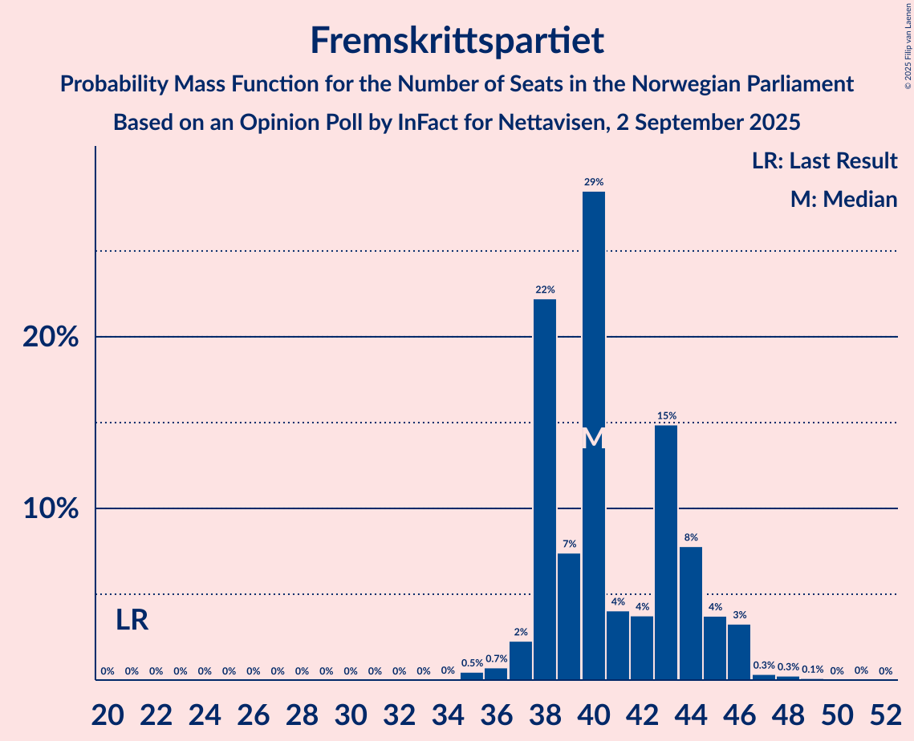
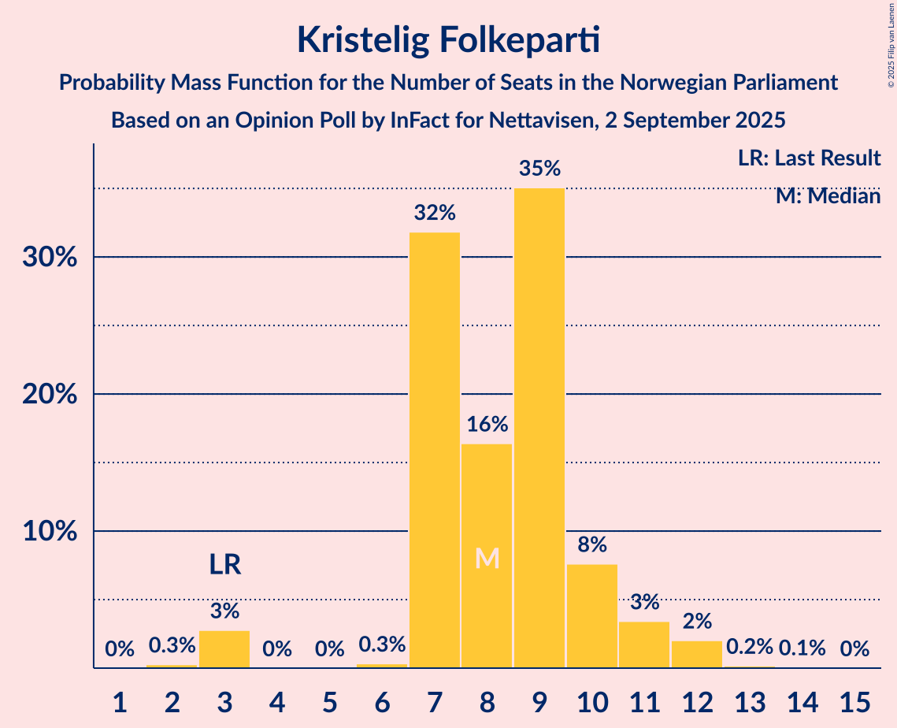
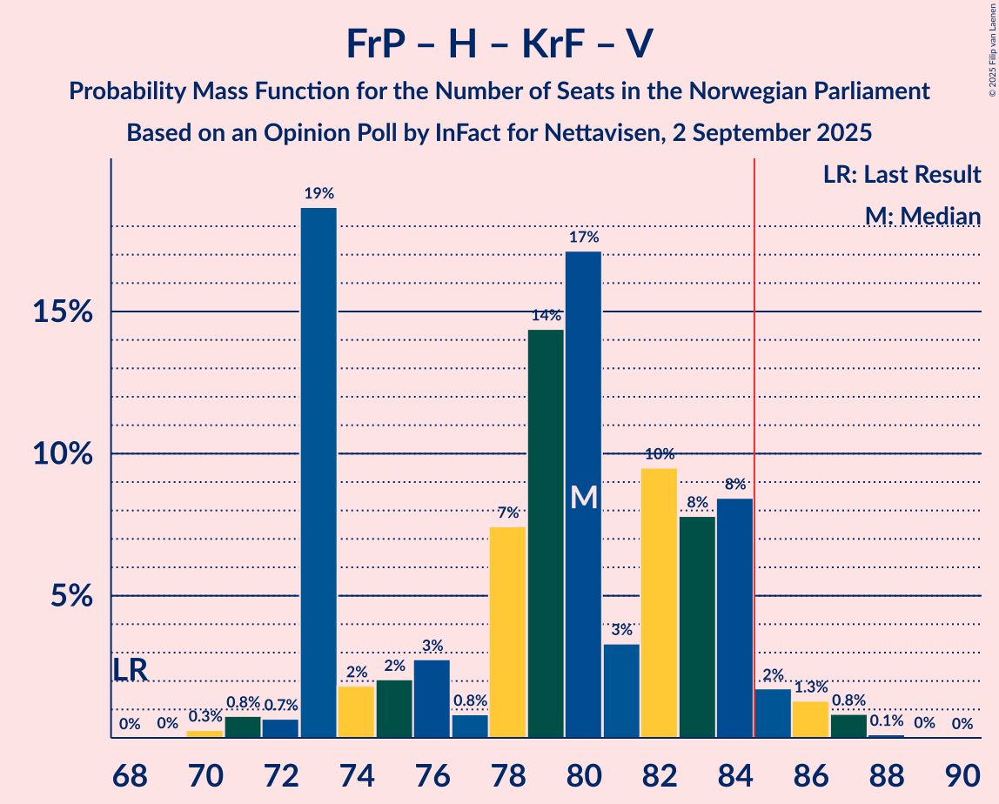
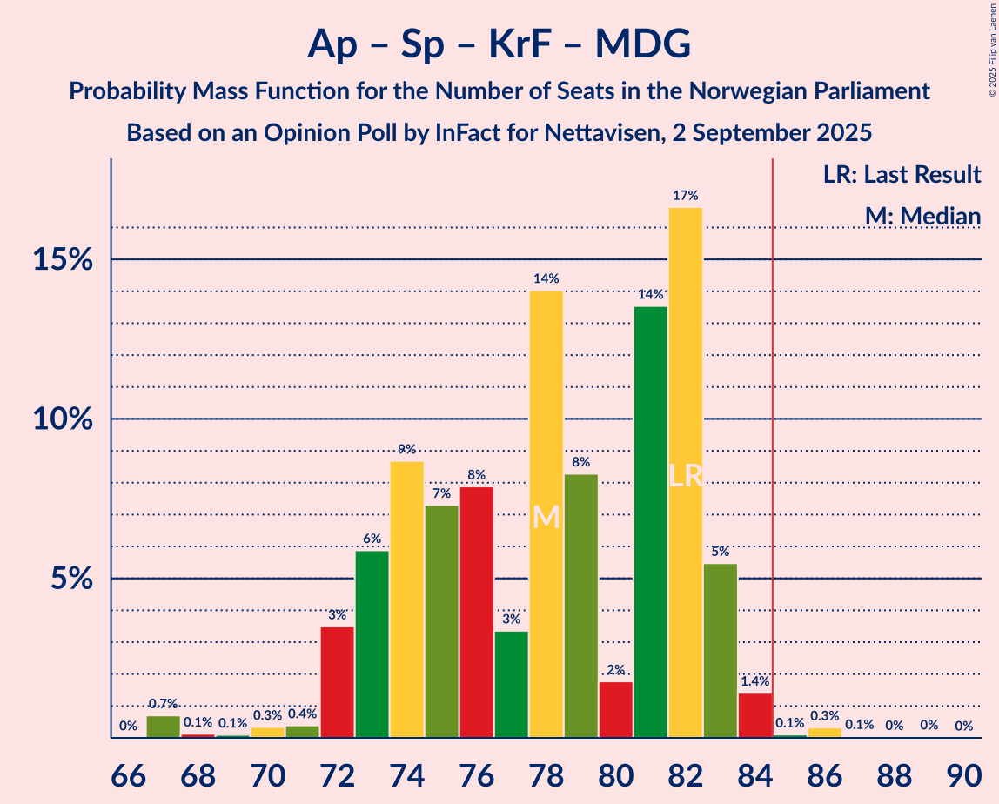
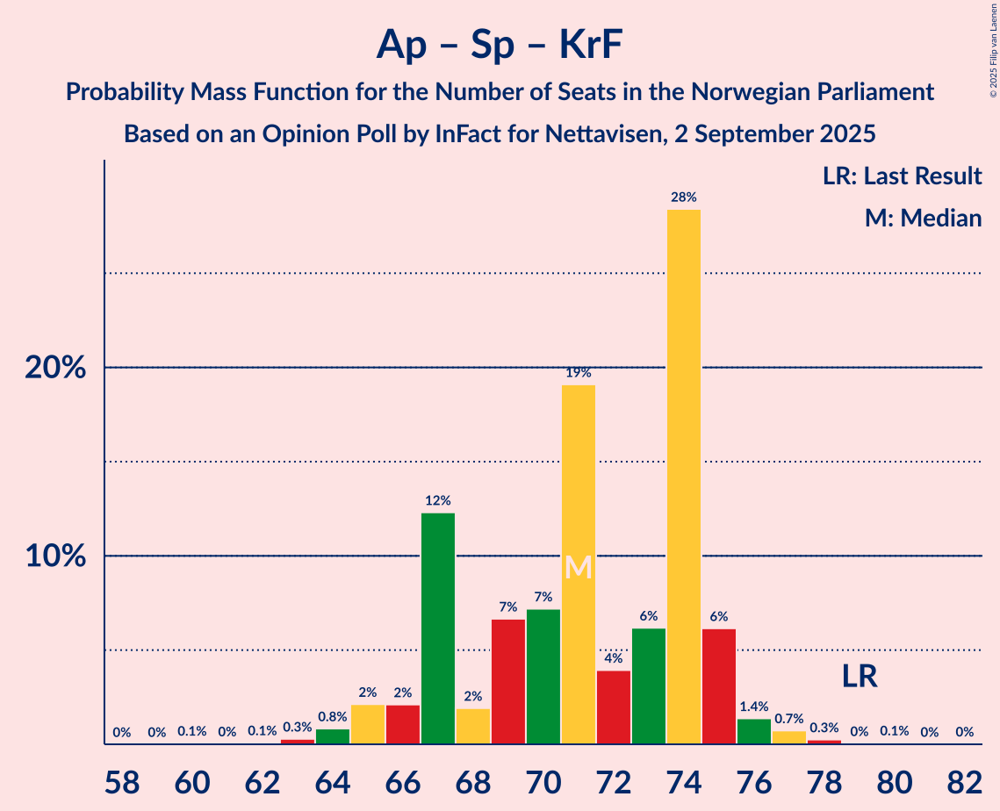
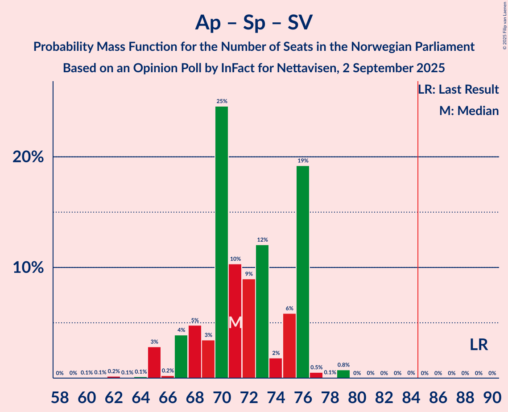

# Opinion Poll by InFact for Nettavisen, 2 September 2025

<a href="#voting-intentions">Voting Intentions</a> | <a href="#seats">Seats</a> | <a href="#coalitions">Coalitions</a> | <a href="#technical-information">Technical Information</a>

## Voting Intentions

### Confidence Intervals

| Party | Last Result | Poll Result | 80% Confidence Interval | 90% Confidence Interval | 95% Confidence Interval | 99% Confidence Interval |
|:-----:|:-----------:|:-----------:|:-----------------------:|:-----------------------:|:-----------------------:|:-----------------------:|
| Arbeiderpartiet | 26.2% | 26.5% | 24.9–28.3% |24.4–28.8% |24.0–29.2% |23.2–30.0% |
| Fremskrittspartiet | 11.6% | 21.8% | 20.3–23.5% |19.9–23.9% |19.5–24.4% |18.8–25.2% |
| Høyre | 20.4% | 13.6% | 12.4–15.0% |12.0–15.4% |11.7–15.8% |11.1–16.5% |
| Rødt | 4.7% | 7.3% | 6.4–8.4% |6.1–8.7% |5.9–9.0% |5.5–9.6% |
| Senterpartiet | 13.5% | 6.3% | 5.5–7.3% |5.2–7.7% |5.0–7.9% |4.6–8.4% |
| Sosialistisk Venstreparti | 7.6% | 5.4% | 4.6–6.4% |4.4–6.7% |4.2–6.9% |3.9–7.4% |
| Kristelig Folkeparti | 3.8% | 5.2% | 4.5–6.2% |4.2–6.5% |4.1–6.7% |3.7–7.2% |
| Venstre | 4.6% | 5.0% | 4.2–5.9% |4.0–6.2% |3.8–6.4% |3.5–6.9% |
| Miljøpartiet De Grønne | 3.9% | 4.6% | 3.9–5.5% |3.7–5.8% |3.5–6.0% |3.2–6.5% |
| Konservativt | 0.4% | 1.1% | 0.8–1.6% |0.7–1.8% |0.6–1.9% |0.5–2.2% |
| Norgesdemokratene | 1.1% | 0.6% | 0.4–1.1% |0.4–1.2% |0.3–1.3% |0.2–1.5% |
| Industri- og Næringspartiet | 0.3% | 0.6% | 0.4–1.1% |0.4–1.2% |0.3–1.3% |0.2–1.5% |
| Pensjonistpartiet | 0.6% | 0.4% | 0.2–0.7% |0.2–0.8% |0.1–0.9% |0.1–1.1% |

*Note:* The poll result column reflects the actual value used in the calculations. Published results may vary slightly, and in addition be rounded to fewer digits.

## Seats

### Confidence Intervals

| Party | Last Result | Median | 80% Confidence Interval | 90% Confidence Interval | 95% Confidence Interval | 99% Confidence Interval |
|:-----:|:-----------:|:------:|:-----------------------:|:-----------------------:|:-----------------------:|:-----------------------:|
| <a href="#arbeiderpartiet">Arbeiderpartiet</a> | 48 | 49 | 48–52 |47–54 |46–58 |46–59 |
| <a href="#fremskrittspartiet">Fremskrittspartiet</a> | 21 | 40 | 38–44 |38–46 |37–46 |35–47 |
| <a href="#høyre">Høyre</a> | 36 | 22 | 19–25 |19–27 |18–27 |17–30 |
| <a href="#rødt">Rødt</a> | 8 | 12 | 10–13 |10–13 |9–14 |8–15 |
| <a href="#senterpartiet">Senterpartiet</a> | 28 | 13 | 9–14 |9–14 |8–14 |7–15 |
| <a href="#sosialistisk-venstreparti">Sosialistisk Venstreparti</a> | 13 | 8 | 8–10 |7–11 |7–12 |1–12 |
| <a href="#kristelig-folkeparti">Kristelig Folkeparti</a> | 3 | 9 | 7–10 |7–11 |3–12 |3–12 |
| <a href="#venstre">Venstre</a> | 8 | 9 | 7–11 |7–11 |3–11 |3–11 |
| <a href="#miljøpartiet-de-grønne">Miljøpartiet De Grønne</a> | 3 | 7 | 3–8 |3–8 |2–9 |2–10 |
| <a href="#konservativt">Konservativt</a> | 0 | 0 | 0 |0 |0 |0 |
| <a href="#norgesdemokratene">Norgesdemokratene</a> | 0 | 0 | 0 |0 |0 |0 |
| <a href="#industri--og-næringspartiet">Industri- og Næringspartiet</a> | 0 | 0 | 0 |0 |0 |0 |
| <a href="#pensjonistpartiet">Pensjonistpartiet</a> | 0 | 0 | 0 |0 |0 |0 |

### Arbeiderpartiet

*For a full overview of the results for this party, see the [Arbeiderpartiet](party-arbeiderpartiet.html) page.*

| Number of Seats | Probability | Accumulated | Special Marks |
|:---------------:|:-----------:|:-----------:|:-------------:|
| 43 | 0.1% | 100% |  |
| 44 | 0.2% | 99.9% |  |
| 45 | 0.3% | 99.8% |  |
| 46 | 4% | 99.5% |  |
| 47 | 0.9% | 96% |  |
| 48 | 32% | 95% | Last Result |
| 49 | 14% | 63% | Median |
| 50 | 11% | 49% |  |
| 51 | 18% | 38% |  |
| 52 | 11% | 20% |  |
| 53 | 2% | 9% |  |
| 54 | 3% | 7% |  |
| 55 | 0.5% | 4% |  |
| 56 | 0.5% | 4% |  |
| 57 | 0.2% | 3% |  |
| 58 | 2% | 3% |  |
| 59 | 0.2% | 0.7% |  |
| 60 | 0.4% | 0.5% |  |
| 61 | 0% | 0.1% |  |
| 62 | 0% | 0% |  |

### Fremskrittspartiet

*For a full overview of the results for this party, see the [Fremskrittspartiet](party-fremskrittspartiet.html) page.*

| Number of Seats | Probability | Accumulated | Special Marks |
|:---------------:|:-----------:|:-----------:|:-------------:|
| 21 | 0% | 100% | Last Result |
| 22 | 0% | 100% |  |
| 23 | 0% | 100% |  |
| 24 | 0% | 100% |  |
| 25 | 0% | 100% |  |
| 26 | 0% | 100% |  |
| 27 | 0% | 100% |  |
| 28 | 0% | 100% |  |
| 29 | 0% | 100% |  |
| 30 | 0% | 100% |  |
| 31 | 0% | 100% |  |
| 32 | 0% | 100% |  |
| 33 | 0% | 100% |  |
| 34 | 0.1% | 100% |  |
| 35 | 0.4% | 99.9% |  |
| 36 | 0.2% | 99.5% |  |
| 37 | 3% | 99.3% |  |
| 38 | 25% | 96% |  |
| 39 | 8% | 71% |  |
| 40 | 23% | 63% | Median |
| 41 | 5% | 40% |  |
| 42 | 5% | 35% |  |
| 43 | 4% | 30% |  |
| 44 | 17% | 25% |  |
| 45 | 1.1% | 9% |  |
| 46 | 7% | 8% |  |
| 47 | 0.5% | 0.8% |  |
| 48 | 0.3% | 0.3% |  |
| 49 | 0% | 0.1% |  |
| 50 | 0% | 0.1% |  |
| 51 | 0% | 0.1% |  |
| 52 | 0% | 0% |  |

### Høyre

*For a full overview of the results for this party, see the [Høyre](party-høyre.html) page.*

| Number of Seats | Probability | Accumulated | Special Marks |
|:---------------:|:-----------:|:-----------:|:-------------:|
| 17 | 0.7% | 100% |  |
| 18 | 3% | 99.3% |  |
| 19 | 18% | 97% |  |
| 20 | 6% | 79% |  |
| 21 | 19% | 73% |  |
| 22 | 31% | 54% | Median |
| 23 | 5% | 23% |  |
| 24 | 6% | 17% |  |
| 25 | 4% | 12% |  |
| 26 | 3% | 8% |  |
| 27 | 4% | 6% |  |
| 28 | 1.0% | 2% |  |
| 29 | 0.4% | 1.0% |  |
| 30 | 0.5% | 0.7% |  |
| 31 | 0.1% | 0.2% |  |
| 32 | 0% | 0% |  |
| 33 | 0% | 0% |  |
| 34 | 0% | 0% |  |
| 35 | 0% | 0% |  |
| 36 | 0% | 0% | Last Result |

### Rødt

*For a full overview of the results for this party, see the [Rødt](party-rødt.html) page.*

| Number of Seats | Probability | Accumulated | Special Marks |
|:---------------:|:-----------:|:-----------:|:-------------:|
| 8 | 2% | 100% | Last Result |
| 9 | 2% | 98% |  |
| 10 | 21% | 97% |  |
| 11 | 23% | 76% |  |
| 12 | 33% | 53% | Median |
| 13 | 15% | 20% |  |
| 14 | 3% | 5% |  |
| 15 | 1.4% | 2% |  |
| 16 | 0.1% | 0.2% |  |
| 17 | 0.1% | 0.1% |  |
| 18 | 0% | 0% |  |

### Senterpartiet

*For a full overview of the results for this party, see the [Senterpartiet](party-senterpartiet.html) page.*

| Number of Seats | Probability | Accumulated | Special Marks |
|:---------------:|:-----------:|:-----------:|:-------------:|
| 6 | 0.1% | 100% |  |
| 7 | 0.4% | 99.9% |  |
| 8 | 3% | 99.5% |  |
| 9 | 12% | 97% |  |
| 10 | 4% | 85% |  |
| 11 | 4% | 81% |  |
| 12 | 7% | 77% |  |
| 13 | 20% | 69% | Median |
| 14 | 48% | 49% |  |
| 15 | 2% | 2% |  |
| 16 | 0% | 0% |  |
| 17 | 0% | 0% |  |
| 18 | 0% | 0% |  |
| 19 | 0% | 0% |  |
| 20 | 0% | 0% |  |
| 21 | 0% | 0% |  |
| 22 | 0% | 0% |  |
| 23 | 0% | 0% |  |
| 24 | 0% | 0% |  |
| 25 | 0% | 0% |  |
| 26 | 0% | 0% |  |
| 27 | 0% | 0% |  |
| 28 | 0% | 0% | Last Result |

### Sosialistisk Venstreparti

*For a full overview of the results for this party, see the [Sosialistisk Venstreparti](party-sosialistiskvenstreparti.html) page.*

| Number of Seats | Probability | Accumulated | Special Marks |
|:---------------:|:-----------:|:-----------:|:-------------:|
| 1 | 0.6% | 100% |  |
| 2 | 0.6% | 99.4% |  |
| 3 | 0.6% | 98.8% |  |
| 4 | 0% | 98% |  |
| 5 | 0% | 98% |  |
| 6 | 0.1% | 98% |  |
| 7 | 4% | 98% |  |
| 8 | 65% | 94% | Median |
| 9 | 18% | 29% |  |
| 10 | 4% | 12% |  |
| 11 | 3% | 8% |  |
| 12 | 5% | 5% |  |
| 13 | 0.2% | 0.2% | Last Result |
| 14 | 0% | 0% |  |

### Kristelig Folkeparti

*For a full overview of the results for this party, see the [Kristelig Folkeparti](party-kristeligfolkeparti.html) page.*

| Number of Seats | Probability | Accumulated | Special Marks |
|:---------------:|:-----------:|:-----------:|:-------------:|
| 2 | 0.2% | 100% |  |
| 3 | 2% | 99.8% | Last Result |
| 4 | 0% | 97% |  |
| 5 | 0% | 97% |  |
| 6 | 0.2% | 97% |  |
| 7 | 12% | 97% |  |
| 8 | 15% | 85% |  |
| 9 | 61% | 71% | Median |
| 10 | 5% | 10% |  |
| 11 | 2% | 6% |  |
| 12 | 3% | 4% |  |
| 13 | 0.1% | 0.2% |  |
| 14 | 0.2% | 0.2% |  |
| 15 | 0% | 0% |  |

### Venstre

*For a full overview of the results for this party, see the [Venstre](party-venstre.html) page.*

| Number of Seats | Probability | Accumulated | Special Marks |
|:---------------:|:-----------:|:-----------:|:-------------:|
| 2 | 0.3% | 100% |  |
| 3 | 3% | 99.7% |  |
| 4 | 0% | 97% |  |
| 5 | 0% | 97% |  |
| 6 | 0.2% | 97% |  |
| 7 | 27% | 97% |  |
| 8 | 16% | 70% | Last Result |
| 9 | 6% | 54% | Median |
| 10 | 22% | 48% |  |
| 11 | 25% | 26% |  |
| 12 | 0.5% | 0.5% |  |
| 13 | 0% | 0% |  |

### Miljøpartiet De Grønne

*For a full overview of the results for this party, see the [Miljøpartiet De Grønne](party-miljøpartietdegrønne.html) page.*

| Number of Seats | Probability | Accumulated | Special Marks |
|:---------------:|:-----------:|:-----------:|:-------------:|
| 1 | 0.1% | 100% |  |
| 2 | 3% | 99.9% |  |
| 3 | 12% | 97% | Last Result |
| 4 | 0% | 85% |  |
| 5 | 0% | 85% |  |
| 6 | 3% | 85% |  |
| 7 | 58% | 82% | Median |
| 8 | 20% | 24% |  |
| 9 | 3% | 4% |  |
| 10 | 0.7% | 0.9% |  |
| 11 | 0.2% | 0.2% |  |
| 12 | 0% | 0% |  |

### Konservativt

*For a full overview of the results for this party, see the [Konservativt](party-konservativt.html) page.*

| Number of Seats | Probability | Accumulated | Special Marks |
|:---------------:|:-----------:|:-----------:|:-------------:|
| 0 | 100% | 100% | Last Result, Median |

### Norgesdemokratene

*For a full overview of the results for this party, see the [Norgesdemokratene](party-norgesdemokratene.html) page.*

| Number of Seats | Probability | Accumulated | Special Marks |
|:---------------:|:-----------:|:-----------:|:-------------:|
| 0 | 100% | 100% | Last Result, Median |

### Industri- og Næringspartiet

*For a full overview of the results for this party, see the [Industri- og Næringspartiet](party-industri-ognæringspartiet.html) page.*

| Number of Seats | Probability | Accumulated | Special Marks |
|:---------------:|:-----------:|:-----------:|:-------------:|
| 0 | 100% | 100% | Last Result, Median |

### Pensjonistpartiet

*For a full overview of the results for this party, see the [Pensjonistpartiet](party-pensjonistpartiet.html) page.*

| Number of Seats | Probability | Accumulated | Special Marks |
|:---------------:|:-----------:|:-----------:|:-------------:|
| 0 | 100% | 100% | Last Result, Median |

## Coalitions

### Confidence Intervals

| Coalition | Last Result | Median | Majority? | 80% Confidence Interval | 90% Confidence Interval | 95% Confidence Interval | 99% Confidence Interval |
|:---------:|:-----------:|:------:|:---------:|:-----------------------:|:-----------------------:|:-----------------------:|:-----------------------:|
| Fremskrittspartiet – Høyre – Senterpartiet – Kristelig Folkeparti – Venstre | 96 | 93 | 97% | 87–95 | 87–96 | 84–96 | 82–99 |
| Arbeiderpartiet – Rødt – Senterpartiet – Sosialistisk Venstreparti – Miljøpartiet De Grønne | 100 | 89 | 95% | 86–91 | 85–94 | 83–95 | 82–97 |
| Arbeiderpartiet – Senterpartiet – Sosialistisk Venstreparti – Kristelig Folkeparti – Miljøpartiet De Grønne | 95 | 86 | 78% | 83–89 | 82–90 | 81–92 | 78–92 |
| Fremskrittspartiet – Høyre – Kristelig Folkeparti – Venstre – Miljøpartiet De Grønne | 71 | 87 | 90% | 84–89 | 83–91 | 81–91 | 78–93 |
| Arbeiderpartiet – Rødt – Senterpartiet – Sosialistisk Venstreparti | 97 | 82 | 10% | 80–85 | 78–86 | 78–88 | 76–91 |
| Fremskrittspartiet – Høyre – Kristelig Folkeparti – Venstre | 68 | 80 | 5% | 78–83 | 75–84 | 74–86 | 72–87 |
| Arbeiderpartiet – Rødt – Sosialistisk Venstreparti – Miljøpartiet De Grønne | 72 | 76 | 3% | 74–82 | 73–82 | 73–85 | 70–87 |
| Arbeiderpartiet – Senterpartiet – Kristelig Folkeparti – Miljøpartiet De Grønne | 82 | 78 | 0.6% | 74–81 | 73–82 | 73–83 | 70–85 |
| Arbeiderpartiet – Senterpartiet – Sosialistisk Venstreparti – Miljøpartiet De Grønne | 92 | 78 | 0.5% | 74–80 | 73–82 | 72–83 | 71–84 |
| Fremskrittspartiet – Høyre – Venstre | 65 | 71 | 0% | 70–74 | 67–76 | 66–78 | 63–80 |
| Arbeiderpartiet – Senterpartiet – Kristelig Folkeparti | 79 | 71 | 0% | 68–74 | 67–74 | 66–76 | 64–77 |
| Arbeiderpartiet – Senterpartiet – Sosialistisk Venstreparti | 89 | 71 | 0% | 68–73 | 68–74 | 68–75 | 65–77 |
| Fremskrittspartiet – Høyre | 57 | 62 | 0% | 60–67 | 60–67 | 58–69 | 57–70 |
| Arbeiderpartiet – Senterpartiet | 76 | 62 | 0% | 59–65 | 59–66 | 58–67 | 57–68 |
| Arbeiderpartiet – Sosialistisk Venstreparti | 61 | 58 | 0% | 56–62 | 55–63 | 54–66 | 54–69 |
| Høyre – Kristelig Folkeparti – Venstre | 47 | 40 | 0% | 35–43 | 35–44 | 33–45 | 30–48 |
| Senterpartiet – Kristelig Folkeparti – Venstre | 39 | 30 | 0% | 25–34 | 24–34 | 22–34 | 20–34 |

### Fremskrittspartiet – Høyre – Senterpartiet – Kristelig Folkeparti – Venstre

| Number of Seats | Probability | Accumulated | Special Marks |
|:---------------:|:-----------:|:-----------:|:-------------:|
| 80 | 0% | 100% |  |
| 81 | 0.4% | 99.9% |  |
| 82 | 0.2% | 99.5% |  |
| 83 | 0.2% | 99.4% |  |
| 84 | 3% | 99.2% |  |
| 85 | 0.3% | 97% | Majority |
| 86 | 1.1% | 96% |  |
| 87 | 6% | 95% |  |
| 88 | 2% | 89% |  |
| 89 | 2% | 87% |  |
| 90 | 1.4% | 85% |  |
| 91 | 3% | 84% |  |
| 92 | 3% | 81% |  |
| 93 | 36% | 78% | Median |
| 94 | 27% | 42% |  |
| 95 | 8% | 15% |  |
| 96 | 5% | 7% | Last Result |
| 97 | 0.5% | 2% |  |
| 98 | 0.7% | 1.3% |  |
| 99 | 0.6% | 0.7% |  |
| 100 | 0% | 0.1% |  |
| 101 | 0% | 0% |  |

### Arbeiderpartiet – Rødt – Senterpartiet – Sosialistisk Venstreparti – Miljøpartiet De Grønne

| Number of Seats | Probability | Accumulated | Special Marks |
|:---------------:|:-----------:|:-----------:|:-------------:|
| 80 | 0% | 100% |  |
| 81 | 0.2% | 99.9% |  |
| 82 | 1.5% | 99.7% |  |
| 83 | 2% | 98% |  |
| 84 | 2% | 97% |  |
| 85 | 1.2% | 95% | Majority |
| 86 | 11% | 94% |  |
| 87 | 4% | 83% |  |
| 88 | 5% | 79% |  |
| 89 | 35% | 74% | Median |
| 90 | 24% | 38% |  |
| 91 | 5% | 15% |  |
| 92 | 1.3% | 9% |  |
| 93 | 1.2% | 8% |  |
| 94 | 3% | 7% |  |
| 95 | 2% | 4% |  |
| 96 | 1.0% | 2% |  |
| 97 | 0.6% | 0.9% |  |
| 98 | 0.2% | 0.4% |  |
| 99 | 0.1% | 0.2% |  |
| 100 | 0.1% | 0.1% | Last Result |
| 101 | 0% | 0% |  |

### Arbeiderpartiet – Senterpartiet – Sosialistisk Venstreparti – Kristelig Folkeparti – Miljøpartiet De Grønne

| Number of Seats | Probability | Accumulated | Special Marks |
|:---------------:|:-----------:|:-----------:|:-------------:|
| 74 | 0.2% | 100% |  |
| 75 | 0% | 99.7% |  |
| 76 | 0% | 99.7% |  |
| 77 | 0.2% | 99.7% |  |
| 78 | 0.1% | 99.5% |  |
| 79 | 0.6% | 99.4% |  |
| 80 | 0.8% | 98.8% |  |
| 81 | 3% | 98% |  |
| 82 | 4% | 95% |  |
| 83 | 5% | 92% |  |
| 84 | 9% | 87% |  |
| 85 | 10% | 78% | Majority |
| 86 | 28% | 67% | Median |
| 87 | 13% | 39% |  |
| 88 | 3% | 26% |  |
| 89 | 18% | 23% |  |
| 90 | 1.5% | 6% |  |
| 91 | 0.7% | 4% |  |
| 92 | 3% | 3% |  |
| 93 | 0.1% | 0.5% |  |
| 94 | 0.2% | 0.3% |  |
| 95 | 0.1% | 0.1% | Last Result |
| 96 | 0% | 0.1% |  |
| 97 | 0% | 0.1% |  |
| 98 | 0% | 0.1% |  |
| 99 | 0.1% | 0.1% |  |
| 100 | 0% | 0% |  |

### Fremskrittspartiet – Høyre – Kristelig Folkeparti – Venstre – Miljøpartiet De Grønne

| Number of Seats | Probability | Accumulated | Special Marks |
|:---------------:|:-----------:|:-----------:|:-------------:|
| 71 | 0% | 100% | Last Result |
| 72 | 0% | 100% |  |
| 73 | 0% | 100% |  |
| 74 | 0% | 100% |  |
| 75 | 0% | 100% |  |
| 76 | 0.1% | 100% |  |
| 77 | 0% | 99.9% |  |
| 78 | 0.7% | 99.9% |  |
| 79 | 0.2% | 99.2% |  |
| 80 | 0.6% | 98.9% |  |
| 81 | 1.1% | 98% |  |
| 82 | 2% | 97% |  |
| 83 | 4% | 96% |  |
| 84 | 2% | 92% |  |
| 85 | 7% | 90% | Majority |
| 86 | 30% | 82% |  |
| 87 | 24% | 52% | Median |
| 88 | 18% | 28% |  |
| 89 | 3% | 10% |  |
| 90 | 2% | 7% |  |
| 91 | 3% | 5% |  |
| 92 | 1.0% | 2% |  |
| 93 | 0.7% | 1.0% |  |
| 94 | 0.2% | 0.3% |  |
| 95 | 0.1% | 0.1% |  |
| 96 | 0% | 0.1% |  |
| 97 | 0% | 0% |  |

### Arbeiderpartiet – Rødt – Senterpartiet – Sosialistisk Venstreparti

| Number of Seats | Probability | Accumulated | Special Marks |
|:---------------:|:-----------:|:-----------:|:-------------:|
| 73 | 0% | 100% |  |
| 74 | 0.1% | 99.9% |  |
| 75 | 0.2% | 99.8% |  |
| 76 | 0.8% | 99.7% |  |
| 77 | 0.9% | 98.9% |  |
| 78 | 3% | 98% |  |
| 79 | 2% | 95% |  |
| 80 | 3% | 93% |  |
| 81 | 18% | 90% |  |
| 82 | 24% | 72% | Median |
| 83 | 30% | 48% |  |
| 84 | 7% | 18% |  |
| 85 | 2% | 10% | Majority |
| 86 | 4% | 8% |  |
| 87 | 2% | 4% |  |
| 88 | 1.1% | 3% |  |
| 89 | 0.6% | 2% |  |
| 90 | 0.2% | 1.1% |  |
| 91 | 0.7% | 0.8% |  |
| 92 | 0% | 0.1% |  |
| 93 | 0.1% | 0.1% |  |
| 94 | 0% | 0% |  |
| 95 | 0% | 0% |  |
| 96 | 0% | 0% |  |
| 97 | 0% | 0% | Last Result |

### Fremskrittspartiet – Høyre – Kristelig Folkeparti – Venstre

| Number of Seats | Probability | Accumulated | Special Marks |
|:---------------:|:-----------:|:-----------:|:-------------:|
| 68 | 0% | 100% | Last Result |
| 69 | 0.1% | 100% |  |
| 70 | 0.1% | 99.9% |  |
| 71 | 0.2% | 99.8% |  |
| 72 | 0.6% | 99.6% |  |
| 73 | 1.0% | 99.1% |  |
| 74 | 2% | 98% |  |
| 75 | 3% | 96% |  |
| 76 | 1.2% | 93% |  |
| 77 | 1.3% | 92% |  |
| 78 | 5% | 91% |  |
| 79 | 24% | 85% |  |
| 80 | 35% | 62% | Median |
| 81 | 5% | 26% |  |
| 82 | 4% | 21% |  |
| 83 | 11% | 17% |  |
| 84 | 1.4% | 6% |  |
| 85 | 1.5% | 5% | Majority |
| 86 | 2% | 3% |  |
| 87 | 1.5% | 2% |  |
| 88 | 0.2% | 0.3% |  |
| 89 | 0.1% | 0.1% |  |
| 90 | 0% | 0% |  |

### Arbeiderpartiet – Rødt – Sosialistisk Venstreparti – Miljøpartiet De Grønne

| Number of Seats | Probability | Accumulated | Special Marks |
|:---------------:|:-----------:|:-----------:|:-------------:|
| 69 | 0% | 100% |  |
| 70 | 0.6% | 99.9% |  |
| 71 | 0.8% | 99.3% |  |
| 72 | 0.4% | 98.6% | Last Result |
| 73 | 5% | 98% |  |
| 74 | 8% | 93% |  |
| 75 | 27% | 85% |  |
| 76 | 36% | 58% | Median |
| 77 | 3% | 22% |  |
| 78 | 3% | 19% |  |
| 79 | 1.4% | 16% |  |
| 80 | 2% | 15% |  |
| 81 | 2% | 13% |  |
| 82 | 6% | 11% |  |
| 83 | 1.1% | 5% |  |
| 84 | 0.3% | 4% |  |
| 85 | 3% | 3% | Majority |
| 86 | 0.2% | 0.8% |  |
| 87 | 0.2% | 0.6% |  |
| 88 | 0.4% | 0.5% |  |
| 89 | 0% | 0.1% |  |
| 90 | 0% | 0% |  |

### Arbeiderpartiet – Senterpartiet – Kristelig Folkeparti – Miljøpartiet De Grønne

| Number of Seats | Probability | Accumulated | Special Marks |
|:---------------:|:-----------:|:-----------:|:-------------:|
| 65 | 0.1% | 100% |  |
| 66 | 0% | 99.9% |  |
| 67 | 0% | 99.9% |  |
| 68 | 0.2% | 99.9% |  |
| 69 | 0.1% | 99.7% |  |
| 70 | 0.3% | 99.7% |  |
| 71 | 0.7% | 99.3% |  |
| 72 | 0.6% | 98.7% |  |
| 73 | 6% | 98% |  |
| 74 | 7% | 92% |  |
| 75 | 7% | 86% |  |
| 76 | 15% | 79% |  |
| 77 | 1.2% | 65% |  |
| 78 | 24% | 63% | Median |
| 79 | 15% | 39% |  |
| 80 | 2% | 24% |  |
| 81 | 17% | 22% |  |
| 82 | 2% | 5% | Last Result |
| 83 | 1.0% | 3% |  |
| 84 | 2% | 2% |  |
| 85 | 0.2% | 0.6% | Majority |
| 86 | 0.3% | 0.4% |  |
| 87 | 0.1% | 0.1% |  |
| 88 | 0% | 0.1% |  |
| 89 | 0.1% | 0.1% |  |
| 90 | 0% | 0% |  |

### Arbeiderpartiet – Senterpartiet – Sosialistisk Venstreparti – Miljøpartiet De Grønne

| Number of Seats | Probability | Accumulated | Special Marks |
|:---------------:|:-----------:|:-----------:|:-------------:|
| 68 | 0% | 100% |  |
| 69 | 0.2% | 99.9% |  |
| 70 | 0.2% | 99.7% |  |
| 71 | 1.1% | 99.5% |  |
| 72 | 1.3% | 98% |  |
| 73 | 3% | 97% |  |
| 74 | 5% | 94% |  |
| 75 | 10% | 89% |  |
| 76 | 5% | 79% |  |
| 77 | 24% | 74% | Median |
| 78 | 24% | 51% |  |
| 79 | 2% | 26% |  |
| 80 | 16% | 24% |  |
| 81 | 2% | 8% |  |
| 82 | 2% | 6% |  |
| 83 | 2% | 4% |  |
| 84 | 2% | 2% |  |
| 85 | 0.3% | 0.5% | Majority |
| 86 | 0.1% | 0.2% |  |
| 87 | 0% | 0.1% |  |
| 88 | 0% | 0.1% |  |
| 89 | 0% | 0.1% |  |
| 90 | 0% | 0.1% |  |
| 91 | 0.1% | 0.1% |  |
| 92 | 0% | 0% | Last Result |

### Fremskrittspartiet – Høyre – Venstre

| Number of Seats | Probability | Accumulated | Special Marks |
|:---------------:|:-----------:|:-----------:|:-------------:|
| 61 | 0.1% | 100% |  |
| 62 | 0% | 99.9% |  |
| 63 | 0.6% | 99.9% |  |
| 64 | 0.3% | 99.3% |  |
| 65 | 0.4% | 99.0% | Last Result |
| 66 | 3% | 98.6% |  |
| 67 | 1.2% | 96% |  |
| 68 | 1.1% | 95% |  |
| 69 | 3% | 94% |  |
| 70 | 21% | 91% |  |
| 71 | 38% | 70% | Median |
| 72 | 11% | 32% |  |
| 73 | 6% | 21% |  |
| 74 | 7% | 15% |  |
| 75 | 3% | 8% |  |
| 76 | 1.3% | 5% |  |
| 77 | 0.5% | 4% |  |
| 78 | 3% | 4% |  |
| 79 | 0.2% | 0.8% |  |
| 80 | 0.4% | 0.6% |  |
| 81 | 0% | 0.2% |  |
| 82 | 0.2% | 0.2% |  |
| 83 | 0% | 0% |  |

### Arbeiderpartiet – Senterpartiet – Kristelig Folkeparti

| Number of Seats | Probability | Accumulated | Special Marks |
|:---------------:|:-----------:|:-----------:|:-------------:|
| 61 | 0% | 100% |  |
| 62 | 0.1% | 99.9% |  |
| 63 | 0.4% | 99.9% |  |
| 64 | 0.2% | 99.5% |  |
| 65 | 0.3% | 99.3% |  |
| 66 | 3% | 98.9% |  |
| 67 | 6% | 96% |  |
| 68 | 3% | 90% |  |
| 69 | 10% | 87% |  |
| 70 | 3% | 77% |  |
| 71 | 40% | 74% | Median |
| 72 | 4% | 34% |  |
| 73 | 8% | 30% |  |
| 74 | 18% | 22% |  |
| 75 | 0.5% | 4% |  |
| 76 | 3% | 3% |  |
| 77 | 0.4% | 0.8% |  |
| 78 | 0.2% | 0.4% |  |
| 79 | 0.1% | 0.2% | Last Result |
| 80 | 0% | 0.1% |  |
| 81 | 0% | 0.1% |  |
| 82 | 0.1% | 0.1% |  |
| 83 | 0% | 0% |  |

### Arbeiderpartiet – Senterpartiet – Sosialistisk Venstreparti

| Number of Seats | Probability | Accumulated | Special Marks |
|:---------------:|:-----------:|:-----------:|:-------------:|
| 59 | 0% | 100% |  |
| 60 | 0.1% | 99.9% |  |
| 61 | 0.1% | 99.9% |  |
| 62 | 0.1% | 99.8% |  |
| 63 | 0.1% | 99.7% |  |
| 64 | 0% | 99.6% |  |
| 65 | 0.7% | 99.6% |  |
| 66 | 0.3% | 98.9% |  |
| 67 | 0.9% | 98.7% |  |
| 68 | 9% | 98% |  |
| 69 | 3% | 88% |  |
| 70 | 35% | 85% | Median |
| 71 | 19% | 50% |  |
| 72 | 7% | 32% |  |
| 73 | 18% | 24% |  |
| 74 | 2% | 6% |  |
| 75 | 3% | 5% |  |
| 76 | 1.2% | 2% |  |
| 77 | 0.5% | 0.8% |  |
| 78 | 0.1% | 0.2% |  |
| 79 | 0% | 0.1% |  |
| 80 | 0% | 0.1% |  |
| 81 | 0% | 0.1% |  |
| 82 | 0% | 0.1% |  |
| 83 | 0% | 0.1% |  |
| 84 | 0.1% | 0.1% |  |
| 85 | 0% | 0% | Majority |
| 86 | 0% | 0% |  |
| 87 | 0% | 0% |  |
| 88 | 0% | 0% |  |
| 89 | 0% | 0% | Last Result |

### Fremskrittspartiet – Høyre

| Number of Seats | Probability | Accumulated | Special Marks |
|:---------------:|:-----------:|:-----------:|:-------------:|
| 54 | 0.1% | 100% |  |
| 55 | 0.3% | 99.9% |  |
| 56 | 0.1% | 99.6% |  |
| 57 | 0.5% | 99.5% | Last Result |
| 58 | 2% | 99.0% |  |
| 59 | 0.7% | 97% |  |
| 60 | 24% | 96% |  |
| 61 | 12% | 72% |  |
| 62 | 13% | 60% | Median |
| 63 | 22% | 47% |  |
| 64 | 9% | 25% |  |
| 65 | 3% | 17% |  |
| 66 | 3% | 13% |  |
| 67 | 6% | 11% |  |
| 68 | 1.3% | 5% |  |
| 69 | 2% | 4% |  |
| 70 | 1.1% | 2% |  |
| 71 | 0.3% | 0.5% |  |
| 72 | 0.1% | 0.2% |  |
| 73 | 0% | 0.1% |  |
| 74 | 0% | 0% |  |

### Arbeiderpartiet – Senterpartiet

| Number of Seats | Probability | Accumulated | Special Marks |
|:---------------:|:-----------:|:-----------:|:-------------:|
| 54 | 0.1% | 100% |  |
| 55 | 0.1% | 99.9% |  |
| 56 | 0.3% | 99.8% |  |
| 57 | 1.0% | 99.5% |  |
| 58 | 1.2% | 98.6% |  |
| 59 | 10% | 97% |  |
| 60 | 5% | 88% |  |
| 61 | 2% | 82% |  |
| 62 | 43% | 80% | Median |
| 63 | 7% | 38% |  |
| 64 | 8% | 31% |  |
| 65 | 17% | 23% |  |
| 66 | 2% | 6% |  |
| 67 | 4% | 4% |  |
| 68 | 0.5% | 0.8% |  |
| 69 | 0.1% | 0.4% |  |
| 70 | 0.1% | 0.2% |  |
| 71 | 0.1% | 0.2% |  |
| 72 | 0% | 0.1% |  |
| 73 | 0% | 0.1% |  |
| 74 | 0.1% | 0.1% |  |
| 75 | 0% | 0% |  |
| 76 | 0% | 0% | Last Result |

### Arbeiderpartiet – Sosialistisk Venstreparti

| Number of Seats | Probability | Accumulated | Special Marks |
|:---------------:|:-----------:|:-----------:|:-------------:|
| 50 | 0.1% | 100% |  |
| 51 | 0.1% | 99.9% |  |
| 52 | 0.1% | 99.8% |  |
| 53 | 0.1% | 99.7% |  |
| 54 | 3% | 99.7% |  |
| 55 | 2% | 97% |  |
| 56 | 23% | 95% |  |
| 57 | 21% | 71% | Median |
| 58 | 4% | 50% |  |
| 59 | 22% | 46% |  |
| 60 | 9% | 24% |  |
| 61 | 2% | 15% | Last Result |
| 62 | 7% | 13% |  |
| 63 | 2% | 6% |  |
| 64 | 0.6% | 4% |  |
| 65 | 0.3% | 4% |  |
| 66 | 2% | 3% |  |
| 67 | 0.9% | 1.5% |  |
| 68 | 0.1% | 0.6% |  |
| 69 | 0.5% | 0.5% |  |
| 70 | 0% | 0.1% |  |
| 71 | 0% | 0% |  |

### Høyre – Kristelig Folkeparti – Venstre

| Number of Seats | Probability | Accumulated | Special Marks |
|:---------------:|:-----------:|:-----------:|:-------------:|
| 29 | 0.4% | 100% |  |
| 30 | 0.1% | 99.6% |  |
| 31 | 0.5% | 99.4% |  |
| 32 | 0.5% | 98.9% |  |
| 33 | 1.3% | 98% |  |
| 34 | 1.4% | 97% |  |
| 35 | 18% | 96% |  |
| 36 | 6% | 77% |  |
| 37 | 7% | 72% |  |
| 38 | 1.4% | 64% |  |
| 39 | 10% | 63% |  |
| 40 | 12% | 53% | Median |
| 41 | 3% | 41% |  |
| 42 | 26% | 38% |  |
| 43 | 5% | 12% |  |
| 44 | 3% | 7% |  |
| 45 | 3% | 4% |  |
| 46 | 0.5% | 1.3% |  |
| 47 | 0.1% | 0.8% | Last Result |
| 48 | 0.7% | 0.7% |  |
| 49 | 0% | 0% |  |

### Senterpartiet – Kristelig Folkeparti – Venstre

| Number of Seats | Probability | Accumulated | Special Marks |
|:---------------:|:-----------:|:-----------:|:-------------:|
| 17 | 0.1% | 100% |  |
| 18 | 0% | 99.9% |  |
| 19 | 0.1% | 99.8% |  |
| 20 | 0.8% | 99.8% |  |
| 21 | 0.5% | 99.0% |  |
| 22 | 1.2% | 98% |  |
| 23 | 1.4% | 97% |  |
| 24 | 1.4% | 96% |  |
| 25 | 6% | 95% |  |
| 26 | 4% | 88% |  |
| 27 | 5% | 85% |  |
| 28 | 7% | 80% |  |
| 29 | 5% | 73% |  |
| 30 | 20% | 68% |  |
| 31 | 10% | 48% | Median |
| 32 | 14% | 37% |  |
| 33 | 1.2% | 23% |  |
| 34 | 22% | 22% |  |
| 35 | 0.1% | 0.1% |  |
| 36 | 0% | 0% |  |
| 37 | 0% | 0% |  |
| 38 | 0% | 0% |  |
| 39 | 0% | 0% | Last Result |

## Technical Information

### Opinion Poll

+ **Polling firm:** InFact
+ **Commissioner(s):** Nettavisen
+ **Fieldwork period:** 2 September 2025

### Calculations

+ **Sample size:** 1109
+ **Simulations done:** 1,048,576
+ **Error estimate:** 0.81%

