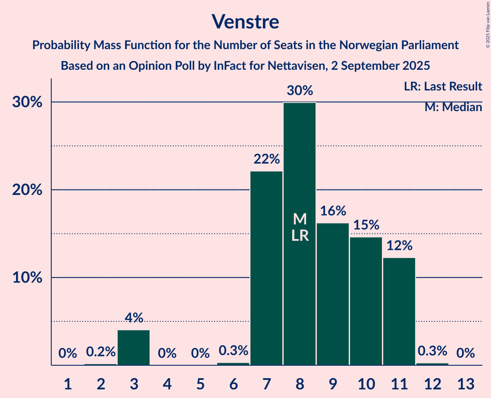
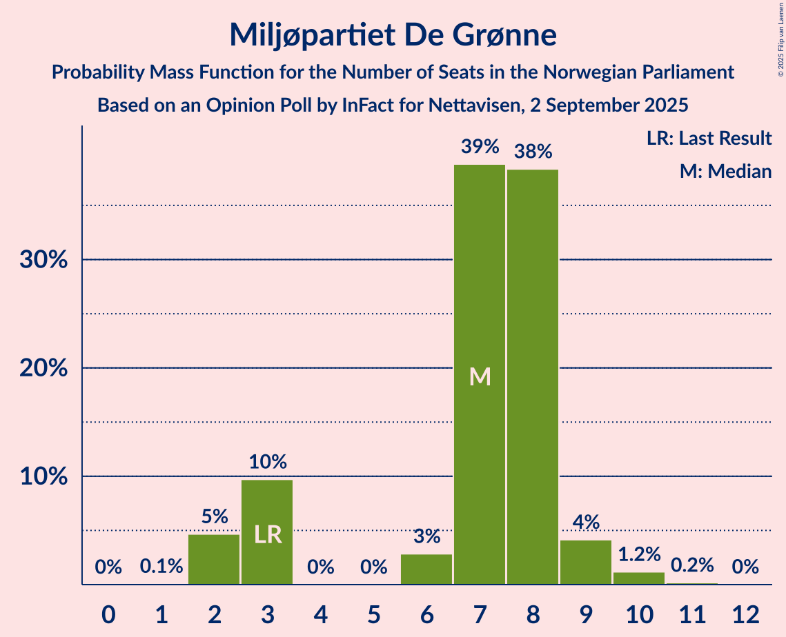
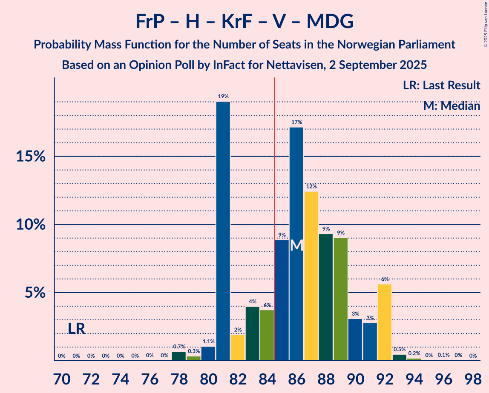
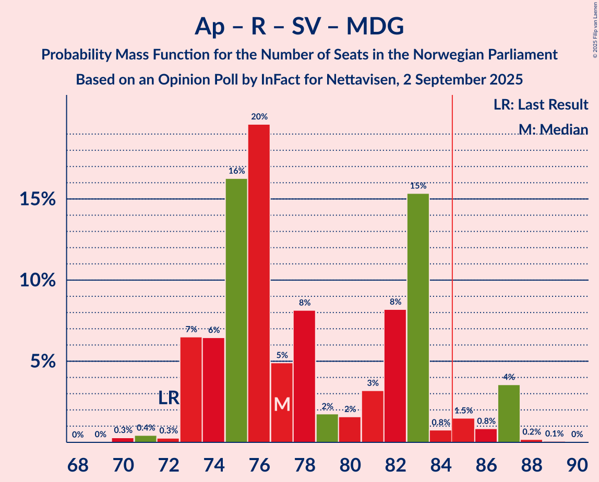
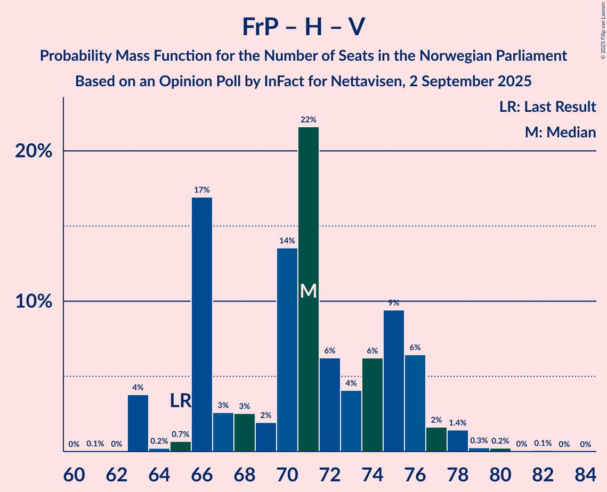

# Opinion Poll by InFact for Nettavisen, 2 September 2025

<a href="#voting-intentions">Voting Intentions</a> | <a href="#seats">Seats</a> | <a href="#coalitions">Coalitions</a> | <a href="#technical-information">Technical Information</a>

## Voting Intentions

### Confidence Intervals

| Party | Last Result | Poll Result | 80% Confidence Interval | 90% Confidence Interval | 95% Confidence Interval | 99% Confidence Interval |
|:-----:|:-----------:|:-----------:|:-----------------------:|:-----------------------:|:-----------------------:|:-----------------------:|
| Arbeiderpartiet | 26.2% | 26.5% | 24.9–28.3% |24.4–28.8% |24.0–29.2% |23.2–30.0% |
| Fremskrittspartiet | 11.6% | 21.8% | 20.3–23.5% |19.9–23.9% |19.5–24.4% |18.8–25.2% |
| Høyre | 20.4% | 13.6% | 12.4–15.0% |12.0–15.4% |11.7–15.8% |11.1–16.5% |
| Rødt | 4.7% | 7.3% | 6.4–8.4% |6.1–8.7% |5.9–9.0% |5.5–9.6% |
| Senterpartiet | 13.5% | 6.3% | 5.5–7.3% |5.2–7.7% |5.0–7.9% |4.6–8.4% |
| Sosialistisk Venstreparti | 7.6% | 5.4% | 4.6–6.4% |4.4–6.7% |4.2–6.9% |3.9–7.4% |
| Kristelig Folkeparti | 3.8% | 5.2% | 4.5–6.2% |4.2–6.5% |4.1–6.7% |3.7–7.2% |
| Venstre | 4.6% | 5.0% | 4.2–5.9% |4.0–6.2% |3.8–6.4% |3.5–6.9% |
| Miljøpartiet De Grønne | 3.9% | 4.6% | 3.9–5.5% |3.7–5.8% |3.5–6.0% |3.2–6.5% |
| Konservativt | 0.4% | 1.1% | 0.8–1.6% |0.7–1.8% |0.6–1.9% |0.5–2.2% |
| Norgesdemokratene | 1.1% | 0.6% | 0.4–1.1% |0.4–1.2% |0.3–1.3% |0.2–1.5% |
| Industri- og Næringspartiet | 0.3% | 0.6% | 0.4–1.1% |0.4–1.2% |0.3–1.3% |0.2–1.5% |
| Pensjonistpartiet | 0.6% | 0.4% | 0.2–0.7% |0.2–0.8% |0.1–0.9% |0.1–1.1% |

*Note:* The poll result column reflects the actual value used in the calculations. Published results may vary slightly, and in addition be rounded to fewer digits.

## Seats

### Confidence Intervals

| Party | Last Result | Median | 80% Confidence Interval | 90% Confidence Interval | 95% Confidence Interval | 99% Confidence Interval |
|:-----:|:-----------:|:------:|:-----------------------:|:-----------------------:|:-----------------------:|:-----------------------:|
| <a href="#arbeiderpartiet">Arbeiderpartiet</a> | 48 | 51 | 48–56 |47–58 |46–58 |46–59 |
| <a href="#fremskrittspartiet">Fremskrittspartiet</a> | 21 | 40 | 38–44 |38–45 |37–46 |35–47 |
| <a href="#høyre">Høyre</a> | 36 | 21 | 18–27 |18–28 |18–30 |17–31 |
| <a href="#rødt">Rødt</a> | 8 | 12 | 10–13 |9–14 |9–15 |8–15 |
| <a href="#senterpartiet">Senterpartiet</a> | 28 | 13 | 9–14 |9–14 |8–14 |7–15 |
| <a href="#sosialistisk-venstreparti">Sosialistisk Venstreparti</a> | 13 | 8 | 8–11 |7–11 |7–12 |2–12 |
| <a href="#kristelig-folkeparti">Kristelig Folkeparti</a> | 3 | 8 | 7–10 |7–11 |3–11 |3–12 |
| <a href="#venstre">Venstre</a> | 8 | 8 | 7–11 |7–11 |3–11 |3–11 |
| <a href="#miljøpartiet-de-grønne">Miljøpartiet De Grønne</a> | 3 | 7 | 3–8 |3–9 |2–9 |2–10 |
| <a href="#konservativt">Konservativt</a> | 0 | 0 | 0 |0 |0 |0 |
| <a href="#norgesdemokratene">Norgesdemokratene</a> | 0 | 0 | 0 |0 |0 |0 |
| <a href="#industri--og-næringspartiet">Industri- og Næringspartiet</a> | 0 | 0 | 0 |0 |0 |0 |
| <a href="#pensjonistpartiet">Pensjonistpartiet</a> | 0 | 0 | 0 |0 |0 |0 |

### Arbeiderpartiet

*For a full overview of the results for this party, see the [Arbeiderpartiet](party-arbeiderpartiet.html) page.*

| Number of Seats | Probability | Accumulated | Special Marks |
|:---------------:|:-----------:|:-----------:|:-------------:|
| 43 | 0.1% | 100% |  |
| 44 | 0.1% | 99.9% |  |
| 45 | 0.2% | 99.8% |  |
| 46 | 2% | 99.6% |  |
| 47 | 4% | 97% |  |
| 48 | 15% | 94% | Last Result |
| 49 | 13% | 79% |  |
| 50 | 9% | 66% |  |
| 51 | 20% | 57% | Median |
| 52 | 7% | 38% |  |
| 53 | 2% | 31% |  |
| 54 | 16% | 29% |  |
| 55 | 1.5% | 12% |  |
| 56 | 4% | 11% |  |
| 57 | 0.5% | 6% |  |
| 58 | 5% | 6% |  |
| 59 | 0.8% | 1.1% |  |
| 60 | 0.2% | 0.3% |  |
| 61 | 0% | 0.1% |  |
| 62 | 0% | 0.1% |  |
| 63 | 0% | 0% |  |

### Fremskrittspartiet

*For a full overview of the results for this party, see the [Fremskrittspartiet](party-fremskrittspartiet.html) page.*

| Number of Seats | Probability | Accumulated | Special Marks |
|:---------------:|:-----------:|:-----------:|:-------------:|
| 21 | 0% | 100% | Last Result |
| 22 | 0% | 100% |  |
| 23 | 0% | 100% |  |
| 24 | 0% | 100% |  |
| 25 | 0% | 100% |  |
| 26 | 0% | 100% |  |
| 27 | 0% | 100% |  |
| 28 | 0% | 100% |  |
| 29 | 0% | 100% |  |
| 30 | 0% | 100% |  |
| 31 | 0% | 100% |  |
| 32 | 0% | 100% |  |
| 33 | 0% | 100% |  |
| 34 | 0% | 100% |  |
| 35 | 0.5% | 99.9% |  |
| 36 | 0.7% | 99.5% |  |
| 37 | 2% | 98.7% |  |
| 38 | 22% | 96% |  |
| 39 | 7% | 74% |  |
| 40 | 29% | 67% | Median |
| 41 | 4% | 38% |  |
| 42 | 4% | 34% |  |
| 43 | 15% | 31% |  |
| 44 | 8% | 16% |  |
| 45 | 4% | 8% |  |
| 46 | 3% | 4% |  |
| 47 | 0.3% | 0.8% |  |
| 48 | 0.3% | 0.5% |  |
| 49 | 0.1% | 0.2% |  |
| 50 | 0% | 0.1% |  |
| 51 | 0% | 0.1% |  |
| 52 | 0% | 0% |  |

### Høyre

*For a full overview of the results for this party, see the [Høyre](party-høyre.html) page.*

| Number of Seats | Probability | Accumulated | Special Marks |
|:---------------:|:-----------:|:-----------:|:-------------:|
| 16 | 0.2% | 100% |  |
| 17 | 0.6% | 99.8% |  |
| 18 | 20% | 99.2% |  |
| 19 | 12% | 80% |  |
| 20 | 9% | 68% |  |
| 21 | 10% | 59% | Median |
| 22 | 15% | 48% |  |
| 23 | 11% | 33% |  |
| 24 | 5% | 22% |  |
| 25 | 5% | 17% |  |
| 26 | 1.4% | 12% |  |
| 27 | 3% | 10% |  |
| 28 | 3% | 7% |  |
| 29 | 0.6% | 5% |  |
| 30 | 3% | 4% |  |
| 31 | 0.6% | 0.6% |  |
| 32 | 0% | 0% |  |
| 33 | 0% | 0% |  |
| 34 | 0% | 0% |  |
| 35 | 0% | 0% |  |
| 36 | 0% | 0% | Last Result |

### Rødt

*For a full overview of the results for this party, see the [Rødt](party-rødt.html) page.*

| Number of Seats | Probability | Accumulated | Special Marks |
|:---------------:|:-----------:|:-----------:|:-------------:|
| 8 | 2% | 100% | Last Result |
| 9 | 7% | 98% |  |
| 10 | 20% | 92% |  |
| 11 | 18% | 71% |  |
| 12 | 39% | 53% | Median |
| 13 | 9% | 15% |  |
| 14 | 3% | 6% |  |
| 15 | 2% | 3% |  |
| 16 | 0.1% | 0.2% |  |
| 17 | 0% | 0.1% |  |
| 18 | 0% | 0% |  |

### Senterpartiet

*For a full overview of the results for this party, see the [Senterpartiet](party-senterpartiet.html) page.*

| Number of Seats | Probability | Accumulated | Special Marks |
|:---------------:|:-----------:|:-----------:|:-------------:|
| 6 | 0.1% | 100% |  |
| 7 | 0.5% | 99.9% |  |
| 8 | 4% | 99.4% |  |
| 9 | 20% | 95% |  |
| 10 | 7% | 75% |  |
| 11 | 4% | 68% |  |
| 12 | 9% | 63% |  |
| 13 | 29% | 55% | Median |
| 14 | 24% | 26% |  |
| 15 | 2% | 2% |  |
| 16 | 0% | 0% |  |
| 17 | 0% | 0% |  |
| 18 | 0% | 0% |  |
| 19 | 0% | 0% |  |
| 20 | 0% | 0% |  |
| 21 | 0% | 0% |  |
| 22 | 0% | 0% |  |
| 23 | 0% | 0% |  |
| 24 | 0% | 0% |  |
| 25 | 0% | 0% |  |
| 26 | 0% | 0% |  |
| 27 | 0% | 0% |  |
| 28 | 0% | 0% | Last Result |

### Sosialistisk Venstreparti

*For a full overview of the results for this party, see the [Sosialistisk Venstreparti](party-sosialistiskvenstreparti.html) page.*

| Number of Seats | Probability | Accumulated | Special Marks |
|:---------------:|:-----------:|:-----------:|:-------------:|
| 1 | 0.3% | 100% |  |
| 2 | 0.3% | 99.7% |  |
| 3 | 0.3% | 99.4% |  |
| 4 | 0% | 99.0% |  |
| 5 | 0% | 99.0% |  |
| 6 | 0.1% | 99.0% |  |
| 7 | 6% | 98.9% |  |
| 8 | 44% | 93% | Median |
| 9 | 28% | 50% |  |
| 10 | 11% | 22% |  |
| 11 | 8% | 11% |  |
| 12 | 3% | 3% |  |
| 13 | 0.1% | 0.1% | Last Result |
| 14 | 0% | 0% |  |

### Kristelig Folkeparti

*For a full overview of the results for this party, see the [Kristelig Folkeparti](party-kristeligfolkeparti.html) page.*

| Number of Seats | Probability | Accumulated | Special Marks |
|:---------------:|:-----------:|:-----------:|:-------------:|
| 2 | 0.3% | 100% |  |
| 3 | 3% | 99.7% | Last Result |
| 4 | 0% | 97% |  |
| 5 | 0% | 97% |  |
| 6 | 0.3% | 97% |  |
| 7 | 32% | 97% |  |
| 8 | 16% | 65% | Median |
| 9 | 35% | 48% |  |
| 10 | 8% | 13% |  |
| 11 | 3% | 6% |  |
| 12 | 2% | 2% |  |
| 13 | 0.2% | 0.3% |  |
| 14 | 0.1% | 0.1% |  |
| 15 | 0% | 0% |  |

### Venstre

*For a full overview of the results for this party, see the [Venstre](party-venstre.html) page.*

| Number of Seats | Probability | Accumulated | Special Marks |
|:---------------:|:-----------:|:-----------:|:-------------:|
| 2 | 0.2% | 100% |  |
| 3 | 4% | 99.8% |  |
| 4 | 0% | 96% |  |
| 5 | 0% | 96% |  |
| 6 | 0.3% | 96% |  |
| 7 | 22% | 95% |  |
| 8 | 30% | 73% | Last Result, Median |
| 9 | 16% | 43% |  |
| 10 | 15% | 27% |  |
| 11 | 12% | 13% |  |
| 12 | 0.3% | 0.3% |  |
| 13 | 0% | 0% |  |

### Miljøpartiet De Grønne

*For a full overview of the results for this party, see the [Miljøpartiet De Grønne](party-miljøpartietdegrønne.html) page.*

| Number of Seats | Probability | Accumulated | Special Marks |
|:---------------:|:-----------:|:-----------:|:-------------:|
| 1 | 0.1% | 100% |  |
| 2 | 5% | 99.9% |  |
| 3 | 10% | 95% | Last Result |
| 4 | 0% | 86% |  |
| 5 | 0% | 86% |  |
| 6 | 3% | 86% |  |
| 7 | 39% | 83% | Median |
| 8 | 38% | 44% |  |
| 9 | 4% | 6% |  |
| 10 | 1.2% | 1.4% |  |
| 11 | 0.2% | 0.2% |  |
| 12 | 0% | 0% |  |

### Konservativt

*For a full overview of the results for this party, see the [Konservativt](party-konservativt.html) page.*

| Number of Seats | Probability | Accumulated | Special Marks |
|:---------------:|:-----------:|:-----------:|:-------------:|
| 0 | 100% | 100% | Last Result, Median |

### Norgesdemokratene

*For a full overview of the results for this party, see the [Norgesdemokratene](party-norgesdemokratene.html) page.*

| Number of Seats | Probability | Accumulated | Special Marks |
|:---------------:|:-----------:|:-----------:|:-------------:|
| 0 | 100% | 100% | Last Result, Median |

### Industri- og Næringspartiet

*For a full overview of the results for this party, see the [Industri- og Næringspartiet](party-industri-ognæringspartiet.html) page.*

| Number of Seats | Probability | Accumulated | Special Marks |
|:---------------:|:-----------:|:-----------:|:-------------:|
| 0 | 100% | 100% | Last Result, Median |

### Pensjonistpartiet

*For a full overview of the results for this party, see the [Pensjonistpartiet](party-pensjonistpartiet.html) page.*

| Number of Seats | Probability | Accumulated | Special Marks |
|:---------------:|:-----------:|:-----------:|:-------------:|
| 0 | 100% | 100% | Last Result, Median |

## Coalitions

### Confidence Intervals

| Coalition | Last Result | Median | Majority? | 80% Confidence Interval | 90% Confidence Interval | 95% Confidence Interval | 99% Confidence Interval |
|:---------:|:-----------:|:------:|:---------:|:-----------------------:|:-----------------------:|:-----------------------:|:-----------------------:|
| Arbeiderpartiet – Rødt – Senterpartiet – Sosialistisk Venstreparti – Miljøpartiet De Grønne | 100 | 89 | 96% | 85–96 | 85–96 | 84–96 | 82–98 |
| Fremskrittspartiet – Høyre – Senterpartiet – Kristelig Folkeparti – Venstre | 96 | 92 | 94% | 86–95 | 84–96 | 82–96 | 82–98 |
| Arbeiderpartiet – Senterpartiet – Sosialistisk Venstreparti – Kristelig Folkeparti – Miljøpartiet De Grønne | 95 | 87 | 71% | 83–91 | 81–92 | 81–94 | 77–94 |
| Fremskrittspartiet – Høyre – Kristelig Folkeparti – Venstre – Miljøpartiet De Grønne | 71 | 86 | 69% | 81–90 | 81–92 | 81–92 | 78–93 |
| Arbeiderpartiet – Rødt – Senterpartiet – Sosialistisk Venstreparti | 97 | 83 | 31% | 79–88 | 77–88 | 77–88 | 76–91 |
| Arbeiderpartiet – Rødt – Sosialistisk Venstreparti – Miljøpartiet De Grønne | 72 | 77 | 6% | 74–83 | 73–85 | 73–87 | 71–87 |
| Fremskrittspartiet – Høyre – Kristelig Folkeparti – Venstre | 68 | 80 | 4% | 73–84 | 73–84 | 73–85 | 71–87 |
| Arbeiderpartiet – Senterpartiet – Sosialistisk Venstreparti – Miljøpartiet De Grønne | 92 | 78 | 1.4% | 74–84 | 73–84 | 73–84 | 71–88 |
| Arbeiderpartiet – Senterpartiet – Kristelig Folkeparti – Miljøpartiet De Grønne | 82 | 78 | 0.5% | 73–82 | 72–83 | 72–83 | 67–85 |
| Fremskrittspartiet – Høyre – Venstre | 65 | 71 | 0% | 66–76 | 66–76 | 63–77 | 63–79 |
| Arbeiderpartiet – Senterpartiet – Kristelig Folkeparti | 79 | 71 | 0% | 67–74 | 66–75 | 65–76 | 64–77 |
| Arbeiderpartiet – Senterpartiet – Sosialistisk Venstreparti | 89 | 71 | 0% | 68–76 | 67–76 | 65–76 | 64–79 |
| Fremskrittspartiet – Høyre | 57 | 62 | 0% | 58–67 | 58–68 | 56–69 | 56–70 |
| Arbeiderpartiet – Senterpartiet | 76 | 62 | 0% | 59–67 | 59–67 | 57–67 | 56–71 |
| Arbeiderpartiet – Sosialistisk Venstreparti | 61 | 59 | 0% | 56–65 | 55–66 | 55–67 | 54–67 |
| Høyre – Kristelig Folkeparti – Venstre | 47 | 39 | 0% | 33–43 | 33–45 | 33–46 | 31–47 |
| Senterpartiet – Kristelig Folkeparti – Venstre | 39 | 28 | 0% | 25–34 | 24–34 | 23–34 | 20–34 |

### Arbeiderpartiet – Rødt – Senterpartiet – Sosialistisk Venstreparti – Miljøpartiet De Grønne

| Number of Seats | Probability | Accumulated | Special Marks |
|:---------------:|:-----------:|:-----------:|:-------------:|
| 80 | 0% | 100% |  |
| 81 | 0.2% | 99.9% |  |
| 82 | 0.8% | 99.8% |  |
| 83 | 1.3% | 99.0% |  |
| 84 | 2% | 98% |  |
| 85 | 8% | 96% | Majority |
| 86 | 8% | 87% |  |
| 87 | 10% | 80% |  |
| 88 | 3% | 70% |  |
| 89 | 17% | 67% |  |
| 90 | 14% | 50% |  |
| 91 | 7% | 35% | Median |
| 92 | 0.8% | 28% |  |
| 93 | 3% | 27% |  |
| 94 | 2% | 24% |  |
| 95 | 2% | 22% |  |
| 96 | 19% | 20% |  |
| 97 | 0.7% | 2% |  |
| 98 | 0.8% | 1.1% |  |
| 99 | 0.3% | 0.3% |  |
| 100 | 0% | 0% | Last Result |

### Fremskrittspartiet – Høyre – Senterpartiet – Kristelig Folkeparti – Venstre

| Number of Seats | Probability | Accumulated | Special Marks |
|:---------------:|:-----------:|:-----------:|:-------------:|
| 80 | 0.1% | 100% |  |
| 81 | 0.2% | 99.9% |  |
| 82 | 4% | 99.7% |  |
| 83 | 0.8% | 96% |  |
| 84 | 1.5% | 95% |  |
| 85 | 0.8% | 94% | Majority |
| 86 | 15% | 93% |  |
| 87 | 8% | 78% |  |
| 88 | 3% | 69% |  |
| 89 | 2% | 66% |  |
| 90 | 2% | 65% | Median |
| 91 | 8% | 63% |  |
| 92 | 5% | 55% |  |
| 93 | 20% | 50% |  |
| 94 | 16% | 30% |  |
| 95 | 6% | 14% |  |
| 96 | 7% | 8% | Last Result |
| 97 | 0.3% | 1.0% |  |
| 98 | 0.4% | 0.7% |  |
| 99 | 0.3% | 0.3% |  |
| 100 | 0% | 0% |  |

### Arbeiderpartiet – Senterpartiet – Sosialistisk Venstreparti – Kristelig Folkeparti – Miljøpartiet De Grønne

| Number of Seats | Probability | Accumulated | Special Marks |
|:---------------:|:-----------:|:-----------:|:-------------:|
| 74 | 0.1% | 100% |  |
| 75 | 0% | 99.9% |  |
| 76 | 0% | 99.9% |  |
| 77 | 0.8% | 99.8% |  |
| 78 | 0.1% | 99.0% |  |
| 79 | 0.4% | 98.9% |  |
| 80 | 0.5% | 98.5% |  |
| 81 | 4% | 98% |  |
| 82 | 3% | 94% |  |
| 83 | 8% | 91% |  |
| 84 | 11% | 83% |  |
| 85 | 7% | 71% | Majority |
| 86 | 15% | 65% |  |
| 87 | 8% | 50% | Median |
| 88 | 3% | 43% |  |
| 89 | 15% | 40% |  |
| 90 | 3% | 25% |  |
| 91 | 16% | 22% |  |
| 92 | 2% | 6% |  |
| 93 | 0.2% | 4% |  |
| 94 | 4% | 4% |  |
| 95 | 0% | 0.1% | Last Result |
| 96 | 0% | 0.1% |  |
| 97 | 0% | 0% |  |

### Fremskrittspartiet – Høyre – Kristelig Folkeparti – Venstre – Miljøpartiet De Grønne

| Number of Seats | Probability | Accumulated | Special Marks |
|:---------------:|:-----------:|:-----------:|:-------------:|
| 71 | 0% | 100% | Last Result |
| 72 | 0% | 100% |  |
| 73 | 0% | 100% |  |
| 74 | 0% | 100% |  |
| 75 | 0% | 100% |  |
| 76 | 0% | 100% |  |
| 77 | 0% | 100% |  |
| 78 | 0.7% | 99.9% |  |
| 79 | 0.3% | 99.3% |  |
| 80 | 1.1% | 98.9% |  |
| 81 | 19% | 98% |  |
| 82 | 2% | 79% |  |
| 83 | 4% | 77% |  |
| 84 | 4% | 73% | Median |
| 85 | 9% | 69% | Majority |
| 86 | 17% | 60% |  |
| 87 | 12% | 43% |  |
| 88 | 9% | 31% |  |
| 89 | 9% | 21% |  |
| 90 | 3% | 12% |  |
| 91 | 3% | 9% |  |
| 92 | 6% | 6% |  |
| 93 | 0.5% | 0.8% |  |
| 94 | 0.2% | 0.4% |  |
| 95 | 0% | 0.2% |  |
| 96 | 0.1% | 0.1% |  |
| 97 | 0% | 0.1% |  |
| 98 | 0% | 0% |  |

### Arbeiderpartiet – Rødt – Senterpartiet – Sosialistisk Venstreparti

| Number of Seats | Probability | Accumulated | Special Marks |
|:---------------:|:-----------:|:-----------:|:-------------:|
| 72 | 0% | 100% |  |
| 73 | 0.1% | 99.9% |  |
| 74 | 0.1% | 99.9% |  |
| 75 | 0.2% | 99.8% |  |
| 76 | 0.5% | 99.6% |  |
| 77 | 6% | 99.1% |  |
| 78 | 3% | 94% |  |
| 79 | 3% | 91% |  |
| 80 | 9% | 88% |  |
| 81 | 9% | 79% |  |
| 82 | 12% | 69% |  |
| 83 | 17% | 57% |  |
| 84 | 9% | 40% | Median |
| 85 | 4% | 31% | Majority |
| 86 | 4% | 27% |  |
| 87 | 2% | 23% |  |
| 88 | 19% | 21% |  |
| 89 | 1.1% | 2% |  |
| 90 | 0.3% | 1.1% |  |
| 91 | 0.7% | 0.7% |  |
| 92 | 0% | 0.1% |  |
| 93 | 0% | 0% |  |
| 94 | 0% | 0% |  |
| 95 | 0% | 0% |  |
| 96 | 0% | 0% |  |
| 97 | 0% | 0% | Last Result |

### Arbeiderpartiet – Rødt – Sosialistisk Venstreparti – Miljøpartiet De Grønne

| Number of Seats | Probability | Accumulated | Special Marks |
|:---------------:|:-----------:|:-----------:|:-------------:|
| 69 | 0% | 100% |  |
| 70 | 0.3% | 99.9% |  |
| 71 | 0.4% | 99.7% |  |
| 72 | 0.3% | 99.2% | Last Result |
| 73 | 7% | 99.0% |  |
| 74 | 6% | 92% |  |
| 75 | 16% | 86% |  |
| 76 | 20% | 70% |  |
| 77 | 5% | 50% |  |
| 78 | 8% | 45% | Median |
| 79 | 2% | 37% |  |
| 80 | 2% | 35% |  |
| 81 | 3% | 34% |  |
| 82 | 8% | 31% |  |
| 83 | 15% | 22% |  |
| 84 | 0.8% | 7% |  |
| 85 | 1.5% | 6% | Majority |
| 86 | 0.8% | 5% |  |
| 87 | 4% | 4% |  |
| 88 | 0.2% | 0.3% |  |
| 89 | 0.1% | 0.1% |  |
| 90 | 0% | 0% |  |

### Fremskrittspartiet – Høyre – Kristelig Folkeparti – Venstre

| Number of Seats | Probability | Accumulated | Special Marks |
|:---------------:|:-----------:|:-----------:|:-------------:|
| 68 | 0% | 100% | Last Result |
| 69 | 0% | 100% |  |
| 70 | 0.3% | 100% |  |
| 71 | 0.8% | 99.7% |  |
| 72 | 0.7% | 98.9% |  |
| 73 | 19% | 98% |  |
| 74 | 2% | 80% |  |
| 75 | 2% | 78% |  |
| 76 | 3% | 76% |  |
| 77 | 0.8% | 73% | Median |
| 78 | 7% | 72% |  |
| 79 | 14% | 65% |  |
| 80 | 17% | 50% |  |
| 81 | 3% | 33% |  |
| 82 | 10% | 30% |  |
| 83 | 8% | 20% |  |
| 84 | 8% | 13% |  |
| 85 | 2% | 4% | Majority |
| 86 | 1.3% | 2% |  |
| 87 | 0.8% | 1.0% |  |
| 88 | 0.1% | 0.2% |  |
| 89 | 0% | 0.1% |  |
| 90 | 0% | 0% |  |

### Arbeiderpartiet – Senterpartiet – Sosialistisk Venstreparti – Miljøpartiet De Grønne

| Number of Seats | Probability | Accumulated | Special Marks |
|:---------------:|:-----------:|:-----------:|:-------------:|
| 68 | 0% | 100% |  |
| 69 | 0.2% | 99.9% |  |
| 70 | 0.1% | 99.8% |  |
| 71 | 0.6% | 99.6% |  |
| 72 | 1.2% | 99.0% |  |
| 73 | 5% | 98% |  |
| 74 | 7% | 93% |  |
| 75 | 10% | 86% |  |
| 76 | 4% | 77% |  |
| 77 | 16% | 73% |  |
| 78 | 14% | 57% |  |
| 79 | 2% | 42% | Median |
| 80 | 10% | 40% |  |
| 81 | 2% | 31% |  |
| 82 | 6% | 28% |  |
| 83 | 2% | 22% |  |
| 84 | 19% | 20% |  |
| 85 | 0.4% | 1.4% | Majority |
| 86 | 0.1% | 1.0% |  |
| 87 | 0.1% | 0.8% |  |
| 88 | 0.7% | 0.8% |  |
| 89 | 0% | 0% |  |
| 90 | 0% | 0% |  |
| 91 | 0% | 0% |  |
| 92 | 0% | 0% | Last Result |

### Arbeiderpartiet – Senterpartiet – Kristelig Folkeparti – Miljøpartiet De Grønne

| Number of Seats | Probability | Accumulated | Special Marks |
|:---------------:|:-----------:|:-----------:|:-------------:|
| 66 | 0% | 100% |  |
| 67 | 0.7% | 99.9% |  |
| 68 | 0.1% | 99.2% |  |
| 69 | 0.1% | 99.1% |  |
| 70 | 0.3% | 99.0% |  |
| 71 | 0.4% | 98.7% |  |
| 72 | 3% | 98% |  |
| 73 | 6% | 95% |  |
| 74 | 9% | 89% |  |
| 75 | 7% | 80% |  |
| 76 | 8% | 73% |  |
| 77 | 3% | 65% |  |
| 78 | 14% | 62% |  |
| 79 | 8% | 48% | Median |
| 80 | 2% | 39% |  |
| 81 | 14% | 38% |  |
| 82 | 17% | 24% | Last Result |
| 83 | 5% | 7% |  |
| 84 | 1.4% | 2% |  |
| 85 | 0.1% | 0.5% | Majority |
| 86 | 0.3% | 0.4% |  |
| 87 | 0.1% | 0.1% |  |
| 88 | 0% | 0.1% |  |
| 89 | 0% | 0% |  |

### Fremskrittspartiet – Høyre – Venstre

| Number of Seats | Probability | Accumulated | Special Marks |
|:---------------:|:-----------:|:-----------:|:-------------:|
| 61 | 0.1% | 100% |  |
| 62 | 0% | 99.9% |  |
| 63 | 4% | 99.9% |  |
| 64 | 0.2% | 96% |  |
| 65 | 0.7% | 96% | Last Result |
| 66 | 17% | 95% |  |
| 67 | 3% | 78% |  |
| 68 | 3% | 76% |  |
| 69 | 2% | 73% | Median |
| 70 | 14% | 71% |  |
| 71 | 22% | 58% |  |
| 72 | 6% | 36% |  |
| 73 | 4% | 30% |  |
| 74 | 6% | 26% |  |
| 75 | 9% | 20% |  |
| 76 | 6% | 10% |  |
| 77 | 2% | 4% |  |
| 78 | 1.4% | 2% |  |
| 79 | 0.3% | 0.6% |  |
| 80 | 0.2% | 0.4% |  |
| 81 | 0% | 0.1% |  |
| 82 | 0.1% | 0.1% |  |
| 83 | 0% | 0% |  |

### Arbeiderpartiet – Senterpartiet – Kristelig Folkeparti

| Number of Seats | Probability | Accumulated | Special Marks |
|:---------------:|:-----------:|:-----------:|:-------------:|
| 60 | 0.1% | 100% |  |
| 61 | 0% | 99.9% |  |
| 62 | 0.1% | 99.9% |  |
| 63 | 0.3% | 99.8% |  |
| 64 | 0.8% | 99.5% |  |
| 65 | 2% | 98.7% |  |
| 66 | 2% | 97% |  |
| 67 | 12% | 94% |  |
| 68 | 2% | 82% |  |
| 69 | 7% | 80% |  |
| 70 | 7% | 74% |  |
| 71 | 19% | 66% |  |
| 72 | 4% | 47% | Median |
| 73 | 6% | 43% |  |
| 74 | 28% | 37% |  |
| 75 | 6% | 9% |  |
| 76 | 1.4% | 3% |  |
| 77 | 0.7% | 1.2% |  |
| 78 | 0.3% | 0.4% |  |
| 79 | 0% | 0.2% | Last Result |
| 80 | 0.1% | 0.1% |  |
| 81 | 0% | 0% |  |

### Arbeiderpartiet – Senterpartiet – Sosialistisk Venstreparti

| Number of Seats | Probability | Accumulated | Special Marks |
|:---------------:|:-----------:|:-----------:|:-------------:|
| 60 | 0.1% | 100% |  |
| 61 | 0.1% | 99.9% |  |
| 62 | 0.2% | 99.8% |  |
| 63 | 0.1% | 99.7% |  |
| 64 | 0.1% | 99.6% |  |
| 65 | 3% | 99.5% |  |
| 66 | 0.2% | 97% |  |
| 67 | 4% | 96% |  |
| 68 | 5% | 92% |  |
| 69 | 3% | 88% |  |
| 70 | 25% | 84% |  |
| 71 | 10% | 60% |  |
| 72 | 9% | 49% | Median |
| 73 | 12% | 40% |  |
| 74 | 2% | 28% |  |
| 75 | 6% | 26% |  |
| 76 | 19% | 21% |  |
| 77 | 0.5% | 1.4% |  |
| 78 | 0.1% | 0.9% |  |
| 79 | 0.8% | 0.8% |  |
| 80 | 0% | 0.1% |  |
| 81 | 0% | 0.1% |  |
| 82 | 0% | 0% |  |
| 83 | 0% | 0% |  |
| 84 | 0% | 0% |  |
| 85 | 0% | 0% | Majority |
| 86 | 0% | 0% |  |
| 87 | 0% | 0% |  |
| 88 | 0% | 0% |  |
| 89 | 0% | 0% | Last Result |

### Fremskrittspartiet – Høyre

| Number of Seats | Probability | Accumulated | Special Marks |
|:---------------:|:-----------:|:-----------:|:-------------:|
| 55 | 0.2% | 100% |  |
| 56 | 4% | 99.7% |  |
| 57 | 0.3% | 96% | Last Result |
| 58 | 18% | 96% |  |
| 59 | 2% | 78% |  |
| 60 | 13% | 77% |  |
| 61 | 7% | 64% | Median |
| 62 | 10% | 57% |  |
| 63 | 11% | 47% |  |
| 64 | 6% | 35% |  |
| 65 | 6% | 30% |  |
| 66 | 9% | 24% |  |
| 67 | 5% | 14% |  |
| 68 | 6% | 9% |  |
| 69 | 1.2% | 3% |  |
| 70 | 1.3% | 2% |  |
| 71 | 0.3% | 0.5% |  |
| 72 | 0.1% | 0.2% |  |
| 73 | 0.1% | 0.1% |  |
| 74 | 0% | 0% |  |

### Arbeiderpartiet – Senterpartiet

| Number of Seats | Probability | Accumulated | Special Marks |
|:---------------:|:-----------:|:-----------:|:-------------:|
| 52 | 0% | 100% |  |
| 53 | 0% | 99.9% |  |
| 54 | 0.1% | 99.9% |  |
| 55 | 0.1% | 99.8% |  |
| 56 | 0.3% | 99.7% |  |
| 57 | 2% | 99.4% |  |
| 58 | 2% | 97% |  |
| 59 | 8% | 95% |  |
| 60 | 9% | 87% |  |
| 61 | 7% | 78% |  |
| 62 | 23% | 71% |  |
| 63 | 6% | 48% |  |
| 64 | 5% | 43% | Median |
| 65 | 12% | 37% |  |
| 66 | 3% | 25% |  |
| 67 | 21% | 22% |  |
| 68 | 0.5% | 2% |  |
| 69 | 0.4% | 1.3% |  |
| 70 | 0.1% | 0.9% |  |
| 71 | 0.8% | 0.8% |  |
| 72 | 0% | 0.1% |  |
| 73 | 0% | 0% |  |
| 74 | 0% | 0% |  |
| 75 | 0% | 0% |  |
| 76 | 0% | 0% | Last Result |

### Arbeiderpartiet – Sosialistisk Venstreparti

| Number of Seats | Probability | Accumulated | Special Marks |
|:---------------:|:-----------:|:-----------:|:-------------:|
| 50 | 0% | 100% |  |
| 51 | 0.1% | 99.9% |  |
| 52 | 0.1% | 99.9% |  |
| 53 | 0.1% | 99.8% |  |
| 54 | 1.3% | 99.6% |  |
| 55 | 5% | 98% |  |
| 56 | 11% | 94% |  |
| 57 | 14% | 82% |  |
| 58 | 4% | 68% |  |
| 59 | 15% | 65% | Median |
| 60 | 7% | 50% |  |
| 61 | 8% | 43% | Last Result |
| 62 | 7% | 35% |  |
| 63 | 16% | 28% |  |
| 64 | 1.3% | 12% |  |
| 65 | 0.4% | 10% |  |
| 66 | 5% | 10% |  |
| 67 | 4% | 5% |  |
| 68 | 0.1% | 0.4% |  |
| 69 | 0.2% | 0.3% |  |
| 70 | 0.1% | 0.1% |  |
| 71 | 0% | 0% |  |

### Høyre – Kristelig Folkeparti – Venstre

| Number of Seats | Probability | Accumulated | Special Marks |
|:---------------:|:-----------:|:-----------:|:-------------:|
| 29 | 0.2% | 100% |  |
| 30 | 0.3% | 99.8% |  |
| 31 | 0.5% | 99.5% |  |
| 32 | 0.5% | 99.0% |  |
| 33 | 16% | 98% |  |
| 34 | 1.0% | 82% |  |
| 35 | 16% | 81% |  |
| 36 | 5% | 65% |  |
| 37 | 5% | 60% | Median |
| 38 | 2% | 55% |  |
| 39 | 14% | 53% |  |
| 40 | 8% | 39% |  |
| 41 | 4% | 32% |  |
| 42 | 16% | 28% |  |
| 43 | 4% | 12% |  |
| 44 | 2% | 8% |  |
| 45 | 2% | 6% |  |
| 46 | 3% | 4% |  |
| 47 | 0.5% | 0.9% | Last Result |
| 48 | 0.3% | 0.4% |  |
| 49 | 0% | 0% |  |

### Senterpartiet – Kristelig Folkeparti – Venstre

| Number of Seats | Probability | Accumulated | Special Marks |
|:---------------:|:-----------:|:-----------:|:-------------:|
| 17 | 0.1% | 100% |  |
| 18 | 0.1% | 99.9% |  |
| 19 | 0.1% | 99.9% |  |
| 20 | 0.4% | 99.8% |  |
| 21 | 0.4% | 99.4% |  |
| 22 | 1.2% | 99.0% |  |
| 23 | 1.1% | 98% |  |
| 24 | 4% | 97% |  |
| 25 | 15% | 93% |  |
| 26 | 8% | 78% |  |
| 27 | 5% | 70% |  |
| 28 | 22% | 65% |  |
| 29 | 6% | 44% | Median |
| 30 | 12% | 37% |  |
| 31 | 6% | 25% |  |
| 32 | 8% | 19% |  |
| 33 | 0.9% | 11% |  |
| 34 | 10% | 10% |  |
| 35 | 0.1% | 0.1% |  |
| 36 | 0% | 0% |  |
| 37 | 0% | 0% |  |
| 38 | 0% | 0% |  |
| 39 | 0% | 0% | Last Result |

## Technical Information

### Opinion Poll

+ **Polling firm:** InFact
+ **Commissioner(s):** Nettavisen
+ **Fieldwork period:** 2 September 2025

### Calculations

+ **Sample size:** 1109
+ **Simulations done:** 2,097,152
+ **Error estimate:** 2.30%

