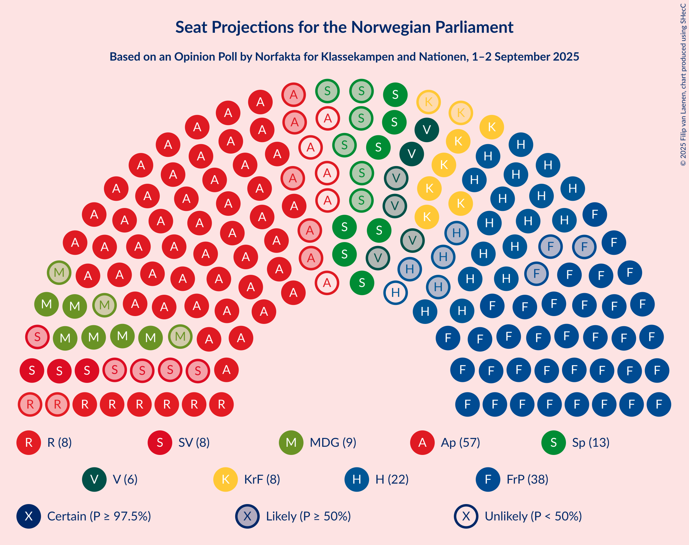
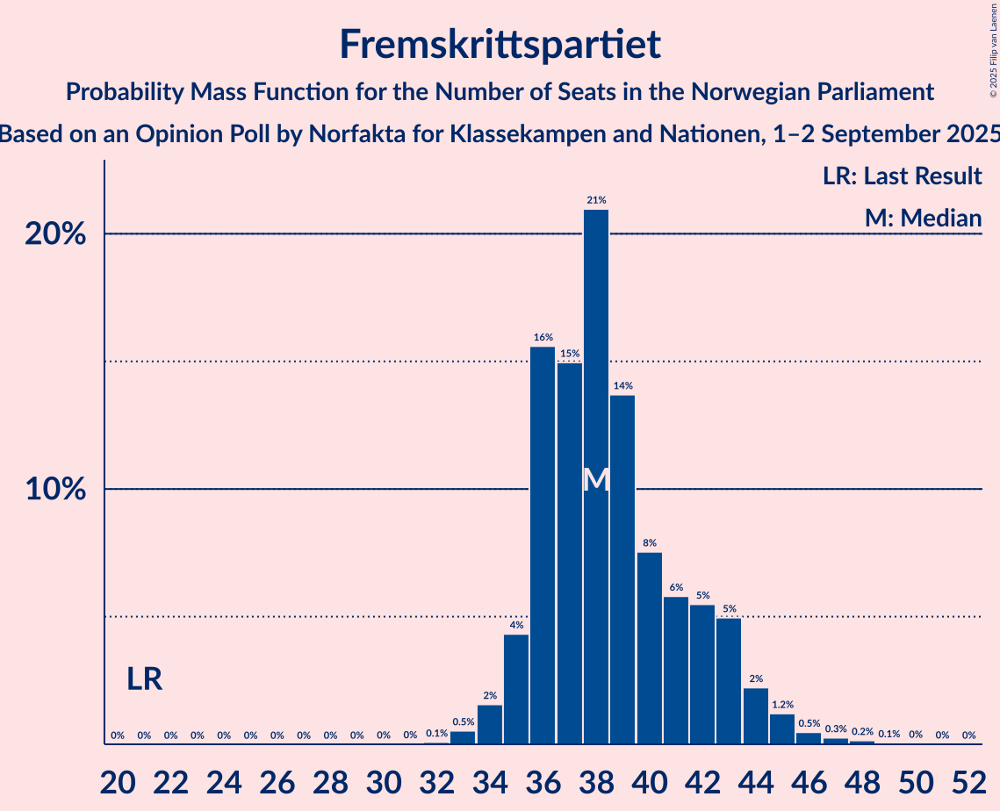
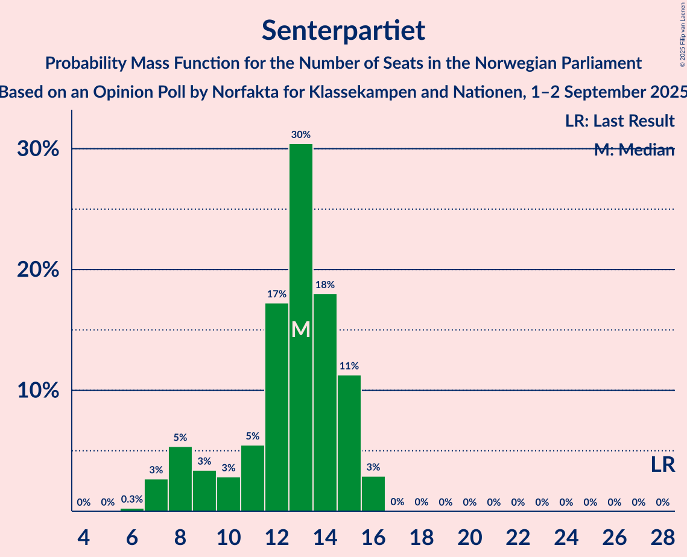
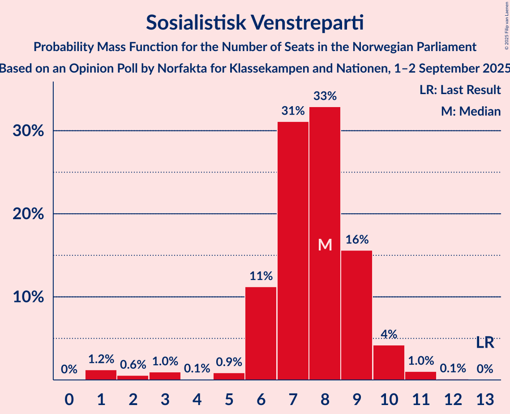
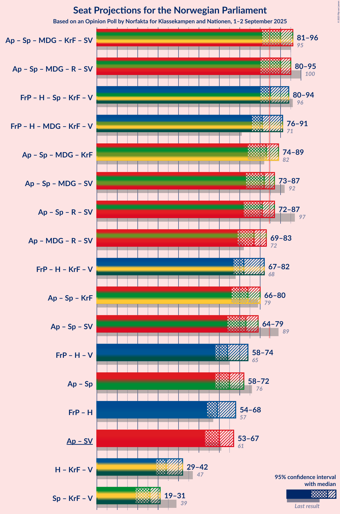
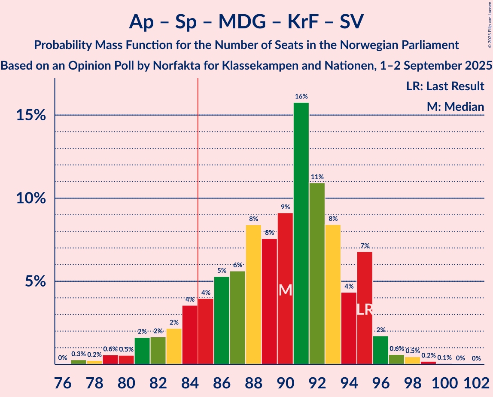
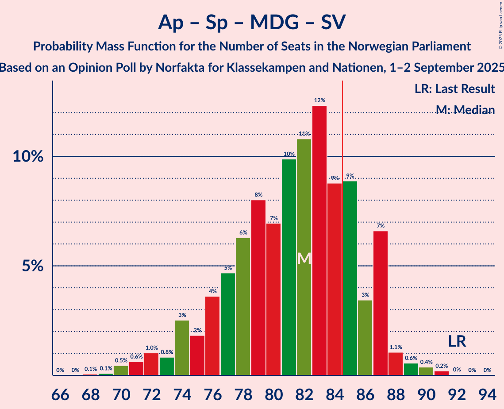
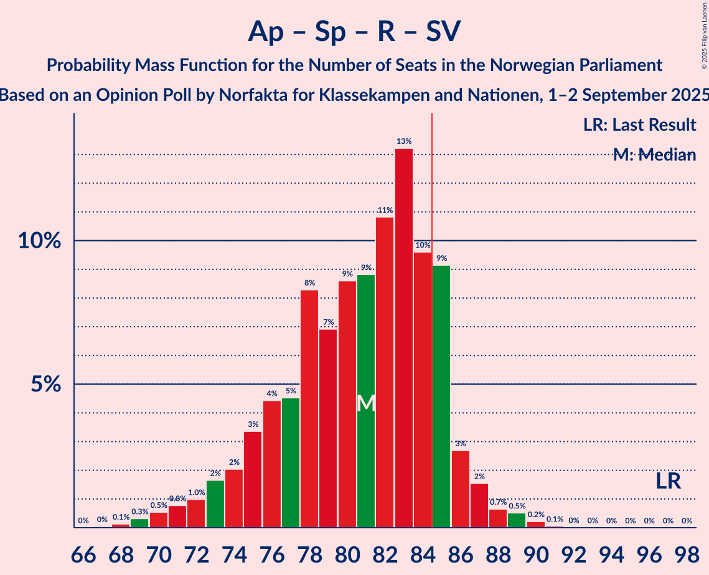
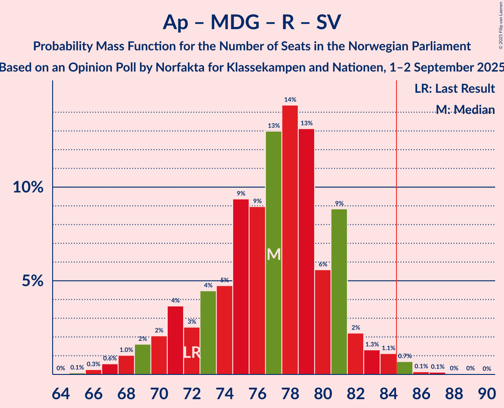
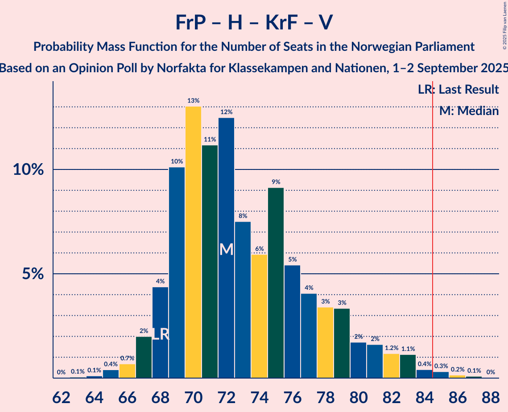

# Opinion Poll by Norfakta for Klassekampen and Nationen, 1–2 September 2025

<a href="#voting-intentions">Voting Intentions</a> | <a href="#seats">Seats</a> | <a href="#coalitions">Coalitions</a> | <a href="#technical-information">Technical Information</a>

## Voting Intentions

### Confidence Intervals

| Party | Last Result | Poll Result | 80% Confidence Interval | 90% Confidence Interval | 95% Confidence Interval | 99% Confidence Interval |
|:-----:|:-----------:|:-----------:|:-----------------------:|:-----------------------:|:-----------------------:|:-----------------------:|
| Arbeiderpartiet | 26.2% | 27.0% | 25.1–29.0% |24.5–29.6% |24.1–30.1% |23.2–31.0% |
| Fremskrittspartiet | 11.6% | 20.8% | 19.1–22.6% |18.6–23.2% |18.2–23.6% |17.4–24.5% |
| Høyre | 20.4% | 13.5% | 12.1–15.1% |11.7–15.5% |11.4–15.9% |10.7–16.8% |
| Senterpartiet | 13.5% | 7.0% | 6.0–8.3% |5.7–8.6% |5.5–9.0% |5.0–9.6% |
| Miljøpartiet De Grønne | 3.9% | 6.0% | 5.0–7.2% |4.8–7.5% |4.6–7.8% |4.2–8.4% |
| Kristelig Folkeparti | 3.8% | 5.7% | 4.8–6.9% |4.6–7.2% |4.4–7.5% |4.0–8.1% |
| Rødt | 4.7% | 5.6% | 4.7–6.8% |4.5–7.1% |4.3–7.4% |3.9–8.0% |
| Sosialistisk Venstreparti | 7.6% | 5.3% | 4.4–6.4% |4.2–6.7% |4.0–7.0% |3.6–7.6% |
| Venstre | 4.6% | 4.1% | 3.4–5.1% |3.1–5.4% |3.0–5.7% |2.6–6.2% |

*Note:* The poll result column reflects the actual value used in the calculations. Published results may vary slightly, and in addition be rounded to fewer digits.

## Seats

### Confidence Intervals

| Party | Last Result | Median | 80% Confidence Interval | 90% Confidence Interval | 95% Confidence Interval | 99% Confidence Interval |
|:-----:|:-----------:|:------:|:-----------------------:|:-----------------------:|:-----------------------:|:-----------------------:|
| <a href="#arbeiderpartiet">Arbeiderpartiet</a> | 48 | 52 | 49–57 |48–59 |47–60 |45–62 |
| <a href="#fremskrittspartiet">Fremskrittspartiet</a> | 21 | 38 | 36–42 |35–43 |35–44 |33–47 |
| <a href="#høyre">Høyre</a> | 36 | 21 | 18–26 |17–27 |17–28 |16–30 |
| <a href="#senterpartiet">Senterpartiet</a> | 28 | 13 | 9–15 |8–15 |7–16 |7–16 |
| <a href="#miljøpartiet-de-grønne">Miljøpartiet De Grønne</a> | 3 | 9 | 7–10 |7–11 |6–11 |6–12 |
| <a href="#kristelig-folkeparti">Kristelig Folkeparti</a> | 3 | 8 | 7–10 |6–11 |6–11 |5–12 |
| <a href="#rødt">Rødt</a> | 8 | 8 | 6–10 |6–10 |6–11 |1–12 |
| <a href="#sosialistisk-venstreparti">Sosialistisk Venstreparti</a> | 13 | 8 | 6–9 |6–10 |3–10 |1–11 |
| <a href="#venstre">Venstre</a> | 8 | 6 | 3–7 |2–8 |2–8 |2–9 |

### Arbeiderpartiet

*For a full overview of the results for this party, see the [Arbeiderpartiet](party-arbeiderpartiet.html) page.*

| Number of Seats | Probability | Accumulated | Special Marks |
|:---------------:|:-----------:|:-----------:|:-------------:|
| 43 | 0.1% | 100% |  |
| 44 | 0.2% | 99.9% |  |
| 45 | 0.6% | 99.8% |  |
| 46 | 1.3% | 99.2% |  |
| 47 | 2% | 98% |  |
| 48 | 5% | 96% | Last Result |
| 49 | 8% | 91% |  |
| 50 | 13% | 83% |  |
| 51 | 17% | 70% |  |
| 52 | 7% | 54% | Median |
| 53 | 13% | 47% |  |
| 54 | 8% | 34% |  |
| 55 | 3% | 26% |  |
| 56 | 7% | 23% |  |
| 57 | 6% | 16% |  |
| 58 | 4% | 10% |  |
| 59 | 2% | 6% |  |
| 60 | 2% | 3% |  |
| 61 | 0.9% | 1.5% |  |
| 62 | 0.3% | 0.6% |  |
| 63 | 0.2% | 0.3% |  |
| 64 | 0.1% | 0.1% |  |
| 65 | 0% | 0% |  |

### Fremskrittspartiet

*For a full overview of the results for this party, see the [Fremskrittspartiet](party-fremskrittspartiet.html) page.*

| Number of Seats | Probability | Accumulated | Special Marks |
|:---------------:|:-----------:|:-----------:|:-------------:|
| 21 | 0% | 100% | Last Result |
| 22 | 0% | 100% |  |
| 23 | 0% | 100% |  |
| 24 | 0% | 100% |  |
| 25 | 0% | 100% |  |
| 26 | 0% | 100% |  |
| 27 | 0% | 100% |  |
| 28 | 0% | 100% |  |
| 29 | 0% | 100% |  |
| 30 | 0% | 100% |  |
| 31 | 0% | 100% |  |
| 32 | 0.1% | 100% |  |
| 33 | 0.5% | 99.9% |  |
| 34 | 2% | 99.3% |  |
| 35 | 4% | 98% |  |
| 36 | 16% | 93% |  |
| 37 | 15% | 78% |  |
| 38 | 21% | 63% | Median |
| 39 | 14% | 42% |  |
| 40 | 8% | 28% |  |
| 41 | 6% | 21% |  |
| 42 | 5% | 15% |  |
| 43 | 5% | 9% |  |
| 44 | 2% | 4% |  |
| 45 | 1.2% | 2% |  |
| 46 | 0.5% | 1.0% |  |
| 47 | 0.3% | 0.5% |  |
| 48 | 0.2% | 0.3% |  |
| 49 | 0.1% | 0.1% |  |
| 50 | 0% | 0.1% |  |
| 51 | 0% | 0% |  |

### Høyre

*For a full overview of the results for this party, see the [Høyre](party-høyre.html) page.*

| Number of Seats | Probability | Accumulated | Special Marks |
|:---------------:|:-----------:|:-----------:|:-------------:|
| 14 | 0% | 100% |  |
| 15 | 0.3% | 99.9% |  |
| 16 | 1.3% | 99.7% |  |
| 17 | 7% | 98% |  |
| 18 | 12% | 91% |  |
| 19 | 14% | 79% |  |
| 20 | 14% | 66% |  |
| 21 | 11% | 52% | Median |
| 22 | 12% | 41% |  |
| 23 | 6% | 30% |  |
| 24 | 9% | 23% |  |
| 25 | 4% | 14% |  |
| 26 | 3% | 10% |  |
| 27 | 3% | 7% |  |
| 28 | 2% | 5% |  |
| 29 | 1.2% | 2% |  |
| 30 | 0.7% | 1.2% |  |
| 31 | 0.4% | 0.5% |  |
| 32 | 0% | 0.1% |  |
| 33 | 0% | 0% |  |
| 34 | 0% | 0% |  |
| 35 | 0% | 0% |  |
| 36 | 0% | 0% | Last Result |

### Senterpartiet

*For a full overview of the results for this party, see the [Senterpartiet](party-senterpartiet.html) page.*

| Number of Seats | Probability | Accumulated | Special Marks |
|:---------------:|:-----------:|:-----------:|:-------------:|
| 6 | 0.3% | 100% |  |
| 7 | 3% | 99.7% |  |
| 8 | 5% | 97% |  |
| 9 | 3% | 92% |  |
| 10 | 3% | 88% |  |
| 11 | 5% | 85% |  |
| 12 | 17% | 80% |  |
| 13 | 30% | 63% | Median |
| 14 | 18% | 32% |  |
| 15 | 11% | 14% |  |
| 16 | 3% | 3% |  |
| 17 | 0% | 0.1% |  |
| 18 | 0% | 0% |  |
| 19 | 0% | 0% |  |
| 20 | 0% | 0% |  |
| 21 | 0% | 0% |  |
| 22 | 0% | 0% |  |
| 23 | 0% | 0% |  |
| 24 | 0% | 0% |  |
| 25 | 0% | 0% |  |
| 26 | 0% | 0% |  |
| 27 | 0% | 0% |  |
| 28 | 0% | 0% | Last Result |

### Miljøpartiet De Grønne

*For a full overview of the results for this party, see the [Miljøpartiet De Grønne](party-miljøpartietdegrønne.html) page.*

| Number of Seats | Probability | Accumulated | Special Marks |
|:---------------:|:-----------:|:-----------:|:-------------:|
| 3 | 0.2% | 100% | Last Result |
| 4 | 0% | 99.8% |  |
| 5 | 0.1% | 99.8% |  |
| 6 | 4% | 99.7% |  |
| 7 | 14% | 96% |  |
| 8 | 22% | 83% |  |
| 9 | 38% | 60% | Median |
| 10 | 15% | 22% |  |
| 11 | 6% | 7% |  |
| 12 | 1.1% | 1.4% |  |
| 13 | 0.2% | 0.3% |  |
| 14 | 0% | 0.1% |  |
| 15 | 0% | 0% |  |

### Kristelig Folkeparti

*For a full overview of the results for this party, see the [Kristelig Folkeparti](party-kristeligfolkeparti.html) page.*

| Number of Seats | Probability | Accumulated | Special Marks |
|:---------------:|:-----------:|:-----------:|:-------------:|
| 3 | 0.4% | 100% | Last Result |
| 4 | 0% | 99.6% |  |
| 5 | 0.3% | 99.6% |  |
| 6 | 5% | 99.2% |  |
| 7 | 19% | 94% |  |
| 8 | 34% | 75% | Median |
| 9 | 24% | 41% |  |
| 10 | 12% | 17% |  |
| 11 | 5% | 6% |  |
| 12 | 0.7% | 1.1% |  |
| 13 | 0.2% | 0.3% |  |
| 14 | 0.1% | 0.1% |  |
| 15 | 0% | 0% |  |

### Rødt

*For a full overview of the results for this party, see the [Rødt](party-rødt.html) page.*

| Number of Seats | Probability | Accumulated | Special Marks |
|:---------------:|:-----------:|:-----------:|:-------------:|
| 1 | 0.7% | 100% |  |
| 2 | 0.1% | 99.3% |  |
| 3 | 0% | 99.2% |  |
| 4 | 0% | 99.2% |  |
| 5 | 0.4% | 99.2% |  |
| 6 | 12% | 98.7% |  |
| 7 | 20% | 87% |  |
| 8 | 30% | 67% | Last Result, Median |
| 9 | 23% | 37% |  |
| 10 | 10% | 14% |  |
| 11 | 3% | 4% |  |
| 12 | 0.7% | 0.8% |  |
| 13 | 0.1% | 0.1% |  |
| 14 | 0% | 0% |  |

### Sosialistisk Venstreparti

*For a full overview of the results for this party, see the [Sosialistisk Venstreparti](party-sosialistiskvenstreparti.html) page.*

| Number of Seats | Probability | Accumulated | Special Marks |
|:---------------:|:-----------:|:-----------:|:-------------:|
| 1 | 1.2% | 100% |  |
| 2 | 0.6% | 98.8% |  |
| 3 | 1.0% | 98% |  |
| 4 | 0.1% | 97% |  |
| 5 | 0.9% | 97% |  |
| 6 | 11% | 96% |  |
| 7 | 31% | 85% |  |
| 8 | 33% | 54% | Median |
| 9 | 16% | 21% |  |
| 10 | 4% | 5% |  |
| 11 | 1.0% | 1.2% |  |
| 12 | 0.1% | 0.2% |  |
| 13 | 0% | 0% | Last Result |

### Venstre

*For a full overview of the results for this party, see the [Venstre](party-venstre.html) page.*

| Number of Seats | Probability | Accumulated | Special Marks |
|:---------------:|:-----------:|:-----------:|:-------------:|
| 1 | 0.1% | 100% |  |
| 2 | 7% | 99.9% |  |
| 3 | 37% | 92% |  |
| 4 | 0% | 56% |  |
| 5 | 3% | 56% |  |
| 6 | 32% | 53% | Median |
| 7 | 15% | 21% |  |
| 8 | 5% | 6% | Last Result |
| 9 | 0.8% | 0.8% |  |
| 10 | 0.1% | 0.1% |  |
| 11 | 0% | 0% |  |

## Coalitions

### Confidence Intervals

| Coalition | Last Result | Median | Majority? | 80% Confidence Interval | 90% Confidence Interval | 95% Confidence Interval | 99% Confidence Interval |
|:---------:|:-----------:|:------:|:---------:|:-----------------------:|:-----------------------:|:-----------------------:|:-----------------------:|
| Arbeiderpartiet – Senterpartiet – Miljøpartiet De Grønne – Kristelig Folkeparti – Sosialistisk Venstreparti | 95 | 90 | 89% | 84–94 | 83–95 | 81–96 | 78–98 |
| Arbeiderpartiet – Senterpartiet – Miljøpartiet De Grønne – Rødt – Sosialistisk Venstreparti | 100 | 90 | 87% | 84–94 | 82–94 | 80–95 | 78–97 |
| Fremskrittspartiet – Høyre – Senterpartiet – Kristelig Folkeparti – Venstre | 96 | 85 | 57% | 81–91 | 80–92 | 80–94 | 77–96 |
| Fremskrittspartiet – Høyre – Miljøpartiet De Grønne – Kristelig Folkeparti – Venstre | 71 | 81 | 20% | 77–87 | 76–89 | 76–91 | 73–93 |
| Arbeiderpartiet – Senterpartiet – Miljøpartiet De Grønne – Kristelig Folkeparti | 82 | 83 | 26% | 77–87 | 76–88 | 74–89 | 72–90 |
| Arbeiderpartiet – Senterpartiet – Miljøpartiet De Grønne – Sosialistisk Venstreparti | 92 | 82 | 21% | 76–86 | 74–87 | 73–87 | 70–90 |
| Arbeiderpartiet – Senterpartiet – Rødt – Sosialistisk Venstreparti | 97 | 81 | 15% | 76–85 | 74–86 | 72–87 | 69–89 |
| Arbeiderpartiet – Miljøpartiet De Grønne – Rødt – Sosialistisk Venstreparti | 72 | 77 | 1.0% | 72–81 | 70–82 | 69–83 | 67–85 |
| Fremskrittspartiet – Høyre – Kristelig Folkeparti – Venstre | 68 | 72 | 0.6% | 69–79 | 68–80 | 67–82 | 65–85 |
| Arbeiderpartiet – Senterpartiet – Kristelig Folkeparti | 79 | 74 | 0% | 69–78 | 67–79 | 66–80 | 64–82 |
| Arbeiderpartiet – Senterpartiet – Sosialistisk Venstreparti | 89 | 73 | 0% | 68–78 | 66–78 | 64–79 | 62–81 |
| Fremskrittspartiet – Høyre – Venstre | 65 | 64 | 0% | 60–70 | 59–72 | 58–74 | 57–77 |
| Arbeiderpartiet – Senterpartiet | 76 | 65 | 0% | 61–70 | 59–71 | 58–72 | 56–74 |
| Fremskrittspartiet – Høyre | 57 | 59 | 0% | 56–65 | 55–67 | 54–68 | 53–71 |
| Arbeiderpartiet – Sosialistisk Venstreparti | 61 | 60 | 0% | 56–65 | 54–66 | 53–67 | 50–69 |
| Høyre – Kristelig Folkeparti – Venstre | 47 | 34 | 0% | 30–39 | 30–40 | 29–42 | 27–44 |
| Senterpartiet – Kristelig Folkeparti – Venstre | 39 | 26 | 0% | 22–29 | 21–30 | 19–31 | 17–33 |

### Arbeiderpartiet – Senterpartiet – Miljøpartiet De Grønne – Kristelig Folkeparti – Sosialistisk Venstreparti

| Number of Seats | Probability | Accumulated | Special Marks |
|:---------------:|:-----------:|:-----------:|:-------------:|
| 76 | 0% | 100% |  |
| 77 | 0.3% | 99.9% |  |
| 78 | 0.2% | 99.6% |  |
| 79 | 0.6% | 99.4% |  |
| 80 | 0.5% | 98.8% |  |
| 81 | 2% | 98% |  |
| 82 | 2% | 97% |  |
| 83 | 2% | 95% |  |
| 84 | 4% | 93% |  |
| 85 | 4% | 89% | Majority |
| 86 | 5% | 85% |  |
| 87 | 6% | 80% |  |
| 88 | 8% | 74% |  |
| 89 | 8% | 66% |  |
| 90 | 9% | 58% | Median |
| 91 | 16% | 49% |  |
| 92 | 11% | 34% |  |
| 93 | 8% | 23% |  |
| 94 | 4% | 14% |  |
| 95 | 7% | 10% | Last Result |
| 96 | 2% | 3% |  |
| 97 | 0.6% | 1.3% |  |
| 98 | 0.5% | 0.7% |  |
| 99 | 0.2% | 0.3% |  |
| 100 | 0.1% | 0.1% |  |
| 101 | 0% | 0% |  |

### Arbeiderpartiet – Senterpartiet – Miljøpartiet De Grønne – Rødt – Sosialistisk Venstreparti

| Number of Seats | Probability | Accumulated | Special Marks |
|:---------------:|:-----------:|:-----------:|:-------------:|
| 75 | 0% | 100% |  |
| 76 | 0.1% | 99.9% |  |
| 77 | 0.2% | 99.8% |  |
| 78 | 0.4% | 99.6% |  |
| 79 | 0.9% | 99.2% |  |
| 80 | 0.8% | 98% |  |
| 81 | 1.3% | 97% |  |
| 82 | 2% | 96% |  |
| 83 | 2% | 94% |  |
| 84 | 5% | 92% |  |
| 85 | 3% | 87% | Majority |
| 86 | 5% | 84% |  |
| 87 | 8% | 79% |  |
| 88 | 7% | 71% |  |
| 89 | 6% | 64% |  |
| 90 | 11% | 58% | Median |
| 91 | 13% | 47% |  |
| 92 | 13% | 34% |  |
| 93 | 10% | 21% |  |
| 94 | 7% | 11% |  |
| 95 | 2% | 4% |  |
| 96 | 1.0% | 2% |  |
| 97 | 0.9% | 1.3% |  |
| 98 | 0.3% | 0.4% |  |
| 99 | 0.1% | 0.2% |  |
| 100 | 0.1% | 0.1% | Last Result |
| 101 | 0% | 0% |  |

### Fremskrittspartiet – Høyre – Senterpartiet – Kristelig Folkeparti – Venstre

| Number of Seats | Probability | Accumulated | Special Marks |
|:---------------:|:-----------:|:-----------:|:-------------:|
| 75 | 0.1% | 100% |  |
| 76 | 0.1% | 99.9% |  |
| 77 | 0.4% | 99.8% |  |
| 78 | 0.9% | 99.4% |  |
| 79 | 0.7% | 98% |  |
| 80 | 4% | 98% |  |
| 81 | 5% | 94% |  |
| 82 | 7% | 89% |  |
| 83 | 12% | 83% |  |
| 84 | 13% | 70% |  |
| 85 | 14% | 57% | Majority |
| 86 | 11% | 44% | Median |
| 87 | 8% | 32% |  |
| 88 | 6% | 25% |  |
| 89 | 5% | 19% |  |
| 90 | 4% | 14% |  |
| 91 | 3% | 10% |  |
| 92 | 3% | 7% |  |
| 93 | 2% | 4% |  |
| 94 | 1.0% | 3% |  |
| 95 | 1.0% | 2% |  |
| 96 | 0.3% | 0.7% | Last Result |
| 97 | 0.2% | 0.3% |  |
| 98 | 0.1% | 0.1% |  |
| 99 | 0% | 0% |  |

### Fremskrittspartiet – Høyre – Miljøpartiet De Grønne – Kristelig Folkeparti – Venstre

| Number of Seats | Probability | Accumulated | Special Marks |
|:---------------:|:-----------:|:-----------:|:-------------:|
| 71 | 0% | 100% | Last Result |
| 72 | 0.1% | 99.9% |  |
| 73 | 0.5% | 99.9% |  |
| 74 | 0.4% | 99.3% |  |
| 75 | 0.8% | 98.9% |  |
| 76 | 4% | 98% |  |
| 77 | 6% | 94% |  |
| 78 | 12% | 88% |  |
| 79 | 10% | 77% |  |
| 80 | 12% | 66% |  |
| 81 | 8% | 55% |  |
| 82 | 10% | 47% | Median |
| 83 | 6% | 37% |  |
| 84 | 10% | 31% |  |
| 85 | 4% | 20% | Majority |
| 86 | 4% | 16% |  |
| 87 | 4% | 13% |  |
| 88 | 3% | 8% |  |
| 89 | 2% | 5% |  |
| 90 | 1.3% | 4% |  |
| 91 | 1.0% | 3% |  |
| 92 | 0.7% | 2% |  |
| 93 | 0.4% | 0.9% |  |
| 94 | 0.2% | 0.5% |  |
| 95 | 0.1% | 0.2% |  |
| 96 | 0% | 0.1% |  |
| 97 | 0.1% | 0.1% |  |
| 98 | 0% | 0% |  |

### Arbeiderpartiet – Senterpartiet – Miljøpartiet De Grønne – Kristelig Folkeparti

| Number of Seats | Probability | Accumulated | Special Marks |
|:---------------:|:-----------:|:-----------:|:-------------:|
| 69 | 0% | 100% |  |
| 70 | 0.1% | 99.9% |  |
| 71 | 0.2% | 99.8% |  |
| 72 | 0.3% | 99.6% |  |
| 73 | 0.7% | 99.3% |  |
| 74 | 1.5% | 98.6% |  |
| 75 | 2% | 97% |  |
| 76 | 3% | 95% |  |
| 77 | 4% | 93% |  |
| 78 | 6% | 89% |  |
| 79 | 4% | 83% |  |
| 80 | 11% | 79% |  |
| 81 | 8% | 67% |  |
| 82 | 8% | 59% | Last Result, Median |
| 83 | 14% | 51% |  |
| 84 | 11% | 37% |  |
| 85 | 7% | 26% | Majority |
| 86 | 9% | 20% |  |
| 87 | 4% | 11% |  |
| 88 | 4% | 7% |  |
| 89 | 2% | 3% |  |
| 90 | 0.6% | 1.0% |  |
| 91 | 0.3% | 0.4% |  |
| 92 | 0.1% | 0.1% |  |
| 93 | 0% | 0% |  |

### Arbeiderpartiet – Senterpartiet – Miljøpartiet De Grønne – Sosialistisk Venstreparti

| Number of Seats | Probability | Accumulated | Special Marks |
|:---------------:|:-----------:|:-----------:|:-------------:|
| 68 | 0.1% | 100% |  |
| 69 | 0.1% | 99.9% |  |
| 70 | 0.5% | 99.8% |  |
| 71 | 0.6% | 99.4% |  |
| 72 | 1.0% | 98.8% |  |
| 73 | 0.8% | 98% |  |
| 74 | 3% | 97% |  |
| 75 | 2% | 94% |  |
| 76 | 4% | 93% |  |
| 77 | 5% | 89% |  |
| 78 | 6% | 84% |  |
| 79 | 8% | 78% |  |
| 80 | 7% | 70% |  |
| 81 | 10% | 63% |  |
| 82 | 11% | 53% | Median |
| 83 | 12% | 42% |  |
| 84 | 9% | 30% |  |
| 85 | 9% | 21% | Majority |
| 86 | 3% | 12% |  |
| 87 | 7% | 9% |  |
| 88 | 1.1% | 2% |  |
| 89 | 0.6% | 1.2% |  |
| 90 | 0.4% | 0.6% |  |
| 91 | 0.2% | 0.3% |  |
| 92 | 0% | 0.1% | Last Result |
| 93 | 0% | 0% |  |

### Arbeiderpartiet – Senterpartiet – Rødt – Sosialistisk Venstreparti

| Number of Seats | Probability | Accumulated | Special Marks |
|:---------------:|:-----------:|:-----------:|:-------------:|
| 67 | 0% | 100% |  |
| 68 | 0.1% | 99.9% |  |
| 69 | 0.3% | 99.8% |  |
| 70 | 0.5% | 99.5% |  |
| 71 | 0.8% | 98.9% |  |
| 72 | 1.0% | 98% |  |
| 73 | 2% | 97% |  |
| 74 | 2% | 96% |  |
| 75 | 3% | 93% |  |
| 76 | 4% | 90% |  |
| 77 | 5% | 86% |  |
| 78 | 8% | 81% |  |
| 79 | 7% | 73% |  |
| 80 | 9% | 66% |  |
| 81 | 9% | 57% | Median |
| 82 | 11% | 49% |  |
| 83 | 13% | 38% |  |
| 84 | 10% | 24% |  |
| 85 | 9% | 15% | Majority |
| 86 | 3% | 6% |  |
| 87 | 2% | 3% |  |
| 88 | 0.7% | 1.5% |  |
| 89 | 0.5% | 0.8% |  |
| 90 | 0.2% | 0.3% |  |
| 91 | 0.1% | 0.1% |  |
| 92 | 0% | 0% |  |
| 93 | 0% | 0% |  |
| 94 | 0% | 0% |  |
| 95 | 0% | 0% |  |
| 96 | 0% | 0% |  |
| 97 | 0% | 0% | Last Result |

### Arbeiderpartiet – Miljøpartiet De Grønne – Rødt – Sosialistisk Venstreparti

| Number of Seats | Probability | Accumulated | Special Marks |
|:---------------:|:-----------:|:-----------:|:-------------:|
| 64 | 0% | 100% |  |
| 65 | 0.1% | 99.9% |  |
| 66 | 0.3% | 99.9% |  |
| 67 | 0.6% | 99.6% |  |
| 68 | 1.0% | 99.0% |  |
| 69 | 2% | 98% |  |
| 70 | 2% | 96% |  |
| 71 | 4% | 94% |  |
| 72 | 3% | 91% | Last Result |
| 73 | 4% | 88% |  |
| 74 | 5% | 84% |  |
| 75 | 9% | 79% |  |
| 76 | 9% | 70% |  |
| 77 | 13% | 61% | Median |
| 78 | 14% | 48% |  |
| 79 | 13% | 33% |  |
| 80 | 6% | 20% |  |
| 81 | 9% | 15% |  |
| 82 | 2% | 6% |  |
| 83 | 1.3% | 3% |  |
| 84 | 1.1% | 2% |  |
| 85 | 0.7% | 1.0% | Majority |
| 86 | 0.1% | 0.4% |  |
| 87 | 0.1% | 0.2% |  |
| 88 | 0% | 0.1% |  |
| 89 | 0% | 0.1% |  |
| 90 | 0% | 0% |  |

### Fremskrittspartiet – Høyre – Kristelig Folkeparti – Venstre

| Number of Seats | Probability | Accumulated | Special Marks |
|:---------------:|:-----------:|:-----------:|:-------------:|
| 63 | 0.1% | 100% |  |
| 64 | 0.1% | 99.9% |  |
| 65 | 0.4% | 99.8% |  |
| 66 | 0.7% | 99.4% |  |
| 67 | 2% | 98.7% |  |
| 68 | 4% | 97% | Last Result |
| 69 | 10% | 92% |  |
| 70 | 13% | 82% |  |
| 71 | 11% | 69% |  |
| 72 | 12% | 58% |  |
| 73 | 8% | 46% | Median |
| 74 | 6% | 38% |  |
| 75 | 9% | 32% |  |
| 76 | 5% | 23% |  |
| 77 | 4% | 18% |  |
| 78 | 3% | 13% |  |
| 79 | 3% | 10% |  |
| 80 | 2% | 7% |  |
| 81 | 2% | 5% |  |
| 82 | 1.2% | 3% |  |
| 83 | 1.1% | 2% |  |
| 84 | 0.4% | 1.0% |  |
| 85 | 0.3% | 0.6% | Majority |
| 86 | 0.2% | 0.3% |  |
| 87 | 0.1% | 0.1% |  |
| 88 | 0% | 0% |  |

### Arbeiderpartiet – Senterpartiet – Kristelig Folkeparti

| Number of Seats | Probability | Accumulated | Special Marks |
|:---------------:|:-----------:|:-----------:|:-------------:|
| 61 | 0% | 100% |  |
| 62 | 0.1% | 99.9% |  |
| 63 | 0.2% | 99.9% |  |
| 64 | 0.5% | 99.7% |  |
| 65 | 0.8% | 99.2% |  |
| 66 | 2% | 98% |  |
| 67 | 2% | 97% |  |
| 68 | 3% | 94% |  |
| 69 | 5% | 91% |  |
| 70 | 7% | 86% |  |
| 71 | 10% | 79% |  |
| 72 | 9% | 70% |  |
| 73 | 10% | 61% | Median |
| 74 | 15% | 52% |  |
| 75 | 8% | 36% |  |
| 76 | 7% | 29% |  |
| 77 | 9% | 22% |  |
| 78 | 3% | 13% |  |
| 79 | 5% | 10% | Last Result |
| 80 | 3% | 4% |  |
| 81 | 1.4% | 2% |  |
| 82 | 0.4% | 0.5% |  |
| 83 | 0.1% | 0.2% |  |
| 84 | 0% | 0% |  |

### Arbeiderpartiet – Senterpartiet – Sosialistisk Venstreparti

| Number of Seats | Probability | Accumulated | Special Marks |
|:---------------:|:-----------:|:-----------:|:-------------:|
| 60 | 0.1% | 100% |  |
| 61 | 0.1% | 99.9% |  |
| 62 | 0.5% | 99.7% |  |
| 63 | 0.7% | 99.3% |  |
| 64 | 2% | 98.6% |  |
| 65 | 1.1% | 97% |  |
| 66 | 2% | 96% |  |
| 67 | 3% | 94% |  |
| 68 | 5% | 91% |  |
| 69 | 6% | 87% |  |
| 70 | 9% | 81% |  |
| 71 | 7% | 72% |  |
| 72 | 12% | 64% |  |
| 73 | 8% | 52% | Median |
| 74 | 12% | 44% |  |
| 75 | 9% | 32% |  |
| 76 | 7% | 23% |  |
| 77 | 5% | 16% |  |
| 78 | 7% | 12% |  |
| 79 | 2% | 4% |  |
| 80 | 1.2% | 2% |  |
| 81 | 0.4% | 0.9% |  |
| 82 | 0.4% | 0.5% |  |
| 83 | 0% | 0.1% |  |
| 84 | 0% | 0% |  |
| 85 | 0% | 0% | Majority |
| 86 | 0% | 0% |  |
| 87 | 0% | 0% |  |
| 88 | 0% | 0% |  |
| 89 | 0% | 0% | Last Result |

### Fremskrittspartiet – Høyre – Venstre

| Number of Seats | Probability | Accumulated | Special Marks |
|:---------------:|:-----------:|:-----------:|:-------------:|
| 55 | 0% | 100% |  |
| 56 | 0.2% | 99.9% |  |
| 57 | 0.4% | 99.8% |  |
| 58 | 2% | 99.4% |  |
| 59 | 4% | 97% |  |
| 60 | 9% | 94% |  |
| 61 | 9% | 85% |  |
| 62 | 8% | 76% |  |
| 63 | 14% | 68% |  |
| 64 | 12% | 54% |  |
| 65 | 5% | 43% | Last Result, Median |
| 66 | 9% | 37% |  |
| 67 | 6% | 28% |  |
| 68 | 5% | 22% |  |
| 69 | 4% | 17% |  |
| 70 | 4% | 13% |  |
| 71 | 3% | 9% |  |
| 72 | 2% | 6% |  |
| 73 | 2% | 5% |  |
| 74 | 1.3% | 3% |  |
| 75 | 0.7% | 2% |  |
| 76 | 0.5% | 1.1% |  |
| 77 | 0.3% | 0.6% |  |
| 78 | 0.1% | 0.2% |  |
| 79 | 0.1% | 0.1% |  |
| 80 | 0.1% | 0.1% |  |
| 81 | 0% | 0% |  |

### Arbeiderpartiet – Senterpartiet

| Number of Seats | Probability | Accumulated | Special Marks |
|:---------------:|:-----------:|:-----------:|:-------------:|
| 54 | 0.1% | 100% |  |
| 55 | 0.2% | 99.9% |  |
| 56 | 0.4% | 99.7% |  |
| 57 | 1.1% | 99.3% |  |
| 58 | 1.5% | 98% |  |
| 59 | 3% | 97% |  |
| 60 | 4% | 94% |  |
| 61 | 5% | 90% |  |
| 62 | 11% | 85% |  |
| 63 | 10% | 75% |  |
| 64 | 10% | 64% |  |
| 65 | 10% | 54% | Median |
| 66 | 10% | 44% |  |
| 67 | 8% | 34% |  |
| 68 | 5% | 26% |  |
| 69 | 7% | 21% |  |
| 70 | 4% | 14% |  |
| 71 | 5% | 9% |  |
| 72 | 3% | 4% |  |
| 73 | 0.9% | 2% |  |
| 74 | 0.4% | 0.6% |  |
| 75 | 0.1% | 0.2% |  |
| 76 | 0.1% | 0.1% | Last Result |
| 77 | 0% | 0% |  |

### Fremskrittspartiet – Høyre

| Number of Seats | Probability | Accumulated | Special Marks |
|:---------------:|:-----------:|:-----------:|:-------------:|
| 51 | 0.1% | 100% |  |
| 52 | 0.2% | 99.9% |  |
| 53 | 0.6% | 99.6% |  |
| 54 | 2% | 99.0% |  |
| 55 | 5% | 97% |  |
| 56 | 9% | 91% |  |
| 57 | 16% | 83% | Last Result |
| 58 | 10% | 67% |  |
| 59 | 8% | 57% | Median |
| 60 | 12% | 48% |  |
| 61 | 9% | 36% |  |
| 62 | 7% | 27% |  |
| 63 | 3% | 20% |  |
| 64 | 5% | 17% |  |
| 65 | 3% | 12% |  |
| 66 | 2% | 9% |  |
| 67 | 2% | 6% |  |
| 68 | 1.3% | 4% |  |
| 69 | 0.8% | 2% |  |
| 70 | 0.7% | 2% |  |
| 71 | 0.7% | 1.0% |  |
| 72 | 0.2% | 0.3% |  |
| 73 | 0.1% | 0.1% |  |
| 74 | 0.1% | 0.1% |  |
| 75 | 0% | 0% |  |

### Arbeiderpartiet – Sosialistisk Venstreparti

| Number of Seats | Probability | Accumulated | Special Marks |
|:---------------:|:-----------:|:-----------:|:-------------:|
| 49 | 0.1% | 100% |  |
| 50 | 0.4% | 99.8% |  |
| 51 | 0.4% | 99.5% |  |
| 52 | 1.3% | 99.1% |  |
| 53 | 1.2% | 98% |  |
| 54 | 2% | 97% |  |
| 55 | 4% | 95% |  |
| 56 | 4% | 91% |  |
| 57 | 7% | 87% |  |
| 58 | 13% | 79% |  |
| 59 | 11% | 67% |  |
| 60 | 8% | 55% | Median |
| 61 | 17% | 47% | Last Result |
| 62 | 6% | 30% |  |
| 63 | 6% | 24% |  |
| 64 | 5% | 18% |  |
| 65 | 7% | 13% |  |
| 66 | 2% | 6% |  |
| 67 | 1.3% | 4% |  |
| 68 | 2% | 2% |  |
| 69 | 0.4% | 0.7% |  |
| 70 | 0.2% | 0.3% |  |
| 71 | 0.1% | 0.1% |  |
| 72 | 0% | 0.1% |  |
| 73 | 0% | 0% |  |

### Høyre – Kristelig Folkeparti – Venstre

| Number of Seats | Probability | Accumulated | Special Marks |
|:---------------:|:-----------:|:-----------:|:-------------:|
| 25 | 0% | 100% |  |
| 26 | 0.3% | 99.9% |  |
| 27 | 0.6% | 99.7% |  |
| 28 | 2% | 99.1% |  |
| 29 | 2% | 98% |  |
| 30 | 5% | 95% |  |
| 31 | 10% | 90% |  |
| 32 | 14% | 80% |  |
| 33 | 14% | 66% |  |
| 34 | 9% | 52% |  |
| 35 | 7% | 43% | Median |
| 36 | 9% | 36% |  |
| 37 | 7% | 27% |  |
| 38 | 5% | 20% |  |
| 39 | 7% | 15% |  |
| 40 | 3% | 8% |  |
| 41 | 1.3% | 5% |  |
| 42 | 1.4% | 4% |  |
| 43 | 1.2% | 2% |  |
| 44 | 0.7% | 1.1% |  |
| 45 | 0.2% | 0.4% |  |
| 46 | 0.1% | 0.2% |  |
| 47 | 0% | 0% | Last Result |

### Senterpartiet – Kristelig Folkeparti – Venstre

| Number of Seats | Probability | Accumulated | Special Marks |
|:---------------:|:-----------:|:-----------:|:-------------:|
| 16 | 0.2% | 100% |  |
| 17 | 0.4% | 99.8% |  |
| 18 | 1.0% | 99.4% |  |
| 19 | 2% | 98% |  |
| 20 | 1.3% | 97% |  |
| 21 | 4% | 96% |  |
| 22 | 4% | 91% |  |
| 23 | 7% | 87% |  |
| 24 | 12% | 80% |  |
| 25 | 12% | 68% |  |
| 26 | 15% | 56% |  |
| 27 | 15% | 41% | Median |
| 28 | 10% | 26% |  |
| 29 | 7% | 17% |  |
| 30 | 6% | 10% |  |
| 31 | 2% | 4% |  |
| 32 | 1.0% | 2% |  |
| 33 | 0.5% | 0.6% |  |
| 34 | 0.1% | 0.2% |  |
| 35 | 0% | 0.1% |  |
| 36 | 0% | 0% |  |
| 37 | 0% | 0% |  |
| 38 | 0% | 0% |  |
| 39 | 0% | 0% | Last Result |

## Technical Information

### Opinion Poll

+ **Polling firm:** Norfakta
+ **Commissioner(s):** Klassekampen and Nationen
+ **Fieldwork period:** 1–2 September 2025

### Calculations

+ **Sample size:** 853
+ **Simulations done:** 2,097,152
+ **Error estimate:** 1.62%

