# Opinion Poll by Opinion Perduco for Avisenes Nyhetsbyrå, Dagsavisen and FriFagbevegelse, 27 August–3 September 2025

<a href="#voting-intentions">Voting Intentions</a> | <a href="#seats">Seats</a> | <a href="#coalitions">Coalitions</a> | <a href="#technical-information">Technical Information</a>

## Voting Intentions

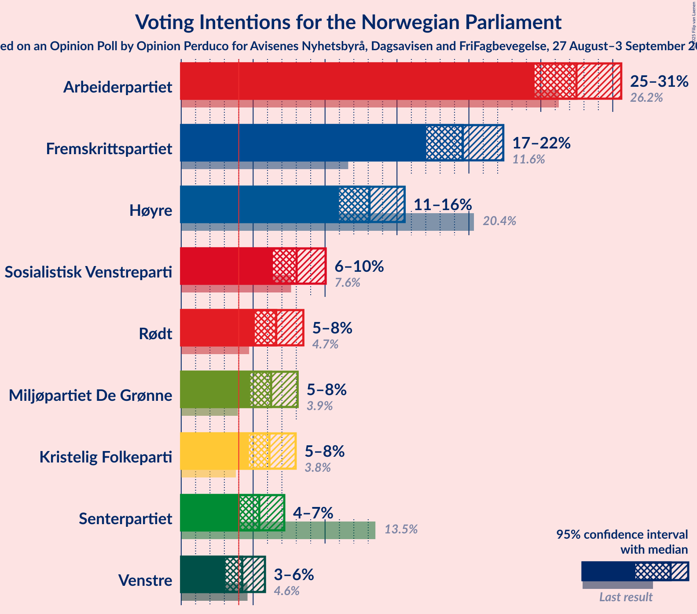

### Confidence Intervals

| Party | Last Result | Poll Result | 80% Confidence Interval | 90% Confidence Interval | 95% Confidence Interval | 99% Confidence Interval |
|:-----:|:-----------:|:-----------:|:-----------------------:|:-----------------------:|:-----------------------:|:-----------------------:|
| Arbeiderpartiet | 26.2% | 27.5% | 25.6–29.5% |25.0–30.1% |24.6–30.6% |23.7–31.6% |
| Fremskrittspartiet | 11.6% | 19.6% | 17.9–21.4% |17.4–21.9% |17.0–22.4% |16.3–23.3% |
| Høyre | 20.4% | 13.1% | 11.7–14.7% |11.3–15.1% |11.0–15.5% |10.3–16.3% |
| Sosialistisk Venstreparti | 7.6% | 8.0% | 6.9–9.3% |6.6–9.7% |6.4–10.0% |5.9–10.7% |
| Rødt | 4.7% | 6.6% | 5.6–7.8% |5.3–8.2% |5.1–8.5% |4.7–9.1% |
| Miljøpartiet De Grønne | 3.9% | 6.2% | 5.3–7.5% |5.0–7.8% |4.8–8.1% |4.4–8.7% |
| Kristelig Folkeparti | 3.8% | 6.1% | 5.2–7.3% |4.9–7.7% |4.7–8.0% |4.3–8.6% |
| Senterpartiet | 13.5% | 5.4% | 4.5–6.6% |4.3–6.9% |4.1–7.2% |3.7–7.7% |
| Venstre | 4.6% | 4.2% | 3.5–5.3% |3.3–5.6% |3.1–5.8% |2.7–6.4% |

*Note:* The poll result column reflects the actual value used in the calculations. Published results may vary slightly, and in addition be rounded to fewer digits.

## Seats

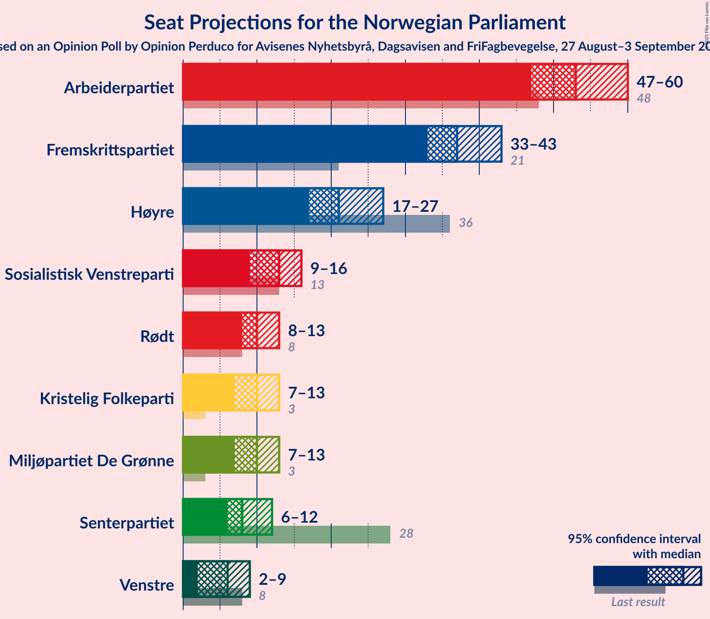

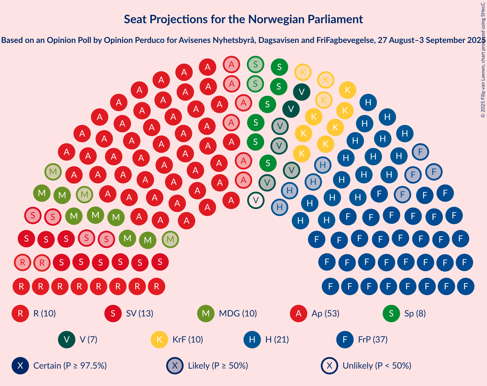

### Confidence Intervals

| Party | Last Result | Median | 80% Confidence Interval | 90% Confidence Interval | 95% Confidence Interval | 99% Confidence Interval |
|:-----:|:-----------:|:------:|:-----------------------:|:-----------------------:|:-----------------------:|:-----------------------:|
| <a href="#arbeiderpartiet">Arbeiderpartiet</a> | 48 | 53 | 49–58 |48–59 |47–60 |46–62 |
| <a href="#fremskrittspartiet">Fremskrittspartiet</a> | 21 | 37 | 34–41 |34–42 |33–43 |31–44 |
| <a href="#høyre">Høyre</a> | 36 | 21 | 18–24 |17–26 |17–27 |16–29 |
| <a href="#sosialistisk-venstreparti">Sosialistisk Venstreparti</a> | 13 | 13 | 10–15 |10–16 |9–16 |9–17 |
| <a href="#rødt">Rødt</a> | 8 | 10 | 9–12 |8–13 |8–13 |7–14 |
| <a href="#miljøpartiet-de-grønne">Miljøpartiet De Grønne</a> | 3 | 10 | 8–12 |8–12 |7–13 |7–14 |
| <a href="#kristelig-folkeparti">Kristelig Folkeparti</a> | 3 | 10 | 8–11 |7–12 |7–13 |6–14 |
| <a href="#senterpartiet">Senterpartiet</a> | 28 | 8 | 7–11 |6–12 |6–12 |1–14 |
| <a href="#venstre">Venstre</a> | 8 | 6 | 2–8 |2–8 |2–9 |2–10 |

### Arbeiderpartiet

*For a full overview of the results for this party, see the [Arbeiderpartiet](party-arbeiderpartiet.html) page.*

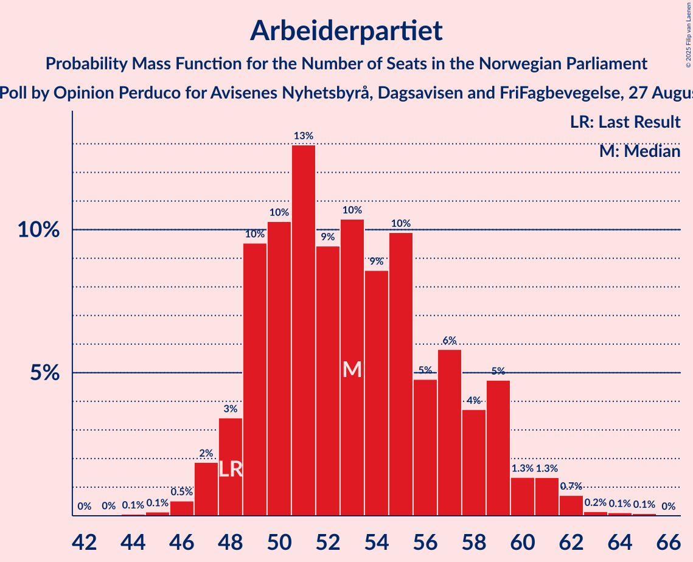

| Number of Seats | Probability | Accumulated | Special Marks |
|:---------------:|:-----------:|:-----------:|:-------------:|
| 43 | 0% | 100% |  |
| 44 | 0.1% | 99.9% |  |
| 45 | 0.1% | 99.9% |  |
| 46 | 0.5% | 99.7% |  |
| 47 | 2% | 99.2% |  |
| 48 | 3% | 97% | Last Result |
| 49 | 10% | 94% |  |
| 50 | 10% | 84% |  |
| 51 | 13% | 74% |  |
| 52 | 9% | 61% |  |
| 53 | 10% | 52% | Median |
| 54 | 9% | 41% |  |
| 55 | 10% | 33% |  |
| 56 | 5% | 23% |  |
| 57 | 6% | 18% |  |
| 58 | 4% | 12% |  |
| 59 | 5% | 9% |  |
| 60 | 1.3% | 4% |  |
| 61 | 1.3% | 2% |  |
| 62 | 0.7% | 1.1% |  |
| 63 | 0.2% | 0.4% |  |
| 64 | 0.1% | 0.2% |  |
| 65 | 0.1% | 0.1% |  |
| 66 | 0% | 0% |  |

### Fremskrittspartiet

*For a full overview of the results for this party, see the [Fremskrittspartiet](party-fremskrittspartiet.html) page.*

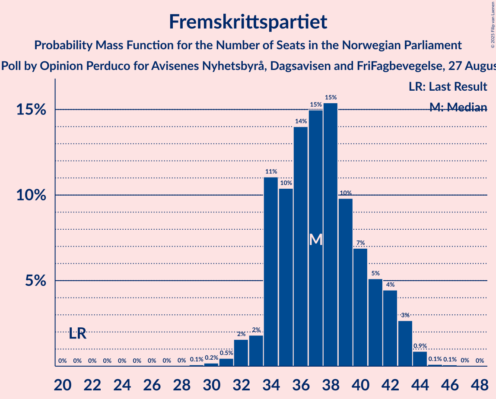

| Number of Seats | Probability | Accumulated | Special Marks |
|:---------------:|:-----------:|:-----------:|:-------------:|
| 21 | 0% | 100% | Last Result |
| 22 | 0% | 100% |  |
| 23 | 0% | 100% |  |
| 24 | 0% | 100% |  |
| 25 | 0% | 100% |  |
| 26 | 0% | 100% |  |
| 27 | 0% | 100% |  |
| 28 | 0% | 100% |  |
| 29 | 0.1% | 100% |  |
| 30 | 0.2% | 99.9% |  |
| 31 | 0.5% | 99.7% |  |
| 32 | 2% | 99.2% |  |
| 33 | 2% | 98% |  |
| 34 | 11% | 96% |  |
| 35 | 10% | 85% |  |
| 36 | 14% | 74% |  |
| 37 | 15% | 60% | Median |
| 38 | 15% | 45% |  |
| 39 | 10% | 30% |  |
| 40 | 7% | 20% |  |
| 41 | 5% | 13% |  |
| 42 | 4% | 8% |  |
| 43 | 3% | 4% |  |
| 44 | 0.9% | 1.1% |  |
| 45 | 0.1% | 0.2% |  |
| 46 | 0.1% | 0.1% |  |
| 47 | 0% | 0% |  |

### Høyre

*For a full overview of the results for this party, see the [Høyre](party-høyre.html) page.*

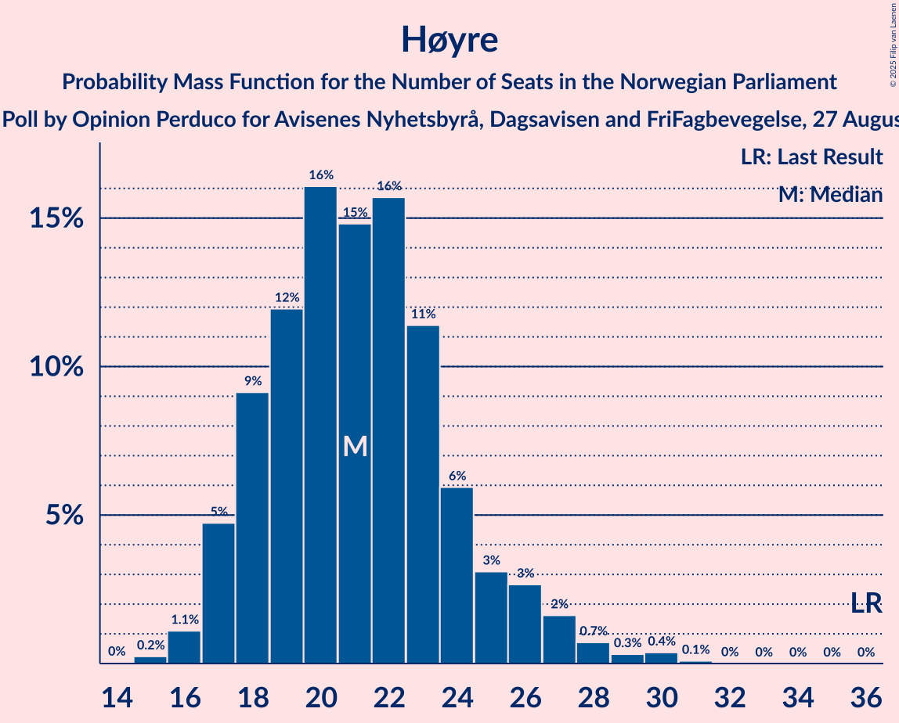

| Number of Seats | Probability | Accumulated | Special Marks |
|:---------------:|:-----------:|:-----------:|:-------------:|
| 15 | 0.2% | 100% |  |
| 16 | 1.1% | 99.7% |  |
| 17 | 5% | 98.6% |  |
| 18 | 9% | 94% |  |
| 19 | 12% | 85% |  |
| 20 | 16% | 73% |  |
| 21 | 15% | 57% | Median |
| 22 | 16% | 42% |  |
| 23 | 11% | 26% |  |
| 24 | 6% | 15% |  |
| 25 | 3% | 9% |  |
| 26 | 3% | 6% |  |
| 27 | 2% | 3% |  |
| 28 | 0.7% | 2% |  |
| 29 | 0.3% | 0.8% |  |
| 30 | 0.4% | 0.5% |  |
| 31 | 0.1% | 0.1% |  |
| 32 | 0% | 0% |  |
| 33 | 0% | 0% |  |
| 34 | 0% | 0% |  |
| 35 | 0% | 0% |  |
| 36 | 0% | 0% | Last Result |

### Sosialistisk Venstreparti

*For a full overview of the results for this party, see the [Sosialistisk Venstreparti](party-sosialistiskvenstreparti.html) page.*

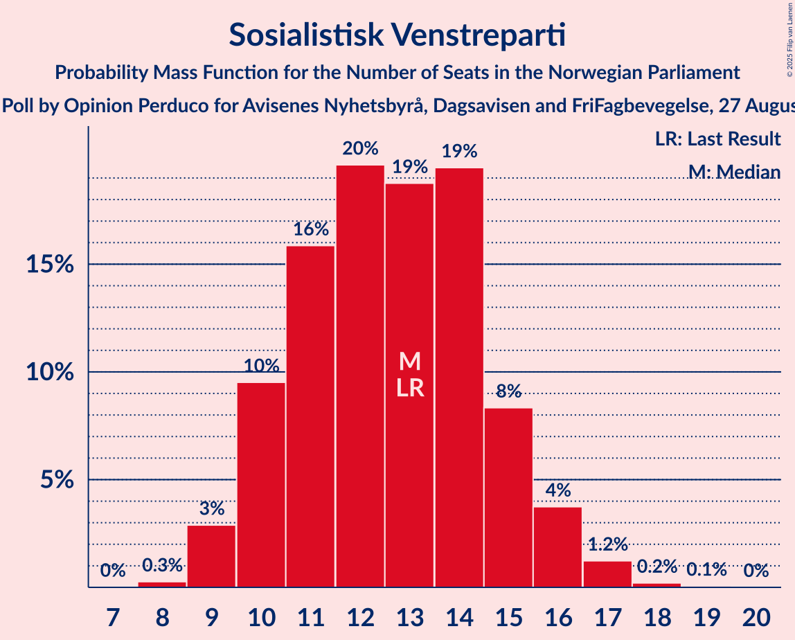

| Number of Seats | Probability | Accumulated | Special Marks |
|:---------------:|:-----------:|:-----------:|:-------------:|
| 8 | 0.3% | 100% |  |
| 9 | 3% | 99.7% |  |
| 10 | 10% | 97% |  |
| 11 | 16% | 87% |  |
| 12 | 20% | 71% |  |
| 13 | 19% | 52% | Last Result, Median |
| 14 | 19% | 33% |  |
| 15 | 8% | 14% |  |
| 16 | 4% | 5% |  |
| 17 | 1.2% | 2% |  |
| 18 | 0.2% | 0.3% |  |
| 19 | 0.1% | 0.1% |  |
| 20 | 0% | 0% |  |

### Rødt

*For a full overview of the results for this party, see the [Rødt](party-rødt.html) page.*

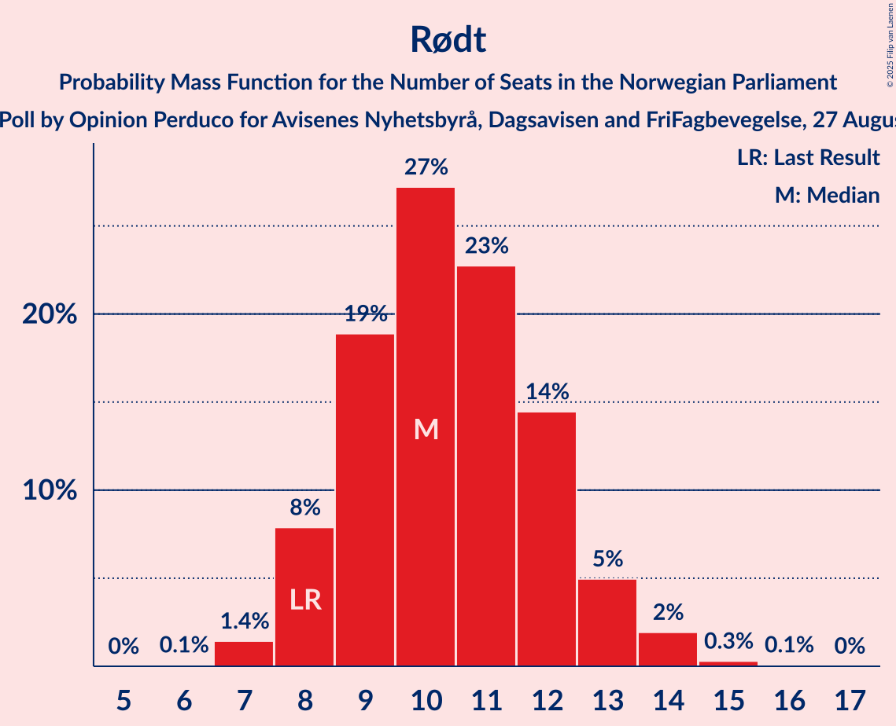

| Number of Seats | Probability | Accumulated | Special Marks |
|:---------------:|:-----------:|:-----------:|:-------------:|
| 6 | 0.1% | 100% |  |
| 7 | 1.4% | 99.9% |  |
| 8 | 8% | 98% | Last Result |
| 9 | 19% | 91% |  |
| 10 | 27% | 72% | Median |
| 11 | 23% | 44% |  |
| 12 | 14% | 22% |  |
| 13 | 5% | 7% |  |
| 14 | 2% | 2% |  |
| 15 | 0.3% | 0.4% |  |
| 16 | 0.1% | 0.1% |  |
| 17 | 0% | 0% |  |

### Miljøpartiet De Grønne

*For a full overview of the results for this party, see the [Miljøpartiet De Grønne](party-miljøpartietdegrønne.html) page.*

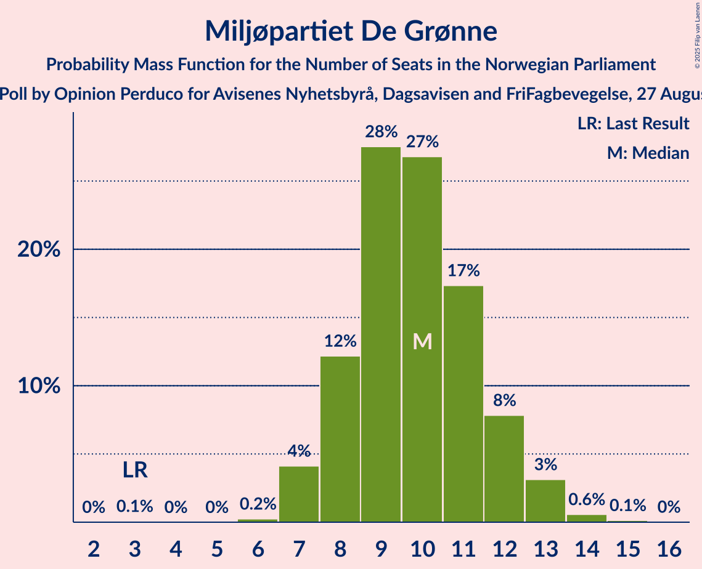

| Number of Seats | Probability | Accumulated | Special Marks |
|:---------------:|:-----------:|:-----------:|:-------------:|
| 3 | 0.1% | 100% | Last Result |
| 4 | 0% | 99.9% |  |
| 5 | 0% | 99.9% |  |
| 6 | 0.2% | 99.9% |  |
| 7 | 4% | 99.7% |  |
| 8 | 12% | 96% |  |
| 9 | 28% | 83% |  |
| 10 | 27% | 56% | Median |
| 11 | 17% | 29% |  |
| 12 | 8% | 12% |  |
| 13 | 3% | 4% |  |
| 14 | 0.6% | 0.7% |  |
| 15 | 0.1% | 0.2% |  |
| 16 | 0% | 0% |  |

### Kristelig Folkeparti

*For a full overview of the results for this party, see the [Kristelig Folkeparti](party-kristeligfolkeparti.html) page.*

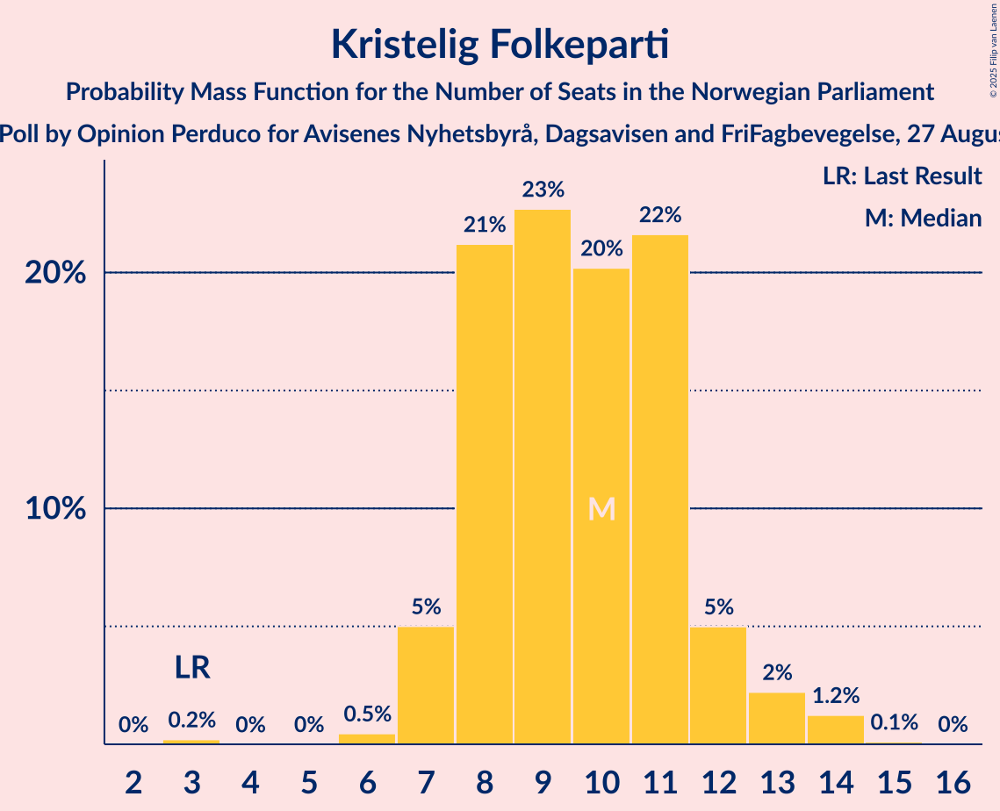

| Number of Seats | Probability | Accumulated | Special Marks |
|:---------------:|:-----------:|:-----------:|:-------------:|
| 3 | 0.2% | 100% | Last Result |
| 4 | 0% | 99.8% |  |
| 5 | 0% | 99.8% |  |
| 6 | 0.5% | 99.8% |  |
| 7 | 5% | 99.3% |  |
| 8 | 21% | 94% |  |
| 9 | 23% | 73% |  |
| 10 | 20% | 50% | Median |
| 11 | 22% | 30% |  |
| 12 | 5% | 9% |  |
| 13 | 2% | 4% |  |
| 14 | 1.2% | 1.4% |  |
| 15 | 0.1% | 0.1% |  |
| 16 | 0% | 0% |  |

### Senterpartiet

*For a full overview of the results for this party, see the [Senterpartiet](party-senterpartiet.html) page.*

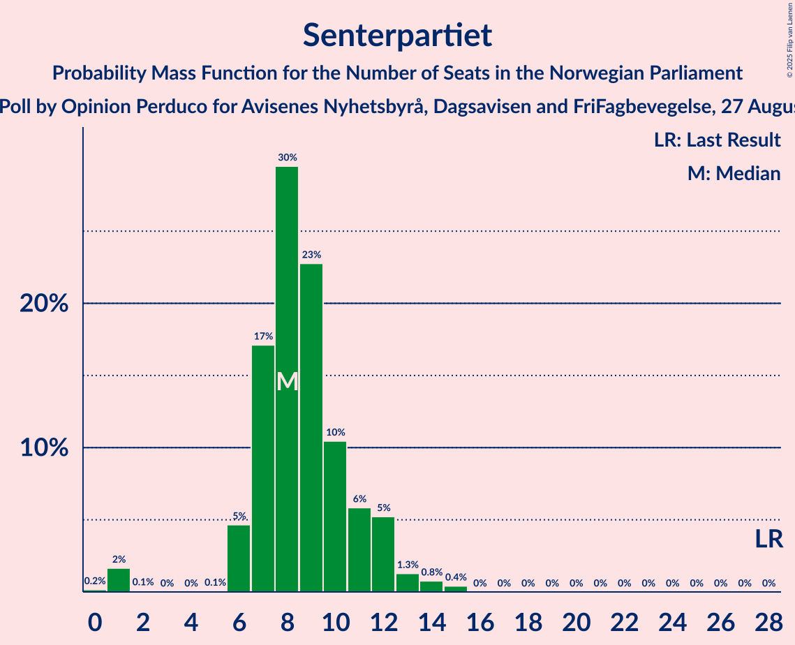

| Number of Seats | Probability | Accumulated | Special Marks |
|:---------------:|:-----------:|:-----------:|:-------------:|
| 0 | 0.2% | 100% |  |
| 1 | 2% | 99.8% |  |
| 2 | 0.1% | 98% |  |
| 3 | 0% | 98% |  |
| 4 | 0% | 98% |  |
| 5 | 0.1% | 98% |  |
| 6 | 5% | 98% |  |
| 7 | 17% | 93% |  |
| 8 | 30% | 76% | Median |
| 9 | 23% | 47% |  |
| 10 | 10% | 24% |  |
| 11 | 6% | 14% |  |
| 12 | 5% | 8% |  |
| 13 | 1.3% | 2% |  |
| 14 | 0.8% | 1.2% |  |
| 15 | 0.4% | 0.4% |  |
| 16 | 0% | 0% |  |
| 17 | 0% | 0% |  |
| 18 | 0% | 0% |  |
| 19 | 0% | 0% |  |
| 20 | 0% | 0% |  |
| 21 | 0% | 0% |  |
| 22 | 0% | 0% |  |
| 23 | 0% | 0% |  |
| 24 | 0% | 0% |  |
| 25 | 0% | 0% |  |
| 26 | 0% | 0% |  |
| 27 | 0% | 0% |  |
| 28 | 0% | 0% | Last Result |

### Venstre

*For a full overview of the results for this party, see the [Venstre](party-venstre.html) page.*

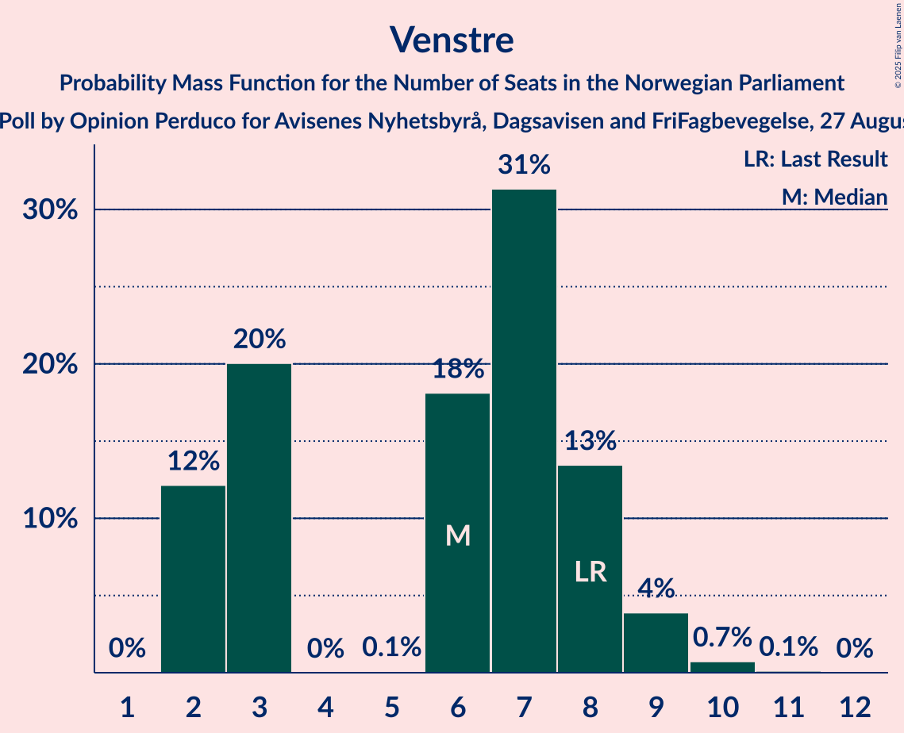

| Number of Seats | Probability | Accumulated | Special Marks |
|:---------------:|:-----------:|:-----------:|:-------------:|
| 2 | 12% | 100% |  |
| 3 | 20% | 88% |  |
| 4 | 0% | 68% |  |
| 5 | 0.1% | 68% |  |
| 6 | 18% | 68% | Median |
| 7 | 31% | 50% |  |
| 8 | 13% | 18% | Last Result |
| 9 | 4% | 5% |  |
| 10 | 0.7% | 0.9% |  |
| 11 | 0.1% | 0.1% |  |
| 12 | 0% | 0% |  |

## Coalitions

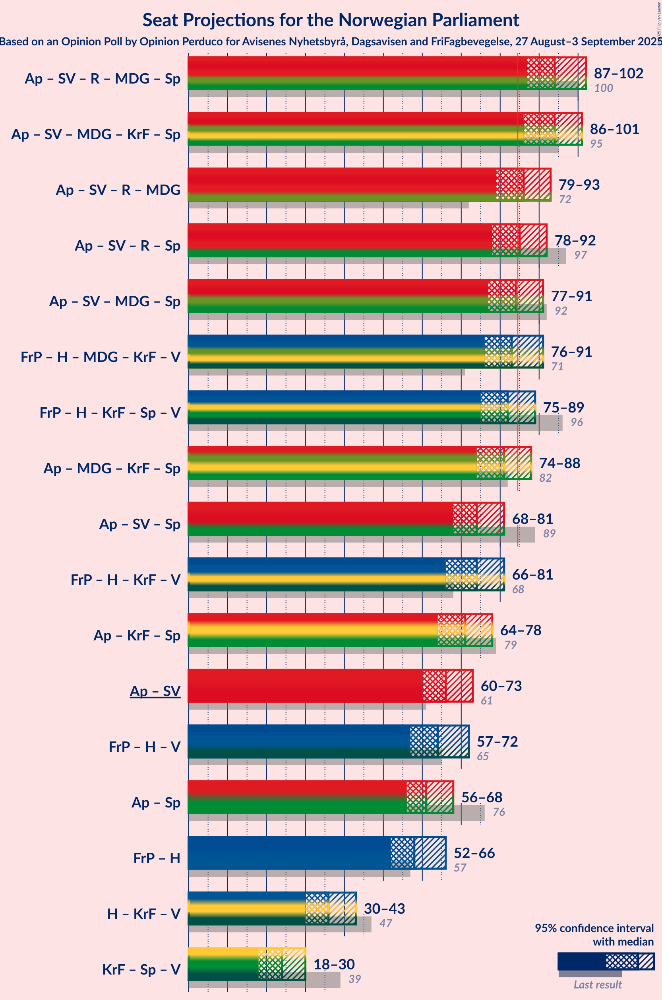

### Confidence Intervals

| Coalition | Last Result | Median | Majority? | 80% Confidence Interval | 90% Confidence Interval | 95% Confidence Interval | 99% Confidence Interval |
|:---------:|:-----------:|:------:|:---------:|:-----------------------:|:-----------------------:|:-----------------------:|:-----------------------:|
| Arbeiderpartiet – Sosialistisk Venstreparti – Rødt – Miljøpartiet De Grønne – Senterpartiet | 100 | 94 | 99.6% | 89–99 | 88–100 | 87–102 | 85–103 |
| Arbeiderpartiet – Sosialistisk Venstreparti – Miljøpartiet De Grønne – Kristelig Folkeparti – Senterpartiet | 95 | 94 | 99.2% | 88–98 | 87–100 | 86–101 | 84–103 |
| Arbeiderpartiet – Sosialistisk Venstreparti – Rødt – Miljøpartiet De Grønne | 72 | 86 | 63% | 81–90 | 80–92 | 79–93 | 77–95 |
| Arbeiderpartiet – Sosialistisk Venstreparti – Rødt – Senterpartiet | 97 | 85 | 51% | 80–89 | 79–90 | 78–92 | 75–93 |
| Arbeiderpartiet – Sosialistisk Venstreparti – Miljøpartiet De Grønne – Senterpartiet | 92 | 84 | 46% | 79–89 | 78–90 | 77–91 | 75–93 |
| Fremskrittspartiet – Høyre – Miljøpartiet De Grønne – Kristelig Folkeparti – Venstre | 71 | 83 | 39% | 79–88 | 77–90 | 76–91 | 74–92 |
| Fremskrittspartiet – Høyre – Kristelig Folkeparti – Senterpartiet – Venstre | 96 | 82 | 29% | 78–87 | 76–88 | 75–89 | 73–91 |
| Arbeiderpartiet – Miljøpartiet De Grønne – Kristelig Folkeparti – Senterpartiet | 82 | 81 | 17% | 76–86 | 75–87 | 74–88 | 72–90 |
| Arbeiderpartiet – Sosialistisk Venstreparti – Senterpartiet | 89 | 74 | 0.1% | 70–79 | 69–80 | 68–81 | 66–83 |
| Fremskrittspartiet – Høyre – Kristelig Folkeparti – Venstre | 68 | 74 | 0.1% | 69–78 | 67–80 | 66–81 | 65–83 |
| Arbeiderpartiet – Kristelig Folkeparti – Senterpartiet | 79 | 71 | 0% | 67–76 | 66–77 | 64–78 | 63–80 |
| Arbeiderpartiet – Sosialistisk Venstreparti | 61 | 66 | 0% | 61–70 | 61–71 | 60–73 | 58–75 |
| Fremskrittspartiet – Høyre – Venstre | 65 | 64 | 0% | 59–70 | 58–71 | 57–72 | 55–74 |
| Arbeiderpartiet – Senterpartiet | 76 | 61 | 0% | 57–67 | 56–67 | 56–68 | 53–70 |
| Fremskrittspartiet – Høyre | 57 | 58 | 0% | 54–63 | 53–65 | 52–66 | 51–68 |
| Høyre – Kristelig Folkeparti – Venstre | 47 | 36 | 0% | 32–41 | 31–42 | 30–43 | 28–45 |
| Kristelig Folkeparti – Senterpartiet – Venstre | 39 | 24 | 0% | 20–28 | 19–29 | 18–30 | 16–32 |

### Arbeiderpartiet – Sosialistisk Venstreparti – Rødt – Miljøpartiet De Grønne – Senterpartiet

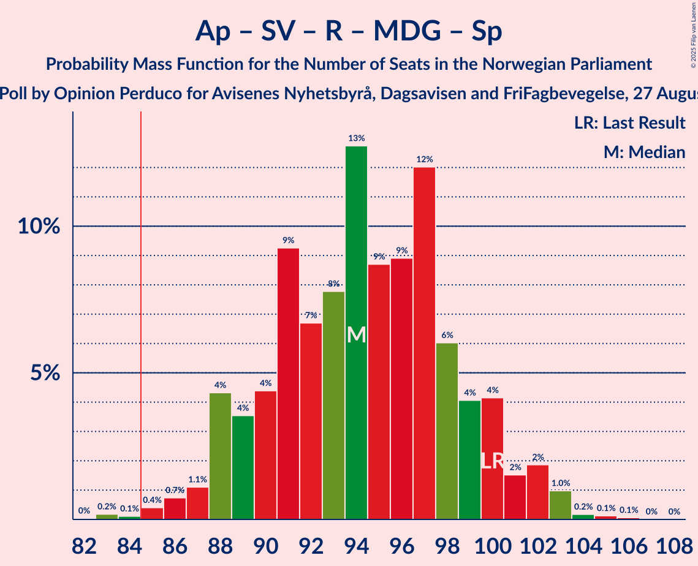

| Number of Seats | Probability | Accumulated | Special Marks |
|:---------------:|:-----------:|:-----------:|:-------------:|
| 82 | 0% | 100% |  |
| 83 | 0.2% | 99.9% |  |
| 84 | 0.1% | 99.7% |  |
| 85 | 0.4% | 99.6% | Majority |
| 86 | 0.7% | 99.2% |  |
| 87 | 1.1% | 98% |  |
| 88 | 4% | 97% |  |
| 89 | 4% | 93% |  |
| 90 | 4% | 90% |  |
| 91 | 9% | 85% |  |
| 92 | 7% | 76% |  |
| 93 | 8% | 69% |  |
| 94 | 13% | 61% | Median |
| 95 | 9% | 49% |  |
| 96 | 9% | 40% |  |
| 97 | 12% | 31% |  |
| 98 | 6% | 19% |  |
| 99 | 4% | 13% |  |
| 100 | 4% | 9% | Last Result |
| 101 | 2% | 5% |  |
| 102 | 2% | 3% |  |
| 103 | 1.0% | 1.4% |  |
| 104 | 0.2% | 0.4% |  |
| 105 | 0.1% | 0.2% |  |
| 106 | 0.1% | 0.1% |  |
| 107 | 0% | 0% |  |

### Arbeiderpartiet – Sosialistisk Venstreparti – Miljøpartiet De Grønne – Kristelig Folkeparti – Senterpartiet

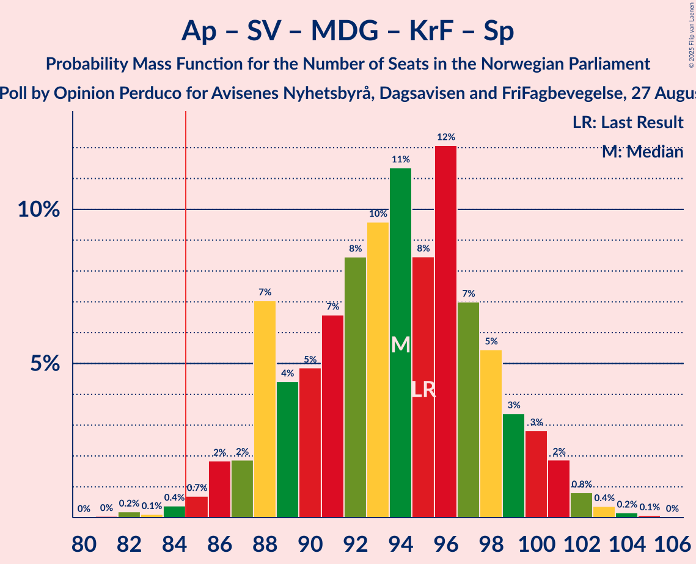

| Number of Seats | Probability | Accumulated | Special Marks |
|:---------------:|:-----------:|:-----------:|:-------------:|
| 81 | 0% | 100% |  |
| 82 | 0.2% | 99.9% |  |
| 83 | 0.1% | 99.7% |  |
| 84 | 0.4% | 99.6% |  |
| 85 | 0.7% | 99.2% | Majority |
| 86 | 2% | 98.5% |  |
| 87 | 2% | 97% |  |
| 88 | 7% | 95% |  |
| 89 | 4% | 88% |  |
| 90 | 5% | 83% |  |
| 91 | 7% | 78% |  |
| 92 | 8% | 72% |  |
| 93 | 10% | 63% |  |
| 94 | 11% | 54% | Median |
| 95 | 8% | 43% | Last Result |
| 96 | 12% | 34% |  |
| 97 | 7% | 22% |  |
| 98 | 5% | 15% |  |
| 99 | 3% | 10% |  |
| 100 | 3% | 6% |  |
| 101 | 2% | 3% |  |
| 102 | 0.8% | 1.4% |  |
| 103 | 0.4% | 0.6% |  |
| 104 | 0.2% | 0.3% |  |
| 105 | 0.1% | 0.1% |  |
| 106 | 0% | 0% |  |

### Arbeiderpartiet – Sosialistisk Venstreparti – Rødt – Miljøpartiet De Grønne

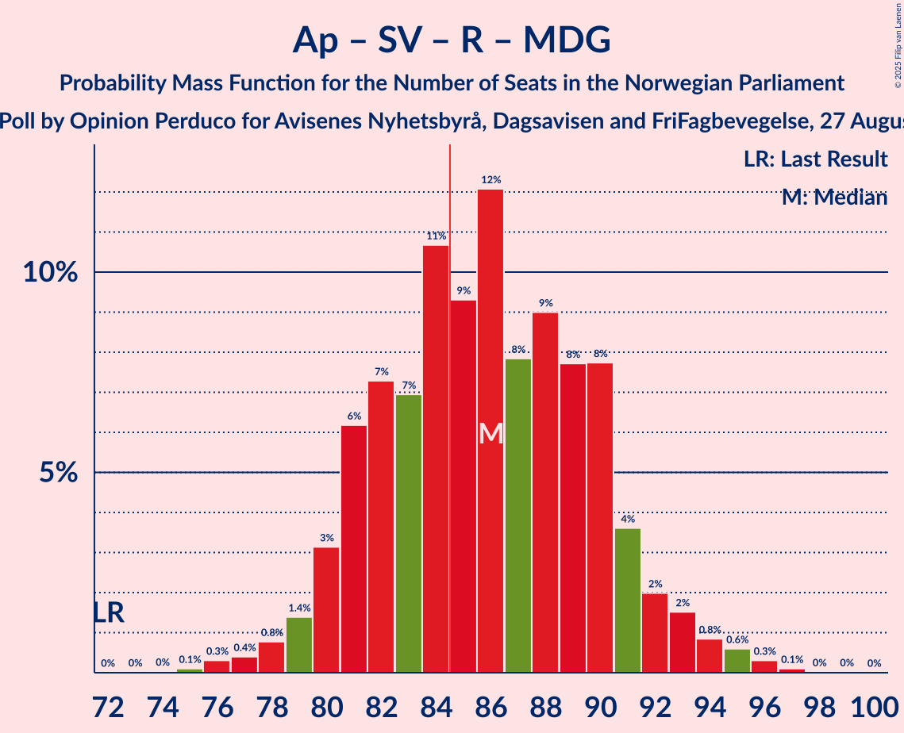

| Number of Seats | Probability | Accumulated | Special Marks |
|:---------------:|:-----------:|:-----------:|:-------------:|
| 72 | 0% | 100% | Last Result |
| 73 | 0% | 100% |  |
| 74 | 0% | 100% |  |
| 75 | 0.1% | 99.9% |  |
| 76 | 0.3% | 99.8% |  |
| 77 | 0.4% | 99.5% |  |
| 78 | 0.8% | 99.1% |  |
| 79 | 1.4% | 98% |  |
| 80 | 3% | 97% |  |
| 81 | 6% | 94% |  |
| 82 | 7% | 88% |  |
| 83 | 7% | 80% |  |
| 84 | 11% | 73% |  |
| 85 | 9% | 63% | Majority |
| 86 | 12% | 53% | Median |
| 87 | 8% | 41% |  |
| 88 | 9% | 33% |  |
| 89 | 8% | 24% |  |
| 90 | 8% | 17% |  |
| 91 | 4% | 9% |  |
| 92 | 2% | 5% |  |
| 93 | 2% | 3% |  |
| 94 | 0.8% | 2% |  |
| 95 | 0.6% | 1.1% |  |
| 96 | 0.3% | 0.5% |  |
| 97 | 0.1% | 0.2% |  |
| 98 | 0% | 0.1% |  |
| 99 | 0% | 0% |  |

### Arbeiderpartiet – Sosialistisk Venstreparti – Rødt – Senterpartiet

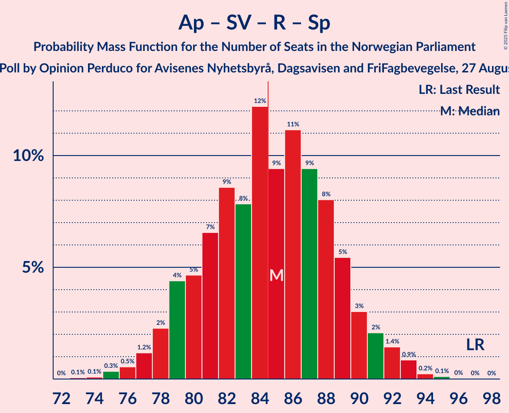

| Number of Seats | Probability | Accumulated | Special Marks |
|:---------------:|:-----------:|:-----------:|:-------------:|
| 73 | 0.1% | 100% |  |
| 74 | 0.1% | 99.9% |  |
| 75 | 0.3% | 99.8% |  |
| 76 | 0.5% | 99.5% |  |
| 77 | 1.2% | 98.9% |  |
| 78 | 2% | 98% |  |
| 79 | 4% | 95% |  |
| 80 | 5% | 91% |  |
| 81 | 7% | 86% |  |
| 82 | 9% | 80% |  |
| 83 | 8% | 71% |  |
| 84 | 12% | 63% | Median |
| 85 | 9% | 51% | Majority |
| 86 | 11% | 42% |  |
| 87 | 9% | 31% |  |
| 88 | 8% | 21% |  |
| 89 | 5% | 13% |  |
| 90 | 3% | 8% |  |
| 91 | 2% | 5% |  |
| 92 | 1.4% | 3% |  |
| 93 | 0.9% | 1.3% |  |
| 94 | 0.2% | 0.4% |  |
| 95 | 0.1% | 0.2% |  |
| 96 | 0% | 0.1% |  |
| 97 | 0% | 0% | Last Result |

### Arbeiderpartiet – Sosialistisk Venstreparti – Miljøpartiet De Grønne – Senterpartiet

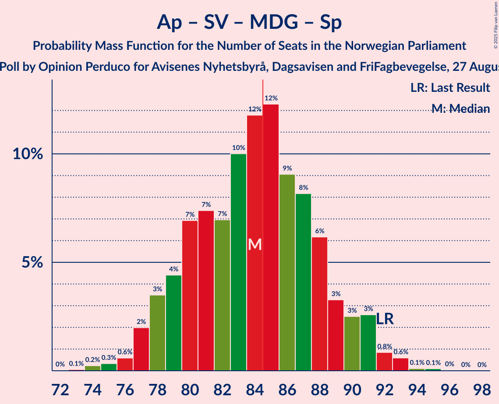

| Number of Seats | Probability | Accumulated | Special Marks |
|:---------------:|:-----------:|:-----------:|:-------------:|
| 73 | 0.1% | 100% |  |
| 74 | 0.2% | 99.9% |  |
| 75 | 0.3% | 99.7% |  |
| 76 | 0.6% | 99.3% |  |
| 77 | 2% | 98.7% |  |
| 78 | 3% | 97% |  |
| 79 | 4% | 93% |  |
| 80 | 7% | 89% |  |
| 81 | 7% | 82% |  |
| 82 | 7% | 75% |  |
| 83 | 10% | 68% |  |
| 84 | 12% | 58% | Median |
| 85 | 12% | 46% | Majority |
| 86 | 9% | 33% |  |
| 87 | 8% | 24% |  |
| 88 | 6% | 16% |  |
| 89 | 3% | 10% |  |
| 90 | 3% | 7% |  |
| 91 | 3% | 4% |  |
| 92 | 0.8% | 2% | Last Result |
| 93 | 0.6% | 0.8% |  |
| 94 | 0.1% | 0.3% |  |
| 95 | 0.1% | 0.1% |  |
| 96 | 0% | 0.1% |  |
| 97 | 0% | 0% |  |

### Fremskrittspartiet – Høyre – Miljøpartiet De Grønne – Kristelig Folkeparti – Venstre

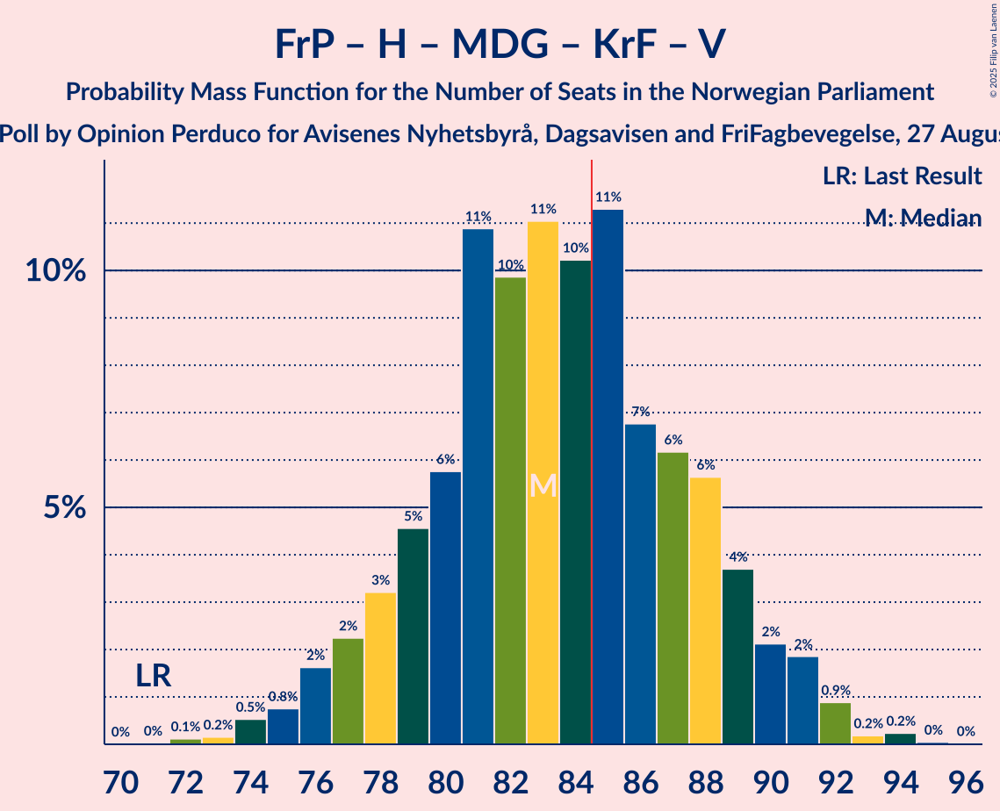

| Number of Seats | Probability | Accumulated | Special Marks |
|:---------------:|:-----------:|:-----------:|:-------------:|
| 71 | 0% | 100% | Last Result |
| 72 | 0.1% | 100% |  |
| 73 | 0.2% | 99.8% |  |
| 74 | 0.5% | 99.7% |  |
| 75 | 0.8% | 99.1% |  |
| 76 | 2% | 98% |  |
| 77 | 2% | 97% |  |
| 78 | 3% | 95% |  |
| 79 | 5% | 91% |  |
| 80 | 6% | 87% |  |
| 81 | 11% | 81% |  |
| 82 | 10% | 70% |  |
| 83 | 11% | 60% |  |
| 84 | 10% | 49% | Median |
| 85 | 11% | 39% | Majority |
| 86 | 7% | 28% |  |
| 87 | 6% | 21% |  |
| 88 | 6% | 15% |  |
| 89 | 4% | 9% |  |
| 90 | 2% | 5% |  |
| 91 | 2% | 3% |  |
| 92 | 0.9% | 1.4% |  |
| 93 | 0.2% | 0.5% |  |
| 94 | 0.2% | 0.3% |  |
| 95 | 0% | 0.1% |  |
| 96 | 0% | 0% |  |

### Fremskrittspartiet – Høyre – Kristelig Folkeparti – Senterpartiet – Venstre

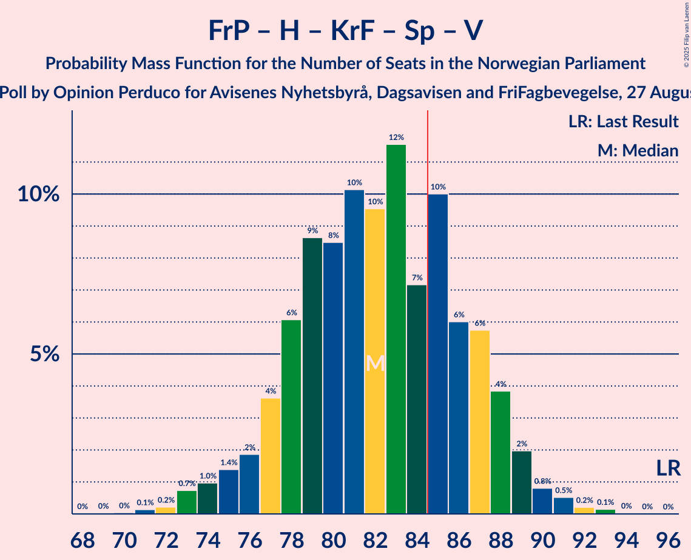

| Number of Seats | Probability | Accumulated | Special Marks |
|:---------------:|:-----------:|:-----------:|:-------------:|
| 69 | 0% | 100% |  |
| 70 | 0% | 99.9% |  |
| 71 | 0.1% | 99.9% |  |
| 72 | 0.2% | 99.8% |  |
| 73 | 0.7% | 99.5% |  |
| 74 | 1.0% | 98.8% |  |
| 75 | 1.4% | 98% |  |
| 76 | 2% | 96% |  |
| 77 | 4% | 95% |  |
| 78 | 6% | 91% |  |
| 79 | 9% | 85% |  |
| 80 | 8% | 76% |  |
| 81 | 10% | 68% |  |
| 82 | 10% | 58% | Median |
| 83 | 12% | 48% |  |
| 84 | 7% | 37% |  |
| 85 | 10% | 29% | Majority |
| 86 | 6% | 19% |  |
| 87 | 6% | 13% |  |
| 88 | 4% | 8% |  |
| 89 | 2% | 4% |  |
| 90 | 0.8% | 2% |  |
| 91 | 0.5% | 0.9% |  |
| 92 | 0.2% | 0.4% |  |
| 93 | 0.1% | 0.2% |  |
| 94 | 0% | 0.1% |  |
| 95 | 0% | 0% |  |
| 96 | 0% | 0% | Last Result |

### Arbeiderpartiet – Miljøpartiet De Grønne – Kristelig Folkeparti – Senterpartiet

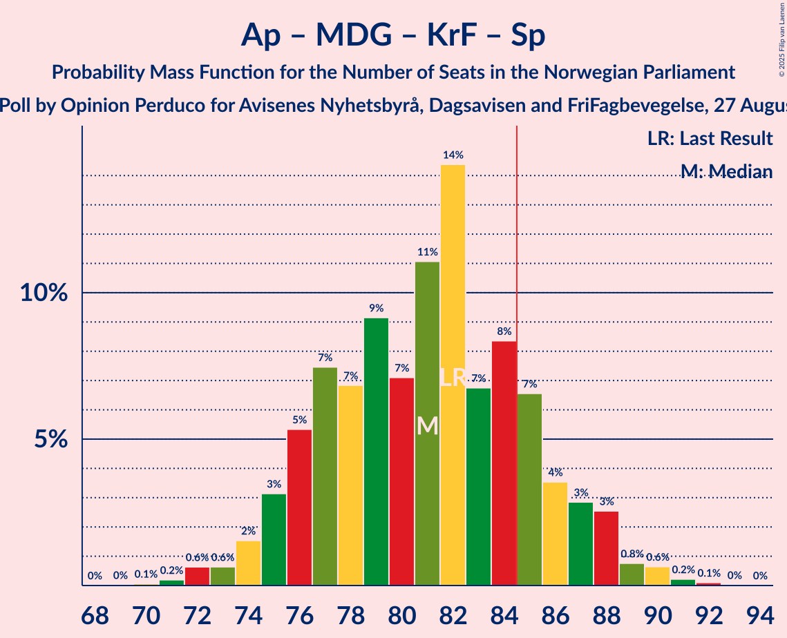

| Number of Seats | Probability | Accumulated | Special Marks |
|:---------------:|:-----------:|:-----------:|:-------------:|
| 70 | 0.1% | 100% |  |
| 71 | 0.2% | 99.9% |  |
| 72 | 0.6% | 99.7% |  |
| 73 | 0.6% | 99.1% |  |
| 74 | 2% | 98% |  |
| 75 | 3% | 97% |  |
| 76 | 5% | 94% |  |
| 77 | 7% | 88% |  |
| 78 | 7% | 81% |  |
| 79 | 9% | 74% |  |
| 80 | 7% | 65% |  |
| 81 | 11% | 58% | Median |
| 82 | 14% | 47% | Last Result |
| 83 | 7% | 32% |  |
| 84 | 8% | 26% |  |
| 85 | 7% | 17% | Majority |
| 86 | 4% | 11% |  |
| 87 | 3% | 7% |  |
| 88 | 3% | 4% |  |
| 89 | 0.8% | 2% |  |
| 90 | 0.6% | 1.0% |  |
| 91 | 0.2% | 0.4% |  |
| 92 | 0.1% | 0.1% |  |
| 93 | 0% | 0% |  |

### Arbeiderpartiet – Sosialistisk Venstreparti – Senterpartiet

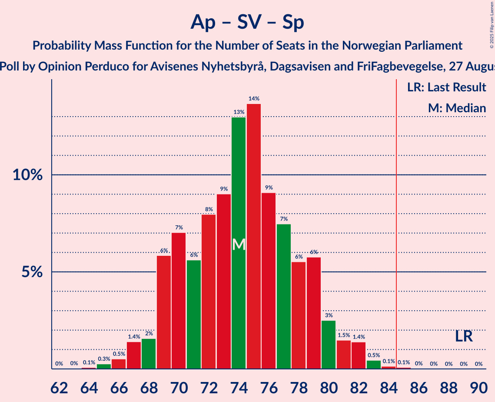

| Number of Seats | Probability | Accumulated | Special Marks |
|:---------------:|:-----------:|:-----------:|:-------------:|
| 63 | 0% | 100% |  |
| 64 | 0.1% | 99.9% |  |
| 65 | 0.3% | 99.9% |  |
| 66 | 0.5% | 99.6% |  |
| 67 | 1.4% | 99.1% |  |
| 68 | 2% | 98% |  |
| 69 | 6% | 96% |  |
| 70 | 7% | 90% |  |
| 71 | 6% | 83% |  |
| 72 | 8% | 78% |  |
| 73 | 9% | 70% |  |
| 74 | 13% | 61% | Median |
| 75 | 14% | 48% |  |
| 76 | 9% | 34% |  |
| 77 | 7% | 25% |  |
| 78 | 6% | 17% |  |
| 79 | 6% | 12% |  |
| 80 | 3% | 6% |  |
| 81 | 1.5% | 4% |  |
| 82 | 1.4% | 2% |  |
| 83 | 0.5% | 0.7% |  |
| 84 | 0.1% | 0.3% |  |
| 85 | 0.1% | 0.1% | Majority |
| 86 | 0% | 0% |  |
| 87 | 0% | 0% |  |
| 88 | 0% | 0% |  |
| 89 | 0% | 0% | Last Result |

### Fremskrittspartiet – Høyre – Kristelig Folkeparti – Venstre

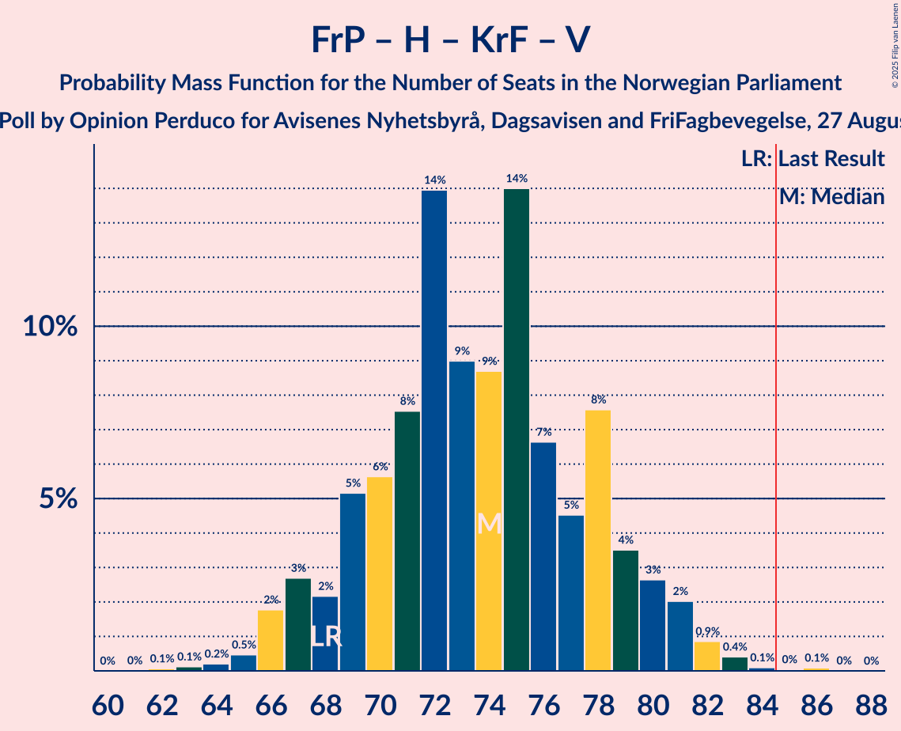

| Number of Seats | Probability | Accumulated | Special Marks |
|:---------------:|:-----------:|:-----------:|:-------------:|
| 62 | 0.1% | 100% |  |
| 63 | 0.1% | 99.9% |  |
| 64 | 0.2% | 99.8% |  |
| 65 | 0.5% | 99.6% |  |
| 66 | 2% | 99.1% |  |
| 67 | 3% | 97% |  |
| 68 | 2% | 95% | Last Result |
| 69 | 5% | 92% |  |
| 70 | 6% | 87% |  |
| 71 | 8% | 82% |  |
| 72 | 14% | 74% |  |
| 73 | 9% | 60% |  |
| 74 | 9% | 51% | Median |
| 75 | 14% | 42% |  |
| 76 | 7% | 28% |  |
| 77 | 5% | 22% |  |
| 78 | 8% | 17% |  |
| 79 | 4% | 10% |  |
| 80 | 3% | 6% |  |
| 81 | 2% | 4% |  |
| 82 | 0.9% | 2% |  |
| 83 | 0.4% | 0.7% |  |
| 84 | 0.1% | 0.2% |  |
| 85 | 0% | 0.1% | Majority |
| 86 | 0.1% | 0.1% |  |
| 87 | 0% | 0% |  |

### Arbeiderpartiet – Kristelig Folkeparti – Senterpartiet

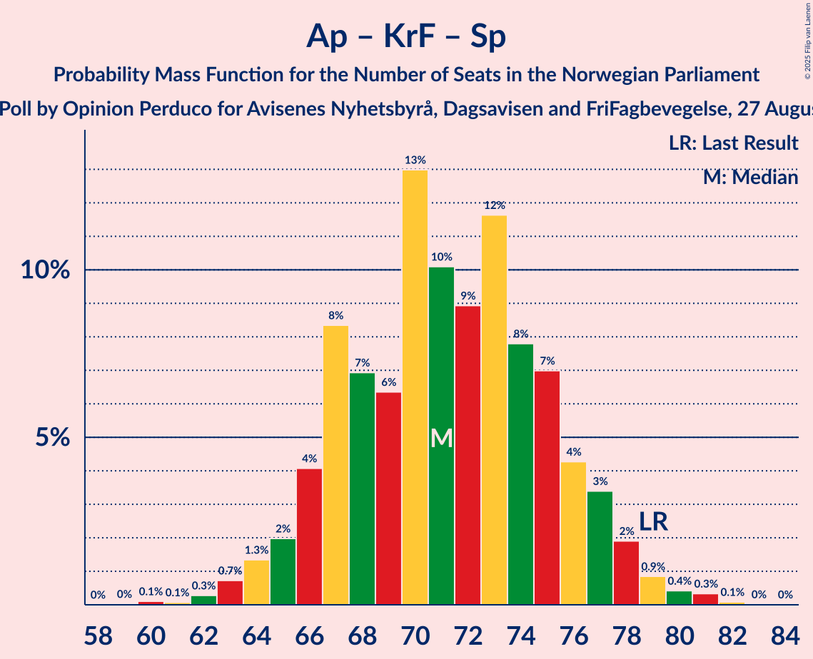

| Number of Seats | Probability | Accumulated | Special Marks |
|:---------------:|:-----------:|:-----------:|:-------------:|
| 60 | 0.1% | 100% |  |
| 61 | 0.1% | 99.9% |  |
| 62 | 0.3% | 99.8% |  |
| 63 | 0.7% | 99.5% |  |
| 64 | 1.3% | 98.8% |  |
| 65 | 2% | 97% |  |
| 66 | 4% | 95% |  |
| 67 | 8% | 91% |  |
| 68 | 7% | 83% |  |
| 69 | 6% | 76% |  |
| 70 | 13% | 70% |  |
| 71 | 10% | 57% | Median |
| 72 | 9% | 47% |  |
| 73 | 12% | 38% |  |
| 74 | 8% | 26% |  |
| 75 | 7% | 18% |  |
| 76 | 4% | 11% |  |
| 77 | 3% | 7% |  |
| 78 | 2% | 4% |  |
| 79 | 0.9% | 2% | Last Result |
| 80 | 0.4% | 0.9% |  |
| 81 | 0.3% | 0.5% |  |
| 82 | 0.1% | 0.1% |  |
| 83 | 0% | 0% |  |

### Arbeiderpartiet – Sosialistisk Venstreparti

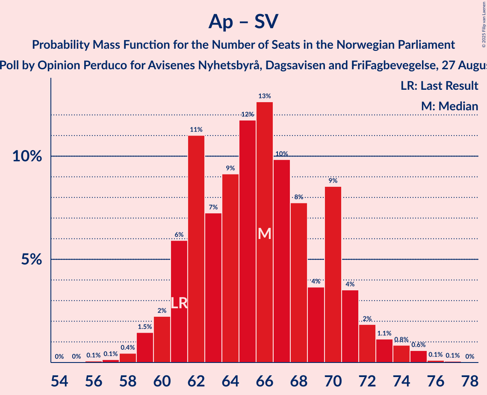

| Number of Seats | Probability | Accumulated | Special Marks |
|:---------------:|:-----------:|:-----------:|:-------------:|
| 56 | 0.1% | 100% |  |
| 57 | 0.1% | 99.9% |  |
| 58 | 0.4% | 99.8% |  |
| 59 | 1.5% | 99.3% |  |
| 60 | 2% | 98% |  |
| 61 | 6% | 96% | Last Result |
| 62 | 11% | 90% |  |
| 63 | 7% | 79% |  |
| 64 | 9% | 71% |  |
| 65 | 12% | 62% |  |
| 66 | 13% | 51% | Median |
| 67 | 10% | 38% |  |
| 68 | 8% | 28% |  |
| 69 | 4% | 20% |  |
| 70 | 9% | 17% |  |
| 71 | 4% | 8% |  |
| 72 | 2% | 5% |  |
| 73 | 1.1% | 3% |  |
| 74 | 0.8% | 2% |  |
| 75 | 0.6% | 0.8% |  |
| 76 | 0.1% | 0.2% |  |
| 77 | 0.1% | 0.1% |  |
| 78 | 0% | 0% |  |

### Fremskrittspartiet – Høyre – Venstre

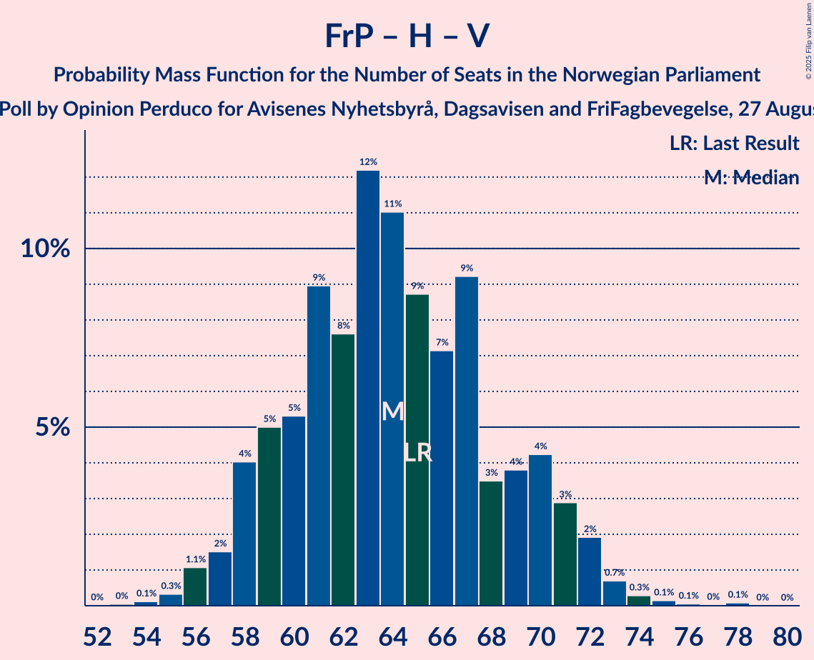

| Number of Seats | Probability | Accumulated | Special Marks |
|:---------------:|:-----------:|:-----------:|:-------------:|
| 53 | 0% | 100% |  |
| 54 | 0.1% | 99.9% |  |
| 55 | 0.3% | 99.8% |  |
| 56 | 1.1% | 99.5% |  |
| 57 | 2% | 98% |  |
| 58 | 4% | 97% |  |
| 59 | 5% | 93% |  |
| 60 | 5% | 88% |  |
| 61 | 9% | 83% |  |
| 62 | 8% | 74% |  |
| 63 | 12% | 66% |  |
| 64 | 11% | 54% | Median |
| 65 | 9% | 43% | Last Result |
| 66 | 7% | 34% |  |
| 67 | 9% | 27% |  |
| 68 | 3% | 18% |  |
| 69 | 4% | 14% |  |
| 70 | 4% | 10% |  |
| 71 | 3% | 6% |  |
| 72 | 2% | 3% |  |
| 73 | 0.7% | 1.3% |  |
| 74 | 0.3% | 0.6% |  |
| 75 | 0.1% | 0.3% |  |
| 76 | 0.1% | 0.2% |  |
| 77 | 0% | 0.1% |  |
| 78 | 0.1% | 0.1% |  |
| 79 | 0% | 0% |  |

### Arbeiderpartiet – Senterpartiet

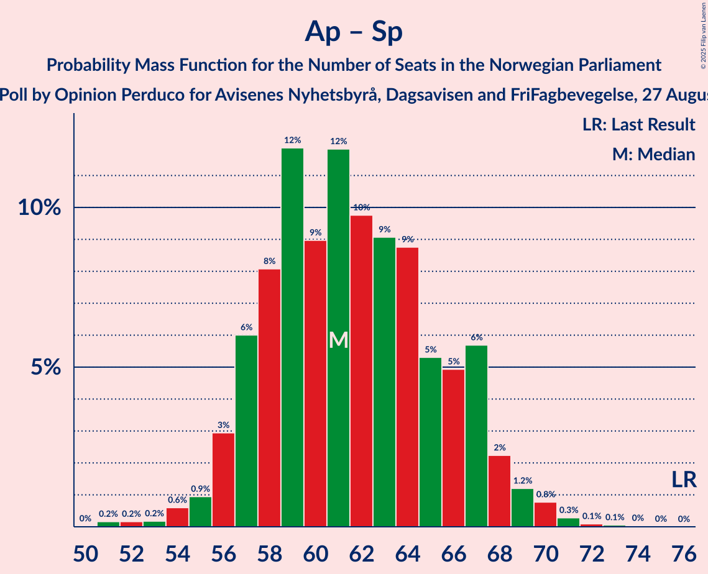

| Number of Seats | Probability | Accumulated | Special Marks |
|:---------------:|:-----------:|:-----------:|:-------------:|
| 51 | 0.2% | 100% |  |
| 52 | 0.2% | 99.8% |  |
| 53 | 0.2% | 99.6% |  |
| 54 | 0.6% | 99.5% |  |
| 55 | 0.9% | 98.9% |  |
| 56 | 3% | 98% |  |
| 57 | 6% | 95% |  |
| 58 | 8% | 89% |  |
| 59 | 12% | 81% |  |
| 60 | 9% | 69% |  |
| 61 | 12% | 60% | Median |
| 62 | 10% | 48% |  |
| 63 | 9% | 38% |  |
| 64 | 9% | 29% |  |
| 65 | 5% | 21% |  |
| 66 | 5% | 15% |  |
| 67 | 6% | 10% |  |
| 68 | 2% | 5% |  |
| 69 | 1.2% | 2% |  |
| 70 | 0.8% | 1.3% |  |
| 71 | 0.3% | 0.5% |  |
| 72 | 0.1% | 0.2% |  |
| 73 | 0.1% | 0.1% |  |
| 74 | 0% | 0% |  |
| 75 | 0% | 0% |  |
| 76 | 0% | 0% | Last Result |

### Fremskrittspartiet – Høyre

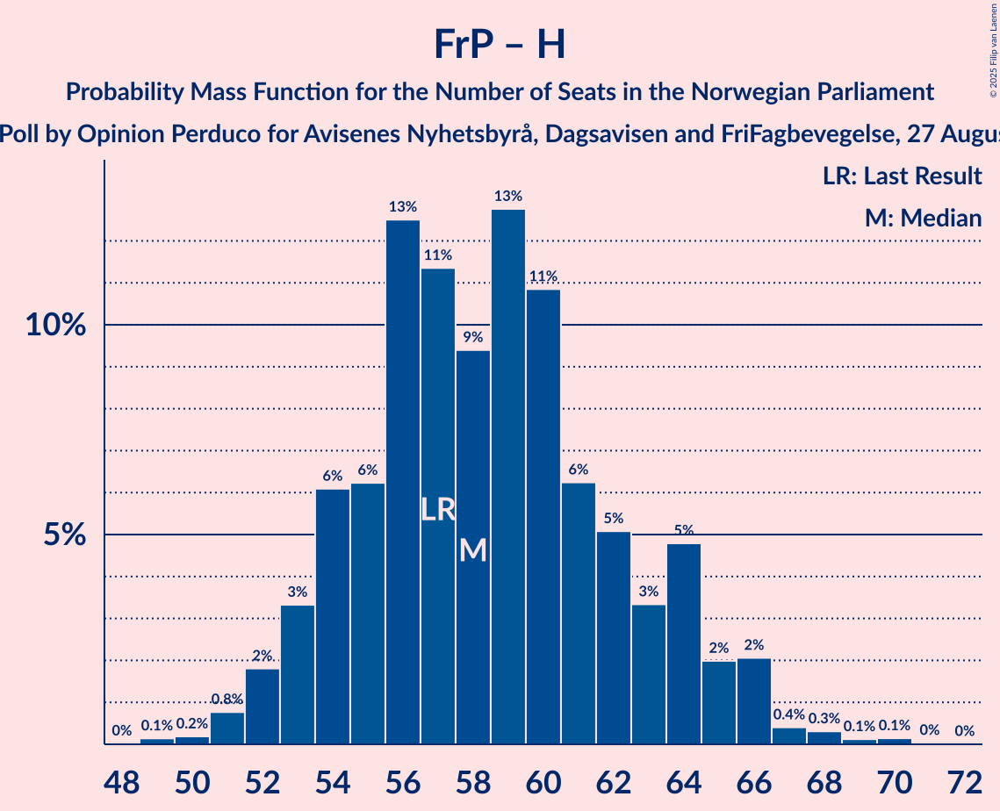

| Number of Seats | Probability | Accumulated | Special Marks |
|:---------------:|:-----------:|:-----------:|:-------------:|
| 49 | 0.1% | 100% |  |
| 50 | 0.2% | 99.8% |  |
| 51 | 0.8% | 99.6% |  |
| 52 | 2% | 98.9% |  |
| 53 | 3% | 97% |  |
| 54 | 6% | 94% |  |
| 55 | 6% | 88% |  |
| 56 | 13% | 81% |  |
| 57 | 11% | 69% | Last Result |
| 58 | 9% | 58% | Median |
| 59 | 13% | 48% |  |
| 60 | 11% | 35% |  |
| 61 | 6% | 25% |  |
| 62 | 5% | 18% |  |
| 63 | 3% | 13% |  |
| 64 | 5% | 10% |  |
| 65 | 2% | 5% |  |
| 66 | 2% | 3% |  |
| 67 | 0.4% | 1.0% |  |
| 68 | 0.3% | 0.6% |  |
| 69 | 0.1% | 0.3% |  |
| 70 | 0.1% | 0.2% |  |
| 71 | 0% | 0% |  |

### Høyre – Kristelig Folkeparti – Venstre

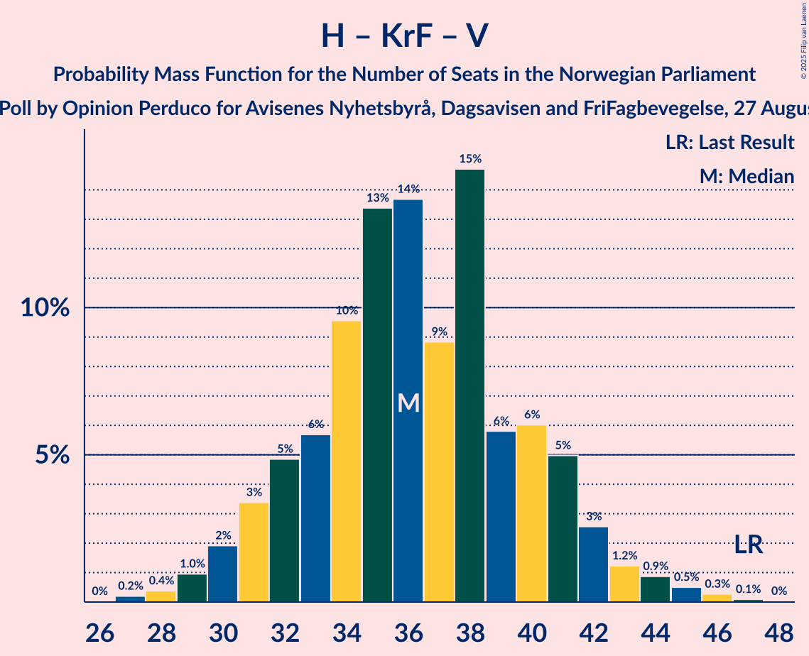

| Number of Seats | Probability | Accumulated | Special Marks |
|:---------------:|:-----------:|:-----------:|:-------------:|
| 27 | 0.2% | 100% |  |
| 28 | 0.4% | 99.8% |  |
| 29 | 1.0% | 99.4% |  |
| 30 | 2% | 98% |  |
| 31 | 3% | 97% |  |
| 32 | 5% | 93% |  |
| 33 | 6% | 88% |  |
| 34 | 10% | 83% |  |
| 35 | 13% | 73% |  |
| 36 | 14% | 60% |  |
| 37 | 9% | 46% | Median |
| 38 | 15% | 37% |  |
| 39 | 6% | 22% |  |
| 40 | 6% | 17% |  |
| 41 | 5% | 11% |  |
| 42 | 3% | 6% |  |
| 43 | 1.2% | 3% |  |
| 44 | 0.9% | 2% |  |
| 45 | 0.5% | 0.9% |  |
| 46 | 0.3% | 0.4% |  |
| 47 | 0.1% | 0.1% | Last Result |
| 48 | 0% | 0% |  |

### Kristelig Folkeparti – Senterpartiet – Venstre

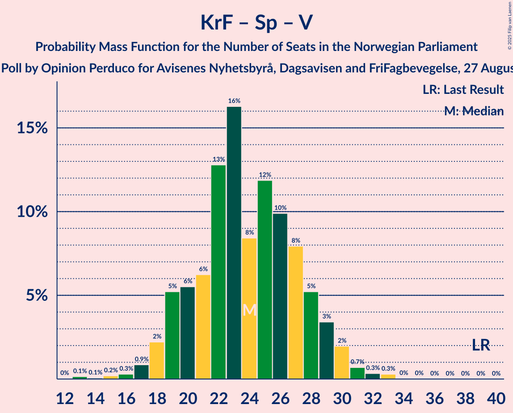

| Number of Seats | Probability | Accumulated | Special Marks |
|:---------------:|:-----------:|:-----------:|:-------------:|
| 12 | 0% | 100% |  |
| 13 | 0.1% | 99.9% |  |
| 14 | 0.1% | 99.8% |  |
| 15 | 0.2% | 99.7% |  |
| 16 | 0.3% | 99.5% |  |
| 17 | 0.9% | 99.2% |  |
| 18 | 2% | 98% |  |
| 19 | 5% | 96% |  |
| 20 | 6% | 91% |  |
| 21 | 6% | 85% |  |
| 22 | 13% | 79% |  |
| 23 | 16% | 66% |  |
| 24 | 8% | 50% | Median |
| 25 | 12% | 42% |  |
| 26 | 10% | 30% |  |
| 27 | 8% | 20% |  |
| 28 | 5% | 12% |  |
| 29 | 3% | 7% |  |
| 30 | 2% | 3% |  |
| 31 | 0.7% | 1.4% |  |
| 32 | 0.3% | 0.7% |  |
| 33 | 0.3% | 0.4% |  |
| 34 | 0% | 0.1% |  |
| 35 | 0% | 0% |  |
| 36 | 0% | 0% |  |
| 37 | 0% | 0% |  |
| 38 | 0% | 0% |  |
| 39 | 0% | 0% | Last Result |

## Technical Information

### Opinion Poll

+ **Polling firm:** Opinion Perduco
+ **Commissioner(s):** Avisenes Nyhetsbyrå, Dagsavisen and FriFagbevegelse
+ **Fieldwork period:** 27 August–3 September 2025

### Calculations

+ **Sample size:** 848
+ **Simulations done:** 2,097,152
+ **Error estimate:** 2.03%

