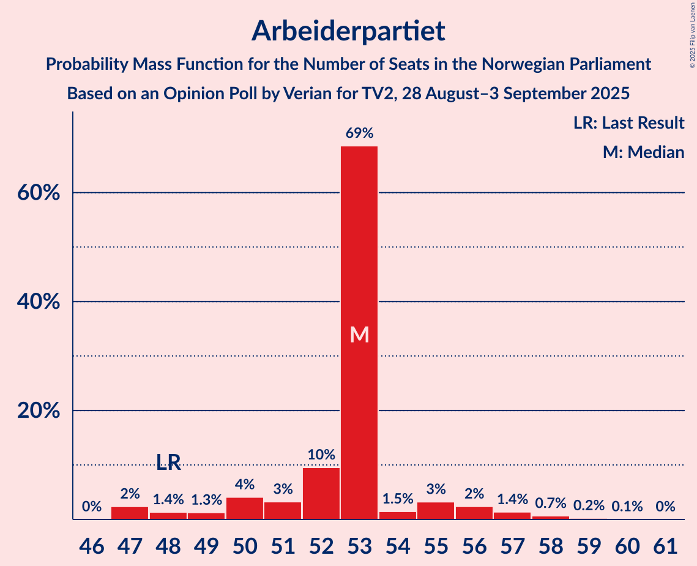
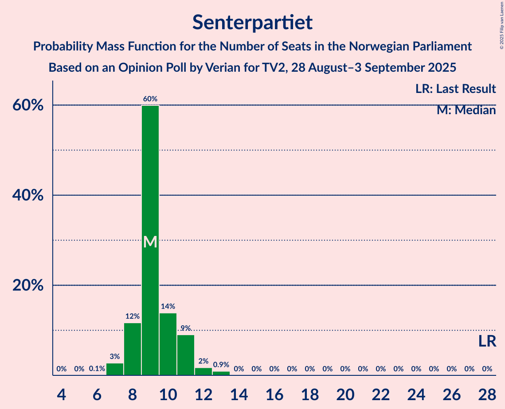
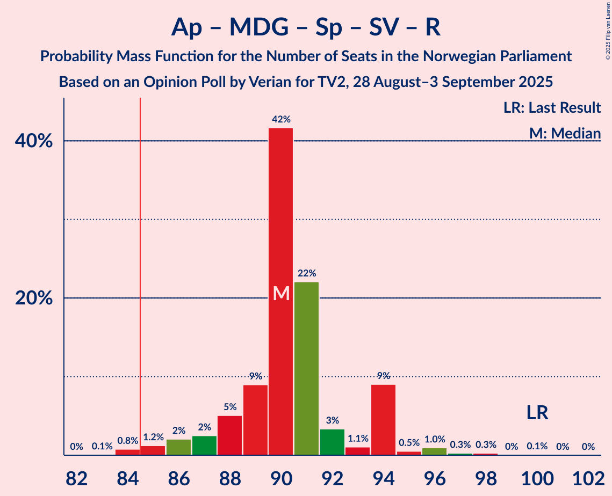
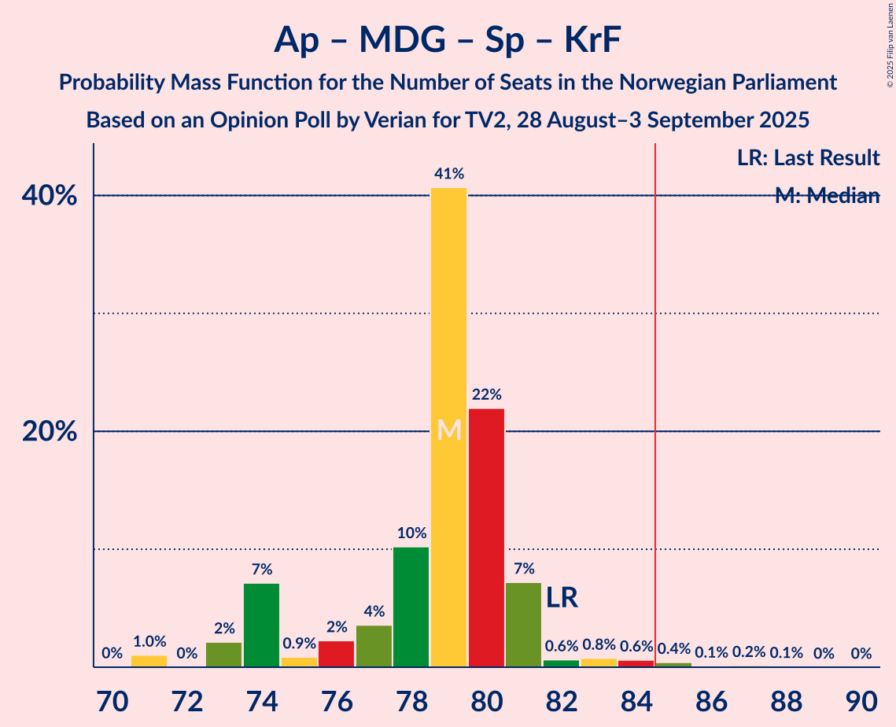
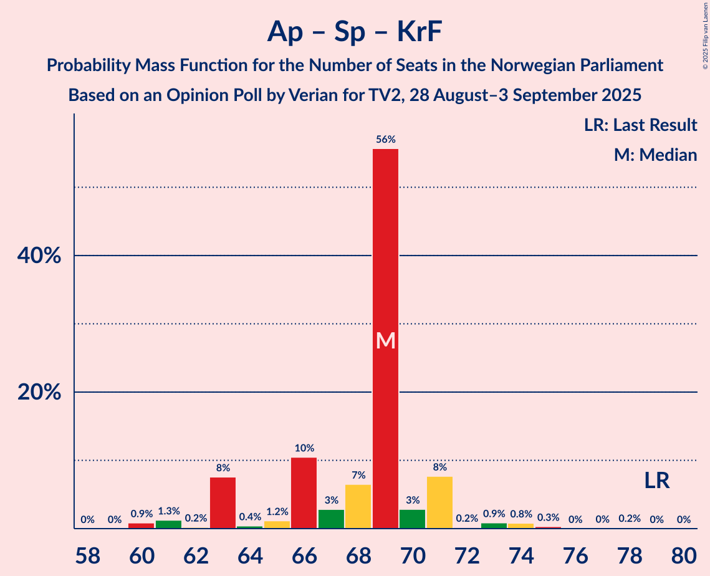
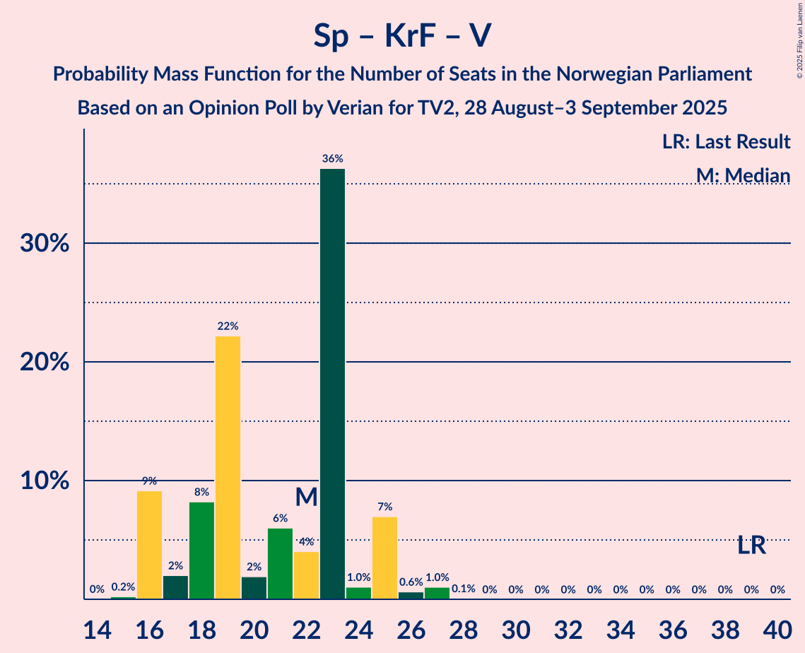

# Opinion Poll by Verian for TV2, 28 August–3 September 2025

<a href="#voting-intentions">Voting Intentions</a> | <a href="#seats">Seats</a> | <a href="#coalitions">Coalitions</a> | <a href="#technical-information">Technical Information</a>

## Voting Intentions

### Confidence Intervals

| Party | Last Result | Poll Result | 80% Confidence Interval | 90% Confidence Interval | 95% Confidence Interval | 99% Confidence Interval |
|:-----:|:-----------:|:-----------:|:-----------------------:|:-----------------------:|:-----------------------:|:-----------------------:|
| Arbeiderpartiet | 26.2% | 27.4% | 26.2–28.6% |25.9–28.9% |25.6–29.2% |25.0–29.8% |
| Fremskrittspartiet | 11.6% | 21.6% | 20.5–22.7% |20.2–23.1% |20.0–23.3% |19.4–23.9% |
| Høyre | 20.4% | 14.6% | 13.7–15.6% |13.4–15.9% |13.2–16.1% |12.8–16.6% |
| Miljøpartiet De Grønne | 3.9% | 6.4% | 5.8–7.1% |5.6–7.3% |5.5–7.5% |5.2–7.8% |
| Senterpartiet | 13.5% | 5.8% | 5.2–6.5% |5.0–6.6% |4.9–6.8% |4.6–7.1% |
| Sosialistisk Venstreparti | 7.6% | 5.6% | 5.0–6.3% |4.9–6.5% |4.7–6.6% |4.5–7.0% |
| Rødt | 4.7% | 5.5% | 5.0–6.2% |4.8–6.4% |4.6–6.5% |4.4–6.9% |
| Venstre | 4.6% | 4.2% | 3.7–4.8% |3.6–5.0% |3.5–5.1% |3.2–5.4% |
| Kristelig Folkeparti | 3.8% | 4.2% | 3.7–4.8% |3.6–5.0% |3.5–5.1% |3.2–5.4% |
| Konservativt | 0.4% | 0.8% | 0.6–1.1% |0.5–1.2% |0.5–1.2% |0.4–1.4% |
| Norgesdemokratene | 1.1% | 0.5% | 0.4–0.8% |0.3–0.9% |0.3–0.9% |0.2–1.1% |
| Pensjonistpartiet | 0.6% | 0.4% | 0.3–0.6% |0.2–0.7% |0.2–0.7% |0.2–0.9% |
| Industri- og Næringspartiet | 0.3% | 0.2% | 0.1–0.4% |0.1–0.5% |0.1–0.5% |0.1–0.6% |

*Note:* The poll result column reflects the actual value used in the calculations. Published results may vary slightly, and in addition be rounded to fewer digits.

## Seats

### Confidence Intervals

| Party | Last Result | Median | 80% Confidence Interval | 90% Confidence Interval | 95% Confidence Interval | 99% Confidence Interval |
|:-----:|:-----------:|:------:|:-----------------------:|:-----------------------:|:-----------------------:|:-----------------------:|
| <a href="#arbeiderpartiet">Arbeiderpartiet</a> | 48 | 53 | 51–53 |49–55 |48–56 |47–58 |
| <a href="#fremskrittspartiet">Fremskrittspartiet</a> | 21 | 43 | 40–44 |38–44 |38–44 |38–45 |
| <a href="#høyre">Høyre</a> | 36 | 26 | 22–29 |22–29 |21–29 |20–30 |
| <a href="#miljøpartiet-de-grønne">Miljøpartiet De Grønne</a> | 3 | 10 | 10–12 |9–12 |9–12 |7–13 |
| <a href="#senterpartiet">Senterpartiet</a> | 28 | 9 | 8–11 |8–11 |7–12 |7–13 |
| <a href="#sosialistisk-venstreparti">Sosialistisk Venstreparti</a> | 13 | 9 | 8–9 |8–10 |8–11 |7–12 |
| <a href="#rødt">Rødt</a> | 8 | 9 | 8–10 |8–10 |7–10 |7–11 |
| <a href="#venstre">Venstre</a> | 8 | 7 | 3–7 |3–8 |3–8 |2–8 |
| <a href="#kristelig-folkeparti">Kristelig Folkeparti</a> | 3 | 7 | 3–7 |3–8 |3–8 |2–9 |
| <a href="#konservativt">Konservativt</a> | 0 | 0 | 0 |0 |0 |0 |
| <a href="#norgesdemokratene">Norgesdemokratene</a> | 0 | 0 | 0 |0 |0 |0 |
| <a href="#pensjonistpartiet">Pensjonistpartiet</a> | 0 | 0 | 0 |0 |0 |0 |
| <a href="#industri--og-næringspartiet">Industri- og Næringspartiet</a> | 0 | 0 | 0 |0 |0 |0 |

### Arbeiderpartiet

*For a full overview of the results for this party, see the [Arbeiderpartiet](party-arbeiderpartiet.html) page.*

| Number of Seats | Probability | Accumulated | Special Marks |
|:---------------:|:-----------:|:-----------:|:-------------:|
| 47 | 2% | 100% |  |
| 48 | 1.4% | 98% | Last Result |
| 49 | 1.3% | 96% |  |
| 50 | 4% | 95% |  |
| 51 | 3% | 91% |  |
| 52 | 10% | 88% |  |
| 53 | 69% | 78% | Median |
| 54 | 1.5% | 9% |  |
| 55 | 3% | 8% |  |
| 56 | 2% | 5% |  |
| 57 | 1.4% | 2% |  |
| 58 | 0.7% | 1.0% |  |
| 59 | 0.2% | 0.3% |  |
| 60 | 0.1% | 0.1% |  |
| 61 | 0% | 0% |  |

### Fremskrittspartiet

*For a full overview of the results for this party, see the [Fremskrittspartiet](party-fremskrittspartiet.html) page.*

| Number of Seats | Probability | Accumulated | Special Marks |
|:---------------:|:-----------:|:-----------:|:-------------:|
| 21 | 0% | 100% | Last Result |
| 22 | 0% | 100% |  |
| 23 | 0% | 100% |  |
| 24 | 0% | 100% |  |
| 25 | 0% | 100% |  |
| 26 | 0% | 100% |  |
| 27 | 0% | 100% |  |
| 28 | 0% | 100% |  |
| 29 | 0% | 100% |  |
| 30 | 0% | 100% |  |
| 31 | 0% | 100% |  |
| 32 | 0% | 100% |  |
| 33 | 0% | 100% |  |
| 34 | 0% | 100% |  |
| 35 | 0% | 100% |  |
| 36 | 0.2% | 100% |  |
| 37 | 0.2% | 99.8% |  |
| 38 | 7% | 99.6% |  |
| 39 | 0.9% | 93% |  |
| 40 | 12% | 92% |  |
| 41 | 2% | 80% |  |
| 42 | 24% | 77% |  |
| 43 | 42% | 53% | Median |
| 44 | 10% | 10% |  |
| 45 | 0.6% | 0.7% |  |
| 46 | 0.1% | 0.1% |  |
| 47 | 0% | 0.1% |  |
| 48 | 0% | 0% |  |

### Høyre

*For a full overview of the results for this party, see the [Høyre](party-høyre.html) page.*

| Number of Seats | Probability | Accumulated | Special Marks |
|:---------------:|:-----------:|:-----------:|:-------------:|
| 19 | 0.4% | 100% |  |
| 20 | 0.7% | 99.6% |  |
| 21 | 1.5% | 98.9% |  |
| 22 | 34% | 97% |  |
| 23 | 1.2% | 63% |  |
| 24 | 3% | 62% |  |
| 25 | 3% | 58% |  |
| 26 | 26% | 55% | Median |
| 27 | 14% | 29% |  |
| 28 | 3% | 15% |  |
| 29 | 11% | 13% |  |
| 30 | 1.2% | 1.3% |  |
| 31 | 0.1% | 0.1% |  |
| 32 | 0% | 0% |  |
| 33 | 0% | 0% |  |
| 34 | 0% | 0% |  |
| 35 | 0% | 0% |  |
| 36 | 0% | 0% | Last Result |

### Miljøpartiet De Grønne

*For a full overview of the results for this party, see the [Miljøpartiet De Grønne](party-miljøpartietdegrønne.html) page.*

| Number of Seats | Probability | Accumulated | Special Marks |
|:---------------:|:-----------:|:-----------:|:-------------:|
| 3 | 0% | 100% | Last Result |
| 4 | 0% | 100% |  |
| 5 | 0% | 100% |  |
| 6 | 0% | 100% |  |
| 7 | 0.9% | 100% |  |
| 8 | 1.5% | 99.1% |  |
| 9 | 4% | 98% |  |
| 10 | 48% | 93% | Median |
| 11 | 33% | 45% |  |
| 12 | 11% | 12% |  |
| 13 | 1.2% | 1.3% |  |
| 14 | 0% | 0% |  |

### Senterpartiet

*For a full overview of the results for this party, see the [Senterpartiet](party-senterpartiet.html) page.*

| Number of Seats | Probability | Accumulated | Special Marks |
|:---------------:|:-----------:|:-----------:|:-------------:|
| 6 | 0.1% | 100% |  |
| 7 | 3% | 99.9% |  |
| 8 | 12% | 97% |  |
| 9 | 60% | 86% | Median |
| 10 | 14% | 26% |  |
| 11 | 9% | 12% |  |
| 12 | 2% | 3% |  |
| 13 | 0.9% | 0.9% |  |
| 14 | 0% | 0% |  |
| 15 | 0% | 0% |  |
| 16 | 0% | 0% |  |
| 17 | 0% | 0% |  |
| 18 | 0% | 0% |  |
| 19 | 0% | 0% |  |
| 20 | 0% | 0% |  |
| 21 | 0% | 0% |  |
| 22 | 0% | 0% |  |
| 23 | 0% | 0% |  |
| 24 | 0% | 0% |  |
| 25 | 0% | 0% |  |
| 26 | 0% | 0% |  |
| 27 | 0% | 0% |  |
| 28 | 0% | 0% | Last Result |

### Sosialistisk Venstreparti

*For a full overview of the results for this party, see the [Sosialistisk Venstreparti](party-sosialistiskvenstreparti.html) page.*

| Number of Seats | Probability | Accumulated | Special Marks |
|:---------------:|:-----------:|:-----------:|:-------------:|
| 6 | 0.1% | 100% |  |
| 7 | 2% | 99.9% |  |
| 8 | 10% | 98% |  |
| 9 | 80% | 88% | Median |
| 10 | 6% | 9% |  |
| 11 | 2% | 3% |  |
| 12 | 0.7% | 0.7% |  |
| 13 | 0% | 0% | Last Result |

### Rødt

*For a full overview of the results for this party, see the [Rødt](party-rødt.html) page.*

| Number of Seats | Probability | Accumulated | Special Marks |
|:---------------:|:-----------:|:-----------:|:-------------:|
| 6 | 0.1% | 100% |  |
| 7 | 4% | 99.9% |  |
| 8 | 15% | 96% | Last Result |
| 9 | 67% | 81% | Median |
| 10 | 12% | 14% |  |
| 11 | 2% | 2% |  |
| 12 | 0.1% | 0.1% |  |
| 13 | 0% | 0% |  |

### Venstre

*For a full overview of the results for this party, see the [Venstre](party-venstre.html) page.*

| Number of Seats | Probability | Accumulated | Special Marks |
|:---------------:|:-----------:|:-----------:|:-------------:|
| 2 | 0.6% | 100% |  |
| 3 | 38% | 99.4% |  |
| 4 | 0% | 61% |  |
| 5 | 0% | 61% |  |
| 6 | 2% | 61% |  |
| 7 | 54% | 59% | Median |
| 8 | 5% | 5% | Last Result |
| 9 | 0.3% | 0.3% |  |
| 10 | 0% | 0% |  |

### Kristelig Folkeparti

*For a full overview of the results for this party, see the [Kristelig Folkeparti](party-kristeligfolkeparti.html) page.*

| Number of Seats | Probability | Accumulated | Special Marks |
|:---------------:|:-----------:|:-----------:|:-------------:|
| 2 | 1.2% | 100% |  |
| 3 | 20% | 98.7% | Last Result |
| 4 | 0% | 79% |  |
| 5 | 0% | 79% |  |
| 6 | 2% | 79% |  |
| 7 | 70% | 77% | Median |
| 8 | 6% | 7% |  |
| 9 | 0.6% | 0.6% |  |
| 10 | 0% | 0% |  |

### Konservativt

*For a full overview of the results for this party, see the [Konservativt](party-konservativt.html) page.*

| Number of Seats | Probability | Accumulated | Special Marks |
|:---------------:|:-----------:|:-----------:|:-------------:|
| 0 | 100% | 100% | Last Result, Median |

### Norgesdemokratene

*For a full overview of the results for this party, see the [Norgesdemokratene](party-norgesdemokratene.html) page.*

| Number of Seats | Probability | Accumulated | Special Marks |
|:---------------:|:-----------:|:-----------:|:-------------:|
| 0 | 100% | 100% | Last Result, Median |

### Pensjonistpartiet

*For a full overview of the results for this party, see the [Pensjonistpartiet](party-pensjonistpartiet.html) page.*

| Number of Seats | Probability | Accumulated | Special Marks |
|:---------------:|:-----------:|:-----------:|:-------------:|
| 0 | 100% | 100% | Last Result, Median |

### Industri- og Næringspartiet

*For a full overview of the results for this party, see the [Industri- og Næringspartiet](party-industri-ognæringspartiet.html) page.*

| Number of Seats | Probability | Accumulated | Special Marks |
|:---------------:|:-----------:|:-----------:|:-------------:|
| 0 | 100% | 100% | Last Result, Median |

## Coalitions

### Confidence Intervals

| Coalition | Last Result | Median | Majority? | 80% Confidence Interval | 90% Confidence Interval | 95% Confidence Interval | 99% Confidence Interval |
|:---------:|:-----------:|:------:|:---------:|:-----------------------:|:-----------------------:|:-----------------------:|:-----------------------:|
| Arbeiderpartiet – Miljøpartiet De Grønne – Senterpartiet – Sosialistisk Venstreparti – Rødt | 100 | 90 | 99.1% | 88–94 | 87–94 | 86–94 | 84–97 |
| Fremskrittspartiet – Høyre – Miljøpartiet De Grønne – Kristelig Folkeparti – Venstre | 71 | 89 | 98% | 87–91 | 87–92 | 85–93 | 82–95 |
| Fremskrittspartiet – Høyre – Senterpartiet – Kristelig Folkeparti – Venstre | 96 | 88 | 98% | 85–90 | 85–91 | 85–92 | 82–94 |
| Arbeiderpartiet – Miljøpartiet De Grønne – Senterpartiet – Sosialistisk Venstreparti – Kristelig Folkeparti | 95 | 88 | 88% | 83–89 | 83–90 | 83–91 | 80–94 |
| Arbeiderpartiet – Miljøpartiet De Grønne – Senterpartiet – Sosialistisk Venstreparti | 92 | 81 | 3% | 80–84 | 78–84 | 78–85 | 75–88 |
| Arbeiderpartiet – Miljøpartiet De Grønne – Sosialistisk Venstreparti – Rødt | 72 | 81 | 2% | 79–84 | 78–84 | 77–84 | 75–87 |
| Arbeiderpartiet – Senterpartiet – Sosialistisk Venstreparti – Rødt | 97 | 80 | 2% | 78–82 | 77–82 | 76–84 | 74–87 |
| Fremskrittspartiet – Høyre – Kristelig Folkeparti – Venstre | 68 | 79 | 0.8% | 75–81 | 75–82 | 75–83 | 72–85 |
| Arbeiderpartiet – Miljøpartiet De Grønne – Senterpartiet – Kristelig Folkeparti | 82 | 79 | 0.7% | 74–80 | 74–81 | 73–82 | 71–85 |
| Fremskrittspartiet – Høyre – Venstre | 65 | 72 | 0% | 71–77 | 70–77 | 68–78 | 66–79 |
| Arbeiderpartiet – Senterpartiet – Sosialistisk Venstreparti | 89 | 71 | 0% | 69–72 | 68–73 | 68–75 | 65–78 |
| Fremskrittspartiet – Høyre | 57 | 68 | 0% | 65–70 | 65–70 | 64–71 | 59–72 |
| Arbeiderpartiet – Senterpartiet – Kristelig Folkeparti | 79 | 69 | 0% | 64–71 | 63–71 | 63–71 | 60–75 |
| Arbeiderpartiet – Senterpartiet | 76 | 62 | 0% | 60–64 | 59–64 | 58–66 | 56–68 |
| Arbeiderpartiet – Sosialistisk Venstreparti | 61 | 62 | 0% | 61–62 | 59–64 | 58–65 | 56–67 |
| Høyre – Kristelig Folkeparti – Venstre | 47 | 36 | 0% | 35–41 | 34–41 | 34–42 | 31–44 |
| Senterpartiet – Kristelig Folkeparti – Venstre | 39 | 22 | 0% | 17–23 | 16–25 | 16–25 | 16–27 |

### Arbeiderpartiet – Miljøpartiet De Grønne – Senterpartiet – Sosialistisk Venstreparti – Rødt

| Number of Seats | Probability | Accumulated | Special Marks |
|:---------------:|:-----------:|:-----------:|:-------------:|
| 83 | 0.1% | 100% |  |
| 84 | 0.8% | 99.9% |  |
| 85 | 1.2% | 99.1% | Majority |
| 86 | 2% | 98% |  |
| 87 | 2% | 96% |  |
| 88 | 5% | 93% |  |
| 89 | 9% | 88% |  |
| 90 | 42% | 79% | Median |
| 91 | 22% | 38% |  |
| 92 | 3% | 16% |  |
| 93 | 1.1% | 12% |  |
| 94 | 9% | 11% |  |
| 95 | 0.5% | 2% |  |
| 96 | 1.0% | 2% |  |
| 97 | 0.3% | 0.7% |  |
| 98 | 0.3% | 0.4% |  |
| 99 | 0% | 0.1% |  |
| 100 | 0.1% | 0.1% | Last Result |
| 101 | 0% | 0% |  |

### Fremskrittspartiet – Høyre – Miljøpartiet De Grønne – Kristelig Folkeparti – Venstre

| Number of Seats | Probability | Accumulated | Special Marks |
|:---------------:|:-----------:|:-----------:|:-------------:|
| 71 | 0% | 100% | Last Result |
| 72 | 0% | 100% |  |
| 73 | 0% | 100% |  |
| 74 | 0% | 100% |  |
| 75 | 0% | 100% |  |
| 76 | 0% | 100% |  |
| 77 | 0% | 100% |  |
| 78 | 0% | 100% |  |
| 79 | 0% | 100% |  |
| 80 | 0% | 100% |  |
| 81 | 0.1% | 100% |  |
| 82 | 0.6% | 99.9% |  |
| 83 | 0.2% | 99.3% |  |
| 84 | 0.9% | 99.1% |  |
| 85 | 0.9% | 98% | Majority |
| 86 | 1.4% | 97% |  |
| 87 | 11% | 96% |  |
| 88 | 1.0% | 85% |  |
| 89 | 62% | 84% |  |
| 90 | 4% | 22% |  |
| 91 | 8% | 18% |  |
| 92 | 6% | 10% |  |
| 93 | 3% | 4% | Median |
| 94 | 0.2% | 1.0% |  |
| 95 | 0.8% | 0.8% |  |
| 96 | 0% | 0% |  |

### Fremskrittspartiet – Høyre – Senterpartiet – Kristelig Folkeparti – Venstre

| Number of Seats | Probability | Accumulated | Special Marks |
|:---------------:|:-----------:|:-----------:|:-------------:|
| 80 | 0.1% | 100% |  |
| 81 | 0.3% | 99.8% |  |
| 82 | 0.3% | 99.5% |  |
| 83 | 0.3% | 99.2% |  |
| 84 | 0.9% | 98.9% |  |
| 85 | 9% | 98% | Majority |
| 86 | 4% | 89% |  |
| 87 | 21% | 85% |  |
| 88 | 43% | 64% |  |
| 89 | 4% | 21% |  |
| 90 | 8% | 17% |  |
| 91 | 5% | 9% |  |
| 92 | 2% | 4% | Median |
| 93 | 0.3% | 1.5% |  |
| 94 | 1.1% | 1.1% |  |
| 95 | 0% | 0% |  |
| 96 | 0% | 0% | Last Result |

### Arbeiderpartiet – Miljøpartiet De Grønne – Senterpartiet – Sosialistisk Venstreparti – Kristelig Folkeparti

| Number of Seats | Probability | Accumulated | Special Marks |
|:---------------:|:-----------:|:-----------:|:-------------:|
| 80 | 0.9% | 100% |  |
| 81 | 0.2% | 99.1% |  |
| 82 | 0.8% | 98.9% |  |
| 83 | 8% | 98% |  |
| 84 | 2% | 90% |  |
| 85 | 4% | 88% | Majority |
| 86 | 1.3% | 84% |  |
| 87 | 9% | 83% |  |
| 88 | 41% | 74% | Median |
| 89 | 28% | 34% |  |
| 90 | 2% | 5% |  |
| 91 | 1.4% | 3% |  |
| 92 | 0.5% | 2% |  |
| 93 | 0.4% | 2% |  |
| 94 | 0.8% | 1.2% |  |
| 95 | 0.1% | 0.4% | Last Result |
| 96 | 0.2% | 0.2% |  |
| 97 | 0% | 0% |  |

### Arbeiderpartiet – Miljøpartiet De Grønne – Senterpartiet – Sosialistisk Venstreparti

| Number of Seats | Probability | Accumulated | Special Marks |
|:---------------:|:-----------:|:-----------:|:-------------:|
| 74 | 0.1% | 100% |  |
| 75 | 0.7% | 99.9% |  |
| 76 | 0.1% | 99.2% |  |
| 77 | 2% | 99.1% |  |
| 78 | 3% | 98% |  |
| 79 | 2% | 94% |  |
| 80 | 12% | 93% |  |
| 81 | 37% | 81% | Median |
| 82 | 30% | 44% |  |
| 83 | 2% | 14% |  |
| 84 | 9% | 12% |  |
| 85 | 1.1% | 3% | Majority |
| 86 | 0.6% | 2% |  |
| 87 | 0.7% | 2% |  |
| 88 | 0.7% | 0.9% |  |
| 89 | 0.1% | 0.2% |  |
| 90 | 0% | 0.1% |  |
| 91 | 0% | 0.1% |  |
| 92 | 0.1% | 0.1% | Last Result |
| 93 | 0% | 0% |  |

### Arbeiderpartiet – Miljøpartiet De Grønne – Sosialistisk Venstreparti – Rødt

| Number of Seats | Probability | Accumulated | Special Marks |
|:---------------:|:-----------:|:-----------:|:-------------:|
| 72 | 0% | 100% | Last Result |
| 73 | 0% | 100% |  |
| 74 | 0% | 100% |  |
| 75 | 1.1% | 99.9% |  |
| 76 | 0.3% | 98.8% |  |
| 77 | 2% | 98.5% |  |
| 78 | 5% | 96% |  |
| 79 | 8% | 91% |  |
| 80 | 4% | 83% |  |
| 81 | 43% | 79% | Median |
| 82 | 21% | 36% |  |
| 83 | 4% | 15% |  |
| 84 | 9% | 11% |  |
| 85 | 0.9% | 2% | Majority |
| 86 | 0.3% | 1.1% |  |
| 87 | 0.3% | 0.8% |  |
| 88 | 0.3% | 0.4% |  |
| 89 | 0.1% | 0.2% |  |
| 90 | 0% | 0% |  |

### Arbeiderpartiet – Senterpartiet – Sosialistisk Venstreparti – Rødt

| Number of Seats | Probability | Accumulated | Special Marks |
|:---------------:|:-----------:|:-----------:|:-------------:|
| 74 | 0.8% | 100% |  |
| 75 | 0.2% | 99.2% |  |
| 76 | 3% | 99.0% |  |
| 77 | 6% | 96% |  |
| 78 | 8% | 90% |  |
| 79 | 4% | 82% |  |
| 80 | 62% | 78% | Median |
| 81 | 0.9% | 16% |  |
| 82 | 11% | 15% |  |
| 83 | 1.4% | 4% |  |
| 84 | 0.9% | 3% |  |
| 85 | 0.9% | 2% | Majority |
| 86 | 0.2% | 0.9% |  |
| 87 | 0.6% | 0.7% |  |
| 88 | 0.1% | 0.1% |  |
| 89 | 0% | 0% |  |
| 90 | 0% | 0% |  |
| 91 | 0% | 0% |  |
| 92 | 0% | 0% |  |
| 93 | 0% | 0% |  |
| 94 | 0% | 0% |  |
| 95 | 0% | 0% |  |
| 96 | 0% | 0% |  |
| 97 | 0% | 0% | Last Result |

### Fremskrittspartiet – Høyre – Kristelig Folkeparti – Venstre

| Number of Seats | Probability | Accumulated | Special Marks |
|:---------------:|:-----------:|:-----------:|:-------------:|
| 68 | 0% | 100% | Last Result |
| 69 | 0.1% | 100% |  |
| 70 | 0% | 99.9% |  |
| 71 | 0.3% | 99.9% |  |
| 72 | 0.3% | 99.6% |  |
| 73 | 1.0% | 99.3% |  |
| 74 | 0.5% | 98% |  |
| 75 | 9% | 98% |  |
| 76 | 1.1% | 89% |  |
| 77 | 3% | 88% |  |
| 78 | 22% | 84% |  |
| 79 | 42% | 62% |  |
| 80 | 9% | 21% |  |
| 81 | 5% | 12% |  |
| 82 | 2% | 7% |  |
| 83 | 2% | 4% | Median |
| 84 | 1.2% | 2% |  |
| 85 | 0.8% | 0.8% | Majority |
| 86 | 0.1% | 0.1% |  |
| 87 | 0% | 0% |  |

### Arbeiderpartiet – Miljøpartiet De Grønne – Senterpartiet – Kristelig Folkeparti

| Number of Seats | Probability | Accumulated | Special Marks |
|:---------------:|:-----------:|:-----------:|:-------------:|
| 70 | 0% | 100% |  |
| 71 | 1.0% | 99.9% |  |
| 72 | 0% | 98.9% |  |
| 73 | 2% | 98.9% |  |
| 74 | 7% | 97% |  |
| 75 | 0.9% | 90% |  |
| 76 | 2% | 89% |  |
| 77 | 4% | 86% |  |
| 78 | 10% | 83% |  |
| 79 | 41% | 73% | Median |
| 80 | 22% | 32% |  |
| 81 | 7% | 10% |  |
| 82 | 0.6% | 3% | Last Result |
| 83 | 0.8% | 2% |  |
| 84 | 0.6% | 1.4% |  |
| 85 | 0.4% | 0.7% | Majority |
| 86 | 0.1% | 0.3% |  |
| 87 | 0.2% | 0.2% |  |
| 88 | 0.1% | 0.1% |  |
| 89 | 0% | 0% |  |

### Fremskrittspartiet – Høyre – Venstre

| Number of Seats | Probability | Accumulated | Special Marks |
|:---------------:|:-----------:|:-----------:|:-------------:|
| 64 | 0% | 100% |  |
| 65 | 0.1% | 99.9% | Last Result |
| 66 | 0.5% | 99.8% |  |
| 67 | 1.1% | 99.3% |  |
| 68 | 0.9% | 98% |  |
| 69 | 1.0% | 97% |  |
| 70 | 2% | 96% |  |
| 71 | 22% | 94% |  |
| 72 | 48% | 73% |  |
| 73 | 6% | 25% |  |
| 74 | 2% | 18% |  |
| 75 | 3% | 16% |  |
| 76 | 2% | 13% | Median |
| 77 | 7% | 10% |  |
| 78 | 2% | 3% |  |
| 79 | 0.9% | 1.0% |  |
| 80 | 0.1% | 0.1% |  |
| 81 | 0.1% | 0.1% |  |
| 82 | 0% | 0% |  |

### Arbeiderpartiet – Senterpartiet – Sosialistisk Venstreparti

| Number of Seats | Probability | Accumulated | Special Marks |
|:---------------:|:-----------:|:-----------:|:-------------:|
| 65 | 0.7% | 100% |  |
| 66 | 0.9% | 99.2% |  |
| 67 | 0.5% | 98% |  |
| 68 | 3% | 98% |  |
| 69 | 12% | 95% |  |
| 70 | 3% | 83% |  |
| 71 | 56% | 79% | Median |
| 72 | 16% | 23% |  |
| 73 | 3% | 7% |  |
| 74 | 1.4% | 4% |  |
| 75 | 1.2% | 3% |  |
| 76 | 0.2% | 2% |  |
| 77 | 0.7% | 1.3% |  |
| 78 | 0.5% | 0.7% |  |
| 79 | 0.2% | 0.2% |  |
| 80 | 0% | 0% |  |
| 81 | 0% | 0% |  |
| 82 | 0% | 0% |  |
| 83 | 0% | 0% |  |
| 84 | 0% | 0% |  |
| 85 | 0% | 0% | Majority |
| 86 | 0% | 0% |  |
| 87 | 0% | 0% |  |
| 88 | 0% | 0% |  |
| 89 | 0% | 0% | Last Result |

### Fremskrittspartiet – Høyre

| Number of Seats | Probability | Accumulated | Special Marks |
|:---------------:|:-----------:|:-----------:|:-------------:|
| 57 | 0% | 100% | Last Result |
| 58 | 0.1% | 100% |  |
| 59 | 0.8% | 99.9% |  |
| 60 | 0.4% | 99.1% |  |
| 61 | 0.5% | 98.7% |  |
| 62 | 0.4% | 98% |  |
| 63 | 0.3% | 98% |  |
| 64 | 2% | 98% |  |
| 65 | 40% | 96% |  |
| 66 | 2% | 56% |  |
| 67 | 4% | 54% |  |
| 68 | 23% | 51% |  |
| 69 | 11% | 27% | Median |
| 70 | 13% | 16% |  |
| 71 | 2% | 4% |  |
| 72 | 1.2% | 1.3% |  |
| 73 | 0.1% | 0.2% |  |
| 74 | 0.1% | 0.1% |  |
| 75 | 0% | 0% |  |

### Arbeiderpartiet – Senterpartiet – Kristelig Folkeparti

| Number of Seats | Probability | Accumulated | Special Marks |
|:---------------:|:-----------:|:-----------:|:-------------:|
| 60 | 0.9% | 100% |  |
| 61 | 1.3% | 99.1% |  |
| 62 | 0.2% | 98% |  |
| 63 | 8% | 98% |  |
| 64 | 0.4% | 90% |  |
| 65 | 1.2% | 90% |  |
| 66 | 10% | 88% |  |
| 67 | 3% | 78% |  |
| 68 | 7% | 75% |  |
| 69 | 56% | 69% | Median |
| 70 | 3% | 13% |  |
| 71 | 8% | 10% |  |
| 72 | 0.2% | 2% |  |
| 73 | 0.9% | 2% |  |
| 74 | 0.8% | 1.4% |  |
| 75 | 0.3% | 0.6% |  |
| 76 | 0% | 0.2% |  |
| 77 | 0% | 0.2% |  |
| 78 | 0.2% | 0.2% |  |
| 79 | 0% | 0% | Last Result |

### Arbeiderpartiet – Senterpartiet

| Number of Seats | Probability | Accumulated | Special Marks |
|:---------------:|:-----------:|:-----------:|:-------------:|
| 56 | 0.7% | 100% |  |
| 57 | 1.0% | 99.3% |  |
| 58 | 2% | 98% |  |
| 59 | 2% | 96% |  |
| 60 | 13% | 94% |  |
| 61 | 3% | 81% |  |
| 62 | 54% | 79% | Median |
| 63 | 12% | 24% |  |
| 64 | 9% | 13% |  |
| 65 | 1.0% | 4% |  |
| 66 | 1.4% | 3% |  |
| 67 | 0.1% | 1.4% |  |
| 68 | 0.9% | 1.3% |  |
| 69 | 0.2% | 0.3% |  |
| 70 | 0.1% | 0.2% |  |
| 71 | 0.1% | 0.1% |  |
| 72 | 0% | 0% |  |
| 73 | 0% | 0% |  |
| 74 | 0% | 0% |  |
| 75 | 0% | 0% |  |
| 76 | 0% | 0% | Last Result |

### Arbeiderpartiet – Sosialistisk Venstreparti

| Number of Seats | Probability | Accumulated | Special Marks |
|:---------------:|:-----------:|:-----------:|:-------------:|
| 56 | 2% | 100% |  |
| 57 | 0.4% | 98% |  |
| 58 | 3% | 98% |  |
| 59 | 4% | 95% |  |
| 60 | 0.9% | 91% |  |
| 61 | 15% | 90% | Last Result |
| 62 | 65% | 75% | Median |
| 63 | 3% | 9% |  |
| 64 | 3% | 6% |  |
| 65 | 1.3% | 4% |  |
| 66 | 0.9% | 2% |  |
| 67 | 1.0% | 1.3% |  |
| 68 | 0.2% | 0.3% |  |
| 69 | 0.1% | 0.1% |  |
| 70 | 0% | 0% |  |

### Høyre – Kristelig Folkeparti – Venstre

| Number of Seats | Probability | Accumulated | Special Marks |
|:---------------:|:-----------:|:-----------:|:-------------:|
| 29 | 0.1% | 100% |  |
| 30 | 0.2% | 99.8% |  |
| 31 | 0.4% | 99.6% |  |
| 32 | 0.5% | 99.2% |  |
| 33 | 0.8% | 98.7% |  |
| 34 | 3% | 98% |  |
| 35 | 11% | 94% |  |
| 36 | 61% | 83% |  |
| 37 | 2% | 22% |  |
| 38 | 5% | 19% |  |
| 39 | 0.9% | 14% |  |
| 40 | 2% | 14% | Median |
| 41 | 7% | 12% |  |
| 42 | 3% | 4% |  |
| 43 | 0.4% | 1.2% |  |
| 44 | 0.7% | 0.7% |  |
| 45 | 0% | 0% |  |
| 46 | 0% | 0% |  |
| 47 | 0% | 0% | Last Result |

### Senterpartiet – Kristelig Folkeparti – Venstre

| Number of Seats | Probability | Accumulated | Special Marks |
|:---------------:|:-----------:|:-----------:|:-------------:|
| 15 | 0.2% | 100% |  |
| 16 | 9% | 99.7% |  |
| 17 | 2% | 91% |  |
| 18 | 8% | 89% |  |
| 19 | 22% | 80% |  |
| 20 | 2% | 58% |  |
| 21 | 6% | 56% |  |
| 22 | 4% | 50% |  |
| 23 | 36% | 46% | Median |
| 24 | 1.0% | 10% |  |
| 25 | 7% | 9% |  |
| 26 | 0.6% | 2% |  |
| 27 | 1.0% | 1.1% |  |
| 28 | 0.1% | 0.1% |  |
| 29 | 0% | 0% |  |
| 30 | 0% | 0% |  |
| 31 | 0% | 0% |  |
| 32 | 0% | 0% |  |
| 33 | 0% | 0% |  |
| 34 | 0% | 0% |  |
| 35 | 0% | 0% |  |
| 36 | 0% | 0% |  |
| 37 | 0% | 0% |  |
| 38 | 0% | 0% |  |
| 39 | 0% | 0% | Last Result |

## Technical Information

### Opinion Poll

+ **Polling firm:** Verian
+ **Commissioner(s):** TV2
+ **Fieldwork period:** 28 August–3 September 2025

### Calculations

+ **Sample size:** 2301
+ **Simulations done:** 2,097,152
+ **Error estimate:** 1.07%

