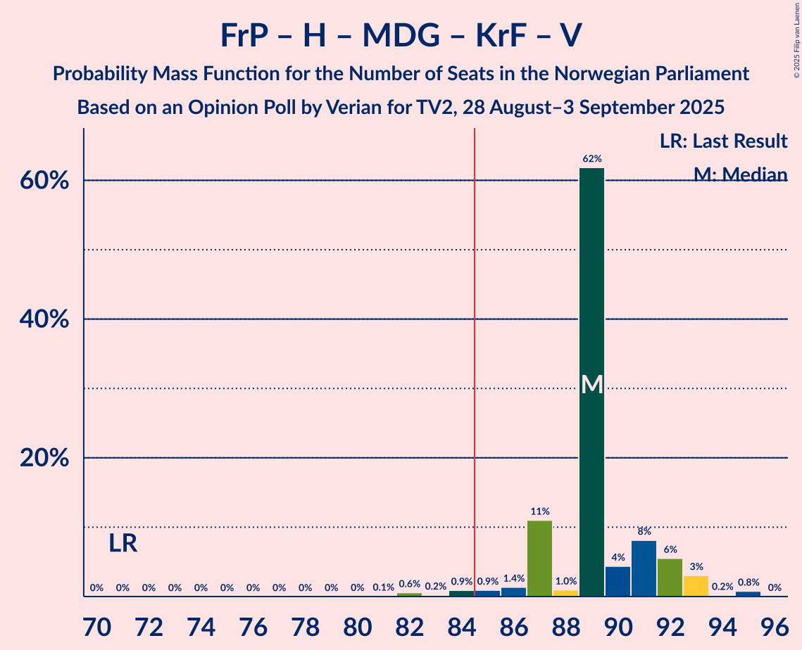
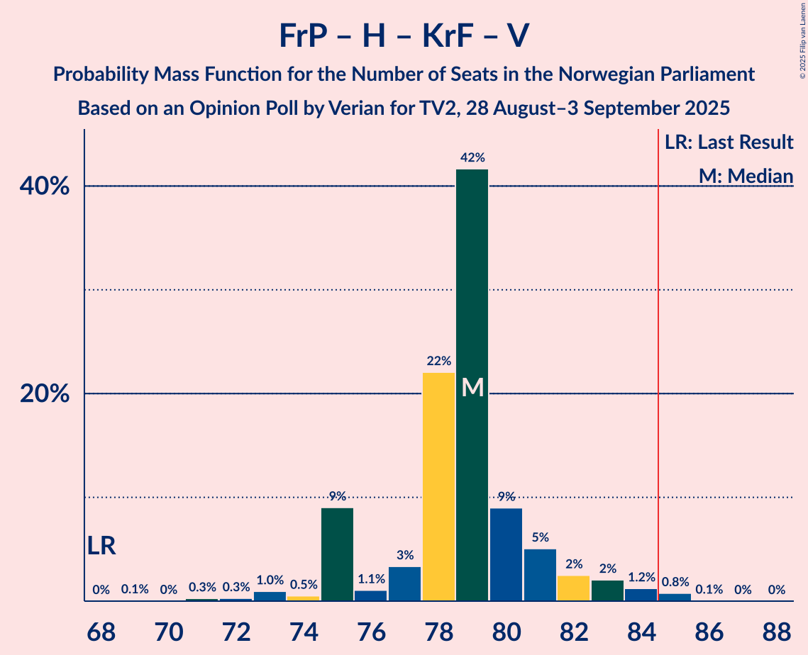

# Opinion Poll by Verian for TV2, 28 August–3 September 2025

<a href="#voting-intentions">Voting Intentions</a> | <a href="#seats">Seats</a> | <a href="#coalitions">Coalitions</a> | <a href="#technical-information">Technical Information</a>

## Voting Intentions

### Confidence Intervals

| Party | Last Result | Poll Result | 80% Confidence Interval | 90% Confidence Interval | 95% Confidence Interval | 99% Confidence Interval |
|:-----:|:-----------:|:-----------:|:-----------------------:|:-----------------------:|:-----------------------:|:-----------------------:|
| Arbeiderpartiet | 26.2% | 27.4% | 26.2–28.6% |25.9–28.9% |25.6–29.2% |25.0–29.8% |
| Fremskrittspartiet | 11.6% | 21.6% | 20.5–22.7% |20.2–23.1% |20.0–23.3% |19.4–23.9% |
| Høyre | 20.4% | 14.6% | 13.7–15.6% |13.4–15.9% |13.2–16.1% |12.8–16.6% |
| Miljøpartiet De Grønne | 3.9% | 6.4% | 5.8–7.1% |5.6–7.3% |5.5–7.5% |5.2–7.8% |
| Senterpartiet | 13.5% | 5.8% | 5.2–6.5% |5.0–6.6% |4.9–6.8% |4.6–7.1% |
| Sosialistisk Venstreparti | 7.6% | 5.6% | 5.0–6.3% |4.9–6.5% |4.7–6.6% |4.5–7.0% |
| Rødt | 4.7% | 5.5% | 5.0–6.2% |4.8–6.4% |4.6–6.5% |4.4–6.9% |
| Venstre | 4.6% | 4.2% | 3.7–4.8% |3.6–5.0% |3.5–5.1% |3.2–5.4% |
| Kristelig Folkeparti | 3.8% | 4.2% | 3.7–4.8% |3.6–5.0% |3.5–5.1% |3.2–5.4% |
| Konservativt | 0.4% | 0.8% | 0.6–1.1% |0.5–1.2% |0.5–1.2% |0.4–1.4% |
| Norgesdemokratene | 1.1% | 0.5% | 0.4–0.8% |0.3–0.9% |0.3–0.9% |0.2–1.1% |
| Pensjonistpartiet | 0.6% | 0.4% | 0.3–0.6% |0.2–0.7% |0.2–0.7% |0.2–0.9% |
| Industri- og Næringspartiet | 0.3% | 0.2% | 0.1–0.4% |0.1–0.5% |0.1–0.5% |0.1–0.6% |

*Note:* The poll result column reflects the actual value used in the calculations. Published results may vary slightly, and in addition be rounded to fewer digits.

## Seats

### Confidence Intervals

| Party | Last Result | Median | 80% Confidence Interval | 90% Confidence Interval | 95% Confidence Interval | 99% Confidence Interval |
|:-----:|:-----------:|:------:|:-----------------------:|:-----------------------:|:-----------------------:|:-----------------------:|
| <a href="#arbeiderpartiet">Arbeiderpartiet</a> | 48 | 53 | 50–54 |50–55 |48–57 |47–58 |
| <a href="#fremskrittspartiet">Fremskrittspartiet</a> | 21 | 42 | 38–44 |38–44 |38–44 |38–44 |
| <a href="#høyre">Høyre</a> | 36 | 26 | 26–28 |25–29 |23–30 |20–30 |
| <a href="#miljøpartiet-de-grønne">Miljøpartiet De Grønne</a> | 3 | 11 | 10–11 |9–11 |8–12 |7–12 |
| <a href="#senterpartiet">Senterpartiet</a> | 28 | 9 | 8–11 |7–11 |7–11 |7–12 |
| <a href="#sosialistisk-venstreparti">Sosialistisk Venstreparti</a> | 13 | 9 | 8–9 |8–10 |7–11 |7–12 |
| <a href="#rødt">Rødt</a> | 8 | 9 | 8–9 |8–10 |7–11 |7–11 |
| <a href="#venstre">Venstre</a> | 8 | 3 | 3–7 |3–7 |3–8 |3–9 |
| <a href="#kristelig-folkeparti">Kristelig Folkeparti</a> | 3 | 7 | 3–8 |3–8 |3–8 |2–9 |
| <a href="#konservativt">Konservativt</a> | 0 | 0 | 0 |0 |0 |0 |
| <a href="#norgesdemokratene">Norgesdemokratene</a> | 0 | 0 | 0 |0 |0 |0 |
| <a href="#pensjonistpartiet">Pensjonistpartiet</a> | 0 | 0 | 0 |0 |0 |0 |
| <a href="#industri--og-næringspartiet">Industri- og Næringspartiet</a> | 0 | 0 | 0 |0 |0 |0 |

### Arbeiderpartiet

*For a full overview of the results for this party, see the [Arbeiderpartiet](party-arbeiderpartiet.html) page.*

| Number of Seats | Probability | Accumulated | Special Marks |
|:---------------:|:-----------:|:-----------:|:-------------:|
| 47 | 1.4% | 100% |  |
| 48 | 3% | 98.6% | Last Result |
| 49 | 0.6% | 96% |  |
| 50 | 7% | 95% |  |
| 51 | 2% | 88% |  |
| 52 | 18% | 86% |  |
| 53 | 57% | 68% | Median |
| 54 | 3% | 11% |  |
| 55 | 3% | 8% |  |
| 56 | 2% | 5% |  |
| 57 | 1.0% | 3% |  |
| 58 | 1.2% | 2% |  |
| 59 | 0.4% | 0.5% |  |
| 60 | 0.1% | 0.1% |  |
| 61 | 0% | 0% |  |

### Fremskrittspartiet

*For a full overview of the results for this party, see the [Fremskrittspartiet](party-fremskrittspartiet.html) page.*

| Number of Seats | Probability | Accumulated | Special Marks |
|:---------------:|:-----------:|:-----------:|:-------------:|
| 21 | 0% | 100% | Last Result |
| 22 | 0% | 100% |  |
| 23 | 0% | 100% |  |
| 24 | 0% | 100% |  |
| 25 | 0% | 100% |  |
| 26 | 0% | 100% |  |
| 27 | 0% | 100% |  |
| 28 | 0% | 100% |  |
| 29 | 0% | 100% |  |
| 30 | 0% | 100% |  |
| 31 | 0% | 100% |  |
| 32 | 0% | 100% |  |
| 33 | 0% | 100% |  |
| 34 | 0% | 100% |  |
| 35 | 0% | 100% |  |
| 36 | 0.2% | 100% |  |
| 37 | 0.2% | 99.7% |  |
| 38 | 13% | 99.5% |  |
| 39 | 0.5% | 87% |  |
| 40 | 4% | 86% |  |
| 41 | 3% | 82% |  |
| 42 | 51% | 79% | Median |
| 43 | 13% | 28% |  |
| 44 | 14% | 15% |  |
| 45 | 0.3% | 0.5% |  |
| 46 | 0.1% | 0.2% |  |
| 47 | 0.1% | 0.1% |  |
| 48 | 0% | 0% |  |

### Høyre

*For a full overview of the results for this party, see the [Høyre](party-høyre.html) page.*

| Number of Seats | Probability | Accumulated | Special Marks |
|:---------------:|:-----------:|:-----------:|:-------------:|
| 19 | 0.3% | 100% |  |
| 20 | 0.3% | 99.7% |  |
| 21 | 1.3% | 99.4% |  |
| 22 | 0.5% | 98% |  |
| 23 | 1.0% | 98% |  |
| 24 | 1.3% | 97% |  |
| 25 | 4% | 95% |  |
| 26 | 56% | 91% | Median |
| 27 | 25% | 35% |  |
| 28 | 4% | 10% |  |
| 29 | 3% | 6% |  |
| 30 | 2% | 3% |  |
| 31 | 0.2% | 0.2% |  |
| 32 | 0% | 0% |  |
| 33 | 0% | 0% |  |
| 34 | 0% | 0% |  |
| 35 | 0% | 0% |  |
| 36 | 0% | 0% | Last Result |

### Miljøpartiet De Grønne

*For a full overview of the results for this party, see the [Miljøpartiet De Grønne](party-miljøpartietdegrønne.html) page.*

| Number of Seats | Probability | Accumulated | Special Marks |
|:---------------:|:-----------:|:-----------:|:-------------:|
| 3 | 0% | 100% | Last Result |
| 4 | 0% | 100% |  |
| 5 | 0% | 100% |  |
| 6 | 0% | 100% |  |
| 7 | 2% | 100% |  |
| 8 | 3% | 98% |  |
| 9 | 2% | 96% |  |
| 10 | 20% | 93% |  |
| 11 | 69% | 73% | Median |
| 12 | 4% | 5% |  |
| 13 | 0.5% | 0.5% |  |
| 14 | 0% | 0% |  |

### Senterpartiet

*For a full overview of the results for this party, see the [Senterpartiet](party-senterpartiet.html) page.*

| Number of Seats | Probability | Accumulated | Special Marks |
|:---------------:|:-----------:|:-----------:|:-------------:|
| 6 | 0.1% | 100% |  |
| 7 | 6% | 99.9% |  |
| 8 | 20% | 94% |  |
| 9 | 48% | 75% | Median |
| 10 | 10% | 27% |  |
| 11 | 15% | 17% |  |
| 12 | 1.1% | 2% |  |
| 13 | 0.5% | 0.5% |  |
| 14 | 0% | 0% |  |
| 15 | 0% | 0% |  |
| 16 | 0% | 0% |  |
| 17 | 0% | 0% |  |
| 18 | 0% | 0% |  |
| 19 | 0% | 0% |  |
| 20 | 0% | 0% |  |
| 21 | 0% | 0% |  |
| 22 | 0% | 0% |  |
| 23 | 0% | 0% |  |
| 24 | 0% | 0% |  |
| 25 | 0% | 0% |  |
| 26 | 0% | 0% |  |
| 27 | 0% | 0% |  |
| 28 | 0% | 0% | Last Result |

### Sosialistisk Venstreparti

*For a full overview of the results for this party, see the [Sosialistisk Venstreparti](party-sosialistiskvenstreparti.html) page.*

| Number of Seats | Probability | Accumulated | Special Marks |
|:---------------:|:-----------:|:-----------:|:-------------:|
| 6 | 0.1% | 100% |  |
| 7 | 3% | 99.9% |  |
| 8 | 16% | 97% |  |
| 9 | 73% | 81% | Median |
| 10 | 5% | 8% |  |
| 11 | 2% | 3% |  |
| 12 | 0.8% | 0.8% |  |
| 13 | 0% | 0% | Last Result |

### Rødt

*For a full overview of the results for this party, see the [Rødt](party-rødt.html) page.*

| Number of Seats | Probability | Accumulated | Special Marks |
|:---------------:|:-----------:|:-----------:|:-------------:|
| 7 | 5% | 100% |  |
| 8 | 24% | 95% | Last Result |
| 9 | 64% | 71% | Median |
| 10 | 3% | 6% |  |
| 11 | 3% | 3% |  |
| 12 | 0.1% | 0.1% |  |
| 13 | 0% | 0% |  |

### Venstre

*For a full overview of the results for this party, see the [Venstre](party-venstre.html) page.*

| Number of Seats | Probability | Accumulated | Special Marks |
|:---------------:|:-----------:|:-----------:|:-------------:|
| 2 | 0.4% | 100% |  |
| 3 | 58% | 99.6% | Median |
| 4 | 0% | 41% |  |
| 5 | 0% | 41% |  |
| 6 | 2% | 41% |  |
| 7 | 35% | 40% |  |
| 8 | 4% | 4% | Last Result |
| 9 | 0.5% | 0.6% |  |
| 10 | 0% | 0% |  |

### Kristelig Folkeparti

*For a full overview of the results for this party, see the [Kristelig Folkeparti](party-kristeligfolkeparti.html) page.*

| Number of Seats | Probability | Accumulated | Special Marks |
|:---------------:|:-----------:|:-----------:|:-------------:|
| 2 | 2% | 100% |  |
| 3 | 19% | 98% | Last Result |
| 4 | 0% | 79% |  |
| 5 | 0% | 79% |  |
| 6 | 3% | 79% |  |
| 7 | 65% | 76% | Median |
| 8 | 9% | 10% |  |
| 9 | 0.8% | 0.8% |  |
| 10 | 0% | 0% |  |

### Konservativt

*For a full overview of the results for this party, see the [Konservativt](party-konservativt.html) page.*

| Number of Seats | Probability | Accumulated | Special Marks |
|:---------------:|:-----------:|:-----------:|:-------------:|
| 0 | 100% | 100% | Last Result, Median |

### Norgesdemokratene

*For a full overview of the results for this party, see the [Norgesdemokratene](party-norgesdemokratene.html) page.*

| Number of Seats | Probability | Accumulated | Special Marks |
|:---------------:|:-----------:|:-----------:|:-------------:|
| 0 | 100% | 100% | Last Result, Median |

### Pensjonistpartiet

*For a full overview of the results for this party, see the [Pensjonistpartiet](party-pensjonistpartiet.html) page.*

| Number of Seats | Probability | Accumulated | Special Marks |
|:---------------:|:-----------:|:-----------:|:-------------:|
| 0 | 100% | 100% | Last Result, Median |

### Industri- og Næringspartiet

*For a full overview of the results for this party, see the [Industri- og Næringspartiet](party-industri-ognæringspartiet.html) page.*

| Number of Seats | Probability | Accumulated | Special Marks |
|:---------------:|:-----------:|:-----------:|:-------------:|
| 0 | 100% | 100% | Last Result, Median |

## Coalitions

### Confidence Intervals

| Coalition | Last Result | Median | Majority? | 80% Confidence Interval | 90% Confidence Interval | 95% Confidence Interval | 99% Confidence Interval |
|:---------:|:-----------:|:------:|:---------:|:-----------------------:|:-----------------------:|:-----------------------:|:-----------------------:|
| Arbeiderpartiet – Miljøpartiet De Grønne – Senterpartiet – Sosialistisk Venstreparti – Rødt | 100 | 91 | 99.7% | 88–91 | 86–92 | 85–94 | 85–98 |
| Fremskrittspartiet – Høyre – Miljøpartiet De Grønne – Kristelig Folkeparti – Venstre | 71 | 89 | 98.6% | 89–92 | 87–93 | 86–93 | 82–93 |
| Fremskrittspartiet – Høyre – Senterpartiet – Kristelig Folkeparti – Venstre | 96 | 87 | 97% | 87–91 | 86–91 | 84–92 | 81–94 |
| Arbeiderpartiet – Miljøpartiet De Grønne – Senterpartiet – Sosialistisk Venstreparti – Kristelig Folkeparti | 95 | 89 | 79% | 83–89 | 83–89 | 83–91 | 82–94 |
| Arbeiderpartiet – Miljøpartiet De Grønne – Senterpartiet – Sosialistisk Venstreparti | 92 | 82 | 3% | 79–82 | 78–83 | 78–85 | 77–88 |
| Arbeiderpartiet – Miljøpartiet De Grønne – Sosialistisk Venstreparti – Rødt | 72 | 82 | 3% | 78–82 | 78–83 | 77–85 | 75–88 |
| Fremskrittspartiet – Høyre – Kristelig Folkeparti – Venstre | 68 | 78 | 0.3% | 78–81 | 77–83 | 75–84 | 71–84 |
| Arbeiderpartiet – Senterpartiet – Sosialistisk Venstreparti – Rødt | 97 | 80 | 1.4% | 77–80 | 76–82 | 76–83 | 76–87 |
| Arbeiderpartiet – Miljøpartiet De Grønne – Senterpartiet – Kristelig Folkeparti | 82 | 80 | 0.4% | 74–81 | 74–81 | 73–82 | 73–84 |
| Fremskrittspartiet – Høyre – Venstre | 65 | 72 | 0% | 71–77 | 70–77 | 69–78 | 67–78 |
| Arbeiderpartiet – Senterpartiet – Sosialistisk Venstreparti | 89 | 71 | 0% | 69–72 | 68–73 | 68–74 | 67–77 |
| Fremskrittspartiet – Høyre | 57 | 68 | 0% | 65–70 | 65–71 | 64–72 | 60–72 |
| Arbeiderpartiet – Senterpartiet – Kristelig Folkeparti | 79 | 69 | 0% | 63–71 | 63–71 | 62–72 | 61–74 |
| Arbeiderpartiet – Senterpartiet | 76 | 62 | 0% | 60–64 | 59–64 | 58–66 | 58–68 |
| Arbeiderpartiet – Sosialistisk Venstreparti | 61 | 62 | 0% | 59–62 | 59–64 | 58–65 | 56–67 |
| Høyre – Kristelig Folkeparti – Venstre | 47 | 36 | 0% | 36–41 | 35–42 | 34–42 | 30–43 |
| Senterpartiet – Kristelig Folkeparti – Venstre | 39 | 19 | 0% | 18–25 | 17–25 | 16–25 | 16–26 |

### Arbeiderpartiet – Miljøpartiet De Grønne – Senterpartiet – Sosialistisk Venstreparti – Rødt

| Number of Seats | Probability | Accumulated | Special Marks |
|:---------------:|:-----------:|:-----------:|:-------------:|
| 83 | 0% | 100% |  |
| 84 | 0.2% | 99.9% |  |
| 85 | 3% | 99.7% | Majority |
| 86 | 3% | 97% |  |
| 87 | 4% | 94% |  |
| 88 | 8% | 91% |  |
| 89 | 17% | 83% |  |
| 90 | 13% | 66% |  |
| 91 | 46% | 53% | Median |
| 92 | 2% | 7% |  |
| 93 | 1.2% | 4% |  |
| 94 | 0.9% | 3% |  |
| 95 | 1.0% | 2% |  |
| 96 | 0.2% | 1.3% |  |
| 97 | 0.5% | 1.1% |  |
| 98 | 0.3% | 0.5% |  |
| 99 | 0% | 0.2% |  |
| 100 | 0.2% | 0.2% | Last Result |
| 101 | 0% | 0% |  |

### Fremskrittspartiet – Høyre – Miljøpartiet De Grønne – Kristelig Folkeparti – Venstre

| Number of Seats | Probability | Accumulated | Special Marks |
|:---------------:|:-----------:|:-----------:|:-------------:|
| 71 | 0% | 100% | Last Result |
| 72 | 0% | 100% |  |
| 73 | 0% | 100% |  |
| 74 | 0% | 100% |  |
| 75 | 0% | 100% |  |
| 76 | 0% | 100% |  |
| 77 | 0% | 100% |  |
| 78 | 0% | 100% |  |
| 79 | 0% | 100% |  |
| 80 | 0% | 100% |  |
| 81 | 0.1% | 100% |  |
| 82 | 0.6% | 99.9% |  |
| 83 | 0.1% | 99.3% |  |
| 84 | 0.7% | 99.3% |  |
| 85 | 0.8% | 98.6% | Majority |
| 86 | 2% | 98% |  |
| 87 | 3% | 96% |  |
| 88 | 1.0% | 93% |  |
| 89 | 56% | 92% | Median |
| 90 | 4% | 36% |  |
| 91 | 17% | 31% |  |
| 92 | 10% | 15% |  |
| 93 | 5% | 5% |  |
| 94 | 0.2% | 0.5% |  |
| 95 | 0.2% | 0.2% |  |
| 96 | 0% | 0% |  |

### Fremskrittspartiet – Høyre – Senterpartiet – Kristelig Folkeparti – Venstre

| Number of Seats | Probability | Accumulated | Special Marks |
|:---------------:|:-----------:|:-----------:|:-------------:|
| 80 | 0.2% | 100% |  |
| 81 | 0.6% | 99.8% |  |
| 82 | 0.6% | 99.2% |  |
| 83 | 0.3% | 98.5% |  |
| 84 | 1.1% | 98% |  |
| 85 | 2% | 97% | Majority |
| 86 | 2% | 95% |  |
| 87 | 45% | 94% | Median |
| 88 | 16% | 48% |  |
| 89 | 3% | 33% |  |
| 90 | 16% | 29% |  |
| 91 | 10% | 14% |  |
| 92 | 3% | 4% |  |
| 93 | 0.2% | 1.1% |  |
| 94 | 0.8% | 0.9% |  |
| 95 | 0.1% | 0.1% |  |
| 96 | 0% | 0% | Last Result |

### Arbeiderpartiet – Miljøpartiet De Grønne – Senterpartiet – Sosialistisk Venstreparti – Kristelig Folkeparti

| Number of Seats | Probability | Accumulated | Special Marks |
|:---------------:|:-----------:|:-----------:|:-------------:|
| 80 | 0.1% | 100% |  |
| 81 | 0.3% | 99.9% |  |
| 82 | 0.2% | 99.6% |  |
| 83 | 17% | 99.4% |  |
| 84 | 3% | 82% |  |
| 85 | 6% | 79% | Majority |
| 86 | 2% | 73% |  |
| 87 | 1.3% | 71% |  |
| 88 | 8% | 70% |  |
| 89 | 57% | 62% | Median |
| 90 | 1.3% | 5% |  |
| 91 | 1.5% | 4% |  |
| 92 | 0.7% | 2% |  |
| 93 | 0.7% | 1.3% |  |
| 94 | 0.2% | 0.7% |  |
| 95 | 0.2% | 0.4% | Last Result |
| 96 | 0.2% | 0.2% |  |
| 97 | 0% | 0% |  |

### Arbeiderpartiet – Miljøpartiet De Grønne – Senterpartiet – Sosialistisk Venstreparti

| Number of Seats | Probability | Accumulated | Special Marks |
|:---------------:|:-----------:|:-----------:|:-------------:|
| 74 | 0.1% | 100% |  |
| 75 | 0.1% | 99.9% |  |
| 76 | 0.1% | 99.8% |  |
| 77 | 0.8% | 99.7% |  |
| 78 | 7% | 98.8% |  |
| 79 | 2% | 92% |  |
| 80 | 24% | 90% |  |
| 81 | 2% | 65% |  |
| 82 | 57% | 64% | Median |
| 83 | 2% | 7% |  |
| 84 | 2% | 4% |  |
| 85 | 0.2% | 3% | Majority |
| 86 | 1.1% | 2% |  |
| 87 | 0.5% | 1.2% |  |
| 88 | 0.4% | 0.7% |  |
| 89 | 0.2% | 0.4% |  |
| 90 | 0% | 0.2% |  |
| 91 | 0% | 0.2% |  |
| 92 | 0.1% | 0.2% | Last Result |
| 93 | 0% | 0% |  |

### Arbeiderpartiet – Miljøpartiet De Grønne – Sosialistisk Venstreparti – Rødt

| Number of Seats | Probability | Accumulated | Special Marks |
|:---------------:|:-----------:|:-----------:|:-------------:|
| 72 | 0% | 100% | Last Result |
| 73 | 0% | 100% |  |
| 74 | 0.1% | 100% |  |
| 75 | 0.8% | 99.9% |  |
| 76 | 0.2% | 99.1% |  |
| 77 | 3% | 98.9% |  |
| 78 | 10% | 96% |  |
| 79 | 16% | 86% |  |
| 80 | 3% | 71% |  |
| 81 | 16% | 67% |  |
| 82 | 45% | 52% | Median |
| 83 | 2% | 6% |  |
| 84 | 2% | 5% |  |
| 85 | 1.1% | 3% | Majority |
| 86 | 0.3% | 2% |  |
| 87 | 0.6% | 1.5% |  |
| 88 | 0.6% | 0.8% |  |
| 89 | 0.2% | 0.2% |  |
| 90 | 0% | 0% |  |

### Fremskrittspartiet – Høyre – Kristelig Folkeparti – Venstre

| Number of Seats | Probability | Accumulated | Special Marks |
|:---------------:|:-----------:|:-----------:|:-------------:|
| 68 | 0% | 100% | Last Result |
| 69 | 0.2% | 100% |  |
| 70 | 0% | 99.8% |  |
| 71 | 0.3% | 99.8% |  |
| 72 | 0.5% | 99.5% |  |
| 73 | 0.2% | 98.9% |  |
| 74 | 1.0% | 98.7% |  |
| 75 | 0.9% | 98% |  |
| 76 | 1.2% | 97% |  |
| 77 | 2% | 96% |  |
| 78 | 46% | 93% | Median |
| 79 | 13% | 47% |  |
| 80 | 17% | 34% |  |
| 81 | 8% | 17% |  |
| 82 | 4% | 9% |  |
| 83 | 3% | 6% |  |
| 84 | 3% | 3% |  |
| 85 | 0.2% | 0.3% | Majority |
| 86 | 0% | 0.1% |  |
| 87 | 0% | 0% |  |

### Arbeiderpartiet – Senterpartiet – Sosialistisk Venstreparti – Rødt

| Number of Seats | Probability | Accumulated | Special Marks |
|:---------------:|:-----------:|:-----------:|:-------------:|
| 74 | 0.2% | 100% |  |
| 75 | 0.2% | 99.8% |  |
| 76 | 5% | 99.5% |  |
| 77 | 10% | 95% |  |
| 78 | 17% | 85% |  |
| 79 | 4% | 69% |  |
| 80 | 56% | 64% | Median |
| 81 | 1.0% | 8% |  |
| 82 | 3% | 7% |  |
| 83 | 2% | 4% |  |
| 84 | 0.8% | 2% |  |
| 85 | 0.7% | 1.4% | Majority |
| 86 | 0.1% | 0.7% |  |
| 87 | 0.6% | 0.7% |  |
| 88 | 0.1% | 0.1% |  |
| 89 | 0% | 0% |  |
| 90 | 0% | 0% |  |
| 91 | 0% | 0% |  |
| 92 | 0% | 0% |  |
| 93 | 0% | 0% |  |
| 94 | 0% | 0% |  |
| 95 | 0% | 0% |  |
| 96 | 0% | 0% |  |
| 97 | 0% | 0% | Last Result |

### Arbeiderpartiet – Miljøpartiet De Grønne – Senterpartiet – Kristelig Folkeparti

| Number of Seats | Probability | Accumulated | Special Marks |
|:---------------:|:-----------:|:-----------:|:-------------:|
| 70 | 0.1% | 100% |  |
| 71 | 0% | 99.9% |  |
| 72 | 0% | 99.9% |  |
| 73 | 3% | 99.9% |  |
| 74 | 15% | 97% |  |
| 75 | 2% | 82% |  |
| 76 | 4% | 81% |  |
| 77 | 6% | 76% |  |
| 78 | 2% | 71% |  |
| 79 | 9% | 69% |  |
| 80 | 44% | 60% | Median |
| 81 | 13% | 16% |  |
| 82 | 0.6% | 3% | Last Result |
| 83 | 1.3% | 2% |  |
| 84 | 0.7% | 1.1% |  |
| 85 | 0% | 0.4% | Majority |
| 86 | 0.2% | 0.4% |  |
| 87 | 0% | 0.2% |  |
| 88 | 0.1% | 0.2% |  |
| 89 | 0% | 0% |  |

### Fremskrittspartiet – Høyre – Venstre

| Number of Seats | Probability | Accumulated | Special Marks |
|:---------------:|:-----------:|:-----------:|:-------------:|
| 63 | 0% | 100% |  |
| 64 | 0.1% | 99.9% |  |
| 65 | 0.2% | 99.9% | Last Result |
| 66 | 0.2% | 99.7% |  |
| 67 | 1.4% | 99.5% |  |
| 68 | 0.5% | 98% |  |
| 69 | 1.4% | 98% |  |
| 70 | 1.3% | 96% |  |
| 71 | 43% | 95% | Median |
| 72 | 12% | 51% |  |
| 73 | 10% | 39% |  |
| 74 | 0.8% | 29% |  |
| 75 | 7% | 28% |  |
| 76 | 3% | 21% |  |
| 77 | 15% | 18% |  |
| 78 | 3% | 3% |  |
| 79 | 0.1% | 0.3% |  |
| 80 | 0.1% | 0.2% |  |
| 81 | 0.1% | 0.1% |  |
| 82 | 0% | 0% |  |

### Arbeiderpartiet – Senterpartiet – Sosialistisk Venstreparti

| Number of Seats | Probability | Accumulated | Special Marks |
|:---------------:|:-----------:|:-----------:|:-------------:|
| 65 | 0.2% | 100% |  |
| 66 | 0.1% | 99.8% |  |
| 67 | 0.9% | 99.7% |  |
| 68 | 6% | 98.8% |  |
| 69 | 23% | 93% |  |
| 70 | 4% | 69% |  |
| 71 | 46% | 66% | Median |
| 72 | 13% | 20% |  |
| 73 | 4% | 7% |  |
| 74 | 1.2% | 3% |  |
| 75 | 1.1% | 2% |  |
| 76 | 0.3% | 1.2% |  |
| 77 | 0.5% | 0.9% |  |
| 78 | 0% | 0.4% |  |
| 79 | 0.3% | 0.3% |  |
| 80 | 0% | 0% |  |
| 81 | 0% | 0% |  |
| 82 | 0% | 0% |  |
| 83 | 0% | 0% |  |
| 84 | 0% | 0% |  |
| 85 | 0% | 0% | Majority |
| 86 | 0% | 0% |  |
| 87 | 0% | 0% |  |
| 88 | 0% | 0% |  |
| 89 | 0% | 0% | Last Result |

### Fremskrittspartiet – Høyre

| Number of Seats | Probability | Accumulated | Special Marks |
|:---------------:|:-----------:|:-----------:|:-------------:|
| 57 | 0% | 100% | Last Result |
| 58 | 0.2% | 100% |  |
| 59 | 0.1% | 99.8% |  |
| 60 | 0.7% | 99.7% |  |
| 61 | 0.1% | 99.0% |  |
| 62 | 0.1% | 98.8% |  |
| 63 | 0.4% | 98.7% |  |
| 64 | 2% | 98% |  |
| 65 | 13% | 96% |  |
| 66 | 1.4% | 84% |  |
| 67 | 2% | 82% |  |
| 68 | 48% | 80% | Median |
| 69 | 2% | 32% |  |
| 70 | 25% | 30% |  |
| 71 | 3% | 6% |  |
| 72 | 2% | 3% |  |
| 73 | 0.1% | 0.3% |  |
| 74 | 0.2% | 0.2% |  |
| 75 | 0% | 0% |  |

### Arbeiderpartiet – Senterpartiet – Kristelig Folkeparti

| Number of Seats | Probability | Accumulated | Special Marks |
|:---------------:|:-----------:|:-----------:|:-------------:|
| 60 | 0.1% | 100% |  |
| 61 | 2% | 99.9% |  |
| 62 | 0.4% | 98% |  |
| 63 | 15% | 97% |  |
| 64 | 0.3% | 82% |  |
| 65 | 2% | 82% |  |
| 66 | 5% | 80% |  |
| 67 | 1.1% | 75% |  |
| 68 | 10% | 74% |  |
| 69 | 46% | 64% | Median |
| 70 | 3% | 18% |  |
| 71 | 13% | 15% |  |
| 72 | 0.3% | 3% |  |
| 73 | 1.3% | 2% |  |
| 74 | 0.8% | 1.1% |  |
| 75 | 0.1% | 0.3% |  |
| 76 | 0% | 0.2% |  |
| 77 | 0% | 0.2% |  |
| 78 | 0.2% | 0.2% |  |
| 79 | 0% | 0% | Last Result |

### Arbeiderpartiet – Senterpartiet

| Number of Seats | Probability | Accumulated | Special Marks |
|:---------------:|:-----------:|:-----------:|:-------------:|
| 57 | 0.2% | 100% |  |
| 58 | 4% | 99.8% |  |
| 59 | 4% | 96% |  |
| 60 | 23% | 92% |  |
| 61 | 3% | 69% |  |
| 62 | 44% | 66% | Median |
| 63 | 5% | 23% |  |
| 64 | 14% | 18% |  |
| 65 | 1.1% | 4% |  |
| 66 | 2% | 3% |  |
| 67 | 0.2% | 1.0% |  |
| 68 | 0.5% | 0.8% |  |
| 69 | 0% | 0.3% |  |
| 70 | 0.1% | 0.3% |  |
| 71 | 0.2% | 0.2% |  |
| 72 | 0% | 0% |  |
| 73 | 0% | 0% |  |
| 74 | 0% | 0% |  |
| 75 | 0% | 0% |  |
| 76 | 0% | 0% | Last Result |

### Arbeiderpartiet – Sosialistisk Venstreparti

| Number of Seats | Probability | Accumulated | Special Marks |
|:---------------:|:-----------:|:-----------:|:-------------:|
| 56 | 0.8% | 100% |  |
| 57 | 0.4% | 99.2% |  |
| 58 | 3% | 98.8% |  |
| 59 | 7% | 95% |  |
| 60 | 1.4% | 88% |  |
| 61 | 29% | 86% | Last Result |
| 62 | 50% | 57% | Median |
| 63 | 2% | 7% |  |
| 64 | 1.0% | 6% |  |
| 65 | 2% | 5% |  |
| 66 | 0.8% | 2% |  |
| 67 | 1.3% | 2% |  |
| 68 | 0.2% | 0.3% |  |
| 69 | 0% | 0.1% |  |
| 70 | 0.1% | 0.1% |  |
| 71 | 0% | 0% |  |

### Høyre – Kristelig Folkeparti – Venstre

| Number of Seats | Probability | Accumulated | Special Marks |
|:---------------:|:-----------:|:-----------:|:-------------:|
| 29 | 0.3% | 100% |  |
| 30 | 0.4% | 99.7% |  |
| 31 | 0.1% | 99.2% |  |
| 32 | 0.8% | 99.1% |  |
| 33 | 0.6% | 98% |  |
| 34 | 2% | 98% |  |
| 35 | 2% | 96% |  |
| 36 | 59% | 93% | Median |
| 37 | 3% | 35% |  |
| 38 | 10% | 32% |  |
| 39 | 1.0% | 22% |  |
| 40 | 1.2% | 21% |  |
| 41 | 13% | 20% |  |
| 42 | 6% | 7% |  |
| 43 | 0.8% | 0.8% |  |
| 44 | 0% | 0.1% |  |
| 45 | 0% | 0% |  |
| 46 | 0% | 0% |  |
| 47 | 0% | 0% | Last Result |

### Senterpartiet – Kristelig Folkeparti – Venstre

| Number of Seats | Probability | Accumulated | Special Marks |
|:---------------:|:-----------:|:-----------:|:-------------:|
| 15 | 0.4% | 100% |  |
| 16 | 2% | 99.6% |  |
| 17 | 4% | 97% |  |
| 18 | 15% | 94% |  |
| 19 | 44% | 79% | Median |
| 20 | 3% | 34% |  |
| 21 | 11% | 31% |  |
| 22 | 3% | 20% |  |
| 23 | 3% | 17% |  |
| 24 | 0.1% | 14% |  |
| 25 | 13% | 14% |  |
| 26 | 0.9% | 1.4% |  |
| 27 | 0.4% | 0.5% |  |
| 28 | 0.1% | 0.1% |  |
| 29 | 0% | 0% |  |
| 30 | 0% | 0% |  |
| 31 | 0% | 0% |  |
| 32 | 0% | 0% |  |
| 33 | 0% | 0% |  |
| 34 | 0% | 0% |  |
| 35 | 0% | 0% |  |
| 36 | 0% | 0% |  |
| 37 | 0% | 0% |  |
| 38 | 0% | 0% |  |
| 39 | 0% | 0% | Last Result |

## Technical Information

### Opinion Poll

+ **Polling firm:** Verian
+ **Commissioner(s):** TV2
+ **Fieldwork period:** 28 August–3 September 2025

### Calculations

+ **Sample size:** 2301
+ **Simulations done:** 1,048,576
+ **Error estimate:** 1.59%

