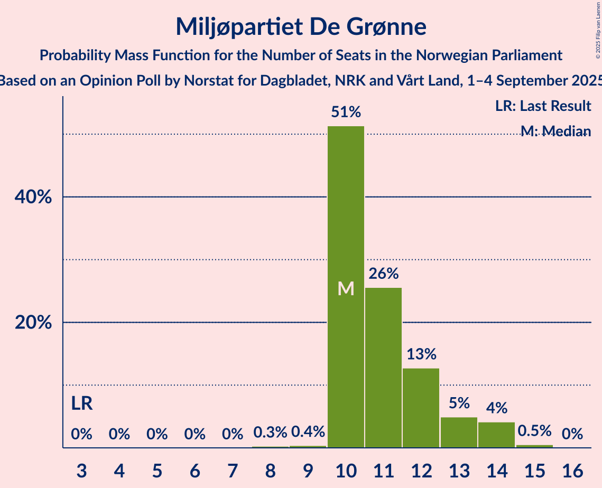
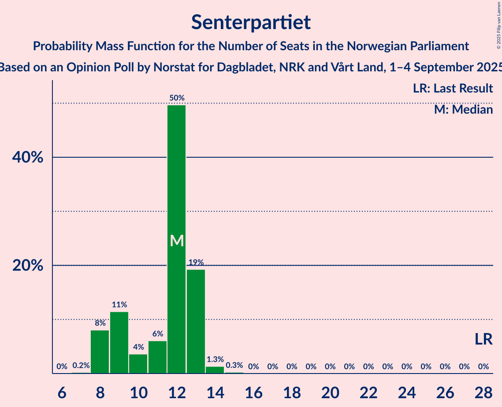
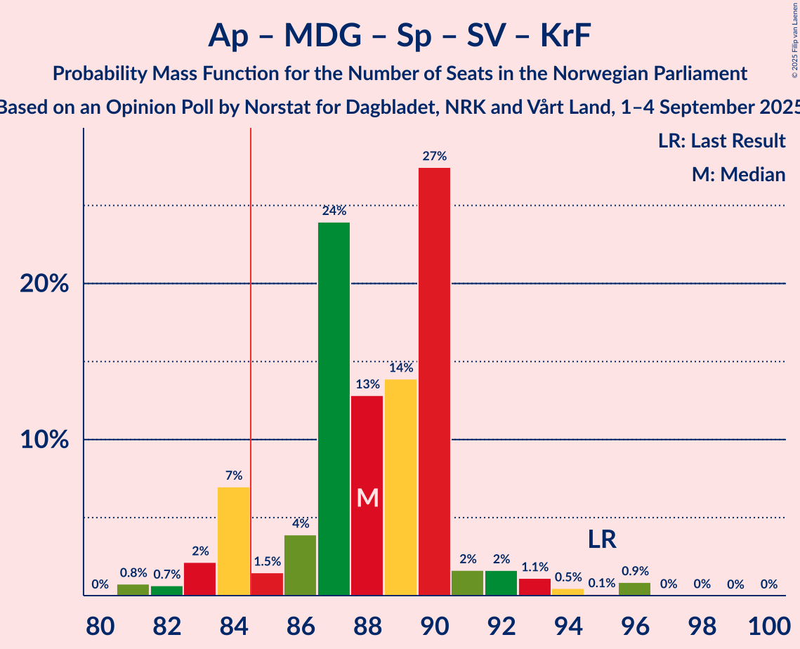
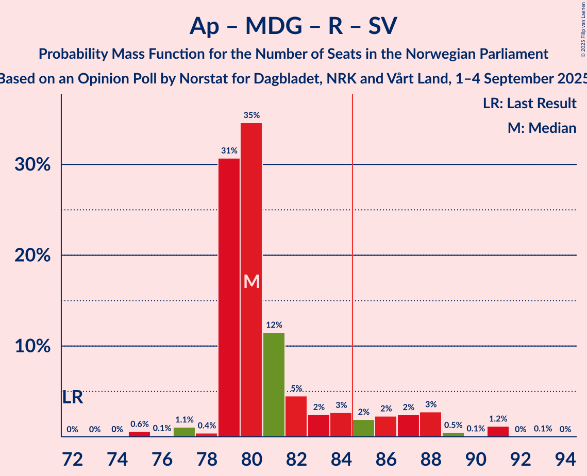
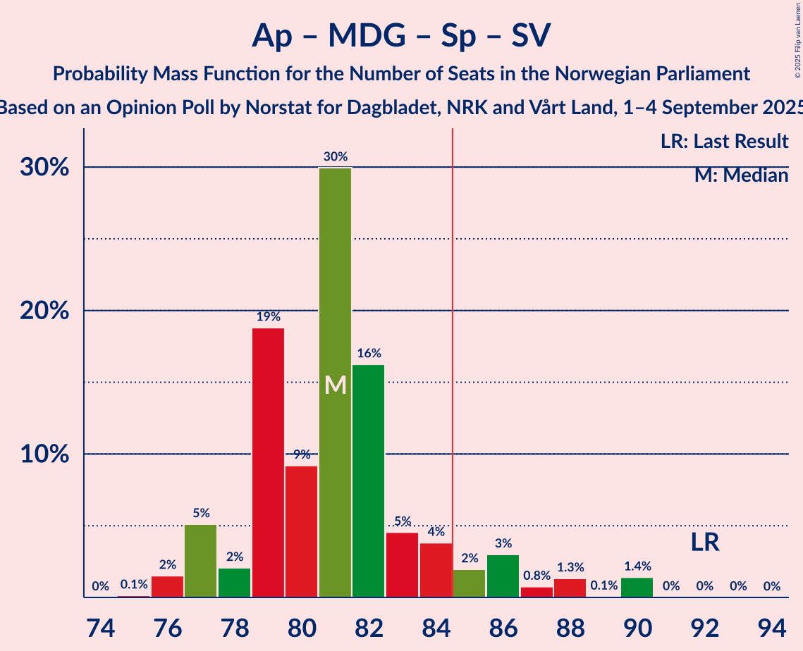
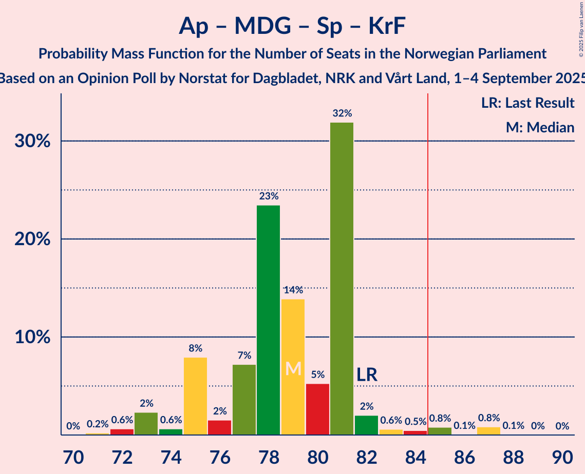
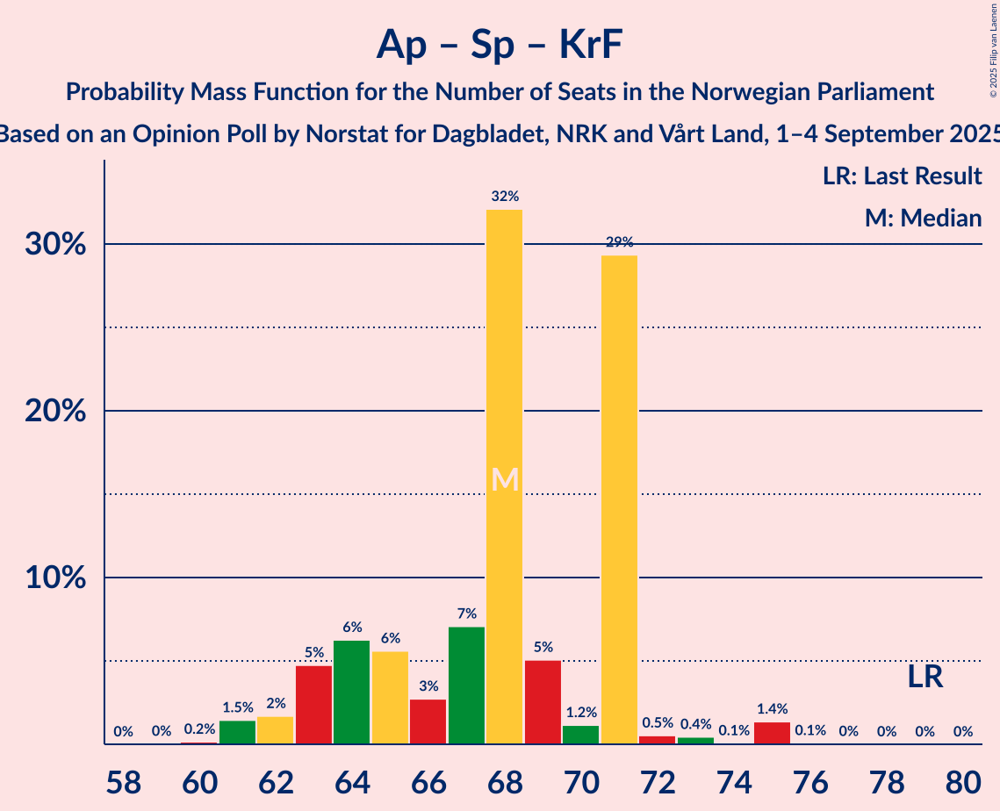
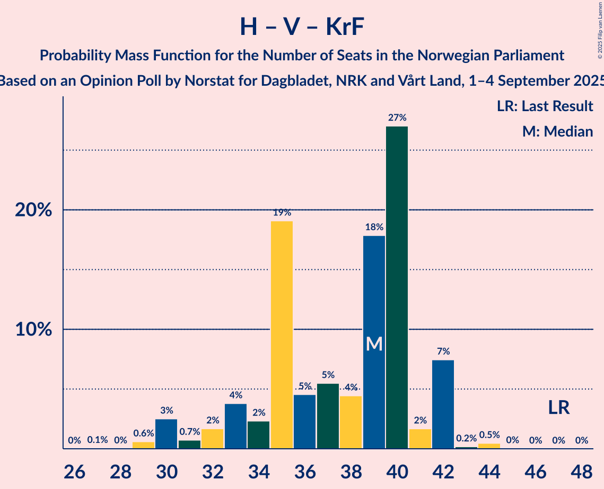

# Opinion Poll by Norstat for Dagbladet, NRK and Vårt Land, 1–4 September 2025

<a href="#voting-intentions">Voting Intentions</a> | <a href="#seats">Seats</a> | <a href="#coalitions">Coalitions</a> | <a href="#technical-information">Technical Information</a>

## Voting Intentions

### Confidence Intervals

| Party | Last Result | Poll Result | 80% Confidence Interval | 90% Confidence Interval | 95% Confidence Interval | 99% Confidence Interval |
|:-----:|:-----------:|:-----------:|:-----------------------:|:-----------------------:|:-----------------------:|:-----------------------:|
| Arbeiderpartiet | 26.2% | 26.4% | 25.2–27.7% |24.8–28.1% |24.5–28.4% |23.9–29.0% |
| Fremskrittspartiet | 11.6% | 20.4% | 19.3–21.6% |19.0–21.9% |18.7–22.2% |18.2–22.8% |
| Høyre | 20.4% | 14.3% | 13.3–15.3% |13.1–15.7% |12.8–15.9% |12.4–16.4% |
| Miljøpartiet De Grønne | 3.9% | 7.2% | 6.5–8.0% |6.3–8.2% |6.1–8.4% |5.8–8.8% |
| Rødt | 4.7% | 6.9% | 6.2–7.7% |6.0–7.9% |5.9–8.1% |5.5–8.5% |
| Senterpartiet | 13.5% | 6.2% | 5.5–7.0% |5.4–7.2% |5.2–7.3% |4.9–7.7% |
| Sosialistisk Venstreparti | 7.6% | 6.0% | 5.4–6.7% |5.2–7.0% |5.0–7.1% |4.8–7.5% |
| Venstre | 4.6% | 4.3% | 3.8–4.9% |3.6–5.1% |3.5–5.3% |3.2–5.6% |
| Kristelig Folkeparti | 3.8% | 4.2% | 3.7–4.8% |3.5–5.0% |3.4–5.2% |3.2–5.5% |
| Norgesdemokratene | 1.1% | 1.2% | 0.9–1.6% |0.9–1.7% |0.8–1.8% |0.7–2.0% |
| Pensjonistpartiet | 0.6% | 0.9% | 0.7–1.2% |0.6–1.3% |0.6–1.4% |0.5–1.6% |
| Industri- og Næringspartiet | 0.3% | 0.7% | 0.5–1.0% |0.5–1.1% |0.4–1.2% |0.3–1.3% |
| Konservativt | 0.4% | 0.4% | 0.3–0.7% |0.2–0.7% |0.2–0.8% |0.2–0.9% |

*Note:* The poll result column reflects the actual value used in the calculations. Published results may vary slightly, and in addition be rounded to fewer digits.

## Seats

### Confidence Intervals

| Party | Last Result | Median | 80% Confidence Interval | 90% Confidence Interval | 95% Confidence Interval | 99% Confidence Interval |
|:-----:|:-----------:|:------:|:-----------------------:|:-----------------------:|:-----------------------:|:-----------------------:|
| <a href="#arbeiderpartiet">Arbeiderpartiet</a> | 48 | 50 | 48–51 |48–53 |47–54 |46–56 |
| <a href="#fremskrittspartiet">Fremskrittspartiet</a> | 21 | 39 | 37–42 |37–42 |36–43 |35–43 |
| <a href="#høyre">Høyre</a> | 36 | 24 | 22–27 |21–28 |20–28 |20–29 |
| <a href="#miljøpartiet-de-grønne">Miljøpartiet De Grønne</a> | 3 | 10 | 10–12 |10–13 |10–14 |9–15 |
| <a href="#rødt">Rødt</a> | 8 | 11 | 10–12 |10–13 |9–13 |8–14 |
| <a href="#senterpartiet">Senterpartiet</a> | 28 | 12 | 9–13 |8–13 |8–13 |8–14 |
| <a href="#sosialistisk-venstreparti">Sosialistisk Venstreparti</a> | 13 | 9 | 8–10 |8–11 |8–12 |8–13 |
| <a href="#venstre">Venstre</a> | 8 | 7 | 3–7 |3–7 |3–8 |2–9 |
| <a href="#kristelig-folkeparti">Kristelig Folkeparti</a> | 3 | 8 | 3–9 |3–9 |2–9 |2–9 |
| <a href="#norgesdemokratene">Norgesdemokratene</a> | 0 | 0 | 0 |0 |0 |0 |
| <a href="#pensjonistpartiet">Pensjonistpartiet</a> | 0 | 0 | 0 |0 |0 |0 |
| <a href="#industri--og-næringspartiet">Industri- og Næringspartiet</a> | 0 | 0 | 0 |0 |0 |0 |
| <a href="#konservativt">Konservativt</a> | 0 | 0 | 0 |0 |0 |0 |

### Arbeiderpartiet

*For a full overview of the results for this party, see the [Arbeiderpartiet](party-arbeiderpartiet.html) page.*

| Number of Seats | Probability | Accumulated | Special Marks |
|:---------------:|:-----------:|:-----------:|:-------------:|
| 46 | 2% | 100% |  |
| 47 | 0.7% | 98% |  |
| 48 | 23% | 97% | Last Result |
| 49 | 23% | 74% |  |
| 50 | 30% | 51% | Median |
| 51 | 13% | 22% |  |
| 52 | 3% | 9% |  |
| 53 | 2% | 5% |  |
| 54 | 2% | 3% |  |
| 55 | 0.4% | 1.0% |  |
| 56 | 0.2% | 0.6% |  |
| 57 | 0.2% | 0.4% |  |
| 58 | 0.1% | 0.2% |  |
| 59 | 0% | 0.1% |  |
| 60 | 0.1% | 0.1% |  |
| 61 | 0% | 0% |  |

### Fremskrittspartiet

*For a full overview of the results for this party, see the [Fremskrittspartiet](party-fremskrittspartiet.html) page.*

| Number of Seats | Probability | Accumulated | Special Marks |
|:---------------:|:-----------:|:-----------:|:-------------:|
| 21 | 0% | 100% | Last Result |
| 22 | 0% | 100% |  |
| 23 | 0% | 100% |  |
| 24 | 0% | 100% |  |
| 25 | 0% | 100% |  |
| 26 | 0% | 100% |  |
| 27 | 0% | 100% |  |
| 28 | 0% | 100% |  |
| 29 | 0% | 100% |  |
| 30 | 0% | 100% |  |
| 31 | 0% | 100% |  |
| 32 | 0% | 100% |  |
| 33 | 0% | 100% |  |
| 34 | 0.2% | 100% |  |
| 35 | 2% | 99.8% |  |
| 36 | 3% | 98% |  |
| 37 | 28% | 95% |  |
| 38 | 8% | 67% |  |
| 39 | 24% | 59% | Median |
| 40 | 7% | 35% |  |
| 41 | 7% | 28% |  |
| 42 | 18% | 21% |  |
| 43 | 2% | 3% |  |
| 44 | 0.5% | 0.5% |  |
| 45 | 0% | 0% |  |

### Høyre

*For a full overview of the results for this party, see the [Høyre](party-høyre.html) page.*

| Number of Seats | Probability | Accumulated | Special Marks |
|:---------------:|:-----------:|:-----------:|:-------------:|
| 19 | 0.4% | 100% |  |
| 20 | 4% | 99.6% |  |
| 21 | 1.5% | 95% |  |
| 22 | 17% | 94% |  |
| 23 | 3% | 77% |  |
| 24 | 27% | 74% | Median |
| 25 | 25% | 46% |  |
| 26 | 5% | 21% |  |
| 27 | 7% | 16% |  |
| 28 | 6% | 8% |  |
| 29 | 2% | 2% |  |
| 30 | 0.2% | 0.3% |  |
| 31 | 0% | 0% |  |
| 32 | 0% | 0% |  |
| 33 | 0% | 0% |  |
| 34 | 0% | 0% |  |
| 35 | 0% | 0% |  |
| 36 | 0% | 0% | Last Result |

### Miljøpartiet De Grønne

*For a full overview of the results for this party, see the [Miljøpartiet De Grønne](party-miljøpartietdegrønne.html) page.*

| Number of Seats | Probability | Accumulated | Special Marks |
|:---------------:|:-----------:|:-----------:|:-------------:|
| 3 | 0% | 100% | Last Result |
| 4 | 0% | 100% |  |
| 5 | 0% | 100% |  |
| 6 | 0% | 100% |  |
| 7 | 0% | 100% |  |
| 8 | 0.3% | 100% |  |
| 9 | 0.4% | 99.7% |  |
| 10 | 51% | 99.3% | Median |
| 11 | 26% | 48% |  |
| 12 | 13% | 22% |  |
| 13 | 5% | 10% |  |
| 14 | 4% | 5% |  |
| 15 | 0.5% | 0.6% |  |
| 16 | 0% | 0% |  |

### Rødt

*For a full overview of the results for this party, see the [Rødt](party-rødt.html) page.*

| Number of Seats | Probability | Accumulated | Special Marks |
|:---------------:|:-----------:|:-----------:|:-------------:|
| 8 | 0.7% | 100% | Last Result |
| 9 | 2% | 99.3% |  |
| 10 | 20% | 97% |  |
| 11 | 41% | 77% | Median |
| 12 | 28% | 36% |  |
| 13 | 6% | 8% |  |
| 14 | 1.4% | 1.5% |  |
| 15 | 0.1% | 0.1% |  |
| 16 | 0% | 0% |  |

### Senterpartiet

*For a full overview of the results for this party, see the [Senterpartiet](party-senterpartiet.html) page.*

| Number of Seats | Probability | Accumulated | Special Marks |
|:---------------:|:-----------:|:-----------:|:-------------:|
| 7 | 0.2% | 100% |  |
| 8 | 8% | 99.8% |  |
| 9 | 11% | 92% |  |
| 10 | 4% | 80% |  |
| 11 | 6% | 77% |  |
| 12 | 50% | 71% | Median |
| 13 | 19% | 21% |  |
| 14 | 1.3% | 2% |  |
| 15 | 0.3% | 0.3% |  |
| 16 | 0% | 0% |  |
| 17 | 0% | 0% |  |
| 18 | 0% | 0% |  |
| 19 | 0% | 0% |  |
| 20 | 0% | 0% |  |
| 21 | 0% | 0% |  |
| 22 | 0% | 0% |  |
| 23 | 0% | 0% |  |
| 24 | 0% | 0% |  |
| 25 | 0% | 0% |  |
| 26 | 0% | 0% |  |
| 27 | 0% | 0% |  |
| 28 | 0% | 0% | Last Result |

### Sosialistisk Venstreparti

*For a full overview of the results for this party, see the [Sosialistisk Venstreparti](party-sosialistiskvenstreparti.html) page.*

| Number of Seats | Probability | Accumulated | Special Marks |
|:---------------:|:-----------:|:-----------:|:-------------:|
| 7 | 0.1% | 100% |  |
| 8 | 11% | 99.9% |  |
| 9 | 71% | 88% | Median |
| 10 | 9% | 17% |  |
| 11 | 5% | 8% |  |
| 12 | 1.2% | 3% |  |
| 13 | 1.2% | 1.5% | Last Result |
| 14 | 0.3% | 0.3% |  |
| 15 | 0% | 0% |  |

### Venstre

*For a full overview of the results for this party, see the [Venstre](party-venstre.html) page.*

| Number of Seats | Probability | Accumulated | Special Marks |
|:---------------:|:-----------:|:-----------:|:-------------:|
| 2 | 2% | 100% |  |
| 3 | 13% | 98% |  |
| 4 | 0% | 86% |  |
| 5 | 0% | 86% |  |
| 6 | 18% | 86% |  |
| 7 | 63% | 68% | Median |
| 8 | 4% | 5% | Last Result |
| 9 | 1.0% | 1.0% |  |
| 10 | 0.1% | 0.1% |  |
| 11 | 0% | 0% |  |

### Kristelig Folkeparti

*For a full overview of the results for this party, see the [Kristelig Folkeparti](party-kristeligfolkeparti.html) page.*

| Number of Seats | Probability | Accumulated | Special Marks |
|:---------------:|:-----------:|:-----------:|:-------------:|
| 2 | 3% | 100% |  |
| 3 | 12% | 97% | Last Result |
| 4 | 0% | 86% |  |
| 5 | 0% | 86% |  |
| 6 | 14% | 86% |  |
| 7 | 19% | 72% |  |
| 8 | 25% | 53% | Median |
| 9 | 28% | 28% |  |
| 10 | 0% | 0% |  |

### Norgesdemokratene

*For a full overview of the results for this party, see the [Norgesdemokratene](party-norgesdemokratene.html) page.*

| Number of Seats | Probability | Accumulated | Special Marks |
|:---------------:|:-----------:|:-----------:|:-------------:|
| 0 | 100% | 100% | Last Result, Median |

### Pensjonistpartiet

*For a full overview of the results for this party, see the [Pensjonistpartiet](party-pensjonistpartiet.html) page.*

| Number of Seats | Probability | Accumulated | Special Marks |
|:---------------:|:-----------:|:-----------:|:-------------:|
| 0 | 100% | 100% | Last Result, Median |

### Industri- og Næringspartiet

*For a full overview of the results for this party, see the [Industri- og Næringspartiet](party-industri-ognæringspartiet.html) page.*

| Number of Seats | Probability | Accumulated | Special Marks |
|:---------------:|:-----------:|:-----------:|:-------------:|
| 0 | 100% | 100% | Last Result, Median |

### Konservativt

*For a full overview of the results for this party, see the [Konservativt](party-konservativt.html) page.*

| Number of Seats | Probability | Accumulated | Special Marks |
|:---------------:|:-----------:|:-----------:|:-------------:|
| 0 | 100% | 100% | Last Result, Median |

## Coalitions

### Confidence Intervals

| Coalition | Last Result | Median | Majority? | 80% Confidence Interval | 90% Confidence Interval | 95% Confidence Interval | 99% Confidence Interval |
|:---------:|:-----------:|:------:|:---------:|:-----------------------:|:-----------------------:|:-----------------------:|:-----------------------:|
| Arbeiderpartiet – Miljøpartiet De Grønne – Rødt – Senterpartiet – Sosialistisk Venstreparti | 100 | 92 | 100% | 90–96 | 88–98 | 88–100 | 87–103 |
| Arbeiderpartiet – Miljøpartiet De Grønne – Senterpartiet – Sosialistisk Venstreparti – Kristelig Folkeparti | 95 | 88 | 89% | 84–90 | 84–91 | 83–93 | 81–96 |
| Fremskrittspartiet – Høyre – Miljøpartiet De Grønne – Venstre – Kristelig Folkeparti | 71 | 88 | 93% | 86–91 | 83–92 | 80–92 | 80–94 |
| Fremskrittspartiet – Høyre – Senterpartiet – Venstre – Kristelig Folkeparti | 96 | 89 | 89% | 84–90 | 82–90 | 81–90 | 78–94 |
| Arbeiderpartiet – Rødt – Senterpartiet – Sosialistisk Venstreparti | 97 | 81 | 7% | 78–83 | 77–86 | 77–89 | 75–89 |
| Arbeiderpartiet – Miljøpartiet De Grønne – Rødt – Sosialistisk Venstreparti | 72 | 80 | 11% | 79–85 | 79–87 | 79–88 | 75–91 |
| Arbeiderpartiet – Miljøpartiet De Grønne – Senterpartiet – Sosialistisk Venstreparti | 92 | 81 | 9% | 79–84 | 77–86 | 77–88 | 76–90 |
| Arbeiderpartiet – Miljøpartiet De Grønne – Senterpartiet – Kristelig Folkeparti | 82 | 79 | 2% | 75–81 | 75–81 | 73–83 | 72–87 |
| Fremskrittspartiet – Høyre – Venstre – Kristelig Folkeparti | 68 | 77 | 0% | 73–79 | 71–81 | 69–81 | 66–82 |
| Arbeiderpartiet – Senterpartiet – Sosialistisk Venstreparti | 89 | 71 | 0% | 68–72 | 66–74 | 66–76 | 66–77 |
| Fremskrittspartiet – Høyre – Venstre | 65 | 70 | 0% | 68–73 | 66–74 | 64–75 | 60–77 |
| Arbeiderpartiet – Senterpartiet – Kristelig Folkeparti | 79 | 68 | 0% | 64–71 | 63–71 | 62–72 | 61–75 |
| Fremskrittspartiet – Høyre | 57 | 64 | 0% | 61–67 | 61–68 | 59–69 | 57–70 |
| Arbeiderpartiet – Senterpartiet | 76 | 62 | 0% | 58–63 | 57–64 | 57–65 | 57–67 |
| Arbeiderpartiet – Sosialistisk Venstreparti | 61 | 59 | 0% | 57–61 | 57–63 | 56–64 | 55–66 |
| Høyre – Venstre – Kristelig Folkeparti | 47 | 39 | 0% | 34–40 | 32–42 | 30–42 | 29–44 |
| Senterpartiet – Venstre – Kristelig Folkeparti | 39 | 26 | 0% | 19–28 | 18–28 | 17–28 | 16–30 |

### Arbeiderpartiet – Miljøpartiet De Grønne – Rødt – Senterpartiet – Sosialistisk Venstreparti

| Number of Seats | Probability | Accumulated | Special Marks |
|:---------------:|:-----------:|:-----------:|:-------------:|
| 85 | 0.1% | 100% | Majority |
| 86 | 0.2% | 99.9% |  |
| 87 | 2% | 99.7% |  |
| 88 | 6% | 98% |  |
| 89 | 0.5% | 92% |  |
| 90 | 6% | 91% |  |
| 91 | 21% | 85% |  |
| 92 | 37% | 64% | Median |
| 93 | 8% | 27% |  |
| 94 | 6% | 19% |  |
| 95 | 2% | 13% |  |
| 96 | 3% | 11% |  |
| 97 | 2% | 8% |  |
| 98 | 2% | 6% |  |
| 99 | 1.3% | 4% |  |
| 100 | 0.4% | 3% | Last Result |
| 101 | 1.0% | 2% |  |
| 102 | 0.1% | 1.3% |  |
| 103 | 1.2% | 1.2% |  |
| 104 | 0% | 0% |  |

### Arbeiderpartiet – Miljøpartiet De Grønne – Senterpartiet – Sosialistisk Venstreparti – Kristelig Folkeparti

| Number of Seats | Probability | Accumulated | Special Marks |
|:---------------:|:-----------:|:-----------:|:-------------:|
| 81 | 0.8% | 100% |  |
| 82 | 0.7% | 99.2% |  |
| 83 | 2% | 98.6% |  |
| 84 | 7% | 96% |  |
| 85 | 1.5% | 89% | Majority |
| 86 | 4% | 88% |  |
| 87 | 24% | 84% |  |
| 88 | 13% | 60% |  |
| 89 | 14% | 47% | Median |
| 90 | 27% | 33% |  |
| 91 | 2% | 6% |  |
| 92 | 2% | 4% |  |
| 93 | 1.1% | 3% |  |
| 94 | 0.5% | 2% |  |
| 95 | 0.1% | 1.1% | Last Result |
| 96 | 0.9% | 1.0% |  |
| 97 | 0% | 0.1% |  |
| 98 | 0% | 0.1% |  |
| 99 | 0% | 0% |  |

### Fremskrittspartiet – Høyre – Miljøpartiet De Grønne – Venstre – Kristelig Folkeparti

| Number of Seats | Probability | Accumulated | Special Marks |
|:---------------:|:-----------:|:-----------:|:-------------:|
| 71 | 0% | 100% | Last Result |
| 72 | 0% | 100% |  |
| 73 | 0% | 100% |  |
| 74 | 0% | 100% |  |
| 75 | 0% | 100% |  |
| 76 | 0% | 100% |  |
| 77 | 0% | 100% |  |
| 78 | 0% | 100% |  |
| 79 | 0.2% | 99.9% |  |
| 80 | 2% | 99.8% |  |
| 81 | 0.5% | 97% |  |
| 82 | 0.4% | 97% |  |
| 83 | 2% | 96% |  |
| 84 | 2% | 94% |  |
| 85 | 2% | 93% | Majority |
| 86 | 7% | 91% |  |
| 87 | 30% | 84% |  |
| 88 | 35% | 54% | Median |
| 89 | 5% | 19% |  |
| 90 | 3% | 14% |  |
| 91 | 4% | 11% |  |
| 92 | 6% | 8% |  |
| 93 | 1.0% | 2% |  |
| 94 | 0.4% | 0.5% |  |
| 95 | 0.1% | 0.1% |  |
| 96 | 0% | 0% |  |

### Fremskrittspartiet – Høyre – Senterpartiet – Venstre – Kristelig Folkeparti

| Number of Seats | Probability | Accumulated | Special Marks |
|:---------------:|:-----------:|:-----------:|:-------------:|
| 76 | 0.1% | 100% |  |
| 77 | 0% | 99.9% |  |
| 78 | 1.2% | 99.9% |  |
| 79 | 0.1% | 98.7% |  |
| 80 | 0.5% | 98.6% |  |
| 81 | 3% | 98% |  |
| 82 | 2% | 95% |  |
| 83 | 2% | 93% |  |
| 84 | 2% | 91% |  |
| 85 | 3% | 89% | Majority |
| 86 | 2% | 86% |  |
| 87 | 5% | 84% |  |
| 88 | 12% | 79% |  |
| 89 | 35% | 68% |  |
| 90 | 31% | 33% | Median |
| 91 | 0.4% | 2% |  |
| 92 | 1.1% | 2% |  |
| 93 | 0.1% | 0.8% |  |
| 94 | 0.6% | 0.6% |  |
| 95 | 0% | 0% |  |
| 96 | 0% | 0% | Last Result |

### Arbeiderpartiet – Rødt – Senterpartiet – Sosialistisk Venstreparti

| Number of Seats | Probability | Accumulated | Special Marks |
|:---------------:|:-----------:|:-----------:|:-------------:|
| 74 | 0.1% | 100% |  |
| 75 | 0.4% | 99.9% |  |
| 76 | 1.0% | 99.5% |  |
| 77 | 6% | 98% |  |
| 78 | 4% | 92% |  |
| 79 | 3% | 89% |  |
| 80 | 5% | 86% |  |
| 81 | 34% | 81% |  |
| 82 | 30% | 46% | Median |
| 83 | 7% | 16% |  |
| 84 | 2% | 9% |  |
| 85 | 2% | 7% | Majority |
| 86 | 2% | 6% |  |
| 87 | 0.4% | 4% |  |
| 88 | 0.5% | 3% |  |
| 89 | 2% | 3% |  |
| 90 | 0.2% | 0.2% |  |
| 91 | 0% | 0.1% |  |
| 92 | 0% | 0% |  |
| 93 | 0% | 0% |  |
| 94 | 0% | 0% |  |
| 95 | 0% | 0% |  |
| 96 | 0% | 0% |  |
| 97 | 0% | 0% | Last Result |

### Arbeiderpartiet – Miljøpartiet De Grønne – Rødt – Sosialistisk Venstreparti

| Number of Seats | Probability | Accumulated | Special Marks |
|:---------------:|:-----------:|:-----------:|:-------------:|
| 72 | 0% | 100% | Last Result |
| 73 | 0% | 100% |  |
| 74 | 0% | 100% |  |
| 75 | 0.6% | 100% |  |
| 76 | 0.1% | 99.4% |  |
| 77 | 1.1% | 99.2% |  |
| 78 | 0.4% | 98% |  |
| 79 | 31% | 98% |  |
| 80 | 35% | 67% | Median |
| 81 | 12% | 32% |  |
| 82 | 5% | 21% |  |
| 83 | 2% | 16% |  |
| 84 | 3% | 14% |  |
| 85 | 2% | 11% | Majority |
| 86 | 2% | 9% |  |
| 87 | 2% | 7% |  |
| 88 | 3% | 5% |  |
| 89 | 0.5% | 2% |  |
| 90 | 0.1% | 1.4% |  |
| 91 | 1.2% | 1.3% |  |
| 92 | 0% | 0.1% |  |
| 93 | 0.1% | 0.1% |  |
| 94 | 0% | 0% |  |

### Arbeiderpartiet – Miljøpartiet De Grønne – Senterpartiet – Sosialistisk Venstreparti

| Number of Seats | Probability | Accumulated | Special Marks |
|:---------------:|:-----------:|:-----------:|:-------------:|
| 75 | 0.1% | 100% |  |
| 76 | 2% | 99.8% |  |
| 77 | 5% | 98% |  |
| 78 | 2% | 93% |  |
| 79 | 19% | 91% |  |
| 80 | 9% | 72% |  |
| 81 | 30% | 63% | Median |
| 82 | 16% | 33% |  |
| 83 | 5% | 17% |  |
| 84 | 4% | 12% |  |
| 85 | 2% | 9% | Majority |
| 86 | 3% | 7% |  |
| 87 | 0.8% | 4% |  |
| 88 | 1.3% | 3% |  |
| 89 | 0.1% | 2% |  |
| 90 | 1.4% | 1.5% |  |
| 91 | 0% | 0.1% |  |
| 92 | 0% | 0.1% | Last Result |
| 93 | 0% | 0% |  |

### Arbeiderpartiet – Miljøpartiet De Grønne – Senterpartiet – Kristelig Folkeparti

| Number of Seats | Probability | Accumulated | Special Marks |
|:---------------:|:-----------:|:-----------:|:-------------:|
| 71 | 0.2% | 100% |  |
| 72 | 0.6% | 99.8% |  |
| 73 | 2% | 99.1% |  |
| 74 | 0.6% | 97% |  |
| 75 | 8% | 96% |  |
| 76 | 2% | 88% |  |
| 77 | 7% | 87% |  |
| 78 | 23% | 79% |  |
| 79 | 14% | 56% |  |
| 80 | 5% | 42% | Median |
| 81 | 32% | 37% |  |
| 82 | 2% | 5% | Last Result |
| 83 | 0.6% | 3% |  |
| 84 | 0.5% | 2% |  |
| 85 | 0.8% | 2% | Majority |
| 86 | 0.1% | 1.0% |  |
| 87 | 0.8% | 0.9% |  |
| 88 | 0.1% | 0.1% |  |
| 89 | 0% | 0% |  |

### Fremskrittspartiet – Høyre – Venstre – Kristelig Folkeparti

| Number of Seats | Probability | Accumulated | Special Marks |
|:---------------:|:-----------:|:-----------:|:-------------:|
| 66 | 1.2% | 100% |  |
| 67 | 0.1% | 98.8% |  |
| 68 | 1.0% | 98.7% | Last Result |
| 69 | 0.4% | 98% |  |
| 70 | 1.3% | 97% |  |
| 71 | 2% | 96% |  |
| 72 | 2% | 94% |  |
| 73 | 3% | 92% |  |
| 74 | 2% | 89% |  |
| 75 | 6% | 87% |  |
| 76 | 8% | 81% |  |
| 77 | 37% | 73% |  |
| 78 | 21% | 36% | Median |
| 79 | 6% | 15% |  |
| 80 | 0.5% | 9% |  |
| 81 | 6% | 8% |  |
| 82 | 2% | 2% |  |
| 83 | 0.2% | 0.3% |  |
| 84 | 0.1% | 0.1% |  |
| 85 | 0% | 0% | Majority |

### Arbeiderpartiet – Senterpartiet – Sosialistisk Venstreparti

| Number of Seats | Probability | Accumulated | Special Marks |
|:---------------:|:-----------:|:-----------:|:-------------:|
| 65 | 0.4% | 100% |  |
| 66 | 7% | 99.6% |  |
| 67 | 1.2% | 93% |  |
| 68 | 6% | 92% |  |
| 69 | 23% | 86% |  |
| 70 | 9% | 63% |  |
| 71 | 42% | 54% | Median |
| 72 | 4% | 12% |  |
| 73 | 3% | 9% |  |
| 74 | 1.3% | 5% |  |
| 75 | 1.1% | 4% |  |
| 76 | 2% | 3% |  |
| 77 | 0.4% | 0.7% |  |
| 78 | 0.2% | 0.3% |  |
| 79 | 0.1% | 0.1% |  |
| 80 | 0% | 0% |  |
| 81 | 0% | 0% |  |
| 82 | 0% | 0% |  |
| 83 | 0% | 0% |  |
| 84 | 0% | 0% |  |
| 85 | 0% | 0% | Majority |
| 86 | 0% | 0% |  |
| 87 | 0% | 0% |  |
| 88 | 0% | 0% |  |
| 89 | 0% | 0% | Last Result |

### Fremskrittspartiet – Høyre – Venstre

| Number of Seats | Probability | Accumulated | Special Marks |
|:---------------:|:-----------:|:-----------:|:-------------:|
| 60 | 0.8% | 100% |  |
| 61 | 0% | 99.1% |  |
| 62 | 0.1% | 99.1% |  |
| 63 | 0.6% | 99.0% |  |
| 64 | 2% | 98% |  |
| 65 | 0.5% | 97% | Last Result |
| 66 | 1.3% | 96% |  |
| 67 | 3% | 95% |  |
| 68 | 30% | 92% |  |
| 69 | 8% | 62% |  |
| 70 | 22% | 54% | Median |
| 71 | 13% | 32% |  |
| 72 | 8% | 19% |  |
| 73 | 1.1% | 11% |  |
| 74 | 6% | 10% |  |
| 75 | 2% | 4% |  |
| 76 | 2% | 2% |  |
| 77 | 0.5% | 0.5% |  |
| 78 | 0% | 0% |  |

### Arbeiderpartiet – Senterpartiet – Kristelig Folkeparti

| Number of Seats | Probability | Accumulated | Special Marks |
|:---------------:|:-----------:|:-----------:|:-------------:|
| 60 | 0.2% | 100% |  |
| 61 | 1.5% | 99.8% |  |
| 62 | 2% | 98% |  |
| 63 | 5% | 97% |  |
| 64 | 6% | 92% |  |
| 65 | 6% | 86% |  |
| 66 | 3% | 80% |  |
| 67 | 7% | 77% |  |
| 68 | 32% | 70% |  |
| 69 | 5% | 38% |  |
| 70 | 1.2% | 33% | Median |
| 71 | 29% | 32% |  |
| 72 | 0.5% | 3% |  |
| 73 | 0.4% | 2% |  |
| 74 | 0.1% | 2% |  |
| 75 | 1.4% | 1.5% |  |
| 76 | 0.1% | 0.1% |  |
| 77 | 0% | 0% |  |
| 78 | 0% | 0% |  |
| 79 | 0% | 0% | Last Result |

### Fremskrittspartiet – Høyre

| Number of Seats | Probability | Accumulated | Special Marks |
|:---------------:|:-----------:|:-----------:|:-------------:|
| 56 | 0.2% | 100% |  |
| 57 | 0.9% | 99.8% | Last Result |
| 58 | 0.8% | 98.9% |  |
| 59 | 0.6% | 98% |  |
| 60 | 2% | 97% |  |
| 61 | 30% | 96% |  |
| 62 | 6% | 65% |  |
| 63 | 5% | 60% | Median |
| 64 | 30% | 55% |  |
| 65 | 7% | 25% |  |
| 66 | 3% | 18% |  |
| 67 | 8% | 15% |  |
| 68 | 2% | 7% |  |
| 69 | 4% | 4% |  |
| 70 | 0.5% | 0.6% |  |
| 71 | 0.1% | 0.1% |  |
| 72 | 0% | 0% |  |

### Arbeiderpartiet – Senterpartiet

| Number of Seats | Probability | Accumulated | Special Marks |
|:---------------:|:-----------:|:-----------:|:-------------:|
| 56 | 0.2% | 100% |  |
| 57 | 6% | 99.8% |  |
| 58 | 5% | 94% |  |
| 59 | 3% | 89% |  |
| 60 | 29% | 86% |  |
| 61 | 6% | 57% |  |
| 62 | 38% | 51% | Median |
| 63 | 6% | 13% |  |
| 64 | 2% | 6% |  |
| 65 | 2% | 4% |  |
| 66 | 0.7% | 2% |  |
| 67 | 1.4% | 2% |  |
| 68 | 0.1% | 0.3% |  |
| 69 | 0.1% | 0.2% |  |
| 70 | 0% | 0% |  |
| 71 | 0% | 0% |  |
| 72 | 0% | 0% |  |
| 73 | 0% | 0% |  |
| 74 | 0% | 0% |  |
| 75 | 0% | 0% |  |
| 76 | 0% | 0% | Last Result |

### Arbeiderpartiet – Sosialistisk Venstreparti

| Number of Seats | Probability | Accumulated | Special Marks |
|:---------------:|:-----------:|:-----------:|:-------------:|
| 55 | 0.8% | 100% |  |
| 56 | 3% | 99.2% |  |
| 57 | 20% | 96% |  |
| 58 | 21% | 76% |  |
| 59 | 35% | 55% | Median |
| 60 | 4% | 20% |  |
| 61 | 7% | 15% | Last Result |
| 62 | 3% | 8% |  |
| 63 | 2% | 5% |  |
| 64 | 2% | 3% |  |
| 65 | 0.6% | 1.4% |  |
| 66 | 0.5% | 0.8% |  |
| 67 | 0.1% | 0.2% |  |
| 68 | 0% | 0.1% |  |
| 69 | 0.1% | 0.1% |  |
| 70 | 0% | 0% |  |

### Høyre – Venstre – Kristelig Folkeparti

| Number of Seats | Probability | Accumulated | Special Marks |
|:---------------:|:-----------:|:-----------:|:-------------:|
| 27 | 0.1% | 100% |  |
| 28 | 0% | 99.9% |  |
| 29 | 0.6% | 99.9% |  |
| 30 | 3% | 99.3% |  |
| 31 | 0.7% | 97% |  |
| 32 | 2% | 96% |  |
| 33 | 4% | 94% |  |
| 34 | 2% | 91% |  |
| 35 | 19% | 88% |  |
| 36 | 5% | 69% |  |
| 37 | 5% | 65% |  |
| 38 | 4% | 59% |  |
| 39 | 18% | 55% | Median |
| 40 | 27% | 37% |  |
| 41 | 2% | 10% |  |
| 42 | 7% | 8% |  |
| 43 | 0.2% | 0.7% |  |
| 44 | 0.5% | 0.5% |  |
| 45 | 0% | 0% |  |
| 46 | 0% | 0% |  |
| 47 | 0% | 0% | Last Result |

### Senterpartiet – Venstre – Kristelig Folkeparti

| Number of Seats | Probability | Accumulated | Special Marks |
|:---------------:|:-----------:|:-----------:|:-------------:|
| 14 | 0.2% | 100% |  |
| 15 | 0.2% | 99.8% |  |
| 16 | 0.1% | 99.6% |  |
| 17 | 3% | 99.4% |  |
| 18 | 2% | 97% |  |
| 19 | 7% | 95% |  |
| 20 | 2% | 88% |  |
| 21 | 5% | 86% |  |
| 22 | 9% | 81% |  |
| 23 | 4% | 72% |  |
| 24 | 2% | 69% |  |
| 25 | 4% | 67% |  |
| 26 | 30% | 63% |  |
| 27 | 8% | 34% | Median |
| 28 | 24% | 25% |  |
| 29 | 0.2% | 1.0% |  |
| 30 | 0.8% | 0.8% |  |
| 31 | 0% | 0% |  |
| 32 | 0% | 0% |  |
| 33 | 0% | 0% |  |
| 34 | 0% | 0% |  |
| 35 | 0% | 0% |  |
| 36 | 0% | 0% |  |
| 37 | 0% | 0% |  |
| 38 | 0% | 0% |  |
| 39 | 0% | 0% | Last Result |

## Technical Information

### Opinion Poll

+ **Polling firm:** Norstat
+ **Commissioner(s):** Dagbladet, NRK and Vårt Land
+ **Fieldwork period:** 1–4 September 2025

### Calculations

+ **Sample size:** 2000
+ **Simulations done:** 2,097,152
+ **Error estimate:** 1.84%

