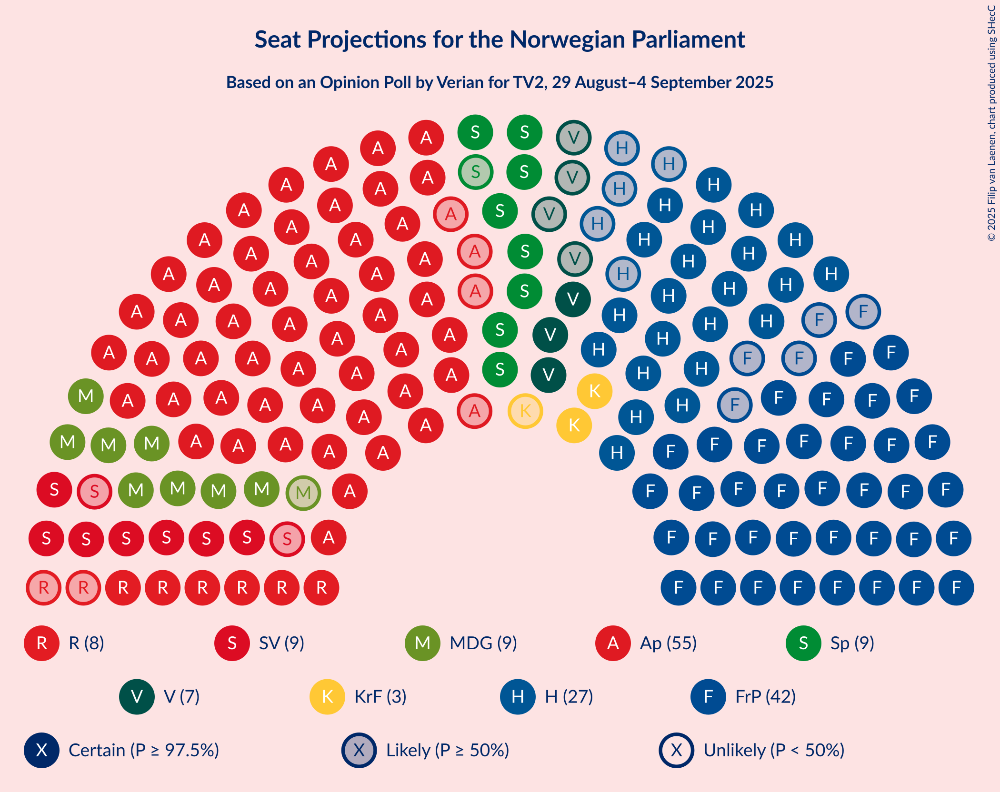
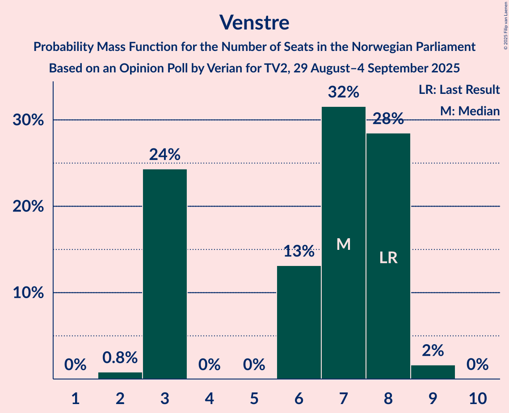
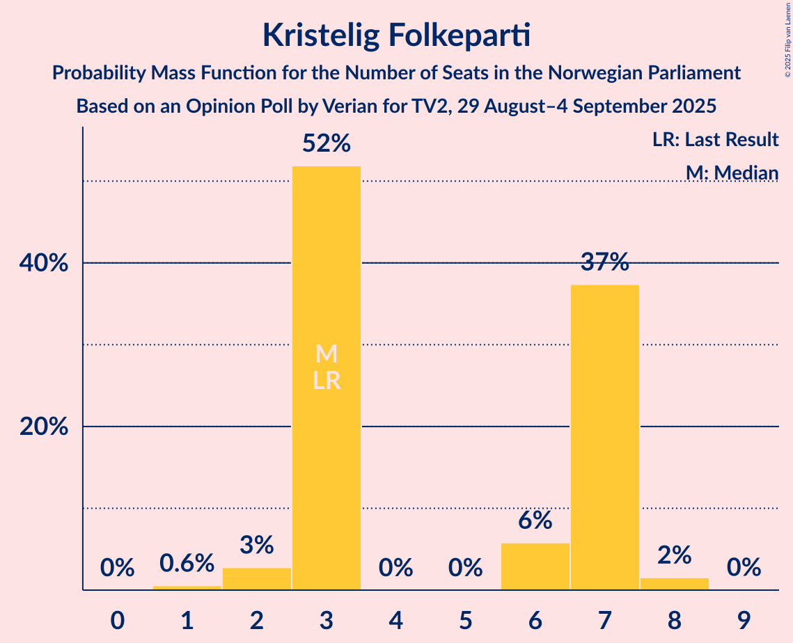
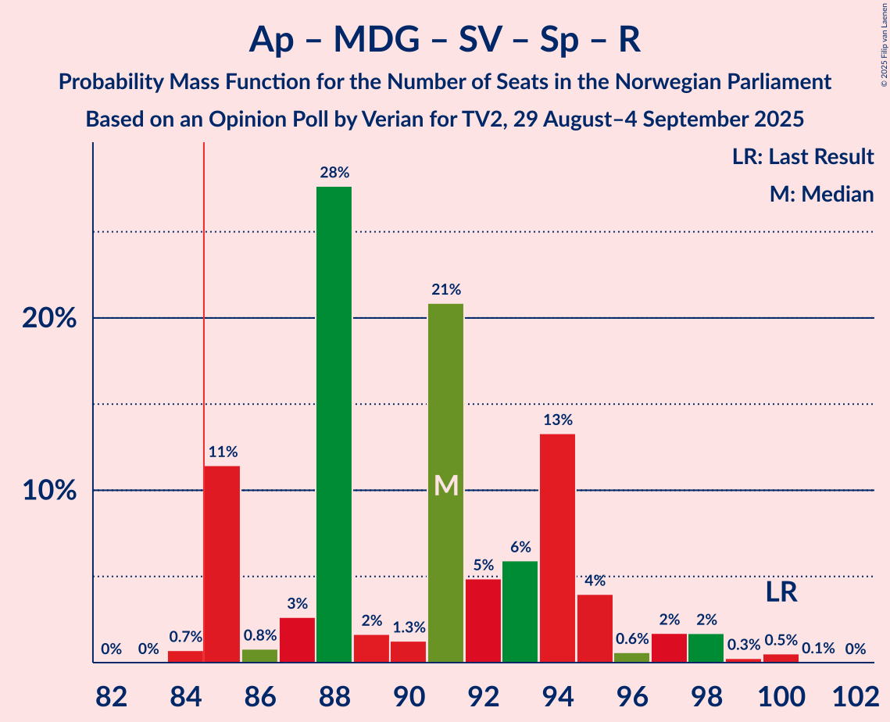
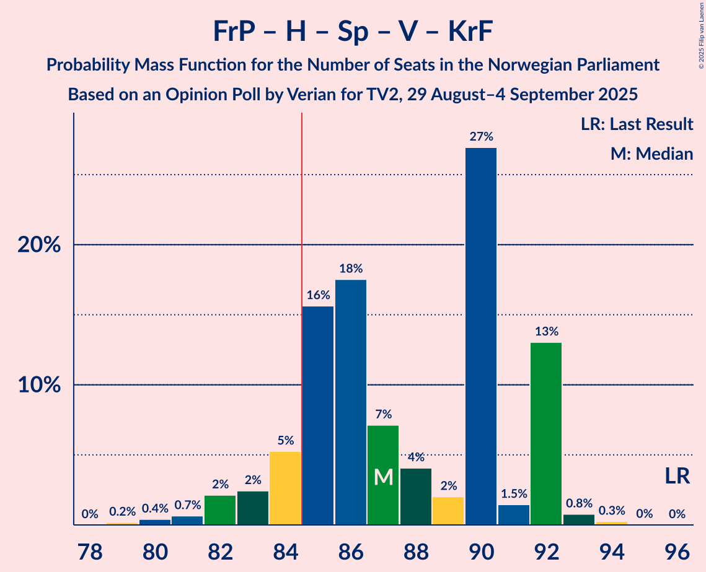
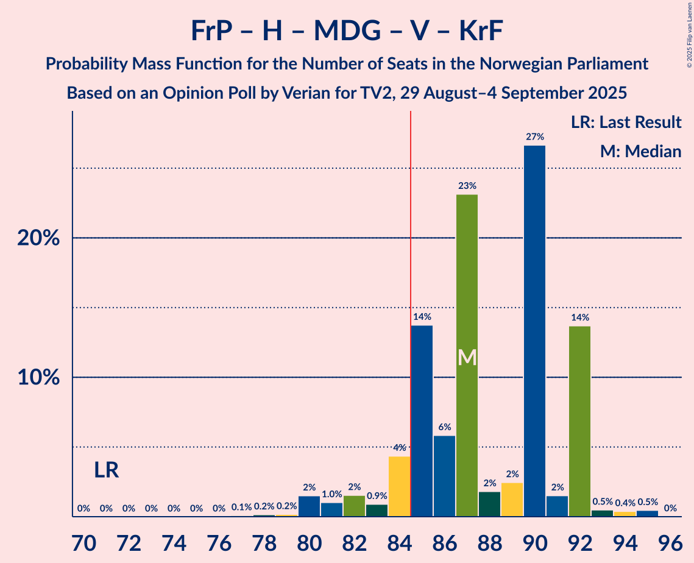
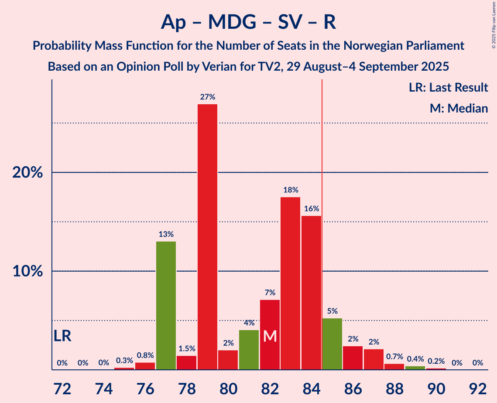
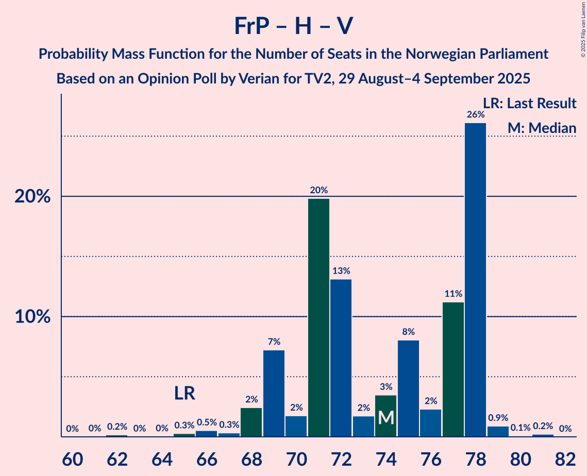

# Opinion Poll by Verian for TV2, 29 August–4 September 2025

<a href="#voting-intentions">Voting Intentions</a> | <a href="#seats">Seats</a> | <a href="#coalitions">Coalitions</a> | <a href="#technical-information">Technical Information</a>

## Voting Intentions

### Confidence Intervals

| Party | Last Result | Poll Result | 80% Confidence Interval | 90% Confidence Interval | 95% Confidence Interval | 99% Confidence Interval |
|:-----:|:-----------:|:-----------:|:-----------------------:|:-----------------------:|:-----------------------:|:-----------------------:|
| Arbeiderpartiet | 26.2% | 28.5% | 27.3–29.7% |27.0–30.1% |26.7–30.4% |26.2–31.0% |
| Fremskrittspartiet | 11.6% | 21.0% | 20.0–22.1% |19.7–22.5% |19.4–22.7% |18.9–23.3% |
| Høyre | 20.4% | 14.7% | 13.8–15.7% |13.5–15.9% |13.3–16.2% |12.9–16.7% |
| Miljøpartiet De Grønne | 3.9% | 5.9% | 5.3–6.6% |5.2–6.8% |5.0–7.0% |4.8–7.3% |
| Sosialistisk Venstreparti | 7.6% | 5.8% | 5.2–6.5% |5.0–6.6% |4.9–6.8% |4.6–7.1% |
| Senterpartiet | 13.5% | 5.7% | 5.1–6.4% |5.0–6.6% |4.8–6.7% |4.6–7.1% |
| Rødt | 4.7% | 5.1% | 4.6–5.7% |4.4–5.9% |4.3–6.1% |4.0–6.4% |
| Venstre | 4.6% | 4.2% | 3.7–4.8% |3.6–5.0% |3.5–5.1% |3.2–5.4% |
| Kristelig Folkeparti | 3.8% | 3.9% | 3.4–4.5% |3.3–4.6% |3.2–4.8% |3.0–5.1% |
| Konservativt | 0.4% | 1.1% | 0.9–1.4% |0.8–1.5% |0.7–1.6% |0.7–1.8% |
| Norgesdemokratene | 1.1% | 1.0% | 0.8–1.3% |0.7–1.4% |0.7–1.5% |0.6–1.7% |
| Pensjonistpartiet | 0.6% | 0.5% | 0.4–0.8% |0.3–0.8% |0.3–0.9% |0.2–1.0% |
| Industri- og Næringspartiet | 0.3% | 0.4% | 0.3–0.6% |0.2–0.7% |0.2–0.7% |0.2–0.9% |

*Note:* The poll result column reflects the actual value used in the calculations. Published results may vary slightly, and in addition be rounded to fewer digits.

## Seats

### Confidence Intervals

| Party | Last Result | Median | 80% Confidence Interval | 90% Confidence Interval | 95% Confidence Interval | 99% Confidence Interval |
|:-----:|:-----------:|:------:|:-----------------------:|:-----------------------:|:-----------------------:|:-----------------------:|
| <a href="#arbeiderpartiet">Arbeiderpartiet</a> | 48 | 55 | 52–58 |52–58 |51–59 |50–62 |
| <a href="#fremskrittspartiet">Fremskrittspartiet</a> | 21 | 42 | 38–43 |38–43 |37–44 |36–45 |
| <a href="#høyre">Høyre</a> | 36 | 27 | 24–28 |23–29 |22–29 |20–30 |
| <a href="#miljøpartiet-de-grønne">Miljøpartiet De Grønne</a> | 3 | 9 | 8–10 |8–10 |8–11 |8–12 |
| <a href="#sosialistisk-venstreparti">Sosialistisk Venstreparti</a> | 13 | 9 | 7–10 |7–10 |7–11 |7–12 |
| <a href="#senterpartiet">Senterpartiet</a> | 28 | 9 | 8–11 |8–12 |8–12 |7–13 |
| <a href="#rødt">Rødt</a> | 8 | 8 | 7–9 |7–9 |6–11 |1–11 |
| <a href="#venstre">Venstre</a> | 8 | 7 | 3–8 |3–8 |3–8 |2–9 |
| <a href="#kristelig-folkeparti">Kristelig Folkeparti</a> | 3 | 3 | 3–7 |3–7 |2–7 |1–8 |
| <a href="#konservativt">Konservativt</a> | 0 | 0 | 0 |0 |0 |0 |
| <a href="#norgesdemokratene">Norgesdemokratene</a> | 0 | 0 | 0 |0 |0 |0 |
| <a href="#pensjonistpartiet">Pensjonistpartiet</a> | 0 | 0 | 0 |0 |0 |0 |
| <a href="#industri--og-næringspartiet">Industri- og Næringspartiet</a> | 0 | 0 | 0 |0 |0 |0 |

### Arbeiderpartiet

*For a full overview of the results for this party, see the [Arbeiderpartiet](party-arbeiderpartiet.html) page.*

| Number of Seats | Probability | Accumulated | Special Marks |
|:---------------:|:-----------:|:-----------:|:-------------:|
| 48 | 0% | 100% | Last Result |
| 49 | 0.3% | 99.9% |  |
| 50 | 0.9% | 99.6% |  |
| 51 | 2% | 98.8% |  |
| 52 | 14% | 96% |  |
| 53 | 2% | 83% |  |
| 54 | 4% | 81% |  |
| 55 | 41% | 77% | Median |
| 56 | 4% | 36% |  |
| 57 | 9% | 32% |  |
| 58 | 19% | 23% |  |
| 59 | 0.9% | 3% |  |
| 60 | 2% | 2% |  |
| 61 | 0.1% | 0.9% |  |
| 62 | 0.7% | 0.8% |  |
| 63 | 0% | 0.1% |  |
| 64 | 0% | 0.1% |  |
| 65 | 0% | 0% |  |

### Fremskrittspartiet

*For a full overview of the results for this party, see the [Fremskrittspartiet](party-fremskrittspartiet.html) page.*

| Number of Seats | Probability | Accumulated | Special Marks |
|:---------------:|:-----------:|:-----------:|:-------------:|
| 21 | 0% | 100% | Last Result |
| 22 | 0% | 100% |  |
| 23 | 0% | 100% |  |
| 24 | 0% | 100% |  |
| 25 | 0% | 100% |  |
| 26 | 0% | 100% |  |
| 27 | 0% | 100% |  |
| 28 | 0% | 100% |  |
| 29 | 0% | 100% |  |
| 30 | 0% | 100% |  |
| 31 | 0% | 100% |  |
| 32 | 0% | 100% |  |
| 33 | 0% | 100% |  |
| 34 | 0% | 100% |  |
| 35 | 0.3% | 100% |  |
| 36 | 0.7% | 99.6% |  |
| 37 | 3% | 99.0% |  |
| 38 | 17% | 96% |  |
| 39 | 5% | 79% |  |
| 40 | 7% | 74% |  |
| 41 | 4% | 67% |  |
| 42 | 18% | 63% | Median |
| 43 | 42% | 45% |  |
| 44 | 2% | 3% |  |
| 45 | 0.6% | 0.6% |  |
| 46 | 0% | 0.1% |  |
| 47 | 0% | 0.1% |  |
| 48 | 0% | 0% |  |

### Høyre

*For a full overview of the results for this party, see the [Høyre](party-høyre.html) page.*

| Number of Seats | Probability | Accumulated | Special Marks |
|:---------------:|:-----------:|:-----------:|:-------------:|
| 19 | 0.1% | 100% |  |
| 20 | 0.5% | 99.9% |  |
| 21 | 0.9% | 99.4% |  |
| 22 | 1.4% | 98% |  |
| 23 | 2% | 97% |  |
| 24 | 8% | 95% |  |
| 25 | 5% | 87% |  |
| 26 | 18% | 82% |  |
| 27 | 39% | 64% | Median |
| 28 | 19% | 25% |  |
| 29 | 3% | 6% |  |
| 30 | 2% | 2% |  |
| 31 | 0.3% | 0.4% |  |
| 32 | 0% | 0% |  |
| 33 | 0% | 0% |  |
| 34 | 0% | 0% |  |
| 35 | 0% | 0% |  |
| 36 | 0% | 0% | Last Result |

### Miljøpartiet De Grønne

*For a full overview of the results for this party, see the [Miljøpartiet De Grønne](party-miljøpartietdegrønne.html) page.*

| Number of Seats | Probability | Accumulated | Special Marks |
|:---------------:|:-----------:|:-----------:|:-------------:|
| 3 | 0% | 100% | Last Result |
| 4 | 0% | 100% |  |
| 5 | 0% | 100% |  |
| 6 | 0% | 100% |  |
| 7 | 0.1% | 100% |  |
| 8 | 15% | 99.9% |  |
| 9 | 53% | 85% | Median |
| 10 | 28% | 32% |  |
| 11 | 4% | 4% |  |
| 12 | 0.4% | 0.5% |  |
| 13 | 0.1% | 0.1% |  |
| 14 | 0% | 0% |  |

### Sosialistisk Venstreparti

*For a full overview of the results for this party, see the [Sosialistisk Venstreparti](party-sosialistiskvenstreparti.html) page.*

| Number of Seats | Probability | Accumulated | Special Marks |
|:---------------:|:-----------:|:-----------:|:-------------:|
| 7 | 25% | 100% |  |
| 8 | 6% | 75% |  |
| 9 | 45% | 69% | Median |
| 10 | 21% | 24% |  |
| 11 | 2% | 3% |  |
| 12 | 1.3% | 1.5% |  |
| 13 | 0.2% | 0.2% | Last Result |
| 14 | 0% | 0% |  |

### Senterpartiet

*For a full overview of the results for this party, see the [Senterpartiet](party-senterpartiet.html) page.*

| Number of Seats | Probability | Accumulated | Special Marks |
|:---------------:|:-----------:|:-----------:|:-------------:|
| 7 | 2% | 100% |  |
| 8 | 36% | 98% |  |
| 9 | 38% | 62% | Median |
| 10 | 13% | 24% |  |
| 11 | 4% | 10% |  |
| 12 | 4% | 6% |  |
| 13 | 2% | 2% |  |
| 14 | 0% | 0% |  |
| 15 | 0% | 0% |  |
| 16 | 0% | 0% |  |
| 17 | 0% | 0% |  |
| 18 | 0% | 0% |  |
| 19 | 0% | 0% |  |
| 20 | 0% | 0% |  |
| 21 | 0% | 0% |  |
| 22 | 0% | 0% |  |
| 23 | 0% | 0% |  |
| 24 | 0% | 0% |  |
| 25 | 0% | 0% |  |
| 26 | 0% | 0% |  |
| 27 | 0% | 0% |  |
| 28 | 0% | 0% | Last Result |

### Rødt

*For a full overview of the results for this party, see the [Rødt](party-rødt.html) page.*

| Number of Seats | Probability | Accumulated | Special Marks |
|:---------------:|:-----------:|:-----------:|:-------------:|
| 1 | 0.5% | 100% |  |
| 2 | 0% | 99.5% |  |
| 3 | 0% | 99.5% |  |
| 4 | 0% | 99.5% |  |
| 5 | 0% | 99.5% |  |
| 6 | 2% | 99.5% |  |
| 7 | 25% | 97% |  |
| 8 | 49% | 72% | Last Result, Median |
| 9 | 18% | 23% |  |
| 10 | 2% | 5% |  |
| 11 | 3% | 3% |  |
| 12 | 0.3% | 0.3% |  |
| 13 | 0% | 0% |  |

### Venstre

*For a full overview of the results for this party, see the [Venstre](party-venstre.html) page.*

| Number of Seats | Probability | Accumulated | Special Marks |
|:---------------:|:-----------:|:-----------:|:-------------:|
| 2 | 0.8% | 100% |  |
| 3 | 24% | 99.2% |  |
| 4 | 0% | 75% |  |
| 5 | 0% | 75% |  |
| 6 | 13% | 75% |  |
| 7 | 32% | 62% | Median |
| 8 | 28% | 30% | Last Result |
| 9 | 2% | 2% |  |
| 10 | 0% | 0% |  |

### Kristelig Folkeparti

*For a full overview of the results for this party, see the [Kristelig Folkeparti](party-kristeligfolkeparti.html) page.*

| Number of Seats | Probability | Accumulated | Special Marks |
|:---------------:|:-----------:|:-----------:|:-------------:|
| 1 | 0.6% | 100% |  |
| 2 | 3% | 99.4% |  |
| 3 | 52% | 97% | Last Result, Median |
| 4 | 0% | 45% |  |
| 5 | 0% | 45% |  |
| 6 | 6% | 45% |  |
| 7 | 37% | 39% |  |
| 8 | 2% | 2% |  |
| 9 | 0% | 0% |  |

### Konservativt

*For a full overview of the results for this party, see the [Konservativt](party-konservativt.html) page.*

| Number of Seats | Probability | Accumulated | Special Marks |
|:---------------:|:-----------:|:-----------:|:-------------:|
| 0 | 100% | 100% | Last Result, Median |

### Norgesdemokratene

*For a full overview of the results for this party, see the [Norgesdemokratene](party-norgesdemokratene.html) page.*

| Number of Seats | Probability | Accumulated | Special Marks |
|:---------------:|:-----------:|:-----------:|:-------------:|
| 0 | 100% | 100% | Last Result, Median |

### Pensjonistpartiet

*For a full overview of the results for this party, see the [Pensjonistpartiet](party-pensjonistpartiet.html) page.*

| Number of Seats | Probability | Accumulated | Special Marks |
|:---------------:|:-----------:|:-----------:|:-------------:|
| 0 | 100% | 100% | Last Result, Median |

### Industri- og Næringspartiet

*For a full overview of the results for this party, see the [Industri- og Næringspartiet](party-industri-ognæringspartiet.html) page.*

| Number of Seats | Probability | Accumulated | Special Marks |
|:---------------:|:-----------:|:-----------:|:-------------:|
| 0 | 100% | 100% | Last Result, Median |

## Coalitions

### Confidence Intervals

| Coalition | Last Result | Median | Majority? | 80% Confidence Interval | 90% Confidence Interval | 95% Confidence Interval | 99% Confidence Interval |
|:---------:|:-----------:|:------:|:---------:|:-----------------------:|:-----------------------:|:-----------------------:|:-----------------------:|
| Arbeiderpartiet – Miljøpartiet De Grønne – Sosialistisk Venstreparti – Senterpartiet – Rødt | 100 | 91 | 99.3% | 85–94 | 85–95 | 85–98 | 84–100 |
| Arbeiderpartiet – Miljøpartiet De Grønne – Sosialistisk Venstreparti – Senterpartiet – Kristelig Folkeparti | 95 | 87 | 62% | 83–91 | 83–92 | 83–94 | 82–95 |
| Fremskrittspartiet – Høyre – Senterpartiet – Venstre – Kristelig Folkeparti | 96 | 87 | 89% | 84–92 | 83–92 | 82–92 | 80–93 |
| Fremskrittspartiet – Høyre – Miljøpartiet De Grønne – Venstre – Kristelig Folkeparti | 71 | 87 | 90% | 85–92 | 83–92 | 81–92 | 80–94 |
| Arbeiderpartiet – Miljøpartiet De Grønne – Sosialistisk Venstreparti – Senterpartiet | 92 | 83 | 25% | 77–85 | 77–87 | 77–89 | 76–91 |
| Arbeiderpartiet – Sosialistisk Venstreparti – Senterpartiet – Rødt | 97 | 82 | 10% | 77–84 | 77–86 | 77–88 | 75–89 |
| Arbeiderpartiet – Miljøpartiet De Grønne – Sosialistisk Venstreparti – Rødt | 72 | 82 | 11% | 77–85 | 77–86 | 77–87 | 76–89 |
| Arbeiderpartiet – Miljøpartiet De Grønne – Senterpartiet – Kristelig Folkeparti | 82 | 78 | 2% | 75–82 | 75–83 | 75–84 | 73–86 |
| Fremskrittspartiet – Høyre – Venstre – Kristelig Folkeparti | 68 | 78 | 0.7% | 75–84 | 74–84 | 71–84 | 69–85 |
| Arbeiderpartiet – Sosialistisk Venstreparti – Senterpartiet | 89 | 74 | 0% | 69–75 | 69–78 | 69–79 | 66–81 |
| Fremskrittspartiet – Høyre – Venstre | 65 | 74 | 0% | 69–78 | 69–78 | 68–78 | 65–79 |
| Arbeiderpartiet – Senterpartiet – Kristelig Folkeparti | 79 | 68 | 0% | 67–73 | 67–73 | 65–74 | 63–77 |
| Fremskrittspartiet – Høyre | 57 | 69 | 0% | 64–71 | 62–71 | 61–71 | 60–73 |
| Arbeiderpartiet – Senterpartiet | 76 | 64 | 0% | 60–66 | 60–68 | 60–70 | 58–71 |
| Arbeiderpartiet – Sosialistisk Venstreparti | 61 | 64 | 0% | 61–67 | 61–67 | 60–69 | 59–72 |
| Høyre – Venstre – Kristelig Folkeparti | 47 | 38 | 0% | 33–41 | 33–41 | 32–41 | 30–43 |
| Senterpartiet – Venstre – Kristelig Folkeparti | 39 | 20 | 0% | 16–22 | 16–23 | 16–25 | 14–27 |

### Arbeiderpartiet – Miljøpartiet De Grønne – Sosialistisk Venstreparti – Senterpartiet – Rødt

| Number of Seats | Probability | Accumulated | Special Marks |
|:---------------:|:-----------:|:-----------:|:-------------:|
| 84 | 0.7% | 100% |  |
| 85 | 11% | 99.3% | Majority |
| 86 | 0.8% | 88% |  |
| 87 | 3% | 87% |  |
| 88 | 28% | 84% |  |
| 89 | 2% | 57% |  |
| 90 | 1.3% | 55% | Median |
| 91 | 21% | 54% |  |
| 92 | 5% | 33% |  |
| 93 | 6% | 28% |  |
| 94 | 13% | 22% |  |
| 95 | 4% | 9% |  |
| 96 | 0.6% | 5% |  |
| 97 | 2% | 4% |  |
| 98 | 2% | 3% |  |
| 99 | 0.3% | 0.8% |  |
| 100 | 0.5% | 0.6% | Last Result |
| 101 | 0.1% | 0.1% |  |
| 102 | 0% | 0% |  |

### Arbeiderpartiet – Miljøpartiet De Grønne – Sosialistisk Venstreparti – Senterpartiet – Kristelig Folkeparti

| Number of Seats | Probability | Accumulated | Special Marks |
|:---------------:|:-----------:|:-----------:|:-------------:|
| 80 | 0.2% | 100% |  |
| 81 | 0.1% | 99.8% |  |
| 82 | 0.9% | 99.6% |  |
| 83 | 25% | 98.7% |  |
| 84 | 12% | 74% |  |
| 85 | 2% | 62% | Median, Majority |
| 86 | 3% | 60% |  |
| 87 | 11% | 57% |  |
| 88 | 13% | 46% |  |
| 89 | 2% | 32% |  |
| 90 | 6% | 30% |  |
| 91 | 16% | 25% |  |
| 92 | 6% | 9% |  |
| 93 | 0.5% | 3% |  |
| 94 | 2% | 3% |  |
| 95 | 0.4% | 0.8% | Last Result |
| 96 | 0.1% | 0.4% |  |
| 97 | 0.1% | 0.3% |  |
| 98 | 0.2% | 0.3% |  |
| 99 | 0% | 0.1% |  |
| 100 | 0% | 0% |  |

### Fremskrittspartiet – Høyre – Senterpartiet – Venstre – Kristelig Folkeparti

| Number of Seats | Probability | Accumulated | Special Marks |
|:---------------:|:-----------:|:-----------:|:-------------:|
| 79 | 0.2% | 100% |  |
| 80 | 0.4% | 99.8% |  |
| 81 | 0.7% | 99.4% |  |
| 82 | 2% | 98.7% |  |
| 83 | 2% | 97% |  |
| 84 | 5% | 94% |  |
| 85 | 16% | 89% | Majority |
| 86 | 18% | 73% |  |
| 87 | 7% | 56% |  |
| 88 | 4% | 49% | Median |
| 89 | 2% | 45% |  |
| 90 | 27% | 43% |  |
| 91 | 1.5% | 16% |  |
| 92 | 13% | 14% |  |
| 93 | 0.8% | 1.1% |  |
| 94 | 0.3% | 0.3% |  |
| 95 | 0% | 0% |  |
| 96 | 0% | 0% | Last Result |

### Fremskrittspartiet – Høyre – Miljøpartiet De Grønne – Venstre – Kristelig Folkeparti

| Number of Seats | Probability | Accumulated | Special Marks |
|:---------------:|:-----------:|:-----------:|:-------------:|
| 71 | 0% | 100% | Last Result |
| 72 | 0% | 100% |  |
| 73 | 0% | 100% |  |
| 74 | 0% | 100% |  |
| 75 | 0% | 100% |  |
| 76 | 0% | 100% |  |
| 77 | 0.1% | 100% |  |
| 78 | 0.2% | 99.9% |  |
| 79 | 0.2% | 99.8% |  |
| 80 | 2% | 99.6% |  |
| 81 | 1.0% | 98% |  |
| 82 | 2% | 97% |  |
| 83 | 0.9% | 96% |  |
| 84 | 4% | 95% |  |
| 85 | 14% | 90% | Majority |
| 86 | 6% | 76% |  |
| 87 | 23% | 71% |  |
| 88 | 2% | 48% | Median |
| 89 | 2% | 46% |  |
| 90 | 27% | 43% |  |
| 91 | 2% | 17% |  |
| 92 | 14% | 15% |  |
| 93 | 0.5% | 1.4% |  |
| 94 | 0.4% | 0.9% |  |
| 95 | 0.5% | 0.5% |  |
| 96 | 0% | 0% |  |

### Arbeiderpartiet – Miljøpartiet De Grønne – Sosialistisk Venstreparti – Senterpartiet

| Number of Seats | Probability | Accumulated | Special Marks |
|:---------------:|:-----------:|:-----------:|:-------------:|
| 76 | 0.5% | 100% |  |
| 77 | 11% | 99.5% |  |
| 78 | 1.3% | 89% |  |
| 79 | 3% | 87% |  |
| 80 | 25% | 85% |  |
| 81 | 3% | 59% |  |
| 82 | 3% | 57% | Median |
| 83 | 3% | 53% |  |
| 84 | 25% | 50% |  |
| 85 | 17% | 25% | Majority |
| 86 | 0.7% | 8% |  |
| 87 | 3% | 8% |  |
| 88 | 1.1% | 5% |  |
| 89 | 2% | 4% |  |
| 90 | 0.2% | 1.2% |  |
| 91 | 0.8% | 0.9% |  |
| 92 | 0.1% | 0.1% | Last Result |
| 93 | 0% | 0% |  |

### Arbeiderpartiet – Sosialistisk Venstreparti – Senterpartiet – Rødt

| Number of Seats | Probability | Accumulated | Special Marks |
|:---------------:|:-----------:|:-----------:|:-------------:|
| 74 | 0.5% | 100% |  |
| 75 | 0.4% | 99.5% |  |
| 76 | 0.5% | 99.1% |  |
| 77 | 14% | 98.6% |  |
| 78 | 2% | 85% |  |
| 79 | 27% | 83% |  |
| 80 | 2% | 57% |  |
| 81 | 2% | 54% | Median |
| 82 | 23% | 52% |  |
| 83 | 6% | 29% |  |
| 84 | 14% | 24% |  |
| 85 | 4% | 10% | Majority |
| 86 | 0.9% | 5% |  |
| 87 | 2% | 4% |  |
| 88 | 1.0% | 3% |  |
| 89 | 2% | 2% |  |
| 90 | 0.2% | 0.4% |  |
| 91 | 0.2% | 0.2% |  |
| 92 | 0.1% | 0.1% |  |
| 93 | 0% | 0% |  |
| 94 | 0% | 0% |  |
| 95 | 0% | 0% |  |
| 96 | 0% | 0% |  |
| 97 | 0% | 0% | Last Result |

### Arbeiderpartiet – Miljøpartiet De Grønne – Sosialistisk Venstreparti – Rødt

| Number of Seats | Probability | Accumulated | Special Marks |
|:---------------:|:-----------:|:-----------:|:-------------:|
| 72 | 0% | 100% | Last Result |
| 73 | 0% | 100% |  |
| 74 | 0% | 100% |  |
| 75 | 0.3% | 100% |  |
| 76 | 0.8% | 99.7% |  |
| 77 | 13% | 98.9% |  |
| 78 | 1.5% | 86% |  |
| 79 | 27% | 84% |  |
| 80 | 2% | 57% |  |
| 81 | 4% | 55% | Median |
| 82 | 7% | 51% |  |
| 83 | 18% | 44% |  |
| 84 | 16% | 27% |  |
| 85 | 5% | 11% | Majority |
| 86 | 2% | 6% |  |
| 87 | 2% | 3% |  |
| 88 | 0.7% | 1.3% |  |
| 89 | 0.4% | 0.6% |  |
| 90 | 0.2% | 0.2% |  |
| 91 | 0% | 0% |  |

### Arbeiderpartiet – Miljøpartiet De Grønne – Senterpartiet – Kristelig Folkeparti

| Number of Seats | Probability | Accumulated | Special Marks |
|:---------------:|:-----------:|:-----------:|:-------------:|
| 70 | 0.1% | 100% |  |
| 71 | 0.1% | 99.9% |  |
| 72 | 0.3% | 99.9% |  |
| 73 | 0.9% | 99.6% |  |
| 74 | 0.9% | 98.7% |  |
| 75 | 12% | 98% |  |
| 76 | 26% | 86% | Median |
| 77 | 5% | 60% |  |
| 78 | 19% | 54% |  |
| 79 | 3% | 35% |  |
| 80 | 4% | 32% |  |
| 81 | 4% | 27% |  |
| 82 | 16% | 24% | Last Result |
| 83 | 5% | 8% |  |
| 84 | 1.0% | 3% |  |
| 85 | 2% | 2% | Majority |
| 86 | 0.2% | 0.6% |  |
| 87 | 0.1% | 0.4% |  |
| 88 | 0.1% | 0.3% |  |
| 89 | 0.2% | 0.2% |  |
| 90 | 0% | 0% |  |

### Fremskrittspartiet – Høyre – Venstre – Kristelig Folkeparti

| Number of Seats | Probability | Accumulated | Special Marks |
|:---------------:|:-----------:|:-----------:|:-------------:|
| 68 | 0.1% | 100% | Last Result |
| 69 | 0.5% | 99.9% |  |
| 70 | 0.3% | 99.4% |  |
| 71 | 2% | 99.2% |  |
| 72 | 2% | 97% |  |
| 73 | 0.6% | 96% |  |
| 74 | 4% | 95% |  |
| 75 | 13% | 91% |  |
| 76 | 6% | 78% |  |
| 77 | 5% | 72% |  |
| 78 | 21% | 67% |  |
| 79 | 1.3% | 46% | Median |
| 80 | 2% | 45% |  |
| 81 | 28% | 43% |  |
| 82 | 3% | 16% |  |
| 83 | 0.8% | 13% |  |
| 84 | 11% | 12% |  |
| 85 | 0.7% | 0.7% | Majority |
| 86 | 0% | 0% |  |

### Arbeiderpartiet – Sosialistisk Venstreparti – Senterpartiet

| Number of Seats | Probability | Accumulated | Special Marks |
|:---------------:|:-----------:|:-----------:|:-------------:|
| 66 | 0.5% | 100% |  |
| 67 | 0% | 99.5% |  |
| 68 | 0.4% | 99.5% |  |
| 69 | 12% | 99.1% |  |
| 70 | 3% | 87% |  |
| 71 | 28% | 85% |  |
| 72 | 2% | 57% |  |
| 73 | 3% | 55% | Median |
| 74 | 7% | 52% |  |
| 75 | 36% | 45% |  |
| 76 | 1.4% | 9% |  |
| 77 | 0.8% | 7% |  |
| 78 | 3% | 6% |  |
| 79 | 1.2% | 4% |  |
| 80 | 1.1% | 2% |  |
| 81 | 0.9% | 1.2% |  |
| 82 | 0.2% | 0.3% |  |
| 83 | 0% | 0.1% |  |
| 84 | 0.1% | 0.1% |  |
| 85 | 0% | 0% | Majority |
| 86 | 0% | 0% |  |
| 87 | 0% | 0% |  |
| 88 | 0% | 0% |  |
| 89 | 0% | 0% | Last Result |

### Fremskrittspartiet – Høyre – Venstre

| Number of Seats | Probability | Accumulated | Special Marks |
|:---------------:|:-----------:|:-----------:|:-------------:|
| 62 | 0.2% | 100% |  |
| 63 | 0% | 99.8% |  |
| 64 | 0% | 99.8% |  |
| 65 | 0.3% | 99.7% | Last Result |
| 66 | 0.5% | 99.4% |  |
| 67 | 0.3% | 98.9% |  |
| 68 | 2% | 98.6% |  |
| 69 | 7% | 96% |  |
| 70 | 2% | 89% |  |
| 71 | 20% | 87% |  |
| 72 | 13% | 67% |  |
| 73 | 2% | 54% |  |
| 74 | 3% | 52% |  |
| 75 | 8% | 49% |  |
| 76 | 2% | 41% | Median |
| 77 | 11% | 39% |  |
| 78 | 26% | 27% |  |
| 79 | 0.9% | 1.2% |  |
| 80 | 0.1% | 0.3% |  |
| 81 | 0.2% | 0.2% |  |
| 82 | 0% | 0% |  |

### Arbeiderpartiet – Senterpartiet – Kristelig Folkeparti

| Number of Seats | Probability | Accumulated | Special Marks |
|:---------------:|:-----------:|:-----------:|:-------------:|
| 62 | 0.1% | 100% |  |
| 63 | 0.7% | 99.8% |  |
| 64 | 0.9% | 99.2% |  |
| 65 | 1.3% | 98% |  |
| 66 | 2% | 97% |  |
| 67 | 39% | 95% | Median |
| 68 | 15% | 56% |  |
| 69 | 10% | 41% |  |
| 70 | 2% | 32% |  |
| 71 | 3% | 29% |  |
| 72 | 3% | 26% |  |
| 73 | 20% | 23% |  |
| 74 | 1.0% | 3% |  |
| 75 | 0.2% | 2% |  |
| 76 | 2% | 2% |  |
| 77 | 0.2% | 0.5% |  |
| 78 | 0.1% | 0.3% |  |
| 79 | 0.1% | 0.2% | Last Result |
| 80 | 0.1% | 0.1% |  |
| 81 | 0% | 0% |  |

### Fremskrittspartiet – Høyre

| Number of Seats | Probability | Accumulated | Special Marks |
|:---------------:|:-----------:|:-----------:|:-------------:|
| 57 | 0% | 100% | Last Result |
| 58 | 0.2% | 100% |  |
| 59 | 0.2% | 99.8% |  |
| 60 | 0.5% | 99.5% |  |
| 61 | 3% | 99.1% |  |
| 62 | 2% | 96% |  |
| 63 | 1.4% | 94% |  |
| 64 | 15% | 93% |  |
| 65 | 0.9% | 78% |  |
| 66 | 7% | 77% |  |
| 67 | 4% | 70% |  |
| 68 | 12% | 66% |  |
| 69 | 14% | 54% | Median |
| 70 | 26% | 40% |  |
| 71 | 12% | 14% |  |
| 72 | 1.0% | 2% |  |
| 73 | 0.4% | 0.7% |  |
| 74 | 0.2% | 0.2% |  |
| 75 | 0% | 0% |  |

### Arbeiderpartiet – Senterpartiet

| Number of Seats | Probability | Accumulated | Special Marks |
|:---------------:|:-----------:|:-----------:|:-------------:|
| 57 | 0.5% | 100% |  |
| 58 | 0.1% | 99.5% |  |
| 59 | 0.3% | 99.5% |  |
| 60 | 11% | 99.2% |  |
| 61 | 2% | 88% |  |
| 62 | 3% | 86% |  |
| 63 | 4% | 82% |  |
| 64 | 29% | 78% | Median |
| 65 | 17% | 49% |  |
| 66 | 25% | 32% |  |
| 67 | 1.5% | 7% |  |
| 68 | 0.8% | 5% |  |
| 69 | 2% | 5% |  |
| 70 | 0.2% | 3% |  |
| 71 | 2% | 2% |  |
| 72 | 0.1% | 0.3% |  |
| 73 | 0.1% | 0.2% |  |
| 74 | 0.1% | 0.1% |  |
| 75 | 0% | 0% |  |
| 76 | 0% | 0% | Last Result |

### Arbeiderpartiet – Sosialistisk Venstreparti

| Number of Seats | Probability | Accumulated | Special Marks |
|:---------------:|:-----------:|:-----------:|:-------------:|
| 58 | 0.1% | 100% |  |
| 59 | 1.3% | 99.8% |  |
| 60 | 1.5% | 98.5% |  |
| 61 | 12% | 97% | Last Result |
| 62 | 29% | 85% |  |
| 63 | 4% | 56% |  |
| 64 | 2% | 52% | Median |
| 65 | 17% | 50% |  |
| 66 | 9% | 33% |  |
| 67 | 19% | 24% |  |
| 68 | 1.2% | 5% |  |
| 69 | 2% | 4% |  |
| 70 | 0.9% | 2% |  |
| 71 | 0.1% | 0.7% |  |
| 72 | 0.5% | 0.5% |  |
| 73 | 0% | 0.1% |  |
| 74 | 0% | 0% |  |

### Høyre – Venstre – Kristelig Folkeparti

| Number of Seats | Probability | Accumulated | Special Marks |
|:---------------:|:-----------:|:-----------:|:-------------:|
| 28 | 0.1% | 100% |  |
| 29 | 0.1% | 99.9% |  |
| 30 | 0.5% | 99.8% |  |
| 31 | 0.7% | 99.4% |  |
| 32 | 2% | 98.6% |  |
| 33 | 13% | 97% |  |
| 34 | 10% | 84% |  |
| 35 | 3% | 74% |  |
| 36 | 1.5% | 71% |  |
| 37 | 2% | 69% | Median |
| 38 | 31% | 67% |  |
| 39 | 5% | 35% |  |
| 40 | 16% | 31% |  |
| 41 | 13% | 15% |  |
| 42 | 2% | 2% |  |
| 43 | 0.6% | 0.7% |  |
| 44 | 0% | 0% |  |
| 45 | 0% | 0% |  |
| 46 | 0% | 0% |  |
| 47 | 0% | 0% | Last Result |

### Senterpartiet – Venstre – Kristelig Folkeparti

| Number of Seats | Probability | Accumulated | Special Marks |
|:---------------:|:-----------:|:-----------:|:-------------:|
| 13 | 0.4% | 100% |  |
| 14 | 0.2% | 99.6% |  |
| 15 | 1.2% | 99.5% |  |
| 16 | 12% | 98% |  |
| 17 | 3% | 86% |  |
| 18 | 9% | 84% |  |
| 19 | 8% | 75% | Median |
| 20 | 26% | 66% |  |
| 21 | 16% | 40% |  |
| 22 | 16% | 24% |  |
| 23 | 3% | 7% |  |
| 24 | 0.6% | 4% |  |
| 25 | 1.1% | 3% |  |
| 26 | 0.4% | 2% |  |
| 27 | 2% | 2% |  |
| 28 | 0.1% | 0.1% |  |
| 29 | 0% | 0% |  |
| 30 | 0% | 0% |  |
| 31 | 0% | 0% |  |
| 32 | 0% | 0% |  |
| 33 | 0% | 0% |  |
| 34 | 0% | 0% |  |
| 35 | 0% | 0% |  |
| 36 | 0% | 0% |  |
| 37 | 0% | 0% |  |
| 38 | 0% | 0% |  |
| 39 | 0% | 0% | Last Result |

## Technical Information

### Opinion Poll

+ **Polling firm:** Verian
+ **Commissioner(s):** TV2
+ **Fieldwork period:** 29 August–4 September 2025

### Calculations

+ **Sample size:** 2350
+ **Simulations done:** 2,097,152
+ **Error estimate:** 2.01%

