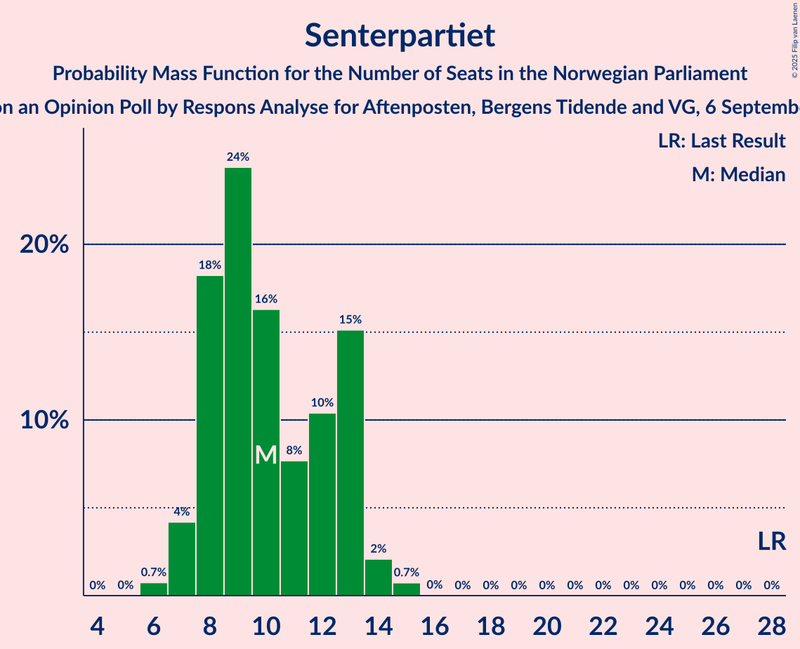
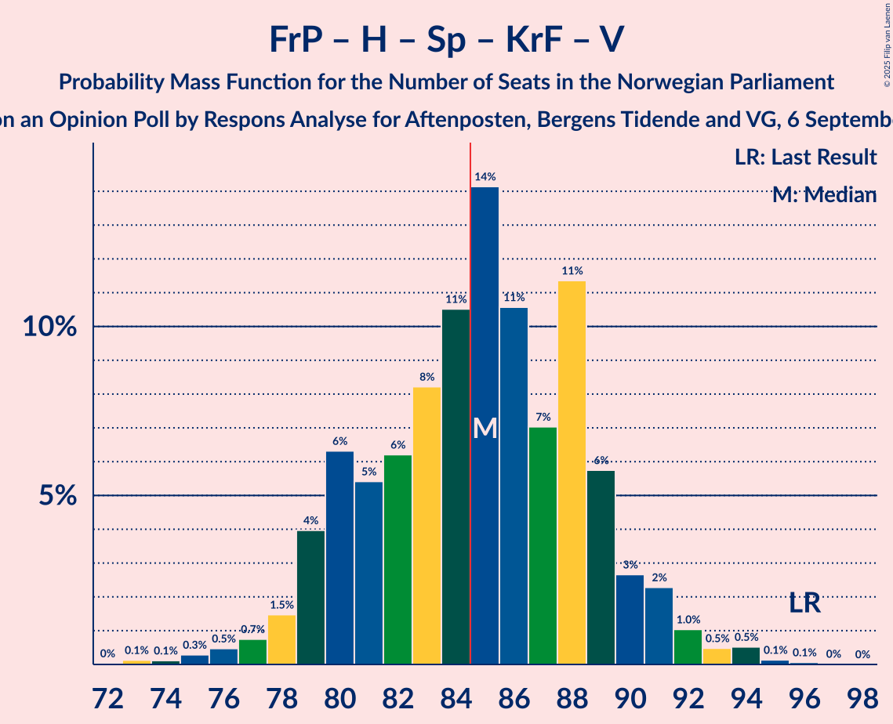

# Opinion Poll by Respons Analyse for Aftenposten, Bergens Tidende and VG, 6 September 2025

<a href="#voting-intentions">Voting Intentions</a> | <a href="#seats">Seats</a> | <a href="#coalitions">Coalitions</a> | <a href="#technical-information">Technical Information</a>

## Voting Intentions

### Confidence Intervals

| Party | Last Result | Poll Result | 80% Confidence Interval | 90% Confidence Interval | 95% Confidence Interval | 99% Confidence Interval |
|:-----:|:-----------:|:-----------:|:-----------------------:|:-----------------------:|:-----------------------:|:-----------------------:|
| Arbeiderpartiet | 26.2% | 29.5% | 27.7–31.4% |27.2–31.9% |26.7–32.4% |25.9–33.3% |
| Fremskrittspartiet | 11.6% | 18.9% | 17.4–20.5% |16.9–21.0% |16.6–21.4% |15.9–22.3% |
| Høyre | 20.4% | 14.9% | 13.5–16.4% |13.1–16.9% |12.8–17.2% |12.2–18.0% |
| Rødt | 4.7% | 6.4% | 5.5–7.5% |5.2–7.8% |5.0–8.1% |4.6–8.7% |
| Senterpartiet | 13.5% | 6.2% | 5.3–7.3% |5.1–7.6% |4.9–7.9% |4.5–8.4% |
| Sosialistisk Venstreparti | 7.6% | 5.8% | 4.9–6.9% |4.7–7.2% |4.5–7.4% |4.1–8.0% |
| Miljøpartiet De Grønne | 3.9% | 5.6% | 4.8–6.6% |4.5–6.9% |4.3–7.2% |4.0–7.7% |
| Kristelig Folkeparti | 3.8% | 5.1% | 4.3–6.1% |4.1–6.4% |3.9–6.6% |3.6–7.2% |
| Venstre | 4.6% | 4.5% | 3.7–5.5% |3.6–5.7% |3.4–6.0% |3.0–6.5% |

*Note:* The poll result column reflects the actual value used in the calculations. Published results may vary slightly, and in addition be rounded to fewer digits.

## Seats

### Confidence Intervals

| Party | Last Result | Median | 80% Confidence Interval | 90% Confidence Interval | 95% Confidence Interval | 99% Confidence Interval |
|:-----:|:-----------:|:------:|:-----------------------:|:-----------------------:|:-----------------------:|:-----------------------:|
| <a href="#arbeiderpartiet">Arbeiderpartiet</a> | 48 | 56 | 51–60 |50–61 |49–62 |48–65 |
| <a href="#fremskrittspartiet">Fremskrittspartiet</a> | 21 | 36 | 33–38 |32–39 |31–40 |29–42 |
| <a href="#høyre">Høyre</a> | 36 | 25 | 21–29 |20–29 |19–30 |18–31 |
| <a href="#rødt">Rødt</a> | 8 | 10 | 8–12 |8–12 |7–13 |7–14 |
| <a href="#senterpartiet">Senterpartiet</a> | 28 | 10 | 8–13 |7–13 |7–14 |6–15 |
| <a href="#sosialistisk-venstreparti">Sosialistisk Venstreparti</a> | 13 | 9 | 7–11 |7–11 |7–12 |6–13 |
| <a href="#miljøpartiet-de-grønne">Miljøpartiet De Grønne</a> | 3 | 9 | 7–10 |7–11 |6–11 |3–12 |
| <a href="#kristelig-folkeparti">Kristelig Folkeparti</a> | 3 | 8 | 7–9 |6–10 |3–10 |3–11 |
| <a href="#venstre">Venstre</a> | 8 | 7 | 3–9 |3–9 |2–9 |2–10 |

### Arbeiderpartiet

*For a full overview of the results for this party, see the [Arbeiderpartiet](party-arbeiderpartiet.html) page.*

| Number of Seats | Probability | Accumulated | Special Marks |
|:---------------:|:-----------:|:-----------:|:-------------:|
| 46 | 0.1% | 100% |  |
| 47 | 0.3% | 99.9% |  |
| 48 | 0.6% | 99.6% | Last Result |
| 49 | 2% | 99.0% |  |
| 50 | 2% | 97% |  |
| 51 | 5% | 95% |  |
| 52 | 7% | 90% |  |
| 53 | 4% | 83% |  |
| 54 | 6% | 79% |  |
| 55 | 11% | 73% |  |
| 56 | 14% | 62% | Median |
| 57 | 13% | 48% |  |
| 58 | 15% | 36% |  |
| 59 | 7% | 21% |  |
| 60 | 6% | 13% |  |
| 61 | 3% | 7% |  |
| 62 | 2% | 4% |  |
| 63 | 0.9% | 2% |  |
| 64 | 0.7% | 2% |  |
| 65 | 0.6% | 0.8% |  |
| 66 | 0.1% | 0.2% |  |
| 67 | 0% | 0.1% |  |
| 68 | 0% | 0% |  |

### Fremskrittspartiet

*For a full overview of the results for this party, see the [Fremskrittspartiet](party-fremskrittspartiet.html) page.*

| Number of Seats | Probability | Accumulated | Special Marks |
|:---------------:|:-----------:|:-----------:|:-------------:|
| 21 | 0% | 100% | Last Result |
| 22 | 0% | 100% |  |
| 23 | 0% | 100% |  |
| 24 | 0% | 100% |  |
| 25 | 0% | 100% |  |
| 26 | 0% | 100% |  |
| 27 | 0.1% | 100% |  |
| 28 | 0.2% | 99.9% |  |
| 29 | 0.9% | 99.7% |  |
| 30 | 1.2% | 98.8% |  |
| 31 | 1.1% | 98% |  |
| 32 | 3% | 97% |  |
| 33 | 5% | 94% |  |
| 34 | 20% | 89% |  |
| 35 | 18% | 69% |  |
| 36 | 21% | 51% | Median |
| 37 | 12% | 30% |  |
| 38 | 10% | 18% |  |
| 39 | 5% | 8% |  |
| 40 | 2% | 4% |  |
| 41 | 1.0% | 2% |  |
| 42 | 0.8% | 1.2% |  |
| 43 | 0.3% | 0.4% |  |
| 44 | 0.1% | 0.1% |  |
| 45 | 0% | 0% |  |

### Høyre

*For a full overview of the results for this party, see the [Høyre](party-høyre.html) page.*

| Number of Seats | Probability | Accumulated | Special Marks |
|:---------------:|:-----------:|:-----------:|:-------------:|
| 17 | 0.1% | 100% |  |
| 18 | 0.9% | 99.9% |  |
| 19 | 2% | 98.9% |  |
| 20 | 4% | 97% |  |
| 21 | 8% | 92% |  |
| 22 | 6% | 84% |  |
| 23 | 10% | 79% |  |
| 24 | 12% | 68% |  |
| 25 | 7% | 56% | Median |
| 26 | 9% | 49% |  |
| 27 | 19% | 40% |  |
| 28 | 9% | 21% |  |
| 29 | 8% | 12% |  |
| 30 | 3% | 5% |  |
| 31 | 1.4% | 2% |  |
| 32 | 0.4% | 0.5% |  |
| 33 | 0.1% | 0.1% |  |
| 34 | 0% | 0% |  |
| 35 | 0% | 0% |  |
| 36 | 0% | 0% | Last Result |

### Rødt

*For a full overview of the results for this party, see the [Rødt](party-rødt.html) page.*

| Number of Seats | Probability | Accumulated | Special Marks |
|:---------------:|:-----------:|:-----------:|:-------------:|
| 6 | 0.4% | 100% |  |
| 7 | 3% | 99.5% |  |
| 8 | 12% | 97% | Last Result |
| 9 | 21% | 85% |  |
| 10 | 32% | 63% | Median |
| 11 | 20% | 31% |  |
| 12 | 9% | 12% |  |
| 13 | 2% | 3% |  |
| 14 | 0.6% | 0.7% |  |
| 15 | 0.1% | 0.1% |  |
| 16 | 0% | 0% |  |

### Senterpartiet

*For a full overview of the results for this party, see the [Senterpartiet](party-senterpartiet.html) page.*

| Number of Seats | Probability | Accumulated | Special Marks |
|:---------------:|:-----------:|:-----------:|:-------------:|
| 5 | 0% | 100% |  |
| 6 | 0.7% | 99.9% |  |
| 7 | 4% | 99.2% |  |
| 8 | 18% | 95% |  |
| 9 | 24% | 77% |  |
| 10 | 16% | 52% | Median |
| 11 | 8% | 36% |  |
| 12 | 10% | 28% |  |
| 13 | 15% | 18% |  |
| 14 | 2% | 3% |  |
| 15 | 0.7% | 0.8% |  |
| 16 | 0% | 0% |  |
| 17 | 0% | 0% |  |
| 18 | 0% | 0% |  |
| 19 | 0% | 0% |  |
| 20 | 0% | 0% |  |
| 21 | 0% | 0% |  |
| 22 | 0% | 0% |  |
| 23 | 0% | 0% |  |
| 24 | 0% | 0% |  |
| 25 | 0% | 0% |  |
| 26 | 0% | 0% |  |
| 27 | 0% | 0% |  |
| 28 | 0% | 0% | Last Result |

### Sosialistisk Venstreparti

*For a full overview of the results for this party, see the [Sosialistisk Venstreparti](party-sosialistiskvenstreparti.html) page.*

| Number of Seats | Probability | Accumulated | Special Marks |
|:---------------:|:-----------:|:-----------:|:-------------:|
| 1 | 0.1% | 100% |  |
| 2 | 0.1% | 99.9% |  |
| 3 | 0.1% | 99.8% |  |
| 4 | 0% | 99.7% |  |
| 5 | 0% | 99.7% |  |
| 6 | 1.1% | 99.7% |  |
| 7 | 11% | 98.6% |  |
| 8 | 22% | 88% |  |
| 9 | 31% | 66% | Median |
| 10 | 23% | 34% |  |
| 11 | 8% | 12% |  |
| 12 | 3% | 3% |  |
| 13 | 0.6% | 0.7% | Last Result |
| 14 | 0.1% | 0.1% |  |
| 15 | 0% | 0% |  |

### Miljøpartiet De Grønne

*For a full overview of the results for this party, see the [Miljøpartiet De Grønne](party-miljøpartietdegrønne.html) page.*

| Number of Seats | Probability | Accumulated | Special Marks |
|:---------------:|:-----------:|:-----------:|:-------------:|
| 3 | 0.6% | 100% | Last Result |
| 4 | 0% | 99.4% |  |
| 5 | 0% | 99.4% |  |
| 6 | 2% | 99.3% |  |
| 7 | 16% | 97% |  |
| 8 | 27% | 81% |  |
| 9 | 33% | 54% | Median |
| 10 | 14% | 21% |  |
| 11 | 5% | 7% |  |
| 12 | 1.4% | 2% |  |
| 13 | 0.2% | 0.2% |  |
| 14 | 0% | 0% |  |

### Kristelig Folkeparti

*For a full overview of the results for this party, see the [Kristelig Folkeparti](party-kristeligfolkeparti.html) page.*

| Number of Seats | Probability | Accumulated | Special Marks |
|:---------------:|:-----------:|:-----------:|:-------------:|
| 2 | 0.4% | 100% |  |
| 3 | 4% | 99.6% | Last Result |
| 4 | 0% | 96% |  |
| 5 | 0.1% | 96% |  |
| 6 | 6% | 96% |  |
| 7 | 29% | 90% |  |
| 8 | 31% | 62% | Median |
| 9 | 23% | 31% |  |
| 10 | 6% | 8% |  |
| 11 | 2% | 2% |  |
| 12 | 0.3% | 0.3% |  |
| 13 | 0% | 0% |  |

### Venstre

*For a full overview of the results for this party, see the [Venstre](party-venstre.html) page.*

| Number of Seats | Probability | Accumulated | Special Marks |
|:---------------:|:-----------:|:-----------:|:-------------:|
| 2 | 4% | 100% |  |
| 3 | 21% | 96% |  |
| 4 | 0% | 76% |  |
| 5 | 0.6% | 76% |  |
| 6 | 16% | 75% |  |
| 7 | 30% | 59% | Median |
| 8 | 19% | 29% | Last Result |
| 9 | 9% | 10% |  |
| 10 | 1.2% | 1.3% |  |
| 11 | 0.1% | 0.1% |  |
| 12 | 0% | 0% |  |

## Coalitions

### Confidence Intervals

| Coalition | Last Result | Median | Majority? | 80% Confidence Interval | 90% Confidence Interval | 95% Confidence Interval | 99% Confidence Interval |
|:---------:|:-----------:|:------:|:---------:|:-----------------------:|:-----------------------:|:-----------------------:|:-----------------------:|
| Arbeiderpartiet – Rødt – Senterpartiet – Sosialistisk Venstreparti – Miljøpartiet De Grønne | 100 | 94 | 98.9% | 90–98 | 88–100 | 86–102 | 83–103 |
| Arbeiderpartiet – Senterpartiet – Sosialistisk Venstreparti – Miljøpartiet De Grønne – Kristelig Folkeparti | 95 | 92 | 97% | 88–96 | 86–98 | 84–99 | 81–102 |
| Arbeiderpartiet – Rødt – Senterpartiet – Sosialistisk Venstreparti | 97 | 85 | 57% | 81–90 | 80–91 | 78–93 | 75–94 |
| Arbeiderpartiet – Senterpartiet – Sosialistisk Venstreparti – Miljøpartiet De Grønne | 92 | 84 | 35% | 80–88 | 79–90 | 77–92 | 74–93 |
| Fremskrittspartiet – Høyre – Senterpartiet – Kristelig Folkeparti – Venstre | 96 | 85 | 56% | 80–89 | 79–90 | 78–91 | 75–94 |
| Arbeiderpartiet – Rødt – Sosialistisk Venstreparti – Miljøpartiet De Grønne | 72 | 84 | 38% | 79–88 | 78–89 | 76–90 | 74–92 |
| Fremskrittspartiet – Høyre – Miljøpartiet De Grønne – Kristelig Folkeparti – Venstre | 71 | 84 | 37% | 79–88 | 77–88 | 76–90 | 74–93 |
| Arbeiderpartiet – Senterpartiet – Miljøpartiet De Grønne – Kristelig Folkeparti | 82 | 83 | 25% | 79–87 | 77–89 | 75–90 | 73–93 |
| Arbeiderpartiet – Senterpartiet – Sosialistisk Venstreparti | 89 | 75 | 0.4% | 72–79 | 70–81 | 68–83 | 66–84 |
| Arbeiderpartiet – Senterpartiet – Kristelig Folkeparti | 79 | 74 | 0.1% | 70–78 | 69–80 | 67–82 | 64–84 |
| Fremskrittspartiet – Høyre – Kristelig Folkeparti – Venstre | 68 | 75 | 0.4% | 70–79 | 68–80 | 67–81 | 65–84 |
| Fremskrittspartiet – Høyre – Venstre | 65 | 67 | 0% | 62–71 | 60–72 | 59–74 | 57–76 |
| Arbeiderpartiet – Senterpartiet | 76 | 66 | 0% | 63–71 | 61–72 | 60–73 | 58–75 |
| Arbeiderpartiet – Sosialistisk Venstreparti | 61 | 65 | 0% | 61–69 | 59–70 | 58–71 | 56–74 |
| Fremskrittspartiet – Høyre | 57 | 61 | 0% | 56–65 | 55–66 | 54–67 | 52–69 |
| Høyre – Kristelig Folkeparti – Venstre | 47 | 39 | 0% | 35–43 | 33–44 | 32–45 | 30–47 |
| Senterpartiet – Kristelig Folkeparti – Venstre | 39 | 24 | 0% | 20–28 | 19–30 | 18–30 | 16–31 |

### Arbeiderpartiet – Rødt – Senterpartiet – Sosialistisk Venstreparti – Miljøpartiet De Grønne

| Number of Seats | Probability | Accumulated | Special Marks |
|:---------------:|:-----------:|:-----------:|:-------------:|
| 80 | 0% | 100% |  |
| 81 | 0.1% | 99.9% |  |
| 82 | 0.2% | 99.8% |  |
| 83 | 0.5% | 99.7% |  |
| 84 | 0.3% | 99.2% |  |
| 85 | 0.6% | 98.9% | Majority |
| 86 | 0.9% | 98% |  |
| 87 | 2% | 97% |  |
| 88 | 1.3% | 96% |  |
| 89 | 3% | 95% |  |
| 90 | 9% | 92% |  |
| 91 | 10% | 82% |  |
| 92 | 9% | 72% |  |
| 93 | 8% | 63% |  |
| 94 | 17% | 55% | Median |
| 95 | 12% | 38% |  |
| 96 | 7% | 26% |  |
| 97 | 5% | 19% |  |
| 98 | 5% | 15% |  |
| 99 | 3% | 9% |  |
| 100 | 2% | 7% | Last Result |
| 101 | 2% | 4% |  |
| 102 | 1.4% | 3% |  |
| 103 | 0.8% | 1.2% |  |
| 104 | 0.2% | 0.4% |  |
| 105 | 0.1% | 0.2% |  |
| 106 | 0% | 0.1% |  |
| 107 | 0% | 0% |  |

### Arbeiderpartiet – Senterpartiet – Sosialistisk Venstreparti – Miljøpartiet De Grønne – Kristelig Folkeparti

| Number of Seats | Probability | Accumulated | Special Marks |
|:---------------:|:-----------:|:-----------:|:-------------:|
| 79 | 0.1% | 100% |  |
| 80 | 0.3% | 99.8% |  |
| 81 | 0.3% | 99.6% |  |
| 82 | 0.4% | 99.2% |  |
| 83 | 0.7% | 98.8% |  |
| 84 | 0.9% | 98% |  |
| 85 | 2% | 97% | Majority |
| 86 | 2% | 96% |  |
| 87 | 3% | 94% |  |
| 88 | 6% | 91% |  |
| 89 | 10% | 85% |  |
| 90 | 12% | 75% |  |
| 91 | 12% | 63% |  |
| 92 | 14% | 51% | Median |
| 93 | 15% | 38% |  |
| 94 | 5% | 22% |  |
| 95 | 4% | 17% | Last Result |
| 96 | 5% | 13% |  |
| 97 | 3% | 9% |  |
| 98 | 2% | 6% |  |
| 99 | 2% | 4% |  |
| 100 | 0.7% | 2% |  |
| 101 | 0.7% | 1.2% |  |
| 102 | 0.4% | 0.5% |  |
| 103 | 0.1% | 0.1% |  |
| 104 | 0% | 0% |  |

### Arbeiderpartiet – Rødt – Senterpartiet – Sosialistisk Venstreparti

| Number of Seats | Probability | Accumulated | Special Marks |
|:---------------:|:-----------:|:-----------:|:-------------:|
| 73 | 0.1% | 100% |  |
| 74 | 0.1% | 99.9% |  |
| 75 | 0.3% | 99.8% |  |
| 76 | 0.7% | 99.5% |  |
| 77 | 0.6% | 98.7% |  |
| 78 | 1.0% | 98% |  |
| 79 | 1.1% | 97% |  |
| 80 | 2% | 96% |  |
| 81 | 7% | 94% |  |
| 82 | 8% | 87% |  |
| 83 | 11% | 79% |  |
| 84 | 11% | 68% |  |
| 85 | 16% | 57% | Median, Majority |
| 86 | 9% | 41% |  |
| 87 | 10% | 33% |  |
| 88 | 7% | 22% |  |
| 89 | 5% | 16% |  |
| 90 | 5% | 11% |  |
| 91 | 2% | 6% |  |
| 92 | 2% | 4% |  |
| 93 | 1.5% | 3% |  |
| 94 | 0.8% | 1.3% |  |
| 95 | 0.3% | 0.5% |  |
| 96 | 0.1% | 0.2% |  |
| 97 | 0.1% | 0.1% | Last Result |
| 98 | 0% | 0% |  |

### Arbeiderpartiet – Senterpartiet – Sosialistisk Venstreparti – Miljøpartiet De Grønne

| Number of Seats | Probability | Accumulated | Special Marks |
|:---------------:|:-----------:|:-----------:|:-------------:|
| 72 | 0.1% | 100% |  |
| 73 | 0.3% | 99.9% |  |
| 74 | 0.5% | 99.6% |  |
| 75 | 0.5% | 99.1% |  |
| 76 | 1.0% | 98.6% |  |
| 77 | 0.9% | 98% |  |
| 78 | 1.0% | 97% |  |
| 79 | 2% | 96% |  |
| 80 | 4% | 93% |  |
| 81 | 10% | 89% |  |
| 82 | 12% | 79% |  |
| 83 | 13% | 67% |  |
| 84 | 19% | 54% | Median |
| 85 | 10% | 35% | Majority |
| 86 | 6% | 24% |  |
| 87 | 6% | 18% |  |
| 88 | 4% | 12% |  |
| 89 | 2% | 8% |  |
| 90 | 2% | 6% |  |
| 91 | 2% | 4% |  |
| 92 | 1.3% | 3% | Last Result |
| 93 | 1.1% | 1.4% |  |
| 94 | 0.2% | 0.3% |  |
| 95 | 0.1% | 0.1% |  |
| 96 | 0% | 0% |  |

### Fremskrittspartiet – Høyre – Senterpartiet – Kristelig Folkeparti – Venstre

| Number of Seats | Probability | Accumulated | Special Marks |
|:---------------:|:-----------:|:-----------:|:-------------:|
| 73 | 0.1% | 100% |  |
| 74 | 0.1% | 99.8% |  |
| 75 | 0.3% | 99.7% |  |
| 76 | 0.5% | 99.4% |  |
| 77 | 0.7% | 98.9% |  |
| 78 | 1.5% | 98% |  |
| 79 | 4% | 97% |  |
| 80 | 6% | 93% |  |
| 81 | 5% | 86% |  |
| 82 | 6% | 81% |  |
| 83 | 8% | 75% |  |
| 84 | 11% | 67% |  |
| 85 | 14% | 56% | Majority |
| 86 | 11% | 42% | Median |
| 87 | 7% | 31% |  |
| 88 | 11% | 24% |  |
| 89 | 6% | 13% |  |
| 90 | 3% | 7% |  |
| 91 | 2% | 5% |  |
| 92 | 1.0% | 2% |  |
| 93 | 0.5% | 1.2% |  |
| 94 | 0.5% | 0.7% |  |
| 95 | 0.1% | 0.2% |  |
| 96 | 0.1% | 0.1% | Last Result |
| 97 | 0% | 0% |  |

### Arbeiderpartiet – Rødt – Sosialistisk Venstreparti – Miljøpartiet De Grønne

| Number of Seats | Probability | Accumulated | Special Marks |
|:---------------:|:-----------:|:-----------:|:-------------:|
| 71 | 0% | 100% |  |
| 72 | 0.1% | 99.9% | Last Result |
| 73 | 0.2% | 99.8% |  |
| 74 | 0.3% | 99.6% |  |
| 75 | 0.9% | 99.4% |  |
| 76 | 2% | 98% |  |
| 77 | 1.4% | 97% |  |
| 78 | 3% | 96% |  |
| 79 | 3% | 93% |  |
| 80 | 6% | 89% |  |
| 81 | 12% | 83% |  |
| 82 | 7% | 72% |  |
| 83 | 11% | 64% |  |
| 84 | 15% | 53% | Median |
| 85 | 10% | 38% | Majority |
| 86 | 8% | 28% |  |
| 87 | 6% | 20% |  |
| 88 | 4% | 14% |  |
| 89 | 5% | 10% |  |
| 90 | 3% | 5% |  |
| 91 | 1.1% | 2% |  |
| 92 | 0.4% | 0.8% |  |
| 93 | 0.2% | 0.4% |  |
| 94 | 0.1% | 0.2% |  |
| 95 | 0.1% | 0.1% |  |
| 96 | 0% | 0% |  |

### Fremskrittspartiet – Høyre – Miljøpartiet De Grønne – Kristelig Folkeparti – Venstre

| Number of Seats | Probability | Accumulated | Special Marks |
|:---------------:|:-----------:|:-----------:|:-------------:|
| 71 | 0% | 100% | Last Result |
| 72 | 0.1% | 99.9% |  |
| 73 | 0.2% | 99.8% |  |
| 74 | 0.5% | 99.6% |  |
| 75 | 1.4% | 99.1% |  |
| 76 | 2% | 98% |  |
| 77 | 3% | 96% |  |
| 78 | 2% | 93% |  |
| 79 | 6% | 91% |  |
| 80 | 6% | 85% |  |
| 81 | 7% | 79% |  |
| 82 | 11% | 72% |  |
| 83 | 8% | 61% |  |
| 84 | 15% | 53% |  |
| 85 | 10% | 37% | Median, Majority |
| 86 | 10% | 27% |  |
| 87 | 7% | 18% |  |
| 88 | 6% | 10% |  |
| 89 | 2% | 5% |  |
| 90 | 0.9% | 3% |  |
| 91 | 0.8% | 2% |  |
| 92 | 0.4% | 1.0% |  |
| 93 | 0.3% | 0.5% |  |
| 94 | 0.1% | 0.2% |  |
| 95 | 0% | 0.1% |  |
| 96 | 0% | 0% |  |

### Arbeiderpartiet – Senterpartiet – Miljøpartiet De Grønne – Kristelig Folkeparti

| Number of Seats | Probability | Accumulated | Special Marks |
|:---------------:|:-----------:|:-----------:|:-------------:|
| 70 | 0% | 100% |  |
| 71 | 0.1% | 99.9% |  |
| 72 | 0.3% | 99.9% |  |
| 73 | 0.6% | 99.5% |  |
| 74 | 0.5% | 98.9% |  |
| 75 | 0.9% | 98% |  |
| 76 | 1.4% | 97% |  |
| 77 | 2% | 96% |  |
| 78 | 3% | 94% |  |
| 79 | 10% | 91% |  |
| 80 | 7% | 82% |  |
| 81 | 11% | 75% |  |
| 82 | 14% | 64% | Last Result |
| 83 | 11% | 51% | Median |
| 84 | 14% | 39% |  |
| 85 | 8% | 25% | Majority |
| 86 | 6% | 17% |  |
| 87 | 3% | 11% |  |
| 88 | 3% | 8% |  |
| 89 | 2% | 5% |  |
| 90 | 2% | 3% |  |
| 91 | 0.7% | 2% |  |
| 92 | 0.7% | 1.2% |  |
| 93 | 0.5% | 0.5% |  |
| 94 | 0% | 0.1% |  |
| 95 | 0% | 0% |  |

### Arbeiderpartiet – Senterpartiet – Sosialistisk Venstreparti

| Number of Seats | Probability | Accumulated | Special Marks |
|:---------------:|:-----------:|:-----------:|:-------------:|
| 64 | 0.1% | 100% |  |
| 65 | 0.2% | 99.9% |  |
| 66 | 0.5% | 99.7% |  |
| 67 | 0.7% | 99.2% |  |
| 68 | 1.0% | 98% |  |
| 69 | 1.5% | 97% |  |
| 70 | 2% | 96% |  |
| 71 | 2% | 94% |  |
| 72 | 7% | 92% |  |
| 73 | 11% | 84% |  |
| 74 | 13% | 73% |  |
| 75 | 19% | 60% | Median |
| 76 | 12% | 41% |  |
| 77 | 8% | 28% |  |
| 78 | 5% | 20% |  |
| 79 | 6% | 15% |  |
| 80 | 3% | 9% |  |
| 81 | 2% | 6% |  |
| 82 | 1.1% | 4% |  |
| 83 | 2% | 3% |  |
| 84 | 1.1% | 1.5% |  |
| 85 | 0.3% | 0.4% | Majority |
| 86 | 0.1% | 0.1% |  |
| 87 | 0% | 0% |  |
| 88 | 0% | 0% |  |
| 89 | 0% | 0% | Last Result |

### Arbeiderpartiet – Senterpartiet – Kristelig Folkeparti

| Number of Seats | Probability | Accumulated | Special Marks |
|:---------------:|:-----------:|:-----------:|:-------------:|
| 63 | 0.1% | 100% |  |
| 64 | 0.4% | 99.9% |  |
| 65 | 0.4% | 99.5% |  |
| 66 | 0.9% | 99.1% |  |
| 67 | 1.4% | 98% |  |
| 68 | 2% | 97% |  |
| 69 | 3% | 95% |  |
| 70 | 5% | 92% |  |
| 71 | 6% | 87% |  |
| 72 | 14% | 81% |  |
| 73 | 10% | 67% |  |
| 74 | 12% | 57% | Median |
| 75 | 16% | 45% |  |
| 76 | 9% | 28% |  |
| 77 | 5% | 19% |  |
| 78 | 5% | 14% |  |
| 79 | 3% | 9% | Last Result |
| 80 | 2% | 6% |  |
| 81 | 0.9% | 3% |  |
| 82 | 1.5% | 3% |  |
| 83 | 0.4% | 1.1% |  |
| 84 | 0.6% | 0.7% |  |
| 85 | 0.1% | 0.1% | Majority |
| 86 | 0% | 0% |  |

### Fremskrittspartiet – Høyre – Kristelig Folkeparti – Venstre

| Number of Seats | Probability | Accumulated | Special Marks |
|:---------------:|:-----------:|:-----------:|:-------------:|
| 62 | 0% | 100% |  |
| 63 | 0.1% | 99.9% |  |
| 64 | 0.1% | 99.9% |  |
| 65 | 0.3% | 99.7% |  |
| 66 | 0.9% | 99.4% |  |
| 67 | 2% | 98% |  |
| 68 | 3% | 97% | Last Result |
| 69 | 3% | 94% |  |
| 70 | 4% | 91% |  |
| 71 | 6% | 87% |  |
| 72 | 6% | 81% |  |
| 73 | 8% | 76% |  |
| 74 | 12% | 68% |  |
| 75 | 17% | 56% |  |
| 76 | 7% | 39% | Median |
| 77 | 8% | 31% |  |
| 78 | 9% | 23% |  |
| 79 | 8% | 14% |  |
| 80 | 2% | 5% |  |
| 81 | 1.1% | 4% |  |
| 82 | 1.1% | 2% |  |
| 83 | 0.6% | 1.4% |  |
| 84 | 0.4% | 0.7% |  |
| 85 | 0.2% | 0.4% | Majority |
| 86 | 0.2% | 0.2% |  |
| 87 | 0% | 0% |  |

### Fremskrittspartiet – Høyre – Venstre

| Number of Seats | Probability | Accumulated | Special Marks |
|:---------------:|:-----------:|:-----------:|:-------------:|
| 55 | 0% | 100% |  |
| 56 | 0.1% | 99.9% |  |
| 57 | 0.4% | 99.8% |  |
| 58 | 0.6% | 99.5% |  |
| 59 | 2% | 98.9% |  |
| 60 | 3% | 97% |  |
| 61 | 3% | 95% |  |
| 62 | 4% | 92% |  |
| 63 | 5% | 88% |  |
| 64 | 6% | 83% |  |
| 65 | 6% | 77% | Last Result |
| 66 | 17% | 71% |  |
| 67 | 13% | 54% |  |
| 68 | 9% | 40% | Median |
| 69 | 7% | 32% |  |
| 70 | 7% | 25% |  |
| 71 | 11% | 18% |  |
| 72 | 3% | 7% |  |
| 73 | 2% | 5% |  |
| 74 | 1.3% | 3% |  |
| 75 | 0.6% | 1.5% |  |
| 76 | 0.4% | 0.9% |  |
| 77 | 0.2% | 0.5% |  |
| 78 | 0.2% | 0.3% |  |
| 79 | 0.1% | 0.1% |  |
| 80 | 0% | 0% |  |

### Arbeiderpartiet – Senterpartiet

| Number of Seats | Probability | Accumulated | Special Marks |
|:---------------:|:-----------:|:-----------:|:-------------:|
| 56 | 0.1% | 100% |  |
| 57 | 0.3% | 99.9% |  |
| 58 | 0.6% | 99.6% |  |
| 59 | 1.2% | 99.0% |  |
| 60 | 1.5% | 98% |  |
| 61 | 2% | 96% |  |
| 62 | 3% | 94% |  |
| 63 | 5% | 91% |  |
| 64 | 15% | 86% |  |
| 65 | 10% | 71% |  |
| 66 | 20% | 61% | Median |
| 67 | 14% | 41% |  |
| 68 | 9% | 27% |  |
| 69 | 5% | 18% |  |
| 70 | 3% | 13% |  |
| 71 | 3% | 10% |  |
| 72 | 3% | 7% |  |
| 73 | 2% | 4% |  |
| 74 | 1.4% | 2% |  |
| 75 | 0.8% | 1.1% |  |
| 76 | 0.3% | 0.4% | Last Result |
| 77 | 0.1% | 0.1% |  |
| 78 | 0% | 0% |  |

### Arbeiderpartiet – Sosialistisk Venstreparti

| Number of Seats | Probability | Accumulated | Special Marks |
|:---------------:|:-----------:|:-----------:|:-------------:|
| 54 | 0% | 100% |  |
| 55 | 0.1% | 99.9% |  |
| 56 | 0.4% | 99.8% |  |
| 57 | 0.6% | 99.4% |  |
| 58 | 2% | 98.8% |  |
| 59 | 3% | 97% |  |
| 60 | 4% | 95% |  |
| 61 | 5% | 91% | Last Result |
| 62 | 7% | 86% |  |
| 63 | 7% | 79% |  |
| 64 | 8% | 72% |  |
| 65 | 20% | 64% | Median |
| 66 | 9% | 43% |  |
| 67 | 12% | 34% |  |
| 68 | 8% | 22% |  |
| 69 | 4% | 14% |  |
| 70 | 5% | 10% |  |
| 71 | 2% | 5% |  |
| 72 | 0.9% | 2% |  |
| 73 | 0.8% | 1.4% |  |
| 74 | 0.4% | 0.6% |  |
| 75 | 0.1% | 0.2% |  |
| 76 | 0% | 0.1% |  |
| 77 | 0% | 0% |  |

### Fremskrittspartiet – Høyre

| Number of Seats | Probability | Accumulated | Special Marks |
|:---------------:|:-----------:|:-----------:|:-------------:|
| 50 | 0.1% | 100% |  |
| 51 | 0.2% | 99.9% |  |
| 52 | 0.3% | 99.7% |  |
| 53 | 1.2% | 99.4% |  |
| 54 | 3% | 98% |  |
| 55 | 3% | 95% |  |
| 56 | 5% | 92% |  |
| 57 | 6% | 87% | Last Result |
| 58 | 9% | 81% |  |
| 59 | 10% | 72% |  |
| 60 | 9% | 62% |  |
| 61 | 9% | 53% | Median |
| 62 | 7% | 45% |  |
| 63 | 16% | 38% |  |
| 64 | 11% | 21% |  |
| 65 | 4% | 10% |  |
| 66 | 2% | 6% |  |
| 67 | 2% | 3% |  |
| 68 | 0.7% | 2% |  |
| 69 | 0.6% | 1.1% |  |
| 70 | 0.2% | 0.5% |  |
| 71 | 0.1% | 0.3% |  |
| 72 | 0.1% | 0.2% |  |
| 73 | 0% | 0% |  |

### Høyre – Kristelig Folkeparti – Venstre

| Number of Seats | Probability | Accumulated | Special Marks |
|:---------------:|:-----------:|:-----------:|:-------------:|
| 27 | 0.1% | 100% |  |
| 28 | 0% | 99.9% |  |
| 29 | 0.2% | 99.9% |  |
| 30 | 0.3% | 99.7% |  |
| 31 | 0.8% | 99.4% |  |
| 32 | 1.3% | 98.6% |  |
| 33 | 3% | 97% |  |
| 34 | 4% | 95% |  |
| 35 | 6% | 91% |  |
| 36 | 6% | 84% |  |
| 37 | 10% | 78% |  |
| 38 | 11% | 68% |  |
| 39 | 14% | 58% |  |
| 40 | 8% | 43% | Median |
| 41 | 10% | 35% |  |
| 42 | 6% | 25% |  |
| 43 | 10% | 19% |  |
| 44 | 5% | 10% |  |
| 45 | 3% | 4% |  |
| 46 | 0.9% | 1.4% |  |
| 47 | 0.3% | 0.5% | Last Result |
| 48 | 0.1% | 0.2% |  |
| 49 | 0% | 0% |  |

### Senterpartiet – Kristelig Folkeparti – Venstre

| Number of Seats | Probability | Accumulated | Special Marks |
|:---------------:|:-----------:|:-----------:|:-------------:|
| 14 | 0.1% | 100% |  |
| 15 | 0.2% | 99.9% |  |
| 16 | 0.4% | 99.7% |  |
| 17 | 0.4% | 99.3% |  |
| 18 | 2% | 98.9% |  |
| 19 | 3% | 97% |  |
| 20 | 4% | 94% |  |
| 21 | 6% | 90% |  |
| 22 | 17% | 84% |  |
| 23 | 11% | 67% |  |
| 24 | 10% | 55% |  |
| 25 | 14% | 46% | Median |
| 26 | 11% | 32% |  |
| 27 | 7% | 21% |  |
| 28 | 5% | 14% |  |
| 29 | 3% | 9% |  |
| 30 | 4% | 5% |  |
| 31 | 1.0% | 1.4% |  |
| 32 | 0.3% | 0.5% |  |
| 33 | 0.1% | 0.1% |  |
| 34 | 0% | 0% |  |
| 35 | 0% | 0% |  |
| 36 | 0% | 0% |  |
| 37 | 0% | 0% |  |
| 38 | 0% | 0% |  |
| 39 | 0% | 0% | Last Result |

## Technical Information

### Opinion Poll

+ **Polling firm:** Respons Analyse
+ **Commissioner(s):** Aftenposten, Bergens Tidende and VG
+ **Fieldwork period:** 6 September 2025

### Calculations

+ **Sample size:** 1001
+ **Simulations done:** 2,097,152
+ **Error estimate:** 1.14%

