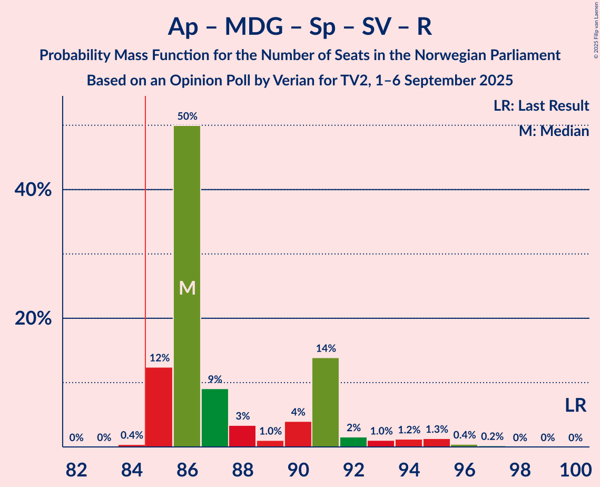
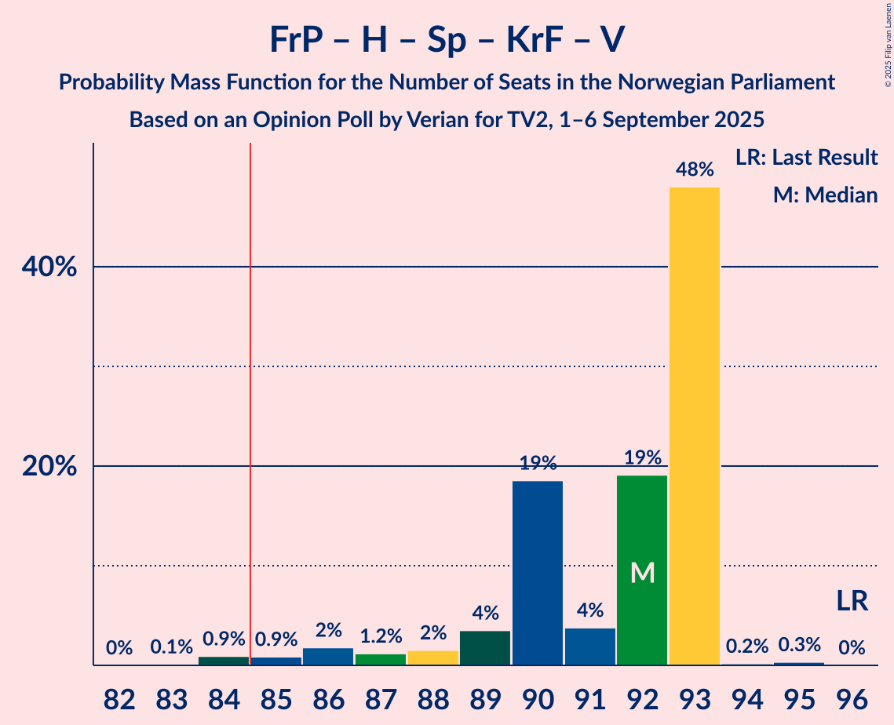

# Opinion Poll by Verian for TV2, 1–6 September 2025

<a href="#voting-intentions">Voting Intentions</a> | <a href="#seats">Seats</a> | <a href="#coalitions">Coalitions</a> | <a href="#technical-information">Technical Information</a>

## Voting Intentions

### Confidence Intervals

| Party | Last Result | Poll Result | 80% Confidence Interval | 90% Confidence Interval | 95% Confidence Interval | 99% Confidence Interval |
|:-----:|:-----------:|:-----------:|:-----------------------:|:-----------------------:|:-----------------------:|:-----------------------:|
| Arbeiderpartiet | 26.2% | 27.3% | 26.3–28.2% |26.0–28.5% |25.8–28.8% |25.3–29.2% |
| Fremskrittspartiet | 11.6% | 21.3% | 20.4–22.2% |20.1–22.4% |19.9–22.6% |19.5–23.1% |
| Høyre | 20.4% | 14.9% | 14.1–15.7% |13.9–15.9% |13.7–16.1% |13.4–16.5% |
| Miljøpartiet De Grønne | 3.9% | 6.4% | 5.9–7.0% |5.7–7.1% |5.6–7.3% |5.4–7.5% |
| Senterpartiet | 13.5% | 6.0% | 5.5–6.6% |5.4–6.7% |5.3–6.8% |5.0–7.1% |
| Sosialistisk Venstreparti | 7.6% | 5.7% | 5.2–6.2% |5.1–6.4% |5.0–6.5% |4.7–6.8% |
| Rødt | 4.7% | 5.3% | 4.8–5.8% |4.7–6.0% |4.6–6.1% |4.4–6.3% |
| Kristelig Folkeparti | 3.8% | 4.7% | 4.3–5.2% |4.1–5.3% |4.0–5.4% |3.8–5.7% |
| Venstre | 4.6% | 3.9% | 3.5–4.3% |3.4–4.5% |3.3–4.6% |3.1–4.8% |
| Norgesdemokratene | 1.1% | 0.9% | 0.7–1.1% |0.7–1.2% |0.6–1.3% |0.5–1.4% |
| Konservativt | 0.4% | 0.9% | 0.7–1.1% |0.7–1.2% |0.6–1.3% |0.5–1.4% |
| Industri- og Næringspartiet | 0.3% | 0.5% | 0.4–0.7% |0.3–0.7% |0.3–0.8% |0.2–0.9% |
| Pensjonistpartiet | 0.6% | 0.4% | 0.3–0.6% |0.3–0.6% |0.2–0.7% |0.2–0.8% |

*Note:* The poll result column reflects the actual value used in the calculations. Published results may vary slightly, and in addition be rounded to fewer digits.

## Seats

### Confidence Intervals

| Party | Last Result | Median | 80% Confidence Interval | 90% Confidence Interval | 95% Confidence Interval | 99% Confidence Interval |
|:-----:|:-----------:|:------:|:-----------------------:|:-----------------------:|:-----------------------:|:-----------------------:|
| <a href="#arbeiderpartiet">Arbeiderpartiet</a> | 48 | 50 | 49–53 |48–53 |48–54 |48–58 |
| <a href="#fremskrittspartiet">Fremskrittspartiet</a> | 21 | 43 | 40–43 |40–43 |39–43 |37–44 |
| <a href="#høyre">Høyre</a> | 36 | 27 | 24–27 |23–27 |23–28 |22–29 |
| <a href="#miljøpartiet-de-grønne">Miljøpartiet De Grønne</a> | 3 | 10 | 9–11 |9–11 |9–11 |8–12 |
| <a href="#senterpartiet">Senterpartiet</a> | 28 | 10 | 8–12 |8–13 |8–13 |8–13 |
| <a href="#sosialistisk-venstreparti">Sosialistisk Venstreparti</a> | 13 | 8 | 8–10 |8–10 |8–10 |8–11 |
| <a href="#rødt">Rødt</a> | 8 | 8 | 7–10 |7–10 |7–10 |7–11 |
| <a href="#kristelig-folkeparti">Kristelig Folkeparti</a> | 3 | 7 | 7–8 |7–8 |7–9 |3–9 |
| <a href="#venstre">Venstre</a> | 8 | 6 | 3–7 |3–7 |3–7 |2–7 |
| <a href="#norgesdemokratene">Norgesdemokratene</a> | 0 | 0 | 0 |0 |0 |0 |
| <a href="#konservativt">Konservativt</a> | 0 | 0 | 0 |0 |0 |0 |
| <a href="#industri--og-næringspartiet">Industri- og Næringspartiet</a> | 0 | 0 | 0 |0 |0 |0 |
| <a href="#pensjonistpartiet">Pensjonistpartiet</a> | 0 | 0 | 0 |0 |0 |0 |

### Arbeiderpartiet

*For a full overview of the results for this party, see the [Arbeiderpartiet](party-arbeiderpartiet.html) page.*

| Number of Seats | Probability | Accumulated | Special Marks |
|:---------------:|:-----------:|:-----------:|:-------------:|
| 47 | 0.4% | 100% |  |
| 48 | 9% | 99.6% | Last Result |
| 49 | 2% | 91% |  |
| 50 | 50% | 89% | Median |
| 51 | 9% | 39% |  |
| 52 | 10% | 29% |  |
| 53 | 15% | 19% |  |
| 54 | 3% | 4% |  |
| 55 | 0.6% | 2% |  |
| 56 | 0.1% | 1.0% |  |
| 57 | 0.3% | 0.9% |  |
| 58 | 0.5% | 0.6% |  |
| 59 | 0% | 0% |  |

### Fremskrittspartiet

*For a full overview of the results for this party, see the [Fremskrittspartiet](party-fremskrittspartiet.html) page.*

| Number of Seats | Probability | Accumulated | Special Marks |
|:---------------:|:-----------:|:-----------:|:-------------:|
| 21 | 0% | 100% | Last Result |
| 22 | 0% | 100% |  |
| 23 | 0% | 100% |  |
| 24 | 0% | 100% |  |
| 25 | 0% | 100% |  |
| 26 | 0% | 100% |  |
| 27 | 0% | 100% |  |
| 28 | 0% | 100% |  |
| 29 | 0% | 100% |  |
| 30 | 0% | 100% |  |
| 31 | 0% | 100% |  |
| 32 | 0% | 100% |  |
| 33 | 0% | 100% |  |
| 34 | 0% | 100% |  |
| 35 | 0% | 100% |  |
| 36 | 0% | 100% |  |
| 37 | 0.6% | 99.9% |  |
| 38 | 2% | 99.4% |  |
| 39 | 1.4% | 98% |  |
| 40 | 14% | 96% |  |
| 41 | 5% | 82% |  |
| 42 | 10% | 77% |  |
| 43 | 64% | 67% | Median |
| 44 | 2% | 2% |  |
| 45 | 0% | 0% |  |

### Høyre

*For a full overview of the results for this party, see the [Høyre](party-høyre.html) page.*

| Number of Seats | Probability | Accumulated | Special Marks |
|:---------------:|:-----------:|:-----------:|:-------------:|
| 21 | 0.1% | 100% |  |
| 22 | 0.4% | 99.9% |  |
| 23 | 5% | 99.4% |  |
| 24 | 4% | 94% |  |
| 25 | 2% | 90% |  |
| 26 | 9% | 88% |  |
| 27 | 74% | 78% | Median |
| 28 | 3% | 4% |  |
| 29 | 1.2% | 1.3% |  |
| 30 | 0.1% | 0.1% |  |
| 31 | 0% | 0% |  |
| 32 | 0% | 0% |  |
| 33 | 0% | 0% |  |
| 34 | 0% | 0% |  |
| 35 | 0% | 0% |  |
| 36 | 0% | 0% | Last Result |

### Miljøpartiet De Grønne

*For a full overview of the results for this party, see the [Miljøpartiet De Grønne](party-miljøpartietdegrønne.html) page.*

| Number of Seats | Probability | Accumulated | Special Marks |
|:---------------:|:-----------:|:-----------:|:-------------:|
| 3 | 0% | 100% | Last Result |
| 4 | 0% | 100% |  |
| 5 | 0% | 100% |  |
| 6 | 0% | 100% |  |
| 7 | 0% | 100% |  |
| 8 | 0.7% | 100% |  |
| 9 | 18% | 99.3% |  |
| 10 | 66% | 82% | Median |
| 11 | 15% | 16% |  |
| 12 | 1.3% | 2% |  |
| 13 | 0.2% | 0.2% |  |
| 14 | 0% | 0% |  |

### Senterpartiet

*For a full overview of the results for this party, see the [Senterpartiet](party-senterpartiet.html) page.*

| Number of Seats | Probability | Accumulated | Special Marks |
|:---------------:|:-----------:|:-----------:|:-------------:|
| 7 | 0.1% | 100% |  |
| 8 | 21% | 99.9% |  |
| 9 | 7% | 79% |  |
| 10 | 50% | 72% | Median |
| 11 | 3% | 22% |  |
| 12 | 12% | 18% |  |
| 13 | 6% | 6% |  |
| 14 | 0% | 0% |  |
| 15 | 0% | 0% |  |
| 16 | 0% | 0% |  |
| 17 | 0% | 0% |  |
| 18 | 0% | 0% |  |
| 19 | 0% | 0% |  |
| 20 | 0% | 0% |  |
| 21 | 0% | 0% |  |
| 22 | 0% | 0% |  |
| 23 | 0% | 0% |  |
| 24 | 0% | 0% |  |
| 25 | 0% | 0% |  |
| 26 | 0% | 0% |  |
| 27 | 0% | 0% |  |
| 28 | 0% | 0% | Last Result |

### Sosialistisk Venstreparti

*For a full overview of the results for this party, see the [Sosialistisk Venstreparti](party-sosialistiskvenstreparti.html) page.*

| Number of Seats | Probability | Accumulated | Special Marks |
|:---------------:|:-----------:|:-----------:|:-------------:|
| 7 | 0.4% | 100% |  |
| 8 | 65% | 99.6% | Median |
| 9 | 21% | 35% |  |
| 10 | 12% | 14% |  |
| 11 | 1.3% | 2% |  |
| 12 | 0.3% | 0.3% |  |
| 13 | 0% | 0% | Last Result |

### Rødt

*For a full overview of the results for this party, see the [Rødt](party-rødt.html) page.*

| Number of Seats | Probability | Accumulated | Special Marks |
|:---------------:|:-----------:|:-----------:|:-------------:|
| 6 | 0.1% | 100% |  |
| 7 | 16% | 99.9% |  |
| 8 | 66% | 84% | Last Result, Median |
| 9 | 5% | 18% |  |
| 10 | 12% | 13% |  |
| 11 | 1.0% | 1.0% |  |
| 12 | 0% | 0% |  |

### Kristelig Folkeparti

*For a full overview of the results for this party, see the [Kristelig Folkeparti](party-kristeligfolkeparti.html) page.*

| Number of Seats | Probability | Accumulated | Special Marks |
|:---------------:|:-----------:|:-----------:|:-------------:|
| 3 | 1.2% | 100% | Last Result |
| 4 | 0% | 98.8% |  |
| 5 | 0% | 98.8% |  |
| 6 | 1.1% | 98.8% |  |
| 7 | 71% | 98% | Median |
| 8 | 23% | 26% |  |
| 9 | 3% | 3% |  |
| 10 | 0% | 0% |  |

### Venstre

*For a full overview of the results for this party, see the [Venstre](party-venstre.html) page.*

| Number of Seats | Probability | Accumulated | Special Marks |
|:---------------:|:-----------:|:-----------:|:-------------:|
| 2 | 2% | 100% |  |
| 3 | 17% | 98% |  |
| 4 | 0% | 81% |  |
| 5 | 0% | 81% |  |
| 6 | 59% | 81% | Median |
| 7 | 22% | 22% |  |
| 8 | 0% | 0% | Last Result |

### Norgesdemokratene

*For a full overview of the results for this party, see the [Norgesdemokratene](party-norgesdemokratene.html) page.*

| Number of Seats | Probability | Accumulated | Special Marks |
|:---------------:|:-----------:|:-----------:|:-------------:|
| 0 | 100% | 100% | Last Result, Median |

### Konservativt

*For a full overview of the results for this party, see the [Konservativt](party-konservativt.html) page.*

| Number of Seats | Probability | Accumulated | Special Marks |
|:---------------:|:-----------:|:-----------:|:-------------:|
| 0 | 100% | 100% | Last Result, Median |

### Industri- og Næringspartiet

*For a full overview of the results for this party, see the [Industri- og Næringspartiet](party-industri-ognæringspartiet.html) page.*

| Number of Seats | Probability | Accumulated | Special Marks |
|:---------------:|:-----------:|:-----------:|:-------------:|
| 0 | 100% | 100% | Last Result, Median |

### Pensjonistpartiet

*For a full overview of the results for this party, see the [Pensjonistpartiet](party-pensjonistpartiet.html) page.*

| Number of Seats | Probability | Accumulated | Special Marks |
|:---------------:|:-----------:|:-----------:|:-------------:|
| 0 | 100% | 100% | Last Result, Median |

## Coalitions

### Confidence Intervals

| Coalition | Last Result | Median | Majority? | 80% Confidence Interval | 90% Confidence Interval | 95% Confidence Interval | 99% Confidence Interval |
|:---------:|:-----------:|:------:|:---------:|:-----------------------:|:-----------------------:|:-----------------------:|:-----------------------:|
| Arbeiderpartiet – Miljøpartiet De Grønne – Senterpartiet – Sosialistisk Venstreparti – Rødt | 100 | 86 | 99.5% | 85–91 | 85–92 | 85–94 | 85–96 |
| Fremskrittspartiet – Høyre – Miljøpartiet De Grønne – Kristelig Folkeparti – Venstre | 71 | 93 | 99.1% | 88–93 | 87–93 | 86–93 | 83–94 |
| Fremskrittspartiet – Høyre – Senterpartiet – Kristelig Folkeparti – Venstre | 96 | 92 | 98.9% | 90–93 | 88–93 | 86–93 | 84–94 |
| Arbeiderpartiet – Miljøpartiet De Grønne – Senterpartiet – Sosialistisk Venstreparti – Kristelig Folkeparti | 95 | 85 | 98.8% | 85–90 | 85–90 | 85–92 | 84–94 |
| Arbeiderpartiet – Miljøpartiet De Grønne – Senterpartiet – Sosialistisk Venstreparti | 92 | 78 | 3% | 78–82 | 78–83 | 78–85 | 77–86 |
| Fremskrittspartiet – Høyre – Kristelig Folkeparti – Venstre | 68 | 83 | 0.5% | 78–84 | 77–84 | 75–84 | 73–84 |
| Arbeiderpartiet – Miljøpartiet De Grønne – Sosialistisk Venstreparti – Rødt | 72 | 77 | 1.1% | 76–79 | 76–81 | 76–83 | 75–85 |
| Arbeiderpartiet – Senterpartiet – Sosialistisk Venstreparti – Rødt | 97 | 76 | 0.9% | 76–81 | 76–82 | 76–83 | 75–86 |
| Arbeiderpartiet – Miljøpartiet De Grønne – Senterpartiet – Kristelig Folkeparti | 82 | 77 | 0.9% | 77–81 | 77–82 | 77–82 | 75–85 |
| Fremskrittspartiet – Høyre – Venstre | 65 | 76 | 0% | 70–77 | 70–77 | 68–77 | 65–77 |
| Arbeiderpartiet – Senterpartiet – Sosialistisk Venstreparti | 89 | 68 | 0% | 68–73 | 68–73 | 68–74 | 67–76 |
| Arbeiderpartiet – Senterpartiet – Kristelig Folkeparti | 79 | 67 | 0% | 67–71 | 67–71 | 66–72 | 64–75 |
| Fremskrittspartiet – Høyre | 57 | 70 | 0% | 66–70 | 64–70 | 64–70 | 61–72 |
| Arbeiderpartiet – Senterpartiet | 76 | 60 | 0% | 60–63 | 60–64 | 60–64 | 58–66 |
| Arbeiderpartiet – Sosialistisk Venstreparti | 61 | 58 | 0% | 58–61 | 58–62 | 58–64 | 57–66 |
| Høyre – Kristelig Folkeparti – Venstre | 47 | 40 | 0% | 37–41 | 36–41 | 35–41 | 33–42 |
| Senterpartiet – Kristelig Folkeparti – Venstre | 39 | 23 | 0% | 22–23 | 21–27 | 19–28 | 16–28 |

### Arbeiderpartiet – Miljøpartiet De Grønne – Senterpartiet – Sosialistisk Venstreparti – Rødt

| Number of Seats | Probability | Accumulated | Special Marks |
|:---------------:|:-----------:|:-----------:|:-------------:|
| 83 | 0% | 100% |  |
| 84 | 0.4% | 99.9% |  |
| 85 | 12% | 99.5% | Majority |
| 86 | 50% | 87% | Median |
| 87 | 9% | 37% |  |
| 88 | 3% | 28% |  |
| 89 | 1.0% | 25% |  |
| 90 | 4% | 24% |  |
| 91 | 14% | 20% |  |
| 92 | 2% | 6% |  |
| 93 | 1.0% | 4% |  |
| 94 | 1.2% | 3% |  |
| 95 | 1.3% | 2% |  |
| 96 | 0.4% | 0.7% |  |
| 97 | 0.2% | 0.2% |  |
| 98 | 0% | 0% |  |
| 99 | 0% | 0% |  |
| 100 | 0% | 0% | Last Result |

### Fremskrittspartiet – Høyre – Miljøpartiet De Grønne – Kristelig Folkeparti – Venstre

| Number of Seats | Probability | Accumulated | Special Marks |
|:---------------:|:-----------:|:-----------:|:-------------:|
| 71 | 0% | 100% | Last Result |
| 72 | 0% | 100% |  |
| 73 | 0% | 100% |  |
| 74 | 0% | 100% |  |
| 75 | 0% | 100% |  |
| 76 | 0% | 100% |  |
| 77 | 0% | 100% |  |
| 78 | 0% | 100% |  |
| 79 | 0% | 100% |  |
| 80 | 0% | 100% |  |
| 81 | 0% | 100% |  |
| 82 | 0.2% | 100% |  |
| 83 | 0.3% | 99.8% |  |
| 84 | 0.3% | 99.5% |  |
| 85 | 1.3% | 99.1% | Majority |
| 86 | 1.5% | 98% |  |
| 87 | 1.4% | 96% |  |
| 88 | 7% | 95% |  |
| 89 | 10% | 88% |  |
| 90 | 3% | 78% |  |
| 91 | 2% | 75% |  |
| 92 | 10% | 72% |  |
| 93 | 61% | 62% | Median |
| 94 | 0.5% | 0.9% |  |
| 95 | 0.4% | 0.4% |  |
| 96 | 0% | 0.1% |  |
| 97 | 0% | 0% |  |

### Fremskrittspartiet – Høyre – Senterpartiet – Kristelig Folkeparti – Venstre

| Number of Seats | Probability | Accumulated | Special Marks |
|:---------------:|:-----------:|:-----------:|:-------------:|
| 83 | 0.1% | 100% |  |
| 84 | 0.9% | 99.8% |  |
| 85 | 0.9% | 98.9% | Majority |
| 86 | 2% | 98% |  |
| 87 | 1.2% | 96% |  |
| 88 | 2% | 95% |  |
| 89 | 4% | 94% |  |
| 90 | 19% | 90% |  |
| 91 | 4% | 71% |  |
| 92 | 19% | 68% |  |
| 93 | 48% | 49% | Median |
| 94 | 0.2% | 0.5% |  |
| 95 | 0.3% | 0.4% |  |
| 96 | 0% | 0% | Last Result |

### Arbeiderpartiet – Miljøpartiet De Grønne – Senterpartiet – Sosialistisk Venstreparti – Kristelig Folkeparti

| Number of Seats | Probability | Accumulated | Special Marks |
|:---------------:|:-----------:|:-----------:|:-------------:|
| 82 | 0.1% | 100% |  |
| 83 | 0.1% | 99.9% |  |
| 84 | 1.0% | 99.8% |  |
| 85 | 60% | 98.8% | Median, Majority |
| 86 | 4% | 39% |  |
| 87 | 9% | 35% |  |
| 88 | 3% | 25% |  |
| 89 | 10% | 22% |  |
| 90 | 7% | 12% |  |
| 91 | 2% | 5% |  |
| 92 | 1.2% | 3% |  |
| 93 | 0.7% | 2% |  |
| 94 | 0.7% | 1.0% |  |
| 95 | 0% | 0.3% | Last Result |
| 96 | 0.2% | 0.3% |  |
| 97 | 0% | 0% |  |

### Arbeiderpartiet – Miljøpartiet De Grønne – Senterpartiet – Sosialistisk Venstreparti

| Number of Seats | Probability | Accumulated | Special Marks |
|:---------------:|:-----------:|:-----------:|:-------------:|
| 75 | 0% | 100% |  |
| 76 | 0.1% | 99.9% |  |
| 77 | 0.9% | 99.9% |  |
| 78 | 61% | 99.0% | Median |
| 79 | 11% | 38% |  |
| 80 | 2% | 27% |  |
| 81 | 12% | 25% |  |
| 82 | 4% | 13% |  |
| 83 | 5% | 9% |  |
| 84 | 2% | 5% |  |
| 85 | 1.4% | 3% | Majority |
| 86 | 0.9% | 1.2% |  |
| 87 | 0.1% | 0.4% |  |
| 88 | 0.2% | 0.2% |  |
| 89 | 0% | 0% |  |
| 90 | 0% | 0% |  |
| 91 | 0% | 0% |  |
| 92 | 0% | 0% | Last Result |

### Fremskrittspartiet – Høyre – Kristelig Folkeparti – Venstre

| Number of Seats | Probability | Accumulated | Special Marks |
|:---------------:|:-----------:|:-----------:|:-------------:|
| 68 | 0% | 100% | Last Result |
| 69 | 0% | 100% |  |
| 70 | 0% | 100% |  |
| 71 | 0% | 100% |  |
| 72 | 0.2% | 100% |  |
| 73 | 0.4% | 99.8% |  |
| 74 | 1.3% | 99.3% |  |
| 75 | 1.2% | 98% |  |
| 76 | 1.0% | 97% |  |
| 77 | 2% | 96% |  |
| 78 | 14% | 94% |  |
| 79 | 4% | 80% |  |
| 80 | 1.0% | 76% |  |
| 81 | 3% | 75% |  |
| 82 | 9% | 72% |  |
| 83 | 50% | 63% | Median |
| 84 | 12% | 13% |  |
| 85 | 0.4% | 0.5% | Majority |
| 86 | 0% | 0.1% |  |
| 87 | 0% | 0% |  |

### Arbeiderpartiet – Miljøpartiet De Grønne – Sosialistisk Venstreparti – Rødt

| Number of Seats | Probability | Accumulated | Special Marks |
|:---------------:|:-----------:|:-----------:|:-------------:|
| 72 | 0% | 100% | Last Result |
| 73 | 0% | 100% |  |
| 74 | 0.3% | 100% |  |
| 75 | 0.2% | 99.6% |  |
| 76 | 48% | 99.5% | Median |
| 77 | 19% | 51% |  |
| 78 | 4% | 32% |  |
| 79 | 19% | 29% |  |
| 80 | 4% | 10% |  |
| 81 | 2% | 6% |  |
| 82 | 1.2% | 5% |  |
| 83 | 2% | 4% |  |
| 84 | 0.9% | 2% |  |
| 85 | 0.9% | 1.1% | Majority |
| 86 | 0.1% | 0.2% |  |
| 87 | 0% | 0% |  |

### Arbeiderpartiet – Senterpartiet – Sosialistisk Venstreparti – Rødt

| Number of Seats | Probability | Accumulated | Special Marks |
|:---------------:|:-----------:|:-----------:|:-------------:|
| 73 | 0% | 100% |  |
| 74 | 0.4% | 99.9% |  |
| 75 | 0.5% | 99.6% |  |
| 76 | 61% | 99.1% | Median |
| 77 | 10% | 38% |  |
| 78 | 2% | 28% |  |
| 79 | 3% | 25% |  |
| 80 | 10% | 22% |  |
| 81 | 7% | 12% |  |
| 82 | 1.4% | 5% |  |
| 83 | 1.5% | 4% |  |
| 84 | 1.3% | 2% |  |
| 85 | 0.3% | 0.9% | Majority |
| 86 | 0.3% | 0.5% |  |
| 87 | 0.2% | 0.2% |  |
| 88 | 0% | 0% |  |
| 89 | 0% | 0% |  |
| 90 | 0% | 0% |  |
| 91 | 0% | 0% |  |
| 92 | 0% | 0% |  |
| 93 | 0% | 0% |  |
| 94 | 0% | 0% |  |
| 95 | 0% | 0% |  |
| 96 | 0% | 0% |  |
| 97 | 0% | 0% | Last Result |

### Arbeiderpartiet – Miljøpartiet De Grønne – Senterpartiet – Kristelig Folkeparti

| Number of Seats | Probability | Accumulated | Special Marks |
|:---------------:|:-----------:|:-----------:|:-------------:|
| 73 | 0% | 100% |  |
| 74 | 0.4% | 99.9% |  |
| 75 | 0.9% | 99.5% |  |
| 76 | 0.8% | 98.7% |  |
| 77 | 61% | 98% | Median |
| 78 | 11% | 36% |  |
| 79 | 10% | 25% |  |
| 80 | 3% | 15% |  |
| 81 | 7% | 12% |  |
| 82 | 3% | 5% | Last Result |
| 83 | 0.7% | 2% |  |
| 84 | 0% | 0.9% |  |
| 85 | 0.6% | 0.9% | Majority |
| 86 | 0% | 0.3% |  |
| 87 | 0.2% | 0.3% |  |
| 88 | 0.1% | 0.1% |  |
| 89 | 0% | 0% |  |

### Fremskrittspartiet – Høyre – Venstre

| Number of Seats | Probability | Accumulated | Special Marks |
|:---------------:|:-----------:|:-----------:|:-------------:|
| 64 | 0.2% | 100% |  |
| 65 | 0.3% | 99.7% | Last Result |
| 66 | 0.6% | 99.5% |  |
| 67 | 0.7% | 98.9% |  |
| 68 | 2% | 98% |  |
| 69 | 0.8% | 96% |  |
| 70 | 10% | 95% |  |
| 71 | 8% | 85% |  |
| 72 | 1.3% | 77% |  |
| 73 | 2% | 76% |  |
| 74 | 11% | 74% |  |
| 75 | 1.0% | 63% |  |
| 76 | 49% | 62% | Median |
| 77 | 13% | 13% |  |
| 78 | 0.4% | 0.4% |  |
| 79 | 0.1% | 0.1% |  |
| 80 | 0% | 0% |  |

### Arbeiderpartiet – Senterpartiet – Sosialistisk Venstreparti

| Number of Seats | Probability | Accumulated | Special Marks |
|:---------------:|:-----------:|:-----------:|:-------------:|
| 65 | 0% | 100% |  |
| 66 | 0% | 99.9% |  |
| 67 | 1.0% | 99.9% |  |
| 68 | 49% | 98.9% | Median |
| 69 | 23% | 50% |  |
| 70 | 11% | 27% |  |
| 71 | 4% | 16% |  |
| 72 | 2% | 12% |  |
| 73 | 7% | 11% |  |
| 74 | 2% | 3% |  |
| 75 | 0.9% | 2% |  |
| 76 | 0.6% | 0.8% |  |
| 77 | 0% | 0.2% |  |
| 78 | 0.2% | 0.2% |  |
| 79 | 0% | 0% |  |
| 80 | 0% | 0% |  |
| 81 | 0% | 0% |  |
| 82 | 0% | 0% |  |
| 83 | 0% | 0% |  |
| 84 | 0% | 0% |  |
| 85 | 0% | 0% | Majority |
| 86 | 0% | 0% |  |
| 87 | 0% | 0% |  |
| 88 | 0% | 0% |  |
| 89 | 0% | 0% | Last Result |

### Arbeiderpartiet – Senterpartiet – Kristelig Folkeparti

| Number of Seats | Probability | Accumulated | Special Marks |
|:---------------:|:-----------:|:-----------:|:-------------:|
| 63 | 0.1% | 100% |  |
| 64 | 0.7% | 99.9% |  |
| 65 | 0.2% | 99.2% |  |
| 66 | 2% | 99.0% |  |
| 67 | 48% | 97% | Median |
| 68 | 31% | 49% |  |
| 69 | 3% | 18% |  |
| 70 | 4% | 15% |  |
| 71 | 5% | 10% |  |
| 72 | 3% | 5% |  |
| 73 | 1.0% | 2% |  |
| 74 | 0.4% | 1.0% |  |
| 75 | 0.4% | 0.6% |  |
| 76 | 0% | 0.3% |  |
| 77 | 0.2% | 0.2% |  |
| 78 | 0% | 0% |  |
| 79 | 0% | 0% | Last Result |

### Fremskrittspartiet – Høyre

| Number of Seats | Probability | Accumulated | Special Marks |
|:---------------:|:-----------:|:-----------:|:-------------:|
| 57 | 0% | 100% | Last Result |
| 58 | 0% | 100% |  |
| 59 | 0.3% | 100% |  |
| 60 | 0% | 99.7% |  |
| 61 | 0.2% | 99.7% |  |
| 62 | 0.3% | 99.4% |  |
| 63 | 0.5% | 99.2% |  |
| 64 | 6% | 98.7% |  |
| 65 | 2% | 92% |  |
| 66 | 2% | 90% |  |
| 67 | 11% | 88% |  |
| 68 | 11% | 77% |  |
| 69 | 1.2% | 66% |  |
| 70 | 63% | 65% | Median |
| 71 | 0.4% | 1.4% |  |
| 72 | 1.0% | 1.0% |  |
| 73 | 0% | 0% |  |

### Arbeiderpartiet – Senterpartiet

| Number of Seats | Probability | Accumulated | Special Marks |
|:---------------:|:-----------:|:-----------:|:-------------:|
| 57 | 0.3% | 100% |  |
| 58 | 0.6% | 99.6% |  |
| 59 | 1.1% | 99.0% |  |
| 60 | 66% | 98% | Median |
| 61 | 16% | 32% |  |
| 62 | 4% | 16% |  |
| 63 | 4% | 12% |  |
| 64 | 7% | 9% |  |
| 65 | 0.1% | 2% |  |
| 66 | 1.5% | 2% |  |
| 67 | 0.2% | 0.4% |  |
| 68 | 0% | 0.2% |  |
| 69 | 0.2% | 0.2% |  |
| 70 | 0% | 0% |  |
| 71 | 0% | 0% |  |
| 72 | 0% | 0% |  |
| 73 | 0% | 0% |  |
| 74 | 0% | 0% |  |
| 75 | 0% | 0% |  |
| 76 | 0% | 0% | Last Result |

### Arbeiderpartiet – Sosialistisk Venstreparti

| Number of Seats | Probability | Accumulated | Special Marks |
|:---------------:|:-----------:|:-----------:|:-------------:|
| 56 | 0.1% | 100% |  |
| 57 | 0.5% | 99.9% |  |
| 58 | 58% | 99.4% | Median |
| 59 | 2% | 41% |  |
| 60 | 11% | 39% |  |
| 61 | 21% | 28% | Last Result |
| 62 | 3% | 7% |  |
| 63 | 2% | 5% |  |
| 64 | 2% | 3% |  |
| 65 | 0.1% | 1.0% |  |
| 66 | 0.8% | 0.9% |  |
| 67 | 0% | 0.1% |  |
| 68 | 0.1% | 0.1% |  |
| 69 | 0% | 0% |  |

### Høyre – Kristelig Folkeparti – Venstre

| Number of Seats | Probability | Accumulated | Special Marks |
|:---------------:|:-----------:|:-----------:|:-------------:|
| 32 | 0.2% | 100% |  |
| 33 | 0.8% | 99.8% |  |
| 34 | 0.4% | 99.0% |  |
| 35 | 1.5% | 98.6% |  |
| 36 | 3% | 97% |  |
| 37 | 7% | 95% |  |
| 38 | 10% | 88% |  |
| 39 | 4% | 77% |  |
| 40 | 59% | 73% | Median |
| 41 | 13% | 14% |  |
| 42 | 1.1% | 1.2% |  |
| 43 | 0.1% | 0.1% |  |
| 44 | 0% | 0% |  |
| 45 | 0% | 0% |  |
| 46 | 0% | 0% |  |
| 47 | 0% | 0% | Last Result |

### Senterpartiet – Kristelig Folkeparti – Venstre

| Number of Seats | Probability | Accumulated | Special Marks |
|:---------------:|:-----------:|:-----------:|:-------------:|
| 16 | 0.7% | 100% |  |
| 17 | 0.3% | 99.3% |  |
| 18 | 0.2% | 99.0% |  |
| 19 | 1.5% | 98.8% |  |
| 20 | 2% | 97% |  |
| 21 | 3% | 95% |  |
| 22 | 24% | 93% |  |
| 23 | 59% | 69% | Median |
| 24 | 2% | 9% |  |
| 25 | 1.0% | 8% |  |
| 26 | 0.5% | 7% |  |
| 27 | 4% | 6% |  |
| 28 | 3% | 3% |  |
| 29 | 0% | 0% |  |
| 30 | 0% | 0% |  |
| 31 | 0% | 0% |  |
| 32 | 0% | 0% |  |
| 33 | 0% | 0% |  |
| 34 | 0% | 0% |  |
| 35 | 0% | 0% |  |
| 36 | 0% | 0% |  |
| 37 | 0% | 0% |  |
| 38 | 0% | 0% |  |
| 39 | 0% | 0% | Last Result |

## Technical Information

### Opinion Poll

+ **Polling firm:** Verian
+ **Commissioner(s):** TV2
+ **Fieldwork period:** 1–6 September 2025

### Calculations

+ **Sample size:** 3500
+ **Simulations done:** 2,097,152
+ **Error estimate:** 1.10%

