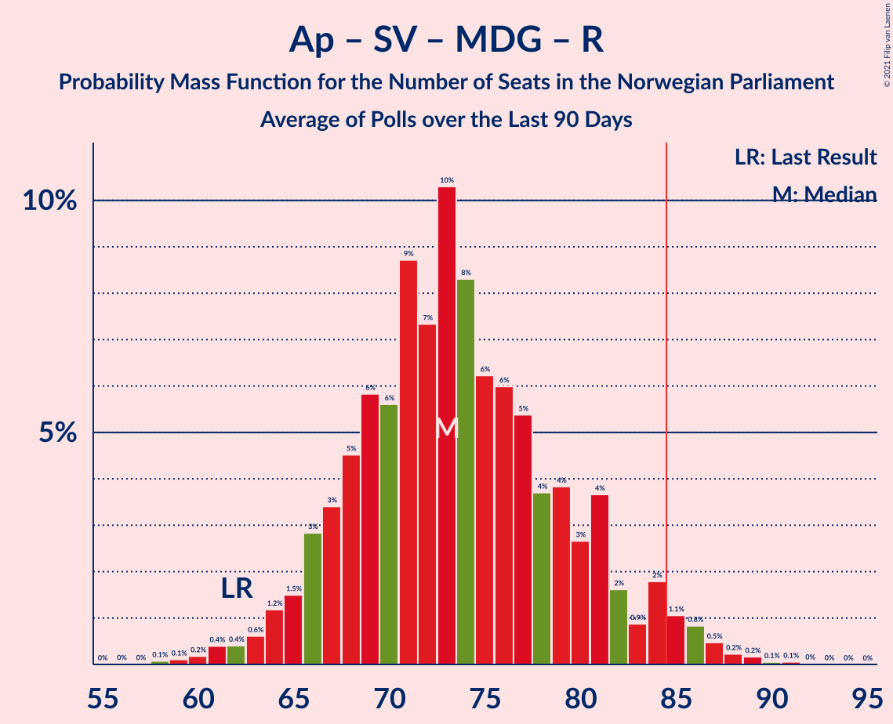

# Poll Average

<a href="#voting-intentions">Voting Intentions</a> | <a href="#seats">Seats</a> | <a href="#coalitions">Coalitions</a> | <a href="#technical-information">Technical Information</a>

## Summary

The table below lists the polls on which the average is based. They are the most recent polls (less than 90 days old) registered and analyzed so far.

| Period     | Polling firm/Commissioner(s) | Ap | H | FrP | Sp | SV | V | KrF | MDG | R |
|:----------:|:----------------------------:|:--:|:--:|:--:|:--:|:--:|:--:|:--:|:--:|:--:|
| 8–9 September 2013 | General Election | 27.4%   49 | 25.0%   45 | 15.2%   27 | 10.3%   19 | 6.0%   11 | 4.4%   8 | 4.2%   8 | 3.2%   1 | 2.4%   1 |
| N/A | Poll Average | 20–29%   39–53 | 17–23%   30–42 | 8–13%   13–24 | 10–21%   18–39 | 7–12%   11–20 | 3–6%   2–10 | 2–5%   1–9 | 3–8%   1–13 | 3–7%   2–12 |
| [22–25 August 2021](2021-08-25-KantarTNS.html) | Kantar TNS   TV2 | 20–25%   38–46 | 18–23%   33–42 | 9–13%   15–22 | 9–13%   17–24 | 8–12%   12–19 | 4–6%   2–10 | 3–5%   2–8 | 4–7%   3–11 | 5–8%   8–12 |
| [16–22 August 2021](2021-08-22-Norstat.html) | Norstat   Aftenposten | 23–30%   43–57 | 16–22%   28–40 | 8–13%   14–24 | 10–16%   18–29 | 7–12%   12–21 | 3–6%   2–9 | 2–5%   1–9 | 4–7%   2–12 | 3–7%   2–11 |
| [17–18 August 2021](2021-08-18-Sentio.html) | Sentio   Nettavisen | 21–27%   41–50 | 17–22%   29–38 | 8–12%   13–20 | 11–15%   20–31 | 7–11%   11–18 | 3–5%   2–8 | 3–5%   1–8 | 6–9%   9–14 | 4–7%   6–11 |
| [13–18 August 2021](2021-08-18-ResponsAnalyse.html) | Respons Analyse   Bergens Tidende and VG | 22–28%   41–50 | 18–23%   32–41 | 10–14%   17–25 | 9–13%   17–24 | 8–11%   12–20 | 4–7%   2–11 | 3–6%   2–9 | 5–7%   8–13 | 4–6%   2–10 |
| [3–8 August 2021](2021-08-08-OpinionPerduco.html) | Opinion Perduco   Avisenes Nyhetsbyrå, Dagsavisen and FriFagbevegelse | 20–26%   37–48 | 18–24%   33–45 | 7–12%   12–21 | 17–22%   31–41 | 7–11%   11–20 | 3–5%   2–10 | 3–6%   1–10 | 2–5%   1–9 | 3–5%   1–10 |
| [3–4 August 2021](2021-08-04-Norfakta.html) | Norfakta   Klassekampen and Nationen | 21–27%   38–49 | 18–24%   32–43 | 9–13%   15–24 | 13–19%   24–35 | 7–11%   12–19 | 3–6%   2–11 | 2–4%   0–7 | 3–6%   2–11 | 4–7%   2–12 |
| 8–9 September 2013 | General Election | 27.4%   49 | 25.0%   45 | 15.2%   27 | 10.3%   19 | 6.0%   11 | 4.4%   8 | 4.2%   8 | 3.2%   1 | 2.4%   1 |

Only polls for which at least the sample size has been published are included in the table above.

**Legend:**
+ **Top half of each row:** Voting intentions (95% confidence interval)
+ **Bottom half of each row:** Seat projections for the Norwegian Parliament (95% confidence interval)
+ **Ap:** Arbeiderpartiet
+ **H:** Høyre
+ **FrP:** Fremskrittspartiet
+ **Sp:** Senterpartiet
+ **SV:** Sosialistisk Venstreparti
+ **V:** Venstre
+ **KrF:** Kristelig Folkeparti
+ **MDG:** Miljøpartiet De Grønne
+ **R:** Rødt
+ **N/A (single party):** Party not included the published results
+ **N/A (entire row):** Calculation for this opinion poll not started yet

## Voting Intentions

### Confidence Intervals

| Party | Last Result | Median | 80% Confidence Interval | 90% Confidence Interval | 95% Confidence Interval | 99% Confidence Interval |
|:-----:|:-----------:|:------:|:-----------------------:|:-----------------------:|:-----------------------:|:-----------------------:|
| <a href="#arbeiderpartiet">Arbeiderpartiet</a> | 27.4% | 24.0% | 21.6–26.9% |21.0–27.9% | 20.5–28.7% | 19.5–30.2% |
| <a href="#høyre">Høyre</a> | 25.0% | 20.2% | 18.1–22.3% |17.6–22.9% | 17.0–23.4% | 16.1–24.5% |
| <a href="#fremskrittspartiet">Fremskrittspartiet</a> | 15.2% | 10.5% | 8.9–12.2% |8.5–12.7% | 8.1–13.1% | 7.4–13.9% |
| <a href="#senterpartiet">Senterpartiet</a> | 10.3% | 13.1% | 10.7–19.0% |10.2–20.1% | 9.9–20.8% | 9.2–22.1% |
| <a href="#sosialistisk-venstreparti">Sosialistisk Venstreparti</a> | 6.0% | 9.3% | 7.9–10.8% |7.5–11.2% | 7.2–11.6% | 6.6–12.4% |
| <a href="#venstre">Venstre</a> | 4.4% | 4.4% | 3.3–5.5% |3.1–5.9% | 2.8–6.2% | 2.5–6.7% |
| <a href="#kristelig-folkeparti">Kristelig Folkeparti</a> | 4.2% | 3.8% | 2.8–4.8% |2.5–5.1% | 2.3–5.4% | 1.9–5.9% |
| <a href="#miljøpartiet-de-grønne">Miljøpartiet De Grønne</a> | 3.2% | 5.3% | 3.6–7.2% |3.2–7.8% | 2.9–8.2% | 2.5–8.9% |
| <a href="#rødt">Rødt</a> | 2.4% | 5.1% | 3.8–6.6% |3.4–7.0% | 3.1–7.3% | 2.7–8.0% |

### Arbeiderpartiet

*For a full overview of the results for this party, see the [Arbeiderpartiet](party-arbeiderpartiet.html) page.*

| Voting Intentions | Probability | Accumulated | Special Marks |
|:-----------------:|:-----------:|:-----------:|:-------------:|
| 17.5–18.5% | 0.1% | 100% |  |
| 18.5–19.5% | 0.5% | 99.9% |  |
| 19.5–20.5% | 2% | 99.5% |  |
| 20.5–21.5% | 7% | 97% |  |
| 21.5–22.5% | 14% | 90% |  |
| 22.5–23.5% | 19% | 77% |  |
| 23.5–24.5% | 20% | 58% | Median |
| 24.5–25.5% | 16% | 39% |  |
| 25.5–26.5% | 10% | 23% |  |
| 26.5–27.5% | 6% | 13% | Last Result |
| 27.5–28.5% | 3% | 6% |  |
| 28.5–29.5% | 2% | 3% |  |
| 29.5–30.5% | 0.7% | 1.1% |  |
| 30.5–31.5% | 0.2% | 0.3% |  |
| 31.5–32.5% | 0.1% | 0.1% |  |
| 32.5–33.5% | 0% | 0% |  |

### Høyre

*For a full overview of the results for this party, see the [Høyre](party-høyre.html) page.*

| Voting Intentions | Probability | Accumulated | Special Marks |
|:-----------------:|:-----------:|:-----------:|:-------------:|
| 13.5–14.5% | 0% | 100% |  |
| 14.5–15.5% | 0.2% | 100% |  |
| 15.5–16.5% | 1.0% | 99.8% |  |
| 16.5–17.5% | 4% | 98.8% |  |
| 17.5–18.5% | 10% | 95% |  |
| 18.5–19.5% | 19% | 85% |  |
| 19.5–20.5% | 24% | 66% | Median |
| 20.5–21.5% | 21% | 42% |  |
| 21.5–22.5% | 13% | 20% |  |
| 22.5–23.5% | 5% | 7% |  |
| 23.5–24.5% | 2% | 2% |  |
| 24.5–25.5% | 0.4% | 0.4% | Last Result |
| 25.5–26.5% | 0.1% | 0.1% |  |
| 26.5–27.5% | 0% | 0% |  |

### Fremskrittspartiet

*For a full overview of the results for this party, see the [Fremskrittspartiet](party-fremskrittspartiet.html) page.*

| Voting Intentions | Probability | Accumulated | Special Marks |
|:-----------------:|:-----------:|:-----------:|:-------------:|
| 5.5–6.5% | 0% | 100% |  |
| 6.5–7.5% | 0.7% | 100% |  |
| 7.5–8.5% | 5% | 99.3% |  |
| 8.5–9.5% | 17% | 94% |  |
| 9.5–10.5% | 28% | 77% |  |
| 10.5–11.5% | 27% | 49% | Median |
| 11.5–12.5% | 16% | 22% |  |
| 12.5–13.5% | 5% | 6% |  |
| 13.5–14.5% | 1.0% | 1.1% |  |
| 14.5–15.5% | 0.1% | 0.1% | Last Result |
| 15.5–16.5% | 0% | 0% |  |

### Senterpartiet

*For a full overview of the results for this party, see the [Senterpartiet](party-senterpartiet.html) page.*

| Voting Intentions | Probability | Accumulated | Special Marks |
|:-----------------:|:-----------:|:-----------:|:-------------:|
| 7.5–8.5% | 0.1% | 100% |  |
| 8.5–9.5% | 1.2% | 99.9% |  |
| 9.5–10.5% | 7% | 98.7% | Last Result |
| 10.5–11.5% | 16% | 92% |  |
| 11.5–12.5% | 17% | 76% |  |
| 12.5–13.5% | 14% | 59% | Median |
| 13.5–14.5% | 10% | 45% |  |
| 14.5–15.5% | 7% | 35% |  |
| 15.5–16.5% | 6% | 27% |  |
| 16.5–17.5% | 5% | 21% |  |
| 17.5–18.5% | 5% | 17% |  |
| 18.5–19.5% | 5% | 12% |  |
| 19.5–20.5% | 4% | 7% |  |
| 20.5–21.5% | 2% | 3% |  |
| 21.5–22.5% | 0.8% | 1.1% |  |
| 22.5–23.5% | 0.2% | 0.3% |  |
| 23.5–24.5% | 0% | 0% |  |

### Sosialistisk Venstreparti

*For a full overview of the results for this party, see the [Sosialistisk Venstreparti](party-sosialistiskvenstreparti.html) page.*

| Voting Intentions | Probability | Accumulated | Special Marks |
|:-----------------:|:-----------:|:-----------:|:-------------:|
| 4.5–5.5% | 0% | 100% |  |
| 5.5–6.5% | 0.4% | 100% | Last Result |
| 6.5–7.5% | 5% | 99.6% |  |
| 7.5–8.5% | 20% | 95% |  |
| 8.5–9.5% | 34% | 74% | Median |
| 9.5–10.5% | 27% | 40% |  |
| 10.5–11.5% | 11% | 13% |  |
| 11.5–12.5% | 2% | 3% |  |
| 12.5–13.5% | 0.3% | 0.3% |  |
| 13.5–14.5% | 0% | 0% |  |

### Venstre

*For a full overview of the results for this party, see the [Venstre](party-venstre.html) page.*

| Voting Intentions | Probability | Accumulated | Special Marks |
|:-----------------:|:-----------:|:-----------:|:-------------:|
| 0.5–1.5% | 0% | 100% |  |
| 1.5–2.5% | 0.7% | 100% |  |
| 2.5–3.5% | 16% | 99.3% |  |
| 3.5–4.5% | 41% | 83% | Last Result, Median |
| 4.5–5.5% | 32% | 42% |  |
| 5.5–6.5% | 9% | 10% |  |
| 6.5–7.5% | 0.8% | 0.8% |  |
| 7.5–8.5% | 0% | 0% |  |

### Kristelig Folkeparti

*For a full overview of the results for this party, see the [Kristelig Folkeparti](party-kristeligfolkeparti.html) page.*

| Voting Intentions | Probability | Accumulated | Special Marks |
|:-----------------:|:-----------:|:-----------:|:-------------:|
| 0.5–1.5% | 0% | 100% |  |
| 1.5–2.5% | 5% | 100% |  |
| 2.5–3.5% | 31% | 95% |  |
| 3.5–4.5% | 47% | 64% | Last Result, Median |
| 4.5–5.5% | 16% | 17% |  |
| 5.5–6.5% | 2% | 2% |  |
| 6.5–7.5% | 0.1% | 0.1% |  |
| 7.5–8.5% | 0% | 0% |  |

### Miljøpartiet De Grønne

*For a full overview of the results for this party, see the [Miljøpartiet De Grønne](party-miljøpartietdegrønne.html) page.*

| Voting Intentions | Probability | Accumulated | Special Marks |
|:-----------------:|:-----------:|:-----------:|:-------------:|
| 0.5–1.5% | 0% | 100% |  |
| 1.5–2.5% | 0.7% | 100% |  |
| 2.5–3.5% | 8% | 99.3% | Last Result |
| 3.5–4.5% | 19% | 91% |  |
| 4.5–5.5% | 29% | 72% | Median |
| 5.5–6.5% | 24% | 43% |  |
| 6.5–7.5% | 13% | 20% |  |
| 7.5–8.5% | 6% | 7% |  |
| 8.5–9.5% | 1.1% | 1.1% |  |
| 9.5–10.5% | 0.1% | 0.1% |  |
| 10.5–11.5% | 0% | 0% |  |

### Rødt

*For a full overview of the results for this party, see the [Rødt](party-rødt.html) page.*

| Voting Intentions | Probability | Accumulated | Special Marks |
|:-----------------:|:-----------:|:-----------:|:-------------:|
| 0.5–1.5% | 0% | 100% |  |
| 1.5–2.5% | 0.3% | 100% | Last Result |
| 2.5–3.5% | 6% | 99.7% |  |
| 3.5–4.5% | 24% | 93% |  |
| 4.5–5.5% | 35% | 69% | Median |
| 5.5–6.5% | 24% | 35% |  |
| 6.5–7.5% | 9% | 10% |  |
| 7.5–8.5% | 1.5% | 2% |  |
| 8.5–9.5% | 0.1% | 0.1% |  |
| 9.5–10.5% | 0% | 0% |  |

## Seats

### Confidence Intervals

| Party | Last Result | Median | 80% Confidence Interval | 90% Confidence Interval | 95% Confidence Interval | 99% Confidence Interval |
|:-----:|:-----------:|:------:|:-----------------------:|:-----------------------:|:-----------------------:|:-----------------------:|
| <a href="#arbeiderpartiet">Arbeiderpartiet</a> | 49 | 44 | 41–49 |40–51 | 39–53 | 36–57 |
| <a href="#høyre">Høyre</a> | 45 | 36 | 32–40 |31–41 | 30–42 | 28–45 |
| <a href="#fremskrittspartiet">Fremskrittspartiet</a> | 27 | 18 | 15–21 |14–23 | 13–24 | 12–25 |
| <a href="#senterpartiet">Senterpartiet</a> | 19 | 24 | 19–36 |18–37 | 18–39 | 16–41 |
| <a href="#sosialistisk-venstreparti">Sosialistisk Venstreparti</a> | 11 | 16 | 13–18 |12–19 | 11–20 | 10–21 |
| <a href="#venstre">Venstre</a> | 8 | 7 | 2–9 |2–10 | 2–10 | 2–11 |
| <a href="#kristelig-folkeparti">Kristelig Folkeparti</a> | 8 | 3 | 1–8 |1–8 | 1–9 | 0–10 |
| <a href="#miljøpartiet-de-grønne">Miljøpartiet De Grønne</a> | 1 | 9 | 2–11 |2–12 | 1–13 | 1–14 |
| <a href="#rødt">Rødt</a> | 1 | 8 | 2–11 |2–11 | 2–12 | 1–13 |

### Arbeiderpartiet

*For a full overview of the results for this party, see the [Arbeiderpartiet](party-arbeiderpartiet.html) page.*

| Number of Seats | Probability | Accumulated | Special Marks |
|:---------------:|:-----------:|:-----------:|:-------------:|
| 34 | 0.1% | 100% |  |
| 35 | 0.1% | 99.9% |  |
| 36 | 0.3% | 99.7% |  |
| 37 | 0.4% | 99.4% |  |
| 38 | 1.0% | 99.0% |  |
| 39 | 2% | 98% |  |
| 40 | 6% | 96% |  |
| 41 | 15% | 90% |  |
| 42 | 10% | 75% |  |
| 43 | 14% | 65% |  |
| 44 | 14% | 51% | Median |
| 45 | 10% | 37% |  |
| 46 | 8% | 26% |  |
| 47 | 4% | 19% |  |
| 48 | 3% | 15% |  |
| 49 | 2% | 12% | Last Result |
| 50 | 3% | 10% |  |
| 51 | 3% | 7% |  |
| 52 | 1.2% | 4% |  |
| 53 | 0.6% | 3% |  |
| 54 | 0.5% | 2% |  |
| 55 | 0.6% | 2% |  |
| 56 | 0.6% | 1.3% |  |
| 57 | 0.4% | 0.7% |  |
| 58 | 0.2% | 0.3% |  |
| 59 | 0.1% | 0.1% |  |
| 60 | 0% | 0% |  |

### Høyre

*For a full overview of the results for this party, see the [Høyre](party-høyre.html) page.*

| Number of Seats | Probability | Accumulated | Special Marks |
|:---------------:|:-----------:|:-----------:|:-------------:|
| 25 | 0% | 100% |  |
| 26 | 0% | 99.9% |  |
| 27 | 0.1% | 99.9% |  |
| 28 | 0.6% | 99.8% |  |
| 29 | 2% | 99.2% |  |
| 30 | 2% | 98% |  |
| 31 | 2% | 96% |  |
| 32 | 4% | 94% |  |
| 33 | 7% | 90% |  |
| 34 | 9% | 82% |  |
| 35 | 17% | 73% |  |
| 36 | 19% | 56% | Median |
| 37 | 11% | 37% |  |
| 38 | 10% | 27% |  |
| 39 | 5% | 16% |  |
| 40 | 4% | 11% |  |
| 41 | 3% | 7% |  |
| 42 | 2% | 4% |  |
| 43 | 1.1% | 2% |  |
| 44 | 0.4% | 1.0% |  |
| 45 | 0.3% | 0.6% | Last Result |
| 46 | 0.2% | 0.3% |  |
| 47 | 0% | 0.1% |  |
| 48 | 0% | 0% |  |

### Fremskrittspartiet

*For a full overview of the results for this party, see the [Fremskrittspartiet](party-fremskrittspartiet.html) page.*

| Number of Seats | Probability | Accumulated | Special Marks |
|:---------------:|:-----------:|:-----------:|:-------------:|
| 10 | 0.1% | 100% |  |
| 11 | 0.2% | 99.9% |  |
| 12 | 0.7% | 99.7% |  |
| 13 | 2% | 99.0% |  |
| 14 | 4% | 97% |  |
| 15 | 7% | 93% |  |
| 16 | 13% | 86% |  |
| 17 | 15% | 73% |  |
| 18 | 15% | 58% | Median |
| 19 | 16% | 43% |  |
| 20 | 10% | 27% |  |
| 21 | 8% | 17% |  |
| 22 | 4% | 9% |  |
| 23 | 2% | 5% |  |
| 24 | 2% | 3% |  |
| 25 | 0.8% | 1.1% |  |
| 26 | 0.3% | 0.4% |  |
| 27 | 0.1% | 0.1% | Last Result |
| 28 | 0% | 0% |  |

### Senterpartiet

*For a full overview of the results for this party, see the [Senterpartiet](party-senterpartiet.html) page.*

| Number of Seats | Probability | Accumulated | Special Marks |
|:---------------:|:-----------:|:-----------:|:-------------:|
| 15 | 0.2% | 100% |  |
| 16 | 0.4% | 99.7% |  |
| 17 | 2% | 99.3% |  |
| 18 | 6% | 98% |  |
| 19 | 5% | 92% | Last Result |
| 20 | 14% | 86% |  |
| 21 | 13% | 72% |  |
| 22 | 4% | 60% |  |
| 23 | 4% | 55% |  |
| 24 | 3% | 51% | Median |
| 25 | 7% | 48% |  |
| 26 | 4% | 40% |  |
| 27 | 4% | 36% |  |
| 28 | 2% | 32% |  |
| 29 | 5% | 30% |  |
| 30 | 2% | 25% |  |
| 31 | 3% | 24% |  |
| 32 | 3% | 20% |  |
| 33 | 2% | 17% |  |
| 34 | 2% | 15% |  |
| 35 | 3% | 14% |  |
| 36 | 4% | 11% |  |
| 37 | 3% | 7% |  |
| 38 | 1.3% | 4% |  |
| 39 | 1.4% | 3% |  |
| 40 | 0.6% | 1.3% |  |
| 41 | 0.3% | 0.7% |  |
| 42 | 0.1% | 0.4% |  |
| 43 | 0.1% | 0.2% |  |
| 44 | 0.1% | 0.1% |  |
| 45 | 0% | 0% |  |

### Sosialistisk Venstreparti

*For a full overview of the results for this party, see the [Sosialistisk Venstreparti](party-sosialistiskvenstreparti.html) page.*

| Number of Seats | Probability | Accumulated | Special Marks |
|:---------------:|:-----------:|:-----------:|:-------------:|
| 9 | 0.2% | 100% |  |
| 10 | 0.7% | 99.8% |  |
| 11 | 2% | 99.1% | Last Result |
| 12 | 6% | 97% |  |
| 13 | 10% | 91% |  |
| 14 | 10% | 80% |  |
| 15 | 17% | 71% |  |
| 16 | 23% | 54% | Median |
| 17 | 13% | 31% |  |
| 18 | 10% | 17% |  |
| 19 | 4% | 7% |  |
| 20 | 2% | 3% |  |
| 21 | 0.6% | 1.0% |  |
| 22 | 0.3% | 0.4% |  |
| 23 | 0.1% | 0.1% |  |
| 24 | 0% | 0.1% |  |
| 25 | 0% | 0% |  |

### Venstre

*For a full overview of the results for this party, see the [Venstre](party-venstre.html) page.*

| Number of Seats | Probability | Accumulated | Special Marks |
|:---------------:|:-----------:|:-----------:|:-------------:|
| 1 | 0.3% | 100% |  |
| 2 | 32% | 99.7% |  |
| 3 | 3% | 67% |  |
| 4 | 0.1% | 65% |  |
| 5 | 0.1% | 65% |  |
| 6 | 5% | 65% |  |
| 7 | 18% | 60% | Median |
| 8 | 22% | 42% | Last Result |
| 9 | 15% | 20% |  |
| 10 | 4% | 6% |  |
| 11 | 1.4% | 2% |  |
| 12 | 0.3% | 0.3% |  |
| 13 | 0% | 0.1% |  |
| 14 | 0% | 0% |  |

### Kristelig Folkeparti

*For a full overview of the results for this party, see the [Kristelig Folkeparti](party-kristeligfolkeparti.html) page.*

| Number of Seats | Probability | Accumulated | Special Marks |
|:---------------:|:-----------:|:-----------:|:-------------:|
| 0 | 2% | 100% |  |
| 1 | 14% | 98% |  |
| 2 | 12% | 84% |  |
| 3 | 34% | 72% | Median |
| 4 | 0% | 38% |  |
| 5 | 0.2% | 38% |  |
| 6 | 9% | 38% |  |
| 7 | 18% | 30% |  |
| 8 | 7% | 12% | Last Result |
| 9 | 3% | 4% |  |
| 10 | 1.2% | 1.5% |  |
| 11 | 0.3% | 0.3% |  |
| 12 | 0% | 0% |  |

### Miljøpartiet De Grønne

*For a full overview of the results for this party, see the [Miljøpartiet De Grønne](party-miljøpartietdegrønne.html) page.*

| Number of Seats | Probability | Accumulated | Special Marks |
|:---------------:|:-----------:|:-----------:|:-------------:|
| 1 | 3% | 100% | Last Result |
| 2 | 12% | 97% |  |
| 3 | 1.2% | 86% |  |
| 4 | 0.7% | 84% |  |
| 5 | 0% | 84% |  |
| 6 | 1.4% | 84% |  |
| 7 | 11% | 82% |  |
| 8 | 21% | 71% |  |
| 9 | 15% | 50% | Median |
| 10 | 14% | 35% |  |
| 11 | 12% | 21% |  |
| 12 | 5% | 9% |  |
| 13 | 3% | 4% |  |
| 14 | 0.8% | 1.1% |  |
| 15 | 0.2% | 0.3% |  |
| 16 | 0.1% | 0.1% |  |
| 17 | 0% | 0% |  |

### Rødt

*For a full overview of the results for this party, see the [Rødt](party-rødt.html) page.*

| Number of Seats | Probability | Accumulated | Special Marks |
|:---------------:|:-----------:|:-----------:|:-------------:|
| 1 | 1.0% | 100% | Last Result |
| 2 | 15% | 99.0% |  |
| 3 | 0.1% | 84% |  |
| 4 | 0% | 84% |  |
| 5 | 0% | 84% |  |
| 6 | 2% | 84% |  |
| 7 | 13% | 83% |  |
| 8 | 23% | 69% | Median |
| 9 | 22% | 46% |  |
| 10 | 14% | 24% |  |
| 11 | 7% | 10% |  |
| 12 | 2% | 3% |  |
| 13 | 0.6% | 0.8% |  |
| 14 | 0.2% | 0.2% |  |
| 15 | 0% | 0% |  |

## Coalitions

### Confidence Intervals

| Coalition | Last Result | Median | Majority? | 80% Confidence Interval | 90% Confidence Interval | 95% Confidence Interval | 99% Confidence Interval |
|:---------:|:-----------:|:------:|:---------:|:-----------------------:|:-----------------------:|:-----------------------:|:-----------------------:|
| Arbeiderpartiet – Senterpartiet – Sosialistisk Venstreparti – Miljøpartiet De Grønne – Rødt | 81 | 101 | 100% | 94–107 | 92–109 | 91–111 | 89–114 |
| Arbeiderpartiet – Senterpartiet – Sosialistisk Venstreparti – Kristelig Folkeparti – Miljøpartiet De Grønne | 88 | 97 | 99.0% | 89–104 | 87–107 | 86–108 | 83–112 |
| Høyre – Fremskrittspartiet – Senterpartiet – Venstre – Kristelig Folkeparti | 107 | 89 | 74% | 81–100 | 79–102 | 77–105 | 74–109 |
| Arbeiderpartiet – Senterpartiet – Sosialistisk Venstreparti – Rødt | 80 | 92 | 93% | 86–100 | 84–103 | 83–104 | 81–108 |
| Arbeiderpartiet – Senterpartiet – Sosialistisk Venstreparti – Miljøpartiet De Grønne | 80 | 93 | 93% | 86–100 | 84–102 | 82–104 | 80–107 |
| Arbeiderpartiet – Senterpartiet – Sosialistisk Venstreparti | 79 | 84 | 50% | 77–94 | 75–96 | 75–99 | 72–102 |
| Arbeiderpartiet – Senterpartiet – Kristelig Folkeparti – Miljøpartiet De Grønne | 77 | 82 | 34% | 73–89 | 71–91 | 70–92 | 68–96 |
| Arbeiderpartiet – Senterpartiet – Kristelig Folkeparti | 76 | 73 | 7% | 65–83 | 63–86 | 62–88 | 60–90 |
| Arbeiderpartiet – Sosialistisk Venstreparti – Miljøpartiet De Grønne – Rødt | 62 | 76 | 5% | 67–82 | 63–84 | 60–86 | 58–90 |
| Høyre – Fremskrittspartiet – Venstre – Kristelig Folkeparti – Miljøpartiet De Grønne | 89 | 72 | 2% | 65–81 | 63–83 | 62–84 | 59–87 |
| Arbeiderpartiet – Senterpartiet | 68 | 69 | 0.6% | 61–78 | 59–80 | 59–81 | 57–85 |
| Høyre – Fremskrittspartiet – Venstre – Kristelig Folkeparti | 88 | 64 | 0% | 57–72 | 55–73 | 54–75 | 51–77 |
| Høyre – Fremskrittspartiet – Venstre | 80 | 61 | 0% | 52–67 | 51–68 | 50–70 | 48–72 |
| Arbeiderpartiet – Sosialistisk Venstreparti | 60 | 59 | 0% | 55–65 | 54–68 | 53–69 | 51–73 |
| Høyre – Fremskrittspartiet | 72 | 54 | 0% | 49–59 | 48–61 | 47–62 | 44–64 |
| Høyre – Venstre – Kristelig Folkeparti | 61 | 46 | 0% | 39–52 | 38–53 | 37–54 | 34–57 |
| Senterpartiet – Venstre – Kristelig Folkeparti | 35 | 34 | 0% | 28–45 | 26–48 | 25–50 | 23–54 |

### Arbeiderpartiet – Senterpartiet – Sosialistisk Venstreparti – Miljøpartiet De Grønne – Rødt

| Number of Seats | Probability | Accumulated | Special Marks |
|:---------------:|:-----------:|:-----------:|:-------------:|
| 81 | 0% | 100% | Last Result |
| 82 | 0% | 100% |  |
| 83 | 0% | 100% |  |
| 84 | 0% | 100% |  |
| 85 | 0% | 100% | Majority |
| 86 | 0% | 99.9% |  |
| 87 | 0.1% | 99.9% |  |
| 88 | 0.2% | 99.8% |  |
| 89 | 0.4% | 99.7% |  |
| 90 | 0.5% | 99.2% |  |
| 91 | 1.5% | 98.7% |  |
| 92 | 2% | 97% |  |
| 93 | 2% | 95% |  |
| 94 | 4% | 93% |  |
| 95 | 4% | 89% |  |
| 96 | 5% | 85% |  |
| 97 | 9% | 80% |  |
| 98 | 7% | 71% |  |
| 99 | 6% | 64% |  |
| 100 | 6% | 58% |  |
| 101 | 6% | 52% | Median |
| 102 | 9% | 46% |  |
| 103 | 5% | 37% |  |
| 104 | 6% | 32% |  |
| 105 | 5% | 27% |  |
| 106 | 7% | 21% |  |
| 107 | 5% | 14% |  |
| 108 | 3% | 9% |  |
| 109 | 1.4% | 6% |  |
| 110 | 2% | 5% |  |
| 111 | 1.2% | 3% |  |
| 112 | 0.4% | 2% |  |
| 113 | 0.6% | 1.2% |  |
| 114 | 0.2% | 0.6% |  |
| 115 | 0.2% | 0.3% |  |
| 116 | 0.1% | 0.2% |  |
| 117 | 0.1% | 0.1% |  |
| 118 | 0% | 0% |  |

### Arbeiderpartiet – Senterpartiet – Sosialistisk Venstreparti – Kristelig Folkeparti – Miljøpartiet De Grønne

| Number of Seats | Probability | Accumulated | Special Marks |
|:---------------:|:-----------:|:-----------:|:-------------:|
| 81 | 0.1% | 100% |  |
| 82 | 0.1% | 99.9% |  |
| 83 | 0.3% | 99.8% |  |
| 84 | 0.4% | 99.5% |  |
| 85 | 0.5% | 99.0% | Majority |
| 86 | 2% | 98.5% |  |
| 87 | 1.4% | 96% |  |
| 88 | 2% | 95% | Last Result |
| 89 | 3% | 93% |  |
| 90 | 3% | 90% |  |
| 91 | 3% | 87% |  |
| 92 | 3% | 84% |  |
| 93 | 4% | 81% |  |
| 94 | 5% | 77% |  |
| 95 | 6% | 71% |  |
| 96 | 8% | 65% | Median |
| 97 | 7% | 57% |  |
| 98 | 7% | 50% |  |
| 99 | 8% | 43% |  |
| 100 | 7% | 35% |  |
| 101 | 5% | 28% |  |
| 102 | 5% | 23% |  |
| 103 | 5% | 18% |  |
| 104 | 4% | 13% |  |
| 105 | 2% | 9% |  |
| 106 | 2% | 7% |  |
| 107 | 2% | 5% |  |
| 108 | 1.0% | 3% |  |
| 109 | 1.0% | 2% |  |
| 110 | 0.4% | 1.5% |  |
| 111 | 0.3% | 1.0% |  |
| 112 | 0.2% | 0.7% |  |
| 113 | 0.2% | 0.5% |  |
| 114 | 0.1% | 0.2% |  |
| 115 | 0.1% | 0.1% |  |
| 116 | 0% | 0.1% |  |
| 117 | 0% | 0% |  |

### Høyre – Fremskrittspartiet – Senterpartiet – Venstre – Kristelig Folkeparti

| Number of Seats | Probability | Accumulated | Special Marks |
|:---------------:|:-----------:|:-----------:|:-------------:|
| 71 | 0% | 100% |  |
| 72 | 0.1% | 99.9% |  |
| 73 | 0.2% | 99.8% |  |
| 74 | 0.4% | 99.6% |  |
| 75 | 0.4% | 99.2% |  |
| 76 | 1.2% | 98.9% |  |
| 77 | 0.8% | 98% |  |
| 78 | 1.2% | 97% |  |
| 79 | 3% | 96% |  |
| 80 | 2% | 93% |  |
| 81 | 4% | 91% |  |
| 82 | 4% | 87% |  |
| 83 | 4% | 83% |  |
| 84 | 5% | 78% |  |
| 85 | 6% | 74% | Majority |
| 86 | 6% | 67% |  |
| 87 | 5% | 61% |  |
| 88 | 5% | 56% | Median |
| 89 | 4% | 51% |  |
| 90 | 4% | 47% |  |
| 91 | 4% | 43% |  |
| 92 | 5% | 39% |  |
| 93 | 5% | 34% |  |
| 94 | 3% | 29% |  |
| 95 | 6% | 26% |  |
| 96 | 3% | 20% |  |
| 97 | 2% | 17% |  |
| 98 | 2% | 15% |  |
| 99 | 2% | 13% |  |
| 100 | 2% | 11% |  |
| 101 | 2% | 9% |  |
| 102 | 2% | 7% |  |
| 103 | 1.2% | 5% |  |
| 104 | 0.7% | 4% |  |
| 105 | 0.7% | 3% |  |
| 106 | 0.4% | 2% |  |
| 107 | 0.9% | 2% | Last Result |
| 108 | 0.3% | 1.1% |  |
| 109 | 0.3% | 0.7% |  |
| 110 | 0.2% | 0.4% |  |
| 111 | 0.2% | 0.3% |  |
| 112 | 0% | 0.1% |  |
| 113 | 0% | 0.1% |  |
| 114 | 0% | 0% |  |

### Arbeiderpartiet – Senterpartiet – Sosialistisk Venstreparti – Rødt

| Number of Seats | Probability | Accumulated | Special Marks |
|:---------------:|:-----------:|:-----------:|:-------------:|
| 77 | 0% | 100% |  |
| 78 | 0.1% | 99.9% |  |
| 79 | 0.1% | 99.9% |  |
| 80 | 0.2% | 99.8% | Last Result |
| 81 | 0.4% | 99.6% |  |
| 82 | 0.7% | 99.2% |  |
| 83 | 2% | 98.5% |  |
| 84 | 4% | 97% |  |
| 85 | 2% | 93% | Majority |
| 86 | 5% | 91% |  |
| 87 | 6% | 86% |  |
| 88 | 7% | 80% |  |
| 89 | 5% | 73% |  |
| 90 | 8% | 67% |  |
| 91 | 6% | 60% |  |
| 92 | 5% | 54% | Median |
| 93 | 5% | 49% |  |
| 94 | 5% | 45% |  |
| 95 | 6% | 40% |  |
| 96 | 5% | 33% |  |
| 97 | 6% | 28% |  |
| 98 | 5% | 23% |  |
| 99 | 4% | 18% |  |
| 100 | 4% | 14% |  |
| 101 | 2% | 10% |  |
| 102 | 2% | 8% |  |
| 103 | 1.4% | 6% |  |
| 104 | 2% | 4% |  |
| 105 | 0.9% | 2% |  |
| 106 | 0.3% | 1.4% |  |
| 107 | 0.6% | 1.1% |  |
| 108 | 0.3% | 0.6% |  |
| 109 | 0.2% | 0.3% |  |
| 110 | 0.1% | 0.1% |  |
| 111 | 0% | 0% |  |

### Arbeiderpartiet – Senterpartiet – Sosialistisk Venstreparti – Miljøpartiet De Grønne

| Number of Seats | Probability | Accumulated | Special Marks |
|:---------------:|:-----------:|:-----------:|:-------------:|
| 77 | 0% | 100% |  |
| 78 | 0.1% | 99.9% |  |
| 79 | 0.2% | 99.8% |  |
| 80 | 0.4% | 99.7% | Last Result |
| 81 | 0.7% | 99.3% |  |
| 82 | 1.2% | 98.6% |  |
| 83 | 2% | 97% |  |
| 84 | 2% | 96% |  |
| 85 | 2% | 93% | Majority |
| 86 | 4% | 91% |  |
| 87 | 5% | 87% |  |
| 88 | 5% | 82% |  |
| 89 | 6% | 78% |  |
| 90 | 4% | 72% |  |
| 91 | 5% | 68% |  |
| 92 | 5% | 63% |  |
| 93 | 9% | 58% | Median |
| 94 | 6% | 49% |  |
| 95 | 7% | 43% |  |
| 96 | 8% | 36% |  |
| 97 | 8% | 29% |  |
| 98 | 4% | 21% |  |
| 99 | 4% | 17% |  |
| 100 | 3% | 12% |  |
| 101 | 3% | 9% |  |
| 102 | 2% | 6% |  |
| 103 | 1.5% | 4% |  |
| 104 | 1.1% | 3% |  |
| 105 | 0.6% | 1.5% |  |
| 106 | 0.3% | 0.9% |  |
| 107 | 0.1% | 0.6% |  |
| 108 | 0.3% | 0.5% |  |
| 109 | 0.1% | 0.2% |  |
| 110 | 0% | 0.1% |  |
| 111 | 0.1% | 0.1% |  |
| 112 | 0% | 0% |  |

### Arbeiderpartiet – Senterpartiet – Sosialistisk Venstreparti

| Number of Seats | Probability | Accumulated | Special Marks |
|:---------------:|:-----------:|:-----------:|:-------------:|
| 69 | 0% | 100% |  |
| 70 | 0.1% | 99.9% |  |
| 71 | 0.1% | 99.9% |  |
| 72 | 0.3% | 99.7% |  |
| 73 | 0.5% | 99.5% |  |
| 74 | 1.2% | 98.9% |  |
| 75 | 3% | 98% |  |
| 76 | 2% | 95% |  |
| 77 | 4% | 92% |  |
| 78 | 5% | 88% |  |
| 79 | 6% | 83% | Last Result |
| 80 | 6% | 77% |  |
| 81 | 5% | 70% |  |
| 82 | 6% | 66% |  |
| 83 | 4% | 59% |  |
| 84 | 5% | 55% | Median |
| 85 | 5% | 50% | Majority |
| 86 | 5% | 45% |  |
| 87 | 4% | 40% |  |
| 88 | 5% | 36% |  |
| 89 | 4% | 31% |  |
| 90 | 5% | 27% |  |
| 91 | 3% | 22% |  |
| 92 | 3% | 19% |  |
| 93 | 5% | 16% |  |
| 94 | 3% | 11% |  |
| 95 | 3% | 8% |  |
| 96 | 1.4% | 5% |  |
| 97 | 0.7% | 4% |  |
| 98 | 0.7% | 3% |  |
| 99 | 0.8% | 3% |  |
| 100 | 0.6% | 2% |  |
| 101 | 0.6% | 1.1% |  |
| 102 | 0.2% | 0.5% |  |
| 103 | 0.2% | 0.4% |  |
| 104 | 0.1% | 0.2% |  |
| 105 | 0.1% | 0.1% |  |
| 106 | 0% | 0% |  |

### Arbeiderpartiet – Senterpartiet – Kristelig Folkeparti – Miljøpartiet De Grønne

| Number of Seats | Probability | Accumulated | Special Marks |
|:---------------:|:-----------:|:-----------:|:-------------:|
| 65 | 0.1% | 100% |  |
| 66 | 0.2% | 99.9% |  |
| 67 | 0.1% | 99.7% |  |
| 68 | 0.3% | 99.5% |  |
| 69 | 0.9% | 99.2% |  |
| 70 | 2% | 98% |  |
| 71 | 1.2% | 96% |  |
| 72 | 3% | 95% |  |
| 73 | 2% | 92% |  |
| 74 | 3% | 90% |  |
| 75 | 2% | 86% |  |
| 76 | 3% | 84% |  |
| 77 | 3% | 81% | Last Result |
| 78 | 4% | 78% |  |
| 79 | 6% | 74% |  |
| 80 | 8% | 68% | Median |
| 81 | 6% | 60% |  |
| 82 | 7% | 54% |  |
| 83 | 6% | 46% |  |
| 84 | 6% | 40% |  |
| 85 | 6% | 34% | Majority |
| 86 | 5% | 28% |  |
| 87 | 7% | 23% |  |
| 88 | 4% | 16% |  |
| 89 | 4% | 12% |  |
| 90 | 2% | 8% |  |
| 91 | 2% | 6% |  |
| 92 | 2% | 4% |  |
| 93 | 0.9% | 2% |  |
| 94 | 0.6% | 2% |  |
| 95 | 0.2% | 0.9% |  |
| 96 | 0.3% | 0.7% |  |
| 97 | 0.2% | 0.3% |  |
| 98 | 0.1% | 0.2% |  |
| 99 | 0% | 0.1% |  |
| 100 | 0% | 0% |  |

### Arbeiderpartiet – Senterpartiet – Kristelig Folkeparti

| Number of Seats | Probability | Accumulated | Special Marks |
|:---------------:|:-----------:|:-----------:|:-------------:|
| 58 | 0% | 100% |  |
| 59 | 0.1% | 99.9% |  |
| 60 | 0.4% | 99.8% |  |
| 61 | 1.3% | 99.4% |  |
| 62 | 2% | 98% |  |
| 63 | 3% | 96% |  |
| 64 | 2% | 94% |  |
| 65 | 3% | 92% |  |
| 66 | 2% | 89% |  |
| 67 | 5% | 87% |  |
| 68 | 4% | 82% |  |
| 69 | 5% | 78% |  |
| 70 | 7% | 72% |  |
| 71 | 6% | 66% | Median |
| 72 | 4% | 59% |  |
| 73 | 6% | 55% |  |
| 74 | 6% | 50% |  |
| 75 | 7% | 44% |  |
| 76 | 6% | 37% | Last Result |
| 77 | 4% | 31% |  |
| 78 | 4% | 28% |  |
| 79 | 4% | 23% |  |
| 80 | 3% | 20% |  |
| 81 | 3% | 17% |  |
| 82 | 2% | 14% |  |
| 83 | 2% | 11% |  |
| 84 | 2% | 9% |  |
| 85 | 2% | 7% | Majority |
| 86 | 2% | 5% |  |
| 87 | 1.0% | 4% |  |
| 88 | 1.0% | 3% |  |
| 89 | 0.9% | 2% |  |
| 90 | 0.3% | 0.8% |  |
| 91 | 0.2% | 0.4% |  |
| 92 | 0.1% | 0.2% |  |
| 93 | 0% | 0.1% |  |
| 94 | 0% | 0.1% |  |
| 95 | 0% | 0% |  |

### Arbeiderpartiet – Sosialistisk Venstreparti – Miljøpartiet De Grønne – Rødt

| Number of Seats | Probability | Accumulated | Special Marks |
|:---------------:|:-----------:|:-----------:|:-------------:|
| 55 | 0% | 100% |  |
| 56 | 0.1% | 99.9% |  |
| 57 | 0.2% | 99.9% |  |
| 58 | 0.3% | 99.7% |  |
| 59 | 0.5% | 99.4% |  |
| 60 | 1.5% | 98.9% |  |
| 61 | 0.7% | 97% |  |
| 62 | 1.5% | 97% | Last Result |
| 63 | 0.8% | 95% |  |
| 64 | 1.0% | 94% |  |
| 65 | 0.8% | 93% |  |
| 66 | 1.4% | 93% |  |
| 67 | 1.4% | 91% |  |
| 68 | 2% | 90% |  |
| 69 | 2% | 87% |  |
| 70 | 2% | 85% |  |
| 71 | 3% | 83% |  |
| 72 | 3% | 80% |  |
| 73 | 5% | 77% |  |
| 74 | 9% | 72% |  |
| 75 | 7% | 63% |  |
| 76 | 10% | 56% |  |
| 77 | 10% | 46% | Median |
| 78 | 7% | 37% |  |
| 79 | 6% | 29% |  |
| 80 | 6% | 24% |  |
| 81 | 6% | 18% |  |
| 82 | 4% | 12% |  |
| 83 | 2% | 8% |  |
| 84 | 2% | 6% |  |
| 85 | 2% | 5% | Majority |
| 86 | 0.8% | 3% |  |
| 87 | 0.5% | 2% |  |
| 88 | 0.8% | 2% |  |
| 89 | 0.3% | 1.0% |  |
| 90 | 0.3% | 0.7% |  |
| 91 | 0.1% | 0.4% |  |
| 92 | 0.1% | 0.2% |  |
| 93 | 0% | 0.1% |  |
| 94 | 0.1% | 0.1% |  |
| 95 | 0% | 0.1% |  |
| 96 | 0% | 0% |  |

### Høyre – Fremskrittspartiet – Venstre – Kristelig Folkeparti – Miljøpartiet De Grønne

| Number of Seats | Probability | Accumulated | Special Marks |
|:---------------:|:-----------:|:-----------:|:-------------:|
| 56 | 0% | 100% |  |
| 57 | 0% | 99.9% |  |
| 58 | 0.1% | 99.9% |  |
| 59 | 0.3% | 99.8% |  |
| 60 | 0.9% | 99.5% |  |
| 61 | 0.6% | 98.5% |  |
| 62 | 2% | 98% |  |
| 63 | 3% | 96% |  |
| 64 | 3% | 93% |  |
| 65 | 4% | 90% |  |
| 66 | 4% | 87% |  |
| 67 | 4% | 83% |  |
| 68 | 5% | 79% |  |
| 69 | 7% | 74% |  |
| 70 | 5% | 67% |  |
| 71 | 9% | 62% |  |
| 72 | 9% | 54% |  |
| 73 | 7% | 44% | Median |
| 74 | 6% | 38% |  |
| 75 | 5% | 32% |  |
| 76 | 5% | 27% |  |
| 77 | 4% | 22% |  |
| 78 | 3% | 19% |  |
| 79 | 2% | 16% |  |
| 80 | 2% | 13% |  |
| 81 | 3% | 12% |  |
| 82 | 3% | 8% |  |
| 83 | 2% | 5% |  |
| 84 | 0.9% | 3% |  |
| 85 | 1.2% | 2% | Majority |
| 86 | 0.5% | 1.1% |  |
| 87 | 0.3% | 0.6% |  |
| 88 | 0.1% | 0.3% |  |
| 89 | 0.1% | 0.2% | Last Result |
| 90 | 0.1% | 0.1% |  |
| 91 | 0% | 0% |  |

### Arbeiderpartiet – Senterpartiet

| Number of Seats | Probability | Accumulated | Special Marks |
|:---------------:|:-----------:|:-----------:|:-------------:|
| 55 | 0% | 100% |  |
| 56 | 0.1% | 99.9% |  |
| 57 | 0.5% | 99.8% |  |
| 58 | 0.7% | 99.4% |  |
| 59 | 4% | 98.6% |  |
| 60 | 2% | 94% |  |
| 61 | 4% | 92% |  |
| 62 | 5% | 88% |  |
| 63 | 4% | 83% |  |
| 64 | 6% | 79% |  |
| 65 | 4% | 73% |  |
| 66 | 5% | 69% |  |
| 67 | 4% | 64% |  |
| 68 | 5% | 59% | Last Result, Median |
| 69 | 5% | 55% |  |
| 70 | 5% | 49% |  |
| 71 | 4% | 44% |  |
| 72 | 6% | 40% |  |
| 73 | 4% | 34% |  |
| 74 | 5% | 30% |  |
| 75 | 3% | 25% |  |
| 76 | 5% | 22% |  |
| 77 | 3% | 17% |  |
| 78 | 4% | 13% |  |
| 79 | 3% | 10% |  |
| 80 | 3% | 7% |  |
| 81 | 2% | 4% |  |
| 82 | 0.8% | 2% |  |
| 83 | 0.6% | 1.4% |  |
| 84 | 0.3% | 0.8% |  |
| 85 | 0.1% | 0.6% | Majority |
| 86 | 0.3% | 0.5% |  |
| 87 | 0.1% | 0.2% |  |
| 88 | 0.1% | 0.1% |  |
| 89 | 0% | 0% |  |

### Høyre – Fremskrittspartiet – Venstre – Kristelig Folkeparti

| Number of Seats | Probability | Accumulated | Special Marks |
|:---------------:|:-----------:|:-----------:|:-------------:|
| 48 | 0% | 100% |  |
| 49 | 0.1% | 99.9% |  |
| 50 | 0.1% | 99.9% |  |
| 51 | 0.8% | 99.8% |  |
| 52 | 0.4% | 98.9% |  |
| 53 | 0.9% | 98.5% |  |
| 54 | 2% | 98% |  |
| 55 | 4% | 96% |  |
| 56 | 2% | 92% |  |
| 57 | 2% | 90% |  |
| 58 | 5% | 88% |  |
| 59 | 4% | 83% |  |
| 60 | 5% | 80% |  |
| 61 | 6% | 75% |  |
| 62 | 6% | 69% |  |
| 63 | 8% | 63% |  |
| 64 | 9% | 55% | Median |
| 65 | 7% | 46% |  |
| 66 | 6% | 39% |  |
| 67 | 6% | 33% |  |
| 68 | 5% | 27% |  |
| 69 | 3% | 22% |  |
| 70 | 4% | 19% |  |
| 71 | 4% | 15% |  |
| 72 | 4% | 11% |  |
| 73 | 2% | 7% |  |
| 74 | 2% | 5% |  |
| 75 | 2% | 3% |  |
| 76 | 0.4% | 1.2% |  |
| 77 | 0.5% | 0.8% |  |
| 78 | 0.1% | 0.3% |  |
| 79 | 0.1% | 0.2% |  |
| 80 | 0.1% | 0.1% |  |
| 81 | 0% | 0% |  |
| 82 | 0% | 0% |  |
| 83 | 0% | 0% |  |
| 84 | 0% | 0% |  |
| 85 | 0% | 0% | Majority |
| 86 | 0% | 0% |  |
| 87 | 0% | 0% |  |
| 88 | 0% | 0% | Last Result |

### Høyre – Fremskrittspartiet – Venstre

| Number of Seats | Probability | Accumulated | Special Marks |
|:---------------:|:-----------:|:-----------:|:-------------:|
| 45 | 0.1% | 100% |  |
| 46 | 0.1% | 99.9% |  |
| 47 | 0.1% | 99.8% |  |
| 48 | 0.9% | 99.7% |  |
| 49 | 0.8% | 98.7% |  |
| 50 | 1.5% | 98% |  |
| 51 | 4% | 96% |  |
| 52 | 4% | 93% |  |
| 53 | 3% | 89% |  |
| 54 | 3% | 86% |  |
| 55 | 4% | 83% |  |
| 56 | 5% | 79% |  |
| 57 | 6% | 74% |  |
| 58 | 7% | 68% |  |
| 59 | 6% | 61% |  |
| 60 | 5% | 56% |  |
| 61 | 9% | 51% | Median |
| 62 | 7% | 42% |  |
| 63 | 7% | 35% |  |
| 64 | 7% | 28% |  |
| 65 | 6% | 21% |  |
| 66 | 4% | 15% |  |
| 67 | 3% | 11% |  |
| 68 | 4% | 7% |  |
| 69 | 1.4% | 4% |  |
| 70 | 1.2% | 3% |  |
| 71 | 0.7% | 1.3% |  |
| 72 | 0.2% | 0.6% |  |
| 73 | 0.2% | 0.3% |  |
| 74 | 0.1% | 0.1% |  |
| 75 | 0% | 0% |  |
| 76 | 0% | 0% |  |
| 77 | 0% | 0% |  |
| 78 | 0% | 0% |  |
| 79 | 0% | 0% |  |
| 80 | 0% | 0% | Last Result |

### Arbeiderpartiet – Sosialistisk Venstreparti

| Number of Seats | Probability | Accumulated | Special Marks |
|:---------------:|:-----------:|:-----------:|:-------------:|
| 48 | 0% | 100% |  |
| 49 | 0.1% | 99.9% |  |
| 50 | 0.2% | 99.9% |  |
| 51 | 0.4% | 99.6% |  |
| 52 | 0.6% | 99.2% |  |
| 53 | 2% | 98.7% |  |
| 54 | 3% | 97% |  |
| 55 | 5% | 94% |  |
| 56 | 7% | 90% |  |
| 57 | 14% | 82% |  |
| 58 | 11% | 68% |  |
| 59 | 13% | 57% |  |
| 60 | 11% | 43% | Last Result, Median |
| 61 | 6% | 32% |  |
| 62 | 6% | 27% |  |
| 63 | 5% | 21% |  |
| 64 | 4% | 16% |  |
| 65 | 3% | 12% |  |
| 66 | 2% | 9% |  |
| 67 | 2% | 7% |  |
| 68 | 2% | 5% |  |
| 69 | 0.9% | 3% |  |
| 70 | 0.8% | 2% |  |
| 71 | 0.5% | 2% |  |
| 72 | 0.5% | 1.1% |  |
| 73 | 0.3% | 0.6% |  |
| 74 | 0.2% | 0.3% |  |
| 75 | 0.1% | 0.1% |  |
| 76 | 0% | 0% |  |

### Høyre – Fremskrittspartiet

| Number of Seats | Probability | Accumulated | Special Marks |
|:---------------:|:-----------:|:-----------:|:-------------:|
| 41 | 0% | 100% |  |
| 42 | 0% | 99.9% |  |
| 43 | 0.2% | 99.9% |  |
| 44 | 0.3% | 99.7% |  |
| 45 | 0.4% | 99.4% |  |
| 46 | 1.3% | 99.0% |  |
| 47 | 2% | 98% |  |
| 48 | 3% | 96% |  |
| 49 | 6% | 93% |  |
| 50 | 7% | 87% |  |
| 51 | 6% | 79% |  |
| 52 | 6% | 73% |  |
| 53 | 11% | 67% |  |
| 54 | 11% | 56% | Median |
| 55 | 8% | 45% |  |
| 56 | 9% | 36% |  |
| 57 | 8% | 27% |  |
| 58 | 5% | 19% |  |
| 59 | 4% | 14% |  |
| 60 | 4% | 10% |  |
| 61 | 2% | 5% |  |
| 62 | 1.4% | 3% |  |
| 63 | 0.7% | 2% |  |
| 64 | 0.6% | 1.0% |  |
| 65 | 0.2% | 0.4% |  |
| 66 | 0.1% | 0.2% |  |
| 67 | 0.1% | 0.1% |  |
| 68 | 0% | 0% |  |
| 69 | 0% | 0% |  |
| 70 | 0% | 0% |  |
| 71 | 0% | 0% |  |
| 72 | 0% | 0% | Last Result |

### Høyre – Venstre – Kristelig Folkeparti

| Number of Seats | Probability | Accumulated | Special Marks |
|:---------------:|:-----------:|:-----------:|:-------------:|
| 32 | 0.1% | 100% |  |
| 33 | 0.1% | 99.9% |  |
| 34 | 0.4% | 99.8% |  |
| 35 | 1.0% | 99.4% |  |
| 36 | 0.8% | 98% |  |
| 37 | 2% | 98% |  |
| 38 | 4% | 96% |  |
| 39 | 3% | 92% |  |
| 40 | 3% | 90% |  |
| 41 | 4% | 87% |  |
| 42 | 5% | 83% |  |
| 43 | 5% | 78% |  |
| 44 | 7% | 72% |  |
| 45 | 9% | 66% |  |
| 46 | 10% | 57% | Median |
| 47 | 9% | 47% |  |
| 48 | 8% | 38% |  |
| 49 | 6% | 30% |  |
| 50 | 5% | 24% |  |
| 51 | 7% | 19% |  |
| 52 | 4% | 12% |  |
| 53 | 4% | 8% |  |
| 54 | 2% | 4% |  |
| 55 | 1.0% | 2% |  |
| 56 | 0.7% | 1.5% |  |
| 57 | 0.4% | 0.8% |  |
| 58 | 0.2% | 0.3% |  |
| 59 | 0.1% | 0.2% |  |
| 60 | 0.1% | 0.1% |  |
| 61 | 0% | 0% | Last Result |

### Senterpartiet – Venstre – Kristelig Folkeparti

| Number of Seats | Probability | Accumulated | Special Marks |
|:---------------:|:-----------:|:-----------:|:-------------:|
| 21 | 0.1% | 100% |  |
| 22 | 0.1% | 99.9% |  |
| 23 | 0.4% | 99.8% |  |
| 24 | 1.0% | 99.3% |  |
| 25 | 1.0% | 98% |  |
| 26 | 3% | 97% |  |
| 27 | 2% | 94% |  |
| 28 | 3% | 92% |  |
| 29 | 4% | 89% |  |
| 30 | 8% | 85% |  |
| 31 | 6% | 77% |  |
| 32 | 7% | 71% |  |
| 33 | 7% | 64% |  |
| 34 | 7% | 57% | Median |
| 35 | 6% | 49% | Last Result |
| 36 | 6% | 43% |  |
| 37 | 5% | 37% |  |
| 38 | 5% | 33% |  |
| 39 | 3% | 27% |  |
| 40 | 3% | 24% |  |
| 41 | 3% | 21% |  |
| 42 | 3% | 18% |  |
| 43 | 2% | 15% |  |
| 44 | 2% | 13% |  |
| 45 | 1.5% | 11% |  |
| 46 | 2% | 9% |  |
| 47 | 2% | 7% |  |
| 48 | 1.4% | 5% |  |
| 49 | 0.8% | 4% |  |
| 50 | 0.7% | 3% |  |
| 51 | 0.6% | 2% |  |
| 52 | 0.8% | 2% |  |
| 53 | 0.5% | 1.0% |  |
| 54 | 0.1% | 0.6% |  |
| 55 | 0.2% | 0.5% |  |
| 56 | 0.1% | 0.2% |  |
| 57 | 0% | 0.1% |  |
| 58 | 0% | 0.1% |  |
| 59 | 0% | 0% |  |

## Technical Information

+ **Number of polls included in this average:** 6
+ **Lowest number of simulations done in a poll included in this average:** 1,048,576
+ **Total number of simulations done in the polls included in this average:** 6,291,456
+ **Error estimate:** 1.62%
