# Poll Average

<a href="#voting-intentions">Voting Intentions</a> | <a href="#seats">Seats</a> | <a href="#coalitions">Coalitions</a> | <a href="#technical-information">Technical Information</a>

## Summary

The table below lists the polls on which the average is based. They are the most recent polls (less than 90 days old) registered and analyzed so far.

| Period     | Polling firm/Commissioner(s) | Ap | H | FrP | Sp | SV | V | KrF | MDG | R |
|:----------:|:----------------------------:|:--:|:--:|:--:|:--:|:--:|:--:|:--:|:--:|:--:|
| 8–9 September 2013 | General Election | 27.4%   49 | 25.0%   45 | 15.2%   27 | 10.3%   19 | 6.0%   11 | 4.4%   8 | 4.2%   8 | 3.2%   1 | 2.4%   1 |
| N/A | Poll Average | 20–28%   37–51 | 16–23%   29–40 | 11–16%   19–30 | 13–20%   23–37 | 6–10%   10–18 | 2–5%   0–9 | 2–5%   0–9 | 4–8%   2–15 | 3–6%   1–11 |
| [3–9 March 2020](2020-03-09-OpinionPerduco.html) | Opinion Perduco | 21–27%   38–47 | 17–21%   29–37 | 11–16%   20–28 | 16–21%   29–40 | 5–9%   9–15 | 3–5%   1–8 | 2–4%   0–8 | 5–8%   9–15 | 3–5%   1–9 |
| [3–4 March 2020](2020-03-04-Norfakta.html) | Norfakta   Klasskampen and Nationen | 23–29%   41–50 | 18–23%   31–39 | 10–14%   18–26 | 14–18%   23–33 | 6–9%   10–16 | 2–4%   0–2 | 2–4%   0–7 | 6–9%   10–16 | 4–7%   2–11 |
| [27 February–2 March 2020](2020-03-02-ResponsAnalyse.html) | Respons Analyse   VG | 22–28%   41–49 | 16–20%   27–36 | 13–17%   22–30 | 15–19%   26–33 | 6–9%   10–16 | 2–5%   1–8 | 3–5%   1–8 | 4–7%   2–12 | 4–7%   7–12 |
| [24 February–2 March 2020](2020-03-02-Norstat.html) | Norstat   Aftenposten and NRK | 21–27%   37–48 | 17–23%   29–41 | 11–16%   18–28 | 14–19%   24–36 | 7–11%   10–19 | 2–4%   0–8 | 3–6%   1–9 | 4–7%   2–13 | 3–6%   2–11 |
| [24–28 February 2020](2020-02-28-KantarTNS.html) | Kantar TNS   TV2 | 19–25%   34–44 | 17–23%   29–41 | 11–16%   20–30 | 15–20%   27–37 | 7–11%   12–20 | 3–5%   2–10 | 2–5%   0–8 | 4–7%   7–13 | 3–6%   1–10 |
| [17–19 February 2020](2020-02-19-IpsosMMI.html) | Ipsos MMI   Dagbladet | 23–29%   42–54 | 16–22%   29–40 | 12–17%   20–31 | 12–18%   22–32 | 6–9%   9–17 | 2–5%   1–9 | 2–5%   1–9 | 4–7%   2–13 | 2–5%   1–8 |
| [11–17 February 2020](2020-02-17-Sentio.html) | Sentio   Amedia and Nettavisen | 21–26%   40–48 | 17–22%   31–40 | 13–17%   23–30 | 12–16%   22–29 | 6–9%   10–17 | 3–5%   2–9 | 3–5%   1–9 | 5–9%   9–15 | 3–5%   1–9 |
| 8–9 September 2013 | General Election | 27.4%   49 | 25.0%   45 | 15.2%   27 | 10.3%   19 | 6.0%   11 | 4.4%   8 | 4.2%   8 | 3.2%   1 | 2.4%   1 |

Only polls for which at least the sample size has been published are included in the table above.

**Legend:**
+ **Top half of each row:** Voting intentions (95% confidence interval)
+ **Bottom half of each row:** Seat projections for the Norwegian Parliament (95% confidence interval)
+ **Ap:** Arbeiderpartiet
+ **H:** Høyre
+ **FrP:** Fremskrittspartiet
+ **Sp:** Senterpartiet
+ **SV:** Sosialistisk Venstreparti
+ **V:** Venstre
+ **KrF:** Kristelig Folkeparti
+ **MDG:** Miljøpartiet De Grønne
+ **R:** Rødt
+ **N/A (single party):** Party not included the published results
+ **N/A (entire row):** Calculation for this opinion poll not started yet

## Voting Intentions

### Confidence Intervals

| Party | Last Result | Median | 80% Confidence Interval | 90% Confidence Interval | 95% Confidence Interval | 99% Confidence Interval |
|:-----:|:-----------:|:------:|:-----------------------:|:-----------------------:|:-----------------------:|:-----------------------:|
| <a href="#arbeiderpartiet">Arbeiderpartiet</a> | 27.4% | 24.3% | 21.6–26.8% |20.8–27.4% | 20.1–28.0% | 18.9–29.1% |
| <a href="#høyre">Høyre</a> | 25.0% | 19.4% | 17.4–21.5% |16.8–22.1% | 16.4–22.6% | 15.6–23.5% |
| <a href="#fremskrittspartiet">Fremskrittspartiet</a> | 15.2% | 13.8% | 11.9–15.6% |11.3–16.1% | 10.9–16.5% | 10.2–17.4% |
| <a href="#senterpartiet">Senterpartiet</a> | 10.3% | 16.3% | 13.9–18.8% |13.3–19.4% | 12.8–19.9% | 12.0–20.9% |
| <a href="#sosialistisk-venstreparti">Sosialistisk Venstreparti</a> | 6.0% | 7.5% | 6.3–9.1% |6.0–9.6% | 5.7–10.0% | 5.2–10.9% |
| <a href="#venstre">Venstre</a> | 4.4% | 3.4% | 2.4–4.4% |2.2–4.7% | 2.0–4.9% | 1.7–5.5% |
| <a href="#kristelig-folkeparti">Kristelig Folkeparti</a> | 4.2% | 3.5% | 2.6–4.5% |2.4–4.9% | 2.2–5.2% | 1.9–5.8% |
| <a href="#miljøpartiet-de-grønne">Miljøpartiet De Grønne</a> | 3.2% | 6.0% | 4.6–7.5% |4.3–7.9% | 4.0–8.3% | 3.5–8.9% |
| <a href="#rødt">Rødt</a> | 2.4% | 4.4% | 3.3–5.8% |3.0–6.1% | 2.8–6.4% | 2.4–7.0% |

### Arbeiderpartiet

*For a full overview of the results for this party, see the [Arbeiderpartiet](party-arbeiderpartiet.html) page.*

| Voting Intentions | Probability | Accumulated | Special Marks |
|:-----------------:|:-----------:|:-----------:|:-------------:|
| 16.5–17.5% | 0% | 100% |  |
| 17.5–18.5% | 0.2% | 100% |  |
| 18.5–19.5% | 1.0% | 99.7% |  |
| 19.5–20.5% | 3% | 98.7% |  |
| 20.5–21.5% | 6% | 96% |  |
| 21.5–22.5% | 10% | 90% |  |
| 22.5–23.5% | 15% | 80% |  |
| 23.5–24.5% | 20% | 65% | Median |
| 24.5–25.5% | 19% | 45% |  |
| 25.5–26.5% | 14% | 26% |  |
| 26.5–27.5% | 8% | 12% | Last Result |
| 27.5–28.5% | 3% | 4% |  |
| 28.5–29.5% | 1.0% | 1.2% |  |
| 29.5–30.5% | 0.2% | 0.3% |  |
| 30.5–31.5% | 0% | 0% |  |

### Høyre

*For a full overview of the results for this party, see the [Høyre](party-høyre.html) page.*

| Voting Intentions | Probability | Accumulated | Special Marks |
|:-----------------:|:-----------:|:-----------:|:-------------:|
| 13.5–14.5% | 0% | 100% |  |
| 14.5–15.5% | 0.4% | 100% |  |
| 15.5–16.5% | 3% | 99.5% |  |
| 16.5–17.5% | 9% | 97% |  |
| 17.5–18.5% | 18% | 88% |  |
| 18.5–19.5% | 24% | 70% | Median |
| 19.5–20.5% | 22% | 46% |  |
| 20.5–21.5% | 15% | 24% |  |
| 21.5–22.5% | 7% | 9% |  |
| 22.5–23.5% | 2% | 3% |  |
| 23.5–24.5% | 0.4% | 0.5% |  |
| 24.5–25.5% | 0.1% | 0.1% | Last Result |
| 25.5–26.5% | 0% | 0% |  |

### Fremskrittspartiet

*For a full overview of the results for this party, see the [Fremskrittspartiet](party-fremskrittspartiet.html) page.*

| Voting Intentions | Probability | Accumulated | Special Marks |
|:-----------------:|:-----------:|:-----------:|:-------------:|
| 7.5–8.5% | 0% | 100% |  |
| 8.5–9.5% | 0.1% | 100% |  |
| 9.5–10.5% | 1.1% | 99.9% |  |
| 10.5–11.5% | 6% | 98.8% |  |
| 11.5–12.5% | 14% | 93% |  |
| 12.5–13.5% | 23% | 79% |  |
| 13.5–14.5% | 26% | 56% | Median |
| 14.5–15.5% | 19% | 30% | Last Result |
| 15.5–16.5% | 8% | 11% |  |
| 16.5–17.5% | 2% | 2% |  |
| 17.5–18.5% | 0.3% | 0.4% |  |
| 18.5–19.5% | 0% | 0% |  |

### Senterpartiet

*For a full overview of the results for this party, see the [Senterpartiet](party-senterpartiet.html) page.*

| Voting Intentions | Probability | Accumulated | Special Marks |
|:-----------------:|:-----------:|:-----------:|:-------------:|
| 9.5–10.5% | 0% | 100% | Last Result |
| 10.5–11.5% | 0.1% | 100% |  |
| 11.5–12.5% | 1.3% | 99.8% |  |
| 12.5–13.5% | 5% | 98.5% |  |
| 13.5–14.5% | 12% | 93% |  |
| 14.5–15.5% | 16% | 81% |  |
| 15.5–16.5% | 20% | 65% | Median |
| 16.5–17.5% | 19% | 45% |  |
| 17.5–18.5% | 14% | 27% |  |
| 18.5–19.5% | 8% | 12% |  |
| 19.5–20.5% | 3% | 4% |  |
| 20.5–21.5% | 0.9% | 1.0% |  |
| 21.5–22.5% | 0.1% | 0.2% |  |
| 22.5–23.5% | 0% | 0% |  |

### Sosialistisk Venstreparti

*For a full overview of the results for this party, see the [Sosialistisk Venstreparti](party-sosialistiskvenstreparti.html) page.*

| Voting Intentions | Probability | Accumulated | Special Marks |
|:-----------------:|:-----------:|:-----------:|:-------------:|
| 3.5–4.5% | 0% | 100% |  |
| 4.5–5.5% | 2% | 100% |  |
| 5.5–6.5% | 16% | 98% | Last Result |
| 6.5–7.5% | 36% | 83% | Median |
| 7.5–8.5% | 29% | 47% |  |
| 8.5–9.5% | 13% | 18% |  |
| 9.5–10.5% | 4% | 5% |  |
| 10.5–11.5% | 0.9% | 1.0% |  |
| 11.5–12.5% | 0.1% | 0.1% |  |
| 12.5–13.5% | 0% | 0% |  |

### Venstre

*For a full overview of the results for this party, see the [Venstre](party-venstre.html) page.*

| Voting Intentions | Probability | Accumulated | Special Marks |
|:-----------------:|:-----------:|:-----------:|:-------------:|
| 0.0–0.5% | 0% | 100% |  |
| 0.5–1.5% | 0.2% | 100% |  |
| 1.5–2.5% | 14% | 99.8% |  |
| 2.5–3.5% | 45% | 86% | Median |
| 3.5–4.5% | 35% | 41% | Last Result |
| 4.5–5.5% | 6% | 7% |  |
| 5.5–6.5% | 0.4% | 0.4% |  |
| 6.5–7.5% | 0% | 0% |  |

### Kristelig Folkeparti

*For a full overview of the results for this party, see the [Kristelig Folkeparti](party-kristeligfolkeparti.html) page.*

| Voting Intentions | Probability | Accumulated | Special Marks |
|:-----------------:|:-----------:|:-----------:|:-------------:|
| 0.5–1.5% | 0% | 100% |  |
| 1.5–2.5% | 8% | 100% |  |
| 2.5–3.5% | 45% | 92% | Median |
| 3.5–4.5% | 37% | 47% | Last Result |
| 4.5–5.5% | 9% | 10% |  |
| 5.5–6.5% | 0.9% | 1.0% |  |
| 6.5–7.5% | 0.1% | 0.1% |  |
| 7.5–8.5% | 0% | 0% |  |

### Miljøpartiet De Grønne

*For a full overview of the results for this party, see the [Miljøpartiet De Grønne](party-miljøpartietdegrønne.html) page.*

| Voting Intentions | Probability | Accumulated | Special Marks |
|:-----------------:|:-----------:|:-----------:|:-------------:|
| 1.5–2.5% | 0% | 100% |  |
| 2.5–3.5% | 0.5% | 100% | Last Result |
| 3.5–4.5% | 9% | 99.5% |  |
| 4.5–5.5% | 27% | 90% |  |
| 5.5–6.5% | 30% | 64% | Median |
| 6.5–7.5% | 23% | 33% |  |
| 7.5–8.5% | 9% | 10% |  |
| 8.5–9.5% | 1.2% | 1.2% |  |
| 9.5–10.5% | 0.1% | 0.1% |  |
| 10.5–11.5% | 0% | 0% |  |

### Rødt

*For a full overview of the results for this party, see the [Rødt](party-rødt.html) page.*

| Voting Intentions | Probability | Accumulated | Special Marks |
|:-----------------:|:-----------:|:-----------:|:-------------:|
| 0.5–1.5% | 0% | 100% |  |
| 1.5–2.5% | 1.0% | 100% | Last Result |
| 2.5–3.5% | 17% | 99.0% |  |
| 3.5–4.5% | 38% | 82% | Median |
| 4.5–5.5% | 30% | 44% |  |
| 5.5–6.5% | 12% | 14% |  |
| 6.5–7.5% | 2% | 2% |  |
| 7.5–8.5% | 0.1% | 0.1% |  |
| 8.5–9.5% | 0% | 0% |  |

## Seats

### Confidence Intervals

| Party | Last Result | Median | 80% Confidence Interval | 90% Confidence Interval | 95% Confidence Interval | 99% Confidence Interval |
|:-----:|:-----------:|:------:|:-----------------------:|:-----------------------:|:-----------------------:|:-----------------------:|
| <a href="#arbeiderpartiet">Arbeiderpartiet</a> | 49 | 44 | 40–48 |37–50 | 37–51 | 35–54 |
| <a href="#høyre">Høyre</a> | 45 | 34 | 31–38 |30–39 | 29–40 | 27–41 |
| <a href="#fremskrittspartiet">Fremskrittspartiet</a> | 27 | 25 | 21–28 |20–29 | 19–30 | 18–31 |
| <a href="#senterpartiet">Senterpartiet</a> | 19 | 29 | 24–35 |23–36 | 23–37 | 21–39 |
| <a href="#sosialistisk-venstreparti">Sosialistisk Venstreparti</a> | 11 | 13 | 11–16 |10–17 | 10–18 | 9–20 |
| <a href="#venstre">Venstre</a> | 8 | 2 | 1–8 |1–8 | 0–9 | 0–10 |
| <a href="#kristelig-folkeparti">Kristelig Folkeparti</a> | 8 | 3 | 1–8 |1–8 | 0–9 | 0–10 |
| <a href="#miljøpartiet-de-grønne">Miljøpartiet De Grønne</a> | 1 | 11 | 8–13 |7–14 | 2–15 | 2–16 |
| <a href="#rødt">Rødt</a> | 1 | 8 | 2–10 |1–11 | 1–11 | 1–12 |

### Arbeiderpartiet

*For a full overview of the results for this party, see the [Arbeiderpartiet](party-arbeiderpartiet.html) page.*

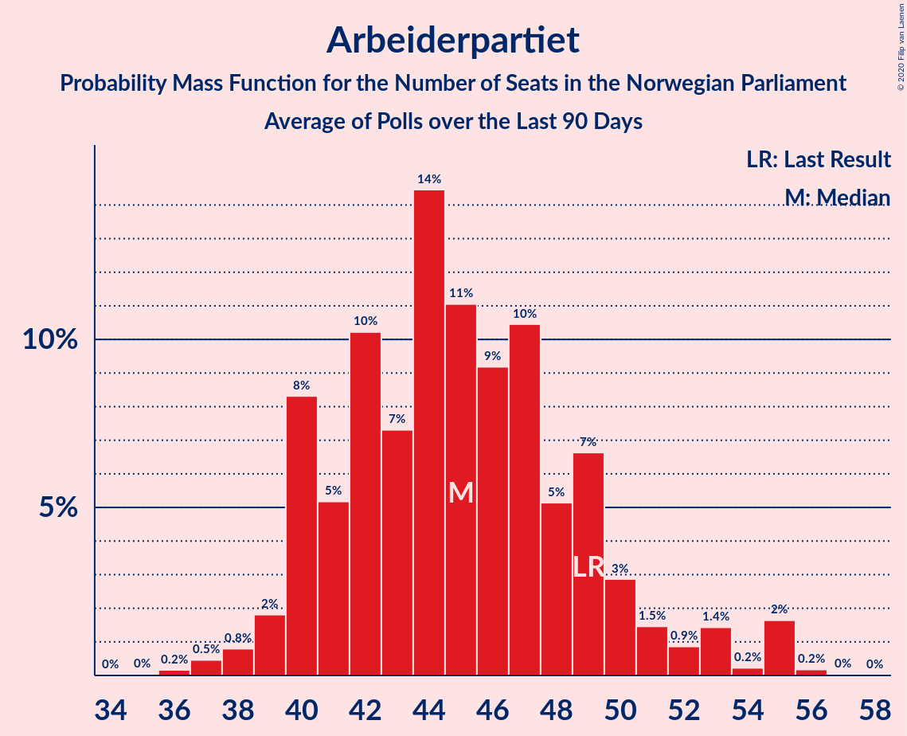

| Number of Seats | Probability | Accumulated | Special Marks |
|:---------------:|:-----------:|:-----------:|:-------------:|
| 32 | 0% | 100% |  |
| 33 | 0.2% | 99.9% |  |
| 34 | 0.2% | 99.7% |  |
| 35 | 0.1% | 99.5% |  |
| 36 | 1.5% | 99.4% |  |
| 37 | 4% | 98% |  |
| 38 | 1.0% | 94% |  |
| 39 | 2% | 93% |  |
| 40 | 6% | 91% |  |
| 41 | 7% | 85% |  |
| 42 | 10% | 78% |  |
| 43 | 13% | 68% |  |
| 44 | 14% | 55% | Median |
| 45 | 15% | 41% |  |
| 46 | 11% | 26% |  |
| 47 | 5% | 15% |  |
| 48 | 3% | 11% |  |
| 49 | 2% | 7% | Last Result |
| 50 | 3% | 6% |  |
| 51 | 0.8% | 3% |  |
| 52 | 1.1% | 2% |  |
| 53 | 0.3% | 1.0% |  |
| 54 | 0.4% | 0.7% |  |
| 55 | 0.2% | 0.3% |  |
| 56 | 0.1% | 0.1% |  |
| 57 | 0% | 0% |  |

### Høyre

*For a full overview of the results for this party, see the [Høyre](party-høyre.html) page.*

| Number of Seats | Probability | Accumulated | Special Marks |
|:---------------:|:-----------:|:-----------:|:-------------:|
| 24 | 0% | 100% |  |
| 25 | 0% | 99.9% |  |
| 26 | 0.1% | 99.9% |  |
| 27 | 0.4% | 99.8% |  |
| 28 | 0.7% | 99.4% |  |
| 29 | 2% | 98.6% |  |
| 30 | 6% | 96% |  |
| 31 | 9% | 91% |  |
| 32 | 11% | 82% |  |
| 33 | 12% | 70% |  |
| 34 | 13% | 58% | Median |
| 35 | 11% | 46% |  |
| 36 | 11% | 35% |  |
| 37 | 7% | 24% |  |
| 38 | 9% | 17% |  |
| 39 | 3% | 8% |  |
| 40 | 3% | 5% |  |
| 41 | 1.0% | 1.4% |  |
| 42 | 0.2% | 0.4% |  |
| 43 | 0.1% | 0.2% |  |
| 44 | 0.1% | 0.1% |  |
| 45 | 0% | 0.1% | Last Result |
| 46 | 0% | 0% |  |

### Fremskrittspartiet

*For a full overview of the results for this party, see the [Fremskrittspartiet](party-fremskrittspartiet.html) page.*

| Number of Seats | Probability | Accumulated | Special Marks |
|:---------------:|:-----------:|:-----------:|:-------------:|
| 15 | 0.1% | 100% |  |
| 16 | 0% | 99.9% |  |
| 17 | 0.1% | 99.8% |  |
| 18 | 2% | 99.8% |  |
| 19 | 2% | 98% |  |
| 20 | 5% | 96% |  |
| 21 | 8% | 92% |  |
| 22 | 5% | 84% |  |
| 23 | 15% | 79% |  |
| 24 | 12% | 65% |  |
| 25 | 11% | 53% | Median |
| 26 | 15% | 42% |  |
| 27 | 12% | 27% | Last Result |
| 28 | 8% | 15% |  |
| 29 | 4% | 7% |  |
| 30 | 2% | 3% |  |
| 31 | 0.7% | 1.0% |  |
| 32 | 0.2% | 0.3% |  |
| 33 | 0.1% | 0.1% |  |
| 34 | 0% | 0% |  |

### Senterpartiet

*For a full overview of the results for this party, see the [Senterpartiet](party-senterpartiet.html) page.*

| Number of Seats | Probability | Accumulated | Special Marks |
|:---------------:|:-----------:|:-----------:|:-------------:|
| 19 | 0% | 100% | Last Result |
| 20 | 0.1% | 100% |  |
| 21 | 0.5% | 99.8% |  |
| 22 | 0.8% | 99.4% |  |
| 23 | 5% | 98.6% |  |
| 24 | 7% | 94% |  |
| 25 | 4% | 87% |  |
| 26 | 9% | 83% |  |
| 27 | 9% | 74% |  |
| 28 | 6% | 65% |  |
| 29 | 11% | 59% | Median |
| 30 | 10% | 48% |  |
| 31 | 9% | 38% |  |
| 32 | 6% | 29% |  |
| 33 | 8% | 24% |  |
| 34 | 4% | 16% |  |
| 35 | 7% | 12% |  |
| 36 | 0.8% | 5% |  |
| 37 | 2% | 4% |  |
| 38 | 0.6% | 2% |  |
| 39 | 0.9% | 1.3% |  |
| 40 | 0.4% | 0.4% |  |
| 41 | 0% | 0% |  |

### Sosialistisk Venstreparti

*For a full overview of the results for this party, see the [Sosialistisk Venstreparti](party-sosialistiskvenstreparti.html) page.*

| Number of Seats | Probability | Accumulated | Special Marks |
|:---------------:|:-----------:|:-----------:|:-------------:|
| 7 | 0.1% | 100% |  |
| 8 | 0.2% | 99.9% |  |
| 9 | 2% | 99.7% |  |
| 10 | 4% | 98% |  |
| 11 | 11% | 95% | Last Result |
| 12 | 16% | 84% |  |
| 13 | 27% | 68% | Median |
| 14 | 15% | 41% |  |
| 15 | 10% | 26% |  |
| 16 | 7% | 15% |  |
| 17 | 5% | 9% |  |
| 18 | 2% | 3% |  |
| 19 | 0.4% | 1.1% |  |
| 20 | 0.4% | 0.7% |  |
| 21 | 0.2% | 0.3% |  |
| 22 | 0% | 0.1% |  |
| 23 | 0% | 0% |  |

### Venstre

*For a full overview of the results for this party, see the [Venstre](party-venstre.html) page.*

| Number of Seats | Probability | Accumulated | Special Marks |
|:---------------:|:-----------:|:-----------:|:-------------:|
| 0 | 4% | 100% |  |
| 1 | 16% | 96% |  |
| 2 | 60% | 80% | Median |
| 3 | 0.6% | 20% |  |
| 4 | 0% | 20% |  |
| 5 | 0% | 20% |  |
| 6 | 0.7% | 20% |  |
| 7 | 8% | 19% |  |
| 8 | 9% | 11% | Last Result |
| 9 | 2% | 3% |  |
| 10 | 0.7% | 0.8% |  |
| 11 | 0% | 0.1% |  |
| 12 | 0% | 0% |  |

### Kristelig Folkeparti

*For a full overview of the results for this party, see the [Kristelig Folkeparti](party-kristeligfolkeparti.html) page.*

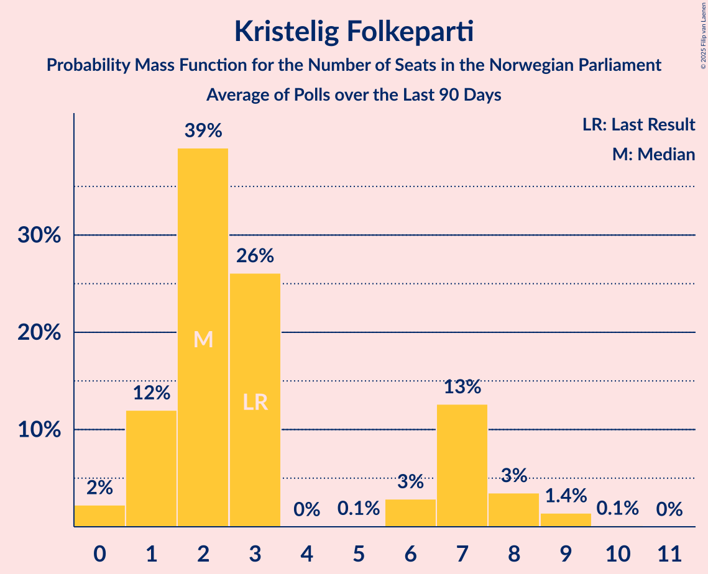

| Number of Seats | Probability | Accumulated | Special Marks |
|:---------------:|:-----------:|:-----------:|:-------------:|
| 0 | 3% | 100% |  |
| 1 | 31% | 97% |  |
| 2 | 10% | 66% |  |
| 3 | 30% | 55% | Median |
| 4 | 0% | 25% |  |
| 5 | 0% | 25% |  |
| 6 | 0.4% | 25% |  |
| 7 | 9% | 25% |  |
| 8 | 13% | 16% | Last Result |
| 9 | 2% | 3% |  |
| 10 | 0.5% | 0.6% |  |
| 11 | 0.1% | 0.2% |  |
| 12 | 0.1% | 0.1% |  |
| 13 | 0% | 0% |  |

### Miljøpartiet De Grønne

*For a full overview of the results for this party, see the [Miljøpartiet De Grønne](party-miljøpartietdegrønne.html) page.*

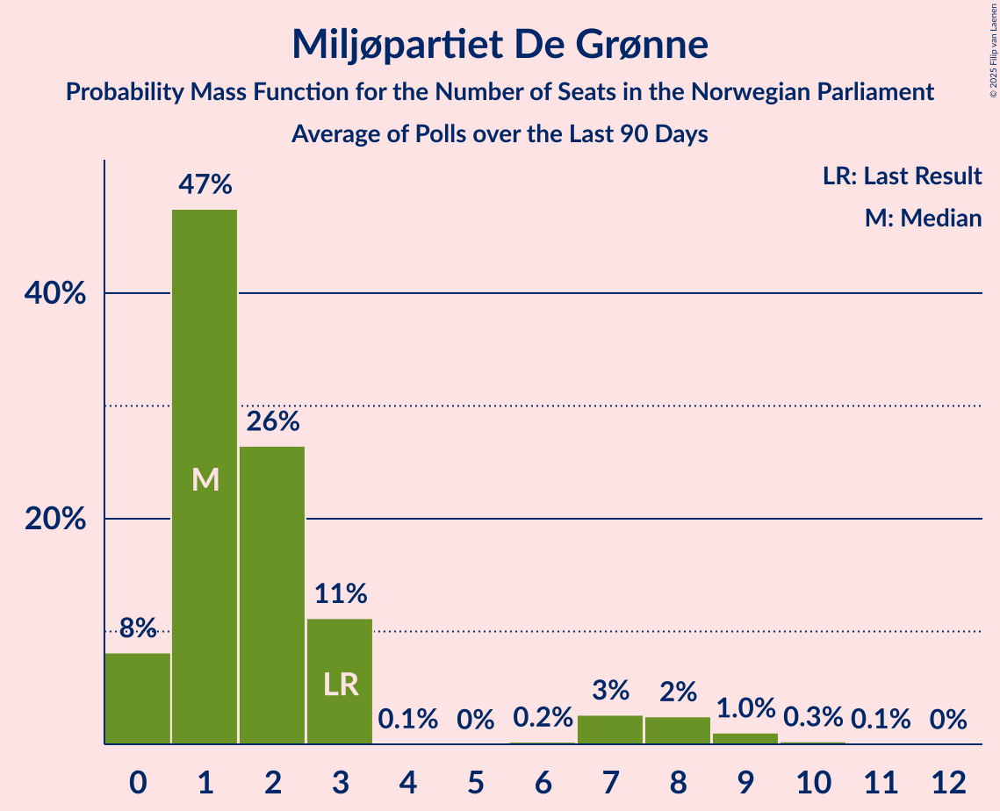

| Number of Seats | Probability | Accumulated | Special Marks |
|:---------------:|:-----------:|:-----------:|:-------------:|
| 1 | 0.2% | 100% | Last Result |
| 2 | 2% | 99.8% |  |
| 3 | 0.3% | 97% |  |
| 4 | 0% | 97% |  |
| 5 | 0% | 97% |  |
| 6 | 0.1% | 97% |  |
| 7 | 2% | 97% |  |
| 8 | 9% | 95% |  |
| 9 | 13% | 86% |  |
| 10 | 16% | 72% |  |
| 11 | 23% | 56% | Median |
| 12 | 12% | 33% |  |
| 13 | 13% | 21% |  |
| 14 | 6% | 9% |  |
| 15 | 2% | 3% |  |
| 16 | 0.8% | 0.9% |  |
| 17 | 0.1% | 0.1% |  |
| 18 | 0% | 0% |  |

### Rødt

*For a full overview of the results for this party, see the [Rødt](party-rødt.html) page.*

| Number of Seats | Probability | Accumulated | Special Marks |
|:---------------:|:-----------:|:-----------:|:-------------:|
| 1 | 6% | 100% | Last Result |
| 2 | 27% | 94% |  |
| 3 | 0% | 67% |  |
| 4 | 0% | 67% |  |
| 5 | 0% | 67% |  |
| 6 | 0.9% | 67% |  |
| 7 | 14% | 66% |  |
| 8 | 22% | 52% | Median |
| 9 | 18% | 30% |  |
| 10 | 6% | 12% |  |
| 11 | 5% | 6% |  |
| 12 | 0.7% | 1.0% |  |
| 13 | 0.3% | 0.4% |  |
| 14 | 0% | 0% |  |

## Coalitions

### Confidence Intervals

| Coalition | Last Result | Median | Majority? | 80% Confidence Interval | 90% Confidence Interval | 95% Confidence Interval | 99% Confidence Interval |
|:---------:|:-----------:|:------:|:---------:|:-----------------------:|:-----------------------:|:-----------------------:|:-----------------------:|
| Arbeiderpartiet – Senterpartiet – Sosialistisk Venstreparti – Miljøpartiet De Grønne – Rødt | 81 | 104 | 100% | 97–109 | 96–111 | 94–112 | 90–114 |
| Arbeiderpartiet – Senterpartiet – Sosialistisk Venstreparti – Kristelig Folkeparti – Miljøpartiet De Grønne | 88 | 101 | 100% | 96–105 | 94–107 | 92–108 | 90–110 |
| Arbeiderpartiet – Senterpartiet – Sosialistisk Venstreparti – Miljøpartiet De Grønne | 80 | 97 | 99.9% | 91–102 | 90–104 | 89–106 | 86–107 |
| Høyre – Fremskrittspartiet – Senterpartiet – Venstre – Kristelig Folkeparti | 107 | 94 | 99.6% | 89–100 | 88–102 | 86–105 | 85–108 |
| Arbeiderpartiet – Senterpartiet – Sosialistisk Venstreparti – Rødt | 80 | 93 | 95% | 85–99 | 84–100 | 84–102 | 80–103 |
| Arbeiderpartiet – Senterpartiet – Kristelig Folkeparti – Miljøpartiet De Grønne | 77 | 87 | 71% | 82–92 | 80–94 | 79–96 | 76–98 |
| Arbeiderpartiet – Senterpartiet – Sosialistisk Venstreparti | 79 | 86 | 70% | 82–91 | 79–93 | 78–94 | 77–97 |
| Arbeiderpartiet – Senterpartiet – Kristelig Folkeparti | 76 | 77 | 3% | 71–82 | 70–83 | 69–85 | 67–87 |
| Høyre – Fremskrittspartiet – Venstre – Kristelig Folkeparti – Miljøpartiet De Grønne | 89 | 76 | 5% | 70–83 | 69–84 | 67–85 | 66–89 |
| Arbeiderpartiet – Senterpartiet | 68 | 73 | 0.2% | 68–79 | 67–80 | 66–81 | 64–83 |
| Høyre – Fremskrittspartiet – Venstre – Kristelig Folkeparti | 88 | 65 | 0% | 60–72 | 58–73 | 57–74 | 55–78 |
| Høyre – Fremskrittspartiet – Venstre | 80 | 62 | 0% | 56–67 | 55–69 | 54–70 | 52–73 |
| Høyre – Fremskrittspartiet | 72 | 59 | 0% | 54–63 | 53–65 | 52–66 | 50–69 |
| Arbeiderpartiet – Sosialistisk Venstreparti | 60 | 57 | 0% | 53–61 | 51–64 | 50–65 | 48–67 |
| Høyre – Venstre – Kristelig Folkeparti | 61 | 40 | 0% | 35–46 | 34–47 | 34–48 | 32–51 |
| Senterpartiet – Venstre – Kristelig Folkeparti | 35 | 36 | 0% | 28–43 | 28–43 | 27–45 | 26–49 |

### Arbeiderpartiet – Senterpartiet – Sosialistisk Venstreparti – Miljøpartiet De Grønne – Rødt

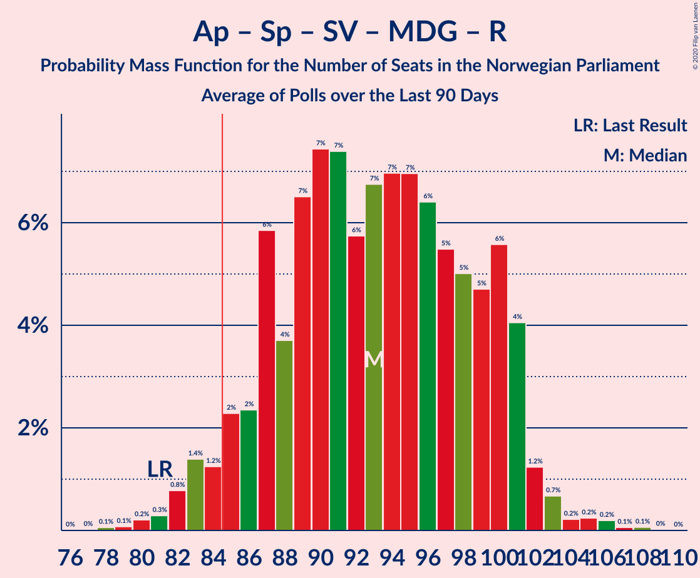

| Number of Seats | Probability | Accumulated | Special Marks |
|:---------------:|:-----------:|:-----------:|:-------------:|
| 81 | 0% | 100% | Last Result |
| 82 | 0% | 100% |  |
| 83 | 0% | 100% |  |
| 84 | 0% | 100% |  |
| 85 | 0% | 100% | Majority |
| 86 | 0% | 100% |  |
| 87 | 0% | 100% |  |
| 88 | 0% | 99.9% |  |
| 89 | 0.1% | 99.9% |  |
| 90 | 0.3% | 99.8% |  |
| 91 | 0.4% | 99.5% |  |
| 92 | 0.7% | 99.0% |  |
| 93 | 0.7% | 98% |  |
| 94 | 0.8% | 98% |  |
| 95 | 2% | 97% |  |
| 96 | 2% | 95% |  |
| 97 | 7% | 93% |  |
| 98 | 4% | 86% |  |
| 99 | 5% | 82% |  |
| 100 | 4% | 77% |  |
| 101 | 6% | 72% |  |
| 102 | 5% | 66% |  |
| 103 | 7% | 61% |  |
| 104 | 9% | 54% |  |
| 105 | 7% | 45% | Median |
| 106 | 9% | 38% |  |
| 107 | 10% | 30% |  |
| 108 | 6% | 19% |  |
| 109 | 5% | 14% |  |
| 110 | 2% | 8% |  |
| 111 | 3% | 6% |  |
| 112 | 1.1% | 3% |  |
| 113 | 0.9% | 2% |  |
| 114 | 0.8% | 1.2% |  |
| 115 | 0.3% | 0.4% |  |
| 116 | 0.2% | 0.2% |  |
| 117 | 0% | 0% |  |

### Arbeiderpartiet – Senterpartiet – Sosialistisk Venstreparti – Kristelig Folkeparti – Miljøpartiet De Grønne

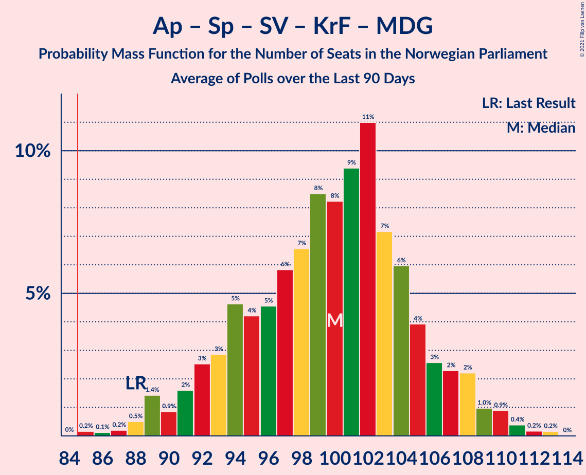

| Number of Seats | Probability | Accumulated | Special Marks |
|:---------------:|:-----------:|:-----------:|:-------------:|
| 87 | 0% | 100% |  |
| 88 | 0.1% | 99.9% | Last Result |
| 89 | 0.2% | 99.8% |  |
| 90 | 0.6% | 99.6% |  |
| 91 | 0.6% | 99.1% |  |
| 92 | 1.2% | 98% |  |
| 93 | 1.3% | 97% |  |
| 94 | 2% | 96% |  |
| 95 | 3% | 94% |  |
| 96 | 4% | 91% |  |
| 97 | 9% | 86% |  |
| 98 | 11% | 77% |  |
| 99 | 11% | 67% |  |
| 100 | 6% | 56% | Median |
| 101 | 5% | 50% |  |
| 102 | 11% | 45% |  |
| 103 | 12% | 34% |  |
| 104 | 8% | 22% |  |
| 105 | 5% | 15% |  |
| 106 | 4% | 10% |  |
| 107 | 2% | 6% |  |
| 108 | 2% | 4% |  |
| 109 | 2% | 2% |  |
| 110 | 0.4% | 0.7% |  |
| 111 | 0.1% | 0.3% |  |
| 112 | 0.1% | 0.2% |  |
| 113 | 0% | 0.1% |  |
| 114 | 0% | 0% |  |

### Arbeiderpartiet – Senterpartiet – Sosialistisk Venstreparti – Miljøpartiet De Grønne

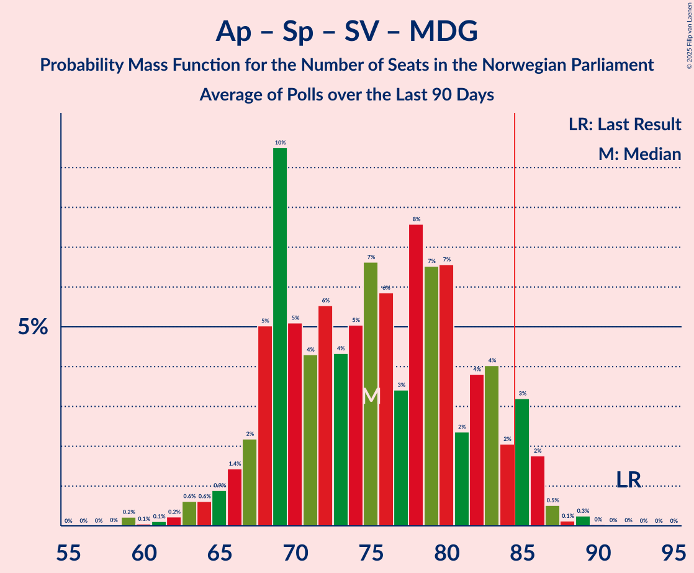

| Number of Seats | Probability | Accumulated | Special Marks |
|:---------------:|:-----------:|:-----------:|:-------------:|
| 80 | 0% | 100% | Last Result |
| 81 | 0% | 100% |  |
| 82 | 0% | 100% |  |
| 83 | 0% | 100% |  |
| 84 | 0.1% | 99.9% |  |
| 85 | 0.2% | 99.9% | Majority |
| 86 | 0.3% | 99.7% |  |
| 87 | 0.9% | 99.4% |  |
| 88 | 0.7% | 98.6% |  |
| 89 | 2% | 98% |  |
| 90 | 4% | 96% |  |
| 91 | 3% | 92% |  |
| 92 | 4% | 89% |  |
| 93 | 4% | 86% |  |
| 94 | 4% | 82% |  |
| 95 | 8% | 78% |  |
| 96 | 13% | 70% |  |
| 97 | 11% | 57% | Median |
| 98 | 9% | 46% |  |
| 99 | 11% | 38% |  |
| 100 | 10% | 27% |  |
| 101 | 3% | 17% |  |
| 102 | 7% | 14% |  |
| 103 | 1.2% | 8% |  |
| 104 | 2% | 7% |  |
| 105 | 2% | 5% |  |
| 106 | 2% | 3% |  |
| 107 | 1.0% | 1.4% |  |
| 108 | 0.3% | 0.4% |  |
| 109 | 0.1% | 0.1% |  |
| 110 | 0% | 0.1% |  |
| 111 | 0% | 0% |  |

### Høyre – Fremskrittspartiet – Senterpartiet – Venstre – Kristelig Folkeparti

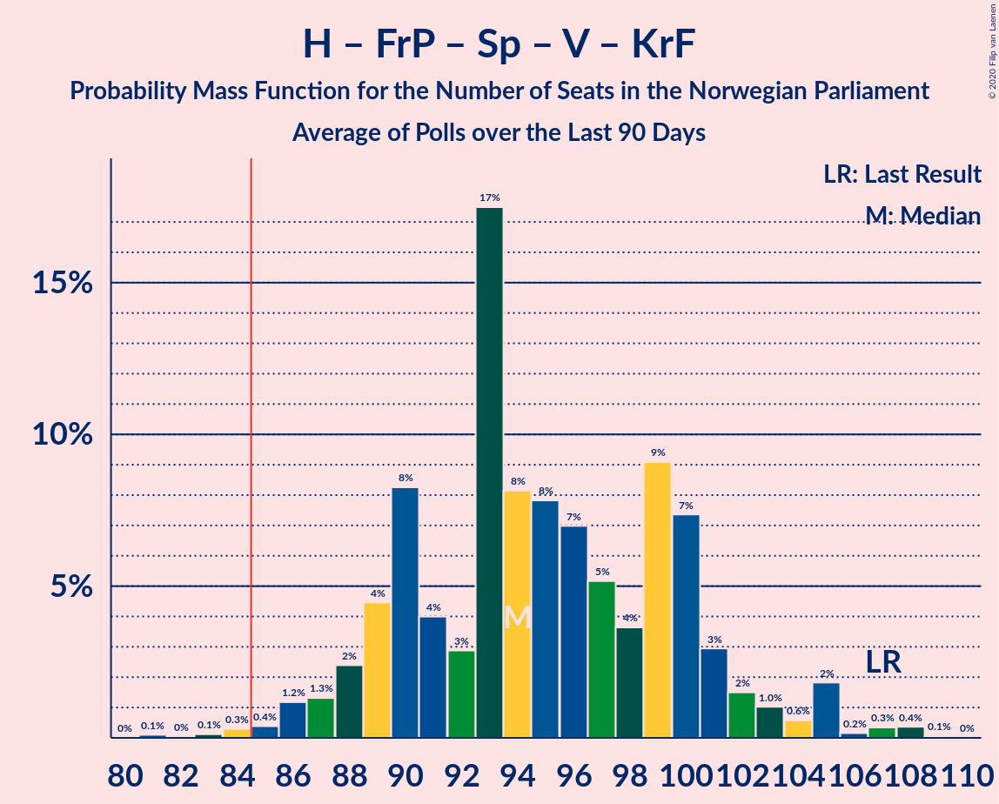

| Number of Seats | Probability | Accumulated | Special Marks |
|:---------------:|:-----------:|:-----------:|:-------------:|
| 81 | 0.1% | 100% |  |
| 82 | 0.1% | 99.9% |  |
| 83 | 0.1% | 99.8% |  |
| 84 | 0.1% | 99.8% |  |
| 85 | 0.6% | 99.6% | Majority |
| 86 | 2% | 99.0% |  |
| 87 | 2% | 97% |  |
| 88 | 3% | 96% |  |
| 89 | 7% | 92% |  |
| 90 | 4% | 85% |  |
| 91 | 5% | 81% |  |
| 92 | 5% | 76% |  |
| 93 | 12% | 72% | Median |
| 94 | 10% | 60% |  |
| 95 | 12% | 50% |  |
| 96 | 8% | 38% |  |
| 97 | 5% | 30% |  |
| 98 | 4% | 25% |  |
| 99 | 8% | 21% |  |
| 100 | 6% | 13% |  |
| 101 | 2% | 8% |  |
| 102 | 1.5% | 6% |  |
| 103 | 1.0% | 4% |  |
| 104 | 0.7% | 3% |  |
| 105 | 2% | 3% |  |
| 106 | 0.2% | 1.1% |  |
| 107 | 0.3% | 0.8% | Last Result |
| 108 | 0.3% | 0.5% |  |
| 109 | 0.2% | 0.2% |  |
| 110 | 0% | 0% |  |

### Arbeiderpartiet – Senterpartiet – Sosialistisk Venstreparti – Rødt

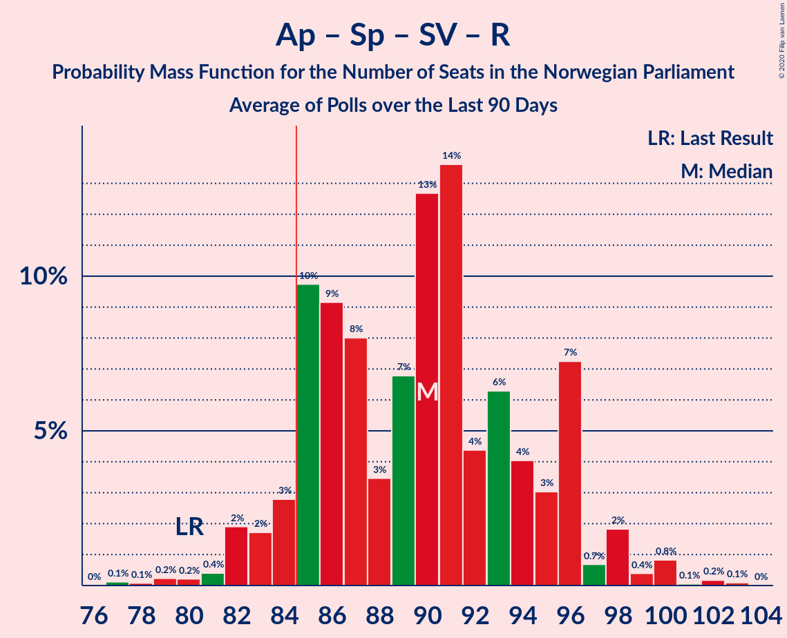

| Number of Seats | Probability | Accumulated | Special Marks |
|:---------------:|:-----------:|:-----------:|:-------------:|
| 77 | 0.1% | 100% |  |
| 78 | 0.1% | 99.9% |  |
| 79 | 0.2% | 99.8% |  |
| 80 | 0.3% | 99.7% | Last Result |
| 81 | 0.5% | 99.4% |  |
| 82 | 0.6% | 98.9% |  |
| 83 | 0.4% | 98% |  |
| 84 | 3% | 98% |  |
| 85 | 5% | 95% | Majority |
| 86 | 2% | 90% |  |
| 87 | 5% | 87% |  |
| 88 | 4% | 83% |  |
| 89 | 4% | 79% |  |
| 90 | 6% | 74% |  |
| 91 | 4% | 68% |  |
| 92 | 6% | 64% |  |
| 93 | 12% | 58% |  |
| 94 | 6% | 47% | Median |
| 95 | 10% | 41% |  |
| 96 | 4% | 31% |  |
| 97 | 11% | 26% |  |
| 98 | 3% | 16% |  |
| 99 | 4% | 13% |  |
| 100 | 5% | 9% |  |
| 101 | 1.5% | 4% |  |
| 102 | 2% | 3% |  |
| 103 | 0.9% | 1.3% |  |
| 104 | 0.1% | 0.4% |  |
| 105 | 0.1% | 0.3% |  |
| 106 | 0.1% | 0.2% |  |
| 107 | 0.1% | 0.1% |  |
| 108 | 0% | 0% |  |

### Arbeiderpartiet – Senterpartiet – Kristelig Folkeparti – Miljøpartiet De Grønne

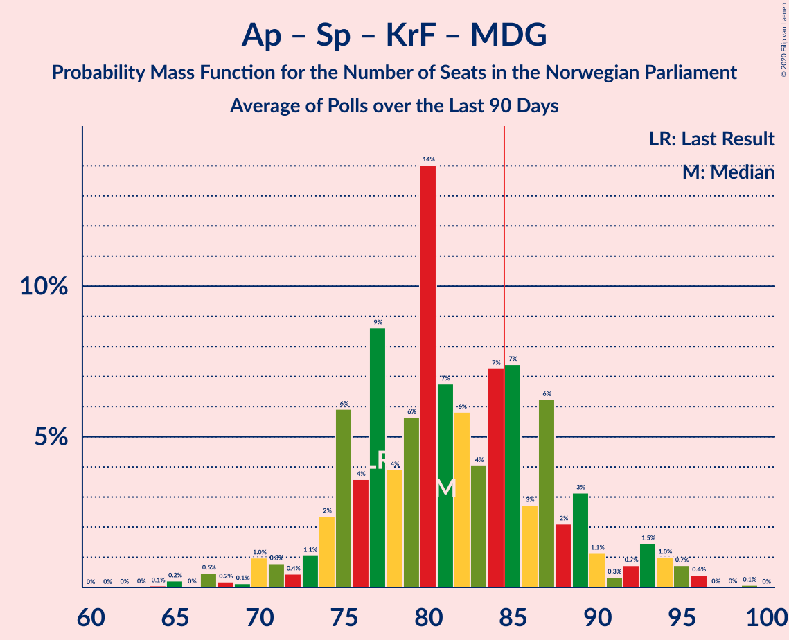

| Number of Seats | Probability | Accumulated | Special Marks |
|:---------------:|:-----------:|:-----------:|:-------------:|
| 73 | 0.1% | 100% |  |
| 74 | 0.1% | 99.9% |  |
| 75 | 0.1% | 99.9% |  |
| 76 | 0.3% | 99.8% |  |
| 77 | 0.5% | 99.4% | Last Result |
| 78 | 0.9% | 98.9% |  |
| 79 | 2% | 98% |  |
| 80 | 2% | 96% |  |
| 81 | 3% | 94% |  |
| 82 | 5% | 91% |  |
| 83 | 8% | 86% |  |
| 84 | 7% | 79% |  |
| 85 | 7% | 71% | Majority |
| 86 | 11% | 64% |  |
| 87 | 5% | 53% | Median |
| 88 | 7% | 48% |  |
| 89 | 10% | 40% |  |
| 90 | 8% | 30% |  |
| 91 | 10% | 22% |  |
| 92 | 3% | 12% |  |
| 93 | 2% | 10% |  |
| 94 | 3% | 7% |  |
| 95 | 1.2% | 4% |  |
| 96 | 0.5% | 3% |  |
| 97 | 2% | 2% |  |
| 98 | 0.5% | 0.7% |  |
| 99 | 0.1% | 0.2% |  |
| 100 | 0.1% | 0.1% |  |
| 101 | 0% | 0% |  |

### Arbeiderpartiet – Senterpartiet – Sosialistisk Venstreparti

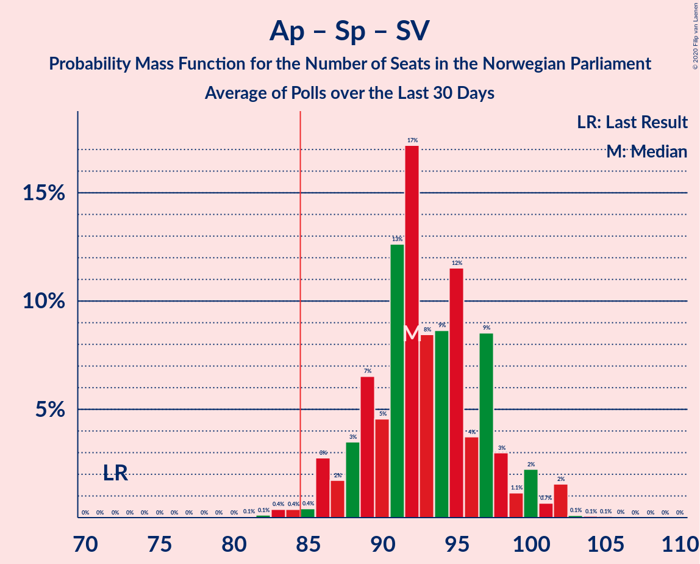

| Number of Seats | Probability | Accumulated | Special Marks |
|:---------------:|:-----------:|:-----------:|:-------------:|
| 73 | 0% | 100% |  |
| 74 | 0% | 99.9% |  |
| 75 | 0.2% | 99.9% |  |
| 76 | 0.2% | 99.7% |  |
| 77 | 0.6% | 99.5% |  |
| 78 | 3% | 98.9% |  |
| 79 | 2% | 96% | Last Result |
| 80 | 2% | 94% |  |
| 81 | 2% | 92% |  |
| 82 | 6% | 90% |  |
| 83 | 7% | 84% |  |
| 84 | 7% | 77% |  |
| 85 | 9% | 70% | Majority |
| 86 | 12% | 61% | Median |
| 87 | 5% | 49% |  |
| 88 | 9% | 44% |  |
| 89 | 12% | 35% |  |
| 90 | 9% | 24% |  |
| 91 | 5% | 15% |  |
| 92 | 3% | 10% |  |
| 93 | 3% | 7% |  |
| 94 | 2% | 4% |  |
| 95 | 0.7% | 2% |  |
| 96 | 0.9% | 1.4% |  |
| 97 | 0.3% | 0.6% |  |
| 98 | 0.1% | 0.3% |  |
| 99 | 0.1% | 0.2% |  |
| 100 | 0% | 0.1% |  |
| 101 | 0% | 0% |  |

### Arbeiderpartiet – Senterpartiet – Kristelig Folkeparti

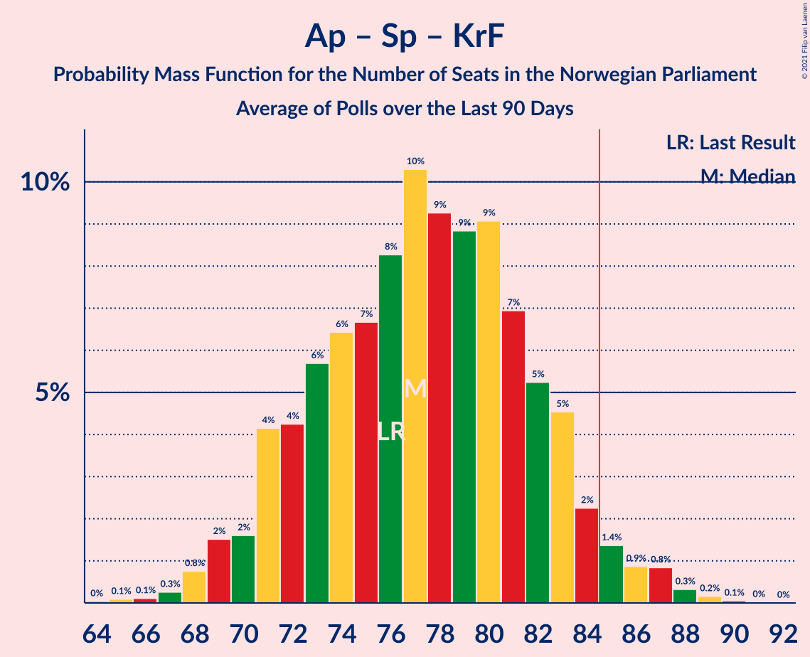

| Number of Seats | Probability | Accumulated | Special Marks |
|:---------------:|:-----------:|:-----------:|:-------------:|
| 64 | 0% | 100% |  |
| 65 | 0.1% | 99.9% |  |
| 66 | 0.2% | 99.8% |  |
| 67 | 0.4% | 99.7% |  |
| 68 | 0.6% | 99.3% |  |
| 69 | 3% | 98.6% |  |
| 70 | 3% | 96% |  |
| 71 | 7% | 93% |  |
| 72 | 7% | 85% |  |
| 73 | 7% | 78% |  |
| 74 | 8% | 71% |  |
| 75 | 4% | 63% |  |
| 76 | 5% | 59% | Last Result, Median |
| 77 | 10% | 54% |  |
| 78 | 8% | 44% |  |
| 79 | 9% | 36% |  |
| 80 | 11% | 27% |  |
| 81 | 4% | 16% |  |
| 82 | 3% | 12% |  |
| 83 | 4% | 9% |  |
| 84 | 1.5% | 5% |  |
| 85 | 1.0% | 3% | Majority |
| 86 | 1.1% | 2% |  |
| 87 | 0.8% | 1.3% |  |
| 88 | 0.2% | 0.5% |  |
| 89 | 0.2% | 0.2% |  |
| 90 | 0% | 0.1% |  |
| 91 | 0% | 0% |  |

### Høyre – Fremskrittspartiet – Venstre – Kristelig Folkeparti – Miljøpartiet De Grønne

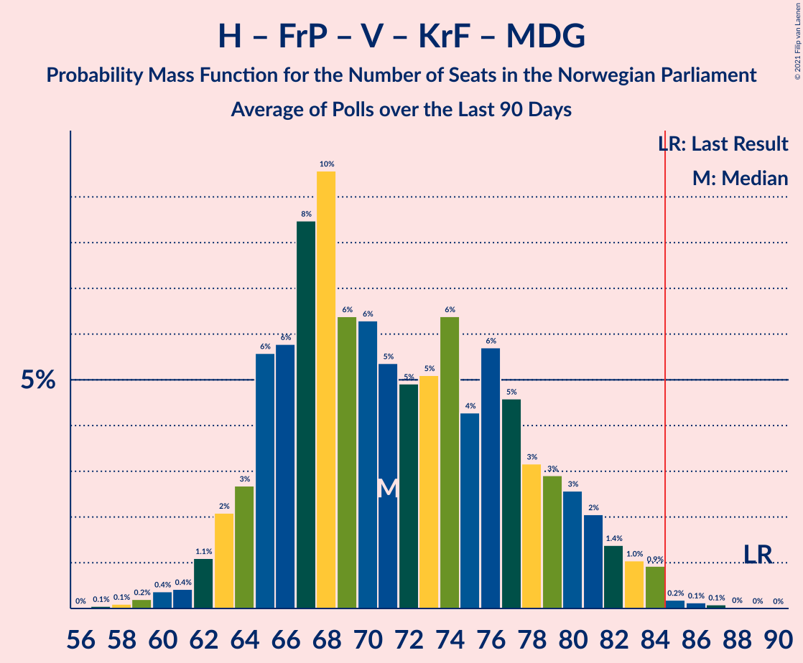

| Number of Seats | Probability | Accumulated | Special Marks |
|:---------------:|:-----------:|:-----------:|:-------------:|
| 62 | 0.1% | 100% |  |
| 63 | 0.1% | 99.9% |  |
| 64 | 0.1% | 99.8% |  |
| 65 | 0.2% | 99.7% |  |
| 66 | 0.9% | 99.5% |  |
| 67 | 2% | 98.6% |  |
| 68 | 2% | 97% |  |
| 69 | 5% | 95% |  |
| 70 | 4% | 90% |  |
| 71 | 4% | 86% |  |
| 72 | 11% | 82% |  |
| 73 | 4% | 72% |  |
| 74 | 10% | 67% |  |
| 75 | 6% | 57% | Median |
| 76 | 12% | 50% |  |
| 77 | 6% | 38% |  |
| 78 | 4% | 33% |  |
| 79 | 6% | 29% |  |
| 80 | 4% | 23% |  |
| 81 | 4% | 19% |  |
| 82 | 4% | 15% |  |
| 83 | 2% | 11% |  |
| 84 | 4% | 9% |  |
| 85 | 3% | 5% | Majority |
| 86 | 0.3% | 2% |  |
| 87 | 0.5% | 1.5% |  |
| 88 | 0.4% | 1.0% |  |
| 89 | 0.3% | 0.5% | Last Result |
| 90 | 0.1% | 0.3% |  |
| 91 | 0.1% | 0.1% |  |
| 92 | 0.1% | 0.1% |  |
| 93 | 0% | 0% |  |

### Arbeiderpartiet – Senterpartiet

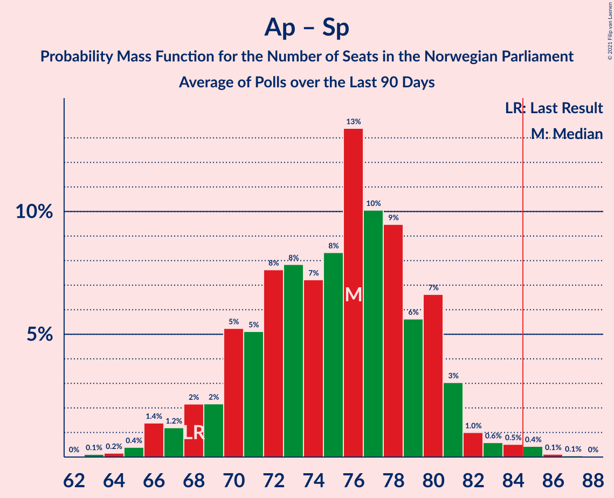

| Number of Seats | Probability | Accumulated | Special Marks |
|:---------------:|:-----------:|:-----------:|:-------------:|
| 61 | 0.1% | 100% |  |
| 62 | 0.1% | 99.9% |  |
| 63 | 0.2% | 99.8% |  |
| 64 | 0.6% | 99.6% |  |
| 65 | 1.0% | 99.0% |  |
| 66 | 2% | 98% |  |
| 67 | 4% | 96% |  |
| 68 | 3% | 91% | Last Result |
| 69 | 9% | 88% |  |
| 70 | 9% | 79% |  |
| 71 | 7% | 70% |  |
| 72 | 10% | 62% |  |
| 73 | 7% | 53% | Median |
| 74 | 4% | 46% |  |
| 75 | 10% | 42% |  |
| 76 | 9% | 32% |  |
| 77 | 8% | 23% |  |
| 78 | 3% | 14% |  |
| 79 | 6% | 11% |  |
| 80 | 3% | 6% |  |
| 81 | 1.3% | 3% |  |
| 82 | 0.3% | 1.3% |  |
| 83 | 0.5% | 0.9% |  |
| 84 | 0.2% | 0.4% |  |
| 85 | 0.1% | 0.2% | Majority |
| 86 | 0% | 0.1% |  |
| 87 | 0% | 0% |  |

### Høyre – Fremskrittspartiet – Venstre – Kristelig Folkeparti

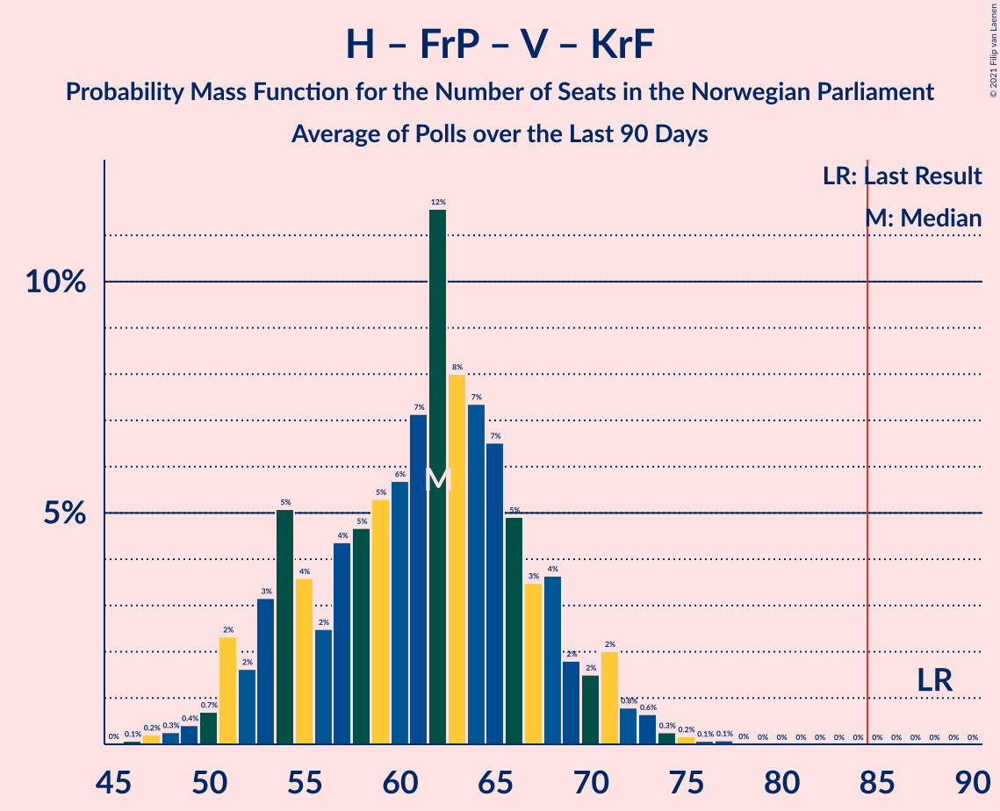

| Number of Seats | Probability | Accumulated | Special Marks |
|:---------------:|:-----------:|:-----------:|:-------------:|
| 53 | 0.2% | 100% |  |
| 54 | 0.3% | 99.8% |  |
| 55 | 0.8% | 99.6% |  |
| 56 | 0.9% | 98.8% |  |
| 57 | 1.1% | 98% |  |
| 58 | 3% | 97% |  |
| 59 | 3% | 94% |  |
| 60 | 6% | 91% |  |
| 61 | 6% | 86% |  |
| 62 | 11% | 79% |  |
| 63 | 9% | 69% |  |
| 64 | 7% | 60% | Median |
| 65 | 10% | 53% |  |
| 66 | 7% | 42% |  |
| 67 | 5% | 36% |  |
| 68 | 6% | 31% |  |
| 69 | 5% | 25% |  |
| 70 | 5% | 21% |  |
| 71 | 4% | 16% |  |
| 72 | 6% | 12% |  |
| 73 | 2% | 5% |  |
| 74 | 1.4% | 4% |  |
| 75 | 0.6% | 2% |  |
| 76 | 0.4% | 2% |  |
| 77 | 0.5% | 1.1% |  |
| 78 | 0.3% | 0.6% |  |
| 79 | 0.2% | 0.3% |  |
| 80 | 0.1% | 0.1% |  |
| 81 | 0% | 0.1% |  |
| 82 | 0% | 0% |  |
| 83 | 0% | 0% |  |
| 84 | 0% | 0% |  |
| 85 | 0% | 0% | Majority |
| 86 | 0% | 0% |  |
| 87 | 0% | 0% |  |
| 88 | 0% | 0% | Last Result |

### Høyre – Fremskrittspartiet – Venstre

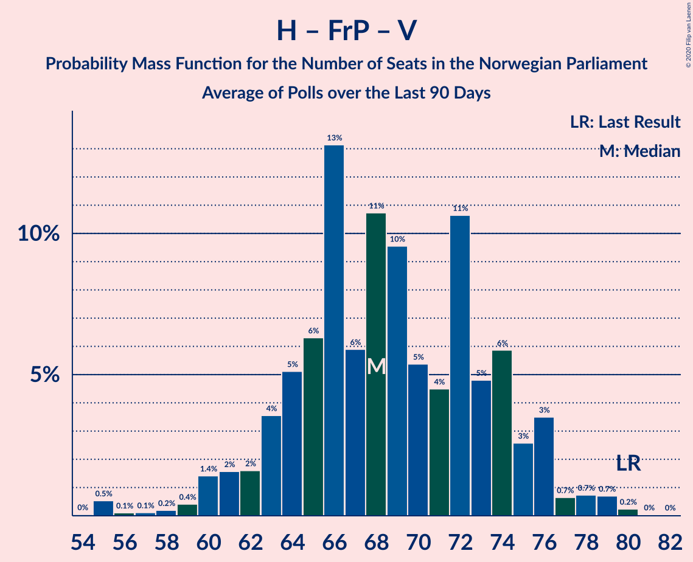

| Number of Seats | Probability | Accumulated | Special Marks |
|:---------------:|:-----------:|:-----------:|:-------------:|
| 50 | 0% | 100% |  |
| 51 | 0.4% | 99.9% |  |
| 52 | 0.3% | 99.5% |  |
| 53 | 0.8% | 99.2% |  |
| 54 | 1.2% | 98% |  |
| 55 | 2% | 97% |  |
| 56 | 6% | 95% |  |
| 57 | 2% | 89% |  |
| 58 | 7% | 87% |  |
| 59 | 13% | 80% |  |
| 60 | 4% | 67% |  |
| 61 | 5% | 62% | Median |
| 62 | 14% | 57% |  |
| 63 | 7% | 43% |  |
| 64 | 12% | 36% |  |
| 65 | 7% | 24% |  |
| 66 | 5% | 17% |  |
| 67 | 4% | 12% |  |
| 68 | 3% | 8% |  |
| 69 | 2% | 5% |  |
| 70 | 0.8% | 3% |  |
| 71 | 0.8% | 2% |  |
| 72 | 0.7% | 1.5% |  |
| 73 | 0.3% | 0.8% |  |
| 74 | 0.2% | 0.5% |  |
| 75 | 0% | 0.2% |  |
| 76 | 0.1% | 0.2% |  |
| 77 | 0% | 0% |  |
| 78 | 0% | 0% |  |
| 79 | 0% | 0% |  |
| 80 | 0% | 0% | Last Result |

### Høyre – Fremskrittspartiet

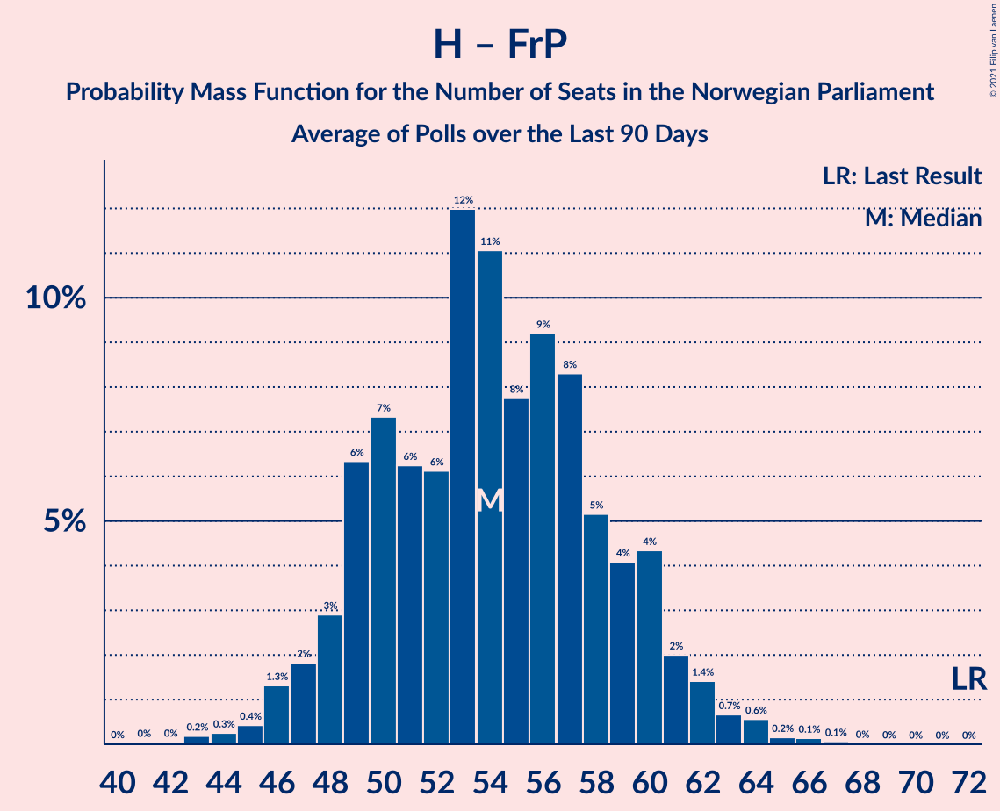

| Number of Seats | Probability | Accumulated | Special Marks |
|:---------------:|:-----------:|:-----------:|:-------------:|
| 47 | 0% | 100% |  |
| 48 | 0.1% | 99.9% |  |
| 49 | 0.3% | 99.9% |  |
| 50 | 0.4% | 99.5% |  |
| 51 | 1.3% | 99.2% |  |
| 52 | 2% | 98% |  |
| 53 | 2% | 96% |  |
| 54 | 7% | 95% |  |
| 55 | 5% | 88% |  |
| 56 | 6% | 84% |  |
| 57 | 20% | 77% |  |
| 58 | 5% | 58% |  |
| 59 | 7% | 52% | Median |
| 60 | 7% | 45% |  |
| 61 | 12% | 38% |  |
| 62 | 11% | 26% |  |
| 63 | 5% | 15% |  |
| 64 | 4% | 10% |  |
| 65 | 2% | 6% |  |
| 66 | 2% | 4% |  |
| 67 | 0.7% | 2% |  |
| 68 | 0.5% | 1.3% |  |
| 69 | 0.5% | 0.9% |  |
| 70 | 0.2% | 0.4% |  |
| 71 | 0.1% | 0.1% |  |
| 72 | 0% | 0.1% | Last Result |
| 73 | 0% | 0% |  |

### Arbeiderpartiet – Sosialistisk Venstreparti

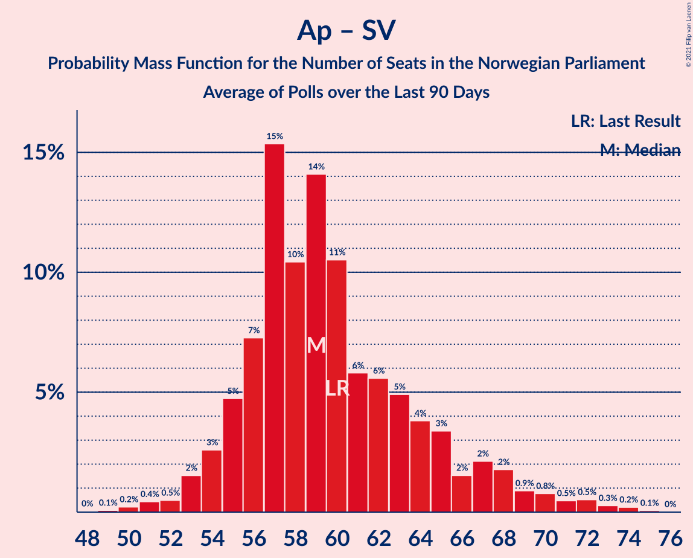

| Number of Seats | Probability | Accumulated | Special Marks |
|:---------------:|:-----------:|:-----------:|:-------------:|
| 46 | 0% | 100% |  |
| 47 | 0.1% | 99.9% |  |
| 48 | 0.4% | 99.9% |  |
| 49 | 0.5% | 99.5% |  |
| 50 | 3% | 99.0% |  |
| 51 | 2% | 96% |  |
| 52 | 3% | 94% |  |
| 53 | 5% | 91% |  |
| 54 | 4% | 85% |  |
| 55 | 13% | 81% |  |
| 56 | 9% | 68% |  |
| 57 | 13% | 59% | Median |
| 58 | 12% | 46% |  |
| 59 | 14% | 35% |  |
| 60 | 10% | 21% | Last Result |
| 61 | 2% | 11% |  |
| 62 | 3% | 10% |  |
| 63 | 1.5% | 7% |  |
| 64 | 3% | 5% |  |
| 65 | 1.2% | 3% |  |
| 66 | 0.9% | 2% |  |
| 67 | 0.2% | 0.6% |  |
| 68 | 0.2% | 0.4% |  |
| 69 | 0.1% | 0.2% |  |
| 70 | 0% | 0.2% |  |
| 71 | 0.1% | 0.1% |  |
| 72 | 0% | 0% |  |

### Høyre – Venstre – Kristelig Folkeparti

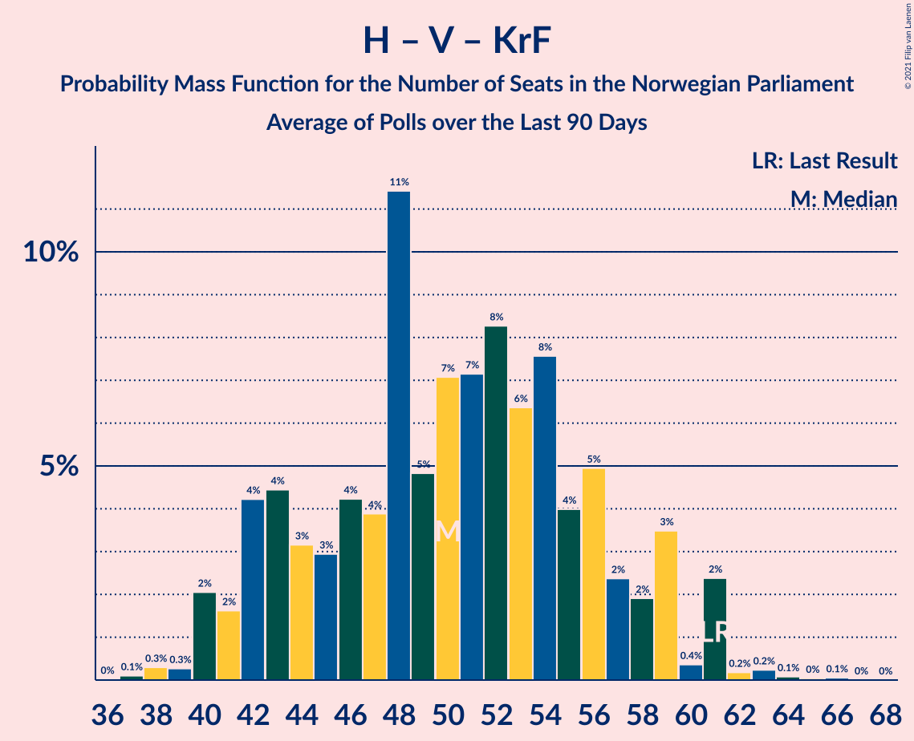

| Number of Seats | Probability | Accumulated | Special Marks |
|:---------------:|:-----------:|:-----------:|:-------------:|
| 30 | 0.1% | 100% |  |
| 31 | 0.1% | 99.9% |  |
| 32 | 0.4% | 99.8% |  |
| 33 | 0.6% | 99.4% |  |
| 34 | 4% | 98.8% |  |
| 35 | 5% | 94% |  |
| 36 | 5% | 90% |  |
| 37 | 8% | 85% |  |
| 38 | 8% | 76% |  |
| 39 | 7% | 68% | Median |
| 40 | 12% | 61% |  |
| 41 | 10% | 50% |  |
| 42 | 10% | 40% |  |
| 43 | 7% | 30% |  |
| 44 | 8% | 23% |  |
| 45 | 4% | 16% |  |
| 46 | 6% | 12% |  |
| 47 | 2% | 6% |  |
| 48 | 1.3% | 4% |  |
| 49 | 0.7% | 2% |  |
| 50 | 1.0% | 2% |  |
| 51 | 0.3% | 0.8% |  |
| 52 | 0.3% | 0.5% |  |
| 53 | 0.1% | 0.2% |  |
| 54 | 0.1% | 0.1% |  |
| 55 | 0% | 0.1% |  |
| 56 | 0% | 0% |  |
| 57 | 0% | 0% |  |
| 58 | 0% | 0% |  |
| 59 | 0% | 0% |  |
| 60 | 0% | 0% |  |
| 61 | 0% | 0% | Last Result |

### Senterpartiet – Venstre – Kristelig Folkeparti

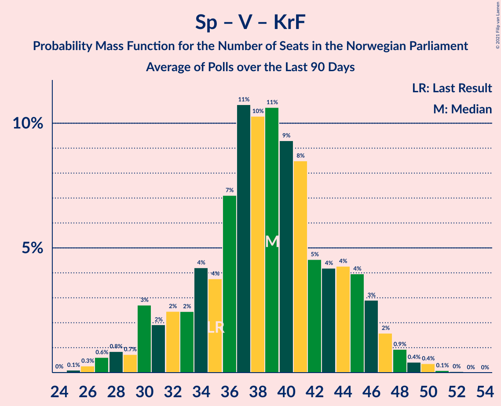

| Number of Seats | Probability | Accumulated | Special Marks |
|:---------------:|:-----------:|:-----------:|:-------------:|
| 25 | 0.4% | 100% |  |
| 26 | 0.8% | 99.6% |  |
| 27 | 2% | 98.8% |  |
| 28 | 7% | 97% |  |
| 29 | 3% | 90% |  |
| 30 | 2% | 87% |  |
| 31 | 5% | 85% |  |
| 32 | 5% | 79% |  |
| 33 | 8% | 74% |  |
| 34 | 10% | 66% | Median |
| 35 | 5% | 56% | Last Result |
| 36 | 9% | 51% |  |
| 37 | 7% | 42% |  |
| 38 | 9% | 35% |  |
| 39 | 4% | 26% |  |
| 40 | 3% | 22% |  |
| 41 | 4% | 19% |  |
| 42 | 3% | 15% |  |
| 43 | 7% | 12% |  |
| 44 | 2% | 5% |  |
| 45 | 1.4% | 3% |  |
| 46 | 0.4% | 2% |  |
| 47 | 0.5% | 1.4% |  |
| 48 | 0.4% | 0.9% |  |
| 49 | 0.1% | 0.5% |  |
| 50 | 0.3% | 0.4% |  |
| 51 | 0.1% | 0.2% |  |
| 52 | 0% | 0% |  |

## Technical Information

+ **Number of polls included in this average:** 7
+ **Lowest number of simulations done in a poll included in this average:** 65,536
+ **Total number of simulations done in the polls included in this average:** 1,638,400
+ **Error estimate:** 4.42%
