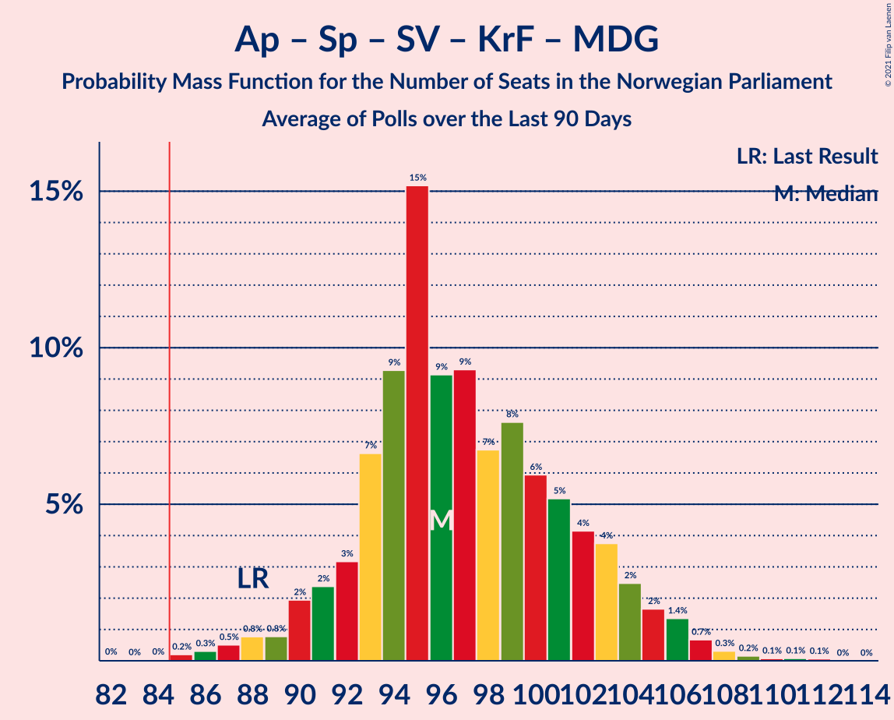

# Poll Average

<a href="#voting-intentions">Voting Intentions</a> | <a href="#seats">Seats</a> | <a href="#coalitions">Coalitions</a> | <a href="#technical-information">Technical Information</a>

## Summary

The table below lists the polls on which the average is based. They are the most recent polls (less than 90 days old) registered and analyzed so far.

| Period     | Polling firm/Commissioner(s) | Ap | H | FrP | Sp | SV | V | KrF | MDG | R |
|:----------:|:----------------------------:|:--:|:--:|:--:|:--:|:--:|:--:|:--:|:--:|:--:|
| 8–9 September 2013 | General Election | 27.4%   49 | 25.0%   45 | 15.2%   27 | 10.3%   19 | 6.0%   11 | 4.4%   8 | 4.2%   8 | 3.2%   1 | 2.4%   1 |
| N/A | Poll Average | 20–28%   36–51 | 19–26%   34–48 | 8–13%   12–24 | 13–20%   23–38 | 6–10%   10–18 | 2–5%   1–9 | 3–6%   1–9 | 2–6%   0–11 | 3–6%   2–10 |
| [24–26 May 2021](2021-05-26-IpsosMMI.html) | Ipsos MMI   Dagbladet | 23–29%   42–53 | 18–24%   33–43 | 8–13%   13–22 | 14–19%   25–36 | 6–10%   9–17 | 2–4%   0–3 | 2–5%   0–7 | 3–7%   2–11 | 3–6%   2–9 |
| [18–25 May 2021](2021-05-25-Norstat.html) | Norstat   Vårt Land | 22–28%   41–52 | 21–26%   37–48 | 8–12%   14–22 | 14–19%   26–35 | 6–9%   10–17 | 2–4%   1–3 | 3–5%   1–9 | 2–4%   0–3 | 4–6%   2–11 |
| [11–16 May 2021](2021-05-16-Sentio.html) | Sentio   Amedia and Nettavisen | 23–28%   41–51 | 20–25%   34–45 | 10–14%   17–25 | 13–17%   22–32 | 6–9%   10–16 | 2–5%   1–8 | 3–5%   1–9 | 4–7%   2–12 | 3–6%   2–11 |
| [13 May 2021](2021-05-13-OpinionPerduco.html) | Opinion Perduco   Avisenes Nyhetsbyrå, Dagsavisen and FriFagbevegelse | 23–28%   42–51 | 19–25%   34–43 | 7–11%   12–19 | 14–19%   26–35 | 8–11%   13–20 | 2–5%   1–8 | 3–6%   1–9 | 4–7%   2–11 | 3–6%   2–10 |
| [5–10 May 2021](2021-05-10-ResponsAnalyse.html) | Respons Analyse   VG | 19–24%   36–44 | 20–25%   34–44 | 9–13%   15–24 | 16–21%   30–39 | 6–10%   11–18 | 3–5%   2–8 | 3–6%   1–9 | 3–6%   2–10 | 3–5%   2–9 |
| [4–5 May 2021](2021-05-05-Norfakta.html) | Norfakta   Klassekampen and Nationen | 22–27%   40–51 | 21–27%   37–50 | 8–12%   14–22 | 13–17%   23–33 | 6–10%   11–18 | 3–5%   2–9 | 3–5%   1–9 | 3–5%   1–9 | 3–6%   2–10 |
| [26–30 April 2021](2021-04-30-KantarTNS.html) | Kantar TNS   TV2 | 19–24%   34–44 | 22–27%   37–49 | 7–11%   10–18 | 16–21%   30–39 | 7–10%   10–17 | 3–6%   2–9 | 3–6%   2–10 | 1–3%   0–2 | 3–6%   2–10 |
| 8–9 September 2013 | General Election | 27.4%   49 | 25.0%   45 | 15.2%   27 | 10.3%   19 | 6.0%   11 | 4.4%   8 | 4.2%   8 | 3.2%   1 | 2.4%   1 |

Only polls for which at least the sample size has been published are included in the table above.

**Legend:**
+ **Top half of each row:** Voting intentions (95% confidence interval)
+ **Bottom half of each row:** Seat projections for the Norwegian Parliament (95% confidence interval)
+ **Ap:** Arbeiderpartiet
+ **H:** Høyre
+ **FrP:** Fremskrittspartiet
+ **Sp:** Senterpartiet
+ **SV:** Sosialistisk Venstreparti
+ **V:** Venstre
+ **KrF:** Kristelig Folkeparti
+ **MDG:** Miljøpartiet De Grønne
+ **R:** Rødt
+ **N/A (single party):** Party not included the published results
+ **N/A (entire row):** Calculation for this opinion poll not started yet

## Voting Intentions

### Confidence Intervals

| Party | Last Result | Median | 80% Confidence Interval | 90% Confidence Interval | 95% Confidence Interval | 99% Confidence Interval |
|:-----:|:-----------:|:------:|:-----------------------:|:-----------------------:|:-----------------------:|:-----------------------:|
| <a href="#arbeiderpartiet">Arbeiderpartiet</a> | 27.4% | 24.5% | 20.8–26.9% |20.1–27.5% | 19.6–28.0% | 18.6–29.1% |
| <a href="#høyre">Høyre</a> | 25.0% | 22.7% | 20.5–25.1% |19.9–25.7% | 19.4–26.2% | 18.4–27.2% |
| <a href="#fremskrittspartiet">Fremskrittspartiet</a> | 15.2% | 10.0% | 8.3–12.1% |7.8–12.7% | 7.5–13.1% | 6.9–14.0% |
| <a href="#senterpartiet">Senterpartiet</a> | 10.3% | 16.4% | 14.2–19.0% |13.6–19.6% | 13.2–20.1% | 12.5–21.1% |
| <a href="#sosialistisk-venstreparti">Sosialistisk Venstreparti</a> | 6.0% | 8.0% | 6.7–9.5% |6.4–10.0% | 6.1–10.4% | 5.6–11.2% |
| <a href="#venstre">Venstre</a> | 4.4% | 3.5% | 2.4–4.5% |2.2–4.8% | 2.0–5.1% | 1.7–5.6% |
| <a href="#kristelig-folkeparti">Kristelig Folkeparti</a> | 4.2% | 4.0% | 3.1–5.0% |2.8–5.3% | 2.6–5.5% | 2.2–6.0% |
| <a href="#miljøpartiet-de-grønne">Miljøpartiet De Grønne</a> | 3.2% | 4.2% | 2.2–5.6% |2.0–6.0% | 1.8–6.3% | 1.5–6.9% |
| <a href="#rødt">Rødt</a> | 2.4% | 4.4% | 3.6–5.4% |3.3–5.7% | 3.1–6.0% | 2.8–6.5% |

### Arbeiderpartiet

*For a full overview of the results for this party, see the [Arbeiderpartiet](party-arbeiderpartiet.html) page.*

| Voting Intentions | Probability | Accumulated | Special Marks |
|:-----------------:|:-----------:|:-----------:|:-------------:|
| 16.5–17.5% | 0% | 100% |  |
| 17.5–18.5% | 0.4% | 100% |  |
| 18.5–19.5% | 2% | 99.6% |  |
| 19.5–20.5% | 5% | 98% |  |
| 20.5–21.5% | 9% | 92% |  |
| 21.5–22.5% | 9% | 83% |  |
| 22.5–23.5% | 10% | 74% |  |
| 23.5–24.5% | 15% | 64% | Median |
| 24.5–25.5% | 19% | 48% |  |
| 25.5–26.5% | 16% | 30% |  |
| 26.5–27.5% | 9% | 14% | Last Result |
| 27.5–28.5% | 3% | 5% |  |
| 28.5–29.5% | 1.0% | 1.2% |  |
| 29.5–30.5% | 0.2% | 0.2% |  |
| 30.5–31.5% | 0% | 0% |  |

### Høyre

*For a full overview of the results for this party, see the [Høyre](party-høyre.html) page.*

| Voting Intentions | Probability | Accumulated | Special Marks |
|:-----------------:|:-----------:|:-----------:|:-------------:|
| 15.5–16.5% | 0% | 100% |  |
| 16.5–17.5% | 0.1% | 100% |  |
| 17.5–18.5% | 0.6% | 99.9% |  |
| 18.5–19.5% | 2% | 99.3% |  |
| 19.5–20.5% | 7% | 97% |  |
| 20.5–21.5% | 15% | 90% |  |
| 21.5–22.5% | 21% | 75% |  |
| 22.5–23.5% | 21% | 54% | Median |
| 23.5–24.5% | 17% | 33% |  |
| 24.5–25.5% | 10% | 16% | Last Result |
| 25.5–26.5% | 4% | 6% |  |
| 26.5–27.5% | 1.3% | 2% |  |
| 27.5–28.5% | 0.2% | 0.3% |  |
| 28.5–29.5% | 0% | 0% |  |

### Fremskrittspartiet

*For a full overview of the results for this party, see the [Fremskrittspartiet](party-fremskrittspartiet.html) page.*

| Voting Intentions | Probability | Accumulated | Special Marks |
|:-----------------:|:-----------:|:-----------:|:-------------:|
| 4.5–5.5% | 0% | 100% |  |
| 5.5–6.5% | 0.1% | 100% |  |
| 6.5–7.5% | 3% | 99.9% |  |
| 7.5–8.5% | 12% | 97% |  |
| 8.5–9.5% | 23% | 85% |  |
| 9.5–10.5% | 26% | 63% | Median |
| 10.5–11.5% | 20% | 37% |  |
| 11.5–12.5% | 11% | 17% |  |
| 12.5–13.5% | 5% | 6% |  |
| 13.5–14.5% | 1.1% | 1.3% |  |
| 14.5–15.5% | 0.1% | 0.2% | Last Result |
| 15.5–16.5% | 0% | 0% |  |

### Senterpartiet

*For a full overview of the results for this party, see the [Senterpartiet](party-senterpartiet.html) page.*

| Voting Intentions | Probability | Accumulated | Special Marks |
|:-----------------:|:-----------:|:-----------:|:-------------:|
| 9.5–10.5% | 0% | 100% | Last Result |
| 10.5–11.5% | 0% | 100% |  |
| 11.5–12.5% | 0.6% | 100% |  |
| 12.5–13.5% | 4% | 99.4% |  |
| 13.5–14.5% | 11% | 96% |  |
| 14.5–15.5% | 18% | 84% |  |
| 15.5–16.5% | 20% | 66% | Median |
| 16.5–17.5% | 17% | 46% |  |
| 17.5–18.5% | 14% | 29% |  |
| 18.5–19.5% | 9% | 15% |  |
| 19.5–20.5% | 4% | 5% |  |
| 20.5–21.5% | 1.1% | 1.4% |  |
| 21.5–22.5% | 0.2% | 0.2% |  |
| 22.5–23.5% | 0% | 0% |  |

### Sosialistisk Venstreparti

*For a full overview of the results for this party, see the [Sosialistisk Venstreparti](party-sosialistiskvenstreparti.html) page.*

| Voting Intentions | Probability | Accumulated | Special Marks |
|:-----------------:|:-----------:|:-----------:|:-------------:|
| 3.5–4.5% | 0% | 100% |  |
| 4.5–5.5% | 0.3% | 100% |  |
| 5.5–6.5% | 7% | 99.6% | Last Result |
| 6.5–7.5% | 27% | 93% |  |
| 7.5–8.5% | 36% | 66% | Median |
| 8.5–9.5% | 21% | 30% |  |
| 9.5–10.5% | 7% | 9% |  |
| 10.5–11.5% | 2% | 2% |  |
| 11.5–12.5% | 0.2% | 0.2% |  |
| 12.5–13.5% | 0% | 0% |  |

### Venstre

*For a full overview of the results for this party, see the [Venstre](party-venstre.html) page.*

| Voting Intentions | Probability | Accumulated | Special Marks |
|:-----------------:|:-----------:|:-----------:|:-------------:|
| 0.0–0.5% | 0% | 100% |  |
| 0.5–1.5% | 0.2% | 100% |  |
| 1.5–2.5% | 13% | 99.8% |  |
| 2.5–3.5% | 42% | 87% | Median |
| 3.5–4.5% | 36% | 45% | Last Result |
| 4.5–5.5% | 8% | 9% |  |
| 5.5–6.5% | 0.5% | 0.6% |  |
| 6.5–7.5% | 0% | 0% |  |

### Kristelig Folkeparti

*For a full overview of the results for this party, see the [Kristelig Folkeparti](party-kristeligfolkeparti.html) page.*

| Voting Intentions | Probability | Accumulated | Special Marks |
|:-----------------:|:-----------:|:-----------:|:-------------:|
| 0.5–1.5% | 0% | 100% |  |
| 1.5–2.5% | 2% | 100% |  |
| 2.5–3.5% | 26% | 98% |  |
| 3.5–4.5% | 50% | 72% | Last Result, Median |
| 4.5–5.5% | 20% | 22% |  |
| 5.5–6.5% | 2% | 2% |  |
| 6.5–7.5% | 0.1% | 0.1% |  |
| 7.5–8.5% | 0% | 0% |  |

### Miljøpartiet De Grønne

*For a full overview of the results for this party, see the [Miljøpartiet De Grønne](party-miljøpartietdegrønne.html) page.*

| Voting Intentions | Probability | Accumulated | Special Marks |
|:-----------------:|:-----------:|:-----------:|:-------------:|
| 0.0–0.5% | 0% | 100% |  |
| 0.5–1.5% | 0.9% | 100% |  |
| 1.5–2.5% | 16% | 99.1% |  |
| 2.5–3.5% | 18% | 83% | Last Result |
| 3.5–4.5% | 27% | 66% | Median |
| 4.5–5.5% | 27% | 38% |  |
| 5.5–6.5% | 10% | 11% |  |
| 6.5–7.5% | 1.1% | 1.2% |  |
| 7.5–8.5% | 0.1% | 0.1% |  |
| 8.5–9.5% | 0% | 0% |  |

### Rødt

*For a full overview of the results for this party, see the [Rødt](party-rødt.html) page.*

| Voting Intentions | Probability | Accumulated | Special Marks |
|:-----------------:|:-----------:|:-----------:|:-------------:|
| 0.5–1.5% | 0% | 100% |  |
| 1.5–2.5% | 0.1% | 100% | Last Result |
| 2.5–3.5% | 10% | 99.9% |  |
| 3.5–4.5% | 46% | 90% | Median |
| 4.5–5.5% | 36% | 44% |  |
| 5.5–6.5% | 7% | 8% |  |
| 6.5–7.5% | 0.5% | 0.5% |  |
| 7.5–8.5% | 0% | 0% |  |

## Seats

### Confidence Intervals

| Party | Last Result | Median | 80% Confidence Interval | 90% Confidence Interval | 95% Confidence Interval | 99% Confidence Interval |
|:-----:|:-----------:|:------:|:-----------------------:|:-----------------------:|:-----------------------:|:-----------------------:|
| <a href="#arbeiderpartiet">Arbeiderpartiet</a> | 49 | 44 | 40–49 |38–50 | 36–51 | 34–54 |
| <a href="#høyre">Høyre</a> | 45 | 40 | 35–45 |35–47 | 34–48 | 33–51 |
| <a href="#fremskrittspartiet">Fremskrittspartiet</a> | 27 | 17 | 14–21 |13–23 | 12–24 | 11–25 |
| <a href="#senterpartiet">Senterpartiet</a> | 19 | 31 | 26–36 |25–37 | 23–38 | 22–39 |
| <a href="#sosialistisk-venstreparti">Sosialistisk Venstreparti</a> | 11 | 14 | 11–17 |10–17 | 10–18 | 9–20 |
| <a href="#venstre">Venstre</a> | 8 | 2 | 2–8 |1–8 | 1–9 | 0–9 |
| <a href="#kristelig-folkeparti">Kristelig Folkeparti</a> | 8 | 3 | 1–8 |1–9 | 1–9 | 1–10 |
| <a href="#miljøpartiet-de-grønne">Miljøpartiet De Grønne</a> | 1 | 7 | 1–9 |1–10 | 0–11 | 0–12 |
| <a href="#rødt">Rødt</a> | 1 | 8 | 2–9 |2–10 | 2–10 | 1–11 |

### Arbeiderpartiet

*For a full overview of the results for this party, see the [Arbeiderpartiet](party-arbeiderpartiet.html) page.*

| Number of Seats | Probability | Accumulated | Special Marks |
|:---------------:|:-----------:|:-----------:|:-------------:|
| 31 | 0% | 100% |  |
| 32 | 0.1% | 99.9% |  |
| 33 | 0.1% | 99.8% |  |
| 34 | 0.4% | 99.7% |  |
| 35 | 0.8% | 99.3% |  |
| 36 | 1.1% | 98.5% |  |
| 37 | 1.3% | 97% |  |
| 38 | 2% | 96% |  |
| 39 | 3% | 94% |  |
| 40 | 7% | 90% |  |
| 41 | 7% | 83% |  |
| 42 | 7% | 77% |  |
| 43 | 8% | 69% |  |
| 44 | 17% | 62% | Median |
| 45 | 10% | 44% |  |
| 46 | 12% | 34% |  |
| 47 | 8% | 22% |  |
| 48 | 5% | 15% |  |
| 49 | 4% | 10% | Last Result |
| 50 | 2% | 6% |  |
| 51 | 2% | 4% |  |
| 52 | 0.6% | 2% |  |
| 53 | 1.1% | 2% |  |
| 54 | 0.2% | 0.6% |  |
| 55 | 0.2% | 0.4% |  |
| 56 | 0.1% | 0.2% |  |
| 57 | 0.1% | 0.1% |  |
| 58 | 0% | 0% |  |

### Høyre

*For a full overview of the results for this party, see the [Høyre](party-høyre.html) page.*

| Number of Seats | Probability | Accumulated | Special Marks |
|:---------------:|:-----------:|:-----------:|:-------------:|
| 31 | 0.1% | 100% |  |
| 32 | 0.2% | 99.9% |  |
| 33 | 0.8% | 99.7% |  |
| 34 | 4% | 98.9% |  |
| 35 | 5% | 95% |  |
| 36 | 8% | 90% |  |
| 37 | 7% | 82% |  |
| 38 | 11% | 74% |  |
| 39 | 8% | 64% |  |
| 40 | 13% | 56% | Median |
| 41 | 10% | 43% |  |
| 42 | 8% | 33% |  |
| 43 | 6% | 25% |  |
| 44 | 5% | 19% |  |
| 45 | 5% | 14% | Last Result |
| 46 | 4% | 10% |  |
| 47 | 3% | 6% |  |
| 48 | 2% | 4% |  |
| 49 | 0.8% | 2% |  |
| 50 | 0.4% | 0.9% |  |
| 51 | 0.3% | 0.5% |  |
| 52 | 0.2% | 0.3% |  |
| 53 | 0.1% | 0.1% |  |
| 54 | 0% | 0% |  |

### Fremskrittspartiet

*For a full overview of the results for this party, see the [Fremskrittspartiet](party-fremskrittspartiet.html) page.*

| Number of Seats | Probability | Accumulated | Special Marks |
|:---------------:|:-----------:|:-----------:|:-------------:|
| 9 | 0.1% | 100% |  |
| 10 | 0.3% | 99.9% |  |
| 11 | 1.1% | 99.6% |  |
| 12 | 3% | 98.5% |  |
| 13 | 4% | 96% |  |
| 14 | 7% | 91% |  |
| 15 | 9% | 84% |  |
| 16 | 13% | 75% |  |
| 17 | 14% | 62% | Median |
| 18 | 12% | 48% |  |
| 19 | 12% | 36% |  |
| 20 | 8% | 24% |  |
| 21 | 7% | 16% |  |
| 22 | 3% | 9% |  |
| 23 | 3% | 6% |  |
| 24 | 2% | 3% |  |
| 25 | 0.9% | 1.3% |  |
| 26 | 0.4% | 0.5% |  |
| 27 | 0.1% | 0.1% | Last Result |
| 28 | 0% | 0% |  |

### Senterpartiet

*For a full overview of the results for this party, see the [Senterpartiet](party-senterpartiet.html) page.*

| Number of Seats | Probability | Accumulated | Special Marks |
|:---------------:|:-----------:|:-----------:|:-------------:|
| 19 | 0% | 100% | Last Result |
| 20 | 0.1% | 100% |  |
| 21 | 0.2% | 99.9% |  |
| 22 | 0.6% | 99.6% |  |
| 23 | 2% | 99.1% |  |
| 24 | 2% | 97% |  |
| 25 | 4% | 95% |  |
| 26 | 8% | 91% |  |
| 27 | 8% | 84% |  |
| 28 | 7% | 76% |  |
| 29 | 8% | 69% |  |
| 30 | 6% | 60% |  |
| 31 | 9% | 55% | Median |
| 32 | 9% | 46% |  |
| 33 | 9% | 37% |  |
| 34 | 8% | 28% |  |
| 35 | 8% | 20% |  |
| 36 | 7% | 12% |  |
| 37 | 3% | 5% |  |
| 38 | 2% | 3% |  |
| 39 | 0.9% | 1.2% |  |
| 40 | 0.2% | 0.3% |  |
| 41 | 0.1% | 0.1% |  |
| 42 | 0% | 0.1% |  |
| 43 | 0% | 0% |  |

### Sosialistisk Venstreparti

*For a full overview of the results for this party, see the [Sosialistisk Venstreparti](party-sosialistiskvenstreparti.html) page.*

| Number of Seats | Probability | Accumulated | Special Marks |
|:---------------:|:-----------:|:-----------:|:-------------:|
| 8 | 0.1% | 100% |  |
| 9 | 1.1% | 99.9% |  |
| 10 | 4% | 98.8% |  |
| 11 | 10% | 95% | Last Result |
| 12 | 12% | 85% |  |
| 13 | 20% | 73% |  |
| 14 | 15% | 54% | Median |
| 15 | 16% | 38% |  |
| 16 | 11% | 22% |  |
| 17 | 7% | 11% |  |
| 18 | 3% | 4% |  |
| 19 | 0.9% | 1.4% |  |
| 20 | 0.4% | 0.5% |  |
| 21 | 0.1% | 0.1% |  |
| 22 | 0% | 0% |  |

### Venstre

*For a full overview of the results for this party, see the [Venstre](party-venstre.html) page.*

| Number of Seats | Probability | Accumulated | Special Marks |
|:---------------:|:-----------:|:-----------:|:-------------:|
| 0 | 1.3% | 100% |  |
| 1 | 6% | 98.7% |  |
| 2 | 62% | 92% | Median |
| 3 | 6% | 30% |  |
| 4 | 0.3% | 24% |  |
| 5 | 0% | 24% |  |
| 6 | 3% | 24% |  |
| 7 | 10% | 21% |  |
| 8 | 8% | 10% | Last Result |
| 9 | 2% | 3% |  |
| 10 | 0.4% | 0.4% |  |
| 11 | 0.1% | 0.1% |  |
| 12 | 0% | 0% |  |

### Kristelig Folkeparti

*For a full overview of the results for this party, see the [Kristelig Folkeparti](party-kristeligfolkeparti.html) page.*

| Number of Seats | Probability | Accumulated | Special Marks |
|:---------------:|:-----------:|:-----------:|:-------------:|
| 0 | 0.4% | 100% |  |
| 1 | 11% | 99.6% |  |
| 2 | 11% | 88% |  |
| 3 | 32% | 77% | Median |
| 4 | 0% | 45% |  |
| 5 | 0% | 45% |  |
| 6 | 4% | 45% |  |
| 7 | 17% | 41% |  |
| 8 | 16% | 24% | Last Result |
| 9 | 6% | 8% |  |
| 10 | 1.2% | 2% |  |
| 11 | 0.2% | 0.3% |  |
| 12 | 0.1% | 0.1% |  |
| 13 | 0% | 0% |  |

### Miljøpartiet De Grønne

*For a full overview of the results for this party, see the [Miljøpartiet De Grønne](party-miljøpartietdegrønne.html) page.*

| Number of Seats | Probability | Accumulated | Special Marks |
|:---------------:|:-----------:|:-----------:|:-------------:|
| 0 | 4% | 100% |  |
| 1 | 22% | 96% | Last Result |
| 2 | 16% | 74% |  |
| 3 | 2% | 58% |  |
| 4 | 0.3% | 57% |  |
| 5 | 0% | 56% |  |
| 6 | 0.7% | 56% |  |
| 7 | 13% | 56% | Median |
| 8 | 19% | 42% |  |
| 9 | 14% | 23% |  |
| 10 | 5% | 8% |  |
| 11 | 3% | 4% |  |
| 12 | 0.7% | 0.9% |  |
| 13 | 0.2% | 0.2% |  |
| 14 | 0% | 0% |  |

### Rødt

*For a full overview of the results for this party, see the [Rødt](party-rødt.html) page.*

| Number of Seats | Probability | Accumulated | Special Marks |
|:---------------:|:-----------:|:-----------:|:-------------:|
| 1 | 0.6% | 100% | Last Result |
| 2 | 24% | 99.4% |  |
| 3 | 0% | 75% |  |
| 4 | 0% | 75% |  |
| 5 | 0% | 75% |  |
| 6 | 2% | 75% |  |
| 7 | 22% | 73% |  |
| 8 | 29% | 51% | Median |
| 9 | 14% | 22% |  |
| 10 | 6% | 8% |  |
| 11 | 2% | 2% |  |
| 12 | 0.3% | 0.4% |  |
| 13 | 0.1% | 0.1% |  |
| 14 | 0% | 0% |  |

## Coalitions

### Confidence Intervals

| Coalition | Last Result | Median | Majority? | 80% Confidence Interval | 90% Confidence Interval | 95% Confidence Interval | 99% Confidence Interval |
|:---------:|:-----------:|:------:|:---------:|:-----------------------:|:-----------------------:|:-----------------------:|:-----------------------:|
| Arbeiderpartiet – Senterpartiet – Sosialistisk Venstreparti – Miljøpartiet De Grønne – Rødt | 81 | 100 | 99.9% | 94–108 | 92–110 | 91–111 | 88–113 |
| Arbeiderpartiet – Senterpartiet – Sosialistisk Venstreparti – Kristelig Folkeparti – Miljøpartiet De Grønne | 88 | 99 | 99.9% | 92–106 | 91–108 | 89–110 | 86–112 |
| Høyre – Fremskrittspartiet – Senterpartiet – Venstre – Kristelig Folkeparti | 107 | 96 | 98% | 89–104 | 87–107 | 85–109 | 82–112 |
| Arbeiderpartiet – Senterpartiet – Sosialistisk Venstreparti – Rødt | 80 | 95 | 99.4% | 89–101 | 88–103 | 86–104 | 84–106 |
| Arbeiderpartiet – Senterpartiet – Sosialistisk Venstreparti – Miljøpartiet De Grønne | 80 | 94 | 97% | 87–101 | 86–103 | 84–104 | 81–107 |
| Arbeiderpartiet – Senterpartiet – Sosialistisk Venstreparti | 79 | 89 | 85% | 84–94 | 82–95 | 80–96 | 78–99 |
| Arbeiderpartiet – Senterpartiet – Kristelig Folkeparti – Miljøpartiet De Grønne | 77 | 85 | 55% | 78–91 | 76–93 | 75–94 | 73–97 |
| Arbeiderpartiet – Senterpartiet – Kristelig Folkeparti | 76 | 80 | 12% | 74–85 | 73–86 | 71–87 | 69–89 |
| Høyre – Fremskrittspartiet – Venstre – Kristelig Folkeparti – Miljøpartiet De Grønne | 89 | 71 | 0.4% | 64–79 | 63–81 | 62–82 | 59–84 |
| Arbeiderpartiet – Senterpartiet | 68 | 75 | 0.4% | 70–79 | 68–80 | 67–81 | 65–84 |
| Høyre – Fremskrittspartiet – Venstre – Kristelig Folkeparti | 88 | 66 | 0% | 58–73 | 56–75 | 55–76 | 53–79 |
| Høyre – Fremskrittspartiet – Venstre | 80 | 61 | 0% | 54–68 | 53–70 | 52–71 | 50–73 |
| Høyre – Fremskrittspartiet | 72 | 58 | 0% | 52–64 | 50–66 | 49–67 | 47–70 |
| Arbeiderpartiet – Sosialistisk Venstreparti | 60 | 58 | 0% | 53–63 | 51–65 | 50–66 | 47–69 |
| Høyre – Venstre – Kristelig Folkeparti | 61 | 48 | 0% | 42–56 | 40–58 | 38–59 | 36–63 |
| Senterpartiet – Venstre – Kristelig Folkeparti | 35 | 38 | 0% | 32–47 | 30–50 | 29–51 | 27–54 |

### Arbeiderpartiet – Senterpartiet – Sosialistisk Venstreparti – Miljøpartiet De Grønne – Rødt

| Number of Seats | Probability | Accumulated | Special Marks |
|:---------------:|:-----------:|:-----------:|:-------------:|
| 81 | 0% | 100% | Last Result |
| 82 | 0% | 100% |  |
| 83 | 0% | 100% |  |
| 84 | 0% | 100% |  |
| 85 | 0.1% | 99.9% | Majority |
| 86 | 0.1% | 99.9% |  |
| 87 | 0.2% | 99.8% |  |
| 88 | 0.6% | 99.6% |  |
| 89 | 0.5% | 99.0% |  |
| 90 | 0.8% | 98.5% |  |
| 91 | 1.5% | 98% |  |
| 92 | 1.5% | 96% |  |
| 93 | 3% | 95% |  |
| 94 | 4% | 92% |  |
| 95 | 5% | 88% |  |
| 96 | 5% | 83% |  |
| 97 | 7% | 78% |  |
| 98 | 8% | 71% |  |
| 99 | 7% | 63% |  |
| 100 | 8% | 56% |  |
| 101 | 7% | 48% |  |
| 102 | 7% | 41% |  |
| 103 | 7% | 34% |  |
| 104 | 5% | 28% | Median |
| 105 | 4% | 23% |  |
| 106 | 4% | 18% |  |
| 107 | 3% | 15% |  |
| 108 | 3% | 12% |  |
| 109 | 3% | 9% |  |
| 110 | 2% | 7% |  |
| 111 | 3% | 5% |  |
| 112 | 0.8% | 2% |  |
| 113 | 0.5% | 0.9% |  |
| 114 | 0.2% | 0.4% |  |
| 115 | 0.1% | 0.2% |  |
| 116 | 0% | 0.1% |  |
| 117 | 0% | 0% |  |

### Arbeiderpartiet – Senterpartiet – Sosialistisk Venstreparti – Kristelig Folkeparti – Miljøpartiet De Grønne

| Number of Seats | Probability | Accumulated | Special Marks |
|:---------------:|:-----------:|:-----------:|:-------------:|
| 83 | 0% | 100% |  |
| 84 | 0.1% | 99.9% |  |
| 85 | 0.2% | 99.9% | Majority |
| 86 | 0.2% | 99.7% |  |
| 87 | 0.4% | 99.4% |  |
| 88 | 0.7% | 99.1% | Last Result |
| 89 | 2% | 98% |  |
| 90 | 1.5% | 97% |  |
| 91 | 3% | 95% |  |
| 92 | 5% | 93% |  |
| 93 | 4% | 88% |  |
| 94 | 7% | 84% |  |
| 95 | 6% | 77% |  |
| 96 | 5% | 71% |  |
| 97 | 7% | 66% |  |
| 98 | 8% | 58% |  |
| 99 | 8% | 50% | Median |
| 100 | 7% | 42% |  |
| 101 | 5% | 35% |  |
| 102 | 6% | 29% |  |
| 103 | 4% | 24% |  |
| 104 | 4% | 19% |  |
| 105 | 3% | 16% |  |
| 106 | 4% | 13% |  |
| 107 | 2% | 9% |  |
| 108 | 2% | 6% |  |
| 109 | 2% | 4% |  |
| 110 | 1.0% | 3% |  |
| 111 | 0.5% | 2% |  |
| 112 | 0.5% | 1.0% |  |
| 113 | 0.2% | 0.5% |  |
| 114 | 0.1% | 0.3% |  |
| 115 | 0.1% | 0.2% |  |
| 116 | 0.1% | 0.1% |  |
| 117 | 0% | 0% |  |

### Høyre – Fremskrittspartiet – Senterpartiet – Venstre – Kristelig Folkeparti

| Number of Seats | Probability | Accumulated | Special Marks |
|:---------------:|:-----------:|:-----------:|:-------------:|
| 79 | 0.1% | 100% |  |
| 80 | 0% | 99.9% |  |
| 81 | 0.1% | 99.8% |  |
| 82 | 0.3% | 99.8% |  |
| 83 | 0.5% | 99.5% |  |
| 84 | 0.5% | 99.0% |  |
| 85 | 1.1% | 98% | Majority |
| 86 | 1.2% | 97% |  |
| 87 | 2% | 96% |  |
| 88 | 2% | 94% |  |
| 89 | 3% | 92% |  |
| 90 | 5% | 89% |  |
| 91 | 5% | 84% |  |
| 92 | 8% | 79% |  |
| 93 | 4% | 70% | Median |
| 94 | 8% | 67% |  |
| 95 | 5% | 59% |  |
| 96 | 5% | 54% |  |
| 97 | 7% | 49% |  |
| 98 | 5% | 42% |  |
| 99 | 5% | 37% |  |
| 100 | 6% | 32% |  |
| 101 | 5% | 27% |  |
| 102 | 5% | 22% |  |
| 103 | 4% | 17% |  |
| 104 | 4% | 14% |  |
| 105 | 2% | 9% |  |
| 106 | 2% | 7% |  |
| 107 | 1.3% | 6% | Last Result |
| 108 | 2% | 4% |  |
| 109 | 0.9% | 3% |  |
| 110 | 0.6% | 2% |  |
| 111 | 0.4% | 1.1% |  |
| 112 | 0.4% | 0.7% |  |
| 113 | 0.1% | 0.3% |  |
| 114 | 0.1% | 0.2% |  |
| 115 | 0% | 0.1% |  |
| 116 | 0% | 0% |  |

### Arbeiderpartiet – Senterpartiet – Sosialistisk Venstreparti – Rødt

| Number of Seats | Probability | Accumulated | Special Marks |
|:---------------:|:-----------:|:-----------:|:-------------:|
| 80 | 0% | 100% | Last Result |
| 81 | 0% | 100% |  |
| 82 | 0.1% | 99.9% |  |
| 83 | 0.2% | 99.8% |  |
| 84 | 0.3% | 99.6% |  |
| 85 | 1.0% | 99.4% | Majority |
| 86 | 1.3% | 98% |  |
| 87 | 2% | 97% |  |
| 88 | 2% | 95% |  |
| 89 | 3% | 93% |  |
| 90 | 5% | 90% |  |
| 91 | 5% | 85% |  |
| 92 | 6% | 80% |  |
| 93 | 9% | 74% |  |
| 94 | 8% | 65% |  |
| 95 | 10% | 57% |  |
| 96 | 7% | 47% |  |
| 97 | 8% | 40% | Median |
| 98 | 8% | 32% |  |
| 99 | 6% | 24% |  |
| 100 | 5% | 18% |  |
| 101 | 5% | 14% |  |
| 102 | 3% | 9% |  |
| 103 | 2% | 6% |  |
| 104 | 2% | 3% |  |
| 105 | 0.5% | 1.1% |  |
| 106 | 0.3% | 0.5% |  |
| 107 | 0.1% | 0.3% |  |
| 108 | 0.1% | 0.1% |  |
| 109 | 0% | 0.1% |  |
| 110 | 0% | 0% |  |

### Arbeiderpartiet – Senterpartiet – Sosialistisk Venstreparti – Miljøpartiet De Grønne

| Number of Seats | Probability | Accumulated | Special Marks |
|:---------------:|:-----------:|:-----------:|:-------------:|
| 78 | 0.1% | 100% |  |
| 79 | 0.1% | 99.9% |  |
| 80 | 0.1% | 99.8% | Last Result |
| 81 | 0.3% | 99.7% |  |
| 82 | 0.8% | 99.4% |  |
| 83 | 0.7% | 98.6% |  |
| 84 | 0.8% | 98% |  |
| 85 | 2% | 97% | Majority |
| 86 | 3% | 95% |  |
| 87 | 3% | 93% |  |
| 88 | 4% | 89% |  |
| 89 | 5% | 85% |  |
| 90 | 6% | 81% |  |
| 91 | 9% | 75% |  |
| 92 | 8% | 66% |  |
| 93 | 7% | 58% |  |
| 94 | 5% | 51% |  |
| 95 | 7% | 46% |  |
| 96 | 7% | 39% | Median |
| 97 | 6% | 32% |  |
| 98 | 5% | 26% |  |
| 99 | 4% | 21% |  |
| 100 | 5% | 17% |  |
| 101 | 3% | 12% |  |
| 102 | 2% | 9% |  |
| 103 | 3% | 7% |  |
| 104 | 1.2% | 3% |  |
| 105 | 0.8% | 2% |  |
| 106 | 0.4% | 1.1% |  |
| 107 | 0.2% | 0.7% |  |
| 108 | 0.3% | 0.5% |  |
| 109 | 0.1% | 0.2% |  |
| 110 | 0% | 0.1% |  |
| 111 | 0% | 0.1% |  |
| 112 | 0% | 0% |  |

### Arbeiderpartiet – Senterpartiet – Sosialistisk Venstreparti

| Number of Seats | Probability | Accumulated | Special Marks |
|:---------------:|:-----------:|:-----------:|:-------------:|
| 75 | 0.1% | 100% |  |
| 76 | 0.1% | 99.9% |  |
| 77 | 0.2% | 99.8% |  |
| 78 | 0.3% | 99.6% |  |
| 79 | 0.8% | 99.3% | Last Result |
| 80 | 1.1% | 98% |  |
| 81 | 2% | 97% |  |
| 82 | 3% | 96% |  |
| 83 | 3% | 93% |  |
| 84 | 5% | 90% |  |
| 85 | 7% | 85% | Majority |
| 86 | 6% | 78% |  |
| 87 | 9% | 72% |  |
| 88 | 9% | 63% |  |
| 89 | 10% | 53% | Median |
| 90 | 10% | 43% |  |
| 91 | 8% | 33% |  |
| 92 | 8% | 25% |  |
| 93 | 6% | 17% |  |
| 94 | 4% | 11% |  |
| 95 | 3% | 7% |  |
| 96 | 3% | 4% |  |
| 97 | 0.6% | 2% |  |
| 98 | 0.5% | 1.0% |  |
| 99 | 0.3% | 0.6% |  |
| 100 | 0.1% | 0.3% |  |
| 101 | 0.1% | 0.1% |  |
| 102 | 0% | 0.1% |  |
| 103 | 0% | 0% |  |

### Arbeiderpartiet – Senterpartiet – Kristelig Folkeparti – Miljøpartiet De Grønne

| Number of Seats | Probability | Accumulated | Special Marks |
|:---------------:|:-----------:|:-----------:|:-------------:|
| 70 | 0% | 100% |  |
| 71 | 0.1% | 99.9% |  |
| 72 | 0.2% | 99.8% |  |
| 73 | 0.4% | 99.5% |  |
| 74 | 1.0% | 99.1% |  |
| 75 | 1.1% | 98% |  |
| 76 | 2% | 97% |  |
| 77 | 3% | 95% | Last Result |
| 78 | 2% | 92% |  |
| 79 | 5% | 89% |  |
| 80 | 4% | 85% |  |
| 81 | 7% | 80% |  |
| 82 | 5% | 73% |  |
| 83 | 8% | 68% |  |
| 84 | 5% | 60% |  |
| 85 | 7% | 55% | Median, Majority |
| 86 | 8% | 48% |  |
| 87 | 8% | 39% |  |
| 88 | 7% | 31% |  |
| 89 | 5% | 24% |  |
| 90 | 6% | 19% |  |
| 91 | 3% | 13% |  |
| 92 | 2% | 10% |  |
| 93 | 3% | 8% |  |
| 94 | 3% | 5% |  |
| 95 | 0.9% | 2% |  |
| 96 | 0.5% | 1.1% |  |
| 97 | 0.3% | 0.7% |  |
| 98 | 0.2% | 0.4% |  |
| 99 | 0.1% | 0.2% |  |
| 100 | 0% | 0.1% |  |
| 101 | 0% | 0% |  |

### Arbeiderpartiet – Senterpartiet – Kristelig Folkeparti

| Number of Seats | Probability | Accumulated | Special Marks |
|:---------------:|:-----------:|:-----------:|:-------------:|
| 66 | 0.1% | 100% |  |
| 67 | 0.1% | 99.9% |  |
| 68 | 0.1% | 99.8% |  |
| 69 | 0.7% | 99.7% |  |
| 70 | 0.9% | 99.0% |  |
| 71 | 0.9% | 98% |  |
| 72 | 2% | 97% |  |
| 73 | 3% | 95% |  |
| 74 | 3% | 92% |  |
| 75 | 5% | 89% |  |
| 76 | 6% | 84% | Last Result |
| 77 | 7% | 78% |  |
| 78 | 8% | 70% | Median |
| 79 | 12% | 63% |  |
| 80 | 9% | 51% |  |
| 81 | 10% | 42% |  |
| 82 | 7% | 32% |  |
| 83 | 7% | 25% |  |
| 84 | 5% | 18% |  |
| 85 | 5% | 12% | Majority |
| 86 | 4% | 8% |  |
| 87 | 2% | 4% |  |
| 88 | 1.1% | 2% |  |
| 89 | 0.5% | 1.0% |  |
| 90 | 0.2% | 0.4% |  |
| 91 | 0.1% | 0.2% |  |
| 92 | 0.1% | 0.1% |  |
| 93 | 0% | 0% |  |

### Høyre – Fremskrittspartiet – Venstre – Kristelig Folkeparti – Miljøpartiet De Grønne

| Number of Seats | Probability | Accumulated | Special Marks |
|:---------------:|:-----------:|:-----------:|:-------------:|
| 57 | 0.1% | 100% |  |
| 58 | 0.1% | 99.9% |  |
| 59 | 0.4% | 99.7% |  |
| 60 | 0.5% | 99.3% |  |
| 61 | 0.9% | 98.8% |  |
| 62 | 2% | 98% |  |
| 63 | 4% | 96% |  |
| 64 | 4% | 93% |  |
| 65 | 5% | 88% |  |
| 66 | 4% | 83% |  |
| 67 | 8% | 79% |  |
| 68 | 8% | 71% |  |
| 69 | 6% | 63% | Median |
| 70 | 6% | 57% |  |
| 71 | 6% | 51% |  |
| 72 | 6% | 45% |  |
| 73 | 5% | 39% |  |
| 74 | 6% | 34% |  |
| 75 | 4% | 27% |  |
| 76 | 6% | 23% |  |
| 77 | 4% | 17% |  |
| 78 | 3% | 13% |  |
| 79 | 3% | 10% |  |
| 80 | 2% | 7% |  |
| 81 | 2% | 5% |  |
| 82 | 1.2% | 3% |  |
| 83 | 0.9% | 2% |  |
| 84 | 0.8% | 1.2% |  |
| 85 | 0.2% | 0.4% | Majority |
| 86 | 0.1% | 0.2% |  |
| 87 | 0.1% | 0.1% |  |
| 88 | 0% | 0% |  |
| 89 | 0% | 0% | Last Result |

### Arbeiderpartiet – Senterpartiet

| Number of Seats | Probability | Accumulated | Special Marks |
|:---------------:|:-----------:|:-----------:|:-------------:|
| 63 | 0.1% | 100% |  |
| 64 | 0.2% | 99.8% |  |
| 65 | 0.5% | 99.7% |  |
| 66 | 1.3% | 99.2% |  |
| 67 | 1.1% | 98% |  |
| 68 | 2% | 97% | Last Result |
| 69 | 2% | 95% |  |
| 70 | 5% | 92% |  |
| 71 | 5% | 87% |  |
| 72 | 9% | 82% |  |
| 73 | 8% | 73% |  |
| 74 | 9% | 66% |  |
| 75 | 9% | 57% | Median |
| 76 | 12% | 47% |  |
| 77 | 11% | 36% |  |
| 78 | 10% | 25% |  |
| 79 | 6% | 15% |  |
| 80 | 4% | 9% |  |
| 81 | 2% | 4% |  |
| 82 | 1.1% | 2% |  |
| 83 | 0.5% | 1.2% |  |
| 84 | 0.3% | 0.6% |  |
| 85 | 0.2% | 0.4% | Majority |
| 86 | 0.1% | 0.2% |  |
| 87 | 0% | 0.1% |  |
| 88 | 0% | 0% |  |

### Høyre – Fremskrittspartiet – Venstre – Kristelig Folkeparti

| Number of Seats | Probability | Accumulated | Special Marks |
|:---------------:|:-----------:|:-----------:|:-------------:|
| 50 | 0.1% | 100% |  |
| 51 | 0.1% | 99.9% |  |
| 52 | 0.2% | 99.8% |  |
| 53 | 0.3% | 99.6% |  |
| 54 | 1.1% | 99.4% |  |
| 55 | 1.4% | 98% |  |
| 56 | 2% | 97% |  |
| 57 | 2% | 95% |  |
| 58 | 4% | 93% |  |
| 59 | 5% | 89% |  |
| 60 | 4% | 84% |  |
| 61 | 5% | 79% |  |
| 62 | 5% | 74% | Median |
| 63 | 6% | 70% |  |
| 64 | 6% | 64% |  |
| 65 | 7% | 58% |  |
| 66 | 6% | 52% |  |
| 67 | 6% | 45% |  |
| 68 | 6% | 40% |  |
| 69 | 7% | 33% |  |
| 70 | 5% | 27% |  |
| 71 | 5% | 22% |  |
| 72 | 4% | 17% |  |
| 73 | 3% | 13% |  |
| 74 | 3% | 9% |  |
| 75 | 2% | 6% |  |
| 76 | 2% | 4% |  |
| 77 | 0.7% | 2% |  |
| 78 | 0.8% | 2% |  |
| 79 | 0.3% | 0.7% |  |
| 80 | 0.2% | 0.5% |  |
| 81 | 0.2% | 0.3% |  |
| 82 | 0% | 0.1% |  |
| 83 | 0% | 0% |  |
| 84 | 0% | 0% |  |
| 85 | 0% | 0% | Majority |
| 86 | 0% | 0% |  |
| 87 | 0% | 0% |  |
| 88 | 0% | 0% | Last Result |

### Høyre – Fremskrittspartiet – Venstre

| Number of Seats | Probability | Accumulated | Special Marks |
|:---------------:|:-----------:|:-----------:|:-------------:|
| 48 | 0.1% | 100% |  |
| 49 | 0.3% | 99.9% |  |
| 50 | 0.7% | 99.6% |  |
| 51 | 0.9% | 98.9% |  |
| 52 | 2% | 98% |  |
| 53 | 2% | 96% |  |
| 54 | 3% | 93% |  |
| 55 | 7% | 90% |  |
| 56 | 5% | 83% |  |
| 57 | 6% | 78% |  |
| 58 | 6% | 72% |  |
| 59 | 5% | 66% | Median |
| 60 | 9% | 60% |  |
| 61 | 6% | 52% |  |
| 62 | 7% | 46% |  |
| 63 | 8% | 39% |  |
| 64 | 4% | 31% |  |
| 65 | 6% | 27% |  |
| 66 | 5% | 21% |  |
| 67 | 4% | 16% |  |
| 68 | 4% | 12% |  |
| 69 | 3% | 8% |  |
| 70 | 2% | 5% |  |
| 71 | 1.0% | 3% |  |
| 72 | 1.1% | 2% |  |
| 73 | 0.8% | 1.1% |  |
| 74 | 0.2% | 0.4% |  |
| 75 | 0.1% | 0.2% |  |
| 76 | 0% | 0.1% |  |
| 77 | 0% | 0.1% |  |
| 78 | 0% | 0% |  |
| 79 | 0% | 0% |  |
| 80 | 0% | 0% | Last Result |

### Høyre – Fremskrittspartiet

| Number of Seats | Probability | Accumulated | Special Marks |
|:---------------:|:-----------:|:-----------:|:-------------:|
| 46 | 0.1% | 100% |  |
| 47 | 0.5% | 99.8% |  |
| 48 | 1.5% | 99.3% |  |
| 49 | 1.5% | 98% |  |
| 50 | 3% | 96% |  |
| 51 | 3% | 94% |  |
| 52 | 5% | 91% |  |
| 53 | 8% | 86% |  |
| 54 | 5% | 78% |  |
| 55 | 7% | 73% |  |
| 56 | 8% | 66% |  |
| 57 | 7% | 58% | Median |
| 58 | 9% | 51% |  |
| 59 | 7% | 42% |  |
| 60 | 7% | 35% |  |
| 61 | 6% | 28% |  |
| 62 | 4% | 22% |  |
| 63 | 5% | 18% |  |
| 64 | 4% | 13% |  |
| 65 | 3% | 9% |  |
| 66 | 2% | 6% |  |
| 67 | 1.5% | 4% |  |
| 68 | 1.0% | 2% |  |
| 69 | 0.5% | 1.0% |  |
| 70 | 0.3% | 0.5% |  |
| 71 | 0.2% | 0.2% |  |
| 72 | 0% | 0% | Last Result |

### Arbeiderpartiet – Sosialistisk Venstreparti

| Number of Seats | Probability | Accumulated | Special Marks |
|:---------------:|:-----------:|:-----------:|:-------------:|
| 44 | 0% | 100% |  |
| 45 | 0.2% | 99.9% |  |
| 46 | 0.2% | 99.8% |  |
| 47 | 0.3% | 99.5% |  |
| 48 | 0.5% | 99.2% |  |
| 49 | 0.7% | 98.7% |  |
| 50 | 1.4% | 98% |  |
| 51 | 2% | 97% |  |
| 52 | 3% | 95% |  |
| 53 | 4% | 92% |  |
| 54 | 7% | 88% |  |
| 55 | 9% | 81% |  |
| 56 | 11% | 71% |  |
| 57 | 8% | 61% |  |
| 58 | 8% | 53% | Median |
| 59 | 10% | 44% |  |
| 60 | 7% | 34% | Last Result |
| 61 | 6% | 27% |  |
| 62 | 7% | 20% |  |
| 63 | 5% | 14% |  |
| 64 | 3% | 9% |  |
| 65 | 2% | 6% |  |
| 66 | 2% | 3% |  |
| 67 | 0.7% | 2% |  |
| 68 | 0.5% | 1.0% |  |
| 69 | 0.3% | 0.6% |  |
| 70 | 0.2% | 0.3% |  |
| 71 | 0.1% | 0.1% |  |
| 72 | 0% | 0.1% |  |
| 73 | 0% | 0% |  |

### Høyre – Venstre – Kristelig Folkeparti

| Number of Seats | Probability | Accumulated | Special Marks |
|:---------------:|:-----------:|:-----------:|:-------------:|
| 35 | 0.1% | 100% |  |
| 36 | 0.6% | 99.8% |  |
| 37 | 0.7% | 99.2% |  |
| 38 | 2% | 98.5% |  |
| 39 | 1.2% | 96% |  |
| 40 | 2% | 95% |  |
| 41 | 2% | 94% |  |
| 42 | 5% | 91% |  |
| 43 | 8% | 86% |  |
| 44 | 6% | 78% |  |
| 45 | 6% | 72% | Median |
| 46 | 6% | 66% |  |
| 47 | 6% | 60% |  |
| 48 | 6% | 53% |  |
| 49 | 8% | 48% |  |
| 50 | 7% | 40% |  |
| 51 | 6% | 32% |  |
| 52 | 6% | 26% |  |
| 53 | 4% | 21% |  |
| 54 | 3% | 17% |  |
| 55 | 3% | 14% |  |
| 56 | 3% | 11% |  |
| 57 | 3% | 8% |  |
| 58 | 2% | 5% |  |
| 59 | 1.1% | 3% |  |
| 60 | 1.2% | 2% |  |
| 61 | 0.4% | 1.2% | Last Result |
| 62 | 0.1% | 0.8% |  |
| 63 | 0.4% | 0.7% |  |
| 64 | 0.1% | 0.2% |  |
| 65 | 0.1% | 0.2% |  |
| 66 | 0.1% | 0.1% |  |
| 67 | 0% | 0% |  |

### Senterpartiet – Venstre – Kristelig Folkeparti

| Number of Seats | Probability | Accumulated | Special Marks |
|:---------------:|:-----------:|:-----------:|:-------------:|
| 25 | 0% | 100% |  |
| 26 | 0.2% | 99.9% |  |
| 27 | 0.5% | 99.8% |  |
| 28 | 2% | 99.2% |  |
| 29 | 1.1% | 98% |  |
| 30 | 2% | 96% |  |
| 31 | 4% | 94% |  |
| 32 | 5% | 90% |  |
| 33 | 5% | 85% |  |
| 34 | 6% | 81% |  |
| 35 | 5% | 75% | Last Result |
| 36 | 8% | 70% | Median |
| 37 | 9% | 62% |  |
| 38 | 5% | 53% |  |
| 39 | 6% | 47% |  |
| 40 | 5% | 42% |  |
| 41 | 5% | 37% |  |
| 42 | 4% | 32% |  |
| 43 | 4% | 28% |  |
| 44 | 6% | 24% |  |
| 45 | 4% | 17% |  |
| 46 | 2% | 13% |  |
| 47 | 3% | 11% |  |
| 48 | 2% | 9% |  |
| 49 | 2% | 7% |  |
| 50 | 2% | 5% |  |
| 51 | 2% | 3% |  |
| 52 | 0.8% | 2% |  |
| 53 | 0.3% | 0.9% |  |
| 54 | 0.3% | 0.5% |  |
| 55 | 0.2% | 0.2% |  |
| 56 | 0% | 0.1% |  |
| 57 | 0% | 0% |  |

## Technical Information

+ **Number of polls included in this average:** 7
+ **Lowest number of simulations done in a poll included in this average:** 524,288
+ **Total number of simulations done in the polls included in this average:** 6,815,744
+ **Error estimate:** 2.27%
