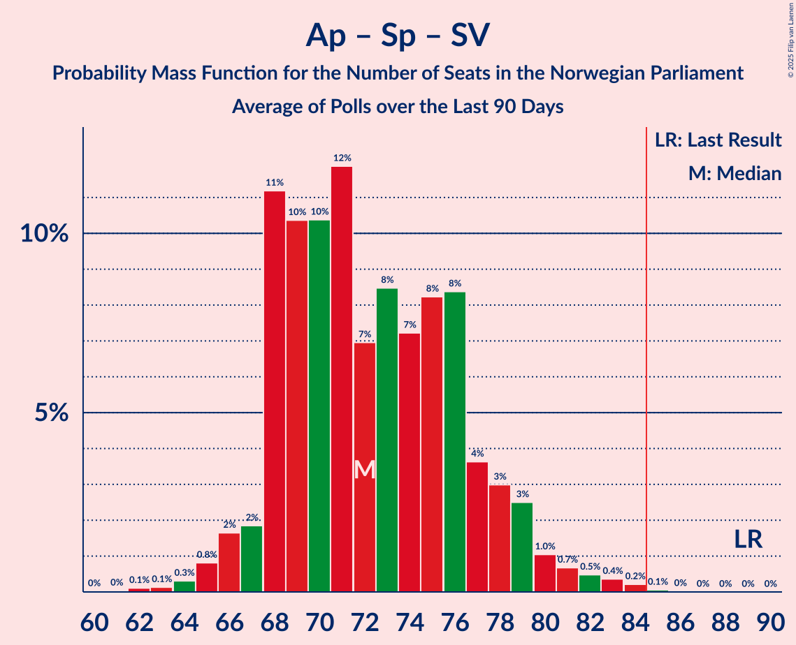

# Poll Average

<a href="#voting-intentions">Voting Intentions</a> | <a href="#seats">Seats</a> | <a href="#coalitions">Coalitions</a> | <a href="#technical-information">Technical Information</a>

## Summary

The table below lists the polls on which the average is based. They are the most recent polls (less than 90 days old) registered and analyzed so far.

| Period     | Polling firm/Commissioner(s) | Ap | H | Sp | FrP | SV | R | V | MDG | KrF | ND | Pp | K | INP | S | Hp | PF | Lib | FP | Kp |
|:----------:|:----------------------------:|:--:|:--:|:--:|:--:|:--:|:--:|:--:|:--:|:--:|:--:|:--:|:--:|:--:|:--:|:--:|:--:|:--:|:--:|:--:|
| 13 September 2021 | General Election | 26.2%   48 | 20.4%   36 | 13.5%   28 | 11.6%   21 | 7.6%   13 | 4.7%   8 | 4.6%   8 | 3.9%   3 | 3.8%   3 | 1.1%   0 | 0.6%   0 | 0.4%   0 | 0.3%   0 | 0.3%   0 | 0.2%   0 | 0.2%   1 | 0.2%   0 | 0.1%   0 | 0.0%   0 |
| N/A | Poll Average | 22–33%   41–64 | 16–23%   29–41 | 5–10%   9–19 | 17–23%   32–44 | 5–8%   9–15 | 3–7%   1–13 | 2–6%   2–11 | 2–5%   1–8 | 2–5%   1–8 | 0–2%   0 | 0–1%   0 | 0–2%   0 | 0–2%   0 | N/A   N/A | N/A   N/A | N/A   N/A | 0–1%   0 | 0–1%   0 | N/A   N/A |
| [14–21 April 2025](2025-04-21-OpinionPerduco.html) | Opinion Perduco   Avisenes Nyhetsbyrå, Dagsavisen and FriFagbevegelse | 28–33%   51–61 | 15–20%   28–35 | 6–9%   10–14 | 18–23%   33–42 | 5–8%   9–14 | 3–6%   1–10 | 3–5%   2–8 | 3–5%   1–8 | 2–4%   1–8 | 0–1%   0 | 0–1%   0 | 1–2%   0 | 0–1%   0 | N/A   N/A | N/A   N/A | N/A   N/A | N/A   N/A | 0–1%   0 | N/A   N/A |
| [2–7 April 2025](2025-04-07-ResponsAnalyse.html) | Respons Analyse   Bergens Tidende and VG | 27–33%   51–64 | 18–23%   32–41 | 5–8%   8–13 | 16–21%   30–39 | 5–8%   9–16 | 4–6%   1–11 | 3–5%   2–9 | 3–5%   1–9 | 2–4%   0–7 | 0–1%   0 | 0–1%   0 | 0–1%   0 | 0–2%   0 | N/A   N/A | N/A   N/A | N/A   N/A | 0–1%   0 | N/A   N/A | N/A   N/A |
| [31 March–7 April 2025](2025-04-07-Norstat.html) | Norstat   Dagbladet, NRK and Vårt Land | 25–31%   47–55 | 17–21%   33–39 | 6–9%   12–15 | 19–24%   35–44 | 5–8%   10–14 | 3–5%   1–9 | 3–5%   2–9 | 2–5%   1–7 | 2–5%   1–8 | 0–1%   0 | 0–1%   0 | 0–1%   0 | 1–3%   0 | N/A   N/A | N/A   N/A | N/A   N/A | N/A   N/A | N/A   N/A | N/A   N/A |
| [1–2 April 2025](2025-04-02-Norfakta.html) | Norfakta   Klassekampen and Nationen | 21–27%   40–50 | 19–25%   32–44 | 7–11%   12–20 | 17–22%   31–40 | 5–9%   9–15 | 3–6%   1–11 | 4–7%   8–13 | 2–4%   1–9 | 2–5%   1–9 | 1–3%   0 | N/A   N/A | 0–2%   0 | 1–2%   0 | N/A   N/A | N/A   N/A | N/A   N/A | N/A   N/A | 0–1%   0 | N/A   N/A |
| [1 April 2025](2025-04-01-InFact.html) | InFact   Nettavisen | 27–32%   49–61 | 16–20%   28–38 | 5–8%   9–15 | 19–24%   35–45 | 5–7%   8–14 | 4–7%   1–13 | 2–4%   1–8 | 2–4%   1–8 | 2–5%   1–8 | 0–1%   0 | N/A   N/A | 0–1%   0 | 1–2%   0 | N/A   N/A | N/A   N/A | N/A   N/A | N/A   N/A | N/A   N/A | N/A   N/A |
| [25–31 March 2025](2025-03-31-Verian.html) | Verian   TV2 | 27–32%   49–60 | 17–22%   31–39 | 5–8%   9–15 | 17–22%   30–39 | 5–8%   9–14 | 5–8%   8–13 | 3–5%   2–10 | 2–4%   0–3 | 3–5%   2–9 | 1–2%   0 | 0–1%   0 | 0–1%   0 | N/A   N/A | N/A   N/A | N/A   N/A | N/A   N/A | N/A   N/A | N/A   N/A | N/A   N/A |
| 13 September 2021 | General Election | 26.2%   48 | 20.4%   36 | 13.5%   28 | 11.6%   21 | 7.6%   13 | 4.7%   8 | 4.6%   8 | 3.9%   3 | 3.8%   3 | 1.1%   0 | 0.6%   0 | 0.4%   0 | 0.3%   0 | 0.3%   0 | 0.2%   0 | 0.2%   1 | 0.2%   0 | 0.1%   0 | 0.0%   0 |

Only polls for which at least the sample size has been published are included in the table above.

**Legend:**
+ **Top half of each row:** Voting intentions (95% confidence interval)
+ **Bottom half of each row:** Seat projections for the Norwegian Parliament (95% confidence interval)
+ **Ap:** Arbeiderpartiet
+ **H:** Høyre
+ **Sp:** Senterpartiet
+ **FrP:** Fremskrittspartiet
+ **SV:** Sosialistisk Venstreparti
+ **R:** Rødt
+ **V:** Venstre
+ **MDG:** Miljøpartiet De Grønne
+ **KrF:** Kristelig Folkeparti
+ **ND:** Norgesdemokratene
+ **Pp:** Pensjonistpartiet
+ **K:** Konservativt
+ **INP:** Industri- og Næringspartiet
+ **S:** Partiet Sentrum
+ **Hp:** Helsepartiet
+ **PF:** Pasientfokus
+ **Lib:** Liberalistene
+ **FP:** Folkets parti
+ **Kp:** Kystpartiet
+ **N/A (single party):** Party not included the published results
+ **N/A (entire row):** Calculation for this opinion poll not started yet

## Voting Intentions

### Confidence Intervals

| Party | Last Result | Median | 80% Confidence Interval | 90% Confidence Interval | 95% Confidence Interval | 99% Confidence Interval |
|:-----:|:-----------:|:------:|:-----------------------:|:-----------------------:|:-----------------------:|:-----------------------:|
| <a href="#arbeiderpartiet">Arbeiderpartiet</a> | 26.2% | 29.1% | 24.3–31.4% |23.2–32.1% | 22.4–32.6% | 21.2–33.6% |
| <a href="#høyre">Høyre</a> | 20.4% | 19.2% | 17.0–21.9% |16.5–22.6% | 16.0–23.2% | 15.2–24.4% |
| <a href="#senterpartiet">Senterpartiet</a> | 13.5% | 6.9% | 5.7–8.5% |5.3–9.1% | 5.1–9.5% | 4.6–10.4% |
| <a href="#fremskrittspartiet">Fremskrittspartiet</a> | 11.6% | 19.9% | 17.8–22.1% |17.3–22.7% | 16.9–23.1% | 16.1–24.1% |
| <a href="#sosialistisk-venstreparti">Sosialistisk Venstreparti</a> | 7.6% | 6.4% | 5.4–7.6% |5.1–7.9% | 4.9–8.2% | 4.5–8.8% |
| <a href="#rødt">Rødt</a> | 4.7% | 4.8% | 3.5–6.3% |3.3–6.7% | 3.1–7.0% | 2.7–7.7% |
| <a href="#venstre">Venstre</a> | 4.6% | 3.9% | 2.9–5.3% |2.7–5.9% | 2.5–6.3% | 2.2–7.0% |
| <a href="#miljøpartiet-de-grønne">Miljøpartiet De Grønne</a> | 3.9% | 3.3% | 2.4–4.3% |2.2–4.6% | 2.0–4.8% | 1.7–5.3% |
| <a href="#kristelig-folkeparti">Kristelig Folkeparti</a> | 3.8% | 3.4% | 2.6–4.3% |2.4–4.6% | 2.3–4.8% | 2.0–5.4% |
| <a href="#norgesdemokratene">Norgesdemokratene</a> | 1.1% | 0.7% | 0.2–1.7% |0.1–1.9% | 0.1–2.2% | 0.1–2.6% |
| <a href="#pensjonistpartiet">Pensjonistpartiet</a> | 0.6% | 0.4% | 0.2–0.8% |0.1–0.9% | 0.1–1.0% | 0.1–1.3% |
| <a href="#konservativt">Konservativt</a> | 0.4% | 0.7% | 0.3–1.5% |0.3–1.7% | 0.2–1.9% | 0.1–2.3% |
| <a href="#industri--og-næringspartiet">Industri- og Næringspartiet</a> | 0.3% | 1.1% | 0.6–1.8% |0.5–2.0% | 0.4–2.2% | 0.3–2.6% |
| <a href="#partiet-sentrum">Partiet Sentrum</a> | 0.3% | N/A | N/A |N/A | N/A | N/A |
| <a href="#helsepartiet">Helsepartiet</a> | 0.2% | N/A | N/A |N/A | N/A | N/A |
| <a href="#pasientfokus">Pasientfokus</a> | 0.2% | N/A | N/A |N/A | N/A | N/A |
| <a href="#liberalistene">Liberalistene</a> | 0.2% | 0.3% | 0.1–0.5% |0.1–0.6% | 0.1–0.7% | 0.0–0.9% |
| <a href="#folkets-parti">Folkets parti</a> | 0.1% | 0.2% | 0.1–0.5% |0.1–0.6% | 0.0–0.7% | 0.0–0.9% |
| <a href="#kystpartiet">Kystpartiet</a> | 0.0% | N/A | N/A |N/A | N/A | N/A |

### Arbeiderpartiet

*For a full overview of the results for this party, see the [Arbeiderpartiet](party-arbeiderpartiet.html) page.*

| Voting Intentions | Probability | Accumulated | Special Marks |
|:-----------------:|:-----------:|:-----------:|:-------------:|
| 18.5–19.5% | 0% | 100% |  |
| 19.5–20.5% | 0.1% | 100% |  |
| 20.5–21.5% | 0.7% | 99.8% |  |
| 21.5–22.5% | 2% | 99.1% |  |
| 22.5–23.5% | 4% | 97% |  |
| 23.5–24.5% | 4% | 93% |  |
| 24.5–25.5% | 4% | 89% |  |
| 25.5–26.5% | 4% | 85% | Last Result |
| 26.5–27.5% | 8% | 81% |  |
| 27.5–28.5% | 13% | 73% |  |
| 28.5–29.5% | 19% | 60% | Median |
| 29.5–30.5% | 19% | 41% |  |
| 30.5–31.5% | 13% | 22% |  |
| 31.5–32.5% | 6% | 9% |  |
| 32.5–33.5% | 2% | 3% |  |
| 33.5–34.5% | 0.5% | 0.5% |  |
| 34.5–35.5% | 0.1% | 0.1% |  |
| 35.5–36.5% | 0% | 0% |  |

### Høyre

*For a full overview of the results for this party, see the [Høyre](party-høyre.html) page.*

| Voting Intentions | Probability | Accumulated | Special Marks |
|:-----------------:|:-----------:|:-----------:|:-------------:|
| 12.5–13.5% | 0% | 100% |  |
| 13.5–14.5% | 0.1% | 100% |  |
| 14.5–15.5% | 1.0% | 99.9% |  |
| 15.5–16.5% | 5% | 98.9% |  |
| 16.5–17.5% | 12% | 94% |  |
| 17.5–18.5% | 18% | 83% |  |
| 18.5–19.5% | 20% | 64% | Median |
| 19.5–20.5% | 18% | 44% | Last Result |
| 20.5–21.5% | 13% | 26% |  |
| 21.5–22.5% | 8% | 13% |  |
| 22.5–23.5% | 4% | 5% |  |
| 23.5–24.5% | 1.3% | 2% |  |
| 24.5–25.5% | 0.3% | 0.4% |  |
| 25.5–26.5% | 0.1% | 0.1% |  |
| 26.5–27.5% | 0% | 0% |  |

### Senterpartiet

*For a full overview of the results for this party, see the [Senterpartiet](party-senterpartiet.html) page.*

| Voting Intentions | Probability | Accumulated | Special Marks |
|:-----------------:|:-----------:|:-----------:|:-------------:|
| 2.5–3.5% | 0% | 100% |  |
| 3.5–4.5% | 0.4% | 100% |  |
| 4.5–5.5% | 8% | 99.6% |  |
| 5.5–6.5% | 29% | 92% |  |
| 6.5–7.5% | 34% | 63% | Median |
| 7.5–8.5% | 19% | 29% |  |
| 8.5–9.5% | 7% | 10% |  |
| 9.5–10.5% | 2% | 2% |  |
| 10.5–11.5% | 0.3% | 0.4% |  |
| 11.5–12.5% | 0% | 0% |  |
| 12.5–13.5% | 0% | 0% |  |
| 13.5–14.5% | 0% | 0% | Last Result |

### Fremskrittspartiet

*For a full overview of the results for this party, see the [Fremskrittspartiet](party-fremskrittspartiet.html) page.*

| Voting Intentions | Probability | Accumulated | Special Marks |
|:-----------------:|:-----------:|:-----------:|:-------------:|
| 11.5–12.5% | 0% | 100% | Last Result |
| 12.5–13.5% | 0% | 100% |  |
| 13.5–14.5% | 0% | 100% |  |
| 14.5–15.5% | 0.1% | 100% |  |
| 15.5–16.5% | 1.2% | 99.9% |  |
| 16.5–17.5% | 5% | 98.6% |  |
| 17.5–18.5% | 14% | 93% |  |
| 18.5–19.5% | 21% | 79% |  |
| 19.5–20.5% | 23% | 58% | Median |
| 20.5–21.5% | 19% | 36% |  |
| 21.5–22.5% | 11% | 17% |  |
| 22.5–23.5% | 4% | 6% |  |
| 23.5–24.5% | 1.1% | 1.3% |  |
| 24.5–25.5% | 0.2% | 0.2% |  |
| 25.5–26.5% | 0% | 0% |  |

### Sosialistisk Venstreparti

*For a full overview of the results for this party, see the [Sosialistisk Venstreparti](party-sosialistiskvenstreparti.html) page.*

| Voting Intentions | Probability | Accumulated | Special Marks |
|:-----------------:|:-----------:|:-----------:|:-------------:|
| 2.5–3.5% | 0% | 100% |  |
| 3.5–4.5% | 0.6% | 100% |  |
| 4.5–5.5% | 13% | 99.4% |  |
| 5.5–6.5% | 42% | 87% | Median |
| 6.5–7.5% | 34% | 44% |  |
| 7.5–8.5% | 9% | 10% | Last Result |
| 8.5–9.5% | 1.0% | 1.1% |  |
| 9.5–10.5% | 0.1% | 0.1% |  |
| 10.5–11.5% | 0% | 0% |  |

### Rødt

*For a full overview of the results for this party, see the [Rødt](party-rødt.html) page.*

| Voting Intentions | Probability | Accumulated | Special Marks |
|:-----------------:|:-----------:|:-----------:|:-------------:|
| 0.5–1.5% | 0% | 100% |  |
| 1.5–2.5% | 0.2% | 100% |  |
| 2.5–3.5% | 10% | 99.8% |  |
| 3.5–4.5% | 32% | 90% |  |
| 4.5–5.5% | 33% | 58% | Last Result, Median |
| 5.5–6.5% | 19% | 25% |  |
| 6.5–7.5% | 5% | 6% |  |
| 7.5–8.5% | 0.7% | 0.8% |  |
| 8.5–9.5% | 0% | 0% |  |

### Venstre

*For a full overview of the results for this party, see the [Venstre](party-venstre.html) page.*

| Voting Intentions | Probability | Accumulated | Special Marks |
|:-----------------:|:-----------:|:-----------:|:-------------:|
| 0.5–1.5% | 0% | 100% |  |
| 1.5–2.5% | 3% | 100% |  |
| 2.5–3.5% | 30% | 97% |  |
| 3.5–4.5% | 42% | 67% | Median |
| 4.5–5.5% | 17% | 25% | Last Result |
| 5.5–6.5% | 6% | 8% |  |
| 6.5–7.5% | 1.3% | 1.5% |  |
| 7.5–8.5% | 0.1% | 0.1% |  |
| 8.5–9.5% | 0% | 0% |  |

### Miljøpartiet De Grønne

*For a full overview of the results for this party, see the [Miljøpartiet De Grønne](party-miljøpartietdegrønne.html) page.*

| Voting Intentions | Probability | Accumulated | Special Marks |
|:-----------------:|:-----------:|:-----------:|:-------------:|
| 0.0–0.5% | 0% | 100% |  |
| 0.5–1.5% | 0.1% | 100% |  |
| 1.5–2.5% | 14% | 99.9% |  |
| 2.5–3.5% | 49% | 86% | Median |
| 3.5–4.5% | 32% | 37% | Last Result |
| 4.5–5.5% | 5% | 5% |  |
| 5.5–6.5% | 0.2% | 0.2% |  |
| 6.5–7.5% | 0% | 0% |  |

### Kristelig Folkeparti

*For a full overview of the results for this party, see the [Kristelig Folkeparti](party-kristeligfolkeparti.html) page.*

| Voting Intentions | Probability | Accumulated | Special Marks |
|:-----------------:|:-----------:|:-----------:|:-------------:|
| 0.5–1.5% | 0% | 100% |  |
| 1.5–2.5% | 7% | 100% |  |
| 2.5–3.5% | 52% | 93% | Median |
| 3.5–4.5% | 35% | 40% | Last Result |
| 4.5–5.5% | 5% | 5% |  |
| 5.5–6.5% | 0.3% | 0.3% |  |
| 6.5–7.5% | 0% | 0% |  |

### Norgesdemokratene

*For a full overview of the results for this party, see the [Norgesdemokratene](party-norgesdemokratene.html) page.*

| Voting Intentions | Probability | Accumulated | Special Marks |
|:-----------------:|:-----------:|:-----------:|:-------------:|
| 0.0–0.5% | 40% | 100% |  |
| 0.5–1.5% | 47% | 60% | Last Result, Median |
| 1.5–2.5% | 13% | 13% |  |
| 2.5–3.5% | 0.6% | 0.6% |  |
| 3.5–4.5% | 0% | 0% |  |

### Pensjonistpartiet

*For a full overview of the results for this party, see the [Pensjonistpartiet](party-pensjonistpartiet.html) page.*

| Voting Intentions | Probability | Accumulated | Special Marks |
|:-----------------:|:-----------:|:-----------:|:-------------:|
| 0.0–0.5% | 70% | 100% | Median |
| 0.5–1.5% | 30% | 30% | Last Result |
| 1.5–2.5% | 0.1% | 0.1% |  |
| 2.5–3.5% | 0% | 0% |  |

### Konservativt

*For a full overview of the results for this party, see the [Konservativt](party-konservativt.html) page.*

| Voting Intentions | Probability | Accumulated | Special Marks |
|:-----------------:|:-----------:|:-----------:|:-------------:|
| 0.0–0.5% | 32% | 100% | Last Result |
| 0.5–1.5% | 60% | 68% | Median |
| 1.5–2.5% | 8% | 8% |  |
| 2.5–3.5% | 0.2% | 0.2% |  |
| 3.5–4.5% | 0% | 0% |  |

### Industri- og Næringspartiet

*For a full overview of the results for this party, see the [Industri- og Næringspartiet](party-industri-ognæringspartiet.html) page.*

| Voting Intentions | Probability | Accumulated | Special Marks |
|:-----------------:|:-----------:|:-----------:|:-------------:|
| 0.0–0.5% | 8% | 100% | Last Result |
| 0.5–1.5% | 73% | 92% | Median |
| 1.5–2.5% | 18% | 19% |  |
| 2.5–3.5% | 0.7% | 0.7% |  |
| 3.5–4.5% | 0% | 0% |  |

### Liberalistene

*For a full overview of the results for this party, see the [Liberalistene](party-liberalistene.html) page.*

| Voting Intentions | Probability | Accumulated | Special Marks |
|:-----------------:|:-----------:|:-----------:|:-------------:|
| 0.0–0.5% | 91% | 100% | Last Result, Median |
| 0.5–1.5% | 9% | 9% |  |
| 1.5–2.5% | 0% | 0% |  |

### Folkets parti

*For a full overview of the results for this party, see the [Folkets parti](party-folketsparti.html) page.*

| Voting Intentions | Probability | Accumulated | Special Marks |
|:-----------------:|:-----------:|:-----------:|:-------------:|
| 0.0–0.5% | 92% | 100% | Last Result, Median |
| 0.5–1.5% | 8% | 8% |  |
| 1.5–2.5% | 0% | 0% |  |

## Seats

### Confidence Intervals

| Party | Last Result | Median | 80% Confidence Interval | 90% Confidence Interval | 95% Confidence Interval | 99% Confidence Interval |
|:-----:|:-----------:|:------:|:-----------------------:|:-----------------------:|:-----------------------:|:-----------------------:|
| <a href="#arbeiderpartiet">Arbeiderpartiet</a> | 48 | 53 | 47–60 |43–61 | 41–64 | 40–64 |
| <a href="#høyre">Høyre</a> | 36 | 34 | 31–39 |30–40 | 29–41 | 28–44 |
| <a href="#senterpartiet">Senterpartiet</a> | 28 | 13 | 10–15 |9–16 | 9–19 | 8–20 |
| <a href="#fremskrittspartiet">Fremskrittspartiet</a> | 21 | 38 | 33–44 |32–44 | 32–44 | 30–45 |
| <a href="#sosialistisk-venstreparti">Sosialistisk Venstreparti</a> | 13 | 12 | 10–13 |9–14 | 9–15 | 8–16 |
| <a href="#rødt">Rødt</a> | 8 | 8 | 1–11 |1–12 | 1–13 | 1–13 |
| <a href="#venstre">Venstre</a> | 8 | 6 | 2–10 |2–10 | 2–11 | 1–13 |
| <a href="#miljøpartiet-de-grønne">Miljøpartiet De Grønne</a> | 3 | 2 | 1–7 |1–8 | 1–8 | 1–9 |
| <a href="#kristelig-folkeparti">Kristelig Folkeparti</a> | 3 | 3 | 1–7 |1–8 | 1–8 | 0–9 |
| <a href="#norgesdemokratene">Norgesdemokratene</a> | 0 | 0 | 0 |0 | 0 | 0 |
| <a href="#pensjonistpartiet">Pensjonistpartiet</a> | 0 | 0 | 0 |0 | 0 | 0 |
| <a href="#konservativt">Konservativt</a> | 0 | 0 | 0 |0 | 0 | 0 |
| <a href="#industri--og-næringspartiet">Industri- og Næringspartiet</a> | 0 | 0 | 0 |0 | 0 | 0 |
| <a href="#partiet-sentrum">Partiet Sentrum</a> | 0 | N/A | N/A |N/A | N/A | N/A |
| <a href="#helsepartiet">Helsepartiet</a> | 0 | N/A | N/A |N/A | N/A | N/A |
| <a href="#pasientfokus">Pasientfokus</a> | 1 | N/A | N/A |N/A | N/A | N/A |
| <a href="#liberalistene">Liberalistene</a> | 0 | 0 | 0 |0 | 0 | 0 |
| <a href="#folkets-parti">Folkets parti</a> | 0 | 0 | 0 |0 | 0 | 0 |
| <a href="#kystpartiet">Kystpartiet</a> | 0 | N/A | N/A |N/A | N/A | N/A |

### Arbeiderpartiet

*For a full overview of the results for this party, see the [Arbeiderpartiet](party-arbeiderpartiet.html) page.*

| Number of Seats | Probability | Accumulated | Special Marks |
|:---------------:|:-----------:|:-----------:|:-------------:|
| 37 | 0% | 100% |  |
| 38 | 0.1% | 99.9% |  |
| 39 | 0.1% | 99.9% |  |
| 40 | 0.5% | 99.8% |  |
| 41 | 3% | 99.3% |  |
| 42 | 1.0% | 96% |  |
| 43 | 2% | 95% |  |
| 44 | 1.2% | 94% |  |
| 45 | 0.7% | 92% |  |
| 46 | 0.7% | 92% |  |
| 47 | 5% | 91% |  |
| 48 | 4% | 86% | Last Result |
| 49 | 2% | 82% |  |
| 50 | 5% | 80% |  |
| 51 | 15% | 75% |  |
| 52 | 5% | 60% |  |
| 53 | 7% | 55% | Median |
| 54 | 19% | 49% |  |
| 55 | 6% | 30% |  |
| 56 | 5% | 24% |  |
| 57 | 4% | 19% |  |
| 58 | 3% | 15% |  |
| 59 | 1.5% | 12% |  |
| 60 | 4% | 10% |  |
| 61 | 2% | 6% |  |
| 62 | 0.6% | 4% |  |
| 63 | 0.1% | 3% |  |
| 64 | 3% | 3% |  |
| 65 | 0% | 0% |  |

### Høyre

*For a full overview of the results for this party, see the [Høyre](party-høyre.html) page.*

| Number of Seats | Probability | Accumulated | Special Marks |
|:---------------:|:-----------:|:-----------:|:-------------:|
| 24 | 0% | 100% |  |
| 25 | 0% | 99.9% |  |
| 26 | 0.1% | 99.9% |  |
| 27 | 0.3% | 99.8% |  |
| 28 | 1.2% | 99.6% |  |
| 29 | 1.2% | 98% |  |
| 30 | 4% | 97% |  |
| 31 | 6% | 94% |  |
| 32 | 5% | 87% |  |
| 33 | 7% | 82% |  |
| 34 | 26% | 74% | Median |
| 35 | 14% | 48% |  |
| 36 | 9% | 34% | Last Result |
| 37 | 8% | 25% |  |
| 38 | 5% | 17% |  |
| 39 | 6% | 12% |  |
| 40 | 1.4% | 6% |  |
| 41 | 3% | 5% |  |
| 42 | 0.3% | 1.5% |  |
| 43 | 0.6% | 1.2% |  |
| 44 | 0.2% | 0.5% |  |
| 45 | 0.2% | 0.3% |  |
| 46 | 0.1% | 0.2% |  |
| 47 | 0% | 0.1% |  |
| 48 | 0% | 0% |  |

### Senterpartiet

*For a full overview of the results for this party, see the [Senterpartiet](party-senterpartiet.html) page.*

| Number of Seats | Probability | Accumulated | Special Marks |
|:---------------:|:-----------:|:-----------:|:-------------:|
| 7 | 0.3% | 100% |  |
| 8 | 1.0% | 99.7% |  |
| 9 | 7% | 98.7% |  |
| 10 | 7% | 92% |  |
| 11 | 10% | 85% |  |
| 12 | 24% | 75% |  |
| 13 | 23% | 52% | Median |
| 14 | 13% | 29% |  |
| 15 | 6% | 15% |  |
| 16 | 5% | 9% |  |
| 17 | 1.3% | 5% |  |
| 18 | 0.8% | 3% |  |
| 19 | 0.8% | 3% |  |
| 20 | 2% | 2% |  |
| 21 | 0.1% | 0.2% |  |
| 22 | 0.1% | 0.1% |  |
| 23 | 0% | 0% |  |
| 24 | 0% | 0% |  |
| 25 | 0% | 0% |  |
| 26 | 0% | 0% |  |
| 27 | 0% | 0% |  |
| 28 | 0% | 0% | Last Result |

### Fremskrittspartiet

*For a full overview of the results for this party, see the [Fremskrittspartiet](party-fremskrittspartiet.html) page.*

| Number of Seats | Probability | Accumulated | Special Marks |
|:---------------:|:-----------:|:-----------:|:-------------:|
| 21 | 0% | 100% | Last Result |
| 22 | 0% | 100% |  |
| 23 | 0% | 100% |  |
| 24 | 0% | 100% |  |
| 25 | 0% | 100% |  |
| 26 | 0% | 100% |  |
| 27 | 0% | 100% |  |
| 28 | 0% | 100% |  |
| 29 | 0.2% | 99.9% |  |
| 30 | 1.1% | 99.7% |  |
| 31 | 0.8% | 98.6% |  |
| 32 | 6% | 98% |  |
| 33 | 3% | 92% |  |
| 34 | 8% | 89% |  |
| 35 | 10% | 81% |  |
| 36 | 11% | 71% |  |
| 37 | 6% | 60% |  |
| 38 | 9% | 54% | Median |
| 39 | 8% | 45% |  |
| 40 | 5% | 38% |  |
| 41 | 4% | 32% |  |
| 42 | 16% | 28% |  |
| 43 | 2% | 12% |  |
| 44 | 9% | 10% |  |
| 45 | 0.6% | 0.9% |  |
| 46 | 0.1% | 0.2% |  |
| 47 | 0.1% | 0.1% |  |
| 48 | 0% | 0% |  |

### Sosialistisk Venstreparti

*For a full overview of the results for this party, see the [Sosialistisk Venstreparti](party-sosialistiskvenstreparti.html) page.*

| Number of Seats | Probability | Accumulated | Special Marks |
|:---------------:|:-----------:|:-----------:|:-------------:|
| 2 | 0% | 100% |  |
| 3 | 0% | 99.9% |  |
| 4 | 0% | 99.9% |  |
| 5 | 0% | 99.9% |  |
| 6 | 0% | 99.9% |  |
| 7 | 0.2% | 99.9% |  |
| 8 | 2% | 99.7% |  |
| 9 | 5% | 98% |  |
| 10 | 12% | 93% |  |
| 11 | 15% | 80% |  |
| 12 | 40% | 65% | Median |
| 13 | 17% | 25% | Last Result |
| 14 | 5% | 8% |  |
| 15 | 1.1% | 3% |  |
| 16 | 2% | 2% |  |
| 17 | 0.2% | 0.3% |  |
| 18 | 0.1% | 0.1% |  |
| 19 | 0% | 0% |  |

### Rødt

*For a full overview of the results for this party, see the [Rødt](party-rødt.html) page.*

| Number of Seats | Probability | Accumulated | Special Marks |
|:---------------:|:-----------:|:-----------:|:-------------:|
| 1 | 21% | 100% |  |
| 2 | 2% | 79% |  |
| 3 | 0.1% | 77% |  |
| 4 | 0% | 77% |  |
| 5 | 0% | 77% |  |
| 6 | 0.4% | 77% |  |
| 7 | 4% | 77% |  |
| 8 | 28% | 72% | Last Result, Median |
| 9 | 13% | 44% |  |
| 10 | 16% | 32% |  |
| 11 | 9% | 16% |  |
| 12 | 4% | 7% |  |
| 13 | 3% | 3% |  |
| 14 | 0.4% | 0.4% |  |
| 15 | 0% | 0.1% |  |
| 16 | 0% | 0% |  |

### Venstre

*For a full overview of the results for this party, see the [Venstre](party-venstre.html) page.*

| Number of Seats | Probability | Accumulated | Special Marks |
|:---------------:|:-----------:|:-----------:|:-------------:|
| 1 | 0.7% | 100% |  |
| 2 | 17% | 99.3% |  |
| 3 | 32% | 82% |  |
| 4 | 0% | 50% |  |
| 5 | 0% | 50% |  |
| 6 | 0.3% | 50% | Median |
| 7 | 9% | 50% |  |
| 8 | 14% | 41% | Last Result |
| 9 | 17% | 27% |  |
| 10 | 7% | 10% |  |
| 11 | 1.4% | 4% |  |
| 12 | 0.8% | 2% |  |
| 13 | 1.2% | 1.4% |  |
| 14 | 0.1% | 0.1% |  |
| 15 | 0.1% | 0.1% |  |
| 16 | 0% | 0% |  |

### Miljøpartiet De Grønne

*For a full overview of the results for this party, see the [Miljøpartiet De Grønne](party-miljøpartietdegrønne.html) page.*

| Number of Seats | Probability | Accumulated | Special Marks |
|:---------------:|:-----------:|:-----------:|:-------------:|
| 0 | 0.5% | 100% |  |
| 1 | 37% | 99.5% |  |
| 2 | 27% | 62% | Median |
| 3 | 20% | 35% | Last Result |
| 4 | 0.1% | 15% |  |
| 5 | 0% | 15% |  |
| 6 | 0.1% | 15% |  |
| 7 | 6% | 14% |  |
| 8 | 6% | 8% |  |
| 9 | 2% | 2% |  |
| 10 | 0.2% | 0.2% |  |
| 11 | 0% | 0% |  |

### Kristelig Folkeparti

*For a full overview of the results for this party, see the [Kristelig Folkeparti](party-kristeligfolkeparti.html) page.*

| Number of Seats | Probability | Accumulated | Special Marks |
|:---------------:|:-----------:|:-----------:|:-------------:|
| 0 | 1.1% | 100% |  |
| 1 | 10% | 98.9% |  |
| 2 | 37% | 89% |  |
| 3 | 37% | 52% | Last Result, Median |
| 4 | 0% | 16% |  |
| 5 | 0% | 16% |  |
| 6 | 0.1% | 16% |  |
| 7 | 6% | 15% |  |
| 8 | 7% | 9% |  |
| 9 | 1.4% | 2% |  |
| 10 | 0.3% | 0.3% |  |
| 11 | 0% | 0% |  |

### Norgesdemokratene

*For a full overview of the results for this party, see the [Norgesdemokratene](party-norgesdemokratene.html) page.*

| Number of Seats | Probability | Accumulated | Special Marks |
|:---------------:|:-----------:|:-----------:|:-------------:|
| 0 | 100% | 100% | Last Result, Median |

### Pensjonistpartiet

*For a full overview of the results for this party, see the [Pensjonistpartiet](party-pensjonistpartiet.html) page.*

| Number of Seats | Probability | Accumulated | Special Marks |
|:---------------:|:-----------:|:-----------:|:-------------:|
| 0 | 100% | 100% | Last Result, Median |

### Konservativt

*For a full overview of the results for this party, see the [Konservativt](party-konservativt.html) page.*

| Number of Seats | Probability | Accumulated | Special Marks |
|:---------------:|:-----------:|:-----------:|:-------------:|
| 0 | 100% | 100% | Last Result, Median |

### Industri- og Næringspartiet

*For a full overview of the results for this party, see the [Industri- og Næringspartiet](party-industri-ognæringspartiet.html) page.*

| Number of Seats | Probability | Accumulated | Special Marks |
|:---------------:|:-----------:|:-----------:|:-------------:|
| 0 | 99.5% | 100% | Last Result, Median |
| 1 | 0.2% | 0.5% |  |
| 2 | 0.3% | 0.3% |  |
| 3 | 0% | 0% |  |

### Partiet Sentrum

*For a full overview of the results for this party, see the [Partiet Sentrum](party-partietsentrum.html) page.*

### Helsepartiet

*For a full overview of the results for this party, see the [Helsepartiet](party-helsepartiet.html) page.*

### Pasientfokus

*For a full overview of the results for this party, see the [Pasientfokus](party-pasientfokus.html) page.*

### Liberalistene

*For a full overview of the results for this party, see the [Liberalistene](party-liberalistene.html) page.*

| Number of Seats | Probability | Accumulated | Special Marks |
|:---------------:|:-----------:|:-----------:|:-------------:|
| 0 | 100% | 100% | Last Result, Median |

### Folkets parti

*For a full overview of the results for this party, see the [Folkets parti](party-folketsparti.html) page.*

| Number of Seats | Probability | Accumulated | Special Marks |
|:---------------:|:-----------:|:-----------:|:-------------:|
| 0 | 100% | 100% | Last Result, Median |

### Kystpartiet

*For a full overview of the results for this party, see the [Kystpartiet](party-kystpartiet.html) page.*

## Coalitions

### Confidence Intervals

| Coalition | Last Result | Median | Majority? | 80% Confidence Interval | 90% Confidence Interval | 95% Confidence Interval | 99% Confidence Interval |
|:---------:|:-----------:|:------:|:---------:|:-----------------------:|:-----------------------:|:-----------------------:|:-----------------------:|
| Høyre – Senterpartiet – Fremskrittspartiet – Venstre – Kristelig Folkeparti | 96 | 94 | 94% | 86–103 | 84–106 | 80–107 | 79–110 |
| Arbeiderpartiet – Senterpartiet – Sosialistisk Venstreparti – Rødt – Miljøpartiet De Grønne | 100 | 88 | 73% | 78–95 | 78–97 | 77–98 | 73–102 |
| Arbeiderpartiet – Senterpartiet – Sosialistisk Venstreparti – Rødt | 97 | 85 | 56% | 76–92 | 76–94 | 74–96 | 69–96 |
| Høyre – Fremskrittspartiet – Venstre – Miljøpartiet De Grønne – Kristelig Folkeparti | 71 | 84 | 44% | 77–93 | 75–93 | 73–95 | 73–100 |
| Arbeiderpartiet – Senterpartiet – Sosialistisk Venstreparti – Miljøpartiet De Grønne – Kristelig Folkeparti | 95 | 82 | 28% | 79–89 | 77–91 | 75–92 | 73–96 |
| Høyre – Fremskrittspartiet – Venstre – Kristelig Folkeparti | 68 | 81 | 27% | 74–91 | 72–91 | 71–92 | 67–95 |
| Arbeiderpartiet – Senterpartiet – Sosialistisk Venstreparti – Miljøpartiet De Grønne | 92 | 80 | 16% | 75–86 | 72–88 | 72–89 | 68–95 |
| Høyre – Fremskrittspartiet – Venstre | 65 | 79 | 17% | 71–88 | 69–88 | 68–89 | 64–90 |
| Arbeiderpartiet – Sosialistisk Venstreparti – Rødt – Miljøpartiet De Grønne | 72 | 75 | 6% | 65–83 | 63–85 | 61–89 | 58–90 |
| Arbeiderpartiet – Senterpartiet – Sosialistisk Venstreparti | 89 | 77 | 5% | 73–83 | 70–85 | 69–86 | 66–87 |
| Arbeiderpartiet – Senterpartiet – Miljøpartiet De Grønne – Kristelig Folkeparti | 82 | 70 | 0.4% | 66–78 | 65–79 | 63–81 | 61–84 |
| Høyre – Fremskrittspartiet | 57 | 74 | 0.1% | 67–79 | 65–79 | 63–79 | 62–81 |
| Arbeiderpartiet – Sosialistisk Venstreparti | 61 | 65 | 0% | 59–71 | 55–73 | 53–77 | 51–77 |
| Arbeiderpartiet – Senterpartiet – Kristelig Folkeparti | 79 | 69 | 0% | 64–74 | 62–76 | 60–76 | 59–79 |
| Arbeiderpartiet – Senterpartiet | 76 | 65 | 0% | 61–71 | 59–73 | 57–73 | 55–75 |
| Høyre – Venstre – Kristelig Folkeparti | 47 | 43 | 0% | 39–51 | 36–54 | 34–55 | 32–58 |
| Senterpartiet – Venstre – Kristelig Folkeparti | 39 | 21 | 0% | 16–29 | 15–31 | 15–32 | 13–35 |

### Høyre – Senterpartiet – Fremskrittspartiet – Venstre – Kristelig Folkeparti

| Number of Seats | Probability | Accumulated | Special Marks |
|:---------------:|:-----------:|:-----------:|:-------------:|
| 79 | 0.5% | 100% |  |
| 80 | 3% | 99.5% |  |
| 81 | 0.1% | 97% |  |
| 82 | 0.1% | 96% |  |
| 83 | 0.5% | 96% |  |
| 84 | 2% | 96% |  |
| 85 | 4% | 94% | Majority |
| 86 | 2% | 91% |  |
| 87 | 2% | 89% |  |
| 88 | 2% | 87% |  |
| 89 | 4% | 85% |  |
| 90 | 7% | 81% |  |
| 91 | 8% | 75% |  |
| 92 | 6% | 66% |  |
| 93 | 6% | 60% |  |
| 94 | 19% | 54% | Median |
| 95 | 2% | 36% |  |
| 96 | 3% | 34% | Last Result |
| 97 | 4% | 31% |  |
| 98 | 1.3% | 27% |  |
| 99 | 2% | 26% |  |
| 100 | 0.7% | 24% |  |
| 101 | 1.1% | 24% |  |
| 102 | 3% | 23% |  |
| 103 | 12% | 20% |  |
| 104 | 0.9% | 8% |  |
| 105 | 2% | 8% |  |
| 106 | 0.5% | 5% |  |
| 107 | 2% | 5% |  |
| 108 | 0.8% | 2% |  |
| 109 | 1.1% | 2% |  |
| 110 | 0.2% | 0.6% |  |
| 111 | 0% | 0.4% |  |
| 112 | 0.2% | 0.4% |  |
| 113 | 0.1% | 0.1% |  |
| 114 | 0% | 0% |  |

### Arbeiderpartiet – Senterpartiet – Sosialistisk Venstreparti – Rødt – Miljøpartiet De Grønne

| Number of Seats | Probability | Accumulated | Special Marks |
|:---------------:|:-----------:|:-----------:|:-------------:|
| 70 | 0% | 100% |  |
| 71 | 0% | 99.9% |  |
| 72 | 0% | 99.9% |  |
| 73 | 0.5% | 99.9% |  |
| 74 | 0.1% | 99.4% |  |
| 75 | 0.5% | 99.3% |  |
| 76 | 1.3% | 98.8% |  |
| 77 | 2% | 98% |  |
| 78 | 8% | 96% |  |
| 79 | 2% | 87% |  |
| 80 | 0.6% | 86% |  |
| 81 | 5% | 85% |  |
| 82 | 3% | 80% |  |
| 83 | 2% | 76% |  |
| 84 | 2% | 75% |  |
| 85 | 4% | 73% | Majority |
| 86 | 5% | 68% |  |
| 87 | 3% | 63% |  |
| 88 | 21% | 60% | Median |
| 89 | 4% | 39% |  |
| 90 | 9% | 34% |  |
| 91 | 7% | 26% |  |
| 92 | 4% | 19% |  |
| 93 | 2% | 15% |  |
| 94 | 2% | 13% |  |
| 95 | 5% | 11% |  |
| 96 | 1.1% | 6% |  |
| 97 | 1.3% | 5% |  |
| 98 | 3% | 4% |  |
| 99 | 0.1% | 0.9% |  |
| 100 | 0.1% | 0.7% | Last Result |
| 101 | 0.1% | 0.6% |  |
| 102 | 0% | 0.5% |  |
| 103 | 0% | 0.5% |  |
| 104 | 0.5% | 0.5% |  |
| 105 | 0% | 0% |  |

### Arbeiderpartiet – Senterpartiet – Sosialistisk Venstreparti – Rødt

| Number of Seats | Probability | Accumulated | Special Marks |
|:---------------:|:-----------:|:-----------:|:-------------:|
| 67 | 0.4% | 100% |  |
| 68 | 0% | 99.5% |  |
| 69 | 0% | 99.5% |  |
| 70 | 0.4% | 99.5% |  |
| 71 | 0.1% | 99.0% |  |
| 72 | 0.1% | 98.9% |  |
| 73 | 0.2% | 98.8% |  |
| 74 | 2% | 98.6% |  |
| 75 | 0.9% | 97% |  |
| 76 | 10% | 96% |  |
| 77 | 1.4% | 86% |  |
| 78 | 4% | 84% |  |
| 79 | 2% | 81% |  |
| 80 | 3% | 79% |  |
| 81 | 3% | 76% |  |
| 82 | 3% | 73% |  |
| 83 | 10% | 70% |  |
| 84 | 4% | 60% |  |
| 85 | 7% | 56% | Majority |
| 86 | 5% | 50% | Median |
| 87 | 19% | 44% |  |
| 88 | 4% | 25% |  |
| 89 | 5% | 22% |  |
| 90 | 5% | 17% |  |
| 91 | 1.3% | 11% |  |
| 92 | 1.3% | 10% |  |
| 93 | 2% | 9% |  |
| 94 | 3% | 7% |  |
| 95 | 0.5% | 4% |  |
| 96 | 4% | 4% |  |
| 97 | 0.1% | 0.2% | Last Result |
| 98 | 0% | 0.1% |  |
| 99 | 0% | 0% |  |

### Høyre – Fremskrittspartiet – Venstre – Miljøpartiet De Grønne – Kristelig Folkeparti

| Number of Seats | Probability | Accumulated | Special Marks |
|:---------------:|:-----------:|:-----------:|:-------------:|
| 71 | 0% | 100% | Last Result |
| 72 | 0.1% | 99.9% |  |
| 73 | 4% | 99.8% |  |
| 74 | 0.5% | 96% |  |
| 75 | 3% | 96% |  |
| 76 | 2% | 93% |  |
| 77 | 1.3% | 91% |  |
| 78 | 1.3% | 90% |  |
| 79 | 5% | 89% |  |
| 80 | 5% | 83% |  |
| 81 | 4% | 78% |  |
| 82 | 19% | 75% |  |
| 83 | 5% | 56% | Median |
| 84 | 7% | 50% |  |
| 85 | 4% | 44% | Majority |
| 86 | 10% | 40% |  |
| 87 | 3% | 30% |  |
| 88 | 3% | 27% |  |
| 89 | 3% | 24% |  |
| 90 | 5% | 21% |  |
| 91 | 1.4% | 17% |  |
| 92 | 1.1% | 15% |  |
| 93 | 10% | 14% |  |
| 94 | 1.4% | 4% |  |
| 95 | 1.4% | 3% |  |
| 96 | 0.1% | 1.3% |  |
| 97 | 0.2% | 1.2% |  |
| 98 | 0.5% | 1.0% |  |
| 99 | 0% | 0.5% |  |
| 100 | 0% | 0.5% |  |
| 101 | 0.4% | 0.5% |  |
| 102 | 0% | 0% |  |

### Arbeiderpartiet – Senterpartiet – Sosialistisk Venstreparti – Miljøpartiet De Grønne – Kristelig Folkeparti

| Number of Seats | Probability | Accumulated | Special Marks |
|:---------------:|:-----------:|:-----------:|:-------------:|
| 68 | 0.1% | 100% |  |
| 69 | 0% | 99.8% |  |
| 70 | 0% | 99.8% |  |
| 71 | 0.2% | 99.8% |  |
| 72 | 0% | 99.6% |  |
| 73 | 0.2% | 99.6% |  |
| 74 | 0.4% | 99.4% |  |
| 75 | 3% | 99.0% |  |
| 76 | 0.7% | 96% |  |
| 77 | 2% | 95% |  |
| 78 | 3% | 93% |  |
| 79 | 6% | 90% |  |
| 80 | 12% | 84% |  |
| 81 | 7% | 72% |  |
| 82 | 24% | 66% |  |
| 83 | 5% | 42% | Median |
| 84 | 9% | 37% |  |
| 85 | 4% | 28% | Majority |
| 86 | 4% | 23% |  |
| 87 | 4% | 20% |  |
| 88 | 4% | 16% |  |
| 89 | 4% | 12% |  |
| 90 | 1.2% | 8% |  |
| 91 | 4% | 7% |  |
| 92 | 1.0% | 3% |  |
| 93 | 0.3% | 2% |  |
| 94 | 0.2% | 1.5% |  |
| 95 | 0.2% | 1.2% | Last Result |
| 96 | 0.7% | 1.0% |  |
| 97 | 0.3% | 0.3% |  |
| 98 | 0% | 0.1% |  |
| 99 | 0% | 0% |  |

### Høyre – Fremskrittspartiet – Venstre – Kristelig Folkeparti

| Number of Seats | Probability | Accumulated | Special Marks |
|:---------------:|:-----------:|:-----------:|:-------------:|
| 65 | 0.5% | 100% |  |
| 66 | 0% | 99.5% |  |
| 67 | 0% | 99.5% |  |
| 68 | 0.1% | 99.5% | Last Result |
| 69 | 0.1% | 99.4% |  |
| 70 | 0.1% | 99.3% |  |
| 71 | 3% | 99.1% |  |
| 72 | 1.3% | 96% |  |
| 73 | 1.1% | 95% |  |
| 74 | 5% | 94% |  |
| 75 | 2% | 89% |  |
| 76 | 2% | 87% |  |
| 77 | 4% | 85% |  |
| 78 | 7% | 81% |  |
| 79 | 9% | 74% |  |
| 80 | 4% | 66% |  |
| 81 | 21% | 61% | Median |
| 82 | 3% | 40% |  |
| 83 | 5% | 37% |  |
| 84 | 4% | 32% |  |
| 85 | 2% | 27% | Majority |
| 86 | 2% | 25% |  |
| 87 | 6% | 23% |  |
| 88 | 3% | 18% |  |
| 89 | 0.7% | 15% |  |
| 90 | 2% | 14% |  |
| 91 | 8% | 12% |  |
| 92 | 3% | 4% |  |
| 93 | 0.4% | 1.3% |  |
| 94 | 0.2% | 0.9% |  |
| 95 | 0.5% | 0.7% |  |
| 96 | 0% | 0.1% |  |
| 97 | 0% | 0.1% |  |
| 98 | 0% | 0.1% |  |
| 99 | 0% | 0% |  |

### Arbeiderpartiet – Senterpartiet – Sosialistisk Venstreparti – Miljøpartiet De Grønne

| Number of Seats | Probability | Accumulated | Special Marks |
|:---------------:|:-----------:|:-----------:|:-------------:|
| 66 | 0.1% | 100% |  |
| 67 | 0.1% | 99.8% |  |
| 68 | 0.4% | 99.8% |  |
| 69 | 0.2% | 99.4% |  |
| 70 | 0.3% | 99.2% |  |
| 71 | 0.4% | 99.0% |  |
| 72 | 4% | 98.6% |  |
| 73 | 1.2% | 95% |  |
| 74 | 3% | 94% |  |
| 75 | 6% | 91% |  |
| 76 | 6% | 85% |  |
| 77 | 11% | 79% |  |
| 78 | 7% | 67% |  |
| 79 | 6% | 60% |  |
| 80 | 19% | 55% | Median |
| 81 | 5% | 36% |  |
| 82 | 8% | 31% |  |
| 83 | 4% | 23% |  |
| 84 | 3% | 18% |  |
| 85 | 5% | 16% | Majority |
| 86 | 2% | 11% |  |
| 87 | 2% | 9% |  |
| 88 | 3% | 6% |  |
| 89 | 1.0% | 3% |  |
| 90 | 0.4% | 2% |  |
| 91 | 0.4% | 2% |  |
| 92 | 0.4% | 1.3% | Last Result |
| 93 | 0.1% | 0.9% |  |
| 94 | 0.1% | 0.8% |  |
| 95 | 0.7% | 0.8% |  |
| 96 | 0% | 0% |  |

### Høyre – Fremskrittspartiet – Venstre

| Number of Seats | Probability | Accumulated | Special Marks |
|:---------------:|:-----------:|:-----------:|:-------------:|
| 64 | 0.5% | 100% |  |
| 65 | 0.1% | 99.4% | Last Result |
| 66 | 0.1% | 99.4% |  |
| 67 | 0.3% | 99.2% |  |
| 68 | 3% | 98.9% |  |
| 69 | 1.1% | 96% |  |
| 70 | 1.4% | 95% |  |
| 71 | 5% | 93% |  |
| 72 | 3% | 88% |  |
| 73 | 2% | 86% |  |
| 74 | 3% | 83% |  |
| 75 | 3% | 80% |  |
| 76 | 8% | 77% |  |
| 77 | 12% | 69% |  |
| 78 | 5% | 57% | Median |
| 79 | 18% | 52% |  |
| 80 | 5% | 33% |  |
| 81 | 4% | 28% |  |
| 82 | 2% | 25% |  |
| 83 | 1.3% | 22% |  |
| 84 | 4% | 21% |  |
| 85 | 3% | 17% | Majority |
| 86 | 0.5% | 13% |  |
| 87 | 2% | 13% |  |
| 88 | 9% | 11% |  |
| 89 | 1.4% | 3% |  |
| 90 | 0.7% | 1.1% |  |
| 91 | 0.2% | 0.4% |  |
| 92 | 0.1% | 0.2% |  |
| 93 | 0.1% | 0.1% |  |
| 94 | 0% | 0% |  |

### Arbeiderpartiet – Sosialistisk Venstreparti – Rødt – Miljøpartiet De Grønne

| Number of Seats | Probability | Accumulated | Special Marks |
|:---------------:|:-----------:|:-----------:|:-------------:|
| 56 | 0.1% | 100% |  |
| 57 | 0.2% | 99.9% |  |
| 58 | 0.2% | 99.6% |  |
| 59 | 1.0% | 99.5% |  |
| 60 | 0.2% | 98% |  |
| 61 | 1.2% | 98% |  |
| 62 | 2% | 97% |  |
| 63 | 0.7% | 95% |  |
| 64 | 2% | 94% |  |
| 65 | 3% | 92% |  |
| 66 | 9% | 89% |  |
| 67 | 3% | 80% |  |
| 68 | 1.0% | 77% |  |
| 69 | 0.9% | 76% |  |
| 70 | 1.4% | 75% |  |
| 71 | 1.3% | 74% |  |
| 72 | 4% | 73% | Last Result |
| 73 | 3% | 69% |  |
| 74 | 2% | 66% |  |
| 75 | 19% | 64% | Median |
| 76 | 6% | 46% |  |
| 77 | 6% | 40% |  |
| 78 | 8% | 34% |  |
| 79 | 7% | 25% |  |
| 80 | 4% | 19% |  |
| 81 | 2% | 15% |  |
| 82 | 2% | 13% |  |
| 83 | 2% | 11% |  |
| 84 | 4% | 9% |  |
| 85 | 2% | 6% | Majority |
| 86 | 0.5% | 4% |  |
| 87 | 0.1% | 4% |  |
| 88 | 0.1% | 4% |  |
| 89 | 3% | 3% |  |
| 90 | 0.5% | 0.5% |  |
| 91 | 0% | 0% |  |

### Arbeiderpartiet – Senterpartiet – Sosialistisk Venstreparti

| Number of Seats | Probability | Accumulated | Special Marks |
|:---------------:|:-----------:|:-----------:|:-------------:|
| 64 | 0% | 100% |  |
| 65 | 0.1% | 99.9% |  |
| 66 | 0.5% | 99.8% |  |
| 67 | 0.5% | 99.3% |  |
| 68 | 0.2% | 98.8% |  |
| 69 | 4% | 98.6% |  |
| 70 | 1.1% | 95% |  |
| 71 | 0.9% | 94% |  |
| 72 | 3% | 93% |  |
| 73 | 7% | 90% |  |
| 74 | 6% | 83% |  |
| 75 | 17% | 77% |  |
| 76 | 6% | 59% |  |
| 77 | 6% | 54% |  |
| 78 | 7% | 48% | Median |
| 79 | 19% | 41% |  |
| 80 | 5% | 22% |  |
| 81 | 3% | 17% |  |
| 82 | 1.5% | 14% |  |
| 83 | 3% | 12% |  |
| 84 | 4% | 9% |  |
| 85 | 0.5% | 5% | Majority |
| 86 | 3% | 5% |  |
| 87 | 0.9% | 1.3% |  |
| 88 | 0.2% | 0.4% |  |
| 89 | 0% | 0.2% | Last Result |
| 90 | 0.1% | 0.2% |  |
| 91 | 0% | 0% |  |

### Arbeiderpartiet – Senterpartiet – Miljøpartiet De Grønne – Kristelig Folkeparti

| Number of Seats | Probability | Accumulated | Special Marks |
|:---------------:|:-----------:|:-----------:|:-------------:|
| 57 | 0% | 100% |  |
| 58 | 0.2% | 99.9% |  |
| 59 | 0.1% | 99.7% |  |
| 60 | 0.1% | 99.6% |  |
| 61 | 0.1% | 99.5% |  |
| 62 | 0.4% | 99.4% |  |
| 63 | 3% | 99.0% |  |
| 64 | 1.0% | 96% |  |
| 65 | 3% | 95% |  |
| 66 | 4% | 92% |  |
| 67 | 4% | 88% |  |
| 68 | 13% | 84% |  |
| 69 | 2% | 71% |  |
| 70 | 19% | 69% |  |
| 71 | 6% | 50% | Median |
| 72 | 14% | 44% |  |
| 73 | 5% | 30% |  |
| 74 | 4% | 25% |  |
| 75 | 5% | 21% |  |
| 76 | 3% | 17% |  |
| 77 | 3% | 14% |  |
| 78 | 6% | 11% |  |
| 79 | 1.3% | 5% |  |
| 80 | 0.9% | 4% |  |
| 81 | 1.0% | 3% |  |
| 82 | 0.8% | 2% | Last Result |
| 83 | 0.1% | 1.0% |  |
| 84 | 0.5% | 0.9% |  |
| 85 | 0.3% | 0.4% | Majority |
| 86 | 0.1% | 0.1% |  |
| 87 | 0% | 0% |  |

### Høyre – Fremskrittspartiet

| Number of Seats | Probability | Accumulated | Special Marks |
|:---------------:|:-----------:|:-----------:|:-------------:|
| 57 | 0% | 100% | Last Result |
| 58 | 0% | 100% |  |
| 59 | 0% | 100% |  |
| 60 | 0% | 100% |  |
| 61 | 0.2% | 99.9% |  |
| 62 | 0.6% | 99.7% |  |
| 63 | 2% | 99.1% |  |
| 64 | 0.4% | 97% |  |
| 65 | 4% | 97% |  |
| 66 | 1.2% | 93% |  |
| 67 | 2% | 92% |  |
| 68 | 4% | 89% |  |
| 69 | 9% | 86% |  |
| 70 | 8% | 76% |  |
| 71 | 8% | 69% |  |
| 72 | 5% | 60% | Median |
| 73 | 6% | 56% |  |
| 74 | 8% | 50% |  |
| 75 | 5% | 43% |  |
| 76 | 19% | 38% |  |
| 77 | 4% | 18% |  |
| 78 | 3% | 15% |  |
| 79 | 10% | 12% |  |
| 80 | 1.1% | 2% |  |
| 81 | 0.5% | 0.8% |  |
| 82 | 0.1% | 0.3% |  |
| 83 | 0% | 0.2% |  |
| 84 | 0.1% | 0.1% |  |
| 85 | 0% | 0.1% | Majority |
| 86 | 0% | 0% |  |

### Arbeiderpartiet – Sosialistisk Venstreparti

| Number of Seats | Probability | Accumulated | Special Marks |
|:---------------:|:-----------:|:-----------:|:-------------:|
| 50 | 0.1% | 100% |  |
| 51 | 0.5% | 99.8% |  |
| 52 | 0.1% | 99.3% |  |
| 53 | 3% | 99.2% |  |
| 54 | 1.2% | 96% |  |
| 55 | 0.8% | 95% |  |
| 56 | 2% | 94% |  |
| 57 | 0.6% | 93% |  |
| 58 | 1.0% | 92% |  |
| 59 | 6% | 91% |  |
| 60 | 5% | 85% |  |
| 61 | 3% | 80% | Last Result |
| 62 | 3% | 77% |  |
| 63 | 18% | 74% |  |
| 64 | 5% | 56% |  |
| 65 | 5% | 51% | Median |
| 66 | 20% | 47% |  |
| 67 | 7% | 27% |  |
| 68 | 4% | 20% |  |
| 69 | 3% | 16% |  |
| 70 | 2% | 13% |  |
| 71 | 1.2% | 11% |  |
| 72 | 2% | 10% |  |
| 73 | 4% | 7% |  |
| 74 | 0.5% | 4% |  |
| 75 | 0.1% | 3% |  |
| 76 | 0.2% | 3% |  |
| 77 | 3% | 3% |  |
| 78 | 0% | 0% |  |

### Arbeiderpartiet – Senterpartiet – Kristelig Folkeparti

| Number of Seats | Probability | Accumulated | Special Marks |
|:---------------:|:-----------:|:-----------:|:-------------:|
| 55 | 0% | 100% |  |
| 56 | 0% | 99.9% |  |
| 57 | 0.3% | 99.9% |  |
| 58 | 0.1% | 99.6% |  |
| 59 | 0.2% | 99.5% |  |
| 60 | 3% | 99.4% |  |
| 61 | 0.8% | 97% |  |
| 62 | 2% | 96% |  |
| 63 | 3% | 94% |  |
| 64 | 4% | 91% |  |
| 65 | 8% | 86% |  |
| 66 | 13% | 78% |  |
| 67 | 5% | 65% |  |
| 68 | 7% | 60% |  |
| 69 | 20% | 54% | Median |
| 70 | 8% | 34% |  |
| 71 | 4% | 26% |  |
| 72 | 4% | 22% |  |
| 73 | 3% | 18% |  |
| 74 | 6% | 15% |  |
| 75 | 3% | 10% |  |
| 76 | 4% | 6% |  |
| 77 | 0.8% | 2% |  |
| 78 | 0.9% | 2% |  |
| 79 | 0.3% | 0.7% | Last Result |
| 80 | 0.3% | 0.4% |  |
| 81 | 0% | 0.1% |  |
| 82 | 0% | 0% |  |

### Arbeiderpartiet – Senterpartiet

| Number of Seats | Probability | Accumulated | Special Marks |
|:---------------:|:-----------:|:-----------:|:-------------:|
| 52 | 0.1% | 100% |  |
| 53 | 0% | 99.9% |  |
| 54 | 0.3% | 99.9% |  |
| 55 | 0.3% | 99.6% |  |
| 56 | 0.5% | 99.3% |  |
| 57 | 3% | 98.7% |  |
| 58 | 0.6% | 96% |  |
| 59 | 1.2% | 95% |  |
| 60 | 3% | 94% |  |
| 61 | 5% | 91% |  |
| 62 | 5% | 85% |  |
| 63 | 18% | 81% |  |
| 64 | 4% | 63% |  |
| 65 | 9% | 58% |  |
| 66 | 5% | 49% | Median |
| 67 | 20% | 44% |  |
| 68 | 6% | 24% |  |
| 69 | 2% | 18% |  |
| 70 | 3% | 16% |  |
| 71 | 4% | 12% |  |
| 72 | 2% | 8% |  |
| 73 | 5% | 6% |  |
| 74 | 0.3% | 2% |  |
| 75 | 0.8% | 1.3% |  |
| 76 | 0.4% | 0.5% | Last Result |
| 77 | 0% | 0.1% |  |
| 78 | 0% | 0.1% |  |
| 79 | 0% | 0% |  |

### Høyre – Venstre – Kristelig Folkeparti

| Number of Seats | Probability | Accumulated | Special Marks |
|:---------------:|:-----------:|:-----------:|:-------------:|
| 30 | 0% | 100% |  |
| 31 | 0% | 99.9% |  |
| 32 | 0.6% | 99.9% |  |
| 33 | 1.0% | 99.4% |  |
| 34 | 0.9% | 98% |  |
| 35 | 2% | 97% |  |
| 36 | 2% | 96% |  |
| 37 | 1.3% | 94% |  |
| 38 | 2% | 93% |  |
| 39 | 19% | 90% |  |
| 40 | 7% | 71% |  |
| 41 | 6% | 64% |  |
| 42 | 5% | 58% |  |
| 43 | 7% | 52% | Median |
| 44 | 3% | 45% |  |
| 45 | 4% | 42% |  |
| 46 | 4% | 38% |  |
| 47 | 11% | 34% | Last Result |
| 48 | 5% | 22% |  |
| 49 | 5% | 18% |  |
| 50 | 3% | 13% |  |
| 51 | 1.0% | 10% |  |
| 52 | 3% | 9% |  |
| 53 | 0.7% | 6% |  |
| 54 | 2% | 5% |  |
| 55 | 1.2% | 3% |  |
| 56 | 1.2% | 2% |  |
| 57 | 0.4% | 0.9% |  |
| 58 | 0.2% | 0.5% |  |
| 59 | 0.1% | 0.3% |  |
| 60 | 0.1% | 0.2% |  |
| 61 | 0% | 0.2% |  |
| 62 | 0% | 0.1% |  |
| 63 | 0.1% | 0.1% |  |
| 64 | 0% | 0% |  |

### Senterpartiet – Venstre – Kristelig Folkeparti

| Number of Seats | Probability | Accumulated | Special Marks |
|:---------------:|:-----------:|:-----------:|:-------------:|
| 12 | 0.1% | 100% |  |
| 13 | 0.6% | 99.8% |  |
| 14 | 2% | 99.2% |  |
| 15 | 6% | 98% |  |
| 16 | 5% | 91% |  |
| 17 | 7% | 86% |  |
| 18 | 19% | 79% |  |
| 19 | 5% | 61% |  |
| 20 | 4% | 56% |  |
| 21 | 5% | 52% |  |
| 22 | 7% | 46% | Median |
| 23 | 3% | 39% |  |
| 24 | 10% | 36% |  |
| 25 | 7% | 26% |  |
| 26 | 5% | 19% |  |
| 27 | 1.2% | 14% |  |
| 28 | 1.2% | 13% |  |
| 29 | 3% | 11% |  |
| 30 | 1.3% | 8% |  |
| 31 | 4% | 7% |  |
| 32 | 0.8% | 3% |  |
| 33 | 0.3% | 2% |  |
| 34 | 0.3% | 2% |  |
| 35 | 0.8% | 1.3% |  |
| 36 | 0.1% | 0.4% |  |
| 37 | 0.3% | 0.4% |  |
| 38 | 0.1% | 0.1% |  |
| 39 | 0% | 0% | Last Result |

## Technical Information

+ **Number of polls included in this average:** 6
+ **Lowest number of simulations done in a poll included in this average:** 2,097,152
+ **Total number of simulations done in the polls included in this average:** 12,582,912
+ **Error estimate:** 3.20%
