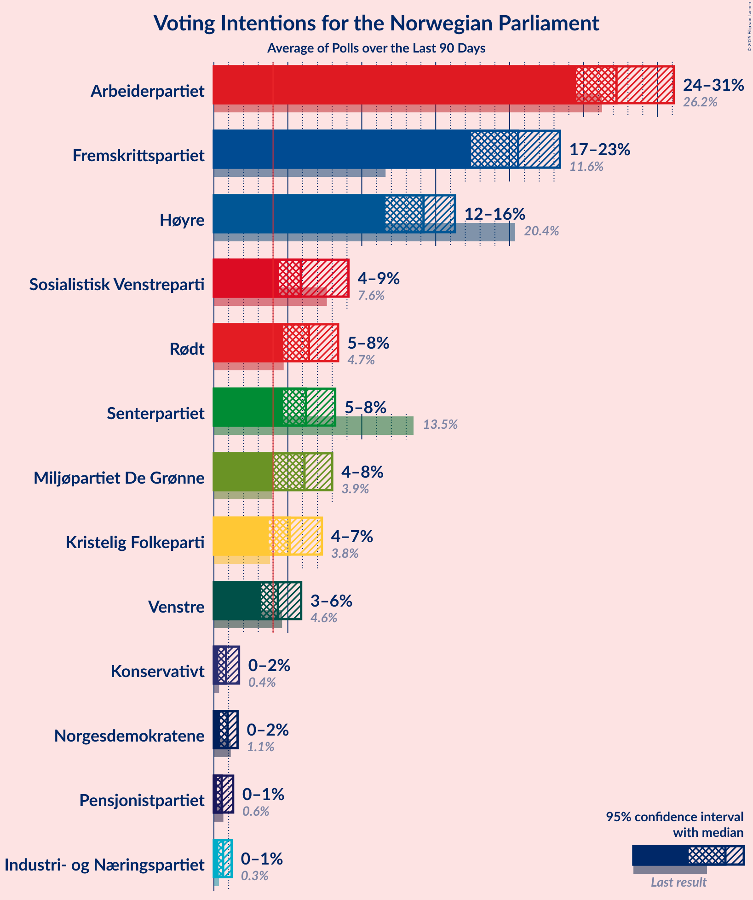

# Poll Average

<a href="#voting-intentions">Voting Intentions</a> | <a href="#seats">Seats</a> | <a href="#coalitions">Coalitions</a> | <a href="#technical-information">Technical Information</a>

## Summary

The table below lists the polls on which the average is based. They are the most recent polls (less than 90 days old) registered and analyzed so far.

| Period     | Polling firm/Commissioner(s) | Ap | H | FrP | Sp | SV | V | KrF | MDG | R |
|:----------:|:----------------------------:|:--:|:--:|:--:|:--:|:--:|:--:|:--:|:--:|:--:|
| 8–9 September 2013 | General Election | 27.4%   49 | 25.0%   45 | 15.2%   27 | 10.3%   19 | 6.0%   11 | 4.4%   8 | 4.2%   8 | 3.2%   1 | 2.4%   1 |
| N/A | Poll Average | 21–28%   38–52 | 22–29%   36–53 | 9–14%   15–26 | 12–17%   19–33 | 6–9%   10–17 | 1–5%   0–8 | 2–5%   0–10 | 3–8%   1–13 | 3–6%   1–11 |
| [2–8 June 2020](2020-06-08-OpinionPerduco.html) | Opinion Perduco | 22–29%   40–52 | 21–28%   35–50 | 8–13%   14–22 | 12–17%   20–34 | 5–9%   9–17 | 2–5%   1–8 | 3–6%   1–10 | 4–8%   2–13 | 3–6%   2–11 |
| [2–4 June 2020](2020-06-04-ResponsAnalyse.html) | Respons Analyse   VG | 21–26%   40–46 | 22–27%   38–47 | 10–15%   20–26 | 12–17%   21–30 | 5–9%   10–15 | 2–4%   1–6 | 3–5%   1–8 | 4–7%   7–12 | 4–6%   2–11 |
| [2–3 June 2020](2020-06-03-Norfakta.html) | Norfakta   Klassekampen and Nationen | 21–26%   38–47 | 22–27%   37–50 | 10–14%   18–27 | 13–17%   22–32 | 6–9%   10–15 | 2–4%   1–7 | 3–6%   3–10 | 3–5%   1–9 | 4–6%   2–11 |
| [26 May–1 June 2020](2020-06-01-Norstat.html) | Norstat   Aftenposten and NRK | 20–27%   36–47 | 23–29%   39–52 | 10–15%   17–26 | 12–17%   22–33 | 5–9%   9–17 | 2–4%   0–2 | 2–5%   1–8 | 4–8%   7–14 | 3–7%   2–11 |
| [25–29 May 2020](2020-05-29-KantarTNS.html) | Kantar TNS   TV2 | 21–27%   37–48 | 24–31%   43–54 | 10–14%   18–27 | 11–16%   20–30 | 6–9%   10–16 | 1–3%   0–2 | 2–5%   1–9 | 3–7%   2–12 | 3–6%   2–11 |
| [25–28 May 2020](2020-05-28-IpsosMMI.html) | Ipsos MMI   Dagbladet | 22–29%   41–55 | 22–29%   39–52 | 8–12%   13–22 | 11–16%   19–31 | 6–10%   10–18 | 2–5%   1–9 | 2–4%   0–7 | 5–8%   8–15 | 3–6%   1–10 |
| [12–16 May 2020](2020-05-16-Sentio.html) | Sentio   Amedia and Nettavisen | 23–28%   41–53 | 23–29%   42–53 | 9–13%   16–23 | 12–16%   20–29 | 6–9%   10–16 | 2–5%   1–8 | 3–5%   1–10 | 3–6%   1–10 | 2–5%   1–8 |
| 8–9 September 2013 | General Election | 27.4%   49 | 25.0%   45 | 15.2%   27 | 10.3%   19 | 6.0%   11 | 4.4%   8 | 4.2%   8 | 3.2%   1 | 2.4%   1 |

Only polls for which at least the sample size has been published are included in the table above.

**Legend:**
+ **Top half of each row:** Voting intentions (95% confidence interval)
+ **Bottom half of each row:** Seat projections for the Norwegian Parliament (95% confidence interval)
+ **Ap:** Arbeiderpartiet
+ **H:** Høyre
+ **FrP:** Fremskrittspartiet
+ **Sp:** Senterpartiet
+ **SV:** Sosialistisk Venstreparti
+ **V:** Venstre
+ **KrF:** Kristelig Folkeparti
+ **MDG:** Miljøpartiet De Grønne
+ **R:** Rødt
+ **N/A (single party):** Party not included the published results
+ **N/A (entire row):** Calculation for this opinion poll not started yet

## Voting Intentions

### Confidence Intervals

| Party | Last Result | Median | 80% Confidence Interval | 90% Confidence Interval | 95% Confidence Interval | 99% Confidence Interval |
|:-----:|:-----------:|:------:|:-----------------------:|:-----------------------:|:-----------------------:|:-----------------------:|
| <a href="#arbeiderpartiet">Arbeiderpartiet</a> | 27.4% | 24.3% | 22.1–26.7% |21.5–27.4% | 21.0–28.0% | 20.1–29.1% |
| <a href="#høyre">Høyre</a> | 25.0% | 25.3% | 23.0–27.9% |22.4–28.6% | 21.9–29.2% | 21.0–30.5% |
| <a href="#fremskrittspartiet">Fremskrittspartiet</a> | 15.2% | 11.5% | 9.7–13.3% |9.2–13.8% | 8.7–14.2% | 8.0–15.0% |
| <a href="#senterpartiet">Senterpartiet</a> | 10.3% | 14.1% | 12.4–15.9% |11.9–16.4% | 11.5–16.9% | 10.7–17.8% |
| <a href="#sosialistisk-venstreparti">Sosialistisk Venstreparti</a> | 6.0% | 7.2% | 6.1–8.5% |5.8–8.9% | 5.5–9.2% | 5.1–9.9% |
| <a href="#venstre">Venstre</a> | 4.4% | 3.1% | 1.8–4.1% |1.5–4.4% | 1.2–4.7% | 0.9–5.3% |
| <a href="#kristelig-folkeparti">Kristelig Folkeparti</a> | 4.2% | 3.8% | 2.7–4.9% |2.3–5.2% | 2.1–5.4% | 1.7–6.0% |
| <a href="#miljøpartiet-de-grønne">Miljøpartiet De Grønne</a> | 3.2% | 5.2% | 3.8–6.7% |3.5–7.1% | 3.3–7.5% | 2.9–8.3% |
| <a href="#rødt">Rødt</a> | 2.4% | 4.5% | 3.3–5.6% |3.0–6.0% | 2.8–6.2% | 2.4–6.8% |

### Arbeiderpartiet

*For a full overview of the results for this party, see the [Arbeiderpartiet](party-arbeiderpartiet.html) page.*

| Voting Intentions | Probability | Accumulated | Special Marks |
|:-----------------:|:-----------:|:-----------:|:-------------:|
| 17.5–18.5% | 0% | 100% |  |
| 18.5–19.5% | 0.1% | 100% |  |
| 19.5–20.5% | 1.0% | 99.8% |  |
| 20.5–21.5% | 4% | 98.9% |  |
| 21.5–22.5% | 11% | 95% |  |
| 22.5–23.5% | 18% | 84% |  |
| 23.5–24.5% | 22% | 66% | Median |
| 24.5–25.5% | 19% | 44% |  |
| 25.5–26.5% | 14% | 25% |  |
| 26.5–27.5% | 7% | 12% | Last Result |
| 27.5–28.5% | 3% | 4% |  |
| 28.5–29.5% | 0.9% | 1.2% |  |
| 29.5–30.5% | 0.2% | 0.2% |  |
| 30.5–31.5% | 0% | 0% |  |

### Høyre

*For a full overview of the results for this party, see the [Høyre](party-høyre.html) page.*

| Voting Intentions | Probability | Accumulated | Special Marks |
|:-----------------:|:-----------:|:-----------:|:-------------:|
| 18.5–19.5% | 0% | 100% |  |
| 19.5–20.5% | 0.2% | 100% |  |
| 20.5–21.5% | 1.2% | 99.8% |  |
| 21.5–22.5% | 5% | 98.6% |  |
| 22.5–23.5% | 11% | 94% |  |
| 23.5–24.5% | 18% | 83% |  |
| 24.5–25.5% | 20% | 65% | Last Result, Median |
| 25.5–26.5% | 18% | 44% |  |
| 26.5–27.5% | 13% | 26% |  |
| 27.5–28.5% | 8% | 13% |  |
| 28.5–29.5% | 4% | 5% |  |
| 29.5–30.5% | 1.3% | 2% |  |
| 30.5–31.5% | 0.4% | 0.5% |  |
| 31.5–32.5% | 0.1% | 0.1% |  |
| 32.5–33.5% | 0% | 0% |  |

### Fremskrittspartiet

*For a full overview of the results for this party, see the [Fremskrittspartiet](party-fremskrittspartiet.html) page.*

| Voting Intentions | Probability | Accumulated | Special Marks |
|:-----------------:|:-----------:|:-----------:|:-------------:|
| 5.5–6.5% | 0% | 100% |  |
| 6.5–7.5% | 0.1% | 100% |  |
| 7.5–8.5% | 2% | 99.9% |  |
| 8.5–9.5% | 7% | 98% |  |
| 9.5–10.5% | 16% | 91% |  |
| 10.5–11.5% | 25% | 75% |  |
| 11.5–12.5% | 26% | 50% | Median |
| 12.5–13.5% | 17% | 24% |  |
| 13.5–14.5% | 6% | 7% |  |
| 14.5–15.5% | 1.2% | 1.3% | Last Result |
| 15.5–16.5% | 0.1% | 0.2% |  |
| 16.5–17.5% | 0% | 0% |  |

### Senterpartiet

*For a full overview of the results for this party, see the [Senterpartiet](party-senterpartiet.html) page.*

| Voting Intentions | Probability | Accumulated | Special Marks |
|:-----------------:|:-----------:|:-----------:|:-------------:|
| 8.5–9.5% | 0% | 100% |  |
| 9.5–10.5% | 0.3% | 100% | Last Result |
| 10.5–11.5% | 2% | 99.7% |  |
| 11.5–12.5% | 9% | 97% |  |
| 12.5–13.5% | 21% | 88% |  |
| 13.5–14.5% | 29% | 67% | Median |
| 14.5–15.5% | 23% | 38% |  |
| 15.5–16.5% | 11% | 15% |  |
| 16.5–17.5% | 3% | 4% |  |
| 17.5–18.5% | 0.7% | 0.8% |  |
| 18.5–19.5% | 0.1% | 0.1% |  |
| 19.5–20.5% | 0% | 0% |  |

### Sosialistisk Venstreparti

*For a full overview of the results for this party, see the [Sosialistisk Venstreparti](party-sosialistiskvenstreparti.html) page.*

| Voting Intentions | Probability | Accumulated | Special Marks |
|:-----------------:|:-----------:|:-----------:|:-------------:|
| 3.5–4.5% | 0.1% | 100% |  |
| 4.5–5.5% | 3% | 99.9% |  |
| 5.5–6.5% | 21% | 97% | Last Result |
| 6.5–7.5% | 41% | 77% | Median |
| 7.5–8.5% | 27% | 36% |  |
| 8.5–9.5% | 7% | 9% |  |
| 9.5–10.5% | 1.1% | 1.2% |  |
| 10.5–11.5% | 0.1% | 0.1% |  |
| 11.5–12.5% | 0% | 0% |  |

### Venstre

*For a full overview of the results for this party, see the [Venstre](party-venstre.html) page.*

| Voting Intentions | Probability | Accumulated | Special Marks |
|:-----------------:|:-----------:|:-----------:|:-------------:|
| 0.0–0.5% | 0% | 100% |  |
| 0.5–1.5% | 6% | 100% |  |
| 1.5–2.5% | 21% | 94% |  |
| 2.5–3.5% | 46% | 73% | Median |
| 3.5–4.5% | 24% | 27% | Last Result |
| 4.5–5.5% | 3% | 4% |  |
| 5.5–6.5% | 0.2% | 0.2% |  |
| 6.5–7.5% | 0% | 0% |  |

### Kristelig Folkeparti

*For a full overview of the results for this party, see the [Kristelig Folkeparti](party-kristeligfolkeparti.html) page.*

| Voting Intentions | Probability | Accumulated | Special Marks |
|:-----------------:|:-----------:|:-----------:|:-------------:|
| 0.0–0.5% | 0% | 100% |  |
| 0.5–1.5% | 0.2% | 100% |  |
| 1.5–2.5% | 8% | 99.8% |  |
| 2.5–3.5% | 32% | 92% |  |
| 3.5–4.5% | 43% | 60% | Last Result, Median |
| 4.5–5.5% | 16% | 18% |  |
| 5.5–6.5% | 2% | 2% |  |
| 6.5–7.5% | 0.1% | 0.1% |  |
| 7.5–8.5% | 0% | 0% |  |

### Miljøpartiet De Grønne

*For a full overview of the results for this party, see the [Miljøpartiet De Grønne](party-miljøpartietdegrønne.html) page.*

| Voting Intentions | Probability | Accumulated | Special Marks |
|:-----------------:|:-----------:|:-----------:|:-------------:|
| 1.5–2.5% | 0.1% | 100% |  |
| 2.5–3.5% | 5% | 99.9% | Last Result |
| 3.5–4.5% | 24% | 95% |  |
| 4.5–5.5% | 34% | 71% | Median |
| 5.5–6.5% | 25% | 37% |  |
| 6.5–7.5% | 10% | 12% |  |
| 7.5–8.5% | 2% | 2% |  |
| 8.5–9.5% | 0.3% | 0.3% |  |
| 9.5–10.5% | 0% | 0% |  |

### Rødt

*For a full overview of the results for this party, see the [Rødt](party-rødt.html) page.*

| Voting Intentions | Probability | Accumulated | Special Marks |
|:-----------------:|:-----------:|:-----------:|:-------------:|
| 0.5–1.5% | 0% | 100% |  |
| 1.5–2.5% | 1.1% | 100% | Last Result |
| 2.5–3.5% | 16% | 98.9% |  |
| 3.5–4.5% | 37% | 83% | Median |
| 4.5–5.5% | 35% | 46% |  |
| 5.5–6.5% | 10% | 11% |  |
| 6.5–7.5% | 1.1% | 1.1% |  |
| 7.5–8.5% | 0.1% | 0.1% |  |
| 8.5–9.5% | 0% | 0% |  |

## Seats

### Confidence Intervals

| Party | Last Result | Median | 80% Confidence Interval | 90% Confidence Interval | 95% Confidence Interval | 99% Confidence Interval |
|:-----:|:-----------:|:------:|:-----------------------:|:-----------------------:|:-----------------------:|:-----------------------:|
| <a href="#arbeiderpartiet">Arbeiderpartiet</a> | 49 | 43 | 40–48 |39–50 | 38–52 | 35–55 |
| <a href="#høyre">Høyre</a> | 45 | 45 | 40–52 |38–52 | 36–53 | 35–55 |
| <a href="#fremskrittspartiet">Fremskrittspartiet</a> | 27 | 21 | 16–24 |15–25 | 15–26 | 13–27 |
| <a href="#senterpartiet">Senterpartiet</a> | 19 | 25 | 21–29 |20–31 | 19–33 | 19–34 |
| <a href="#sosialistisk-venstreparti">Sosialistisk Venstreparti</a> | 11 | 13 | 11–15 |10–16 | 10–17 | 9–18 |
| <a href="#venstre">Venstre</a> | 8 | 2 | 0–7 |0–8 | 0–8 | 0–9 |
| <a href="#kristelig-folkeparti">Kristelig Folkeparti</a> | 8 | 3 | 1–8 |1–9 | 0–10 | 0–10 |
| <a href="#miljøpartiet-de-grønne">Miljøpartiet De Grønne</a> | 1 | 9 | 2–11 |2–12 | 1–13 | 1–15 |
| <a href="#rødt">Rødt</a> | 1 | 8 | 2–10 |1–11 | 1–11 | 1–12 |

### Arbeiderpartiet

*For a full overview of the results for this party, see the [Arbeiderpartiet](party-arbeiderpartiet.html) page.*

| Number of Seats | Probability | Accumulated | Special Marks |
|:---------------:|:-----------:|:-----------:|:-------------:|
| 34 | 0.2% | 100% |  |
| 35 | 0.3% | 99.7% |  |
| 36 | 0.2% | 99.5% |  |
| 37 | 0.7% | 99.2% |  |
| 38 | 2% | 98.6% |  |
| 39 | 2% | 97% |  |
| 40 | 17% | 95% |  |
| 41 | 17% | 78% |  |
| 42 | 8% | 61% |  |
| 43 | 9% | 54% | Median |
| 44 | 8% | 44% |  |
| 45 | 5% | 36% |  |
| 46 | 11% | 31% |  |
| 47 | 7% | 20% |  |
| 48 | 3% | 13% |  |
| 49 | 3% | 10% | Last Result |
| 50 | 2% | 7% |  |
| 51 | 2% | 5% |  |
| 52 | 1.1% | 3% |  |
| 53 | 0.8% | 2% |  |
| 54 | 0.3% | 0.9% |  |
| 55 | 0.4% | 0.6% |  |
| 56 | 0% | 0.2% |  |
| 57 | 0.1% | 0.2% |  |
| 58 | 0% | 0.1% |  |
| 59 | 0% | 0% |  |

### Høyre

*For a full overview of the results for this party, see the [Høyre](party-høyre.html) page.*

| Number of Seats | Probability | Accumulated | Special Marks |
|:---------------:|:-----------:|:-----------:|:-------------:|
| 33 | 0.1% | 100% |  |
| 34 | 0.1% | 99.9% |  |
| 35 | 1.3% | 99.9% |  |
| 36 | 2% | 98.6% |  |
| 37 | 2% | 97% |  |
| 38 | 1.2% | 95% |  |
| 39 | 3% | 94% |  |
| 40 | 2% | 91% |  |
| 41 | 7% | 90% |  |
| 42 | 7% | 83% |  |
| 43 | 6% | 76% |  |
| 44 | 16% | 70% |  |
| 45 | 9% | 54% | Last Result, Median |
| 46 | 7% | 44% |  |
| 47 | 8% | 37% |  |
| 48 | 5% | 29% |  |
| 49 | 7% | 24% |  |
| 50 | 4% | 18% |  |
| 51 | 3% | 14% |  |
| 52 | 8% | 11% |  |
| 53 | 1.0% | 3% |  |
| 54 | 0.9% | 2% |  |
| 55 | 0.6% | 0.8% |  |
| 56 | 0.1% | 0.2% |  |
| 57 | 0.1% | 0.2% |  |
| 58 | 0% | 0.1% |  |
| 59 | 0% | 0.1% |  |
| 60 | 0% | 0% |  |

### Fremskrittspartiet

*For a full overview of the results for this party, see the [Fremskrittspartiet](party-fremskrittspartiet.html) page.*

| Number of Seats | Probability | Accumulated | Special Marks |
|:---------------:|:-----------:|:-----------:|:-------------:|
| 12 | 0.3% | 100% |  |
| 13 | 0.5% | 99.7% |  |
| 14 | 1.5% | 99.2% |  |
| 15 | 5% | 98% |  |
| 16 | 3% | 93% |  |
| 17 | 5% | 90% |  |
| 18 | 10% | 85% |  |
| 19 | 11% | 75% |  |
| 20 | 13% | 64% |  |
| 21 | 13% | 51% | Median |
| 22 | 16% | 38% |  |
| 23 | 6% | 21% |  |
| 24 | 7% | 15% |  |
| 25 | 4% | 8% |  |
| 26 | 3% | 4% |  |
| 27 | 1.2% | 1.3% | Last Result |
| 28 | 0.1% | 0.1% |  |
| 29 | 0% | 0% |  |

### Senterpartiet

*For a full overview of the results for this party, see the [Senterpartiet](party-senterpartiet.html) page.*

| Number of Seats | Probability | Accumulated | Special Marks |
|:---------------:|:-----------:|:-----------:|:-------------:|
| 18 | 0.3% | 100% |  |
| 19 | 2% | 99.7% | Last Result |
| 20 | 5% | 97% |  |
| 21 | 4% | 92% |  |
| 22 | 9% | 88% |  |
| 23 | 10% | 79% |  |
| 24 | 9% | 69% |  |
| 25 | 10% | 60% | Median |
| 26 | 8% | 50% |  |
| 27 | 17% | 42% |  |
| 28 | 11% | 25% |  |
| 29 | 4% | 13% |  |
| 30 | 3% | 10% |  |
| 31 | 2% | 7% |  |
| 32 | 2% | 5% |  |
| 33 | 3% | 3% |  |
| 34 | 0.3% | 0.7% |  |
| 35 | 0.1% | 0.4% |  |
| 36 | 0.2% | 0.2% |  |
| 37 | 0% | 0% |  |

### Sosialistisk Venstreparti

*For a full overview of the results for this party, see the [Sosialistisk Venstreparti](party-sosialistiskvenstreparti.html) page.*

| Number of Seats | Probability | Accumulated | Special Marks |
|:---------------:|:-----------:|:-----------:|:-------------:|
| 8 | 0.2% | 100% |  |
| 9 | 2% | 99.8% |  |
| 10 | 8% | 98% |  |
| 11 | 16% | 91% | Last Result |
| 12 | 21% | 75% |  |
| 13 | 23% | 54% | Median |
| 14 | 12% | 31% |  |
| 15 | 10% | 18% |  |
| 16 | 5% | 8% |  |
| 17 | 1.4% | 3% |  |
| 18 | 2% | 2% |  |
| 19 | 0.2% | 0.3% |  |
| 20 | 0% | 0.1% |  |
| 21 | 0% | 0% |  |

### Venstre

*For a full overview of the results for this party, see the [Venstre](party-venstre.html) page.*

| Number of Seats | Probability | Accumulated | Special Marks |
|:---------------:|:-----------:|:-----------:|:-------------:|
| 0 | 15% | 100% |  |
| 1 | 18% | 85% |  |
| 2 | 54% | 67% | Median |
| 3 | 0.1% | 13% |  |
| 4 | 0% | 13% |  |
| 5 | 0% | 13% |  |
| 6 | 1.1% | 13% |  |
| 7 | 4% | 12% |  |
| 8 | 7% | 7% | Last Result |
| 9 | 0.6% | 0.8% |  |
| 10 | 0.1% | 0.2% |  |
| 11 | 0% | 0% |  |

### Kristelig Folkeparti

*For a full overview of the results for this party, see the [Kristelig Folkeparti](party-kristeligfolkeparti.html) page.*

| Number of Seats | Probability | Accumulated | Special Marks |
|:---------------:|:-----------:|:-----------:|:-------------:|
| 0 | 4% | 100% |  |
| 1 | 16% | 96% |  |
| 2 | 9% | 80% |  |
| 3 | 37% | 71% | Median |
| 4 | 0% | 34% |  |
| 5 | 0% | 34% |  |
| 6 | 0.6% | 34% |  |
| 7 | 12% | 34% |  |
| 8 | 12% | 22% | Last Result |
| 9 | 5% | 9% |  |
| 10 | 4% | 4% |  |
| 11 | 0.3% | 0.4% |  |
| 12 | 0% | 0.1% |  |
| 13 | 0% | 0% |  |

### Miljøpartiet De Grønne

*For a full overview of the results for this party, see the [Miljøpartiet De Grønne](party-miljøpartietdegrønne.html) page.*

| Number of Seats | Probability | Accumulated | Special Marks |
|:---------------:|:-----------:|:-----------:|:-------------:|
| 1 | 4% | 100% | Last Result |
| 2 | 7% | 96% |  |
| 3 | 2% | 89% |  |
| 4 | 0.3% | 87% |  |
| 5 | 0% | 87% |  |
| 6 | 0.1% | 87% |  |
| 7 | 3% | 87% |  |
| 8 | 20% | 84% |  |
| 9 | 24% | 64% | Median |
| 10 | 17% | 40% |  |
| 11 | 13% | 23% |  |
| 12 | 5% | 10% |  |
| 13 | 2% | 4% |  |
| 14 | 1.4% | 2% |  |
| 15 | 0.3% | 0.7% |  |
| 16 | 0.2% | 0.3% |  |
| 17 | 0.1% | 0.1% |  |
| 18 | 0% | 0% |  |

### Rødt

*For a full overview of the results for this party, see the [Rødt](party-rødt.html) page.*

| Number of Seats | Probability | Accumulated | Special Marks |
|:---------------:|:-----------:|:-----------:|:-------------:|
| 1 | 7% | 100% | Last Result |
| 2 | 22% | 93% |  |
| 3 | 0% | 71% |  |
| 4 | 0% | 71% |  |
| 5 | 0% | 71% |  |
| 6 | 0.3% | 71% |  |
| 7 | 18% | 71% |  |
| 8 | 24% | 52% | Median |
| 9 | 17% | 29% |  |
| 10 | 7% | 12% |  |
| 11 | 4% | 5% |  |
| 12 | 0.6% | 0.9% |  |
| 13 | 0.2% | 0.2% |  |
| 14 | 0% | 0% |  |

## Coalitions

### Confidence Intervals

| Coalition | Last Result | Median | Majority? | 80% Confidence Interval | 90% Confidence Interval | 95% Confidence Interval | 99% Confidence Interval |
|:---------:|:-----------:|:------:|:---------:|:-----------------------:|:-----------------------:|:-----------------------:|:-----------------------:|
| Høyre – Fremskrittspartiet – Senterpartiet – Venstre – Kristelig Folkeparti | 107 | 98 | 99.3% | 92–104 | 90–105 | 88–107 | 84–110 |
| Arbeiderpartiet – Senterpartiet – Sosialistisk Venstreparti – Kristelig Folkeparti – Miljøpartiet De Grønne | 88 | 93 | 99.2% | 89–101 | 88–104 | 87–106 | 84–108 |
| Arbeiderpartiet – Senterpartiet – Sosialistisk Venstreparti – Miljøpartiet De Grønne – Rødt | 81 | 97 | 99.7% | 90–104 | 89–105 | 87–106 | 86–110 |
| Arbeiderpartiet – Senterpartiet – Sosialistisk Venstreparti – Miljøpartiet De Grønne | 80 | 90 | 88% | 84–98 | 82–98 | 81–100 | 78–104 |
| Arbeiderpartiet – Senterpartiet – Sosialistisk Venstreparti – Rødt | 80 | 88 | 83% | 83–95 | 82–95 | 80–97 | 78–100 |
| Arbeiderpartiet – Senterpartiet – Kristelig Folkeparti – Miljøpartiet De Grønne | 77 | 81 | 25% | 76–88 | 74–92 | 74–93 | 71–96 |
| Arbeiderpartiet – Senterpartiet – Sosialistisk Venstreparti | 79 | 81 | 25% | 77–88 | 75–89 | 74–91 | 72–94 |
| Høyre – Fremskrittspartiet – Venstre – Kristelig Folkeparti – Miljøpartiet De Grønne | 89 | 81 | 17% | 74–86 | 74–87 | 72–89 | 69–91 |
| Arbeiderpartiet – Senterpartiet – Kristelig Folkeparti | 76 | 73 | 2% | 67–80 | 65–83 | 65–84 | 62–87 |
| Høyre – Fremskrittspartiet – Venstre – Kristelig Folkeparti | 88 | 72 | 0.3% | 65–79 | 64–80 | 63–82 | 59–83 |
| Arbeiderpartiet – Senterpartiet | 68 | 68 | 0% | 64–75 | 63–76 | 62–78 | 59–80 |
| Høyre – Fremskrittspartiet – Venstre | 80 | 68 | 0% | 61–74 | 60–76 | 57–76 | 55–79 |
| Høyre – Fremskrittspartiet | 72 | 66 | 0% | 59–72 | 56–72 | 54–74 | 52–79 |
| Arbeiderpartiet – Sosialistisk Venstreparti | 60 | 56 | 0% | 51–62 | 51–64 | 50–65 | 48–69 |
| Høyre – Venstre – Kristelig Folkeparti | 61 | 51 | 0% | 46–58 | 45–60 | 44–60 | 42–62 |
| Senterpartiet – Venstre – Kristelig Folkeparti | 35 | 32 | 0% | 26–38 | 25–40 | 24–41 | 22–45 |

### Høyre – Fremskrittspartiet – Senterpartiet – Venstre – Kristelig Folkeparti

| Number of Seats | Probability | Accumulated | Special Marks |
|:---------------:|:-----------:|:-----------:|:-------------:|
| 79 | 0.1% | 100% |  |
| 80 | 0% | 99.9% |  |
| 81 | 0% | 99.9% |  |
| 82 | 0% | 99.9% |  |
| 83 | 0.1% | 99.8% |  |
| 84 | 0.5% | 99.7% |  |
| 85 | 0.2% | 99.3% | Majority |
| 86 | 0.6% | 99.1% |  |
| 87 | 0.6% | 98% |  |
| 88 | 0.8% | 98% |  |
| 89 | 0.6% | 97% |  |
| 90 | 2% | 96% |  |
| 91 | 3% | 94% |  |
| 92 | 6% | 91% |  |
| 93 | 4% | 85% |  |
| 94 | 5% | 82% |  |
| 95 | 9% | 77% |  |
| 96 | 5% | 67% | Median |
| 97 | 11% | 63% |  |
| 98 | 10% | 52% |  |
| 99 | 10% | 42% |  |
| 100 | 6% | 32% |  |
| 101 | 5% | 25% |  |
| 102 | 5% | 20% |  |
| 103 | 4% | 15% |  |
| 104 | 6% | 11% |  |
| 105 | 2% | 5% |  |
| 106 | 0.9% | 3% |  |
| 107 | 0.9% | 3% | Last Result |
| 108 | 0.6% | 2% |  |
| 109 | 0.4% | 1.1% |  |
| 110 | 0.1% | 0.6% |  |
| 111 | 0.4% | 0.5% |  |
| 112 | 0% | 0.1% |  |
| 113 | 0% | 0% |  |

### Arbeiderpartiet – Senterpartiet – Sosialistisk Venstreparti – Kristelig Folkeparti – Miljøpartiet De Grønne

| Number of Seats | Probability | Accumulated | Special Marks |
|:---------------:|:-----------:|:-----------:|:-------------:|
| 81 | 0.2% | 100% |  |
| 82 | 0.1% | 99.8% |  |
| 83 | 0.1% | 99.7% |  |
| 84 | 0.4% | 99.6% |  |
| 85 | 0.5% | 99.2% | Majority |
| 86 | 0.9% | 98.7% |  |
| 87 | 3% | 98% |  |
| 88 | 2% | 95% | Last Result |
| 89 | 5% | 93% |  |
| 90 | 6% | 89% |  |
| 91 | 7% | 82% |  |
| 92 | 10% | 75% |  |
| 93 | 16% | 66% | Median |
| 94 | 8% | 49% |  |
| 95 | 8% | 42% |  |
| 96 | 5% | 34% |  |
| 97 | 4% | 29% |  |
| 98 | 6% | 25% |  |
| 99 | 3% | 20% |  |
| 100 | 3% | 17% |  |
| 101 | 5% | 13% |  |
| 102 | 2% | 9% |  |
| 103 | 0.7% | 7% |  |
| 104 | 3% | 6% |  |
| 105 | 0.5% | 3% |  |
| 106 | 2% | 3% |  |
| 107 | 0.4% | 1.3% |  |
| 108 | 0.4% | 0.9% |  |
| 109 | 0.2% | 0.4% |  |
| 110 | 0.2% | 0.3% |  |
| 111 | 0% | 0% |  |

### Arbeiderpartiet – Senterpartiet – Sosialistisk Venstreparti – Miljøpartiet De Grønne – Rødt

| Number of Seats | Probability | Accumulated | Special Marks |
|:---------------:|:-----------:|:-----------:|:-------------:|
| 81 | 0% | 100% | Last Result |
| 82 | 0.1% | 100% |  |
| 83 | 0.1% | 99.8% |  |
| 84 | 0.1% | 99.8% |  |
| 85 | 0.1% | 99.7% | Majority |
| 86 | 0.5% | 99.6% |  |
| 87 | 2% | 99.1% |  |
| 88 | 0.6% | 97% |  |
| 89 | 2% | 97% |  |
| 90 | 6% | 94% |  |
| 91 | 2% | 89% |  |
| 92 | 7% | 87% |  |
| 93 | 3% | 80% |  |
| 94 | 9% | 77% |  |
| 95 | 6% | 68% |  |
| 96 | 8% | 62% |  |
| 97 | 10% | 54% |  |
| 98 | 13% | 44% | Median |
| 99 | 3% | 31% |  |
| 100 | 6% | 28% |  |
| 101 | 5% | 21% |  |
| 102 | 5% | 17% |  |
| 103 | 2% | 12% |  |
| 104 | 2% | 10% |  |
| 105 | 4% | 8% |  |
| 106 | 1.3% | 4% |  |
| 107 | 1.4% | 2% |  |
| 108 | 0.3% | 1.0% |  |
| 109 | 0.1% | 0.6% |  |
| 110 | 0.2% | 0.5% |  |
| 111 | 0.2% | 0.3% |  |
| 112 | 0% | 0.1% |  |
| 113 | 0.1% | 0.1% |  |
| 114 | 0% | 0% |  |

### Arbeiderpartiet – Senterpartiet – Sosialistisk Venstreparti – Miljøpartiet De Grønne

| Number of Seats | Probability | Accumulated | Special Marks |
|:---------------:|:-----------:|:-----------:|:-------------:|
| 75 | 0% | 100% |  |
| 76 | 0% | 99.9% |  |
| 77 | 0.2% | 99.9% |  |
| 78 | 0.3% | 99.7% |  |
| 79 | 0.2% | 99.5% |  |
| 80 | 0.7% | 99.3% | Last Result |
| 81 | 2% | 98.6% |  |
| 82 | 1.4% | 96% |  |
| 83 | 4% | 95% |  |
| 84 | 3% | 91% |  |
| 85 | 4% | 88% | Majority |
| 86 | 5% | 84% |  |
| 87 | 5% | 79% |  |
| 88 | 6% | 74% |  |
| 89 | 10% | 68% |  |
| 90 | 17% | 58% | Median |
| 91 | 5% | 41% |  |
| 92 | 5% | 36% |  |
| 93 | 7% | 31% |  |
| 94 | 5% | 24% |  |
| 95 | 4% | 20% |  |
| 96 | 3% | 16% |  |
| 97 | 3% | 13% |  |
| 98 | 5% | 10% |  |
| 99 | 2% | 5% |  |
| 100 | 0.7% | 3% |  |
| 101 | 0.3% | 2% |  |
| 102 | 0.9% | 2% |  |
| 103 | 0.5% | 1.2% |  |
| 104 | 0.4% | 0.8% |  |
| 105 | 0.2% | 0.4% |  |
| 106 | 0.1% | 0.2% |  |
| 107 | 0.1% | 0.1% |  |
| 108 | 0% | 0.1% |  |
| 109 | 0% | 0% |  |

### Arbeiderpartiet – Senterpartiet – Sosialistisk Venstreparti – Rødt

| Number of Seats | Probability | Accumulated | Special Marks |
|:---------------:|:-----------:|:-----------:|:-------------:|
| 75 | 0% | 100% |  |
| 76 | 0.1% | 99.9% |  |
| 77 | 0.1% | 99.8% |  |
| 78 | 0.8% | 99.7% |  |
| 79 | 0.4% | 98.9% |  |
| 80 | 1.3% | 98% | Last Result |
| 81 | 1.4% | 97% |  |
| 82 | 6% | 96% |  |
| 83 | 3% | 90% |  |
| 84 | 4% | 87% |  |
| 85 | 8% | 83% | Majority |
| 86 | 13% | 74% |  |
| 87 | 7% | 61% |  |
| 88 | 10% | 55% |  |
| 89 | 11% | 45% | Median |
| 90 | 7% | 34% |  |
| 91 | 5% | 27% |  |
| 92 | 6% | 22% |  |
| 93 | 3% | 16% |  |
| 94 | 2% | 13% |  |
| 95 | 6% | 11% |  |
| 96 | 2% | 5% |  |
| 97 | 1.4% | 3% |  |
| 98 | 0.3% | 2% |  |
| 99 | 0.3% | 1.4% |  |
| 100 | 0.9% | 1.1% |  |
| 101 | 0.1% | 0.2% |  |
| 102 | 0.1% | 0.1% |  |
| 103 | 0% | 0% |  |

### Arbeiderpartiet – Senterpartiet – Kristelig Folkeparti – Miljøpartiet De Grønne

| Number of Seats | Probability | Accumulated | Special Marks |
|:---------------:|:-----------:|:-----------:|:-------------:|
| 67 | 0.1% | 100% |  |
| 68 | 0% | 99.9% |  |
| 69 | 0.1% | 99.9% |  |
| 70 | 0.1% | 99.8% |  |
| 71 | 0.3% | 99.7% |  |
| 72 | 0.4% | 99.4% |  |
| 73 | 1.1% | 98.9% |  |
| 74 | 4% | 98% |  |
| 75 | 1.2% | 94% |  |
| 76 | 6% | 93% |  |
| 77 | 3% | 86% | Last Result |
| 78 | 5% | 83% |  |
| 79 | 8% | 78% |  |
| 80 | 16% | 70% | Median |
| 81 | 10% | 53% |  |
| 82 | 7% | 43% |  |
| 83 | 4% | 37% |  |
| 84 | 8% | 33% |  |
| 85 | 5% | 25% | Majority |
| 86 | 4% | 20% |  |
| 87 | 3% | 16% |  |
| 88 | 3% | 12% |  |
| 89 | 2% | 10% |  |
| 90 | 2% | 8% |  |
| 91 | 0.5% | 6% |  |
| 92 | 1.4% | 6% |  |
| 93 | 2% | 4% |  |
| 94 | 0.9% | 2% |  |
| 95 | 0.8% | 1.4% |  |
| 96 | 0.4% | 0.6% |  |
| 97 | 0% | 0.1% |  |
| 98 | 0% | 0.1% |  |
| 99 | 0.1% | 0.1% |  |
| 100 | 0% | 0% |  |

### Arbeiderpartiet – Senterpartiet – Sosialistisk Venstreparti

| Number of Seats | Probability | Accumulated | Special Marks |
|:---------------:|:-----------:|:-----------:|:-------------:|
| 69 | 0% | 100% |  |
| 70 | 0.1% | 99.9% |  |
| 71 | 0.1% | 99.9% |  |
| 72 | 1.2% | 99.7% |  |
| 73 | 0.4% | 98.6% |  |
| 74 | 2% | 98% |  |
| 75 | 2% | 96% |  |
| 76 | 2% | 94% |  |
| 77 | 7% | 92% |  |
| 78 | 9% | 85% |  |
| 79 | 7% | 76% | Last Result |
| 80 | 7% | 69% |  |
| 81 | 16% | 62% | Median |
| 82 | 7% | 46% |  |
| 83 | 9% | 39% |  |
| 84 | 6% | 31% |  |
| 85 | 5% | 25% | Majority |
| 86 | 5% | 19% |  |
| 87 | 4% | 15% |  |
| 88 | 5% | 11% |  |
| 89 | 0.8% | 6% |  |
| 90 | 2% | 5% |  |
| 91 | 1.0% | 3% |  |
| 92 | 0.7% | 2% |  |
| 93 | 0.4% | 1.0% |  |
| 94 | 0.3% | 0.5% |  |
| 95 | 0.1% | 0.2% |  |
| 96 | 0.1% | 0.1% |  |
| 97 | 0% | 0% |  |

### Høyre – Fremskrittspartiet – Venstre – Kristelig Folkeparti – Miljøpartiet De Grønne

| Number of Seats | Probability | Accumulated | Special Marks |
|:---------------:|:-----------:|:-----------:|:-------------:|
| 67 | 0.1% | 100% |  |
| 68 | 0.1% | 99.9% |  |
| 69 | 0.9% | 99.8% |  |
| 70 | 0.3% | 98.9% |  |
| 71 | 0.4% | 98.5% |  |
| 72 | 1.4% | 98% |  |
| 73 | 2% | 97% |  |
| 74 | 6% | 95% |  |
| 75 | 2% | 89% |  |
| 76 | 3% | 87% |  |
| 77 | 6% | 84% |  |
| 78 | 5% | 78% |  |
| 79 | 7% | 73% |  |
| 80 | 11% | 66% | Median |
| 81 | 10% | 55% |  |
| 82 | 7% | 45% |  |
| 83 | 13% | 38% |  |
| 84 | 8% | 25% |  |
| 85 | 4% | 17% | Majority |
| 86 | 3% | 13% |  |
| 87 | 6% | 10% |  |
| 88 | 1.4% | 4% |  |
| 89 | 1.3% | 3% | Last Result |
| 90 | 0.4% | 1.5% |  |
| 91 | 0.8% | 1.1% |  |
| 92 | 0.1% | 0.3% |  |
| 93 | 0.1% | 0.2% |  |
| 94 | 0% | 0.1% |  |
| 95 | 0% | 0% |  |

### Arbeiderpartiet – Senterpartiet – Kristelig Folkeparti

| Number of Seats | Probability | Accumulated | Special Marks |
|:---------------:|:-----------:|:-----------:|:-------------:|
| 61 | 0.1% | 100% |  |
| 62 | 0.3% | 99.8% |  |
| 63 | 0.2% | 99.5% |  |
| 64 | 0.6% | 99.3% |  |
| 65 | 5% | 98.7% |  |
| 66 | 2% | 94% |  |
| 67 | 4% | 91% |  |
| 68 | 6% | 87% |  |
| 69 | 4% | 82% |  |
| 70 | 6% | 78% |  |
| 71 | 11% | 72% | Median |
| 72 | 8% | 60% |  |
| 73 | 8% | 53% |  |
| 74 | 10% | 44% |  |
| 75 | 6% | 34% |  |
| 76 | 6% | 28% | Last Result |
| 77 | 4% | 22% |  |
| 78 | 4% | 18% |  |
| 79 | 3% | 14% |  |
| 80 | 3% | 11% |  |
| 81 | 2% | 9% |  |
| 82 | 1.0% | 6% |  |
| 83 | 3% | 5% |  |
| 84 | 0.5% | 3% |  |
| 85 | 0.6% | 2% | Majority |
| 86 | 0.8% | 1.5% |  |
| 87 | 0.5% | 0.7% |  |
| 88 | 0.1% | 0.1% |  |
| 89 | 0% | 0.1% |  |
| 90 | 0% | 0% |  |

### Høyre – Fremskrittspartiet – Venstre – Kristelig Folkeparti

| Number of Seats | Probability | Accumulated | Special Marks |
|:---------------:|:-----------:|:-----------:|:-------------:|
| 56 | 0.1% | 100% |  |
| 57 | 0% | 99.9% |  |
| 58 | 0.2% | 99.9% |  |
| 59 | 0.2% | 99.7% |  |
| 60 | 0.1% | 99.5% |  |
| 61 | 0.4% | 99.3% |  |
| 62 | 1.4% | 99.0% |  |
| 63 | 1.3% | 98% |  |
| 64 | 4% | 96% |  |
| 65 | 2% | 92% |  |
| 66 | 2% | 90% |  |
| 67 | 5% | 88% |  |
| 68 | 5% | 83% |  |
| 69 | 6% | 79% |  |
| 70 | 3% | 72% |  |
| 71 | 13% | 69% | Median |
| 72 | 10% | 56% |  |
| 73 | 8% | 46% |  |
| 74 | 6% | 38% |  |
| 75 | 9% | 32% |  |
| 76 | 3% | 23% |  |
| 77 | 7% | 20% |  |
| 78 | 2% | 13% |  |
| 79 | 6% | 11% |  |
| 80 | 2% | 6% |  |
| 81 | 0.6% | 3% |  |
| 82 | 2% | 3% |  |
| 83 | 0.5% | 0.9% |  |
| 84 | 0.1% | 0.4% |  |
| 85 | 0.1% | 0.3% | Majority |
| 86 | 0.1% | 0.2% |  |
| 87 | 0.1% | 0.2% |  |
| 88 | 0% | 0% | Last Result |

### Arbeiderpartiet – Senterpartiet

| Number of Seats | Probability | Accumulated | Special Marks |
|:---------------:|:-----------:|:-----------:|:-------------:|
| 58 | 0.1% | 100% |  |
| 59 | 0.6% | 99.8% |  |
| 60 | 0.3% | 99.2% |  |
| 61 | 0.7% | 98.9% |  |
| 62 | 3% | 98% |  |
| 63 | 3% | 95% |  |
| 64 | 6% | 92% |  |
| 65 | 6% | 86% |  |
| 66 | 8% | 81% |  |
| 67 | 10% | 73% |  |
| 68 | 17% | 63% | Last Result, Median |
| 69 | 7% | 46% |  |
| 70 | 7% | 39% |  |
| 71 | 7% | 33% |  |
| 72 | 6% | 26% |  |
| 73 | 5% | 20% |  |
| 74 | 4% | 15% |  |
| 75 | 4% | 11% |  |
| 76 | 3% | 7% |  |
| 77 | 1.3% | 5% |  |
| 78 | 2% | 3% |  |
| 79 | 0.6% | 2% |  |
| 80 | 0.7% | 1.0% |  |
| 81 | 0.1% | 0.2% |  |
| 82 | 0.1% | 0.1% |  |
| 83 | 0% | 0.1% |  |
| 84 | 0% | 0% |  |

### Høyre – Fremskrittspartiet – Venstre

| Number of Seats | Probability | Accumulated | Special Marks |
|:---------------:|:-----------:|:-----------:|:-------------:|
| 53 | 0.2% | 100% |  |
| 54 | 0.1% | 99.8% |  |
| 55 | 0.8% | 99.7% |  |
| 56 | 1.4% | 98.9% |  |
| 57 | 0.5% | 98% |  |
| 58 | 1.1% | 97% |  |
| 59 | 0.7% | 96% |  |
| 60 | 1.2% | 95% |  |
| 61 | 4% | 94% |  |
| 62 | 2% | 90% |  |
| 63 | 3% | 87% |  |
| 64 | 6% | 84% |  |
| 65 | 4% | 78% |  |
| 66 | 8% | 74% |  |
| 67 | 10% | 67% |  |
| 68 | 13% | 57% | Median |
| 69 | 9% | 44% |  |
| 70 | 6% | 35% |  |
| 71 | 5% | 29% |  |
| 72 | 9% | 25% |  |
| 73 | 3% | 16% |  |
| 74 | 5% | 13% |  |
| 75 | 2% | 8% |  |
| 76 | 3% | 5% |  |
| 77 | 0.6% | 2% |  |
| 78 | 0.7% | 2% |  |
| 79 | 0.7% | 1.0% |  |
| 80 | 0.3% | 0.3% | Last Result |
| 81 | 0% | 0.1% |  |
| 82 | 0% | 0% |  |

### Høyre – Fremskrittspartiet

| Number of Seats | Probability | Accumulated | Special Marks |
|:---------------:|:-----------:|:-----------:|:-------------:|
| 49 | 0% | 100% |  |
| 50 | 0% | 99.9% |  |
| 51 | 0.3% | 99.9% |  |
| 52 | 0.2% | 99.6% |  |
| 53 | 0.9% | 99.5% |  |
| 54 | 2% | 98.5% |  |
| 55 | 0.6% | 97% |  |
| 56 | 2% | 96% |  |
| 57 | 2% | 95% |  |
| 58 | 1.2% | 93% |  |
| 59 | 4% | 92% |  |
| 60 | 2% | 88% |  |
| 61 | 3% | 86% |  |
| 62 | 6% | 83% |  |
| 63 | 4% | 77% |  |
| 64 | 5% | 73% |  |
| 65 | 11% | 68% |  |
| 66 | 14% | 57% | Median |
| 67 | 8% | 44% |  |
| 68 | 8% | 36% |  |
| 69 | 6% | 28% |  |
| 70 | 6% | 21% |  |
| 71 | 4% | 16% |  |
| 72 | 7% | 12% | Last Result |
| 73 | 2% | 5% |  |
| 74 | 0.4% | 3% |  |
| 75 | 0.6% | 2% |  |
| 76 | 0.4% | 2% |  |
| 77 | 0.7% | 1.4% |  |
| 78 | 0.1% | 0.7% |  |
| 79 | 0.4% | 0.6% |  |
| 80 | 0.2% | 0.2% |  |
| 81 | 0% | 0% |  |

### Arbeiderpartiet – Sosialistisk Venstreparti

| Number of Seats | Probability | Accumulated | Special Marks |
|:---------------:|:-----------:|:-----------:|:-------------:|
| 44 | 0.1% | 100% |  |
| 45 | 0% | 99.9% |  |
| 46 | 0.2% | 99.8% |  |
| 47 | 0.1% | 99.7% |  |
| 48 | 0.3% | 99.6% |  |
| 49 | 0.3% | 99.3% |  |
| 50 | 4% | 98.9% |  |
| 51 | 7% | 95% |  |
| 52 | 6% | 88% |  |
| 53 | 8% | 83% |  |
| 54 | 12% | 75% |  |
| 55 | 9% | 62% |  |
| 56 | 9% | 54% | Median |
| 57 | 6% | 44% |  |
| 58 | 10% | 38% |  |
| 59 | 6% | 28% |  |
| 60 | 7% | 22% | Last Result |
| 61 | 4% | 15% |  |
| 62 | 3% | 11% |  |
| 63 | 3% | 9% |  |
| 64 | 3% | 6% |  |
| 65 | 2% | 3% |  |
| 66 | 0.3% | 1.3% |  |
| 67 | 0.2% | 1.0% |  |
| 68 | 0.2% | 0.8% |  |
| 69 | 0.4% | 0.6% |  |
| 70 | 0.1% | 0.1% |  |
| 71 | 0.1% | 0.1% |  |
| 72 | 0% | 0% |  |

### Høyre – Venstre – Kristelig Folkeparti

| Number of Seats | Probability | Accumulated | Special Marks |
|:---------------:|:-----------:|:-----------:|:-------------:|
| 40 | 0% | 100% |  |
| 41 | 0.4% | 99.9% |  |
| 42 | 0.4% | 99.5% |  |
| 43 | 0.5% | 99.2% |  |
| 44 | 2% | 98.7% |  |
| 45 | 2% | 97% |  |
| 46 | 5% | 94% |  |
| 47 | 7% | 89% |  |
| 48 | 5% | 82% |  |
| 49 | 14% | 77% |  |
| 50 | 7% | 63% | Median |
| 51 | 8% | 57% |  |
| 52 | 7% | 48% |  |
| 53 | 7% | 42% |  |
| 54 | 5% | 35% |  |
| 55 | 8% | 30% |  |
| 56 | 6% | 22% |  |
| 57 | 5% | 15% |  |
| 58 | 2% | 10% |  |
| 59 | 2% | 8% |  |
| 60 | 4% | 6% |  |
| 61 | 1.5% | 2% | Last Result |
| 62 | 0.2% | 0.6% |  |
| 63 | 0.1% | 0.5% |  |
| 64 | 0.1% | 0.3% |  |
| 65 | 0.1% | 0.2% |  |
| 66 | 0% | 0.1% |  |
| 67 | 0% | 0.1% |  |
| 68 | 0% | 0% |  |

### Senterpartiet – Venstre – Kristelig Folkeparti

| Number of Seats | Probability | Accumulated | Special Marks |
|:---------------:|:-----------:|:-----------:|:-------------:|
| 21 | 0.1% | 100% |  |
| 22 | 1.1% | 99.8% |  |
| 23 | 1.0% | 98.7% |  |
| 24 | 2% | 98% |  |
| 25 | 5% | 96% |  |
| 26 | 3% | 90% |  |
| 27 | 7% | 87% |  |
| 28 | 7% | 80% |  |
| 29 | 8% | 74% |  |
| 30 | 6% | 66% | Median |
| 31 | 3% | 60% |  |
| 32 | 14% | 57% |  |
| 33 | 7% | 42% |  |
| 34 | 7% | 35% |  |
| 35 | 7% | 29% | Last Result |
| 36 | 5% | 21% |  |
| 37 | 3% | 16% |  |
| 38 | 6% | 13% |  |
| 39 | 1.3% | 7% |  |
| 40 | 2% | 6% |  |
| 41 | 2% | 4% |  |
| 42 | 0.7% | 2% |  |
| 43 | 0.4% | 1.2% |  |
| 44 | 0.4% | 0.9% |  |
| 45 | 0.2% | 0.5% |  |
| 46 | 0.1% | 0.3% |  |
| 47 | 0.1% | 0.2% |  |
| 48 | 0% | 0.1% |  |
| 49 | 0% | 0.1% |  |
| 50 | 0.1% | 0.1% |  |
| 51 | 0% | 0% |  |

## Technical Information

+ **Number of polls included in this average:** 7
+ **Lowest number of simulations done in a poll included in this average:** 131,072
+ **Total number of simulations done in the polls included in this average:** 917,504
+ **Error estimate:** 3.48%
