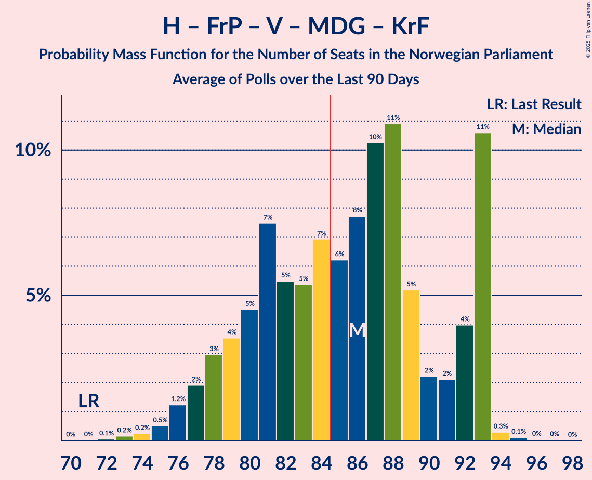

# Poll Average

<a href="#voting-intentions">Voting Intentions</a> | <a href="#seats">Seats</a> | <a href="#coalitions">Coalitions</a> | <a href="#technical-information">Technical Information</a>

## Summary

The table below lists the polls on which the average is based. They are the most recent polls (less than 90 days old) registered and analyzed so far.

| Period     | Polling firm/Commissioner(s) | Ap | H | Sp | FrP | SV | R | V | MDG | KrF | ND | Pp | K | INP | S | Hp | PF | Lib | FP | Kp |
|:----------:|:----------------------------:|:--:|:--:|:--:|:--:|:--:|:--:|:--:|:--:|:--:|:--:|:--:|:--:|:--:|:--:|:--:|:--:|:--:|:--:|:--:|
| 13 September 2021 | General Election | 26.2%   48 | 20.4%   36 | 13.5%   28 | 11.6%   21 | 7.6%   13 | 4.7%   8 | 4.6%   8 | 3.9%   3 | 3.8%   3 | 1.1%   0 | 0.6%   0 | 0.4%   0 | 0.3%   0 | 0.3%   0 | 0.2%   0 | 0.2%   1 | 0.2%   0 | 0.1%   0 | 0.0%   0 |
| N/A | Poll Average | 23–29%   45–56 | 12–19%   19–35 | 4–8%   6–16 | 19–25%   35–47 | 4–8%   8–13 | 5–8%   7–13 | 3–6%   2–11 | 3–8%   2–12 | 3–6%   2–10 | 0–2%   0 | 0–2%   0 | 0–2%   0 | 0–2%   0 | N/A   N/A | N/A   N/A | N/A   N/A | N/A   N/A | N/A   N/A | N/A   N/A |
| [27 August–1 September 2025](2025-09-01-Verian.html) | Verian   TV2 | 24–28%   47–54 | 14–17%   23–31 | 4–7%   7–12 | 20–24%   39–46 | 5–8%   8–13 | 5–7%   7–11 | 3–5%   2–8 | 5–7%   7–11 | 4–6%   3–8 | 0–1%   0 | 0–1%   0 | 1–2%   0 | 0%   0 | N/A   N/A | N/A   N/A | N/A   N/A | N/A   N/A | N/A   N/A | N/A   N/A |
| [27 August–1 September 2025](2025-09-01-ResponsAnalyse.html) | Respons Analyse   Aftenposten, Bergens Tidende and VG | 24–30%   48–59 | 13–17%   21–30 | 4–6%   1–12 | 18–23%   35–46 | 5–8%   7–11 | 5–8%   8–14 | 3–6%   3–9 | 6–9%   9–14 | 3–6%   3–9 | 0–1%   0 | 0–2%   0 | 1–2%   0 | 0–2%   0 | N/A   N/A | N/A   N/A | N/A   N/A | N/A   N/A | N/A   N/A | N/A   N/A |
| [7 July–19 August 2025](2025-08-19-Norstat.html) | Norstat   NRK | 27–28%   52–55 | 14–15%   23–28 | 5–6%   8–9 | 21–22%   40–43 | 6–7%   9–12 | 6–7%   9–10 | 4–5%   3–7 | 4–5%   6–8 | 4–5%   6–8 | 1%   0 | 0–1%   0 | 1%   0 | 0–1%   0 | N/A   N/A | N/A   N/A | N/A   N/A | N/A   N/A | N/A   N/A | N/A   N/A |
| [11–17 August 2025](2025-08-17-OpinionPerduco.html) | Opinion Perduco   Avisenes Nyhetsbyrå, Dagsavisen and FriFagbevegelse | 22–28%   41–52 | 15–21%   28–38 | 5–9%   8–16 | 19–24%   35–45 | 4–7%   7–13 | 4–7%   6–15 | 3–6%   2–10 | 2–5%   1–8 | 3–6%   2–11 | 0–1%   0 | 0–2%   0 | 0–2%   0 | 1–2%   0 | N/A   N/A | N/A   N/A | N/A   N/A | N/A   N/A | N/A   N/A | N/A   N/A |
| [12 August 2025](2025-08-12-InFact.html) | InFact   Nettavisen | 24–30%   49–59 | 11–15%   18–24 | 4–7%   6–12 | 21–26%   43–50 | 4–7%   7–11 | 4–7%   7–11 | 4–7%   7–10 | 3–5%   2–7 | 4–7%   8–11 | 1–2%   0 | 0–1%   0 | 0–1%   0 | 0–1%   0 | N/A   N/A | N/A   N/A | N/A   N/A | N/A   N/A | N/A   N/A | N/A   N/A |
| [5–6 August 2025](2025-08-06-Norfakta.html) | Norfakta   Klassekampen and Nationen | 24–30%   47–56 | 12–17%   21–31 | 5–8%   8–15 | 18–23%   34–44 | 5–8%   8–13 | 5–8%   9–13 | 4–7%   3–12 | 3–6%   2–10 | 3–5%   2–9 | 0–2%   0 | 0–1%   0 | 1–2%   0 | 1–2%   0 | N/A   N/A | N/A   N/A | N/A   N/A | N/A   N/A | N/A   N/A | N/A   N/A |
| 13 September 2021 | General Election | 26.2%   48 | 20.4%   36 | 13.5%   28 | 11.6%   21 | 7.6%   13 | 4.7%   8 | 4.6%   8 | 3.9%   3 | 3.8%   3 | 1.1%   0 | 0.6%   0 | 0.4%   0 | 0.3%   0 | 0.3%   0 | 0.2%   0 | 0.2%   1 | 0.2%   0 | 0.1%   0 | 0.0%   0 |

Only polls for which at least the sample size has been published are included in the table above.

**Legend:**
+ **Top half of each row:** Voting intentions (95% confidence interval)
+ **Bottom half of each row:** Seat projections for the Norwegian Parliament (95% confidence interval)
+ **Ap:** Arbeiderpartiet
+ **H:** Høyre
+ **Sp:** Senterpartiet
+ **FrP:** Fremskrittspartiet
+ **SV:** Sosialistisk Venstreparti
+ **R:** Rødt
+ **V:** Venstre
+ **MDG:** Miljøpartiet De Grønne
+ **KrF:** Kristelig Folkeparti
+ **ND:** Norgesdemokratene
+ **Pp:** Pensjonistpartiet
+ **K:** Konservativt
+ **INP:** Industri- og Næringspartiet
+ **S:** Partiet Sentrum
+ **Hp:** Helsepartiet
+ **PF:** Pasientfokus
+ **Lib:** Liberalistene
+ **FP:** Folkets parti
+ **Kp:** Kystpartiet
+ **N/A (single party):** Party not included the published results
+ **N/A (entire row):** Calculation for this opinion poll not started yet

## Voting Intentions

### Confidence Intervals

| Party | Last Result | Median | 80% Confidence Interval | 90% Confidence Interval | 95% Confidence Interval | 99% Confidence Interval |
|:-----:|:-----------:|:------:|:-----------------------:|:-----------------------:|:-----------------------:|:-----------------------:|
| <a href="#arbeiderpartiet">Arbeiderpartiet</a> | 26.2% | 26.6% | 24.3–28.1% |23.7–28.6% | 23.2–29.1% | 22.0–30.1% |
| <a href="#høyre">Høyre</a> | 20.4% | 14.8% | 13.0–17.7% |12.5–18.7% | 12.1–19.4% | 11.3–20.6% |
| <a href="#senterpartiet">Senterpartiet</a> | 13.5% | 5.7% | 4.7–7.2% |4.4–7.7% | 4.1–8.1% | 3.6–8.8% |
| <a href="#fremskrittspartiet">Fremskrittspartiet</a> | 11.6% | 21.5% | 19.7–23.9% |19.1–24.6% | 18.6–25.2% | 17.7–26.3% |
| <a href="#sosialistisk-venstreparti">Sosialistisk Venstreparti</a> | 7.6% | 6.3% | 5.1–7.1% |4.8–7.4% | 4.5–7.6% | 4.1–8.2% |
| <a href="#rødt">Rødt</a> | 4.7% | 6.1% | 5.0–7.0% |4.8–7.4% | 4.6–7.8% | 4.1–8.5% |
| <a href="#venstre">Venstre</a> | 4.6% | 4.5% | 3.7–5.8% |3.4–6.2% | 3.2–6.5% | 2.8–7.1% |
| <a href="#miljøpartiet-de-grønne">Miljøpartiet De Grønne</a> | 3.9% | 4.6% | 3.3–7.0% |3.1–7.6% | 2.9–8.1% | 2.5–8.9% |
| <a href="#kristelig-folkeparti">Kristelig Folkeparti</a> | 3.8% | 4.7% | 3.7–5.8% |3.4–6.1% | 3.2–6.5% | 2.8–7.1% |
| <a href="#norgesdemokratene">Norgesdemokratene</a> | 1.1% | 0.9% | 0.4–1.5% |0.3–1.7% | 0.2–1.9% | 0.1–2.2% |
| <a href="#pensjonistpartiet">Pensjonistpartiet</a> | 0.6% | 0.7% | 0.4–1.2% |0.3–1.4% | 0.3–1.6% | 0.2–1.9% |
| <a href="#konservativt">Konservativt</a> | 0.4% | 1.0% | 0.6–1.5% |0.6–1.7% | 0.5–1.9% | 0.4–2.2% |
| <a href="#industri--og-næringspartiet">Industri- og Næringspartiet</a> | 0.3% | 0.8% | 0.2–1.7% |0.1–1.9% | 0.1–2.1% | 0.0–2.5% |
| <a href="#partiet-sentrum">Partiet Sentrum</a> | 0.3% | N/A | N/A |N/A | N/A | N/A |
| <a href="#helsepartiet">Helsepartiet</a> | 0.2% | N/A | N/A |N/A | N/A | N/A |
| <a href="#pasientfokus">Pasientfokus</a> | 0.2% | N/A | N/A |N/A | N/A | N/A |
| <a href="#liberalistene">Liberalistene</a> | 0.2% | N/A | N/A |N/A | N/A | N/A |
| <a href="#folkets-parti">Folkets parti</a> | 0.1% | N/A | N/A |N/A | N/A | N/A |
| <a href="#kystpartiet">Kystpartiet</a> | 0.0% | N/A | N/A |N/A | N/A | N/A |

### Arbeiderpartiet

*For a full overview of the results for this party, see the [Arbeiderpartiet](party-arbeiderpartiet.html) page.*

| Voting Intentions | Probability | Accumulated | Special Marks |
|:-----------------:|:-----------:|:-----------:|:-------------:|
| 19.5–20.5% | 0% | 100% |  |
| 20.5–21.5% | 0.2% | 100% |  |
| 21.5–22.5% | 0.9% | 99.8% |  |
| 22.5–23.5% | 3% | 98.9% |  |
| 23.5–24.5% | 8% | 96% |  |
| 24.5–25.5% | 16% | 88% |  |
| 25.5–26.5% | 21% | 72% | Last Result |
| 26.5–27.5% | 25% | 51% | Median |
| 27.5–28.5% | 19% | 25% |  |
| 28.5–29.5% | 4% | 6% |  |
| 29.5–30.5% | 1.1% | 1.3% |  |
| 30.5–31.5% | 0.2% | 0.2% |  |
| 31.5–32.5% | 0% | 0% |  |

### Høyre

*For a full overview of the results for this party, see the [Høyre](party-høyre.html) page.*

| Voting Intentions | Probability | Accumulated | Special Marks |
|:-----------------:|:-----------:|:-----------:|:-------------:|
| 9.5–10.5% | 0% | 100% |  |
| 10.5–11.5% | 0.8% | 100% |  |
| 11.5–12.5% | 5% | 99.2% |  |
| 12.5–13.5% | 11% | 95% |  |
| 13.5–14.5% | 24% | 83% |  |
| 14.5–15.5% | 27% | 60% | Median |
| 15.5–16.5% | 14% | 33% |  |
| 16.5–17.5% | 8% | 19% |  |
| 17.5–18.5% | 5% | 11% |  |
| 18.5–19.5% | 4% | 6% |  |
| 19.5–20.5% | 2% | 2% | Last Result |
| 20.5–21.5% | 0.4% | 0.5% |  |
| 21.5–22.5% | 0.1% | 0.1% |  |
| 22.5–23.5% | 0% | 0% |  |

### Senterpartiet

*For a full overview of the results for this party, see the [Senterpartiet](party-senterpartiet.html) page.*

| Voting Intentions | Probability | Accumulated | Special Marks |
|:-----------------:|:-----------:|:-----------:|:-------------:|
| 1.5–2.5% | 0% | 100% |  |
| 2.5–3.5% | 0.5% | 100% |  |
| 3.5–4.5% | 7% | 99.5% |  |
| 4.5–5.5% | 32% | 92% |  |
| 5.5–6.5% | 37% | 60% | Median |
| 6.5–7.5% | 16% | 23% |  |
| 7.5–8.5% | 6% | 6% |  |
| 8.5–9.5% | 0.8% | 0.9% |  |
| 9.5–10.5% | 0.1% | 0.1% |  |
| 10.5–11.5% | 0% | 0% |  |
| 11.5–12.5% | 0% | 0% |  |
| 12.5–13.5% | 0% | 0% |  |
| 13.5–14.5% | 0% | 0% | Last Result |

### Fremskrittspartiet

*For a full overview of the results for this party, see the [Fremskrittspartiet](party-fremskrittspartiet.html) page.*

| Voting Intentions | Probability | Accumulated | Special Marks |
|:-----------------:|:-----------:|:-----------:|:-------------:|
| 11.5–12.5% | 0% | 100% | Last Result |
| 12.5–13.5% | 0% | 100% |  |
| 13.5–14.5% | 0% | 100% |  |
| 14.5–15.5% | 0% | 100% |  |
| 15.5–16.5% | 0% | 100% |  |
| 16.5–17.5% | 0.3% | 100% |  |
| 17.5–18.5% | 2% | 99.6% |  |
| 18.5–19.5% | 6% | 98% |  |
| 19.5–20.5% | 13% | 91% |  |
| 20.5–21.5% | 31% | 79% | Median |
| 21.5–22.5% | 20% | 48% |  |
| 22.5–23.5% | 14% | 27% |  |
| 23.5–24.5% | 8% | 14% |  |
| 24.5–25.5% | 4% | 5% |  |
| 25.5–26.5% | 1.3% | 2% |  |
| 26.5–27.5% | 0.3% | 0.3% |  |
| 27.5–28.5% | 0% | 0% |  |

### Sosialistisk Venstreparti

*For a full overview of the results for this party, see the [Sosialistisk Venstreparti](party-sosialistiskvenstreparti.html) page.*

| Voting Intentions | Probability | Accumulated | Special Marks |
|:-----------------:|:-----------:|:-----------:|:-------------:|
| 2.5–3.5% | 0% | 100% |  |
| 3.5–4.5% | 3% | 100% |  |
| 4.5–5.5% | 20% | 97% |  |
| 5.5–6.5% | 39% | 77% | Median |
| 6.5–7.5% | 35% | 38% |  |
| 7.5–8.5% | 3% | 3% | Last Result |
| 8.5–9.5% | 0.2% | 0.2% |  |
| 9.5–10.5% | 0% | 0% |  |

### Rødt

*For a full overview of the results for this party, see the [Rødt](party-rødt.html) page.*

| Voting Intentions | Probability | Accumulated | Special Marks |
|:-----------------:|:-----------:|:-----------:|:-------------:|
| 2.5–3.5% | 0% | 100% |  |
| 3.5–4.5% | 2% | 100% |  |
| 4.5–5.5% | 24% | 98% | Last Result |
| 5.5–6.5% | 49% | 74% | Median |
| 6.5–7.5% | 20% | 25% |  |
| 7.5–8.5% | 4% | 4% |  |
| 8.5–9.5% | 0.4% | 0.4% |  |
| 9.5–10.5% | 0% | 0% |  |

### Venstre

*For a full overview of the results for this party, see the [Venstre](party-venstre.html) page.*

| Voting Intentions | Probability | Accumulated | Special Marks |
|:-----------------:|:-----------:|:-----------:|:-------------:|
| 0.5–1.5% | 0% | 100% |  |
| 1.5–2.5% | 0.1% | 100% |  |
| 2.5–3.5% | 7% | 99.9% |  |
| 3.5–4.5% | 44% | 93% |  |
| 4.5–5.5% | 32% | 49% | Last Result, Median |
| 5.5–6.5% | 14% | 16% |  |
| 6.5–7.5% | 2% | 2% |  |
| 7.5–8.5% | 0.1% | 0.1% |  |
| 8.5–9.5% | 0% | 0% |  |

### Miljøpartiet De Grønne

*For a full overview of the results for this party, see the [Miljøpartiet De Grønne](party-miljøpartietdegrønne.html) page.*

| Voting Intentions | Probability | Accumulated | Special Marks |
|:-----------------:|:-----------:|:-----------:|:-------------:|
| 0.5–1.5% | 0% | 100% |  |
| 1.5–2.5% | 0.6% | 100% |  |
| 2.5–3.5% | 15% | 99.4% |  |
| 3.5–4.5% | 33% | 84% | Last Result |
| 4.5–5.5% | 25% | 51% | Median |
| 5.5–6.5% | 13% | 27% |  |
| 6.5–7.5% | 8% | 14% |  |
| 7.5–8.5% | 4% | 5% |  |
| 8.5–9.5% | 1.0% | 1.1% |  |
| 9.5–10.5% | 0.1% | 0.1% |  |
| 10.5–11.5% | 0% | 0% |  |

### Kristelig Folkeparti

*For a full overview of the results for this party, see the [Kristelig Folkeparti](party-kristeligfolkeparti.html) page.*

| Voting Intentions | Probability | Accumulated | Special Marks |
|:-----------------:|:-----------:|:-----------:|:-------------:|
| 0.5–1.5% | 0% | 100% |  |
| 1.5–2.5% | 0.1% | 100% |  |
| 2.5–3.5% | 7% | 99.9% |  |
| 3.5–4.5% | 35% | 92% | Last Result |
| 4.5–5.5% | 43% | 57% | Median |
| 5.5–6.5% | 12% | 14% |  |
| 6.5–7.5% | 2% | 2% |  |
| 7.5–8.5% | 0.1% | 0.1% |  |
| 8.5–9.5% | 0% | 0% |  |

### Norgesdemokratene

*For a full overview of the results for this party, see the [Norgesdemokratene](party-norgesdemokratene.html) page.*

| Voting Intentions | Probability | Accumulated | Special Marks |
|:-----------------:|:-----------:|:-----------:|:-------------:|
| 0.0–0.5% | 27% | 100% |  |
| 0.5–1.5% | 66% | 73% | Last Result, Median |
| 1.5–2.5% | 8% | 8% |  |
| 2.5–3.5% | 0.1% | 0.1% |  |
| 3.5–4.5% | 0% | 0% |  |

### Pensjonistpartiet

*For a full overview of the results for this party, see the [Pensjonistpartiet](party-pensjonistpartiet.html) page.*

| Voting Intentions | Probability | Accumulated | Special Marks |
|:-----------------:|:-----------:|:-----------:|:-------------:|
| 0.0–0.5% | 37% | 100% |  |
| 0.5–1.5% | 61% | 63% | Last Result, Median |
| 1.5–2.5% | 2% | 3% |  |
| 2.5–3.5% | 0% | 0% |  |

### Konservativt

*For a full overview of the results for this party, see the [Konservativt](party-konservativt.html) page.*

| Voting Intentions | Probability | Accumulated | Special Marks |
|:-----------------:|:-----------:|:-----------:|:-------------:|
| 0.0–0.5% | 4% | 100% | Last Result |
| 0.5–1.5% | 87% | 96% | Median |
| 1.5–2.5% | 9% | 9% |  |
| 2.5–3.5% | 0.1% | 0.1% |  |
| 3.5–4.5% | 0% | 0% |  |

### Industri- og Næringspartiet

*For a full overview of the results for this party, see the [Industri- og Næringspartiet](party-industri-ognæringspartiet.html) page.*

| Voting Intentions | Probability | Accumulated | Special Marks |
|:-----------------:|:-----------:|:-----------:|:-------------:|
| 0.0–0.5% | 25% | 100% | Last Result |
| 0.5–1.5% | 62% | 75% | Median |
| 1.5–2.5% | 13% | 14% |  |
| 2.5–3.5% | 0.4% | 0.4% |  |
| 3.5–4.5% | 0% | 0% |  |

## Seats

### Confidence Intervals

| Party | Last Result | Median | 80% Confidence Interval | 90% Confidence Interval | 95% Confidence Interval | 99% Confidence Interval |
|:-----:|:-----------:|:------:|:-----------------------:|:-----------------------:|:-----------------------:|:-----------------------:|
| <a href="#arbeiderpartiet">Arbeiderpartiet</a> | 48 | 51 | 48–55 |46–56 | 45–56 | 42–59 |
| <a href="#høyre">Høyre</a> | 36 | 27 | 20–31 |20–34 | 19–35 | 18–38 |
| <a href="#senterpartiet">Senterpartiet</a> | 28 | 9 | 7–14 |6–15 | 6–16 | 1–16 |
| <a href="#fremskrittspartiet">Fremskrittspartiet</a> | 21 | 42 | 38–46 |37–47 | 35–47 | 34–50 |
| <a href="#sosialistisk-venstreparti">Sosialistisk Venstreparti</a> | 13 | 10 | 8–12 |8–12 | 8–13 | 7–14 |
| <a href="#rødt">Rødt</a> | 8 | 10 | 8–12 |8–12 | 7–13 | 6–15 |
| <a href="#venstre">Venstre</a> | 8 | 7 | 3–9 |3–10 | 2–11 | 2–12 |
| <a href="#miljøpartiet-de-grønne">Miljøpartiet De Grønne</a> | 3 | 7 | 2–11 |2–11 | 2–12 | 1–13 |
| <a href="#kristelig-folkeparti">Kristelig Folkeparti</a> | 3 | 7 | 3–10 |3–10 | 2–10 | 2–12 |
| <a href="#norgesdemokratene">Norgesdemokratene</a> | 0 | 0 | 0 |0 | 0 | 0 |
| <a href="#pensjonistpartiet">Pensjonistpartiet</a> | 0 | 0 | 0 |0 | 0 | 0 |
| <a href="#konservativt">Konservativt</a> | 0 | 0 | 0 |0 | 0 | 0 |
| <a href="#industri--og-næringspartiet">Industri- og Næringspartiet</a> | 0 | 0 | 0 |0 | 0 | 0 |
| <a href="#partiet-sentrum">Partiet Sentrum</a> | 0 | N/A | N/A |N/A | N/A | N/A |
| <a href="#helsepartiet">Helsepartiet</a> | 0 | N/A | N/A |N/A | N/A | N/A |
| <a href="#pasientfokus">Pasientfokus</a> | 1 | N/A | N/A |N/A | N/A | N/A |
| <a href="#liberalistene">Liberalistene</a> | 0 | N/A | N/A |N/A | N/A | N/A |
| <a href="#folkets-parti">Folkets parti</a> | 0 | N/A | N/A |N/A | N/A | N/A |
| <a href="#kystpartiet">Kystpartiet</a> | 0 | N/A | N/A |N/A | N/A | N/A |

### Arbeiderpartiet

*For a full overview of the results for this party, see the [Arbeiderpartiet](party-arbeiderpartiet.html) page.*

| Number of Seats | Probability | Accumulated | Special Marks |
|:---------------:|:-----------:|:-----------:|:-------------:|
| 39 | 0% | 100% |  |
| 40 | 0.1% | 99.9% |  |
| 41 | 0.3% | 99.9% |  |
| 42 | 0.2% | 99.6% |  |
| 43 | 0.2% | 99.3% |  |
| 44 | 1.4% | 99.1% |  |
| 45 | 1.2% | 98% |  |
| 46 | 3% | 97% |  |
| 47 | 2% | 94% |  |
| 48 | 5% | 92% | Last Result |
| 49 | 11% | 88% |  |
| 50 | 18% | 76% |  |
| 51 | 13% | 59% | Median |
| 52 | 9% | 45% |  |
| 53 | 7% | 36% |  |
| 54 | 17% | 28% |  |
| 55 | 2% | 11% |  |
| 56 | 6% | 9% |  |
| 57 | 0.3% | 2% |  |
| 58 | 0.6% | 2% |  |
| 59 | 0.9% | 1.3% |  |
| 60 | 0.1% | 0.4% |  |
| 61 | 0.1% | 0.2% |  |
| 62 | 0% | 0.1% |  |
| 63 | 0% | 0.1% |  |
| 64 | 0% | 0% |  |

### Høyre

*For a full overview of the results for this party, see the [Høyre](party-høyre.html) page.*

| Number of Seats | Probability | Accumulated | Special Marks |
|:---------------:|:-----------:|:-----------:|:-------------:|
| 17 | 0.1% | 100% |  |
| 18 | 2% | 99.9% |  |
| 19 | 2% | 98% |  |
| 20 | 6% | 96% |  |
| 21 | 7% | 89% |  |
| 22 | 2% | 83% |  |
| 23 | 10% | 81% |  |
| 24 | 6% | 71% |  |
| 25 | 5% | 64% |  |
| 26 | 10% | 60% |  |
| 27 | 8% | 50% | Median |
| 28 | 6% | 42% |  |
| 29 | 5% | 36% |  |
| 30 | 14% | 31% |  |
| 31 | 8% | 18% |  |
| 32 | 2% | 10% |  |
| 33 | 2% | 8% |  |
| 34 | 2% | 6% |  |
| 35 | 3% | 5% |  |
| 36 | 0.2% | 1.3% | Last Result |
| 37 | 0.4% | 1.1% |  |
| 38 | 0.6% | 0.7% |  |
| 39 | 0.1% | 0.2% |  |
| 40 | 0% | 0.1% |  |
| 41 | 0% | 0% |  |

### Senterpartiet

*For a full overview of the results for this party, see the [Senterpartiet](party-senterpartiet.html) page.*

| Number of Seats | Probability | Accumulated | Special Marks |
|:---------------:|:-----------:|:-----------:|:-------------:|
| 0 | 0.1% | 100% |  |
| 1 | 2% | 99.9% |  |
| 2 | 0.1% | 98% |  |
| 3 | 0.1% | 98% |  |
| 4 | 0% | 98% |  |
| 5 | 0% | 98% |  |
| 6 | 3% | 98% |  |
| 7 | 8% | 95% |  |
| 8 | 34% | 87% |  |
| 9 | 22% | 53% | Median |
| 10 | 4% | 31% |  |
| 11 | 7% | 28% |  |
| 12 | 5% | 21% |  |
| 13 | 4% | 16% |  |
| 14 | 5% | 11% |  |
| 15 | 3% | 6% |  |
| 16 | 3% | 3% |  |
| 17 | 0.1% | 0.1% |  |
| 18 | 0% | 0.1% |  |
| 19 | 0% | 0% |  |
| 20 | 0% | 0% |  |
| 21 | 0% | 0% |  |
| 22 | 0% | 0% |  |
| 23 | 0% | 0% |  |
| 24 | 0% | 0% |  |
| 25 | 0% | 0% |  |
| 26 | 0% | 0% |  |
| 27 | 0% | 0% |  |
| 28 | 0% | 0% | Last Result |

### Fremskrittspartiet

*For a full overview of the results for this party, see the [Fremskrittspartiet](party-fremskrittspartiet.html) page.*

| Number of Seats | Probability | Accumulated | Special Marks |
|:---------------:|:-----------:|:-----------:|:-------------:|
| 21 | 0% | 100% | Last Result |
| 22 | 0% | 100% |  |
| 23 | 0% | 100% |  |
| 24 | 0% | 100% |  |
| 25 | 0% | 100% |  |
| 26 | 0% | 100% |  |
| 27 | 0% | 100% |  |
| 28 | 0% | 100% |  |
| 29 | 0% | 100% |  |
| 30 | 0% | 100% |  |
| 31 | 0% | 100% |  |
| 32 | 0% | 100% |  |
| 33 | 0.1% | 100% |  |
| 34 | 2% | 99.9% |  |
| 35 | 0.5% | 98% |  |
| 36 | 1.1% | 97% |  |
| 37 | 5% | 96% |  |
| 38 | 5% | 90% |  |
| 39 | 6% | 85% |  |
| 40 | 16% | 79% |  |
| 41 | 6% | 63% |  |
| 42 | 18% | 58% | Median |
| 43 | 12% | 39% |  |
| 44 | 5% | 27% |  |
| 45 | 9% | 22% |  |
| 46 | 5% | 13% |  |
| 47 | 6% | 8% |  |
| 48 | 0.9% | 2% |  |
| 49 | 0.1% | 0.9% |  |
| 50 | 0.5% | 0.8% |  |
| 51 | 0% | 0.3% |  |
| 52 | 0.2% | 0.3% |  |
| 53 | 0% | 0% |  |

### Sosialistisk Venstreparti

*For a full overview of the results for this party, see the [Sosialistisk Venstreparti](party-sosialistiskvenstreparti.html) page.*

| Number of Seats | Probability | Accumulated | Special Marks |
|:---------------:|:-----------:|:-----------:|:-------------:|
| 1 | 0.1% | 100% |  |
| 2 | 0.1% | 99.9% |  |
| 3 | 0.1% | 99.8% |  |
| 4 | 0.1% | 99.7% |  |
| 5 | 0% | 99.7% |  |
| 6 | 0.1% | 99.7% |  |
| 7 | 2% | 99.6% |  |
| 8 | 12% | 98% |  |
| 9 | 18% | 86% |  |
| 10 | 40% | 68% | Median |
| 11 | 17% | 28% |  |
| 12 | 7% | 11% |  |
| 13 | 4% | 4% | Last Result |
| 14 | 0.4% | 0.5% |  |
| 15 | 0.1% | 0.2% |  |
| 16 | 0% | 0% |  |

### Rødt

*For a full overview of the results for this party, see the [Rødt](party-rødt.html) page.*

| Number of Seats | Probability | Accumulated | Special Marks |
|:---------------:|:-----------:|:-----------:|:-------------:|
| 1 | 0.2% | 100% |  |
| 2 | 0.3% | 99.8% |  |
| 3 | 0% | 99.6% |  |
| 4 | 0% | 99.5% |  |
| 5 | 0% | 99.5% |  |
| 6 | 0.2% | 99.5% |  |
| 7 | 4% | 99.3% |  |
| 8 | 8% | 95% | Last Result |
| 9 | 29% | 87% |  |
| 10 | 27% | 57% | Median |
| 11 | 15% | 30% |  |
| 12 | 10% | 15% |  |
| 13 | 3% | 5% |  |
| 14 | 0.7% | 2% |  |
| 15 | 0.9% | 1.1% |  |
| 16 | 0.1% | 0.1% |  |
| 17 | 0% | 0% |  |

### Venstre

*For a full overview of the results for this party, see the [Venstre](party-venstre.html) page.*

| Number of Seats | Probability | Accumulated | Special Marks |
|:---------------:|:-----------:|:-----------:|:-------------:|
| 2 | 3% | 100% |  |
| 3 | 15% | 97% |  |
| 4 | 0% | 82% |  |
| 5 | 0% | 82% |  |
| 6 | 13% | 82% |  |
| 7 | 26% | 69% | Median |
| 8 | 22% | 43% | Last Result |
| 9 | 12% | 21% |  |
| 10 | 5% | 9% |  |
| 11 | 4% | 4% |  |
| 12 | 0.4% | 0.6% |  |
| 13 | 0.2% | 0.2% |  |
| 14 | 0% | 0% |  |

### Miljøpartiet De Grønne

*For a full overview of the results for this party, see the [Miljøpartiet De Grønne](party-miljøpartietdegrønne.html) page.*

| Number of Seats | Probability | Accumulated | Special Marks |
|:---------------:|:-----------:|:-----------:|:-------------:|
| 1 | 1.2% | 100% |  |
| 2 | 13% | 98.8% |  |
| 3 | 16% | 86% | Last Result |
| 4 | 0% | 70% |  |
| 5 | 0% | 70% |  |
| 6 | 11% | 70% |  |
| 7 | 17% | 59% | Median |
| 8 | 15% | 41% |  |
| 9 | 9% | 26% |  |
| 10 | 6% | 17% |  |
| 11 | 7% | 11% |  |
| 12 | 2% | 4% |  |
| 13 | 1.1% | 1.5% |  |
| 14 | 0.3% | 0.4% |  |
| 15 | 0.1% | 0.1% |  |
| 16 | 0% | 0% |  |

### Kristelig Folkeparti

*For a full overview of the results for this party, see the [Kristelig Folkeparti](party-kristeligfolkeparti.html) page.*

| Number of Seats | Probability | Accumulated | Special Marks |
|:---------------:|:-----------:|:-----------:|:-------------:|
| 1 | 0.4% | 100% |  |
| 2 | 2% | 99.6% |  |
| 3 | 21% | 97% | Last Result |
| 4 | 0% | 76% |  |
| 5 | 0% | 76% |  |
| 6 | 9% | 76% |  |
| 7 | 35% | 67% | Median |
| 8 | 11% | 32% |  |
| 9 | 10% | 21% |  |
| 10 | 9% | 11% |  |
| 11 | 2% | 2% |  |
| 12 | 0.4% | 0.6% |  |
| 13 | 0.2% | 0.2% |  |
| 14 | 0% | 0% |  |

### Norgesdemokratene

*For a full overview of the results for this party, see the [Norgesdemokratene](party-norgesdemokratene.html) page.*

| Number of Seats | Probability | Accumulated | Special Marks |
|:---------------:|:-----------:|:-----------:|:-------------:|
| 0 | 100% | 100% | Last Result, Median |

### Pensjonistpartiet

*For a full overview of the results for this party, see the [Pensjonistpartiet](party-pensjonistpartiet.html) page.*

| Number of Seats | Probability | Accumulated | Special Marks |
|:---------------:|:-----------:|:-----------:|:-------------:|
| 0 | 99.9% | 100% | Last Result, Median |
| 1 | 0.1% | 0.1% |  |
| 2 | 0% | 0% |  |

### Konservativt

*For a full overview of the results for this party, see the [Konservativt](party-konservativt.html) page.*

| Number of Seats | Probability | Accumulated | Special Marks |
|:---------------:|:-----------:|:-----------:|:-------------:|
| 0 | 100% | 100% | Last Result, Median |

### Industri- og Næringspartiet

*For a full overview of the results for this party, see the [Industri- og Næringspartiet](party-industri-ognæringspartiet.html) page.*

| Number of Seats | Probability | Accumulated | Special Marks |
|:---------------:|:-----------:|:-----------:|:-------------:|
| 0 | 99.7% | 100% | Last Result, Median |
| 1 | 0.1% | 0.3% |  |
| 2 | 0.2% | 0.2% |  |
| 3 | 0% | 0% |  |

### Partiet Sentrum

*For a full overview of the results for this party, see the [Partiet Sentrum](party-partietsentrum.html) page.*

### Helsepartiet

*For a full overview of the results for this party, see the [Helsepartiet](party-helsepartiet.html) page.*

### Pasientfokus

*For a full overview of the results for this party, see the [Pasientfokus](party-pasientfokus.html) page.*

### Liberalistene

*For a full overview of the results for this party, see the [Liberalistene](party-liberalistene.html) page.*

### Folkets parti

*For a full overview of the results for this party, see the [Folkets parti](party-folketsparti.html) page.*

### Kystpartiet

*For a full overview of the results for this party, see the [Kystpartiet](party-kystpartiet.html) page.*

## Coalitions

### Confidence Intervals

| Coalition | Last Result | Median | Majority? | 80% Confidence Interval | 90% Confidence Interval | 95% Confidence Interval | 99% Confidence Interval |
|:---------:|:-----------:|:------:|:---------:|:-----------------------:|:-----------------------:|:-----------------------:|:-----------------------:|
| Høyre – Senterpartiet – Fremskrittspartiet – Venstre – Kristelig Folkeparti | 96 | 91 | 97% | 86–97 | 86–99 | 83–101 | 80–105 |
| Arbeiderpartiet – Senterpartiet – Sosialistisk Venstreparti – Rødt – Miljøpartiet De Grønne | 100 | 87 | 75% | 82–92 | 80–95 | 76–98 | 75–98 |
| Høyre – Fremskrittspartiet – Venstre – Miljøpartiet De Grønne – Kristelig Folkeparti | 71 | 89 | 84% | 83–93 | 82–95 | 80–95 | 74–98 |
| Høyre – Fremskrittspartiet – Venstre – Kristelig Folkeparti | 68 | 82 | 25% | 77–87 | 74–89 | 71–93 | 71–93 |
| Arbeiderpartiet – Senterpartiet – Sosialistisk Venstreparti – Miljøpartiet De Grønne – Kristelig Folkeparti | 95 | 85 | 50% | 79–88 | 76–90 | 74–90 | 72–94 |
| Arbeiderpartiet – Senterpartiet – Sosialistisk Venstreparti – Rødt | 97 | 80 | 16% | 76–86 | 74–87 | 73–89 | 71–95 |
| Arbeiderpartiet – Sosialistisk Venstreparti – Rødt – Miljøpartiet De Grønne | 72 | 78 | 3% | 72–83 | 70–83 | 68–86 | 63–89 |
| Høyre – Fremskrittspartiet – Venstre | 65 | 75 | 3% | 71–81 | 69–82 | 68–86 | 64–86 |
| Arbeiderpartiet – Senterpartiet – Sosialistisk Venstreparti – Miljøpartiet De Grønne | 92 | 78 | 3% | 73–81 | 69–83 | 67–86 | 67–87 |
| Arbeiderpartiet – Senterpartiet – Miljøpartiet De Grønne – Kristelig Folkeparti | 82 | 75 | 0.5% | 69–77 | 67–80 | 66–81 | 61–85 |
| Arbeiderpartiet – Senterpartiet – Sosialistisk Venstreparti | 89 | 71 | 0% | 66–75 | 65–77 | 65–78 | 60–83 |
| Høyre – Fremskrittspartiet | 57 | 68 | 0% | 64–75 | 62–76 | 59–77 | 58–83 |
| Arbeiderpartiet – Senterpartiet – Kristelig Folkeparti | 79 | 68 | 0% | 62–73 | 61–74 | 60–74 | 58–76 |
| Arbeiderpartiet – Sosialistisk Venstreparti | 61 | 61 | 0% | 57–65 | 56–66 | 55–68 | 51–69 |
| Arbeiderpartiet – Senterpartiet | 76 | 61 | 0% | 57–65 | 56–67 | 55–67 | 52–71 |
| Høyre – Venstre – Kristelig Folkeparti | 47 | 40 | 0% | 36–45 | 35–47 | 33–51 | 32–51 |
| Senterpartiet – Venstre – Kristelig Folkeparti | 39 | 22 | 0% | 17–28 | 17–29 | 17–30 | 14–32 |

### Høyre – Senterpartiet – Fremskrittspartiet – Venstre – Kristelig Folkeparti

| Number of Seats | Probability | Accumulated | Special Marks |
|:---------------:|:-----------:|:-----------:|:-------------:|
| 76 | 0.2% | 100% |  |
| 77 | 0% | 99.7% |  |
| 78 | 0.1% | 99.7% |  |
| 79 | 0% | 99.6% |  |
| 80 | 0.2% | 99.5% |  |
| 81 | 0.1% | 99.4% |  |
| 82 | 1.0% | 99.3% |  |
| 83 | 1.0% | 98% |  |
| 84 | 0.7% | 97% |  |
| 85 | 0.8% | 97% | Majority |
| 86 | 6% | 96% |  |
| 87 | 11% | 90% |  |
| 88 | 6% | 78% |  |
| 89 | 11% | 73% |  |
| 90 | 9% | 62% |  |
| 91 | 10% | 53% |  |
| 92 | 9% | 43% | Median |
| 93 | 6% | 34% |  |
| 94 | 5% | 28% |  |
| 95 | 9% | 23% |  |
| 96 | 2% | 14% | Last Result |
| 97 | 5% | 12% |  |
| 98 | 2% | 8% |  |
| 99 | 1.4% | 6% |  |
| 100 | 0.4% | 5% |  |
| 101 | 3% | 4% |  |
| 102 | 0.2% | 1.1% |  |
| 103 | 0.2% | 0.9% |  |
| 104 | 0.1% | 0.6% |  |
| 105 | 0.2% | 0.6% |  |
| 106 | 0.1% | 0.4% |  |
| 107 | 0.2% | 0.3% |  |
| 108 | 0% | 0.1% |  |
| 109 | 0% | 0% |  |

### Arbeiderpartiet – Senterpartiet – Sosialistisk Venstreparti – Rødt – Miljøpartiet De Grønne

| Number of Seats | Probability | Accumulated | Special Marks |
|:---------------:|:-----------:|:-----------:|:-------------:|
| 72 | 0.1% | 100% |  |
| 73 | 0.1% | 99.9% |  |
| 74 | 0.3% | 99.8% |  |
| 75 | 0.1% | 99.5% |  |
| 76 | 2% | 99.5% |  |
| 77 | 0.1% | 97% |  |
| 78 | 1.0% | 97% |  |
| 79 | 0.8% | 96% |  |
| 80 | 1.2% | 95% |  |
| 81 | 1.0% | 94% |  |
| 82 | 4% | 93% |  |
| 83 | 7% | 89% |  |
| 84 | 7% | 82% |  |
| 85 | 3% | 75% | Majority |
| 86 | 13% | 72% |  |
| 87 | 11% | 59% | Median |
| 88 | 8% | 48% |  |
| 89 | 17% | 40% |  |
| 90 | 9% | 23% |  |
| 91 | 3% | 14% |  |
| 92 | 4% | 11% |  |
| 93 | 1.2% | 7% |  |
| 94 | 0.6% | 6% |  |
| 95 | 2% | 6% |  |
| 96 | 0.7% | 3% |  |
| 97 | 0.1% | 3% |  |
| 98 | 2% | 3% |  |
| 99 | 0.2% | 0.4% |  |
| 100 | 0.1% | 0.2% | Last Result |
| 101 | 0.1% | 0.1% |  |
| 102 | 0% | 0% |  |

### Høyre – Fremskrittspartiet – Venstre – Miljøpartiet De Grønne – Kristelig Folkeparti

| Number of Seats | Probability | Accumulated | Special Marks |
|:---------------:|:-----------:|:-----------:|:-------------:|
| 71 | 0% | 100% | Last Result |
| 72 | 0% | 100% |  |
| 73 | 0% | 100% |  |
| 74 | 2% | 100% |  |
| 75 | 0% | 98% |  |
| 76 | 0% | 98% |  |
| 77 | 0.1% | 98% |  |
| 78 | 0.1% | 98% |  |
| 79 | 0.2% | 98% |  |
| 80 | 0.8% | 98% |  |
| 81 | 0.4% | 97% |  |
| 82 | 5% | 97% |  |
| 83 | 4% | 92% |  |
| 84 | 4% | 88% |  |
| 85 | 9% | 84% | Majority |
| 86 | 3% | 75% |  |
| 87 | 12% | 72% |  |
| 88 | 9% | 60% |  |
| 89 | 11% | 51% |  |
| 90 | 8% | 40% | Median |
| 91 | 10% | 32% |  |
| 92 | 3% | 22% |  |
| 93 | 10% | 19% |  |
| 94 | 3% | 8% |  |
| 95 | 3% | 5% |  |
| 96 | 0.7% | 2% |  |
| 97 | 1.0% | 2% |  |
| 98 | 0.3% | 0.6% |  |
| 99 | 0.1% | 0.3% |  |
| 100 | 0% | 0.2% |  |
| 101 | 0.1% | 0.1% |  |
| 102 | 0% | 0% |  |

### Høyre – Fremskrittspartiet – Venstre – Kristelig Folkeparti

| Number of Seats | Probability | Accumulated | Special Marks |
|:---------------:|:-----------:|:-----------:|:-------------:|
| 68 | 0.1% | 100% | Last Result |
| 69 | 0.1% | 99.9% |  |
| 70 | 0.2% | 99.8% |  |
| 71 | 2% | 99.6% |  |
| 72 | 0.1% | 97% |  |
| 73 | 0.7% | 97% |  |
| 74 | 2% | 97% |  |
| 75 | 0.7% | 94% |  |
| 76 | 1.2% | 94% |  |
| 77 | 4% | 93% |  |
| 78 | 3% | 89% |  |
| 79 | 9% | 86% |  |
| 80 | 17% | 77% |  |
| 81 | 8% | 60% |  |
| 82 | 11% | 51% |  |
| 83 | 14% | 40% | Median |
| 84 | 2% | 27% |  |
| 85 | 7% | 25% | Majority |
| 86 | 7% | 18% |  |
| 87 | 4% | 11% |  |
| 88 | 1.0% | 7% |  |
| 89 | 1.4% | 6% |  |
| 90 | 0.7% | 4% |  |
| 91 | 0.9% | 4% |  |
| 92 | 0.1% | 3% |  |
| 93 | 2% | 3% |  |
| 94 | 0.2% | 0.5% |  |
| 95 | 0.2% | 0.3% |  |
| 96 | 0.1% | 0.1% |  |
| 97 | 0% | 0% |  |

### Arbeiderpartiet – Senterpartiet – Sosialistisk Venstreparti – Miljøpartiet De Grønne – Kristelig Folkeparti

| Number of Seats | Probability | Accumulated | Special Marks |
|:---------------:|:-----------:|:-----------:|:-------------:|
| 70 | 0.1% | 100% |  |
| 71 | 0% | 99.9% |  |
| 72 | 0.6% | 99.9% |  |
| 73 | 0.9% | 99.2% |  |
| 74 | 2% | 98% |  |
| 75 | 0.4% | 96% |  |
| 76 | 1.0% | 96% |  |
| 77 | 1.4% | 95% |  |
| 78 | 1.1% | 93% |  |
| 79 | 8% | 92% |  |
| 80 | 3% | 84% |  |
| 81 | 2% | 81% |  |
| 82 | 13% | 79% |  |
| 83 | 8% | 67% |  |
| 84 | 9% | 59% | Median |
| 85 | 11% | 50% | Majority |
| 86 | 14% | 39% |  |
| 87 | 14% | 25% |  |
| 88 | 2% | 11% |  |
| 89 | 3% | 9% |  |
| 90 | 4% | 6% |  |
| 91 | 0.4% | 2% |  |
| 92 | 0.6% | 1.5% |  |
| 93 | 0.2% | 0.9% |  |
| 94 | 0.3% | 0.6% |  |
| 95 | 0.2% | 0.3% | Last Result |
| 96 | 0.1% | 0.1% |  |
| 97 | 0% | 0.1% |  |
| 98 | 0% | 0% |  |

### Arbeiderpartiet – Senterpartiet – Sosialistisk Venstreparti – Rødt

| Number of Seats | Probability | Accumulated | Special Marks |
|:---------------:|:-----------:|:-----------:|:-------------:|
| 67 | 0.1% | 100% |  |
| 68 | 0% | 99.9% |  |
| 69 | 0.1% | 99.9% |  |
| 70 | 0.1% | 99.8% |  |
| 71 | 0.6% | 99.6% |  |
| 72 | 0.7% | 99.0% |  |
| 73 | 0.9% | 98% |  |
| 74 | 3% | 97% |  |
| 75 | 3% | 95% |  |
| 76 | 10% | 91% |  |
| 77 | 3% | 81% |  |
| 78 | 10% | 78% |  |
| 79 | 8% | 68% |  |
| 80 | 11% | 60% | Median |
| 81 | 9% | 49% |  |
| 82 | 12% | 40% |  |
| 83 | 4% | 28% |  |
| 84 | 8% | 24% |  |
| 85 | 4% | 16% | Majority |
| 86 | 4% | 12% |  |
| 87 | 5% | 8% |  |
| 88 | 0.4% | 3% |  |
| 89 | 0.8% | 3% |  |
| 90 | 0.1% | 2% |  |
| 91 | 0.1% | 2% |  |
| 92 | 0.1% | 2% |  |
| 93 | 0% | 2% |  |
| 94 | 0% | 2% |  |
| 95 | 2% | 2% |  |
| 96 | 0% | 0% |  |
| 97 | 0% | 0% | Last Result |

### Arbeiderpartiet – Sosialistisk Venstreparti – Rødt – Miljøpartiet De Grønne

| Number of Seats | Probability | Accumulated | Special Marks |
|:---------------:|:-----------:|:-----------:|:-------------:|
| 60 | 0% | 100% |  |
| 61 | 0.1% | 99.9% |  |
| 62 | 0.2% | 99.9% |  |
| 63 | 0.2% | 99.7% |  |
| 64 | 0.1% | 99.5% |  |
| 65 | 0.2% | 99.4% |  |
| 66 | 0.2% | 99.2% |  |
| 67 | 0.4% | 99.0% |  |
| 68 | 3% | 98.6% |  |
| 69 | 0.4% | 95% |  |
| 70 | 2% | 95% |  |
| 71 | 1.3% | 93% |  |
| 72 | 5% | 92% | Last Result |
| 73 | 3% | 87% |  |
| 74 | 8% | 85% |  |
| 75 | 5% | 76% |  |
| 76 | 6% | 72% |  |
| 77 | 9% | 66% |  |
| 78 | 10% | 57% | Median |
| 79 | 9% | 47% |  |
| 80 | 11% | 38% |  |
| 81 | 6% | 27% |  |
| 82 | 11% | 22% |  |
| 83 | 6% | 10% |  |
| 84 | 0.7% | 4% |  |
| 85 | 0.7% | 3% | Majority |
| 86 | 1.0% | 3% |  |
| 87 | 1.0% | 2% |  |
| 88 | 0.1% | 0.7% |  |
| 89 | 0.1% | 0.6% |  |
| 90 | 0% | 0.5% |  |
| 91 | 0.1% | 0.4% |  |
| 92 | 0% | 0.3% |  |
| 93 | 0.2% | 0.3% |  |
| 94 | 0% | 0% |  |

### Høyre – Fremskrittspartiet – Venstre

| Number of Seats | Probability | Accumulated | Special Marks |
|:---------------:|:-----------:|:-----------:|:-------------:|
| 61 | 0.1% | 100% |  |
| 62 | 0% | 99.9% |  |
| 63 | 0.3% | 99.9% |  |
| 64 | 0.2% | 99.6% |  |
| 65 | 0.1% | 99.4% | Last Result |
| 66 | 0.1% | 99.3% |  |
| 67 | 0.5% | 99.2% |  |
| 68 | 2% | 98.7% |  |
| 69 | 2% | 96% |  |
| 70 | 3% | 95% |  |
| 71 | 5% | 91% |  |
| 72 | 8% | 86% |  |
| 73 | 20% | 78% |  |
| 74 | 8% | 58% |  |
| 75 | 4% | 51% |  |
| 76 | 14% | 47% | Median |
| 77 | 11% | 33% |  |
| 78 | 5% | 23% |  |
| 79 | 3% | 17% |  |
| 80 | 4% | 15% |  |
| 81 | 3% | 11% |  |
| 82 | 4% | 8% |  |
| 83 | 1.1% | 5% |  |
| 84 | 0.3% | 3% |  |
| 85 | 0.3% | 3% | Majority |
| 86 | 3% | 3% |  |
| 87 | 0.1% | 0.2% |  |
| 88 | 0% | 0.1% |  |
| 89 | 0% | 0% |  |

### Arbeiderpartiet – Senterpartiet – Sosialistisk Venstreparti – Miljøpartiet De Grønne

| Number of Seats | Probability | Accumulated | Special Marks |
|:---------------:|:-----------:|:-----------:|:-------------:|
| 62 | 0% | 100% |  |
| 63 | 0.1% | 99.9% |  |
| 64 | 0% | 99.8% |  |
| 65 | 0% | 99.8% |  |
| 66 | 0.1% | 99.7% |  |
| 67 | 2% | 99.6% |  |
| 68 | 1.1% | 97% |  |
| 69 | 2% | 96% |  |
| 70 | 1.4% | 95% |  |
| 71 | 1.1% | 93% |  |
| 72 | 2% | 92% |  |
| 73 | 7% | 91% |  |
| 74 | 4% | 84% |  |
| 75 | 8% | 79% |  |
| 76 | 11% | 71% |  |
| 77 | 9% | 60% | Median |
| 78 | 6% | 52% |  |
| 79 | 16% | 46% |  |
| 80 | 18% | 30% |  |
| 81 | 2% | 12% |  |
| 82 | 4% | 10% |  |
| 83 | 1.2% | 6% |  |
| 84 | 1.2% | 5% |  |
| 85 | 0.8% | 3% | Majority |
| 86 | 2% | 3% |  |
| 87 | 0.2% | 0.7% |  |
| 88 | 0.1% | 0.5% |  |
| 89 | 0.2% | 0.3% |  |
| 90 | 0.1% | 0.1% |  |
| 91 | 0% | 0% |  |
| 92 | 0% | 0% | Last Result |

### Arbeiderpartiet – Senterpartiet – Miljøpartiet De Grønne – Kristelig Folkeparti

| Number of Seats | Probability | Accumulated | Special Marks |
|:---------------:|:-----------:|:-----------:|:-------------:|
| 61 | 0.9% | 100% |  |
| 62 | 0.1% | 99.1% |  |
| 63 | 0.1% | 99.0% |  |
| 64 | 0.8% | 99.0% |  |
| 65 | 0.3% | 98% |  |
| 66 | 3% | 98% |  |
| 67 | 2% | 95% |  |
| 68 | 2% | 93% |  |
| 69 | 7% | 91% |  |
| 70 | 6% | 84% |  |
| 71 | 3% | 78% |  |
| 72 | 3% | 75% |  |
| 73 | 8% | 72% |  |
| 74 | 10% | 64% | Median |
| 75 | 15% | 53% |  |
| 76 | 13% | 38% |  |
| 77 | 16% | 26% |  |
| 78 | 2% | 10% |  |
| 79 | 1.1% | 7% |  |
| 80 | 3% | 6% |  |
| 81 | 2% | 3% |  |
| 82 | 0.5% | 2% | Last Result |
| 83 | 0.4% | 1.0% |  |
| 84 | 0.1% | 0.6% |  |
| 85 | 0.3% | 0.5% | Majority |
| 86 | 0.1% | 0.2% |  |
| 87 | 0% | 0.1% |  |
| 88 | 0% | 0% |  |

### Arbeiderpartiet – Senterpartiet – Sosialistisk Venstreparti

| Number of Seats | Probability | Accumulated | Special Marks |
|:---------------:|:-----------:|:-----------:|:-------------:|
| 57 | 0.1% | 100% |  |
| 58 | 0% | 99.9% |  |
| 59 | 0% | 99.9% |  |
| 60 | 0.5% | 99.9% |  |
| 61 | 0.4% | 99.3% |  |
| 62 | 0.1% | 99.0% |  |
| 63 | 0.4% | 98.8% |  |
| 64 | 0.9% | 98% |  |
| 65 | 5% | 98% |  |
| 66 | 7% | 93% |  |
| 67 | 5% | 86% |  |
| 68 | 14% | 81% |  |
| 69 | 4% | 67% |  |
| 70 | 10% | 63% | Median |
| 71 | 11% | 53% |  |
| 72 | 6% | 41% |  |
| 73 | 17% | 35% |  |
| 74 | 7% | 18% |  |
| 75 | 2% | 11% |  |
| 76 | 1.1% | 9% |  |
| 77 | 5% | 8% |  |
| 78 | 0.7% | 3% |  |
| 79 | 0.2% | 2% |  |
| 80 | 0.2% | 2% |  |
| 81 | 0.1% | 2% |  |
| 82 | 0% | 2% |  |
| 83 | 2% | 2% |  |
| 84 | 0% | 0% |  |
| 85 | 0% | 0% | Majority |
| 86 | 0% | 0% |  |
| 87 | 0% | 0% |  |
| 88 | 0% | 0% |  |
| 89 | 0% | 0% | Last Result |

### Høyre – Fremskrittspartiet

| Number of Seats | Probability | Accumulated | Special Marks |
|:---------------:|:-----------:|:-----------:|:-------------:|
| 55 | 0.1% | 100% |  |
| 56 | 0% | 99.9% |  |
| 57 | 0.2% | 99.9% | Last Result |
| 58 | 2% | 99.7% |  |
| 59 | 0.6% | 98% |  |
| 60 | 0.5% | 97% |  |
| 61 | 1.4% | 97% |  |
| 62 | 3% | 95% |  |
| 63 | 2% | 93% |  |
| 64 | 5% | 91% |  |
| 65 | 8% | 86% |  |
| 66 | 18% | 78% |  |
| 67 | 4% | 60% |  |
| 68 | 13% | 55% |  |
| 69 | 8% | 43% | Median |
| 70 | 11% | 35% |  |
| 71 | 4% | 24% |  |
| 72 | 3% | 20% |  |
| 73 | 6% | 18% |  |
| 74 | 2% | 12% |  |
| 75 | 1.1% | 11% |  |
| 76 | 5% | 9% |  |
| 77 | 3% | 5% |  |
| 78 | 0.5% | 1.4% |  |
| 79 | 0.3% | 0.9% |  |
| 80 | 0.1% | 0.6% |  |
| 81 | 0% | 0.6% |  |
| 82 | 0% | 0.5% |  |
| 83 | 0.5% | 0.5% |  |
| 84 | 0% | 0% |  |

### Arbeiderpartiet – Senterpartiet – Kristelig Folkeparti

| Number of Seats | Probability | Accumulated | Special Marks |
|:---------------:|:-----------:|:-----------:|:-------------:|
| 54 | 0.1% | 100% |  |
| 55 | 0% | 99.9% |  |
| 56 | 0.1% | 99.8% |  |
| 57 | 0% | 99.7% |  |
| 58 | 0.3% | 99.7% |  |
| 59 | 1.2% | 99.4% |  |
| 60 | 0.9% | 98% |  |
| 61 | 6% | 97% |  |
| 62 | 3% | 91% |  |
| 63 | 6% | 88% |  |
| 64 | 14% | 82% |  |
| 65 | 5% | 69% |  |
| 66 | 4% | 64% |  |
| 67 | 9% | 60% | Median |
| 68 | 9% | 51% |  |
| 69 | 5% | 42% |  |
| 70 | 14% | 37% |  |
| 71 | 9% | 23% |  |
| 72 | 1.4% | 14% |  |
| 73 | 6% | 12% |  |
| 74 | 5% | 7% |  |
| 75 | 0.7% | 1.5% |  |
| 76 | 0.4% | 0.8% |  |
| 77 | 0.1% | 0.4% |  |
| 78 | 0.2% | 0.3% |  |
| 79 | 0% | 0.2% | Last Result |
| 80 | 0.1% | 0.1% |  |
| 81 | 0% | 0% |  |

### Arbeiderpartiet – Sosialistisk Venstreparti

| Number of Seats | Probability | Accumulated | Special Marks |
|:---------------:|:-----------:|:-----------:|:-------------:|
| 47 | 0% | 100% |  |
| 48 | 0.2% | 99.9% |  |
| 49 | 0.2% | 99.8% |  |
| 50 | 0.1% | 99.6% |  |
| 51 | 0.1% | 99.5% |  |
| 52 | 0.1% | 99.5% |  |
| 53 | 0.6% | 99.4% |  |
| 54 | 1.2% | 98.8% |  |
| 55 | 1.3% | 98% |  |
| 56 | 2% | 96% |  |
| 57 | 6% | 95% |  |
| 58 | 6% | 88% |  |
| 59 | 12% | 83% |  |
| 60 | 11% | 71% |  |
| 61 | 15% | 60% | Last Result, Median |
| 62 | 5% | 45% |  |
| 63 | 12% | 41% |  |
| 64 | 17% | 29% |  |
| 65 | 5% | 12% |  |
| 66 | 3% | 7% |  |
| 67 | 1.0% | 4% |  |
| 68 | 2% | 3% |  |
| 69 | 0.1% | 0.5% |  |
| 70 | 0.2% | 0.4% |  |
| 71 | 0.1% | 0.1% |  |
| 72 | 0% | 0.1% |  |
| 73 | 0% | 0% |  |

### Arbeiderpartiet – Senterpartiet

| Number of Seats | Probability | Accumulated | Special Marks |
|:---------------:|:-----------:|:-----------:|:-------------:|
| 48 | 0.1% | 100% |  |
| 49 | 0% | 99.9% |  |
| 50 | 0% | 99.9% |  |
| 51 | 0.3% | 99.9% |  |
| 52 | 0.3% | 99.5% |  |
| 53 | 0.5% | 99.3% |  |
| 54 | 0.7% | 98.8% |  |
| 55 | 2% | 98% |  |
| 56 | 4% | 96% |  |
| 57 | 15% | 93% |  |
| 58 | 11% | 77% |  |
| 59 | 4% | 66% |  |
| 60 | 8% | 62% | Median |
| 61 | 7% | 55% |  |
| 62 | 13% | 47% |  |
| 63 | 16% | 34% |  |
| 64 | 8% | 18% |  |
| 65 | 2% | 10% |  |
| 66 | 1.1% | 8% |  |
| 67 | 4% | 7% |  |
| 68 | 0.1% | 2% |  |
| 69 | 0.1% | 2% |  |
| 70 | 0.2% | 2% |  |
| 71 | 2% | 2% |  |
| 72 | 0% | 0.1% |  |
| 73 | 0% | 0.1% |  |
| 74 | 0% | 0% |  |
| 75 | 0% | 0% |  |
| 76 | 0% | 0% | Last Result |

### Høyre – Venstre – Kristelig Folkeparti

| Number of Seats | Probability | Accumulated | Special Marks |
|:---------------:|:-----------:|:-----------:|:-------------:|
| 28 | 0% | 100% |  |
| 29 | 0% | 99.9% |  |
| 30 | 0.1% | 99.9% |  |
| 31 | 0.1% | 99.8% |  |
| 32 | 1.4% | 99.7% |  |
| 33 | 0.8% | 98% |  |
| 34 | 1.4% | 97% |  |
| 35 | 3% | 96% |  |
| 36 | 5% | 94% |  |
| 37 | 13% | 89% |  |
| 38 | 11% | 76% |  |
| 39 | 14% | 65% |  |
| 40 | 13% | 51% |  |
| 41 | 7% | 38% | Median |
| 42 | 14% | 31% |  |
| 43 | 4% | 17% |  |
| 44 | 2% | 13% |  |
| 45 | 4% | 11% |  |
| 46 | 2% | 7% |  |
| 47 | 1.1% | 5% | Last Result |
| 48 | 0.4% | 4% |  |
| 49 | 0.7% | 4% |  |
| 50 | 0.4% | 3% |  |
| 51 | 2% | 3% |  |
| 52 | 0.2% | 0.4% |  |
| 53 | 0.1% | 0.2% |  |
| 54 | 0.1% | 0.2% |  |
| 55 | 0.1% | 0.1% |  |
| 56 | 0% | 0% |  |

### Senterpartiet – Venstre – Kristelig Folkeparti

| Number of Seats | Probability | Accumulated | Special Marks |
|:---------------:|:-----------:|:-----------:|:-------------:|
| 11 | 0% | 100% |  |
| 12 | 0.2% | 99.9% |  |
| 13 | 0.1% | 99.8% |  |
| 14 | 0.4% | 99.7% |  |
| 15 | 0.2% | 99.3% |  |
| 16 | 1.3% | 99.1% |  |
| 17 | 9% | 98% |  |
| 18 | 3% | 88% |  |
| 19 | 3% | 85% |  |
| 20 | 6% | 83% |  |
| 21 | 14% | 76% |  |
| 22 | 14% | 62% |  |
| 23 | 9% | 48% | Median |
| 24 | 8% | 39% |  |
| 25 | 3% | 31% |  |
| 26 | 3% | 29% |  |
| 27 | 11% | 25% |  |
| 28 | 5% | 14% |  |
| 29 | 6% | 9% |  |
| 30 | 2% | 3% |  |
| 31 | 0.7% | 1.5% |  |
| 32 | 0.3% | 0.8% |  |
| 33 | 0.2% | 0.4% |  |
| 34 | 0.2% | 0.2% |  |
| 35 | 0% | 0% |  |
| 36 | 0% | 0% |  |
| 37 | 0% | 0% |  |
| 38 | 0% | 0% |  |
| 39 | 0% | 0% | Last Result |

## Technical Information

+ **Number of polls included in this average:** 6
+ **Lowest number of simulations done in a poll included in this average:** 2,097,152
+ **Total number of simulations done in the polls included in this average:** 12,582,912
+ **Error estimate:** 4.80%
