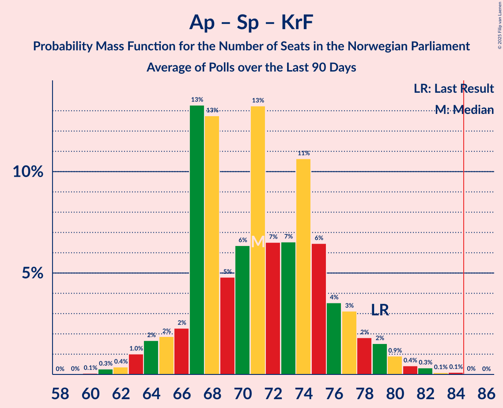

# Poll Average

<a href="#voting-intentions">Voting Intentions</a> | <a href="#seats">Seats</a> | <a href="#coalitions">Coalitions</a> | <a href="#technical-information">Technical Information</a>

## Summary

The table below lists the polls on which the average is based. They are the most recent polls (less than 90 days old) registered and analyzed so far.

| Period     | Polling firm/Commissioner(s) | Ap | H | Sp | FrP | SV | R | V | MDG | KrF | ND | Pp | K | INP | S | Hp | PF | Lib | FP | Kp |
|:----------:|:----------------------------:|:--:|:--:|:--:|:--:|:--:|:--:|:--:|:--:|:--:|:--:|:--:|:--:|:--:|:--:|:--:|:--:|:--:|:--:|:--:|
| 13 September 2021 | General Election | 26.2%   48 | 20.4%   36 | 13.5%   28 | 11.6%   21 | 7.6%   13 | 4.7%   8 | 4.6%   8 | 3.9%   3 | 3.8%   3 | 1.1%   0 | 0.6%   0 | 0.4%   0 | 0.3%   0 | 0.3%   0 | 0.2%   0 | 0.2%   1 | 0.2%   0 | 0.1%   0 | 0.0%   0 |
| N/A | Poll Average | 25–32%   45–60 | 15–22%   27–40 | 4–8%   0–14 | 20–27%   39–50 | 5–9%   9–17 | 3–6%   1–11 | 2–6%   1–11 | 1–4%   0–8 | 2–4%   0–7 | 0–1%   0 | 0–1%   0 | 0–2%   0 | 0–2%   0 | N/A   N/A | N/A   N/A | N/A   N/A | 0–1%   0 | N/A   N/A | N/A   N/A |
| [4–5 March 2025](2025-03-05-Norfakta.html) | Norfakta   Klassekampen and Nationen | 24–29%   45–56 | 17–22%   31–40 | 4–6%   0–11 | 22–27%   41–50 | 6–9%   9–16 | 4–7%   1–12 | 3–6%   2–9 | 2–4%   1–3 | 2–4%   0–3 | N/A   N/A | N/A   N/A | N/A   N/A | N/A   N/A | N/A   N/A | N/A   N/A | N/A   N/A | N/A   N/A | N/A   N/A | N/A   N/A |
| [4 March 2025](2025-03-04-InFact.html) | InFact   Nettavisen | 27–32%   51–59 | 14–19%   27–34 | 4–7%   8–13 | 22–27%   42–49 | 5–8%   9–15 | 3–5%   1–9 | 3–6%   3–10 | 2–4%   1–3 | 2–5%   1–7 | 0–1%   0 | N/A   N/A | 1–2%   0 | 0–1%   0 | N/A   N/A | N/A   N/A | N/A   N/A | 0–1%   0 | N/A   N/A | N/A   N/A |
| [24 February–3 March 2025](2025-03-03-OpinionPerduco.html) | Opinion Perduco   ABC Nyheter and Altinget | 26–31%   48–58 | 16–21%   30–39 | 4–7%   7–13 | 22–28%   41–51 | 5–8%   9–14 | 3–6%   1–10 | 2–4%   1–8 | 3–5%   1–9 | 2–4%   0–3 | N/A   N/A | N/A   N/A | N/A   N/A | 1–2%   0 | N/A   N/A | N/A   N/A | N/A   N/A | N/A   N/A | N/A   N/A | N/A   N/A |
| [24–28 February 2025](2025-02-28-Verian.html) | Verian   TV2 | 27–32%   51–61 | 17–22%   31–42 | 3–6%   0–12 | 19–24%   37–48 | 6–10%   12–18 | 3–5%   1–9 | 3–6%   2–10 | 2–4%   1–3 | 2–4%   0–8 | N/A   N/A | 0–1%   0 | 1–2%   0 | 1–2%   0 | N/A   N/A | N/A   N/A | N/A   N/A | N/A   N/A | N/A   N/A | N/A   N/A |
| [4–8 February 2025](2025-02-08-Norstat.html) | Norstat   Dagbladet, NRK and Vårt Land | 26–32%   47–59 | 14–19%   26–32 | 5–8%   10–12 | 23–28%   40–50 | 6–9%   10–17 | 4–7%   8–11 | 2–4%   1–3 | 2–4%   1–3 | 1–3%   0–1 | 0–1%   0 | 0–2%   0 | 0–1%   0 | 0–2%   0 | N/A   N/A | N/A   N/A | N/A   N/A | N/A   N/A | N/A   N/A | N/A   N/A |
| [4–6 February 2025](2025-02-06-ResponsAnalyse.html) | Respons Analyse   Aftenposten, Bergens Tidende and VG | 24–30%   44–51 | 17–22%   30–38 | 5–9%   10–14 | 21–26%   39–49 | 5–9%   10–16 | 4–6%   7–11 | 4–6%   3–11 | 1–3%   0–1 | 2–4%   1–3 | 0–1%   0 | 0–1%   0 | 0–1%   0 | 1–2%   0 | N/A   N/A | N/A   N/A | N/A   N/A | 0–1%   0 | N/A   N/A | N/A   N/A |
| 13 September 2021 | General Election | 26.2%   48 | 20.4%   36 | 13.5%   28 | 11.6%   21 | 7.6%   13 | 4.7%   8 | 4.6%   8 | 3.9%   3 | 3.8%   3 | 1.1%   0 | 0.6%   0 | 0.4%   0 | 0.3%   0 | 0.3%   0 | 0.2%   0 | 0.2%   1 | 0.2%   0 | 0.1%   0 | 0.0%   0 |

Only polls for which at least the sample size has been published are included in the table above.

**Legend:**
+ **Top half of each row:** Voting intentions (95% confidence interval)
+ **Bottom half of each row:** Seat projections for the Norwegian Parliament (95% confidence interval)
+ **Ap:** Arbeiderpartiet
+ **H:** Høyre
+ **Sp:** Senterpartiet
+ **FrP:** Fremskrittspartiet
+ **SV:** Sosialistisk Venstreparti
+ **R:** Rødt
+ **V:** Venstre
+ **MDG:** Miljøpartiet De Grønne
+ **KrF:** Kristelig Folkeparti
+ **ND:** Norgesdemokratene
+ **Pp:** Pensjonistpartiet
+ **K:** Konservativt
+ **INP:** Industri- og Næringspartiet
+ **S:** Partiet Sentrum
+ **Hp:** Helsepartiet
+ **PF:** Pasientfokus
+ **Lib:** Liberalistene
+ **FP:** Folkets parti
+ **Kp:** Kystpartiet
+ **N/A (single party):** Party not included the published results
+ **N/A (entire row):** Calculation for this opinion poll not started yet

## Voting Intentions

### Confidence Intervals

| Party | Last Result | Median | 80% Confidence Interval | 90% Confidence Interval | 95% Confidence Interval | 99% Confidence Interval |
|:-----:|:-----------:|:------:|:-----------------------:|:-----------------------:|:-----------------------:|:-----------------------:|
| <a href="#arbeiderpartiet">Arbeiderpartiet</a> | 26.2% | 28.3% | 25.8–30.6% |25.1–31.2% | 24.6–31.7% | 23.6–32.7% |
| <a href="#høyre">Høyre</a> | 20.4% | 18.4% | 15.7–20.6% |15.2–21.1% | 14.7–21.6% | 13.9–22.5% |
| <a href="#senterpartiet">Senterpartiet</a> | 13.5% | 5.5% | 4.3–7.0% |4.0–7.4% | 3.8–7.8% | 3.4–8.5% |
| <a href="#fremskrittspartiet">Fremskrittspartiet</a> | 11.6% | 24.1% | 21.7–26.2% |20.9–26.8% | 20.4–27.3% | 19.4–28.3% |
| <a href="#sosialistisk-venstreparti">Sosialistisk Venstreparti</a> | 7.6% | 7.0% | 5.9–8.3% |5.6–8.7% | 5.3–9.1% | 4.9–9.7% |
| <a href="#rødt">Rødt</a> | 4.7% | 4.5% | 3.4–5.8% |3.1–6.1% | 2.9–6.4% | 2.5–6.9% |
| <a href="#venstre">Venstre</a> | 4.6% | 4.0% | 2.9–5.2% |2.7–5.5% | 2.5–5.8% | 2.2–6.4% |
| <a href="#miljøpartiet-de-grønne">Miljøpartiet De Grønne</a> | 3.9% | 2.8% | 1.7–3.8% |1.5–4.2% | 1.3–4.4% | 1.0–5.0% |
| <a href="#kristelig-folkeparti">Kristelig Folkeparti</a> | 3.8% | 2.9% | 2.1–3.8% |1.9–4.0% | 1.7–4.3% | 1.4–4.7% |
| <a href="#norgesdemokratene">Norgesdemokratene</a> | 1.1% | 0.6% | 0.3–1.0% |0.2–1.2% | 0.2–1.3% | 0.1–1.6% |
| <a href="#pensjonistpartiet">Pensjonistpartiet</a> | 0.6% | 0.3% | 0.1–1.0% |0.0–1.2% | 0.0–1.4% | 0.0–1.7% |
| <a href="#konservativt">Konservativt</a> | 0.4% | 0.9% | 0.5–1.4% |0.5–1.6% | 0.4–1.7% | 0.3–2.0% |
| <a href="#industri--og-næringspartiet">Industri- og Næringspartiet</a> | 0.3% | 1.0% | 0.6–1.5% |0.5–1.7% | 0.5–1.9% | 0.3–2.2% |
| <a href="#partiet-sentrum">Partiet Sentrum</a> | 0.3% | N/A | N/A |N/A | N/A | N/A |
| <a href="#helsepartiet">Helsepartiet</a> | 0.2% | N/A | N/A |N/A | N/A | N/A |
| <a href="#pasientfokus">Pasientfokus</a> | 0.2% | N/A | N/A |N/A | N/A | N/A |
| <a href="#liberalistene">Liberalistene</a> | 0.2% | 0.2% | 0.1–0.4% |0.1–0.5% | 0.0–0.6% | 0.0–0.8% |
| <a href="#folkets-parti">Folkets parti</a> | 0.1% | N/A | N/A |N/A | N/A | N/A |
| <a href="#kystpartiet">Kystpartiet</a> | 0.0% | N/A | N/A |N/A | N/A | N/A |

### Arbeiderpartiet

*For a full overview of the results for this party, see the [Arbeiderpartiet](party-arbeiderpartiet.html) page.*

| Voting Intentions | Probability | Accumulated | Special Marks |
|:-----------------:|:-----------:|:-----------:|:-------------:|
| 21.5–22.5% | 0% | 100% |  |
| 22.5–23.5% | 0.4% | 100% |  |
| 23.5–24.5% | 2% | 99.6% |  |
| 24.5–25.5% | 6% | 98% |  |
| 25.5–26.5% | 11% | 92% | Last Result |
| 26.5–27.5% | 17% | 81% |  |
| 27.5–28.5% | 20% | 64% | Median |
| 28.5–29.5% | 20% | 44% |  |
| 29.5–30.5% | 14% | 25% |  |
| 30.5–31.5% | 7% | 10% |  |
| 31.5–32.5% | 3% | 3% |  |
| 32.5–33.5% | 0.6% | 0.7% |  |
| 33.5–34.5% | 0.1% | 0.1% |  |
| 34.5–35.5% | 0% | 0% |  |

### Høyre

*For a full overview of the results for this party, see the [Høyre](party-høyre.html) page.*

| Voting Intentions | Probability | Accumulated | Special Marks |
|:-----------------:|:-----------:|:-----------:|:-------------:|
| 11.5–12.5% | 0% | 100% |  |
| 12.5–13.5% | 0.2% | 100% |  |
| 13.5–14.5% | 2% | 99.8% |  |
| 14.5–15.5% | 6% | 98% |  |
| 15.5–16.5% | 12% | 92% |  |
| 16.5–17.5% | 15% | 80% |  |
| 17.5–18.5% | 18% | 65% | Median |
| 18.5–19.5% | 21% | 47% |  |
| 19.5–20.5% | 16% | 26% | Last Result |
| 20.5–21.5% | 8% | 10% |  |
| 21.5–22.5% | 2% | 3% |  |
| 22.5–23.5% | 0.4% | 0.4% |  |
| 23.5–24.5% | 0% | 0% |  |
| 24.5–25.5% | 0% | 0% |  |

### Senterpartiet

*For a full overview of the results for this party, see the [Senterpartiet](party-senterpartiet.html) page.*

| Voting Intentions | Probability | Accumulated | Special Marks |
|:-----------------:|:-----------:|:-----------:|:-------------:|
| 1.5–2.5% | 0% | 100% |  |
| 2.5–3.5% | 0.9% | 100% |  |
| 3.5–4.5% | 15% | 99.1% |  |
| 4.5–5.5% | 36% | 84% | Median |
| 5.5–6.5% | 30% | 47% |  |
| 6.5–7.5% | 13% | 17% |  |
| 7.5–8.5% | 4% | 4% |  |
| 8.5–9.5% | 0.4% | 0.4% |  |
| 9.5–10.5% | 0% | 0% |  |
| 10.5–11.5% | 0% | 0% |  |
| 11.5–12.5% | 0% | 0% |  |
| 12.5–13.5% | 0% | 0% |  |
| 13.5–14.5% | 0% | 0% | Last Result |

### Fremskrittspartiet

*For a full overview of the results for this party, see the [Fremskrittspartiet](party-fremskrittspartiet.html) page.*

| Voting Intentions | Probability | Accumulated | Special Marks |
|:-----------------:|:-----------:|:-----------:|:-------------:|
| 11.5–12.5% | 0% | 100% | Last Result |
| 12.5–13.5% | 0% | 100% |  |
| 13.5–14.5% | 0% | 100% |  |
| 14.5–15.5% | 0% | 100% |  |
| 15.5–16.5% | 0% | 100% |  |
| 16.5–17.5% | 0% | 100% |  |
| 17.5–18.5% | 0.1% | 100% |  |
| 18.5–19.5% | 0.6% | 99.9% |  |
| 19.5–20.5% | 2% | 99.3% |  |
| 20.5–21.5% | 6% | 97% |  |
| 21.5–22.5% | 11% | 91% |  |
| 22.5–23.5% | 18% | 80% |  |
| 23.5–24.5% | 23% | 62% | Median |
| 24.5–25.5% | 20% | 39% |  |
| 25.5–26.5% | 12% | 19% |  |
| 26.5–27.5% | 5% | 7% |  |
| 27.5–28.5% | 1.4% | 2% |  |
| 28.5–29.5% | 0.3% | 0.3% |  |
| 29.5–30.5% | 0% | 0% |  |

### Sosialistisk Venstreparti

*For a full overview of the results for this party, see the [Sosialistisk Venstreparti](party-sosialistiskvenstreparti.html) page.*

| Voting Intentions | Probability | Accumulated | Special Marks |
|:-----------------:|:-----------:|:-----------:|:-------------:|
| 2.5–3.5% | 0% | 100% |  |
| 3.5–4.5% | 0.1% | 100% |  |
| 4.5–5.5% | 4% | 99.9% |  |
| 5.5–6.5% | 26% | 95% |  |
| 6.5–7.5% | 39% | 69% | Median |
| 7.5–8.5% | 23% | 30% | Last Result |
| 8.5–9.5% | 6% | 7% |  |
| 9.5–10.5% | 0.8% | 0.8% |  |
| 10.5–11.5% | 0% | 0% |  |
| 11.5–12.5% | 0% | 0% |  |

### Rødt

*For a full overview of the results for this party, see the [Rødt](party-rødt.html) page.*

| Voting Intentions | Probability | Accumulated | Special Marks |
|:-----------------:|:-----------:|:-----------:|:-------------:|
| 0.5–1.5% | 0% | 100% |  |
| 1.5–2.5% | 0.5% | 100% |  |
| 2.5–3.5% | 14% | 99.5% |  |
| 3.5–4.5% | 37% | 86% |  |
| 4.5–5.5% | 34% | 49% | Last Result, Median |
| 5.5–6.5% | 13% | 14% |  |
| 6.5–7.5% | 1.5% | 2% |  |
| 7.5–8.5% | 0.1% | 0.1% |  |
| 8.5–9.5% | 0% | 0% |  |

### Venstre

*For a full overview of the results for this party, see the [Venstre](party-venstre.html) page.*

| Voting Intentions | Probability | Accumulated | Special Marks |
|:-----------------:|:-----------:|:-----------:|:-------------:|
| 0.5–1.5% | 0% | 100% |  |
| 1.5–2.5% | 3% | 100% |  |
| 2.5–3.5% | 27% | 97% |  |
| 3.5–4.5% | 41% | 70% | Median |
| 4.5–5.5% | 23% | 28% | Last Result |
| 5.5–6.5% | 5% | 5% |  |
| 6.5–7.5% | 0.3% | 0.3% |  |
| 7.5–8.5% | 0% | 0% |  |

### Miljøpartiet De Grønne

*For a full overview of the results for this party, see the [Miljøpartiet De Grønne](party-miljøpartietdegrønne.html) page.*

| Voting Intentions | Probability | Accumulated | Special Marks |
|:-----------------:|:-----------:|:-----------:|:-------------:|
| 0.0–0.5% | 0% | 100% |  |
| 0.5–1.5% | 7% | 100% |  |
| 1.5–2.5% | 33% | 93% |  |
| 2.5–3.5% | 44% | 61% | Median |
| 3.5–4.5% | 14% | 16% | Last Result |
| 4.5–5.5% | 2% | 2% |  |
| 5.5–6.5% | 0.1% | 0.1% |  |
| 6.5–7.5% | 0% | 0% |  |

### Kristelig Folkeparti

*For a full overview of the results for this party, see the [Kristelig Folkeparti](party-kristeligfolkeparti.html) page.*

| Voting Intentions | Probability | Accumulated | Special Marks |
|:-----------------:|:-----------:|:-----------:|:-------------:|
| 0.0–0.5% | 0% | 100% |  |
| 0.5–1.5% | 1.2% | 100% |  |
| 1.5–2.5% | 30% | 98.8% |  |
| 2.5–3.5% | 52% | 69% | Median |
| 3.5–4.5% | 16% | 17% | Last Result |
| 4.5–5.5% | 0.9% | 0.9% |  |
| 5.5–6.5% | 0% | 0% |  |

### Norgesdemokratene

*For a full overview of the results for this party, see the [Norgesdemokratene](party-norgesdemokratene.html) page.*

| Voting Intentions | Probability | Accumulated | Special Marks |
|:-----------------:|:-----------:|:-----------:|:-------------:|
| 0.0–0.5% | 46% | 100% |  |
| 0.5–1.5% | 54% | 54% | Last Result, Median |
| 1.5–2.5% | 0.5% | 0.5% |  |
| 2.5–3.5% | 0% | 0% |  |

### Pensjonistpartiet

*For a full overview of the results for this party, see the [Pensjonistpartiet](party-pensjonistpartiet.html) page.*

| Voting Intentions | Probability | Accumulated | Special Marks |
|:-----------------:|:-----------:|:-----------:|:-------------:|
| 0.0–0.5% | 68% | 100% | Median |
| 0.5–1.5% | 31% | 32% | Last Result |
| 1.5–2.5% | 1.0% | 1.0% |  |
| 2.5–3.5% | 0% | 0% |  |

### Konservativt

*For a full overview of the results for this party, see the [Konservativt](party-konservativt.html) page.*

| Voting Intentions | Probability | Accumulated | Special Marks |
|:-----------------:|:-----------:|:-----------:|:-------------:|
| 0.0–0.5% | 11% | 100% | Last Result |
| 0.5–1.5% | 84% | 89% | Median |
| 1.5–2.5% | 6% | 6% |  |
| 2.5–3.5% | 0% | 0% |  |

### Industri- og Næringspartiet

*For a full overview of the results for this party, see the [Industri- og Næringspartiet](party-industri-ognæringspartiet.html) page.*

| Voting Intentions | Probability | Accumulated | Special Marks |
|:-----------------:|:-----------:|:-----------:|:-------------:|
| 0.0–0.5% | 6% | 100% | Last Result |
| 0.5–1.5% | 85% | 94% | Median |
| 1.5–2.5% | 10% | 10% |  |
| 2.5–3.5% | 0.1% | 0.1% |  |
| 3.5–4.5% | 0% | 0% |  |

### Liberalistene

*For a full overview of the results for this party, see the [Liberalistene](party-liberalistene.html) page.*

| Voting Intentions | Probability | Accumulated | Special Marks |
|:-----------------:|:-----------:|:-----------:|:-------------:|
| 0.0–0.5% | 95% | 100% | Last Result, Median |
| 0.5–1.5% | 5% | 5% |  |
| 1.5–2.5% | 0% | 0% |  |

## Seats

### Confidence Intervals

| Party | Last Result | Median | 80% Confidence Interval | 90% Confidence Interval | 95% Confidence Interval | 99% Confidence Interval |
|:-----:|:-----------:|:------:|:-----------------------:|:-----------------------:|:-----------------------:|:-----------------------:|
| <a href="#arbeiderpartiet">Arbeiderpartiet</a> | 48 | 53 | 48–57 |46–59 | 45–60 | 44–62 |
| <a href="#høyre">Høyre</a> | 36 | 33 | 27–38 |27–39 | 27–40 | 26–42 |
| <a href="#senterpartiet">Senterpartiet</a> | 28 | 10 | 8–13 |7–13 | 0–14 | 0–14 |
| <a href="#fremskrittspartiet">Fremskrittspartiet</a> | 21 | 45 | 41–50 |40–50 | 39–50 | 37–51 |
| <a href="#sosialistisk-venstreparti">Sosialistisk Venstreparti</a> | 13 | 13 | 10–15 |10–16 | 9–17 | 9–18 |
| <a href="#rødt">Rødt</a> | 8 | 8 | 1–9 |1–10 | 1–11 | 1–12 |
| <a href="#venstre">Venstre</a> | 8 | 6 | 2–10 |2–10 | 1–11 | 1–11 |
| <a href="#miljøpartiet-de-grønne">Miljøpartiet De Grønne</a> | 3 | 2 | 0–3 |0–3 | 0–8 | 0–9 |
| <a href="#kristelig-folkeparti">Kristelig Folkeparti</a> | 3 | 1 | 0–3 |0–3 | 0–7 | 0–8 |
| <a href="#norgesdemokratene">Norgesdemokratene</a> | 0 | 0 | 0 |0 | 0 | 0 |
| <a href="#pensjonistpartiet">Pensjonistpartiet</a> | 0 | 0 | 0 |0 | 0 | 0 |
| <a href="#konservativt">Konservativt</a> | 0 | 0 | 0 |0 | 0 | 0 |
| <a href="#industri--og-næringspartiet">Industri- og Næringspartiet</a> | 0 | 0 | 0 |0 | 0 | 0 |
| <a href="#partiet-sentrum">Partiet Sentrum</a> | 0 | N/A | N/A |N/A | N/A | N/A |
| <a href="#helsepartiet">Helsepartiet</a> | 0 | N/A | N/A |N/A | N/A | N/A |
| <a href="#pasientfokus">Pasientfokus</a> | 1 | N/A | N/A |N/A | N/A | N/A |
| <a href="#liberalistene">Liberalistene</a> | 0 | 0 | 0 |0 | 0 | 0 |
| <a href="#folkets-parti">Folkets parti</a> | 0 | N/A | N/A |N/A | N/A | N/A |
| <a href="#kystpartiet">Kystpartiet</a> | 0 | N/A | N/A |N/A | N/A | N/A |

### Arbeiderpartiet

*For a full overview of the results for this party, see the [Arbeiderpartiet](party-arbeiderpartiet.html) page.*

| Number of Seats | Probability | Accumulated | Special Marks |
|:---------------:|:-----------:|:-----------:|:-------------:|
| 41 | 0.1% | 100% |  |
| 42 | 0% | 99.9% |  |
| 43 | 0.2% | 99.9% |  |
| 44 | 2% | 99.7% |  |
| 45 | 0.7% | 98% |  |
| 46 | 4% | 97% |  |
| 47 | 2% | 94% |  |
| 48 | 9% | 92% | Last Result |
| 49 | 7% | 82% |  |
| 50 | 4% | 76% |  |
| 51 | 6% | 71% |  |
| 52 | 6% | 65% |  |
| 53 | 13% | 60% | Median |
| 54 | 7% | 47% |  |
| 55 | 17% | 40% |  |
| 56 | 10% | 22% |  |
| 57 | 3% | 13% |  |
| 58 | 3% | 10% |  |
| 59 | 4% | 7% |  |
| 60 | 0.6% | 3% |  |
| 61 | 2% | 2% |  |
| 62 | 0.3% | 0.7% |  |
| 63 | 0.3% | 0.4% |  |
| 64 | 0.1% | 0.1% |  |
| 65 | 0% | 0% |  |

### Høyre

*For a full overview of the results for this party, see the [Høyre](party-høyre.html) page.*

| Number of Seats | Probability | Accumulated | Special Marks |
|:---------------:|:-----------:|:-----------:|:-------------:|
| 24 | 0.1% | 100% |  |
| 25 | 0.2% | 99.9% |  |
| 26 | 0.7% | 99.7% |  |
| 27 | 10% | 99.0% |  |
| 28 | 2% | 89% |  |
| 29 | 2% | 86% |  |
| 30 | 9% | 84% |  |
| 31 | 4% | 75% |  |
| 32 | 14% | 71% |  |
| 33 | 10% | 58% | Median |
| 34 | 12% | 47% |  |
| 35 | 6% | 36% |  |
| 36 | 4% | 30% | Last Result |
| 37 | 12% | 25% |  |
| 38 | 5% | 13% |  |
| 39 | 5% | 8% |  |
| 40 | 2% | 3% |  |
| 41 | 0.5% | 1.2% |  |
| 42 | 0.3% | 0.7% |  |
| 43 | 0.1% | 0.5% |  |
| 44 | 0.3% | 0.3% |  |
| 45 | 0% | 0% |  |

### Senterpartiet

*For a full overview of the results for this party, see the [Senterpartiet](party-senterpartiet.html) page.*

| Number of Seats | Probability | Accumulated | Special Marks |
|:---------------:|:-----------:|:-----------:|:-------------:|
| 0 | 3% | 100% |  |
| 1 | 1.0% | 97% |  |
| 2 | 0% | 96% |  |
| 3 | 0% | 96% |  |
| 4 | 0% | 96% |  |
| 5 | 0.1% | 96% |  |
| 6 | 0.7% | 96% |  |
| 7 | 5% | 96% |  |
| 8 | 15% | 91% |  |
| 9 | 17% | 76% |  |
| 10 | 24% | 59% | Median |
| 11 | 9% | 36% |  |
| 12 | 13% | 27% |  |
| 13 | 11% | 14% |  |
| 14 | 3% | 3% |  |
| 15 | 0.2% | 0.3% |  |
| 16 | 0% | 0.1% |  |
| 17 | 0.1% | 0.1% |  |
| 18 | 0% | 0% |  |
| 19 | 0% | 0% |  |
| 20 | 0% | 0% |  |
| 21 | 0% | 0% |  |
| 22 | 0% | 0% |  |
| 23 | 0% | 0% |  |
| 24 | 0% | 0% |  |
| 25 | 0% | 0% |  |
| 26 | 0% | 0% |  |
| 27 | 0% | 0% |  |
| 28 | 0% | 0% | Last Result |

### Fremskrittspartiet

*For a full overview of the results for this party, see the [Fremskrittspartiet](party-fremskrittspartiet.html) page.*

| Number of Seats | Probability | Accumulated | Special Marks |
|:---------------:|:-----------:|:-----------:|:-------------:|
| 21 | 0% | 100% | Last Result |
| 22 | 0% | 100% |  |
| 23 | 0% | 100% |  |
| 24 | 0% | 100% |  |
| 25 | 0% | 100% |  |
| 26 | 0% | 100% |  |
| 27 | 0% | 100% |  |
| 28 | 0% | 100% |  |
| 29 | 0% | 100% |  |
| 30 | 0% | 100% |  |
| 31 | 0% | 100% |  |
| 32 | 0% | 100% |  |
| 33 | 0% | 100% |  |
| 34 | 0% | 100% |  |
| 35 | 0.1% | 100% |  |
| 36 | 0.2% | 99.9% |  |
| 37 | 0.3% | 99.7% |  |
| 38 | 0.9% | 99.4% |  |
| 39 | 2% | 98.5% |  |
| 40 | 3% | 96% |  |
| 41 | 8% | 93% |  |
| 42 | 17% | 85% |  |
| 43 | 7% | 67% |  |
| 44 | 6% | 60% |  |
| 45 | 12% | 54% | Median |
| 46 | 5% | 42% |  |
| 47 | 9% | 37% |  |
| 48 | 10% | 28% |  |
| 49 | 7% | 18% |  |
| 50 | 10% | 11% |  |
| 51 | 0.5% | 0.9% |  |
| 52 | 0.2% | 0.4% |  |
| 53 | 0.1% | 0.2% |  |
| 54 | 0.1% | 0.1% |  |
| 55 | 0% | 0% |  |

### Sosialistisk Venstreparti

*For a full overview of the results for this party, see the [Sosialistisk Venstreparti](party-sosialistiskvenstreparti.html) page.*

| Number of Seats | Probability | Accumulated | Special Marks |
|:---------------:|:-----------:|:-----------:|:-------------:|
| 8 | 0.4% | 100% |  |
| 9 | 4% | 99.6% |  |
| 10 | 17% | 96% |  |
| 11 | 17% | 79% |  |
| 12 | 10% | 62% |  |
| 13 | 26% | 53% | Last Result, Median |
| 14 | 11% | 27% |  |
| 15 | 8% | 16% |  |
| 16 | 4% | 8% |  |
| 17 | 3% | 4% |  |
| 18 | 0.7% | 1.0% |  |
| 19 | 0.2% | 0.3% |  |
| 20 | 0.1% | 0.1% |  |
| 21 | 0% | 0% |  |

### Rødt

*For a full overview of the results for this party, see the [Rødt](party-rødt.html) page.*

| Number of Seats | Probability | Accumulated | Special Marks |
|:---------------:|:-----------:|:-----------:|:-------------:|
| 1 | 28% | 100% |  |
| 2 | 0.6% | 72% |  |
| 3 | 0% | 72% |  |
| 4 | 0% | 72% |  |
| 5 | 0% | 72% |  |
| 6 | 0.4% | 72% |  |
| 7 | 10% | 71% |  |
| 8 | 33% | 62% | Last Result, Median |
| 9 | 20% | 28% |  |
| 10 | 5% | 9% |  |
| 11 | 3% | 4% |  |
| 12 | 0.7% | 0.9% |  |
| 13 | 0.1% | 0.2% |  |
| 14 | 0% | 0% |  |

### Venstre

*For a full overview of the results for this party, see the [Venstre](party-venstre.html) page.*

| Number of Seats | Probability | Accumulated | Special Marks |
|:---------------:|:-----------:|:-----------:|:-------------:|
| 1 | 4% | 100% |  |
| 2 | 23% | 96% |  |
| 3 | 22% | 73% |  |
| 4 | 0% | 51% |  |
| 5 | 0% | 51% |  |
| 6 | 0.9% | 51% | Median |
| 7 | 10% | 50% |  |
| 8 | 9% | 40% | Last Result |
| 9 | 13% | 31% |  |
| 10 | 14% | 18% |  |
| 11 | 4% | 4% |  |
| 12 | 0.2% | 0.2% |  |
| 13 | 0% | 0% |  |

### Miljøpartiet De Grønne

*For a full overview of the results for this party, see the [Miljøpartiet De Grønne](party-miljøpartietdegrønne.html) page.*

| Number of Seats | Probability | Accumulated | Special Marks |
|:---------------:|:-----------:|:-----------:|:-------------:|
| 0 | 13% | 100% |  |
| 1 | 35% | 87% |  |
| 2 | 36% | 52% | Median |
| 3 | 11% | 16% | Last Result |
| 4 | 0.2% | 5% |  |
| 5 | 0% | 5% |  |
| 6 | 0.1% | 5% |  |
| 7 | 1.4% | 5% |  |
| 8 | 2% | 3% |  |
| 9 | 1.1% | 1.3% |  |
| 10 | 0.2% | 0.2% |  |
| 11 | 0% | 0% |  |

### Kristelig Folkeparti

*For a full overview of the results for this party, see the [Kristelig Folkeparti](party-kristeligfolkeparti.html) page.*

| Number of Seats | Probability | Accumulated | Special Marks |
|:---------------:|:-----------:|:-----------:|:-------------:|
| 0 | 22% | 100% |  |
| 1 | 31% | 78% | Median |
| 2 | 14% | 47% |  |
| 3 | 29% | 33% | Last Result |
| 4 | 0% | 4% |  |
| 5 | 0% | 4% |  |
| 6 | 0.1% | 4% |  |
| 7 | 3% | 4% |  |
| 8 | 0.6% | 0.8% |  |
| 9 | 0.2% | 0.3% |  |
| 10 | 0% | 0.1% |  |
| 11 | 0% | 0% |  |

### Norgesdemokratene

*For a full overview of the results for this party, see the [Norgesdemokratene](party-norgesdemokratene.html) page.*

| Number of Seats | Probability | Accumulated | Special Marks |
|:---------------:|:-----------:|:-----------:|:-------------:|
| 0 | 100% | 100% | Last Result, Median |

### Pensjonistpartiet

*For a full overview of the results for this party, see the [Pensjonistpartiet](party-pensjonistpartiet.html) page.*

| Number of Seats | Probability | Accumulated | Special Marks |
|:---------------:|:-----------:|:-----------:|:-------------:|
| 0 | 100% | 100% | Last Result, Median |

### Konservativt

*For a full overview of the results for this party, see the [Konservativt](party-konservativt.html) page.*

| Number of Seats | Probability | Accumulated | Special Marks |
|:---------------:|:-----------:|:-----------:|:-------------:|
| 0 | 100% | 100% | Last Result, Median |

### Industri- og Næringspartiet

*For a full overview of the results for this party, see the [Industri- og Næringspartiet](party-industri-ognæringspartiet.html) page.*

| Number of Seats | Probability | Accumulated | Special Marks |
|:---------------:|:-----------:|:-----------:|:-------------:|
| 0 | 99.9% | 100% | Last Result, Median |
| 1 | 0.1% | 0.1% |  |
| 2 | 0% | 0% |  |

### Partiet Sentrum

*For a full overview of the results for this party, see the [Partiet Sentrum](party-partietsentrum.html) page.*

### Helsepartiet

*For a full overview of the results for this party, see the [Helsepartiet](party-helsepartiet.html) page.*

### Pasientfokus

*For a full overview of the results for this party, see the [Pasientfokus](party-pasientfokus.html) page.*

### Liberalistene

*For a full overview of the results for this party, see the [Liberalistene](party-liberalistene.html) page.*

| Number of Seats | Probability | Accumulated | Special Marks |
|:---------------:|:-----------:|:-----------:|:-------------:|
| 0 | 100% | 100% | Last Result, Median |

### Folkets parti

*For a full overview of the results for this party, see the [Folkets parti](party-folketsparti.html) page.*

### Kystpartiet

*For a full overview of the results for this party, see the [Kystpartiet](party-kystpartiet.html) page.*

## Coalitions

### Confidence Intervals

| Coalition | Last Result | Median | Majority? | 80% Confidence Interval | 90% Confidence Interval | 95% Confidence Interval | 99% Confidence Interval |
|:---------:|:-----------:|:------:|:---------:|:-----------------------:|:-----------------------:|:-----------------------:|:-----------------------:|
| Høyre – Senterpartiet – Fremskrittspartiet – Venstre – Kristelig Folkeparti | 96 | 95 | 99.5% | 89–102 | 88–103 | 87–103 | 85–104 |
| Høyre – Fremskrittspartiet – Venstre – Miljøpartiet De Grønne – Kristelig Folkeparti | 71 | 88 | 72% | 81–94 | 80–95 | 78–95 | 75–98 |
| Høyre – Fremskrittspartiet – Venstre – Kristelig Folkeparti | 68 | 86 | 60% | 79–93 | 78–93 | 77–93 | 74–96 |
| Arbeiderpartiet – Senterpartiet – Sosialistisk Venstreparti – Rødt – Miljøpartiet De Grønne | 100 | 83 | 39% | 76–90 | 76–91 | 75–92 | 72–95 |
| Høyre – Fremskrittspartiet – Venstre | 65 | 84 | 43% | 78–90 | 77–90 | 76–91 | 74–94 |
| Arbeiderpartiet – Senterpartiet – Sosialistisk Venstreparti – Rødt | 97 | 81 | 27% | 74–88 | 74–88 | 73–91 | 70–94 |
| Høyre – Fremskrittspartiet | 57 | 78 | 4% | 74–82 | 72–84 | 71–86 | 70–89 |
| Arbeiderpartiet – Senterpartiet – Sosialistisk Venstreparti – Miljøpartiet De Grønne – Kristelig Folkeparti | 95 | 79 | 8% | 72–84 | 71–85 | 69–86 | 65–91 |
| Arbeiderpartiet – Senterpartiet – Sosialistisk Venstreparti – Miljøpartiet De Grønne | 92 | 77 | 3% | 71–82 | 69–83 | 68–85 | 64–88 |
| Arbeiderpartiet – Sosialistisk Venstreparti – Rødt – Miljøpartiet De Grønne | 72 | 73 | 0.4% | 67–80 | 66–81 | 66–82 | 64–84 |
| Arbeiderpartiet – Senterpartiet – Sosialistisk Venstreparti | 89 | 75 | 1.2% | 69–80 | 68–82 | 66–82 | 63–85 |
| Arbeiderpartiet – Sosialistisk Venstreparti | 61 | 65 | 0% | 59–70 | 58–73 | 58–73 | 56–76 |
| Arbeiderpartiet – Senterpartiet – Miljøpartiet De Grønne – Kristelig Folkeparti | 82 | 67 | 0% | 60–72 | 59–72 | 57–73 | 53–77 |
| Arbeiderpartiet – Senterpartiet – Kristelig Folkeparti | 79 | 65 | 0% | 59–70 | 58–70 | 56–71 | 51–73 |
| Arbeiderpartiet – Senterpartiet | 76 | 62 | 0% | 57–67 | 56–69 | 54–69 | 50–71 |
| Høyre – Venstre – Kristelig Folkeparti | 47 | 43 | 0% | 30–48 | 29–48 | 29–49 | 29–52 |
| Senterpartiet – Venstre – Kristelig Folkeparti | 39 | 16 | 0% | 12–24 | 11–24 | 10–27 | 4–27 |

### Høyre – Senterpartiet – Fremskrittspartiet – Venstre – Kristelig Folkeparti

| Number of Seats | Probability | Accumulated | Special Marks |
|:---------------:|:-----------:|:-----------:|:-------------:|
| 81 | 0% | 100% |  |
| 82 | 0.1% | 99.9% |  |
| 83 | 0.1% | 99.9% |  |
| 84 | 0.3% | 99.8% |  |
| 85 | 0.5% | 99.5% | Majority |
| 86 | 1.2% | 99.1% |  |
| 87 | 2% | 98% |  |
| 88 | 2% | 96% |  |
| 89 | 8% | 94% |  |
| 90 | 2% | 86% |  |
| 91 | 11% | 84% |  |
| 92 | 4% | 73% |  |
| 93 | 8% | 68% |  |
| 94 | 7% | 61% |  |
| 95 | 6% | 54% | Median |
| 96 | 8% | 48% | Last Result |
| 97 | 6% | 40% |  |
| 98 | 5% | 34% |  |
| 99 | 5% | 29% |  |
| 100 | 2% | 24% |  |
| 101 | 3% | 22% |  |
| 102 | 11% | 19% |  |
| 103 | 7% | 8% |  |
| 104 | 0.2% | 0.6% |  |
| 105 | 0.3% | 0.4% |  |
| 106 | 0.1% | 0.1% |  |
| 107 | 0% | 0.1% |  |
| 108 | 0% | 0% |  |

### Høyre – Fremskrittspartiet – Venstre – Miljøpartiet De Grønne – Kristelig Folkeparti

| Number of Seats | Probability | Accumulated | Special Marks |
|:---------------:|:-----------:|:-----------:|:-------------:|
| 71 | 0% | 100% | Last Result |
| 72 | 0% | 100% |  |
| 73 | 0% | 100% |  |
| 74 | 0% | 100% |  |
| 75 | 0.7% | 100% |  |
| 76 | 0.1% | 99.2% |  |
| 77 | 0.2% | 99.1% |  |
| 78 | 2% | 98.9% |  |
| 79 | 2% | 97% |  |
| 80 | 0.7% | 96% |  |
| 81 | 15% | 95% |  |
| 82 | 2% | 80% |  |
| 83 | 2% | 78% |  |
| 84 | 4% | 76% |  |
| 85 | 6% | 72% | Majority |
| 86 | 7% | 66% |  |
| 87 | 5% | 59% | Median |
| 88 | 11% | 54% |  |
| 89 | 6% | 43% |  |
| 90 | 12% | 37% |  |
| 91 | 4% | 25% |  |
| 92 | 8% | 21% |  |
| 93 | 2% | 13% |  |
| 94 | 2% | 11% |  |
| 95 | 7% | 9% |  |
| 96 | 0.6% | 2% |  |
| 97 | 0.5% | 1.3% |  |
| 98 | 0.5% | 0.8% |  |
| 99 | 0.2% | 0.3% |  |
| 100 | 0.1% | 0.1% |  |
| 101 | 0% | 0% |  |

### Høyre – Fremskrittspartiet – Venstre – Kristelig Folkeparti

| Number of Seats | Probability | Accumulated | Special Marks |
|:---------------:|:-----------:|:-----------:|:-------------:|
| 68 | 0% | 100% | Last Result |
| 69 | 0% | 100% |  |
| 70 | 0% | 100% |  |
| 71 | 0% | 100% |  |
| 72 | 0.1% | 100% |  |
| 73 | 0.1% | 99.9% |  |
| 74 | 0.8% | 99.8% |  |
| 75 | 0.1% | 99.0% |  |
| 76 | 0.5% | 98.8% |  |
| 77 | 2% | 98% |  |
| 78 | 2% | 96% |  |
| 79 | 15% | 95% |  |
| 80 | 2% | 80% |  |
| 81 | 3% | 78% |  |
| 82 | 3% | 75% |  |
| 83 | 5% | 71% |  |
| 84 | 6% | 66% |  |
| 85 | 9% | 60% | Median, Majority |
| 86 | 7% | 52% |  |
| 87 | 7% | 45% |  |
| 88 | 6% | 38% |  |
| 89 | 5% | 32% |  |
| 90 | 10% | 27% |  |
| 91 | 3% | 17% |  |
| 92 | 4% | 14% |  |
| 93 | 8% | 10% |  |
| 94 | 0.7% | 2% |  |
| 95 | 0.5% | 1.2% |  |
| 96 | 0.4% | 0.7% |  |
| 97 | 0.2% | 0.3% |  |
| 98 | 0% | 0.1% |  |
| 99 | 0% | 0% |  |

### Arbeiderpartiet – Senterpartiet – Sosialistisk Venstreparti – Rødt – Miljøpartiet De Grønne

| Number of Seats | Probability | Accumulated | Special Marks |
|:---------------:|:-----------:|:-----------:|:-------------:|
| 68 | 0% | 100% |  |
| 69 | 0.1% | 99.9% |  |
| 70 | 0.1% | 99.9% |  |
| 71 | 0.1% | 99.8% |  |
| 72 | 0.4% | 99.7% |  |
| 73 | 0.7% | 99.3% |  |
| 74 | 0.9% | 98.6% |  |
| 75 | 1.1% | 98% |  |
| 76 | 8% | 97% |  |
| 77 | 5% | 88% |  |
| 78 | 3% | 83% |  |
| 79 | 10% | 80% |  |
| 80 | 5% | 70% |  |
| 81 | 5% | 66% |  |
| 82 | 7% | 60% |  |
| 83 | 6% | 53% |  |
| 84 | 8% | 47% |  |
| 85 | 6% | 39% | Majority |
| 86 | 5% | 33% | Median |
| 87 | 3% | 28% |  |
| 88 | 3% | 25% |  |
| 89 | 2% | 22% |  |
| 90 | 15% | 20% |  |
| 91 | 2% | 5% |  |
| 92 | 2% | 4% |  |
| 93 | 0.5% | 2% |  |
| 94 | 0.1% | 1.2% |  |
| 95 | 0.8% | 1.0% |  |
| 96 | 0.1% | 0.2% |  |
| 97 | 0.1% | 0.1% |  |
| 98 | 0% | 0% |  |
| 99 | 0% | 0% |  |
| 100 | 0% | 0% | Last Result |

### Høyre – Fremskrittspartiet – Venstre

| Number of Seats | Probability | Accumulated | Special Marks |
|:---------------:|:-----------:|:-----------:|:-------------:|
| 65 | 0% | 100% | Last Result |
| 66 | 0% | 100% |  |
| 67 | 0% | 100% |  |
| 68 | 0% | 100% |  |
| 69 | 0% | 100% |  |
| 70 | 0% | 100% |  |
| 71 | 0.1% | 100% |  |
| 72 | 0.1% | 99.9% |  |
| 73 | 0.2% | 99.8% |  |
| 74 | 1.1% | 99.6% |  |
| 75 | 0.4% | 98% |  |
| 76 | 1.0% | 98% |  |
| 77 | 3% | 97% |  |
| 78 | 8% | 94% |  |
| 79 | 11% | 86% |  |
| 80 | 4% | 75% |  |
| 81 | 5% | 71% |  |
| 82 | 7% | 66% |  |
| 83 | 6% | 59% |  |
| 84 | 10% | 53% | Median |
| 85 | 4% | 43% | Majority |
| 86 | 8% | 39% |  |
| 87 | 4% | 31% |  |
| 88 | 3% | 27% |  |
| 89 | 11% | 23% |  |
| 90 | 9% | 12% |  |
| 91 | 1.0% | 3% |  |
| 92 | 1.0% | 2% |  |
| 93 | 0.7% | 1.4% |  |
| 94 | 0.3% | 0.7% |  |
| 95 | 0.2% | 0.4% |  |
| 96 | 0.1% | 0.2% |  |
| 97 | 0% | 0.1% |  |
| 98 | 0% | 0% |  |

### Arbeiderpartiet – Senterpartiet – Sosialistisk Venstreparti – Rødt

| Number of Seats | Probability | Accumulated | Special Marks |
|:---------------:|:-----------:|:-----------:|:-------------:|
| 67 | 0% | 100% |  |
| 68 | 0.1% | 99.9% |  |
| 69 | 0.1% | 99.8% |  |
| 70 | 0.3% | 99.7% |  |
| 71 | 0.7% | 99.4% |  |
| 72 | 0.7% | 98.7% |  |
| 73 | 1.1% | 98% |  |
| 74 | 7% | 97% |  |
| 75 | 3% | 89% |  |
| 76 | 2% | 87% |  |
| 77 | 8% | 85% |  |
| 78 | 4% | 77% |  |
| 79 | 12% | 72% |  |
| 80 | 5% | 60% |  |
| 81 | 10% | 55% |  |
| 82 | 5% | 44% |  |
| 83 | 6% | 39% |  |
| 84 | 6% | 33% | Median |
| 85 | 4% | 27% | Majority |
| 86 | 2% | 23% |  |
| 87 | 2% | 21% |  |
| 88 | 14% | 19% |  |
| 89 | 0.6% | 5% |  |
| 90 | 2% | 4% |  |
| 91 | 2% | 3% |  |
| 92 | 0.2% | 1.1% |  |
| 93 | 0.1% | 0.9% |  |
| 94 | 0.7% | 0.8% |  |
| 95 | 0% | 0% |  |
| 96 | 0% | 0% |  |
| 97 | 0% | 0% | Last Result |

### Høyre – Fremskrittspartiet

| Number of Seats | Probability | Accumulated | Special Marks |
|:---------------:|:-----------:|:-----------:|:-------------:|
| 57 | 0% | 100% | Last Result |
| 58 | 0% | 100% |  |
| 59 | 0% | 100% |  |
| 60 | 0% | 100% |  |
| 61 | 0% | 100% |  |
| 62 | 0% | 100% |  |
| 63 | 0% | 100% |  |
| 64 | 0% | 100% |  |
| 65 | 0% | 100% |  |
| 66 | 0% | 100% |  |
| 67 | 0% | 100% |  |
| 68 | 0.1% | 99.9% |  |
| 69 | 0.2% | 99.9% |  |
| 70 | 0.6% | 99.6% |  |
| 71 | 4% | 99.1% |  |
| 72 | 3% | 95% |  |
| 73 | 1.3% | 92% |  |
| 74 | 3% | 91% |  |
| 75 | 12% | 88% |  |
| 76 | 4% | 76% |  |
| 77 | 16% | 72% |  |
| 78 | 7% | 56% | Median |
| 79 | 13% | 48% |  |
| 80 | 12% | 35% |  |
| 81 | 7% | 23% |  |
| 82 | 7% | 16% |  |
| 83 | 3% | 9% |  |
| 84 | 3% | 6% |  |
| 85 | 1.0% | 4% | Majority |
| 86 | 0.6% | 3% |  |
| 87 | 0.6% | 2% |  |
| 88 | 0.5% | 1.4% |  |
| 89 | 0.6% | 1.0% |  |
| 90 | 0.2% | 0.4% |  |
| 91 | 0.1% | 0.2% |  |
| 92 | 0% | 0.1% |  |
| 93 | 0% | 0% |  |

### Arbeiderpartiet – Senterpartiet – Sosialistisk Venstreparti – Miljøpartiet De Grønne – Kristelig Folkeparti

| Number of Seats | Probability | Accumulated | Special Marks |
|:---------------:|:-----------:|:-----------:|:-------------:|
| 62 | 0% | 100% |  |
| 63 | 0.1% | 99.9% |  |
| 64 | 0.1% | 99.9% |  |
| 65 | 0.2% | 99.7% |  |
| 66 | 0.3% | 99.5% |  |
| 67 | 0.4% | 99.2% |  |
| 68 | 0.6% | 98.8% |  |
| 69 | 0.9% | 98% |  |
| 70 | 1.3% | 97% |  |
| 71 | 2% | 96% |  |
| 72 | 12% | 94% |  |
| 73 | 2% | 82% |  |
| 74 | 2% | 81% |  |
| 75 | 3% | 78% |  |
| 76 | 6% | 75% |  |
| 77 | 4% | 69% |  |
| 78 | 13% | 65% |  |
| 79 | 4% | 52% | Median |
| 80 | 5% | 48% |  |
| 81 | 7% | 43% |  |
| 82 | 19% | 36% |  |
| 83 | 4% | 17% |  |
| 84 | 6% | 13% |  |
| 85 | 3% | 8% | Majority |
| 86 | 2% | 4% |  |
| 87 | 0.5% | 2% |  |
| 88 | 0.6% | 2% |  |
| 89 | 0.3% | 0.9% |  |
| 90 | 0.1% | 0.6% |  |
| 91 | 0.3% | 0.5% |  |
| 92 | 0.1% | 0.2% |  |
| 93 | 0.1% | 0.1% |  |
| 94 | 0% | 0% |  |
| 95 | 0% | 0% | Last Result |

### Arbeiderpartiet – Senterpartiet – Sosialistisk Venstreparti – Miljøpartiet De Grønne

| Number of Seats | Probability | Accumulated | Special Marks |
|:---------------:|:-----------:|:-----------:|:-------------:|
| 61 | 0.1% | 100% |  |
| 62 | 0.1% | 99.9% |  |
| 63 | 0.1% | 99.8% |  |
| 64 | 0.3% | 99.7% |  |
| 65 | 0.3% | 99.4% |  |
| 66 | 0.5% | 99.1% |  |
| 67 | 0.7% | 98.6% |  |
| 68 | 1.0% | 98% |  |
| 69 | 5% | 97% |  |
| 70 | 1.3% | 92% |  |
| 71 | 9% | 90% |  |
| 72 | 3% | 81% |  |
| 73 | 2% | 79% |  |
| 74 | 6% | 77% |  |
| 75 | 12% | 70% |  |
| 76 | 6% | 58% |  |
| 77 | 7% | 52% |  |
| 78 | 4% | 44% | Median |
| 79 | 5% | 41% |  |
| 80 | 4% | 35% |  |
| 81 | 11% | 31% |  |
| 82 | 11% | 20% |  |
| 83 | 5% | 10% |  |
| 84 | 1.5% | 5% |  |
| 85 | 1.0% | 3% | Majority |
| 86 | 1.3% | 2% |  |
| 87 | 0.5% | 1.0% |  |
| 88 | 0.2% | 0.5% |  |
| 89 | 0.1% | 0.3% |  |
| 90 | 0.2% | 0.2% |  |
| 91 | 0% | 0% |  |
| 92 | 0% | 0% | Last Result |

### Arbeiderpartiet – Sosialistisk Venstreparti – Rødt – Miljøpartiet De Grønne

| Number of Seats | Probability | Accumulated | Special Marks |
|:---------------:|:-----------:|:-----------:|:-------------:|
| 61 | 0% | 100% |  |
| 62 | 0.1% | 99.9% |  |
| 63 | 0.1% | 99.9% |  |
| 64 | 0.4% | 99.7% |  |
| 65 | 0.4% | 99.4% |  |
| 66 | 7% | 99.0% |  |
| 67 | 11% | 92% |  |
| 68 | 3% | 80% |  |
| 69 | 3% | 77% |  |
| 70 | 5% | 74% |  |
| 71 | 5% | 69% |  |
| 72 | 6% | 63% | Last Result |
| 73 | 8% | 57% |  |
| 74 | 6% | 49% |  |
| 75 | 6% | 43% |  |
| 76 | 7% | 37% | Median |
| 77 | 4% | 30% |  |
| 78 | 11% | 26% |  |
| 79 | 2% | 15% |  |
| 80 | 8% | 13% |  |
| 81 | 2% | 6% |  |
| 82 | 2% | 4% |  |
| 83 | 1.2% | 2% |  |
| 84 | 0.4% | 0.8% |  |
| 85 | 0.3% | 0.4% | Majority |
| 86 | 0.1% | 0.2% |  |
| 87 | 0.1% | 0.1% |  |
| 88 | 0% | 0% |  |

### Arbeiderpartiet – Senterpartiet – Sosialistisk Venstreparti

| Number of Seats | Probability | Accumulated | Special Marks |
|:---------------:|:-----------:|:-----------:|:-------------:|
| 60 | 0.1% | 100% |  |
| 61 | 0.1% | 99.9% |  |
| 62 | 0.1% | 99.8% |  |
| 63 | 0.4% | 99.7% |  |
| 64 | 0.4% | 99.3% |  |
| 65 | 0.5% | 98.9% |  |
| 66 | 1.1% | 98% |  |
| 67 | 1.1% | 97% |  |
| 68 | 2% | 96% |  |
| 69 | 5% | 94% |  |
| 70 | 4% | 89% |  |
| 71 | 9% | 86% |  |
| 72 | 5% | 77% |  |
| 73 | 13% | 71% |  |
| 74 | 6% | 59% |  |
| 75 | 8% | 52% |  |
| 76 | 7% | 44% | Median |
| 77 | 3% | 37% |  |
| 78 | 4% | 34% |  |
| 79 | 8% | 30% |  |
| 80 | 14% | 22% |  |
| 81 | 1.0% | 8% |  |
| 82 | 5% | 7% |  |
| 83 | 0.4% | 2% |  |
| 84 | 0.4% | 2% |  |
| 85 | 1.0% | 1.2% | Majority |
| 86 | 0.1% | 0.3% |  |
| 87 | 0% | 0.2% |  |
| 88 | 0% | 0.2% |  |
| 89 | 0.2% | 0.2% | Last Result |
| 90 | 0% | 0% |  |

### Arbeiderpartiet – Sosialistisk Venstreparti

| Number of Seats | Probability | Accumulated | Special Marks |
|:---------------:|:-----------:|:-----------:|:-------------:|
| 54 | 0.1% | 100% |  |
| 55 | 0.2% | 99.9% |  |
| 56 | 0.2% | 99.7% |  |
| 57 | 0.6% | 99.5% |  |
| 58 | 8% | 98.8% |  |
| 59 | 6% | 91% |  |
| 60 | 4% | 85% |  |
| 61 | 2% | 81% | Last Result |
| 62 | 6% | 79% |  |
| 63 | 5% | 73% |  |
| 64 | 12% | 68% |  |
| 65 | 8% | 56% |  |
| 66 | 5% | 48% | Median |
| 67 | 4% | 42% |  |
| 68 | 16% | 39% |  |
| 69 | 9% | 23% |  |
| 70 | 5% | 15% |  |
| 71 | 2% | 10% |  |
| 72 | 3% | 8% |  |
| 73 | 4% | 5% |  |
| 74 | 0.4% | 1.3% |  |
| 75 | 0.2% | 0.9% |  |
| 76 | 0.3% | 0.7% |  |
| 77 | 0.3% | 0.4% |  |
| 78 | 0.1% | 0.2% |  |
| 79 | 0% | 0.1% |  |
| 80 | 0% | 0% |  |

### Arbeiderpartiet – Senterpartiet – Miljøpartiet De Grønne – Kristelig Folkeparti

| Number of Seats | Probability | Accumulated | Special Marks |
|:---------------:|:-----------:|:-----------:|:-------------:|
| 50 | 0.1% | 100% |  |
| 51 | 0.1% | 99.9% |  |
| 52 | 0.3% | 99.8% |  |
| 53 | 0.2% | 99.6% |  |
| 54 | 0.3% | 99.4% |  |
| 55 | 0.5% | 99.1% |  |
| 56 | 0.7% | 98.6% |  |
| 57 | 0.7% | 98% |  |
| 58 | 1.1% | 97% |  |
| 59 | 4% | 96% |  |
| 60 | 3% | 92% |  |
| 61 | 5% | 89% |  |
| 62 | 10% | 84% |  |
| 63 | 3% | 74% |  |
| 64 | 5% | 71% |  |
| 65 | 5% | 66% |  |
| 66 | 8% | 61% | Median |
| 67 | 13% | 53% |  |
| 68 | 2% | 40% |  |
| 69 | 14% | 38% |  |
| 70 | 8% | 24% |  |
| 71 | 4% | 16% |  |
| 72 | 8% | 11% |  |
| 73 | 1.2% | 4% |  |
| 74 | 0.8% | 2% |  |
| 75 | 0.9% | 2% |  |
| 76 | 0.2% | 0.7% |  |
| 77 | 0.3% | 0.5% |  |
| 78 | 0.1% | 0.3% |  |
| 79 | 0% | 0.1% |  |
| 80 | 0% | 0.1% |  |
| 81 | 0% | 0% |  |
| 82 | 0% | 0% | Last Result |

### Arbeiderpartiet – Senterpartiet – Kristelig Folkeparti

| Number of Seats | Probability | Accumulated | Special Marks |
|:---------------:|:-----------:|:-----------:|:-------------:|
| 48 | 0% | 100% |  |
| 49 | 0.1% | 99.9% |  |
| 50 | 0.1% | 99.9% |  |
| 51 | 0.3% | 99.8% |  |
| 52 | 0.2% | 99.5% |  |
| 53 | 0.4% | 99.3% |  |
| 54 | 0.5% | 98.9% |  |
| 55 | 0.7% | 98% |  |
| 56 | 0.8% | 98% |  |
| 57 | 1.3% | 97% |  |
| 58 | 1.3% | 96% |  |
| 59 | 7% | 94% |  |
| 60 | 5% | 87% |  |
| 61 | 3% | 82% |  |
| 62 | 11% | 78% |  |
| 63 | 6% | 67% |  |
| 64 | 7% | 61% | Median |
| 65 | 16% | 54% |  |
| 66 | 4% | 38% |  |
| 67 | 14% | 34% |  |
| 68 | 4% | 20% |  |
| 69 | 5% | 16% |  |
| 70 | 7% | 10% |  |
| 71 | 2% | 3% |  |
| 72 | 0.3% | 1.2% |  |
| 73 | 0.5% | 1.0% |  |
| 74 | 0.1% | 0.5% |  |
| 75 | 0.1% | 0.3% |  |
| 76 | 0.2% | 0.2% |  |
| 77 | 0% | 0.1% |  |
| 78 | 0% | 0% |  |
| 79 | 0% | 0% | Last Result |

### Arbeiderpartiet – Senterpartiet

| Number of Seats | Probability | Accumulated | Special Marks |
|:---------------:|:-----------:|:-----------:|:-------------:|
| 47 | 0% | 100% |  |
| 48 | 0.1% | 99.9% |  |
| 49 | 0.2% | 99.9% |  |
| 50 | 0.2% | 99.7% |  |
| 51 | 0.3% | 99.5% |  |
| 52 | 0.6% | 99.2% |  |
| 53 | 0.3% | 98.6% |  |
| 54 | 1.0% | 98% |  |
| 55 | 0.8% | 97% |  |
| 56 | 5% | 97% |  |
| 57 | 2% | 92% |  |
| 58 | 6% | 90% |  |
| 59 | 4% | 84% |  |
| 60 | 4% | 79% |  |
| 61 | 14% | 75% |  |
| 62 | 15% | 61% |  |
| 63 | 8% | 46% | Median |
| 64 | 5% | 39% |  |
| 65 | 6% | 34% |  |
| 66 | 7% | 28% |  |
| 67 | 11% | 21% |  |
| 68 | 3% | 10% |  |
| 69 | 4% | 6% |  |
| 70 | 0.9% | 2% |  |
| 71 | 0.9% | 1.3% |  |
| 72 | 0.1% | 0.4% |  |
| 73 | 0.1% | 0.3% |  |
| 74 | 0% | 0.2% |  |
| 75 | 0.2% | 0.2% |  |
| 76 | 0% | 0% | Last Result |

### Høyre – Venstre – Kristelig Folkeparti

| Number of Seats | Probability | Accumulated | Special Marks |
|:---------------:|:-----------:|:-----------:|:-------------:|
| 28 | 0.1% | 100% |  |
| 29 | 8% | 99.9% |  |
| 30 | 2% | 92% |  |
| 31 | 0.2% | 89% |  |
| 32 | 3% | 89% |  |
| 33 | 1.5% | 86% |  |
| 34 | 4% | 84% |  |
| 35 | 3% | 80% |  |
| 36 | 2% | 77% |  |
| 37 | 3% | 75% |  |
| 38 | 5% | 72% |  |
| 39 | 5% | 67% |  |
| 40 | 4% | 62% | Median |
| 41 | 4% | 58% |  |
| 42 | 3% | 54% |  |
| 43 | 12% | 50% |  |
| 44 | 6% | 38% |  |
| 45 | 10% | 33% |  |
| 46 | 8% | 23% |  |
| 47 | 1.5% | 15% | Last Result |
| 48 | 9% | 13% |  |
| 49 | 2% | 4% |  |
| 50 | 0.4% | 2% |  |
| 51 | 1.3% | 2% |  |
| 52 | 0.2% | 0.7% |  |
| 53 | 0.2% | 0.5% |  |
| 54 | 0.1% | 0.3% |  |
| 55 | 0% | 0.2% |  |
| 56 | 0.2% | 0.2% |  |
| 57 | 0% | 0% |  |

### Senterpartiet – Venstre – Kristelig Folkeparti

| Number of Seats | Probability | Accumulated | Special Marks |
|:---------------:|:-----------:|:-----------:|:-------------:|
| 2 | 0.1% | 100% |  |
| 3 | 0.3% | 99.9% |  |
| 4 | 0.6% | 99.6% |  |
| 5 | 0.3% | 99.0% |  |
| 6 | 0.3% | 98.7% |  |
| 7 | 0% | 98% |  |
| 8 | 0.1% | 98% |  |
| 9 | 0.3% | 98% |  |
| 10 | 1.1% | 98% |  |
| 11 | 3% | 97% |  |
| 12 | 8% | 94% |  |
| 13 | 6% | 85% |  |
| 14 | 18% | 79% |  |
| 15 | 7% | 61% |  |
| 16 | 8% | 54% |  |
| 17 | 3% | 46% | Median |
| 18 | 4% | 43% |  |
| 19 | 4% | 39% |  |
| 20 | 7% | 35% |  |
| 21 | 2% | 28% |  |
| 22 | 10% | 26% |  |
| 23 | 1.4% | 15% |  |
| 24 | 9% | 14% |  |
| 25 | 1.0% | 5% |  |
| 26 | 0.1% | 4% |  |
| 27 | 3% | 4% |  |
| 28 | 0% | 0.2% |  |
| 29 | 0.1% | 0.1% |  |
| 30 | 0% | 0% |  |
| 31 | 0% | 0% |  |
| 32 | 0% | 0% |  |
| 33 | 0% | 0% |  |
| 34 | 0% | 0% |  |
| 35 | 0% | 0% |  |
| 36 | 0% | 0% |  |
| 37 | 0% | 0% |  |
| 38 | 0% | 0% |  |
| 39 | 0% | 0% | Last Result |

## Technical Information

+ **Number of polls included in this average:** 6
+ **Lowest number of simulations done in a poll included in this average:** 2,097,152
+ **Total number of simulations done in the polls included in this average:** 12,582,912
+ **Error estimate:** 4.10%
