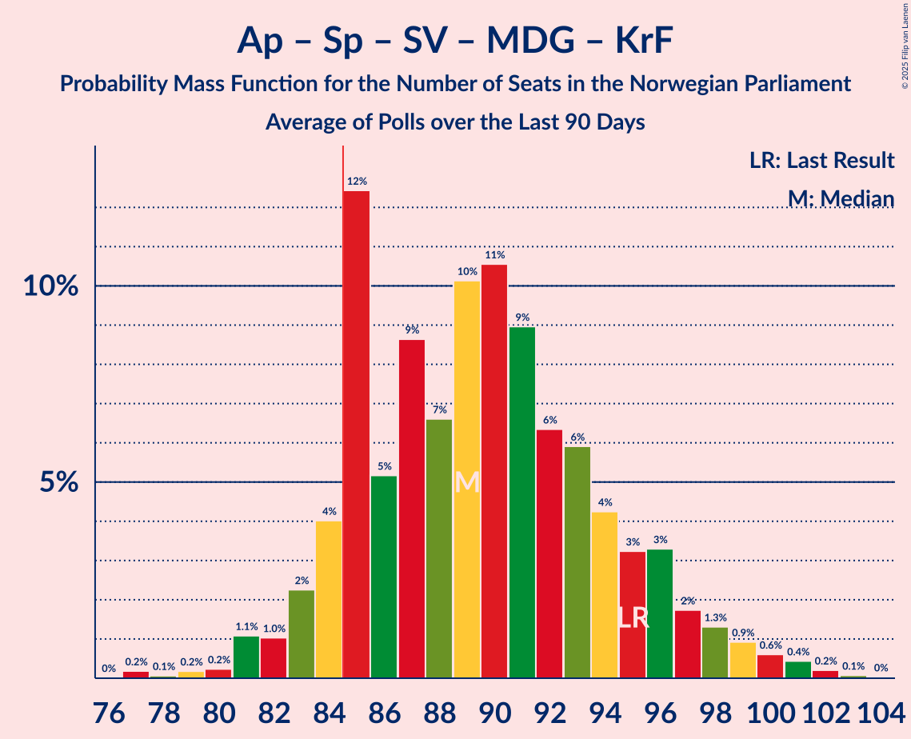

# Poll Average

<a href="#voting-intentions">Voting Intentions</a> | <a href="#seats">Seats</a> | <a href="#coalitions">Coalitions</a> | <a href="#technical-information">Technical Information</a>

## Summary

The table below lists the polls on which the average is based. They are the most recent polls (less than 90 days old) registered and analyzed so far.

| Period     | Polling firm/Commissioner(s) | Ap | H | Sp | FrP | SV | R | V | MDG | KrF | ND | Pp | K | INP | S | Hp | PF | Lib | FP | Kp |
|:----------:|:----------------------------:|:--:|:--:|:--:|:--:|:--:|:--:|:--:|:--:|:--:|:--:|:--:|:--:|:--:|:--:|:--:|:--:|:--:|:--:|:--:|
| 13 September 2021 | General Election | 26.2%   48 | 20.4%   36 | 13.5%   28 | 11.6%   21 | 7.6%   13 | 4.7%   8 | 4.6%   8 | 3.9%   3 | 3.8%   3 | 1.1%   0 | 0.6%   0 | 0.4%   0 | 0.3%   0 | 0.3%   0 | 0.2%   0 | 0.2%   1 | 0.2%   0 | 0.1%   0 | 0.0%   0 |
| N/A | Poll Average | 16–23%   30–42 | 18–26%   32–46 | 4–8%   6–14 | 20–27%   37–49 | 6–10%   10–18 | 4–7%   7–12 | 3–7%   2–12 | 2–5%   1–8 | 2–5%   0–8 | 0–1%   0 | 0–1%   0 | 0–1%   0 | 0–2%   0–2 | N/A   N/A | 0–1%   0 | N/A   N/A | 0–1%   0 | N/A   N/A | N/A   N/A |
| [8–13 January 2025](2025-01-13-ResponsAnalyse.html) | Respons Analyse   Aftenposten, Bergens Tidende and VG | 15–19%   27–36 | 21–27%   37–48 | 5–8%   8–14 | 22–27%   40–49 | 6–10%   10–17 | 4–7%   1–12 | 5–8%   8–13 | 3–5%   1–8 | 2–4%   0–7 | N/A   N/A | N/A   N/A | N/A   N/A | N/A   N/A | N/A   N/A | N/A   N/A | N/A   N/A | N/A   N/A | N/A   N/A | N/A   N/A |
| [8–13 January 2025](2025-01-13-Norstat.html) | Norstat   NRK | 18–23%   34–44 | 17–22%   31–40 | 4–6%   0–11 | 21–26%   40–49 | 7–11%   10–18 | 5–8%   7–13 | 5–7%   7–13 | 2–5%   1–7 | 3–5%   2–9 | N/A   N/A | N/A   N/A | N/A   N/A | N/A   N/A | N/A   N/A | N/A   N/A | N/A   N/A | N/A   N/A | N/A   N/A | N/A   N/A |
| [6–10 January 2025](2025-01-10-Verian.html) | Verian   TV2 | 19–24%   39–44 | 21–27%   37–45 | 4–7%   7–13 | 22–27%   38–45 | 6–9%   10–17 | 4–7%   8–10 | 2–5%   2–8 | 3–5%   2–7 | 3–5%   1–8 | 0–1%   0 | 0–1%   0 | 0–1%   0 | 0–2%   0 | N/A   N/A | N/A   N/A | N/A   N/A | 0–1%   0 | N/A   N/A | N/A   N/A |
| [7–8 January 2025](2025-01-08-Norfakta.html) | Norfakta   Klassekampen and Nationen | 16–21%   31–40 | 21–26%   35–46 | 5–8%   7–15 | 19–24%   35–44 | 7–10%   9–16 | 5–8%   7–12 | 3–6%   2–9 | 2–4%   1–7 | 2–4%   0–6 | N/A   N/A | N/A   N/A | N/A   N/A | N/A   N/A | N/A   N/A | N/A   N/A | N/A   N/A | N/A   N/A | N/A   N/A | N/A   N/A |
| [2–6 January 2025](2025-01-06-OpinionPerduco.html) | Opinion Perduco   ABC Nyheter and Altinget | 16–21%   31–38 | 19–24%   34–44 | 5–8%   9–14 | 22–28%   41–50 | 7–11%   13–19 | 4–7%   8–13 | 4–6%   3–11 | 2–4%   1–3 | 2–4%   0–8 | N/A   N/A | N/A   N/A | N/A   N/A | 1–2%   0 | N/A   N/A | N/A   N/A | N/A   N/A | N/A   N/A | N/A   N/A | N/A   N/A |
| [6 January 2025](2025-01-06-InFact.html) | InFact   Nettavisen | 18–23%   35–43 | 19–23%   33–43 | 5–8%   9–15 | 22–27%   41–50 | 6–9%   10–16 | 4–7%   8–13 | 3–6%   2–10 | 2–4%   1–8 | 2–4%   0–8 | 0–1%   0 | 0–1%   0 | 0–1%   0 | 1–2%   0–2 | N/A   N/A | 0–1%   0 | N/A   N/A | N/A   N/A | N/A   N/A | N/A   N/A |
| 13 September 2021 | General Election | 26.2%   48 | 20.4%   36 | 13.5%   28 | 11.6%   21 | 7.6%   13 | 4.7%   8 | 4.6%   8 | 3.9%   3 | 3.8%   3 | 1.1%   0 | 0.6%   0 | 0.4%   0 | 0.3%   0 | 0.3%   0 | 0.2%   0 | 0.2%   1 | 0.2%   0 | 0.1%   0 | 0.0%   0 |

Only polls for which at least the sample size has been published are included in the table above.

**Legend:**
+ **Top half of each row:** Voting intentions (95% confidence interval)
+ **Bottom half of each row:** Seat projections for the Norwegian Parliament (95% confidence interval)
+ **Ap:** Arbeiderpartiet
+ **H:** Høyre
+ **Sp:** Senterpartiet
+ **FrP:** Fremskrittspartiet
+ **SV:** Sosialistisk Venstreparti
+ **R:** Rødt
+ **V:** Venstre
+ **MDG:** Miljøpartiet De Grønne
+ **KrF:** Kristelig Folkeparti
+ **ND:** Norgesdemokratene
+ **Pp:** Pensjonistpartiet
+ **K:** Konservativt
+ **INP:** Industri- og Næringspartiet
+ **S:** Partiet Sentrum
+ **Hp:** Helsepartiet
+ **PF:** Pasientfokus
+ **Lib:** Liberalistene
+ **FP:** Folkets parti
+ **Kp:** Kystpartiet
+ **N/A (single party):** Party not included the published results
+ **N/A (entire row):** Calculation for this opinion poll not started yet

## Voting Intentions

### Confidence Intervals

| Party | Last Result | Median | 80% Confidence Interval | 90% Confidence Interval | 95% Confidence Interval | 99% Confidence Interval |
|:-----:|:-----------:|:------:|:-----------------------:|:-----------------------:|:-----------------------:|:-----------------------:|
| <a href="#arbeiderpartiet">Arbeiderpartiet</a> | 26.2% | 19.3% | 16.6–21.8% |16.0–22.3% | 15.5–22.8% | 14.6–23.8% |
| <a href="#høyre">Høyre</a> | 20.4% | 22.3% | 19.6–24.9% |18.9–25.5% | 18.4–26.0% | 17.5–27.0% |
| <a href="#senterpartiet">Senterpartiet</a> | 13.5% | 6.1% | 4.9–7.3% |4.5–7.6% | 4.3–7.9% | 3.8–8.5% |
| <a href="#fremskrittspartiet">Fremskrittspartiet</a> | 11.6% | 24.0% | 21.2–26.1% |20.4–26.6% | 19.8–27.1% | 18.7–28.0% |
| <a href="#sosialistisk-venstreparti">Sosialistisk Venstreparti</a> | 7.6% | 8.0% | 6.7–9.4% |6.3–9.8% | 6.0–10.1% | 5.5–10.8% |
| <a href="#rødt">Rødt</a> | 4.7% | 5.7% | 4.8–6.8% |4.5–7.1% | 4.3–7.4% | 3.9–7.9% |
| <a href="#venstre">Venstre</a> | 4.6% | 4.8% | 3.5–6.4% |3.1–6.7% | 2.9–7.1% | 2.5–7.7% |
| <a href="#miljøpartiet-de-grønne">Miljøpartiet De Grønne</a> | 3.9% | 3.3% | 2.6–4.3% |2.4–4.5% | 2.2–4.8% | 1.9–5.3% |
| <a href="#kristelig-folkeparti">Kristelig Folkeparti</a> | 3.8% | 3.5% | 2.7–4.4% |2.5–4.7% | 2.3–5.0% | 2.1–5.5% |
| <a href="#norgesdemokratene">Norgesdemokratene</a> | 1.1% | 0.3% | 0.2–0.6% |0.1–0.7% | 0.1–0.8% | 0.1–1.0% |
| <a href="#pensjonistpartiet">Pensjonistpartiet</a> | 0.6% | 0.2% | 0.1–0.4% |0.1–0.5% | 0.0–0.6% | 0.0–0.8% |
| <a href="#konservativt">Konservativt</a> | 0.4% | 0.6% | 0.2–1.0% |0.2–1.1% | 0.1–1.3% | 0.1–1.5% |
| <a href="#industri--og-næringspartiet">Industri- og Næringspartiet</a> | 0.3% | 1.3% | 0.7–2.0% |0.6–2.2% | 0.5–2.3% | 0.4–2.7% |
| <a href="#partiet-sentrum">Partiet Sentrum</a> | 0.3% | N/A | N/A |N/A | N/A | N/A |
| <a href="#helsepartiet">Helsepartiet</a> | 0.2% | 0.2% | 0.1–0.5% |0.1–0.6% | 0.1–0.6% | 0.0–0.8% |
| <a href="#pasientfokus">Pasientfokus</a> | 0.2% | N/A | N/A |N/A | N/A | N/A |
| <a href="#liberalistene">Liberalistene</a> | 0.2% | 0.3% | 0.1–0.5% |0.1–0.6% | 0.1–0.7% | 0.0–0.9% |
| <a href="#folkets-parti">Folkets parti</a> | 0.1% | N/A | N/A |N/A | N/A | N/A |
| <a href="#kystpartiet">Kystpartiet</a> | 0.0% | N/A | N/A |N/A | N/A | N/A |

### Arbeiderpartiet

*For a full overview of the results for this party, see the [Arbeiderpartiet](party-arbeiderpartiet.html) page.*

| Voting Intentions | Probability | Accumulated | Special Marks |
|:-----------------:|:-----------:|:-----------:|:-------------:|
| 12.5–13.5% | 0% | 100% |  |
| 13.5–14.5% | 0.4% | 100% |  |
| 14.5–15.5% | 2% | 99.5% |  |
| 15.5–16.5% | 7% | 97% |  |
| 16.5–17.5% | 12% | 90% |  |
| 17.5–18.5% | 16% | 78% |  |
| 18.5–19.5% | 17% | 62% | Median |
| 19.5–20.5% | 18% | 45% |  |
| 20.5–21.5% | 15% | 28% |  |
| 21.5–22.5% | 9% | 12% |  |
| 22.5–23.5% | 3% | 4% |  |
| 23.5–24.5% | 0.7% | 0.8% |  |
| 24.5–25.5% | 0.1% | 0.1% |  |
| 25.5–26.5% | 0% | 0% | Last Result |

### Høyre

*For a full overview of the results for this party, see the [Høyre](party-høyre.html) page.*

| Voting Intentions | Probability | Accumulated | Special Marks |
|:-----------------:|:-----------:|:-----------:|:-------------:|
| 15.5–16.5% | 0.1% | 100% |  |
| 16.5–17.5% | 0.5% | 99.9% |  |
| 17.5–18.5% | 2% | 99.4% |  |
| 18.5–19.5% | 7% | 97% |  |
| 19.5–20.5% | 12% | 90% | Last Result |
| 20.5–21.5% | 16% | 78% |  |
| 21.5–22.5% | 17% | 63% | Median |
| 22.5–23.5% | 17% | 46% |  |
| 23.5–24.5% | 15% | 29% |  |
| 24.5–25.5% | 9% | 14% |  |
| 25.5–26.5% | 4% | 5% |  |
| 26.5–27.5% | 1.0% | 1.1% |  |
| 27.5–28.5% | 0.2% | 0.2% |  |
| 28.5–29.5% | 0% | 0% |  |

### Senterpartiet

*For a full overview of the results for this party, see the [Senterpartiet](party-senterpartiet.html) page.*

| Voting Intentions | Probability | Accumulated | Special Marks |
|:-----------------:|:-----------:|:-----------:|:-------------:|
| 1.5–2.5% | 0% | 100% |  |
| 2.5–3.5% | 0.2% | 100% |  |
| 3.5–4.5% | 5% | 99.8% |  |
| 4.5–5.5% | 23% | 95% |  |
| 5.5–6.5% | 40% | 72% | Median |
| 6.5–7.5% | 25% | 31% |  |
| 7.5–8.5% | 5% | 6% |  |
| 8.5–9.5% | 0.4% | 0.4% |  |
| 9.5–10.5% | 0% | 0% |  |
| 10.5–11.5% | 0% | 0% |  |
| 11.5–12.5% | 0% | 0% |  |
| 12.5–13.5% | 0% | 0% |  |
| 13.5–14.5% | 0% | 0% | Last Result |

### Fremskrittspartiet

*For a full overview of the results for this party, see the [Fremskrittspartiet](party-fremskrittspartiet.html) page.*

| Voting Intentions | Probability | Accumulated | Special Marks |
|:-----------------:|:-----------:|:-----------:|:-------------:|
| 11.5–12.5% | 0% | 100% | Last Result |
| 12.5–13.5% | 0% | 100% |  |
| 13.5–14.5% | 0% | 100% |  |
| 14.5–15.5% | 0% | 100% |  |
| 15.5–16.5% | 0% | 100% |  |
| 16.5–17.5% | 0% | 100% |  |
| 17.5–18.5% | 0.3% | 100% |  |
| 18.5–19.5% | 2% | 99.7% |  |
| 19.5–20.5% | 4% | 98% |  |
| 20.5–21.5% | 6% | 94% |  |
| 21.5–22.5% | 10% | 88% |  |
| 22.5–23.5% | 17% | 78% |  |
| 23.5–24.5% | 23% | 61% | Median |
| 24.5–25.5% | 20% | 38% |  |
| 25.5–26.5% | 12% | 17% |  |
| 26.5–27.5% | 4% | 5% |  |
| 27.5–28.5% | 1.0% | 1.1% |  |
| 28.5–29.5% | 0.2% | 0.2% |  |
| 29.5–30.5% | 0% | 0% |  |

### Sosialistisk Venstreparti

*For a full overview of the results for this party, see the [Sosialistisk Venstreparti](party-sosialistiskvenstreparti.html) page.*

| Voting Intentions | Probability | Accumulated | Special Marks |
|:-----------------:|:-----------:|:-----------:|:-------------:|
| 3.5–4.5% | 0% | 100% |  |
| 4.5–5.5% | 0.5% | 100% |  |
| 5.5–6.5% | 8% | 99.5% |  |
| 6.5–7.5% | 26% | 92% |  |
| 7.5–8.5% | 36% | 65% | Last Result, Median |
| 8.5–9.5% | 22% | 30% |  |
| 9.5–10.5% | 7% | 8% |  |
| 10.5–11.5% | 0.9% | 1.0% |  |
| 11.5–12.5% | 0.1% | 0.1% |  |
| 12.5–13.5% | 0% | 0% |  |

### Rødt

*For a full overview of the results for this party, see the [Rødt](party-rødt.html) page.*

| Voting Intentions | Probability | Accumulated | Special Marks |
|:-----------------:|:-----------:|:-----------:|:-------------:|
| 2.5–3.5% | 0.1% | 100% |  |
| 3.5–4.5% | 6% | 99.9% |  |
| 4.5–5.5% | 36% | 94% | Last Result |
| 5.5–6.5% | 44% | 59% | Median |
| 6.5–7.5% | 13% | 15% |  |
| 7.5–8.5% | 1.4% | 1.5% |  |
| 8.5–9.5% | 0.1% | 0.1% |  |
| 9.5–10.5% | 0% | 0% |  |

### Venstre

*For a full overview of the results for this party, see the [Venstre](party-venstre.html) page.*

| Voting Intentions | Probability | Accumulated | Special Marks |
|:-----------------:|:-----------:|:-----------:|:-------------:|
| 0.5–1.5% | 0% | 100% |  |
| 1.5–2.5% | 0.6% | 100% |  |
| 2.5–3.5% | 11% | 99.4% |  |
| 3.5–4.5% | 30% | 88% |  |
| 4.5–5.5% | 31% | 58% | Last Result, Median |
| 5.5–6.5% | 20% | 27% |  |
| 6.5–7.5% | 6% | 7% |  |
| 7.5–8.5% | 0.7% | 0.8% |  |
| 8.5–9.5% | 0% | 0% |  |

### Miljøpartiet De Grønne

*For a full overview of the results for this party, see the [Miljøpartiet De Grønne](party-miljøpartietdegrønne.html) page.*

| Voting Intentions | Probability | Accumulated | Special Marks |
|:-----------------:|:-----------:|:-----------:|:-------------:|
| 0.5–1.5% | 0% | 100% |  |
| 1.5–2.5% | 10% | 100% |  |
| 2.5–3.5% | 53% | 90% | Median |
| 3.5–4.5% | 33% | 38% | Last Result |
| 4.5–5.5% | 5% | 5% |  |
| 5.5–6.5% | 0.2% | 0.2% |  |
| 6.5–7.5% | 0% | 0% |  |

### Kristelig Folkeparti

*For a full overview of the results for this party, see the [Kristelig Folkeparti](party-kristeligfolkeparti.html) page.*

| Voting Intentions | Probability | Accumulated | Special Marks |
|:-----------------:|:-----------:|:-----------:|:-------------:|
| 0.5–1.5% | 0% | 100% |  |
| 1.5–2.5% | 6% | 100% |  |
| 2.5–3.5% | 49% | 94% | Median |
| 3.5–4.5% | 37% | 44% | Last Result |
| 4.5–5.5% | 7% | 7% |  |
| 5.5–6.5% | 0.4% | 0.4% |  |
| 6.5–7.5% | 0% | 0% |  |

### Norgesdemokratene

*For a full overview of the results for this party, see the [Norgesdemokratene](party-norgesdemokratene.html) page.*

| Voting Intentions | Probability | Accumulated | Special Marks |
|:-----------------:|:-----------:|:-----------:|:-------------:|
| 0.0–0.5% | 83% | 100% | Median |
| 0.5–1.5% | 17% | 17% | Last Result |
| 1.5–2.5% | 0% | 0% |  |

### Pensjonistpartiet

*For a full overview of the results for this party, see the [Pensjonistpartiet](party-pensjonistpartiet.html) page.*

| Voting Intentions | Probability | Accumulated | Special Marks |
|:-----------------:|:-----------:|:-----------:|:-------------:|
| 0.0–0.5% | 96% | 100% | Median |
| 0.5–1.5% | 4% | 4% | Last Result |
| 1.5–2.5% | 0% | 0% |  |

### Konservativt

*For a full overview of the results for this party, see the [Konservativt](party-konservativt.html) page.*

| Voting Intentions | Probability | Accumulated | Special Marks |
|:-----------------:|:-----------:|:-----------:|:-------------:|
| 0.0–0.5% | 49% | 100% | Last Result |
| 0.5–1.5% | 51% | 51% | Median |
| 1.5–2.5% | 0.4% | 0.4% |  |
| 2.5–3.5% | 0% | 0% |  |

### Industri- og Næringspartiet

*For a full overview of the results for this party, see the [Industri- og Næringspartiet](party-industri-ognæringspartiet.html) page.*

| Voting Intentions | Probability | Accumulated | Special Marks |
|:-----------------:|:-----------:|:-----------:|:-------------:|
| 0.0–0.5% | 3% | 100% | Last Result |
| 0.5–1.5% | 62% | 97% | Median |
| 1.5–2.5% | 33% | 34% |  |
| 2.5–3.5% | 0.9% | 0.9% |  |
| 3.5–4.5% | 0% | 0% |  |

### Helsepartiet

*For a full overview of the results for this party, see the [Helsepartiet](party-helsepartiet.html) page.*

| Voting Intentions | Probability | Accumulated | Special Marks |
|:-----------------:|:-----------:|:-----------:|:-------------:|
| 0.0–0.5% | 95% | 100% | Last Result, Median |
| 0.5–1.5% | 5% | 5% |  |
| 1.5–2.5% | 0% | 0% |  |

### Liberalistene

*For a full overview of the results for this party, see the [Liberalistene](party-liberalistene.html) page.*

| Voting Intentions | Probability | Accumulated | Special Marks |
|:-----------------:|:-----------:|:-----------:|:-------------:|
| 0.0–0.5% | 91% | 100% | Last Result, Median |
| 0.5–1.5% | 9% | 9% |  |
| 1.5–2.5% | 0% | 0% |  |

## Seats

### Confidence Intervals

| Party | Last Result | Median | 80% Confidence Interval | 90% Confidence Interval | 95% Confidence Interval | 99% Confidence Interval |
|:-----:|:-----------:|:------:|:-----------------------:|:-----------------------:|:-----------------------:|:-----------------------:|
| <a href="#arbeiderpartiet">Arbeiderpartiet</a> | 48 | 36 | 32–40 |31–41 | 30–42 | 28–45 |
| <a href="#høyre">Høyre</a> | 36 | 40 | 35–45 |33–45 | 32–46 | 31–48 |
| <a href="#senterpartiet">Senterpartiet</a> | 28 | 10 | 8–13 |7–13 | 6–14 | 0–15 |
| <a href="#fremskrittspartiet">Fremskrittspartiet</a> | 21 | 44 | 39–48 |38–48 | 37–49 | 35–51 |
| <a href="#sosialistisk-venstreparti">Sosialistisk Venstreparti</a> | 13 | 13 | 10–16 |10–17 | 10–18 | 9–19 |
| <a href="#rødt">Rødt</a> | 8 | 10 | 8–11 |8–12 | 7–12 | 1–14 |
| <a href="#venstre">Venstre</a> | 8 | 8 | 3–11 |3–12 | 2–12 | 2–13 |
| <a href="#miljøpartiet-de-grønne">Miljøpartiet De Grønne</a> | 3 | 2 | 1–7 |1–7 | 1–8 | 1–9 |
| <a href="#kristelig-folkeparti">Kristelig Folkeparti</a> | 3 | 2 | 1–7 |1–7 | 0–8 | 0–9 |
| <a href="#norgesdemokratene">Norgesdemokratene</a> | 0 | 0 | 0 |0 | 0 | 0 |
| <a href="#pensjonistpartiet">Pensjonistpartiet</a> | 0 | 0 | 0 |0 | 0 | 0 |
| <a href="#konservativt">Konservativt</a> | 0 | 0 | 0 |0 | 0 | 0 |
| <a href="#industri--og-næringspartiet">Industri- og Næringspartiet</a> | 0 | 0 | 0 |0–2 | 0–2 | 0–2 |
| <a href="#partiet-sentrum">Partiet Sentrum</a> | 0 | N/A | N/A |N/A | N/A | N/A |
| <a href="#helsepartiet">Helsepartiet</a> | 0 | 0 | 0 |0 | 0 | 0 |
| <a href="#pasientfokus">Pasientfokus</a> | 1 | N/A | N/A |N/A | N/A | N/A |
| <a href="#liberalistene">Liberalistene</a> | 0 | 0 | 0 |0 | 0 | 0 |
| <a href="#folkets-parti">Folkets parti</a> | 0 | N/A | N/A |N/A | N/A | N/A |
| <a href="#kystpartiet">Kystpartiet</a> | 0 | N/A | N/A |N/A | N/A | N/A |

### Arbeiderpartiet

*For a full overview of the results for this party, see the [Arbeiderpartiet](party-arbeiderpartiet.html) page.*

| Number of Seats | Probability | Accumulated | Special Marks |
|:---------------:|:-----------:|:-----------:|:-------------:|
| 25 | 0.1% | 100% |  |
| 26 | 0.1% | 99.9% |  |
| 27 | 0.2% | 99.7% |  |
| 28 | 0.2% | 99.5% |  |
| 29 | 0.4% | 99.3% |  |
| 30 | 1.5% | 98.9% |  |
| 31 | 4% | 97% |  |
| 32 | 8% | 93% |  |
| 33 | 10% | 85% |  |
| 34 | 6% | 74% |  |
| 35 | 13% | 68% |  |
| 36 | 8% | 56% | Median |
| 37 | 6% | 47% |  |
| 38 | 13% | 41% |  |
| 39 | 7% | 28% |  |
| 40 | 15% | 21% |  |
| 41 | 3% | 6% |  |
| 42 | 1.2% | 3% |  |
| 43 | 0.6% | 2% |  |
| 44 | 0.9% | 2% |  |
| 45 | 0.2% | 0.7% |  |
| 46 | 0.2% | 0.5% |  |
| 47 | 0.1% | 0.2% |  |
| 48 | 0.1% | 0.1% | Last Result |
| 49 | 0% | 0% |  |

### Høyre

*For a full overview of the results for this party, see the [Høyre](party-høyre.html) page.*

| Number of Seats | Probability | Accumulated | Special Marks |
|:---------------:|:-----------:|:-----------:|:-------------:|
| 30 | 0.2% | 100% |  |
| 31 | 0.3% | 99.7% |  |
| 32 | 3% | 99.4% |  |
| 33 | 3% | 96% |  |
| 34 | 4% | 94% |  |
| 35 | 8% | 90% |  |
| 36 | 6% | 82% | Last Result |
| 37 | 5% | 77% |  |
| 38 | 7% | 72% |  |
| 39 | 11% | 65% |  |
| 40 | 14% | 53% | Median |
| 41 | 7% | 40% |  |
| 42 | 5% | 33% |  |
| 43 | 5% | 28% |  |
| 44 | 5% | 23% |  |
| 45 | 15% | 19% |  |
| 46 | 2% | 3% |  |
| 47 | 0.9% | 2% |  |
| 48 | 0.5% | 0.7% |  |
| 49 | 0.2% | 0.2% |  |
| 50 | 0% | 0.1% |  |
| 51 | 0% | 0% |  |

### Senterpartiet

*For a full overview of the results for this party, see the [Senterpartiet](party-senterpartiet.html) page.*

| Number of Seats | Probability | Accumulated | Special Marks |
|:---------------:|:-----------:|:-----------:|:-------------:|
| 0 | 0.6% | 100% |  |
| 1 | 0.7% | 99.4% |  |
| 2 | 0% | 98.7% |  |
| 3 | 0% | 98.7% |  |
| 4 | 0% | 98.7% |  |
| 5 | 0.1% | 98.7% |  |
| 6 | 1.1% | 98.6% |  |
| 7 | 6% | 97% |  |
| 8 | 19% | 92% |  |
| 9 | 12% | 72% |  |
| 10 | 14% | 61% | Median |
| 11 | 17% | 46% |  |
| 12 | 17% | 29% |  |
| 13 | 8% | 12% |  |
| 14 | 3% | 4% |  |
| 15 | 1.4% | 2% |  |
| 16 | 0.2% | 0.3% |  |
| 17 | 0% | 0% |  |
| 18 | 0% | 0% |  |
| 19 | 0% | 0% |  |
| 20 | 0% | 0% |  |
| 21 | 0% | 0% |  |
| 22 | 0% | 0% |  |
| 23 | 0% | 0% |  |
| 24 | 0% | 0% |  |
| 25 | 0% | 0% |  |
| 26 | 0% | 0% |  |
| 27 | 0% | 0% |  |
| 28 | 0% | 0% | Last Result |

### Fremskrittspartiet

*For a full overview of the results for this party, see the [Fremskrittspartiet](party-fremskrittspartiet.html) page.*

| Number of Seats | Probability | Accumulated | Special Marks |
|:---------------:|:-----------:|:-----------:|:-------------:|
| 21 | 0% | 100% | Last Result |
| 22 | 0% | 100% |  |
| 23 | 0% | 100% |  |
| 24 | 0% | 100% |  |
| 25 | 0% | 100% |  |
| 26 | 0% | 100% |  |
| 27 | 0% | 100% |  |
| 28 | 0% | 100% |  |
| 29 | 0% | 100% |  |
| 30 | 0% | 100% |  |
| 31 | 0% | 100% |  |
| 32 | 0% | 100% |  |
| 33 | 0.1% | 100% |  |
| 34 | 0.1% | 99.9% |  |
| 35 | 0.4% | 99.7% |  |
| 36 | 1.4% | 99.4% |  |
| 37 | 2% | 98% |  |
| 38 | 3% | 96% |  |
| 39 | 5% | 94% |  |
| 40 | 3% | 89% |  |
| 41 | 11% | 86% |  |
| 42 | 8% | 75% |  |
| 43 | 13% | 68% |  |
| 44 | 25% | 55% | Median |
| 45 | 8% | 30% |  |
| 46 | 7% | 23% |  |
| 47 | 5% | 16% |  |
| 48 | 6% | 11% |  |
| 49 | 3% | 5% |  |
| 50 | 1.1% | 2% |  |
| 51 | 0.4% | 0.8% |  |
| 52 | 0.2% | 0.4% |  |
| 53 | 0.1% | 0.2% |  |
| 54 | 0% | 0.1% |  |
| 55 | 0% | 0% |  |

### Sosialistisk Venstreparti

*For a full overview of the results for this party, see the [Sosialistisk Venstreparti](party-sosialistiskvenstreparti.html) page.*

| Number of Seats | Probability | Accumulated | Special Marks |
|:---------------:|:-----------:|:-----------:|:-------------:|
| 8 | 0.1% | 100% |  |
| 9 | 0.8% | 99.9% |  |
| 10 | 16% | 99.1% |  |
| 11 | 8% | 83% |  |
| 12 | 12% | 76% |  |
| 13 | 14% | 64% | Last Result, Median |
| 14 | 14% | 50% |  |
| 15 | 17% | 35% |  |
| 16 | 10% | 19% |  |
| 17 | 5% | 8% |  |
| 18 | 3% | 4% |  |
| 19 | 0.8% | 1.1% |  |
| 20 | 0.2% | 0.3% |  |
| 21 | 0.1% | 0.1% |  |
| 22 | 0% | 0% |  |

### Rødt

*For a full overview of the results for this party, see the [Rødt](party-rødt.html) page.*

| Number of Seats | Probability | Accumulated | Special Marks |
|:---------------:|:-----------:|:-----------:|:-------------:|
| 1 | 1.0% | 100% |  |
| 2 | 0% | 99.0% |  |
| 3 | 0% | 99.0% |  |
| 4 | 0% | 99.0% |  |
| 5 | 0% | 99.0% |  |
| 6 | 0.3% | 99.0% |  |
| 7 | 4% | 98.7% |  |
| 8 | 12% | 95% | Last Result |
| 9 | 24% | 83% |  |
| 10 | 33% | 60% | Median |
| 11 | 19% | 27% |  |
| 12 | 6% | 8% |  |
| 13 | 1.4% | 2% |  |
| 14 | 0.5% | 0.8% |  |
| 15 | 0.3% | 0.3% |  |
| 16 | 0% | 0% |  |

### Venstre

*For a full overview of the results for this party, see the [Venstre](party-venstre.html) page.*

| Number of Seats | Probability | Accumulated | Special Marks |
|:---------------:|:-----------:|:-----------:|:-------------:|
| 2 | 3% | 100% |  |
| 3 | 14% | 97% |  |
| 4 | 0% | 83% |  |
| 5 | 0.1% | 83% |  |
| 6 | 2% | 83% |  |
| 7 | 23% | 80% |  |
| 8 | 16% | 57% | Last Result, Median |
| 9 | 17% | 42% |  |
| 10 | 14% | 25% |  |
| 11 | 6% | 11% |  |
| 12 | 4% | 5% |  |
| 13 | 1.2% | 1.4% |  |
| 14 | 0.2% | 0.2% |  |
| 15 | 0% | 0% |  |

### Miljøpartiet De Grønne

*For a full overview of the results for this party, see the [Miljøpartiet De Grønne](party-miljøpartietdegrønne.html) page.*

| Number of Seats | Probability | Accumulated | Special Marks |
|:---------------:|:-----------:|:-----------:|:-------------:|
| 1 | 27% | 100% |  |
| 2 | 45% | 73% | Median |
| 3 | 15% | 29% | Last Result |
| 4 | 0% | 13% |  |
| 5 | 0.2% | 13% |  |
| 6 | 2% | 13% |  |
| 7 | 7% | 11% |  |
| 8 | 3% | 4% |  |
| 9 | 0.5% | 0.6% |  |
| 10 | 0.1% | 0.1% |  |
| 11 | 0% | 0% |  |

### Kristelig Folkeparti

*For a full overview of the results for this party, see the [Kristelig Folkeparti](party-kristeligfolkeparti.html) page.*

| Number of Seats | Probability | Accumulated | Special Marks |
|:---------------:|:-----------:|:-----------:|:-------------:|
| 0 | 3% | 100% |  |
| 1 | 14% | 97% |  |
| 2 | 43% | 83% | Median |
| 3 | 20% | 40% | Last Result |
| 4 | 0% | 20% |  |
| 5 | 0.1% | 20% |  |
| 6 | 3% | 20% |  |
| 7 | 13% | 17% |  |
| 8 | 3% | 4% |  |
| 9 | 0.8% | 0.9% |  |
| 10 | 0.1% | 0.1% |  |
| 11 | 0% | 0% |  |

### Norgesdemokratene

*For a full overview of the results for this party, see the [Norgesdemokratene](party-norgesdemokratene.html) page.*

| Number of Seats | Probability | Accumulated | Special Marks |
|:---------------:|:-----------:|:-----------:|:-------------:|
| 0 | 100% | 100% | Last Result, Median |

### Pensjonistpartiet

*For a full overview of the results for this party, see the [Pensjonistpartiet](party-pensjonistpartiet.html) page.*

| Number of Seats | Probability | Accumulated | Special Marks |
|:---------------:|:-----------:|:-----------:|:-------------:|
| 0 | 100% | 100% | Last Result, Median |

### Konservativt

*For a full overview of the results for this party, see the [Konservativt](party-konservativt.html) page.*

| Number of Seats | Probability | Accumulated | Special Marks |
|:---------------:|:-----------:|:-----------:|:-------------:|
| 0 | 100% | 100% | Last Result, Median |

### Industri- og Næringspartiet

*For a full overview of the results for this party, see the [Industri- og Næringspartiet](party-industri-ognæringspartiet.html) page.*

| Number of Seats | Probability | Accumulated | Special Marks |
|:---------------:|:-----------:|:-----------:|:-------------:|
| 0 | 94% | 100% | Last Result, Median |
| 1 | 0.4% | 6% |  |
| 2 | 5% | 5% |  |
| 3 | 0% | 0% |  |

### Partiet Sentrum

*For a full overview of the results for this party, see the [Partiet Sentrum](party-partietsentrum.html) page.*

### Helsepartiet

*For a full overview of the results for this party, see the [Helsepartiet](party-helsepartiet.html) page.*

| Number of Seats | Probability | Accumulated | Special Marks |
|:---------------:|:-----------:|:-----------:|:-------------:|
| 0 | 100% | 100% | Last Result, Median |

### Pasientfokus

*For a full overview of the results for this party, see the [Pasientfokus](party-pasientfokus.html) page.*

### Liberalistene

*For a full overview of the results for this party, see the [Liberalistene](party-liberalistene.html) page.*

| Number of Seats | Probability | Accumulated | Special Marks |
|:---------------:|:-----------:|:-----------:|:-------------:|
| 0 | 100% | 100% | Last Result, Median |

### Folkets parti

*For a full overview of the results for this party, see the [Folkets parti](party-folketsparti.html) page.*

### Kystpartiet

*For a full overview of the results for this party, see the [Kystpartiet](party-kystpartiet.html) page.*

## Coalitions

### Confidence Intervals

| Coalition | Last Result | Median | Majority? | 80% Confidence Interval | 90% Confidence Interval | 95% Confidence Interval | 99% Confidence Interval |
|:---------:|:-----------:|:------:|:---------:|:-----------------------:|:-----------------------:|:-----------------------:|:-----------------------:|
| Høyre – Senterpartiet – Fremskrittspartiet – Venstre – Kristelig Folkeparti | 96 | 104 | 100% | 98–110 | 97–112 | 95–113 | 93–115 |
| Høyre – Fremskrittspartiet – Venstre – Miljøpartiet De Grønne – Kristelig Folkeparti | 71 | 96 | 99.5% | 90–103 | 89–105 | 87–106 | 84–110 |
| Høyre – Fremskrittspartiet – Venstre – Kristelig Folkeparti | 68 | 94 | 97% | 88–99 | 86–101 | 84–102 | 82–105 |
| Høyre – Fremskrittspartiet – Venstre | 65 | 91 | 85% | 84–97 | 83–99 | 81–100 | 79–103 |
| Høyre – Fremskrittspartiet | 57 | 83 | 37% | 78–89 | 76–89 | 75–91 | 72–94 |
| Arbeiderpartiet – Senterpartiet – Sosialistisk Venstreparti – Rødt – Miljøpartiet De Grønne | 100 | 71 | 0.1% | 67–77 | 66–79 | 64–81 | 62–84 |
| Arbeiderpartiet – Senterpartiet – Sosialistisk Venstreparti – Rødt | 97 | 69 | 0% | 64–76 | 62–76 | 61–77 | 58–79 |
| Arbeiderpartiet – Senterpartiet – Sosialistisk Venstreparti – Miljøpartiet De Grønne – Kristelig Folkeparti | 95 | 65 | 0% | 61–73 | 59–73 | 58–75 | 55–77 |
| Arbeiderpartiet – Senterpartiet – Sosialistisk Venstreparti – Miljøpartiet De Grønne | 92 | 62 | 0% | 58–67 | 57–68 | 56–70 | 53–74 |
| Arbeiderpartiet – Sosialistisk Venstreparti – Rødt – Miljøpartiet De Grønne | 72 | 62 | 0% | 57–67 | 56–69 | 55–70 | 51–73 |
| Arbeiderpartiet – Senterpartiet – Sosialistisk Venstreparti | 89 | 59 | 0% | 55–65 | 54–66 | 52–67 | 50–69 |
| Arbeiderpartiet – Senterpartiet – Miljøpartiet De Grønne – Kristelig Folkeparti | 82 | 52 | 0% | 47–58 | 46–58 | 45–60 | 43–66 |
| Høyre – Venstre – Kristelig Folkeparti | 47 | 50 | 0% | 46–55 | 44–57 | 43–58 | 41–60 |
| Arbeiderpartiet – Senterpartiet – Kristelig Folkeparti | 79 | 50 | 0% | 44–55 | 43–57 | 42–57 | 40–64 |
| Arbeiderpartiet – Sosialistisk Venstreparti | 61 | 50 | 0% | 45–54 | 44–55 | 43–56 | 40–59 |
| Arbeiderpartiet – Senterpartiet | 76 | 47 | 0% | 42–50 | 41–52 | 40–52 | 37–56 |
| Senterpartiet – Venstre – Kristelig Folkeparti | 39 | 21 | 0% | 17–25 | 16–26 | 15–27 | 13–29 |

### Høyre – Senterpartiet – Fremskrittspartiet – Venstre – Kristelig Folkeparti

| Number of Seats | Probability | Accumulated | Special Marks |
|:---------------:|:-----------:|:-----------:|:-------------:|
| 90 | 0.1% | 100% |  |
| 91 | 0.1% | 99.9% |  |
| 92 | 0.2% | 99.8% |  |
| 93 | 0.7% | 99.6% |  |
| 94 | 0.6% | 98.9% |  |
| 95 | 1.4% | 98% |  |
| 96 | 2% | 97% | Last Result |
| 97 | 4% | 95% |  |
| 98 | 3% | 91% |  |
| 99 | 5% | 88% |  |
| 100 | 5% | 83% |  |
| 101 | 6% | 78% |  |
| 102 | 4% | 72% |  |
| 103 | 10% | 67% |  |
| 104 | 11% | 58% | Median |
| 105 | 5% | 47% |  |
| 106 | 18% | 42% |  |
| 107 | 5% | 24% |  |
| 108 | 4% | 19% |  |
| 109 | 3% | 15% |  |
| 110 | 4% | 12% |  |
| 111 | 2% | 7% |  |
| 112 | 3% | 5% |  |
| 113 | 1.1% | 3% |  |
| 114 | 0.8% | 2% |  |
| 115 | 0.3% | 0.7% |  |
| 116 | 0.2% | 0.5% |  |
| 117 | 0.1% | 0.3% |  |
| 118 | 0% | 0.2% |  |
| 119 | 0.1% | 0.1% |  |
| 120 | 0% | 0% |  |

### Høyre – Fremskrittspartiet – Venstre – Miljøpartiet De Grønne – Kristelig Folkeparti

| Number of Seats | Probability | Accumulated | Special Marks |
|:---------------:|:-----------:|:-----------:|:-------------:|
| 71 | 0% | 100% | Last Result |
| 72 | 0% | 100% |  |
| 73 | 0% | 100% |  |
| 74 | 0% | 100% |  |
| 75 | 0% | 100% |  |
| 76 | 0% | 100% |  |
| 77 | 0% | 100% |  |
| 78 | 0% | 100% |  |
| 79 | 0% | 100% |  |
| 80 | 0% | 100% |  |
| 81 | 0.1% | 100% |  |
| 82 | 0.1% | 99.9% |  |
| 83 | 0.2% | 99.8% |  |
| 84 | 0.2% | 99.6% |  |
| 85 | 0.6% | 99.5% | Majority |
| 86 | 1.2% | 98.9% |  |
| 87 | 1.1% | 98% |  |
| 88 | 1.4% | 97% |  |
| 89 | 3% | 95% |  |
| 90 | 2% | 92% |  |
| 91 | 4% | 89% |  |
| 92 | 11% | 85% |  |
| 93 | 5% | 74% |  |
| 94 | 5% | 69% |  |
| 95 | 8% | 64% |  |
| 96 | 8% | 56% | Median |
| 97 | 5% | 48% |  |
| 98 | 4% | 43% |  |
| 99 | 4% | 39% |  |
| 100 | 17% | 35% |  |
| 101 | 3% | 18% |  |
| 102 | 4% | 15% |  |
| 103 | 3% | 11% |  |
| 104 | 2% | 8% |  |
| 105 | 2% | 6% |  |
| 106 | 2% | 4% |  |
| 107 | 0.7% | 2% |  |
| 108 | 0.8% | 2% |  |
| 109 | 0.4% | 0.9% |  |
| 110 | 0.3% | 0.5% |  |
| 111 | 0.1% | 0.3% |  |
| 112 | 0% | 0.1% |  |
| 113 | 0% | 0.1% |  |
| 114 | 0% | 0.1% |  |
| 115 | 0% | 0% |  |

### Høyre – Fremskrittspartiet – Venstre – Kristelig Folkeparti

| Number of Seats | Probability | Accumulated | Special Marks |
|:---------------:|:-----------:|:-----------:|:-------------:|
| 68 | 0% | 100% | Last Result |
| 69 | 0% | 100% |  |
| 70 | 0% | 100% |  |
| 71 | 0% | 100% |  |
| 72 | 0% | 100% |  |
| 73 | 0% | 100% |  |
| 74 | 0% | 100% |  |
| 75 | 0% | 100% |  |
| 76 | 0% | 100% |  |
| 77 | 0% | 100% |  |
| 78 | 0% | 100% |  |
| 79 | 0% | 100% |  |
| 80 | 0.1% | 99.9% |  |
| 81 | 0.2% | 99.8% |  |
| 82 | 0.4% | 99.6% |  |
| 83 | 0.6% | 99.2% |  |
| 84 | 2% | 98.6% |  |
| 85 | 2% | 97% | Majority |
| 86 | 2% | 95% |  |
| 87 | 2% | 93% |  |
| 88 | 4% | 91% |  |
| 89 | 5% | 87% |  |
| 90 | 4% | 82% |  |
| 91 | 9% | 77% |  |
| 92 | 6% | 68% |  |
| 93 | 8% | 62% |  |
| 94 | 9% | 54% | Median |
| 95 | 6% | 46% |  |
| 96 | 4% | 39% |  |
| 97 | 4% | 35% |  |
| 98 | 18% | 31% |  |
| 99 | 4% | 13% |  |
| 100 | 2% | 8% |  |
| 101 | 3% | 7% |  |
| 102 | 2% | 4% |  |
| 103 | 0.8% | 2% |  |
| 104 | 0.6% | 1.4% |  |
| 105 | 0.3% | 0.7% |  |
| 106 | 0.2% | 0.5% |  |
| 107 | 0.1% | 0.2% |  |
| 108 | 0.1% | 0.2% |  |
| 109 | 0% | 0.1% |  |
| 110 | 0% | 0% |  |

### Høyre – Fremskrittspartiet – Venstre

| Number of Seats | Probability | Accumulated | Special Marks |
|:---------------:|:-----------:|:-----------:|:-------------:|
| 65 | 0% | 100% | Last Result |
| 66 | 0% | 100% |  |
| 67 | 0% | 100% |  |
| 68 | 0% | 100% |  |
| 69 | 0% | 100% |  |
| 70 | 0% | 100% |  |
| 71 | 0% | 100% |  |
| 72 | 0% | 100% |  |
| 73 | 0% | 100% |  |
| 74 | 0% | 100% |  |
| 75 | 0% | 100% |  |
| 76 | 0% | 100% |  |
| 77 | 0.1% | 100% |  |
| 78 | 0.2% | 99.9% |  |
| 79 | 0.3% | 99.7% |  |
| 80 | 0.4% | 99.5% |  |
| 81 | 2% | 99.1% |  |
| 82 | 1.5% | 97% |  |
| 83 | 3% | 96% |  |
| 84 | 8% | 93% |  |
| 85 | 4% | 85% | Majority |
| 86 | 6% | 81% |  |
| 87 | 5% | 76% |  |
| 88 | 6% | 70% |  |
| 89 | 4% | 64% |  |
| 90 | 6% | 60% |  |
| 91 | 7% | 55% |  |
| 92 | 8% | 48% | Median |
| 93 | 5% | 40% |  |
| 94 | 3% | 35% |  |
| 95 | 4% | 32% |  |
| 96 | 17% | 28% |  |
| 97 | 2% | 11% |  |
| 98 | 3% | 8% |  |
| 99 | 1.0% | 5% |  |
| 100 | 2% | 4% |  |
| 101 | 0.9% | 2% |  |
| 102 | 0.4% | 1.2% |  |
| 103 | 0.5% | 0.8% |  |
| 104 | 0.2% | 0.4% |  |
| 105 | 0.1% | 0.2% |  |
| 106 | 0% | 0.1% |  |
| 107 | 0% | 0.1% |  |
| 108 | 0% | 0% |  |

### Høyre – Fremskrittspartiet

| Number of Seats | Probability | Accumulated | Special Marks |
|:---------------:|:-----------:|:-----------:|:-------------:|
| 57 | 0% | 100% | Last Result |
| 58 | 0% | 100% |  |
| 59 | 0% | 100% |  |
| 60 | 0% | 100% |  |
| 61 | 0% | 100% |  |
| 62 | 0% | 100% |  |
| 63 | 0% | 100% |  |
| 64 | 0% | 100% |  |
| 65 | 0% | 100% |  |
| 66 | 0% | 100% |  |
| 67 | 0% | 100% |  |
| 68 | 0% | 100% |  |
| 69 | 0% | 100% |  |
| 70 | 0% | 100% |  |
| 71 | 0.1% | 100% |  |
| 72 | 0.4% | 99.8% |  |
| 73 | 0.6% | 99.4% |  |
| 74 | 0.8% | 98.9% |  |
| 75 | 2% | 98% |  |
| 76 | 2% | 96% |  |
| 77 | 3% | 94% |  |
| 78 | 6% | 92% |  |
| 79 | 5% | 86% |  |
| 80 | 8% | 80% |  |
| 81 | 12% | 72% |  |
| 82 | 7% | 60% |  |
| 83 | 11% | 54% |  |
| 84 | 5% | 43% | Median |
| 85 | 5% | 37% | Majority |
| 86 | 4% | 33% |  |
| 87 | 6% | 28% |  |
| 88 | 3% | 23% |  |
| 89 | 15% | 19% |  |
| 90 | 1.2% | 4% |  |
| 91 | 1.1% | 3% |  |
| 92 | 0.7% | 2% |  |
| 93 | 0.3% | 0.8% |  |
| 94 | 0.3% | 0.5% |  |
| 95 | 0.1% | 0.2% |  |
| 96 | 0.1% | 0.1% |  |
| 97 | 0% | 0% |  |

### Arbeiderpartiet – Senterpartiet – Sosialistisk Venstreparti – Rødt – Miljøpartiet De Grønne

| Number of Seats | Probability | Accumulated | Special Marks |
|:---------------:|:-----------:|:-----------:|:-------------:|
| 58 | 0% | 100% |  |
| 59 | 0.1% | 99.9% |  |
| 60 | 0.2% | 99.9% |  |
| 61 | 0.2% | 99.7% |  |
| 62 | 0.5% | 99.5% |  |
| 63 | 0.6% | 99.0% |  |
| 64 | 1.0% | 98% |  |
| 65 | 2% | 97% |  |
| 66 | 3% | 96% |  |
| 67 | 5% | 93% |  |
| 68 | 3% | 88% |  |
| 69 | 9% | 85% |  |
| 70 | 21% | 76% |  |
| 71 | 6% | 55% | Median |
| 72 | 8% | 49% |  |
| 73 | 7% | 41% |  |
| 74 | 6% | 34% |  |
| 75 | 7% | 27% |  |
| 76 | 5% | 21% |  |
| 77 | 8% | 16% |  |
| 78 | 2% | 8% |  |
| 79 | 3% | 6% |  |
| 80 | 0.9% | 3% |  |
| 81 | 0.3% | 3% |  |
| 82 | 0.9% | 2% |  |
| 83 | 0.3% | 1.3% |  |
| 84 | 0.9% | 1.0% |  |
| 85 | 0% | 0.1% | Majority |
| 86 | 0% | 0% |  |
| 87 | 0% | 0% |  |
| 88 | 0% | 0% |  |
| 89 | 0% | 0% |  |
| 90 | 0% | 0% |  |
| 91 | 0% | 0% |  |
| 92 | 0% | 0% |  |
| 93 | 0% | 0% |  |
| 94 | 0% | 0% |  |
| 95 | 0% | 0% |  |
| 96 | 0% | 0% |  |
| 97 | 0% | 0% |  |
| 98 | 0% | 0% |  |
| 99 | 0% | 0% |  |
| 100 | 0% | 0% | Last Result |

### Arbeiderpartiet – Senterpartiet – Sosialistisk Venstreparti – Rødt

| Number of Seats | Probability | Accumulated | Special Marks |
|:---------------:|:-----------:|:-----------:|:-------------:|
| 54 | 0.1% | 100% |  |
| 55 | 0.1% | 99.9% |  |
| 56 | 0.1% | 99.8% |  |
| 57 | 0.2% | 99.7% |  |
| 58 | 0.4% | 99.6% |  |
| 59 | 0.6% | 99.2% |  |
| 60 | 1.1% | 98.6% |  |
| 61 | 1.1% | 98% |  |
| 62 | 2% | 96% |  |
| 63 | 3% | 94% |  |
| 64 | 3% | 91% |  |
| 65 | 5% | 88% |  |
| 66 | 5% | 83% |  |
| 67 | 8% | 78% |  |
| 68 | 20% | 70% |  |
| 69 | 6% | 50% | Median |
| 70 | 7% | 44% |  |
| 71 | 6% | 37% |  |
| 72 | 6% | 32% |  |
| 73 | 6% | 26% |  |
| 74 | 4% | 20% |  |
| 75 | 3% | 16% |  |
| 76 | 10% | 13% |  |
| 77 | 1.0% | 3% |  |
| 78 | 0.8% | 2% |  |
| 79 | 1.2% | 2% |  |
| 80 | 0.2% | 0.4% |  |
| 81 | 0.2% | 0.3% |  |
| 82 | 0.1% | 0.1% |  |
| 83 | 0% | 0% |  |
| 84 | 0% | 0% |  |
| 85 | 0% | 0% | Majority |
| 86 | 0% | 0% |  |
| 87 | 0% | 0% |  |
| 88 | 0% | 0% |  |
| 89 | 0% | 0% |  |
| 90 | 0% | 0% |  |
| 91 | 0% | 0% |  |
| 92 | 0% | 0% |  |
| 93 | 0% | 0% |  |
| 94 | 0% | 0% |  |
| 95 | 0% | 0% |  |
| 96 | 0% | 0% |  |
| 97 | 0% | 0% | Last Result |

### Arbeiderpartiet – Senterpartiet – Sosialistisk Venstreparti – Miljøpartiet De Grønne – Kristelig Folkeparti

| Number of Seats | Probability | Accumulated | Special Marks |
|:---------------:|:-----------:|:-----------:|:-------------:|
| 52 | 0% | 100% |  |
| 53 | 0.1% | 99.9% |  |
| 54 | 0.1% | 99.9% |  |
| 55 | 0.3% | 99.7% |  |
| 56 | 0.5% | 99.4% |  |
| 57 | 0.8% | 98.9% |  |
| 58 | 2% | 98% |  |
| 59 | 2% | 96% |  |
| 60 | 3% | 94% |  |
| 61 | 5% | 90% |  |
| 62 | 21% | 86% |  |
| 63 | 7% | 65% | Median |
| 64 | 6% | 58% |  |
| 65 | 9% | 51% |  |
| 66 | 8% | 42% |  |
| 67 | 6% | 35% |  |
| 68 | 6% | 28% |  |
| 69 | 3% | 22% |  |
| 70 | 4% | 20% |  |
| 71 | 3% | 15% |  |
| 72 | 2% | 12% |  |
| 73 | 7% | 10% |  |
| 74 | 1.3% | 4% |  |
| 75 | 0.6% | 3% |  |
| 76 | 0.2% | 2% |  |
| 77 | 2% | 2% |  |
| 78 | 0.1% | 0.1% |  |
| 79 | 0% | 0.1% |  |
| 80 | 0% | 0% |  |
| 81 | 0% | 0% |  |
| 82 | 0% | 0% |  |
| 83 | 0% | 0% |  |
| 84 | 0% | 0% |  |
| 85 | 0% | 0% | Majority |
| 86 | 0% | 0% |  |
| 87 | 0% | 0% |  |
| 88 | 0% | 0% |  |
| 89 | 0% | 0% |  |
| 90 | 0% | 0% |  |
| 91 | 0% | 0% |  |
| 92 | 0% | 0% |  |
| 93 | 0% | 0% |  |
| 94 | 0% | 0% |  |
| 95 | 0% | 0% | Last Result |

### Arbeiderpartiet – Senterpartiet – Sosialistisk Venstreparti – Miljøpartiet De Grønne

| Number of Seats | Probability | Accumulated | Special Marks |
|:---------------:|:-----------:|:-----------:|:-------------:|
| 50 | 0% | 100% |  |
| 51 | 0.1% | 99.9% |  |
| 52 | 0.2% | 99.8% |  |
| 53 | 0.4% | 99.7% |  |
| 54 | 0.8% | 99.3% |  |
| 55 | 0.9% | 98% |  |
| 56 | 2% | 98% |  |
| 57 | 3% | 96% |  |
| 58 | 4% | 92% |  |
| 59 | 6% | 88% |  |
| 60 | 23% | 82% |  |
| 61 | 7% | 60% | Median |
| 62 | 6% | 53% |  |
| 63 | 10% | 46% |  |
| 64 | 10% | 36% |  |
| 65 | 5% | 26% |  |
| 66 | 10% | 21% |  |
| 67 | 4% | 11% |  |
| 68 | 2% | 7% |  |
| 69 | 2% | 5% |  |
| 70 | 0.9% | 3% |  |
| 71 | 0.4% | 2% |  |
| 72 | 0.9% | 2% |  |
| 73 | 0.2% | 1.1% |  |
| 74 | 0.9% | 0.9% |  |
| 75 | 0% | 0.1% |  |
| 76 | 0% | 0% |  |
| 77 | 0% | 0% |  |
| 78 | 0% | 0% |  |
| 79 | 0% | 0% |  |
| 80 | 0% | 0% |  |
| 81 | 0% | 0% |  |
| 82 | 0% | 0% |  |
| 83 | 0% | 0% |  |
| 84 | 0% | 0% |  |
| 85 | 0% | 0% | Majority |
| 86 | 0% | 0% |  |
| 87 | 0% | 0% |  |
| 88 | 0% | 0% |  |
| 89 | 0% | 0% |  |
| 90 | 0% | 0% |  |
| 91 | 0% | 0% |  |
| 92 | 0% | 0% | Last Result |

### Arbeiderpartiet – Sosialistisk Venstreparti – Rødt – Miljøpartiet De Grønne

| Number of Seats | Probability | Accumulated | Special Marks |
|:---------------:|:-----------:|:-----------:|:-------------:|
| 48 | 0% | 100% |  |
| 49 | 0.1% | 99.9% |  |
| 50 | 0.1% | 99.8% |  |
| 51 | 0.3% | 99.8% |  |
| 52 | 0.3% | 99.5% |  |
| 53 | 0.5% | 99.2% |  |
| 54 | 1.2% | 98.7% |  |
| 55 | 2% | 98% |  |
| 56 | 4% | 96% |  |
| 57 | 4% | 92% |  |
| 58 | 8% | 88% |  |
| 59 | 6% | 80% |  |
| 60 | 7% | 74% |  |
| 61 | 7% | 67% | Median |
| 62 | 22% | 60% |  |
| 63 | 6% | 38% |  |
| 64 | 9% | 32% |  |
| 65 | 9% | 23% |  |
| 66 | 4% | 14% |  |
| 67 | 4% | 10% |  |
| 68 | 1.4% | 7% |  |
| 69 | 2% | 5% |  |
| 70 | 0.8% | 3% |  |
| 71 | 1.5% | 2% |  |
| 72 | 0.4% | 0.9% | Last Result |
| 73 | 0.3% | 0.5% |  |
| 74 | 0.1% | 0.2% |  |
| 75 | 0.1% | 0.1% |  |
| 76 | 0% | 0% |  |

### Arbeiderpartiet – Senterpartiet – Sosialistisk Venstreparti

| Number of Seats | Probability | Accumulated | Special Marks |
|:---------------:|:-----------:|:-----------:|:-------------:|
| 46 | 0.1% | 100% |  |
| 47 | 0% | 99.9% |  |
| 48 | 0.1% | 99.9% |  |
| 49 | 0.2% | 99.8% |  |
| 50 | 0.3% | 99.6% |  |
| 51 | 0.7% | 99.2% |  |
| 52 | 2% | 98.6% |  |
| 53 | 2% | 97% |  |
| 54 | 3% | 95% |  |
| 55 | 4% | 92% |  |
| 56 | 5% | 88% |  |
| 57 | 8% | 83% |  |
| 58 | 21% | 75% |  |
| 59 | 6% | 54% | Median |
| 60 | 7% | 48% |  |
| 61 | 8% | 41% |  |
| 62 | 10% | 33% |  |
| 63 | 5% | 23% |  |
| 64 | 4% | 19% |  |
| 65 | 9% | 14% |  |
| 66 | 2% | 6% |  |
| 67 | 2% | 3% |  |
| 68 | 0.4% | 2% |  |
| 69 | 1.1% | 1.4% |  |
| 70 | 0.1% | 0.3% |  |
| 71 | 0.1% | 0.2% |  |
| 72 | 0.1% | 0.1% |  |
| 73 | 0% | 0% |  |
| 74 | 0% | 0% |  |
| 75 | 0% | 0% |  |
| 76 | 0% | 0% |  |
| 77 | 0% | 0% |  |
| 78 | 0% | 0% |  |
| 79 | 0% | 0% |  |
| 80 | 0% | 0% |  |
| 81 | 0% | 0% |  |
| 82 | 0% | 0% |  |
| 83 | 0% | 0% |  |
| 84 | 0% | 0% |  |
| 85 | 0% | 0% | Majority |
| 86 | 0% | 0% |  |
| 87 | 0% | 0% |  |
| 88 | 0% | 0% |  |
| 89 | 0% | 0% | Last Result |

### Arbeiderpartiet – Senterpartiet – Miljøpartiet De Grønne – Kristelig Folkeparti

| Number of Seats | Probability | Accumulated | Special Marks |
|:---------------:|:-----------:|:-----------:|:-------------:|
| 39 | 0.1% | 100% |  |
| 40 | 0.1% | 99.9% |  |
| 41 | 0.1% | 99.9% |  |
| 42 | 0.2% | 99.8% |  |
| 43 | 0.5% | 99.5% |  |
| 44 | 1.4% | 99.0% |  |
| 45 | 2% | 98% |  |
| 46 | 3% | 95% |  |
| 47 | 5% | 92% |  |
| 48 | 7% | 87% |  |
| 49 | 7% | 80% |  |
| 50 | 11% | 74% | Median |
| 51 | 6% | 62% |  |
| 52 | 23% | 57% |  |
| 53 | 5% | 33% |  |
| 54 | 6% | 28% |  |
| 55 | 3% | 22% |  |
| 56 | 3% | 19% |  |
| 57 | 4% | 16% |  |
| 58 | 7% | 12% |  |
| 59 | 2% | 5% |  |
| 60 | 0.8% | 3% |  |
| 61 | 0.3% | 2% |  |
| 62 | 0.3% | 2% |  |
| 63 | 1.0% | 2% |  |
| 64 | 0.1% | 0.9% |  |
| 65 | 0% | 0.7% |  |
| 66 | 0.7% | 0.7% |  |
| 67 | 0% | 0% |  |
| 68 | 0% | 0% |  |
| 69 | 0% | 0% |  |
| 70 | 0% | 0% |  |
| 71 | 0% | 0% |  |
| 72 | 0% | 0% |  |
| 73 | 0% | 0% |  |
| 74 | 0% | 0% |  |
| 75 | 0% | 0% |  |
| 76 | 0% | 0% |  |
| 77 | 0% | 0% |  |
| 78 | 0% | 0% |  |
| 79 | 0% | 0% |  |
| 80 | 0% | 0% |  |
| 81 | 0% | 0% |  |
| 82 | 0% | 0% | Last Result |

### Høyre – Venstre – Kristelig Folkeparti

| Number of Seats | Probability | Accumulated | Special Marks |
|:---------------:|:-----------:|:-----------:|:-------------:|
| 38 | 0% | 100% |  |
| 39 | 0.1% | 99.9% |  |
| 40 | 0.2% | 99.9% |  |
| 41 | 1.2% | 99.7% |  |
| 42 | 0.6% | 98% |  |
| 43 | 2% | 98% |  |
| 44 | 2% | 96% |  |
| 45 | 3% | 94% |  |
| 46 | 8% | 91% |  |
| 47 | 6% | 83% | Last Result |
| 48 | 6% | 77% |  |
| 49 | 11% | 71% |  |
| 50 | 13% | 60% | Median |
| 51 | 8% | 47% |  |
| 52 | 7% | 40% |  |
| 53 | 5% | 33% |  |
| 54 | 17% | 28% |  |
| 55 | 3% | 11% |  |
| 56 | 2% | 8% |  |
| 57 | 2% | 5% |  |
| 58 | 1.2% | 3% |  |
| 59 | 0.8% | 2% |  |
| 60 | 0.6% | 1.0% |  |
| 61 | 0.2% | 0.4% |  |
| 62 | 0.1% | 0.2% |  |
| 63 | 0% | 0.1% |  |
| 64 | 0% | 0% |  |

### Arbeiderpartiet – Senterpartiet – Kristelig Folkeparti

| Number of Seats | Probability | Accumulated | Special Marks |
|:---------------:|:-----------:|:-----------:|:-------------:|
| 37 | 0.1% | 100% |  |
| 38 | 0.1% | 99.9% |  |
| 39 | 0.2% | 99.8% |  |
| 40 | 0.6% | 99.5% |  |
| 41 | 1.2% | 99.0% |  |
| 42 | 2% | 98% |  |
| 43 | 4% | 96% |  |
| 44 | 4% | 92% |  |
| 45 | 6% | 88% |  |
| 46 | 7% | 82% |  |
| 47 | 7% | 75% |  |
| 48 | 10% | 68% | Median |
| 49 | 7% | 58% |  |
| 50 | 21% | 51% |  |
| 51 | 5% | 30% |  |
| 52 | 5% | 25% |  |
| 53 | 4% | 20% |  |
| 54 | 3% | 16% |  |
| 55 | 3% | 13% |  |
| 56 | 2% | 10% |  |
| 57 | 7% | 8% |  |
| 58 | 0.4% | 2% |  |
| 59 | 0.2% | 1.2% |  |
| 60 | 0.2% | 1.0% |  |
| 61 | 0.1% | 0.9% |  |
| 62 | 0% | 0.7% |  |
| 63 | 0% | 0.7% |  |
| 64 | 0.7% | 0.7% |  |
| 65 | 0% | 0% |  |
| 66 | 0% | 0% |  |
| 67 | 0% | 0% |  |
| 68 | 0% | 0% |  |
| 69 | 0% | 0% |  |
| 70 | 0% | 0% |  |
| 71 | 0% | 0% |  |
| 72 | 0% | 0% |  |
| 73 | 0% | 0% |  |
| 74 | 0% | 0% |  |
| 75 | 0% | 0% |  |
| 76 | 0% | 0% |  |
| 77 | 0% | 0% |  |
| 78 | 0% | 0% |  |
| 79 | 0% | 0% | Last Result |

### Arbeiderpartiet – Sosialistisk Venstreparti

| Number of Seats | Probability | Accumulated | Special Marks |
|:---------------:|:-----------:|:-----------:|:-------------:|
| 37 | 0.1% | 100% |  |
| 38 | 0.1% | 99.9% |  |
| 39 | 0.1% | 99.8% |  |
| 40 | 0.3% | 99.7% |  |
| 41 | 0.6% | 99.5% |  |
| 42 | 1.2% | 98.8% |  |
| 43 | 2% | 98% |  |
| 44 | 4% | 95% |  |
| 45 | 4% | 92% |  |
| 46 | 6% | 88% |  |
| 47 | 9% | 81% |  |
| 48 | 6% | 72% |  |
| 49 | 6% | 66% | Median |
| 50 | 21% | 60% |  |
| 51 | 13% | 39% |  |
| 52 | 4% | 26% |  |
| 53 | 11% | 22% |  |
| 54 | 4% | 11% |  |
| 55 | 3% | 7% |  |
| 56 | 2% | 4% |  |
| 57 | 0.6% | 2% |  |
| 58 | 0.5% | 1.1% |  |
| 59 | 0.2% | 0.6% |  |
| 60 | 0.3% | 0.4% |  |
| 61 | 0.1% | 0.2% | Last Result |
| 62 | 0% | 0% |  |

### Arbeiderpartiet – Senterpartiet

| Number of Seats | Probability | Accumulated | Special Marks |
|:---------------:|:-----------:|:-----------:|:-------------:|
| 34 | 0% | 100% |  |
| 35 | 0.1% | 99.9% |  |
| 36 | 0.3% | 99.8% |  |
| 37 | 0.4% | 99.6% |  |
| 38 | 0.4% | 99.2% |  |
| 39 | 0.9% | 98.8% |  |
| 40 | 2% | 98% |  |
| 41 | 3% | 96% |  |
| 42 | 5% | 93% |  |
| 43 | 8% | 88% |  |
| 44 | 10% | 80% |  |
| 45 | 8% | 69% |  |
| 46 | 11% | 61% | Median |
| 47 | 7% | 50% |  |
| 48 | 22% | 43% |  |
| 49 | 4% | 21% |  |
| 50 | 9% | 16% |  |
| 51 | 2% | 7% |  |
| 52 | 3% | 5% |  |
| 53 | 0.4% | 2% |  |
| 54 | 0.7% | 2% |  |
| 55 | 0.3% | 1.3% |  |
| 56 | 0.8% | 1.1% |  |
| 57 | 0.2% | 0.3% |  |
| 58 | 0.1% | 0.1% |  |
| 59 | 0% | 0% |  |
| 60 | 0% | 0% |  |
| 61 | 0% | 0% |  |
| 62 | 0% | 0% |  |
| 63 | 0% | 0% |  |
| 64 | 0% | 0% |  |
| 65 | 0% | 0% |  |
| 66 | 0% | 0% |  |
| 67 | 0% | 0% |  |
| 68 | 0% | 0% |  |
| 69 | 0% | 0% |  |
| 70 | 0% | 0% |  |
| 71 | 0% | 0% |  |
| 72 | 0% | 0% |  |
| 73 | 0% | 0% |  |
| 74 | 0% | 0% |  |
| 75 | 0% | 0% |  |
| 76 | 0% | 0% | Last Result |

### Senterpartiet – Venstre – Kristelig Folkeparti

| Number of Seats | Probability | Accumulated | Special Marks |
|:---------------:|:-----------:|:-----------:|:-------------:|
| 11 | 0.1% | 100% |  |
| 12 | 0.3% | 99.9% |  |
| 13 | 0.5% | 99.6% |  |
| 14 | 1.0% | 99.1% |  |
| 15 | 2% | 98% |  |
| 16 | 3% | 97% |  |
| 17 | 17% | 94% |  |
| 18 | 5% | 77% |  |
| 19 | 6% | 72% |  |
| 20 | 8% | 66% | Median |
| 21 | 14% | 58% |  |
| 22 | 14% | 44% |  |
| 23 | 10% | 30% |  |
| 24 | 9% | 20% |  |
| 25 | 4% | 11% |  |
| 26 | 3% | 7% |  |
| 27 | 3% | 4% |  |
| 28 | 0.9% | 2% |  |
| 29 | 0.5% | 0.8% |  |
| 30 | 0.2% | 0.3% |  |
| 31 | 0.1% | 0.1% |  |
| 32 | 0% | 0% |  |
| 33 | 0% | 0% |  |
| 34 | 0% | 0% |  |
| 35 | 0% | 0% |  |
| 36 | 0% | 0% |  |
| 37 | 0% | 0% |  |
| 38 | 0% | 0% |  |
| 39 | 0% | 0% | Last Result |

## Technical Information

+ **Number of polls included in this average:** 6
+ **Lowest number of simulations done in a poll included in this average:** 2,097,152
+ **Total number of simulations done in the polls included in this average:** 12,582,912
+ **Error estimate:** 3.31%
