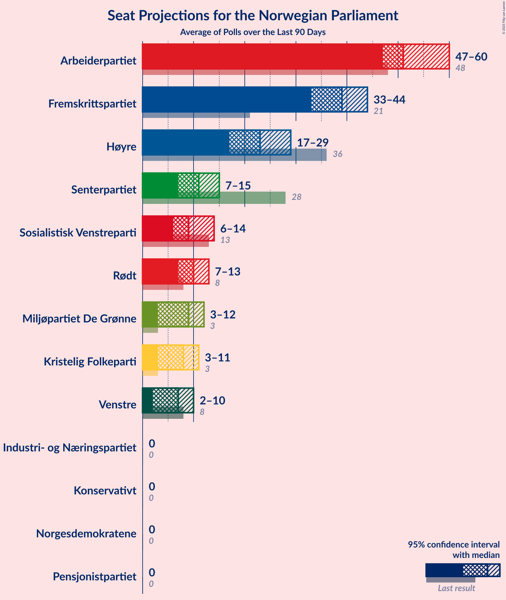

# Poll Average

<a href="#voting-intentions">Voting Intentions</a> | <a href="#seats">Seats</a> | <a href="#coalitions">Coalitions</a> | <a href="#technical-information">Technical Information</a>

## Summary

The table below lists the polls on which the average is based. They are the most recent polls (less than 90 days old) registered and analyzed so far.

| Period     | Polling firm/Commissioner(s) | Ap | H | FrP | Sp | SV | V | KrF | MDG | R |
|:----------:|:----------------------------:|:--:|:--:|:--:|:--:|:--:|:--:|:--:|:--:|:--:|
| 8–9 September 2013 | General Election | 27.4%   49 | 25.0%   45 | 15.2%   27 | 10.3%   19 | 6.0%   11 | 4.4%   8 | 4.2%   8 | 3.2%   1 | 2.4%   1 |
| N/A | Poll Average | 18–26%   32–48 | 22–30%   38–54 | 6–14%   9–26 | 16–22%   29–42 | 5–10%   8–18 | 2–6%   0–10 | 2–5%   0–8 | 3–6%   1–11 | 2–6%   1–11 |
| [22–24 February 2021](2021-02-24-IpsosMMI.html) | Ipsos MMI   Dagbladet | 18–23%   31–43 | 20–26%   35–48 | 11–15%   18–29 | 15–21%   27–39 | 6–10%   10–18 | 3–6%   2–11 | 2–5%   1–8 | 3–5%   1–10 | 2–4%   1–7 |
| [15–21 February 2021](2021-02-21-Norstat.html) | Norstat   Aftenposten and NRK | 18–23%   32–42 | 25–30%   43–55 | 7–10%   11–18 | 16–21%   30–39 | 5–8%   8–14 | 2–3%   0–2 | 3–5%   1–8 | 4–7%   3–12 | 4–6%   2–11 |
| [9–14 February 2021](2021-02-14-Sentio.html) | Sentio   Amedia and Nettavisen | 19–24%   34–43 | 24–30%   43–55 | 6–9%   10–17 | 16–21%   29–39 | 7–11%   12–19 | 2–4%   0–3 | 2–5%   1–8 | 4–6%   2–11 | 3–5%   1–9 |
| [1–8 February 2021](2021-02-08-OpinionPerduco.html) | Opinion Perduco   Avisenes Nyhetsbyrå, Dagsavisen and FriFagbevegelse | 22–27%   41–51 | 22–28%   40–52 | 7–10%   12–19 | 17–22%   32–40 | 6–9%   11–17 | 2–5%   1–8 | 2–5%   1–8 | 3–5%   1–10 | 2–4%   1–7 |
| [2–3 February 2021](2021-02-03-Norfakta.html) | Norfakta   Klassekampen and Nationen | 19–24%   34–44 | 25–30%   43–56 | 5–8%   8–14 | 17–22%   33–42 | 6–9%   10–17 | 3–5%   2–9 | 2–4%   0–3 | 4–7%   2–11 | 3–5%   1–9 |
| [27 January–2 February 2021](2021-02-02-ResponsAnalyse.html) | Respons Analyse   VG | 20–26%   36–48 | 24–29%   42–54 | 7–11%   12–19 | 16–21%   30–40 | 6–9%   11–16 | 1–3%   0–2 | 2–5%   1–8 | 3–5%   1–9 | 3–6%   2–10 |
| [25–29 January 2021](2021-01-29-KantarTNS.html) | Kantar TNS   TV2 | 17–23%   30–42 | 22–29%   39–53 | 6–10%   9–17 | 17–23%   34–44 | 4–8%   7–13 | 3–6%   2–10 | 2–4%   0–6 | 4–7%   2–11 | 4–7%   2–12 |
| 8–9 September 2013 | General Election | 27.4%   49 | 25.0%   45 | 15.2%   27 | 10.3%   19 | 6.0%   11 | 4.4%   8 | 4.2%   8 | 3.2%   1 | 2.4%   1 |

Only polls for which at least the sample size has been published are included in the table above.

**Legend:**
+ **Top half of each row:** Voting intentions (95% confidence interval)
+ **Bottom half of each row:** Seat projections for the Norwegian Parliament (95% confidence interval)
+ **Ap:** Arbeiderpartiet
+ **H:** Høyre
+ **FrP:** Fremskrittspartiet
+ **Sp:** Senterpartiet
+ **SV:** Sosialistisk Venstreparti
+ **V:** Venstre
+ **KrF:** Kristelig Folkeparti
+ **MDG:** Miljøpartiet De Grønne
+ **R:** Rødt
+ **N/A (single party):** Party not included the published results
+ **N/A (entire row):** Calculation for this opinion poll not started yet

## Voting Intentions

### Confidence Intervals

| Party | Last Result | Median | 80% Confidence Interval | 90% Confidence Interval | 95% Confidence Interval | 99% Confidence Interval |
|:-----:|:-----------:|:------:|:-----------------------:|:-----------------------:|:-----------------------:|:-----------------------:|
| <a href="#arbeiderpartiet">Arbeiderpartiet</a> | 27.4% | 21.3% | 19.1–24.4% |18.5–25.3% | 18.1–26.0% | 17.1–27.2% |
| <a href="#høyre">Høyre</a> | 25.0% | 26.1% | 23.2–28.5% |22.3–29.1% | 21.6–29.7% | 20.4–30.7% |
| <a href="#fremskrittspartiet">Fremskrittspartiet</a> | 15.2% | 8.1% | 6.5–12.3% |6.0–13.4% | 5.7–14.1% | 5.1–15.2% |
| <a href="#senterpartiet">Senterpartiet</a> | 10.3% | 18.9% | 17.1–20.9% |16.6–21.4% | 16.1–22.0% | 15.2–23.0% |
| <a href="#sosialistisk-venstreparti">Sosialistisk Venstreparti</a> | 6.0% | 7.3% | 5.7–8.9% |5.3–9.4% | 5.0–9.7% | 4.5–10.5% |
| <a href="#venstre">Venstre</a> | 4.4% | 3.3% | 1.9–4.9% |1.7–5.3% | 1.5–5.7% | 1.3–6.3% |
| <a href="#kristelig-folkeparti">Kristelig Folkeparti</a> | 4.2% | 3.3% | 2.5–4.2% |2.3–4.4% | 2.1–4.7% | 1.8–5.2% |
| <a href="#miljøpartiet-de-grønne">Miljøpartiet De Grønne</a> | 3.2% | 4.6% | 3.4–5.8% |3.2–6.1% | 3.0–6.4% | 2.6–7.0% |
| <a href="#rødt">Rødt</a> | 2.4% | 4.0% | 2.6–5.5% |2.3–5.9% | 2.1–6.3% | 1.8–7.0% |

### Arbeiderpartiet

*For a full overview of the results for this party, see the [Arbeiderpartiet](party-arbeiderpartiet.html) page.*

| Voting Intentions | Probability | Accumulated | Special Marks |
|:-----------------:|:-----------:|:-----------:|:-------------:|
| 14.5–15.5% | 0% | 100% |  |
| 15.5–16.5% | 0.1% | 100% |  |
| 16.5–17.5% | 0.9% | 99.8% |  |
| 17.5–18.5% | 4% | 98.9% |  |
| 18.5–19.5% | 10% | 95% |  |
| 19.5–20.5% | 18% | 85% |  |
| 20.5–21.5% | 21% | 67% | Median |
| 21.5–22.5% | 17% | 46% |  |
| 22.5–23.5% | 12% | 29% |  |
| 23.5–24.5% | 8% | 17% |  |
| 24.5–25.5% | 5% | 9% |  |
| 25.5–26.5% | 3% | 4% |  |
| 26.5–27.5% | 1.0% | 1.3% | Last Result |
| 27.5–28.5% | 0.2% | 0.3% |  |
| 28.5–29.5% | 0% | 0% |  |

### Høyre

*For a full overview of the results for this party, see the [Høyre](party-høyre.html) page.*

| Voting Intentions | Probability | Accumulated | Special Marks |
|:-----------------:|:-----------:|:-----------:|:-------------:|
| 17.5–18.5% | 0% | 100% |  |
| 18.5–19.5% | 0.1% | 100% |  |
| 19.5–20.5% | 0.5% | 99.9% |  |
| 20.5–21.5% | 2% | 99.4% |  |
| 21.5–22.5% | 4% | 98% |  |
| 22.5–23.5% | 7% | 94% |  |
| 23.5–24.5% | 11% | 87% |  |
| 24.5–25.5% | 15% | 77% | Last Result |
| 25.5–26.5% | 19% | 61% | Median |
| 26.5–27.5% | 19% | 42% |  |
| 27.5–28.5% | 13% | 23% |  |
| 28.5–29.5% | 7% | 10% |  |
| 29.5–30.5% | 2% | 3% |  |
| 30.5–31.5% | 0.5% | 0.6% |  |
| 31.5–32.5% | 0.1% | 0.1% |  |
| 32.5–33.5% | 0% | 0% |  |

### Fremskrittspartiet

*For a full overview of the results for this party, see the [Fremskrittspartiet](party-fremskrittspartiet.html) page.*

| Voting Intentions | Probability | Accumulated | Special Marks |
|:-----------------:|:-----------:|:-----------:|:-------------:|
| 3.5–4.5% | 0% | 100% |  |
| 4.5–5.5% | 2% | 100% |  |
| 5.5–6.5% | 10% | 98% |  |
| 6.5–7.5% | 22% | 89% |  |
| 7.5–8.5% | 29% | 67% | Median |
| 8.5–9.5% | 18% | 38% |  |
| 9.5–10.5% | 5% | 20% |  |
| 10.5–11.5% | 2% | 15% |  |
| 11.5–12.5% | 4% | 13% |  |
| 12.5–13.5% | 5% | 9% |  |
| 13.5–14.5% | 3% | 4% |  |
| 14.5–15.5% | 1.1% | 1.4% | Last Result |
| 15.5–16.5% | 0.3% | 0.3% |  |
| 16.5–17.5% | 0% | 0% |  |

### Senterpartiet

*For a full overview of the results for this party, see the [Senterpartiet](party-senterpartiet.html) page.*

| Voting Intentions | Probability | Accumulated | Special Marks |
|:-----------------:|:-----------:|:-----------:|:-------------:|
| 9.5–10.5% | 0% | 100% | Last Result |
| 10.5–11.5% | 0% | 100% |  |
| 11.5–12.5% | 0% | 100% |  |
| 12.5–13.5% | 0% | 100% |  |
| 13.5–14.5% | 0.1% | 100% |  |
| 14.5–15.5% | 0.8% | 99.9% |  |
| 15.5–16.5% | 4% | 99.1% |  |
| 16.5–17.5% | 12% | 95% |  |
| 17.5–18.5% | 23% | 84% |  |
| 18.5–19.5% | 27% | 61% | Median |
| 19.5–20.5% | 20% | 34% |  |
| 20.5–21.5% | 10% | 14% |  |
| 21.5–22.5% | 3% | 4% |  |
| 22.5–23.5% | 0.8% | 1.0% |  |
| 23.5–24.5% | 0.2% | 0.2% |  |
| 24.5–25.5% | 0% | 0% |  |

### Sosialistisk Venstreparti

*For a full overview of the results for this party, see the [Sosialistisk Venstreparti](party-sosialistiskvenstreparti.html) page.*

| Voting Intentions | Probability | Accumulated | Special Marks |
|:-----------------:|:-----------:|:-----------:|:-------------:|
| 2.5–3.5% | 0% | 100% |  |
| 3.5–4.5% | 0.6% | 100% |  |
| 4.5–5.5% | 7% | 99.4% |  |
| 5.5–6.5% | 20% | 93% | Last Result |
| 6.5–7.5% | 30% | 73% | Median |
| 7.5–8.5% | 27% | 43% |  |
| 8.5–9.5% | 12% | 16% |  |
| 9.5–10.5% | 3% | 4% |  |
| 10.5–11.5% | 0.4% | 0.4% |  |
| 11.5–12.5% | 0% | 0% |  |

### Venstre

*For a full overview of the results for this party, see the [Venstre](party-venstre.html) page.*

| Voting Intentions | Probability | Accumulated | Special Marks |
|:-----------------:|:-----------:|:-----------:|:-------------:|
| 0.0–0.5% | 0% | 100% |  |
| 0.5–1.5% | 3% | 100% |  |
| 1.5–2.5% | 25% | 97% |  |
| 2.5–3.5% | 29% | 72% | Median |
| 3.5–4.5% | 26% | 43% | Last Result |
| 4.5–5.5% | 14% | 17% |  |
| 5.5–6.5% | 3% | 3% |  |
| 6.5–7.5% | 0.3% | 0.3% |  |
| 7.5–8.5% | 0% | 0% |  |

### Kristelig Folkeparti

*For a full overview of the results for this party, see the [Kristelig Folkeparti](party-kristeligfolkeparti.html) page.*

| Voting Intentions | Probability | Accumulated | Special Marks |
|:-----------------:|:-----------:|:-----------:|:-------------:|
| 0.5–1.5% | 0.1% | 100% |  |
| 1.5–2.5% | 12% | 99.9% |  |
| 2.5–3.5% | 53% | 88% | Median |
| 3.5–4.5% | 30% | 34% | Last Result |
| 4.5–5.5% | 4% | 4% |  |
| 5.5–6.5% | 0.1% | 0.1% |  |
| 6.5–7.5% | 0% | 0% |  |

### Miljøpartiet De Grønne

*For a full overview of the results for this party, see the [Miljøpartiet De Grønne](party-miljøpartietdegrønne.html) page.*

| Voting Intentions | Probability | Accumulated | Special Marks |
|:-----------------:|:-----------:|:-----------:|:-------------:|
| 0.5–1.5% | 0% | 100% |  |
| 1.5–2.5% | 0.4% | 100% |  |
| 2.5–3.5% | 12% | 99.6% | Last Result |
| 3.5–4.5% | 37% | 87% |  |
| 4.5–5.5% | 35% | 50% | Median |
| 5.5–6.5% | 13% | 15% |  |
| 6.5–7.5% | 2% | 2% |  |
| 7.5–8.5% | 0.1% | 0.1% |  |
| 8.5–9.5% | 0% | 0% |  |

### Rødt

*For a full overview of the results for this party, see the [Rødt](party-rødt.html) page.*

| Voting Intentions | Probability | Accumulated | Special Marks |
|:-----------------:|:-----------:|:-----------:|:-------------:|
| 0.0–0.5% | 0% | 100% |  |
| 0.5–1.5% | 0.1% | 100% |  |
| 1.5–2.5% | 8% | 99.9% | Last Result |
| 2.5–3.5% | 27% | 92% |  |
| 3.5–4.5% | 34% | 64% | Median |
| 4.5–5.5% | 22% | 30% |  |
| 5.5–6.5% | 7% | 9% |  |
| 6.5–7.5% | 1.3% | 1.4% |  |
| 7.5–8.5% | 0.1% | 0.1% |  |
| 8.5–9.5% | 0% | 0% |  |

## Seats

### Confidence Intervals

| Party | Last Result | Median | 80% Confidence Interval | 90% Confidence Interval | 95% Confidence Interval | 99% Confidence Interval |
|:-----:|:-----------:|:------:|:-----------------------:|:-----------------------:|:-----------------------:|:-----------------------:|
| <a href="#arbeiderpartiet">Arbeiderpartiet</a> | 49 | 39 | 35–45 |34–47 | 32–48 | 30–51 |
| <a href="#høyre">Høyre</a> | 45 | 47 | 41–52 |40–53 | 38–54 | 36–56 |
| <a href="#fremskrittspartiet">Fremskrittspartiet</a> | 27 | 14 | 11–22 |10–24 | 9–26 | 8–28 |
| <a href="#senterpartiet">Senterpartiet</a> | 19 | 36 | 32–38 |30–40 | 29–42 | 27–44 |
| <a href="#sosialistisk-venstreparti">Sosialistisk Venstreparti</a> | 11 | 13 | 10–16 |9–17 | 8–18 | 7–19 |
| <a href="#venstre">Venstre</a> | 8 | 2 | 1–8 |0–9 | 0–10 | 0–11 |
| <a href="#kristelig-folkeparti">Kristelig Folkeparti</a> | 8 | 2 | 1–7 |1–8 | 0–8 | 0–9 |
| <a href="#miljøpartiet-de-grønne">Miljøpartiet De Grønne</a> | 1 | 8 | 2–10 |2–10 | 1–11 | 1–12 |
| <a href="#rødt">Rødt</a> | 1 | 2 | 1–9 |1–10 | 1–11 | 1–12 |

### Arbeiderpartiet

*For a full overview of the results for this party, see the [Arbeiderpartiet](party-arbeiderpartiet.html) page.*

| Number of Seats | Probability | Accumulated | Special Marks |
|:---------------:|:-----------:|:-----------:|:-------------:|
| 27 | 0.1% | 100% |  |
| 28 | 0.1% | 99.9% |  |
| 29 | 0.3% | 99.8% |  |
| 30 | 0.7% | 99.5% |  |
| 31 | 1.0% | 98.9% |  |
| 32 | 0.9% | 98% |  |
| 33 | 2% | 97% |  |
| 34 | 3% | 95% |  |
| 35 | 4% | 92% |  |
| 36 | 6% | 88% |  |
| 37 | 9% | 82% |  |
| 38 | 12% | 73% |  |
| 39 | 11% | 60% | Median |
| 40 | 9% | 50% |  |
| 41 | 11% | 41% |  |
| 42 | 9% | 30% |  |
| 43 | 8% | 21% |  |
| 44 | 3% | 13% |  |
| 45 | 3% | 10% |  |
| 46 | 2% | 7% |  |
| 47 | 2% | 5% |  |
| 48 | 2% | 4% |  |
| 49 | 1.1% | 2% | Last Result |
| 50 | 0.2% | 0.7% |  |
| 51 | 0.2% | 0.5% |  |
| 52 | 0.2% | 0.3% |  |
| 53 | 0.1% | 0.1% |  |
| 54 | 0% | 0% |  |

### Høyre

*For a full overview of the results for this party, see the [Høyre](party-høyre.html) page.*

| Number of Seats | Probability | Accumulated | Special Marks |
|:---------------:|:-----------:|:-----------:|:-------------:|
| 33 | 0.1% | 100% |  |
| 34 | 0.1% | 99.9% |  |
| 35 | 0.2% | 99.8% |  |
| 36 | 0.7% | 99.6% |  |
| 37 | 1.0% | 98.9% |  |
| 38 | 0.8% | 98% |  |
| 39 | 2% | 97% |  |
| 40 | 4% | 95% |  |
| 41 | 3% | 92% |  |
| 42 | 5% | 89% |  |
| 43 | 8% | 84% |  |
| 44 | 7% | 76% |  |
| 45 | 9% | 69% | Last Result |
| 46 | 8% | 60% |  |
| 47 | 8% | 53% | Median |
| 48 | 9% | 44% |  |
| 49 | 9% | 36% |  |
| 50 | 8% | 27% |  |
| 51 | 6% | 19% |  |
| 52 | 5% | 13% |  |
| 53 | 4% | 8% |  |
| 54 | 2% | 4% |  |
| 55 | 0.9% | 2% |  |
| 56 | 0.8% | 1.3% |  |
| 57 | 0.2% | 0.4% |  |
| 58 | 0.1% | 0.2% |  |
| 59 | 0% | 0% |  |

### Fremskrittspartiet

*For a full overview of the results for this party, see the [Fremskrittspartiet](party-fremskrittspartiet.html) page.*

| Number of Seats | Probability | Accumulated | Special Marks |
|:---------------:|:-----------:|:-----------:|:-------------:|
| 7 | 0.1% | 100% |  |
| 8 | 0.8% | 99.9% |  |
| 9 | 2% | 99.2% |  |
| 10 | 4% | 97% |  |
| 11 | 8% | 93% |  |
| 12 | 11% | 85% |  |
| 13 | 11% | 74% |  |
| 14 | 15% | 63% | Median |
| 15 | 9% | 48% |  |
| 16 | 9% | 38% |  |
| 17 | 9% | 29% |  |
| 18 | 5% | 20% |  |
| 19 | 2% | 15% |  |
| 20 | 0.9% | 13% |  |
| 21 | 2% | 12% |  |
| 22 | 3% | 10% |  |
| 23 | 2% | 8% |  |
| 24 | 2% | 6% |  |
| 25 | 1.0% | 4% |  |
| 26 | 1.3% | 3% |  |
| 27 | 0.9% | 2% | Last Result |
| 28 | 0.4% | 0.8% |  |
| 29 | 0.3% | 0.4% |  |
| 30 | 0.1% | 0.1% |  |
| 31 | 0% | 0% |  |

### Senterpartiet

*For a full overview of the results for this party, see the [Senterpartiet](party-senterpartiet.html) page.*

| Number of Seats | Probability | Accumulated | Special Marks |
|:---------------:|:-----------:|:-----------:|:-------------:|
| 19 | 0% | 100% | Last Result |
| 20 | 0% | 100% |  |
| 21 | 0% | 100% |  |
| 22 | 0% | 100% |  |
| 23 | 0% | 100% |  |
| 24 | 0% | 100% |  |
| 25 | 0% | 100% |  |
| 26 | 0.3% | 100% |  |
| 27 | 0.6% | 99.7% |  |
| 28 | 1.2% | 99.1% |  |
| 29 | 1.2% | 98% |  |
| 30 | 2% | 97% |  |
| 31 | 4% | 95% |  |
| 32 | 5% | 91% |  |
| 33 | 6% | 86% |  |
| 34 | 10% | 80% |  |
| 35 | 17% | 71% |  |
| 36 | 28% | 54% | Median |
| 37 | 10% | 26% |  |
| 38 | 7% | 16% |  |
| 39 | 3% | 10% |  |
| 40 | 2% | 6% |  |
| 41 | 1.4% | 4% |  |
| 42 | 1.1% | 3% |  |
| 43 | 0.7% | 1.5% |  |
| 44 | 0.5% | 0.8% |  |
| 45 | 0.2% | 0.3% |  |
| 46 | 0.2% | 0.2% |  |
| 47 | 0% | 0% |  |

### Sosialistisk Venstreparti

*For a full overview of the results for this party, see the [Sosialistisk Venstreparti](party-sosialistiskvenstreparti.html) page.*

| Number of Seats | Probability | Accumulated | Special Marks |
|:---------------:|:-----------:|:-----------:|:-------------:|
| 2 | 0% | 100% |  |
| 3 | 0% | 99.9% |  |
| 4 | 0% | 99.9% |  |
| 5 | 0% | 99.9% |  |
| 6 | 0.2% | 99.9% |  |
| 7 | 0.9% | 99.7% |  |
| 8 | 2% | 98.7% |  |
| 9 | 6% | 96% |  |
| 10 | 9% | 90% |  |
| 11 | 13% | 82% | Last Result |
| 12 | 12% | 69% |  |
| 13 | 14% | 56% | Median |
| 14 | 16% | 42% |  |
| 15 | 11% | 26% |  |
| 16 | 7% | 15% |  |
| 17 | 4% | 8% |  |
| 18 | 2% | 3% |  |
| 19 | 1.0% | 1.3% |  |
| 20 | 0.2% | 0.3% |  |
| 21 | 0.1% | 0.1% |  |
| 22 | 0% | 0% |  |

### Venstre

*For a full overview of the results for this party, see the [Venstre](party-venstre.html) page.*

| Number of Seats | Probability | Accumulated | Special Marks |
|:---------------:|:-----------:|:-----------:|:-------------:|
| 0 | 8% | 100% |  |
| 1 | 14% | 92% |  |
| 2 | 45% | 78% | Median |
| 3 | 3% | 33% |  |
| 4 | 0.2% | 30% |  |
| 5 | 0% | 30% |  |
| 6 | 2% | 30% |  |
| 7 | 9% | 29% |  |
| 8 | 11% | 20% | Last Result |
| 9 | 4% | 8% |  |
| 10 | 3% | 4% |  |
| 11 | 0.8% | 1.2% |  |
| 12 | 0.3% | 0.3% |  |
| 13 | 0.1% | 0.1% |  |
| 14 | 0% | 0% |  |

### Kristelig Folkeparti

*For a full overview of the results for this party, see the [Kristelig Folkeparti](party-kristeligfolkeparti.html) page.*

| Number of Seats | Probability | Accumulated | Special Marks |
|:---------------:|:-----------:|:-----------:|:-------------:|
| 0 | 4% | 100% |  |
| 1 | 32% | 96% |  |
| 2 | 16% | 65% | Median |
| 3 | 34% | 49% |  |
| 4 | 0% | 15% |  |
| 5 | 0% | 15% |  |
| 6 | 1.4% | 15% |  |
| 7 | 8% | 13% |  |
| 8 | 4% | 5% | Last Result |
| 9 | 1.0% | 1.2% |  |
| 10 | 0.1% | 0.2% |  |
| 11 | 0% | 0% |  |

### Miljøpartiet De Grønne

*For a full overview of the results for this party, see the [Miljøpartiet De Grønne](party-miljøpartietdegrønne.html) page.*

| Number of Seats | Probability | Accumulated | Special Marks |
|:---------------:|:-----------:|:-----------:|:-------------:|
| 1 | 3% | 100% | Last Result |
| 2 | 18% | 97% |  |
| 3 | 5% | 79% |  |
| 4 | 2% | 74% |  |
| 5 | 0% | 72% |  |
| 6 | 1.1% | 72% |  |
| 7 | 11% | 71% |  |
| 8 | 27% | 60% | Median |
| 9 | 18% | 33% |  |
| 10 | 11% | 15% |  |
| 11 | 3% | 5% |  |
| 12 | 1.1% | 1.4% |  |
| 13 | 0.2% | 0.3% |  |
| 14 | 0% | 0% |  |

### Rødt

*For a full overview of the results for this party, see the [Rødt](party-rødt.html) page.*

| Number of Seats | Probability | Accumulated | Special Marks |
|:---------------:|:-----------:|:-----------:|:-------------:|
| 1 | 15% | 100% | Last Result |
| 2 | 35% | 85% | Median |
| 3 | 0.1% | 50% |  |
| 4 | 0% | 50% |  |
| 5 | 0% | 50% |  |
| 6 | 2% | 50% |  |
| 7 | 13% | 48% |  |
| 8 | 17% | 35% |  |
| 9 | 10% | 18% |  |
| 10 | 5% | 8% |  |
| 11 | 2% | 3% |  |
| 12 | 0.5% | 0.6% |  |
| 13 | 0.1% | 0.1% |  |
| 14 | 0% | 0% |  |

## Coalitions

### Confidence Intervals

| Coalition | Last Result | Median | Majority? | 80% Confidence Interval | 90% Confidence Interval | 95% Confidence Interval | 99% Confidence Interval |
|:---------:|:-----------:|:------:|:---------:|:-----------------------:|:-----------------------:|:-----------------------:|:-----------------------:|
| Høyre – Fremskrittspartiet – Senterpartiet – Venstre – Kristelig Folkeparti | 107 | 103 | 100% | 98–109 | 97–111 | 96–113 | 94–117 |
| Arbeiderpartiet – Senterpartiet – Sosialistisk Venstreparti – Miljøpartiet De Grønne – Rødt | 81 | 100 | 98% | 92–106 | 89–107 | 86–108 | 81–110 |
| Arbeiderpartiet – Senterpartiet – Sosialistisk Venstreparti – Kristelig Folkeparti – Miljøpartiet De Grønne | 88 | 98 | 98.8% | 90–104 | 88–106 | 86–107 | 82–109 |
| Arbeiderpartiet – Senterpartiet – Sosialistisk Venstreparti – Miljøpartiet De Grønne | 80 | 95 | 97% | 88–101 | 86–103 | 84–104 | 79–107 |
| Arbeiderpartiet – Senterpartiet – Sosialistisk Venstreparti – Rødt | 80 | 93 | 94% | 87–99 | 84–100 | 82–101 | 78–104 |
| Arbeiderpartiet – Senterpartiet – Sosialistisk Venstreparti | 79 | 88 | 73% | 82–95 | 80–97 | 78–98 | 75–101 |
| Arbeiderpartiet – Senterpartiet – Kristelig Folkeparti – Miljøpartiet De Grønne | 77 | 85 | 53% | 78–91 | 75–92 | 73–93 | 68–96 |
| Arbeiderpartiet – Senterpartiet – Kristelig Folkeparti | 76 | 78 | 8% | 72–84 | 70–86 | 69–87 | 65–90 |
| Høyre – Fremskrittspartiet – Venstre – Kristelig Folkeparti – Miljøpartiet De Grønne | 89 | 75 | 3% | 69–81 | 68–83 | 66–85 | 64–89 |
| Arbeiderpartiet – Senterpartiet | 68 | 75 | 2% | 70–81 | 68–83 | 66–84 | 63–87 |
| Høyre – Fremskrittspartiet – Venstre – Kristelig Folkeparti | 88 | 68 | 0.3% | 63–74 | 61–77 | 60–80 | 58–83 |
| Høyre – Fremskrittspartiet – Venstre | 80 | 65 | 0% | 60–72 | 58–74 | 57–77 | 55–81 |
| Høyre – Fremskrittspartiet | 72 | 62 | 0% | 56–67 | 55–69 | 54–70 | 51–73 |
| Arbeiderpartiet – Sosialistisk Venstreparti | 60 | 53 | 0% | 46–59 | 44–61 | 43–62 | 39–65 |
| Høyre – Venstre – Kristelig Folkeparti | 61 | 53 | 0% | 48–59 | 46–60 | 45–61 | 43–64 |
| Senterpartiet – Venstre – Kristelig Folkeparti | 35 | 41 | 0% | 37–47 | 36–49 | 34–50 | 32–54 |

### Høyre – Fremskrittspartiet – Senterpartiet – Venstre – Kristelig Folkeparti

| Number of Seats | Probability | Accumulated | Special Marks |
|:---------------:|:-----------:|:-----------:|:-------------:|
| 91 | 0% | 100% |  |
| 92 | 0.1% | 99.9% |  |
| 93 | 0.1% | 99.8% |  |
| 94 | 0.6% | 99.7% |  |
| 95 | 1.5% | 99.1% |  |
| 96 | 2% | 98% |  |
| 97 | 3% | 96% |  |
| 98 | 5% | 93% |  |
| 99 | 7% | 88% |  |
| 100 | 8% | 82% |  |
| 101 | 7% | 73% | Median |
| 102 | 7% | 66% |  |
| 103 | 10% | 58% |  |
| 104 | 8% | 49% |  |
| 105 | 9% | 40% |  |
| 106 | 7% | 31% |  |
| 107 | 7% | 24% | Last Result |
| 108 | 5% | 17% |  |
| 109 | 3% | 12% |  |
| 110 | 3% | 9% |  |
| 111 | 2% | 6% |  |
| 112 | 1.3% | 4% |  |
| 113 | 1.0% | 3% |  |
| 114 | 0.6% | 2% |  |
| 115 | 0.5% | 1.3% |  |
| 116 | 0.3% | 0.9% |  |
| 117 | 0.3% | 0.6% |  |
| 118 | 0.1% | 0.3% |  |
| 119 | 0.1% | 0.2% |  |
| 120 | 0% | 0.1% |  |
| 121 | 0% | 0% |  |

### Arbeiderpartiet – Senterpartiet – Sosialistisk Venstreparti – Miljøpartiet De Grønne – Rødt

| Number of Seats | Probability | Accumulated | Special Marks |
|:---------------:|:-----------:|:-----------:|:-------------:|
| 79 | 0.1% | 100% |  |
| 80 | 0.2% | 99.9% |  |
| 81 | 0.3% | 99.7% | Last Result |
| 82 | 0.3% | 99.4% |  |
| 83 | 0.4% | 99.1% |  |
| 84 | 0.2% | 98.7% |  |
| 85 | 0.6% | 98% | Majority |
| 86 | 0.6% | 98% |  |
| 87 | 1.0% | 97% |  |
| 88 | 0.9% | 96% |  |
| 89 | 2% | 95% |  |
| 90 | 1.1% | 94% |  |
| 91 | 1.4% | 93% |  |
| 92 | 2% | 91% |  |
| 93 | 2% | 89% |  |
| 94 | 2% | 87% |  |
| 95 | 3% | 85% |  |
| 96 | 4% | 82% |  |
| 97 | 7% | 78% |  |
| 98 | 5% | 72% | Median |
| 99 | 7% | 67% |  |
| 100 | 10% | 59% |  |
| 101 | 8% | 49% |  |
| 102 | 10% | 42% |  |
| 103 | 8% | 32% |  |
| 104 | 8% | 24% |  |
| 105 | 6% | 17% |  |
| 106 | 4% | 11% |  |
| 107 | 2% | 7% |  |
| 108 | 2% | 4% |  |
| 109 | 1.0% | 2% |  |
| 110 | 0.6% | 0.9% |  |
| 111 | 0.2% | 0.4% |  |
| 112 | 0.1% | 0.1% |  |
| 113 | 0% | 0.1% |  |
| 114 | 0% | 0% |  |

### Arbeiderpartiet – Senterpartiet – Sosialistisk Venstreparti – Kristelig Folkeparti – Miljøpartiet De Grønne

| Number of Seats | Probability | Accumulated | Special Marks |
|:---------------:|:-----------:|:-----------:|:-------------:|
| 80 | 0.1% | 100% |  |
| 81 | 0.1% | 99.8% |  |
| 82 | 0.3% | 99.7% |  |
| 83 | 0.3% | 99.4% |  |
| 84 | 0.4% | 99.2% |  |
| 85 | 0.8% | 98.8% | Majority |
| 86 | 0.6% | 98% |  |
| 87 | 1.1% | 97% |  |
| 88 | 1.5% | 96% | Last Result |
| 89 | 2% | 95% |  |
| 90 | 3% | 93% |  |
| 91 | 3% | 90% |  |
| 92 | 4% | 87% |  |
| 93 | 5% | 84% |  |
| 94 | 5% | 79% |  |
| 95 | 8% | 74% |  |
| 96 | 7% | 66% |  |
| 97 | 8% | 58% |  |
| 98 | 6% | 51% | Median |
| 99 | 9% | 44% |  |
| 100 | 6% | 36% |  |
| 101 | 7% | 29% |  |
| 102 | 6% | 23% |  |
| 103 | 4% | 17% |  |
| 104 | 4% | 12% |  |
| 105 | 3% | 9% |  |
| 106 | 2% | 5% |  |
| 107 | 1.3% | 3% |  |
| 108 | 1.0% | 2% |  |
| 109 | 0.6% | 1.1% |  |
| 110 | 0.2% | 0.5% |  |
| 111 | 0.1% | 0.2% |  |
| 112 | 0.1% | 0.1% |  |
| 113 | 0% | 0% |  |

### Arbeiderpartiet – Senterpartiet – Sosialistisk Venstreparti – Miljøpartiet De Grønne

| Number of Seats | Probability | Accumulated | Special Marks |
|:---------------:|:-----------:|:-----------:|:-------------:|
| 77 | 0% | 100% |  |
| 78 | 0.2% | 99.9% |  |
| 79 | 0.2% | 99.7% |  |
| 80 | 0.2% | 99.5% | Last Result |
| 81 | 0.5% | 99.3% |  |
| 82 | 0.4% | 98.8% |  |
| 83 | 0.4% | 98% |  |
| 84 | 1.0% | 98% |  |
| 85 | 1.2% | 97% | Majority |
| 86 | 2% | 96% |  |
| 87 | 3% | 94% |  |
| 88 | 2% | 91% |  |
| 89 | 4% | 89% |  |
| 90 | 5% | 85% |  |
| 91 | 5% | 80% |  |
| 92 | 8% | 75% |  |
| 93 | 7% | 67% |  |
| 94 | 8% | 60% |  |
| 95 | 7% | 52% |  |
| 96 | 7% | 45% | Median |
| 97 | 6% | 38% |  |
| 98 | 8% | 32% |  |
| 99 | 6% | 24% |  |
| 100 | 5% | 18% |  |
| 101 | 5% | 14% |  |
| 102 | 2% | 9% |  |
| 103 | 3% | 6% |  |
| 104 | 2% | 4% |  |
| 105 | 0.8% | 2% |  |
| 106 | 0.8% | 1.4% |  |
| 107 | 0.3% | 0.6% |  |
| 108 | 0.1% | 0.3% |  |
| 109 | 0.1% | 0.1% |  |
| 110 | 0% | 0% |  |

### Arbeiderpartiet – Senterpartiet – Sosialistisk Venstreparti – Rødt

| Number of Seats | Probability | Accumulated | Special Marks |
|:---------------:|:-----------:|:-----------:|:-------------:|
| 73 | 0.1% | 100% |  |
| 74 | 0% | 99.9% |  |
| 75 | 0% | 99.9% |  |
| 76 | 0.1% | 99.9% |  |
| 77 | 0.1% | 99.8% |  |
| 78 | 0.2% | 99.6% |  |
| 79 | 0.4% | 99.4% |  |
| 80 | 0.7% | 99.1% | Last Result |
| 81 | 0.8% | 98% |  |
| 82 | 0.7% | 98% |  |
| 83 | 1.4% | 97% |  |
| 84 | 1.3% | 95% |  |
| 85 | 2% | 94% | Majority |
| 86 | 2% | 92% |  |
| 87 | 4% | 90% |  |
| 88 | 4% | 86% |  |
| 89 | 6% | 83% |  |
| 90 | 5% | 76% | Median |
| 91 | 8% | 71% |  |
| 92 | 9% | 64% |  |
| 93 | 8% | 55% |  |
| 94 | 8% | 47% |  |
| 95 | 8% | 38% |  |
| 96 | 5% | 31% |  |
| 97 | 6% | 25% |  |
| 98 | 6% | 19% |  |
| 99 | 4% | 13% |  |
| 100 | 5% | 9% |  |
| 101 | 2% | 4% |  |
| 102 | 0.9% | 2% |  |
| 103 | 0.5% | 1.2% |  |
| 104 | 0.4% | 0.7% |  |
| 105 | 0.2% | 0.3% |  |
| 106 | 0% | 0.1% |  |
| 107 | 0% | 0.1% |  |
| 108 | 0% | 0% |  |

### Arbeiderpartiet – Senterpartiet – Sosialistisk Venstreparti

| Number of Seats | Probability | Accumulated | Special Marks |
|:---------------:|:-----------:|:-----------:|:-------------:|
| 72 | 0.1% | 100% |  |
| 73 | 0.1% | 99.9% |  |
| 74 | 0.1% | 99.8% |  |
| 75 | 0.3% | 99.7% |  |
| 76 | 0.4% | 99.4% |  |
| 77 | 0.6% | 99.0% |  |
| 78 | 1.2% | 98% |  |
| 79 | 2% | 97% | Last Result |
| 80 | 2% | 96% |  |
| 81 | 2% | 93% |  |
| 82 | 6% | 91% |  |
| 83 | 4% | 85% |  |
| 84 | 8% | 81% |  |
| 85 | 8% | 73% | Majority |
| 86 | 5% | 65% |  |
| 87 | 7% | 59% |  |
| 88 | 6% | 52% | Median |
| 89 | 6% | 46% |  |
| 90 | 7% | 40% |  |
| 91 | 8% | 33% |  |
| 92 | 6% | 25% |  |
| 93 | 5% | 18% |  |
| 94 | 3% | 14% |  |
| 95 | 3% | 10% |  |
| 96 | 2% | 8% |  |
| 97 | 2% | 5% |  |
| 98 | 1.1% | 3% |  |
| 99 | 0.8% | 2% |  |
| 100 | 0.4% | 1.2% |  |
| 101 | 0.3% | 0.7% |  |
| 102 | 0.3% | 0.4% |  |
| 103 | 0.1% | 0.2% |  |
| 104 | 0% | 0.1% |  |
| 105 | 0% | 0% |  |

### Arbeiderpartiet – Senterpartiet – Kristelig Folkeparti – Miljøpartiet De Grønne

| Number of Seats | Probability | Accumulated | Special Marks |
|:---------------:|:-----------:|:-----------:|:-------------:|
| 66 | 0.1% | 100% |  |
| 67 | 0.1% | 99.9% |  |
| 68 | 0.3% | 99.7% |  |
| 69 | 0.3% | 99.4% |  |
| 70 | 0.3% | 99.1% |  |
| 71 | 0.4% | 98.8% |  |
| 72 | 0.8% | 98% |  |
| 73 | 0.6% | 98% |  |
| 74 | 1.4% | 97% |  |
| 75 | 1.0% | 96% |  |
| 76 | 2% | 95% |  |
| 77 | 1.5% | 93% | Last Result |
| 78 | 3% | 91% |  |
| 79 | 3% | 89% |  |
| 80 | 4% | 86% |  |
| 81 | 5% | 82% |  |
| 82 | 6% | 77% |  |
| 83 | 9% | 71% |  |
| 84 | 9% | 62% |  |
| 85 | 10% | 53% | Median, Majority |
| 86 | 7% | 44% |  |
| 87 | 8% | 37% |  |
| 88 | 8% | 29% |  |
| 89 | 6% | 21% |  |
| 90 | 5% | 15% |  |
| 91 | 3% | 10% |  |
| 92 | 3% | 8% |  |
| 93 | 2% | 4% |  |
| 94 | 0.8% | 2% |  |
| 95 | 0.6% | 2% |  |
| 96 | 0.5% | 1.0% |  |
| 97 | 0.2% | 0.4% |  |
| 98 | 0.1% | 0.2% |  |
| 99 | 0.1% | 0.1% |  |
| 100 | 0% | 0.1% |  |
| 101 | 0% | 0% |  |

### Arbeiderpartiet – Senterpartiet – Kristelig Folkeparti

| Number of Seats | Probability | Accumulated | Special Marks |
|:---------------:|:-----------:|:-----------:|:-------------:|
| 60 | 0% | 100% |  |
| 61 | 0% | 99.9% |  |
| 62 | 0% | 99.9% |  |
| 63 | 0.1% | 99.9% |  |
| 64 | 0.1% | 99.8% |  |
| 65 | 0.2% | 99.7% |  |
| 66 | 0.4% | 99.4% |  |
| 67 | 0.6% | 99.0% |  |
| 68 | 0.9% | 98% |  |
| 69 | 1.4% | 98% |  |
| 70 | 2% | 96% |  |
| 71 | 3% | 94% |  |
| 72 | 4% | 92% |  |
| 73 | 4% | 87% |  |
| 74 | 7% | 83% |  |
| 75 | 8% | 76% |  |
| 76 | 10% | 69% | Last Result |
| 77 | 8% | 59% | Median |
| 78 | 7% | 51% |  |
| 79 | 7% | 43% |  |
| 80 | 8% | 37% |  |
| 81 | 8% | 29% |  |
| 82 | 4% | 20% |  |
| 83 | 5% | 17% |  |
| 84 | 3% | 12% |  |
| 85 | 3% | 8% | Majority |
| 86 | 2% | 5% |  |
| 87 | 1.0% | 3% |  |
| 88 | 1.1% | 2% |  |
| 89 | 0.4% | 1.1% |  |
| 90 | 0.2% | 0.7% |  |
| 91 | 0.2% | 0.4% |  |
| 92 | 0.1% | 0.2% |  |
| 93 | 0% | 0.1% |  |
| 94 | 0% | 0.1% |  |
| 95 | 0% | 0% |  |

### Høyre – Fremskrittspartiet – Venstre – Kristelig Folkeparti – Miljøpartiet De Grønne

| Number of Seats | Probability | Accumulated | Special Marks |
|:---------------:|:-----------:|:-----------:|:-------------:|
| 61 | 0% | 100% |  |
| 62 | 0.1% | 99.9% |  |
| 63 | 0.1% | 99.8% |  |
| 64 | 0.3% | 99.7% |  |
| 65 | 0.6% | 99.4% |  |
| 66 | 2% | 98.8% |  |
| 67 | 1.3% | 97% |  |
| 68 | 3% | 96% |  |
| 69 | 5% | 93% |  |
| 70 | 5% | 88% |  |
| 71 | 7% | 82% |  |
| 72 | 7% | 76% |  |
| 73 | 6% | 68% | Median |
| 74 | 9% | 62% |  |
| 75 | 8% | 53% |  |
| 76 | 8% | 44% |  |
| 77 | 9% | 36% |  |
| 78 | 7% | 28% |  |
| 79 | 5% | 21% |  |
| 80 | 5% | 17% |  |
| 81 | 3% | 11% |  |
| 82 | 2% | 8% |  |
| 83 | 2% | 6% |  |
| 84 | 1.4% | 4% |  |
| 85 | 0.8% | 3% | Majority |
| 86 | 0.4% | 2% |  |
| 87 | 0.3% | 1.4% |  |
| 88 | 0.5% | 1.0% |  |
| 89 | 0.4% | 0.5% | Last Result |
| 90 | 0.1% | 0.2% |  |
| 91 | 0% | 0.1% |  |
| 92 | 0% | 0% |  |

### Arbeiderpartiet – Senterpartiet

| Number of Seats | Probability | Accumulated | Special Marks |
|:---------------:|:-----------:|:-----------:|:-------------:|
| 58 | 0% | 100% |  |
| 59 | 0% | 99.9% |  |
| 60 | 0% | 99.9% |  |
| 61 | 0.1% | 99.9% |  |
| 62 | 0.2% | 99.7% |  |
| 63 | 0.3% | 99.5% |  |
| 64 | 0.5% | 99.2% |  |
| 65 | 0.9% | 98.8% |  |
| 66 | 0.8% | 98% |  |
| 67 | 2% | 97% |  |
| 68 | 2% | 95% | Last Result |
| 69 | 3% | 93% |  |
| 70 | 4% | 91% |  |
| 71 | 6% | 87% |  |
| 72 | 6% | 81% |  |
| 73 | 11% | 74% |  |
| 74 | 10% | 63% |  |
| 75 | 9% | 53% | Median |
| 76 | 8% | 44% |  |
| 77 | 8% | 36% |  |
| 78 | 8% | 28% |  |
| 79 | 5% | 20% |  |
| 80 | 4% | 15% |  |
| 81 | 2% | 11% |  |
| 82 | 3% | 8% |  |
| 83 | 2% | 6% |  |
| 84 | 1.2% | 3% |  |
| 85 | 0.7% | 2% | Majority |
| 86 | 0.2% | 1.2% |  |
| 87 | 0.6% | 0.9% |  |
| 88 | 0.2% | 0.4% |  |
| 89 | 0.1% | 0.1% |  |
| 90 | 0.1% | 0.1% |  |
| 91 | 0% | 0% |  |

### Høyre – Fremskrittspartiet – Venstre – Kristelig Folkeparti

| Number of Seats | Probability | Accumulated | Special Marks |
|:---------------:|:-----------:|:-----------:|:-------------:|
| 55 | 0.1% | 100% |  |
| 56 | 0.1% | 99.9% |  |
| 57 | 0.2% | 99.8% |  |
| 58 | 0.8% | 99.5% |  |
| 59 | 0.9% | 98.7% |  |
| 60 | 1.5% | 98% |  |
| 61 | 3% | 96% |  |
| 62 | 3% | 93% |  |
| 63 | 5% | 90% |  |
| 64 | 6% | 85% |  |
| 65 | 9% | 79% | Median |
| 66 | 8% | 70% |  |
| 67 | 10% | 62% |  |
| 68 | 8% | 52% |  |
| 69 | 10% | 44% |  |
| 70 | 7% | 34% |  |
| 71 | 5% | 27% |  |
| 72 | 6% | 22% |  |
| 73 | 3% | 16% |  |
| 74 | 3% | 12% |  |
| 75 | 2% | 9% |  |
| 76 | 2% | 7% |  |
| 77 | 1.0% | 6% |  |
| 78 | 0.9% | 5% |  |
| 79 | 0.8% | 4% |  |
| 80 | 0.7% | 3% |  |
| 81 | 0.6% | 2% |  |
| 82 | 0.7% | 1.4% |  |
| 83 | 0.3% | 0.7% |  |
| 84 | 0.1% | 0.4% |  |
| 85 | 0.1% | 0.3% | Majority |
| 86 | 0.1% | 0.2% |  |
| 87 | 0.1% | 0.1% |  |
| 88 | 0% | 0% | Last Result |

### Høyre – Fremskrittspartiet – Venstre

| Number of Seats | Probability | Accumulated | Special Marks |
|:---------------:|:-----------:|:-----------:|:-------------:|
| 53 | 0% | 100% |  |
| 54 | 0.2% | 99.9% |  |
| 55 | 0.3% | 99.7% |  |
| 56 | 1.0% | 99.4% |  |
| 57 | 1.2% | 98% |  |
| 58 | 3% | 97% |  |
| 59 | 3% | 95% |  |
| 60 | 5% | 91% |  |
| 61 | 5% | 86% |  |
| 62 | 10% | 81% |  |
| 63 | 7% | 71% | Median |
| 64 | 9% | 64% |  |
| 65 | 9% | 55% |  |
| 66 | 9% | 46% |  |
| 67 | 6% | 36% |  |
| 68 | 7% | 30% |  |
| 69 | 6% | 23% |  |
| 70 | 4% | 17% |  |
| 71 | 3% | 13% |  |
| 72 | 2% | 10% |  |
| 73 | 2% | 8% |  |
| 74 | 1.2% | 6% |  |
| 75 | 1.3% | 5% |  |
| 76 | 0.5% | 3% |  |
| 77 | 0.9% | 3% |  |
| 78 | 0.5% | 2% |  |
| 79 | 0.4% | 2% |  |
| 80 | 0.5% | 1.1% | Last Result |
| 81 | 0.3% | 0.6% |  |
| 82 | 0.1% | 0.2% |  |
| 83 | 0.1% | 0.2% |  |
| 84 | 0.1% | 0.1% |  |
| 85 | 0% | 0% | Majority |

### Høyre – Fremskrittspartiet

| Number of Seats | Probability | Accumulated | Special Marks |
|:---------------:|:-----------:|:-----------:|:-------------:|
| 48 | 0% | 100% |  |
| 49 | 0.1% | 99.9% |  |
| 50 | 0.2% | 99.9% |  |
| 51 | 0.2% | 99.7% |  |
| 52 | 0.4% | 99.4% |  |
| 53 | 1.2% | 99.0% |  |
| 54 | 2% | 98% |  |
| 55 | 2% | 96% |  |
| 56 | 4% | 93% |  |
| 57 | 4% | 89% |  |
| 58 | 7% | 85% |  |
| 59 | 7% | 79% |  |
| 60 | 9% | 71% |  |
| 61 | 9% | 62% | Median |
| 62 | 10% | 53% |  |
| 63 | 9% | 43% |  |
| 64 | 9% | 35% |  |
| 65 | 6% | 26% |  |
| 66 | 6% | 20% |  |
| 67 | 5% | 14% |  |
| 68 | 3% | 9% |  |
| 69 | 2% | 6% |  |
| 70 | 1.4% | 4% |  |
| 71 | 0.9% | 2% |  |
| 72 | 0.5% | 1.4% | Last Result |
| 73 | 0.5% | 0.8% |  |
| 74 | 0.1% | 0.3% |  |
| 75 | 0.1% | 0.2% |  |
| 76 | 0.1% | 0.1% |  |
| 77 | 0% | 0% |  |

### Arbeiderpartiet – Sosialistisk Venstreparti

| Number of Seats | Probability | Accumulated | Special Marks |
|:---------------:|:-----------:|:-----------:|:-------------:|
| 36 | 0% | 100% |  |
| 37 | 0.1% | 99.9% |  |
| 38 | 0.2% | 99.9% |  |
| 39 | 0.4% | 99.6% |  |
| 40 | 0.3% | 99.3% |  |
| 41 | 0.6% | 98.9% |  |
| 42 | 0.6% | 98% |  |
| 43 | 1.3% | 98% |  |
| 44 | 2% | 96% |  |
| 45 | 2% | 94% |  |
| 46 | 3% | 92% |  |
| 47 | 5% | 89% |  |
| 48 | 6% | 84% |  |
| 49 | 6% | 78% |  |
| 50 | 7% | 71% |  |
| 51 | 7% | 65% |  |
| 52 | 6% | 58% | Median |
| 53 | 7% | 52% |  |
| 54 | 7% | 44% |  |
| 55 | 7% | 37% |  |
| 56 | 6% | 30% |  |
| 57 | 7% | 24% |  |
| 58 | 5% | 16% |  |
| 59 | 4% | 12% |  |
| 60 | 3% | 8% | Last Result |
| 61 | 2% | 5% |  |
| 62 | 1.3% | 3% |  |
| 63 | 0.9% | 2% |  |
| 64 | 0.5% | 1.0% |  |
| 65 | 0.3% | 0.6% |  |
| 66 | 0.2% | 0.3% |  |
| 67 | 0.1% | 0.1% |  |
| 68 | 0% | 0.1% |  |
| 69 | 0% | 0% |  |

### Høyre – Venstre – Kristelig Folkeparti

| Number of Seats | Probability | Accumulated | Special Marks |
|:---------------:|:-----------:|:-----------:|:-------------:|
| 41 | 0.1% | 100% |  |
| 42 | 0.1% | 99.8% |  |
| 43 | 0.3% | 99.7% |  |
| 44 | 0.9% | 99.5% |  |
| 45 | 2% | 98.6% |  |
| 46 | 3% | 97% |  |
| 47 | 3% | 94% |  |
| 48 | 5% | 91% |  |
| 49 | 7% | 85% |  |
| 50 | 7% | 78% |  |
| 51 | 10% | 71% | Median |
| 52 | 8% | 61% |  |
| 53 | 9% | 54% |  |
| 54 | 10% | 45% |  |
| 55 | 8% | 35% |  |
| 56 | 7% | 27% |  |
| 57 | 6% | 20% |  |
| 58 | 4% | 15% |  |
| 59 | 4% | 11% |  |
| 60 | 3% | 7% |  |
| 61 | 2% | 4% | Last Result |
| 62 | 1.0% | 2% |  |
| 63 | 0.8% | 1.3% |  |
| 64 | 0.4% | 0.6% |  |
| 65 | 0.1% | 0.2% |  |
| 66 | 0.1% | 0.1% |  |
| 67 | 0% | 0% |  |

### Senterpartiet – Venstre – Kristelig Folkeparti

| Number of Seats | Probability | Accumulated | Special Marks |
|:---------------:|:-----------:|:-----------:|:-------------:|
| 30 | 0% | 100% |  |
| 31 | 0.1% | 99.9% |  |
| 32 | 0.4% | 99.8% |  |
| 33 | 0.7% | 99.4% |  |
| 34 | 2% | 98.7% |  |
| 35 | 2% | 97% | Last Result |
| 36 | 3% | 95% |  |
| 37 | 5% | 92% |  |
| 38 | 10% | 87% |  |
| 39 | 9% | 78% |  |
| 40 | 11% | 68% | Median |
| 41 | 10% | 57% |  |
| 42 | 7% | 47% |  |
| 43 | 7% | 40% |  |
| 44 | 9% | 34% |  |
| 45 | 8% | 25% |  |
| 46 | 5% | 17% |  |
| 47 | 4% | 11% |  |
| 48 | 2% | 8% |  |
| 49 | 2% | 5% |  |
| 50 | 1.1% | 3% |  |
| 51 | 0.7% | 2% |  |
| 52 | 0.7% | 2% |  |
| 53 | 0.3% | 0.9% |  |
| 54 | 0.4% | 0.6% |  |
| 55 | 0.1% | 0.2% |  |
| 56 | 0% | 0.1% |  |
| 57 | 0% | 0% |  |

## Technical Information

+ **Number of polls included in this average:** 7
+ **Lowest number of simulations done in a poll included in this average:** 1,048,576
+ **Total number of simulations done in the polls included in this average:** 7,340,032
+ **Error estimate:** 2.32%
