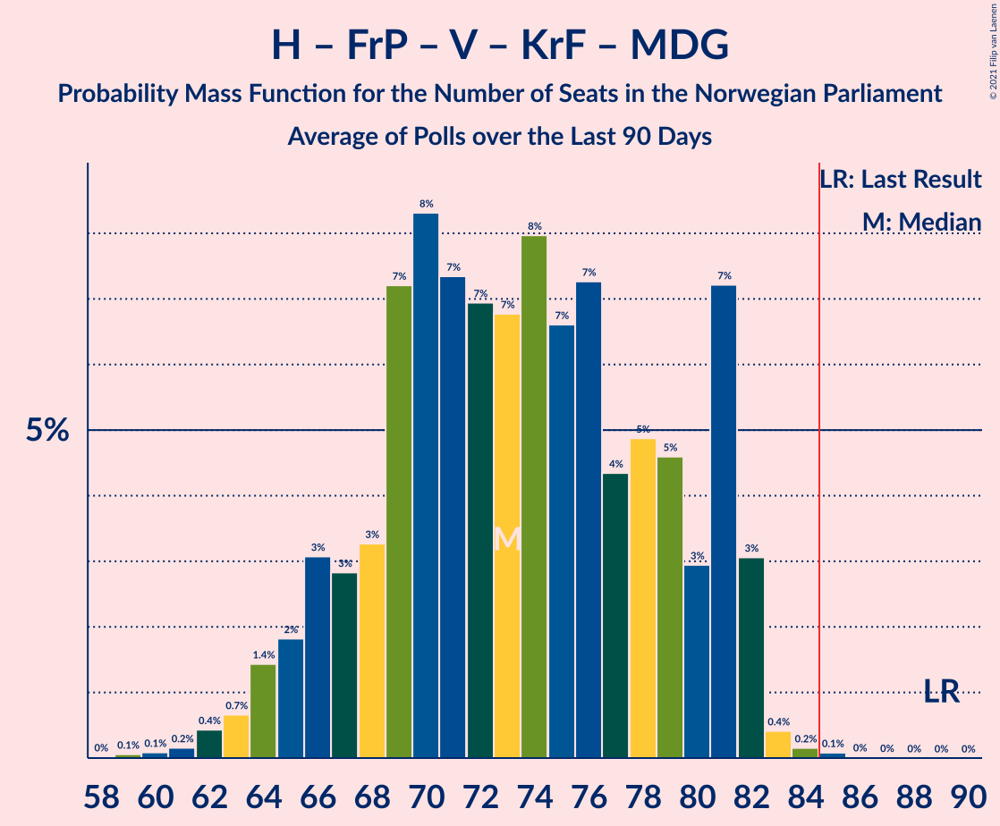

# Poll Average

<a href="#voting-intentions">Voting Intentions</a> | <a href="#seats">Seats</a> | <a href="#coalitions">Coalitions</a> | <a href="#technical-information">Technical Information</a>

## Summary

The table below lists the polls on which the average is based. They are the most recent polls (less than 90 days old) registered and analyzed so far.

| Period     | Polling firm/Commissioner(s) | Ap | H | FrP | Sp | SV | V | KrF | MDG | R |
|:----------:|:----------------------------:|:--:|:--:|:--:|:--:|:--:|:--:|:--:|:--:|:--:|
| 8–9 September 2013 | General Election | 27.4%   49 | 25.0%   45 | 15.2%   27 | 10.3%   19 | 6.0%   11 | 4.4%   8 | 4.2%   8 | 3.2%   1 | 2.4%   1 |
| N/A | Poll Average | 18–26%   32–47 | 20–28%   34–50 | 10–16%   17–28 | 14–22%   24–40 | 5–10%   8–17 | 2–5%   0–9 | 2–5%   0–9 | 3–6%   1–10 | 3–6%   1–11 |
| [3–4 November 2020](2020-11-04-Norfakta.html) | Norfakta   Klassekampen and Nationen | 21–26%   38–47 | 22–27%   40–50 | 9–13%   16–24 | 15–20%   28–37 | 5–8%   10–15 | 2–4%   0–2 | 2–5%   1–8 | 3–5%   1–9 | 3–6%   2–10 |
| [27 October–3 November 2020](2020-11-03-Sentio.html) | Sentio   Amedia and Nettavisen | 19–25%   36–45 | 22–28%   41–51 | 11–16%   21–28 | 14–19%   26–34 | 6–9%   11–18 | 2–4%   1–7 | 3–6%   2–10 | 3–5%   1–8 | 2–5%   1–8 |
| [28–31 October 2020](2020-10-31-ResponsAnalyse.html) | Respons Analyse   VG | 20–25%   36–44 | 19–24%   33–43 | 12–16%   20–29 | 17–21%   29–40 | 4–7%   8–13 | 3–5%   2–9 | 3–5%   1–8 | 4–6%   2–11 | 3–6%   2–10 |
| [26–30 October 2020](2020-10-30-KantarTNS.html) | Kantar TNS   TV2 | 18–23%   31–43 | 19–25%   34–46 | 9–14%   16–25 | 17–23%   31–43 | 6–10%   11–18 | 3–6%   2–10 | 2–4%   0–7 | 3–6%   1–10 | 4–7%   2–11 |
| [20–25 October 2020](2020-10-25-Norstat.html) | Norstat   Aftenposten and NRK | 20–27%   37–50 | 22–29%   40–52 | 10–15%   18–27 | 12–18%   22–33 | 6–10%   11–19 | 2–5%   1–9 | 2–5%   0–8 | 3–6%   1–11 | 2–5%   1–9 |
| [19–21 October 2020](2020-10-21-IpsosMMI.html) | Ipsos MMI   Dagbladet | 17–23%   29–42 | 19–25%   33–46 | 10–15%   17–27 | 15–21%   27–40 | 5–8%   7–14 | 2–4%   0–3 | 3–5%   1–8 | 3–6%   2–10 | 4–7%   2–12 |
| 8–9 September 2013 | General Election | 27.4%   49 | 25.0%   45 | 15.2%   27 | 10.3%   19 | 6.0%   11 | 4.4%   8 | 4.2%   8 | 3.2%   1 | 2.4%   1 |

Only polls for which at least the sample size has been published are included in the table above.

**Legend:**
+ **Top half of each row:** Voting intentions (95% confidence interval)
+ **Bottom half of each row:** Seat projections for the Norwegian Parliament (95% confidence interval)
+ **Ap:** Arbeiderpartiet
+ **H:** Høyre
+ **FrP:** Fremskrittspartiet
+ **Sp:** Senterpartiet
+ **SV:** Sosialistisk Venstreparti
+ **V:** Venstre
+ **KrF:** Kristelig Folkeparti
+ **MDG:** Miljøpartiet De Grønne
+ **R:** Rødt
+ **N/A (single party):** Party not included the published results
+ **N/A (entire row):** Calculation for this opinion poll not started yet

## Voting Intentions

### Confidence Intervals

| Party | Last Result | Median | 80% Confidence Interval | 90% Confidence Interval | 95% Confidence Interval | 99% Confidence Interval |
|:-----:|:-----------:|:------:|:-----------------------:|:-----------------------:|:-----------------------:|:-----------------------:|
| <a href="#arbeiderpartiet">Arbeiderpartiet</a> | 27.4% | 21.9% | 19.2–24.4% |18.5–25.1% | 17.9–25.7% | 16.9–26.8% |
| <a href="#høyre">Høyre</a> | 25.0% | 23.6% | 20.8–26.3% |20.2–26.9% | 19.7–27.5% | 18.8–28.6% |
| <a href="#fremskrittspartiet">Fremskrittspartiet</a> | 15.2% | 12.6% | 10.7–14.5% |10.2–15.1% | 9.9–15.5% | 9.2–16.3% |
| <a href="#senterpartiet">Senterpartiet</a> | 10.3% | 17.7% | 14.9–20.3% |14.1–21.0% | 13.5–21.6% | 12.5–22.7% |
| <a href="#sosialistisk-venstreparti">Sosialistisk Venstreparti</a> | 6.0% | 7.1% | 5.5–8.7% |5.2–9.1% | 4.9–9.5% | 4.4–10.3% |
| <a href="#venstre">Venstre</a> | 4.4% | 3.3% | 2.3–4.5% |2.1–4.9% | 1.9–5.2% | 1.6–5.8% |
| <a href="#kristelig-folkeparti">Kristelig Folkeparti</a> | 4.2% | 3.6% | 2.6–4.6% |2.4–4.9% | 2.2–5.2% | 1.9–5.7% |
| <a href="#miljøpartiet-de-grønne">Miljøpartiet De Grønne</a> | 3.2% | 4.3% | 3.3–5.4% |3.0–5.8% | 2.8–6.1% | 2.5–6.7% |
| <a href="#rødt">Rødt</a> | 2.4% | 4.2% | 3.0–5.7% |2.8–6.1% | 2.6–6.5% | 2.2–7.2% |

### Arbeiderpartiet

*For a full overview of the results for this party, see the [Arbeiderpartiet](party-arbeiderpartiet.html) page.*

| Voting Intentions | Probability | Accumulated | Special Marks |
|:-----------------:|:-----------:|:-----------:|:-------------:|
| 14.5–15.5% | 0% | 100% |  |
| 15.5–16.5% | 0.2% | 100% |  |
| 16.5–17.5% | 1.2% | 99.7% |  |
| 17.5–18.5% | 4% | 98.5% |  |
| 18.5–19.5% | 8% | 95% |  |
| 19.5–20.5% | 12% | 87% |  |
| 20.5–21.5% | 17% | 74% |  |
| 21.5–22.5% | 20% | 57% | Median |
| 22.5–23.5% | 17% | 38% |  |
| 23.5–24.5% | 12% | 20% |  |
| 24.5–25.5% | 6% | 9% |  |
| 25.5–26.5% | 2% | 3% |  |
| 26.5–27.5% | 0.6% | 0.8% | Last Result |
| 27.5–28.5% | 0.1% | 0.1% |  |
| 28.5–29.5% | 0% | 0% |  |

### Høyre

*For a full overview of the results for this party, see the [Høyre](party-høyre.html) page.*

| Voting Intentions | Probability | Accumulated | Special Marks |
|:-----------------:|:-----------:|:-----------:|:-------------:|
| 16.5–17.5% | 0% | 100% |  |
| 17.5–18.5% | 0.3% | 100% |  |
| 18.5–19.5% | 2% | 99.7% |  |
| 19.5–20.5% | 5% | 98% |  |
| 20.5–21.5% | 11% | 93% |  |
| 21.5–22.5% | 15% | 81% |  |
| 22.5–23.5% | 16% | 66% |  |
| 23.5–24.5% | 17% | 50% | Median |
| 24.5–25.5% | 15% | 33% | Last Result |
| 25.5–26.5% | 11% | 18% |  |
| 26.5–27.5% | 5% | 7% |  |
| 27.5–28.5% | 2% | 2% |  |
| 28.5–29.5% | 0.5% | 0.6% |  |
| 29.5–30.5% | 0.1% | 0.1% |  |
| 30.5–31.5% | 0% | 0% |  |

### Fremskrittspartiet

*For a full overview of the results for this party, see the [Fremskrittspartiet](party-fremskrittspartiet.html) page.*

| Voting Intentions | Probability | Accumulated | Special Marks |
|:-----------------:|:-----------:|:-----------:|:-------------:|
| 7.5–8.5% | 0.1% | 100% |  |
| 8.5–9.5% | 1.2% | 99.9% |  |
| 9.5–10.5% | 7% | 98.7% |  |
| 10.5–11.5% | 18% | 92% |  |
| 11.5–12.5% | 23% | 74% |  |
| 12.5–13.5% | 24% | 51% | Median |
| 13.5–14.5% | 17% | 27% |  |
| 14.5–15.5% | 7% | 10% | Last Result |
| 15.5–16.5% | 2% | 2% |  |
| 16.5–17.5% | 0.3% | 0.3% |  |
| 17.5–18.5% | 0% | 0% |  |

### Senterpartiet

*For a full overview of the results for this party, see the [Senterpartiet](party-senterpartiet.html) page.*

| Voting Intentions | Probability | Accumulated | Special Marks |
|:-----------------:|:-----------:|:-----------:|:-------------:|
| 9.5–10.5% | 0% | 100% | Last Result |
| 10.5–11.5% | 0.1% | 100% |  |
| 11.5–12.5% | 0.5% | 99.9% |  |
| 12.5–13.5% | 2% | 99.5% |  |
| 13.5–14.5% | 5% | 97% |  |
| 14.5–15.5% | 9% | 92% |  |
| 15.5–16.5% | 13% | 84% |  |
| 16.5–17.5% | 17% | 70% |  |
| 17.5–18.5% | 19% | 53% | Median |
| 18.5–19.5% | 16% | 34% |  |
| 19.5–20.5% | 10% | 18% |  |
| 20.5–21.5% | 5% | 8% |  |
| 21.5–22.5% | 2% | 3% |  |
| 22.5–23.5% | 0.5% | 0.6% |  |
| 23.5–24.5% | 0.1% | 0.1% |  |
| 24.5–25.5% | 0% | 0% |  |

### Sosialistisk Venstreparti

*For a full overview of the results for this party, see the [Sosialistisk Venstreparti](party-sosialistiskvenstreparti.html) page.*

| Voting Intentions | Probability | Accumulated | Special Marks |
|:-----------------:|:-----------:|:-----------:|:-------------:|
| 2.5–3.5% | 0% | 100% |  |
| 3.5–4.5% | 0.9% | 100% |  |
| 4.5–5.5% | 9% | 99.1% |  |
| 5.5–6.5% | 24% | 90% | Last Result |
| 6.5–7.5% | 30% | 66% | Median |
| 7.5–8.5% | 24% | 36% |  |
| 8.5–9.5% | 10% | 12% |  |
| 9.5–10.5% | 2% | 2% |  |
| 10.5–11.5% | 0.3% | 0.3% |  |
| 11.5–12.5% | 0% | 0% |  |

### Venstre

*For a full overview of the results for this party, see the [Venstre](party-venstre.html) page.*

| Voting Intentions | Probability | Accumulated | Special Marks |
|:-----------------:|:-----------:|:-----------:|:-------------:|
| 0.0–0.5% | 0% | 100% |  |
| 0.5–1.5% | 0.4% | 100% |  |
| 1.5–2.5% | 19% | 99.6% |  |
| 2.5–3.5% | 43% | 81% | Median |
| 3.5–4.5% | 29% | 38% | Last Result |
| 4.5–5.5% | 8% | 9% |  |
| 5.5–6.5% | 0.9% | 0.9% |  |
| 6.5–7.5% | 0% | 0% |  |

### Kristelig Folkeparti

*For a full overview of the results for this party, see the [Kristelig Folkeparti](party-kristeligfolkeparti.html) page.*

| Voting Intentions | Probability | Accumulated | Special Marks |
|:-----------------:|:-----------:|:-----------:|:-------------:|
| 0.5–1.5% | 0.1% | 100% |  |
| 1.5–2.5% | 8% | 99.9% |  |
| 2.5–3.5% | 42% | 92% |  |
| 3.5–4.5% | 39% | 50% | Last Result, Median |
| 4.5–5.5% | 10% | 11% |  |
| 5.5–6.5% | 0.8% | 0.9% |  |
| 6.5–7.5% | 0% | 0% |  |

### Miljøpartiet De Grønne

*For a full overview of the results for this party, see the [Miljøpartiet De Grønne](party-miljøpartietdegrønne.html) page.*

| Voting Intentions | Probability | Accumulated | Special Marks |
|:-----------------:|:-----------:|:-----------:|:-------------:|
| 0.5–1.5% | 0% | 100% |  |
| 1.5–2.5% | 0.7% | 100% |  |
| 2.5–3.5% | 18% | 99.3% | Last Result |
| 3.5–4.5% | 44% | 81% | Median |
| 4.5–5.5% | 29% | 37% |  |
| 5.5–6.5% | 7% | 8% |  |
| 6.5–7.5% | 0.7% | 0.7% |  |
| 7.5–8.5% | 0% | 0% |  |

### Rødt

*For a full overview of the results for this party, see the [Rødt](party-rødt.html) page.*

| Voting Intentions | Probability | Accumulated | Special Marks |
|:-----------------:|:-----------:|:-----------:|:-------------:|
| 0.5–1.5% | 0% | 100% |  |
| 1.5–2.5% | 2% | 100% | Last Result |
| 2.5–3.5% | 23% | 98% |  |
| 3.5–4.5% | 38% | 75% | Median |
| 4.5–5.5% | 25% | 37% |  |
| 5.5–6.5% | 10% | 12% |  |
| 6.5–7.5% | 2% | 2% |  |
| 7.5–8.5% | 0.2% | 0.2% |  |
| 8.5–9.5% | 0% | 0% |  |

## Seats

### Confidence Intervals

| Party | Last Result | Median | 80% Confidence Interval | 90% Confidence Interval | 95% Confidence Interval | 99% Confidence Interval |
|:-----:|:-----------:|:------:|:-----------------------:|:-----------------------:|:-----------------------:|:-----------------------:|
| <a href="#arbeiderpartiet">Arbeiderpartiet</a> | 49 | 40 | 35–44 |34–45 | 32–47 | 29–50 |
| <a href="#høyre">Høyre</a> | 45 | 42 | 36–48 |35–49 | 34–50 | 33–53 |
| <a href="#fremskrittspartiet">Fremskrittspartiet</a> | 27 | 23 | 18–26 |18–27 | 17–28 | 16–29 |
| <a href="#senterpartiet">Senterpartiet</a> | 19 | 33 | 27–38 |25–39 | 24–40 | 22–43 |
| <a href="#sosialistisk-venstreparti">Sosialistisk Venstreparti</a> | 11 | 12 | 9–16 |9–16 | 8–17 | 7–19 |
| <a href="#venstre">Venstre</a> | 8 | 2 | 1–8 |1–8 | 0–9 | 0–10 |
| <a href="#kristelig-folkeparti">Kristelig Folkeparti</a> | 8 | 3 | 1–8 |1–9 | 0–9 | 0–10 |
| <a href="#miljøpartiet-de-grønne">Miljøpartiet De Grønne</a> | 1 | 7 | 1–9 |1–10 | 1–10 | 1–11 |
| <a href="#rødt">Rødt</a> | 1 | 7 | 2–9 |2–10 | 1–11 | 1–12 |

### Arbeiderpartiet

*For a full overview of the results for this party, see the [Arbeiderpartiet](party-arbeiderpartiet.html) page.*

| Number of Seats | Probability | Accumulated | Special Marks |
|:---------------:|:-----------:|:-----------:|:-------------:|
| 27 | 0.1% | 100% |  |
| 28 | 0.2% | 99.9% |  |
| 29 | 0.2% | 99.7% |  |
| 30 | 0.8% | 99.5% |  |
| 31 | 0.8% | 98.7% |  |
| 32 | 1.1% | 98% |  |
| 33 | 1.0% | 97% |  |
| 34 | 3% | 96% |  |
| 35 | 3% | 93% |  |
| 36 | 3% | 90% |  |
| 37 | 5% | 87% |  |
| 38 | 9% | 82% |  |
| 39 | 10% | 73% |  |
| 40 | 17% | 63% | Median |
| 41 | 13% | 46% |  |
| 42 | 12% | 33% |  |
| 43 | 6% | 21% |  |
| 44 | 8% | 15% |  |
| 45 | 2% | 7% |  |
| 46 | 2% | 5% |  |
| 47 | 2% | 3% |  |
| 48 | 0.9% | 2% |  |
| 49 | 0.3% | 0.8% | Last Result |
| 50 | 0.3% | 0.5% |  |
| 51 | 0.1% | 0.2% |  |
| 52 | 0% | 0.1% |  |
| 53 | 0.1% | 0.1% |  |
| 54 | 0% | 0% |  |

### Høyre

*For a full overview of the results for this party, see the [Høyre](party-høyre.html) page.*

| Number of Seats | Probability | Accumulated | Special Marks |
|:---------------:|:-----------:|:-----------:|:-------------:|
| 31 | 0.1% | 100% |  |
| 32 | 0.3% | 99.9% |  |
| 33 | 1.1% | 99.6% |  |
| 34 | 3% | 98% |  |
| 35 | 4% | 95% |  |
| 36 | 4% | 91% |  |
| 37 | 5% | 87% |  |
| 38 | 5% | 83% |  |
| 39 | 5% | 77% |  |
| 40 | 10% | 72% |  |
| 41 | 7% | 62% |  |
| 42 | 9% | 55% | Median |
| 43 | 8% | 46% |  |
| 44 | 8% | 38% |  |
| 45 | 6% | 30% | Last Result |
| 46 | 6% | 24% |  |
| 47 | 6% | 18% |  |
| 48 | 4% | 12% |  |
| 49 | 4% | 9% |  |
| 50 | 2% | 4% |  |
| 51 | 1.3% | 2% |  |
| 52 | 0.6% | 1.1% |  |
| 53 | 0.3% | 0.5% |  |
| 54 | 0.1% | 0.2% |  |
| 55 | 0.1% | 0.1% |  |
| 56 | 0% | 0% |  |

### Fremskrittspartiet

*For a full overview of the results for this party, see the [Fremskrittspartiet](party-fremskrittspartiet.html) page.*

| Number of Seats | Probability | Accumulated | Special Marks |
|:---------------:|:-----------:|:-----------:|:-------------:|
| 14 | 0.1% | 100% |  |
| 15 | 0.3% | 99.9% |  |
| 16 | 0.8% | 99.6% |  |
| 17 | 2% | 98.8% |  |
| 18 | 7% | 97% |  |
| 19 | 10% | 90% |  |
| 20 | 10% | 80% |  |
| 21 | 12% | 70% |  |
| 22 | 8% | 58% |  |
| 23 | 14% | 50% | Median |
| 24 | 12% | 36% |  |
| 25 | 9% | 24% |  |
| 26 | 8% | 15% |  |
| 27 | 4% | 7% | Last Result |
| 28 | 2% | 3% |  |
| 29 | 0.9% | 1.3% |  |
| 30 | 0.3% | 0.4% |  |
| 31 | 0.1% | 0.2% |  |
| 32 | 0% | 0% |  |

### Senterpartiet

*For a full overview of the results for this party, see the [Senterpartiet](party-senterpartiet.html) page.*

| Number of Seats | Probability | Accumulated | Special Marks |
|:---------------:|:-----------:|:-----------:|:-------------:|
| 19 | 0% | 100% | Last Result |
| 20 | 0.1% | 100% |  |
| 21 | 0.1% | 99.9% |  |
| 22 | 0.3% | 99.8% |  |
| 23 | 0.7% | 99.5% |  |
| 24 | 1.4% | 98.8% |  |
| 25 | 3% | 97% |  |
| 26 | 2% | 95% |  |
| 27 | 4% | 92% |  |
| 28 | 7% | 89% |  |
| 29 | 6% | 82% |  |
| 30 | 7% | 76% |  |
| 31 | 9% | 69% |  |
| 32 | 8% | 60% |  |
| 33 | 11% | 52% | Median |
| 34 | 7% | 41% |  |
| 35 | 9% | 34% |  |
| 36 | 8% | 25% |  |
| 37 | 5% | 18% |  |
| 38 | 5% | 13% |  |
| 39 | 4% | 7% |  |
| 40 | 1.4% | 3% |  |
| 41 | 0.7% | 2% |  |
| 42 | 0.6% | 1.4% |  |
| 43 | 0.4% | 0.8% |  |
| 44 | 0.3% | 0.4% |  |
| 45 | 0.1% | 0.1% |  |
| 46 | 0% | 0.1% |  |
| 47 | 0% | 0% |  |

### Sosialistisk Venstreparti

*For a full overview of the results for this party, see the [Sosialistisk Venstreparti](party-sosialistiskvenstreparti.html) page.*

| Number of Seats | Probability | Accumulated | Special Marks |
|:---------------:|:-----------:|:-----------:|:-------------:|
| 2 | 0.1% | 100% |  |
| 3 | 0% | 99.9% |  |
| 4 | 0% | 99.9% |  |
| 5 | 0% | 99.9% |  |
| 6 | 0.1% | 99.9% |  |
| 7 | 1.0% | 99.8% |  |
| 8 | 3% | 98.8% |  |
| 9 | 9% | 95% |  |
| 10 | 11% | 87% |  |
| 11 | 14% | 76% | Last Result |
| 12 | 13% | 62% | Median |
| 13 | 15% | 50% |  |
| 14 | 14% | 34% |  |
| 15 | 9% | 20% |  |
| 16 | 6% | 11% |  |
| 17 | 3% | 5% |  |
| 18 | 1.1% | 2% |  |
| 19 | 0.5% | 0.7% |  |
| 20 | 0.2% | 0.2% |  |
| 21 | 0% | 0% |  |

### Venstre

*For a full overview of the results for this party, see the [Venstre](party-venstre.html) page.*

| Number of Seats | Probability | Accumulated | Special Marks |
|:---------------:|:-----------:|:-----------:|:-------------:|
| 0 | 3% | 100% |  |
| 1 | 14% | 97% |  |
| 2 | 59% | 84% | Median |
| 3 | 2% | 25% |  |
| 4 | 0% | 23% |  |
| 5 | 0% | 23% |  |
| 6 | 0.7% | 23% |  |
| 7 | 6% | 22% |  |
| 8 | 12% | 16% | Last Result |
| 9 | 3% | 4% |  |
| 10 | 0.7% | 0.9% |  |
| 11 | 0.2% | 0.2% |  |
| 12 | 0% | 0% |  |

### Kristelig Folkeparti

*For a full overview of the results for this party, see the [Kristelig Folkeparti](party-kristeligfolkeparti.html) page.*

| Number of Seats | Probability | Accumulated | Special Marks |
|:---------------:|:-----------:|:-----------:|:-------------:|
| 0 | 3% | 100% |  |
| 1 | 27% | 97% |  |
| 2 | 20% | 71% |  |
| 3 | 22% | 50% | Median |
| 4 | 0% | 28% |  |
| 5 | 0% | 28% |  |
| 6 | 3% | 28% |  |
| 7 | 10% | 25% |  |
| 8 | 10% | 15% | Last Result |
| 9 | 4% | 5% |  |
| 10 | 0.8% | 1.0% |  |
| 11 | 0.1% | 0.2% |  |
| 12 | 0% | 0% |  |

### Miljøpartiet De Grønne

*For a full overview of the results for this party, see the [Miljøpartiet De Grønne](party-miljøpartietdegrønne.html) page.*

| Number of Seats | Probability | Accumulated | Special Marks |
|:---------------:|:-----------:|:-----------:|:-------------:|
| 1 | 12% | 100% | Last Result |
| 2 | 16% | 88% |  |
| 3 | 8% | 72% |  |
| 4 | 0% | 64% |  |
| 5 | 0% | 64% |  |
| 6 | 2% | 64% |  |
| 7 | 14% | 61% | Median |
| 8 | 25% | 47% |  |
| 9 | 14% | 22% |  |
| 10 | 5% | 7% |  |
| 11 | 2% | 2% |  |
| 12 | 0.4% | 0.5% |  |
| 13 | 0% | 0.1% |  |
| 14 | 0% | 0% |  |

### Rødt

*For a full overview of the results for this party, see the [Rødt](party-rødt.html) page.*

| Number of Seats | Probability | Accumulated | Special Marks |
|:---------------:|:-----------:|:-----------:|:-------------:|
| 1 | 4% | 100% | Last Result |
| 2 | 35% | 96% |  |
| 3 | 0% | 61% |  |
| 4 | 0% | 61% |  |
| 5 | 0% | 61% |  |
| 6 | 1.3% | 61% |  |
| 7 | 12% | 59% | Median |
| 8 | 27% | 47% |  |
| 9 | 11% | 20% |  |
| 10 | 6% | 8% |  |
| 11 | 2% | 3% |  |
| 12 | 0.6% | 0.8% |  |
| 13 | 0.2% | 0.3% |  |
| 14 | 0.1% | 0.1% |  |
| 15 | 0% | 0% |  |

## Coalitions

### Confidence Intervals

| Coalition | Last Result | Median | Majority? | 80% Confidence Interval | 90% Confidence Interval | 95% Confidence Interval | 99% Confidence Interval |
|:---------:|:-----------:|:------:|:---------:|:-----------------------:|:-----------------------:|:-----------------------:|:-----------------------:|
| Høyre – Fremskrittspartiet – Senterpartiet – Venstre – Kristelig Folkeparti | 107 | 104 | 100% | 98–110 | 96–112 | 95–113 | 91–115 |
| Arbeiderpartiet – Senterpartiet – Sosialistisk Venstreparti – Miljøpartiet De Grønne – Rødt | 81 | 97 | 98.8% | 89–104 | 87–106 | 86–106 | 84–109 |
| Arbeiderpartiet – Senterpartiet – Sosialistisk Venstreparti – Kristelig Folkeparti – Miljøpartiet De Grønne | 88 | 95 | 98.5% | 88–99 | 87–101 | 86–104 | 82–106 |
| Arbeiderpartiet – Senterpartiet – Sosialistisk Venstreparti – Rødt | 80 | 91 | 88% | 84–98 | 83–100 | 81–102 | 79–104 |
| Arbeiderpartiet – Senterpartiet – Sosialistisk Venstreparti – Miljøpartiet De Grønne | 80 | 91 | 91% | 85–97 | 83–98 | 81–100 | 78–103 |
| Arbeiderpartiet – Senterpartiet – Sosialistisk Venstreparti | 79 | 85 | 54% | 79–91 | 77–93 | 75–94 | 72–96 |
| Arbeiderpartiet – Senterpartiet – Kristelig Folkeparti – Miljøpartiet De Grønne | 77 | 82 | 33% | 76–88 | 74–90 | 73–92 | 70–94 |
| Høyre – Fremskrittspartiet – Venstre – Kristelig Folkeparti – Miljøpartiet De Grønne | 89 | 77 | 8% | 70–84 | 68–86 | 66–87 | 64–89 |
| Arbeiderpartiet – Senterpartiet – Kristelig Folkeparti | 76 | 77 | 3% | 70–81 | 69–83 | 67–85 | 65–87 |
| Høyre – Fremskrittspartiet – Venstre – Kristelig Folkeparti | 88 | 71 | 1.0% | 64–79 | 63–82 | 61–83 | 59–85 |
| Arbeiderpartiet – Senterpartiet | 68 | 73 | 0.2% | 67–78 | 65–79 | 64–81 | 62–83 |
| Høyre – Fremskrittspartiet – Venstre | 80 | 67 | 0% | 61–74 | 59–76 | 58–78 | 55–81 |
| Høyre – Fremskrittspartiet | 72 | 64 | 0% | 58–72 | 55–73 | 54–74 | 52–77 |
| Arbeiderpartiet – Sosialistisk Venstreparti | 60 | 53 | 0% | 47–58 | 44–60 | 43–61 | 39–65 |
| Høyre – Venstre – Kristelig Folkeparti | 61 | 48 | 0% | 43–55 | 41–57 | 40–58 | 38–61 |
| Senterpartiet – Venstre – Kristelig Folkeparti | 35 | 39 | 0% | 33–46 | 31–48 | 29–49 | 27–52 |

### Høyre – Fremskrittspartiet – Senterpartiet – Venstre – Kristelig Folkeparti

| Number of Seats | Probability | Accumulated | Special Marks |
|:---------------:|:-----------:|:-----------:|:-------------:|
| 89 | 0% | 100% |  |
| 90 | 0.2% | 99.9% |  |
| 91 | 0.4% | 99.8% |  |
| 92 | 0.4% | 99.3% |  |
| 93 | 0.4% | 99.0% |  |
| 94 | 0.6% | 98.5% |  |
| 95 | 2% | 98% |  |
| 96 | 3% | 96% |  |
| 97 | 2% | 93% |  |
| 98 | 6% | 91% |  |
| 99 | 6% | 85% |  |
| 100 | 10% | 79% |  |
| 101 | 5% | 70% |  |
| 102 | 7% | 64% |  |
| 103 | 7% | 57% | Median |
| 104 | 9% | 50% |  |
| 105 | 6% | 41% |  |
| 106 | 8% | 36% |  |
| 107 | 5% | 28% | Last Result |
| 108 | 6% | 22% |  |
| 109 | 4% | 16% |  |
| 110 | 3% | 13% |  |
| 111 | 4% | 10% |  |
| 112 | 3% | 6% |  |
| 113 | 1.4% | 3% |  |
| 114 | 0.6% | 2% |  |
| 115 | 1.1% | 1.4% |  |
| 116 | 0.2% | 0.3% |  |
| 117 | 0.1% | 0.2% |  |
| 118 | 0% | 0.1% |  |
| 119 | 0% | 0% |  |

### Arbeiderpartiet – Senterpartiet – Sosialistisk Venstreparti – Miljøpartiet De Grønne – Rødt

| Number of Seats | Probability | Accumulated | Special Marks |
|:---------------:|:-----------:|:-----------:|:-------------:|
| 81 | 0.1% | 100% | Last Result |
| 82 | 0.2% | 99.9% |  |
| 83 | 0.2% | 99.7% |  |
| 84 | 0.7% | 99.5% |  |
| 85 | 0.8% | 98.8% | Majority |
| 86 | 2% | 98% |  |
| 87 | 2% | 96% |  |
| 88 | 3% | 94% |  |
| 89 | 3% | 91% |  |
| 90 | 3% | 88% |  |
| 91 | 4% | 86% |  |
| 92 | 6% | 81% |  |
| 93 | 5% | 75% |  |
| 94 | 5% | 70% |  |
| 95 | 5% | 65% |  |
| 96 | 6% | 60% |  |
| 97 | 6% | 54% |  |
| 98 | 8% | 48% |  |
| 99 | 7% | 40% | Median |
| 100 | 5% | 34% |  |
| 101 | 6% | 29% |  |
| 102 | 9% | 23% |  |
| 103 | 3% | 14% |  |
| 104 | 3% | 11% |  |
| 105 | 3% | 9% |  |
| 106 | 4% | 6% |  |
| 107 | 0.7% | 2% |  |
| 108 | 0.5% | 1.2% |  |
| 109 | 0.3% | 0.7% |  |
| 110 | 0.2% | 0.4% |  |
| 111 | 0.1% | 0.2% |  |
| 112 | 0.1% | 0.1% |  |
| 113 | 0% | 0% |  |

### Arbeiderpartiet – Senterpartiet – Sosialistisk Venstreparti – Kristelig Folkeparti – Miljøpartiet De Grønne

| Number of Seats | Probability | Accumulated | Special Marks |
|:---------------:|:-----------:|:-----------:|:-------------:|
| 78 | 0% | 100% |  |
| 79 | 0% | 99.9% |  |
| 80 | 0.1% | 99.9% |  |
| 81 | 0.2% | 99.8% |  |
| 82 | 0.2% | 99.6% |  |
| 83 | 0.3% | 99.5% |  |
| 84 | 0.6% | 99.1% |  |
| 85 | 1.0% | 98.5% | Majority |
| 86 | 2% | 98% |  |
| 87 | 2% | 96% |  |
| 88 | 4% | 94% | Last Result |
| 89 | 4% | 89% |  |
| 90 | 5% | 85% |  |
| 91 | 5% | 80% |  |
| 92 | 7% | 75% |  |
| 93 | 7% | 68% |  |
| 94 | 11% | 62% |  |
| 95 | 7% | 51% | Median |
| 96 | 8% | 44% |  |
| 97 | 11% | 36% |  |
| 98 | 9% | 25% |  |
| 99 | 7% | 16% |  |
| 100 | 3% | 10% |  |
| 101 | 2% | 6% |  |
| 102 | 0.9% | 4% |  |
| 103 | 0.8% | 3% |  |
| 104 | 0.4% | 3% |  |
| 105 | 1.2% | 2% |  |
| 106 | 0.7% | 0.9% |  |
| 107 | 0.2% | 0.3% |  |
| 108 | 0.1% | 0.1% |  |
| 109 | 0% | 0% |  |

### Arbeiderpartiet – Senterpartiet – Sosialistisk Venstreparti – Rødt

| Number of Seats | Probability | Accumulated | Special Marks |
|:---------------:|:-----------:|:-----------:|:-------------:|
| 76 | 0% | 100% |  |
| 77 | 0.2% | 99.9% |  |
| 78 | 0.2% | 99.8% |  |
| 79 | 0.4% | 99.6% |  |
| 80 | 0.7% | 99.2% | Last Result |
| 81 | 2% | 98% |  |
| 82 | 1.4% | 97% |  |
| 83 | 3% | 95% |  |
| 84 | 4% | 92% |  |
| 85 | 6% | 88% | Majority |
| 86 | 7% | 82% |  |
| 87 | 5% | 75% |  |
| 88 | 5% | 70% |  |
| 89 | 7% | 65% |  |
| 90 | 7% | 59% |  |
| 91 | 9% | 52% |  |
| 92 | 5% | 44% | Median |
| 93 | 7% | 39% |  |
| 94 | 9% | 32% |  |
| 95 | 4% | 23% |  |
| 96 | 3% | 19% |  |
| 97 | 4% | 16% |  |
| 98 | 4% | 12% |  |
| 99 | 3% | 9% |  |
| 100 | 1.1% | 5% |  |
| 101 | 2% | 4% |  |
| 102 | 0.6% | 3% |  |
| 103 | 0.6% | 2% |  |
| 104 | 1.0% | 1.4% |  |
| 105 | 0.2% | 0.4% |  |
| 106 | 0.1% | 0.1% |  |
| 107 | 0% | 0.1% |  |
| 108 | 0% | 0% |  |

### Arbeiderpartiet – Senterpartiet – Sosialistisk Venstreparti – Miljøpartiet De Grønne

| Number of Seats | Probability | Accumulated | Special Marks |
|:---------------:|:-----------:|:-----------:|:-------------:|
| 74 | 0% | 100% |  |
| 75 | 0.1% | 99.9% |  |
| 76 | 0.1% | 99.9% |  |
| 77 | 0.1% | 99.8% |  |
| 78 | 0.2% | 99.6% |  |
| 79 | 0.4% | 99.4% |  |
| 80 | 0.8% | 99.0% | Last Result |
| 81 | 1.3% | 98% |  |
| 82 | 2% | 97% |  |
| 83 | 2% | 95% |  |
| 84 | 2% | 93% |  |
| 85 | 5% | 91% | Majority |
| 86 | 4% | 86% |  |
| 87 | 7% | 82% |  |
| 88 | 6% | 75% |  |
| 89 | 6% | 69% |  |
| 90 | 8% | 63% |  |
| 91 | 7% | 55% |  |
| 92 | 8% | 48% | Median |
| 93 | 6% | 39% |  |
| 94 | 8% | 33% |  |
| 95 | 7% | 25% |  |
| 96 | 6% | 18% |  |
| 97 | 4% | 12% |  |
| 98 | 4% | 8% |  |
| 99 | 1.4% | 4% |  |
| 100 | 1.1% | 3% |  |
| 101 | 0.6% | 2% |  |
| 102 | 0.5% | 1.2% |  |
| 103 | 0.2% | 0.7% |  |
| 104 | 0.4% | 0.5% |  |
| 105 | 0% | 0.1% |  |
| 106 | 0% | 0% |  |

### Arbeiderpartiet – Senterpartiet – Sosialistisk Venstreparti

| Number of Seats | Probability | Accumulated | Special Marks |
|:---------------:|:-----------:|:-----------:|:-------------:|
| 69 | 0.1% | 100% |  |
| 70 | 0.1% | 99.9% |  |
| 71 | 0.1% | 99.8% |  |
| 72 | 0.2% | 99.7% |  |
| 73 | 0.5% | 99.5% |  |
| 74 | 1.1% | 98.9% |  |
| 75 | 0.6% | 98% |  |
| 76 | 1.3% | 97% |  |
| 77 | 2% | 96% |  |
| 78 | 2% | 94% |  |
| 79 | 4% | 92% | Last Result |
| 80 | 4% | 88% |  |
| 81 | 5% | 84% |  |
| 82 | 7% | 79% |  |
| 83 | 8% | 72% |  |
| 84 | 10% | 64% |  |
| 85 | 8% | 54% | Median, Majority |
| 86 | 9% | 46% |  |
| 87 | 6% | 37% |  |
| 88 | 7% | 31% |  |
| 89 | 7% | 24% |  |
| 90 | 4% | 17% |  |
| 91 | 3% | 12% |  |
| 92 | 3% | 9% |  |
| 93 | 3% | 6% |  |
| 94 | 1.3% | 3% |  |
| 95 | 1.0% | 2% |  |
| 96 | 0.7% | 1.1% |  |
| 97 | 0.3% | 0.5% |  |
| 98 | 0.1% | 0.2% |  |
| 99 | 0% | 0.1% |  |
| 100 | 0% | 0.1% |  |
| 101 | 0% | 0% |  |

### Arbeiderpartiet – Senterpartiet – Kristelig Folkeparti – Miljøpartiet De Grønne

| Number of Seats | Probability | Accumulated | Special Marks |
|:---------------:|:-----------:|:-----------:|:-------------:|
| 67 | 0.1% | 100% |  |
| 68 | 0.1% | 99.9% |  |
| 69 | 0.2% | 99.8% |  |
| 70 | 0.5% | 99.6% |  |
| 71 | 0.6% | 99.1% |  |
| 72 | 0.9% | 98% |  |
| 73 | 1.1% | 98% |  |
| 74 | 2% | 97% |  |
| 75 | 3% | 94% |  |
| 76 | 4% | 91% |  |
| 77 | 6% | 87% | Last Result |
| 78 | 7% | 81% |  |
| 79 | 6% | 75% |  |
| 80 | 7% | 69% |  |
| 81 | 8% | 62% |  |
| 82 | 8% | 54% |  |
| 83 | 5% | 47% | Median |
| 84 | 9% | 42% |  |
| 85 | 8% | 33% | Majority |
| 86 | 8% | 25% |  |
| 87 | 6% | 17% |  |
| 88 | 4% | 11% |  |
| 89 | 2% | 8% |  |
| 90 | 2% | 6% |  |
| 91 | 1.4% | 4% |  |
| 92 | 0.5% | 3% |  |
| 93 | 2% | 2% |  |
| 94 | 0.2% | 0.7% |  |
| 95 | 0.3% | 0.4% |  |
| 96 | 0.1% | 0.2% |  |
| 97 | 0.1% | 0.1% |  |
| 98 | 0% | 0% |  |

### Høyre – Fremskrittspartiet – Venstre – Kristelig Folkeparti – Miljøpartiet De Grønne

| Number of Seats | Probability | Accumulated | Special Marks |
|:---------------:|:-----------:|:-----------:|:-------------:|
| 61 | 0% | 100% |  |
| 62 | 0.1% | 99.9% |  |
| 63 | 0.1% | 99.8% |  |
| 64 | 0.4% | 99.7% |  |
| 65 | 1.2% | 99.3% |  |
| 66 | 1.1% | 98% |  |
| 67 | 0.9% | 97% |  |
| 68 | 2% | 96% |  |
| 69 | 2% | 94% |  |
| 70 | 5% | 91% |  |
| 71 | 4% | 87% |  |
| 72 | 5% | 82% |  |
| 73 | 3% | 77% |  |
| 74 | 6% | 74% |  |
| 75 | 9% | 68% |  |
| 76 | 7% | 59% |  |
| 77 | 4% | 52% | Median |
| 78 | 8% | 48% |  |
| 79 | 6% | 39% |  |
| 80 | 6% | 33% |  |
| 81 | 4% | 27% |  |
| 82 | 4% | 23% |  |
| 83 | 5% | 19% |  |
| 84 | 5% | 13% |  |
| 85 | 3% | 8% | Majority |
| 86 | 3% | 5% |  |
| 87 | 1.1% | 3% |  |
| 88 | 0.9% | 2% |  |
| 89 | 0.5% | 0.9% | Last Result |
| 90 | 0.2% | 0.4% |  |
| 91 | 0.1% | 0.2% |  |
| 92 | 0.1% | 0.1% |  |
| 93 | 0% | 0% |  |

### Arbeiderpartiet – Senterpartiet – Kristelig Folkeparti

| Number of Seats | Probability | Accumulated | Special Marks |
|:---------------:|:-----------:|:-----------:|:-------------:|
| 62 | 0.1% | 100% |  |
| 63 | 0.1% | 99.9% |  |
| 64 | 0.2% | 99.8% |  |
| 65 | 0.4% | 99.6% |  |
| 66 | 0.8% | 99.2% |  |
| 67 | 1.4% | 98% |  |
| 68 | 2% | 97% |  |
| 69 | 2% | 95% |  |
| 70 | 4% | 93% |  |
| 71 | 4% | 89% |  |
| 72 | 6% | 85% |  |
| 73 | 7% | 79% |  |
| 74 | 7% | 73% |  |
| 75 | 7% | 66% |  |
| 76 | 8% | 59% | Last Result, Median |
| 77 | 10% | 50% |  |
| 78 | 11% | 41% |  |
| 79 | 10% | 30% |  |
| 80 | 6% | 20% |  |
| 81 | 4% | 13% |  |
| 82 | 3% | 9% |  |
| 83 | 3% | 7% |  |
| 84 | 1.3% | 4% |  |
| 85 | 1.5% | 3% | Majority |
| 86 | 0.4% | 1.2% |  |
| 87 | 0.3% | 0.7% |  |
| 88 | 0.2% | 0.4% |  |
| 89 | 0.1% | 0.3% |  |
| 90 | 0% | 0.1% |  |
| 91 | 0.1% | 0.1% |  |
| 92 | 0% | 0% |  |

### Høyre – Fremskrittspartiet – Venstre – Kristelig Folkeparti

| Number of Seats | Probability | Accumulated | Special Marks |
|:---------------:|:-----------:|:-----------:|:-------------:|
| 55 | 0% | 100% |  |
| 56 | 0.1% | 99.9% |  |
| 57 | 0.2% | 99.9% |  |
| 58 | 0.2% | 99.7% |  |
| 59 | 0.6% | 99.5% |  |
| 60 | 0.9% | 98.9% |  |
| 61 | 2% | 98% |  |
| 62 | 1.0% | 96% |  |
| 63 | 5% | 95% |  |
| 64 | 4% | 90% |  |
| 65 | 3% | 86% |  |
| 66 | 5% | 83% |  |
| 67 | 10% | 78% |  |
| 68 | 5% | 68% |  |
| 69 | 5% | 63% |  |
| 70 | 7% | 57% | Median |
| 71 | 7% | 51% |  |
| 72 | 5% | 43% |  |
| 73 | 6% | 38% |  |
| 74 | 4% | 33% |  |
| 75 | 4% | 28% |  |
| 76 | 4% | 24% |  |
| 77 | 5% | 20% |  |
| 78 | 3% | 15% |  |
| 79 | 2% | 11% |  |
| 80 | 2% | 9% |  |
| 81 | 2% | 7% |  |
| 82 | 2% | 5% |  |
| 83 | 1.4% | 3% |  |
| 84 | 0.7% | 2% |  |
| 85 | 0.6% | 1.0% | Majority |
| 86 | 0.1% | 0.4% |  |
| 87 | 0.2% | 0.3% |  |
| 88 | 0.1% | 0.1% | Last Result |
| 89 | 0% | 0% |  |

### Arbeiderpartiet – Senterpartiet

| Number of Seats | Probability | Accumulated | Special Marks |
|:---------------:|:-----------:|:-----------:|:-------------:|
| 59 | 0.1% | 100% |  |
| 60 | 0.1% | 99.9% |  |
| 61 | 0.2% | 99.8% |  |
| 62 | 0.5% | 99.5% |  |
| 63 | 0.6% | 99.1% |  |
| 64 | 1.2% | 98% |  |
| 65 | 3% | 97% |  |
| 66 | 2% | 94% |  |
| 67 | 4% | 92% |  |
| 68 | 5% | 88% | Last Result |
| 69 | 6% | 83% |  |
| 70 | 10% | 77% |  |
| 71 | 8% | 67% |  |
| 72 | 8% | 60% |  |
| 73 | 7% | 51% | Median |
| 74 | 7% | 44% |  |
| 75 | 9% | 37% |  |
| 76 | 11% | 28% |  |
| 77 | 5% | 17% |  |
| 78 | 4% | 12% |  |
| 79 | 4% | 9% |  |
| 80 | 2% | 5% |  |
| 81 | 1.1% | 3% |  |
| 82 | 1.1% | 2% |  |
| 83 | 0.3% | 0.7% |  |
| 84 | 0.2% | 0.4% |  |
| 85 | 0.1% | 0.2% | Majority |
| 86 | 0.1% | 0.1% |  |
| 87 | 0% | 0% |  |

### Høyre – Fremskrittspartiet – Venstre

| Number of Seats | Probability | Accumulated | Special Marks |
|:---------------:|:-----------:|:-----------:|:-------------:|
| 53 | 0.1% | 100% |  |
| 54 | 0.3% | 99.8% |  |
| 55 | 0.2% | 99.5% |  |
| 56 | 0.4% | 99.3% |  |
| 57 | 0.9% | 98.8% |  |
| 58 | 1.1% | 98% |  |
| 59 | 2% | 97% |  |
| 60 | 2% | 95% |  |
| 61 | 3% | 93% |  |
| 62 | 6% | 89% |  |
| 63 | 5% | 83% |  |
| 64 | 8% | 79% |  |
| 65 | 9% | 71% |  |
| 66 | 5% | 61% |  |
| 67 | 7% | 56% | Median |
| 68 | 8% | 50% |  |
| 69 | 7% | 42% |  |
| 70 | 6% | 35% |  |
| 71 | 5% | 29% |  |
| 72 | 4% | 23% |  |
| 73 | 6% | 19% |  |
| 74 | 3% | 13% |  |
| 75 | 4% | 10% |  |
| 76 | 2% | 6% |  |
| 77 | 1.2% | 4% |  |
| 78 | 1.2% | 3% |  |
| 79 | 0.3% | 1.4% |  |
| 80 | 0.6% | 1.1% | Last Result |
| 81 | 0.2% | 0.5% |  |
| 82 | 0.1% | 0.3% |  |
| 83 | 0.1% | 0.2% |  |
| 84 | 0% | 0.1% |  |
| 85 | 0% | 0% | Majority |

### Høyre – Fremskrittspartiet

| Number of Seats | Probability | Accumulated | Special Marks |
|:---------------:|:-----------:|:-----------:|:-------------:|
| 49 | 0.1% | 100% |  |
| 50 | 0% | 99.9% |  |
| 51 | 0.1% | 99.9% |  |
| 52 | 0.5% | 99.8% |  |
| 53 | 0.6% | 99.3% |  |
| 54 | 3% | 98.7% |  |
| 55 | 1.4% | 96% |  |
| 56 | 2% | 95% |  |
| 57 | 2% | 92% |  |
| 58 | 5% | 90% |  |
| 59 | 3% | 85% |  |
| 60 | 5% | 82% |  |
| 61 | 6% | 77% |  |
| 62 | 10% | 71% |  |
| 63 | 9% | 62% |  |
| 64 | 5% | 53% |  |
| 65 | 7% | 48% | Median |
| 66 | 7% | 41% |  |
| 67 | 7% | 35% |  |
| 68 | 4% | 28% |  |
| 69 | 5% | 24% |  |
| 70 | 3% | 18% |  |
| 71 | 4% | 15% |  |
| 72 | 4% | 11% | Last Result |
| 73 | 3% | 7% |  |
| 74 | 2% | 4% |  |
| 75 | 1.0% | 2% |  |
| 76 | 0.6% | 1.4% |  |
| 77 | 0.4% | 0.8% |  |
| 78 | 0.3% | 0.4% |  |
| 79 | 0.1% | 0.1% |  |
| 80 | 0% | 0.1% |  |
| 81 | 0% | 0% |  |

### Arbeiderpartiet – Sosialistisk Venstreparti

| Number of Seats | Probability | Accumulated | Special Marks |
|:---------------:|:-----------:|:-----------:|:-------------:|
| 36 | 0% | 100% |  |
| 37 | 0.1% | 99.9% |  |
| 38 | 0.3% | 99.8% |  |
| 39 | 0.2% | 99.5% |  |
| 40 | 0.5% | 99.3% |  |
| 41 | 0.4% | 98.9% |  |
| 42 | 0.6% | 98% |  |
| 43 | 1.2% | 98% |  |
| 44 | 2% | 97% |  |
| 45 | 2% | 95% |  |
| 46 | 2% | 93% |  |
| 47 | 4% | 91% |  |
| 48 | 5% | 86% |  |
| 49 | 4% | 81% |  |
| 50 | 10% | 77% |  |
| 51 | 6% | 68% |  |
| 52 | 8% | 61% | Median |
| 53 | 10% | 54% |  |
| 54 | 10% | 44% |  |
| 55 | 9% | 34% |  |
| 56 | 6% | 25% |  |
| 57 | 7% | 19% |  |
| 58 | 4% | 12% |  |
| 59 | 2% | 8% |  |
| 60 | 2% | 5% | Last Result |
| 61 | 2% | 4% |  |
| 62 | 0.7% | 2% |  |
| 63 | 0.4% | 1.2% |  |
| 64 | 0.2% | 0.7% |  |
| 65 | 0.2% | 0.5% |  |
| 66 | 0.2% | 0.3% |  |
| 67 | 0.1% | 0.1% |  |
| 68 | 0% | 0.1% |  |
| 69 | 0% | 0% |  |

### Høyre – Venstre – Kristelig Folkeparti

| Number of Seats | Probability | Accumulated | Special Marks |
|:---------------:|:-----------:|:-----------:|:-------------:|
| 36 | 0.1% | 100% |  |
| 37 | 0.3% | 99.9% |  |
| 38 | 1.0% | 99.6% |  |
| 39 | 1.1% | 98.6% |  |
| 40 | 1.0% | 98% |  |
| 41 | 3% | 97% |  |
| 42 | 4% | 94% |  |
| 43 | 4% | 90% |  |
| 44 | 8% | 86% |  |
| 45 | 7% | 78% |  |
| 46 | 5% | 71% |  |
| 47 | 7% | 66% | Median |
| 48 | 10% | 59% |  |
| 49 | 7% | 49% |  |
| 50 | 7% | 42% |  |
| 51 | 7% | 35% |  |
| 52 | 4% | 28% |  |
| 53 | 4% | 24% |  |
| 54 | 6% | 20% |  |
| 55 | 6% | 14% |  |
| 56 | 2% | 8% |  |
| 57 | 2% | 6% |  |
| 58 | 3% | 5% |  |
| 59 | 0.6% | 2% |  |
| 60 | 0.4% | 1.4% |  |
| 61 | 0.6% | 1.0% | Last Result |
| 62 | 0.2% | 0.4% |  |
| 63 | 0.1% | 0.2% |  |
| 64 | 0% | 0.1% |  |
| 65 | 0% | 0% |  |

### Senterpartiet – Venstre – Kristelig Folkeparti

| Number of Seats | Probability | Accumulated | Special Marks |
|:---------------:|:-----------:|:-----------:|:-------------:|
| 25 | 0.1% | 100% |  |
| 26 | 0.2% | 99.8% |  |
| 27 | 0.7% | 99.6% |  |
| 28 | 0.8% | 98.9% |  |
| 29 | 1.3% | 98% |  |
| 30 | 1.3% | 97% |  |
| 31 | 2% | 95% |  |
| 32 | 3% | 94% |  |
| 33 | 5% | 91% |  |
| 34 | 3% | 86% |  |
| 35 | 4% | 83% | Last Result |
| 36 | 7% | 79% |  |
| 37 | 7% | 72% |  |
| 38 | 11% | 65% | Median |
| 39 | 9% | 54% |  |
| 40 | 9% | 45% |  |
| 41 | 5% | 36% |  |
| 42 | 7% | 31% |  |
| 43 | 4% | 24% |  |
| 44 | 3% | 21% |  |
| 45 | 4% | 17% |  |
| 46 | 5% | 14% |  |
| 47 | 3% | 9% |  |
| 48 | 3% | 6% |  |
| 49 | 1.3% | 3% |  |
| 50 | 0.9% | 2% |  |
| 51 | 0.4% | 1.3% |  |
| 52 | 0.4% | 0.8% |  |
| 53 | 0.2% | 0.5% |  |
| 54 | 0.1% | 0.3% |  |
| 55 | 0.1% | 0.1% |  |
| 56 | 0% | 0.1% |  |
| 57 | 0% | 0% |  |

## Technical Information

+ **Number of polls included in this average:** 6
+ **Lowest number of simulations done in a poll included in this average:** 131,072
+ **Total number of simulations done in the polls included in this average:** 5,373,952
+ **Error estimate:** 3.15%
