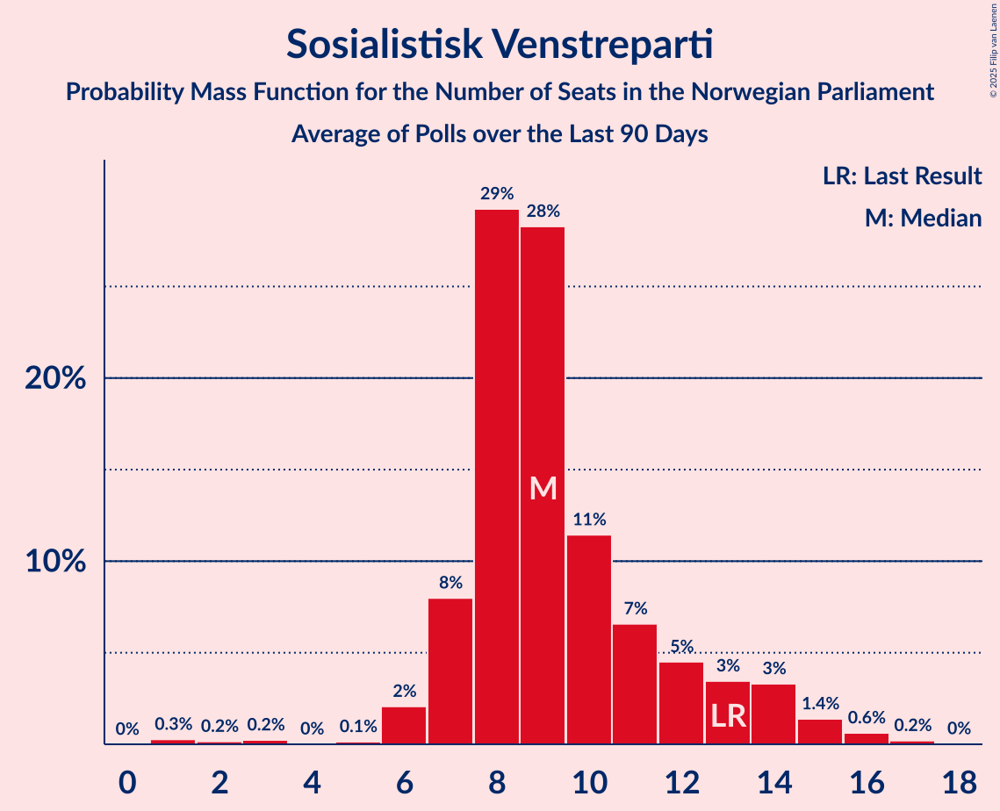

# Poll Average

<a href="#voting-intentions">Voting Intentions</a> | <a href="#seats">Seats</a> | <a href="#coalitions">Coalitions</a> | <a href="#technical-information">Technical Information</a>

## Summary

The table below lists the polls on which the average is based. They are the most recent polls (less than 90 days old) registered and analyzed so far.

| Period     | Polling firm/Commissioner(s) | Ap | H | FrP | Sp | SV | V | KrF | MDG | R |
|:----------:|:----------------------------:|:--:|:--:|:--:|:--:|:--:|:--:|:--:|:--:|:--:|
| 8–9 September 2013 | General Election | 27.4%   49 | 25.0%   45 | 15.2%   27 | 10.3%   19 | 6.0%   11 | 4.4%   8 | 4.2%   8 | 3.2%   1 | 2.4%   1 |
| N/A | Poll Average | 18–26%   31–48 | 21–29%   37–53 | 6–11%   10–19 | 17–24%   32–44 | 5–10%   8–17 | 2–5%   0–8 | 2–5%   0–9 | 2–7%   0–12 | 2–6%   1–12 |
| [1–8 February 2021](2021-02-08-OpinionPerduco.html) | Opinion Perduco   Avisenes Nyhetsbyrå, Dagsavisen and FriFagbevegelse | 22–27%   41–50 | 22–28%   41–53 | 7–10%   12–19 | 17–22%   31–41 | 6–9%   10–17 | 2–5%   1–8 | 2–5%   1–8 | 3–5%   1–10 | 2–4%   1–8 |
| [2–3 February 2021](2021-02-03-Norfakta.html) | Norfakta   Klassekampen and Nationen | 19–24%   35–43 | 25–30%   44–56 | 5–8%   9–14 | 17–22%   33–41 | 6–9%   11–17 | 3–5%   2–9 | 2–4%   0–3 | 4–7%   2–11 | 3–5%   2–9 |
| [27 January–2 February 2021](2021-02-02-ResponsAnalyse.html) | Respons Analyse   VG | 20–26%   36–48 | 24–29%   42–54 | 7–11%   12–19 | 16–21%   30–40 | 6–9%   11–16 | 1–3%   0–2 | 2–5%   1–8 | 3–5%   1–9 | 3–6%   2–10 |
| [25–31 January 2021](2021-01-31-Norstat.html) | Norstat   Aftenposten and NRK | 18–24%   33–44 | 20–26%   35–48 | 7–11%   11–18 | 19–25%   36–45 | 7–11%   12–20 | 2–4%   0–2 | 2–5%   1–8 | 3–7%   2–11 | 3–6%   2–10 |
| [25–29 January 2021](2021-01-29-KantarTNS.html) | Kantar TNS   TV2 | 17–23%   30–42 | 22–29%   39–53 | 6–10%   9–17 | 17–23%   34–44 | 4–8%   7–13 | 3–6%   2–10 | 2–4%   0–6 | 4–7%   2–11 | 4–7%   2–12 |
| [25–27 January 2021](2021-01-27-IpsosMMI.html) | Ipsos MMI   Dagbladet | 18–24%   32–42 | 22–29%   41–53 | 8–12%   14–21 | 19–25%   35–46 | 6–10%   11–18 | 2–4%   1–6 | 2–4%   0–7 | 1–3%   0–1 | 4–7%   2–13 |
| [12–16 January 2021](2021-01-16-Sentio.html) | Sentio   Amedia and Nettavisen | 19–24%   35–44 | 20–26%   36–44 | 7–10%   11–18 | 17–22%   33–42 | 6–10%   10–16 | 2–4%   1–2 | 2–4%   0–7 | 5–8%   8–13 | 2–5%   1–7 |
| [13 January 2021](2021-01-13-InFact.html) | InFact   Amedia and Nettavisen | 17–20%   30–37 | 23–26%   39–46 | 8–10%   12–17 | 19–22%   36–43 | 8–10%   13–17 | 2–3%   0–2 | 4–6%   3–10 | 5–7%   9–11 | 3–5%   2–8 |
| 8–9 September 2013 | General Election | 27.4%   49 | 25.0%   45 | 15.2%   27 | 10.3%   19 | 6.0%   11 | 4.4%   8 | 4.2%   8 | 3.2%   1 | 2.4%   1 |

Only polls for which at least the sample size has been published are included in the table above.

**Legend:**
+ **Top half of each row:** Voting intentions (95% confidence interval)
+ **Bottom half of each row:** Seat projections for the Norwegian Parliament (95% confidence interval)
+ **Ap:** Arbeiderpartiet
+ **H:** Høyre
+ **FrP:** Fremskrittspartiet
+ **Sp:** Senterpartiet
+ **SV:** Sosialistisk Venstreparti
+ **V:** Venstre
+ **KrF:** Kristelig Folkeparti
+ **MDG:** Miljøpartiet De Grønne
+ **R:** Rødt
+ **N/A (single party):** Party not included the published results
+ **N/A (entire row):** Calculation for this opinion poll not started yet

## Voting Intentions

### Confidence Intervals

| Party | Last Result | Median | 80% Confidence Interval | 90% Confidence Interval | 95% Confidence Interval | 99% Confidence Interval |
|:-----:|:-----------:|:------:|:-----------------------:|:-----------------------:|:-----------------------:|:-----------------------:|
| <a href="#arbeiderpartiet">Arbeiderpartiet</a> | 27.4% | 21.1% | 18.4–24.3% |17.9–25.2% | 17.6–25.9% | 16.9–27.1% |
| <a href="#høyre">Høyre</a> | 25.0% | 24.9% | 22.4–27.6% |21.7–28.3% | 21.1–28.9% | 20.0–30.0% |
| <a href="#fremskrittspartiet">Fremskrittspartiet</a> | 15.2% | 8.4% | 6.7–9.8% |6.1–10.3% | 5.8–10.8% | 5.2–11.7% |
| <a href="#senterpartiet">Senterpartiet</a> | 10.3% | 20.1% | 18.1–22.4% |17.6–23.1% | 17.2–23.8% | 16.4–25.1% |
| <a href="#sosialistisk-venstreparti">Sosialistisk Venstreparti</a> | 6.0% | 7.7% | 6.2–9.1% |5.7–9.4% | 5.3–9.8% | 4.6–10.5% |
| <a href="#venstre">Venstre</a> | 4.4% | 2.8% | 1.9–4.4% |1.7–4.8% | 1.5–5.1% | 1.3–5.8% |
| <a href="#kristelig-folkeparti">Kristelig Folkeparti</a> | 4.2% | 3.2% | 2.4–4.6% |2.2–4.9% | 2.0–5.1% | 1.7–5.5% |
| <a href="#miljøpartiet-de-grønne">Miljøpartiet De Grønne</a> | 3.2% | 4.8% | 2.3–6.4% |1.7–6.8% | 1.5–7.2% | 1.1–7.9% |
| <a href="#rødt">Rødt</a> | 2.4% | 4.1% | 2.9–5.6% |2.7–6.1% | 2.4–6.5% | 2.1–7.2% |

### Arbeiderpartiet

*For a full overview of the results for this party, see the [Arbeiderpartiet](party-arbeiderpartiet.html) page.*

| Voting Intentions | Probability | Accumulated | Special Marks |
|:-----------------:|:-----------:|:-----------:|:-------------:|
| 14.5–15.5% | 0% | 100% |  |
| 15.5–16.5% | 0.2% | 100% |  |
| 16.5–17.5% | 2% | 99.8% |  |
| 17.5–18.5% | 9% | 98% |  |
| 18.5–19.5% | 13% | 88% |  |
| 19.5–20.5% | 15% | 75% |  |
| 20.5–21.5% | 18% | 60% | Median |
| 21.5–22.5% | 16% | 42% |  |
| 22.5–23.5% | 11% | 27% |  |
| 23.5–24.5% | 7% | 16% |  |
| 24.5–25.5% | 5% | 8% |  |
| 25.5–26.5% | 2% | 4% |  |
| 26.5–27.5% | 0.9% | 1.1% | Last Result |
| 27.5–28.5% | 0.2% | 0.2% |  |
| 28.5–29.5% | 0% | 0% |  |

### Høyre

*For a full overview of the results for this party, see the [Høyre](party-høyre.html) page.*

| Voting Intentions | Probability | Accumulated | Special Marks |
|:-----------------:|:-----------:|:-----------:|:-------------:|
| 17.5–18.5% | 0% | 100% |  |
| 18.5–19.5% | 0.2% | 100% |  |
| 19.5–20.5% | 1.0% | 99.8% |  |
| 20.5–21.5% | 3% | 98.8% |  |
| 21.5–22.5% | 7% | 96% |  |
| 22.5–23.5% | 13% | 89% |  |
| 23.5–24.5% | 20% | 76% |  |
| 24.5–25.5% | 18% | 56% | Last Result, Median |
| 25.5–26.5% | 15% | 38% |  |
| 26.5–27.5% | 12% | 22% |  |
| 27.5–28.5% | 7% | 11% |  |
| 28.5–29.5% | 3% | 4% |  |
| 29.5–30.5% | 0.9% | 1.1% |  |
| 30.5–31.5% | 0.2% | 0.2% |  |
| 31.5–32.5% | 0% | 0% |  |

### Fremskrittspartiet

*For a full overview of the results for this party, see the [Fremskrittspartiet](party-fremskrittspartiet.html) page.*

| Voting Intentions | Probability | Accumulated | Special Marks |
|:-----------------:|:-----------:|:-----------:|:-------------:|
| 3.5–4.5% | 0% | 100% |  |
| 4.5–5.5% | 1.4% | 100% |  |
| 5.5–6.5% | 7% | 98.5% |  |
| 6.5–7.5% | 16% | 91% |  |
| 7.5–8.5% | 32% | 75% | Median |
| 8.5–9.5% | 29% | 43% |  |
| 9.5–10.5% | 10% | 14% |  |
| 10.5–11.5% | 3% | 4% |  |
| 11.5–12.5% | 0.6% | 0.6% |  |
| 12.5–13.5% | 0.1% | 0.1% |  |
| 13.5–14.5% | 0% | 0% |  |
| 14.5–15.5% | 0% | 0% | Last Result |

### Senterpartiet

*For a full overview of the results for this party, see the [Senterpartiet](party-senterpartiet.html) page.*

| Voting Intentions | Probability | Accumulated | Special Marks |
|:-----------------:|:-----------:|:-----------:|:-------------:|
| 9.5–10.5% | 0% | 100% | Last Result |
| 10.5–11.5% | 0% | 100% |  |
| 11.5–12.5% | 0% | 100% |  |
| 12.5–13.5% | 0% | 100% |  |
| 13.5–14.5% | 0% | 100% |  |
| 14.5–15.5% | 0.1% | 100% |  |
| 15.5–16.5% | 0.7% | 99.9% |  |
| 16.5–17.5% | 4% | 99.2% |  |
| 17.5–18.5% | 11% | 95% |  |
| 18.5–19.5% | 20% | 84% |  |
| 19.5–20.5% | 25% | 64% | Median |
| 20.5–21.5% | 20% | 39% |  |
| 21.5–22.5% | 10% | 19% |  |
| 22.5–23.5% | 5% | 8% |  |
| 23.5–24.5% | 2% | 3% |  |
| 24.5–25.5% | 0.8% | 1.0% |  |
| 25.5–26.5% | 0.2% | 0.2% |  |
| 26.5–27.5% | 0% | 0% |  |

### Sosialistisk Venstreparti

*For a full overview of the results for this party, see the [Sosialistisk Venstreparti](party-sosialistiskvenstreparti.html) page.*

| Voting Intentions | Probability | Accumulated | Special Marks |
|:-----------------:|:-----------:|:-----------:|:-------------:|
| 2.5–3.5% | 0% | 100% |  |
| 3.5–4.5% | 0.4% | 100% |  |
| 4.5–5.5% | 4% | 99.6% |  |
| 5.5–6.5% | 12% | 96% | Last Result |
| 6.5–7.5% | 28% | 84% |  |
| 7.5–8.5% | 33% | 56% | Median |
| 8.5–9.5% | 19% | 23% |  |
| 9.5–10.5% | 3% | 4% |  |
| 10.5–11.5% | 0.4% | 0.5% |  |
| 11.5–12.5% | 0% | 0% |  |
| 12.5–13.5% | 0% | 0% |  |

### Venstre

*For a full overview of the results for this party, see the [Venstre](party-venstre.html) page.*

| Voting Intentions | Probability | Accumulated | Special Marks |
|:-----------------:|:-----------:|:-----------:|:-------------:|
| 0.0–0.5% | 0% | 100% |  |
| 0.5–1.5% | 3% | 100% |  |
| 1.5–2.5% | 39% | 97% |  |
| 2.5–3.5% | 31% | 58% | Median |
| 3.5–4.5% | 19% | 27% | Last Result |
| 4.5–5.5% | 7% | 7% |  |
| 5.5–6.5% | 0.8% | 0.9% |  |
| 6.5–7.5% | 0% | 0% |  |
| 7.5–8.5% | 0% | 0% |  |

### Kristelig Folkeparti

*For a full overview of the results for this party, see the [Kristelig Folkeparti](party-kristeligfolkeparti.html) page.*

| Voting Intentions | Probability | Accumulated | Special Marks |
|:-----------------:|:-----------:|:-----------:|:-------------:|
| 0.0–0.5% | 0% | 100% |  |
| 0.5–1.5% | 0.1% | 100% |  |
| 1.5–2.5% | 15% | 99.9% |  |
| 2.5–3.5% | 49% | 85% | Median |
| 3.5–4.5% | 25% | 36% | Last Result |
| 4.5–5.5% | 11% | 11% |  |
| 5.5–6.5% | 0.4% | 0.4% |  |
| 6.5–7.5% | 0% | 0% |  |

### Miljøpartiet De Grønne

*For a full overview of the results for this party, see the [Miljøpartiet De Grønne](party-miljøpartietdegrønne.html) page.*

| Voting Intentions | Probability | Accumulated | Special Marks |
|:-----------------:|:-----------:|:-----------:|:-------------:|
| 0.0–0.5% | 0% | 100% |  |
| 0.5–1.5% | 3% | 100% |  |
| 1.5–2.5% | 8% | 97% |  |
| 2.5–3.5% | 8% | 89% | Last Result |
| 3.5–4.5% | 24% | 81% |  |
| 4.5–5.5% | 27% | 57% | Median |
| 5.5–6.5% | 23% | 30% |  |
| 6.5–7.5% | 6% | 7% |  |
| 7.5–8.5% | 1.1% | 1.2% |  |
| 8.5–9.5% | 0.1% | 0.1% |  |
| 9.5–10.5% | 0% | 0% |  |

### Rødt

*For a full overview of the results for this party, see the [Rødt](party-rødt.html) page.*

| Voting Intentions | Probability | Accumulated | Special Marks |
|:-----------------:|:-----------:|:-----------:|:-------------:|
| 0.5–1.5% | 0% | 100% |  |
| 1.5–2.5% | 4% | 100% | Last Result |
| 2.5–3.5% | 24% | 96% |  |
| 3.5–4.5% | 41% | 72% | Median |
| 4.5–5.5% | 20% | 31% |  |
| 5.5–6.5% | 9% | 11% |  |
| 6.5–7.5% | 2% | 2% |  |
| 7.5–8.5% | 0.2% | 0.2% |  |
| 8.5–9.5% | 0% | 0% |  |

## Seats

### Confidence Intervals

| Party | Last Result | Median | 80% Confidence Interval | 90% Confidence Interval | 95% Confidence Interval | 99% Confidence Interval |
|:-----:|:-----------:|:------:|:-----------------------:|:-----------------------:|:-----------------------:|:-----------------------:|
| <a href="#arbeiderpartiet">Arbeiderpartiet</a> | 49 | 39 | 33–44 |32–47 | 31–48 | 29–50 |
| <a href="#høyre">Høyre</a> | 45 | 45 | 39–50 |38–52 | 37–53 | 35–56 |
| <a href="#fremskrittspartiet">Fremskrittspartiet</a> | 27 | 14 | 11–18 |10–18 | 10–19 | 8–21 |
| <a href="#senterpartiet">Senterpartiet</a> | 19 | 37 | 35–42 |33–43 | 32–44 | 30–46 |
| <a href="#sosialistisk-venstreparti">Sosialistisk Venstreparti</a> | 11 | 14 | 11–16 |9–17 | 8–17 | 7–20 |
| <a href="#venstre">Venstre</a> | 8 | 2 | 1–7 |0–8 | 0–8 | 0–10 |
| <a href="#kristelig-folkeparti">Kristelig Folkeparti</a> | 8 | 2 | 1–8 |0–9 | 0–9 | 0–10 |
| <a href="#miljøpartiet-de-grønne">Miljøpartiet De Grønne</a> | 1 | 8 | 1–11 |0–11 | 0–12 | 0–13 |
| <a href="#rødt">Rødt</a> | 1 | 7 | 2–10 |1–11 | 1–12 | 1–13 |

### Arbeiderpartiet

*For a full overview of the results for this party, see the [Arbeiderpartiet](party-arbeiderpartiet.html) page.*

| Number of Seats | Probability | Accumulated | Special Marks |
|:---------------:|:-----------:|:-----------:|:-------------:|
| 27 | 0.1% | 100% |  |
| 28 | 0.1% | 99.9% |  |
| 29 | 0.4% | 99.8% |  |
| 30 | 1.3% | 99.5% |  |
| 31 | 1.5% | 98% |  |
| 32 | 4% | 97% |  |
| 33 | 4% | 93% |  |
| 34 | 6% | 89% |  |
| 35 | 5% | 83% |  |
| 36 | 5% | 77% |  |
| 37 | 5% | 72% |  |
| 38 | 11% | 67% |  |
| 39 | 7% | 56% | Median |
| 40 | 11% | 49% |  |
| 41 | 10% | 38% |  |
| 42 | 8% | 28% |  |
| 43 | 9% | 19% |  |
| 44 | 2% | 11% |  |
| 45 | 2% | 9% |  |
| 46 | 1.0% | 7% |  |
| 47 | 2% | 6% |  |
| 48 | 2% | 4% |  |
| 49 | 1.1% | 2% | Last Result |
| 50 | 0.5% | 0.7% |  |
| 51 | 0.1% | 0.2% |  |
| 52 | 0.1% | 0.1% |  |
| 53 | 0% | 0.1% |  |
| 54 | 0% | 0% |  |

### Høyre

*For a full overview of the results for this party, see the [Høyre](party-høyre.html) page.*

| Number of Seats | Probability | Accumulated | Special Marks |
|:---------------:|:-----------:|:-----------:|:-------------:|
| 33 | 0% | 100% |  |
| 34 | 0.1% | 99.9% |  |
| 35 | 0.5% | 99.8% |  |
| 36 | 2% | 99.4% |  |
| 37 | 1.0% | 98% |  |
| 38 | 4% | 97% |  |
| 39 | 5% | 93% |  |
| 40 | 8% | 88% |  |
| 41 | 5% | 80% |  |
| 42 | 8% | 75% |  |
| 43 | 10% | 67% |  |
| 44 | 5% | 57% |  |
| 45 | 9% | 52% | Last Result, Median |
| 46 | 8% | 42% |  |
| 47 | 6% | 35% |  |
| 48 | 6% | 29% |  |
| 49 | 6% | 23% |  |
| 50 | 8% | 18% |  |
| 51 | 3% | 10% |  |
| 52 | 2% | 6% |  |
| 53 | 2% | 4% |  |
| 54 | 0.9% | 2% |  |
| 55 | 0.2% | 1.3% |  |
| 56 | 1.0% | 1.1% |  |
| 57 | 0% | 0.1% |  |
| 58 | 0% | 0% |  |

### Fremskrittspartiet

*For a full overview of the results for this party, see the [Fremskrittspartiet](party-fremskrittspartiet.html) page.*

| Number of Seats | Probability | Accumulated | Special Marks |
|:---------------:|:-----------:|:-----------:|:-------------:|
| 7 | 0.1% | 100% |  |
| 8 | 0.5% | 99.9% |  |
| 9 | 1.3% | 99.4% |  |
| 10 | 4% | 98% |  |
| 11 | 7% | 94% |  |
| 12 | 6% | 88% |  |
| 13 | 12% | 81% |  |
| 14 | 21% | 70% | Median |
| 15 | 16% | 49% |  |
| 16 | 9% | 33% |  |
| 17 | 12% | 24% |  |
| 18 | 10% | 12% |  |
| 19 | 1.2% | 3% |  |
| 20 | 0.9% | 1.4% |  |
| 21 | 0.2% | 0.5% |  |
| 22 | 0.3% | 0.3% |  |
| 23 | 0% | 0.1% |  |
| 24 | 0% | 0% |  |
| 25 | 0% | 0% |  |
| 26 | 0% | 0% |  |
| 27 | 0% | 0% | Last Result |

### Senterpartiet

*For a full overview of the results for this party, see the [Senterpartiet](party-senterpartiet.html) page.*

| Number of Seats | Probability | Accumulated | Special Marks |
|:---------------:|:-----------:|:-----------:|:-------------:|
| 19 | 0% | 100% | Last Result |
| 20 | 0% | 100% |  |
| 21 | 0% | 100% |  |
| 22 | 0% | 100% |  |
| 23 | 0% | 100% |  |
| 24 | 0% | 100% |  |
| 25 | 0% | 100% |  |
| 26 | 0% | 100% |  |
| 27 | 0% | 100% |  |
| 28 | 0.1% | 100% |  |
| 29 | 0.1% | 99.9% |  |
| 30 | 0.6% | 99.8% |  |
| 31 | 0.9% | 99.3% |  |
| 32 | 1.0% | 98% |  |
| 33 | 3% | 97% |  |
| 34 | 4% | 95% |  |
| 35 | 11% | 91% |  |
| 36 | 18% | 80% |  |
| 37 | 16% | 62% | Median |
| 38 | 10% | 46% |  |
| 39 | 7% | 36% |  |
| 40 | 7% | 28% |  |
| 41 | 9% | 21% |  |
| 42 | 5% | 12% |  |
| 43 | 2% | 7% |  |
| 44 | 3% | 5% |  |
| 45 | 1.2% | 2% |  |
| 46 | 0.5% | 0.8% |  |
| 47 | 0.1% | 0.2% |  |
| 48 | 0% | 0.1% |  |
| 49 | 0% | 0.1% |  |
| 50 | 0% | 0% |  |

### Sosialistisk Venstreparti

*For a full overview of the results for this party, see the [Sosialistisk Venstreparti](party-sosialistiskvenstreparti.html) page.*

| Number of Seats | Probability | Accumulated | Special Marks |
|:---------------:|:-----------:|:-----------:|:-------------:|
| 3 | 0% | 100% |  |
| 4 | 0% | 99.9% |  |
| 5 | 0% | 99.9% |  |
| 6 | 0.2% | 99.9% |  |
| 7 | 0.8% | 99.7% |  |
| 8 | 2% | 99.0% |  |
| 9 | 3% | 97% |  |
| 10 | 4% | 94% |  |
| 11 | 11% | 90% | Last Result |
| 12 | 12% | 79% |  |
| 13 | 12% | 67% |  |
| 14 | 18% | 55% | Median |
| 15 | 19% | 37% |  |
| 16 | 9% | 19% |  |
| 17 | 7% | 9% |  |
| 18 | 1.0% | 2% |  |
| 19 | 0.4% | 1.1% |  |
| 20 | 0.6% | 0.7% |  |
| 21 | 0% | 0% |  |

### Venstre

*For a full overview of the results for this party, see the [Venstre](party-venstre.html) page.*

| Number of Seats | Probability | Accumulated | Special Marks |
|:---------------:|:-----------:|:-----------:|:-------------:|
| 0 | 8% | 100% |  |
| 1 | 23% | 92% |  |
| 2 | 52% | 70% | Median |
| 3 | 1.4% | 18% |  |
| 4 | 0% | 17% |  |
| 5 | 0% | 17% |  |
| 6 | 1.4% | 17% |  |
| 7 | 6% | 15% |  |
| 8 | 8% | 9% | Last Result |
| 9 | 1.3% | 2% |  |
| 10 | 0.4% | 0.5% |  |
| 11 | 0.1% | 0.1% |  |
| 12 | 0% | 0% |  |

### Kristelig Folkeparti

*For a full overview of the results for this party, see the [Kristelig Folkeparti](party-kristeligfolkeparti.html) page.*

| Number of Seats | Probability | Accumulated | Special Marks |
|:---------------:|:-----------:|:-----------:|:-------------:|
| 0 | 8% | 100% |  |
| 1 | 31% | 92% |  |
| 2 | 18% | 61% | Median |
| 3 | 24% | 43% |  |
| 4 | 0% | 19% |  |
| 5 | 0% | 19% |  |
| 6 | 0.6% | 19% |  |
| 7 | 4% | 18% |  |
| 8 | 8% | 14% | Last Result |
| 9 | 5% | 6% |  |
| 10 | 0.9% | 0.9% |  |
| 11 | 0% | 0% |  |

### Miljøpartiet De Grønne

*For a full overview of the results for this party, see the [Miljøpartiet De Grønne](party-miljøpartietdegrønne.html) page.*

| Number of Seats | Probability | Accumulated | Special Marks |
|:---------------:|:-----------:|:-----------:|:-------------:|
| 0 | 6% | 100% |  |
| 1 | 7% | 94% | Last Result |
| 2 | 13% | 87% |  |
| 3 | 5% | 74% |  |
| 4 | 2% | 69% |  |
| 5 | 0% | 67% |  |
| 6 | 0.7% | 67% |  |
| 7 | 6% | 67% |  |
| 8 | 13% | 61% | Median |
| 9 | 17% | 48% |  |
| 10 | 18% | 31% |  |
| 11 | 11% | 14% |  |
| 12 | 2% | 3% |  |
| 13 | 0.7% | 1.0% |  |
| 14 | 0.2% | 0.2% |  |
| 15 | 0% | 0.1% |  |
| 16 | 0% | 0% |  |

### Rødt

*For a full overview of the results for this party, see the [Rødt](party-rødt.html) page.*

| Number of Seats | Probability | Accumulated | Special Marks |
|:---------------:|:-----------:|:-----------:|:-------------:|
| 1 | 7% | 100% | Last Result |
| 2 | 40% | 93% |  |
| 3 | 0.1% | 53% |  |
| 4 | 0% | 53% |  |
| 5 | 0% | 53% |  |
| 6 | 1.1% | 53% |  |
| 7 | 14% | 52% | Median |
| 8 | 15% | 37% |  |
| 9 | 9% | 23% |  |
| 10 | 6% | 13% |  |
| 11 | 3% | 7% |  |
| 12 | 3% | 4% |  |
| 13 | 0.5% | 0.7% |  |
| 14 | 0.1% | 0.2% |  |
| 15 | 0.1% | 0.1% |  |
| 16 | 0% | 0% |  |

## Coalitions

### Confidence Intervals

| Coalition | Last Result | Median | Majority? | 80% Confidence Interval | 90% Confidence Interval | 95% Confidence Interval | 99% Confidence Interval |
|:---------:|:-----------:|:------:|:---------:|:-----------------------:|:-----------------------:|:-----------------------:|:-----------------------:|
| Høyre – Fremskrittspartiet – Senterpartiet – Venstre – Kristelig Folkeparti | 107 | 103 | 100% | 95–109 | 93–110 | 92–111 | 90–113 |
| Arbeiderpartiet – Senterpartiet – Sosialistisk Venstreparti – Miljøpartiet De Grønne – Rødt | 81 | 103 | 100% | 97–107 | 96–109 | 95–110 | 92–113 |
| Arbeiderpartiet – Senterpartiet – Sosialistisk Venstreparti – Kristelig Folkeparti – Miljøpartiet De Grønne | 88 | 100 | 99.7% | 93–107 | 90–109 | 89–109 | 86–112 |
| Arbeiderpartiet – Senterpartiet – Sosialistisk Venstreparti – Miljøpartiet De Grønne | 80 | 97 | 99.4% | 91–103 | 88–105 | 87–106 | 84–109 |
| Arbeiderpartiet – Senterpartiet – Sosialistisk Venstreparti – Rødt | 80 | 95 | 99.6% | 90–102 | 88–105 | 87–106 | 85–108 |
| Arbeiderpartiet – Senterpartiet – Sosialistisk Venstreparti | 79 | 91 | 90% | 84–97 | 83–99 | 81–100 | 78–103 |
| Arbeiderpartiet – Senterpartiet – Kristelig Folkeparti – Miljøpartiet De Grønne | 77 | 87 | 70% | 80–93 | 77–94 | 75–96 | 72–98 |
| Arbeiderpartiet – Senterpartiet – Kristelig Folkeparti | 76 | 79 | 11% | 75–85 | 74–87 | 72–88 | 69–91 |
| Arbeiderpartiet – Senterpartiet | 68 | 77 | 4% | 72–82 | 70–84 | 69–85 | 67–87 |
| Høyre – Fremskrittspartiet – Venstre – Kristelig Folkeparti – Miljøpartiet De Grønne | 89 | 72 | 0.1% | 65–78 | 64–80 | 63–81 | 60–82 |
| Høyre – Fremskrittspartiet – Venstre – Kristelig Folkeparti | 88 | 65 | 0% | 58–72 | 55–72 | 55–74 | 53–76 |
| Høyre – Fremskrittspartiet – Venstre | 80 | 62 | 0% | 55–69 | 53–70 | 53–71 | 50–73 |
| Høyre – Fremskrittspartiet | 72 | 59 | 0% | 53–66 | 52–67 | 51–69 | 48–71 |
| Arbeiderpartiet – Sosialistisk Venstreparti | 60 | 53 | 0% | 47–58 | 45–61 | 44–62 | 39–64 |
| Høyre – Venstre – Kristelig Folkeparti | 61 | 50 | 0% | 43–57 | 42–59 | 40–61 | 39–62 |
| Senterpartiet – Venstre – Kristelig Folkeparti | 35 | 43 | 0% | 38–49 | 37–50 | 36–51 | 33–54 |

### Høyre – Fremskrittspartiet – Senterpartiet – Venstre – Kristelig Folkeparti

| Number of Seats | Probability | Accumulated | Special Marks |
|:---------------:|:-----------:|:-----------:|:-------------:|
| 88 | 0.2% | 100% |  |
| 89 | 0.1% | 99.7% |  |
| 90 | 0.3% | 99.7% |  |
| 91 | 0.2% | 99.4% |  |
| 92 | 2% | 99.2% |  |
| 93 | 3% | 97% |  |
| 94 | 2% | 94% |  |
| 95 | 3% | 92% |  |
| 96 | 3% | 89% |  |
| 97 | 2% | 86% |  |
| 98 | 3% | 84% |  |
| 99 | 3% | 81% |  |
| 100 | 7% | 78% | Median |
| 101 | 6% | 71% |  |
| 102 | 8% | 66% |  |
| 103 | 13% | 58% |  |
| 104 | 9% | 45% |  |
| 105 | 9% | 36% |  |
| 106 | 6% | 27% |  |
| 107 | 7% | 20% | Last Result |
| 108 | 3% | 14% |  |
| 109 | 3% | 10% |  |
| 110 | 4% | 8% |  |
| 111 | 1.5% | 3% |  |
| 112 | 0.9% | 2% |  |
| 113 | 0.5% | 1.0% |  |
| 114 | 0.1% | 0.5% |  |
| 115 | 0% | 0.3% |  |
| 116 | 0.2% | 0.3% |  |
| 117 | 0.1% | 0.1% |  |
| 118 | 0% | 0% |  |

### Arbeiderpartiet – Senterpartiet – Sosialistisk Venstreparti – Miljøpartiet De Grønne – Rødt

| Number of Seats | Probability | Accumulated | Special Marks |
|:---------------:|:-----------:|:-----------:|:-------------:|
| 81 | 0% | 100% | Last Result |
| 82 | 0% | 100% |  |
| 83 | 0% | 100% |  |
| 84 | 0% | 100% |  |
| 85 | 0% | 100% | Majority |
| 86 | 0% | 100% |  |
| 87 | 0% | 100% |  |
| 88 | 0% | 100% |  |
| 89 | 0% | 99.9% |  |
| 90 | 0.1% | 99.9% |  |
| 91 | 0.2% | 99.8% |  |
| 92 | 0.5% | 99.6% |  |
| 93 | 0.4% | 99.2% |  |
| 94 | 0.7% | 98.7% |  |
| 95 | 2% | 98% |  |
| 96 | 2% | 96% |  |
| 97 | 7% | 94% |  |
| 98 | 3% | 87% |  |
| 99 | 7% | 84% |  |
| 100 | 6% | 77% |  |
| 101 | 8% | 71% |  |
| 102 | 11% | 64% |  |
| 103 | 10% | 53% |  |
| 104 | 12% | 42% |  |
| 105 | 6% | 30% | Median |
| 106 | 5% | 24% |  |
| 107 | 11% | 19% |  |
| 108 | 3% | 9% |  |
| 109 | 1.2% | 6% |  |
| 110 | 3% | 5% |  |
| 111 | 0.8% | 2% |  |
| 112 | 0.6% | 1.3% |  |
| 113 | 0.3% | 0.6% |  |
| 114 | 0.2% | 0.3% |  |
| 115 | 0.1% | 0.1% |  |
| 116 | 0% | 0.1% |  |
| 117 | 0% | 0% |  |

### Arbeiderpartiet – Senterpartiet – Sosialistisk Venstreparti – Kristelig Folkeparti – Miljøpartiet De Grønne

| Number of Seats | Probability | Accumulated | Special Marks |
|:---------------:|:-----------:|:-----------:|:-------------:|
| 82 | 0% | 100% |  |
| 83 | 0.1% | 99.9% |  |
| 84 | 0.1% | 99.9% |  |
| 85 | 0.2% | 99.7% | Majority |
| 86 | 0.2% | 99.5% |  |
| 87 | 0.9% | 99.3% |  |
| 88 | 0.7% | 98% | Last Result |
| 89 | 1.0% | 98% |  |
| 90 | 2% | 97% |  |
| 91 | 2% | 95% |  |
| 92 | 3% | 93% |  |
| 93 | 3% | 90% |  |
| 94 | 5% | 87% |  |
| 95 | 3% | 82% |  |
| 96 | 6% | 79% |  |
| 97 | 5% | 73% |  |
| 98 | 6% | 68% |  |
| 99 | 8% | 62% |  |
| 100 | 5% | 54% | Median |
| 101 | 3% | 49% |  |
| 102 | 11% | 46% |  |
| 103 | 5% | 35% |  |
| 104 | 7% | 30% |  |
| 105 | 3% | 23% |  |
| 106 | 6% | 20% |  |
| 107 | 4% | 14% |  |
| 108 | 4% | 10% |  |
| 109 | 3% | 5% |  |
| 110 | 1.1% | 2% |  |
| 111 | 0.7% | 1.4% |  |
| 112 | 0.4% | 0.7% |  |
| 113 | 0.1% | 0.2% |  |
| 114 | 0.1% | 0.2% |  |
| 115 | 0% | 0.1% |  |
| 116 | 0% | 0.1% |  |
| 117 | 0% | 0% |  |

### Arbeiderpartiet – Senterpartiet – Sosialistisk Venstreparti – Miljøpartiet De Grønne

| Number of Seats | Probability | Accumulated | Special Marks |
|:---------------:|:-----------:|:-----------:|:-------------:|
| 80 | 0% | 100% | Last Result |
| 81 | 0.1% | 100% |  |
| 82 | 0.1% | 99.9% |  |
| 83 | 0.2% | 99.8% |  |
| 84 | 0.3% | 99.7% |  |
| 85 | 0.8% | 99.4% | Majority |
| 86 | 0.8% | 98.6% |  |
| 87 | 1.4% | 98% |  |
| 88 | 2% | 96% |  |
| 89 | 2% | 95% |  |
| 90 | 2% | 93% |  |
| 91 | 4% | 91% |  |
| 92 | 3% | 87% |  |
| 93 | 6% | 84% |  |
| 94 | 7% | 78% |  |
| 95 | 9% | 71% |  |
| 96 | 7% | 62% |  |
| 97 | 8% | 56% |  |
| 98 | 5% | 48% | Median |
| 99 | 7% | 43% |  |
| 100 | 9% | 35% |  |
| 101 | 6% | 27% |  |
| 102 | 6% | 20% |  |
| 103 | 4% | 14% |  |
| 104 | 3% | 10% |  |
| 105 | 3% | 7% |  |
| 106 | 1.1% | 3% |  |
| 107 | 0.3% | 2% |  |
| 108 | 1.0% | 2% |  |
| 109 | 0.7% | 1.0% |  |
| 110 | 0.2% | 0.3% |  |
| 111 | 0.1% | 0.1% |  |
| 112 | 0% | 0% |  |

### Arbeiderpartiet – Senterpartiet – Sosialistisk Venstreparti – Rødt

| Number of Seats | Probability | Accumulated | Special Marks |
|:---------------:|:-----------:|:-----------:|:-------------:|
| 80 | 0% | 100% | Last Result |
| 81 | 0% | 100% |  |
| 82 | 0.1% | 100% |  |
| 83 | 0.1% | 99.9% |  |
| 84 | 0.1% | 99.8% |  |
| 85 | 0.4% | 99.6% | Majority |
| 86 | 0.5% | 99.3% |  |
| 87 | 2% | 98.8% |  |
| 88 | 3% | 97% |  |
| 89 | 3% | 94% |  |
| 90 | 3% | 91% |  |
| 91 | 6% | 87% |  |
| 92 | 7% | 81% |  |
| 93 | 11% | 74% |  |
| 94 | 8% | 63% |  |
| 95 | 8% | 55% |  |
| 96 | 6% | 48% |  |
| 97 | 9% | 42% | Median |
| 98 | 5% | 34% |  |
| 99 | 5% | 29% |  |
| 100 | 6% | 24% |  |
| 101 | 4% | 18% |  |
| 102 | 4% | 14% |  |
| 103 | 2% | 9% |  |
| 104 | 1.1% | 7% |  |
| 105 | 2% | 6% |  |
| 106 | 2% | 4% |  |
| 107 | 0.3% | 1.5% |  |
| 108 | 1.0% | 1.2% |  |
| 109 | 0.1% | 0.1% |  |
| 110 | 0% | 0% |  |

### Arbeiderpartiet – Senterpartiet – Sosialistisk Venstreparti

| Number of Seats | Probability | Accumulated | Special Marks |
|:---------------:|:-----------:|:-----------:|:-------------:|
| 74 | 0% | 100% |  |
| 75 | 0.1% | 99.9% |  |
| 76 | 0.1% | 99.9% |  |
| 77 | 0.1% | 99.8% |  |
| 78 | 0.4% | 99.6% |  |
| 79 | 0.4% | 99.2% | Last Result |
| 80 | 0.6% | 98.8% |  |
| 81 | 0.7% | 98% |  |
| 82 | 1.3% | 97% |  |
| 83 | 2% | 96% |  |
| 84 | 5% | 95% |  |
| 85 | 5% | 90% | Majority |
| 86 | 6% | 85% |  |
| 87 | 6% | 79% |  |
| 88 | 6% | 73% |  |
| 89 | 7% | 67% |  |
| 90 | 9% | 60% | Median |
| 91 | 14% | 51% |  |
| 92 | 8% | 37% |  |
| 93 | 6% | 29% |  |
| 94 | 7% | 24% |  |
| 95 | 4% | 17% |  |
| 96 | 3% | 13% |  |
| 97 | 3% | 10% |  |
| 98 | 2% | 7% |  |
| 99 | 2% | 5% |  |
| 100 | 2% | 4% |  |
| 101 | 0.8% | 1.4% |  |
| 102 | 0.1% | 0.6% |  |
| 103 | 0.4% | 0.5% |  |
| 104 | 0% | 0.1% |  |
| 105 | 0% | 0% |  |

### Arbeiderpartiet – Senterpartiet – Kristelig Folkeparti – Miljøpartiet De Grønne

| Number of Seats | Probability | Accumulated | Special Marks |
|:---------------:|:-----------:|:-----------:|:-------------:|
| 69 | 0% | 100% |  |
| 70 | 0% | 99.9% |  |
| 71 | 0.2% | 99.9% |  |
| 72 | 0.3% | 99.7% |  |
| 73 | 0.2% | 99.4% |  |
| 74 | 0.4% | 99.2% |  |
| 75 | 2% | 98.8% |  |
| 76 | 1.5% | 97% |  |
| 77 | 1.0% | 96% | Last Result |
| 78 | 1.4% | 94% |  |
| 79 | 1.3% | 93% |  |
| 80 | 3% | 92% |  |
| 81 | 5% | 88% |  |
| 82 | 3% | 83% |  |
| 83 | 5% | 81% |  |
| 84 | 5% | 75% |  |
| 85 | 9% | 70% | Majority |
| 86 | 8% | 61% | Median |
| 87 | 7% | 53% |  |
| 88 | 9% | 45% |  |
| 89 | 8% | 36% |  |
| 90 | 7% | 28% |  |
| 91 | 3% | 21% |  |
| 92 | 4% | 17% |  |
| 93 | 5% | 14% |  |
| 94 | 4% | 8% |  |
| 95 | 1.1% | 5% |  |
| 96 | 2% | 4% |  |
| 97 | 0.7% | 1.2% |  |
| 98 | 0.2% | 0.5% |  |
| 99 | 0.2% | 0.3% |  |
| 100 | 0% | 0.1% |  |
| 101 | 0% | 0.1% |  |
| 102 | 0% | 0% |  |

### Arbeiderpartiet – Senterpartiet – Kristelig Folkeparti

| Number of Seats | Probability | Accumulated | Special Marks |
|:---------------:|:-----------:|:-----------:|:-------------:|
| 66 | 0% | 100% |  |
| 67 | 0.1% | 99.9% |  |
| 68 | 0.1% | 99.9% |  |
| 69 | 0.6% | 99.8% |  |
| 70 | 0.4% | 99.2% |  |
| 71 | 0.6% | 98.8% |  |
| 72 | 1.4% | 98% |  |
| 73 | 1.3% | 97% |  |
| 74 | 4% | 95% |  |
| 75 | 5% | 92% |  |
| 76 | 8% | 86% | Last Result |
| 77 | 6% | 78% |  |
| 78 | 11% | 72% | Median |
| 79 | 12% | 61% |  |
| 80 | 7% | 49% |  |
| 81 | 9% | 42% |  |
| 82 | 6% | 33% |  |
| 83 | 12% | 27% |  |
| 84 | 4% | 15% |  |
| 85 | 2% | 11% | Majority |
| 86 | 3% | 9% |  |
| 87 | 2% | 5% |  |
| 88 | 2% | 3% |  |
| 89 | 0.6% | 2% |  |
| 90 | 0.2% | 1.0% |  |
| 91 | 0.4% | 0.8% |  |
| 92 | 0.2% | 0.4% |  |
| 93 | 0% | 0.2% |  |
| 94 | 0.2% | 0.2% |  |
| 95 | 0% | 0% |  |

### Arbeiderpartiet – Senterpartiet

| Number of Seats | Probability | Accumulated | Special Marks |
|:---------------:|:-----------:|:-----------:|:-------------:|
| 65 | 0.1% | 100% |  |
| 66 | 0.1% | 99.9% |  |
| 67 | 0.8% | 99.8% |  |
| 68 | 1.0% | 99.0% | Last Result |
| 69 | 1.2% | 98% |  |
| 70 | 3% | 97% |  |
| 71 | 2% | 93% |  |
| 72 | 4% | 91% |  |
| 73 | 7% | 87% |  |
| 74 | 8% | 79% |  |
| 75 | 7% | 72% |  |
| 76 | 11% | 64% | Median |
| 77 | 9% | 53% |  |
| 78 | 10% | 44% |  |
| 79 | 9% | 34% |  |
| 80 | 8% | 25% |  |
| 81 | 5% | 17% |  |
| 82 | 2% | 11% |  |
| 83 | 4% | 9% |  |
| 84 | 2% | 5% |  |
| 85 | 2% | 4% | Majority |
| 86 | 0.3% | 2% |  |
| 87 | 0.9% | 1.4% |  |
| 88 | 0.1% | 0.5% |  |
| 89 | 0.1% | 0.4% |  |
| 90 | 0.4% | 0.4% |  |
| 91 | 0% | 0% |  |

### Høyre – Fremskrittspartiet – Venstre – Kristelig Folkeparti – Miljøpartiet De Grønne

| Number of Seats | Probability | Accumulated | Special Marks |
|:---------------:|:-----------:|:-----------:|:-------------:|
| 57 | 0.1% | 100% |  |
| 58 | 0% | 99.9% |  |
| 59 | 0.1% | 99.9% |  |
| 60 | 0.4% | 99.8% |  |
| 61 | 1.2% | 99.5% |  |
| 62 | 0.5% | 98% |  |
| 63 | 3% | 98% |  |
| 64 | 3% | 95% |  |
| 65 | 3% | 92% |  |
| 66 | 5% | 89% |  |
| 67 | 9% | 84% |  |
| 68 | 6% | 75% |  |
| 69 | 7% | 69% |  |
| 70 | 6% | 62% |  |
| 71 | 6% | 56% | Median |
| 72 | 8% | 51% |  |
| 73 | 4% | 42% |  |
| 74 | 6% | 38% |  |
| 75 | 5% | 33% |  |
| 76 | 8% | 27% |  |
| 77 | 6% | 20% |  |
| 78 | 4% | 14% |  |
| 79 | 3% | 9% |  |
| 80 | 2% | 7% |  |
| 81 | 2% | 4% |  |
| 82 | 1.4% | 2% |  |
| 83 | 0.3% | 0.4% |  |
| 84 | 0.1% | 0.2% |  |
| 85 | 0% | 0.1% | Majority |
| 86 | 0% | 0% |  |
| 87 | 0% | 0% |  |
| 88 | 0% | 0% |  |
| 89 | 0% | 0% | Last Result |

### Høyre – Fremskrittspartiet – Venstre – Kristelig Folkeparti

| Number of Seats | Probability | Accumulated | Special Marks |
|:---------------:|:-----------:|:-----------:|:-------------:|
| 51 | 0.2% | 100% |  |
| 52 | 0.1% | 99.7% |  |
| 53 | 0.3% | 99.6% |  |
| 54 | 0.3% | 99.3% |  |
| 55 | 4% | 99.0% |  |
| 56 | 3% | 95% |  |
| 57 | 2% | 92% |  |
| 58 | 4% | 90% |  |
| 59 | 4% | 86% |  |
| 60 | 2% | 82% |  |
| 61 | 3% | 80% |  |
| 62 | 11% | 77% |  |
| 63 | 4% | 66% | Median |
| 64 | 4% | 62% |  |
| 65 | 8% | 57% |  |
| 66 | 9% | 50% |  |
| 67 | 10% | 40% |  |
| 68 | 7% | 30% |  |
| 69 | 5% | 23% |  |
| 70 | 6% | 18% |  |
| 71 | 2% | 13% |  |
| 72 | 6% | 10% |  |
| 73 | 2% | 4% |  |
| 74 | 2% | 3% |  |
| 75 | 0.4% | 1.1% |  |
| 76 | 0.3% | 0.6% |  |
| 77 | 0.2% | 0.4% |  |
| 78 | 0.1% | 0.1% |  |
| 79 | 0% | 0.1% |  |
| 80 | 0% | 0% |  |
| 81 | 0% | 0% |  |
| 82 | 0% | 0% |  |
| 83 | 0% | 0% |  |
| 84 | 0% | 0% |  |
| 85 | 0% | 0% | Majority |
| 86 | 0% | 0% |  |
| 87 | 0% | 0% |  |
| 88 | 0% | 0% | Last Result |

### Høyre – Fremskrittspartiet – Venstre

| Number of Seats | Probability | Accumulated | Special Marks |
|:---------------:|:-----------:|:-----------:|:-------------:|
| 48 | 0% | 100% |  |
| 49 | 0.3% | 99.9% |  |
| 50 | 0.4% | 99.7% |  |
| 51 | 0.3% | 99.3% |  |
| 52 | 0.4% | 98.9% |  |
| 53 | 4% | 98.5% |  |
| 54 | 3% | 95% |  |
| 55 | 5% | 91% |  |
| 56 | 4% | 86% |  |
| 57 | 4% | 82% |  |
| 58 | 7% | 78% |  |
| 59 | 7% | 71% |  |
| 60 | 6% | 64% |  |
| 61 | 6% | 58% | Median |
| 62 | 6% | 52% |  |
| 63 | 5% | 47% |  |
| 64 | 6% | 41% |  |
| 65 | 9% | 35% |  |
| 66 | 3% | 26% |  |
| 67 | 6% | 23% |  |
| 68 | 4% | 17% |  |
| 69 | 7% | 13% |  |
| 70 | 2% | 6% |  |
| 71 | 3% | 4% |  |
| 72 | 0.9% | 2% |  |
| 73 | 0.3% | 0.7% |  |
| 74 | 0.2% | 0.4% |  |
| 75 | 0.1% | 0.2% |  |
| 76 | 0.1% | 0.1% |  |
| 77 | 0% | 0% |  |
| 78 | 0% | 0% |  |
| 79 | 0% | 0% |  |
| 80 | 0% | 0% | Last Result |

### Høyre – Fremskrittspartiet

| Number of Seats | Probability | Accumulated | Special Marks |
|:---------------:|:-----------:|:-----------:|:-------------:|
| 46 | 0% | 100% |  |
| 47 | 0.3% | 99.9% |  |
| 48 | 0.5% | 99.7% |  |
| 49 | 0.3% | 99.2% |  |
| 50 | 0.5% | 98.9% |  |
| 51 | 2% | 98% |  |
| 52 | 4% | 97% |  |
| 53 | 7% | 93% |  |
| 54 | 5% | 86% |  |
| 55 | 4% | 81% |  |
| 56 | 7% | 77% |  |
| 57 | 8% | 70% |  |
| 58 | 7% | 62% |  |
| 59 | 7% | 55% | Median |
| 60 | 6% | 47% |  |
| 61 | 7% | 41% |  |
| 62 | 8% | 35% |  |
| 63 | 7% | 27% |  |
| 64 | 5% | 20% |  |
| 65 | 4% | 15% |  |
| 66 | 2% | 11% |  |
| 67 | 4% | 9% |  |
| 68 | 1.5% | 4% |  |
| 69 | 2% | 3% |  |
| 70 | 0.6% | 1.3% |  |
| 71 | 0.4% | 0.7% |  |
| 72 | 0.2% | 0.4% | Last Result |
| 73 | 0.1% | 0.1% |  |
| 74 | 0% | 0.1% |  |
| 75 | 0% | 0% |  |

### Arbeiderpartiet – Sosialistisk Venstreparti

| Number of Seats | Probability | Accumulated | Special Marks |
|:---------------:|:-----------:|:-----------:|:-------------:|
| 36 | 0% | 100% |  |
| 37 | 0.1% | 99.9% |  |
| 38 | 0.2% | 99.9% |  |
| 39 | 0.3% | 99.7% |  |
| 40 | 0.2% | 99.4% |  |
| 41 | 0.4% | 99.2% |  |
| 42 | 0.4% | 98.7% |  |
| 43 | 0.8% | 98% |  |
| 44 | 1.4% | 98% |  |
| 45 | 2% | 96% |  |
| 46 | 2% | 95% |  |
| 47 | 6% | 93% |  |
| 48 | 6% | 87% |  |
| 49 | 7% | 81% |  |
| 50 | 7% | 73% |  |
| 51 | 9% | 66% |  |
| 52 | 7% | 57% |  |
| 53 | 9% | 50% | Median |
| 54 | 6% | 41% |  |
| 55 | 11% | 35% |  |
| 56 | 5% | 24% |  |
| 57 | 6% | 19% |  |
| 58 | 4% | 13% |  |
| 59 | 3% | 10% |  |
| 60 | 1.0% | 7% | Last Result |
| 61 | 2% | 6% |  |
| 62 | 2% | 4% |  |
| 63 | 1.1% | 2% |  |
| 64 | 1.1% | 1.4% |  |
| 65 | 0.2% | 0.3% |  |
| 66 | 0% | 0.1% |  |
| 67 | 0% | 0.1% |  |
| 68 | 0.1% | 0.1% |  |
| 69 | 0% | 0% |  |

### Høyre – Venstre – Kristelig Folkeparti

| Number of Seats | Probability | Accumulated | Special Marks |
|:---------------:|:-----------:|:-----------:|:-------------:|
| 37 | 0.1% | 100% |  |
| 38 | 0.3% | 99.9% |  |
| 39 | 0.3% | 99.6% |  |
| 40 | 2% | 99.3% |  |
| 41 | 2% | 97% |  |
| 42 | 4% | 96% |  |
| 43 | 4% | 91% |  |
| 44 | 3% | 87% |  |
| 45 | 3% | 84% |  |
| 46 | 4% | 81% |  |
| 47 | 4% | 77% |  |
| 48 | 11% | 73% |  |
| 49 | 5% | 61% | Median |
| 50 | 7% | 56% |  |
| 51 | 7% | 49% |  |
| 52 | 8% | 42% |  |
| 53 | 6% | 34% |  |
| 54 | 8% | 28% |  |
| 55 | 4% | 20% |  |
| 56 | 5% | 16% |  |
| 57 | 2% | 11% |  |
| 58 | 2% | 9% |  |
| 59 | 3% | 7% |  |
| 60 | 0.4% | 3% |  |
| 61 | 2% | 3% | Last Result |
| 62 | 0.2% | 0.6% |  |
| 63 | 0.2% | 0.4% |  |
| 64 | 0.1% | 0.2% |  |
| 65 | 0% | 0.1% |  |
| 66 | 0.1% | 0.1% |  |
| 67 | 0% | 0% |  |

### Senterpartiet – Venstre – Kristelig Folkeparti

| Number of Seats | Probability | Accumulated | Special Marks |
|:---------------:|:-----------:|:-----------:|:-------------:|
| 31 | 0% | 100% |  |
| 32 | 0.1% | 99.9% |  |
| 33 | 0.5% | 99.8% |  |
| 34 | 0.8% | 99.3% |  |
| 35 | 0.8% | 98% | Last Result |
| 36 | 1.4% | 98% |  |
| 37 | 2% | 96% |  |
| 38 | 6% | 94% |  |
| 39 | 6% | 88% |  |
| 40 | 10% | 82% |  |
| 41 | 10% | 72% | Median |
| 42 | 6% | 62% |  |
| 43 | 7% | 56% |  |
| 44 | 9% | 49% |  |
| 45 | 9% | 40% |  |
| 46 | 11% | 31% |  |
| 47 | 6% | 21% |  |
| 48 | 4% | 15% |  |
| 49 | 4% | 11% |  |
| 50 | 3% | 7% |  |
| 51 | 1.3% | 4% |  |
| 52 | 1.0% | 2% |  |
| 53 | 0.5% | 1.4% |  |
| 54 | 0.6% | 0.9% |  |
| 55 | 0.2% | 0.3% |  |
| 56 | 0.1% | 0.1% |  |
| 57 | 0% | 0.1% |  |
| 58 | 0% | 0% |  |

## Technical Information

+ **Number of polls included in this average:** 8
+ **Lowest number of simulations done in a poll included in this average:** 131,072
+ **Total number of simulations done in the polls included in this average:** 2,883,584
+ **Error estimate:** 3.05%
