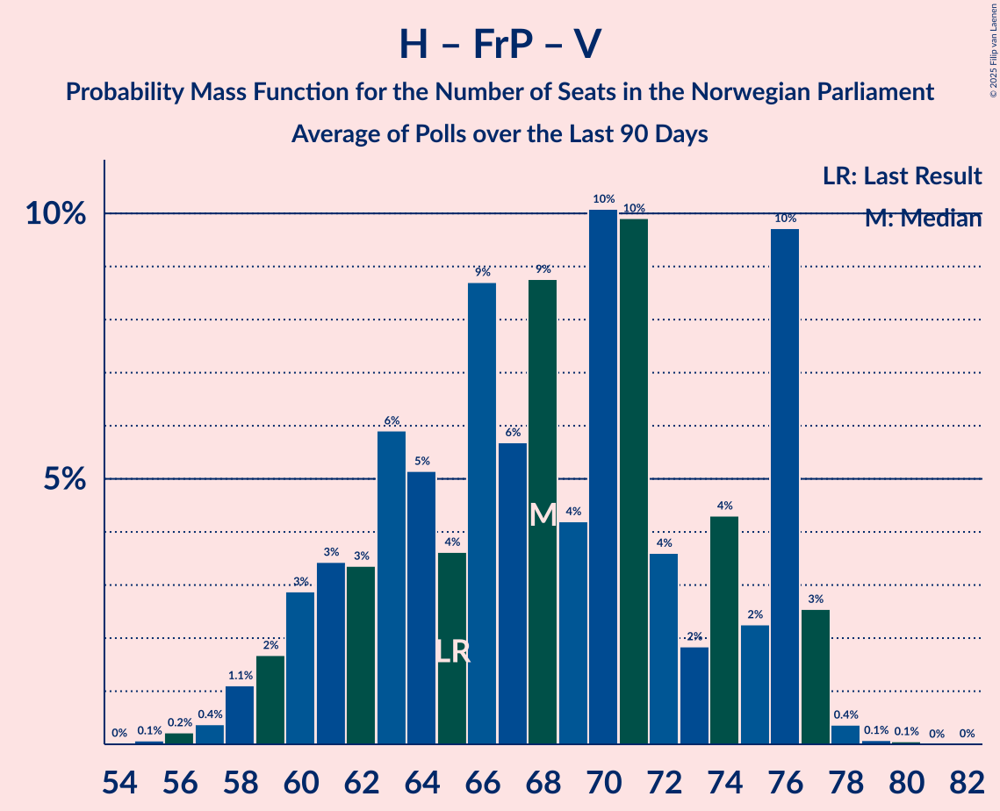

# Poll Average

<a href="#voting-intentions">Voting Intentions</a> | <a href="#seats">Seats</a> | <a href="#coalitions">Coalitions</a> | <a href="#technical-information">Technical Information</a>

## Summary

The table below lists the polls on which the average is based. They are the most recent polls (less than 90 days old) registered and analyzed so far.

| Period     | Polling firm/Commissioner(s) | Ap | H | FrP | Sp | SV | V | KrF | MDG | R |
|:----------:|:----------------------------:|:--:|:--:|:--:|:--:|:--:|:--:|:--:|:--:|:--:|
| 8–9 September 2013 | General Election | 27.4%   49 | 25.0%   45 | 15.2%   27 | 10.3%   19 | 6.0%   11 | 4.4%   8 | 4.2%   8 | 3.2%   1 | 2.4%   1 |
| N/A | Poll Average | 18–27%   34–49 | 21–29%   37–53 | 6–14%   11–26 | 16–21%   28–39 | 6–10%   11–18 | 2–6%   0–10 | 2–5%   0–8 | 3–6%   1–10 | 2–5%   1–9 |
| [2–3 March 2021](2021-03-03-Norfakta.html) | Norfakta   Klassekampen and Nationen | 22–27%   40–49 | 21–27%   41–49 | 8–12%   16–22 | 15–20%   28–36 | 6–9%   11–16 | 3–5%   2–9 | 2–4%   0–3 | 3–5%   1–9 | 3–5%   2–9 |
| [22–28 February 2021](2021-02-28-Norstat.html) | Norstat   Aftenposten and NRK | N/A   N/A | N/A   N/A | N/A   N/A | N/A   N/A | N/A   N/A | N/A   N/A | N/A   N/A | N/A   N/A | N/A   N/A |
| [22–26 February 2021](2021-02-26-KantarTNS.html) | Kantar TNS   TV2 | N/A   N/A | N/A   N/A | N/A   N/A | N/A   N/A | N/A   N/A | N/A   N/A | N/A   N/A | N/A   N/A | N/A   N/A |
| [22–24 February 2021](2021-02-24-IpsosMMI.html) | Ipsos MMI   Dagbladet | 18–23%   31–43 | 20–26%   35–48 | 11–15%   18–29 | 15–21%   27–39 | 6–10%   10–18 | 3–6%   2–11 | 2–5%   1–8 | 3–5%   1–10 | 2–4%   1–7 |
| [9–14 February 2021](2021-02-14-Sentio.html) | Sentio   Amedia and Nettavisen | 19–24%   34–43 | 24–30%   43–55 | 6–9%   10–17 | 16–21%   29–39 | 7–11%   12–19 | 2–4%   0–3 | 2–5%   1–8 | 4–6%   2–11 | 3–5%   1–9 |
| [1–8 February 2021](2021-02-08-OpinionPerduco.html) | Opinion Perduco   Avisenes Nyhetsbyrå, Dagsavisen and FriFagbevegelse | 22–27%   41–51 | 22–28%   40–52 | 7–10%   12–19 | 17–22%   32–40 | 6–9%   11–17 | 2–5%   1–8 | 2–5%   1–8 | 3–5%   1–10 | 2–4%   1–7 |
| [27 January–2 February 2021](2021-02-02-ResponsAnalyse.html) | Respons Analyse   VG | 20–26%   36–48 | 24–29%   42–54 | 7–11%   12–19 | 16–21%   30–40 | 6–9%   11–16 | 1–3%   0–2 | 2–5%   1–8 | 3–5%   1–9 | 3–6%   2–10 |
| 8–9 September 2013 | General Election | 27.4%   49 | 25.0%   45 | 15.2%   27 | 10.3%   19 | 6.0%   11 | 4.4%   8 | 4.2%   8 | 3.2%   1 | 2.4%   1 |

Only polls for which at least the sample size has been published are included in the table above.

**Legend:**
+ **Top half of each row:** Voting intentions (95% confidence interval)
+ **Bottom half of each row:** Seat projections for the Norwegian Parliament (95% confidence interval)
+ **Ap:** Arbeiderpartiet
+ **H:** Høyre
+ **FrP:** Fremskrittspartiet
+ **Sp:** Senterpartiet
+ **SV:** Sosialistisk Venstreparti
+ **V:** Venstre
+ **KrF:** Kristelig Folkeparti
+ **MDG:** Miljøpartiet De Grønne
+ **R:** Rødt
+ **N/A (single party):** Party not included the published results
+ **N/A (entire row):** Calculation for this opinion poll not started yet

## Voting Intentions

### Confidence Intervals

| Party | Last Result | Median | 80% Confidence Interval | 90% Confidence Interval | 95% Confidence Interval | 99% Confidence Interval |
|:-----:|:-----------:|:------:|:-----------------------:|:-----------------------:|:-----------------------:|:-----------------------:|
| <a href="#arbeiderpartiet">Arbeiderpartiet</a> | 27.4% | 22.7% | 19.7–25.5% |19.1–26.1% | 18.5–26.6% | 17.5–27.7% |
| <a href="#høyre">Høyre</a> | 25.0% | 25.1% | 22.5–27.7% |21.8–28.3% | 21.2–28.9% | 20.1–29.9% |
| <a href="#fremskrittspartiet">Fremskrittspartiet</a> | 15.2% | 9.0% | 7.2–12.9% |6.8–13.8% | 6.5–14.4% | 6.0–15.4% |
| <a href="#senterpartiet">Senterpartiet</a> | 10.3% | 18.4% | 16.7–20.2% |16.2–20.7% | 15.8–21.1% | 14.9–22.0% |
| <a href="#sosialistisk-venstreparti">Sosialistisk Venstreparti</a> | 6.0% | 7.8% | 6.6–9.1% |6.3–9.5% | 6.0–9.9% | 5.6–10.6% |
| <a href="#venstre">Venstre</a> | 4.4% | 3.3% | 1.9–4.9% |1.7–5.3% | 1.5–5.7% | 1.2–6.4% |
| <a href="#kristelig-folkeparti">Kristelig Folkeparti</a> | 4.2% | 3.3% | 2.5–4.1% |2.3–4.4% | 2.1–4.6% | 1.8–5.1% |
| <a href="#miljøpartiet-de-grønne">Miljøpartiet De Grønne</a> | 3.2% | 4.0% | 3.1–5.1% |2.9–5.4% | 2.7–5.7% | 2.4–6.2% |
| <a href="#rødt">Rødt</a> | 2.4% | 3.6% | 2.5–4.7% |2.2–5.0% | 2.0–5.2% | 1.7–5.7% |

### Arbeiderpartiet

*For a full overview of the results for this party, see the [Arbeiderpartiet](party-arbeiderpartiet.html) page.*

| Voting Intentions | Probability | Accumulated | Special Marks |
|:-----------------:|:-----------:|:-----------:|:-------------:|
| 14.5–15.5% | 0% | 100% |  |
| 15.5–16.5% | 0.1% | 100% |  |
| 16.5–17.5% | 0.5% | 99.9% |  |
| 17.5–18.5% | 2% | 99.5% |  |
| 18.5–19.5% | 6% | 97% |  |
| 19.5–20.5% | 11% | 91% |  |
| 20.5–21.5% | 14% | 81% |  |
| 21.5–22.5% | 15% | 67% |  |
| 22.5–23.5% | 15% | 52% | Median |
| 23.5–24.5% | 16% | 37% |  |
| 24.5–25.5% | 12% | 21% |  |
| 25.5–26.5% | 6% | 9% |  |
| 26.5–27.5% | 2% | 3% | Last Result |
| 27.5–28.5% | 0.5% | 0.6% |  |
| 28.5–29.5% | 0.1% | 0.1% |  |
| 29.5–30.5% | 0% | 0% |  |

### Høyre

*For a full overview of the results for this party, see the [Høyre](party-høyre.html) page.*

| Voting Intentions | Probability | Accumulated | Special Marks |
|:-----------------:|:-----------:|:-----------:|:-------------:|
| 17.5–18.5% | 0% | 100% |  |
| 18.5–19.5% | 0.2% | 100% |  |
| 19.5–20.5% | 0.8% | 99.8% |  |
| 20.5–21.5% | 3% | 99.0% |  |
| 21.5–22.5% | 7% | 96% |  |
| 22.5–23.5% | 12% | 89% |  |
| 23.5–24.5% | 17% | 77% |  |
| 24.5–25.5% | 18% | 60% | Last Result, Median |
| 25.5–26.5% | 17% | 42% |  |
| 26.5–27.5% | 13% | 25% |  |
| 27.5–28.5% | 8% | 11% |  |
| 28.5–29.5% | 3% | 4% |  |
| 29.5–30.5% | 0.8% | 0.9% |  |
| 30.5–31.5% | 0.1% | 0.2% |  |
| 31.5–32.5% | 0% | 0% |  |

### Fremskrittspartiet

*For a full overview of the results for this party, see the [Fremskrittspartiet](party-fremskrittspartiet.html) page.*

| Voting Intentions | Probability | Accumulated | Special Marks |
|:-----------------:|:-----------:|:-----------:|:-------------:|
| 3.5–4.5% | 0% | 100% |  |
| 4.5–5.5% | 0.1% | 100% |  |
| 5.5–6.5% | 3% | 99.9% |  |
| 6.5–7.5% | 14% | 97% |  |
| 7.5–8.5% | 24% | 84% |  |
| 8.5–9.5% | 21% | 60% | Median |
| 9.5–10.5% | 13% | 39% |  |
| 10.5–11.5% | 8% | 26% |  |
| 11.5–12.5% | 6% | 19% |  |
| 12.5–13.5% | 6% | 13% |  |
| 13.5–14.5% | 4% | 6% |  |
| 14.5–15.5% | 2% | 2% | Last Result |
| 15.5–16.5% | 0.4% | 0.4% |  |
| 16.5–17.5% | 0% | 0.1% |  |
| 17.5–18.5% | 0% | 0% |  |

### Senterpartiet

*For a full overview of the results for this party, see the [Senterpartiet](party-senterpartiet.html) page.*

| Voting Intentions | Probability | Accumulated | Special Marks |
|:-----------------:|:-----------:|:-----------:|:-------------:|
| 9.5–10.5% | 0% | 100% | Last Result |
| 10.5–11.5% | 0% | 100% |  |
| 11.5–12.5% | 0% | 100% |  |
| 12.5–13.5% | 0% | 100% |  |
| 13.5–14.5% | 0.2% | 100% |  |
| 14.5–15.5% | 2% | 99.8% |  |
| 15.5–16.5% | 7% | 98% |  |
| 16.5–17.5% | 18% | 91% |  |
| 17.5–18.5% | 28% | 73% | Median |
| 18.5–19.5% | 25% | 46% |  |
| 19.5–20.5% | 14% | 20% |  |
| 20.5–21.5% | 5% | 6% |  |
| 21.5–22.5% | 1.1% | 1.3% |  |
| 22.5–23.5% | 0.1% | 0.2% |  |
| 23.5–24.5% | 0% | 0% |  |

### Sosialistisk Venstreparti

*For a full overview of the results for this party, see the [Sosialistisk Venstreparti](party-sosialistiskvenstreparti.html) page.*

| Voting Intentions | Probability | Accumulated | Special Marks |
|:-----------------:|:-----------:|:-----------:|:-------------:|
| 3.5–4.5% | 0% | 100% |  |
| 4.5–5.5% | 0.5% | 100% |  |
| 5.5–6.5% | 9% | 99.5% | Last Result |
| 6.5–7.5% | 32% | 90% |  |
| 7.5–8.5% | 36% | 58% | Median |
| 8.5–9.5% | 17% | 22% |  |
| 9.5–10.5% | 4% | 5% |  |
| 10.5–11.5% | 0.6% | 0.6% |  |
| 11.5–12.5% | 0% | 0% |  |

### Venstre

*For a full overview of the results for this party, see the [Venstre](party-venstre.html) page.*

| Voting Intentions | Probability | Accumulated | Special Marks |
|:-----------------:|:-----------:|:-----------:|:-------------:|
| 0.0–0.5% | 0% | 100% |  |
| 0.5–1.5% | 3% | 100% |  |
| 1.5–2.5% | 23% | 97% |  |
| 2.5–3.5% | 32% | 74% | Median |
| 3.5–4.5% | 27% | 42% | Last Result |
| 4.5–5.5% | 12% | 16% |  |
| 5.5–6.5% | 3% | 3% |  |
| 6.5–7.5% | 0.3% | 0.3% |  |
| 7.5–8.5% | 0% | 0% |  |

### Kristelig Folkeparti

*For a full overview of the results for this party, see the [Kristelig Folkeparti](party-kristeligfolkeparti.html) page.*

| Voting Intentions | Probability | Accumulated | Special Marks |
|:-----------------:|:-----------:|:-----------:|:-------------:|
| 0.5–1.5% | 0.1% | 100% |  |
| 1.5–2.5% | 12% | 99.9% |  |
| 2.5–3.5% | 56% | 88% | Median |
| 3.5–4.5% | 29% | 32% | Last Result |
| 4.5–5.5% | 3% | 3% |  |
| 5.5–6.5% | 0.1% | 0.1% |  |
| 6.5–7.5% | 0% | 0% |  |

### Miljøpartiet De Grønne

*For a full overview of the results for this party, see the [Miljøpartiet De Grønne](party-miljøpartietdegrønne.html) page.*

| Voting Intentions | Probability | Accumulated | Special Marks |
|:-----------------:|:-----------:|:-----------:|:-------------:|
| 0.5–1.5% | 0% | 100% |  |
| 1.5–2.5% | 1.1% | 100% |  |
| 2.5–3.5% | 26% | 98.9% | Last Result |
| 3.5–4.5% | 48% | 73% | Median |
| 4.5–5.5% | 21% | 24% |  |
| 5.5–6.5% | 3% | 3% |  |
| 6.5–7.5% | 0.2% | 0.2% |  |
| 7.5–8.5% | 0% | 0% |  |

### Rødt

*For a full overview of the results for this party, see the [Rødt](party-rødt.html) page.*

| Voting Intentions | Probability | Accumulated | Special Marks |
|:-----------------:|:-----------:|:-----------:|:-------------:|
| 0.0–0.5% | 0% | 100% |  |
| 0.5–1.5% | 0.2% | 100% |  |
| 1.5–2.5% | 12% | 99.8% | Last Result |
| 2.5–3.5% | 37% | 88% |  |
| 3.5–4.5% | 39% | 51% | Median |
| 4.5–5.5% | 11% | 12% |  |
| 5.5–6.5% | 0.9% | 0.9% |  |
| 6.5–7.5% | 0% | 0% |  |

## Seats

### Confidence Intervals

| Party | Last Result | Median | 80% Confidence Interval | 90% Confidence Interval | 95% Confidence Interval | 99% Confidence Interval |
|:-----:|:-----------:|:------:|:-----------------------:|:-----------------------:|:-----------------------:|:-----------------------:|
| <a href="#arbeiderpartiet">Arbeiderpartiet</a> | 49 | 42 | 37–47 |35–48 | 34–49 | 31–51 |
| <a href="#høyre">Høyre</a> | 45 | 45 | 41–50 |39–52 | 37–53 | 35–55 |
| <a href="#fremskrittspartiet">Fremskrittspartiet</a> | 27 | 17 | 13–23 |12–25 | 11–26 | 10–29 |
| <a href="#senterpartiet">Senterpartiet</a> | 19 | 35 | 31–37 |29–38 | 28–39 | 27–41 |
| <a href="#sosialistisk-venstreparti">Sosialistisk Venstreparti</a> | 11 | 14 | 12–17 |11–17 | 11–18 | 9–19 |
| <a href="#venstre">Venstre</a> | 8 | 2 | 1–8 |0–10 | 0–10 | 0–11 |
| <a href="#kristelig-folkeparti">Kristelig Folkeparti</a> | 8 | 2 | 1–7 |1–8 | 0–8 | 0–9 |
| <a href="#miljøpartiet-de-grønne">Miljøpartiet De Grønne</a> | 1 | 4 | 2–9 |1–10 | 1–10 | 1–11 |
| <a href="#rødt">Rødt</a> | 1 | 2 | 1–8 |1–9 | 1–9 | 1–10 |

### Arbeiderpartiet

*For a full overview of the results for this party, see the [Arbeiderpartiet](party-arbeiderpartiet.html) page.*

| Number of Seats | Probability | Accumulated | Special Marks |
|:---------------:|:-----------:|:-----------:|:-------------:|
| 28 | 0% | 100% |  |
| 29 | 0.1% | 99.9% |  |
| 30 | 0.2% | 99.9% |  |
| 31 | 0.3% | 99.6% |  |
| 32 | 0.5% | 99.3% |  |
| 33 | 0.7% | 98.8% |  |
| 34 | 2% | 98% |  |
| 35 | 2% | 96% |  |
| 36 | 4% | 94% |  |
| 37 | 5% | 90% |  |
| 38 | 5% | 86% |  |
| 39 | 7% | 81% |  |
| 40 | 7% | 74% |  |
| 41 | 15% | 67% |  |
| 42 | 18% | 52% | Median |
| 43 | 11% | 35% |  |
| 44 | 4% | 24% |  |
| 45 | 5% | 20% |  |
| 46 | 3% | 15% |  |
| 47 | 6% | 12% |  |
| 48 | 3% | 6% |  |
| 49 | 2% | 3% | Last Result |
| 50 | 0.4% | 1.2% |  |
| 51 | 0.3% | 0.8% |  |
| 52 | 0.2% | 0.5% |  |
| 53 | 0.1% | 0.2% |  |
| 54 | 0% | 0.1% |  |
| 55 | 0% | 0% |  |

### Høyre

*For a full overview of the results for this party, see the [Høyre](party-høyre.html) page.*

| Number of Seats | Probability | Accumulated | Special Marks |
|:---------------:|:-----------:|:-----------:|:-------------:|
| 33 | 0.1% | 100% |  |
| 34 | 0.2% | 99.9% |  |
| 35 | 0.3% | 99.7% |  |
| 36 | 1.0% | 99.4% |  |
| 37 | 1.3% | 98% |  |
| 38 | 1.0% | 97% |  |
| 39 | 2% | 96% |  |
| 40 | 4% | 94% |  |
| 41 | 4% | 90% |  |
| 42 | 6% | 86% |  |
| 43 | 7% | 80% |  |
| 44 | 8% | 73% |  |
| 45 | 20% | 66% | Last Result, Median |
| 46 | 6% | 46% |  |
| 47 | 8% | 39% |  |
| 48 | 7% | 32% |  |
| 49 | 10% | 24% |  |
| 50 | 5% | 15% |  |
| 51 | 4% | 10% |  |
| 52 | 2% | 6% |  |
| 53 | 2% | 4% |  |
| 54 | 1.1% | 2% |  |
| 55 | 0.6% | 1.0% |  |
| 56 | 0.2% | 0.4% |  |
| 57 | 0.1% | 0.2% |  |
| 58 | 0.1% | 0.1% |  |
| 59 | 0% | 0% |  |

### Fremskrittspartiet

*For a full overview of the results for this party, see the [Fremskrittspartiet](party-fremskrittspartiet.html) page.*

| Number of Seats | Probability | Accumulated | Special Marks |
|:---------------:|:-----------:|:-----------:|:-------------:|
| 9 | 0.2% | 100% |  |
| 10 | 0.8% | 99.8% |  |
| 11 | 2% | 99.0% |  |
| 12 | 6% | 97% |  |
| 13 | 7% | 91% |  |
| 14 | 11% | 84% |  |
| 15 | 8% | 73% |  |
| 16 | 11% | 65% |  |
| 17 | 13% | 54% | Median |
| 18 | 9% | 41% |  |
| 19 | 7% | 32% |  |
| 20 | 2% | 25% |  |
| 21 | 3% | 23% |  |
| 22 | 9% | 20% |  |
| 23 | 3% | 11% |  |
| 24 | 3% | 8% |  |
| 25 | 1.4% | 6% |  |
| 26 | 2% | 4% |  |
| 27 | 1.3% | 2% | Last Result |
| 28 | 0.6% | 1.2% |  |
| 29 | 0.4% | 0.5% |  |
| 30 | 0.1% | 0.1% |  |
| 31 | 0% | 0.1% |  |
| 32 | 0% | 0% |  |

### Senterpartiet

*For a full overview of the results for this party, see the [Senterpartiet](party-senterpartiet.html) page.*

| Number of Seats | Probability | Accumulated | Special Marks |
|:---------------:|:-----------:|:-----------:|:-------------:|
| 19 | 0% | 100% | Last Result |
| 20 | 0% | 100% |  |
| 21 | 0% | 100% |  |
| 22 | 0% | 100% |  |
| 23 | 0% | 100% |  |
| 24 | 0% | 100% |  |
| 25 | 0.1% | 100% |  |
| 26 | 0.3% | 99.9% |  |
| 27 | 0.9% | 99.6% |  |
| 28 | 2% | 98.7% |  |
| 29 | 2% | 96% |  |
| 30 | 3% | 95% |  |
| 31 | 13% | 92% |  |
| 32 | 5% | 79% |  |
| 33 | 7% | 74% |  |
| 34 | 13% | 66% |  |
| 35 | 18% | 53% | Median |
| 36 | 20% | 36% |  |
| 37 | 8% | 16% |  |
| 38 | 4% | 8% |  |
| 39 | 2% | 4% |  |
| 40 | 1.3% | 2% |  |
| 41 | 0.5% | 0.9% |  |
| 42 | 0.2% | 0.4% |  |
| 43 | 0.1% | 0.1% |  |
| 44 | 0% | 0% |  |

### Sosialistisk Venstreparti

*For a full overview of the results for this party, see the [Sosialistisk Venstreparti](party-sosialistiskvenstreparti.html) page.*

| Number of Seats | Probability | Accumulated | Special Marks |
|:---------------:|:-----------:|:-----------:|:-------------:|
| 9 | 0.5% | 100% |  |
| 10 | 2% | 99.5% |  |
| 11 | 6% | 98% | Last Result |
| 12 | 11% | 91% |  |
| 13 | 14% | 81% |  |
| 14 | 24% | 67% | Median |
| 15 | 17% | 43% |  |
| 16 | 16% | 26% |  |
| 17 | 6% | 10% |  |
| 18 | 3% | 5% |  |
| 19 | 1.4% | 2% |  |
| 20 | 0.3% | 0.5% |  |
| 21 | 0.1% | 0.2% |  |
| 22 | 0% | 0% |  |

### Venstre

*For a full overview of the results for this party, see the [Venstre](party-venstre.html) page.*

| Number of Seats | Probability | Accumulated | Special Marks |
|:---------------:|:-----------:|:-----------:|:-------------:|
| 0 | 9% | 100% |  |
| 1 | 10% | 91% |  |
| 2 | 48% | 81% | Median |
| 3 | 2% | 33% |  |
| 4 | 0.2% | 31% |  |
| 5 | 0% | 30% |  |
| 6 | 0.2% | 30% |  |
| 7 | 4% | 30% |  |
| 8 | 16% | 26% | Last Result |
| 9 | 4% | 10% |  |
| 10 | 4% | 5% |  |
| 11 | 1.0% | 1.4% |  |
| 12 | 0.3% | 0.4% |  |
| 13 | 0.1% | 0.1% |  |
| 14 | 0% | 0% |  |

### Kristelig Folkeparti

*For a full overview of the results for this party, see the [Kristelig Folkeparti](party-kristeligfolkeparti.html) page.*

| Number of Seats | Probability | Accumulated | Special Marks |
|:---------------:|:-----------:|:-----------:|:-------------:|
| 0 | 4% | 100% |  |
| 1 | 35% | 96% |  |
| 2 | 17% | 61% | Median |
| 3 | 32% | 44% |  |
| 4 | 0% | 12% |  |
| 5 | 0% | 12% |  |
| 6 | 0.7% | 12% |  |
| 7 | 6% | 11% |  |
| 8 | 4% | 5% | Last Result |
| 9 | 1.0% | 1.2% |  |
| 10 | 0.2% | 0.2% |  |
| 11 | 0% | 0% |  |

### Miljøpartiet De Grønne

*For a full overview of the results for this party, see the [Miljøpartiet De Grønne](party-miljøpartietdegrønne.html) page.*

| Number of Seats | Probability | Accumulated | Special Marks |
|:---------------:|:-----------:|:-----------:|:-------------:|
| 1 | 5% | 100% | Last Result |
| 2 | 34% | 95% |  |
| 3 | 8% | 60% |  |
| 4 | 3% | 52% | Median |
| 5 | 0% | 49% |  |
| 6 | 0.6% | 49% |  |
| 7 | 9% | 48% |  |
| 8 | 21% | 39% |  |
| 9 | 12% | 18% |  |
| 10 | 5% | 6% |  |
| 11 | 1.2% | 2% |  |
| 12 | 0.3% | 0.3% |  |
| 13 | 0% | 0% |  |

### Rødt

*For a full overview of the results for this party, see the [Rødt](party-rødt.html) page.*

| Number of Seats | Probability | Accumulated | Special Marks |
|:---------------:|:-----------:|:-----------:|:-------------:|
| 1 | 21% | 100% | Last Result |
| 2 | 48% | 79% | Median |
| 3 | 0.1% | 31% |  |
| 4 | 0% | 31% |  |
| 5 | 0% | 31% |  |
| 6 | 0.8% | 31% |  |
| 7 | 8% | 30% |  |
| 8 | 15% | 22% |  |
| 9 | 5% | 7% |  |
| 10 | 1.4% | 2% |  |
| 11 | 0.4% | 0.4% |  |
| 12 | 0% | 0% |  |

## Coalitions

### Confidence Intervals

| Coalition | Last Result | Median | Majority? | 80% Confidence Interval | 90% Confidence Interval | 95% Confidence Interval | 99% Confidence Interval |
|:---------:|:-----------:|:------:|:---------:|:-----------------------:|:-----------------------:|:-----------------------:|:-----------------------:|
| Høyre – Fremskrittspartiet – Senterpartiet – Venstre – Kristelig Folkeparti | 107 | 103 | 100% | 98–109 | 97–111 | 95–113 | 92–117 |
| Arbeiderpartiet – Senterpartiet – Sosialistisk Venstreparti – Kristelig Folkeparti – Miljøpartiet De Grønne | 88 | 98 | 98.6% | 91–105 | 88–106 | 86–108 | 82–110 |
| Arbeiderpartiet – Senterpartiet – Sosialistisk Venstreparti – Miljøpartiet De Grønne – Rødt | 81 | 100 | 98% | 90–106 | 87–107 | 85–108 | 81–110 |
| Arbeiderpartiet – Senterpartiet – Sosialistisk Venstreparti – Miljøpartiet De Grønne | 80 | 96 | 97% | 88–102 | 86–103 | 84–105 | 79–107 |
| Arbeiderpartiet – Senterpartiet – Sosialistisk Venstreparti – Rødt | 80 | 94 | 93% | 86–100 | 83–101 | 81–102 | 78–105 |
| Arbeiderpartiet – Senterpartiet – Sosialistisk Venstreparti | 79 | 90 | 88% | 84–96 | 82–97 | 79–99 | 76–102 |
| Arbeiderpartiet – Senterpartiet – Kristelig Folkeparti – Miljøpartiet De Grønne | 77 | 84 | 46% | 76–91 | 74–92 | 72–94 | 68–97 |
| Arbeiderpartiet – Senterpartiet – Kristelig Folkeparti | 76 | 79 | 11% | 72–85 | 70–86 | 68–88 | 65–91 |
| Høyre – Fremskrittspartiet – Venstre – Kristelig Folkeparti – Miljøpartiet De Grønne | 89 | 74 | 3% | 69–80 | 68–83 | 67–85 | 64–89 |
| Arbeiderpartiet – Senterpartiet | 68 | 76 | 3% | 70–82 | 67–83 | 65–85 | 62–88 |
| Høyre – Fremskrittspartiet – Venstre – Kristelig Folkeparti | 88 | 68 | 0.5% | 63–76 | 62–79 | 61–81 | 59–84 |
| Høyre – Fremskrittspartiet – Venstre | 80 | 66 | 0% | 60–75 | 59–75 | 58–78 | 56–81 |
| Høyre – Fremskrittspartiet | 72 | 63 | 0% | 58–67 | 57–69 | 56–71 | 54–73 |
| Arbeiderpartiet – Sosialistisk Venstreparti | 60 | 56 | 0% | 50–61 | 49–62 | 48–63 | 44–66 |
| Høyre – Venstre – Kristelig Folkeparti | 61 | 52 | 0% | 47–56 | 46–58 | 44–59 | 43–62 |
| Senterpartiet – Venstre – Kristelig Folkeparti | 35 | 40 | 0% | 36–45 | 35–47 | 34–48 | 32–52 |

### Høyre – Fremskrittspartiet – Senterpartiet – Venstre – Kristelig Folkeparti

| Number of Seats | Probability | Accumulated | Special Marks |
|:---------------:|:-----------:|:-----------:|:-------------:|
| 91 | 0% | 100% |  |
| 92 | 0.9% | 99.9% |  |
| 93 | 0.1% | 99.1% |  |
| 94 | 0.6% | 98.9% |  |
| 95 | 1.1% | 98% |  |
| 96 | 2% | 97% |  |
| 97 | 3% | 95% |  |
| 98 | 4% | 93% |  |
| 99 | 7% | 88% |  |
| 100 | 10% | 81% |  |
| 101 | 6% | 71% | Median |
| 102 | 11% | 65% |  |
| 103 | 6% | 54% |  |
| 104 | 12% | 49% |  |
| 105 | 6% | 37% |  |
| 106 | 5% | 31% |  |
| 107 | 11% | 26% | Last Result |
| 108 | 4% | 16% |  |
| 109 | 3% | 12% |  |
| 110 | 2% | 9% |  |
| 111 | 2% | 7% |  |
| 112 | 1.1% | 4% |  |
| 113 | 1.0% | 3% |  |
| 114 | 0.7% | 2% |  |
| 115 | 0.5% | 2% |  |
| 116 | 0.4% | 1.1% |  |
| 117 | 0.4% | 0.8% |  |
| 118 | 0.1% | 0.4% |  |
| 119 | 0.2% | 0.3% |  |
| 120 | 0% | 0.1% |  |
| 121 | 0% | 0.1% |  |
| 122 | 0% | 0% |  |

### Arbeiderpartiet – Senterpartiet – Sosialistisk Venstreparti – Kristelig Folkeparti – Miljøpartiet De Grønne

| Number of Seats | Probability | Accumulated | Special Marks |
|:---------------:|:-----------:|:-----------:|:-------------:|
| 79 | 0% | 100% |  |
| 80 | 0.1% | 99.9% |  |
| 81 | 0.1% | 99.8% |  |
| 82 | 0.4% | 99.6% |  |
| 83 | 0.3% | 99.2% |  |
| 84 | 0.3% | 98.9% |  |
| 85 | 0.9% | 98.6% | Majority |
| 86 | 0.7% | 98% |  |
| 87 | 1.0% | 97% |  |
| 88 | 1.3% | 96% | Last Result |
| 89 | 2% | 95% |  |
| 90 | 3% | 93% |  |
| 91 | 2% | 90% |  |
| 92 | 8% | 88% |  |
| 93 | 3% | 80% |  |
| 94 | 4% | 78% |  |
| 95 | 10% | 74% |  |
| 96 | 7% | 64% |  |
| 97 | 5% | 57% | Median |
| 98 | 5% | 53% |  |
| 99 | 9% | 48% |  |
| 100 | 7% | 39% |  |
| 101 | 5% | 32% |  |
| 102 | 7% | 27% |  |
| 103 | 5% | 20% |  |
| 104 | 5% | 15% |  |
| 105 | 4% | 11% |  |
| 106 | 3% | 7% |  |
| 107 | 2% | 4% |  |
| 108 | 1.3% | 3% |  |
| 109 | 0.8% | 1.4% |  |
| 110 | 0.3% | 0.7% |  |
| 111 | 0.2% | 0.3% |  |
| 112 | 0.1% | 0.2% |  |
| 113 | 0% | 0% |  |

### Arbeiderpartiet – Senterpartiet – Sosialistisk Venstreparti – Miljøpartiet De Grønne – Rødt

| Number of Seats | Probability | Accumulated | Special Marks |
|:---------------:|:-----------:|:-----------:|:-------------:|
| 78 | 0% | 100% |  |
| 79 | 0.1% | 99.9% |  |
| 80 | 0.3% | 99.9% |  |
| 81 | 0.4% | 99.5% | Last Result |
| 82 | 0.4% | 99.2% |  |
| 83 | 0.5% | 98.7% |  |
| 84 | 0.3% | 98% |  |
| 85 | 0.9% | 98% | Majority |
| 86 | 0.8% | 97% |  |
| 87 | 1.4% | 96% |  |
| 88 | 1.3% | 95% |  |
| 89 | 2% | 94% |  |
| 90 | 2% | 91% |  |
| 91 | 2% | 90% |  |
| 92 | 2% | 88% |  |
| 93 | 7% | 86% |  |
| 94 | 2% | 79% |  |
| 95 | 4% | 78% |  |
| 96 | 3% | 74% |  |
| 97 | 6% | 71% | Median |
| 98 | 7% | 65% |  |
| 99 | 5% | 58% |  |
| 100 | 6% | 53% |  |
| 101 | 12% | 47% |  |
| 102 | 6% | 34% |  |
| 103 | 6% | 29% |  |
| 104 | 7% | 22% |  |
| 105 | 5% | 15% |  |
| 106 | 4% | 10% |  |
| 107 | 2% | 6% |  |
| 108 | 3% | 4% |  |
| 109 | 0.7% | 2% |  |
| 110 | 0.5% | 0.8% |  |
| 111 | 0.2% | 0.3% |  |
| 112 | 0% | 0.1% |  |
| 113 | 0% | 0% |  |

### Arbeiderpartiet – Senterpartiet – Sosialistisk Venstreparti – Miljøpartiet De Grønne

| Number of Seats | Probability | Accumulated | Special Marks |
|:---------------:|:-----------:|:-----------:|:-------------:|
| 76 | 0% | 100% |  |
| 77 | 0% | 99.9% |  |
| 78 | 0.3% | 99.9% |  |
| 79 | 0.3% | 99.6% |  |
| 80 | 0.3% | 99.3% | Last Result |
| 81 | 0.6% | 99.0% |  |
| 82 | 0.5% | 98% |  |
| 83 | 0.4% | 98% |  |
| 84 | 1.0% | 98% |  |
| 85 | 1.1% | 97% | Majority |
| 86 | 2% | 96% |  |
| 87 | 3% | 94% |  |
| 88 | 2% | 91% |  |
| 89 | 3% | 88% |  |
| 90 | 3% | 86% |  |
| 91 | 8% | 83% |  |
| 92 | 4% | 75% |  |
| 93 | 8% | 71% |  |
| 94 | 7% | 63% |  |
| 95 | 5% | 56% | Median |
| 96 | 10% | 51% |  |
| 97 | 5% | 41% |  |
| 98 | 6% | 36% |  |
| 99 | 8% | 29% |  |
| 100 | 4% | 21% |  |
| 101 | 6% | 17% |  |
| 102 | 3% | 11% |  |
| 103 | 3% | 8% |  |
| 104 | 2% | 5% |  |
| 105 | 1.1% | 3% |  |
| 106 | 1.0% | 2% |  |
| 107 | 0.4% | 0.8% |  |
| 108 | 0.2% | 0.4% |  |
| 109 | 0.2% | 0.2% |  |
| 110 | 0% | 0% |  |

### Arbeiderpartiet – Senterpartiet – Sosialistisk Venstreparti – Rødt

| Number of Seats | Probability | Accumulated | Special Marks |
|:---------------:|:-----------:|:-----------:|:-------------:|
| 73 | 0.1% | 100% |  |
| 74 | 0% | 99.9% |  |
| 75 | 0% | 99.9% |  |
| 76 | 0.2% | 99.8% |  |
| 77 | 0.1% | 99.7% |  |
| 78 | 0.3% | 99.5% |  |
| 79 | 0.5% | 99.2% |  |
| 80 | 1.0% | 98.7% | Last Result |
| 81 | 0.9% | 98% |  |
| 82 | 0.7% | 97% |  |
| 83 | 2% | 96% |  |
| 84 | 1.0% | 94% |  |
| 85 | 2% | 93% | Majority |
| 86 | 2% | 91% |  |
| 87 | 3% | 89% |  |
| 88 | 2% | 86% |  |
| 89 | 4% | 84% |  |
| 90 | 5% | 80% |  |
| 91 | 10% | 74% |  |
| 92 | 4% | 65% |  |
| 93 | 6% | 60% | Median |
| 94 | 5% | 54% |  |
| 95 | 7% | 49% |  |
| 96 | 7% | 42% |  |
| 97 | 6% | 35% |  |
| 98 | 8% | 30% |  |
| 99 | 10% | 21% |  |
| 100 | 6% | 12% |  |
| 101 | 3% | 6% |  |
| 102 | 1.2% | 3% |  |
| 103 | 0.8% | 2% |  |
| 104 | 0.5% | 1.0% |  |
| 105 | 0.2% | 0.5% |  |
| 106 | 0.1% | 0.3% |  |
| 107 | 0.1% | 0.2% |  |
| 108 | 0.1% | 0.1% |  |
| 109 | 0% | 0% |  |

### Arbeiderpartiet – Senterpartiet – Sosialistisk Venstreparti

| Number of Seats | Probability | Accumulated | Special Marks |
|:---------------:|:-----------:|:-----------:|:-------------:|
| 72 | 0.1% | 100% |  |
| 73 | 0.1% | 99.9% |  |
| 74 | 0.1% | 99.8% |  |
| 75 | 0.2% | 99.7% |  |
| 76 | 0.4% | 99.6% |  |
| 77 | 0.2% | 99.2% |  |
| 78 | 0.6% | 99.0% |  |
| 79 | 1.1% | 98% | Last Result |
| 80 | 1.2% | 97% |  |
| 81 | 1.0% | 96% |  |
| 82 | 2% | 95% |  |
| 83 | 2% | 93% |  |
| 84 | 3% | 91% |  |
| 85 | 6% | 88% | Majority |
| 86 | 3% | 82% |  |
| 87 | 6% | 79% |  |
| 88 | 8% | 73% |  |
| 89 | 10% | 65% |  |
| 90 | 6% | 55% |  |
| 91 | 12% | 49% | Median |
| 92 | 9% | 37% |  |
| 93 | 6% | 28% |  |
| 94 | 5% | 22% |  |
| 95 | 4% | 17% |  |
| 96 | 5% | 13% |  |
| 97 | 3% | 8% |  |
| 98 | 2% | 5% |  |
| 99 | 1.2% | 3% |  |
| 100 | 0.6% | 2% |  |
| 101 | 0.4% | 1.1% |  |
| 102 | 0.4% | 0.6% |  |
| 103 | 0.2% | 0.3% |  |
| 104 | 0% | 0.1% |  |
| 105 | 0% | 0.1% |  |
| 106 | 0% | 0% |  |

### Arbeiderpartiet – Senterpartiet – Kristelig Folkeparti – Miljøpartiet De Grønne

| Number of Seats | Probability | Accumulated | Special Marks |
|:---------------:|:-----------:|:-----------:|:-------------:|
| 66 | 0.2% | 100% |  |
| 67 | 0.2% | 99.8% |  |
| 68 | 0.4% | 99.6% |  |
| 69 | 0.4% | 99.2% |  |
| 70 | 0.4% | 98.8% |  |
| 71 | 0.6% | 98% |  |
| 72 | 1.1% | 98% |  |
| 73 | 0.9% | 97% |  |
| 74 | 2% | 96% |  |
| 75 | 1.2% | 94% |  |
| 76 | 7% | 93% |  |
| 77 | 2% | 85% | Last Result |
| 78 | 4% | 84% |  |
| 79 | 3% | 80% |  |
| 80 | 3% | 77% |  |
| 81 | 10% | 74% |  |
| 82 | 5% | 64% |  |
| 83 | 8% | 59% | Median |
| 84 | 6% | 51% |  |
| 85 | 11% | 46% | Majority |
| 86 | 4% | 35% |  |
| 87 | 7% | 31% |  |
| 88 | 6% | 24% |  |
| 89 | 5% | 18% |  |
| 90 | 3% | 14% |  |
| 91 | 3% | 11% |  |
| 92 | 3% | 8% |  |
| 93 | 2% | 5% |  |
| 94 | 0.8% | 3% |  |
| 95 | 0.7% | 2% |  |
| 96 | 0.7% | 1.2% |  |
| 97 | 0.3% | 0.5% |  |
| 98 | 0.1% | 0.3% |  |
| 99 | 0.1% | 0.2% |  |
| 100 | 0.1% | 0.1% |  |
| 101 | 0% | 0% |  |

### Arbeiderpartiet – Senterpartiet – Kristelig Folkeparti

| Number of Seats | Probability | Accumulated | Special Marks |
|:---------------:|:-----------:|:-----------:|:-------------:|
| 59 | 0.1% | 100% |  |
| 60 | 0% | 99.9% |  |
| 61 | 0% | 99.9% |  |
| 62 | 0% | 99.9% |  |
| 63 | 0.1% | 99.9% |  |
| 64 | 0.2% | 99.7% |  |
| 65 | 0.3% | 99.6% |  |
| 66 | 0.5% | 99.3% |  |
| 67 | 0.6% | 98.7% |  |
| 68 | 1.0% | 98% |  |
| 69 | 1.2% | 97% |  |
| 70 | 2% | 96% |  |
| 71 | 3% | 94% |  |
| 72 | 3% | 91% |  |
| 73 | 5% | 88% |  |
| 74 | 10% | 83% |  |
| 75 | 4% | 73% |  |
| 76 | 6% | 69% | Last Result |
| 77 | 6% | 63% |  |
| 78 | 6% | 57% |  |
| 79 | 10% | 51% | Median |
| 80 | 6% | 41% |  |
| 81 | 8% | 35% |  |
| 82 | 6% | 27% |  |
| 83 | 6% | 21% |  |
| 84 | 4% | 15% |  |
| 85 | 4% | 11% | Majority |
| 86 | 2% | 7% |  |
| 87 | 1.4% | 5% |  |
| 88 | 2% | 3% |  |
| 89 | 0.6% | 2% |  |
| 90 | 0.3% | 1.0% |  |
| 91 | 0.3% | 0.6% |  |
| 92 | 0.2% | 0.3% |  |
| 93 | 0.1% | 0.2% |  |
| 94 | 0% | 0.1% |  |
| 95 | 0% | 0.1% |  |
| 96 | 0% | 0% |  |

### Høyre – Fremskrittspartiet – Venstre – Kristelig Folkeparti – Miljøpartiet De Grønne

| Number of Seats | Probability | Accumulated | Special Marks |
|:---------------:|:-----------:|:-----------:|:-------------:|
| 61 | 0.1% | 100% |  |
| 62 | 0.2% | 99.9% |  |
| 63 | 0.1% | 99.7% |  |
| 64 | 0.3% | 99.6% |  |
| 65 | 0.7% | 99.3% |  |
| 66 | 0.9% | 98.6% |  |
| 67 | 1.4% | 98% |  |
| 68 | 3% | 96% |  |
| 69 | 6% | 93% |  |
| 70 | 10% | 87% | Median |
| 71 | 9% | 77% |  |
| 72 | 7% | 68% |  |
| 73 | 9% | 61% |  |
| 74 | 8% | 52% |  |
| 75 | 5% | 44% |  |
| 76 | 6% | 39% |  |
| 77 | 5% | 32% |  |
| 78 | 9% | 28% |  |
| 79 | 5% | 18% |  |
| 80 | 4% | 13% |  |
| 81 | 2% | 9% |  |
| 82 | 2% | 7% |  |
| 83 | 2% | 5% |  |
| 84 | 1.4% | 4% |  |
| 85 | 0.6% | 3% | Majority |
| 86 | 0.4% | 2% |  |
| 87 | 0.3% | 2% |  |
| 88 | 0.5% | 1.3% |  |
| 89 | 0.5% | 0.7% | Last Result |
| 90 | 0.1% | 0.2% |  |
| 91 | 0.1% | 0.1% |  |
| 92 | 0% | 0.1% |  |
| 93 | 0% | 0% |  |

### Arbeiderpartiet – Senterpartiet

| Number of Seats | Probability | Accumulated | Special Marks |
|:---------------:|:-----------:|:-----------:|:-------------:|
| 58 | 0.1% | 100% |  |
| 59 | 0% | 99.9% |  |
| 60 | 0.1% | 99.9% |  |
| 61 | 0.2% | 99.8% |  |
| 62 | 0.2% | 99.6% |  |
| 63 | 0.4% | 99.4% |  |
| 64 | 0.6% | 99.0% |  |
| 65 | 0.9% | 98% |  |
| 66 | 0.9% | 97% |  |
| 67 | 2% | 97% |  |
| 68 | 1.3% | 95% | Last Result |
| 69 | 3% | 93% |  |
| 70 | 3% | 91% |  |
| 71 | 5% | 87% |  |
| 72 | 5% | 83% |  |
| 73 | 13% | 78% |  |
| 74 | 6% | 65% |  |
| 75 | 5% | 59% |  |
| 76 | 6% | 53% |  |
| 77 | 11% | 47% | Median |
| 78 | 10% | 37% |  |
| 79 | 5% | 27% |  |
| 80 | 5% | 22% |  |
| 81 | 5% | 16% |  |
| 82 | 4% | 12% |  |
| 83 | 3% | 8% |  |
| 84 | 2% | 4% |  |
| 85 | 0.9% | 3% | Majority |
| 86 | 0.3% | 2% |  |
| 87 | 0.8% | 1.4% |  |
| 88 | 0.3% | 0.6% |  |
| 89 | 0.1% | 0.2% |  |
| 90 | 0.1% | 0.1% |  |
| 91 | 0% | 0% |  |

### Høyre – Fremskrittspartiet – Venstre – Kristelig Folkeparti

| Number of Seats | Probability | Accumulated | Special Marks |
|:---------------:|:-----------:|:-----------:|:-------------:|
| 56 | 0% | 100% |  |
| 57 | 0.1% | 99.9% |  |
| 58 | 0.2% | 99.9% |  |
| 59 | 0.6% | 99.6% |  |
| 60 | 0.9% | 99.0% |  |
| 61 | 3% | 98% |  |
| 62 | 2% | 95% |  |
| 63 | 5% | 93% |  |
| 64 | 5% | 88% |  |
| 65 | 8% | 83% |  |
| 66 | 7% | 75% | Median |
| 67 | 7% | 68% |  |
| 68 | 13% | 61% |  |
| 69 | 7% | 49% |  |
| 70 | 5% | 42% |  |
| 71 | 8% | 37% |  |
| 72 | 6% | 29% |  |
| 73 | 3% | 23% |  |
| 74 | 4% | 20% |  |
| 75 | 2% | 16% |  |
| 76 | 7% | 14% |  |
| 77 | 1.1% | 7% |  |
| 78 | 1.1% | 6% |  |
| 79 | 1.1% | 5% |  |
| 80 | 1.0% | 4% |  |
| 81 | 1.0% | 3% |  |
| 82 | 1.0% | 2% |  |
| 83 | 0.4% | 1.0% |  |
| 84 | 0.1% | 0.6% |  |
| 85 | 0.2% | 0.5% | Majority |
| 86 | 0.2% | 0.3% |  |
| 87 | 0.1% | 0.2% |  |
| 88 | 0% | 0.1% | Last Result |
| 89 | 0% | 0% |  |

### Høyre – Fremskrittspartiet – Venstre

| Number of Seats | Probability | Accumulated | Special Marks |
|:---------------:|:-----------:|:-----------:|:-------------:|
| 54 | 0.1% | 100% |  |
| 55 | 0.2% | 99.9% |  |
| 56 | 0.5% | 99.7% |  |
| 57 | 0.8% | 99.2% |  |
| 58 | 2% | 98% |  |
| 59 | 2% | 96% |  |
| 60 | 5% | 94% |  |
| 61 | 4% | 89% |  |
| 62 | 8% | 85% |  |
| 63 | 6% | 76% |  |
| 64 | 7% | 70% | Median |
| 65 | 7% | 63% |  |
| 66 | 10% | 56% |  |
| 67 | 7% | 46% |  |
| 68 | 7% | 39% |  |
| 69 | 5% | 32% |  |
| 70 | 3% | 27% |  |
| 71 | 6% | 23% |  |
| 72 | 2% | 18% |  |
| 73 | 3% | 15% |  |
| 74 | 1.3% | 12% |  |
| 75 | 6% | 11% |  |
| 76 | 0.5% | 5% |  |
| 77 | 1.2% | 4% |  |
| 78 | 0.8% | 3% |  |
| 79 | 0.6% | 2% |  |
| 80 | 0.7% | 2% | Last Result |
| 81 | 0.4% | 0.8% |  |
| 82 | 0.1% | 0.3% |  |
| 83 | 0.1% | 0.3% |  |
| 84 | 0.1% | 0.1% |  |
| 85 | 0% | 0% | Majority |

### Høyre – Fremskrittspartiet

| Number of Seats | Probability | Accumulated | Special Marks |
|:---------------:|:-----------:|:-----------:|:-------------:|
| 51 | 0% | 100% |  |
| 52 | 0.1% | 99.9% |  |
| 53 | 0.2% | 99.8% |  |
| 54 | 0.6% | 99.6% |  |
| 55 | 1.1% | 99.0% |  |
| 56 | 3% | 98% |  |
| 57 | 3% | 95% |  |
| 58 | 6% | 92% |  |
| 59 | 5% | 86% |  |
| 60 | 8% | 81% |  |
| 61 | 7% | 72% |  |
| 62 | 10% | 65% | Median |
| 63 | 10% | 56% |  |
| 64 | 12% | 46% |  |
| 65 | 8% | 34% |  |
| 66 | 6% | 26% |  |
| 67 | 10% | 20% |  |
| 68 | 3% | 10% |  |
| 69 | 2% | 7% |  |
| 70 | 2% | 4% |  |
| 71 | 0.8% | 3% |  |
| 72 | 0.7% | 2% | Last Result |
| 73 | 0.6% | 1.0% |  |
| 74 | 0.2% | 0.4% |  |
| 75 | 0.1% | 0.2% |  |
| 76 | 0.1% | 0.1% |  |
| 77 | 0% | 0.1% |  |
| 78 | 0% | 0% |  |

### Arbeiderpartiet – Sosialistisk Venstreparti

| Number of Seats | Probability | Accumulated | Special Marks |
|:---------------:|:-----------:|:-----------:|:-------------:|
| 41 | 0% | 100% |  |
| 42 | 0.1% | 99.9% |  |
| 43 | 0.2% | 99.9% |  |
| 44 | 0.4% | 99.7% |  |
| 45 | 0.3% | 99.3% |  |
| 46 | 0.6% | 99.0% |  |
| 47 | 0.9% | 98% |  |
| 48 | 2% | 98% |  |
| 49 | 2% | 96% |  |
| 50 | 4% | 93% |  |
| 51 | 5% | 90% |  |
| 52 | 5% | 85% |  |
| 53 | 7% | 80% |  |
| 54 | 7% | 74% |  |
| 55 | 12% | 66% |  |
| 56 | 8% | 54% | Median |
| 57 | 12% | 46% |  |
| 58 | 12% | 34% |  |
| 59 | 6% | 22% |  |
| 60 | 4% | 16% | Last Result |
| 61 | 4% | 12% |  |
| 62 | 5% | 8% |  |
| 63 | 1.3% | 3% |  |
| 64 | 0.9% | 2% |  |
| 65 | 0.4% | 0.9% |  |
| 66 | 0.3% | 0.5% |  |
| 67 | 0.1% | 0.2% |  |
| 68 | 0% | 0.1% |  |
| 69 | 0% | 0% |  |

### Høyre – Venstre – Kristelig Folkeparti

| Number of Seats | Probability | Accumulated | Special Marks |
|:---------------:|:-----------:|:-----------:|:-------------:|
| 40 | 0% | 100% |  |
| 41 | 0.2% | 99.9% |  |
| 42 | 0.2% | 99.8% |  |
| 43 | 0.3% | 99.6% |  |
| 44 | 2% | 99.3% |  |
| 45 | 2% | 97% |  |
| 46 | 3% | 95% |  |
| 47 | 3% | 93% |  |
| 48 | 6% | 89% |  |
| 49 | 12% | 83% | Median |
| 50 | 8% | 71% |  |
| 51 | 10% | 64% |  |
| 52 | 11% | 54% |  |
| 53 | 9% | 43% |  |
| 54 | 12% | 33% |  |
| 55 | 7% | 22% |  |
| 56 | 5% | 15% |  |
| 57 | 3% | 9% |  |
| 58 | 2% | 6% |  |
| 59 | 1.4% | 4% |  |
| 60 | 0.9% | 2% |  |
| 61 | 0.6% | 1.4% | Last Result |
| 62 | 0.3% | 0.8% |  |
| 63 | 0.3% | 0.4% |  |
| 64 | 0.1% | 0.2% |  |
| 65 | 0% | 0.1% |  |
| 66 | 0% | 0% |  |

### Senterpartiet – Venstre – Kristelig Folkeparti

| Number of Seats | Probability | Accumulated | Special Marks |
|:---------------:|:-----------:|:-----------:|:-------------:|
| 30 | 0.1% | 100% |  |
| 31 | 0.2% | 99.9% |  |
| 32 | 0.7% | 99.7% |  |
| 33 | 0.8% | 99.1% |  |
| 34 | 3% | 98% |  |
| 35 | 2% | 95% | Last Result |
| 36 | 4% | 93% |  |
| 37 | 7% | 89% |  |
| 38 | 11% | 82% |  |
| 39 | 12% | 71% | Median |
| 40 | 19% | 59% |  |
| 41 | 8% | 40% |  |
| 42 | 6% | 32% |  |
| 43 | 6% | 26% |  |
| 44 | 5% | 19% |  |
| 45 | 5% | 14% |  |
| 46 | 4% | 10% |  |
| 47 | 2% | 6% |  |
| 48 | 1.4% | 4% |  |
| 49 | 0.9% | 2% |  |
| 50 | 0.5% | 2% |  |
| 51 | 0.4% | 1.1% |  |
| 52 | 0.4% | 0.7% |  |
| 53 | 0.1% | 0.2% |  |
| 54 | 0% | 0.1% |  |
| 55 | 0.1% | 0.1% |  |
| 56 | 0% | 0% |  |

## Technical Information

+ **Number of polls included in this average:** 7
+ **Lowest number of simulations done in a poll included in this average:** 0
+ **Total number of simulations done in the polls included in this average:** 4,227,072
+ **Error estimate:** 3.19%
