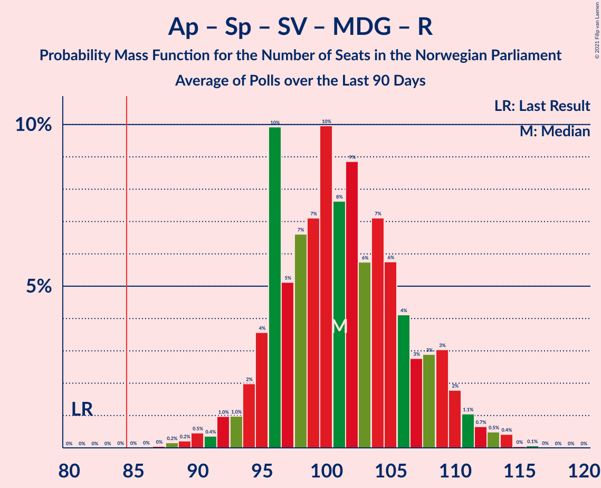

# Poll Average

<a href="#voting-intentions">Voting Intentions</a> | <a href="#seats">Seats</a> | <a href="#coalitions">Coalitions</a> | <a href="#technical-information">Technical Information</a>

## Summary

The table below lists the polls on which the average is based. They are the most recent polls (less than 90 days old) registered and analyzed so far.

| Period     | Polling firm/Commissioner(s) | Ap | H | FrP | Sp | SV | V | KrF | MDG | R |
|:----------:|:----------------------------:|:--:|:--:|:--:|:--:|:--:|:--:|:--:|:--:|:--:|
| 8–9 September 2013 | General Election | 27.4%   49 | 25.0%   45 | 15.2%   27 | 10.3%   19 | 6.0%   11 | 4.4%   8 | 4.2%   8 | 3.2%   1 | 2.4%   1 |
| N/A | Poll Average | 21–27%   38–50 | 20–25%   34–46 | 7–13%   13–25 | 14–20%   24–38 | 6–11%   9–18 | 2–4%   0–2 | 2–5%   0–8 | 4–8%   8–13 | 4–7%   2–12 |
| [6–10 January 2020](2020-01-10-KantarTNS.html) | Kantar TNS | 21–27%   37–47 | 20–25%   34–46 | 7–11%   12–19 | 15–21%   27–39 | 7–11%   12–19 | 1–4%   0–2 | 2–5%   0–8 | 5–8%   9–14 | 3–6%   2–10 |
| [7–8 January 2020](2020-01-08-Norfakta.html) | Norfakta | N/A   N/A | N/A   N/A | N/A   N/A | N/A   N/A | N/A   N/A | N/A   N/A | N/A   N/A | N/A   N/A | N/A   N/A |
| [6 January 2020](2020-01-06-ResponsAnalyse.html) | Respons Analyse | 21–27%   38–50 | 20–25%   33–44 | 10–14%   17–25 | 14–18%   23–36 | 5–8%   9–16 | 2–4%   0–2 | 3–6%   1–9 | 5–8%   8–13 | 4–7%   7–11 |
| [30 December 2019–5 January 2020](2020-01-05-Norstat.html) | Norstat | N/A   N/A | N/A   N/A | N/A   N/A | N/A   N/A | N/A   N/A | N/A   N/A | N/A   N/A | N/A   N/A | N/A   N/A |
| [16–18 December 2019](2019-12-18-IpsosMMI.html) | Ipsos MMI | 20–27%   39–47 | 19–25%   35–44 | 9–14%   17–25 | 13–19%   25–34 | 7–11%   12–18 | 2–4%   0–2 | 2–5%   0–7 | 4–7%   7–12 | 4–8%   9–13 |
| 8–9 September 2013 | General Election | 27.4%   49 | 25.0%   45 | 15.2%   27 | 10.3%   19 | 6.0%   11 | 4.4%   8 | 4.2%   8 | 3.2%   1 | 2.4%   1 |

Only polls for which at least the sample size has been published are included in the table above.

**Legend:**
+ **Top half of each row:** Voting intentions (95% confidence interval)
+ **Bottom half of each row:** Seat projections for the Norwegian Parliament (95% confidence interval)
+ **Ap:** Arbeiderpartiet
+ **H:** Høyre
+ **FrP:** Fremskrittspartiet
+ **Sp:** Senterpartiet
+ **SV:** Sosialistisk Venstreparti
+ **V:** Venstre
+ **KrF:** Kristelig Folkeparti
+ **MDG:** Miljøpartiet De Grønne
+ **R:** Rødt
+ **N/A (single party):** Party not included the published results
+ **N/A (entire row):** Calculation for this opinion poll not started yet

## Voting Intentions

### Confidence Intervals

| Party | Last Result | Median | 80% Confidence Interval | 90% Confidence Interval | 95% Confidence Interval | 99% Confidence Interval |
|:-----:|:-----------:|:------:|:-----------------------:|:-----------------------:|:-----------------------:|:-----------------------:|
| <a href="#arbeiderpartiet">Arbeiderpartiet</a> | 27.4% | 23.7% | 21.7–25.6% |21.2–26.1% | 20.7–26.6% | 19.8–27.6% |
| <a href="#høyre">Høyre</a> | 25.0% | 22.3% | 20.5–24.2% |20.0–24.8% | 19.5–25.2% | 18.7–26.2% |
| <a href="#fremskrittspartiet">Fremskrittspartiet</a> | 15.2% | 10.7% | 8.2–12.6% |7.7–13.0% | 7.4–13.4% | 6.7–14.2% |
| <a href="#senterpartiet">Senterpartiet</a> | 10.3% | 16.5% | 14.6–18.8% |14.1–19.5% | 13.7–20.0% | 12.9–21.1% |
| <a href="#sosialistisk-venstreparti">Sosialistisk Venstreparti</a> | 6.0% | 8.1% | 6.2–9.8% |5.9–10.3% | 5.6–10.7% | 5.1–11.4% |
| <a href="#venstre">Venstre</a> | 4.4% | 2.6% | 1.9–3.4% |1.7–3.7% | 1.6–3.9% | 1.3–4.5% |
| <a href="#kristelig-folkeparti">Kristelig Folkeparti</a> | 4.2% | 3.5% | 2.6–4.7% |2.3–5.0% | 2.2–5.3% | 1.9–5.8% |
| <a href="#miljøpartiet-de-grønne">Miljøpartiet De Grønne</a> | 3.2% | 6.0% | 4.6–7.3% |4.3–7.7% | 4.0–8.0% | 3.5–8.7% |
| <a href="#rødt">Rødt</a> | 2.4% | 5.2% | 4.2–6.5% |3.9–6.9% | 3.7–7.3% | 3.3–8.0% |

### Arbeiderpartiet

*For a full overview of the results for this party, see the [Arbeiderpartiet](party-arbeiderpartiet.html) page.*

| Voting Intentions | Probability | Accumulated | Special Marks |
|:-----------------:|:-----------:|:-----------:|:-------------:|
| 17.5–18.5% | 0% | 100% |  |
| 18.5–19.5% | 0.3% | 100% |  |
| 19.5–20.5% | 2% | 99.7% |  |
| 20.5–21.5% | 6% | 98% |  |
| 21.5–22.5% | 15% | 92% |  |
| 22.5–23.5% | 24% | 77% |  |
| 23.5–24.5% | 25% | 53% | Median |
| 24.5–25.5% | 17% | 28% |  |
| 25.5–26.5% | 8% | 11% |  |
| 26.5–27.5% | 2% | 3% | Last Result |
| 27.5–28.5% | 0.5% | 0.5% |  |
| 28.5–29.5% | 0.1% | 0.1% |  |
| 29.5–30.5% | 0% | 0% |  |

### Høyre

*For a full overview of the results for this party, see the [Høyre](party-høyre.html) page.*

| Voting Intentions | Probability | Accumulated | Special Marks |
|:-----------------:|:-----------:|:-----------:|:-------------:|
| 16.5–17.5% | 0% | 100% |  |
| 17.5–18.5% | 0.4% | 100% |  |
| 18.5–19.5% | 2% | 99.6% |  |
| 19.5–20.5% | 8% | 97% |  |
| 20.5–21.5% | 19% | 89% |  |
| 21.5–22.5% | 27% | 71% | Median |
| 22.5–23.5% | 24% | 44% |  |
| 23.5–24.5% | 14% | 20% |  |
| 24.5–25.5% | 5% | 7% | Last Result |
| 25.5–26.5% | 1.3% | 2% |  |
| 26.5–27.5% | 0.2% | 0.3% |  |
| 27.5–28.5% | 0% | 0% |  |

### Fremskrittspartiet

*For a full overview of the results for this party, see the [Fremskrittspartiet](party-fremskrittspartiet.html) page.*

| Voting Intentions | Probability | Accumulated | Special Marks |
|:-----------------:|:-----------:|:-----------:|:-------------:|
| 4.5–5.5% | 0% | 100% |  |
| 5.5–6.5% | 0.3% | 100% |  |
| 6.5–7.5% | 3% | 99.7% |  |
| 7.5–8.5% | 11% | 96% |  |
| 8.5–9.5% | 15% | 85% |  |
| 9.5–10.5% | 17% | 71% |  |
| 10.5–11.5% | 24% | 54% | Median |
| 11.5–12.5% | 19% | 30% |  |
| 12.5–13.5% | 8% | 10% |  |
| 13.5–14.5% | 2% | 2% |  |
| 14.5–15.5% | 0.2% | 0.3% | Last Result |
| 15.5–16.5% | 0% | 0% |  |

### Senterpartiet

*For a full overview of the results for this party, see the [Senterpartiet](party-senterpartiet.html) page.*

| Voting Intentions | Probability | Accumulated | Special Marks |
|:-----------------:|:-----------:|:-----------:|:-------------:|
| 9.5–10.5% | 0% | 100% | Last Result |
| 10.5–11.5% | 0% | 100% |  |
| 11.5–12.5% | 0.2% | 100% |  |
| 12.5–13.5% | 2% | 99.8% |  |
| 13.5–14.5% | 8% | 98% |  |
| 14.5–15.5% | 18% | 90% |  |
| 15.5–16.5% | 24% | 73% | Median |
| 16.5–17.5% | 21% | 48% |  |
| 17.5–18.5% | 15% | 28% |  |
| 18.5–19.5% | 8% | 13% |  |
| 19.5–20.5% | 3% | 5% |  |
| 20.5–21.5% | 1.0% | 1.2% |  |
| 21.5–22.5% | 0.2% | 0.2% |  |
| 22.5–23.5% | 0% | 0% |  |

### Sosialistisk Venstreparti

*For a full overview of the results for this party, see the [Sosialistisk Venstreparti](party-sosialistiskvenstreparti.html) page.*

| Voting Intentions | Probability | Accumulated | Special Marks |
|:-----------------:|:-----------:|:-----------:|:-------------:|
| 3.5–4.5% | 0% | 100% |  |
| 4.5–5.5% | 2% | 100% |  |
| 5.5–6.5% | 14% | 98% | Last Result |
| 6.5–7.5% | 21% | 84% |  |
| 7.5–8.5% | 25% | 63% | Median |
| 8.5–9.5% | 24% | 38% |  |
| 9.5–10.5% | 11% | 14% |  |
| 10.5–11.5% | 3% | 3% |  |
| 11.5–12.5% | 0.3% | 0.4% |  |
| 12.5–13.5% | 0% | 0% |  |

### Venstre

*For a full overview of the results for this party, see the [Venstre](party-venstre.html) page.*

| Voting Intentions | Probability | Accumulated | Special Marks |
|:-----------------:|:-----------:|:-----------:|:-------------:|
| 0.0–0.5% | 0% | 100% |  |
| 0.5–1.5% | 2% | 100% |  |
| 1.5–2.5% | 46% | 98% |  |
| 2.5–3.5% | 45% | 52% | Median |
| 3.5–4.5% | 7% | 7% | Last Result |
| 4.5–5.5% | 0.4% | 0.4% |  |
| 5.5–6.5% | 0% | 0% |  |

### Kristelig Folkeparti

*For a full overview of the results for this party, see the [Kristelig Folkeparti](party-kristeligfolkeparti.html) page.*

| Voting Intentions | Probability | Accumulated | Special Marks |
|:-----------------:|:-----------:|:-----------:|:-------------:|
| 0.5–1.5% | 0.1% | 100% |  |
| 1.5–2.5% | 9% | 99.9% |  |
| 2.5–3.5% | 42% | 90% |  |
| 3.5–4.5% | 36% | 48% | Last Result, Median |
| 4.5–5.5% | 11% | 13% |  |
| 5.5–6.5% | 1.1% | 1.1% |  |
| 6.5–7.5% | 0% | 0% |  |

### Miljøpartiet De Grønne

*For a full overview of the results for this party, see the [Miljøpartiet De Grønne](party-miljøpartietdegrønne.html) page.*

| Voting Intentions | Probability | Accumulated | Special Marks |
|:-----------------:|:-----------:|:-----------:|:-------------:|
| 1.5–2.5% | 0% | 100% |  |
| 2.5–3.5% | 0.6% | 100% | Last Result |
| 3.5–4.5% | 8% | 99.4% |  |
| 4.5–5.5% | 25% | 91% |  |
| 5.5–6.5% | 37% | 66% | Median |
| 6.5–7.5% | 22% | 29% |  |
| 7.5–8.5% | 6% | 7% |  |
| 8.5–9.5% | 0.7% | 0.8% |  |
| 9.5–10.5% | 0% | 0% |  |
| 10.5–11.5% | 0% | 0% |  |

### Rødt

*For a full overview of the results for this party, see the [Rødt](party-rødt.html) page.*

| Voting Intentions | Probability | Accumulated | Special Marks |
|:-----------------:|:-----------:|:-----------:|:-------------:|
| 1.5–2.5% | 0% | 100% | Last Result |
| 2.5–3.5% | 2% | 100% |  |
| 3.5–4.5% | 20% | 98% |  |
| 4.5–5.5% | 42% | 78% | Median |
| 5.5–6.5% | 27% | 37% |  |
| 6.5–7.5% | 8% | 10% |  |
| 7.5–8.5% | 1.4% | 2% |  |
| 8.5–9.5% | 0.1% | 0.1% |  |
| 9.5–10.5% | 0% | 0% |  |

## Seats

### Confidence Intervals

| Party | Last Result | Median | 80% Confidence Interval | 90% Confidence Interval | 95% Confidence Interval | 99% Confidence Interval |
|:-----:|:-----------:|:------:|:-----------------------:|:-----------------------:|:-----------------------:|:-----------------------:|
| <a href="#arbeiderpartiet">Arbeiderpartiet</a> | 49 | 42 | 39–46 |38–47 | 38–50 | 35–50 |
| <a href="#høyre">Høyre</a> | 45 | 39 | 35–44 |34–44 | 34–46 | 32–48 |
| <a href="#fremskrittspartiet">Fremskrittspartiet</a> | 27 | 19 | 14–22 |13–25 | 13–25 | 12–25 |
| <a href="#senterpartiet">Senterpartiet</a> | 19 | 32 | 26–36 |25–38 | 24–38 | 22–40 |
| <a href="#sosialistisk-venstreparti">Sosialistisk Venstreparti</a> | 11 | 14 | 11–18 |10–18 | 9–18 | 9–20 |
| <a href="#venstre">Venstre</a> | 8 | 1 | 0–2 |0–2 | 0–2 | 0–2 |
| <a href="#kristelig-folkeparti">Kristelig Folkeparti</a> | 8 | 2 | 1–8 |1–8 | 0–8 | 0–10 |
| <a href="#miljøpartiet-de-grønne">Miljøpartiet De Grønne</a> | 1 | 10 | 8–13 |8–13 | 8–13 | 2–15 |
| <a href="#rødt">Rødt</a> | 1 | 9 | 7–11 |2–12 | 2–12 | 2–13 |

### Arbeiderpartiet

*For a full overview of the results for this party, see the [Arbeiderpartiet](party-arbeiderpartiet.html) page.*

| Number of Seats | Probability | Accumulated | Special Marks |
|:---------------:|:-----------:|:-----------:|:-------------:|
| 33 | 0.1% | 100% |  |
| 34 | 0% | 99.9% |  |
| 35 | 0.6% | 99.9% |  |
| 36 | 0.4% | 99.3% |  |
| 37 | 0.4% | 98.9% |  |
| 38 | 7% | 98% |  |
| 39 | 3% | 91% |  |
| 40 | 12% | 89% |  |
| 41 | 18% | 77% |  |
| 42 | 11% | 59% | Median |
| 43 | 21% | 48% |  |
| 44 | 8% | 28% |  |
| 45 | 5% | 19% |  |
| 46 | 7% | 14% |  |
| 47 | 2% | 7% |  |
| 48 | 0.1% | 5% |  |
| 49 | 0.5% | 5% | Last Result |
| 50 | 4% | 4% |  |
| 51 | 0.2% | 0.3% |  |
| 52 | 0% | 0.1% |  |
| 53 | 0.1% | 0.1% |  |
| 54 | 0% | 0% |  |

### Høyre

*For a full overview of the results for this party, see the [Høyre](party-høyre.html) page.*

| Number of Seats | Probability | Accumulated | Special Marks |
|:---------------:|:-----------:|:-----------:|:-------------:|
| 31 | 0.1% | 100% |  |
| 32 | 0.4% | 99.9% |  |
| 33 | 0.8% | 99.5% |  |
| 34 | 7% | 98.7% |  |
| 35 | 3% | 92% |  |
| 36 | 6% | 89% |  |
| 37 | 2% | 82% |  |
| 38 | 30% | 80% |  |
| 39 | 9% | 50% | Median |
| 40 | 8% | 41% |  |
| 41 | 11% | 33% |  |
| 42 | 5% | 22% |  |
| 43 | 0.8% | 17% |  |
| 44 | 13% | 16% |  |
| 45 | 0.7% | 3% | Last Result |
| 46 | 2% | 3% |  |
| 47 | 0.2% | 1.0% |  |
| 48 | 0.4% | 0.8% |  |
| 49 | 0.4% | 0.4% |  |
| 50 | 0% | 0% |  |

### Fremskrittspartiet

*For a full overview of the results for this party, see the [Fremskrittspartiet](party-fremskrittspartiet.html) page.*

| Number of Seats | Probability | Accumulated | Special Marks |
|:---------------:|:-----------:|:-----------:|:-------------:|
| 10 | 0.2% | 100% |  |
| 11 | 0.3% | 99.8% |  |
| 12 | 1.3% | 99.5% |  |
| 13 | 8% | 98% |  |
| 14 | 7% | 90% |  |
| 15 | 9% | 83% |  |
| 16 | 2% | 74% |  |
| 17 | 13% | 72% |  |
| 18 | 3% | 59% |  |
| 19 | 20% | 56% | Median |
| 20 | 14% | 36% |  |
| 21 | 10% | 22% |  |
| 22 | 3% | 12% |  |
| 23 | 2% | 9% |  |
| 24 | 0.9% | 8% |  |
| 25 | 6% | 7% |  |
| 26 | 0.4% | 0.5% |  |
| 27 | 0% | 0% | Last Result |

### Senterpartiet

*For a full overview of the results for this party, see the [Senterpartiet](party-senterpartiet.html) page.*

| Number of Seats | Probability | Accumulated | Special Marks |
|:---------------:|:-----------:|:-----------:|:-------------:|
| 19 | 0% | 100% | Last Result |
| 20 | 0.4% | 100% |  |
| 21 | 0% | 99.6% |  |
| 22 | 0.1% | 99.6% |  |
| 23 | 1.1% | 99.5% |  |
| 24 | 1.3% | 98% |  |
| 25 | 4% | 97% |  |
| 26 | 6% | 93% |  |
| 27 | 11% | 87% |  |
| 28 | 14% | 76% |  |
| 29 | 2% | 62% |  |
| 30 | 2% | 60% |  |
| 31 | 4% | 58% |  |
| 32 | 8% | 54% | Median |
| 33 | 23% | 46% |  |
| 34 | 3% | 23% |  |
| 35 | 6% | 20% |  |
| 36 | 8% | 14% |  |
| 37 | 1.3% | 7% |  |
| 38 | 4% | 5% |  |
| 39 | 0.8% | 1.5% |  |
| 40 | 0.3% | 0.7% |  |
| 41 | 0.3% | 0.3% |  |
| 42 | 0% | 0% |  |

### Sosialistisk Venstreparti

*For a full overview of the results for this party, see the [Sosialistisk Venstreparti](party-sosialistiskvenstreparti.html) page.*

| Number of Seats | Probability | Accumulated | Special Marks |
|:---------------:|:-----------:|:-----------:|:-------------:|
| 8 | 0.2% | 100% |  |
| 9 | 2% | 99.8% |  |
| 10 | 4% | 97% |  |
| 11 | 4% | 93% | Last Result |
| 12 | 8% | 89% |  |
| 13 | 21% | 81% |  |
| 14 | 13% | 60% | Median |
| 15 | 19% | 47% |  |
| 16 | 8% | 28% |  |
| 17 | 8% | 20% |  |
| 18 | 10% | 12% |  |
| 19 | 1.0% | 2% |  |
| 20 | 0.7% | 0.9% |  |
| 21 | 0.1% | 0.2% |  |
| 22 | 0% | 0% |  |

### Venstre

*For a full overview of the results for this party, see the [Venstre](party-venstre.html) page.*

| Number of Seats | Probability | Accumulated | Special Marks |
|:---------------:|:-----------:|:-----------:|:-------------:|
| 0 | 13% | 100% |  |
| 1 | 39% | 87% | Median |
| 2 | 48% | 48% |  |
| 3 | 0% | 0.5% |  |
| 4 | 0% | 0.5% |  |
| 5 | 0% | 0.5% |  |
| 6 | 0% | 0.5% |  |
| 7 | 0.2% | 0.5% |  |
| 8 | 0.1% | 0.3% | Last Result |
| 9 | 0.2% | 0.2% |  |
| 10 | 0% | 0% |  |

### Kristelig Folkeparti

*For a full overview of the results for this party, see the [Kristelig Folkeparti](party-kristeligfolkeparti.html) page.*

| Number of Seats | Probability | Accumulated | Special Marks |
|:---------------:|:-----------:|:-----------:|:-------------:|
| 0 | 4% | 100% |  |
| 1 | 23% | 96% |  |
| 2 | 32% | 73% | Median |
| 3 | 16% | 40% |  |
| 4 | 0% | 24% |  |
| 5 | 0% | 24% |  |
| 6 | 0.1% | 24% |  |
| 7 | 12% | 24% |  |
| 8 | 10% | 12% | Last Result |
| 9 | 0.8% | 1.5% |  |
| 10 | 0.6% | 0.7% |  |
| 11 | 0% | 0.1% |  |
| 12 | 0% | 0% |  |

### Miljøpartiet De Grønne

*For a full overview of the results for this party, see the [Miljøpartiet De Grønne](party-miljøpartietdegrønne.html) page.*

| Number of Seats | Probability | Accumulated | Special Marks |
|:---------------:|:-----------:|:-----------:|:-------------:|
| 1 | 0.1% | 100% | Last Result |
| 2 | 0.5% | 99.9% |  |
| 3 | 0% | 99.4% |  |
| 4 | 0% | 99.4% |  |
| 5 | 0% | 99.4% |  |
| 6 | 0% | 99.4% |  |
| 7 | 0.8% | 99.4% |  |
| 8 | 17% | 98.5% |  |
| 9 | 8% | 82% |  |
| 10 | 29% | 74% | Median |
| 11 | 17% | 44% |  |
| 12 | 13% | 27% |  |
| 13 | 11% | 14% |  |
| 14 | 2% | 2% |  |
| 15 | 0.6% | 0.7% |  |
| 16 | 0.1% | 0.2% |  |
| 17 | 0% | 0.1% |  |
| 18 | 0% | 0% |  |

### Rødt

*For a full overview of the results for this party, see the [Rødt](party-rødt.html) page.*

| Number of Seats | Probability | Accumulated | Special Marks |
|:---------------:|:-----------:|:-----------:|:-------------:|
| 1 | 0.1% | 100% | Last Result |
| 2 | 9% | 99.9% |  |
| 3 | 0% | 91% |  |
| 4 | 0% | 91% |  |
| 5 | 0% | 91% |  |
| 6 | 0% | 91% |  |
| 7 | 11% | 91% |  |
| 8 | 14% | 80% |  |
| 9 | 21% | 66% | Median |
| 10 | 32% | 45% |  |
| 11 | 6% | 13% |  |
| 12 | 7% | 8% |  |
| 13 | 0.6% | 1.1% |  |
| 14 | 0.3% | 0.5% |  |
| 15 | 0.1% | 0.2% |  |
| 16 | 0.1% | 0.1% |  |
| 17 | 0% | 0% |  |

## Coalitions

### Confidence Intervals

| Coalition | Last Result | Median | Majority? | 80% Confidence Interval | 90% Confidence Interval | 95% Confidence Interval | 99% Confidence Interval |
|:---------:|:-----------:|:------:|:---------:|:-----------------------:|:-----------------------:|:-----------------------:|:-----------------------:|
| Arbeiderpartiet – Senterpartiet – Sosialistisk Venstreparti – Miljøpartiet De Grønne – Rødt | 81 | 107 | 100% | 102–113 | 101–113 | 99–115 | 95–117 |
| Arbeiderpartiet – Senterpartiet – Sosialistisk Venstreparti – Kristelig Folkeparti – Miljøpartiet De Grønne | 88 | 101 | 100% | 93–108 | 93–112 | 93–113 | 90–115 |
| Arbeiderpartiet – Senterpartiet – Sosialistisk Venstreparti – Miljøpartiet De Grønne | 80 | 97 | 99.7% | 92–106 | 92–106 | 88–107 | 86–112 |
| Arbeiderpartiet – Senterpartiet – Sosialistisk Venstreparti – Rødt | 80 | 96 | 99.7% | 92–101 | 90–102 | 88–104 | 86–106 |
| Høyre – Fremskrittspartiet – Senterpartiet – Venstre – Kristelig Folkeparti | 107 | 94 | 99.4% | 88–96 | 86–98 | 86–99 | 84–102 |
| Arbeiderpartiet – Senterpartiet – Kristelig Folkeparti – Miljøpartiet De Grønne | 77 | 86 | 69% | 80–94 | 78–97 | 78–99 | 75–100 |
| Arbeiderpartiet – Senterpartiet – Sosialistisk Venstreparti | 79 | 87 | 66% | 82–94 | 82–95 | 79–96 | 75–101 |
| Arbeiderpartiet – Senterpartiet – Kristelig Folkeparti | 76 | 77 | 10% | 70–85 | 70–86 | 69–88 | 65–89 |
| Høyre – Fremskrittspartiet – Venstre – Kristelig Folkeparti – Miljøpartiet De Grønne | 89 | 73 | 0.3% | 68–77 | 66–78 | 65–81 | 63–83 |
| Arbeiderpartiet – Senterpartiet | 68 | 73 | 0.2% | 69–80 | 68–81 | 64–81 | 63–83 |
| Høyre – Fremskrittspartiet – Venstre – Kristelig Folkeparti | 88 | 62 | 0% | 56–67 | 56–68 | 54–70 | 51–74 |
| Høyre – Fremskrittspartiet – Venstre | 80 | 59 | 0% | 54–66 | 52–66 | 49–66 | 49–69 |
| Høyre – Fremskrittspartiet | 72 | 58 | 0% | 52–65 | 50–65 | 48–65 | 48–68 |
| Arbeiderpartiet – Sosialistisk Venstreparti | 60 | 57 | 0% | 52–61 | 51–61 | 51–63 | 49–66 |
| Høyre – Venstre – Kristelig Folkeparti | 61 | 44 | 0% | 41–47 | 39–48 | 38–50 | 36–53 |
| Senterpartiet – Venstre – Kristelig Folkeparti | 35 | 37 | 0% | 29–40 | 29–44 | 29–46 | 28–46 |

### Arbeiderpartiet – Senterpartiet – Sosialistisk Venstreparti – Miljøpartiet De Grønne – Rødt

| Number of Seats | Probability | Accumulated | Special Marks |
|:---------------:|:-----------:|:-----------:|:-------------:|
| 81 | 0% | 100% | Last Result |
| 82 | 0% | 100% |  |
| 83 | 0% | 100% |  |
| 84 | 0% | 100% |  |
| 85 | 0% | 100% | Majority |
| 86 | 0% | 100% |  |
| 87 | 0% | 100% |  |
| 88 | 0% | 100% |  |
| 89 | 0% | 100% |  |
| 90 | 0% | 100% |  |
| 91 | 0% | 100% |  |
| 92 | 0% | 99.9% |  |
| 93 | 0.2% | 99.9% |  |
| 94 | 0.1% | 99.8% |  |
| 95 | 0.4% | 99.7% |  |
| 96 | 0.3% | 99.3% |  |
| 97 | 0.8% | 99.1% |  |
| 98 | 0.4% | 98% |  |
| 99 | 1.0% | 98% |  |
| 100 | 1.2% | 97% |  |
| 101 | 3% | 96% |  |
| 102 | 13% | 92% |  |
| 103 | 6% | 79% |  |
| 104 | 6% | 74% |  |
| 105 | 1.3% | 68% |  |
| 106 | 10% | 67% |  |
| 107 | 11% | 57% | Median |
| 108 | 16% | 45% |  |
| 109 | 5% | 29% |  |
| 110 | 2% | 24% |  |
| 111 | 2% | 22% |  |
| 112 | 7% | 20% |  |
| 113 | 9% | 13% |  |
| 114 | 1.4% | 4% |  |
| 115 | 1.5% | 3% |  |
| 116 | 0.4% | 1.3% |  |
| 117 | 0.3% | 0.8% |  |
| 118 | 0.1% | 0.5% |  |
| 119 | 0.2% | 0.4% |  |
| 120 | 0.2% | 0.2% |  |
| 121 | 0% | 0% |  |

### Arbeiderpartiet – Senterpartiet – Sosialistisk Venstreparti – Kristelig Folkeparti – Miljøpartiet De Grønne

| Number of Seats | Probability | Accumulated | Special Marks |
|:---------------:|:-----------:|:-----------:|:-------------:|
| 87 | 0.3% | 100% |  |
| 88 | 0% | 99.6% | Last Result |
| 89 | 0% | 99.6% |  |
| 90 | 0.2% | 99.6% |  |
| 91 | 0.5% | 99.4% |  |
| 92 | 0.2% | 98.8% |  |
| 93 | 9% | 98.6% |  |
| 94 | 5% | 89% |  |
| 95 | 0.9% | 84% |  |
| 96 | 2% | 83% |  |
| 97 | 8% | 81% |  |
| 98 | 1.0% | 74% |  |
| 99 | 13% | 73% |  |
| 100 | 3% | 60% | Median |
| 101 | 16% | 57% |  |
| 102 | 4% | 41% |  |
| 103 | 3% | 37% |  |
| 104 | 5% | 34% |  |
| 105 | 2% | 29% |  |
| 106 | 4% | 27% |  |
| 107 | 10% | 23% |  |
| 108 | 6% | 14% |  |
| 109 | 2% | 8% |  |
| 110 | 0.7% | 7% |  |
| 111 | 0.5% | 6% |  |
| 112 | 0.8% | 5% |  |
| 113 | 3% | 5% |  |
| 114 | 0.2% | 1.2% |  |
| 115 | 0.9% | 1.0% |  |
| 116 | 0.1% | 0.1% |  |
| 117 | 0% | 0% |  |

### Arbeiderpartiet – Senterpartiet – Sosialistisk Venstreparti – Miljøpartiet De Grønne

| Number of Seats | Probability | Accumulated | Special Marks |
|:---------------:|:-----------:|:-----------:|:-------------:|
| 80 | 0% | 100% | Last Result |
| 81 | 0% | 100% |  |
| 82 | 0% | 100% |  |
| 83 | 0.1% | 100% |  |
| 84 | 0.2% | 99.9% |  |
| 85 | 0.2% | 99.7% | Majority |
| 86 | 0.4% | 99.6% |  |
| 87 | 0.8% | 99.2% |  |
| 88 | 1.0% | 98% |  |
| 89 | 0.4% | 97% |  |
| 90 | 0.7% | 97% |  |
| 91 | 1.4% | 96% |  |
| 92 | 14% | 95% |  |
| 93 | 4% | 81% |  |
| 94 | 4% | 77% |  |
| 95 | 4% | 73% |  |
| 96 | 10% | 69% |  |
| 97 | 11% | 59% |  |
| 98 | 5% | 48% | Median |
| 99 | 11% | 44% |  |
| 100 | 0.8% | 33% |  |
| 101 | 4% | 32% |  |
| 102 | 2% | 28% |  |
| 103 | 2% | 25% |  |
| 104 | 6% | 24% |  |
| 105 | 4% | 17% |  |
| 106 | 10% | 13% |  |
| 107 | 0.5% | 3% |  |
| 108 | 0.5% | 2% |  |
| 109 | 1.1% | 2% |  |
| 110 | 0.2% | 0.9% |  |
| 111 | 0.1% | 0.6% |  |
| 112 | 0.5% | 0.6% |  |
| 113 | 0.1% | 0.1% |  |
| 114 | 0% | 0% |  |

### Arbeiderpartiet – Senterpartiet – Sosialistisk Venstreparti – Rødt

| Number of Seats | Probability | Accumulated | Special Marks |
|:---------------:|:-----------:|:-----------:|:-------------:|
| 80 | 0% | 100% | Last Result |
| 81 | 0% | 100% |  |
| 82 | 0% | 100% |  |
| 83 | 0.2% | 100% |  |
| 84 | 0.1% | 99.7% |  |
| 85 | 0% | 99.7% | Majority |
| 86 | 0.9% | 99.6% |  |
| 87 | 1.0% | 98.7% |  |
| 88 | 1.5% | 98% |  |
| 89 | 0.3% | 96% |  |
| 90 | 1.1% | 96% |  |
| 91 | 3% | 95% |  |
| 92 | 11% | 92% |  |
| 93 | 4% | 81% |  |
| 94 | 11% | 77% |  |
| 95 | 8% | 66% |  |
| 96 | 12% | 57% |  |
| 97 | 3% | 45% | Median |
| 98 | 5% | 42% |  |
| 99 | 6% | 38% |  |
| 100 | 20% | 32% |  |
| 101 | 3% | 12% |  |
| 102 | 4% | 9% |  |
| 103 | 2% | 5% |  |
| 104 | 2% | 3% |  |
| 105 | 0.3% | 2% |  |
| 106 | 0.8% | 1.2% |  |
| 107 | 0.1% | 0.4% |  |
| 108 | 0.1% | 0.3% |  |
| 109 | 0.2% | 0.2% |  |
| 110 | 0% | 0% |  |

### Høyre – Fremskrittspartiet – Senterpartiet – Venstre – Kristelig Folkeparti

| Number of Seats | Probability | Accumulated | Special Marks |
|:---------------:|:-----------:|:-----------:|:-------------:|
| 82 | 0% | 100% |  |
| 83 | 0.1% | 99.9% |  |
| 84 | 0.4% | 99.8% |  |
| 85 | 0.1% | 99.4% | Majority |
| 86 | 5% | 99.3% |  |
| 87 | 0.9% | 95% |  |
| 88 | 4% | 94% |  |
| 89 | 3% | 90% |  |
| 90 | 7% | 87% |  |
| 91 | 4% | 80% |  |
| 92 | 13% | 77% |  |
| 93 | 7% | 64% | Median |
| 94 | 20% | 57% |  |
| 95 | 24% | 37% |  |
| 96 | 3% | 13% |  |
| 97 | 4% | 10% |  |
| 98 | 2% | 6% |  |
| 99 | 2% | 4% |  |
| 100 | 0.7% | 2% |  |
| 101 | 0.4% | 1.3% |  |
| 102 | 0.5% | 0.9% |  |
| 103 | 0.1% | 0.4% |  |
| 104 | 0.3% | 0.3% |  |
| 105 | 0% | 0% |  |
| 106 | 0% | 0% |  |
| 107 | 0% | 0% | Last Result |

### Arbeiderpartiet – Senterpartiet – Kristelig Folkeparti – Miljøpartiet De Grønne

| Number of Seats | Probability | Accumulated | Special Marks |
|:---------------:|:-----------:|:-----------:|:-------------:|
| 71 | 0.3% | 100% |  |
| 72 | 0% | 99.7% |  |
| 73 | 0% | 99.6% |  |
| 74 | 0% | 99.6% |  |
| 75 | 0.6% | 99.6% |  |
| 76 | 0.1% | 99.0% |  |
| 77 | 0.1% | 98.9% | Last Result |
| 78 | 4% | 98.8% |  |
| 79 | 1.2% | 95% |  |
| 80 | 10% | 94% |  |
| 81 | 1.5% | 84% |  |
| 82 | 0.6% | 82% |  |
| 83 | 6% | 82% |  |
| 84 | 7% | 76% |  |
| 85 | 5% | 69% | Majority |
| 86 | 17% | 64% | Median |
| 87 | 7% | 47% |  |
| 88 | 1.4% | 40% |  |
| 89 | 10% | 39% |  |
| 90 | 0.6% | 29% |  |
| 91 | 8% | 28% |  |
| 92 | 0.8% | 20% |  |
| 93 | 4% | 19% |  |
| 94 | 8% | 15% |  |
| 95 | 0.4% | 7% |  |
| 96 | 1.0% | 6% |  |
| 97 | 0.6% | 5% |  |
| 98 | 0.5% | 5% |  |
| 99 | 4% | 4% |  |
| 100 | 0.4% | 0.6% |  |
| 101 | 0.1% | 0.2% |  |
| 102 | 0.1% | 0.1% |  |
| 103 | 0% | 0% |  |

### Arbeiderpartiet – Senterpartiet – Sosialistisk Venstreparti

| Number of Seats | Probability | Accumulated | Special Marks |
|:---------------:|:-----------:|:-----------:|:-------------:|
| 74 | 0.2% | 100% |  |
| 75 | 0.7% | 99.8% |  |
| 76 | 0.1% | 99.1% |  |
| 77 | 0.6% | 99.0% |  |
| 78 | 0.6% | 98% |  |
| 79 | 1.4% | 98% | Last Result |
| 80 | 0.4% | 96% |  |
| 81 | 0.6% | 96% |  |
| 82 | 13% | 95% |  |
| 83 | 4% | 83% |  |
| 84 | 13% | 79% |  |
| 85 | 2% | 66% | Majority |
| 86 | 8% | 64% |  |
| 87 | 10% | 56% |  |
| 88 | 2% | 46% | Median |
| 89 | 3% | 44% |  |
| 90 | 1.0% | 41% |  |
| 91 | 14% | 40% |  |
| 92 | 7% | 26% |  |
| 93 | 4% | 19% |  |
| 94 | 7% | 15% |  |
| 95 | 5% | 9% |  |
| 96 | 2% | 4% |  |
| 97 | 0.7% | 2% |  |
| 98 | 0.6% | 1.3% |  |
| 99 | 0.1% | 0.7% |  |
| 100 | 0.1% | 0.6% |  |
| 101 | 0.5% | 0.5% |  |
| 102 | 0% | 0% |  |

### Arbeiderpartiet – Senterpartiet – Kristelig Folkeparti

| Number of Seats | Probability | Accumulated | Special Marks |
|:---------------:|:-----------:|:-----------:|:-------------:|
| 64 | 0.4% | 100% |  |
| 65 | 0% | 99.5% |  |
| 66 | 0.2% | 99.5% |  |
| 67 | 0.9% | 99.3% |  |
| 68 | 0.5% | 98% |  |
| 69 | 0.6% | 98% |  |
| 70 | 13% | 97% |  |
| 71 | 3% | 84% |  |
| 72 | 2% | 82% |  |
| 73 | 13% | 80% |  |
| 74 | 6% | 68% |  |
| 75 | 4% | 62% |  |
| 76 | 2% | 57% | Last Result, Median |
| 77 | 11% | 56% |  |
| 78 | 14% | 44% |  |
| 79 | 1.4% | 30% |  |
| 80 | 9% | 29% |  |
| 81 | 6% | 19% |  |
| 82 | 1.3% | 13% |  |
| 83 | 1.5% | 12% |  |
| 84 | 0.4% | 11% |  |
| 85 | 5% | 10% | Majority |
| 86 | 0.6% | 5% |  |
| 87 | 0.5% | 5% |  |
| 88 | 4% | 4% |  |
| 89 | 0.5% | 0.6% |  |
| 90 | 0.1% | 0.2% |  |
| 91 | 0.1% | 0.1% |  |
| 92 | 0% | 0% |  |

### Høyre – Fremskrittspartiet – Venstre – Kristelig Folkeparti – Miljøpartiet De Grønne

| Number of Seats | Probability | Accumulated | Special Marks |
|:---------------:|:-----------:|:-----------:|:-------------:|
| 60 | 0.2% | 100% |  |
| 61 | 0.1% | 99.7% |  |
| 62 | 0.1% | 99.7% |  |
| 63 | 0.8% | 99.6% |  |
| 64 | 0.3% | 98.8% |  |
| 65 | 2% | 98% |  |
| 66 | 2% | 97% |  |
| 67 | 4% | 95% |  |
| 68 | 3% | 91% |  |
| 69 | 20% | 88% |  |
| 70 | 6% | 68% |  |
| 71 | 5% | 62% | Median |
| 72 | 3% | 57% |  |
| 73 | 12% | 55% |  |
| 74 | 8% | 43% |  |
| 75 | 11% | 34% |  |
| 76 | 4% | 23% |  |
| 77 | 11% | 19% |  |
| 78 | 3% | 8% |  |
| 79 | 1.1% | 5% |  |
| 80 | 0.3% | 4% |  |
| 81 | 1.5% | 4% |  |
| 82 | 0.9% | 2% |  |
| 83 | 0.9% | 1.3% |  |
| 84 | 0% | 0.4% |  |
| 85 | 0.1% | 0.3% | Majority |
| 86 | 0.2% | 0.3% |  |
| 87 | 0% | 0% |  |
| 88 | 0% | 0% |  |
| 89 | 0% | 0% | Last Result |

### Arbeiderpartiet – Senterpartiet

| Number of Seats | Probability | Accumulated | Special Marks |
|:---------------:|:-----------:|:-----------:|:-------------:|
| 62 | 0.2% | 100% |  |
| 63 | 1.0% | 99.8% |  |
| 64 | 1.4% | 98.8% |  |
| 65 | 0.3% | 97% |  |
| 66 | 1.2% | 97% |  |
| 67 | 0.4% | 96% |  |
| 68 | 5% | 95% | Last Result |
| 69 | 14% | 91% |  |
| 70 | 3% | 77% |  |
| 71 | 9% | 75% |  |
| 72 | 12% | 66% |  |
| 73 | 8% | 54% |  |
| 74 | 7% | 46% | Median |
| 75 | 2% | 39% |  |
| 76 | 12% | 37% |  |
| 77 | 10% | 25% |  |
| 78 | 0.6% | 15% |  |
| 79 | 3% | 14% |  |
| 80 | 4% | 12% |  |
| 81 | 5% | 7% |  |
| 82 | 0.9% | 2% |  |
| 83 | 0.5% | 0.8% |  |
| 84 | 0.1% | 0.3% |  |
| 85 | 0.2% | 0.2% | Majority |
| 86 | 0% | 0% |  |

### Høyre – Fremskrittspartiet – Venstre – Kristelig Folkeparti

| Number of Seats | Probability | Accumulated | Special Marks |
|:---------------:|:-----------:|:-----------:|:-------------:|
| 48 | 0% | 100% |  |
| 49 | 0.2% | 99.9% |  |
| 50 | 0.2% | 99.8% |  |
| 51 | 0.1% | 99.6% |  |
| 52 | 0.3% | 99.5% |  |
| 53 | 0.4% | 99.1% |  |
| 54 | 1.5% | 98.7% |  |
| 55 | 1.5% | 97% |  |
| 56 | 9% | 96% |  |
| 57 | 7% | 87% |  |
| 58 | 2% | 80% |  |
| 59 | 2% | 78% |  |
| 60 | 5% | 76% |  |
| 61 | 16% | 71% | Median |
| 62 | 11% | 55% |  |
| 63 | 10% | 43% |  |
| 64 | 1.3% | 33% |  |
| 65 | 6% | 32% |  |
| 66 | 6% | 26% |  |
| 67 | 13% | 21% |  |
| 68 | 3% | 8% |  |
| 69 | 1.2% | 4% |  |
| 70 | 1.0% | 3% |  |
| 71 | 0.4% | 2% |  |
| 72 | 0.8% | 2% |  |
| 73 | 0.3% | 0.9% |  |
| 74 | 0.3% | 0.6% |  |
| 75 | 0.1% | 0.3% |  |
| 76 | 0.2% | 0.2% |  |
| 77 | 0% | 0.1% |  |
| 78 | 0% | 0.1% |  |
| 79 | 0% | 0% |  |
| 80 | 0% | 0% |  |
| 81 | 0% | 0% |  |
| 82 | 0% | 0% |  |
| 83 | 0% | 0% |  |
| 84 | 0% | 0% |  |
| 85 | 0% | 0% | Majority |
| 86 | 0% | 0% |  |
| 87 | 0% | 0% |  |
| 88 | 0% | 0% | Last Result |

### Høyre – Fremskrittspartiet – Venstre

| Number of Seats | Probability | Accumulated | Special Marks |
|:---------------:|:-----------:|:-----------:|:-------------:|
| 47 | 0.2% | 100% |  |
| 48 | 0.3% | 99.8% |  |
| 49 | 3% | 99.5% |  |
| 50 | 0.6% | 96% |  |
| 51 | 0.4% | 95% |  |
| 52 | 3% | 95% |  |
| 53 | 1.3% | 92% |  |
| 54 | 7% | 91% |  |
| 55 | 4% | 83% |  |
| 56 | 6% | 79% |  |
| 57 | 6% | 73% |  |
| 58 | 8% | 67% |  |
| 59 | 21% | 59% | Median |
| 60 | 7% | 37% |  |
| 61 | 3% | 30% |  |
| 62 | 8% | 27% |  |
| 63 | 3% | 20% |  |
| 64 | 0.4% | 17% |  |
| 65 | 5% | 16% |  |
| 66 | 10% | 12% |  |
| 67 | 0.4% | 1.4% |  |
| 68 | 0.4% | 1.1% |  |
| 69 | 0.2% | 0.7% |  |
| 70 | 0.3% | 0.5% |  |
| 71 | 0.1% | 0.2% |  |
| 72 | 0% | 0.1% |  |
| 73 | 0% | 0% |  |
| 74 | 0% | 0% |  |
| 75 | 0% | 0% |  |
| 76 | 0% | 0% |  |
| 77 | 0% | 0% |  |
| 78 | 0% | 0% |  |
| 79 | 0% | 0% |  |
| 80 | 0% | 0% | Last Result |

### Høyre – Fremskrittspartiet

| Number of Seats | Probability | Accumulated | Special Marks |
|:---------------:|:-----------:|:-----------:|:-------------:|
| 45 | 0.1% | 100% |  |
| 46 | 0.1% | 99.9% |  |
| 47 | 0.2% | 99.8% |  |
| 48 | 3% | 99.6% |  |
| 49 | 0.3% | 96% |  |
| 50 | 2% | 96% |  |
| 51 | 2% | 94% |  |
| 52 | 7% | 91% |  |
| 53 | 5% | 85% |  |
| 54 | 2% | 80% |  |
| 55 | 5% | 77% |  |
| 56 | 5% | 73% |  |
| 57 | 16% | 68% |  |
| 58 | 15% | 51% | Median |
| 59 | 7% | 36% |  |
| 60 | 7% | 29% |  |
| 61 | 3% | 21% |  |
| 62 | 2% | 18% |  |
| 63 | 4% | 17% |  |
| 64 | 2% | 12% |  |
| 65 | 9% | 11% |  |
| 66 | 0.6% | 1.3% |  |
| 67 | 0.1% | 0.7% |  |
| 68 | 0.5% | 0.6% |  |
| 69 | 0.1% | 0.1% |  |
| 70 | 0% | 0.1% |  |
| 71 | 0% | 0% |  |
| 72 | 0% | 0% | Last Result |

### Arbeiderpartiet – Sosialistisk Venstreparti

| Number of Seats | Probability | Accumulated | Special Marks |
|:---------------:|:-----------:|:-----------:|:-------------:|
| 46 | 0.2% | 100% |  |
| 47 | 0.1% | 99.8% |  |
| 48 | 0.1% | 99.7% |  |
| 49 | 0.7% | 99.6% |  |
| 50 | 0.4% | 98.9% |  |
| 51 | 8% | 98% |  |
| 52 | 2% | 91% |  |
| 53 | 5% | 89% |  |
| 54 | 16% | 85% |  |
| 55 | 5% | 69% |  |
| 56 | 6% | 64% | Median |
| 57 | 12% | 58% |  |
| 58 | 13% | 46% |  |
| 59 | 15% | 33% |  |
| 60 | 5% | 18% | Last Result |
| 61 | 8% | 13% |  |
| 62 | 0.6% | 5% |  |
| 63 | 2% | 4% |  |
| 64 | 0.8% | 2% |  |
| 65 | 0.6% | 1.2% |  |
| 66 | 0.1% | 0.5% |  |
| 67 | 0.4% | 0.5% |  |
| 68 | 0.1% | 0.1% |  |
| 69 | 0% | 0% |  |

### Høyre – Venstre – Kristelig Folkeparti

| Number of Seats | Probability | Accumulated | Special Marks |
|:---------------:|:-----------:|:-----------:|:-------------:|
| 34 | 0.1% | 100% |  |
| 35 | 0.3% | 99.8% |  |
| 36 | 0.3% | 99.6% |  |
| 37 | 0.9% | 99.3% |  |
| 38 | 1.1% | 98% |  |
| 39 | 2% | 97% |  |
| 40 | 1.0% | 95% |  |
| 41 | 5% | 94% |  |
| 42 | 27% | 89% | Median |
| 43 | 10% | 62% |  |
| 44 | 16% | 52% |  |
| 45 | 7% | 37% |  |
| 46 | 17% | 29% |  |
| 47 | 5% | 12% |  |
| 48 | 3% | 8% |  |
| 49 | 1.1% | 5% |  |
| 50 | 1.4% | 4% |  |
| 51 | 0.8% | 2% |  |
| 52 | 0.7% | 2% |  |
| 53 | 0.5% | 0.8% |  |
| 54 | 0.2% | 0.3% |  |
| 55 | 0% | 0.1% |  |
| 56 | 0% | 0% |  |
| 57 | 0% | 0% |  |
| 58 | 0% | 0% |  |
| 59 | 0% | 0% |  |
| 60 | 0% | 0% |  |
| 61 | 0% | 0% | Last Result |

### Senterpartiet – Venstre – Kristelig Folkeparti

| Number of Seats | Probability | Accumulated | Special Marks |
|:---------------:|:-----------:|:-----------:|:-------------:|
| 25 | 0% | 100% |  |
| 26 | 0.4% | 99.9% |  |
| 27 | 0% | 99.6% |  |
| 28 | 0.4% | 99.5% |  |
| 29 | 9% | 99.1% |  |
| 30 | 12% | 90% |  |
| 31 | 3% | 78% |  |
| 32 | 2% | 74% |  |
| 33 | 2% | 72% |  |
| 34 | 1.3% | 70% |  |
| 35 | 10% | 68% | Last Result, Median |
| 36 | 7% | 58% |  |
| 37 | 20% | 51% |  |
| 38 | 11% | 31% |  |
| 39 | 8% | 20% |  |
| 40 | 3% | 12% |  |
| 41 | 2% | 10% |  |
| 42 | 2% | 8% |  |
| 43 | 0.9% | 6% |  |
| 44 | 0.8% | 5% |  |
| 45 | 0.3% | 4% |  |
| 46 | 4% | 4% |  |
| 47 | 0.2% | 0.4% |  |
| 48 | 0.1% | 0.2% |  |
| 49 | 0% | 0% |  |

## Technical Information

+ **Number of polls included in this average:** 5
+ **Lowest number of simulations done in a poll included in this average:** 0
+ **Total number of simulations done in the polls included in this average:** 131,072
+ **Error estimate:** 6.49%
