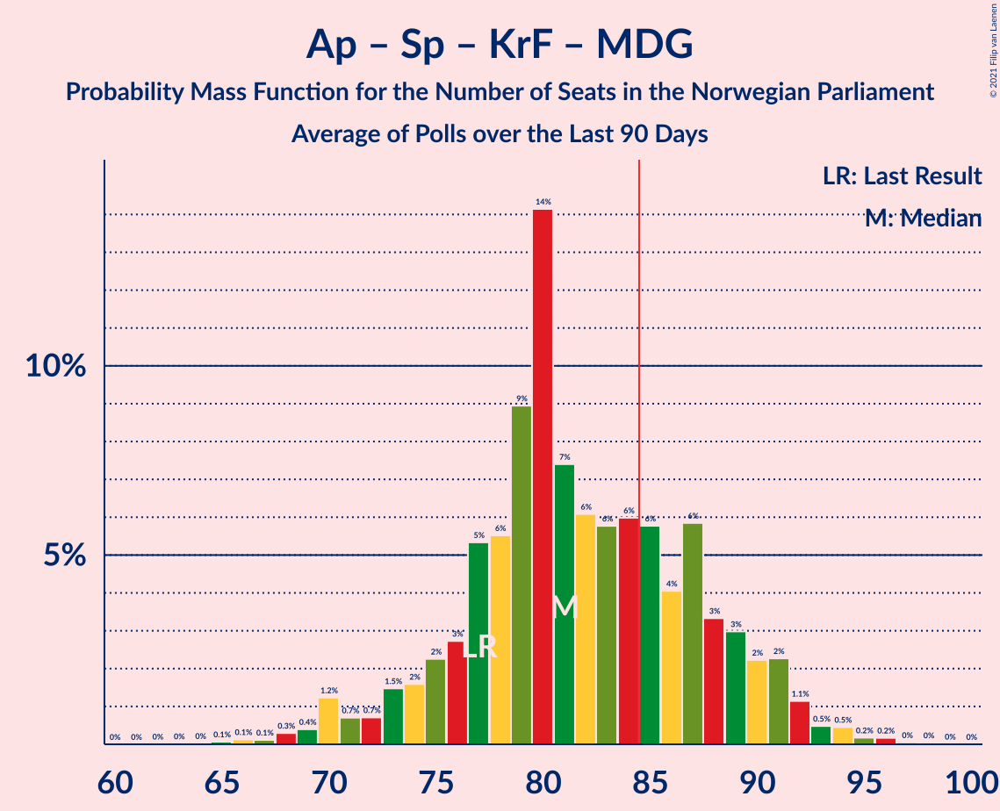

# Poll Average

<a href="#voting-intentions">Voting Intentions</a> | <a href="#seats">Seats</a> | <a href="#coalitions">Coalitions</a> | <a href="#technical-information">Technical Information</a>

## Summary

The table below lists the polls on which the average is based. They are the most recent polls (less than 90 days old) registered and analyzed so far.

| Period     | Polling firm/Commissioner(s) | Ap | H | FrP | Sp | SV | V | KrF | MDG | R |
|:----------:|:----------------------------:|:--:|:--:|:--:|:--:|:--:|:--:|:--:|:--:|:--:|
| 8–9 September 2013 | General Election | 27.4%   49 | 25.0%   45 | 15.2%   27 | 10.3%   19 | 6.0%   11 | 4.4%   8 | 4.2%   8 | 3.2%   1 | 2.4%   1 |
| N/A | Poll Average | 20–29%   39–53 | 17–23%   30–42 | 8–13%   13–24 | 10–21%   18–39 | 7–12%   11–20 | 3–6%   2–10 | 2–5%   1–9 | 3–8%   1–13 | 3–7%   2–11 |
| [16–22 August 2021](2021-08-22-Norstat.html) | Norstat   Aftenposten | 23–30%   43–58 | 16–22%   28–40 | 8–13%   14–24 | 10–16%   18–29 | 7–12%   12–21 | 3–6%   2–9 | 2–5%   1–9 | 4–7%   2–13 | 3–7%   2–11 |
| [16–20 August 2021](2021-08-20-KantarTNS.html) | Kantar TNS   TV2 | 20–26%   39–49 | 17–23%   30–41 | 7–11%   11–20 | 11–15%   18–30 | 8–12%   11–19 | 3–6%   2–9 | 2–5%   1–7 | 4–7%   2–10 | 4–8%   6–12 |
| [17–18 August 2021](2021-08-18-Sentio.html) | Sentio   Nettavisen | 21–27%   40–51 | 17–22%   29–38 | 8–12%   13–21 | 11–15%   20–29 | 7–11%   10–17 | 3–5%   2–8 | 3–5%   1–8 | 6–9%   9–15 | 4–7%   7–11 |
| [13–18 August 2021](2021-08-18-ResponsAnalyse.html) | Respons Analyse   Bergens Tidende and VG | 22–28%   41–50 | 18–23%   32–41 | 10–14%   17–25 | 9–13%   17–24 | 8–11%   12–20 | 4–7%   2–11 | 3–6%   2–9 | 5–7%   8–13 | 4–6%   2–10 |
| [3–8 August 2021](2021-08-08-OpinionPerduco.html) | Opinion Perduco   Avisenes Nyhetsbyrå, Dagsavisen and FriFagbevegelse | 20–26%   37–48 | 18–24%   33–45 | 7–12%   12–21 | 17–22%   31–41 | 7–11%   11–20 | 3–5%   2–10 | 3–6%   1–10 | 2–5%   1–9 | 3–5%   1–10 |
| [3–4 August 2021](2021-08-04-Norfakta.html) | Norfakta   Klassekampen and Nationen | 21–27%   38–49 | 18–24%   32–43 | 9–13%   15–24 | 13–19%   24–35 | 7–11%   12–19 | 3–6%   2–11 | 2–4%   0–7 | 3–6%   2–11 | 4–7%   2–12 |
| 8–9 September 2013 | General Election | 27.4%   49 | 25.0%   45 | 15.2%   27 | 10.3%   19 | 6.0%   11 | 4.4%   8 | 4.2%   8 | 3.2%   1 | 2.4%   1 |

Only polls for which at least the sample size has been published are included in the table above.

**Legend:**
+ **Top half of each row:** Voting intentions (95% confidence interval)
+ **Bottom half of each row:** Seat projections for the Norwegian Parliament (95% confidence interval)
+ **Ap:** Arbeiderpartiet
+ **H:** Høyre
+ **FrP:** Fremskrittspartiet
+ **Sp:** Senterpartiet
+ **SV:** Sosialistisk Venstreparti
+ **V:** Venstre
+ **KrF:** Kristelig Folkeparti
+ **MDG:** Miljøpartiet De Grønne
+ **R:** Rødt
+ **N/A (single party):** Party not included the published results
+ **N/A (entire row):** Calculation for this opinion poll not started yet

## Voting Intentions

### Confidence Intervals

| Party | Last Result | Median | 80% Confidence Interval | 90% Confidence Interval | 95% Confidence Interval | 99% Confidence Interval |
|:-----:|:-----------:|:------:|:-----------------------:|:-----------------------:|:-----------------------:|:-----------------------:|
| <a href="#arbeiderpartiet">Arbeiderpartiet</a> | 27.4% | 24.0% | 21.7–26.9% |21.0–27.9% | 20.5–28.7% | 19.5–30.2% |
| <a href="#høyre">Høyre</a> | 25.0% | 20.1% | 18.0–22.2% |17.5–22.8% | 17.0–23.4% | 16.0–24.5% |
| <a href="#fremskrittspartiet">Fremskrittspartiet</a> | 15.2% | 10.2% | 8.6–12.1% |8.2–12.7% | 7.8–13.1% | 7.2–13.9% |
| <a href="#senterpartiet">Senterpartiet</a> | 10.3% | 13.6% | 11.2–19.0% |10.6–20.1% | 10.2–20.8% | 9.5–22.1% |
| <a href="#sosialistisk-venstreparti">Sosialistisk Venstreparti</a> | 6.0% | 9.2% | 7.9–10.7% |7.5–11.1% | 7.2–11.5% | 6.6–12.3% |
| <a href="#venstre">Venstre</a> | 4.4% | 4.3% | 3.3–5.5% |3.0–5.8% | 2.8–6.1% | 2.5–6.7% |
| <a href="#kristelig-folkeparti">Kristelig Folkeparti</a> | 4.2% | 3.8% | 2.8–4.8% |2.5–5.1% | 2.3–5.4% | 1.9–5.9% |
| <a href="#miljøpartiet-de-grønne">Miljøpartiet De Grønne</a> | 3.2% | 5.3% | 3.6–7.2% |3.2–7.8% | 2.9–8.2% | 2.5–8.9% |
| <a href="#rødt">Rødt</a> | 2.4% | 5.1% | 3.8–6.4% |3.4–6.8% | 3.1–7.1% | 2.7–7.8% |

### Arbeiderpartiet

*For a full overview of the results for this party, see the [Arbeiderpartiet](party-arbeiderpartiet.html) page.*

| Voting Intentions | Probability | Accumulated | Special Marks |
|:-----------------:|:-----------:|:-----------:|:-------------:|
| 16.5–17.5% | 0% | 100% |  |
| 17.5–18.5% | 0.1% | 100% |  |
| 18.5–19.5% | 0.5% | 99.9% |  |
| 19.5–20.5% | 2% | 99.5% |  |
| 20.5–21.5% | 6% | 97% |  |
| 21.5–22.5% | 13% | 91% |  |
| 22.5–23.5% | 18% | 78% |  |
| 23.5–24.5% | 20% | 60% | Median |
| 24.5–25.5% | 16% | 40% |  |
| 25.5–26.5% | 11% | 23% |  |
| 26.5–27.5% | 6% | 13% | Last Result |
| 27.5–28.5% | 3% | 6% |  |
| 28.5–29.5% | 2% | 3% |  |
| 29.5–30.5% | 0.7% | 1.1% |  |
| 30.5–31.5% | 0.2% | 0.3% |  |
| 31.5–32.5% | 0.1% | 0.1% |  |
| 32.5–33.5% | 0% | 0% |  |

### Høyre

*For a full overview of the results for this party, see the [Høyre](party-høyre.html) page.*

| Voting Intentions | Probability | Accumulated | Special Marks |
|:-----------------:|:-----------:|:-----------:|:-------------:|
| 13.5–14.5% | 0% | 100% |  |
| 14.5–15.5% | 0.2% | 100% |  |
| 15.5–16.5% | 1.1% | 99.8% |  |
| 16.5–17.5% | 4% | 98.7% |  |
| 17.5–18.5% | 12% | 94% |  |
| 18.5–19.5% | 21% | 83% |  |
| 19.5–20.5% | 24% | 62% | Median |
| 20.5–21.5% | 20% | 38% |  |
| 21.5–22.5% | 12% | 19% |  |
| 22.5–23.5% | 5% | 7% |  |
| 23.5–24.5% | 2% | 2% |  |
| 24.5–25.5% | 0.4% | 0.4% | Last Result |
| 25.5–26.5% | 0.1% | 0.1% |  |
| 26.5–27.5% | 0% | 0% |  |

### Fremskrittspartiet

*For a full overview of the results for this party, see the [Fremskrittspartiet](party-fremskrittspartiet.html) page.*

| Voting Intentions | Probability | Accumulated | Special Marks |
|:-----------------:|:-----------:|:-----------:|:-------------:|
| 5.5–6.5% | 0.1% | 100% |  |
| 6.5–7.5% | 1.2% | 99.9% |  |
| 7.5–8.5% | 8% | 98.7% |  |
| 8.5–9.5% | 21% | 91% |  |
| 9.5–10.5% | 27% | 69% | Median |
| 10.5–11.5% | 23% | 42% |  |
| 11.5–12.5% | 13% | 19% |  |
| 12.5–13.5% | 5% | 6% |  |
| 13.5–14.5% | 1.0% | 1.1% |  |
| 14.5–15.5% | 0.1% | 0.1% | Last Result |
| 15.5–16.5% | 0% | 0% |  |

### Senterpartiet

*For a full overview of the results for this party, see the [Senterpartiet](party-senterpartiet.html) page.*

| Voting Intentions | Probability | Accumulated | Special Marks |
|:-----------------:|:-----------:|:-----------:|:-------------:|
| 7.5–8.5% | 0% | 100% |  |
| 8.5–9.5% | 0.6% | 100% |  |
| 9.5–10.5% | 4% | 99.4% | Last Result |
| 10.5–11.5% | 11% | 96% |  |
| 11.5–12.5% | 17% | 85% |  |
| 12.5–13.5% | 18% | 68% |  |
| 13.5–14.5% | 14% | 50% | Median |
| 14.5–15.5% | 9% | 36% |  |
| 15.5–16.5% | 6% | 28% |  |
| 16.5–17.5% | 5% | 22% |  |
| 17.5–18.5% | 5% | 17% |  |
| 18.5–19.5% | 5% | 12% |  |
| 19.5–20.5% | 4% | 7% |  |
| 20.5–21.5% | 2% | 3% |  |
| 21.5–22.5% | 0.8% | 1.1% |  |
| 22.5–23.5% | 0.2% | 0.3% |  |
| 23.5–24.5% | 0% | 0% |  |

### Sosialistisk Venstreparti

*For a full overview of the results for this party, see the [Sosialistisk Venstreparti](party-sosialistiskvenstreparti.html) page.*

| Voting Intentions | Probability | Accumulated | Special Marks |
|:-----------------:|:-----------:|:-----------:|:-------------:|
| 4.5–5.5% | 0% | 100% |  |
| 5.5–6.5% | 0.4% | 100% | Last Result |
| 6.5–7.5% | 5% | 99.6% |  |
| 7.5–8.5% | 22% | 94% |  |
| 8.5–9.5% | 36% | 73% | Median |
| 9.5–10.5% | 25% | 37% |  |
| 10.5–11.5% | 9% | 12% |  |
| 11.5–12.5% | 2% | 2% |  |
| 12.5–13.5% | 0.3% | 0.3% |  |
| 13.5–14.5% | 0% | 0% |  |

### Venstre

*For a full overview of the results for this party, see the [Venstre](party-venstre.html) page.*

| Voting Intentions | Probability | Accumulated | Special Marks |
|:-----------------:|:-----------:|:-----------:|:-------------:|
| 0.5–1.5% | 0% | 100% |  |
| 1.5–2.5% | 0.7% | 100% |  |
| 2.5–3.5% | 17% | 99.3% |  |
| 3.5–4.5% | 43% | 82% | Last Result, Median |
| 4.5–5.5% | 30% | 39% |  |
| 5.5–6.5% | 8% | 9% |  |
| 6.5–7.5% | 0.7% | 0.7% |  |
| 7.5–8.5% | 0% | 0% |  |

### Kristelig Folkeparti

*For a full overview of the results for this party, see the [Kristelig Folkeparti](party-kristeligfolkeparti.html) page.*

| Voting Intentions | Probability | Accumulated | Special Marks |
|:-----------------:|:-----------:|:-----------:|:-------------:|
| 0.5–1.5% | 0% | 100% |  |
| 1.5–2.5% | 6% | 100% |  |
| 2.5–3.5% | 33% | 94% |  |
| 3.5–4.5% | 45% | 61% | Last Result, Median |
| 4.5–5.5% | 15% | 17% |  |
| 5.5–6.5% | 2% | 2% |  |
| 6.5–7.5% | 0.1% | 0.1% |  |
| 7.5–8.5% | 0% | 0% |  |

### Miljøpartiet De Grønne

*For a full overview of the results for this party, see the [Miljøpartiet De Grønne](party-miljøpartietdegrønne.html) page.*

| Voting Intentions | Probability | Accumulated | Special Marks |
|:-----------------:|:-----------:|:-----------:|:-------------:|
| 0.5–1.5% | 0% | 100% |  |
| 1.5–2.5% | 0.7% | 100% |  |
| 2.5–3.5% | 8% | 99.3% | Last Result |
| 3.5–4.5% | 21% | 91% |  |
| 4.5–5.5% | 29% | 70% | Median |
| 5.5–6.5% | 22% | 42% |  |
| 6.5–7.5% | 13% | 19% |  |
| 7.5–8.5% | 6% | 7% |  |
| 8.5–9.5% | 1.1% | 1.1% |  |
| 9.5–10.5% | 0.1% | 0.1% |  |
| 10.5–11.5% | 0% | 0% |  |

### Rødt

*For a full overview of the results for this party, see the [Rødt](party-rødt.html) page.*

| Voting Intentions | Probability | Accumulated | Special Marks |
|:-----------------:|:-----------:|:-----------:|:-------------:|
| 0.5–1.5% | 0% | 100% |  |
| 1.5–2.5% | 0.3% | 100% | Last Result |
| 2.5–3.5% | 6% | 99.7% |  |
| 3.5–4.5% | 25% | 93% |  |
| 4.5–5.5% | 37% | 69% | Median |
| 5.5–6.5% | 24% | 32% |  |
| 6.5–7.5% | 7% | 8% |  |
| 7.5–8.5% | 0.9% | 1.0% |  |
| 8.5–9.5% | 0.1% | 0.1% |  |
| 9.5–10.5% | 0% | 0% |  |

## Seats

### Confidence Intervals

| Party | Last Result | Median | 80% Confidence Interval | 90% Confidence Interval | 95% Confidence Interval | 99% Confidence Interval |
|:-----:|:-----------:|:------:|:-----------------------:|:-----------------------:|:-----------------------:|:-----------------------:|
| <a href="#arbeiderpartiet">Arbeiderpartiet</a> | 49 | 44 | 41–49 |40–52 | 39–53 | 36–58 |
| <a href="#høyre">Høyre</a> | 45 | 36 | 32–40 |31–41 | 30–42 | 28–45 |
| <a href="#fremskrittspartiet">Fremskrittspartiet</a> | 27 | 18 | 14–21 |14–22 | 13–24 | 11–25 |
| <a href="#senterpartiet">Senterpartiet</a> | 19 | 25 | 20–36 |19–37 | 18–39 | 17–41 |
| <a href="#sosialistisk-venstreparti">Sosialistisk Venstreparti</a> | 11 | 16 | 12–18 |12–19 | 11–20 | 10–21 |
| <a href="#venstre">Venstre</a> | 8 | 7 | 2–9 |2–10 | 2–10 | 2–11 |
| <a href="#kristelig-folkeparti">Kristelig Folkeparti</a> | 8 | 3 | 1–8 |1–8 | 1–9 | 0–10 |
| <a href="#miljøpartiet-de-grønne">Miljøpartiet De Grønne</a> | 1 | 8 | 2–13 |2–13 | 1–13 | 1–15 |
| <a href="#rødt">Rødt</a> | 1 | 8 | 2–10 |2–11 | 2–11 | 1–12 |

### Arbeiderpartiet

*For a full overview of the results for this party, see the [Arbeiderpartiet](party-arbeiderpartiet.html) page.*

| Number of Seats | Probability | Accumulated | Special Marks |
|:---------------:|:-----------:|:-----------:|:-------------:|
| 34 | 0.1% | 100% |  |
| 35 | 0.1% | 99.9% |  |
| 36 | 0.3% | 99.7% |  |
| 37 | 0.4% | 99.5% |  |
| 38 | 0.8% | 99.0% |  |
| 39 | 2% | 98% |  |
| 40 | 5% | 96% |  |
| 41 | 9% | 91% |  |
| 42 | 13% | 82% |  |
| 43 | 18% | 69% |  |
| 44 | 14% | 51% | Median |
| 45 | 9% | 37% |  |
| 46 | 7% | 28% |  |
| 47 | 6% | 21% |  |
| 48 | 3% | 15% |  |
| 49 | 2% | 12% | Last Result |
| 50 | 2% | 10% |  |
| 51 | 1.3% | 8% |  |
| 52 | 4% | 6% |  |
| 53 | 0.5% | 3% |  |
| 54 | 0.4% | 2% |  |
| 55 | 0.3% | 2% |  |
| 56 | 0.1% | 2% |  |
| 57 | 0.3% | 1.4% |  |
| 58 | 0.9% | 1.2% |  |
| 59 | 0.2% | 0.2% |  |
| 60 | 0% | 0% |  |

### Høyre

*For a full overview of the results for this party, see the [Høyre](party-høyre.html) page.*

| Number of Seats | Probability | Accumulated | Special Marks |
|:---------------:|:-----------:|:-----------:|:-------------:|
| 24 | 0% | 100% |  |
| 25 | 0.1% | 99.9% |  |
| 26 | 0.1% | 99.9% |  |
| 27 | 0% | 99.8% |  |
| 28 | 0.7% | 99.8% |  |
| 29 | 1.0% | 99.1% |  |
| 30 | 2% | 98% |  |
| 31 | 3% | 96% |  |
| 32 | 9% | 93% |  |
| 33 | 5% | 84% |  |
| 34 | 9% | 79% |  |
| 35 | 15% | 70% |  |
| 36 | 23% | 55% | Median |
| 37 | 9% | 32% |  |
| 38 | 8% | 24% |  |
| 39 | 4% | 15% |  |
| 40 | 4% | 11% |  |
| 41 | 3% | 7% |  |
| 42 | 2% | 4% |  |
| 43 | 1.2% | 2% |  |
| 44 | 0.4% | 1.0% |  |
| 45 | 0.4% | 0.7% | Last Result |
| 46 | 0.2% | 0.3% |  |
| 47 | 0% | 0.1% |  |
| 48 | 0% | 0% |  |

### Fremskrittspartiet

*For a full overview of the results for this party, see the [Fremskrittspartiet](party-fremskrittspartiet.html) page.*

| Number of Seats | Probability | Accumulated | Special Marks |
|:---------------:|:-----------:|:-----------:|:-------------:|
| 9 | 0.1% | 100% |  |
| 10 | 0.2% | 99.9% |  |
| 11 | 0.8% | 99.7% |  |
| 12 | 1.3% | 98.9% |  |
| 13 | 2% | 98% |  |
| 14 | 7% | 95% |  |
| 15 | 7% | 88% |  |
| 16 | 13% | 81% |  |
| 17 | 17% | 69% |  |
| 18 | 14% | 52% | Median |
| 19 | 10% | 38% |  |
| 20 | 11% | 28% |  |
| 21 | 8% | 17% |  |
| 22 | 4% | 9% |  |
| 23 | 2% | 5% |  |
| 24 | 2% | 3% |  |
| 25 | 0.7% | 1.2% |  |
| 26 | 0.4% | 0.5% |  |
| 27 | 0.1% | 0.1% | Last Result |
| 28 | 0% | 0% |  |

### Senterpartiet

*For a full overview of the results for this party, see the [Senterpartiet](party-senterpartiet.html) page.*

| Number of Seats | Probability | Accumulated | Special Marks |
|:---------------:|:-----------:|:-----------:|:-------------:|
| 15 | 0.2% | 100% |  |
| 16 | 0.2% | 99.8% |  |
| 17 | 1.0% | 99.6% |  |
| 18 | 3% | 98.6% |  |
| 19 | 4% | 96% | Last Result |
| 20 | 12% | 92% |  |
| 21 | 13% | 80% |  |
| 22 | 6% | 66% |  |
| 23 | 8% | 60% |  |
| 24 | 3% | 53% |  |
| 25 | 5% | 50% | Median |
| 26 | 5% | 45% |  |
| 27 | 6% | 40% |  |
| 28 | 3% | 34% |  |
| 29 | 6% | 31% |  |
| 30 | 2% | 26% |  |
| 31 | 3% | 24% |  |
| 32 | 3% | 21% |  |
| 33 | 2% | 17% |  |
| 34 | 2% | 15% |  |
| 35 | 3% | 14% |  |
| 36 | 4% | 11% |  |
| 37 | 3% | 7% |  |
| 38 | 1.3% | 4% |  |
| 39 | 1.4% | 3% |  |
| 40 | 0.6% | 1.3% |  |
| 41 | 0.3% | 0.7% |  |
| 42 | 0.1% | 0.4% |  |
| 43 | 0.1% | 0.2% |  |
| 44 | 0.1% | 0.1% |  |
| 45 | 0% | 0% |  |

### Sosialistisk Venstreparti

*For a full overview of the results for this party, see the [Sosialistisk Venstreparti](party-sosialistiskvenstreparti.html) page.*

| Number of Seats | Probability | Accumulated | Special Marks |
|:---------------:|:-----------:|:-----------:|:-------------:|
| 9 | 0.2% | 100% |  |
| 10 | 1.1% | 99.8% |  |
| 11 | 2% | 98.8% | Last Result |
| 12 | 8% | 97% |  |
| 13 | 9% | 89% |  |
| 14 | 11% | 81% |  |
| 15 | 18% | 70% |  |
| 16 | 23% | 52% | Median |
| 17 | 10% | 29% |  |
| 18 | 13% | 20% |  |
| 19 | 4% | 7% |  |
| 20 | 2% | 3% |  |
| 21 | 0.7% | 1.2% |  |
| 22 | 0.4% | 0.5% |  |
| 23 | 0% | 0.1% |  |
| 24 | 0% | 0.1% |  |
| 25 | 0% | 0% |  |

### Venstre

*For a full overview of the results for this party, see the [Venstre](party-venstre.html) page.*

| Number of Seats | Probability | Accumulated | Special Marks |
|:---------------:|:-----------:|:-----------:|:-------------:|
| 1 | 0.2% | 100% |  |
| 2 | 31% | 99.8% |  |
| 3 | 3% | 69% |  |
| 4 | 0.1% | 66% |  |
| 5 | 0.2% | 66% |  |
| 6 | 7% | 66% |  |
| 7 | 21% | 59% | Median |
| 8 | 16% | 38% | Last Result |
| 9 | 17% | 22% |  |
| 10 | 4% | 5% |  |
| 11 | 1.3% | 2% |  |
| 12 | 0.3% | 0.3% |  |
| 13 | 0% | 0.1% |  |
| 14 | 0% | 0% |  |

### Kristelig Folkeparti

*For a full overview of the results for this party, see the [Kristelig Folkeparti](party-kristeligfolkeparti.html) page.*

| Number of Seats | Probability | Accumulated | Special Marks |
|:---------------:|:-----------:|:-----------:|:-------------:|
| 0 | 2% | 100% |  |
| 1 | 16% | 98% |  |
| 2 | 11% | 82% |  |
| 3 | 35% | 71% | Median |
| 4 | 0% | 36% |  |
| 5 | 0.4% | 36% |  |
| 6 | 8% | 35% |  |
| 7 | 15% | 27% |  |
| 8 | 8% | 12% | Last Result |
| 9 | 3% | 4% |  |
| 10 | 1.1% | 1.4% |  |
| 11 | 0.3% | 0.3% |  |
| 12 | 0% | 0% |  |

### Miljøpartiet De Grønne

*For a full overview of the results for this party, see the [Miljøpartiet De Grønne](party-miljøpartietdegrønne.html) page.*

| Number of Seats | Probability | Accumulated | Special Marks |
|:---------------:|:-----------:|:-----------:|:-------------:|
| 1 | 3% | 100% | Last Result |
| 2 | 12% | 97% |  |
| 3 | 1.4% | 85% |  |
| 4 | 0.7% | 84% |  |
| 5 | 0.1% | 83% |  |
| 6 | 3% | 83% |  |
| 7 | 14% | 80% |  |
| 8 | 17% | 66% | Median |
| 9 | 12% | 49% |  |
| 10 | 15% | 37% |  |
| 11 | 7% | 22% |  |
| 12 | 5% | 15% |  |
| 13 | 8% | 10% |  |
| 14 | 2% | 2% |  |
| 15 | 0.6% | 0.7% |  |
| 16 | 0.2% | 0.2% |  |
| 17 | 0% | 0% |  |

### Rødt

*For a full overview of the results for this party, see the [Rødt](party-rødt.html) page.*

| Number of Seats | Probability | Accumulated | Special Marks |
|:---------------:|:-----------:|:-----------:|:-------------:|
| 1 | 1.0% | 100% | Last Result |
| 2 | 15% | 99.0% |  |
| 3 | 0.1% | 84% |  |
| 4 | 0% | 84% |  |
| 5 | 0.1% | 84% |  |
| 6 | 2% | 84% |  |
| 7 | 15% | 82% |  |
| 8 | 22% | 67% | Median |
| 9 | 26% | 45% |  |
| 10 | 11% | 19% |  |
| 11 | 5% | 8% |  |
| 12 | 2% | 2% |  |
| 13 | 0.3% | 0.5% |  |
| 14 | 0.1% | 0.1% |  |
| 15 | 0% | 0% |  |

## Coalitions

### Confidence Intervals

| Coalition | Last Result | Median | Majority? | 80% Confidence Interval | 90% Confidence Interval | 95% Confidence Interval | 99% Confidence Interval |
|:---------:|:-----------:|:------:|:---------:|:-----------------------:|:-----------------------:|:-----------------------:|:-----------------------:|
| Arbeiderpartiet – Senterpartiet – Sosialistisk Venstreparti – Miljøpartiet De Grønne – Rødt | 81 | 101 | 100% | 95–108 | 94–109 | 93–110 | 90–114 |
| Arbeiderpartiet – Senterpartiet – Sosialistisk Venstreparti – Kristelig Folkeparti – Miljøpartiet De Grønne | 88 | 97 | 99.7% | 92–104 | 90–107 | 88–108 | 86–111 |
| Arbeiderpartiet – Senterpartiet – Sosialistisk Venstreparti – Rødt | 80 | 93 | 95% | 87–100 | 84–103 | 84–105 | 82–108 |
| Høyre – Fremskrittspartiet – Senterpartiet – Venstre – Kristelig Folkeparti | 107 | 89 | 72% | 79–100 | 79–102 | 77–105 | 74–109 |
| Arbeiderpartiet – Senterpartiet – Sosialistisk Venstreparti – Miljøpartiet De Grønne | 80 | 93 | 98% | 88–100 | 86–102 | 85–103 | 82–107 |
| Arbeiderpartiet – Senterpartiet – Sosialistisk Venstreparti | 79 | 85 | 53% | 79–94 | 77–96 | 76–99 | 74–102 |
| Arbeiderpartiet – Senterpartiet – Kristelig Folkeparti – Miljøpartiet De Grønne | 77 | 82 | 31% | 76–89 | 74–91 | 73–92 | 70–96 |
| Arbeiderpartiet – Senterpartiet – Kristelig Folkeparti | 76 | 73 | 7% | 67–83 | 66–85 | 65–88 | 63–90 |
| Arbeiderpartiet – Sosialistisk Venstreparti – Miljøpartiet De Grønne – Rødt | 62 | 76 | 4% | 67–83 | 63–84 | 60–87 | 58–90 |
| Høyre – Fremskrittspartiet – Venstre – Kristelig Folkeparti – Miljøpartiet De Grønne | 89 | 71 | 2% | 64–81 | 63–83 | 61–84 | 59–87 |
| Arbeiderpartiet – Senterpartiet | 68 | 70 | 0.6% | 63–78 | 62–80 | 61–81 | 59–85 |
| Høyre – Fremskrittspartiet – Venstre – Kristelig Folkeparti | 88 | 63 | 0% | 57–72 | 54–73 | 54–75 | 51–77 |
| Arbeiderpartiet – Sosialistisk Venstreparti | 60 | 59 | 0% | 55–65 | 54–68 | 53–69 | 51–73 |
| Høyre – Fremskrittspartiet – Venstre | 80 | 59 | 0% | 53–67 | 51–68 | 50–69 | 48–72 |
| Høyre – Fremskrittspartiet | 72 | 53 | 0% | 49–59 | 47–61 | 46–62 | 43–64 |
| Høyre – Venstre – Kristelig Folkeparti | 61 | 45 | 0% | 40–52 | 38–53 | 37–54 | 34–57 |
| Senterpartiet – Venstre – Kristelig Folkeparti | 35 | 35 | 0% | 28–45 | 26–48 | 26–50 | 23–54 |

### Arbeiderpartiet – Senterpartiet – Sosialistisk Venstreparti – Miljøpartiet De Grønne – Rødt

| Number of Seats | Probability | Accumulated | Special Marks |
|:---------------:|:-----------:|:-----------:|:-------------:|
| 81 | 0% | 100% | Last Result |
| 82 | 0% | 100% |  |
| 83 | 0% | 100% |  |
| 84 | 0% | 100% |  |
| 85 | 0% | 100% | Majority |
| 86 | 0% | 100% |  |
| 87 | 0.1% | 100% |  |
| 88 | 0.1% | 99.9% |  |
| 89 | 0.2% | 99.8% |  |
| 90 | 0.3% | 99.6% |  |
| 91 | 0.4% | 99.3% |  |
| 92 | 0.7% | 98.9% |  |
| 93 | 1.1% | 98% |  |
| 94 | 3% | 97% |  |
| 95 | 4% | 94% |  |
| 96 | 4% | 90% |  |
| 97 | 9% | 86% |  |
| 98 | 10% | 77% |  |
| 99 | 6% | 67% |  |
| 100 | 6% | 62% |  |
| 101 | 6% | 56% | Median |
| 102 | 11% | 50% |  |
| 103 | 6% | 39% |  |
| 104 | 5% | 33% |  |
| 105 | 5% | 28% |  |
| 106 | 5% | 23% |  |
| 107 | 7% | 17% |  |
| 108 | 3% | 10% |  |
| 109 | 2% | 7% |  |
| 110 | 3% | 5% |  |
| 111 | 0.8% | 2% |  |
| 112 | 0.3% | 2% |  |
| 113 | 0.8% | 1.4% |  |
| 114 | 0.2% | 0.6% |  |
| 115 | 0.3% | 0.5% |  |
| 116 | 0.1% | 0.1% |  |
| 117 | 0% | 0.1% |  |
| 118 | 0% | 0% |  |

### Arbeiderpartiet – Senterpartiet – Sosialistisk Venstreparti – Kristelig Folkeparti – Miljøpartiet De Grønne

| Number of Seats | Probability | Accumulated | Special Marks |
|:---------------:|:-----------:|:-----------:|:-------------:|
| 82 | 0% | 100% |  |
| 83 | 0.1% | 99.9% |  |
| 84 | 0.1% | 99.9% |  |
| 85 | 0.2% | 99.7% | Majority |
| 86 | 0.4% | 99.6% |  |
| 87 | 0.7% | 99.2% |  |
| 88 | 1.1% | 98% | Last Result |
| 89 | 1.0% | 97% |  |
| 90 | 3% | 96% |  |
| 91 | 2% | 93% |  |
| 92 | 3% | 90% |  |
| 93 | 4% | 87% |  |
| 94 | 6% | 83% |  |
| 95 | 7% | 77% |  |
| 96 | 12% | 70% | Median |
| 97 | 10% | 58% |  |
| 98 | 6% | 48% |  |
| 99 | 7% | 42% |  |
| 100 | 5% | 35% |  |
| 101 | 8% | 30% |  |
| 102 | 4% | 22% |  |
| 103 | 4% | 17% |  |
| 104 | 4% | 13% |  |
| 105 | 3% | 9% |  |
| 106 | 1.5% | 7% |  |
| 107 | 2% | 5% |  |
| 108 | 1.3% | 4% |  |
| 109 | 1.1% | 2% |  |
| 110 | 0.4% | 1.1% |  |
| 111 | 0.3% | 0.7% |  |
| 112 | 0.1% | 0.4% |  |
| 113 | 0.1% | 0.3% |  |
| 114 | 0.1% | 0.2% |  |
| 115 | 0.1% | 0.1% |  |
| 116 | 0% | 0% |  |

### Arbeiderpartiet – Senterpartiet – Sosialistisk Venstreparti – Rødt

| Number of Seats | Probability | Accumulated | Special Marks |
|:---------------:|:-----------:|:-----------:|:-------------:|
| 78 | 0% | 100% |  |
| 79 | 0.1% | 99.9% |  |
| 80 | 0.2% | 99.9% | Last Result |
| 81 | 0.2% | 99.7% |  |
| 82 | 0.4% | 99.5% |  |
| 83 | 0.8% | 99.1% |  |
| 84 | 3% | 98% |  |
| 85 | 2% | 95% | Majority |
| 86 | 3% | 93% |  |
| 87 | 5% | 90% |  |
| 88 | 5% | 85% |  |
| 89 | 9% | 80% |  |
| 90 | 5% | 72% |  |
| 91 | 8% | 66% |  |
| 92 | 5% | 58% |  |
| 93 | 5% | 52% | Median |
| 94 | 5% | 47% |  |
| 95 | 7% | 42% |  |
| 96 | 4% | 35% |  |
| 97 | 9% | 30% |  |
| 98 | 4% | 21% |  |
| 99 | 4% | 17% |  |
| 100 | 4% | 13% |  |
| 101 | 2% | 10% |  |
| 102 | 2% | 8% |  |
| 103 | 1.2% | 6% |  |
| 104 | 2% | 4% |  |
| 105 | 1.1% | 3% |  |
| 106 | 0.3% | 1.4% |  |
| 107 | 0.5% | 1.1% |  |
| 108 | 0.3% | 0.6% |  |
| 109 | 0.2% | 0.3% |  |
| 110 | 0.1% | 0.1% |  |
| 111 | 0% | 0% |  |

### Høyre – Fremskrittspartiet – Senterpartiet – Venstre – Kristelig Folkeparti

| Number of Seats | Probability | Accumulated | Special Marks |
|:---------------:|:-----------:|:-----------:|:-------------:|
| 71 | 0% | 100% |  |
| 72 | 0.2% | 99.9% |  |
| 73 | 0.1% | 99.7% |  |
| 74 | 0.3% | 99.7% |  |
| 75 | 0.5% | 99.3% |  |
| 76 | 0.6% | 98.8% |  |
| 77 | 0.8% | 98% |  |
| 78 | 1.3% | 97% |  |
| 79 | 6% | 96% |  |
| 80 | 2% | 90% |  |
| 81 | 4% | 88% |  |
| 82 | 3% | 85% |  |
| 83 | 4% | 81% |  |
| 84 | 5% | 78% |  |
| 85 | 10% | 72% | Majority |
| 86 | 3% | 62% |  |
| 87 | 5% | 59% |  |
| 88 | 4% | 54% |  |
| 89 | 4% | 50% | Median |
| 90 | 4% | 46% |  |
| 91 | 4% | 43% |  |
| 92 | 5% | 39% |  |
| 93 | 5% | 34% |  |
| 94 | 3% | 29% |  |
| 95 | 6% | 26% |  |
| 96 | 3% | 20% |  |
| 97 | 2% | 17% |  |
| 98 | 2% | 15% |  |
| 99 | 2% | 13% |  |
| 100 | 2% | 11% |  |
| 101 | 2% | 9% |  |
| 102 | 2% | 7% |  |
| 103 | 1.2% | 5% |  |
| 104 | 0.7% | 4% |  |
| 105 | 0.7% | 3% |  |
| 106 | 0.4% | 2% |  |
| 107 | 0.9% | 2% | Last Result |
| 108 | 0.3% | 1.1% |  |
| 109 | 0.3% | 0.7% |  |
| 110 | 0.2% | 0.4% |  |
| 111 | 0.2% | 0.3% |  |
| 112 | 0% | 0.1% |  |
| 113 | 0% | 0.1% |  |
| 114 | 0% | 0% |  |

### Arbeiderpartiet – Senterpartiet – Sosialistisk Venstreparti – Miljøpartiet De Grønne

| Number of Seats | Probability | Accumulated | Special Marks |
|:---------------:|:-----------:|:-----------:|:-------------:|
| 79 | 0% | 100% |  |
| 80 | 0.1% | 99.9% | Last Result |
| 81 | 0.2% | 99.9% |  |
| 82 | 0.3% | 99.7% |  |
| 83 | 0.5% | 99.4% |  |
| 84 | 0.7% | 99.0% |  |
| 85 | 2% | 98% | Majority |
| 86 | 2% | 96% |  |
| 87 | 3% | 94% |  |
| 88 | 7% | 91% |  |
| 89 | 5% | 84% |  |
| 90 | 3% | 78% |  |
| 91 | 8% | 75% |  |
| 92 | 7% | 66% |  |
| 93 | 10% | 60% | Median |
| 94 | 6% | 50% |  |
| 95 | 7% | 44% |  |
| 96 | 7% | 37% |  |
| 97 | 5% | 30% |  |
| 98 | 8% | 25% |  |
| 99 | 5% | 17% |  |
| 100 | 3% | 13% |  |
| 101 | 3% | 9% |  |
| 102 | 3% | 6% |  |
| 103 | 1.3% | 4% |  |
| 104 | 0.9% | 2% |  |
| 105 | 0.3% | 1.4% |  |
| 106 | 0.5% | 1.0% |  |
| 107 | 0.2% | 0.5% |  |
| 108 | 0.2% | 0.3% |  |
| 109 | 0% | 0.1% |  |
| 110 | 0% | 0.1% |  |
| 111 | 0% | 0.1% |  |
| 112 | 0% | 0% |  |

### Arbeiderpartiet – Senterpartiet – Sosialistisk Venstreparti

| Number of Seats | Probability | Accumulated | Special Marks |
|:---------------:|:-----------:|:-----------:|:-------------:|
| 72 | 0% | 100% |  |
| 73 | 0.1% | 99.9% |  |
| 74 | 0.4% | 99.8% |  |
| 75 | 0.9% | 99.4% |  |
| 76 | 1.1% | 98% |  |
| 77 | 4% | 97% |  |
| 78 | 4% | 94% |  |
| 79 | 5% | 90% | Last Result |
| 80 | 9% | 85% |  |
| 81 | 5% | 76% |  |
| 82 | 4% | 71% |  |
| 83 | 5% | 66% |  |
| 84 | 9% | 62% |  |
| 85 | 5% | 53% | Median, Majority |
| 86 | 4% | 47% |  |
| 87 | 6% | 43% |  |
| 88 | 7% | 37% |  |
| 89 | 5% | 31% |  |
| 90 | 4% | 26% |  |
| 91 | 3% | 22% |  |
| 92 | 3% | 19% |  |
| 93 | 4% | 16% |  |
| 94 | 4% | 12% |  |
| 95 | 3% | 8% |  |
| 96 | 2% | 5% |  |
| 97 | 0.6% | 4% |  |
| 98 | 0.6% | 3% |  |
| 99 | 0.8% | 3% |  |
| 100 | 0.6% | 2% |  |
| 101 | 0.6% | 1.1% |  |
| 102 | 0.2% | 0.5% |  |
| 103 | 0.2% | 0.4% |  |
| 104 | 0.1% | 0.2% |  |
| 105 | 0.1% | 0.1% |  |
| 106 | 0% | 0% |  |

### Arbeiderpartiet – Senterpartiet – Kristelig Folkeparti – Miljøpartiet De Grønne

| Number of Seats | Probability | Accumulated | Special Marks |
|:---------------:|:-----------:|:-----------:|:-------------:|
| 67 | 0% | 100% |  |
| 68 | 0.1% | 99.9% |  |
| 69 | 0.1% | 99.8% |  |
| 70 | 0.3% | 99.6% |  |
| 71 | 0.7% | 99.3% |  |
| 72 | 0.9% | 98.7% |  |
| 73 | 0.8% | 98% |  |
| 74 | 3% | 97% |  |
| 75 | 2% | 94% |  |
| 76 | 2% | 92% |  |
| 77 | 4% | 90% | Last Result |
| 78 | 5% | 86% |  |
| 79 | 8% | 81% |  |
| 80 | 13% | 73% | Median |
| 81 | 7% | 61% |  |
| 82 | 6% | 54% |  |
| 83 | 10% | 48% |  |
| 84 | 7% | 38% |  |
| 85 | 7% | 31% | Majority |
| 86 | 4% | 24% |  |
| 87 | 4% | 20% |  |
| 88 | 5% | 16% |  |
| 89 | 3% | 11% |  |
| 90 | 2% | 8% |  |
| 91 | 3% | 6% |  |
| 92 | 2% | 4% |  |
| 93 | 0.8% | 2% |  |
| 94 | 0.5% | 1.3% |  |
| 95 | 0.2% | 0.7% |  |
| 96 | 0.2% | 0.5% |  |
| 97 | 0.2% | 0.3% |  |
| 98 | 0.1% | 0.2% |  |
| 99 | 0% | 0.1% |  |
| 100 | 0% | 0% |  |

### Arbeiderpartiet – Senterpartiet – Kristelig Folkeparti

| Number of Seats | Probability | Accumulated | Special Marks |
|:---------------:|:-----------:|:-----------:|:-------------:|
| 61 | 0.1% | 100% |  |
| 62 | 0.3% | 99.8% |  |
| 63 | 0.6% | 99.6% |  |
| 64 | 1.0% | 99.0% |  |
| 65 | 0.9% | 98% |  |
| 66 | 3% | 97% |  |
| 67 | 9% | 95% |  |
| 68 | 3% | 86% |  |
| 69 | 6% | 82% |  |
| 70 | 7% | 76% |  |
| 71 | 7% | 70% |  |
| 72 | 6% | 62% | Median |
| 73 | 8% | 56% |  |
| 74 | 4% | 48% |  |
| 75 | 6% | 44% |  |
| 76 | 6% | 38% | Last Result |
| 77 | 4% | 32% |  |
| 78 | 6% | 28% |  |
| 79 | 3% | 22% |  |
| 80 | 2% | 19% |  |
| 81 | 3% | 17% |  |
| 82 | 2% | 14% |  |
| 83 | 3% | 12% |  |
| 84 | 2% | 9% |  |
| 85 | 2% | 7% | Majority |
| 86 | 2% | 5% |  |
| 87 | 0.8% | 3% |  |
| 88 | 0.9% | 3% |  |
| 89 | 0.9% | 2% |  |
| 90 | 0.3% | 0.8% |  |
| 91 | 0.2% | 0.5% |  |
| 92 | 0.1% | 0.2% |  |
| 93 | 0% | 0.1% |  |
| 94 | 0% | 0.1% |  |
| 95 | 0% | 0% |  |

### Arbeiderpartiet – Sosialistisk Venstreparti – Miljøpartiet De Grønne – Rødt

| Number of Seats | Probability | Accumulated | Special Marks |
|:---------------:|:-----------:|:-----------:|:-------------:|
| 55 | 0% | 100% |  |
| 56 | 0.1% | 99.9% |  |
| 57 | 0.2% | 99.9% |  |
| 58 | 0.3% | 99.7% |  |
| 59 | 0.5% | 99.4% |  |
| 60 | 1.5% | 98.9% |  |
| 61 | 0.7% | 97% |  |
| 62 | 1.5% | 97% | Last Result |
| 63 | 0.8% | 95% |  |
| 64 | 1.0% | 94% |  |
| 65 | 0.8% | 93% |  |
| 66 | 2% | 93% |  |
| 67 | 2% | 91% |  |
| 68 | 2% | 89% |  |
| 69 | 3% | 87% |  |
| 70 | 3% | 84% |  |
| 71 | 3% | 81% |  |
| 72 | 4% | 78% |  |
| 73 | 4% | 75% |  |
| 74 | 9% | 70% |  |
| 75 | 7% | 61% |  |
| 76 | 7% | 54% | Median |
| 77 | 7% | 47% |  |
| 78 | 8% | 39% |  |
| 79 | 5% | 32% |  |
| 80 | 6% | 27% |  |
| 81 | 9% | 21% |  |
| 82 | 2% | 13% |  |
| 83 | 1.2% | 11% |  |
| 84 | 5% | 9% |  |
| 85 | 0.7% | 4% | Majority |
| 86 | 0.9% | 4% |  |
| 87 | 0.8% | 3% |  |
| 88 | 1.1% | 2% |  |
| 89 | 0.1% | 0.8% |  |
| 90 | 0.3% | 0.7% |  |
| 91 | 0.1% | 0.3% |  |
| 92 | 0% | 0.3% |  |
| 93 | 0% | 0.2% |  |
| 94 | 0% | 0.2% |  |
| 95 | 0.2% | 0.2% |  |
| 96 | 0% | 0% |  |

### Høyre – Fremskrittspartiet – Venstre – Kristelig Folkeparti – Miljøpartiet De Grønne

| Number of Seats | Probability | Accumulated | Special Marks |
|:---------------:|:-----------:|:-----------:|:-------------:|
| 55 | 0.1% | 100% |  |
| 56 | 0.1% | 99.9% |  |
| 57 | 0.1% | 99.9% |  |
| 58 | 0.2% | 99.8% |  |
| 59 | 0.3% | 99.6% |  |
| 60 | 0.9% | 99.2% |  |
| 61 | 1.1% | 98% |  |
| 62 | 2% | 97% |  |
| 63 | 3% | 95% |  |
| 64 | 3% | 93% |  |
| 65 | 4% | 90% |  |
| 66 | 4% | 86% |  |
| 67 | 7% | 82% |  |
| 68 | 6% | 75% |  |
| 69 | 7% | 69% |  |
| 70 | 6% | 62% |  |
| 71 | 11% | 56% |  |
| 72 | 11% | 45% | Median |
| 73 | 4% | 35% |  |
| 74 | 4% | 31% |  |
| 75 | 3% | 27% |  |
| 76 | 3% | 24% |  |
| 77 | 3% | 21% |  |
| 78 | 4% | 18% |  |
| 79 | 2% | 15% |  |
| 80 | 2% | 13% |  |
| 81 | 3% | 11% |  |
| 82 | 3% | 8% |  |
| 83 | 2% | 5% |  |
| 84 | 0.8% | 3% |  |
| 85 | 1.1% | 2% | Majority |
| 86 | 0.5% | 1.1% |  |
| 87 | 0.3% | 0.6% |  |
| 88 | 0.1% | 0.3% |  |
| 89 | 0.1% | 0.2% | Last Result |
| 90 | 0.1% | 0.1% |  |
| 91 | 0% | 0% |  |

### Arbeiderpartiet – Senterpartiet

| Number of Seats | Probability | Accumulated | Special Marks |
|:---------------:|:-----------:|:-----------:|:-------------:|
| 57 | 0.1% | 100% |  |
| 58 | 0.2% | 99.9% |  |
| 59 | 0.7% | 99.7% |  |
| 60 | 0.6% | 99.1% |  |
| 61 | 2% | 98% |  |
| 62 | 3% | 97% |  |
| 63 | 6% | 93% |  |
| 64 | 9% | 87% |  |
| 65 | 4% | 78% |  |
| 66 | 6% | 74% |  |
| 67 | 4% | 67% |  |
| 68 | 4% | 63% | Last Result |
| 69 | 6% | 59% | Median |
| 70 | 9% | 53% |  |
| 71 | 4% | 45% |  |
| 72 | 7% | 40% |  |
| 73 | 4% | 34% |  |
| 74 | 5% | 29% |  |
| 75 | 3% | 25% |  |
| 76 | 4% | 21% |  |
| 77 | 4% | 17% |  |
| 78 | 3% | 13% |  |
| 79 | 2% | 10% |  |
| 80 | 4% | 8% |  |
| 81 | 2% | 4% |  |
| 82 | 0.8% | 2% |  |
| 83 | 0.5% | 1.4% |  |
| 84 | 0.2% | 0.9% |  |
| 85 | 0.1% | 0.6% | Majority |
| 86 | 0.3% | 0.5% |  |
| 87 | 0.1% | 0.2% |  |
| 88 | 0.1% | 0.1% |  |
| 89 | 0% | 0% |  |

### Høyre – Fremskrittspartiet – Venstre – Kristelig Folkeparti

| Number of Seats | Probability | Accumulated | Special Marks |
|:---------------:|:-----------:|:-----------:|:-------------:|
| 48 | 0% | 100% |  |
| 49 | 0% | 99.9% |  |
| 50 | 0.1% | 99.9% |  |
| 51 | 0.7% | 99.8% |  |
| 52 | 0.4% | 99.0% |  |
| 53 | 1.0% | 98.6% |  |
| 54 | 3% | 98% |  |
| 55 | 2% | 95% |  |
| 56 | 3% | 93% |  |
| 57 | 3% | 91% |  |
| 58 | 9% | 88% |  |
| 59 | 5% | 79% |  |
| 60 | 4% | 74% |  |
| 61 | 5% | 69% |  |
| 62 | 11% | 65% |  |
| 63 | 6% | 53% |  |
| 64 | 7% | 48% | Median |
| 65 | 8% | 40% |  |
| 66 | 4% | 32% |  |
| 67 | 4% | 28% |  |
| 68 | 4% | 24% |  |
| 69 | 3% | 20% |  |
| 70 | 3% | 17% |  |
| 71 | 4% | 14% |  |
| 72 | 4% | 10% |  |
| 73 | 2% | 6% |  |
| 74 | 2% | 4% |  |
| 75 | 2% | 3% |  |
| 76 | 0.4% | 1.1% |  |
| 77 | 0.4% | 0.8% |  |
| 78 | 0.1% | 0.3% |  |
| 79 | 0.1% | 0.2% |  |
| 80 | 0.1% | 0.1% |  |
| 81 | 0% | 0% |  |
| 82 | 0% | 0% |  |
| 83 | 0% | 0% |  |
| 84 | 0% | 0% |  |
| 85 | 0% | 0% | Majority |
| 86 | 0% | 0% |  |
| 87 | 0% | 0% |  |
| 88 | 0% | 0% | Last Result |

### Arbeiderpartiet – Sosialistisk Venstreparti

| Number of Seats | Probability | Accumulated | Special Marks |
|:---------------:|:-----------:|:-----------:|:-------------:|
| 48 | 0.1% | 100% |  |
| 49 | 0.1% | 99.9% |  |
| 50 | 0.2% | 99.8% |  |
| 51 | 0.6% | 99.6% |  |
| 52 | 0.7% | 99.0% |  |
| 53 | 2% | 98% |  |
| 54 | 3% | 97% |  |
| 55 | 4% | 94% |  |
| 56 | 8% | 90% |  |
| 57 | 10% | 82% |  |
| 58 | 12% | 72% |  |
| 59 | 16% | 60% |  |
| 60 | 9% | 44% | Last Result, Median |
| 61 | 6% | 34% |  |
| 62 | 5% | 28% |  |
| 63 | 5% | 24% |  |
| 64 | 6% | 19% |  |
| 65 | 6% | 13% |  |
| 66 | 1.4% | 7% |  |
| 67 | 0.7% | 6% |  |
| 68 | 2% | 5% |  |
| 69 | 0.7% | 3% |  |
| 70 | 0.6% | 2% |  |
| 71 | 0.2% | 2% |  |
| 72 | 1.0% | 2% |  |
| 73 | 0.3% | 0.7% |  |
| 74 | 0.2% | 0.4% |  |
| 75 | 0.2% | 0.3% |  |
| 76 | 0% | 0.1% |  |
| 77 | 0% | 0% |  |

### Høyre – Fremskrittspartiet – Venstre

| Number of Seats | Probability | Accumulated | Special Marks |
|:---------------:|:-----------:|:-----------:|:-------------:|
| 44 | 0.1% | 100% |  |
| 45 | 0.1% | 99.9% |  |
| 46 | 0.1% | 99.8% |  |
| 47 | 0.1% | 99.7% |  |
| 48 | 0.4% | 99.6% |  |
| 49 | 0.6% | 99.2% |  |
| 50 | 2% | 98.6% |  |
| 51 | 3% | 97% |  |
| 52 | 3% | 94% |  |
| 53 | 3% | 91% |  |
| 54 | 4% | 88% |  |
| 55 | 9% | 84% |  |
| 56 | 6% | 75% |  |
| 57 | 5% | 70% |  |
| 58 | 8% | 65% |  |
| 59 | 11% | 57% |  |
| 60 | 6% | 46% |  |
| 61 | 7% | 40% | Median |
| 62 | 5% | 34% |  |
| 63 | 6% | 29% |  |
| 64 | 5% | 23% |  |
| 65 | 5% | 18% |  |
| 66 | 3% | 13% |  |
| 67 | 3% | 10% |  |
| 68 | 3% | 7% |  |
| 69 | 1.3% | 4% |  |
| 70 | 1.2% | 2% |  |
| 71 | 0.7% | 1.2% |  |
| 72 | 0.2% | 0.6% |  |
| 73 | 0.2% | 0.3% |  |
| 74 | 0.1% | 0.1% |  |
| 75 | 0% | 0% |  |
| 76 | 0% | 0% |  |
| 77 | 0% | 0% |  |
| 78 | 0% | 0% |  |
| 79 | 0% | 0% |  |
| 80 | 0% | 0% | Last Result |

### Høyre – Fremskrittspartiet

| Number of Seats | Probability | Accumulated | Special Marks |
|:---------------:|:-----------:|:-----------:|:-------------:|
| 40 | 0% | 100% |  |
| 41 | 0% | 99.9% |  |
| 42 | 0.1% | 99.9% |  |
| 43 | 0.3% | 99.8% |  |
| 44 | 0.3% | 99.5% |  |
| 45 | 1.3% | 99.2% |  |
| 46 | 2% | 98% |  |
| 47 | 2% | 96% |  |
| 48 | 4% | 95% |  |
| 49 | 6% | 90% |  |
| 50 | 9% | 84% |  |
| 51 | 5% | 75% |  |
| 52 | 10% | 70% |  |
| 53 | 13% | 59% |  |
| 54 | 8% | 46% | Median |
| 55 | 6% | 38% |  |
| 56 | 7% | 31% |  |
| 57 | 8% | 24% |  |
| 58 | 4% | 17% |  |
| 59 | 4% | 13% |  |
| 60 | 4% | 9% |  |
| 61 | 2% | 5% |  |
| 62 | 1.3% | 3% |  |
| 63 | 0.6% | 2% |  |
| 64 | 0.6% | 0.9% |  |
| 65 | 0.2% | 0.4% |  |
| 66 | 0.1% | 0.2% |  |
| 67 | 0.1% | 0.1% |  |
| 68 | 0% | 0% |  |
| 69 | 0% | 0% |  |
| 70 | 0% | 0% |  |
| 71 | 0% | 0% |  |
| 72 | 0% | 0% | Last Result |

### Høyre – Venstre – Kristelig Folkeparti

| Number of Seats | Probability | Accumulated | Special Marks |
|:---------------:|:-----------:|:-----------:|:-------------:|
| 32 | 0.3% | 100% |  |
| 33 | 0% | 99.7% |  |
| 34 | 0.2% | 99.6% |  |
| 35 | 0.3% | 99.4% |  |
| 36 | 1.3% | 99.1% |  |
| 37 | 1.0% | 98% |  |
| 38 | 2% | 97% |  |
| 39 | 4% | 94% |  |
| 40 | 3% | 90% |  |
| 41 | 8% | 88% |  |
| 42 | 4% | 79% |  |
| 43 | 5% | 76% |  |
| 44 | 10% | 71% |  |
| 45 | 12% | 61% |  |
| 46 | 8% | 49% | Median |
| 47 | 6% | 41% |  |
| 48 | 8% | 34% |  |
| 49 | 5% | 26% |  |
| 50 | 4% | 21% |  |
| 51 | 6% | 17% |  |
| 52 | 4% | 11% |  |
| 53 | 3% | 7% |  |
| 54 | 2% | 4% |  |
| 55 | 0.8% | 2% |  |
| 56 | 0.7% | 1.5% |  |
| 57 | 0.5% | 0.8% |  |
| 58 | 0.2% | 0.3% |  |
| 59 | 0.1% | 0.2% |  |
| 60 | 0.1% | 0.1% |  |
| 61 | 0% | 0% | Last Result |

### Senterpartiet – Venstre – Kristelig Folkeparti

| Number of Seats | Probability | Accumulated | Special Marks |
|:---------------:|:-----------:|:-----------:|:-------------:|
| 21 | 0% | 100% |  |
| 22 | 0.2% | 99.9% |  |
| 23 | 0.6% | 99.7% |  |
| 24 | 0.2% | 99.1% |  |
| 25 | 1.2% | 99.0% |  |
| 26 | 6% | 98% |  |
| 27 | 0.9% | 92% |  |
| 28 | 2% | 91% |  |
| 29 | 2% | 89% |  |
| 30 | 5% | 86% |  |
| 31 | 6% | 81% |  |
| 32 | 6% | 75% |  |
| 33 | 8% | 69% |  |
| 34 | 6% | 61% |  |
| 35 | 9% | 55% | Last Result, Median |
| 36 | 6% | 46% |  |
| 37 | 6% | 40% |  |
| 38 | 5% | 34% |  |
| 39 | 4% | 29% |  |
| 40 | 3% | 25% |  |
| 41 | 3% | 22% |  |
| 42 | 4% | 18% |  |
| 43 | 2% | 15% |  |
| 44 | 2% | 13% |  |
| 45 | 1.5% | 11% |  |
| 46 | 2% | 9% |  |
| 47 | 2% | 7% |  |
| 48 | 1.4% | 5% |  |
| 49 | 0.8% | 4% |  |
| 50 | 0.7% | 3% |  |
| 51 | 0.6% | 2% |  |
| 52 | 0.8% | 2% |  |
| 53 | 0.5% | 1.0% |  |
| 54 | 0.1% | 0.6% |  |
| 55 | 0.2% | 0.5% |  |
| 56 | 0.1% | 0.2% |  |
| 57 | 0% | 0.1% |  |
| 58 | 0% | 0.1% |  |
| 59 | 0% | 0% |  |

## Technical Information

+ **Number of polls included in this average:** 6
+ **Lowest number of simulations done in a poll included in this average:** 131,072
+ **Total number of simulations done in the polls included in this average:** 4,456,448
+ **Error estimate:** 2.51%
