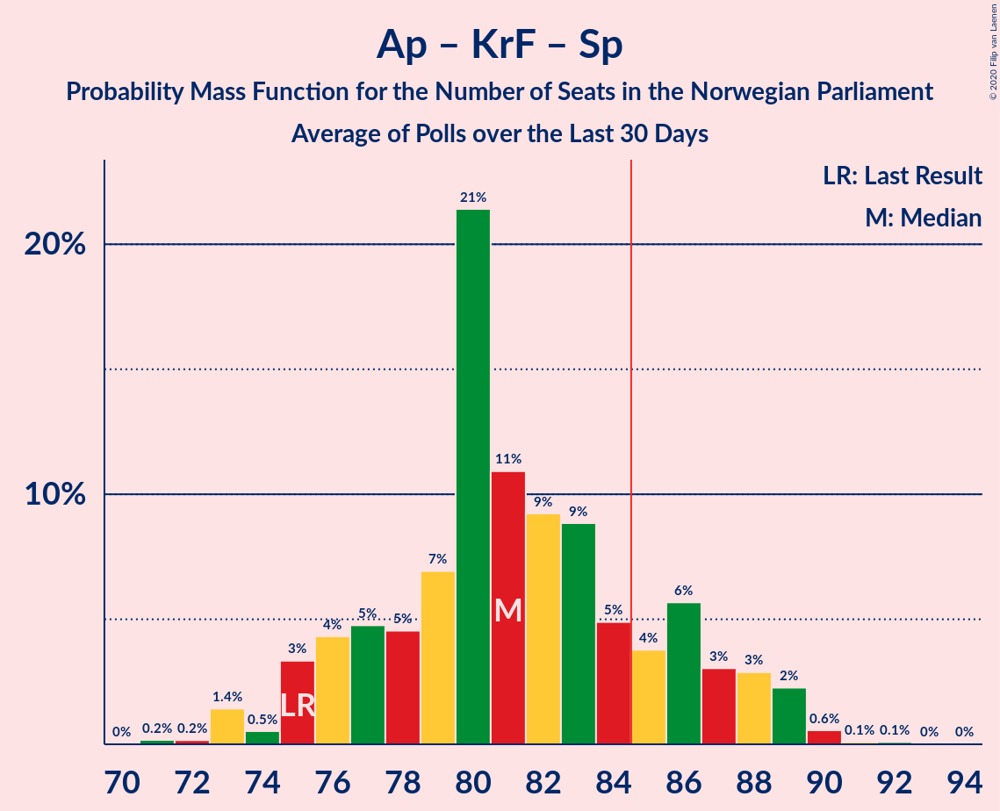
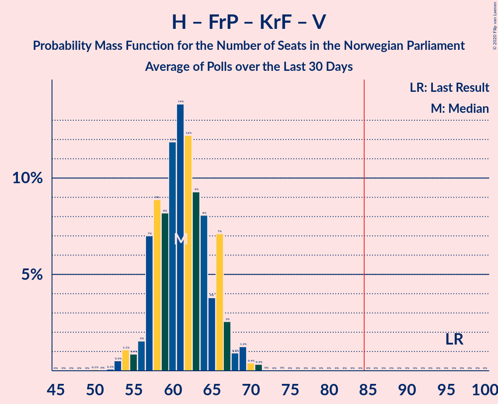
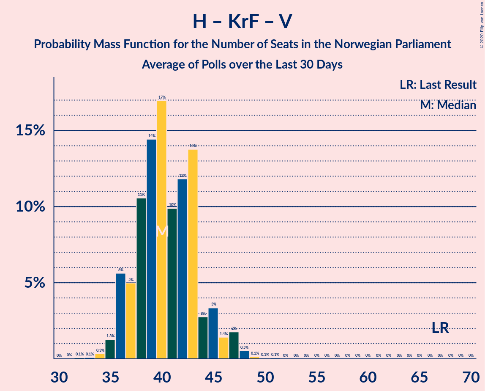
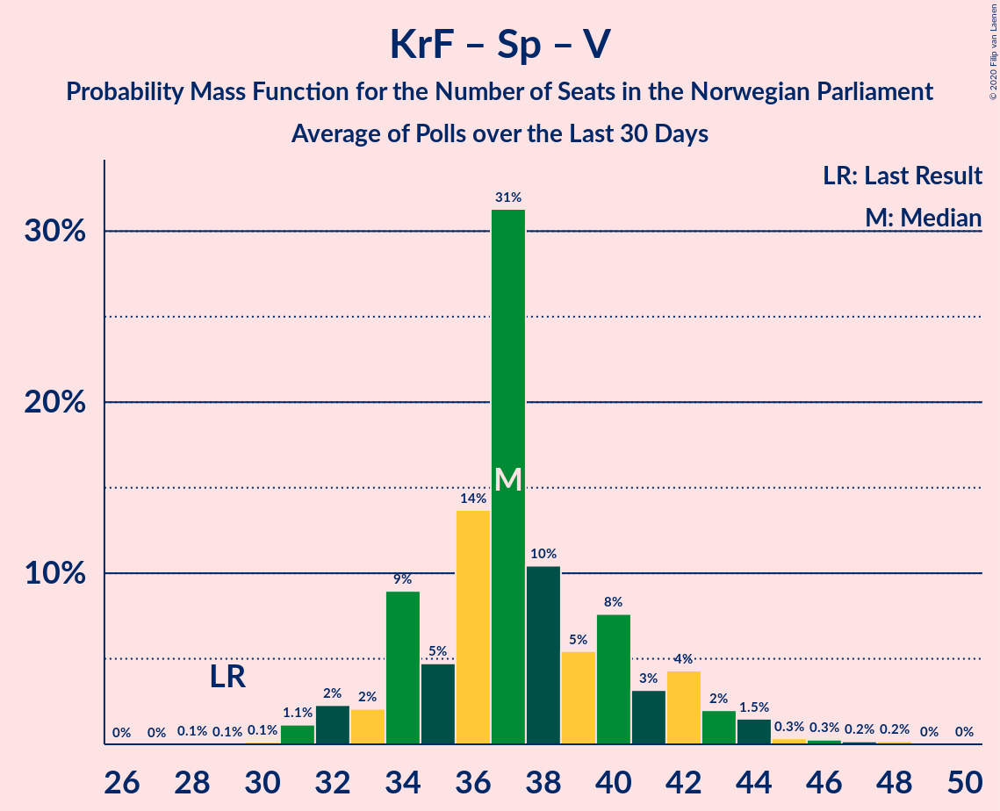

# Poll Average

<a href="#voting-intentions">Voting Intentions</a> | <a href="#seats">Seats</a> | <a href="#coalitions">Coalitions</a> | <a href="#technical-information">Technical Information</a>

## Summary

The table below lists the polls on which the average is based. They are the most recent polls (less than 30 days old) registered and analyzed so far.

| Period     | Polling firm/Commissioner(s) | Ap | H | FrP | KrF | Sp | V | SV | MDG | R |
|:----------:|:----------------------------:|:--:|:--:|:--:|:--:|:--:|:--:|:--:|:--:|:--:|
| 8–9 September 2013 | General Election | 30.8%   55 | 26.8%   48 | 16.3%   29 | 5.6%   10 | 5.5%   10 | 5.2%   9 | 4.1%   7 | 2.8%   1 | 1.1%   0 |
| N/A | Poll Average | 23–28%   41–52 | 18–24%   33–42 | 10–14%   17–25 | 2–4%   0–3 | 16–21%   30–39 | 2–4%   1–7 | 6–9%   10–16 | 4–6%   1–11 | 4–6%   2–11 |
| [9–15 December 2019](2019-12-15-Norstat.html) | Norstat | 23–28%   41–52 | 18–24%   33–42 | 10–14%   17–25 | 2–4%   0–3 | 16–21%   30–39 | 2–4%   1–7 | 6–9%   10–16 | 3–6%   1–11 | 3–6%   2–11 |
| [3–8 December 2019](2019-12-08-OpinionPerduco.html) | Opinion Perduco | N/A   N/A | N/A   N/A | N/A   N/A | N/A   N/A | N/A   N/A | N/A   N/A | N/A   N/A | N/A   N/A | N/A   N/A |
| [3–4 December 2019](2019-12-04-Norfakta.html) | Norfakta | N/A   N/A | N/A   N/A | N/A   N/A | N/A   N/A | N/A   N/A | N/A   N/A | N/A   N/A | N/A   N/A | N/A   N/A |
| [28 November–2 December 2019](2019-12-02-ResponsAnalyse.html) | Respons Analyse | N/A   N/A | N/A   N/A | N/A   N/A | N/A   N/A | N/A   N/A | N/A   N/A | N/A   N/A | N/A   N/A | N/A   N/A |
| 8–9 September 2013 | General Election | 30.8%   55 | 26.8%   48 | 16.3%   29 | 5.6%   10 | 5.5%   10 | 5.2%   9 | 4.1%   7 | 2.8%   1 | 1.1%   0 |

Only polls for which at least the sample size has been published are included in the table above.

**Legend:**
+ **Top half of each row:** Voting intentions (95% confidence interval)
+ **Bottom half of each row:** Seat projections for the Norwegian Parliament (95% confidence interval)
+ **Ap:** Arbeiderpartiet
+ **H:** Høyre
+ **FrP:** Fremskrittspartiet
+ **KrF:** Kristelig Folkeparti
+ **Sp:** Senterpartiet
+ **V:** Venstre
+ **SV:** Sosialistisk Venstreparti
+ **MDG:** Miljøpartiet De Grønne
+ **R:** Rødt
+ **N/A (single party):** Party not included the published results
+ **N/A (entire row):** Calculation for this opinion poll not started yet

## Voting Intentions

### Confidence Intervals

| Party | Last Result | Median | 80% Confidence Interval | 90% Confidence Interval | 95% Confidence Interval | 99% Confidence Interval |
|:-----:|:-----------:|:------:|:-----------------------:|:-----------------------:|:-----------------------:|:-----------------------:|
| <a href="#arbeiderpartiet">Arbeiderpartiet</a> | 30.8% | 25.5% | 23.8–27.3% |23.3–27.8% | 22.9–28.3% | 22.1–29.2% |
| <a href="#høyre">Høyre</a> | 26.8% | 20.9% | 19.3–22.6% |18.9–23.1% | 18.5–23.5% | 17.8–24.4% |
| <a href="#fremskrittspartiet">Fremskrittspartiet</a> | 16.3% | 11.9% | 10.6–13.2% |10.2–13.6% | 9.9–14.0% | 9.4–14.6% |
| <a href="#kristelig-folkeparti">Kristelig Folkeparti</a> | 5.6% | 2.7% | 2.1–3.4% |1.9–3.6% | 1.8–3.8% | 1.6–4.2% |
| <a href="#senterpartiet">Senterpartiet</a> | 5.5% | 18.5% | 17.0–20.1% |16.6–20.6% | 16.2–21.0% | 15.5–21.8% |
| <a href="#venstre">Venstre</a> | 5.2% | 3.0% | 2.3–3.7% |2.2–3.9% | 2.0–4.1% | 1.8–4.5% |
| <a href="#sosialistisk-venstreparti">Sosialistisk Venstreparti</a> | 4.1% | 7.2% | 6.2–8.3% |5.9–8.6% | 5.7–8.9% | 5.3–9.4% |
| <a href="#miljøpartiet-de-grønne">Miljøpartiet De Grønne</a> | 2.8% | 4.7% | 3.9–5.6% |3.7–5.8% | 3.5–6.1% | 3.1–6.6% |
| <a href="#rødt">Rødt</a> | 1.1% | 4.7% | 3.9–5.6% |3.7–5.8% | 3.5–6.1% | 3.1–6.6% |

### Arbeiderpartiet

*For a full overview of the results for this party, see the [Arbeiderpartiet](party-arbeiderpartiet.html) page.*

| Voting Intentions | Probability | Accumulated | Special Marks |
|:-----------------:|:-----------:|:-----------:|:-------------:|
| 19.5–20.5% | 0% | 100% |  |
| 20.5–21.5% | 0.1% | 100% |  |
| 21.5–22.5% | 1.2% | 99.9% |  |
| 22.5–23.5% | 6% | 98.7% |  |
| 23.5–24.5% | 17% | 93% |  |
| 24.5–25.5% | 27% | 76% |  |
| 25.5–26.5% | 26% | 50% | Median |
| 26.5–27.5% | 16% | 23% |  |
| 27.5–28.5% | 6% | 7% |  |
| 28.5–29.5% | 1.4% | 2% |  |
| 29.5–30.5% | 0.2% | 0.2% |  |
| 30.5–31.5% | 0% | 0% | Last Result |

### Høyre

*For a full overview of the results for this party, see the [Høyre](party-høyre.html) page.*

| Voting Intentions | Probability | Accumulated | Special Marks |
|:-----------------:|:-----------:|:-----------:|:-------------:|
| 15.5–16.5% | 0% | 100% |  |
| 16.5–17.5% | 0.3% | 100% |  |
| 17.5–18.5% | 2% | 99.7% |  |
| 18.5–19.5% | 11% | 97% |  |
| 19.5–20.5% | 24% | 86% |  |
| 20.5–21.5% | 30% | 62% | Median |
| 21.5–22.5% | 21% | 32% |  |
| 22.5–23.5% | 8% | 11% |  |
| 23.5–24.5% | 2% | 2% |  |
| 24.5–25.5% | 0.3% | 0.3% |  |
| 25.5–26.5% | 0% | 0% |  |
| 26.5–27.5% | 0% | 0% | Last Result |

### Fremskrittspartiet

*For a full overview of the results for this party, see the [Fremskrittspartiet](party-fremskrittspartiet.html) page.*

| Voting Intentions | Probability | Accumulated | Special Marks |
|:-----------------:|:-----------:|:-----------:|:-------------:|
| 7.5–8.5% | 0% | 100% |  |
| 8.5–9.5% | 0.8% | 100% |  |
| 9.5–10.5% | 8% | 99.2% |  |
| 10.5–11.5% | 29% | 91% |  |
| 11.5–12.5% | 36% | 62% | Median |
| 12.5–13.5% | 20% | 25% |  |
| 13.5–14.5% | 5% | 5% |  |
| 14.5–15.5% | 0.6% | 0.6% |  |
| 15.5–16.5% | 0% | 0% | Last Result |

### Kristelig Folkeparti

*For a full overview of the results for this party, see the [Kristelig Folkeparti](party-kristeligfolkeparti.html) page.*

| Voting Intentions | Probability | Accumulated | Special Marks |
|:-----------------:|:-----------:|:-----------:|:-------------:|
| 0.0–0.5% | 0% | 100% |  |
| 0.5–1.5% | 0.5% | 100% |  |
| 1.5–2.5% | 40% | 99.5% |  |
| 2.5–3.5% | 54% | 59% | Median |
| 3.5–4.5% | 6% | 6% |  |
| 4.5–5.5% | 0.1% | 0.1% |  |
| 5.5–6.5% | 0% | 0% | Last Result |

### Senterpartiet

*For a full overview of the results for this party, see the [Senterpartiet](party-senterpartiet.html) page.*

| Voting Intentions | Probability | Accumulated | Special Marks |
|:-----------------:|:-----------:|:-----------:|:-------------:|
| 5.5–6.5% | 0% | 100% | Last Result |
| 6.5–7.5% | 0% | 100% |  |
| 7.5–8.5% | 0% | 100% |  |
| 8.5–9.5% | 0% | 100% |  |
| 9.5–10.5% | 0% | 100% |  |
| 10.5–11.5% | 0% | 100% |  |
| 11.5–12.5% | 0% | 100% |  |
| 12.5–13.5% | 0% | 100% |  |
| 13.5–14.5% | 0% | 100% |  |
| 14.5–15.5% | 0.5% | 100% |  |
| 15.5–16.5% | 4% | 99.5% |  |
| 16.5–17.5% | 16% | 95% |  |
| 17.5–18.5% | 30% | 80% |  |
| 18.5–19.5% | 29% | 50% | Median |
| 19.5–20.5% | 15% | 21% |  |
| 20.5–21.5% | 5% | 6% |  |
| 21.5–22.5% | 0.8% | 0.9% |  |
| 22.5–23.5% | 0.1% | 0.1% |  |
| 23.5–24.5% | 0% | 0% |  |

### Venstre

*For a full overview of the results for this party, see the [Venstre](party-venstre.html) page.*

| Voting Intentions | Probability | Accumulated | Special Marks |
|:-----------------:|:-----------:|:-----------:|:-------------:|
| 0.5–1.5% | 0.1% | 100% |  |
| 1.5–2.5% | 21% | 99.9% |  |
| 2.5–3.5% | 64% | 79% | Median |
| 3.5–4.5% | 15% | 15% |  |
| 4.5–5.5% | 0.5% | 0.5% | Last Result |
| 5.5–6.5% | 0% | 0% |  |

### Sosialistisk Venstreparti

*For a full overview of the results for this party, see the [Sosialistisk Venstreparti](party-sosialistiskvenstreparti.html) page.*

| Voting Intentions | Probability | Accumulated | Special Marks |
|:-----------------:|:-----------:|:-----------:|:-------------:|
| 3.5–4.5% | 0% | 100% | Last Result |
| 4.5–5.5% | 2% | 100% |  |
| 5.5–6.5% | 21% | 98% |  |
| 6.5–7.5% | 46% | 78% | Median |
| 7.5–8.5% | 27% | 32% |  |
| 8.5–9.5% | 5% | 5% |  |
| 9.5–10.5% | 0.3% | 0.4% |  |
| 10.5–11.5% | 0% | 0% |  |

### Miljøpartiet De Grønne

*For a full overview of the results for this party, see the [Miljøpartiet De Grønne](party-miljøpartietdegrønne.html) page.*

| Voting Intentions | Probability | Accumulated | Special Marks |
|:-----------------:|:-----------:|:-----------:|:-------------:|
| 1.5–2.5% | 0% | 100% |  |
| 2.5–3.5% | 3% | 100% | Last Result |
| 3.5–4.5% | 40% | 97% |  |
| 4.5–5.5% | 46% | 56% | Median |
| 5.5–6.5% | 10% | 10% |  |
| 6.5–7.5% | 0.5% | 0.5% |  |
| 7.5–8.5% | 0% | 0% |  |

### Rødt

*For a full overview of the results for this party, see the [Rødt](party-rødt.html) page.*

| Voting Intentions | Probability | Accumulated | Special Marks |
|:-----------------:|:-----------:|:-----------:|:-------------:|
| 0.5–1.5% | 0% | 100% | Last Result |
| 1.5–2.5% | 0% | 100% |  |
| 2.5–3.5% | 3% | 100% |  |
| 3.5–4.5% | 40% | 97% |  |
| 4.5–5.5% | 46% | 56% | Median |
| 5.5–6.5% | 10% | 10% |  |
| 6.5–7.5% | 0.5% | 0.5% |  |
| 7.5–8.5% | 0% | 0% |  |

## Seats

### Confidence Intervals

| Party | Last Result | Median | 80% Confidence Interval | 90% Confidence Interval | 95% Confidence Interval | 99% Confidence Interval |
|:-----:|:-----------:|:------:|:-----------------------:|:-----------------------:|:-----------------------:|:-----------------------:|
| <a href="#arbeiderpartiet">Arbeiderpartiet</a> | 55 | 45 | 43–50 |42–50 | 41–52 | 40–54 |
| <a href="#høyre">Høyre</a> | 48 | 37 | 34–40 |33–41 | 33–42 | 32–44 |
| <a href="#fremskrittspartiet">Fremskrittspartiet</a> | 29 | 21 | 18–24 |18–24 | 17–25 | 17–27 |
| <a href="#kristelig-folkeparti">Kristelig Folkeparti</a> | 10 | 1 | 0–2 |0–3 | 0–3 | 0–7 |
| <a href="#senterpartiet">Senterpartiet</a> | 10 | 34 | 31–37 |30–38 | 30–39 | 28–40 |
| <a href="#venstre">Venstre</a> | 9 | 2 | 1–2 |1–7 | 1–7 | 0–8 |
| <a href="#sosialistisk-venstreparti">Sosialistisk Venstreparti</a> | 7 | 13 | 11–15 |11–15 | 10–16 | 9–17 |
| <a href="#miljøpartiet-de-grønne">Miljøpartiet De Grønne</a> | 1 | 9 | 2–10 |2–11 | 1–11 | 1–12 |
| <a href="#rødt">Rødt</a> | 0 | 8 | 2–10 |2–11 | 2–11 | 2–12 |

### Arbeiderpartiet

*For a full overview of the results for this party, see the [Arbeiderpartiet](party-arbeiderpartiet.html) page.*

| Number of Seats | Probability | Accumulated | Special Marks |
|:---------------:|:-----------:|:-----------:|:-------------:|
| 39 | 0.2% | 100% |  |
| 40 | 2% | 99.8% |  |
| 41 | 2% | 98% |  |
| 42 | 6% | 96% |  |
| 43 | 7% | 90% |  |
| 44 | 15% | 83% |  |
| 45 | 20% | 68% | Median |
| 46 | 14% | 48% |  |
| 47 | 7% | 34% |  |
| 48 | 10% | 27% |  |
| 49 | 5% | 17% |  |
| 50 | 7% | 12% |  |
| 51 | 2% | 5% |  |
| 52 | 0.6% | 3% |  |
| 53 | 0.3% | 2% |  |
| 54 | 2% | 2% |  |
| 55 | 0.1% | 0.1% | Last Result |
| 56 | 0% | 0% |  |

### Høyre

*For a full overview of the results for this party, see the [Høyre](party-høyre.html) page.*

| Number of Seats | Probability | Accumulated | Special Marks |
|:---------------:|:-----------:|:-----------:|:-------------:|
| 29 | 0% | 100% |  |
| 30 | 0.1% | 99.9% |  |
| 31 | 0.3% | 99.8% |  |
| 32 | 2% | 99.6% |  |
| 33 | 5% | 98% |  |
| 34 | 5% | 93% |  |
| 35 | 12% | 88% |  |
| 36 | 11% | 77% |  |
| 37 | 17% | 65% | Median |
| 38 | 18% | 48% |  |
| 39 | 9% | 30% |  |
| 40 | 11% | 21% |  |
| 41 | 5% | 10% |  |
| 42 | 3% | 5% |  |
| 43 | 0.9% | 2% |  |
| 44 | 1.0% | 1.4% |  |
| 45 | 0.3% | 0.4% |  |
| 46 | 0% | 0.1% |  |
| 47 | 0% | 0% |  |
| 48 | 0% | 0% | Last Result |

### Fremskrittspartiet

*For a full overview of the results for this party, see the [Fremskrittspartiet](party-fremskrittspartiet.html) page.*

| Number of Seats | Probability | Accumulated | Special Marks |
|:---------------:|:-----------:|:-----------:|:-------------:|
| 15 | 0.1% | 100% |  |
| 16 | 0.4% | 99.9% |  |
| 17 | 3% | 99.5% |  |
| 18 | 7% | 96% |  |
| 19 | 17% | 89% |  |
| 20 | 19% | 73% |  |
| 21 | 19% | 53% | Median |
| 22 | 11% | 34% |  |
| 23 | 11% | 24% |  |
| 24 | 9% | 13% |  |
| 25 | 2% | 4% |  |
| 26 | 1.2% | 2% |  |
| 27 | 0.4% | 0.5% |  |
| 28 | 0.1% | 0.1% |  |
| 29 | 0% | 0% | Last Result |

### Kristelig Folkeparti

*For a full overview of the results for this party, see the [Kristelig Folkeparti](party-kristeligfolkeparti.html) page.*

| Number of Seats | Probability | Accumulated | Special Marks |
|:---------------:|:-----------:|:-----------:|:-------------:|
| 0 | 17% | 100% |  |
| 1 | 64% | 83% | Median |
| 2 | 12% | 19% |  |
| 3 | 6% | 7% |  |
| 4 | 0% | 1.2% |  |
| 5 | 0% | 1.2% |  |
| 6 | 0% | 1.2% |  |
| 7 | 1.0% | 1.2% |  |
| 8 | 0.2% | 0.2% |  |
| 9 | 0% | 0% |  |
| 10 | 0% | 0% | Last Result |

### Senterpartiet

*For a full overview of the results for this party, see the [Senterpartiet](party-senterpartiet.html) page.*

| Number of Seats | Probability | Accumulated | Special Marks |
|:---------------:|:-----------:|:-----------:|:-------------:|
| 10 | 0% | 100% | Last Result |
| 11 | 0% | 100% |  |
| 12 | 0% | 100% |  |
| 13 | 0% | 100% |  |
| 14 | 0% | 100% |  |
| 15 | 0% | 100% |  |
| 16 | 0% | 100% |  |
| 17 | 0% | 100% |  |
| 18 | 0% | 100% |  |
| 19 | 0% | 100% |  |
| 20 | 0% | 100% |  |
| 21 | 0% | 100% |  |
| 22 | 0% | 100% |  |
| 23 | 0% | 100% |  |
| 24 | 0% | 100% |  |
| 25 | 0% | 100% |  |
| 26 | 0.1% | 100% |  |
| 27 | 0.1% | 99.9% |  |
| 28 | 0.4% | 99.8% |  |
| 29 | 0.7% | 99.3% |  |
| 30 | 5% | 98.6% |  |
| 31 | 9% | 94% |  |
| 32 | 4% | 86% |  |
| 33 | 6% | 82% |  |
| 34 | 32% | 76% | Median |
| 35 | 24% | 44% |  |
| 36 | 10% | 20% |  |
| 37 | 4% | 10% |  |
| 38 | 2% | 7% |  |
| 39 | 3% | 4% |  |
| 40 | 1.1% | 1.5% |  |
| 41 | 0.2% | 0.4% |  |
| 42 | 0.1% | 0.2% |  |
| 43 | 0% | 0.1% |  |
| 44 | 0% | 0% |  |

### Venstre

*For a full overview of the results for this party, see the [Venstre](party-venstre.html) page.*

| Number of Seats | Probability | Accumulated | Special Marks |
|:---------------:|:-----------:|:-----------:|:-------------:|
| 0 | 1.1% | 100% |  |
| 1 | 29% | 98.9% |  |
| 2 | 64% | 70% | Median |
| 3 | 0.1% | 5% |  |
| 4 | 0% | 5% |  |
| 5 | 0% | 5% |  |
| 6 | 0% | 5% |  |
| 7 | 4% | 5% |  |
| 8 | 1.0% | 1.1% |  |
| 9 | 0.1% | 0.1% | Last Result |
| 10 | 0% | 0% |  |

### Sosialistisk Venstreparti

*For a full overview of the results for this party, see the [Sosialistisk Venstreparti](party-sosialistiskvenstreparti.html) page.*

| Number of Seats | Probability | Accumulated | Special Marks |
|:---------------:|:-----------:|:-----------:|:-------------:|
| 7 | 0% | 100% | Last Result |
| 8 | 0% | 100% |  |
| 9 | 0.9% | 99.9% |  |
| 10 | 4% | 99.1% |  |
| 11 | 14% | 95% |  |
| 12 | 19% | 81% |  |
| 13 | 29% | 61% | Median |
| 14 | 17% | 32% |  |
| 15 | 12% | 15% |  |
| 16 | 2% | 3% |  |
| 17 | 0.5% | 0.7% |  |
| 18 | 0.1% | 0.2% |  |
| 19 | 0% | 0% |  |

### Miljøpartiet De Grønne

*For a full overview of the results for this party, see the [Miljøpartiet De Grønne](party-miljøpartietdegrønne.html) page.*

| Number of Seats | Probability | Accumulated | Special Marks |
|:---------------:|:-----------:|:-----------:|:-------------:|
| 1 | 5% | 100% | Last Result |
| 2 | 12% | 95% |  |
| 3 | 10% | 84% |  |
| 4 | 0% | 73% |  |
| 5 | 0% | 73% |  |
| 6 | 0% | 73% |  |
| 7 | 6% | 73% |  |
| 8 | 17% | 67% |  |
| 9 | 25% | 50% | Median |
| 10 | 18% | 25% |  |
| 11 | 7% | 7% |  |
| 12 | 0.5% | 0.5% |  |
| 13 | 0% | 0.1% |  |
| 14 | 0% | 0% |  |

### Rødt

*For a full overview of the results for this party, see the [Rødt](party-rødt.html) page.*

| Number of Seats | Probability | Accumulated | Special Marks |
|:---------------:|:-----------:|:-----------:|:-------------:|
| 0 | 0% | 100% | Last Result |
| 1 | 0.3% | 100% |  |
| 2 | 16% | 99.7% |  |
| 3 | 0% | 84% |  |
| 4 | 0% | 84% |  |
| 5 | 0% | 84% |  |
| 6 | 0% | 84% |  |
| 7 | 13% | 84% |  |
| 8 | 37% | 71% | Median |
| 9 | 18% | 34% |  |
| 10 | 10% | 16% |  |
| 11 | 5% | 6% |  |
| 12 | 0.6% | 0.8% |  |
| 13 | 0.2% | 0.2% |  |
| 14 | 0% | 0% |  |

## Coalitions

### Confidence Intervals

| Coalition | Last Result | Median | Majority? | 80% Confidence Interval | 90% Confidence Interval | 95% Confidence Interval | 99% Confidence Interval |
|:---------:|:-----------:|:------:|:---------:|:-----------------------:|:-----------------------:|:-----------------------:|:-----------------------:|
| Arbeiderpartiet – Senterpartiet – Sosialistisk Venstreparti – Miljøpartiet De Grønne – Rødt | 73 | 108 | 100% | 103–112 | 102–112 | 101–114 | 99–116 |
| Arbeiderpartiet – Kristelig Folkeparti – Senterpartiet – Sosialistisk Venstreparti – Miljøpartiet De Grønne | 83 | 102 | 100% | 97–105 | 96–107 | 95–107 | 92–110 |
| Arbeiderpartiet – Senterpartiet – Sosialistisk Venstreparti – Rødt | 72 | 100 | 100% | 95–105 | 93–107 | 93–107 | 91–109 |
| Arbeiderpartiet – Senterpartiet – Sosialistisk Venstreparti – Miljøpartiet De Grønne | 73 | 100 | 100% | 96–104 | 95–105 | 94–106 | 91–108 |
| Høyre – Fremskrittspartiet – Kristelig Folkeparti – Senterpartiet – Venstre | 106 | 96 | 100% | 91–99 | 90–101 | 90–102 | 88–104 |
| Arbeiderpartiet – Senterpartiet – Sosialistisk Venstreparti | 72 | 92 | 99.1% | 89–97 | 87–99 | 86–100 | 83–102 |
| Arbeiderpartiet – Kristelig Folkeparti – Senterpartiet – Miljøpartiet De Grønne | 76 | 89 | 84% | 84–92 | 83–94 | 82–95 | 80–97 |
| Arbeiderpartiet – Kristelig Folkeparti – Senterpartiet | 75 | 81 | 18% | 76–86 | 75–88 | 75–89 | 73–90 |
| Arbeiderpartiet – Senterpartiet | 65 | 80 | 11% | 76–85 | 75–86 | 74–87 | 71–89 |
| Høyre – Fremskrittspartiet – Kristelig Folkeparti – Venstre – Miljøpartiet De Grønne | 97 | 69 | 0% | 64–74 | 62–76 | 62–76 | 60–78 |
| Høyre – Fremskrittspartiet – Kristelig Folkeparti – Venstre | 96 | 61 | 0% | 57–66 | 57–67 | 55–68 | 53–70 |
| Høyre – Fremskrittspartiet – Venstre | 86 | 60 | 0% | 56–65 | 55–65 | 54–67 | 52–69 |
| Arbeiderpartiet – Sosialistisk Venstreparti | 62 | 58 | 0% | 55–63 | 54–64 | 53–65 | 52–68 |
| Høyre – Fremskrittspartiet | 77 | 58 | 0% | 54–62 | 53–64 | 52–65 | 51–67 |
| Høyre – Kristelig Folkeparti – Venstre | 67 | 40 | 0% | 37–44 | 36–45 | 36–47 | 34–48 |
| Kristelig Folkeparti – Senterpartiet – Venstre | 29 | 37 | 0% | 34–41 | 33–42 | 32–44 | 31–46 |

### Arbeiderpartiet – Senterpartiet – Sosialistisk Venstreparti – Miljøpartiet De Grønne – Rødt

| Number of Seats | Probability | Accumulated | Special Marks |
|:---------------:|:-----------:|:-----------:|:-------------:|
| 73 | 0% | 100% | Last Result |
| 74 | 0% | 100% |  |
| 75 | 0% | 100% |  |
| 76 | 0% | 100% |  |
| 77 | 0% | 100% |  |
| 78 | 0% | 100% |  |
| 79 | 0% | 100% |  |
| 80 | 0% | 100% |  |
| 81 | 0% | 100% |  |
| 82 | 0% | 100% |  |
| 83 | 0% | 100% |  |
| 84 | 0% | 100% |  |
| 85 | 0% | 100% | Majority |
| 86 | 0% | 100% |  |
| 87 | 0% | 100% |  |
| 88 | 0% | 100% |  |
| 89 | 0% | 100% |  |
| 90 | 0% | 100% |  |
| 91 | 0% | 100% |  |
| 92 | 0% | 100% |  |
| 93 | 0% | 100% |  |
| 94 | 0% | 100% |  |
| 95 | 0% | 100% |  |
| 96 | 0% | 100% |  |
| 97 | 0% | 99.9% |  |
| 98 | 0.3% | 99.9% |  |
| 99 | 0.4% | 99.6% |  |
| 100 | 1.2% | 99.2% |  |
| 101 | 0.9% | 98% |  |
| 102 | 3% | 97% |  |
| 103 | 7% | 94% |  |
| 104 | 4% | 87% |  |
| 105 | 8% | 84% |  |
| 106 | 9% | 75% |  |
| 107 | 12% | 66% |  |
| 108 | 14% | 54% |  |
| 109 | 12% | 40% | Median |
| 110 | 8% | 28% |  |
| 111 | 9% | 20% |  |
| 112 | 7% | 11% |  |
| 113 | 2% | 4% |  |
| 114 | 0.9% | 3% |  |
| 115 | 1.1% | 2% |  |
| 116 | 0.5% | 0.7% |  |
| 117 | 0.1% | 0.2% |  |
| 118 | 0% | 0.1% |  |
| 119 | 0.1% | 0.1% |  |
| 120 | 0% | 0% |  |

### Arbeiderpartiet – Kristelig Folkeparti – Senterpartiet – Sosialistisk Venstreparti – Miljøpartiet De Grønne

| Number of Seats | Probability | Accumulated | Special Marks |
|:---------------:|:-----------:|:-----------:|:-------------:|
| 83 | 0% | 100% | Last Result |
| 84 | 0% | 100% |  |
| 85 | 0% | 100% | Majority |
| 86 | 0% | 100% |  |
| 87 | 0% | 100% |  |
| 88 | 0% | 100% |  |
| 89 | 0% | 100% |  |
| 90 | 0% | 100% |  |
| 91 | 0.3% | 100% |  |
| 92 | 0.3% | 99.6% |  |
| 93 | 0.5% | 99.4% |  |
| 94 | 0.7% | 98.9% |  |
| 95 | 1.3% | 98% |  |
| 96 | 3% | 97% |  |
| 97 | 9% | 94% |  |
| 98 | 7% | 85% |  |
| 99 | 6% | 77% |  |
| 100 | 5% | 71% |  |
| 101 | 14% | 67% |  |
| 102 | 22% | 53% | Median |
| 103 | 6% | 31% |  |
| 104 | 8% | 24% |  |
| 105 | 8% | 16% |  |
| 106 | 3% | 9% |  |
| 107 | 3% | 5% |  |
| 108 | 1.1% | 2% |  |
| 109 | 0.7% | 1.2% |  |
| 110 | 0.2% | 0.5% |  |
| 111 | 0.1% | 0.3% |  |
| 112 | 0.1% | 0.2% |  |
| 113 | 0.1% | 0.1% |  |
| 114 | 0% | 0% |  |

### Arbeiderpartiet – Senterpartiet – Sosialistisk Venstreparti – Rødt

| Number of Seats | Probability | Accumulated | Special Marks |
|:---------------:|:-----------:|:-----------:|:-------------:|
| 72 | 0% | 100% | Last Result |
| 73 | 0% | 100% |  |
| 74 | 0% | 100% |  |
| 75 | 0% | 100% |  |
| 76 | 0% | 100% |  |
| 77 | 0% | 100% |  |
| 78 | 0% | 100% |  |
| 79 | 0% | 100% |  |
| 80 | 0% | 100% |  |
| 81 | 0% | 100% |  |
| 82 | 0% | 100% |  |
| 83 | 0% | 100% |  |
| 84 | 0% | 100% |  |
| 85 | 0% | 100% | Majority |
| 86 | 0% | 100% |  |
| 87 | 0% | 100% |  |
| 88 | 0% | 100% |  |
| 89 | 0% | 100% |  |
| 90 | 0.3% | 99.9% |  |
| 91 | 1.0% | 99.6% |  |
| 92 | 0.6% | 98.5% |  |
| 93 | 4% | 98% |  |
| 94 | 3% | 94% |  |
| 95 | 3% | 91% |  |
| 96 | 3% | 87% |  |
| 97 | 9% | 84% |  |
| 98 | 10% | 75% |  |
| 99 | 3% | 66% |  |
| 100 | 17% | 62% | Median |
| 101 | 6% | 45% |  |
| 102 | 4% | 39% |  |
| 103 | 6% | 34% |  |
| 104 | 9% | 28% |  |
| 105 | 10% | 19% |  |
| 106 | 3% | 9% |  |
| 107 | 4% | 7% |  |
| 108 | 0.6% | 2% |  |
| 109 | 2% | 2% |  |
| 110 | 0.1% | 0.1% |  |
| 111 | 0% | 0% |  |

### Arbeiderpartiet – Senterpartiet – Sosialistisk Venstreparti – Miljøpartiet De Grønne

| Number of Seats | Probability | Accumulated | Special Marks |
|:---------------:|:-----------:|:-----------:|:-------------:|
| 73 | 0% | 100% | Last Result |
| 74 | 0% | 100% |  |
| 75 | 0% | 100% |  |
| 76 | 0% | 100% |  |
| 77 | 0% | 100% |  |
| 78 | 0% | 100% |  |
| 79 | 0% | 100% |  |
| 80 | 0% | 100% |  |
| 81 | 0% | 100% |  |
| 82 | 0% | 100% |  |
| 83 | 0% | 100% |  |
| 84 | 0% | 100% |  |
| 85 | 0% | 100% | Majority |
| 86 | 0% | 100% |  |
| 87 | 0% | 100% |  |
| 88 | 0% | 100% |  |
| 89 | 0% | 100% |  |
| 90 | 0.3% | 99.9% |  |
| 91 | 0.2% | 99.6% |  |
| 92 | 0.9% | 99.4% |  |
| 93 | 0.5% | 98.5% |  |
| 94 | 1.3% | 98% |  |
| 95 | 6% | 97% |  |
| 96 | 2% | 91% |  |
| 97 | 14% | 89% |  |
| 98 | 4% | 74% |  |
| 99 | 5% | 71% |  |
| 100 | 17% | 66% |  |
| 101 | 17% | 49% | Median |
| 102 | 9% | 32% |  |
| 103 | 7% | 23% |  |
| 104 | 9% | 16% |  |
| 105 | 4% | 7% |  |
| 106 | 0.8% | 3% |  |
| 107 | 1.2% | 2% |  |
| 108 | 0.7% | 1.1% |  |
| 109 | 0.2% | 0.4% |  |
| 110 | 0.1% | 0.2% |  |
| 111 | 0.1% | 0.2% |  |
| 112 | 0.1% | 0.1% |  |
| 113 | 0% | 0% |  |

### Høyre – Fremskrittspartiet – Kristelig Folkeparti – Senterpartiet – Venstre

| Number of Seats | Probability | Accumulated | Special Marks |
|:---------------:|:-----------:|:-----------:|:-------------:|
| 86 | 0.1% | 100% |  |
| 87 | 0.2% | 99.9% |  |
| 88 | 0.3% | 99.7% |  |
| 89 | 0.8% | 99.3% |  |
| 90 | 6% | 98.6% |  |
| 91 | 4% | 93% |  |
| 92 | 8% | 89% |  |
| 93 | 6% | 81% |  |
| 94 | 8% | 75% |  |
| 95 | 17% | 67% | Median |
| 96 | 13% | 50% |  |
| 97 | 10% | 37% |  |
| 98 | 11% | 27% |  |
| 99 | 7% | 17% |  |
| 100 | 3% | 10% |  |
| 101 | 3% | 7% |  |
| 102 | 2% | 4% |  |
| 103 | 1.2% | 2% |  |
| 104 | 0.4% | 0.8% |  |
| 105 | 0.2% | 0.5% |  |
| 106 | 0.1% | 0.2% | Last Result |
| 107 | 0% | 0.1% |  |
| 108 | 0% | 0% |  |

### Arbeiderpartiet – Senterpartiet – Sosialistisk Venstreparti

| Number of Seats | Probability | Accumulated | Special Marks |
|:---------------:|:-----------:|:-----------:|:-------------:|
| 72 | 0% | 100% | Last Result |
| 73 | 0% | 100% |  |
| 74 | 0% | 100% |  |
| 75 | 0% | 100% |  |
| 76 | 0% | 100% |  |
| 77 | 0% | 100% |  |
| 78 | 0% | 100% |  |
| 79 | 0% | 100% |  |
| 80 | 0% | 100% |  |
| 81 | 0.1% | 100% |  |
| 82 | 0.1% | 99.9% |  |
| 83 | 0.4% | 99.8% |  |
| 84 | 0.4% | 99.4% |  |
| 85 | 0.4% | 99.1% | Majority |
| 86 | 3% | 98.6% |  |
| 87 | 2% | 96% |  |
| 88 | 3% | 94% |  |
| 89 | 7% | 91% |  |
| 90 | 5% | 84% |  |
| 91 | 13% | 80% |  |
| 92 | 17% | 67% | Median |
| 93 | 8% | 50% |  |
| 94 | 9% | 41% |  |
| 95 | 12% | 33% |  |
| 96 | 4% | 21% |  |
| 97 | 9% | 17% |  |
| 98 | 3% | 9% |  |
| 99 | 1.1% | 6% |  |
| 100 | 2% | 5% |  |
| 101 | 0.7% | 2% |  |
| 102 | 2% | 2% |  |
| 103 | 0.1% | 0.3% |  |
| 104 | 0.1% | 0.2% |  |
| 105 | 0.1% | 0.1% |  |
| 106 | 0% | 0% |  |

### Arbeiderpartiet – Kristelig Folkeparti – Senterpartiet – Miljøpartiet De Grønne

| Number of Seats | Probability | Accumulated | Special Marks |
|:---------------:|:-----------:|:-----------:|:-------------:|
| 76 | 0% | 100% | Last Result |
| 77 | 0% | 100% |  |
| 78 | 0.3% | 100% |  |
| 79 | 0.1% | 99.7% |  |
| 80 | 0.2% | 99.6% |  |
| 81 | 1.0% | 99.3% |  |
| 82 | 2% | 98% |  |
| 83 | 2% | 96% |  |
| 84 | 10% | 94% |  |
| 85 | 3% | 84% | Majority |
| 86 | 7% | 81% |  |
| 87 | 9% | 73% |  |
| 88 | 7% | 64% |  |
| 89 | 24% | 57% | Median |
| 90 | 8% | 33% |  |
| 91 | 9% | 25% |  |
| 92 | 7% | 16% |  |
| 93 | 3% | 9% |  |
| 94 | 3% | 6% |  |
| 95 | 1.2% | 3% |  |
| 96 | 1.3% | 2% |  |
| 97 | 0.5% | 0.9% |  |
| 98 | 0.1% | 0.4% |  |
| 99 | 0.2% | 0.3% |  |
| 100 | 0% | 0.1% |  |
| 101 | 0% | 0% |  |

### Arbeiderpartiet – Kristelig Folkeparti – Senterpartiet

| Number of Seats | Probability | Accumulated | Special Marks |
|:---------------:|:-----------:|:-----------:|:-------------:|
| 71 | 0.2% | 100% |  |
| 72 | 0.2% | 99.8% |  |
| 73 | 1.4% | 99.6% |  |
| 74 | 0.5% | 98% |  |
| 75 | 3% | 98% | Last Result |
| 76 | 4% | 94% |  |
| 77 | 5% | 90% |  |
| 78 | 5% | 85% |  |
| 79 | 7% | 81% |  |
| 80 | 21% | 74% | Median |
| 81 | 11% | 52% |  |
| 82 | 9% | 41% |  |
| 83 | 9% | 32% |  |
| 84 | 5% | 23% |  |
| 85 | 4% | 18% | Majority |
| 86 | 6% | 15% |  |
| 87 | 3% | 9% |  |
| 88 | 3% | 6% |  |
| 89 | 2% | 3% |  |
| 90 | 0.6% | 0.8% |  |
| 91 | 0.1% | 0.2% |  |
| 92 | 0.1% | 0.1% |  |
| 93 | 0% | 0.1% |  |
| 94 | 0% | 0% |  |

### Arbeiderpartiet – Senterpartiet

| Number of Seats | Probability | Accumulated | Special Marks |
|:---------------:|:-----------:|:-----------:|:-------------:|
| 65 | 0% | 100% | Last Result |
| 66 | 0% | 100% |  |
| 67 | 0% | 100% |  |
| 68 | 0% | 100% |  |
| 69 | 0% | 100% |  |
| 70 | 0.2% | 100% |  |
| 71 | 0.6% | 99.8% |  |
| 72 | 1.1% | 99.2% |  |
| 73 | 0.4% | 98% |  |
| 74 | 2% | 98% |  |
| 75 | 3% | 95% |  |
| 76 | 7% | 93% |  |
| 77 | 4% | 86% |  |
| 78 | 8% | 81% |  |
| 79 | 21% | 74% | Median |
| 80 | 13% | 53% |  |
| 81 | 11% | 40% |  |
| 82 | 8% | 29% |  |
| 83 | 6% | 21% |  |
| 84 | 4% | 15% |  |
| 85 | 3% | 11% | Majority |
| 86 | 4% | 8% |  |
| 87 | 1.0% | 3% |  |
| 88 | 2% | 2% |  |
| 89 | 0.3% | 0.5% |  |
| 90 | 0.1% | 0.2% |  |
| 91 | 0.1% | 0.1% |  |
| 92 | 0% | 0% |  |

### Høyre – Fremskrittspartiet – Kristelig Folkeparti – Venstre – Miljøpartiet De Grønne

| Number of Seats | Probability | Accumulated | Special Marks |
|:---------------:|:-----------:|:-----------:|:-------------:|
| 59 | 0.1% | 100% |  |
| 60 | 2% | 99.9% |  |
| 61 | 0.6% | 98% |  |
| 62 | 4% | 98% |  |
| 63 | 3% | 93% |  |
| 64 | 10% | 91% |  |
| 65 | 9% | 81% |  |
| 66 | 6% | 72% |  |
| 67 | 4% | 66% |  |
| 68 | 6% | 61% |  |
| 69 | 17% | 55% |  |
| 70 | 3% | 38% | Median |
| 71 | 10% | 34% |  |
| 72 | 9% | 25% |  |
| 73 | 3% | 16% |  |
| 74 | 3% | 13% |  |
| 75 | 3% | 9% |  |
| 76 | 4% | 6% |  |
| 77 | 0.6% | 2% |  |
| 78 | 1.0% | 1.5% |  |
| 79 | 0.3% | 0.4% |  |
| 80 | 0% | 0.1% |  |
| 81 | 0% | 0% |  |
| 82 | 0% | 0% |  |
| 83 | 0% | 0% |  |
| 84 | 0% | 0% |  |
| 85 | 0% | 0% | Majority |
| 86 | 0% | 0% |  |
| 87 | 0% | 0% |  |
| 88 | 0% | 0% |  |
| 89 | 0% | 0% |  |
| 90 | 0% | 0% |  |
| 91 | 0% | 0% |  |
| 92 | 0% | 0% |  |
| 93 | 0% | 0% |  |
| 94 | 0% | 0% |  |
| 95 | 0% | 0% |  |
| 96 | 0% | 0% |  |
| 97 | 0% | 0% | Last Result |

### Høyre – Fremskrittspartiet – Kristelig Folkeparti – Venstre

| Number of Seats | Probability | Accumulated | Special Marks |
|:---------------:|:-----------:|:-----------:|:-------------:|
| 50 | 0.1% | 100% |  |
| 51 | 0% | 99.9% |  |
| 52 | 0.1% | 99.9% |  |
| 53 | 0.5% | 99.8% |  |
| 54 | 1.1% | 99.3% |  |
| 55 | 0.9% | 98% |  |
| 56 | 2% | 97% |  |
| 57 | 7% | 96% |  |
| 58 | 9% | 89% |  |
| 59 | 8% | 80% |  |
| 60 | 12% | 72% |  |
| 61 | 14% | 60% | Median |
| 62 | 12% | 46% |  |
| 63 | 9% | 34% |  |
| 64 | 8% | 25% |  |
| 65 | 4% | 16% |  |
| 66 | 7% | 13% |  |
| 67 | 3% | 6% |  |
| 68 | 0.9% | 3% |  |
| 69 | 1.2% | 2% |  |
| 70 | 0.4% | 0.8% |  |
| 71 | 0.3% | 0.4% |  |
| 72 | 0% | 0.1% |  |
| 73 | 0% | 0.1% |  |
| 74 | 0% | 0% |  |
| 75 | 0% | 0% |  |
| 76 | 0% | 0% |  |
| 77 | 0% | 0% |  |
| 78 | 0% | 0% |  |
| 79 | 0% | 0% |  |
| 80 | 0% | 0% |  |
| 81 | 0% | 0% |  |
| 82 | 0% | 0% |  |
| 83 | 0% | 0% |  |
| 84 | 0% | 0% |  |
| 85 | 0% | 0% | Majority |
| 86 | 0% | 0% |  |
| 87 | 0% | 0% |  |
| 88 | 0% | 0% |  |
| 89 | 0% | 0% |  |
| 90 | 0% | 0% |  |
| 91 | 0% | 0% |  |
| 92 | 0% | 0% |  |
| 93 | 0% | 0% |  |
| 94 | 0% | 0% |  |
| 95 | 0% | 0% |  |
| 96 | 0% | 0% | Last Result |

### Høyre – Fremskrittspartiet – Venstre

| Number of Seats | Probability | Accumulated | Special Marks |
|:---------------:|:-----------:|:-----------:|:-------------:|
| 50 | 0.1% | 100% |  |
| 51 | 0.1% | 99.9% |  |
| 52 | 0.5% | 99.8% |  |
| 53 | 1.2% | 99.3% |  |
| 54 | 2% | 98% |  |
| 55 | 2% | 96% |  |
| 56 | 6% | 94% |  |
| 57 | 10% | 88% |  |
| 58 | 6% | 78% |  |
| 59 | 17% | 73% |  |
| 60 | 12% | 56% | Median |
| 61 | 11% | 44% |  |
| 62 | 8% | 33% |  |
| 63 | 7% | 24% |  |
| 64 | 6% | 18% |  |
| 65 | 7% | 11% |  |
| 66 | 2% | 5% |  |
| 67 | 1.2% | 3% |  |
| 68 | 1.3% | 2% |  |
| 69 | 0.3% | 0.7% |  |
| 70 | 0.3% | 0.4% |  |
| 71 | 0.1% | 0.1% |  |
| 72 | 0% | 0% |  |
| 73 | 0% | 0% |  |
| 74 | 0% | 0% |  |
| 75 | 0% | 0% |  |
| 76 | 0% | 0% |  |
| 77 | 0% | 0% |  |
| 78 | 0% | 0% |  |
| 79 | 0% | 0% |  |
| 80 | 0% | 0% |  |
| 81 | 0% | 0% |  |
| 82 | 0% | 0% |  |
| 83 | 0% | 0% |  |
| 84 | 0% | 0% |  |
| 85 | 0% | 0% | Majority |
| 86 | 0% | 0% | Last Result |

### Arbeiderpartiet – Sosialistisk Venstreparti

| Number of Seats | Probability | Accumulated | Special Marks |
|:---------------:|:-----------:|:-----------:|:-------------:|
| 50 | 0.1% | 100% |  |
| 51 | 0.2% | 99.9% |  |
| 52 | 0.4% | 99.7% |  |
| 53 | 2% | 99.3% |  |
| 54 | 2% | 97% |  |
| 55 | 9% | 95% |  |
| 56 | 6% | 85% |  |
| 57 | 22% | 79% |  |
| 58 | 9% | 57% | Median |
| 59 | 10% | 47% |  |
| 60 | 10% | 37% |  |
| 61 | 8% | 28% |  |
| 62 | 6% | 20% | Last Result |
| 63 | 7% | 14% |  |
| 64 | 3% | 7% |  |
| 65 | 2% | 4% |  |
| 66 | 0.5% | 2% |  |
| 67 | 0.6% | 2% |  |
| 68 | 1.2% | 1.3% |  |
| 69 | 0% | 0.1% |  |
| 70 | 0% | 0% |  |

### Høyre – Fremskrittspartiet

| Number of Seats | Probability | Accumulated | Special Marks |
|:---------------:|:-----------:|:-----------:|:-------------:|
| 48 | 0% | 100% |  |
| 49 | 0.2% | 99.9% |  |
| 50 | 0.3% | 99.8% |  |
| 51 | 1.4% | 99.5% |  |
| 52 | 2% | 98% |  |
| 53 | 2% | 96% |  |
| 54 | 5% | 94% |  |
| 55 | 7% | 89% |  |
| 56 | 12% | 82% |  |
| 57 | 7% | 71% |  |
| 58 | 21% | 63% | Median |
| 59 | 12% | 42% |  |
| 60 | 7% | 30% |  |
| 61 | 6% | 23% |  |
| 62 | 7% | 17% |  |
| 63 | 3% | 10% |  |
| 64 | 4% | 7% |  |
| 65 | 1.4% | 3% |  |
| 66 | 0.9% | 2% |  |
| 67 | 0.5% | 0.8% |  |
| 68 | 0.2% | 0.3% |  |
| 69 | 0% | 0.1% |  |
| 70 | 0% | 0% |  |
| 71 | 0% | 0% |  |
| 72 | 0% | 0% |  |
| 73 | 0% | 0% |  |
| 74 | 0% | 0% |  |
| 75 | 0% | 0% |  |
| 76 | 0% | 0% |  |
| 77 | 0% | 0% | Last Result |

### Høyre – Kristelig Folkeparti – Venstre

| Number of Seats | Probability | Accumulated | Special Marks |
|:---------------:|:-----------:|:-----------:|:-------------:|
| 32 | 0.1% | 100% |  |
| 33 | 0.1% | 99.9% |  |
| 34 | 0.3% | 99.8% |  |
| 35 | 1.3% | 99.5% |  |
| 36 | 6% | 98% |  |
| 37 | 5% | 93% |  |
| 38 | 11% | 88% |  |
| 39 | 14% | 77% |  |
| 40 | 17% | 63% | Median |
| 41 | 10% | 46% |  |
| 42 | 12% | 36% |  |
| 43 | 14% | 24% |  |
| 44 | 3% | 10% |  |
| 45 | 3% | 7% |  |
| 46 | 1.4% | 4% |  |
| 47 | 2% | 3% |  |
| 48 | 0.5% | 0.8% |  |
| 49 | 0.1% | 0.3% |  |
| 50 | 0.1% | 0.1% |  |
| 51 | 0.1% | 0.1% |  |
| 52 | 0% | 0% |  |
| 53 | 0% | 0% |  |
| 54 | 0% | 0% |  |
| 55 | 0% | 0% |  |
| 56 | 0% | 0% |  |
| 57 | 0% | 0% |  |
| 58 | 0% | 0% |  |
| 59 | 0% | 0% |  |
| 60 | 0% | 0% |  |
| 61 | 0% | 0% |  |
| 62 | 0% | 0% |  |
| 63 | 0% | 0% |  |
| 64 | 0% | 0% |  |
| 65 | 0% | 0% |  |
| 66 | 0% | 0% |  |
| 67 | 0% | 0% | Last Result |

### Kristelig Folkeparti – Senterpartiet – Venstre

| Number of Seats | Probability | Accumulated | Special Marks |
|:---------------:|:-----------:|:-----------:|:-------------:|
| 28 | 0.1% | 100% |  |
| 29 | 0.1% | 99.9% | Last Result |
| 30 | 0.1% | 99.8% |  |
| 31 | 1.1% | 99.7% |  |
| 32 | 2% | 98.6% |  |
| 33 | 2% | 96% |  |
| 34 | 9% | 94% |  |
| 35 | 5% | 85% |  |
| 36 | 14% | 80% |  |
| 37 | 31% | 67% | Median |
| 38 | 10% | 35% |  |
| 39 | 5% | 25% |  |
| 40 | 8% | 20% |  |
| 41 | 3% | 12% |  |
| 42 | 4% | 9% |  |
| 43 | 2% | 5% |  |
| 44 | 1.5% | 3% |  |
| 45 | 0.3% | 1.0% |  |
| 46 | 0.3% | 0.7% |  |
| 47 | 0.2% | 0.4% |  |
| 48 | 0.2% | 0.2% |  |
| 49 | 0% | 0% |  |

## Technical Information

+ **Number of polls included in this average:** 4
+ **Lowest number of simulations done in a poll included in this average:** 0
+ **Total number of simulations done in the polls included in this average:** 524,288
+ **Error estimate:** 3.08%
